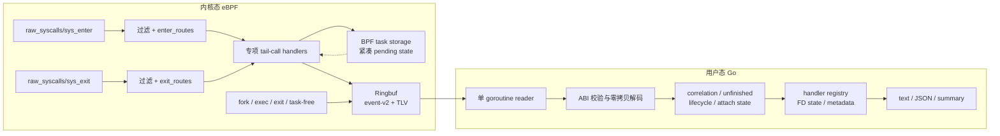

# strace-go

`strace-go` 是一个使用 Go 和 eBPF 实现的 Linux 系统调用追踪器。产品运行时只有一条路径：在 eBPF probe 现场执行有界快照，通过 Ringbuf 发送 event-v2/TLV 事件，再由 Go 单消费者状态机完成关联、解码和输出。

> [!IMPORTANT]
> `strace-go` 不在运行期使用 `ptrace`、`process_vm_readv`、`/proc/<pid>/mem` 或 `/proc/<pid>/fd*` 补读 tracee 状态。它不承诺经典 `strace` 的冻结点内存快照、严格跨任务 stdout/stderr 交错、完整信号 restart 语义或无限长度 payload；这些差异是纯 eBPF 产品边界，而不是兼容模式开关。

## 核心特性

- 纯 eBPF syscall tracing，不暂停 tracee，也不提供 ptrace fallback。
- 一个 `sys_enter` 和一个 `sys_exit` dispatcher，通过 `PROG_ARRAY` 按 syscall ID 路由到专项 tail-call 程序。
- 使用 BPF task storage 保存每个线程的紧凑 enter 状态，配合 fork、exec、exit 和 task-free 生命周期事件。
- 使用版本化 event-v2 header 和 TLV payload 传输字符串、字节、结构体、iovec、socket、cmsg、FD 状态等有界快照。
- Go 侧单 goroutine 同步消费 Ringbuf，维护 enter/exit、unfinished/resumed、生命周期和 attach 状态。
- 文本输出、JSON 事件、summary、FD/path 解码和 BPF 用户栈地址输出。
- 对 Ringbuf reserve/copy failure、payload truncation、pending mismatch、orphan 和 lifecycle map error 进行显式统计。

## 快速开始

## Architecture Support

`strace-go` 当前只支持 Linux native 64-bit syscall ABI：`amd64`（Linux 内核名
`x86_64`）和 `arm64`（Linux 内核名 `aarch64`）。目标选择使用 `ARCH` 显式值，
其次使用 `GOARCH`，最后才使用构建机架构；BPF 两个目标都使用 little-endian
`bpfel`，这与 CPU architecture 是两个独立概念。

| Host/kernel arch | Native 64-bit syscall tracing | Userspace/BPF build | Unit tests | Native semantic tests |
| --- | --- | --- | --- | --- |
| x86_64 / amd64 | Yes | Yes | Yes | amd64 root suite 已验证 |
| aarch64 / arm64 | Yes（需匹配的 arm64 BPF artifact） | Yes | Yes（QEMU userspace） | 当前开发机未执行；需要 privileged ARM64 runner |
| 32-bit compat ABI、x32 | No，启动或事件边界明确拒绝 | — | — | — |
| Other architectures | No，fail fast | No | No | No |

CO-RE 只负责内核 BTF 类型 relocation，不会统一 syscall number、userspace UAPI
layout、compat ABI 或 architecture-specific ioctl。因而 cross build 成功不代表
该架构已经通过 syscall semantic validation。

生成和构建命令：

```bash
make generate-bpf ARCH=amd64
make generate-bpf ARCH=arm64
make build ARCH=amd64
make build ARCH=arm64
make test ARCH=amd64
make test ARCH=arm64 GO_TEST_EXEC=qemu-aarch64
```

`GO_TEST_EXEC` 只用于能执行目标二进制的 userspace runner；它不能加载 ARM64
BPF 到当前 x86_64 内核，也不能替代原生 ARM64 privileged semantic suite。

### 环境要求

- Linux，启用 BTF，并提供本项目使用的 BPF Ringbuf、task storage、dynptr 和 tracing helper。
- Go `1.24.2` 或更高版本。
- 运行追踪通常需要 root；也可以在宿主安全策略允许时配置等价的最小 BPF/tracing capabilities。
- 只有重新生成 BPF 和元数据时才需要 `clang`、LLVM、内核 tracing 数据和系统头文件。

不同内核、发行版和容器环境提供的 BPF helper/capability 不完全相同。项目使用运行时 capability suite 判断可用能力，不以一个内核版本号代替实际探测。

### 初始化依赖

```bash
git submodule update --init --recursive
```

### 使用仓库内已有生成物构建

```bash
go build -o strace-go ./cmd/strace-go
```

### 运行示例

追踪命令：

```bash
sudo ./strace-go -e trace=openat,read,close /bin/ls
```

跟踪子进程并显示 FD 路径：

```bash
sudo ./strace-go -f -yy /bin/sh -c 'printf hello >/tmp/strace-go-example'
```

附加到已有进程：

```bash
sudo ./strace-go -p <PID>
```

输出机器可读的 JSON 事件：

```bash
sudo ./strace-go --event-format=json -e trace=openat /bin/true
```

运行 `./strace-go --help` 查看完整参数。CLI 有意兼容常用 `strace` 选项，但选项名称兼容不表示底层 ptrace 语义等价。

## 架构

### 数据流



### 内核态数据面

1. `raw_syscalls/sys_enter` 和 `raw_syscalls/sys_exit` 先执行 task、syscall 和 FD-state 过滤。
2. dispatcher 以 syscall ID 直接查询 `enter_routes` 或 `exit_routes`，再 tail-call 到对应捕获程序；tail-call 失败时发送最小事件，使失败保持可观测。
3. 专项程序在 probe 现场复制高价值 IN/OUT 参数。复杂 iovec、msg、AIO 和嵌套 FD path 可以由多个有界 fragment 协作完成。
4. enter 阶段把 exit 所需的紧凑元数据写入 BPF task storage；exit 阶段消费后清除有效标记。状态对象随 task 生命周期回收，不依赖全局 TID Hash Map。
5. 事件通过共享 Ringbuf 发往用户态。有限 Ringbuf 在持续过载下允许可观测丢失，不宣称任意负载下绝对无损。

### 事件 ABI

`cmd/generate-event-abi` 是 C/Go 共享 ABI 常量的生成源。生成结果包含 event 类型、flags、header/body 长度、字段偏移和 TLV kind；BPF 端使用静态断言检查结构布局，Go decoder 校验版本、类型、记录大小和 capture length。

payload 只包含 BPF 已经复制的快照：

- 快照完整时，由 `pkg/handler` 和 `pkg/format` 解码。
- 快照被截断时，保留截断事实，不从 tracee 地址空间二次取数。
- 未捕获的指针保留为地址；未知 FD/path 保留为 FD 或已知事件状态。
- `-k` 输出 probe 点捕获的 BPF 用户栈地址，不读取 tracee mapping 或 ELF 进行事后符号化。

### 用户态控制面

CLI 解析、目标启动或 attach、BPF runtime、输出和 cleanup 在 session composition root 中显式组装。运行期策略在读取第一条事件前完成构建，不由 handler 隐式修改。

Ringbuf reader、decoder、状态机、handler 和 renderer 在同一个事件 goroutine 中同步执行。这一设计保持全局事件顺序并让领域状态无锁，但慢 handler 或慢输出也会直接形成消费背压。

用户态状态按职责拆分：

| 状态 owner | 职责 |
| --- | --- |
| syscall correlation | 按 TID 关联 enter、exit 和 fragment |
| unfinished output | 维护 `<unfinished ...>` / `<... resumed>` 输出 |
| task lifecycle | 处理 fork、exec、exit 和进程状态继承 |
| attach state | 判断附加目标是否完成及退出 |
| FD state | 维护事件驱动的 path、offset、cloexec 和 descriptor metadata |

## 输出与语义边界

### 文本输出

默认输出目标是 stderr，也可以使用 `-o FILE`。格式化和常量翻译以经典 `strace` 输出为参考，syscall-specific handler 负责 ioctl、network、epoll、BPF command 等复杂参数。

### JSON 与调试事件

`--event-format=json` 和 `--debug-events` 输出逐行 JSON：

- syscall 事件包含稳定的 `event_version`、`event_type` 和 `event_flags`。
- JSON/debug 通道会请求 enter 事件；普通文本路径可以省略安全可合成的 enter，以降低热路径事件量。
- exit 与 enter 在 Go 侧按 TID 配对，成功时输出 `paired_enter=true`。
- 语义测试使用结构化字段作为 oracle，不解析人类文本来推断 BPF 捕获行为。

### 与经典 strace 的差异

| 维度 | 经典 `strace` | `strace-go` |
| --- | --- | --- |
| 观测机制 | ptrace 停止并检查 tracee | eBPF probe 现场有界快照 |
| tracee 影响 | syscall 边界产生同步停顿 | 异步发送事件，不使用 ptrace reaper |
| 深层/大内存参数 | 可在冻结点继续读取 | 仅解码 BPF 已捕获的有限 payload |
| 跨任务输出顺序 | 由 ptrace stop/restart 驱动 | 由 Ringbuf 事件顺序和单消费者状态机驱动 |
| 权限与平台 | 普通用户可追踪自己拥有的进程 | 需要 Linux eBPF/BTF 和较高 tracing 权限 |
| 数据损失模型 | tracee 被同步阻塞 | 有限 Ringbuf；损失必须通过统计暴露 |

已知不属于纯 eBPF 契约的 upstream exact diff 会标记为 `XFAIL`，例如超大 read/write hexdump、ptrace CPU-time summary 和调度敏感的跨任务交错。意外 `XPASS` 会提示维护者重新审查契约。

## 构建与生成

### 普通构建

仓库提交生成后的 syscall metadata、xlat 表和 bpf2go Go 文件，因此日常构建不需要重新读取宿主内核：

```bash
go build -o strace-go ./cmd/strace-go
```

跨架构构建使用目标参数；不要用 `uname -m` 代替目标选择：

```bash
make build ARCH=arm64       # x86_64 host 也可执行
make test ARCH=arm64 GO_TEST_EXEC=qemu-aarch64
```

### 完整重新生成

```bash
./build.sh
```

> [!WARNING]
> `build.sh` 会先删除现有生成物，再使用 `sudo go generate ./...` 读取宿主 tracing/BTF 数据并重新生成 event ABI、syscall metadata、xlat 表和多个 BPF collection。请只在具备完整生成依赖的 Linux 主机上运行，并在提交前审查所有生成文件差异。

生成链包括：

- `cmd/generate-capture-manifest`：捕获 slot、C/Go program catalog、syscall route、依赖闭包和辅助 roots 的唯一输入；生成 C/Go 合同并支持 `-check` 漂移检查。
- `cmd/generate-event-abi`：生成 C/Go event-v2/TLV ABI 常量。
- `cmd/generate-syscalls`：结合 BTF、tracepoint 信息和显式 override 生成 syscall metadata。
- `cmd/generate-xlats`：从 `strace-upstream` 生成常量翻译表。
- `bpf2go`：编译 core、enter handler families、exit handlers 和 recvmsg handlers。

syscall metadata 的唯一目标输入是项目固定的 `golang.org/x/sys` syscall constants
和项目 semantic catalog；生成器分别写出 `pkg/meta/syscall_table_amd64.go`、
`pkg/meta/syscall_table_arm64.go` 及对应的 BPF `SYS_*` header。BPF dispatcher 的
route map 在生成期按目标表建立，目标不存在的 syscall 不会落到另一个架构的号码。

当前 ABI 合同覆盖 native LP64 的 stat、epoll、termios、open flags、clone 参数和
recvmsg 返回寄存器路径。两架构共同使用 raw syscall tracepoint 的 `id/args[6]/ret`
观察 ABI，因此主 syscall observation path 不依赖 userspace calling convention；
专用 kretprobe 仍使用目标 wrapper。ARM64 的 KVM vCPU exit-reason 解码目前是显式
不支持能力。

## 测试

### 快速 Go 门禁

```bash
go test ./...
go vet ./...
go build -o strace-go ./cmd/strace-go
```

### eBPF 与 upstream 测试

测试 runner 需要 root。已有可执行文件和 upstream 测试产物时，可以使用 `--skip-build`：

```bash
sudo -n python3 test/run_tests.py --suite ebpf-semantic --skip-build
sudo -n python3 test/run_tests.py --suite small --skip-build
sudo -n python3 test/run_tests.py --suite more --filter dup2.gen.test --skip-build
```

suite 按目标分组：

| 分组 | Suite | 作用 |
| --- | --- | --- |
| upstream 参考 | `small`, `more`, `upstream-reference` | 对照选定的 upstream test；exact diff 受纯 eBPF 契约约束 |
| 配置全量 | `all` | 读取 configure 后 Makefile 展开的 `TESTS`，并在运行前一次性构建 upstream test prerequisites |
| 核心语义 | `ebpf-semantic`, `ebpf-no-ptrace` | 校验结构化事件、生命周期和 `TracerPid: 0` |
| BPF capability | `ebpf-capability`, `ebpf-stream`, `ebpf-struct-ops` | 校验低频 BPF command 及宿主能力边界 |
| 性能与完整性 | `ebpf-perf`, `ebpf-capture`, `ebpf-capture-long` | 分离热窗口吞吐、端到端生命周期、Ringbuf 对账和错误计数 |

`ebpf-no-ptrace` 只在独立 fixture 内读取自身 `/proc/self/status` 证明 `TracerPid: 0`；这不允许生产 tracer 使用 procfs 补全 FD、cwd、path 或内存状态。

## 项目结构

```text
strace-go/
├── bpf/                     # eBPF C、运行时 ABI、dispatcher 和专项 capture helpers
├── cmd/
│   ├── generate-capture-manifest/ # 捕获编排 manifest 与 C/Go 合同生成器
│   ├── generate-event-abi/  # C/Go event-v2 与 TLV ABI 生成器
│   ├── generate-syscalls/   # syscall metadata 生成器
│   ├── generate-xlats/      # strace xlat 生成器
│   └── strace-go/           # CLI bootstrap、BPF loader、session 和事件循环
├── pkg/
│   ├── cli/                 # 参数解析
│   ├── event/               # 通用事件与路径过滤接口
│   ├── format/              # Linux 数据结构格式化
│   ├── handler/             # syscall-specific 解码与 registry
│   ├── meta/                # 生成的 syscall/xlat metadata
│   └── stacktrace/          # BPF 用户栈地址处理
├── test/                    # upstream runner、semantic、capability、perf 和 capture suites
├── strace-upstream/         # 上游 strace submodule，作为参考和生成输入
├── doc/
│   ├── arch.md              # 当前架构、关键决策、验证契约和技术债
│   ├── cli-compatibility.md # CLI 兼容性契约和验收矩阵
│   └── upstream-failure-analysis.md # upstream 失败分类和逐项修复路线
├── AGENTS.md                # 仓库开发与验证规则
└── build.sh                 # 完整重新生成并构建
```

## 开发原则

- 保持纯 eBPF 边界，不用 ptrace/procfs/process-vm fallback 掩盖 snapshot 缺口。
- 修改格式或解码行为时，先运行受影响的精确测试，再运行快速 Go 门禁和相关 suite。
- 不直接编辑生成文件；修改生成器输入并审查生成结果。
- 性能报告必须区分 trace-window throughput、端到端 setup/cleanup 成本、Ringbuf accounting 和错误计数。
- 当前架构、关键决策和验证契约见 [`doc/arch.md`](doc/arch.md)。
- upstream 测试失败分析和击破顺序见 [`doc/upstream-failure-analysis.md`](doc/upstream-failure-analysis.md)。
