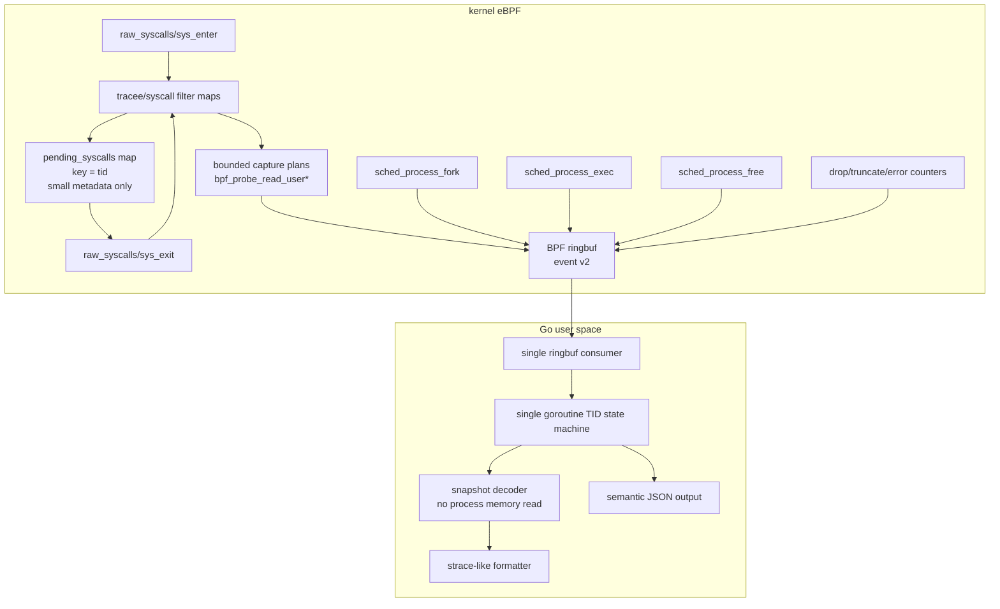

# strace-go pure eBPF architecture plan

本文档面向下一阶段重构：把 `strace-go` 从“eBPF 采样 + 用户态补读 + ptrace 兼容补丁”的混合架构，收敛成一个真正的 Go + eBPF syscall tracer。

核心结论：

- 旧架构问题仍然存在。前一阶段只增加了临时 CLI 分流、JSON 测试输出和语义测试入口，并没有完成内核事件协议、用户态状态机、handler 内存读取模型和生成器的深层重构。
- 最终产品不区分 `compat` 和 `ebpf-fast`。主线只有一条纯 eBPF syscall tracing 路径。
- 运行期 ptrace 必须从产品路径中删除。上游 `strace` 测试只能作为外部参考，不能对应一个 ptrace 兼容模式。
- 目标不是复刻 ptrace 的冻结语义，而是复刻 `strace` 的主要 syscall 观测体验。

## 1. 当前架构问题是否还存在

答案：还存在，而且是结构性存在。

### 1.1 ptrace 依赖仍然没有从主代码彻底断开

旧实现曾经引入过 `--mode=ebpf-fast` 和 `--mode=compat` 这样的临时分流，但最终目标不能保留这种产品模式。历史代码层面存在过两套耦合：

- `cmd/strace-go/session.go` 中 `startAndTraceCmd` 使用 `SysProcAttr{Ptrace: true}`、`PtraceSetOptions` 和 `PtraceCont`。
- `reapTracees()` 以 ptrace wait/reap 模型管理 tracee 停止和继续。
- `pkg/procmem/reader.go` 保留过 `PtracePeekData` 作为最终 fallback。
- 多个 handler 仍通过 `ctx.MemReader.ReadRobust()` 在事件到达用户态后读取 tracee 内存。

这说明目前只是入口上做过分流，共享 handler/decoder 仍然允许走回旧路径。纯 eBPF 重构必须删除这条回路，而不是把它保留为 `compat`。

### 1.2 用户态异步内存读取仍然是根本 TOCTOU

当前 `pkg/event/decoder.go` 的 `DecodeString` 在 BPF buffer 不完整时会 fallback 到 `MemReader.ReadRobust()`。

这在纯 eBPF 模式下不可接受：

- syscall enter/exit 时用户内存状态是当时的状态。
- ringbuf 事件到达 Go 时，tracee 可能已经继续运行、复用 buffer、exec 或退出。
- 用户态再读 `/proc/$pid/mem` / `process_vm_readv` 得到的是“后来状态”，不是 syscall 发生时的快照。

所以纯 eBPF 路径的原则必须是：

> 所有 syscall 参数内存快照只能在 BPF probe 里通过 `bpf_probe_read_user*` 完成。Go 侧不能补读 tracee 内存。

### 1.3 BPF map 中保存大事件对象，吞吐成本过高

当前 `bpf/strace.c` 中：

- `struct bpf_event` 内含大 `str_arg` buffer。
- `heap` 是 per-CPU scratch。
- `events_map` 是普通 HASH map，value 是整个 `struct bpf_event`。
- `sys_enter` 后会 `bpf_map_update_elem(&events_map, &tid, e, BPF_ANY)`。
- `sys_exit` 再从 `events_map` 取回大对象、补 ret/payload、ringbuf 输出并删除。

这个模型的问题：

- 每次 enter 都可能把接近 10KB 的对象复制进 hash map。
- 高频 syscall 下 hash map value copy 会成为主要开销。
- 大 value 会加重 verifier、内存占用和 cache 压力。
- 对于大部分 syscall，enter->exit 需要保存的只是几十字节元数据，不需要保存整个输出事件。

新模型必须把 hash map 缩小成“pending metadata map”，大 payload 只进入 ringbuf。

### 1.4 用户态事件处理不是单协程状态机

Phase 3 之前，`run()` 中有单独 goroutine 读 ringbuf，再通过 `eventChan` 投递给主循环。当前主路径已经切到同一 goroutine 内 `ReadInto -> decode -> handleEvent`。

同时存在全局状态和 mutex：

- `lastSuspendedSyscall` + `lastSuspendedSyscallLock`
- `pendingExecArgs` + `pendingExecArgsLock`
- handler 内还有其他 cache lock

旧模型不是用户提出的“单 goroutine 无锁事件状态机”。对于主线纯 eBPF 实现，事件处理应收敛为：

- 同一个 goroutine 读取 ringbuf、解码、更新 pending map、打印、更新 fd/cwd/lifecycle 状态。
- 不用 mutex 管理 syscall enter/exit 输出状态。
- 允许一个非事件 goroutine 等待目标进程退出，但它不能处理事件，也不能修改 syscall 状态机。

### 1.5 生命周期模型仍然脆弱

当前 BPF 侧已经有 `sched_process_fork`，但 exec/exit/thread 生命周期仍主要靠 raw syscall enter/exit、`pending_exec_map`、`main_exited_map` 等补丁拼接。

这在这些场景下很脆：

- 非 leader thread execve。
- execve 成功后线程组收缩。
- fork/clone/exec/exit storm。
- tracee 退出导致 pending map 清理不完整。
- attach 模式下已有线程和后续 clone 的继承关系。

新模型应把生命周期当成一等事件，而不是 syscall formatter 的副作用。

### 1.6 生成器已经使用 BTF，但仍然不是“BTF 驱动架构”

当前 `cmd/generate-syscalls`：

- 使用 `github.com/cilium/ebpf/btf` 从 `__x64_sys_*`、`__do_sys_*`、`ksys_*` 抽取参数。
- 仍解析 `strace-upstream/src/linux/x86_64/syscallent.h` 作为 syscall id/name/flags 基准。
- 仍有大量 `manualOverrides`。
- `capture_rules.yaml` 手写了大量捕获策略。

这里需要区分两件事：

- syscall 签名可以尽量从 BTF/unistd 生成。
- strace 语义捕获策略不能完全从 BTF 推导。

BTF 能告诉我们参数名和 C 类型，但不能完整告诉我们：

- 哪个指针是 path。
- 哪个 buffer 是 IN，哪个是 OUT。
- buffer 长度来自哪个参数或返回值。
- `ioctl`、`bpf`、`setsockopt`、`msghdr`、`iovec` 等嵌套结构怎么截断。
- 哪些字段应该作为 xlat flags 解码。

因此重构目标应是“禁止手写 syscall 签名”，而不是“禁止任何人工 capture policy”。

## 2. 目标契约

### 2.1 单一路径契约

`strace-go` 的产品路径只有纯 eBPF 实现：

- 禁止运行期 ptrace。
- 禁止 Go 侧读取 tracee 内存。
- 所有用户内存快照只在 BPF probe 中完成。
- syscall enter/exit 都作为事件流的一部分输出给 Go。
- Go 侧使用单 goroutine 状态机做 enter/exit 配对、unfinished/resumed、fd/cwd/lifecycle 更新。
- 输出是 strace-like，不承诺 ptrace-equivalent。
- 上游 `strace` exact diff 只作为兼容参考，不作为主门禁。

### 2.2 旧 ptrace 路径处置契约

旧 ptrace 相关代码不能作为运行时模式继续存在：

- `--mode=compat`、ptrace reaper、ptrace memory fallback 都应进入移除清单。
- 如果迁移阶段需要对照旧行为，只能依赖 git history、临时实验分支或独立测试基线，不能在主产品 CLI 暴露。
- upstream 测试保留为 reference suite，但它运行的对象仍然是纯 eBPF 实现。
- 对 upstream exact diff 不稳定的测试，应降级为 relaxed/semantic assertion 或明确标记为非契约。

### 2.3 明确不支持的 ptrace 等价语义

纯 eBPF 模式不承诺：

- 冻结 tracee 后任意读取用户内存。
- syscall 注入、修改 syscall nr/args/ret。
- ptrace stop 顺序、signal-delivery-stop、group-stop 语义。
- stdout/stderr 与 trace 输出的严格交错。
- 深层可变内存图的无限展开。
- 对所有 upstream `strace` tests 做 byte-for-byte exact diff。

## 3. 目标架构总览



## 4. 内核态设计

### 4.1 BPF event v2

当前 `struct bpf_event` 同时承担：

- pending enter 状态。
- output event。
- payload buffer。
- exec 特殊 snapshot。
- probe 状态。

这导致 map value 巨大且难以演进。新结构应拆分。

建议定义统一 header：

```c
enum event_type {
    EVENT_SYS_ENTER = 1,
    EVENT_SYS_EXIT = 2,
    EVENT_LIFECYCLE = 3,
    EVENT_LOST = 4,
};

struct event_header {
    __u16 version;
    __u16 type;
    __u16 flags;
    __u16 header_len;
    __u32 size;
    __u32 pid;
    __u32 tid;
    __u32 sys_id;
    __u64 seq;
    __u64 ts_ns;
};
```

syscall enter event：

```c
struct syscall_enter_event {
    struct event_header h;
    __s64 ret;
    __s32 probe_ret_enter;
    __s32 probe_ret_exit;
    __u64 args[6];
    __u32 capture_len;
    __u32 capture_flags;
    __u8 payload[];
};
```

syscall exit event：

```c
struct syscall_exit_event {
    struct event_header h;
    __s64 ret;
    __u64 duration_ns;
    __u64 args[6];
    __u32 capture_len;
    __u32 capture_flags;
    __u8 payload[];
};
```

payload 使用 section/TLV，而不是固定 `str_arg`：

```c
enum payload_kind {
    PAYLOAD_STRING = 1,
    PAYLOAD_BYTES = 2,
    PAYLOAD_STRUCT = 3,
    PAYLOAD_IOVEC = 4,
    PAYLOAD_SOCKADDR = 5,
    PAYLOAD_EXEC_ARGS = 6,
};

struct payload_section {
    __u16 kind;
    __u16 arg_index;
    __u16 flags;
    __u16 reserved;
    __u32 user_len;
    __u32 copied_len;
    __s32 probe_ret;
    __u64 user_ptr;
    __u8 data[];
};
```

收益：

- Go 侧可以按 section 解码，不再依赖魔法 offset。
- BPF 可以只输出实际需要的 payload。
- JSON 测试可以直接断言 section。
- 后续新增 syscall capture 不破坏老字段。

### 4.2 map 设计

建议 map：

```c
events: BPF_MAP_TYPE_RINGBUF
tracee_filter: BPF_MAP_TYPE_HASH
syscall_filter: BPF_MAP_TYPE_HASH or ARRAY bitmap
pending_syscalls: BPF_MAP_TYPE_HASH
config_map: BPF_MAP_TYPE_ARRAY
stats_map: BPF_MAP_TYPE_PERCPU_ARRAY
```

`pending_syscalls` value 只保存小元数据：

```c
struct pending_syscall {
    __u32 pid;
    __u32 tid;
    __u32 sys_id;
    __u32 flags;
    __u64 enter_ts_ns;
    __u64 args[6];

    /* bounded pointer metadata for exit capture */
    __u64 out_ptr0;
    __u32 out_len0;
    __u16 out_arg0;
    __u16 out_kind0;

    __u64 out_ptr1;
    __u32 out_len1;
    __u16 out_arg1;
    __u16 out_kind1;
};
```

禁止再把完整 output event 放进 hash map。

### 4.3 sys_enter 策略

`sys_enter` 做四件事：

1. 读取 pid/tid/sys_id。
2. 做 tracee filter 和 syscall filter 下推。
3. 根据 capture plan 拷贝 IN 参数，输出 `EVENT_SYS_ENTER`。
4. 把 exit 阶段需要的指针和长度放入 `pending_syscalls`。

对于 IN 参数：

- path：`bpf_probe_read_user_str`，上限 4096 或配置值。
- write/sendto payload：`bpf_probe_read_user`，上限默认 512，可由 CLI 调整。
- iovec：先拷贝 iovec 数组的 bounded prefix，再拷贝每个 iov 的 bounded prefix。
- execve argv/envp：只拷贝前 N 个指针和每个字符串前 M 字节。
- ioctl/bpf_attr/msghdr：按 capture policy 拷贝固定头和 bounded nested fields。

### 4.4 sys_exit 策略

`sys_exit` 做五件事：

1. 查 `pending_syscalls[tid]`。
2. 读取 ret，计算 duration。
3. 根据 ret 和 enter 保存的 out pointer metadata 拷贝 OUT 参数。
4. 输出 `EVENT_SYS_EXIT`。
5. 删除 `pending_syscalls[tid]`。

对于 OUT 参数：

- `read(fd, buf, count)`：`copy_len = min(ret, count, max_payload)`，只在 `ret > 0` 时拷贝。
- `recvfrom`：exit 拷贝 buffer、sockaddr、addrlen。
- `getcwd/readlink`：exit 根据 ret 拷贝输出 buffer。
- `accept/getsockname/getpeername`：enter 保存 addr/addrlen 指针，exit 拷贝实际 addrlen。
- `pipe/socketpair`：exit 拷贝 fd array。

### 4.5 ringbuf reserve 与失败策略

使用 `bpf_ringbuf_reserve`，但必须有严格边界：

- 每条 event 最大 payload 固定上限，例如 8KB 或 16KB。
- 字符串、buffer、iovec、exec argv/envp 分别有独立上限。
- reserve 失败时增加 `stats_map.reserve_fail`。
- payload 被截断时设置 `EVENT_F_TRUNCATED` 和 section `copied_len < user_len`。
- probe 失败时保留 section 元数据和 `probe_ret`，Go 侧可以打印指针地址或 `???`。

不要把 ringbuf event 当成无限 scratch。所有变量长度都必须被 verifier 可证明地 clamp。

### 4.6 生命周期 tracepoints

必须引入生命周期事件：

- `sched:sched_process_fork`
- `sched:sched_process_exec`
- `sched:sched_process_exit` 或 `sched:sched_process_free`

生命周期事件用于：

- fork/clone 后继承 trace filter。
- exec 成功后更新 pid/tid/thread group 状态。
- exit/free 后清理 `pending_syscalls`。
- Go 侧打印 `+++ exited with N +++` 或维护 pid/tid 活性。

`raw_syscalls/sys_enter(exit)` 仍可用于打印 exit syscall 本身，但不应用它承担所有状态清理。

## 5. 用户态设计

### 5.1 单 goroutine 事件处理

主线纯 eBPF 实现的主循环应收敛成：

```go
for {
    rec, err := ring.Read()
    if done && timeoutDrain {
        break
    }
    ev := decodeEventV2(rec.RawSample)
    state.Handle(ev)
}
```

事件处理 goroutine 内维护所有 syscall 状态：

```go
type TraceState struct {
    pending map[uint32]*PendingSyscall // key = tid
    tasks   map[uint32]*TaskState      // key = tid
    fds     map[FDKey]*FDState
    stats   map[uint32]*SyscallStat
}

type PendingSyscall struct {
    Enter       *SyscallEvent
    PrintedHalf bool
    ArgText     []string
    LinePrefix  string
}
```

允许存在一个等待目标进程退出的 goroutine，但它只能关闭 done channel，不能读写 `TraceState`。

### 5.2 enter/exit 输出状态机

规则：

1. 收到 `EVENT_SYS_ENTER`：
   - 解码 enter payload。
   - 缓存到 `pending[tid]`。
   - 默认不打印。

2. 收到任意其他 TID 的事件：
   - 扫描 pending 中未完成且未打印 half 的 syscall。
   - 对这些 syscall 打印 `syscall(args <unfinished ...>`。
   - 标记 `PrintedHalf = true`。
   - 不使用 timer，纯事件驱动。

3. 收到 `EVENT_SYS_EXIT`：
   - 找 `pending[tid]`。
   - 合并 enter args、exit payload、ret、duration。
   - 如果未打印 half，打印完整一行。
   - 如果已打印 half，打印 `<... syscall resumed>) = ret`。
   - 删除 `pending[tid]`。

4. 收到 lifecycle exit/free：
   - 清理该 tid pending。
   - 如果 pending 已打印 half，可打印中止/退出提示。

注意：触发 unfinished 的比较对象应该是 TID，不是进程。一个进程内两个线程交错也要触发。

### 5.3 handler 与 decoder 分层

当前 handler 可以直接读 `ctx.MemReader`。纯 eBPF 模式必须切断这条路径。

建议引入两套接口：

```go
type SnapshotReader interface {
    Section(arg int, kind PayloadKind) (PayloadSection, bool)
}

type MemoryReader interface {
    Read(pid int, addr uint64, size int) ([]byte, error)
    ReadRobust(pid int, addr uint64, size int, waitOnZero bool) ([]byte, error)
}
```

纯 eBPF handler context：

- 有 `SnapshotReader`。
- 没有 `MemoryReader`，或者 `MemoryReader` 是一个会返回明确错误的 forbidden reader。

不再提供 ptrace/procmem handler context。这样可以强制测试发现“某个 handler 在纯 eBPF 路径里偷偷补读内存”的问题。

### 5.4 fd/cwd/path 状态

fd/path 状态不能依赖 ptrace，但可以：

- 启动/attach 时读取一次 `/proc/$pid/fd` 和 cwd 作为初始状态。
- 后续由 syscall 事件维护：
  - `open/openat/openat2/creat` 成功后记录 fd -> path。
  - `close/close_range/dup/dup2/dup3/fcntl(F_DUPFD*)` 更新 fd map。
  - `chdir/fchdir` 更新 cwd。
  - `fork/clone` 继承 fd/cwd 状态。
  - `exec` 保留未 close-on-exec 的近似状态，或标记需要懒刷新。

这部分是 best-effort，不应伪装成 ptrace 等价。

## 6. syscall 元数据与生成器

### 6.1 生成器目标

目标文件：

- `pkg/meta/syscalls_generated.go`：syscall id/name/arg/type/flags。
- `pkg/meta/capture_generated.go`：Go 侧 capture plan 元信息。
- `bpf/syscall_capture.h`：BPF 侧 bounded capture switch。

目标原则：

- syscall 基础签名尽量由 BTF/系统头生成。
- 不再维护大量手写 syscall signature override。
- 保留少量 capture policy，用于描述 strace 语义。
- 生成器输出必须稳定，避免每次构建大面积无关 diff。

### 6.2 BTF 来源策略

优先级建议：

1. 如果内核 BTF 暴露 `trace_event_raw_sys_enter_*` / syscall tracepoint struct，则从 tracepoint struct 提取参数名和类型。
2. 否则从 `__do_sys_*` 函数 BTF 提取。
3. 再 fallback 到 `__x64_sys_*` / `ksys_*`。
4. syscall number 来自本机 arch 的 `unix.SYS_*` 或系统 `unistd_*.h`。
5. 对名称差异维护小型 alias 表，例如 `newfstatat`、`mmap_pgoff`、`newstat`。

不能假设所有 kernel 都有 per-syscall tracepoint BTF。生成器必须有 fallback。

### 6.3 capture policy 不是 signature override

保留 `capture_rules.yaml`，但语义要改变：

旧规则容易混合“签名修正”和“捕获逻辑”。新规则只描述捕获策略：

```yaml
syscalls:
  write:
    enter:
      payloads:
        - arg: 1
          kind: bytes
          direction: in
          len_from_arg: 2
          max: 512

  read:
    exit:
      payloads:
        - arg: 1
          kind: bytes
          direction: out
          len_from_ret: true
          max: 512

  openat:
    enter:
      payloads:
        - arg: 1
          kind: string
          direction: in
          max: 4096
```

这样可以做到：

- BTF/unistd 负责“它是什么 syscall、参数叫什么、类型是什么”。
- policy 负责“为了 strace-like 输出，需要拷贝哪些内存”。

## 7. 测试体系

### 7.1 主门禁

主门禁不做 upstream byte diff，做语义测试：

- enter/exit 成对。
- 同一 TID 内 syscall 顺序正确。
- filter 下推后无关 syscall 不进 ringbuf。
- IN 参数在 enter 时快照。
- OUT 参数在 exit 时快照。
- fork/exec/exit 生命周期状态正确。
- 无 ptrace 行为。
- ringbuf reserve fail/drop/truncate 有可观测计数。

### 7.2 no-ptrace gate

需要加专门测试：

- 启动目标后，目标进程 `TracerPid` 应为 0。
- 源码层面主路径不依赖 `procmem.Reader`。
- 运行 `--event-format=json` 时，任何 handler 触发 `MemoryReader` 都应失败测试。

可以实现一个 `forbiddenMemoryReader`：

```go
type forbiddenMemoryReader struct{}

func (forbiddenMemoryReader) Read(...) ([]byte, error) {
    return nil, ErrMemoryReadForbidden
}
func (forbiddenMemoryReader) ReadRobust(...) ([]byte, error) {
    return nil, ErrMemoryReadForbidden
}
```

测试中要求主路径不产生这个错误。

### 7.3 fixture 覆盖

第一批 fixture：

- `open/read/write/close`
- failed syscall，例如 `openat` 返回 `ENOENT`
- path 参数
- buffer payload
- `fork/exec/exit`
- 多线程 syscall storm
- long path truncation
- read/write 大 payload truncation
- iovec readv/writev
- sockaddr connect/accept

### 7.4 性能门禁

固定 workload：

- 高频 `getpid`：测空 syscall event 成本。
- 高频 `clock_gettime`：测高频短 syscall。
- 高频 `write` 小 buffer：测 payload 拷贝和 ringbuf。
- 高频 `read`：测 exit OUT buffer。
- fork/exec storm：测 lifecycle map 清理。
- 多线程 storm：测 pending map 和 unfinished/resumed。

指标：

- events/s
- ringbuf reserve fail
- dropped events
- truncated sections
- Go alloc/op
- Go heap growth
- pending map stale count

## 8. 分阶段落地计划

### Phase 0: 冻结边界和测试

目标：

- 确认产品路径只有纯 eBPF。
- 明确禁止 ptrace/procmem。
- 当前语义测试继续可运行。

改动：

- README/arch 文档明确单一路径契约。
- 移除或废弃 `--mode=compat` / `--mode=ebpf-fast` 的产品语义。
- 删除 ptrace 启动、ptrace reaper、`PtracePeekData` fallback。
- 增加 no-ptrace/no-procmem 测试骨架。
- 给主路径加 forbidden memory reader 测试入口。

验收：

- `go test ./cmd/... ./pkg/...`
- `python3 test/run_tests.py --suite ebpf-semantic`
- `python3 test/run_tests.py --suite ebpf-perf --skip-build`

### Phase 1: event v2 垂直链路

目标：

- 新增 event v2，不立即删除旧 event。
- 先支持 `getpid/openat/read/write/close/execve`。

改动：

- BPF 新增 `event_header`、enter/exit event。
- Go 新增 event v2 decoder。
- JSON 输出暴露 `event_type=enter/exit` 和 payload sections。
- old formatter 可先继续用旧 event，semantic test 先走新 JSON。

当前落地：

- `struct bpf_event` 已带 `event_version`、`event_type`、`event_flags`。
- `--event-format=json` / `--debug-events` 会通过 `CONFIG_EMIT_ENTER` 打开通用 enter 事件。
- 通用 enter 事件打 `EVENT_FLAG_GENERIC_ENTER`，Go 侧直接输出 JSON，不触发 handler、fd 状态更新或用户态内存补读。
- exit/full 事件继续服务现有 handler 和文本 formatter，JSON 输出会标注 `event_type=exit`。

验收：

- fixture 能看到 enter/exit。
- `read` payload 来自 exit。
- `write/openat/execve` payload 来自 enter。

### Phase 2: pending map 瘦身

目标：

- `pending_syscalls` 不再保存完整 `bpf_event`。
- map value 缩到百字节级。

改动：

- 移除 `events_map` 大 value 依赖。
- enter 输出 enter event，并只保存 exit capture metadata。
- exit 从 pending metadata 生成 exit event。

当前落地：

- BPF `events_map` 已替换为 `pending_syscalls`。
- `pending_syscalls` value 只保存 `enter_time`、6 个原始参数、pid/tid/syscall id 和 stack id，不再保存 `str_arg` 大缓冲。
- `sys_exit` 使用 per-cpu `heap` 从 pending metadata 临时重建 exit/full event。
- 为保持现有文本 formatter 可用，exit/full event 会暂时重新执行 enter payload capture；真正使用 enter event payload 合并输出放到 Phase 3 单协程状态机。
- `TestPendingSyscallsMapUsesCompactValue` 直接解析嵌入 BPF object，防止 pending map value 回退到大结构。

验收：

- 高频 getpid/write 性能明显提升。
- BPF map value size 明显下降。
- stale pending 可由 lifecycle/free 清理。

### Phase 3: Go 单 goroutine 状态机

目标：

- 主路径不再用 event reader goroutine + eventChan 处理 syscall。
- 移除 `lastSuspendedSyscallLock`、`pendingExecArgsLock` 在 syscall 状态机路径中的使用。

改动：

- 新建 `pkg/trace/state.go`。
- `TraceState.Handle(event)` 内部维护 pending map。
- 实现事件驱动 `<unfinished ...>` / `<... resumed>`。
- 删除旧 ptrace/reaper 输出状态机在产品路径中的入口。

当前落地：

- `session.run` 已移除 event reader goroutine 和 `eventChan`，主循环在同一 goroutine 内执行 `ringbuf.Reader.ReadInto`、record 解码和 `handleEvent`。
- 目标命令的 `cmd.Wait()` 只保留为生命周期通知 goroutine，不读取 ringbuf、不处理事件、不修改 syscall 状态机；attach pid 存活检查在主循环中轮询。
- 结束时使用 `ringbuf.Reader.Flush()` drain 剩余事件，再统一打印 summary、关闭 fd data files 和输出 pipe。
- Go 侧新增 per-session `pendingSyscalls map[tid]pending`，generic enter 事件进入 pending，exit 事件按 TID 消费 pending。
- JSON exit 事件带 `paired_enter=true`，semantic/perf 测试已把 read/write/getpid 的 enter/exit 配对作为门禁。
- execve 暂存参数和 suspended syscall 状态已从全局 map+mutex 迁入 `traceSession`，事件处理路径不再依赖这些 mutex。
- Go 侧已新增 `TraceState` 对象集中持有 pending syscall、exec 暂存、suspended syscall 和 task lifecycle map；`traceSession` 只组合状态对象，为后续 `TraceState.Handle(event)` 收口做准备。
- `TraceState.Handle(event)` 已作为状态更新单入口，负责 lifecycle task 更新、enter pending 记录、exit pending 配对和 lifecycle exit/free 的 pending 清理；`traceSession` 继续负责过滤、FD 状态和输出副作用。
- syscall exit/full 事件已引入 `syscallEventContext`，集中构建 syscall metadata、path 判定、BPF payload sections、raw string、过滤结果和 `handler.Context`；`handleEvent` 不再直接拼装这些派生字段，为后续拆 renderer/FD store 接口留出边界。
- fd path、offset 和 data file 句柄已收敛到 `FDStateStore`；`traceSession` 不再直接持有三张 fd map，只组合状态对象并通过 store 更新 syscall/lifecycle 副作用。
- syscall summary 聚合已收敛到 `SummaryStats`；`traceSession` 不再直接持有 summary 裸 map，事件路径只负责在过滤后记录，结束阶段委托对象输出 strace-like summary。
- exit status 排队已收敛到 `ExitStatusQueue`；`traceSession` 不再直接持有 Wait/ringbuf exit 竞态协调用的裸 map，只负责判断是否需要排队和执行输出副作用。
- syscall 时间前缀已收敛到 `TimeFormatter`；`traceSession` 不再直接维护 boot offset 或 relative-time last syscall timestamp，为后续文本 renderer 拆分保留清晰边界。
- 普通 syscall 文本行、exit 状态行、unfinished 行、exec resume 行、非 leader exec superseded 诊断、hexdump、SIGALRM 伪 signal 行和 stack trace 输出已收敛到 `TextRenderer`；`event.go` 只负责在完成状态/filter/handler 后把文本输出交给 renderer。
- syscall return text 格式化已迁出 `event.go`，作为 JSON/text 共享的独立 formatter，事件路由不再承载 errno、restart、特殊返回值文本规则。
- target/attach/follow-fork 事件准入已收敛到 `TraceScope` 值对象；`handleEvent` 不再直接展开 CLI attach pid 匹配逻辑。
- execve/execveat restart、leader resume 和非 leader superseded 输出状态已收敛到 `ExecSyscallOutput`；`event.go` 不再直接读写 pending exec 或 exit status queue 的 exec 特例。
- exit/exit_group 的 syscall 行、JSON 分流、quiet-exit 和 exit status queue 输出已收敛到 `ExitSyscallOutput`；`event.go` 不再直接编排 exit 输出副作用。
- BPF 合成的 suspended syscall probe 状态已收敛到 `SuspendedSyscallOutput`；`event.go` 不再直接打印 `<unfinished ...>` 或写 suspended syscall marker。
- text-mode syscall 输出链已收敛到 `SyscallTextOutput`，集中应用 status filter、suspended/exec 特例和普通 syscall renderer；`event.go` 只在 handler 解码后委托文本输出对象。
- JSON syscall 输出策略已收敛到 `SyscallJSONOutput`，集中处理 generic enter raw event、debug raw event、decoded JSON event 和 status filter；`event.go` 不再直接编排 JSON syscall 输出。
- syscall handler 解码和 FD state side effects 已收敛到 `SyscallHandlerRunner`；`event.go` 不再直接调用 `handler.Get`，也不再展开隐藏 FD-state syscall 的 handler/update 顺序。
- syscall exit/full event pipeline 已收敛到 `SyscallExitPipeline`，统一编排 debug raw JSON、arch_prctl suppress、summary-only、exit syscall、handler、JSON/text 输出和 FD offset/close 副作用；`event.go` 只负责构建 `syscallEventContext` 后委托。
- exit status wait/ringbuf 竞态协调已收敛到 `ExitStatusCoordinator`；`event.go` 不再承载 exit status queue 的排队、释放、丢弃和输出包装函数。
- event pipeline、JSON/text output、renderer、handler runner、lifecycle handler 和 exit status coordinator 已改为 per-session 懒加载缓存，避免每条 syscall event 重复构建稳定协作对象。
- 文本 formatter 仍消费 exit/full event；通用 `<unfinished ...>` / `<... resumed>` 泛化保持关闭，避免在 Phase 3 同时扩大文本兼容面。

验收：

- 多线程 fixture 出现合理 unfinished/resumed。
- Go race test 不应依赖 syscall 状态 mutex。

### Phase 4: 切断 procmem

目标：

- handler 只能从 snapshot sections 解码。

改动：

- 新建 `SnapshotReader`。
- handler.Context 在主路径只暴露 `SnapshotReader`。
- 删除或迁移 handler.Context 中的 `MemReader` 字段。
- 高频迁移 handler：
  - path/open
  - read/write
  - readv/writev
  - socket addr
  - execve argv/envp
  - stat/time/select/futex 常用结构
- 对尚未迁移的复杂 syscall，打印 bounded raw/指针，不进行用户态补读。

验收：

- `forbiddenMemoryReader` 不被调用。
- semantic fixture 覆盖 path/buffer/exec/iovec。

当前落地：

- `event.Decoder` 已收敛为 snapshot-only decoder；字符串解码在 BPF snapshot 不完整时只输出指针，不再补读 tracee 内存。
- `handler.Context` 主路径只暴露 `SnapshotReader` / `PayloadSection`，不再提供 `MemReader` 或 `ReadRobust` 入口。
- `updateFDMap` 只通过 BPF snapshot 解码路径参数，不再直接补读 tracee 地址空间。
- `TestProductSourceHasNoRuntimePtraceOrProcmemDependency` 已扫描主产品源码，禁止重新引入 ptrace、`procmem`、`process_vm_readv`、`MemReader` 或 `ReadRobust` 运行时入口。
- semantic fixture 已在 tracee 内检查 `TracerPid == 0`，作为运行期 no-ptrace gate。
- JSON `payload_sections` 已迁入共享 `handler.PayloadSection` 模型，`handler.Context.Section(arg, kind)` 可以按参数和 payload 类型复用同一份 BPF 快照。
- `read/pread64` 和 `write/pwrite64` 的 buffer formatter 只消费 `PayloadKindBytes` section，旧 fixed offset snapshot 会被忽略并退回指针输出。
- path/open 类参数 formatter、path filter 和 open fd/cwd 状态已只消费 `PayloadKindString` section，简单 arg0/arg1 path syscall 已补齐 JSON section 投影；事件上下文已移除旧 `RawStrArg` / JSON `raw_string` 字段，旧 fixed offset string buffer 会被忽略并退回指针输出或跳过 fd map 更新。
- `rename/link/symlink` 及其 `*at` 双 path syscall 已暴露两个 `PayloadKindString` sections，rename/link/symlink formatter 只消费 semantic payload section，旧 fixed offset snapshot 会被忽略并退回指针输出。
- `execve/execveat` 的 argv/envp snapshot 已暴露为 `PayloadKindExecArgs` section，exec argv/envp decoder 只消费 semantic payload section，旧 fixed offset snapshot 会被忽略并退回指针输出。
- `getcwd/readlink/readlinkat` 已暴露 OUT `PayloadKindBytes` section，formatter 只消费 semantic payload section，旧 exit snapshot 会被忽略并退回指针输出。
- `pipe/pipe2/socketpair` 的 fd array 已暴露为 OUT `PayloadKindStruct` section，pipe formatter 和 fd 状态更新只消费 semantic payload section，旧 exit snapshot 会被忽略并退回指针输出或跳过 fd map 更新。
- `readv/writev/preadv/pwritev/preadv2/pwritev2/vmsplice` 与 `process_vm_readv/writev` 已暴露 `PayloadKindIovec` section，iovec formatter 只消费 semantic payload section，旧 enter snapshot 会被忽略并退回指针输出。
- `uname/sysinfo/getrlimit/setrlimit/prlimit64` 已暴露 `PayloadKindStruct` section，misc formatter 只消费 semantic payload section，旧 fixed offset snapshot 会被忽略并退回指针输出。
- `getitimer/setitimer` 已暴露 `itimerval` 的 `PayloadKindStruct` section，time formatter 只消费 semantic payload section，旧 fixed offset snapshot 会被忽略并退回指针输出。
- `get_robust_list` 已暴露 head/len 两个 OUT word 的 `PayloadKindStruct` section，handler 只消费 semantic payload section，旧 fixed offset snapshot 会被忽略并退回指针输出。
- `waitid` 已暴露 `siginfo_t` 和 `rusage` 的 OUT `PayloadKindStruct` sections，waitid handler 只消费 semantic payload section，旧 fixed offset snapshot 会被忽略并退回指针输出。
- `arch_prctl` 的 GET 类 OUT word 已暴露为 `PayloadKindStruct` section，handler 只消费 semantic payload section，旧 fixed offset snapshot 会被忽略并退回空 GET 输出。
- `sendfile/copy_file_range` 的 offset pointer 已暴露为 `PayloadKindStruct` section，formatter 只消费 semantic payload section，旧 fixed offset snapshot 会被忽略并退回指针输出。
- `mount/umount2/fsconfig` 已暴露字符串和二进制 value 的 sections，fs handler 只消费 semantic payload section，旧 fixed offset snapshot 会被忽略并退回指针输出。
- `getdents64` 已暴露 OUT `PayloadKindBytes` section，fs handler 只消费 semantic payload section，旧 exit snapshot 会被忽略并退回指针输出。
- `capget/capset` 已暴露 capability header/data sections，capset data capture policy 补齐为 enter snapshot，handler 只消费 semantic payload section，旧 fixed offset snapshot 会被忽略并退回指针输出。
- `cachestat` 已暴露 range/stats 的 `PayloadKindStruct` sections，handler 只消费 semantic payload section，旧 fixed offset snapshot 会被忽略并退回指针输出。
- `openat2` 已暴露 `open_how` 的 `PayloadKindStruct` section，handler 只消费 semantic payload section，旧 fixed offset snapshot 会被忽略并退回指针输出。
- `rt_sigaction/rt_sigprocmask/rt_sigsuspend` 已暴露 sigaction/sigset 的 `PayloadKindStruct` sections，signal handler 只消费 semantic payload section，旧 fixed offset snapshot 会被忽略并退回指针或空 sigset 输出。
- `fcntl/fcntl64` 已按 command 暴露 arg2 的 8/32 字节 `PayloadKindStruct` section，fcntl handler 和通用 flock/f_owner_ex decoder 只消费 semantic payload section，旧 fixed offset snapshot 会被忽略并退回指针输出。
- `prctl` 已按 option 暴露 name 的 `PayloadKindString` section 和 GET 类 uint32 OUT `PayloadKindStruct` section，handler 只消费 semantic payload section，旧 fixed offset snapshot 会被忽略并退回指针输出。
- `SnapshotReader` 接口已收敛为只暴露 `PayloadSection` 查询；`handler.Context` 上旧的 `EnterArgSnapshot`、`ExitSnapshot`、`FetchStructData*` 和 decode fallback 方法已删除，防止新 handler 继续依赖固定 offset snapshot API。
- `handler.Context.Ptr`、`DataLen` 和 `StrArgBuf` 已删除；生产 handler 只能通过 payload sections 获取 BPF 快照。

### Phase 5: filter 下推

目标：

- 无关 syscall 不进入 ringbuf。

改动：

- BPF 增加 syscall bitmap/hash。
- CLI `-e trace=...` 更新 BPF filter map。
- negated filter 在 BPF 侧处理。
- 用户态 status filter 可保留在 Go，因为 ret 需要 exit 后才知道。

验收：

- `-e trace=write` fixture 中 ringbuf 不出现 open/read/close。
- perf workload 下 filtered syscall events/s 和 Go alloc 下降。

当前落地：

- BPF 已新增 `syscall_filter_map`，`raw_syscalls/sys_enter` 在创建事件和保存 pending 前执行 syscall filter。
- Go 侧通过 `TraceSyscalls` 和 `TraceSyscallRegexps` 解析 syscall id，并写入 BPF filter map；negated trace filter 由 BPF config 位处理。
- `--debug-events` 已作为 BPF 已交付事件 oracle；semantic suite 使用 `--debug-events -e trace=write` 验证 raw syscall 事件只包含 `write`。
- `path/fd/status` 过滤仍保留在 Go 层，等待后续更细的 BPF policy 设计。

### Phase 6: 生命周期 tracepoint 重构

目标：

- fork/clone/exec/exit/free 不再靠 syscall 特例拼状态。

改动：

- 增加 `sched_process_exec`、`sched_process_exit/free` BPF event。
- Go TaskState 维护 tgid/tid/parent/alive/exe。
- BPF pending map 在 free/exit 时清理。
- filter 继承从 fork/clone lifecycle 统一处理。

验收：

- fork/exec storm 无 pending 泄漏。
- 非 leader thread execve 有稳定输出策略。
- tracee 全退出后 drain ringbuf 并正常结束。

当前落地：

- BPF 已新增 `sched_process_exec`、`sched_process_exit`、`sched_process_free` tracepoint，并把 `sched_process_fork` 从仅 filter 继承扩展为可观测 lifecycle event。
- JSON/debug 模式会通过 `CONFIG_EMIT_LIFECYCLE` 输出 `type=lifecycle` 事件，包含 `fork/exec/exit/free` action。
- `sched_process_exit/free` 会清理 `pending_syscalls`、`pending_exec_map`、`main_exited_map`，`free` 还会清理 `filter_map`。
- Go 主事件循环会早期识别 lifecycle event，清理 session 内 pending syscall/exec/suspended 状态，并在 JSON/debug 输出中暴露生命周期事件。
- semantic suite 已断言 fixture 中存在 `fork`、`exec`、`exit/free` lifecycle event。
- Go 侧已新增 per-session `TaskState`，由 syscall 事件和 lifecycle event 维护 `tid/tgid/parent/alive/execed`；JSON lifecycle 输出携带 task 状态快照，semantic suite 断言 fork child、execed、exit/free dead 状态。
- fork lifecycle event 会把父进程的 fd/cwd、fd offset 和可 seek 数据文件状态继承到子进程；exit/free 会清理对应 pid 的 fd/cwd、offset 和数据文件状态。
- fork/exit/free 对 fd/cwd、offset 和 data file 的继承/清理已通过 `FDStateStore` 统一执行，lifecycle 事件路径不再直接操作 session 内部 fd map。
- exec lifecycle event 会从 `sched_process_exec` 的 tracepoint data 中拷贝 filename snapshot，JSON lifecycle 输出 `filename` 字段，semantic suite 断言 child exec filename。
- BPF lifecycle event 已切换为 event v2 header + lifecycle body + optional snapshot payload；Go event v2 decoder 会直接解码 lifecycle action、args 和 exec filename snapshot。
- BPF lifecycle event 发送已绕开 `struct bpf_event` / `str_arg` carrier，直接 reserve event v2 ringbuf record、写入 header/body，并把 exec filename snapshot 直接写入 ringbuf dynptr payload。
- 非 leader execve 文本策略以 `tid != tgid` 判定线程 exec，而不是比较最初 target pid；fork child leader execve 走普通 exec resume 输出，真正非 leader execve 输出 superseded/resumed 诊断并以 TGID 作为被替换线程组前缀。
- JSON/lifecycle 模式在目标命令 wait 可见后会执行 bounded idle drain，避免真实 `sched_process_exit/free` 事件稍晚进入 ringbuf 时被过早结束漏读；文本模式仍保持立即 flush。
- Go 侧 lifecycle 副作用已收敛到 `LifecycleEventHandler`，统一处理 fork fd/cwd 继承、exit/free 进程状态清理和 JSON lifecycle 输出 gating；`event.go` 只负责把 `TraceState` 更新结果委托出去。

### Phase 7: BTF 生成器重构

目标：

- 减少手写 syscall 签名。
- capture policy 和 signature metadata 分离。

改动：

- `cmd/generate-syscalls` 拆成：
  - `btf_loader.go`
  - `sysnum_unix.go`
  - `capture_policy.go`
  - `gen_bpf_capture.go`
  - `gen_go_meta.go`
- `manualOverrides` 缩小为 alias/bugfix，而不是大规模签名表。
- `capture_rules.yaml` 改成 policy-only。

验收：

- 生成输出稳定。
- 常见 syscall 参数名/类型来自 BTF 或系统 syscall number 源。
- 没有 BTF 的机器有明确 fallback 或报错。

当前落地：

- `cmd/generate-syscalls` 已开始按职责拆分：`capture_policy.go` 负责加载 capture policy，`gen_bpf_capture.go` 负责写出 BPF capture header，`gen_go_meta.go` 负责写出 Go syscall table。
- 入口 `main.go` 收敛为编排加载 policy、加载 syscall metadata、写出 BPF/Go 生成物；本阶段保持生成输出稳定，不改变 `syscall_capture.h` 或 `syscall_table.go` 内容。
- BPF capture 查找、`generateBPFCode`、per-read 代码生成和动态 size 逻辑已迁入 `gen_bpf_capture.go`；`generateBPFCode` 收敛为小编排函数，具体读逻辑拆到 helper。
- capture policy loader 已接受新的 `payloads` policy schema，并在加载时规范化成当前 BPF 生成器使用的 `reads` 结构；混用旧 `reads` 和新 `payloads` 会直接报错。
- `read/pread64` 和 `write/pwrite64` 已迁移为 `payloads`，并由 `len_from_ret` / `len_from_arg` + `max` 驱动 BPF 动态拷贝长度；生成输出保持稳定。
- `readv/writev/preadv/pwritev/preadv2/pwritev2/vmsplice`、`process_vm_readv/process_vm_writev` 和 `process_madvise` 已迁移为 `payloads`，并由 `count_from_arg` + `elem_size` + `max` 描述 iovec 数组前缀拷贝长度。
- `add_key` 和 xattr/listxattr 系列已迁移为 `payloads`，动态 value/list buffer 由 `len_from_arg` + `max` 描述，`dynamicSizeStr` 中对应 syscall-name 特例已删除。
- `poll/ppoll` 与 `epoll_wait/epoll_pwait/epoll_pwait2` 已迁移为 `payloads`；poll fd 数组由 `count_from_arg` 描述，epoll ready event 数组由 `count_from_ret` 描述，对应 `dynamicSizeStr` 特例已删除。
- `bpf`、`clone3`、`getcwd`、`readlink/readlinkat` 已迁移为 `payloads`，对应 `len_from_arg` / `len_from_ret` 特例已删除。
- capture policy 已支持 `min` 下界；`openat2` 的 `open_how` 拷贝长度由 `len_from_arg: 3, min: 24, max: 64` 表达，`dynamicSizeStr` 中对应特例已删除。
- 普通 path、at-based path、stat/readlink/newfstatat 和双 path syscall 的固定字符串捕获已迁移为 `payloads`，继续保持生成输出稳定。
- 固定长度 raw/struct/string 捕获已批量迁移为 `payloads`；产品 `capture_rules.yaml` 已不再使用旧 `reads` schema。
- socket 输出地址捕获已通过 `len_from_user_arg` 和 `clamp_u32_from_offset` 描述 addrlen 指针读取与 enter 输入长度 clamp；`dynamicSocketAddrSize` 特例已删除。
- `ioctl` 的 `_IOC_SIZE` 捕获长度已通过 `len_from_arg_bits` 描述 bitfield 提取、0 长度默认值和最大截断；`dynamicSizeStr` 中对应特例已删除。
- `io_submit` 与 `io_getevents/io_pgetevents` 已迁移为 `payloads`；AIO 数组长度分别由 `count_from_arg` 和 `count_from_ret` 描述，`dynamicSizeStr` 不再保留默认 enter/exit fallback。
- `fcntl/fcntl64` 已通过 `len_from_arg_cases` 描述命令值到结构长度的映射，生成器不再按 syscall 名称硬编码 `F_GETLK/F_SETLK/F_OFD_*` 尺寸表。
- `futex_waitv` 已通过 `count_from_arg`、`elem_size`、`max` 和 `split_first` 描述 waiters 数组的 bounded split read，生成器不再按 syscall 名称硬编码 `futex_waitv_sz`。
- `fsconfig` 已通过 `string_bytes_switch` 描述 `FSCONFIG_SET_BINARY` 的 bytes 分支和其它命令的 string 分支，生成器不再按 syscall 名称硬编码 `fssz`。
- `dynamicSizeStr` 已删除；动态 capture 长度只能来自显式 policy 字段，未知动态长度返回 0。
- 产品 `capture_rules.yaml` 已禁止重复 syscall 规则，避免生成器 first-match 语义静默遮蔽后续策略；`linkat` 已改为由双 path policy 生成 old/new path 捕获。

### Phase 8: 删除旧模式与收口文档

目标：

- 产品 CLI 不再暴露 ptrace/compat 模式。
- 旧模式、旧事件协议、旧 procmem fallback 从主路径移除。

改动：

- 删除或隐藏 `--mode` 相关产品入口。
- upstream reference suite 改为纯 eBPF 输出参考，不再是 `compat-upstream`。
- README 明确纯 eBPF 的语义限制。
- 删除旧 event/old procmem path。

验收：

- semantic/perf gates 绿。
- upstream reference 子集作为非主门禁可运行。
- 搜索主产品路径没有 `Ptrace*`、`procmem.Reader` 运行时依赖。

当前落地：

- 产品 CLI 已不再接受 `--mode=compat` / `--mode=ebpf-fast`；传入 `--mode` 会失败并提示 `strace-go` 始终使用纯 eBPF tracing。
- `upstream-reference` 是唯一 upstream 参考套件命名，不再提供 `compat-upstream` suite。
- `README` 已声明单一路径契约、纯 eBPF 语义限制和 upstream reference 的非主门禁定位。
- 单元测试锁定 `newTraceCommand` 不配置 ptrace，并锁定 `--mode=compat` 被拒绝，防止产品入口重新长出 ptrace/compat 分支。
- 单元测试会扫描主产品 Go 源码，禁止重新引入 ptrace runtime API、`pkg/procmem` 或用户态 `process_vm_readv` 补读入口。
- Go 事件分类不再把 `event_type == 0` 当作 exit；旧 fixed event 协议样本会落到 `unknown`，不能消费 enter pending state。
- JSON/debug syscall event 已开始暴露 `payload_sections`，先把现有 fixed snapshot 投影成 path/read/write/stat/statfs sections；semantic suite 已断言 write IN payload section。
- BPF 事件发送已由 `bpf_ringbuf_output` 收敛到显式 `bpf_ringbuf_reserve_dynptr` / `bpf_dynptr_write` / `bpf_ringbuf_submit_dynptr` helper；`stats_map` 已记录 reserve/copy 失败次数和 truncated payload event 次数，JSON/debug 结束时输出 `type=stats` 事件，semantic/perf suite 可把 ringbuf 丢事件与截断作为显式 oracle。
- lifecycle action 已进入 lifecycle event v2 body，不再复用 `event_flags`，也不再挂在 `struct bpf_event` carrier 上；`event_flags` 只承载真正的 event flags。
- Go 侧 lifecycle 处理已引入专用 `lifecycleEventView`，`TaskState`、`LifecycleEventHandler` 和 JSON lifecycle 输出不再直接消费混合 syscall/lifecycle view。
- Go 侧 TraceState 的 syscall pending/pairing/task 路径已改为消费 `syscallEventView`；BPF raw carrier 进入状态机前先投影为 `rawEventEnvelope`，它只作为 typed syscall/lifecycle view 的迁移期边界。
- `TraceStateUpdate` 已不再携带 raw envelope；状态机对上层只返回 `syscallEventView`、`lifecycleEventView`、pending enter 和 lifecycle task，防止输出 pipeline 重新依赖 BPF raw carrier。
- syscall enter JSON/context 构造已改为消费 `TraceStateUpdate.syscallView` 和状态机缓存的 semantic payload sections；enter 输出分支不再从 raw `bpfEvent` 重新派生 syscall view 或 payload。
- syscall exit/full context 的生产构造也已改为消费 `TraceStateUpdate.syscallView`、pending enter 和 semantic payload sections；raw `bpfEvent` wrapper 只保留为测试/迁移 helper。
- `execve/execveat` 已暴露 argv/envp 的 `PayloadKindExecArgs` section，exec argv/envp decoder 只消费 semantic payload section，旧 fixed offset snapshot 会被忽略并退回指针输出。
- `stat/lstat/fstat/newfstatat` 与 `statfs/fstatfs` 已暴露 OUT `PayloadKindStruct` section，stat formatter 只消费 semantic payload section，旧 exit snapshot 会被忽略并退回指针输出。
- `poll/ppoll` 已暴露结构数组/timeout 的 `PayloadKindStruct` sections，formatter 只消费 semantic payload section，旧固定 offset snapshot 会被忽略并退回指针或空 revents 输出；`epoll_ctl/epoll_wait/epoll_pwait/epoll_pwait2` 已只消费 semantic payload section，旧固定 offset snapshot 会被忽略并退回指针输出。
- `select/_newselect` 已暴露 enter/exit `fd_set` 的 `PayloadKindBytes` sections 和 timeout 的 `PayloadKindStruct` sections，select formatter 只消费 semantic payload section，旧固定 offset snapshot 会被忽略并退回指针或空 return-desc 输出。
- `clock_gettime/clock_getres/clock_settime/adjtimex/clock_adjtime` 的 syscall-specific time formatter 只消费 semantic payload section，旧固定 offset snapshot 会被忽略并退回指针输出；`nanosleep/clock_nanosleep/gettimeofday/settimeofday` 的通用 time struct decoder 也只消费 semantic payload section。
- `utime/utimes/futimesat/utimensat` 已暴露 path string 和时间结构 `PayloadKindStruct` sections，time formatter 复用 section snapshot，旧固定 offset snapshot 会被忽略并退回指针输出。
- `futex/futex_wait/futex_waitv/futex_requeue` 已暴露 timeout/waiters 的 `PayloadKindStruct` sections，通用 timespec decoder、futex formatter 和 waitv decoder 都只消费 semantic payload section，旧固定 offset snapshot 会被忽略并退回指针输出。
- `connect/bind/sendto/recvfrom/accept/accept4/getsockname/getpeername` 已暴露网络 buffer、sockaddr 和 addrlen sections，网络 formatter 只消费 semantic payload section，旧固定 offset snapshot 会被忽略并退回指针或零长度输出。
- `io_setup/io_submit/io_cancel/io_getevents/io_pgetevents` 已暴露 AIO ctx、pointer array、嵌套 `iocb`、event 数组、timeout/sigset/sigmask sections，AIO formatter 只消费 semantic payload section，旧固定 offset snapshot 会被忽略并退回指针输出。
- `process_madvise` 已暴露 `PayloadKindIovec` section，formatter 只消费 semantic payload section，旧 enter snapshot prefix 会被忽略并退回指针输出；短 section 仍保留 next-address 文本。
- `clone3` 已暴露 `struct clone_args` 的 `PayloadKindStruct` section，clone3 formatter 只消费 semantic payload section，旧 enter snapshot prefix 会被忽略并退回指针输出。
- `bpf` 已暴露 `union bpf_attr` 的 `PayloadKindBytes` section，bpf formatter、ID 类扩展字段与 extra_data formatter 只消费 semantic payload section，旧 enter snapshot prefix 会被忽略并退回指针或空 extra_data 输出。
- `memfd_create` 已暴露 name 的 `PayloadKindString` section，string formatter 只消费 semantic payload section，旧固定 250 字节 snapshot 会被忽略并退回指针输出。
- `add_key/request_key` 已暴露 key type、description、payload/callout_info sections，key 参数 formatter 只消费 semantic payload section，旧固定 offset snapshot 会被忽略并退回指针输出。
- `setxattr/getxattr/listxattr` 及 f/l 变体已暴露 path/name/value/list sections，xattr formatter 只消费 semantic payload section，旧固定 offset snapshot 会被忽略并退回指针输出。
- `ioctl` 已暴露 arg2 enter/exit raw bytes sections，DM/OTP/fiemap/BTRFS enter-side formatter 和常见标准 OUT ioctl formatter 只消费 semantic payload section，旧固定 offset snapshot 会被忽略并退回指针或空 extent 输出。
- `handler` 包已不再导出 BPF fixed-window layout offset；`BpfEnterArgOffset`、`BpfMiscArgOffset`、`BpfExitArgOffset` 已删除，固定窗口布局只保留在 `cmd/strace-go/event_payload_layout.go` 作为迁移期投影边界。
- 公共 `handler.PayloadSection` 已删除 `Offset` 字段，fixed-window offset 只作为 `cmd/strace-go` 投影函数读取旧 `str_arg` 窗口时的局部实现细节存在。
- time/signal 等生产 handler 已移除旧 offset snapshot hint，handler 只能通过 `PayloadSection` 的 arg/direction/kind 语义读取 BPF 快照。
- payload projection 会先拒绝 lifecycle/unknown 等非 syscall event，再从 fixed window 投影 semantic sections；旧 `event_type == 0` 或 lifecycle 样本不能再伪装成 syscall payload。
- JSON/debug `payload_sections` 不再输出 fixed-window `offset` 字段，syscall event 也不再输出旧 raw carrier 的 `ptr` / `data_len`；外部测试 oracle 只看 kind/direction/arg/user_ptr/user_len/copied_len/probe_ret/data，避免把旧窗口布局固化成机器输出契约。
- `TraceState` pending enter 和 `syscallEventView` 已删除旧 raw carrier `dataLen` 字段；Go 状态机不再把 fixed-window payload 长度作为 enter/exit 配对状态保存。
- 旧 `struct bpf_event.ptr` carrier 字段已删除；Go 侧 syscall primary pointer 统一从 semantic payload sections 或 syscall args 推导，避免旧 raw pointer 重新进入输出契约。
- capture policy 已删除旧 `ptr_arg` 字段；生成器只根据 payload/read policy 生成 BPF 拷贝逻辑，不再生成 raw pointer carrier 写入。
- `getpid/close` 已作为第一批 scalar-only syscall 绕开 `struct bpf_event` / `str_arg` carrier；BPF enter 直接保存小 pending 元数据，exit 直接 reserve/write event v2 header/body，不再经过 per-cpu `heap` 重建 output event；其中 `close` 覆盖 fd cleanup 副作用，证明 direct event 不只适用于无状态 syscall。
- `openat` 已作为第一条 path IN payload syscall 绕开旧 `capture_openat_tlv` fixed-window helper；enter 阶段直接 reserve ringbuf TLV 容量并用 dynptr 写入 path section，exit 阶段复用小 pending 元数据直接输出 event v2。
- `write/pwrite64` 已作为第一批 bytes IN payload syscall 绕开旧 `capture_write_tlv` fixed-window helper；enter 阶段直接写 bytes TLV section，并在 direct path 中记录 payload truncated stats。
- `read/pread64` 已作为第一批 bytes OUT payload syscall 绕开旧 `capture_read_tlv` fixed-window helper；exit 阶段根据 ret 直接写 OUT bytes TLV section，read/write 核心 buffer 链路已不再依赖旧 fixed-window helper。
- event v2 enter body 已显式携带 `ret`、`probe_ret_enter` 和 `probe_ret_exit`，为 `execve/execveat` direct TLV 迁移保留 `ret=-514` restart/resume 语义，避免 direct enter 退化成只有参数快照的半事件。
- `execve/execveat` 已作为 argv/envp/path IN payload syscall 绕开旧 `capture_exec_tlv` fixed-window helper；enter 阶段直接写 `PayloadKindExecArgs` 和 filename TLV sections，失败 exit 在 exit probe 重新做 bounded eBPF 快照，成功 exit 只输出小 pending metadata 合成的 event v2 exit。
- `exit/exit_group` 已在 sys_enter 阶段直接合成 event v2 enter/exit，终止 syscall 不再通过 `struct bpf_event` carrier 保存 pending 后再 emit。
- `clock_gettime/clock_getres` 已作为第一批高频 OUT struct syscall 绕开旧 fixed-window capture；enter 阶段只保存小 pending metadata，exit 阶段直接写 `PayloadKindStruct` OUT TLV section。
- `gettimeofday` 已作为第一条多 OUT struct syscall 绕开旧 fixed-window capture；exit 阶段直接写 timeval 与 timezone 两个 `PayloadKindStruct` OUT TLV sections，证明单个 direct exit event 可携带多个结构快照。
- `fstat/fstatfs` 已作为第一批 fd-based stat 类 OUT struct syscall 绕开旧 fixed-window capture；enter 阶段只保存小 pending metadata，exit 成功时分别直接写 144 字节 `struct stat` 或 120 字节 `struct statfs` OUT TLV section。
- `stat/lstat/newfstatat/statfs` 已作为 path IN + OUT struct syscall 绕开旧 fixed-window capture；enter 阶段直接写 pathname string TLV，exit 成功时直接写 144 字节 `struct stat` 或 120 字节 `struct statfs` OUT TLV section，Go 状态机会合并 enter/exit sections 后交给 formatter；`newfstatat` 明确覆盖 arg1 path 与 arg2 statbuf 的非对称参数布局。
- `readlink/readlinkat` 已作为 path IN + bytes OUT syscall 绕开旧 fixed-window capture；enter 阶段直接写 pathname string TLV，exit 成功时按 ret 直接写非 NUL 结尾的 target bytes TLV section，Go 状态机会合并 enter/exit sections 后交给 formatter；`readlinkat` 明确覆盖 arg1 path 与 arg2 buffer 的非对称参数布局。
- `getcwd` 已作为 OUT bytes syscall 绕开旧 fixed-window capture；enter 阶段只保存小 pending metadata，exit 成功时按 ret 直接写 cwd bytes TLV section，formatter 只消费该 semantic payload。
- `pipe/pipe2/socketpair` 已作为 fd-array OUT struct syscall 绕开旧 fixed-window capture；enter 阶段只保存小 pending metadata，exit 成功时直接写 8 字节 `PayloadKindStruct` OUT TLV section，`socketpair` 明确覆盖 arg3 fd array 的非对称参数布局。
- `uname/sysinfo/getrlimit/setrlimit/prlimit64` 已作为 misc struct syscall 绕开旧 fixed-window capture；`setrlimit/prlimit64` 在 enter 阶段直接写 IN `struct rlimit` TLV，`uname/sysinfo/getrlimit/prlimit64` 在 exit 成功时直接写 OUT struct TLV，Go 状态机会合并 enter/exit sections 后交给 formatter。
- `arch_prctl/get_robust_list/sendfile/copy_file_range` 已作为 small struct/word syscall 绕开旧 fixed-window capture；`sendfile/copy_file_range` 在 enter 阶段直接写 offset word IN TLV，`arch_prctl/get_robust_list/sendfile` 在 exit 成功时直接写 OUT word TLV，Go 状态机会合并 enter/exit sections 后交给 formatter。
- `getitimer/setitimer` 已作为 itimer struct syscall 绕开旧 fixed-window capture；`setitimer` 在 enter 阶段直接写新 `struct itimerval` IN TLV，`getitimer/setitimer` 在 exit 成功时直接写旧 `struct itimerval` OUT TLV，Go 状态机会合并 enter/exit sections 后交给 formatter。
- `clock_settime/settimeofday` 已作为 time setter struct syscall 绕开旧 fixed-window capture；enter 阶段分别直接写 `struct timespec` IN TLV，以及 `struct timeval`/`struct timezone` 两个 IN TLV，Go 状态机会合并 enter/exit sections 后交给 formatter。
- `adjtimex/clock_adjtime` 已作为 timex struct syscall 绕开旧 fixed-window capture；enter 阶段只保存小 pending metadata，exit 成功时直接写 208 字节 `struct timex` OUT TLV section，formatter 只消费该 semantic payload。
- `nanosleep/clock_nanosleep` 已作为 sleep timespec syscall 绕开旧 fixed-window capture；enter 阶段直接写请求 `struct timespec` IN TLV，interrupted exit 时直接写 remaining `struct timespec` OUT TLV，Go 状态机会合并 enter/exit sections 后交给 formatter。
- 迁移期固定窗口源已统一命名为 `windowPayloadSource`，不再把它称为 fixed payload source，强调它只是旧 BPF fixed-window 到 semantic section 的兼容投影层。
- `syscallEventContext` 已删除 `raw *bpfEvent` 字段和 raw fallback；JSON/handler/text pipeline 只能消费构造期缓存的 `syscallEventView` 与 `PayloadSection`，旧 BPF carrier 不再能从 syscall context 重新进入输出路径。
- `payloadEvent` 已删除 `raw *bpfEvent` 字段和 meta fallback；fixed-window payload 投影只能通过 `rawPayloadEvent -> windowPayloadSource + payloadEventMeta` 的单向转换进入 section 规则。
- `upstream-reference` 已从 `small` suite 别名收敛为显式 curated reference 子集，优先覆盖 `getpid/openat/read-write/execve/fork` 第一链路测试卷。
- wait 路径已为被 BPF syscall filter 排除的 `exit/exit_group` 提供文本 exit status fallback；真实 ringbuf exit 事件优先，drain 后仍无真实事件才输出 fallback，`getpid.gen.test` 与 `execveat.gen.test` 已在 `upstream-reference` 中通过。
- text path-filter 场景会打开 generic enter event，并把 enter TLV payload section 深拷贝到 `TraceState`；exit context 合并 enter/exit sections 后再执行 `-P` path filter，避免在 exit 阶段重新读取 IN path 指针，`openat.gen.test` 已在 `upstream-reference` 中通过。
- lifecycle 输出已从 legacy fixed-window fallback 切到 event v2；legacy fixed-window decode 仅作为迁移期边界保留给尚未彻底删除的旧 carrier 测试/兼容投影。
- BPF runtime 已删除 `emit_legacy_event` / `event_output_size`，产品输出路径只分发 syscall/lifecycle event v2；未知 event type 不再退回旧 fixed-window 协议。
- Go 产品 ringbuf decoder 已删除 fixed-window fallback，只接受 event v2 sample；旧 fixed-window ringbuf decode helper 已删除，测试若需要旧 carrier 会直接构造 `bpfEvent` 走显式投影边界。
- upstream 原生测试卷已作为 `upstream-reference` smoke 跑通入口；最近一次参考运行剩余主要差异是 `read-write.gen.test` 的大 payload hexdump exact diff，不作为 eBPF 主门禁失败处理。
- write hexdump 已删除 fd-backed file recovery，不再从 tracee fd 指向的文件或测试输出文件补读 BPF payload 前缀之后的数据；`-ewrite` 现在只消费 probe-site payload section，避免把已格式化 trace 输出重新读回成 syscall buffer。
- `FDStateStore` 已删除 fd data file cache，只保留 fd path 与 offset 状态；生命周期继承/清理不再维护异步文件补读句柄。
- `upstream-reference` runner 已支持 expected failure；`read-write.gen.test` 保留在原生测试卷里运行，但以 `XFAIL` 标记 bounded eBPF snapshot 与 ptrace 大块 hexdump fetch 的已知非契约差异，若未来意外通过会以 `XPASS` 失败提示维护者更新契约。
- semantic fixture 已加入 1024 字节长 `write`，`ebpf-semantic` 会断言 JSON `payload_sections` 中该 IN buffer 满足 `EVENT_FLAG_TRUNCATED` 且 `copied_len > 0 && copied_len < user_len`，并要求 stats JSON 暴露 `payload_truncated_events > 0`，把 bounded eBPF snapshot 截断语义纳入主门禁。

仍需收口：

- BPF 侧仍保留 `struct bpf_event` / `str_arg` fixed window 作为多条 capture path 的承载结构；目前 `getpid/close` scalar-only syscall、`openat` path enter payload、`write/pwrite64` bytes enter payload、`read/pread64` bytes exit payload、`execve/execveat` argv/envp/path payload、`exit/exit_group` terminating syscall、`clock_gettime/clock_getres` OUT struct payload、`gettimeofday` 多 OUT struct payload、`clock_settime/settimeofday` time setter IN struct payload、`adjtimex/clock_adjtime` timex OUT struct payload、`stat/lstat/fstat/newfstatat/fstatfs` stat OUT struct payload、`statfs` path+statfs payload、`readlink/readlinkat` path+bytes payload、`getcwd` OUT bytes payload、`pipe/pipe2/socketpair` fd-array OUT struct payload、`uname/sysinfo/getrlimit/setrlimit/prlimit64` misc struct payload、`arch_prctl/get_robust_list/sendfile/copy_file_range` small struct payload 和 `getitimer/setitimer` itimer struct payload 已开始绕开旧 carrier，其余多 payload syscall 尚未彻底切换为 header + TLV/section-first 的可变长事件协议。
- `sys_exit` 仍会为部分文本 formatter 重建 exit/full event；最终形态应由 enter payload、exit payload 和 Go 单协程状态机合成输出。
- `read-write.gen.test` 当前剩余差异主要是 512 字节 BPF snapshot 前缀之后的大 hexdump exact diff；这属于 bounded eBPF snapshot 与 ptrace 无限/大块 fetch 语义差异，当前已作为 reference `XFAIL` 明确记录，主门禁已通过 JSON `EVENT_FLAG_TRUNCATED` / section `copied_len < user_len` oracle 覆盖纯 eBPF 契约。
- 原生 upstream 测试卷需要继续按 syscall/语义分类筛选 reference 子集，而不是扩大为纯 eBPF 主门禁。

## 9. 第一条推荐实现链路

不要一开始试图支持所有 syscall。第一条链路建议固定为：

```text
getpid
openat
read
write
close
execve
exit_group
fork/clone lifecycle
```

原因：

- 覆盖 scalar-only、path IN、buffer IN、buffer OUT、fd lifecycle、exec argv/envp、进程生命周期。
- 能证明纯 eBPF 的关键机制。
- 测试 fixture 容易写，性能指标也容易解释。

第一条链路完成后，再扩展：

```text
readv/writev
connect/accept/recvfrom/sendto
stat/newfstatat
ioctl
bpf
select/poll/epoll
futex
```

## 10. 风险与取舍

### 10.1 不能无限深拷贝

eBPF 只能做 bounded snapshot。深层结构必须有上限和截断标记。

### 10.2 ringbuf 不是无限队列

高吞吐场景一定会遇到 reserve fail。必须把 drop/truncation 作为输出契约的一部分。

### 10.3 BTF 不等于 strace 语义

BTF 能减少手写签名，但不能替代 capture policy 和 formatter 语义。

### 10.4 输出顺序只能是事件流顺序

纯 eBPF 不冻结 tracee，因此 stdout/stderr 和 trace 输出不可能严格等价 ptrace。

### 10.5 attach 模式需要单独定义

attach 到已运行进程时：

- 无法拿到 attach 前已经进入但未退出的 syscall enter。
- fd/cwd 初始状态只能从 `/proc` 快照近似。
- 第一个 exit 事件可能没有对应 enter，应输出 orphan exit 或丢弃并计数。

## 11. 成功标准

重构完成后，主实现至少满足：

- 运行期不使用 ptrace。
- Go 侧不读取 tracee 内存。
- syscall enter/exit 通过 ringbuf 事件配对。
- BPF pending map value 不再保存大 payload。
- filter 下推后无关 syscall 不进入 ringbuf。
- read/write/path/exec/fork/exit 有语义测试。
- 高频 syscall 下 Go heap 和 BPF copy 开销显著下降。
- README 不再宣称纯 eBPF 等价传统 `strace`。

## 12. 当前建议

建议重构，而不是继续修补旧架构。

但重构不要从“删掉所有旧代码”开始，而应从 event v2 垂直链路开始：

1. 先加 event v2 和 JSON enter/exit 测试。
2. 再瘦身 pending map。
3. 再切单 goroutine 状态机。
4. 再禁止 procmem。
5. 最后重写生成器和迁移复杂 handler。

这样每一步都有测试门禁，也不会为了保留 ptrace 兼容路径牵制主架构。
