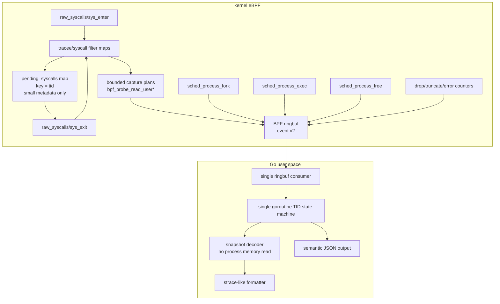

# strace-go pure eBPF architecture plan

本文档面向下一阶段重构：把 `strace-go` 从“eBPF 采样 + 用户态补读 + ptrace 兼容补丁”的混合架构，收敛成一个真正的 Go + eBPF syscall tracer。

核心结论：

- 旧架构问题曾经是结构性存在。当前主路径已经收敛掉 ptrace/procmem、旧 fixed-window carrier、大块 syscall fallback 字典和大部分用户态补读风险；剩余工作主要是继续补齐少数 nested payload，并把 upstream reference 子集按语义扩展。
- 最终产品不区分 `compat` 和 `ebpf-fast`。主线只有一条纯 eBPF syscall tracing 路径。
- 运行期 ptrace 必须从产品路径中删除。上游 `strace` 测试只能作为外部参考，不能对应一个 ptrace 兼容模式。
- 目标不是复刻 ptrace 的冻结语义，而是复刻 `strace` 的主要 syscall 观测体验。

## 1. 当前架构问题是否还存在

答案：历史上确实存在，而且是结构性存在；当前实现已经完成大部分主路径收敛，剩余问题集中在收口和覆盖面。

### 1.1 ptrace 依赖仍然没有从主代码彻底断开

旧实现曾经引入过 `--mode=ebpf-fast` 和 `--mode=compat` 这样的临时分流，但最终目标不能保留这种产品模式。历史代码层面存在过两套耦合：

- `cmd/strace-go/session.go` 中 `startAndTraceCmd` 使用 `SysProcAttr{Ptrace: true}`、`PtraceSetOptions` 和 `PtraceCont`。
- `reapTracees()` 以 ptrace wait/reap 模型管理 tracee 停止和继续。
- `pkg/procmem/reader.go` 保留过 `PtracePeekData` 作为最终 fallback。
- 多个 handler 曾通过 `ctx.MemReader.ReadRobust()` 在事件到达用户态后读取 tracee 内存。

这说明旧实现不只是入口分流问题，共享 handler/decoder 也允许走回旧路径。当前主产品路径已经删除这条回路；后续收口重点是防止新增 handler 或 reference 修复重新引入 Go 侧补读。

### 1.2 用户态异步内存读取仍然是根本 TOCTOU

旧 `pkg/event/decoder.go` 的 `DecodeString` 曾在 BPF buffer 不完整时 fallback 到 `MemReader.ReadRobust()`；当前实现已经是 snapshot-only：BPF 快照缺失或不可用时输出原始指针。

这在纯 eBPF 模式下不可接受：

- syscall enter/exit 时用户内存状态是当时的状态。
- ringbuf 事件到达 Go 时，tracee 可能已经继续运行、复用 buffer、exec 或退出。
- 用户态再读 `/proc/$pid/mem` / `process_vm_readv` 得到的是“后来状态”，不是 syscall 发生时的快照。

所以纯 eBPF 路径的原则必须是：

> 所有 syscall 参数内存快照只能在 BPF probe 里通过 `bpf_probe_read_user*` 完成。Go 侧不能补读 tracee 内存。

### 1.3 BPF map 中保存大事件对象，吞吐成本过高

当前 `bpf/strace.c` 中：

- `struct bpf_event` 内含大 `str_arg` buffer。
- `heap` 是 per-CPU scratch。
- `events_map` 是普通 HASH map，value 是整个 `struct bpf_event`。
- `sys_enter` 后会 `bpf_map_update_elem(&events_map, &tid, e, BPF_ANY)`。
- `sys_exit` 再从 `events_map` 取回大对象、补 ret/payload、ringbuf 输出并删除。

这个模型的问题：

- 每次 enter 都可能把接近 10KB 的对象复制进 hash map。
- 高频 syscall 下 hash map value copy 会成为主要开销。
- 大 value 会加重 verifier、内存占用和 cache 压力。
- 对于大部分 syscall，enter->exit 需要保存的只是几十字节元数据，不需要保存整个输出事件。

新模型必须把 hash map 缩小成“pending metadata map”，大 payload 只进入 ringbuf。

### 1.4 用户态事件处理不是单协程状态机

Phase 3 之前，`run()` 中有单独 goroutine 读 ringbuf，再通过 `eventChan` 投递给主循环。当前主路径已经切到同一 goroutine 内 `ReadInto -> decode -> handleEvent`。

同时存在全局状态和 mutex：

- `lastSuspendedSyscall` + `lastSuspendedSyscallLock`
- `pendingExecArgs` + `pendingExecArgsLock`
- handler 内还有其他 cache lock

旧模型不是用户提出的“单 goroutine 无锁事件状态机”。对于主线纯 eBPF 实现，事件处理应收敛为：

- 同一个 goroutine 读取 ringbuf、解码、更新 pending map、打印、更新 fd/cwd/lifecycle 状态。
- 不用 mutex 管理 syscall enter/exit 输出状态。
- 允许一个非事件 goroutine 等待目标进程退出，但它不能处理事件，也不能修改 syscall 状态机。

### 1.5 生命周期模型仍然脆弱

当前 BPF 侧已经有 `sched_process_fork`，但 exec/exit/thread 生命周期仍主要靠 raw syscall enter/exit、`pending_exec_map`、`main_exited_map` 等补丁拼接。

这在这些场景下很脆：

- 非 leader thread execve。
- execve 成功后线程组收缩。
- fork/clone/exec/exit storm。
- tracee 退出导致 pending map 清理不完整。
- attach 模式下已有线程和后续 clone 的继承关系。

新模型应把生命周期当成一等事件，而不是 syscall formatter 的副作用。

### 1.6 BTF 不能独立定义 strace 语义

当前 `cmd/generate-syscalls`：

- 使用 `github.com/cilium/ebpf/btf` 从 `__x64_sys_*`、`__do_sys_*`、`ksys_*` 抽取参数。
- 仍解析 `strace-upstream/src/linux/x86_64/syscallent.h` 作为 syscall id/name/flags 基准。
- BTF 函数签名不足时读取 syscall tracepoint format；仍无法解析的历史 syscall 显式生成 dummy metadata，不回退到通用手写签名字典。
- `semanticOverrides` 只保留有 reason 和双边签名测试的 strace-facing ABI 差异。
- payload capture 由 syscall-specific direct TLV helper 显式实现，不再由 `capture_rules.yaml` 生成固定窗口策略。

这里需要区分两件事：

- syscall 签名可以尽量从 BTF/unistd 生成。
- strace 语义捕获策略不能完全从 BTF 推导。

BTF 能告诉我们参数名和 C 类型，但不能完整告诉我们：

- 哪个指针是 path。
- 哪个 buffer 是 IN，哪个是 OUT。
- buffer 长度来自哪个参数或返回值。
- `ioctl`、`bpf`、`setsockopt`、`msghdr`、`iovec` 等嵌套结构怎么截断。
- 哪些字段应该作为 xlat flags 解码。

因此重构目标应是“禁止手写 syscall 签名”，而不是“禁止任何人工 capture policy”。

## 2. 目标契约

### 2.1 单一路径契约

`strace-go` 的产品路径只有纯 eBPF 实现：

- 禁止运行期 ptrace。
- 禁止 Go 侧读取 tracee 内存。
- 所有用户内存快照只在 BPF probe 中完成。
- syscall enter/exit 都作为事件流的一部分输出给 Go。
- Go 侧使用单 goroutine 状态机做 enter/exit 配对、unfinished/resumed、fd/cwd/lifecycle 更新。
- 输出是 strace-like，不承诺 ptrace-equivalent。
- 上游 `strace` exact diff 只作为兼容参考，不作为主门禁。

### 2.2 旧 ptrace 路径处置契约

旧 ptrace 相关代码不能作为运行时模式继续存在：

- `--mode=compat`、ptrace reaper、ptrace memory fallback 都应进入移除清单。
- 如果迁移阶段需要对照旧行为，只能依赖 git history、临时实验分支或独立测试基线，不能在主产品 CLI 暴露。
- upstream 测试保留为 reference suite，但它运行的对象仍然是纯 eBPF 实现。
- 对 upstream exact diff 不稳定的测试，应降级为 relaxed/semantic assertion 或明确标记为非契约。

### 2.3 明确不支持的 ptrace 等价语义

纯 eBPF 模式不承诺：

- 冻结 tracee 后任意读取用户内存。
- syscall 注入、修改 syscall nr/args/ret。
- ptrace stop 顺序、signal-delivery-stop、group-stop 语义。
- stdout/stderr 与 trace 输出的严格交错。
- 深层可变内存图的无限展开。
- 对所有 upstream `strace` tests 做 byte-for-byte exact diff。

## 3. 目标架构总览



## 4. 内核态设计

### 4.1 BPF event v2

当前 `struct bpf_event` 同时承担：

- pending enter 状态。
- output event。
- payload buffer。
- exec 特殊 snapshot。
- probe 状态。

这导致 map value 巨大且难以演进。新结构应拆分。

建议定义统一 header：

```c
enum event_type {
    EVENT_SYS_ENTER = 1,
    EVENT_SYS_EXIT = 2,
    EVENT_LIFECYCLE = 3,
    EVENT_LOST = 4,
};

struct event_header {
    __u16 version;
    __u16 type;
    __u16 flags;
    __u16 header_len;
    __u32 size;
    __u32 pid;
    __u32 tid;
    __u32 sys_id;
    __u64 seq;
    __u64 ts_ns;
};
```

syscall enter event：

```c
struct syscall_enter_event {
    struct event_header h;
    __s64 ret;
    __s32 probe_ret_enter;
    __s32 probe_ret_exit;
    __u64 args[6];
    __u32 capture_len;
    __u32 capture_flags;
    __u8 payload[];
};
```

syscall exit event：

```c
struct syscall_exit_event {
    struct event_header h;
    __s64 ret;
    __u64 duration_ns;
    __u64 args[6];
    __u32 capture_len;
    __u32 capture_flags;
    __s32 stack_id;
    __u32 reserved;
    __u8 payload[];
};
```

payload 使用 section/TLV，而不是固定 `str_arg`：

```c
enum payload_kind {
    PAYLOAD_STRING = 1,
    PAYLOAD_BYTES = 2,
    PAYLOAD_STRUCT = 3,
    PAYLOAD_IOVEC = 4,
    PAYLOAD_SOCKADDR = 5,
    PAYLOAD_EXEC_ARGS = 6,
};

struct payload_section {
    __u16 kind;
    __u16 arg_index;
    __u16 flags;
    __u16 reserved;
    __u32 user_len;
    __u32 copied_len;
    __s32 probe_ret;
    __u64 user_ptr;
    __u8 data[];
};
```

收益：

- Go 侧可以按 section 解码，不再依赖魔法 offset。
- BPF 可以只输出实际需要的 payload。
- JSON 测试可以直接断言 section。
- 后续新增 syscall capture 不破坏老字段。

### 4.2 map 设计

建议 map：

```c
events: BPF_MAP_TYPE_RINGBUF
tracee_filter: BPF_MAP_TYPE_HASH
syscall_filter: BPF_MAP_TYPE_HASH or ARRAY bitmap
pending_syscalls: BPF_MAP_TYPE_HASH
config_map: BPF_MAP_TYPE_ARRAY
stats_map: BPF_MAP_TYPE_PERCPU_ARRAY
```

`pending_syscalls` value 只保存小元数据：

```c
struct pending_syscall {
    __u32 pid;
    __u32 tid;
    __u32 sys_id;
    __u32 flags;
    __u64 enter_ts_ns;
    __u64 args[6];

    /* bounded pointer metadata for exit capture */
    __u64 out_ptr0;
    __u32 out_len0;
    __u16 out_arg0;
    __u16 out_kind0;

    __u64 out_ptr1;
    __u32 out_len1;
    __u16 out_arg1;
    __u16 out_kind1;
};
```

禁止再把完整 output event 放进 hash map。

### 4.3 sys_enter 策略

`sys_enter` 做四件事：

1. 读取 pid/tid/sys_id。
2. 做 tracee filter 和 syscall filter 下推。
3. 根据 capture plan 拷贝 IN 参数，输出 `EVENT_SYS_ENTER`。
4. 把 exit 阶段需要的指针和长度放入 `pending_syscalls`。

对于 IN 参数：

- path：`bpf_probe_read_user_str`，上限 4096 或配置值。
- write/sendto payload：`bpf_probe_read_user`，上限默认 512，可由 CLI 调整。
- iovec：先拷贝 iovec 数组的 bounded prefix，再拷贝每个 iov 的 bounded prefix。
- execve argv/envp：只拷贝前 N 个指针和每个字符串前 M 字节。
- ioctl/bpf_attr/msghdr：按 capture policy 拷贝固定头和 bounded nested fields。

### 4.4 sys_exit 策略

`sys_exit` 做五件事：

1. 查 `pending_syscalls[tid]`。
2. 读取 ret，计算 duration。
3. 根据 ret 和 enter 保存的 out pointer metadata 拷贝 OUT 参数。
4. 输出 `EVENT_SYS_EXIT`。
5. 删除 `pending_syscalls[tid]`。

对于 OUT 参数：

- `read(fd, buf, count)`：`copy_len = min(ret, count, max_payload)`，只在 `ret > 0` 时拷贝。
- `recvfrom`：exit 拷贝 buffer、sockaddr、addrlen。
- `getcwd/readlink`：exit 根据 ret 拷贝输出 buffer。
- `accept/getsockname/getpeername`：enter 保存 addr/addrlen 指针，exit 拷贝实际 addrlen。
- `pipe/socketpair`：exit 拷贝 fd array。

### 4.5 ringbuf reserve 与失败策略

使用 `bpf_ringbuf_reserve`，但必须有严格边界：

- 每条 event 最大 payload 固定上限，例如 8KB 或 16KB。
- 字符串、buffer、iovec、exec argv/envp 分别有独立上限。
- reserve 失败时增加 `stats_map.reserve_fail`。
- payload 被截断时设置 `EVENT_F_TRUNCATED` 和 section `copied_len < user_len`。
- probe 失败时保留 section 元数据和 `probe_ret`，Go 侧可以打印指针地址或 `???`。

不要把 ringbuf event 当成无限 scratch。所有变量长度都必须被 verifier 可证明地 clamp。

### 4.6 生命周期 tracepoints

必须引入生命周期事件：

- `sched:sched_process_fork`
- `sched:sched_process_exec`
- `sched:sched_process_exit` 或 `sched:sched_process_free`

生命周期事件用于：

- fork/clone 后继承 trace filter。
- exec 成功后更新 pid/tid/thread group 状态。
- exit/free 后清理 `pending_syscalls`。
- Go 侧打印 `+++ exited with N +++` 或维护 pid/tid 活性。

`raw_syscalls/sys_enter(exit)` 仍可用于打印 exit syscall 本身，但不应用它承担所有状态清理。

## 5. 用户态设计

### 5.1 单 goroutine 事件处理

主线纯 eBPF 实现的主循环应收敛成：

```go
for {
    rec, err := ring.Read()
    if done && timeoutDrain {
        break
    }
    ev := decodeEventV2(rec.RawSample)
    state.Handle(ev)
}
```

事件处理 goroutine 内维护所有 syscall 状态：

```go
type TraceState struct {
    pending map[uint32]*PendingSyscall // key = tid
    tasks   map[uint32]*TaskState      // key = tid
    fds     map[FDKey]*FDState
    stats   map[uint32]*SyscallStat
}

type PendingSyscall struct {
    Enter       *SyscallEvent
    PrintedHalf bool
    ArgText     []string
    LinePrefix  string
}
```

允许存在一个等待目标进程退出的 goroutine，但它只能关闭 done channel，不能读写 `TraceState`。

### 5.2 enter/exit 输出状态机

规则：

1. 收到 `EVENT_SYS_ENTER`：
   - 解码 enter payload。
   - 缓存到 `pending[tid]`。
   - 默认不打印。

2. 收到任意其他 TID 的事件：
   - 扫描 pending 中未完成且未打印 half 的 syscall。
   - 对这些 syscall 打印 `syscall(args <unfinished ...>`。
   - 标记 `PrintedHalf = true`。
   - 不使用 timer，纯事件驱动。

3. 收到 `EVENT_SYS_EXIT`：
   - 找 `pending[tid]`。
   - 合并 enter args、exit payload、ret、duration。
   - 如果未打印 half，打印完整一行。
   - 如果已打印 half，打印 `<... syscall resumed>) = ret`。
   - 删除 `pending[tid]`。

4. 收到 lifecycle exit/free：
   - 清理该 tid pending。
   - 如果 pending 已打印 half，可打印中止/退出提示。

注意：触发 unfinished 的比较对象应该是 TID，不是进程。一个进程内两个线程交错也要触发。

### 5.3 handler 与 decoder 分层

旧 handler 曾经可以直接读 `ctx.MemReader`。纯 eBPF 模式必须持续禁止这条路径回流。

建议引入两套接口：

```go
type SnapshotReader interface {
    Section(arg int, kind PayloadKind) (PayloadSection, bool)
}

type MemoryReader interface {
    Read(pid int, addr uint64, size int) ([]byte, error)
    ReadRobust(pid int, addr uint64, size int, waitOnZero bool) ([]byte, error)
}
```

纯 eBPF handler context：

- 有 `SnapshotReader`。
- 没有 `MemoryReader`，或者 `MemoryReader` 是一个会返回明确错误的 forbidden reader。

不再提供 ptrace/procmem handler context。这样可以强制测试发现“某个 handler 在纯 eBPF 路径里偷偷补读内存”的问题。

### 5.4 fd/cwd/path 状态

fd/path 状态不能依赖 ptrace，也不能依赖异步 `/proc` 快照：

- 启动/attach 时不读取 tracee 的 `/proc/$pid/fd`、cwd 或 fdinfo；既有 FD/cwd 状态从事件视角标记为 unknown。
- 后续只由 syscall/lifecycle 事件维护：
  - `open/openat/openat2/creat` 成功后记录 fd -> path。
  - `close/close_range/dup/dup2/dup3/fcntl(F_DUPFD*)` 更新 fd map。
  - `chdir/fchdir` 更新 cwd。
  - `fork/clone` 继承 fd/cwd 状态。
  - `exec` 只按 lifecycle 与已观测的 close-on-exec 信息更新；无法从事件确定的 fd 保持 unknown，不做懒刷新。

这部分是 event-sourced best-effort；如果 probe 点没有携带足够 metadata，就保留 unknown，不用查询时快照伪造结果。

## 6. syscall 元数据与生成器

### 6.1 生成器目标

目标文件：

- `pkg/meta/syscall_table.go`：syscall id/name/arg/type/flags。
- `cmd/strace-go/bpf_bpfel.go` / `cmd/strace-go/bpf_bpfeb.go`：由 bpf2go 生成的 BPF object 绑定。

目标原则：

- syscall 基础签名尽量由 BTF/系统头生成。
- 不再维护大量手写 syscall signature override。
- syscall payload 捕获由 `bpf/syscall_*_direct_event_v2.h` 专项 direct TLV helper 表达，不再生成 fixed-window capture switch。
- 生成器输出必须稳定，避免每次构建大面积无关 diff。

### 6.2 BTF 来源策略

优先级建议：

1. 如果内核 BTF 暴露 `trace_event_raw_sys_enter_*` / syscall tracepoint struct，则从 tracepoint struct 提取参数名和类型。
2. 否则从 `__do_sys_*` 函数 BTF 提取，再 fallback 到 `__x64_sys_*` / `ksys_*`。
3. 如果函数 BTF 只有 `pt_regs` wrapper 或没有可用签名，则读取 syscall tracepoint 的 `format` 文件提取字段；这不是运行期数据源，只是生成阶段的内核元数据 fallback。
4. 仍无法得到签名时才使用 dummy 参数；syscall number 来自本机 arch 的 `unix.SYS_*` 或系统 `unistd_*.h`。
5. 对名称差异维护小型 alias 表，例如 `newfstatat`、`mmap_pgoff`、`newstat`。

不能假设所有 kernel 都有 per-syscall tracepoint BTF。生成器必须有 fallback。

### 6.3 payload capture 不再由旧 policy 生成

旧 `capture_rules.yaml` / `syscall_capture.h` 链路已经删除。它曾把 strace-like payload 捕获规则翻译为针对 `bpf_event.str_arg` 的固定窗口拷贝代码，但这与 event v2/TLV 和 no fixed-window carrier 的最终架构冲突。

当前约束：

- BTF/unistd 只负责“它是什么 syscall、参数叫什么、类型是什么”。
- “为了 strace-like 输出，需要拷贝哪些内存”由 syscall-specific direct TLV helper 显式实现。
- 构建流程不再生成 `syscall_capture.h`，源码门禁测试要求旧 `capture_rules.yaml`、`syscall_capture.h` 和 `gen_bpf_capture.go` 不存在。

## 7. 测试体系

### 7.1 主门禁

主门禁不做 upstream byte diff，做语义测试：

- enter/exit 成对。
- 同一 TID 内 syscall 顺序正确。
- filter 下推后无关 syscall 不进 ringbuf。
- IN 参数在 enter 时快照。
- OUT 参数在 exit 时快照。
- fork/exec/exit 生命周期状态正确。
- 无 ptrace 行为。
- ringbuf reserve fail/drop/truncate 有可观测计数。

### 7.2 no-ptrace gate

需要持续维护专门测试：

- 启动目标后，目标进程 `TracerPid` 应为 0。
- 源码层面主路径不依赖 `procmem.Reader`。
- 运行 `--event-format=json` 时，任何 handler 触发用户态 tracee memory reader 都应失败测试。

可以实现一个 `forbiddenMemoryReader`：

```go
type forbiddenMemoryReader struct{}

func (forbiddenMemoryReader) Read(...) ([]byte, error) {
    return nil, ErrMemoryReadForbidden
}
func (forbiddenMemoryReader) ReadRobust(...) ([]byte, error) {
    return nil, ErrMemoryReadForbidden
}
```

测试中要求主路径不产生这个错误。

### 7.3 fixture 覆盖

第一批 fixture：

- `open/read/write/close`
- failed syscall，例如 `openat` 返回 `ENOENT`
- path 参数
- buffer payload
- `fork/exec/exit`
- attach 到已进入阻塞 syscall 的进程，验证启动握手与 orphan exit 统计
- 多线程 syscall storm
- long path truncation
- read/write 大 payload truncation
- iovec readv/writev
- sockaddr connect/accept

### 7.4 性能门禁

固定 workload：

- 高频 `getpid`：测空 syscall event 成本。
- 高频 `clock_gettime`：测高频短 syscall。
- 高频 `write` 小 buffer：测 payload 拷贝和 ringbuf。
- 高频 `read`：测 exit OUT buffer。
- fork/exec storm：测 lifecycle map 清理。
- 多线程 storm：测 pending map 和 unfinished/resumed。

指标：

- events/s
- ringbuf reserve fail
- dropped events
- truncated sections
- Go alloc/op
- Go heap growth
- pending map stale count

## 8. 分阶段落地计划

### Phase 0: 冻结边界和测试

目标：

- 确认产品路径只有纯 eBPF。
- 明确禁止 ptrace/procmem。
- 当前语义测试继续可运行。

改动：

- README/arch 文档明确单一路径契约。
- 移除或废弃 `--mode=compat` / `--mode=ebpf-fast` 的产品语义。
- 删除 ptrace 启动、ptrace reaper、`PtracePeekData` fallback。
- 增加 no-ptrace/no-procmem 测试骨架。
- 给主路径加 forbidden memory reader 测试入口。

验收：

- `go test ./cmd/... ./pkg/...`
- `python3 test/run_tests.py --suite ebpf-semantic`
- `python3 test/run_tests.py --suite ebpf-perf --skip-build`

### Phase 1: event v2 垂直链路

目标：

- 新增 event v2，不立即删除旧 event。
- 先支持 `getpid/openat/read/write/close/execve`。

改动：

- BPF 新增 `event_header`、enter/exit event。
- Go 新增 event v2 decoder。
- JSON 输出暴露 `event_type=enter/exit` 和 payload sections。
- old formatter 可先继续用旧 event，semantic test 先走新 JSON。

当前落地：

- `struct bpf_event` 已带 `event_version`、`event_type`、`event_flags`。
- `--event-format=json` / `--debug-events` 会通过 `CONFIG_EMIT_ENTER` 打开通用 enter 事件。
- 通用 enter 事件打 `EVENT_FLAG_GENERIC_ENTER`，Go 侧直接输出 JSON，不触发 handler、fd 状态更新或用户态内存补读。
- exit/full 事件继续服务现有 handler 和文本 formatter，JSON 输出会标注 `event_type=exit`。

验收：

- fixture 能看到 enter/exit。
- `read` payload 来自 exit。
- `write/openat/execve` payload 来自 enter。

### Phase 2: pending map 瘦身

目标：

- `pending_syscalls` 不再保存完整 `bpf_event`。
- map value 缩到百字节级。

改动：

- 移除 `events_map` 大 value 依赖。
- enter 输出 enter event，并只保存 exit capture metadata。
- exit 从 pending metadata 生成 exit event。

当前落地：

- BPF `events_map` 已替换为 `pending_syscalls`。
- `pending_syscalls` value 只保存 `enter_time`、6 个原始参数、pid/tid/syscall id 和 stack id，不再保存 `str_arg` 大缓冲。
- `sys_exit` 不再使用 per-cpu `heap` 或 `struct bpf_event` 重建 exit/full event；fallback syscall 也直接从 compact pending metadata 合成 no-payload event v2。
- 文本 formatter 现在消费 event v2 + semantic payload sections；未专项 payload 的 syscall 保留 args/ret/duration，不再重新执行 fixed-window capture。
- `TestPendingSyscallsMapUsesCompactValue` 直接解析嵌入 BPF object，防止 pending map value 回退到大结构。

验收：

- 高频 getpid/write 性能明显提升。
- BPF map value size 明显下降。
- stale pending 可由 lifecycle/free 清理。

### Phase 3: Go 单 goroutine 状态机

目标：

- 主路径不再用 event reader goroutine + eventChan 处理 syscall。
- 移除 `lastSuspendedSyscallLock`、`pendingExecArgsLock` 在 syscall 状态机路径中的使用。

改动：

- 新建 `pkg/trace/state.go`。
- `TraceState.Handle(event)` 内部维护 pending map。
- 实现事件驱动 `<unfinished ...>` / `<... resumed>`。
- 删除旧 ptrace/reaper 输出状态机在产品路径中的入口。

当前落地：

- `session.run` 已移除 event reader goroutine 和 `eventChan`，主循环在同一 goroutine 内委托 `TraceEventReader.Read` / `DrainAfterDone` 完成 ringbuf 读取、record 解码和 `TraceEventRouter` 路由。
- 目标命令的 `cmd.Wait()` 只保留为生命周期通知 goroutine，不读取 ringbuf、不处理事件、不修改 syscall 状态机；attach pid 存活检查在主循环中轮询。
- BPF 程序挂载已从 `session.go` 内 150 行线性 attach 块收敛到 `bpfAttacher`（`cmd/strace-go/bpf_attach.go`）：raw syscall/lifecycle tracepoint 以表驱动 spec 声明，recvmsg kretprobe 作为 attacher 方法；`setupBPF` 只负责 spec 加载、syscall id 变量解析（`setSyscallVariables` 返回 error 而非直接 fatal）和委托挂载。源码门禁同步改为同时扫描 session.go 与 bpf_attach.go，并新增 spec 表结构、optional 语义和变量解析单元测试。
- tracee 初始 execve 已可观测：`arm_fork_map` 在 fork 前武装（`sched_process_fork` 以父进程 tgid 匹配，覆盖 os/exec 从任意 runtime 线程 fork 的情况），子进程在首次 exec 前通过 `pre_exec_map` 抑制 Go os/exec 内部 fd 设置 syscall（fcntl/dup3 等），只放行 exec 家族；exec 时无条件解除抑制，避免 arm 竞态残留。退出行 fallback 改用当前 mono 时间戳，不再显示 boot 相对时间。
- `io_submit` 的 iocb 数组、PREADV/PWRITEV 嵌套 iovec 与 PWRITE 数据 buffer 已拆到三个专项 raw syscalls program（`trace_sys_enter_aio`/`_aio_iovec`/`_aio_buf`），各自 bounded 捕获避免 verifier 超限，Go formatter 渲染 iocb 列表与嵌套内容而非裸指针。
- lifecycle 事件现在始终发射（不再只在 JSON 模式）：文本模式同样维护 task/fd 状态；`sched_process_exit` 直接从退出任务读取 tid/tgid 与 `task_struct.exit_code`（tracepoint 结构布局不可靠），Go 侧为已 exec 任务、线程与 attach 目标渲染 `+++ exited with N +++`，并跳过 os/exec 中间进程。命令退出行的 wait fallback 在 wait 完成后短宽限内 flush；`attach-f-p` 通过，`attach-p-cmd` 的跨任务 exact exit 顺序仍受纯 eBPF 异步观察限制。
- `strace-C` 标记为预期失败：上游 `-c` 汇总按 per-syscall CPU 时间计，纯 eBPF 只能观测 wall-clock 时长，属于测量语义差异；runner 同时修复了 `sleep-timing` 的构建（补 `-I../src` 与 libtests 链接），`strace-r`/`strace-T_upper` 已通过。
- 结束时使用 `ringbuf.Reader.Flush()` drain 剩余事件，再统一打印 summary、关闭 fd data files 和输出 pipe。
- Go 侧新增 per-session `pendingSyscalls map[tid]pending`，generic enter 事件进入 pending，exit 事件按 TID 消费 pending。
- JSON exit 事件带 `paired_enter=true`，semantic/perf 测试已把 read/write/getpid 的 enter/exit 配对作为门禁。
- execve 暂存参数和 suspended syscall 状态已从全局 map+mutex 迁入 `traceSession`，事件处理路径不再依赖这些 mutex。
- Go 侧已新增 `TraceState` 对象集中持有 pending syscall、exec 暂存、suspended syscall 和 task lifecycle map；`traceSession` 只组合状态对象，为后续 `TraceState.Handle(event)` 收口做准备。
- `TraceState.Handle(event)` 已作为状态更新单入口，负责 lifecycle task 更新、enter pending 记录、exit pending 配对和 lifecycle exit/free 的 pending 清理；`traceSession` 继续负责过滤、FD 状态和输出副作用。
- syscall exit/full 事件已引入 `syscallEventContext`，集中构建 syscall metadata、path 判定、BPF payload sections、raw string、过滤结果和 `handler.Context`；`handleEvent` 不再直接拼装这些派生字段，为后续拆 renderer/FD store 接口留出边界。
- fd path、offset 和 data file 句柄已收敛到 `FDStateStore`；`traceSession` 不再直接持有三张 fd map，只组合状态对象并通过 store 更新 syscall/lifecycle 副作用。
- syscall summary 聚合已收敛到 `SummaryStats`；`traceSession` 不再直接持有 summary 裸 map，事件路径只负责在过滤后记录，结束阶段委托对象输出 strace-like summary。
- exit status 排队已收敛到 `ExitStatusQueue`；`traceSession` 不再直接持有 Wait/ringbuf exit 竞态协调用的裸 map，只负责判断是否需要排队和执行输出副作用。
- syscall 时间前缀已收敛到 `TimeFormatter`；`traceSession` 不再直接维护 boot offset 或 relative-time last syscall timestamp，为后续文本 renderer 拆分保留清晰边界。
- 普通 syscall 文本行、exit 状态行、unfinished 行、exec resume 行、非 leader exec superseded 诊断、hexdump、SIGALRM 伪 signal 行和 stack trace 输出已收敛到 `TextRenderer`；`event.go` 只负责在完成状态/filter/handler 后把文本输出交给 renderer。
- syscall return text 格式化已迁出 `event.go`，作为 JSON/text 共享的独立 formatter，事件路由不再承载 errno、restart、特殊返回值文本规则。
- target/attach/follow-fork 事件准入已收敛到 `TraceScope` 值对象；`handleEvent` 不再直接展开 CLI attach pid 匹配逻辑。
- execve/execveat restart、leader resume 和非 leader superseded 输出状态已收敛到 `ExecSyscallOutput`；`event.go` 不再直接读写 pending exec 或 exit status queue 的 exec 特例。
- exit/exit_group 的 syscall 行、JSON 分流、quiet-exit 和 exit status queue 输出已收敛到 `ExitSyscallOutput`；`event.go` 不再直接编排 exit 输出副作用。
- BPF 合成的 suspended syscall probe 状态已收敛到 `SuspendedSyscallOutput`；`event.go` 不再直接打印 `<unfinished ...>` 或写 suspended syscall marker。
- text-mode syscall 输出链已收敛到 `SyscallTextOutput`，集中应用 status filter、suspended/exec 特例和普通 syscall renderer；`event.go` 只在 handler 解码后委托文本输出对象。
- JSON syscall 输出策略已收敛到 `SyscallJSONOutput`，集中处理 generic enter raw event、debug raw event、decoded JSON event 和 status filter；`event.go` 不再直接编排 JSON syscall 输出。
- syscall handler 解码和 FD state side effects 已收敛到 `SyscallHandlerRunner`；`event.go` 不再直接调用 `handler.Get`，也不再展开隐藏 FD-state syscall 的 handler/update 顺序。
- syscall exit/full event pipeline 已收敛到 `SyscallExitPipeline`，统一编排 debug raw JSON、arch_prctl suppress、summary-only、exit syscall、handler、JSON/text 输出和 FD offset/close 副作用；`event.go` 只负责构建 `syscallEventContext` 后委托。
- exit status wait/ringbuf 竞态协调已收敛到 `ExitStatusCoordinator`；`event.go` 不再承载 exit status queue 的排队、释放、丢弃和输出包装函数。
- 命令 wait 退出结果与 exit-status fallback 已收敛到 `TraceCommandExitHandler`；`traceRunState` 只维护完成判定、fallback 时钟和 attach 轮询，不再依赖完整 `traceSession` 或直接操作退出队列。
- `traceRunState` 构造只接收待等待的 command 和 attach PID 快照；session 仅在 `run` 入口组装依赖，状态对象不再读取 CLI/session 字段。
- event scope/state 分类、生命周期分流、enter JSON 和 exit pipeline 路由已收敛到 `TraceEventRouter`；`event.go` 只保留单入口委托。
- ringbuf `SetDeadline`、`ReadInto`、`Flush`、v2 decode 和事件路由已收敛到 `TraceEventReader`；它通过最小 reader/sink 接口可在无内核的单元测试中验证读取错误、drain 和路由时序。
- JSON raw/decoded/lifecycle 事件编码已收敛到共享的 `JSONEventWriter`；输出策略对象只负责筛选与消费语义，writer 复用单个 `json.Encoder`，避免每条事件重新创建编码器。
- 运行结束的 stats、summary、fallback flush 和输出 pipe 关闭已收敛到 `TraceRunFinalizer`；`session.run` 不再编排结束阶段副作用。
- event pipeline、JSON/text output、renderer、handler runner、lifecycle handler、exit status coordinator、event router、event reader 和 run finalizer 已改为 per-session 懒加载缓存，避免每条 syscall event 重复构建稳定协作对象。
- 普通 syscall 的通用 `<unfinished ...>` / `<... resumed>` 已收口到单 Goroutine event state machine：当其他 TID 的事件到达时，按 enter 时间和 TID 稳定排序待决 syscall，使用只读 handler decode 输出前半行；同一 TID 的 exit 消费 pending 后输出 resumed 行。
- unfinished 只影响 text mode；JSON/debug 不生成文本半行，也不会为此预解码 handler。BPF 合成的 nanosleep/signal probe 和 exec 非 leader 特例通过 `probeRetEnter`/pending 标记避免重复输出。

验收：

- 多线程 fixture 出现合理 unfinished/resumed。
- Go race test 不应依赖 syscall 状态 mutex。

### Phase 4: 切断 procmem

目标：

- handler 只能从 snapshot sections 解码。

改动：

- 新建 `SnapshotReader`。
- handler.Context 在主路径只暴露 `SnapshotReader`。
- 删除或迁移 handler.Context 中的 `MemReader` 字段。
- 高频迁移 handler：
  - path/open
  - read/write
  - readv/writev
  - socket addr
  - execve argv/envp
  - stat/time/select/futex 常用结构
- 对尚未迁移的复杂 syscall，打印 bounded raw/指针，不进行用户态补读。

验收：

- `forbiddenMemoryReader` 不被调用。
- semantic fixture 覆盖 path/buffer/exec/iovec。

当前落地：

- `event.Decoder` 已收敛为 snapshot-only decoder；字符串解码在 BPF snapshot 不完整时只输出指针，不再补读 tracee 内存。
- `handler.Context` 主路径只暴露 `SnapshotReader` / `PayloadSection`，不再提供 `MemReader` 或 `ReadRobust` 入口。
- `updateFDMap` 只通过 BPF snapshot 解码路径参数，不再直接补读 tracee 地址空间。
- `TestProductSourceHasNoRuntimePtraceOrProcmemDependency` 已扫描主产品源码，禁止重新引入 ptrace、`procmem`、`process_vm_readv`、`MemReader` 或 `ReadRobust` 运行时入口；`TestProductSourceHasNoProcfsDependency` 进一步禁止产品源码依赖 procfs，防止异步元数据快照回流。
- `handler` 的 fd/path 展示逻辑已从通用标量解码拆到独立 `decode_fd.go`，现在只消费 session 的 event-sourced FD state，不再从 procfs 或 filesystem stat 补 metadata。
- semantic fixture 已在 tracee 内检查 `TracerPid == 0`，作为运行期 no-ptrace gate。
- JSON `payload_sections` 已迁入共享 `handler.PayloadSection` 模型，`handler.Context.Section(arg, kind)` 可以按参数和 payload 类型复用同一份 BPF 快照。
- `read/pread64` 和 `write/pwrite64` 的 buffer formatter 只消费 `PayloadKindBytes` section，旧 fixed offset snapshot 会被忽略并退回指针输出。
- path/open 类参数 formatter、path filter 和 open fd/cwd 状态已只消费 `PayloadKindString` section，简单 arg0/arg1 path syscall 已补齐 JSON section 投影；事件上下文已移除旧 `RawStrArg` / JSON `raw_string` 字段，旧 fixed offset string buffer 会被忽略并退回指针输出或跳过 fd map 更新。
- `rename/link/symlink` 及其 `*at` 双 path syscall 已暴露两个 `PayloadKindString` sections，rename/link/symlink formatter 只消费 semantic payload section，旧 fixed offset snapshot 会被忽略并退回指针输出。
- `execve/execveat` 的 argv/envp snapshot 已暴露为 `PayloadKindExecArgs` section；direct BPF path 会在 probe 现场深拷贝 filename、argv records 和 verbose envp records，exec argv/envp decoder 只消费 semantic payload section，旧 fixed offset snapshot 会被忽略并退回指针输出。
- `getcwd/readlink/readlinkat` 已暴露 OUT `PayloadKindBytes` section，formatter 只消费 semantic payload section，旧 exit snapshot 会被忽略并退回指针输出。
- `pipe/pipe2/socketpair` 的 fd array 已暴露为 OUT `PayloadKindStruct` section，pipe formatter 和 fd 状态更新只消费 semantic payload section，旧 exit snapshot 会被忽略并退回指针输出或跳过 fd map 更新。
- `readv/writev/preadv/pwritev/preadv2/pwritev2/vmsplice` 与 `process_vm_readv/writev` 已暴露 `PayloadKindIovec` section，iovec formatter 只消费 semantic payload section，旧 enter snapshot 会被忽略并退回指针输出。
- `uname/sysinfo/getrlimit/setrlimit/prlimit64` 已暴露 `PayloadKindStruct` section，misc formatter 只消费 semantic payload section，旧 fixed offset snapshot 会被忽略并退回指针输出。
- `getitimer/setitimer` 已暴露 `itimerval` 的 `PayloadKindStruct` section，time formatter 只消费 semantic payload section，旧 fixed offset snapshot 会被忽略并退回指针输出。
- `get_robust_list` 已暴露 head/len 两个 OUT word 的 `PayloadKindStruct` section，handler 只消费 semantic payload section，旧 fixed offset snapshot 会被忽略并退回指针输出。
- `waitid` 已暴露 `siginfo_t` 和 `rusage` 的 OUT `PayloadKindStruct` sections，waitid handler 只消费 semantic payload section，旧 fixed offset snapshot 会被忽略并退回指针输出。
- `arch_prctl` 的 GET 类 OUT word 已暴露为 `PayloadKindStruct` section，handler 只消费 semantic payload section，旧 fixed offset snapshot 会被忽略并退回空 GET 输出。
- `sendfile/copy_file_range` 的 offset pointer 已暴露为 `PayloadKindStruct` section，formatter 只消费 semantic payload section，旧 fixed offset snapshot 会被忽略并退回指针输出。
- `mount/umount2/fsconfig` 已暴露字符串和二进制 value 的 sections，fs handler 只消费 semantic payload section，旧 fixed offset snapshot 会被忽略并退回指针输出。
- `getdents64` 已暴露 OUT `PayloadKindBytes` section，exit 阶段由 BPF direct helper 按 ret bounded 拷贝 arg1 dirent buffer，fs handler 只消费 semantic payload section，旧 exit snapshot 会被忽略并退回指针输出。
- `capget/capset` 已暴露 capability header/data sections，capset data capture policy 补齐为 enter snapshot，handler 只消费 semantic payload section，旧 fixed offset snapshot 会被忽略并退回指针输出。
- `cachestat` 已暴露 range/stats 的 `PayloadKindStruct` sections，handler 只消费 semantic payload section，旧 fixed offset snapshot 会被忽略并退回指针输出。
- `openat2` 已暴露 `open_how` 的 `PayloadKindStruct` section，handler 只消费 semantic payload section，旧 fixed offset snapshot 会被忽略并退回指针输出。
- `rt_sigaction/rt_sigprocmask/rt_sigsuspend` 已暴露 sigaction/sigset 的 `PayloadKindStruct` sections，signal handler 只消费 semantic payload section，旧 fixed offset snapshot 会被忽略并退回指针或空 sigset 输出。
- `fcntl/fcntl64` 已按 command 暴露 arg2 的 8/32 字节 `PayloadKindStruct` section，fcntl handler 和通用 flock/f_owner_ex decoder 只消费 semantic payload section，旧 fixed offset snapshot 会被忽略并退回指针输出。
- `prctl` 已按 option 暴露 name 的 `PayloadKindString` section 和 GET 类 uint32 OUT `PayloadKindStruct` section，handler 只消费 semantic payload section，旧 fixed offset snapshot 会被忽略并退回指针输出。
- `SnapshotReader` 接口已收敛为只暴露 `PayloadSection` 查询；`handler.Context` 上旧的 `EnterArgSnapshot`、`ExitSnapshot`、`FetchStructData*` 和 decode fallback 方法已删除，防止新 handler 继续依赖固定 offset snapshot API。
- `handler.Context.Ptr`、`DataLen` 和 `StrArgBuf` 已删除；生产 handler 只能通过 payload sections 获取 BPF 快照。

### Phase 5: filter 下推

目标：

- 无关 syscall 不进入 ringbuf。

改动：

- BPF 增加 syscall bitmap/hash。
- CLI `-e trace=...` 更新 BPF filter map。
- negated filter 在 BPF 侧处理。
- 用户态 status filter 可保留在 Go，因为 ret 需要 exit 后才知道。

验收：

- `-e trace=write` fixture 中 ringbuf 不出现 open/read/close。
- perf workload 下 filtered syscall events/s 和 Go alloc 下降。

当前落地：

- BPF 已新增 `syscall_filter_map`，`raw_syscalls/sys_enter` 在创建事件和保存 pending 前执行 syscall filter。
- Go 侧通过 `TraceSyscalls` 和 `TraceSyscallRegexps` 解析 syscall id，并写入 BPF filter map；negated trace filter 由 BPF config 位处理。
- `--debug-events` 已作为 BPF 已交付事件 oracle；semantic suite 使用 `--debug-events -e trace=write` 验证 raw syscall 事件只包含 `write`。
- Go 层 `path/fd` filter 已从 `poll/ppoll` pollfd payload 和 `select/_newselect` fd_set payload 派生 fd 集合，避免纯 eBPF payload 已捕获但过滤视图仍只看标量 fd 参数。
- `path/fd/status` 过滤明确保留在 Go 层：path 过滤消费 enter/exit 合并后的 bounded TLV，fd 过滤依赖 `FDStateStore` 的 fork/exec/close/offset 生命周期状态，status 还包含 `unfinished/unavailable/detached` 等用户态观察结果；不为部分 status 或 fd 标量过滤增加第二套 BPF policy/control event 协议。syscall name/class/negation filter 仍在 BPF 入口下推，作为 ringbuf 降载的主要策略。

### Phase 6: 生命周期 tracepoint 重构

目标：

- fork/clone/exec/exit/free 不再靠 syscall 特例拼状态。

改动：

- 增加 `sched_process_exec`、`sched_process_exit/free` BPF event。
- Go TaskState 维护 tgid/tid/parent/alive/exe。
- BPF pending map 在 free/exit 时清理。
- filter 继承从 fork/clone lifecycle 统一处理。

验收：

- fork/exec storm 无 pending 泄漏。
- 非 leader thread execve 有稳定输出策略。
- tracee 全退出后 drain ringbuf 并正常结束。

当前落地：

- BPF 已新增 `sched_process_exec`、`sched_process_exit`、`sched_process_free` tracepoint，并把 `sched_process_fork` 从仅 filter 继承扩展为可观测 lifecycle event。
- JSON/debug 模式会通过 `CONFIG_EMIT_LIFECYCLE` 输出 `type=lifecycle` 事件，包含 `fork/exec/exit/free` action。
- `sched_process_exit/free` 现在从当前任务的 `(TGID,TID)` 解析身份：`pending_syscalls` 始终按 TID 清理，非 leader 只清理自己的 `pre_exec/filter` 条目，`pending_exec_map/main_exited_map` 等进程级状态由 leader 路径负责；Go `LifecycleEventHandler` 同样只在 leader 退出时清理进程级 fd/cwd/offset 状态。
- Go 主事件循环会早期识别 lifecycle event，清理 session 内 pending syscall/exec/suspended 状态，并在 JSON/debug 输出中暴露生命周期事件。
- semantic suite 已断言 fixture 中存在 `fork`、`exec`、`exit/free` lifecycle event。
- Go 侧已新增 per-session `TaskState`，由 syscall 事件和 lifecycle event 维护 `tid/tgid/parent/alive/execed`；JSON lifecycle 输出携带 task 状态快照，semantic suite 断言 fork child、execed、exit/free dead 状态。
- fork lifecycle event 会把父进程的 fd/cwd、fd offset 和可 seek 数据文件状态继承到子进程；exit/free 会清理对应 pid 的 fd/cwd、offset 和数据文件状态。
- fork/exit/free 对 fd/cwd、offset 和 data file 的继承/清理已通过 `FDStateStore` 统一执行，lifecycle 事件路径不再直接操作 session 内部 fd map。
- exec lifecycle event 会从 `sched_process_exec` 的 tracepoint data 中拷贝 filename snapshot，JSON lifecycle 输出 `filename` 字段，semantic suite 断言 child exec filename。
- BPF lifecycle event 已切换为 event v2 header + lifecycle body + optional snapshot payload；Go event v2 decoder 会直接解码 lifecycle action、args 和 exec filename snapshot。
- BPF lifecycle event 发送已绕开 `struct bpf_event` / `str_arg` carrier，直接 reserve event v2 ringbuf record、写入 header/body，并把 exec filename snapshot 直接写入 ringbuf dynptr payload。
- 非 leader execve 文本策略以 `tid != tgid` 判定线程 exec，而不是比较最初 target pid；fork child leader execve 走普通 exec resume 输出，真正非 leader execve 输出 superseded/resumed 诊断并以 TGID 作为被替换线程组前缀。
- 新增独立 `ebpf_thread_fixture.c`：`pthread` worker 执行 `getpid`，semantic suite 断言非 leader 事件保持 `pid != tid`、同一 TID 的 enter/exit 配对正确，并收到非 leader `exit/free` lifecycle 身份；本机实测 fixture 输出 20 个 syscall、5 个 lifecycle 事件，`reserve_fail=0`。
- JSON/lifecycle 模式在目标命令 wait 可见后会执行 bounded idle drain，避免真实 `sched_process_exit/free` 事件稍晚进入 ringbuf 时被过早结束漏读；文本模式仍保持立即 flush。
- Go 侧 lifecycle 副作用已收敛到 `LifecycleEventHandler`，统一处理 fork fd/cwd 继承、exit/free 进程状态清理和 JSON lifecycle 输出 gating；`event.go` 只负责把 `TraceState` 更新结果委托出去。

### Phase 7: BTF 生成器重构

目标：

- 减少手写 syscall 签名。
- capture policy 和 signature metadata 分离。

改动：

- `cmd/generate-syscalls` 拆成：
  - `btf_loader.go`
  - `sysnum_unix.go`
  - `gen_go_meta.go`
- 删除通用 metadata fallback resolver；纯名称差异进入 alias，必须保留的 strace-facing 签名进入独立的 `semanticOverrides` 白名单。
- 删除旧 fixed-window capture policy/header 生成链。

验收：

- 生成输出稳定。
- 常见 syscall 参数名/类型来自 BTF 或系统 syscall number 源。
- 没有可用 BTF 签名时明确读取 tracingfs metadata，tracingfs 整体不可用时明确报错。

当前落地：

- `cmd/generate-syscalls` 入口 `main.go` 只加载 syscall metadata 并写出 `pkg/meta/syscall_table.go`。
- 生成器 metadata 读取已拆成 `syscallMetadataLoader`，通过 `btfSyscallSource`、`tracepointSyscallSource` 和 `syscallEntrySource` 隔离 kernel BTF、tracepoint format、syscallent 文件 I/O；semantic override、BTF exact、BTF alias、tracepoint metadata、explicit dummy 的优先级已有 fake source 单元测试覆盖。
- 生成器 command 已通过 `syscallMapLoader` / `syscallTableWriter` 分离 metadata 加载和生成物写入；`main.go` 只负责 CLI 编排、路径解析和错误上下文，`gen_go_meta.go` 负责稳定渲染与文件输出。
- `syscallent.h` 解析已收敛到 `syscallentParser`，递归 include 解析和 generic fallback 有独立单元测试覆盖；include 缺失不再静默跳过，而是作为输入错误返回，避免生成不完整 syscall table。
- `--audit-overrides-detail` 对 kernel BTF 已通过 `btfSyscallDatasetSource` 单次加载/遍历同时产出 metadata 与 diagnostics，避免为了 `pt_regs_wrapper_only` 诊断在 detail audit 中重复读取 BTF；旧 source fallback 仍保留单元测试覆盖。
- 生成器默认 `syscallent.h` 输入和 `pkg/meta/syscall_table.go` 输出路径已改为从当前工作目录向上定位 repo root 后解析；`go run ./cmd/generate-syscalls` 可从仓库根执行，`go run .` 可从 `cmd/generate-syscalls` 子目录执行，两者生成输出一致。
- BTF 函数名识别和同名候选优先级已从 kernel BTF 遍历循环抽成纯函数，单元测试锁定 `__do_sys_*`、`__x64_sys_*`、`ksys_*` 和小范围 socket/network `__sys_*` allowlist 的识别规则，以及“更多参数优先、同参数 `__do_sys_*` 优先”规则。
- BTF source 已按 `trace_event_raw_sys_enter_*` struct 优先、函数 BTF fallback 的顺序加载 metadata；tracepoint struct 提取会跳过标准 trace header 字段，只保留 syscall 参数字段。当前内核没有 per-syscall tracepoint struct 时，loader 会在 BTF direct/alias 都无法提供正确 arity 后读取 `/sys/kernel/tracing/events/syscalls/sys_enter_<name>/format`，并回退到 `/sys/kernel/debug/tracing/events/syscalls/...`；读取候选名时复用 `btfNameToSyscallent` alias（例如 `stat -> newstat`、`umount2 -> umount`），解析器跳过 common header、`__syscall_nr` 和 `__data_loc` 辅助字段，只接受 ASCII syscall 名称。BTF type 收集策略已从 kernel spec I/O 中抽出，组合测试可直接用假 `btf.Type` 证明 tracepoint struct 优先和函数 fallback，format source 也有 fake filesystem 单测。
- `semanticOverrides` 已接入 `--audit-overrides`、`--audit-overrides-detail` 和 `--audit-tracepoint-overrides`；loader 的优先级固定为 semantic override、BTF direct、BTF alias、tracepoint、dummy，并由 fake source 单测锁定。当前生成产物的签名变化来自 tracepoint metadata 暴露出的内核字段名/类型，不再由大块手工签名表静默覆盖。
- metadata resolver 新增 table-driven decision matrix，覆盖 BTF/tracepoint 精确 arity、alias、候选 arity mismatch 后 explicit dummy，以及完全没有 kernel metadata 时的 dummy；测试同时锁定最终 source 与 rejection reason，避免把“候选存在但 ABI 不匹配”误判为“内核没有 metadata”。源码门禁进一步禁止产品重新出现 `fallbackOverrides` 或 `metadataSourceFallbackOverride`。
- 新增 `--audit-resolution` 最终 provenance 审计，按 syscall ID 稳定输出实际采用的 metadata source、决策 reason、参数名和类型；reason 会区分 `btf_exact_arity`、`tracepoint_exact_arity`、`no_kernel_metadata` 以及 `btf_arity_mismatch;tracepoint_arity_mismatch` 等拒绝原因。当前主机实测来源为 `btf=94`、`tracepoint=252`、`semantic_override=20`、`dummy=18`，`fallback_override` source 已从 resolver 类型与审计输出中删除。`preadv`、`pwritev` 的五参数 split-offset raw ABI 已从兼容 fallback 改为原因明确的 semantic override。这使 metadata 来源、strace-facing ABI 差异与内核不存在的历史 syscall dummy 完全分离。
- override detail audit 的流程逻辑和 strace-facing semantic override 规格数据已拆分；`override_audit.go` 保留分类、诊断和 TSV 输出，`override_semantics.go` 只记录必须精确匹配的语义白名单，且单元测试会用规格 kernel-side metadata 构造 fake source 验证每条 spec 与 override 同步，降低后续 review 规格变化时的噪声。
- 生成器已新增 `--audit-overrides-detail` 全量审计入口，按稳定 TSV 输出每个 override 的 `redundant`、`missing_btf`、`normalized_match`、`semantic_override` 或 `signature_mismatch` 状态、原因以及 override/BTF 两侧签名。删除产品 fallback resolver 后，函数 BTF detail audit 只覆盖 20 条 semantic override：15 条为双边签名可验证的 `semantic_override`，5 条明确报告 `pt_regs_wrapper_only`；当前 tracepoint audit 为 10 个 `signature_mismatch`、6 个 `semantic_override` 和 4 个 `redundant`。`mprotect/munmap` 通过 tracepoint 字段验证为 `strace_pointer_types`，`execveat` 通过 semantic 白名单保留 strace-facing 的 `dfd` 名称；`stat`、`lstat`、`getsockname`、`setsockopt` 虽与当前 tracepoint 完全一致，仍由真实 BTF 差异对应的 semantic 白名单保护。审计路径与 loader 共用 `btfNameToSyscallent` alias，`sendfile64 -> sendfile` 解决 tracepoint 命名缺口，`umount -> umount2` 保留内核字段名与 strace-facing 名称差异。本次重构前后生成的 `pkg/meta/syscall_table.go` SHA-256 完全一致，说明删除的是未参与当前 resolution 的手写声明，不是通过修改运行时输出掩盖差异。
- 生成阶段的输入前置条件已实测明确：当前内核 BTF 不提供 `trace_event_raw_sys_enter_*` 类型，BTF-only 会把大量 syscall 降级为 `argN/unsigned long`；完整 strace-facing metadata 仍需要 tracingfs `sys_enter_*/format` 作为 fallback。因此 generator 在 tracingfs 不可读时必须 fail-fast，不能静默生成退化的 `syscall_table.go`。`build.sh`/生成流程需要保留 root 或等价 tracingfs 读取权限，这属于生成时依赖，不是运行期 ptrace 依赖。
- tracingfs format source 现在会在读取具体 syscall 前检查 `/sys/kernel/tracing/events/syscalls` 与 debug tracingfs root；两个 root 都不可读时直接返回错误。单测覆盖“primary 不存在、debug 可用”和“两个 root 都不可用”，避免把整棵 tracingfs 缺失误判成单个 syscall 没有 format。
- tracepoint format parser 现在只过滤 `common_*`、`__syscall_nr` 和 `__data_loc` 辅助字段，不再按通用字段名过滤合法 syscall 参数；因此 `quotactl`/`quotactl_fd` 的 `id` 参数会被保留。当前生成表中 `quotactl` 从 fallback 变为 tracepoint metadata，`quotactl_fd` 从 dummy 变为 tracepoint metadata，并由 parser fixture 锁定。
- tracepoint format fallback 本次把生成表中 95 个此前仍使用 `arg0` dummy 参数的表项替换为内核字段名/类型；这些变化只发生在生成阶段，payload 捕获策略仍由 syscall-specific direct TLV helper 负责。
- 旧 `capture_policy.go`、`gen_bpf_capture.go`、`capture_rules.yaml` 和生成物 `bpf/syscall_capture.h` 已删除；`build.sh` 不再清理或生成该 header。
- 源码门禁测试锁定旧 capture artifact 不存在，并扫描 `bpf/strace.c` 防止重新 include `syscall_capture.h`、`CAPTURE_ARGS_*`、`struct bpf_event` 或 per-cpu `heap` carrier。
- 历史上通过 `payloads`/`reads` 表达的 read/write、path、stat/time、iovec、network、AIO、poll/select/epoll、ioctl、fcntl、fsconfig 等捕获策略，已经迁入对应 direct TLV helper。
- 生成器不再承载“该拷贝哪些用户态内存”的策略；这类 strace-like 语义显式写在 syscall-specific BPF helper 中，并由源码门禁和 semantic/upstream reference 测试保护。
- `overrides_time.go` 的 `init()` 追加 override 副作用已删除；`utime/utimes/futimesat` 当前直接使用 BTF/tracepoint metadata，不再需要独立 time override 文件或 fallback 表项。
- `cmd/generate-syscalls/overrides_legacy.go` 已删除；`ustat`、`preadv`、`pwritev` 等 strace-facing ABI 差异均进入带 reason 和双边签名测试的 `semanticOverrides`，`sendfile64 -> sendfile` 等纯命名差异保留为 alias。
- 产品 `fallbackOverrides` 字典、loader 字段、resolution source 和 resolver 分支均已删除并由源码门禁锁定；默认生成必须从 BTF、tracepoint 或显式 semantic override 得到 metadata，BTF/tracingfs 整体不可用时返回明确错误，不能退回大块手写 syscall 字典。当前生成结果仍有 18 个内核不存在的历史 syscall 使用带 `no_kernel_metadata` provenance 的 dummy 参数，这是显式缺失状态，不是 silent fallback。
- `cmd/generate-xlats` 的入口已拆成配置读取、输出文件边界、upstream xlat 解析、C 常量求值、静态表渲染和 syscall-arg map 渲染几层；`main.go` 从 500 行级大函数收口为轻量编排入口，静态表和 0 值保留规则有独立 helper 与单元测试保护，避免后续 xlat 语义调整继续堆进生成器入口。

### Phase 8: 删除旧模式与收口文档

目标：

- 产品 CLI 不再暴露 ptrace/compat 模式。
- 旧模式、旧事件协议、旧 procmem fallback 从主路径移除。

改动：

- 删除或隐藏 `--mode` 相关产品入口。
- upstream reference suite 改为纯 eBPF 输出参考，不再是 `compat-upstream`。
- README 明确纯 eBPF 的语义限制。
- 删除旧 event/old procmem path。

验收：

- semantic/perf gates 绿。
- upstream reference 子集作为非主门禁可运行。
- 搜索主产品路径没有 `Ptrace*`、`procmem.Reader` 运行时依赖。

当前落地：

- 产品 CLI 已不再接受 `--mode=compat` / `--mode=ebpf-fast`；传入 `--mode` 会失败并提示 `strace-go` 始终使用纯 eBPF tracing。
- `upstream-reference` 是唯一 upstream 参考套件命名，不再提供 `compat-upstream` suite。
- `README` 已声明单一路径契约、纯 eBPF 语义限制和 upstream reference 的非主门禁定位。
- 单元测试锁定 `newTraceCommand` 不配置 ptrace，并锁定 `--mode=compat` 被拒绝，防止产品入口重新长出 ptrace/compat 分支。
- 单元测试会递归扫描 `cmd/strace-go` 与整个 `pkg` 的非测试 Go 源码，并通过 AST 识别 import alias、`Ptrace*`、`SYS_PTRACE`、`ProcessVMReadv`、`pkg/procmem` 和旧 memory-reader 标识；合法的 `process_vm_readv` syscall metadata/formatter 名称不受影响。procfs 字面量全部禁止，新增产品子包会自动进入门禁。
- Go 事件分类不再把 `event_type == 0` 当作 exit；旧 fixed event 协议样本会落到 `unknown`，不能消费 enter pending state。
- JSON/debug syscall event 已开始暴露 `payload_sections`，先把现有 fixed snapshot 投影成 path/read/write/stat/statfs sections；semantic suite 已断言 write IN payload section。
- BPF 事件发送已由 `bpf_ringbuf_output` 收敛到显式 `bpf_ringbuf_reserve_dynptr` / `bpf_dynptr_write` / `bpf_ringbuf_submit_dynptr` helper；`stats_map` 已记录 reserve/copy 失败次数和 truncated payload event 次数，JSON/debug 结束时输出 `type=stats` 事件，semantic/perf suite 可把 ringbuf 丢事件与截断作为显式 oracle。
- lifecycle action 已进入 lifecycle event v2 body，不再复用 `event_flags`，也不再挂在 `struct bpf_event` carrier 上；`event_flags` 只承载真正的 event flags。
- Go 侧 lifecycle 处理已引入专用 `lifecycleEventView`，`TaskState`、`LifecycleEventHandler` 和 JSON lifecycle 输出不再直接消费混合 syscall/lifecycle view。
- Go 侧 TraceState 的 syscall pending/pairing/task 路径已改为消费 `syscallEventView`；BPF raw carrier 进入状态机前先投影为 `rawEventEnvelope`，它只作为 typed syscall/lifecycle view 的迁移期边界。
- `TraceStateUpdate` 已不再携带 raw envelope；状态机对上层只返回 `syscallEventView`、`lifecycleEventView`、pending enter 和 lifecycle task，防止输出 pipeline 重新依赖 BPF raw carrier。
- syscall enter JSON/context 构造已改为消费 `TraceStateUpdate.syscallView` 和状态机缓存的 semantic payload sections；enter 输出分支不再从 raw `bpfEvent` 重新派生 syscall view 或 payload。
- syscall exit/full context 的生产构造也已改为消费 `TraceStateUpdate.syscallView`、pending enter 和 semantic payload sections；普通 context/JSON/text/fd-state/filter 测试已不再通过 raw `bpfEvent` wrapper 构造 view 或 payload。
- `execve/execveat` 已暴露 argv/envp 的 `PayloadKindExecArgs` section，direct BPF snapshot 覆盖 argv records 与 verbose envp records，exec argv/envp decoder 只消费 semantic payload section，旧 fixed offset snapshot 会被忽略并退回指针输出。
- `stat/lstat/fstat/newfstatat` 与 `statfs/fstatfs` 已暴露 OUT `PayloadKindStruct` section，stat formatter 只消费 semantic payload section，旧 exit snapshot 会被忽略并退回指针输出。
- `poll/ppoll` 已暴露结构数组/timeout 的 `PayloadKindStruct` sections，formatter 只消费 semantic payload section，旧固定 offset snapshot 会被忽略并退回指针或空 revents 输出；`epoll_ctl/epoll_wait/epoll_pwait/epoll_pwait2` 已只消费 semantic payload section，旧固定 offset snapshot 会被忽略并退回指针输出。
- `select/_newselect` 已作为 fd_set/timeval syscall 绕开旧 fixed-window capture；enter 阶段直接写 arg1-3 `fd_set` 的 `PayloadKindBytes` IN TLV sections 和 arg4 timeout 的 `PayloadKindStruct` IN TLV section，exit 非负返回时直接写 timeout OUT TLV，正返回时额外写 arg1-3 `fd_set` OUT TLV，select formatter 只消费 semantic payload section。
- `clock_gettime/clock_getres/clock_settime/adjtimex/clock_adjtime` 的 syscall-specific time formatter 只消费 semantic payload section，旧固定 offset snapshot 会被忽略并退回指针输出；`nanosleep/clock_nanosleep/gettimeofday/settimeofday` 的通用 time struct decoder 也只消费 semantic payload section。
- `utime/utimes/futimesat/utimensat` 已暴露 path string 和时间结构 `PayloadKindStruct` sections，time formatter 复用 section snapshot，旧固定 offset snapshot 会被忽略并退回指针输出。
- `futex/futex_wait/futex_waitv/futex_requeue` 已暴露 timeout/waiters 的 `PayloadKindStruct` sections，通用 timespec decoder、futex formatter 和 waitv decoder 都只消费 semantic payload section，旧固定 offset snapshot 会被忽略并退回指针输出。
- `connect/bind/sendto/recvfrom/accept/accept4/getsockname/getpeername` 已暴露网络 buffer、sockaddr 和 addrlen sections，网络 formatter 只消费 semantic payload section，旧固定 offset snapshot 会被忽略并退回指针或零长度输出。
- `io_setup/io_submit/io_cancel/io_getevents/io_pgetevents` 已暴露 AIO ctx、pointer array、嵌套 `iocb`、event 数组、timeout/sigset/sigmask sections，AIO formatter 只消费 semantic payload section，旧固定 offset snapshot 会被忽略并退回指针输出。
- `process_madvise` 已暴露 `PayloadKindIovec` section，formatter 只消费 semantic payload section，旧 enter snapshot prefix 会被忽略并退回指针输出；短 section 仍保留 next-address 文本。
- `clone3` 已暴露 `struct clone_args` 的 `PayloadKindStruct` section，clone3 formatter 只消费 semantic payload section，旧 enter snapshot prefix 会被忽略并退回指针输出。
- `bpf` 已暴露 `union bpf_attr` 的 `PayloadKindBytes` section，bpf formatter、ID 类扩展字段与 extra_data formatter 只消费 semantic payload section，旧 enter snapshot prefix 会被忽略并退回指针或空 extra_data 输出。
- `memfd_create` 已暴露 name 的 `PayloadKindString` section，string formatter 只消费 semantic payload section，旧固定 250 字节 snapshot 会被忽略并退回指针输出。
- `add_key/request_key` 已暴露 key type、description、payload/callout_info sections，key 参数 formatter 只消费 semantic payload section，旧固定 offset snapshot 会被忽略并退回指针输出。
- `setxattr/getxattr/listxattr` 及 f/l 变体已暴露 path/name/value/list sections，xattr formatter 只消费 semantic payload section，旧固定 offset snapshot 会被忽略并退回指针输出。
- `ioctl` 已暴露 arg2 enter/exit raw bytes sections，DM/OTP/fiemap/BTRFS enter-side formatter 和常见标准 OUT ioctl formatter 只消费 semantic payload section，旧固定 offset snapshot 会被忽略并退回指针或空 extent 输出。
- `handler` 包已不再导出 BPF fixed-window layout offset；`BpfEnterArgOffset`、`BpfMiscArgOffset`、`BpfExitArgOffset` 已删除，测试侧固定窗口布局常量也已删除。
- 公共 `handler.PayloadSection` 已删除 `Offset` 字段，`cmd/strace-go` 的 payload projection 现在只从 event v2 TLV 解码 semantic sections。
- time/signal 等生产 handler 已移除旧 offset snapshot hint，handler 只能通过 `PayloadSection` 的 arg/direction/kind 语义读取 BPF 快照。
- payload projection 只接受带 `EVENT_FLAG_PAYLOAD_TLV` 的 syscall raw payload；旧 `event_type == 0`、lifecycle 样本或非 TLV payload 不能再伪装成 syscall payload。
- JSON/debug `payload_sections` 不再输出 fixed-window `offset` 字段，syscall event 也不再输出旧 raw carrier 的 `ptr` / `data_len`；外部测试 oracle 只看 kind/direction/arg/user_ptr/user_len/copied_len/probe_ret/data，避免把旧窗口布局固化成机器输出契约。
- `TraceState` pending enter 和 `syscallEventView` 已删除旧 raw carrier `dataLen` 字段；Go 状态机不再把 fixed-window payload 长度作为 enter/exit 配对状态保存。
- 旧 `struct bpf_event.ptr` carrier 字段已删除；Go 侧 syscall primary pointer 统一从 semantic payload sections 或 syscall args 推导，避免旧 raw pointer 重新进入输出契约。
- capture policy 已删除旧 `ptr_arg` 字段；生成器只根据 payload/read policy 生成 BPF 拷贝逻辑，不再生成 raw pointer carrier 写入。
- `getpid/close` 已作为第一批 scalar-only syscall 绕开 `struct bpf_event` / `str_arg` carrier；BPF enter 直接保存小 pending 元数据，exit 直接 reserve/write event v2 header/body，不再经过 per-cpu `heap` 重建 output event；其中 `close` 覆盖 fd cleanup 副作用，证明 direct event 不只适用于无状态 syscall。
- `openat` 已作为第一条 path IN payload syscall 绕开旧 `capture_openat_tlv` fixed-window helper；enter 阶段直接 reserve ringbuf TLV 容量并用 dynptr 写入 path section，exit 阶段复用小 pending 元数据直接输出 event v2。
- `open/creat` 已复用 path IN payload direct helper 绕开旧 fixed-window capture；enter 阶段直接写 arg0 pathname TLV，exit 阶段只用小 pending metadata 合成 event v2，fd path 状态从 pending enter TLV 合并结果更新。
- `write/pwrite64` 已作为第一批 bytes IN payload syscall 绕开旧 `capture_write_tlv` fixed-window helper；enter 阶段直接写 bytes TLV section，并在 direct path 中记录 payload truncated stats。
- `read/pread64` 已作为第一批 bytes OUT payload syscall 绕开旧 `capture_read_tlv` fixed-window helper；exit 阶段根据 ret 直接写 OUT bytes TLV section，read/write 核心 buffer 链路已不再依赖旧 fixed-window helper。
- `read/write/pread64/pwrite64` 的旧 capture policy 残留已删除，旧 capture 生成链已删除，不再存在 `case 0/1/17/18` fixed-window 分支；这些高频 buffer syscall 只能通过 direct TLV 主路径产出 payload。
- event v2 enter body 已显式携带 `ret`、`probe_ret_enter` 和 `probe_ret_exit`，为 `execve/execveat` direct TLV 迁移保留 `ret=-514` restart/resume 语义，避免 direct enter 退化成只有参数快照的半事件。
- `execve/execveat` 已作为 argv/envp/path IN payload syscall 绕开旧 `capture_exec_tlv` fixed-window helper；enter 阶段直接写 filename TLV section，以及包含 argv records 与 verbose envp records 的 `PayloadKindExecArgs` section，失败 exit 在 exit probe 重新做 bounded eBPF 快照，成功 exit 只输出小 pending metadata 合成的 event v2 exit。
- `execve/openat/execveat` 的旧 capture policy 残留已删除，旧 capture 生成链已删除，不再存在 `case 59/257/322` fixed-window 分支；这些 syscall 只能通过 direct TLV 主路径产出 payload。
- `exit/exit_group` 已在 sys_enter 阶段直接合成 event v2 enter/exit，终止 syscall 不再通过 `struct bpf_event` carrier 保存 pending 后再 emit。
- `clock_gettime/clock_getres` 已作为第一批高频 OUT struct syscall 绕开旧 fixed-window capture；enter 阶段只保存小 pending metadata，exit 阶段直接写 `PayloadKindStruct` OUT TLV section。
- `gettimeofday` 已作为第一条多 OUT struct syscall 绕开旧 fixed-window capture；exit 阶段直接写 timeval 与 timezone 两个 `PayloadKindStruct` OUT TLV sections，证明单个 direct exit event 可携带多个结构快照。
- `clock_gettime/clock_getres/gettimeofday` 的旧 capture policy 残留已删除，旧 capture 生成链已删除，不再存在 `case 96/228/229` fixed-window 分支；这些基础 time OUT struct syscall 只能通过 direct TLV 主路径产出 payload。
- `fstat/fstatfs` 已作为第一批 fd-based stat 类 OUT struct syscall 绕开旧 fixed-window capture；enter 阶段只保存小 pending metadata，exit 成功时分别直接写 144 字节 `struct stat` 或 120 字节 `struct statfs` OUT TLV section。
- `stat/lstat/newfstatat/statfs` 已作为 path IN + OUT struct syscall 绕开旧 fixed-window capture；enter 阶段直接写 pathname string TLV，exit 成功时直接写 144 字节 `struct stat` 或 120 字节 `struct statfs` OUT TLV section，Go 状态机会合并 enter/exit sections 后交给 formatter；`newfstatat` 明确覆盖 arg1 path 与 arg2 statbuf 的非对称参数布局。
- `stat/lstat/fstat/newfstatat/statfs/fstatfs` 的旧 capture policy 残留已删除，旧 capture 生成链已删除，不再存在 `case 4/5/6/137/138/262` fixed-window 分支；这些 stat/statfs syscall 只能通过 direct TLV 主路径产出 payload。
- `readlink/readlinkat` 已作为 path IN + bytes OUT syscall 绕开旧 fixed-window capture；enter 阶段直接写 pathname string TLV，exit 成功时按 ret 直接写非 NUL 结尾的 target bytes TLV section，Go 状态机会合并 enter/exit sections 后交给 formatter；`readlinkat` 明确覆盖 arg1 path 与 arg2 buffer 的非对称参数布局。
- `getcwd` 已作为 OUT bytes syscall 绕开旧 fixed-window capture；enter 阶段只保存小 pending metadata，exit 成功时按 ret 直接写 cwd bytes TLV section，formatter 只消费该 semantic payload。
- `getcwd/readlink/readlinkat` 的旧 capture policy 残留已删除，旧 capture 生成链已删除，不再存在 `case 79/89/267` fixed-window 分支；这些 path/OUT bytes syscall 只能通过 direct TLV 主路径产出 payload。
- `pipe/pipe2/socketpair` 已作为 fd-array OUT struct syscall 绕开旧 fixed-window capture；enter 阶段只保存小 pending metadata，exit 成功时直接写 8 字节 `PayloadKindStruct` OUT TLV section，`socketpair` 明确覆盖 arg3 fd array 的非对称参数布局。
- `pipe/pipe2/socketpair` 的旧 capture policy 残留已删除，旧 capture 生成链已删除，不再存在 `case 22/53/293` fixed-window 分支；这些 fd-array syscall 只能通过 direct TLV 主路径产出 payload。
- `uname/sysinfo/getrlimit/setrlimit/prlimit64` 已作为 misc struct syscall 绕开旧 fixed-window capture；`setrlimit/prlimit64` 在 enter 阶段直接写 IN `struct rlimit` TLV，`uname/sysinfo/getrlimit/prlimit64` 在 exit 成功时直接写 OUT struct TLV，Go 状态机会合并 enter/exit sections 后交给 formatter。
- `uname/sysinfo/getrlimit/setrlimit/prlimit64` 的旧 capture policy 残留已删除，旧 capture 生成链已删除，不再存在 `case 63/97/99/160/302` fixed-window 分支；这些 misc struct syscall 只能通过 direct TLV 主路径产出 payload。
- `arch_prctl/get_robust_list/sendfile/copy_file_range` 已作为 small struct/word syscall 绕开旧 fixed-window capture；`sendfile/copy_file_range` 在 enter 阶段直接写 offset word IN TLV，`arch_prctl/get_robust_list/sendfile` 在 exit 成功时直接写 OUT word TLV，Go 状态机会合并 enter/exit sections 后交给 formatter。
- `waitid` 已作为 siginfo/rusage OUT struct syscall 绕开旧 fixed-window capture；enter 阶段只保存小 pending metadata，exit 成功时直接写 arg2 `siginfo_t` 和 arg4 `rusage` 两个 OUT `PayloadKindStruct` TLV sections，旧 capture 生成链已删除，不再存在 `case 247` fixed-window 分支。
- `rt_sigaction/rt_sigprocmask/rt_sigsuspend` 已作为 signal struct syscall 绕开旧 fixed-window capture；enter 阶段直接写 act/nset/mask 的 `PayloadKindStruct` IN TLV section，`rt_sigaction/rt_sigprocmask` 在 exit 成功时直接写 oact/oset OUT TLV section，`rt_sigsuspend` 继续通过 direct synthetic enter event 保留 `probe_ret_enter=3` suspended marker，旧 capture 生成链已删除，不再存在 `case 13/14/130` fixed-window 分支。
- `prctl` 已作为 option-aware syscall 绕开旧 fixed-window capture；`PR_SET_NAME` 在 enter 阶段直接写 bounded name IN TLV 并保留 16 字节 task name 截断语义，`PR_GET_NAME` 和 GET 类 uint32 option 在 exit 成功时直接写 OUT TLV，旧 capture 生成链已删除，不再存在 `case 157` fixed-window 分支。
- `clone3` 已作为 `struct clone_args` IN struct syscall 绕开旧 fixed-window capture；enter 阶段按 arg1 size clamp 到 256 字节并直接写 arg0 `PayloadKindStruct` TLV，超出 bounded snapshot 时设置 truncated stats，旧 capture 生成链已删除，不再存在 `case 435` fixed-window 分支。
- `bpf` 已作为 `union bpf_attr` IN bytes syscall 绕开旧 fixed-window capture；enter 阶段按 arg2 size clamp 到 512 字节并直接写 arg1 `PayloadKindBytes` TLV，`EFAULT` 且只捕获到前缀时退回裸指针，旧 capture 生成链已删除，不再存在 `case 321` fixed-window 分支。
- `bpf` 的 `union bpf_attr` nested payload 已进一步专项补齐：`BPF_PROG_LOAD` 的 `insns`/`license`/`log_buf`/`signature`、`BPF_OBJ_PIN/GET` 的 `pathname`、`BPF_RAW_TRACEPOINT_OPEN` 的 `name`、`BPF_BTF_LOAD` 的 `btf` bytes、`BPF_LINK_CREATE + BPF_TRACE_ITER` 的 `iter_info`、`BPF_LINK_CREATE + BPF_TRACE_KPROBE_MULTI` 的 `syms/addrs/cookies` 和 `BPF_PROG_STREAM_READ_BY_FD` 的 `stream_buf` 已在 probe 点直接写 synthetic TLV sections，formatter 只消费这些 probe-site snapshots；`BPF_*_GET_NEXT_ID` 已支持短 attr bytes 的 partial scalar 输出。
- `readv/writev/preadv/pwritev/preadv2/pwritev2/vmsplice`、`process_vm_readv/process_vm_writev` 和 `process_madvise` 已作为 iovec array syscall 绕开旧 fixed-window capture；enter 阶段直接写 `PayloadKindIovec` TLV，普通 iovec syscall 捕获 arg1，process_vm syscall 捕获 arg1/arg3 两段，每段最多 16 个 iovec / 256 字节，旧 capture 生成链已删除，不再存在对应 fixed-window 分支。
- `fcntl` 已作为 command-aware struct syscall 绕开旧 fixed-window capture；enter 阶段按 cmd 直接写 arg2 的 8 字节 owner/rw-hint/delegation struct 或 32 字节 flock struct IN TLV，exit 非负返回时写 OUT TLV，旧 capture 生成链已删除，不再存在 `case 72` fixed-window 分支，并通过 `fcntl.gen.test` upstream reference 验证。
- `connect/bind/sendto/recvfrom/accept/accept4/getsockname/getpeername` 已作为 network sockaddr/buffer syscall 绕开旧 fixed-window capture；enter 阶段直接写 IN sockaddr、send buffer 或 addrlen TLV，exit 阶段根据 enter addrlen 与 exit addrlen 裁剪后写 OUT sockaddr、recv buffer 和 addrlen TLV，旧 capture 生成链已删除，不再存在对应 fixed-window 分支。
- `getitimer/setitimer` 已作为 itimer struct syscall 绕开旧 fixed-window capture；`setitimer` 在 enter 阶段直接写新 `struct itimerval` IN TLV，`getitimer/setitimer` 在 exit 成功时直接写旧 `struct itimerval` OUT TLV，Go 状态机会合并 enter/exit sections 后交给 formatter。
- `clock_settime/settimeofday` 已作为 time setter struct syscall 绕开旧 fixed-window capture；enter 阶段分别直接写 `struct timespec` IN TLV，以及 `struct timeval`/`struct timezone` 两个 IN TLV，Go 状态机会合并 enter/exit sections 后交给 formatter。
- `utime/utimes/futimesat/utimensat` 已作为 file timestamp syscall 绕开旧 fixed-window capture；enter 阶段直接写 pathname string TLV 与 IN time struct TLV，exit 阶段只用小 pending metadata 合成 event v2。
- `adjtimex/clock_adjtime` 已作为 timex struct syscall 绕开旧 fixed-window capture；enter 阶段只保存小 pending metadata，exit 成功时直接写 208 字节 `struct timex` OUT TLV section，formatter 只消费该 semantic payload。
- `nanosleep/clock_nanosleep` 已作为 sleep timespec syscall 绕开旧 fixed-window capture；enter 阶段直接写请求 `struct timespec` IN TLV，interrupted exit 时直接写 remaining `struct timespec` OUT TLV，Go 状态机会合并 enter/exit sections 后交给 formatter。
- `futex` 已作为 timeout IN struct syscall 绕开旧 fixed-window capture；enter 阶段根据 futex op 直接写 arg3 `struct timespec` IN TLV，exit 阶段只用小 pending metadata 合成 event v2，Go 状态机会合并 enter section 后交给 formatter。
- `futex_wait` 已作为 futex2 timeout IN struct syscall 绕开旧 fixed-window capture；enter 阶段直接写 arg4 `struct __kernel_timespec` IN TLV，exit 阶段只用小 pending metadata 合成 event v2，Go 状态机会合并 enter section 后交给 formatter。
- `futex_waitv` 已作为 futex2 waiters+timeout syscall 绕开旧 fixed-window capture；enter 阶段直接写 arg0 waiters 数组和 arg3 timeout 两个 IN TLV sections，exit 阶段只用小 pending metadata 合成 event v2。
- `futex_requeue` 已作为 futex2 waiters IN struct syscall 绕开旧 fixed-window capture；enter 阶段直接写 arg0 的两个 `struct futex_waitv` IN TLV，exit 阶段只用小 pending metadata 合成 event v2，Go 状态机会合并 enter section 后交给 formatter。
- `cachestat` 已作为 range IN struct + stats OUT struct syscall 绕开旧 fixed-window capture；enter 阶段直接写 arg1 `struct cachestat_range` IN TLV，exit 成功时直接写 arg2 `struct cachestat` OUT TLV，Go 状态机会合并 enter/exit sections 后交给 formatter。
- `capget/capset` 已作为 capability header/data syscall 绕开旧 fixed-window capture；`capget` enter 阶段直接写 header IN TLV、exit 成功时写 data OUT TLV，`capset` enter 阶段根据 header version 直接写 12/24 字节 data IN TLV，并移除了 `capture_capset_data` 旧 carrier 特例。
- `memfd_create` 已作为 name IN string syscall 绕开旧 fixed-window capture；enter 阶段直接写 arg0 name 的 250 字节 bounded string TLV，exit 阶段只用小 pending metadata 合成 event v2，保留无 NUL 长 name 的 strace-like 截断输出语义。
- `add_key/request_key` 已作为 key string/bytes syscall 绕开旧 fixed-window capture；enter 阶段直接写 type、description、payload/callout_info TLV sections，exit 阶段只用小 pending metadata 合成 event v2。
- `setxattr/getxattr/listxattr/removexattr` 及 f/l 变体已作为 xattr string/bytes syscall 绕开旧 fixed-window capture；enter 阶段直接写 path/name/value TLV sections，get/list 正返回 exit 阶段直接写 OUT bytes TLV section，其余 exit 只用小 pending metadata 合成 event v2。
- `mount/umount2/fsconfig` 已作为 filesystem string/bytes syscall 绕开旧 fixed-window capture；enter 阶段直接写 source/target/type/data、target、key/value TLV sections，exit 阶段只用小 pending metadata 合成 event v2，`fsconfig -P` path filter 通过 semantic payload 与 fd 参数候选匹配，不再依赖旧窗口或用户态内存补读。
- `openat2` 已作为 path + `struct open_how` syscall 绕开旧 fixed-window capture；enter 阶段直接写 pathname string 与 `open_how` struct TLV sections，exit 阶段只用小 pending metadata 合成 event v2，formatter 对 `open_how` 使用 64-bit xlat 语义以保留高位 unknown flags，并通过 `openat2.gen.test` upstream reference 验证。
- `io_setup` 已作为 AIO ctx OUT word syscall 绕开旧 fixed-window capture；enter 阶段只保存小 pending metadata，exit 成功时直接写 arg1 的 8 字节 `PayloadKindStruct` OUT TLV section，失败 exit 走无 payload event v2。
- `io_getevents` 已作为 AIO timeout/events syscall 绕开旧 fixed-window capture；enter 阶段直接写 arg4 timeout 的 16 字节 `PayloadKindStruct` IN TLV，exit 返回正数时按 ret 逐 32 字节 event slot 写 arg3 的 bounded `PayloadKindStruct` OUT TLV section，失败或 ret=0 走无 payload event v2。
- `io_pgetevents` 已作为 AIO timeout/sigset/sigmask/events syscall 绕开旧 fixed-window capture；enter 阶段直接写 arg4 timeout、arg5 sigset 和 arg5 sigmask TLV sections，exit 返回正数时复用 AIO events OUT TLV section，失败或 ret=0 走无 payload event v2。
- `io_submit` 已作为 AIO pointer array + nested iocb syscall 绕开旧 fixed-window capture；enter 阶段直接写 arg2 pointer array 的 bounded `PayloadKindStruct` IN TLV，并为前两个非 NULL 指针写 synthetic arg20/arg21 的 64 字节 `iocb` IN TLV sections，exit 阶段只用小 pending metadata 合成 event v2；生成器中的 `ioSubmitExtraCode` fixed-window 特例已删除。
- `io_cancel` 已作为 AIO iocb IN struct syscall 绕开旧 fixed-window capture；enter 阶段直接写 arg1 的 64 字节 `PayloadKindStruct` IN TLV section，exit 阶段只用小 pending metadata 合成 event v2。
- `poll/ppoll` 已作为 pollfd array syscall 绕开旧 fixed-window capture；enter 阶段直接写 arg0 pollfd 数组的 bounded `PayloadKindStruct` IN TLV section，`ppoll` 额外写 arg2 timeout 和 arg3 sigmask IN TLV，exit 返回正数时直接写 arg0 pollfd 数组 OUT TLV，`ppoll` 额外写 arg2 timeout OUT TLV 以支持 `left` 输出，失败或 ret=0 走无 payload event v2。
- `epoll_ctl` 已作为 event IN struct syscall 绕开旧 fixed-window capture；enter 阶段直接写 arg3 的 12 字节 `PayloadKindStruct` IN TLV section，exit 阶段只用小 pending metadata 合成 event v2，DEL 操作继续由 formatter 忽略 event snapshot 并输出指针/NULL。
- `epoll_wait/epoll_pwait/epoll_pwait2` 已作为 ready events OUT array syscall 绕开旧 fixed-window capture；`epoll_pwait2` enter 阶段直接写 arg3 timeout 的 16 字节 `PayloadKindStruct` IN TLV section，exit 返回正数时按 ret 逐 12 字节 event slot 写 arg1 的 bounded `PayloadKindStruct` OUT TLV section，失败或 ret=0 走无 payload event v2。
- `getdents64` 已作为 dirent OUT bytes syscall 绕开旧 fixed-window capture；enter 阶段只保存小 pending metadata，exit 返回正数时按 ret 直接写 arg1 的 bounded `PayloadKindBytes` OUT TLV section，失败或 ret=0 走无 payload event v2。
- 单 path、无 OUT payload 的 path-only syscall 已开始绕开旧 fixed-window capture；`access/chdir/chroot/chmod/chown/lchown/mkdir/mknod/rmdir/unlink/swapon/swapoff/acct/truncate/fsopen` 和 `mkdirat/mknodat/fchownat/unlinkat/fchmodat/faccessat/faccessat2/fspick` 在 enter 阶段直接写 `PayloadKindString` TLV，exit 阶段用小 pending metadata 合成 event v2，并附带一次 eBPF path retry TLV 以覆盖 fork child 首个 `chdir` enter probe 可能 `-EFAULT` 的场景。`chdir` 的旧 capture policy 残留已删除，旧 capture 生成链已删除，不再存在 `case 80` fixed-window 分支，cwd 更新只消费 enter/exit TLV 合并后的 semantic payload section。
- 双 path syscall 已绕开旧 fixed-window capture；`rename/link/symlink/symlinkat/renameat/renameat2/linkat` 在 enter 阶段直接写两个 `PayloadKindString` TLV sections，exit 阶段只用小 pending metadata 合成 event v2，Go 状态机会合并 enter sections 后交给 formatter。
- 迁移期固定窗口源 `windowPayloadSource` 已删除；测试侧不再提供旧 BPF fixed-window 到 semantic section 的兼容投影层。
- `syscallEventContext` 已删除 `raw *bpfEvent` 字段和 raw fallback；JSON/handler/text pipeline 只能消费构造期缓存的 `syscallEventView` 与 `PayloadSection`，旧 BPF carrier 不再能从 syscall context 重新进入输出路径。
- `payloadEvent`、`payloadEventMeta`、`payloadSource`、`PayloadWindow` 和 `payloadWindowSpec` 这组 fixed-window 投影 fixture 已删除；payload section 测试直接构造 TLV/raw payload 或 event v2 sample。
- FD state 负向测试已删除 `event_fd_state_legacy_test.go` 的 raw `bpfEvent.StrArg` 夹具，改为 typed `syscallEventContext` / `syscallEventView` + nil semantic payload sections，继续断言 pipe/openat/netlink 在缺失 probe-site payload 时不会从旧 fixed-window snapshot 更新状态。
- `cachestat` 已删除旧 `cachestatPayloadSectionsFromSource` fixed-window 投影规则；测试只保留 direct TLV/JSON/enter-exit 合并断言，避免已迁移 syscall 继续通过 legacy registry 消费窗口 payload。
- `openat2` 已删除旧 `openat2PayloadSectionsFromSource` fixed-window 投影规则；`open_how` 覆盖只保留 direct TLV/JSON/enter-exit 合并断言，避免已迁移 path+struct syscall 继续从窗口 offset 4096 构造 payload。
- `capget/capset` 已删除旧 `capabilityPayloadSectionsFromSource` fixed-window 投影规则；header/data 覆盖只保留 direct TLV/JSON/enter-exit 合并和 handler `PayloadSection` 测试，避免 capability 数据继续从旧 enter/misc/exit 窗口 offset 复原。
- `fcntl/fcntl64` 已删除旧 `fcntlPayloadSectionsFromSource` fixed-window 投影规则；command-aware arg2 结构覆盖只保留 direct TLV/JSON/enter-exit 合并和 handler `PayloadSection` 测试，避免 8/32 字节 flock/owner/rw-hint/delegation 快照继续从旧窗口 offset 复原。
- `prctl` 已删除旧 `prctlPayloadSectionsFromSource` fixed-window 投影规则；`PR_SET_NAME`/`PR_GET_NAME`/GET 类 uint32 覆盖只保留 direct TLV/JSON 和 handler `PayloadSection` 测试，避免 name 与 uint32 OUT 快照继续从旧 enter/exit 窗口 offset 复原。
- `add_key/request_key` 已删除旧 `keyPayloadSectionsFromSource` fixed-window 投影规则；type/description/payload/callout_info 覆盖只保留 direct TLV/JSON/enter-exit 合并和 handler `PayloadSection` 测试，避免 key 数据继续从旧窗口 offset 0/64/256 复原。
- `setxattr/getxattr/listxattr/removexattr` 及 f/l 变体已删除旧 `xattrPayloadSectionsFromSource` fixed-window 投影规则；path/name/value/list 覆盖只保留 direct TLV/JSON/enter-exit 合并和 handler `PayloadSection` 测试，避免 xattr 数据继续从旧窗口 offset 0/512/768 或 f* offset 0/256 复原。
- `clone3` 已删除旧 `clone3PayloadSectionsFromSource` fixed-window 投影规则；`struct clone_args` 覆盖只保留 direct TLV/JSON 和 handler `PayloadSection` 测试，避免 clone args 继续从旧 enter 窗口 prefix 复原。
- `bpf` 已删除旧 `bpfPayloadSectionsFromSource` fixed-window 投影规则；`union bpf_attr` 与 nested payload 覆盖只保留 direct TLV/JSON/source gate/reference 和 handler `PayloadSection` 测试，避免 BPF attr 继续从旧 enter 窗口 prefix 复原。
- `mount/umount2/fsconfig` 已删除旧 `fsPayloadSectionsFromSource` fixed-window 投影规则；source/target/type/data/key/value 覆盖只保留 direct TLV/JSON/enter-exit 合并、path-filter 和 handler `PayloadSection` 测试，避免 filesystem payload 继续从旧窗口 offset 0/512/1152、exit type window 或 fsconfig offset 0/257 复原。
- `connect/bind/sendto/recvfrom/accept/accept4/getsockname/getpeername` 已删除旧 network fixed-window 投影规则；buffer/sockaddr/socklen 覆盖只保留 direct TLV/JSON/enter-exit 合并、netlink fd-state 和 handler `PayloadSection` 测试，避免网络 payload 继续从旧窗口 offset 0/768/772/1024/1536、misc 或 exit window 复原。
- `io_setup/io_submit/io_cancel/io_getevents/io_pgetevents/io_pgetevents_time64` 已删除旧 `aioPayloadSectionsFromSource` fixed-window 投影规则；ctx、pointer array、嵌套 `iocb`、event 数组、timeout/sigset/sigmask 覆盖只保留 direct TLV/JSON/enter-exit 合并和 handler `PayloadSection` 测试，避免 AIO payload 继续从旧 enter/misc/exit 窗口 offset 复原。
- `memfd_create/sendfile/copy_file_range` 已删除旧 fixed-window 投影规则；memfd name 与 sendfile/copy_file_range offset word 覆盖只保留 direct TLV/JSON/enter-exit 合并、BPF source gate 和 handler `PayloadSection` 测试，避免这些已迁移 syscall 继续从旧 name window 或 misc offset window 复原。
- `arch_prctl/get_robust_list` 已删除旧 fixed-window 投影规则；GET 类 OUT word 与 robust list head/len 覆盖只保留 direct TLV/JSON/enter-exit 合并、BPF source gate 和 handler `PayloadSection` 测试，避免这些 small-struct OUT payload 继续从旧 exit window 复原。
- `uname/sysinfo/getrlimit/setrlimit` 已删除旧 fixed-window 投影规则；utsname、sysinfo 和 rlimit 覆盖只保留 direct TLV/JSON/enter-exit 合并、BPF source gate 和 handler `PayloadSection` 测试，避免 misc struct payload 继续从旧 enter/exit window offset 复原。
- `prlimit64/waitid` 已删除旧 fixed-window 投影规则；`prlimit64` new/old rlimit 与 `waitid` siginfo/rusage 覆盖只保留 direct TLV/JSON/enter-exit 合并、BPF source gate 和 handler `PayloadSection` 测试，避免这些 OUT/INOUT struct payload 继续从旧 enter/exit window offset 复原。
- `stat/lstat/fstat/newfstatat/statfs/fstatfs` 已删除旧 fixed-window 投影规则；stat/statfs OUT struct 覆盖只保留 direct TLV/JSON/enter-exit 合并、BPF source gate 和 handler `PayloadSection` 测试，避免这些文件状态结构继续从旧 exit window offset 复原。
- `getcwd/readlink/readlinkat/pipe/pipe2/socketpair` 已删除旧 fixed-window 投影规则；OUT bytes 与 fd-array 覆盖只保留 direct TLV/JSON/enter-exit 合并、BPF source gate、handler `PayloadSection` 和 FD-state 负向测试，避免 cwd/readlink buffer 或 fd array 继续从旧 exit window offset 复原。
- `clock_gettime/clock_getres/clock_settime/adjtimex/clock_adjtime/nanosleep/clock_nanosleep/gettimeofday/settimeofday/getitimer/setitimer/utime/utimes/futimesat/utimensat` 已删除旧 fixed-window 投影规则；time/timex/itimer/sleep/file-time 覆盖只保留 direct TLV/JSON/enter-exit 合并、BPF source gate 和 handler `PayloadSection` 测试，避免时间结构继续从旧 enter/misc/exit window offset 复原。
- `rt_sigaction/rt_sigprocmask/rt_sigsuspend` 已删除旧 fixed-window 投影规则；sigaction/sigset 覆盖只保留 direct TLV/JSON/enter-exit 合并、BPF source gate 和 handler `PayloadSection` 测试，避免 signal 结构继续从旧 enter/exit window offset 复原。
- `futex/futex_wait/futex_waitv/futex_requeue` 已删除旧 fixed-window 投影规则；timeout/waiters 覆盖只保留 direct TLV/JSON/enter-exit 合并、BPF source gate 和 handler `PayloadSection` 测试，避免 futex 结构继续从旧 enter window offset 复原。
- `select/_newselect` 已删除旧 fixed-window 投影规则；fd_set/timeval 覆盖只保留 direct TLV/JSON/enter-exit 合并、BPF source gate、path/fd filter 和 handler `PayloadSection` 测试，避免 select payload 继续从旧 enter/exit window offset 复原。
- `getdents/getdents64/poll/ppoll/epoll_ctl/epoll_wait/epoll_pwait/epoll_pwait2` 已删除旧 fixed-window 投影规则；dirent buffer、pollfd array、ppoll timeout/sigmask、epoll event/timeout 覆盖只保留 direct TLV/JSON/enter-exit 合并、BPF source gate、filter 和 handler `PayloadSection` 测试，避免这组已迁移 syscall 继续从旧 enter/misc/exit window offset 复原。
- `ioctl` 已删除旧 `ioctlPayloadSectionsFromSource` fixed-window 投影规则；arg2 IN/OUT bytes 覆盖只保留 direct TLV/JSON/enter-exit 合并、BPF source gate 和 handler `PayloadSection` 测试，避免 ioctl payload 继续从旧 misc/exit window offset 复原。
- `open/creat`、path-only syscall 和 `rename/link/symlink/*at` 双 path syscall 已删除旧 path fixed-window 投影规则；路径覆盖只保留 direct TLV/JSON/enter-exit 合并、BPF source gate、path-filter/FD-state 和 handler `PayloadSection` 测试，避免 path payload 继续从旧 primary/secondary window offset 复原。
- `readv/writev/preadv/pwritev/preadv2/pwritev2/vmsplice/process_vm_readv/process_vm_writev/process_madvise` 已删除旧 iovec fixed-window 投影规则；iovec array 与 nested `iov_base` 覆盖只保留 direct TLV/JSON/enter-fragment/exit 合并、BPF source gate、handler `PayloadSection` 和 native reference 测试，避免 iovec 数据继续从旧 enter/misc window offset 复原。
- `upstream-reference` 已从 `small` suite 别名收敛为显式 curated reference 子集，优先覆盖 `getpid/openat/read-write/execve/fork` 第一链路测试卷，并纳入 `recvmsg.gen.test` / `scm_credentials.gen.test` / `msg_control.gen.test` / `msg_name.gen.test` / `mmsg.gen.test` / `recvmmsg-timeout.gen.test` 保护 msg/mmsg nested payload 分压链路；新增 `readv.test` / `preadv.gen.test` / `pwritev.gen.test` / `preadv-pwritev.gen.test` / `preadv2-pwritev2.gen.test` / `vmsplice.gen.test` / `process_vm_readv.gen.test` / `process_vm_writev.gen.test` 保护 iovec 与 process_vm probe-site TLV。
- wait 路径已为被 BPF syscall filter 排除的 `exit/exit_group` 提供文本 exit status fallback；真实 ringbuf exit 事件优先，drain 后仍无真实事件才输出 fallback，`getpid.gen.test` 与 `execveat.gen.test` 已在 `upstream-reference` 中通过。
- text path-filter 场景会打开 generic enter event，并把 enter TLV payload section 深拷贝到 `TraceState`；exit context 合并 enter/exit sections 后再执行 `-P` path filter，避免在 exit 阶段重新读取 IN path 指针，`openat.gen.test` 已在 `upstream-reference` 中通过。
- lifecycle 输出已从 legacy fixed-window fallback 切到 event v2；Go 测试侧也不再保留旧 carrier 兼容投影。
- BPF runtime 已删除 `emit_legacy_event` / `event_output_size`，产品输出路径只分发 syscall/lifecycle event v2；未知 event type 不再退回旧 fixed-window 协议。
- Go 产品 ringbuf decoder 已删除 fixed-window fallback，只接受 event v2 sample；旧 fixed-window ringbuf decode helper 和 `bpfEvent` 测试 fixture 均已删除。
- `newSyscallEventViewFromBPF`、`payloadSectionsForEvent`、`syscallEventContextFromRawForTest`、`bpfEvent -> rawPayloadEvent/traceEventEnvelope` 等测试迁移 helper 已删除；测试统一走 `rawPayloadEvent`、TLV bytes 或 event v2 sample helper。
- `event_payload_tlv_test.go` 已拆成 TLV section decoder 测试、syscall context merge 测试和共享 TLV fixture helper 三个文件；每个文件保持在 500 行以内，避免 event v2/TLV 主测试继续混杂 decoder、状态机合并和 fixture 构造职责。
- upstream 原生测试卷已作为 `upstream-reference` smoke 跑通入口；最近一次参考运行剩余主要差异是 `read-write.gen.test` 的大 payload hexdump exact diff，不作为 eBPF 主门禁失败处理。
- write hexdump 已删除 fd-backed file recovery，不再从 tracee fd 指向的文件或测试输出文件补读 BPF payload 前缀之后的数据；`-ewrite` 现在只消费 probe-site payload section，避免把已格式化 trace 输出重新读回成 syscall buffer。
- `FDStateStore` 已删除 fd data file cache，只保留 fd path 与 offset 状态；生命周期继承/清理不再维护异步文件补读句柄。
- `upstream-reference` runner 已支持 expected failure；`read-write.gen.test` 保留在原生测试卷里运行，但以 `XFAIL` 标记 bounded eBPF snapshot 与 ptrace 大块 hexdump fetch 的已知非契约差异，若未来意外通过会以 `XPASS` 失败提示维护者更新契约。
- semantic fixture 已加入 1024 字节长 `write`，`ebpf-semantic` 会断言 JSON `payload_sections` 中该 IN buffer 满足 `EVENT_FLAG_TRUNCATED` 且 `copied_len > 0 && copied_len < user_len`，并要求 stats JSON 暴露 `payload_truncated_events > 0`，把 bounded eBPF snapshot 截断语义纳入主门禁。
- 当前 Phase 8 收口验证已通过 `go test ./cmd/... ./pkg/...`、`go build -o strace-go ./cmd/strace-go`、`ebpf-semantic`、`ebpf-perf` 和 `upstream-reference`；reference 结果为 20 PASS、`read-write.gen.test` 1 个预期 XFAIL。`bpf.gen.test` 和 `bpf-v.gen.test` 已在纯 eBPF 路径通过；为避免 `trace_sys_enter` verifier 处理指令数超限，`SYS_BPF` enter capture 已拆成独立 `trace_sys_enter_bpf` tracepoint program，主 enter dispatcher 只跳过该 syscall，由专项程序负责 filter、stack id、pending metadata 和 nested TLV 输出。
- `process_vm_readv.gen.test` / `process_vm_writev.gen.test` 已通过纯 eBPF reference 验证；write-side 本地 IN `iov_base` 前 7 字节已收敛到独立 `trace_sys_enter_iovec_base` program，在 enter probe 点输出 synthetic bytes TLV，覆盖 `writev/pwritev/pwritev2/vmsplice/process_vm_writev`；read-side 本地 OUT `iov_base` 已收敛到独立 `trace_sys_exit_iovec_base` program，在 exit probe 点输出 synthetic bytes TLV，覆盖 `readv/preadv/preadv2/process_vm_readv`。Go 单 goroutine 状态机会合并同一 tid/syscall 的多条 enter payload，exit context 会合并 enter/exit sections，formatter 不做用户态补读。
- `readv/writev/preadv/pwritev/preadv2/pwritev2/vmsplice` 的普通 iovec 文本与 `-e read/write` hexdump 已收口到 probe-site synthetic `iov_base` payload：handler 按 `ret` 在 iovec slots 间分配实际读写字节，失败返回不输出 dump，`Result.HexDumpStr` 只消费 BPF TLV section，不做用户态补读。`preadv2/pwritev2` 已按 x86_64 五参数文本契约输出 `fd, vec, vlen, signed pos_l, rwf_flags`，并通过 `rwf_flags` xlat 解码；`vmsplice.flags` 已通过 `splice_flags` xlat 解码。
- read-side exit `iov_base` 专项 BPF program 已从临时 2 slot 上限恢复为 5 slot 手动展开，避免 verifier 循环路径爆炸，同时覆盖 `process_vm_readv.gen.test -s5` 的本地 OUT buffer reference；enter-side write payload 继续保持 7 字节上限，exit-side read payload 保持 8 字节上限。当前通过 `bpf2go` 重新生成、`go test ./cmd/... ./pkg/...`、`go build -o strace-go ./cmd/strace-go`、`git diff --check`，以及 native reference：`readv.test`、`preadv.gen.test`、`pwritev.gen.test`、`preadv-pwritev.gen.test`、`preadv2-pwritev2.gen.test`、`process_vm_readv.gen.test`、`process_vm_writev.gen.test`、`vmsplice.gen.test`。
- `sendmsg/recvmsg` 已作为 msghdr + nested iovec syscall 走 probe-site bounded TLV：enter 阶段直接写 arg1 `struct msghdr` 与 `msg_iov` 数组，`sendmsg` IN `iov_base` bytes 已拆到独立 `trace_sys_enter_sendmsg_base`；`recvmsg` exit 成功时由 `trace_sys_exit_msg` 直接写 OUT `msghdr` 与 OUT `iov_base` sections 并清理 pending。`recvmsg` 的二级 OUT `msg_name` sockaddr 已拆到 `__sys_recvmsg` kretprobe fragment，在函数返回后按 enter `msg_namelen` 做 bounded copy，再由单 goroutine 状态机合并进最终 raw exit。Go handler 只消费这些 semantic sections 并支持 `-e read/write` hexdump。为避免主 raw syscall dispatcher 的 verifier 处理指令数超限，msg metadata/base/exit/name capture 已拆成专项 tracepoint/kretprobe program，主 dispatcher 只跳过 `SYS_SENDMSG/SYS_RECVMSG`；`recvmsg.gen.test` 和 `msg_name.gen.test` 已进入 `upstream-reference` 防回归。
- `sendmmsg/recvmmsg` 已接入同一 msg direct TLV 链路，当前捕获前 4 个 `struct mmsghdr` slot 作为 bounded prefix；超过 4 个 slot 时把 `user_len` 标为 5 个 slot、`copied_len` 保持 4 个 slot，并设置 `EVENT_FLAG_TRUNCATED`。enter 主事件 `trace_sys_enter_mmsg` 只写最多 256 字节 `mmsghdr` 数组和 `recvmmsg` arg4 timeout 的 16 字节 IN `PayloadKindStruct`；四个 `enter_mmsg_base0/base1/base2/base3` fragment 分别写 `msg_iov` descriptor，sendmmsg 再通过独立 `mmsg_bytes_progs` 链 `enter_mmsg_bytes0/1/2/3` 写 IN `iov_base` bytes。exit 正返回时 `recvmmsg` OUT `iov_base` bytes 先通过 `trace_sys_exit_recvmmsg_base0/base1/base2/base3` 作为 `EVENT_FLAG_EXIT_FRAGMENT` 合并进 Go pending，最终由 `trace_sys_exit_mmsg` 写 OUT `mmsghdr` 和 timeout OUT `PayloadKindStruct` 并消费 pending。四个 message 使用 synthetic iovec arg `1/151/181/211`，其 nested bytes 使用 `120+slot`、`160+slot`、`180+slot`、`200+slot` namespace，避免不同 message 的 payload 冲突。Go handler 显式格式化 `fd, mmsg, vlen, msg_flags[, timeout]`，用每个 `msg_len` 而不是 syscall ret(message count) 限制 hexdump 字节数，并补齐 upstream `= N buffers in vector X` hexdump 标题，成功 `recvmmsg` 通过 timeout OUT section 输出 `left {...}`，失败且 timeout 非空时保持 mmsg 指针输出。
- `sendmsg/recvmsg` 的 ancillary `msg_control` 已开始从指针回退迁移到 probe-site bounded TLV：新增 `PayloadKindCmsg` / `PAYLOAD_TLV_KIND_CMSG`，single `sendmsg/recvmsg` enter 阶段会直接深拷贝 arg1 `msghdr.msg_control` 前 256 字节；`recvmsg` OUT control 捕获不再塞进 `trace_sys_exit_msg`，而是拆到独立 `__sys_recvmsg` kretprobe fragment，避免 final msg exit program 触发 verifier 指令上限。Go handler 目前先解析通用 `cmsghdr` header，支持 `SOL_SOCKET/SCM_RIGHTS` fd array、`SOL_SOCKET/SCM_CREDENTIALS` 的 `struct ucred`、`SOL_SOCKET/SCM_SECURITY` 文本、`SO_TIMESTAMP_OLD/NEW`、`SO_TIMESTAMPNS_OLD/NEW`、`SO_TIMESTAMPING_OLD/NEW` 的 timeval/timespec/timespec[3] 输出、`SOL_IP` 的 `IP_PKTINFO` / `IP_TTL` / `IP_TOS` / `IP_RECVOPTS` / `IP_RETOPTS` / `IP_RECVERR` / `IP_ORIGDSTADDR` / `IP_CHECKSUM` / `IP_PROTOCOL` 输出、unknown ancillary data 的全 hex 输出，以及畸形 `cmsghdr` 的 trailing `... /* addr */` 注释；缺失 section 时仍回退指针，timestamp 短数据输出 `???`。CMSG formatter 已拆到独立 `msg_cmsg.go`，避免 `msg.go` 重新膨胀成混合 handler/ancillary decoder。`ebpf-semantic` fixture 已新增失败 `sendmsg(-1, msghdr-with-SCM_RIGHTS)`，断言真实 JSON 事件出现 `kind=cmsg`、arg1、IN direction 的 payload section；`scm_credentials.gen.test` 和完整 `msg_control.gen.test` 已进入 `upstream-reference` 保护真实 CMSG 输出。本轮通过 targeted msg handler/TLV/source tests、`go test ./cmd/... ./pkg/...`、`go build`、`ebpf-semantic`、`ebpf-perf`、`upstream-reference` 和 native `msg_control.gen.test`。
- CLI 的 `-e read=SET` / `-e write=SET` 已补齐 `all`、`none`、`!all`、`!none` 和 `!fd,...` 语义，内部通过 fd-set sentinel 与 negated flag 表达，普通 read/write 与 iovec hexdump 查询都走 `Options.TraceReadFD/TraceWriteFD`，避免绕过 negation 语义。
- CLI parser 已把 syscall trace class/alias、`-e` 子语言、status/quiet/verbose 子集和 trace-fd 集合解析拆到独立 `trace_sets.go`，`options.go` 收口为 Options 定义、默认值、主参数扫描和通用 flag/value flag 解析；新增单元测试锁定 `%process` class 与 `rename` alias 行为，降低后续继续补 strace-like CLI 语义时污染主入口的风险。
- `pkg/meta` 的 BPF runtime xlat 注册已从通用 `decoder.go` 拆到独立 `bpf_xlat.go`，并以表驱动方式保留一次性懒注册；`decoder.go` 重新聚焦 enum/bitflag/futex/memfd 解码，单元测试覆盖 `bpf_map_update_flags`、`bpf_fd_type` 和 `bpf_stats_type` 这些非生成表，防止 BPF formatter 扩展时重新把专用 xlat patch 堆进核心 decoder。
- `pkg/meta` 的 xlat enum/bitflag 判定、unknown enum 十进制 fallback 和 32-bit 截断规则已从 `DecodeFlags` 中抽成命名规则函数；raw/verbose 与 abbrev 模式中 `fsconfig_cmds` 等历史差异通过独立 predicate 保留，单元测试覆盖 signal/clock/resources 这些边界，避免继续复制长条件表达式。
- `DecodeFlags` 已收口为短分发入口，raw 模式、abbrev/verbose 命名解码、特殊 futex/memfd/hex xlat 和 verbose 注释包装分别由私有 helper 承担；新增 raw fallback 单元测试锁定 unknown table 与 bitflag table 的兜底输出，后续扩展 xlat 不需要继续加粗长入口函数。
- `quotactl`/`quotactl_fd` 的标准 Linux quota 命令已完成 probe-site direct TLV 迁移：enter slot 45 立即捕获 `quotactl.special`、`Q_QUOTAON.addr`、`Q_SETINFO` 和 `Q_SETQUOTA` 的 IN 数据；exit slot 8 只在成功返回时捕获 `Q_GETFMT`、`Q_GETINFO`、`Q_GETQUOTA` 和 `Q_GETNEXTQUOTA` 的 OUT 数据，并由该程序唯一消费 pending。Go 侧 `QuotaHandler` 按 command 显式选择参数布局和方向，只消费 path/struct payload sections；xlat 生成器纳入 `quotacmds`、`quotatypes`、`quota_formats`、`if_dqblk_valid`、`if_dqinfo_flags`、`if_dqinfo_valid`，并保留 `USRQUOTA=0`。本阶段假设 x86_64 标准 UAPI 布局（`if_dqblk/if_nextdqblk=72`、`if_dqinfo=24`、format=4）。验证通过 BPF verifier 实机加载、`ebpf-semantic`、`ebpf-perf`、`small` 23/23，以及原生 `quotactl`、`quotactl-v`、`quotactl-Xraw`、`quotactl-Xverbose`、`quotactl_fd`、`quotactl_fd-y`、`quotactl_fd-P` 7 个 exact reference 测试。
- XFS quota 命令已复用同一 quota tail-call 槽完成 direct TLV 覆盖，没有增加 raw tracepoint attach：`Q_XQUOTAON/OFF` 与 `Q_XQUOTARM` 在 enter 阶段捕获 4 字节 flags，`Q_XSETQLIM` 捕获 112 字节 `fs_disk_quota`；`Q_XGETQUOTA`、`Q_XGETNEXTQUOTA`、`Q_XGETQSTAT`、`Q_XGETQSTATV` 仅在成功 exit 捕获 112/80/160 字节 OUT 结构，`Q_XQUOTASYNC` 不产生参数 payload。Go 侧以独立 XFS formatter 实现 command-specific 的 id 省略、IN/OUT 方向、abbrev/verbose 和失败指针回退；xlat 生成器新增 `xfs_dqblk_flags`、`xfs_quota_flags`。当前实现明确采用 x86_64 little-endian UAPI 布局，不承诺 32-bit mpers；真实 verifier 加载、原生 `quotactl-xfs.gen.test` 与 `quotactl-xfs-v.gen.test` exact diff 均通过。
- attach semantic fixture 已删除固定 5 秒启动等待：`--debug-events` 仅在 BPF 加载/挂载、配置、过滤器和目标解析均完成后输出一次 `type=ready`，runner 在 30 秒有界窗口内等待该事件后才释放阻塞目标。普通文本与 `--event-format=json` 不输出 ready；超时或 tracer 提前退出时，测试错误包含 return code 和已捕获 stderr。旧固定等待在重复启动中第 6 轮开始稳定暴露目标提前退出，新握手连续 15 轮均通过且每轮 `orphan_exit=1`。
- 测试入口已按职责拆分：`run_tests.py` 只负责 upstream suite CLI、构建、并行调度和结果分类；eBPF 进程编排、事件 oracle、语义断言分别位于 `ebpf_suites.py`、`ebpf_event_oracles.py`、`ebpf_semantic_checks.py`。新增 subprocess 回归测试覆盖 ready happy path、目标在 ready 前退出的诊断失败路径和 XFAIL/XPASS 分类；相关 Python 文件均低于 500 行，函数低于 80 行且参数不超过 5 个。
- 纯 eBPF 产品源码门禁已从 `session_test.go` 的局部字符串扫描拆到独立 `product_source_policy_test.go`：扫描范围由手工枚举的 6 个目录扩展为 `cmd/strace-go` 与整个 `pkg`，AST 策略覆盖 ptrace API、raw `SYS_PTRACE`、`ProcessVMReadv`、procmem import 和旧 reader 标识，并有允许/拒绝回归样本。`pkg/stacktrace/resolver.go.orig` 旧 mutex 备份已删除，仓库结构说明不再宣称存在 `pkg/procmem`。

仍需收口：

- `sys_exit` fallback 已直接从 compact pending metadata 合成 no-payload event v2；后续重点不再是删除 carrier，而是补齐少数 nested payload 的 probe-site bounded 深拷贝。
- quota 家族的标准 Linux 与 XFS-specific 命令均已进入 direct TLV + syscall-specific handler 契约；后续扩展不得重新引入 generic pointer 补读或 Go 侧 tracee 内存读取。
- attach 模式退出行已补齐：`sched_process_exit` 直接从退出任务读取 tid/tgid 与 `exit_code`（tracepoint 结构布局不可靠），lifecycle 事件改为始终发射，Go 侧为已 exec 任务、线程与 attach 目标渲染 `+++ exited with N +++` 并跳过 os/exec 中间进程；命令退出行的 wait fallback 在 wait 完成后短宽限内 flush。attach 期间无法配对的 `sys_exit` 不伪造 enter，而是计入 BPF/JSON stats 的 `orphan_exit`，文本模式只在非零时输出事件诊断。semantic attach 通过 debug-only ready 事件确定 tracer 已完成初始化，不再用固定 sleep 猜测启动状态。`attach-f-p.test` 当前通过；`attach-p-cmd.test` 的两个进程退出行仍可能受纯 eBPF ringbuf/lifecycle 与 wait 的异步顺序影响而 exact diff 失败，且在无 generic unfinished 改动的 `HEAD` 基线同样复现，不能作为本次状态机回归归因。该测试已加入 `MORE_EXPECTED_FAILURES`，2026-08-08 连续三次单独运行均复现同一逆序，semantic attach 场景继续负责验证生命周期与 orphan 语义。
- 线程 child identity 已收口：BPF fork lifecycle 输出真实 parent TGID/TID，Go `TraceState` 暂存 child TID 到 parent TGID 的关系，待 child 首个 syscall/exec/exit/free 观察到实际 `(pid,tid)` 后解析；process fork 才触发 FD state 继承，thread clone 不再复制 `child_tid:*` 的伪进程状态。pthread semantic fixture 已断言 fork 阶段不猜 child TGID、thread exit 阶段恢复 `task_tgid == pid`。
- `read-write.gen.test` 当前剩余差异主要是 512 字节 BPF snapshot 前缀之后的大 hexdump exact diff；这属于 bounded eBPF snapshot 与 ptrace 无限/大块 fetch 语义差异，当前已作为 reference `XFAIL` 明确记录，主门禁已通过 JSON `EVENT_FLAG_TRUNCATED` / section `copied_len < user_len` oracle 覆盖纯 eBPF 契约。
- `strace-C.test` 已标记为预期失败：上游 `-c` 汇总按 per-syscall CPU 时间计，纯 eBPF 只能观测 wall-clock 时长，属于测量语义差异；runner 同时修复了 `sleep-timing` 的构建（补 `-I../src` 与 libtests 链接），`strace-r.test` / `strace-T_upper.test` 已通过。
- 当前兼容面收口：`small` 23/23；最近一次完整 `more` 为 80 PASS、0 FAIL、3 个预期 XFAIL（`strace-C`、`attach-p-cmd`、`read-write`）；`upstream-reference` 为 26 PASS + 1 预期 XFAIL；`ebpf-semantic` / `ebpf-perf` 全绿。`attach-f-p` 通过，`attach-p-cmd` 连续三次单独运行均稳定复现同一跨任务退出行逆序并按纯 eBPF 契约标记 XFAIL；跨 CPU 时间戳逆序则由 relative formatter 的下溢饱和保护兜底。
- `bpf.gen.test` / `bpf-v.gen.test` 当前已通过；后续 `bpf` 家族若继续扩大 reference 覆盖，仍应按 bounded probe-site nested payload 补齐，而不是通过 Go 侧补读 tracee 内存修复。
- iovec 家族当前 reference 子集已收口；`sendmsg/recvmsg`、`recvmsg.msg_name`、single-msg `msg_control` bounded prefix 和 4-slot `sendmmsg/recvmmsg` 已完成 direct TLV 代码链路，其中 `msg_control.gen.test` / `msg_name.gen.test` / `mmsg.gen.test` / `recvmmsg-timeout.gen.test` 已进入 `upstream-reference` 防回归。后续若继续扩大 mmsg slot 数、ancillary control message 类型表或其他 nested buffer reference，也必须延续 probe-site bounded TLV 策略，不能通过 Go 侧补读修复。
- `recvmmsg` exit 链的异常路径已收口：`base0 -> base1 -> base2 -> base3 -> final` 任一 `bpf_tail_call` 失败时，当前层仍发出 bounded final mmsg exit event 并删除 `pending_syscalls`；正常 tail-call 成功时仍只由 final handler 消费 pending，不改变事件顺序。`TestBPFRecvmmsgExitChainHasFinalFallback` 锁定该源码契约。
- BPF translation unit 的核心职责已拆开：`runtime_abi.h` 只拥有 event v2/pending/map ABI，`runtime_stats.h` 只拥有 filter、fd-state 和 drop/mismatch 计数，`lifecycle_event_v2.h` 只拥有生命周期事件编码，`pending_state.h` 只拥有 pre-exec、exit resolver/validator 和生命周期清理；`strace.c` 现在只保留程序入口与 dispatcher，398 行。源码门禁锁定这些定义的所有权，后续 direct payload 拆分不应把 runtime 状态重新塞回入口文件。
- direct event 翻译单元已进一步拆成 `syscall_event_core_v2.h`、`syscall_payload_capture_direct_event_v2.h` 和 `syscall_payload_emit_direct_event_v2.h`；`syscall_direct_event_v2.h` 仅保留 facade/include 顺序，四个 direct 文件均受 500 行源码门禁保护。core、bounded payload capture、ringbuf event emit 的依赖方向固定为 core -> capture -> emit，event v2/TLV ABI 与运行时行为未改变。
- msg/mmsg direct 翻译单元已拆成 `syscall_msg_core_direct_event_v2.h`、`syscall_msg_capture_direct_event_v2.h`、`syscall_mmsg_capture_direct_event_v2.h`、`syscall_msg_enter_direct_event_v2.h` 和 `syscall_msg_exit_direct_event_v2.h`；旧 `syscall_msg_direct_event_v2.h` 仅保留 facade。msg core 负责分类、结构读取和 pending metadata，single-msg capture 与 mmsg bounded capture 分开负责各自的 TLV section，enter/exit 模块分别负责 ringbuf event 与 fragment 提交；源码门禁锁定 include 顺序和每文件不超过 500 行。
- AIO 主 direct 翻译单元已拆成 `syscall_aio_core_direct_event_v2.h`、`syscall_aio_capture_direct_event_v2.h` 和 `syscall_aio_emit_direct_event_v2.h`；`syscall_aio_direct_event_v2.h` 仅保留 facade，已有独立的 `syscall_aio_getevents_direct_event_v2.h` 保持不动并继续先 include。core、nested capture、enter/exit emit 的依赖顺序由源码门禁锁定，所有 AIO direct 文件均不超过 500 行。
- 原生 upstream 测试卷需要继续按 syscall/语义分类筛选 reference 子集，而不是扩大为纯 eBPF 主门禁。

## 9. 第一条推荐实现链路

不要一开始试图支持所有 syscall。第一条链路建议固定为：

```text
getpid
openat
read
write
close
execve
exit_group
fork/clone lifecycle
```

原因：

- 覆盖 scalar-only、path IN、buffer IN、buffer OUT、fd lifecycle、exec argv/envp、进程生命周期。
- 能证明纯 eBPF 的关键机制。
- 测试 fixture 容易写，性能指标也容易解释。

第一条链路完成后，再扩展：

```text
readv/writev
connect/accept/recvfrom/sendto
stat/newfstatat
ioctl
bpf
select/poll/epoll
futex
```

## 10. 风险与取舍

### 10.1 不能无限深拷贝

eBPF 只能做 bounded snapshot。深层结构必须有上限和截断标记。

### 10.2 ringbuf 不是无限队列

高吞吐场景一定会遇到 reserve fail。必须把 drop/truncation 作为输出契约的一部分。

### 10.3 BTF 不等于 strace 语义

BTF 能减少手写签名，但不能替代 capture policy 和 formatter 语义。

### 10.4 输出顺序只能是事件流顺序

纯 eBPF 不冻结 tracee，因此 stdout/stderr 和 trace 输出不可能严格等价 ptrace。

### 10.5 attach 模式需要单独定义

attach 到已运行进程时：

- 无法拿到 attach 前已经进入但未退出的 syscall enter。
- fd/cwd 初始状态保持 unknown；不会通过 `/proc` 快照制造 attach 前的伪精确状态。
- 第一个 exit 事件可能没有对应 enter；实现不伪造 enter/exit 配对，静默丢弃该单条 syscall 事件并在 BPF stats 的 `orphan_exit` 中计数。JSON 模式暴露该字段，文本模式仅在非零时输出事件诊断。
- `sched_process_fork` tracepoint 只提供 child TID；fork lifecycle 先输出未知 child TGID，Go 在后续 child task 事件中解析真实 TGID，避免把 thread clone 误建模为独立进程。

## 11. 成功标准

重构完成后，主实现至少满足：

- 运行期不使用 ptrace。
- Go 侧不读取 tracee 内存。
- syscall enter/exit 通过 ringbuf 事件配对。
- BPF pending map value 不再保存大 payload。
- filter 下推后无关 syscall 不进入 ringbuf。
- read/write/path/exec/fork/exit 有语义测试。
- 高频 syscall 下 Go heap 和 BPF copy 开销显著下降。
- README 不再宣称纯 eBPF 等价传统 `strace`。

## 12. 当前建议

建议重构，而不是继续修补旧架构。

但重构不要从“删掉所有旧代码”开始，而应从 event v2 垂直链路开始：

1. 先加 event v2 和 JSON enter/exit 测试。
2. 再瘦身 pending map。
3. 再切单 goroutine 状态机。
4. 再禁止 procmem。
5. 最后重写生成器和迁移复杂 handler。

这样每一步都有测试门禁，也不会为了保留 ptrace 兼容路径牵制主架构。

## 13. 下一阶段收口方案（2026-08-07，待评审）

### 13.1 背景与目标

上一轮架构 review（2026-08-03）列出的问题中，attach 退出行已随 `acf6347` 收口，其余结构性风险仍在；`74d658a` 是该轮方案记录时的历史基线，不代表当前 HEAD。本方案只处理以下三个问题，其余记为非目标：

- P0：recvmsg 的 kretprobe 片段与 tracepoint 最终 exit 跨 CPU 顺序无保证，Go 侧偶发丢弃 `msg_name`/`msg_control` 片段。
- P1：pending map 满、ringbuf reserve/copy 失败静默丢数据，默认文本模式不可见。
- P2：raw tracepoint 程序扇出（11 enter + 6 exit + 2 kretprobe），每次系统调用全系统触发全部程序；先测量再决策，不做无数据重构。

### 13.2 P0：recvmsg 片段顺序竞态

问题证据：

- `trace_kretprobe_recvmsg_name` / `trace_kretprobe_recvmsg_control` 在 `__sys_recvmsg` 返回时发 `EVENT_FLAG_EXIT_FRAGMENT` 事件。
- `trace_sys_exit_msg` 在 `raw_syscalls/sys_exit` 发最终 exit 并消费 pending。
- BPF ringbuf 只保证 per-CPU 顺序；kretprobe 触发点到 sys_exit tracepoint 之间任务可能迁移 CPU。
- Go 侧 `TraceState.rememberExitFragment` 在 pending 已消费时直接丢弃片段，`consumeEnterEvent` 收到任何 exit 就删除 pending，因此最终 exit 先到时片段静默丢失、输出退化为指针。

待验证假设（先做实验确认，不直接动代码）：

- A1：kretprobe 与 sys_exit tracepoint 之间任务可被迁移/抢占，存在跨 CPU 乱序窗口。
- A2：该竞态可通过多 CPU + 高负载 recvmsg stress 复现，并能在 JSON 事件里观测到缺失 `msg_name`/`msg_control` section。

方案对比：

| 方案 | 做法 | pros | cons | risks |
| :--- | :--- | :--- | :--- | :--- |
| A（BPF 同触发点收口，推荐） | 把 recvmsg 最终 exit 移到 `__sys_recvmsg` kretprobe（新增 final 程序），与 name/control 同触发点同 CPU 按 attach 顺序执行；`trace_sys_exit_msg` 降级为 kretprobe 不可用时的 fallback | 顺序确定，Go 状态机零改动；最终 exit 消费 pending 后 tracepoint 路径自然跳过，无双发 | 新增一个 kretprobe 程序；recvmsg 最终输出依赖 kretprobe 可用性（fallback 保留） | verifier 指令上限（final 与现有 exit 同规模，风险可控）；`__sys_recvmsg`/`__x64_sys_recvmsg` 符号跨内核差异（现有 fallback 已处理） |
| B（Go 侧宽限期合并） | `consumeEnterEvent` 消费后保留 closed pending 短窗口，晚到片段合并后重渲染；或延迟最终输出到片段预期到达后 | 不动 BPF | 启发式，无法保证不丢；重渲染破坏已打印文本；输出延迟与复杂度转移 | 时序窗口难调，测试难确定性复现 |

推荐方案 A：把"顺序不保证"从架构里消掉，而不是让 Go 侧猜测；这与现有"同触发点同 CPU 顺序可靠"的拆分原则一致。

落地步骤（每步一个提交）：

1. 先写会失败的回归实验：多 CPU（`taskset` 打散 + `-j` 高负载）recvmsg stress，JSON 断言 `msg_name`/`msg_control` section 缺失率 > 0，证明竞态存在。
2. BPF：新增 recvmsg final exit kretprobe 程序，复用现有 msg exit emit 逻辑，attach 顺序 name → control → final。
3. BPF/Go：`trace_sys_exit_msg` 保留为 fallback；kretprobe final 已消费 pending 时 tracepoint 路径自然跳过。
4. Go：状态机不做改动；连续多次运行回归实验，缺失率降为 0。
5. 全量门禁。

验收：

- stress 实验连续 N 次运行，`recvmsg.gen.test` / `msg_name.gen.test` / `msg_control.gen.test` 0 缺失。
- `go test ./cmd/... ./pkg/...`、`go build -o strace-go ./cmd/strace-go`、`ebpf-semantic`、`ebpf-perf`、`upstream-reference` 全绿。

验证记录（2026-08-07，先验证再动代码）：

- 已完成确定性验证（临时 Go 测试，验证后已删除，不提交）：构造 recvmsg 事件序列 `enter -> final exit -> late fragment`，`TraceState` 在 final exit 消费 pending 后，晚到的 `EVENT_FLAG_EXIT_FRAGMENT` 片段被 `rememberExitFragment` 静默丢弃，sockaddr/cmsg sections 无处合并；对照序列 `enter -> fragment -> final exit` 片段能正确合并。结论：跨 CPU 乱序窗口一旦发生，`msg_name`/`msg_control` 数据必丢，且无重试/补偿路径。
- 实机复现（2026-08-07，内核 7.0.0-27-generic，容器调整后 `NoNewPrivs=0`，sudo 可用）：复现套件位于 `/tmp/strace-go-p0-verify/`（`fixture.c` 多线程 AF_UNIX SOCK_DGRAM recvmsg 风暴，接收端 `SO_PASSCRED` + 发送端 bind 以保证每个 recvmsg 真实收到 name/control；`parse_recvmsg_json.py` 统计缺失；`run_verify.sh` 一键多轮）。
- 实验结论：缺失率与 ringbuf `reserve_fail` 强相关。`reserve_fail=0` 时，1/4/8 线程多组共 25 万+ 次 recvmsg，`sockaddr`/`cmsg` OUT 缺失率全部为 0；`reserve_fail>0` 时缺失率随溢出程度递增（0.54% ↔ 7.8 万次、4.6% ↔ 62.8 万、15.2% ↔ 132 万、100% ↔ 588 万）。抽查完整事件确认：未丢事件中 `sockaddr out + cmsg out` 与 formatter 输出均正确，无系统性 BPF 缺陷。
- 结论修正：P0 竞态的理论窗口存在（Go 逻辑「乱序则丢」成立），但实机常规压力下未复现——需要 kretprobe 与 sys_exit tracepoint 之间恰好发生跨 CPU 乱序，触发概率极低。实机观测到的 `msg_name`/`msg_control` 静默缺失主因是 **P1：ringbuf 溢出导致 fragment 事件被丢弃**，且默认文本模式完全不可见。
- 决策点更新：P1 升为第一优先（BPF 计数 + 文本收尾汇总，见 13.3）；P0 降级为理论风险记录，方案 A 修复不再作为前置项，可在 P1 之后评估是否需要轻量防护（如顺序无关的片段合并）。

实施结果（2026-08-08）：在完成 P1 可观测性后，仍按方案 A 收口了 P0。实现没有把三个捕获器直接内联到一个 kretprobe，而是新增 `recvmsg_progs` 尾调用数组：单个 `trace_kretprobe_recvmsg_dispatch` 负责挂载，随后按 `name -> control -> final` 顺序执行三个小程序。final 程序发出既有 bounded `msghdr/iovec` exit event 并消费 pending；任一尾调用失败或 kretprobe 不可用时，raw `sys_exit` 仍作为兜底。这样既消除了独立 kretprobe 的执行顺序依赖，也保留了 verifier 可控的程序规模。

### 13.3 P1：丢数据可观测性

问题证据：

- `save_pending_syscall_args` / `save_pending_msg_syscall_args` / `save_pending_network_syscall_args` 的 `bpf_map_update_elem` 返回值均未检查：map 满（8192 上限）时 enter 已发出但 pending 未保存，Go 配对失败，该 syscall 行静默缺失。
- reserve/copy fail 与 truncated 计数只在 JSON 模式收尾输出一次（`maybeWriteJSONStatsEvent`），默认文本模式不可见。

方案对比：

| 方案 | 做法 | pros | cons | risks |
| :--- | :--- | :--- | :--- | :--- |
| A（BPF 计数 + 文本收尾汇总，推荐） | `struct bpf_stats` 增加 `pending_update_fail`，三处 save 检查返回值计数；文本模式结束时非零计数输出一条 stderr 诊断；JSON stats 事件同步新字段 | 改动小，默认模式可观测，不刷屏 | 事后汇总而非实时 | 新 stderr 行可能影响上游 diff 契约 → 仅在非零时输出，并确认位置/开关 |
| B（实时告警） | 每次丢事件立刻向 stderr 打一行 | 实时 | 高负载下刷屏，放大开销 | 观测器效应 |
| C（事件内携带 lost 计数） | 每个 event 带全局丢事件计数器 | 精确到事件 | 扩展 event v2 header，属契约变更，每事件成本 | 与现有 header/测试兼容性 |

推荐方案 A：丢数据是低频异常，事后汇总足够；先让"丢过"这件事可见，再考虑精确性。

落地步骤：

1. BPF：`struct bpf_stats` 增加 `pending_update_fail`；三处 save 检查返回值并计数。
2. Go：`bpfRuntimeStats` 聚合新字段；文本模式 `finishRun` 在非零计数时输出诊断行；JSON stats 事件同步。
3. 测试：BPF source gate 断言三处 save 都有返回值检查；Go 单测覆盖聚合与文本诊断输出。
4. 契约决策：诊断行默认输出位置（建议 stderr）与开关（建议非零才输出，避免影响现有 reference）。

验收：

- 单元测试覆盖 stats 聚合与文本诊断输出。
- 全量门禁绿。

落地记录（2026-08-07）：

- BPF：`struct bpf_stats` 增加 `pending_update_fail`；新增 `record_pending_update_fail()` helper；三处 `pending_syscalls` 写入（`save_pending_syscall_args` / `save_pending_msg_syscall_args` / `save_pending_network_syscall_args`）检查 `bpf_map_update_elem` 返回值并在失败时计数。
- Go：`bpfRuntimeStats` / JSON `stats` 事件同步 `pending_update_fail` 字段；聚合抽为纯函数 `sumBPFStatsValues`；文本模式 `finishRun` 在丢事件计数非零时向 stderr 输出诊断行（纯函数 `bpfStatsDiagnosticLine`）。
- 契约决策：诊断行只报告真正的丢事件（`ringbuf_reserve_fail` / `ringbuf_copy_fail` / `pending_update_fail`），`payload_truncated_events` 是有界快照的正常结果、不计入 dropped，避免低负载恒定的截断计数刷屏；JSON stats 事件保留 `payload_truncated_events` 字段，semantic oracle 不受影响。
- 验证（实机，内核 7.0.0-27-generic）：高负载 1 线程 57 万 recvmsg 后 stderr 尾部输出 `strace-go: dropped events: ringbuf_reserve_fail=2676711 ringbuf_copy_fail=0 pending_update_fail=0`；低负载（reserve_fail=0）无诊断行；JSON stats 输出 `{"ringbuf_reserve_fail":..., "ringbuf_copy_fail":0, "payload_truncated_events":3, "pending_update_fail":0, "available":true}`；`go test ./cmd/... ./pkg/...` 全绿。

补充落地（2026-08-08）：

- BPF `struct bpf_stats` 新增 `orphan_exit`，仅在目标 task 已被 attach、当前 syscall 按 trace/filter 或 fd-state 规则应被捕获、但 TID pending 不存在时递增；未追踪任务和过滤掉的 syscall 不计入。
- Go runtime stats、bpf2go 生成绑定、JSON stats 与文本收尾诊断同步暴露 `orphan_exit`。该字段表示 attach 观察窗口造成的不可配对事件，不与 ringbuf reserve/copy 或 pending map 写入失败混为一谈。
- 新增 `test/fixtures/ebpf_attach_fixture.c` 与 semantic 场景：目标先进入阻塞 `read`，tracer 再 attach，释放阻塞后断言目标完成、tracer 成功收尾且 JSON stats 的 `orphan_exit > 0`。最近一次实机结果为 `orphan_exit=1`，普通 semantic fixture 仍为零。
- BPF `sys_exit` 已收敛为共享 pending resolver/validator：优先解析非 leader exec 的 `pending_exec_map`，映射失效时清理后回退 TID；所有 exit handler 都校验 raw `ctx->id` 与 pending 的 `sys_id/tid`，不一致时删除 stale pending 并递增 `pending_mismatch`，避免异常观察窗口错误生成 exit 事件。Go runtime stats、JSON/text diagnostics、bpf2go 绑定和 source gate 已同步覆盖该计数。
- pre-exec 子进程的非 exec syscall 现在由 enter/exit 共用 `is_pre_exec_suppressed_syscall` 对称过滤，不再把主动抑制的 exit 计入 `orphan_exit`；attach 场景仍通过无 pending 的真实 exit 暴露 orphan 诊断。普通 semantic fixture 的 orphan 契约为 0，attach fixture 的 orphan 契约为正数。

### 13.4 P2：tracepoint 扇出评估（先测量后决策）

问题证据：`rawSyscallTracepointSpecs` 当前挂 11 个 enter + 6 个 exit 程序，加 2 个 kretprobe；raw tracepoint 为全局触发，主机上每次系统调用（无论是否追踪目标）都会执行全部程序（多数在 sys_id 比较后早退，但通用程序仍做 filter/config 查找）。

方案对比：

| 方案 | 做法 | pros | cons | risks |
| :--- | :--- | :--- | :--- | :--- |
| A（单 dispatcher + tail call） | 合并 enter 程序为单一入口，`bpf_tail_call` 分片到 family handler | map 查找从 11 次降到 1-2 次；新增 family 不再新增 tracepoint 程序 | 重构面大；verifier 上限正是当初拆分原因，入口程序本身可能超限 | tail call 深度/栈限制；需重新验证所有 family |
| B（保持现状，先测量，推荐） | 用现有 `ebpf-perf` 基线（getpid/clock_gettime/write/read 高频）记录 events/s、reserve fail、drop、Go alloc，量化每 syscall 多程序真实成本 | 零风险、有数据 | 不改善 | 测量偏差（需同机同内核 before/after） |
| C（fentry/kprobe_multi 精确定位） | 只挂关心的 syscall 入口函数 | 只触发关心的 syscall | 需符号/BTF 函数可用性、syscall 号→函数映射、compat 路径；工程量大 | 非特权/无 kallsyms 环境受限 |

推荐先做方案 B 测量，产出数据后对比 A/C 再决策；本阶段不动 A/C。

落地步骤：

1. 用现有 `ebpf-perf` 固定 workload 记录基线（events/s、reserve fail、drop、Go alloc）。
2. 对"非目标 syscall 早退路径"做一次 A/B 微优化（如 sys_id 检查前置），量化收益。
3. 数据产出后写决策记录：是否值得做 A 或 C。

决策记录（2026-08-07）：

- 基线：现有 `ebpf-perf` 门禁为固定 5000 次 getpid 的端到端耗时（约 5.19s、962 events/s），只适合正确性门禁，无法分离内核侧探针扇出成本。
- 独立测量：`/tmp/strace-go-perf-fanout/`（临时程序，不提交）在 `raw_syscalls/sys_enter` 挂 N 个空探针（每个做一次 filter_map lookup）、`sys_exit` 挂 M 个空探针，`taskset -c 2` 固定 CPU，每档 3 轮 × 3 秒 getpid 吞吐（ops/s）：

| 挂载（enter+exit） | 均值 ops/s | 相对无探针 |
| :--- | :--- | :--- |
| 0+0 | 2,788,758 | 100% |
| 1+1 | 2,544,524 | 91.2% |
| 2+1 | 2,422,010 | 86.9% |
| 5+3 | 1,994,891 | 71.5% |
| 11+0 | 1,645,104 | 59.0% |
| 11+6（当前） | 1,506,807 | 54.0% |

- 结论：当前 17 个 raw syscall 程序让 getpid 吞吐下降约 46%（vs 无探针）、约 41%（vs 最小 1+1）；边际成本近似线性（每多挂一个程序约 2.5-3%）。空探针模型低估真实成本（`trace_sys_enter` 是大型 dispatcher，其余程序也有实际逻辑），但真实慢 syscall 上探针占比会缩小。
- 微优化空间：代码已经先做 sys_id 比较再查 filter_map，"sys_id 检查前置"的收益有限；主要收益来自减少程序数量（方案 A）或避免全局触发（方案 C）。
- 决策：架构级优化值得做。方案 A（单 dispatcher + tail call）预期可把 getpid 吞吐恢复到接近 1+1 水平（+40% 左右），风险是 verifier 指令上限（正是当初拆分的理由）；方案 C（kprobe_multi 精确挂载）收益更大但依赖符号可用性、工程量大。建议下一步做低风险前置动作：先合并同家族细碎程序（`sendmmsg_base0/base1`、`recvmmsg_base0/base1` 等小程序），把 17 个降到 13-15 个并复测吞吐，再评估 tail call spike。

Tail call spike（2026-08-07）：

- 原型：`/tmp/strace-go-perf-fanout/`（临时，不提交）`tailcall.bpf.c` = 1 个 dispatcher（一次 filter lookup + `bpf_tail_call` 到 `BPF_MAP_TYPE_PROG_ARRAY` index 1）+ 11 个 handler（与 dispatcher 同 SEC 的 tracepoint 程序，只加载不 attach、填入 prog_array）。关键坑：bpf2go 不加载 `SEC(".text")` 函数，tail call 目标必须用标准 tracepoint SEC。
- verifier：dispatcher + 11 个 handler 全部加载通过（`LoadAndAssign` 成功），verifier 风险可控。
- 吞吐（`taskset -c 2`，各 3 轮均值，getpid ops/s）：tail call 2,603,526 vs 当前 11+6 扇出 1,565,219（+66%）vs 最小 1+1 2,544,524 vs 无探针 2,788,758。tail call 版与最小挂载基本持平，扇出损失基本消除。
- 结论：方案 A 可行且收益显著。真实重构的主要工程点：a) dispatcher 按 sys_id 计算 tail call index（约 25 个分支的 index 计算，指令量远小于 family 捕获逻辑）；b) 一个 syscall 需要多个 enter 程序协作（msg + sendmsg_base、mmsg + base0/base1）时采用链式 tail call 或合并目标程序；c) exit 侧 6 个程序同样处理（注意 exit 程序存在"先到先得"消费 pending 的协作语义，tail call 分派不能破坏它）。

### 13.5 非目标与已知限制（本阶段剩余）

- BTF 诊断只剩 5 个 semantic override 为 `pt_regs_wrapper_only`，最终 loader 已通过 tracepoint format/alias 与显式 semantic 分类将其和实际 metadata 覆盖率分离；剩余差异不应通过恢复通用 fallback 字典消除。
- 跨任务严格输出顺序（尤其 attach 命令与已附加进程的 exit 行）；纯 eBPF 不冻结 tracee，ringbuf/lifecycle/wait 的观察顺序不能承诺 ptrace exact order。
- `strace-C` 的 CPU 时间测量语义差异（已 XFAIL）。

### 13.6 执行顺序与提交粒度

1. P0 复现实验（先红）。
2. P0 修复 + 回归（绿）。
3. P1 统计 + 文本汇总（绿）。
4. P2 测量与决策记录。

每个步骤独立提交，遵循现有 Conventional Commit 前缀；任何假设在提交说明或本文档中记录。

### 13.7 同 TID enter/exit 观察顺序收口（2026-08-08）

实机 reference 复跑发现，`creat.gen.test` 偶发出现首个 exit 事件先于对应 enter 事件被 Go 消费，导致该行缺少 enter 阶段的 path TLV 而退回裸指针；后续同 TID 的 enter 才到达。无论该窗口来自跨 CPU ringbuf 消费还是 probe 调度，纯 eBPF 主路径都不能把用户态观察顺序当成同 TID 的严格契约。

当前 `TraceState` 已增加单 TID bounded unmatched-exit 槽位：

- exit 找不到 pending enter 时先缓存，不立即渲染；
- 后续 enter 只有在 `tid + sys_id + enter_time` 三元组一致时才补配对，并由 router 先处理 enter、再处理 deferred exit；
- lifecycle free/exit 清理残留槽位，summary-only 模式仍保留即时 exit 路径；
- 不使用定时器、锁、ptrace 或用户态 tracee 内存读取。

`TestTraceStateReordersExitObservedBeforeEnter` 和 lifecycle cleanup regression 已覆盖确定性顺序；`creat.gen.test` 连续 5 次实机运行通过。该修复只解决完整 enter/exit 事件的观察乱序；此前独立记录的 recvmsg fragment 风险已由 13.10 的 kretprobe 尾调用链收口。

### 13.8 execve restart marker 乱序收口（2026-08-08）

实机运行 `strace-E`、`strace-E-unset`、`strace-t`、`strace-tt`、`strace-ttt` 时确认，`execve` 的 event v2 记录可能按以下顺序到达 Go：普通 generic enter、成功 exit、`ERESTARTNOHAND` restart marker enter。后两条记录来自同一个 TID，但跨 CPU ringbuf 观察不能假设 marker 一定先于 exit。

`ExecSyscallOutput` 现在保留两条路径：

- restart marker 已先到时，继续使用 pending exec 参数输出标准 resume 行；
- 成功 exit 先到且 pending 参数尚未建立时，直接使用该 exit event 携带的 bounded payload snapshot 渲染完整 `execve` 行，迟到 marker 只更新状态，不重复输出。

新增 `TestExecSyscallOutputLeaderSuccessUsesExitSnapshotWhenRestartIsLate` 回归覆盖该顺序；这不改变 BPF event v2、JSON raw event 或 ptrace 语义，也不引入定时器、锁、用户态内存补读。修复后 native `more` 为 `80 PASS / 0 FAIL / 3 XFAIL`，相关 5 个 exec/timestamp 测试均通过。

### 13.9 handler enrichment state 会话化（2026-08-08）

主事件循环虽然已经是单 Goroutine，但 handler 侧原先仍有三类包级可变状态：`/proc/net/*` socket 信息缓存、eventfd 关闭后的 id 推断值，以及 fiemap 的调用序号；它们分别由全局 mutex 或全局 map 保护。该设计会让不同 trace session 共享状态，也让高频 `-yy` 格式化路径进入不必要的锁。

新增 `handler.RuntimeServices` 接口和每 session 一个 `handler.Runtime` 实例。`FDStateStore` 拥有该实例，`handler.Context` 和 FD-state 更新路径都显式注入同一运行时；socket、eventfd、fiemap 状态因此只在当前事件消费 Goroutine 内访问。移除三组全局 map/锁，不改变 `/proc` 元数据读取边界，也不引入 tracee 内存读取。

`TestRuntimeStateIsScopedPerSession` 和 handler/context 定向测试覆盖状态隔离与依赖注入；Go 全量、race、vet 通过。recvmsg 顺序收口已在 13.10 完成，后续剩余工作转为更广泛的性能基线和内核版本覆盖。

### 13.10 recvmsg kretprobe 顺序收口（2026-08-08）

本轮实现完成 13.2 的方案 A，但采用尾调用链降低 verifier 风险：

- `recvmsg_progs` 为 3 slot 的 `BPF_MAP_TYPE_PROG_ARRAY`，由 `bpf_attach.go` 在 raw tracepoint 挂载前填充。
- 只有 `trace_kretprobe_recvmsg_dispatch` 挂载到 `__sys_recvmsg`/`__x64_sys_recvmsg`；name、control、final 程序只作为尾调用目标，不再独立挂载。
- name 和 control handler 只发 `EVENT_FLAG_EXIT_FRAGMENT`；final handler 发完整 bounded exit 并删除 `pending_syscalls`。尾调用链保持同一 kretprobe 返回上下文内的事件顺序。
- `trace_sys_exit_msg` 未删除，作为 kretprobe 缺失或尾调用失败时的 fallback；因为正常 final 已消费 pending，正常路径不会双发。

验证：`go test ./cmd/strace-go ./pkg/handler`、`go build`、`ebpf-semantic`、`ebpf-perf`、`recvmsg.gen.test`、`msg_control.gen.test`、`msg_name.gen.test` 均通过；三项原生 recvmsg 参考测试分别为 1/1 PASS。源码门禁锁定单 dispatcher、尾调用顺序和 final 唯一消费语义。

### 13.11 stack resolver 会话化（2026-08-08）

`stacktrace.Resolver` 已确认由 `main.go` 按 trace session 创建，经 `TextRenderer` 注入，并只由单一事件消费 Goroutine 调用。此前 `Resolve` 每次解析都进入一个 session 内互斥锁；该锁没有保护跨 session 共享状态，也不符合当前单消费者状态机的并发模型。

本轮移除 resolver mutex，保留每 session 独立的 maps 与 ELF 信息缓存，并在 `Resolver` 类型注释中明确 single-consumer 约束。未引入全局缓存、并发解析或任何 tracee 内存读取；`TestResolverResolvesMappedFile` 与 `TestResolverUnknownAddressFallsBackToPointer` 覆盖正常映射和未知地址失败路径。

验证：`pkg/stacktrace` 定向测试、race、Go 全量测试、vet、构建、`ebpf-semantic`、`ebpf-perf` 和 `upstream-reference` 均通过；reference 结果为 `18 PASS / 1 XFAIL`，后者仍是已知 bounded snapshot 差异。后续若要并行渲染，必须先重新设计 resolver 的所有权和缓存同步边界，不能直接恢复包级锁。

### 13.12 stack ID 事件 ABI 收口（2026-08-08）

手工运行原生 `strace-k.test` 首次暴露 stack trace 没有任何 `> frame` 的实际缺口。沿调用链审计后确认：enter probe 已调用 `bpf_get_stackid`，`pending_syscall.stack_id` 也已保存，但 event v2 exit body 没有序列化该字段，Go envelope 因而始终得到默认 `stackID=0`；问题不在 resolver 地址解析。修复后使用 `-k --event-format=json -e trace=execve /bin/true` 实测能得到正的 `stack_id`，文本模式也能输出 bounded eBPF 用户栈地址。

本轮将 exit body 从 72 字节扩为 80 字节，在 `capture_flags` 后增加 `s32 stack_id` 和 `u32 reserved`。所有 pending exit 统一从公共初始化函数写入 stack ID；`exit/exit_group` 的即时 exit 也传递 enter 阶段捕获的 ID。enter body 保持 72 字节，payload offset 继续由 `EVENT_V2_EXIT_BODY_LEN` 常量驱动。

`TestDecodeTraceEventV2ExitEnvelopePreservesStackID`、BPF source gate、JSON `stack_id` 字段和 `-k` 实机 smoke 覆盖 ABI、序列化与最终文本输出；该路径仍完全不使用 ptrace 或用户态 tracee 内存读取。

原生 `strace-k.test` 暂不作为纯 eBPF gate：其 `stack-fcall` fixture 会故意破坏 frame pointer，传统 strace 可以冻结 tracee 后借助 DWARF/libunwind 和用户内存恢复完整调用链，而 `BPF_STACK_TRACE` 只能提供内核 bounded unwinder 当时得到的地址。纯 eBPF 不通过 ptrace 或异步用户内存补读重建这类损坏帧，因此该测试保留为 reference/XFAIL 边界；普通可回溯栈的 `stack_id` 传递和地址解析仍属于主线契约。

## 14. Tail call 重构方案（已落地，保留验收记录）

### 14.1 目标与非目标

目标：把 `raw_syscalls/sys_enter` 和 `raw_syscalls/sys_exit` 上的程序扇出从 11+6 收敛为各 1 个 dispatcher，其余 family 程序放入 `BPF_MAP_TYPE_PROG_ARRAY`，由 dispatcher 按 syscall id 分派。预期 getpid 吞吐从 157 万 ops/s 恢复到 260 万左右（+66%，spike 实测），所有真实 syscall 的执行程序数从 17 降到 2-4。

非目标：

- 不迁移 `sched_process_*` 生命周期程序（不参与 raw syscall 扇出）。
- 不改变 recvmsg 的事件契约；其 kretprobe 顺序收口由 13.10 的独立变更完成，本重构只复用最终的尾调用数组模式。
- 不做 kprobe_multi 精确挂载（方案 C，本方案完成后再评估）。
- 不改变事件 v2 / TLV / pending map 契约，Go 侧状态机零改动。

### 14.2 现状梳理（重构输入）

Enter 侧 11 个程序（全部挂 `raw_syscalls/sys_enter`）：

| 程序 | 职责 | pending 写入 |
| :--- | :--- | :--- |
| `trace_sys_enter` | 主 dispatcher：filter/config 前置 + 约 30 个 family 分支 | 各分支内 save |
| `trace_sys_enter_bpf` | bpf 家族（主 dispatcher 跳过） | save |
| `trace_sys_enter_aio` | io_submit iocb 数组（主 dispatcher 跳过） | save |
| `trace_sys_enter_aio_iovec` | io_submit 嵌套 iovec | 否（fragment） |
| `trace_sys_enter_aio_buf` | io_submit 数据 buffer | 否（fragment） |
| `trace_sys_enter_iovec_base` | writev 等本地 iov_base | 否（fragment） |
| `trace_sys_enter_msg` | sendmsg/recvmsg msghdr（主 dispatcher 跳过） | save_pending_msg |
| `trace_sys_enter_sendmsg_base` | sendmsg IN iov_base | 否（fragment） |
| `trace_sys_enter_mmsg` | sendmmsg/recvmmsg mmsghdr + timeout（主 dispatcher 跳过） | save |
| `trace_sys_enter_mmsg_base0/base1/base2/base3` | sendmmsg/recvmmsg 四个 slot 的 iovec descriptor | 否（fragment） |
| `trace_sys_enter_mmsg_bytes0/1/2/3` | sendmmsg 四个 slot 的 IN iov_base | 否（独立 fragment） |

协作关系（enter）：io_submit 需 3 个程序（aio→iovec→buf）、sendmsg 需 2 个（msg→sendmsg_base）、mmsg 先走 4 个 descriptor fragment，再由 sendmmsg 进入独立 4 个 bytes fragment、iovec 家族需 2 个（主 dispatcher iovec 分支→iovec_base）。

Exit 侧 10 个 prog-array 程序 + 1 个 kretprobe dispatcher + 3 个 recvmsg 尾调用目标：

| 程序 | 职责 | 消费 pending |
| :--- | :--- | :--- |
| `trace_sys_exit` | 主 exit dispatcher：约 30 个 direct 分支 + fallback + exec 清理 | 是 |
| `trace_sys_exit_iovec_base` | readv 等本地 OUT iov_base | 是（主 dispatcher 对 iovec 跳过） |
| `trace_sys_exit_msg` | sendmsg/recvmsg OUT msghdr/iovec | 是（主 dispatcher 对 msg 跳过） |
| `trace_sys_exit_recvmmsg_base0/base1/base2/base3` | recvmmsg OUT iov_base fragment | 否 |
| `trace_sys_exit_mmsg` | sendmmsg/recvmmsg OUT mmsghdr | 是 |
| `trace_kretprobe_recvmsg_dispatch` | recvmsg kretprobe dispatcher，进入 recvmsg 尾调用链 | 否 |
| `trace_kretprobe_recvmsg_name/control` | recvmsg OUT msg_name/msg_control fragment，尾调用链前两层 | 否 |
| `trace_kretprobe_recvmsg_final` | recvmsg bounded final exit，尾调用链末层 | 是 |

Exit 关键语义：pending 由且仅由一个程序消费（iovec/msg/mmsg 程序消费后，主 dispatcher 因找不到 pending 自然跳过）；exec 清理（`pending_exec_map` / `main_exited_map`）随消费程序执行；recvmsg 的两个 fragment 与 final 在同一个 kretprobe 尾调用链内产生，raw `sys_exit` 只保留 fallback。

### 14.3 目标架构

```text
sys_enter tracepoint ──> enter_dispatcher
                          ├─ filter/config/stack 前置（只做一次）
                          ├─ sys_id -> index 映射（if 链，无 emit 逻辑）
                          └─ bpf_tail_call(enter_progs, index)
                               └─ family handler（emit + save）
                                    └─（需要时）链式 tail call ──> fragment handler

sys_exit tracepoint ──> exit_dispatcher
                          ├─ pending lookup（含 pending_exec_map 路径）
                          ├─ p->sys_id -> index 映射
                          └─ bpf_tail_call(exit_progs, index)
                               └─ exit handler（emit + 唯一消费 pending）
                                    └─（recvmmsg）链式 tail call ──> base0 -> base1 -> base2 -> base3 -> final
```

设计原则：

1. dispatcher 只做"过滤 + 算 index + tail call"，不内联任何 family 捕获逻辑；tail call 失败（index 越界/空 slot）时走 fallback（emit no-payload + save）。
2. family handler 与现状一一对应：去掉重复的 filter/config 前置（dispatcher 已做），保留各自 emit + save。
3. fragment handler（iovec_base/sendmsg_base/aio_iovec/aio_buf/mmsg descriptor/base0..3/mmsg bytes0..3）作为链尾：主 family handler 先 emit + save，再 tail call 到 fragment handler 补 emit。mmsg descriptor 与 sendmmsg bytes 使用不同 prog array，避免两种复杂 payload 算法重新合并到一个 verifier 热点；tail call 后不返回，故 save 必须在链首完成。
4. exit 消费唯一性由"dispatcher 只 tail call 一条链"保证，比现状多程序竞争更简单；exec 清理逻辑保留在消费 handler 内。

### 14.4 sys_id -> index 映射（enter，草案）

`enter_progs` 建议 max_entries = 40，草案分配：

| index | family | 说明 |
| :--- | :--- | :--- |
| 0 | fallback | 无 family 匹配 |
| 1 | terminating | exit/exit_group，enter 合成 exit，不 save |
| 2 | exec | execve/execveat + pending_exec_map |
| 3-7 | path_stat / path_only / dual_path / openat2 / readlink | |
| 8-13 | misc_struct / small_struct / itimer / time_struct / signal / file_time | |
| 14-15 | sleep / futex | nanosleep、clock_nanosleep；futex×4 |
| 16-20 | cachestat / capability / memfd / prctl / clone3 | |
| 21 | bpf | |
| 22 | iovec | 链 → iovec_base |
| 23 | msg | 链 → sendmsg_base |
| 24-29 | fcntl / ioctl / network / key / xattr / fs | |
| 30 | aio | io_submit 链 → aio_iovec → aio_buf；其余 aio |
| 31-33 | poll / select / epoll | epoll_ctl + epoll_pwait2 |
| 34 | no_payload_direct | scalar/exit_payload/fd_array/getcwd/time/stat/waitid/misc/small 组 |
| 35 | payload_direct | open/creat/write/pwrite64 等 |

dispatcher 的 index 计算是一条 if 链（`is_*_direct_syscall(sys_id)` 判真即赋 index 并 goto tail_call），spike 验证该形态 verifier 无压力。

### 14.5 协作链设计（enter）

- sendmsg：`dispatcher -> msg_handler(emit_msg + save_pending_msg) -> tail_call -> sendmsg_base_handler(emit iov_base)`。
- sendmmsg：`dispatcher -> mmsg_handler(emit_mmsg + save) -> enter_progs: base0 -> base1 -> base2 -> base3 -> mmsg_bytes_progs: bytes0 -> bytes1 -> bytes2 -> bytes3`；recvmmsg 在 descriptor base3 后直接返回。
- io_submit：`dispatcher -> aio_handler(emit_iocb + save) -> tail_call -> aio_iovec -> tail_call -> aio_buf`。
- writev 家族：`dispatcher -> iovec_handler(emit_iovec + save) -> tail_call -> iovec_base`。
- 单程序 family：`dispatcher -> handler(emit + save)`。
- 无 family：dispatcher 直接 emit_no_payload + save（或 tail call 到 index 0）。

enter 链内每层 tail call 失败均静默跳过该 fragment（不重复 emit、不破坏 save 已完成的语义）；sendmmsg bytes 链失败时 descriptor 事件仍保留，pending 由 exit 侧正常消费。exit 侧 `recvmmsg` 链在 `base0..base3` 的 tail call 失败时补发 bounded final event 并清理 pending，避免异常路径只留下 fragment 或泄漏状态。

### 14.6 exit 侧设计

`exit_progs`（max_entries = 10）：

| index | handler | 说明 |
| :--- | :--- | :--- |
| 0 | generic_exit | 现主 dispatcher 全部 direct 分支 + fallback + exec 清理，消费 pending |
| 1 | iovec_base_exit | readv 等 OUT iov_base，消费 |
| 2 | msg_exit | sendmsg/recvmsg OUT，消费 |
| 3 | mmsg_final | sendmmsg/recvmmsg OUT mmsghdr，消费；recvmmsg 由链尾到达 |
| 4-7 | recvmmsg_base0/base1/base2/base3 | fragment，不消费；链：`exit_dispatcher -> base0 -> base1 -> base2 -> base3 -> mmsg_final`（recvmmsg），sendmmsg 直接 `exit_dispatcher -> mmsg_final` |
| 8 | quota_exit | 标准与 XFS `quotactl/quotactl_fd` GET 类 OUT payload，消费 pending；无 OUT 或失败返回时发 no-payload exit |
| 9 | mount_query_exit | `statmount/listmount` bounded OUT payload，消费 pending |

语义保持：

- 主 dispatcher 保留 `pending_exec_map` 查找（非 leader exec 的 `is_pending_lookup` 路径），把 `pending_tid` 语义随 tail call 传给消费 handler（handler 内重新 lookup 或由 dispatcher 传入 index 时附带——建议 handler 内按 dispatcher 已解析的 `pending_tid` 再 lookup，保持与现状一致）。
- recvmsg 由一个 dispatcher kretprobe 进入 `name -> control -> final` 尾调用链；Go 侧合并逻辑零改动，raw `sys_exit` 保留 fallback。
- iovec/msg/mmsg 家族在主 dispatcher 中不再需要"跳过"分支（dispatcher 直接 tail call 对应 handler）。

### 14.7 Go 侧与测试变化

- `cmd/strace-go/bpf_attach.go`：`rawSyscallTracepointSpecs` 从 17 个 spec 收敛为 2 个（enter/exit dispatcher）；新增 prog_array 填充（`LoadAndAssign` 后把 handler Program 写入 `enter_progs`/`mmsg_bytes_progs`/`exit_progs`），并为 recvmsg 填充 `recvmsg_progs`；kretprobe 使用单 dispatcher，sched spec 不变。
- `bpf_bpfel.go`/`bpf_bpfeb.go`：bpf2go 重新生成，包含独立的 `mmsg_bytes_progs` map 与 descriptor/bytes fragment 程序字段。
- 源码门禁：新增/更新断言——raw tracepoint 只挂 dispatcher；`bpf_tail_call` 存在；prog_array 容量覆盖 index 表；每类 handler 保留 emit+save。
- 回归验证：每个 family 迁移后跑对应 upstream reference / semantic 测试；全部完成后跑 `small`/`more`/`upstream-reference`/`ebpf-semantic`/`ebpf-perf`。

### 14.8 分阶段落地（增量迁移，每步一个提交）

评审结论（2026-08-07）：不接受过渡态双轨，一次性改完。落地方式改为单个重构提交（或 enter/exit 两个紧邻提交），每个提交后即最终形态：

1. enter 侧一次性完成：dispatcher（filter + index 计算 + tail call，尾部保留 tail call 失败兜底）+ 全部 36 个 enter handler（含 6 个链式 fragment handler）+ `enter_progs`。
2. exit 侧一次性完成：exit dispatcher（pending lookup + index 计算 + tail call）+ 6 个 exit handler + `exit_progs`。
3. Go 侧：`bpf_attach.go` raw spec 收敛为 2 个 dispatcher + prog_array 填充；bpf2go 重新生成；源码门禁与单测更新。
4. 验证：`go test ./cmd/... ./pkg/...`、`ebpf-semantic`、`ebpf-perf`、`upstream-reference`、`small`、`more`，bpftool 确认每个 raw tracepoint 只挂 1 个程序，复测 getpid 吞吐（预期约 260 万 ops/s）。

迁移副作用（需在提交说明中记录并验证）：pre_exec 抑制此前只作用于主 dispatcher，bpf/aio/msg 等专项程序不受抑制；迁移后所有 family 统一走 dispatcher filter，抑制行为收敛一致；-k 栈捕获改为在 handler 内执行，与现状专项程序一致。

落地记录（2026-08-07）：

- BPF：`raw_syscalls/sys_enter` 与 `sys_exit` 各收敛为 1 个 dispatcher（`trace_sys_enter`/`trace_sys_exit` 保留函数名，内部改为 filter + index 计算 + `bpf_tail_call`，尾部保留 tail call 失败兜底）。全部 family 迁入 `bpf/enter_dispatch.h`（36 个 handler，含 6 个链式 fragment handler）与 `bpf/exit_dispatch.h`（6 个 handler）；新增 `enter_progs`（48 slot）与 `exit_progs`（8 slot）。协作链：`msg → sendmsg_base`、`mmsg → sendmmsg_base0 → base1`、`iovec → iovec_base`、`aio → aio_iovec → aio_buf`、exit 侧 `recvmmsg → base0 → base1 → final`。
- Go：`bpf_attach.go` raw spec 从 17 收敛为 2 个 dispatcher，新增 prog_array 填充表（C/Go index 由 source gate 测试锁定一致性）；bpf2go 重新生成绑定。
- 验证：`go test ./cmd/... ./pkg/...` 绿；`small` 23/23、`more` 81 PASS + 2 XFAIL（strace-C、read-write）、`upstream-reference` 10 PASS + 1 XFAIL、`ebpf-semantic`、`ebpf-perf` 全绿；recvmsg fixture 63,976 次 `reserve_fail=0` 时 name/cmsg 缺失 0。
- 吞吐（系统清理残留探针后，`taskset -c 2` getpid ops/s）：无探针 8,549,766、旧 11+6 扇出 2,502,370（-71%）、tail call 6,394,188（-25%，相对扇出 +156%）。此前 13.4 spike 数据受残留探针污染（一个 Aug06 卡死的 clone_parent 测试进程泄漏了 17 个旧探针），绝对值作废，相对结论方向不变且收益更大。
- 发现并修复既有 bug：`CONFIG_FD_STATE` 此前只在 `-P` 时开启，`-y/-yy` 下被 trace filter 排除的 open 事件不流向 Go，fd path 渲染依赖启动 `/proc` 快照竞态（`fspick.gen.test` 约 50% flaky）；修复为 `-P/-y/-yy` 均开启 FD_STATE，fspick 连续 6 次套件运行全过。
- 2026-08-09 quota 扩展没有增加 raw tracepoint attach 数：enter/exit dispatcher 分别把标准与 XFS `quotactl/quotactl_fd` 分派到 `enter_progs[45]` 和 `exit_progs[8]`，目标程序位于独立 `quota_dispatch.h`，避免 `enter_dispatch.h` 超过 500 行；C/Go slot 映射与 nil/缺槽门禁同步更新。后续 mmsg 与 mount-query 扩展继续保持 raw attachment 数不变，并将当前 exit map 扩展到 10 个槽。

### 14.9 风险与对策

| 风险 | 对策 |
| :--- | :--- |
| dispatcher 或 handler verifier 超限 | family handler 与现状独立程序同规模，风险低；dispatcher 只含 index 计算，spike 已验证。若某链合并超限，保持独立 tail call 层。 |
| 链式 tail call 顺序/失败语义 | tail call 失败即跳过 fragment（不重复 emit）；save 恒在链首完成；3 层以内远低于内核 33 层上限。 |
| exit 消费唯一性被破坏 | 只保留一条消费链；测试断言每个 exit handler 恰好消费一次 pending（Go/BPF 语义测试）。 |
| exec 清理路径回归 | `is_pending_lookup` 逻辑随 generic_exit handler 原样保留，用 `execveat.gen.test`/非 leader exec 用例锁住。 |
| 生成物/门禁漂移 | 所有 handler 仍为 tracepoint SEC（bpf2go 可加载），raw spec 表与 source gate 同步更新。 |
| 旧扇出与 dispatcher 漂移 | raw tracepoint spec 只保留 2 个 dispatcher；source gate 锁定 dispatcher、prog_array index 与 handler 链，避免旧扇出重新回到产品路径。 |

### 14.10 验收标准

- `raw_syscalls/sys_enter`、`sys_exit` 各只挂 1 个 dispatcher（bpftool 可查）。
- getpid 吞吐达到约 260 万 ops/s（spike 基线，`taskset -c 2` 同法复测）。
- `go test ./cmd/... ./pkg/...`、`ebpf-semantic`、`ebpf-perf`、`upstream-reference`、`small`、`more` 通过；已知语义边界必须由 runner 显式标记为 XFAIL。
- 事件 v2/JSON/文本输出与 reference 子集字节级一致；不属于纯 eBPF 契约的 bounded snapshot 与 wall-clock 统计差异不得伪装成兼容性通过。

### 14.11 statx probe-site snapshot 闭环（2026-08-09）

问题：`statx` 只有生成的标量元数据，没有 enter pathname 和 exit `struct statx` 快照；`--trace-path` 因而会在用户态过滤掉全部事件。目标是在不增加 raw tracepoint attachment、tail-call slot 或用户态内存补读的前提下完成完整输出。非目标是借此一次扩展所有 stat-like syscall 或提供无界结构读取。

评估过三个方案：独立 statx tail-call family 隔离清晰但增加无必要的调度与绑定；复用既有 path-stat/stat family 只把最大 OUT payload 从 144 扩为 256 字节，生命周期和消费路径不变；`process_vm_readv`/procfs fallback 虽简单但违反纯 eBPF 契约。最终选择第二个方案。

落地后 enter 在 path-stat helper 深拷贝 arg1 pathname，exit 成功时在 stat helper 深拷贝 arg4 的 256 字节 `struct statx`。Go 侧 `StatxHandler` 只消费 TLV，按返回 `stx_mask` 和 `stx_attributes` 渲染字段；同步 flags、mask、attributes 表从 upstream xlat 输入生成。失败或 probe read 不可用时输出原始指针，不做异步补读。

验证：BPF source gate、handler happy/failure/abbrev/atomic-field 回归、`go test ./...`、vet、构建和 `ebpf-semantic` 通过；semantic 为 185 events、0 reserve/copy failure、0 orphan/mismatch。原生 `statx.gen.test` exact diff 通过并加入 `upstream-reference`，reference 结果为 23 PASS / 1 个既有 bounded-snapshot XFAIL；10,000-event perf gate 无 ringbuf/pending 错误。

### 14.12 mount_setattr 版本化 IN struct 闭环（2026-08-09）

`mount_setattr` 原先只走 generic scalar event，pathname 与 `struct mount_attr` 都显示为指针。它不能用一次 `bpf_probe_read_user(size)` 解决：upstream 契约允许基础 32 字节读取成功、扩展 8 字节单独 EFAULT，此时必须保留基础字段并追加 `???`。

评估后没有增加独立 tail-call slot，也没有拆成多 fragment event；syscall 进入既有 FS family，在一个 enter event 中产生三个独立 TLV：arg1 的 PATH_MAX pathname、arg3 的 32 字节 base struct、arg3 的 bounded extension bytes。base 与 extension 各自记录 probe status，扩展最多复制 256 字节并通过 truncated flag 暴露边界。helper 放在独立头文件，避免 `syscall_fs_direct_event_v2.h` 超过 500 行。

Go 侧 `MountSetattrHandler` 只消费 enter 快照，处理 size<32、base EFAULT、extension EFAULT、全零扩展、非零扩展及 64 位 flags。`mount_setattr_flags`、`mount_attr_attr`、`mount_attr_propagation` 继续从 upstream xlat 输入生成；IDMAP 条件下的 `userns_fd` 复用 session FD state，不读取 tracee 内存。

验证：handler happy/failure/trailing-zero/full-width 回归、BPF source gate、Go 全量/race/vet/build、内核 verifier、`ebpf-semantic` 与 10,000-event perf gate 通过。原生 `mount_setattr.gen.test` exact diff 通过并加入 reference；reference 更新为 24 PASS / 1 个既有 bounded-snapshot XFAIL，ringbuf 和 pending 错误计数均为 0。

### 14.13 statmount/listmount 版本化请求与 OUT payload 闭环（2026-08-09）

`statmount` 与 `listmount` 共享版本化 `struct mnt_id_req`，但 OUT 语义不同：前者返回 512 字节固定结构和尾随字符串区，后者返回可变数量的 mount ID。只捕获请求会留下成功路径指针，复用 generic exit 又会把约 4.7KB 的最坏 payload 推回大型 dispatcher，因此需要独立的 bounded exit family。

评估了三种方案：generic exit 内联改动少但会扩大 verifier 热点；FS enter + 独立 exit tail-call 能复用请求快照并隔离大 OUT payload；仅实现失败调用文本最简单但会留下明确过渡态。最终选择第二种方案：enter 继续走 `ENTER_PROG_FS`，exit 使用 `exit_progs[9]`，没有增加 raw tracepoint attachment。

内核侧按 probe 时点分阶段捕获：先单独读取 request `size`，再读取 24/32 字节 base，最后读取最多 256 字节扩展区；`statmount` 成功 exit 捕获 size、最多 512 字节固定结构和最多 4096 字节字符串区；`listmount` 成功 exit 捕获最多 32 个 64 位 mount ID。所有 section 独立记录 direction、user/copied length 和 probe status；超界设置 truncated stats，ID 长度乘法先做饱和处理。失败 exit 只发送 no-payload event，Go 侧保留 enter 请求并对 OUT 参数回退到指针。

Go 侧以 `mntIDRequestSemantics` 接口复用请求解析，同时保持 statmount mask 与 listmount root/param 的不同语义；两个 syscall 使用独立 handler。`statmountSnapshot` 按 UAPI/upstream 顺序渲染所有固定字段、字符串和字符串数组，并显式消费会话 string limit；`listmount` 渲染已捕获 ID 前缀，bounded 截断时标出下一地址。flags、mask、superblock flags、propagation 和 `LSMT_ROOT` 均由 upstream xlat 输入生成。

测试新增独立真实内核 fixture：先调用 `listmount(LSMT_ROOT)` 获取 mount ID，再用该 ID 调用 `statmount(STATMOUNT_SB_BASIC|STATMOUNT_FS_TYPE)`。semantic oracle 断言 request IN、ID array OUT、fixed struct OUT、string OUT、enter/exit 配对、符号化文本和零运行时错误；不依赖 ptrace injection。普通原生 `statmount.gen.test` / `listmount.gen.test` exact diff 已加入 reference，`*-success` 注入测试明确不属于纯 eBPF 契约。

验证：Go 全量/race/vet/build、BPF source/slot gate、内核 verifier、`ebpf-semantic`、10,000-event `ebpf-perf`、`small` 23/23 和 `upstream-reference` 26 PASS + 1 个既有 bounded-snapshot XFAIL 全部通过。mount-query semantic 产生 4 个 syscall events，reserve/copy/pending/orphan/mismatch 均为 0。

### 14.14 open_tree/move_mount probe-site path 闭环（2026-08-09）

`open_tree` 有一组 `(dirfd, pathname)` 和 FD 返回值，`move_mount` 则有两组彼此独立的 `(dirfd, pathname)`。旧路径模型只保存字符串并猜测一个公共 base fd，既不能正确处理双路径过滤，也会在 `AT_EMPTY_PATH` 下丢失 `open_tree` 返回 FD 的来源路径；两个 syscall 还都缺少 probe-site pathname 快照和专用 flags 输出。

评估了三个方案：把通用 dual-path event 的每段容量都提升到 PATH_MAX 最容易复用，但会让 rename/link 等所有双路径 syscall 每次预留约 8KB；`open_tree` 复用现有单路径 family、`move_mount` 使用独立 tail-call slot，能够只为需要完整双路径的 syscall承担成本；用户态按指针补读改动最少，但直接违反纯 eBPF 和快照时点契约。最终选择第二种方案。

内核侧将 `open_tree` 纳入现有 path-only arg1 捕获，在 enter 阶段深拷贝最多 PATH_MAX；`move_mount` 使用 `enter_progs[46]`，在同一个 ringbuf event 中分别捕获 arg1 和 arg3 的 PATH_MAX TLV。两者都复用 generic exit，不增加 raw tracepoint attachment；reserve、probe failure 和 truncation 继续进入统一 runtime stats。

Go 侧把路径过滤输入收敛为 `PathArgument{Text, DirFD}`，每个 pathname 只关联自身紧邻的 dirfd 参数，并删除旧 `decodePathText`/`pathTextFromPayload` 双轨。`OpenTreeHandler` 与 `MoveMountHandler` 只消费 TLV snapshot，flags 先按 `uint32` 收窄再使用生成的 upstream xlat 表，避免高 32 位填充值污染输出。`open_tree` 成功返回后更新 session FD state；空 pathname 配合 `AT_EMPTY_PATH` 时继承来源 dirfd/cwd 的已知路径。CLI 同步补齐 `--decode-fds[=path|all]` 与 `-y/-yy` 的等价解析。

测试新增真实内核 mount-path fixture，覆盖普通和 `-P /dev/full` 过滤场景，断言 `open_tree` arg1、`move_mount` arg1/arg3 enter 快照、配对 exit 和符号化 flags；过滤场景还验证 enter snapshot 能随合并后的 exit 事件保留。semantic 产生 4 个 mount-path syscall events，reserve/copy/pending/orphan/mismatch 均为 0。原生 `open_tree`、`open_tree-P`、`move_mount`、`move_mount-P` exact diff 全部通过。

验证结果：`go test ./...`、`go test -race ./...`、`go vet ./...`、Go build、BPF source/slot/load gate、内核 semantic 和 10,000-event perf gate 全部通过；`small` 23/23，`upstream-reference` 30 PASS + 1 个 bounded-snapshot XFAIL，`more` 80 PASS + 3 个已声明纯 eBPF 语义边界 XFAIL，所有套件均为 0 FAIL。

### 14.15 getdents/getdents64 bounded OUT 与布局策略闭环（2026-08-11）

旧 `getdents` 未进入 probe-site capture family，成功调用只显示裸指针；`getdents64` 虽已有 512 字节 OUT TLV，但 Go 侧只能统计记录数，`-v` 仍显示摘要而不是目录项结构。两种 syscall 的 framing 都从 offset 16 读取 `d_reclen`，但 legacy ABI 把 `d_type` 放在记录末字节，64 位 ABI 则把它放在 offset 18，不能用一个隐式布局猜测完成 verbose 输出。

评估了三个方案：复制一套 legacy BPF/handler 隔离直观但会重复 reserve、截断和失败语义；只补普通 legacy 计数改动最小但会留下两个已知 verbose 缺口；共享 bounded bytes capture、在 Go 侧显式选择布局能够一次关闭整个 family，且不增加调度成本。最终选择第三种方案。

内核侧新增 `SYS_GETDENTS=78`，将 `getdents/getdents64` 统一归入 `is_getdents_direct_syscall`。两者 enter 继续使用 no-payload direct pending metadata，成功 exit 在 generic exit 唯一消费路径中按返回值复制 arg1 的最多 512 字节 `PayloadKindBytes/OUT` TLV；失败或零返回仍发 no-payload event。超过上限时保留 `user_len/copied_len` 和 truncated stats，不做用户态补读，也不增加 raw attachment、tail-call slot 或 pending ABI 字段。

Go 侧用 `DirentLayout` 明确 legacy/64 布局，用 `DirentSnapshot` 封装完整记录、坏 `d_reclen` 停止和 verbose 渲染。默认摘要走共享 walker 的 `CountDirents`，单元测试锁定零 heap allocation；只有 `-v` 才构造 entry 视图。legacy 输出字段顺序为 `d_name,d_type`，64 位输出为 `d_type,d_name`，名称继续复用统一 buffer escaping；截断或坏记录的 verbose 尾部显式追加 `...`。旧 `format.Dirents` 占位函数已删除。

测试新增独立 dirent fixture，分别对两个 syscall 触发 EBADF 失败和 `/proc/self/fd` 成功读取。semantic 产生 8 个事件，断言成功 exit 配对、arg1 bytes OUT section、失败 errno 和零 reserve/copy/pending/orphan/mismatch；主 fixture 没有继续膨胀。原生 `getdents`、`getdents-v`、`getdents64`、`getdents64-v` 四个 exact diff 全部通过并加入 reference。

验证结果：Go 全量/race/vet/build、BPF source/verifier、`ebpf-semantic` 和 10,000-event `ebpf-perf` 全部通过；`small` 23/23，`upstream-reference` 34 PASS + 1 个 bounded-snapshot XFAIL，`more` 80 PASS + 3 个既定纯 eBPF 语义边界 XFAIL，所有套件均为 0 FAIL。

### 14.16 sendmmsg/recvmmsg 四槽 bounded nested payload 与 verifier 分层（2026-08-11）

问题：原 mmsg enter event 在一个 ringbuf reservation 内同时展开四个 `msg_iov` descriptor 和多个 nested `iov_base` snapshot。slot 从 2 扩到 4 后，`enter_mmsg` 的 verifier 状态超过一百万条，即使把单个 iovec helper 标记为 `noinline` 也不能稳定加载；继续把更多 capture 逻辑塞进聚合 helper 会把架构重新推回大型 monolithic BPF 程序。

方案比较：

1. 继续在 `enter_mmsg` 中内联四个 descriptor 和 bytes capture：事件数量少，但 verifier 状态、reserve 上限和故障定位都随 slot 数量耦合，拒绝。
2. 保留固定四槽，但按 payload 算法拆成两条 tail-call 链：descriptor 链服务 send/recv，独立 bytes 链只服务 sendmmsg；每个程序只执行一种 bounded copy，选择该方案。
3. descriptor 只在 BPF 侧保存指针、由 Go 或 procfs 补读 nested 数据：实现简单，但违反 probe-site snapshot、纯 eBPF 和异步内存失效约束，拒绝。

实现契约：

- `MMSGHDR_DIRECT_SLOT_MAX=4`。`count <= 4` 时按 1/2/3/4 个 `mmsghdr` 复制；`count > 4` 时固定写 `user_len=320`、`copied_len=256` 并设置 `EVENT_FLAG_TRUNCATED`。显式的 `count==1/2/3/4+` 分支让 verifier 能证明 `bpf_probe_read_user` 的长度非负且有界。
- `trace_sys_enter_mmsg` 只负责 bounded `mmsghdr` 和 `recvmmsg` timeout，避免再次展开所有 nested iovec。
- `enter_progs[39..42]` 的 `enter_mmsg_base0/base1/base2/base3` 每次只捕获一个 iovec descriptor，synthetic arg namespace 固定为 `1/151/181/211`。
- 新增独立 `mmsg_bytes_progs[0..3]`。sendmmsg 通过 `enter_mmsg_bytes0/1/2/3` 捕获 IN `iov_base`，bytes namespace 为 `120+slot`、`160+slot`、`180+slot`、`200+slot`；recvmmsg 不进入该链。Go `TraceState` 把所有同一 tid/syscall 的 generic enter fragment 合并到一个 pending event，ringbuf 消费仍保持单 Goroutine、无锁。
- exit 侧保持 `exit_progs[4..7]` 的 recvmmsg OUT bytes 链 `base0 -> base1 -> base2 -> base3 -> mmsg_final`；`exit_progs` 实际容量为 10，`quota` 和 `mount_query` 分别位于 8/9。任一 tail call 失败仍由当前层发 bounded final event 并消费 pending。

验证：新增 5-message C fixture，真实 sendmmsg/recvmmsg 触发 bounded truncation；`ebpf-semantic` 断言两种 syscall 均有四槽 `mmsghdr`（`user_len=320/copied_len=256`）、四个 descriptor arg index、enter/exit 配对和零 pending/orphan 错误，mmsg 相关事件数为 16。`go test ./...`、`go test -race ./...`、`go vet ./...`、构建、BPF verifier、`ebpf-semantic`、`ebpf-perf` 和原生 `mmsg.gen.test`/`recvmmsg-timeout.gen.test` 全部通过；perf 产生 10,000 个 getpid 事件且 reserve/copy/orphan/mismatch 均为 0。

### 14.17 setsockopt/getsockopt direct TLV 与 ABI xlat 收口（2026-08-11）

网络 direct family 原先只覆盖地址和消息参数，`setsockopt/getsockopt` 仍以裸指针进入 Go。它们有两个特殊约束：`setsockopt` 的 optval 是 enter 时的 IN 快照，`getsockopt` 的 optval 和 optlen 是 exit 时的 OUT 快照，而且实际输出长度由 tracee 写回的 `socklen_t` 决定。失败的 `getsockopt` 也可能已经修改 optlen，不能因为 syscall 返回负值就丢掉这个 OUT 长度信息。

方案比较：独立 socket-option tail-call family 可以隔离 verifier，但会增加调度槽和绑定维护；继续在网络 direct family 中按 probe site 增加 bounded TLV helper，不增加 raw attachment 或 tail-call slot，且可以复用已有 ringbuf/handler 契约；Go 侧或 procfs 读取 optval 虽然实现最短，但违反纯 eBPF 快照时点约束。最终选择第二种方案。

内核侧将 `SYS_SETSOCKOPT=54` 和 `SYS_GETSOCKOPT=55` 纳入 network dispatcher。enter 阶段：

- `setsockopt` 从 arg3 捕获 IN bytes，长度由 arg4 的有符号低 32 位解析，统一限制为 512 字节；已知固定整数 option 的传输快照最多复制 4 字节。
- `getsockopt` 从 arg4 捕获 IN `socklen_t`，把请求长度保存到 pending `aux0`，使 exit 阶段能同时限制内核写回长度和用户请求长度。

exit 阶段只由 network exit event helper 处理：

- 无论 `getsockopt` 返回成功还是失败，都尝试捕获 arg4 指向的 OUT `socklen_t`，保留 `probe_ret`、`user_len` 和 `copied_len`。
- 成功时按 `min(out_len, requested_len, 512)` 捕获 arg3 OUT optval；`SOL_SOCKET` 和大多数 `SOL_NETLINK` 已知整数 option 将实际 payload 限制为 4 字节。
- `NETLINK_LIST_MEMBERSHIPS` 是 `uint32[]` 例外：BPF 只复制完整的 4 字节元素（短于一个元素时为 0 字节），GET 路径由 Go handler 渲染为数组，空数组稳定输出为 `[]`；SET 路径仍按上游语义把首个元素格式化为整数。
- exit capture/event 逻辑拆到 `syscall_network_direct_exit_event_v2.h`，保持 network enter/common header 不超过 500 行；`strace.c` 只新增一个 include，不增加 raw tracepoint attachment。

Go 侧 `NetworkHandler` 只消费 event v2 TLV，不使用 ptrace、`process_vm_readv` 或 `/proc` 补读。socket option xlat 规则补齐 `sock_netlink_options`、`sockopt_txrehash_vals` 和 `socketlayers`；raw/verbose/default 路径统一按 xlat 的 ABI 规则将非 full-width enum 收窄为 32 位，避免 x86_64 syscall word 中的高位标记污染 `-Xraw` 输出。

测试覆盖：新增真实 AF_UNIX socket fixture，触发 setsockopt/getsockopt 成功和 EBADF 失败路径；semantic oracle 断言 enter IN optval、exit OUT optval、IN/OUT optlen、errno、option xlat、enter/exit 配对和 runtime stats。新增 handler/meta 回归锁定 fixed-int、短 netlink list、失败 getsockopt optlen、unknown option 和 raw ABI word。原生参考测试纳入 `sockopt-sol_netlink.gen.test`、`sockopt-sol_socket.gen.test` 及 abbrev/verbose/raw 变体；这些测试只作为纯 eBPF 输出参考，不改变单一纯 eBPF 产品路径。

### 14.18 运行结束状态的副作用边界与接口化（2026-08-11）

事件状态机已经是单 Goroutine，但结束条件此前仍直接依赖 `*exec.Cmd.Wait`、`syscall.Kill` 和 `time.Now`。这会把进程等待、attach 存活探测和时间策略混进状态对象，导致状态机测试依赖真实 OS 状态，也不符合“副作用在边界层”的约束。

比较了两种方案：只把 `time.Now`/`kill` 包成函数，改动较小但依赖仍以全局函数形式隐藏；为 command wait、PID 存活探测和时钟定义窄接口，改动略大但能注入 fake、固定状态机时间并隔离 OS 适配，最终采用第二种方案。`exec.Cmd` 由 `execTraceCommandWaiter` 适配为统一的 `traceCommandExitResult`，真实 PID 探测和系统时钟保留为默认 adapter。

当前 `traceRunState` 只依赖 `traceCommandWaiter`、`tracePIDProbe` 和 `traceClock`；主循环仍只有一个事件消费者，等待 command 的 goroutine 仍只发送退出结果，不读取 ringbuf、不修改 `TraceState`。新增单测覆盖注入 PID probe 和确定性 fallback 时钟，未改变 BPF ABI、生命周期顺序或文本输出契约。

### 14.19 BPF bootstrap 错误与资源所有权收口（2026-08-11）

`bpfAttacher` 和 `setupBPF` 原先在底层通过 `log.Fatalf` 直接终止进程，attach 失败时调用方无法区分错误，也无法统一清理已建立的 tracepoint link 和部分加载的 BPF object。这使 bootstrap 既不可组合，也难以验证失败路径。

本阶段将必需 raw syscall attach、ProgArray 填充和 BPF object 加载改为显式 `error` 返回；`main` 是唯一把错误转换为 CLI 退出的边界。attacher 在后续 tracepoint 失败时关闭此前成功的 link，`setupBPF` 在 object load/attach 失败时关闭 object 和 link。lifecycle tracepoint 与 recvmsg kretprobe 仍是可选能力，缺失时记录降级信息并继续基础 syscall tracing。

新增 nil-object 失败回归，锁定 attacher 不再 panic 或直接退出；这一步不改变 attach 列表、tail-call index、event ABI 或纯 eBPF 运行语义。

### 14.20 目标启动、attach 与输出资源错误边界（2026-08-11）

目标命令启动、attach PID 校验、BPF filter map 更新以及输出文件/管道创建此前也会在 `session.go` 内直接 `log.Fatalf`，并忽略部分 map update 错误。现在这些函数返回带上下文的 `error`，由 `main` 统一转为用户可见的失败；已启动但后续 attach 或输出初始化失败时，会终止并等待命令，避免留下失控 tracee。

attach 多 PID 处理中途失败会删除本轮已经写入的 filter entries；初始 fork arm、tracee filter 和 disarm 的失败也会进入同一错误路径。输出管道在启动失败时关闭 stdin，普通文件打开失败不再终止测试进程。该阶段仍保持现有返回数据形状，`TraceOutput` 所有权对象另行拆分，避免把错误传播和资源模型混在同一个提交中。

错误回滚比较了两种边界：依赖 tracee 的 exit lifecycle 异步清理，代码较少但会留下失败窗口；在启动命令被终止或后续 attach/output 初始化失败时同步清理本次写入的 PID filter，能够让资源所有权在调用返回前收口。最终采用后者，清理失败保持 best-effort，不覆盖触发回滚的原始错误。

### 14.21 TraceOutput 输出资源所有权收口（2026-08-11）

此前输出文件由 `main` 的 defer 关闭，管道 writer 和输出子进程则由 `TraceRunFinalizer` 通过两个独立字段处理；关闭错误被忽略，返回值也无法表达资源之间的先后关系。现在 `TraceOutput` 同时实现 `io.Writer` 和 `Close() error`，拥有 writer、可选 closer 与可选输出命令 waiter；唯一关闭路径先关闭 writer 发送 EOF，再等待输出命令，并用 `errors.Join` 保留两类错误。

比较了两种方案：继续保留 `outFile/outPipe/outCmd` 并抽公共清理函数，改动小但所有权仍分散；由 `TraceOutput` 封装资源、由 session finalizer 独占关闭并让 `run()` 返回关闭错误，改动略大但能验证文件、管道和命令退出的完整生命周期，最终采用第二种方案。该对象不参与事件状态机，不引入额外锁或 goroutine。

`setupOutput` 现在只返回 `*TraceOutput` 和 `error`；普通文件、管道和 stderr 都使用同一契约。finalizer 在写完 fallback、统计和 summary 后关闭对象，输出命令非零退出会穿过 `finishRun` 到达 `main` 的 CLI 错误边界。新增对象、双错误聚合、文件生命周期和 finalizer 传播测试，不改变输出文本、JSON、BPF ABI 或纯 eBPF 语义。

### 14.22 FD/cwd/path/offset 元数据访问边界收口（2026-08-11）

事件状态更新和 handler 之前分别直接执行 `/proc/<pid>/fd`、`cwd`、`fdinfo` 与 `stat` 查询。虽然这些查询是允许的 metadata-only 操作，不读取 tracee 内存，但它们分散在格式化和状态转移代码中，导致失败路径难以注入，测试也容易隐式依赖当前进程的 `/proc` 状态。

比较了两种方案：只包装原有几个 `Readlink`/`ReadFile` 调用，改动小但 handler、FD offset 和 eventfd 仍各自知道 procfs 细节；为 session 定义 `FDMetadataServices`，由 `handler.Runtime` 提供 fd path、cwd、fd stat、offset、path stat 和 eventfd metadata，状态更新与 handler 共用同一实例，最终选择第二种方案。eventfd 接口进一步使用 `(pid, fd)` 语义参数，由 Runtime 统一构造 `fdinfo` 路径，调用方不再拼接 procfs 路径。

本阶段完成以下边界：

- `FDStateStore` 同时持有 `RuntimeServices` 与 `FDMetadataServices`，每次事件更新将 session metadata adapter 注入 `fdStateSource`；fd 返回值、pipe/socketpair、socket、cwd 和 offset 更新不再直接执行 OS I/O。
- `handler.Context` 显式携带 `FDMetadataServices`；`-y/-yy` fd path、cwd、inode/device/stat 和 eventfd 展示只通过该接口读取。
- `pkg/handler/runtime_fd.go` 与 `runtime_eventfd.go` 是运行期 metadata I/O 的唯一 handler 适配边界；启动/attach 阶段的初始 fd/cwd `/proc` 扫描仍保留在 session orchestration 层，符合 5.4 的初始化约束。
- 删除 handler/event-utils/fd-offset 中的直接 procfs 读取；没有引入 ptrace、`process_vm_readv`、`/proc/<pid>/mem` 或用户态 tracee 内存补读。

新增 handler 与 cmd 层 fake metadata 测试，覆盖注入的 fd path、cwd、`-yy` stat、初始 fd offset 和 chdir 状态更新，并覆盖 eventfd 语义化接口。Go 全量、race、vet、构建、`ebpf-semantic`、`ebpf-perf`、`small` 以及 `upstream-reference` 均通过；reference 结果为 39 PASS、1 个既有 bounded read/write XFAIL，0 FAIL。

### 14.23 全部 procfs 退出事件与元数据竞争边界（2026-08-11）

问题：14.22 把 procfs 查询集中到 session-scoped adapter，降低了副作用扩散，但没有消除查询时点与 syscall probe 时点之间的 TOCTOU。用户明确指出 proc 内容会竞争；对于纯 eBPF ringbuf，tracee 在事件被 Go 消费前可以继续执行 close、dup、exec、chdir、地址空间替换或退出。因此即使 provider 接口设计正确，`/proc/<pid>/fd*`、`cwd`、`fdinfo`、`/proc/net/*`、`stat(path)` 和 `/proc/<pid>/maps` 也不能作为事件语义的来源。

Problem 1-Pager：

- Context：系统调用事件在 BPF probe 点产生，Go 单消费者稍后读取；事件状态需要表达 fd/path/cwd 和可选栈地址。
- Problem：查询 procfs 或 tracee filesystem 得到的是查询时快照，不是 enter/exit 时快照，会造成 fd 重用、路径替换、cwd 变化、socket 关闭重建、offset 前进和 mapping 变化的竞争。
- Goal：产品路径只使用 BPF probe 点捕获的 bounded payload、生命周期事件和 Go 内部 event-sourced state；无法取得的字段显式输出 unknown/原始值。
- Non-goals：恢复 attach 前完整 FD 表、用用户态补查实现 `-yy` inode/socket 符号、用 `/proc/<pid>/maps` 继续做符号化栈回溯，或为 exact upstream 文本重新引入同步停止。
- Constraints：单纯 eBPF 产品路径；禁止 ptrace、process_vm_readv、proc mem、tracee procfs 和异步 tracee stat；fd 继承只处理 tracer 自身资源，不读取 procfs。

方案比较：

1. 保留 procfs provider：改动最小，但竞争从调用点转移到接口内，无法给出事件时点正确性，拒绝。
2. 只消费 event-sourced state，缺失则 unknown：语义正确、实现简单，但 attach 前 FD 和 `-yy` 细节能力下降，作为当前稳定边界。
3. 在 BPF probe 点增加结构化 FD/mapping metadata TLV：最终能力最好，但需要新增 BPF ABI、CO-RE 读取策略和跨内核 verifier 验证，作为下一阶段，不以 procfs 作为过渡实现。

本阶段选择方案 2，并为方案 3 保留 ABI 演进点：

- 删除运行期 `FDMetadataServices`、proc fd/cwd/fdinfo、`/proc/net`、filesystem stat 和初始 tracee FD/cwd 扫描；`FDStateStore` 只接受 syscall/lifecycle event 更新。
- 删除 `pkg/stacktrace` 对 `/proc/<pid>/maps` 和 ELF live mapping 的读取；`Resolver` 变成无状态 IP formatter，`-k` 仍消费 BPF stack ID，但输出 `[0x...]`，不会把查询时符号误当成 probe 时事实。
- `collectInheritedFiles` 改用 `RLIMIT_NOFILE`、`F_GETFD`、`FSTAT` 和 `F_DUPFD_CLOEXEC` 枚举 tracer 自身的普通文件/目录/设备/FIFO；这不是 tracee 状态，不参与事件解码，也不依赖 procfs。扫描上限为 `1<<20`，避免异常 RLIMIT 导致启动阶段无界遍历。
- Go 源码门禁从 metadata-only 白名单改为禁止所有 procfs 字面量；缺少 event-sourced FD 状态时 formatter 保留裸 FD、原始 path pointer 或 unknown socket identity。
- `mount_setattr`、`open_tree`、`stat`、`move_mount-P` 的 upstream reference exact 差异明确属于 attach 前/未观测 FD metadata 的 expected unknown，不得通过重新读取 procfs 伪造通过。

验证：新增 resolver 原始 IP 稳定性测试、fd mode 继承测试和全量 procfs source gate；`go test ./cmd/strace-go ./pkg/stacktrace` 已通过。下一阶段先补失败测试，再实现 `PayloadKindFDState` 或等价结构化 event-time TLV，优先覆盖 open/dup/pipe/socket 返回 fd 的 identity、dev/inode、offset 和 lifecycle 清理。

### 14.24 open 返回 FD 的 probe-site metadata TLV 闭环（2026-08-11）

14.23 选择了不读取 procfs，但如果只保留路径字符串，返回 FD 的 inode、device 和 offset 仍只能显示 unknown，offset 也只能在 Go 侧盲设为 0。这里先关闭最小的 open-family 垂直切片，不把所有 fd/socket mutation 一次塞进同一个 verifier 热点。

方案比较：

1. 在 Go 侧继续通过 procfs/provider 查询 FD：代码量最小，但 fd 重用、close、exec 和 offset 推进都存在查询时点竞争，违反纯 eBPF 事件契约，拒绝。
2. 永久保留 unknown：没有竞态，且实现简单，但无法消费已经在 probe 点可取得的内核身份和 offset，能力停留在退化状态，作为失败回退而不是最终实现。
3. 在 `sys_exit` 当前 task 的内核 FD table 上做 CO-RE bounded 读取，并发出独立 FD_STATE TLV：数据与返回 FD 同一 probe 时点产生，失败可以显式保留，选择该方案。

ABI 契约：

- `PAYLOAD_TLV_KIND_FD_STATE = 8`，`arg_index = 0xffff`，因为它描述返回 FD 而不是用户态 syscall 参数；direction 固定为 OUT。
- `struct fd_state_snapshot` 固定为 48 字节：`fd`、状态 flags、mode、dev、rdev、inode 和 signed `offset`。Go 使用 little-endian typed decoder，不把 TLV data 当作字符串或通用 struct 猜测。
- `FD_STATE_FLAG_IDENTITY` 表示 mode/dev/rdev/inode 来自同一次 probe-site observation；`FD_STATE_FLAG_OFFSET` 表示 `file->f_pos` 也被捕获。未知 flag 保留，便于 ABI 向前扩展。
- 当前只对成功返回新 FD 的 `open/openat/openat2/open_tree/creat` 发射；失败 syscall 不发成功快照。
- BPF 读取 `current->files->fdt`、有界检查 `max_fds` 后读取 `file->f_inode`、`i_mode`、`i_sb->s_dev`、`i_rdev`、`i_ino` 和 `f_pos`。这不是事务性锁定的全局文件快照，字段读取失败或 FD 表在 probe 周围发生并发变化时必须报告 unknown。
- 失败仍保留 FD_STATE TLV header，`user_len=48`、`copied_len=0`、`probe_ret<0`；ringbuf reserve/copy 失败由统一 stats 计数。Go 侧遇到成功返回 FD 的 event 会先清理同编号旧 observation，再决定是否安装新 observation，防止 FD 重用污染。

Go 状态边界：

- `FDStateStore` 新增 session-local `map[pid:fd]handler.FDStateObservation`，由单一事件消费者更新、fork 继承、close/exit/free 清理；不引入 mutex、provider 或异步查询。
- open-family exit 的 offset 优先取 event-time observation；没有有效 `FD_STATE_FLAG_OFFSET` 时保留原始保守值，不通过 fdinfo 或其他查询补齐。
- `handler.Context` 只接收这份事件状态 map，并提供 `FDState(fd)` 查询接口；当前 JSON 已直接暴露 TLV，文本 formatter 继续在没有可安全渲染的名称时显示 unknown，不能把 dev/inode 拼成未经上游契约确认的路径。

测试与验证：

- Go 单测覆盖 48 字节布局、signed offset、short payload、handler 查询、成功保存、失败清理、FD 重用和 fork/cleanup。
- BPF source gate 锁定 payload kind、固定布局、CO-RE 字段读取、generic exit dispatch 和成功条件；clang translation unit 编译及真实 loader verifier 通过。
- 真实 `/bin/true` JSON 运行已观察到 `openat` exit 的 `fd_state` section，`copied_len=48`、`probe_ret=0`；`ebpf-semantic` 仍为 185 events，enter/exit 为 94/91，reserve/copy/pending/orphan/mismatch 均为 0。

后续边界：dup/dup2/dup3、pipe/socket 返回 FD 的结构化 identity，以及 close-on-exec/lifecycle 对 observation 的精确继承仍需单独垂直测试；这些工作继续采用 probe-site event TLV，不恢复 procfs fallback。

### 14.25 dup/dup2/dup3 返回 FD 的 probe-site metadata 闭环（2026-08-11）

#### Problem 1-Pager

- Context：14.24 已对 open-family 返回 FD 在 `sys_exit` 当前 task 的内核 FD table 做 CO-RE 快照，但 `dup/dup2/dup3` 仍只在 Go 侧复制 path/offset，`FDStateObservation` 没有覆盖复制后的 file identity。
- Problem：仅复制 Go 状态无法证明 dup 返回 FD 在 probe 时仍指向哪个 `struct file`；dup2/dup3 覆盖目标 FD 时，旧的 inode、path 或 offset 还可能残留，FD 重用会把历史状态错误带到新事件。
- Goal：dup/dup2/dup3 成功返回时复用 `FD_STATE` TLV，在同一个 `sys_exit` probe 点读取返回 FD 的 identity、device、inode 和 offset；Go 侧原子地替换返回 FD 的 observation，并清理被覆盖目标的旧 event-sourced 状态。
- Non-goals：本阶段不处理 `fcntl(F_DUPFD*)`、pipe/socketpair 两个 FD 的多 section ABI、不通过 source FD 异步查询、不恢复 procfs/provider fallback，也不改变已有文本格式。
- Constraints：继续使用 48 字节固定 `FD_STATE` ABI、单 Goroutine 状态消费者和当前 BPF generic exit dispatcher；snapshot 失败必须显式保留 TLV failure metadata，Go 不得把旧 observation 当成新 probe 结果。

方案比较：

1. Go 侧只复制 source FD 状态：实现最短，但 source observation 可能已经未知或过期，无法覆盖 dup2/dup3 目标重用，拒绝。
2. BPF 在返回点直接读取 returned FD，并复用现有 FD_STATE TLV：无需新增 map/attachment，事件时点明确，失败语义与 open-family 一致，选择该方案。
3. 为 dup 单独建立 source/target map，在后续事件中异步合并：增加 pending 生命周期和丢失窗口，仍不能改善 probe-site 读取，拒绝。

状态更新契约：

- BPF `is_fd_state_exit_direct_syscall` 增加 `SYS_DUP`、`SYS_DUP2`、`SYS_DUP3`；成功返回值为 0 的合法 FD 也必须发射快照。
- Go 侧按 `targetPID:return_fd` 作为 observation key。对于 `dup` 以及 `dup2/dup3` 的 `oldfd != newfd`，先删除目标 FD 的旧 observation、path 和 offset，再安装成功的 event-time observation；`dup2/dup3(oldfd == newfd)` 不改变目标，不应因未知失败快照抹掉已有状态。
- dup 快照失败时不复制 source 状态，目标保留 unknown；dup2/dup3 覆盖目标的失败也保留 unknown，避免用查询时状态或旧 FD 重用状态伪造结果。
- 已有 `updateDupFDMapFromView` 和 offset 传播逻辑继续复用 source path/offset，但当 source unknown 时必须清理被覆盖目标，防止旧状态残留。FD identity 的权威来源仍是 FD_STATE TLV。

测试与验收：

- Go 单测先锁定 dup 快照保存、dup2/dup3 目标覆盖清理、`oldfd == newfd` 保留语义。
- BPF source gate 锁定三种 syscall 常量仍走统一 generic exit emitter；Python oracle 和 semantic fixture 分别触发 dup、dup2、dup3，并验证返回 FD、48 字节快照、identity/offset flags 和 inode。
- 真实 loader/verifier、`ebpf-semantic`、`ebpf-perf`、Go race/vet/build 和 upstream reference 必须继续通过。
- 实际验证：`ebpf-semantic` 为 201 events、enter/exit 102/99，reserve/copy/pending/orphan/mismatch 均为 0；`ebpf-perf` 为 10,000 个 getpid events、969.01 events/s；upstream reference 为 35 PASS、0 FAIL、5 个既有 XFAIL。

下一条边界仍是 pipe/socketpair 的两个 returned FD：需要在单个 exit event 中表达多个 FD_STATE section，不能通过 Go 或 procfs 补查。

### 14.26 pipe/pipe2/socketpair 多返回 FD 的 probe-site metadata 闭环（2026-08-11）

#### Problem 1-Pager

- Context：14.24 已建立 48 字节 `FD_STATE` TLV，14.25 已覆盖单个返回 FD 的 open/dup 家族；`pipe/pipe2/socketpair` 在一次成功 syscall 中返回两个 FD，当前事件只携带用户数组的 8 字节结构化 payload。
- Problem：如果 Go 侧根据两个整数再查询或猜测 FD identity，仍然会遇到 close、FD 重用和 offset 推进的时点竞争；如果只保存数组结果，两个 FD 的 inode、device 和 probe-site offset 仍然丢失。
- Goal：在同一个 `sys_exit` ringbuf event 中保留现有 FD 数组 TLV，并按数组槽位顺序追加两个独立的 48 字节 `FD_STATE` TLV；Go 以 observation 自带的 FD 为 key，同时更新两个 event-sourced 状态。
- Non-goals：本阶段不新增 pipe/socket 专用的 FD_STATE arg index，不把两个 FD 拆成两个事件，不通过 procfs/provider 补查，不改变已有 pipe/socket 文本格式，也不处理 `fcntl(F_DUPFD*)`。
- Constraints：继续使用现有 ringbuf payload ABI、单 Goroutine 消费者和 generic exit dispatcher；一次用户数组只做有界的 8 字节读取，任何读取失败都必须保留数组 TLV 的失败信息且不得安装伪造 FD_STATE。

方案比较：

1. Go 侧只消费现有 FD 数组并写入 `pipe:[unknown]`/`socket:[unknown]`：改动最小，但没有 probe-site identity/offset，且任何后续异步查询都会重新引入竞态，拒绝。
2. 在现有单个 exit event 中追加两个 FD_STATE section：复用固定 ABI、保持事件顺序和一次 reserve，能够同时表达两个返回 FD，选择该方案。
3. 每个返回 FD 发射一个独立事件或新建专用 map：事件数和配对复杂度增加，数组与 identity 可能跨事件丢失，无法改善 probe-site 语义，拒绝。

ABI 与失败契约：

- 两个 section 都复用 `PAYLOAD_TLV_FD_STATE_ARG_INDEX = 0xffff`；它们描述 syscall 返回 FD 而不是某个用户态参数，具体 FD 由 48 字节 observation 的 `fd` 字段确定，section 顺序与返回数组槽位一致。
- `pipe/pipe2/socketpair` 成功 exit event 的 payload 顺序为：原有 `STRUCT` FD 数组 section、FD_STATE section 0、FD_STATE section 1。保留原有 8 字节数组 TLV，避免让现有路径字符串逻辑失去输入。
- ringbuf reserve capacity 按 `FD_ARRAY_HEADER + 8 + 2 * (FD_STATE_HEADER + 48)` 计算。BPF 先读取用户数组到 8 字节有界本地值，再按两个返回 FD 调用已有的 event-time snapshot helper；不从 dynptr 反向解析用户 payload。
- 用户数组读取失败时，只提交数组 TLV 的 `probe_ret`/`copied_len` 失败结果，不追加可被 Go keyed 的 FD_STATE section；Go 不清理或创建无法确定的两个 FD，避免把旧状态误当成新状态。单个 FD snapshot 失败时保留该 section 的 failure header，另一个成功的 observation 仍可独立安装。

状态更新与测试：

- `FDStateStore` 对 pipe/pipe2/socketpair 遍历所有有效 FD_STATE section，按 observation.FD 安装 identity/offset；数组 TLV 继续负责现有的 `pipe:[unknown]` 和 `socket:[unknown]|AF_*` 文本状态。
- `updateFDOffsets` 同一事件消费 FD_STATE offset，确保两个返回 FD 从 probe-site 初始位置进入 event-sourced offset map；不使用 fdinfo 或其他 tracee metadata 查询。
- Go 测试覆盖两个 section 的保存、signed offset 与失败 section 的忽略；BPF source gate 锁定数组读取、两个 snapshot section 和固定 ABI；Python semantic oracle 要求成功的 pipe/pipe2/socketpair 至少有两个合法 48 字节 FD_STATE section。
- 真实验收继续包含 clang translation unit、sudo loader/verifier、`ebpf-semantic`、`ebpf-perf`、Go race/vet/build、source gate 和 upstream reference；upstream 仍只作为文本参考，不改变纯 eBPF 产品边界。

实际验收结果：`ebpf-semantic` 为 201 events、102/99 enter/exit，三种 FD-array syscall 均通过两个 snapshot 的 oracle，ringbuf reserve/copy、pending、orphan、mismatch 均为 0；`ebpf-perf` 为 10,000 个 `getpid` events、957.83 events/s；Go 全量、race、vet、build 和 Python oracle 均通过；upstream reference 为 35 PASS、0 FAIL、5 个既有 XFAIL。

### 14.27 fcntl(F_DUPFD/F_DUPFD_CLOEXEC) 返回 FD 的 probe-site metadata 闭环（2026-08-11）

#### Problem 1-Pager

- Context：14.24 至 14.26 已覆盖 open、dup 家族和双 FD 返回 syscall；`fcntl` 已有独立 direct TLV enter/exit event，但 `F_DUPFD` 与 `F_DUPFD_CLOEXEC` 的返回 FD 仍没有 event-time identity/offset。
- Problem：`fcntl` 返回值并不总是 FD，`F_GETFD/F_GETFL/F_GETLEASE` 等命令返回 flags 或状态值。若按 syscall 名称统一读取返回值会把普通整数错误建模成 FD；若在 Go 侧根据 source FD 复制状态，则无法证明返回 FD 在 probe 点的 file identity。
- Goal：只对 Linux `F_DUPFD=0` 和 `F_DUPFD_CLOEXEC=1030` 的成功 exit，在现有 fcntl event payload 中追加一个 `FD_STATE` section；Go 按 returned FD 安装 identity/offset，并复用 path/offset 的 dup 状态传播。
- Non-goals：本阶段不新增 fcntl 专用 event、不修改已有 struct TLV 的 arg2 契约、不把其他 fcntl command 的正返回值当 FD、不处理 `F_DUPFD_QUERY=1027` 的查询语义，也不通过 procfs/provider 补查。
- Constraints：命令判定必须使用 syscall argument 的低 32 位；snapshot 失败不复制 source state，且 `F_DUPFD` 的最小目标 FD 参数只作为 enter 参数格式化，不是返回 FD 的 identity key。

方案比较：

1. Go 侧把 `fcntl` 正返回值视为 dup 并复制 source 状态：改动最小，但会污染 `F_GETFL/F_GETSIG` 等普通返回值并继承异步旧状态，拒绝。
2. 复用现有 fcntl exit event，在两个明确的 dup command 上追加 `FD_STATE` TLV：不增加 attachment 或 pending map，command 判定精确，选择该方案。
3. 新建 fcntl duplicated-FD 专用 event/dispatcher：语义可以独立，但增加 ABI、事件配对和 verifier 分支，当前收益不足，拒绝。

ABI 与状态契约：

- `F_DUPFD` 与 `F_DUPFD_CLOEXEC` exit event 的 payload 只包含 FD_STATE section，保留 `PAYLOAD_TLV_FD_STATE_ARG_INDEX = 0xffff`；普通 struct 命令仍使用 arg2 的既有 section，不改变其 JSON/text 解码。
- BPF fcntl exit reserve capacity 扩展为能够容纳最大的既有 flock struct 或一个 FD_STATE section；命令为 dup 且返回值非负时调用现有 `capture_fd_state_tlv_direct`，失败保留 48 字节 failure header。
- `CONFIG_FD_STATE` 下将 `SYS_FCNTL` 纳入状态跟踪，使路径过滤排除 fcntl 时仍能观察潜在 FD duplication；Go 只在 command 为 0/1030 时消费该状态，其他 fcntl event 不改变 FD map。
- 对成功 duplication，返回 FD 的 observation 先替换同 key 旧状态；path/offset 仍从 source FD 传播。snapshot 失败时清除被覆盖目标的旧 observation/path/offset，不复制 source；这与 dup2/dup3 的 FD 重用契约一致。

测试与验收：

- Go 单测覆盖 `F_DUPFD`/`F_DUPFD_CLOEXEC` 的 event-time observation、目标旧状态清理、offset/path 传播，以及 `F_GETFL` 正返回不创建 FD_STATE。
- BPF source gate 锁定两个 command 常量、现有 fcntl exit emitter、payload capacity 和 FD_STATE capture；fixture 主动触发成功的两个 duplication command 与一个普通 getter。
- Python semantic oracle 要求两个 duplication command 各有合法 48 字节 snapshot，并拒绝普通 getter 的 FD_STATE；真实验收继续包含 loader/verifier、`ebpf-semantic`、`ebpf-perf`、Go race/vet/build、proc policy 和 upstream reference。

实际验收结果：独立 fcntl fixture 产生 6 个事件，`F_DUPFD`、`F_DUPFD_CLOEXEC` 的 snapshot 和 `F_GETFL` 无 snapshot 均通过；`ebpf-semantic` 主 workload 为 201 events、fcntl workload 为 6 events，ringbuf reserve/copy、pending、orphan、mismatch 均为 0；`ebpf-perf` 为 10,000 个 `getpid` events、951.09 events/s；Go 全量、race、vet、build、Python oracle 和原生 `fcntl.gen.test` 均通过。

### 14.28 exec 与 FD_CLOEXEC 的事件源状态闭环（2026-08-11）

#### Problem 1-Pager

- Context：14.24 至 14.27 已将 open、dup、pipe/socketpair 和 fcntl duplication 的 FD identity/offset 改为 probe-site `FD_STATE`；Go 侧在 fork/clone 时复制 event-sourced FD 状态，在 close/exit 时清理。
- Problem：当前继承逻辑会把所有 FD 状态跨 `execve` 保留下来。`O_CLOEXEC`、`dup3(O_CLOEXEC)`、`F_DUPFD_CLOEXEC`、`pipe2(O_CLOEXEC)` 等描述符在成功 exec 后已经关闭，但旧 path/inode/offset 仍可能参与 `-P`、`-y/-yy` 和 offset 格式化，形成陈旧状态。通过 `/proc/<pid>/fd` 或 fdinfo 查询不能修复这个问题，因为查询发生在 ringbuf 消费时而不是 exec probe 时。
- Goal：只使用已经进入 ringbuf 的 syscall/lifecycle 事件，在单一 Go 状态消费者中维护 FD_CLOEXEC 的已知状态；进程 exec 时保留明确知道为 non-CLOEXEC 的 FD，清除明确为 CLOEXEC 或状态未知的 FD，绝不通过 procfs 猜测。
- Non-goals：本阶段不扫描内核 fdtable，不扩展 `FD_STATE` 48 字节 ABI，不为所有历史 attach FD 伪造 CLOEXEC 状态，不处理未纳入当前 FD-state 路由的所有新 FD 创建 syscall，也不恢复 ptrace 同步语义。
- Constraints：更新必须发生在 syscall exit/lifecycle event 的单 goroutine 顺序中；open/dup/array/fcntl 的失败不能改变旧 FD；目标 FD 被成功覆盖时必须先删除旧 path/offset/observation；exec 清理必须是进程级且不误删非 leader thread 自己的独立状态。

方案比较：

1. 在每次 exec 后读取 `/proc/<pid>/fd` 或 fdinfo 再刷新：改动少，但查询时点与 exec probe 不一致，存在 FD 重用、close 和进程退出竞争，违反纯 eBPF 事件契约，拒绝。
2. 在 BPF exec probe 扫描 `files_struct` 的 close-on-exec bitmap 并发出新的 FD 列表 TLV：事件时点最强，但需要新的变长 ABI、fdtable bitmap CO-RE 读取、受限循环和更重 verifier 兼容成本，作为后续能力，不作为当前阶段的基础。
3. Go 侧按已观测 syscall 参数建立三态 FD_CLOEXEC 状态，在 exec 时只保留明确 non-CLOEXEC 状态：不引入新 BPF ABI，能覆盖当前 event-sourced FD 状态，未知状态会主动丢弃而不是伪造，选择该方案。

状态契约：

- `FDStateStore` 增加 session-local FD_CLOEXEC map；map 中存在的条目表示状态已知，值表示是否启用 close-on-exec，不存在表示 unknown。
- 成功的 `open/openat/creat/open_tree/openat2` 从 syscall 参数或已捕获的 `open_how.flags` 得到状态；`dup/dup2` 清除，新 `dup3` 按 `O_CLOEXEC` 设置；`F_DUPFD/F_DUPFD_CLOEXEC` 按 command 设置；`pipe/pipe2` 对两个数组 FD 分别设置；`socketpair` 从 `SOCK_CLOEXEC` 设置两个 FD。
- 成功覆盖或关闭 FD 时同步删除旧的 CLOEXEC 状态；失败返回不改变状态。缺少 openat2 payload、FD array payload 或有效返回 FD 时，该 FD 保持 unknown。
- 进程 fork/clone 的 event-sourced state 连同 CLOEXEC 状态一起复制。收到 lifecycle exec 后，只保留 map 中明确为 false 的 FD；true 和 unknown 的 path、offset、observation 一并删除。这样在信息不足时宁可退化为 unknown，也不把已经关闭的 FD 暴露给后续过滤。
- lifecycle exit/free 仍只清理已经解析为进程 leader 的进程级状态；非 leader thread 不触发进程级 exec/cleanup。

测试与验收：

- Go 单测先覆盖 `F_SETFD` 设置/清除、`dup3`、`pipe2`、open/openat2 flags、fork 继承、exec 保留明确 non-CLOEXEC、exec 清除 CLOEXEC/unknown，以及 close/目标覆盖清理。
- 新增独立 fixture 触发 `open(O_CLOEXEC)`、`dup3(O_CLOEXEC)`、`fcntl(F_SETFD)`、`pipe2(O_CLOEXEC)` 和成功 exec；semantic oracle 验证 exec 后旧 FD 状态不再参与路径匹配，JSON 生命周期事件仍包含 exec。
- source gate 锁定状态更新只消费 args/TLV/lifecycle，不允许引入 procfs、ptrace 或用户态 tracee memory reader。
- 验证顺序保持：失败单测、`go test ./...`、race、vet、build、Python oracle、`ebpf-semantic`、`ebpf-perf`，最后运行受影响的 upstream reference 子集；upstream exact diff 继续不是纯 eBPF 主门禁。

本阶段选择的是保守的 event-sourced 状态闭环，而不是声称已经拥有完整内核 fdtable 视图。后续若需要恢复 attach 前 FD 的精确 close-on-exec 能力，应新增 probe-site FD flag/list TLV，并单独验证 verifier、ABI 上限和丢事件语义，不能以 procfs 作为过渡实现。
实际验收结果：Go 全量、race、vet、BPF 重新生成与构建、Python oracle 均通过；独立 CLOEXEC fixture 在路径过滤和无路径 presence 两条观察中均通过，验证了 `open(O_CLOEXEC)`、`dup3(O_CLOEXEC)`、`F_SETFD`、`pipe2(O_CLOEXEC)`、fork/exec 以及 exec 后 `EBADF` 不再错误命中旧路径；`ebpf-semantic` 为 201 主事件、102/99 enter/exit，所有 ringbuf/pending/orphan/mismatch 计数为 0；`ebpf-perf` 为 10,000 个 `getpid` 事件、5,000/5,000 enter/exit、949.84 events/s；原生 `fcntl.gen.test` 1 PASS；upstream reference 为 35 PASS、0 FAIL、5 个既有 XFAIL。

### 14.29 close_range 的事件源 FD 状态收敛（2026-08-11）

#### Problem 1-Pager

- Context：14.24 至 14.28 已将已观测 FD 的 identity、offset、path 和 CLOEXEC 状态放入 Go 的单一事件消费者；`close`、dup 家族和 `exec` 已有明确的状态变更点。
- Problem：`close_range(first, last, flags)` 可以一次关闭一段 FD，也可以以 `CLOSE_RANGE_CLOEXEC` 原子地给一段 FD 设置 close-on-exec。若它只作为普通 syscall 输出而不进入 FD-state 路由，旧 path、offset、observation 和 CLOEXEC 状态会跨越后续 FD 重用或 exec 留存；若用户态按 FD 数字从 0 循环到 `last`，面对 `UINT_MAX` 会引入不可接受的开销。
- Goal：让 `close_range` 通过现有无 payload eBPF 事件进入 ringbuf；成功 exit 后，Go 只遍历当前 session 已记录的 FD key，在指定范围内执行关闭或 CLOEXEC 状态变更，并保留失败调用的旧状态。
- Non-goals：本阶段不扫描内核 `files_struct`，不发射完整 fdtable 列表，不为从未进入 event-sourced map 的 FD 伪造状态，不恢复 procfs 查询或 ptrace 同步语义，也不扩展 close_range 之外的新 FD 创建 syscall。
- Constraints：`ret == 0`、`first <= last` 且 flags 只包含已知位时才改变状态；普通关闭和 `CLOSE_RANGE_UNSHARE` 删除已记录的 paths/offsets/observations/CLOEXEC，`CLOSE_RANGE_CLOEXEC`（可与 UNSHARE 组合）只把已记录 FD 标记为 true；未知 FD 继续表示 unknown。实现不得按数值范围逐个枚举 FD，必须按进程前缀扫描已有 key。

方案比较：

1. 忽略 `close_range`，等后续 `close` 或 exec 再修正：实现最小，但在状态被复用前会产生陈旧 path/offset，并且 CLOEXEC 语义已经丢失，拒绝。
2. BPF 在 close_range/exec 时扫描内核 fdtable 并发出 FD 列表：probe-site 信息最完整，但需要新的变长 ABI、内核 bitmap/文件表读取和更高 verifier 复杂度，作为后续能力，不作为当前阶段基础。
3. 复用无 payload syscall event，在 Go 侧对已有 event-sourced key 做范围变更：不增加 ABI，状态变更与 syscall exit 同序，未知 FD 保守退化为 unknown，选择该方案。

状态契约：

- BPF `runtime_abi.h` 定义 `SYS_CLOSE_RANGE=436`；`runtime_stats.h` 将它纳入 `CONFIG_FD_STATE` 强制保留；标量 syscall 路由将它送入现有 generic enter/exit event。
- Go 侧把 `close_range` 视为 FD-state syscall。成功且 flags 为 0 或仅含 `CLOSE_RANGE_UNSHARE` 时，删除目标进程范围内所有已记录 FD 的 path、offset、FD_STATE 和 CLOEXEC；成功且包含 `CLOSE_RANGE_CLOEXEC` 时，对当前所有已记录 FD 安装 `true`，不删除 identity/offset/path。
- `first` 与 `last` 使用 syscall 参数低 32 位；未知 flags、反向范围、负 errno 和 probe 抑制事件都不改变任何 map。`CLOSE_RANGE_UNSHARE|CLOSE_RANGE_CLOEXEC` 的可观察状态按 CLOEXEC 处理，因为本阶段只维护 tracee 可见 FD 状态，不维护内核 fdtable sharing。
- 对未出现在任何 session map 的 FD 不补写条目；后续 exec 会按 14.28 的 unknown 规则清理相关已知状态，避免把未观测 FD 错当成 non-CLOEXEC。

测试与验收：

- Go 单测先覆盖成功关闭范围、成功 CLOEXEC 范围、组合 flags、边界范围、反向范围、未知 flags 和失败返回；断言所有四类 map 一致变化，范围外和失败调用保持不变。
- BPF source gate 锁定 `SYS_CLOSE_RANGE=436`、标量事件路由和 FD-state filter 路由；Python semantic fixture 主动触发 close_range(普通关闭)、close_range(CLOEXEC)、失败调用和随后 exec，验证 JSON 事件字段与路径过滤结果。
- 验证顺序保持：先失败单测，再 `go test ./...`、race、vet、BPF 生成与 build、Python oracle、`ebpf-semantic`、`ebpf-perf`，最后运行原生 `close_range.gen.test` 作为文本参考。

本阶段仍然只承诺“已观测 FD 的事件源状态收敛”。attach 前从未被观察的 FD 不会因为 close_range 被猜测成已关闭或 CLOEXEC；若未来需要完整 fdtable 语义，必须单独设计 probe-site FD 列表 ABI，不能以 procfs 补洞。

实际验收结果：先失败的 close_range unsigned 边界回归在修复后通过；Go 全量、race、vet、BPF 重新生成与构建、Python 单测均通过；CLOEXEC/close_range fixture 验证普通关闭、CLOEXEC、UNSHARE|CLOEXEC、失败返回和 exec 后五个 FD 均为 `EBADF`；`ebpf-semantic` 为 201 主事件、102/99 enter/exit，ringbuf reserve/copy、pending、orphan、mismatch 均为 0；`ebpf-perf` 为 10,000 个 `getpid` 事件、5,000/5,000 enter/exit、959.22 events/s；原生 `close_range.gen.test` 1 PASS；upstream reference 为 36 PASS、0 FAIL、5 个既有 XFAIL。

### 14.30 eventfd/eventfd2 返回 FD 的 probe-site 状态闭环（2026-08-11）

#### Problem 1-Pager

- Context：14.24 至 14.29 已把 open、dup、pipe/socketpair、fcntl duplication 和 close_range 接入 event-sourced FD identity/offset；`eventfd/eventfd2` 目前只有 Go 侧的匿名 inode 文本标记，没有 `FD_STATE` snapshot。
- Problem：只写入 `anon_inode:[eventfd]` 不能证明返回 FD 在 syscall exit probe 点仍指向哪个 inode，也不能为后续 `-yy`、offset 或 FD 重用提供统一 observation；`eventfd2(O_CLOEXEC)` 若不进入 FD-state 路由，exec 后会继续保留陈旧状态。
- Goal：复用现有 generic no-payload exit event 和 48 字节 `FD_STATE` TLV，为 `eventfd` 与 `eventfd2` 成功返回的 FD 捕获 probe-site identity/offset；在 Go 单消费者中安装 snapshot、初始化 offset、维护 `O_CLOEXEC` 状态，并在 syscall filter 排除时仍保留状态事件。
- Non-goals：本阶段不扩展 epoll/timerfd/signalfd/pidfd 等其他 FD 创建 syscall，不扫描 procfs/fdtable，不新增 event ABI，不解析 eventfd 内核计数器，也不改变已有匿名 inode 文本格式。
- Constraints：仅成功返回且 snapshot 成功时写入 observation；snapshot 失败必须删除被覆盖 FD 的旧 observation/offset，并将 path/CLOEXEC 退化为已知或未知的明确状态；`eventfd2` 只识别参数低 32 位中的 `O_CLOEXEC`，`eventfd` 固定为 non-CLOEXEC；失败返回不得改变旧 FD。

方案比较：

1. 延续 Go 侧匿名 inode 占位，不捕获 snapshot：改动最小，但身份和 offset 仍不是 probe-site 事实，exec/FD 重用会留下陈旧状态，拒绝。
2. 为 eventfd 单独新增 BPF event/Go envelope：语义可以独立，但重复 header、pending、ringbuf reserve 和失败计数，扩大 ABI，拒绝。
3. 将两个 syscall 纳入现有 FD_STATE direct exit helper，并复用 Go 的 generic FD observation/offset/CLOEXEC 更新：无新 ABI，状态时点一致，失败语义已有测试基础，选择该方案。

状态契约：

- BPF `runtime_abi.h` 增加 `SYS_EVENTFD=284`、`SYS_EVENTFD2=290`；runtime FD-state filter 和 exit direct predicate 同时包含两者。
- 成功 exit 复用 `emit_fd_state_exit_event_v2_direct`，snapshot 的 FD 必须等于 syscall 返回值，`FD_STATE_FLAG_IDENTITY|FD_STATE_FLAG_OFFSET` 和 48 字节 ABI 不变。
- Go `FDStateStore` 将两者视为 simple FD creation：observation/offset 按返回 FD 安装；eventfd/eventfd2 的文本 path 继续为 `anon_inode:[eventfd]`；eventfd2 根据 `O_CLOEXEC` 更新三态 CLOEXEC，eventfd 固定记录为 false。
- 负 errno、probe 抑制、snapshot 缺失或 snapshot FD 与返回值不一致都不伪造 observation；成功但 snapshot 失败的返回 FD 清理旧 observation/offset，保持与 dup 目标覆盖一致。

测试与验收：

- Go 单测先覆盖两个 syscall 的 snapshot 安装、offset 初始化、CLOEXEC true/false、失败返回和 snapshot 缺失/错 FD 的旧状态清理；BPF source gate 锁定两个 syscall 常量、filter 路由和 generic FD_STATE exit。
- fixture 主动触发 `eventfd(0)` 与 `eventfd2(EFD_CLOEXEC)`，JSON oracle 要求两个 exit 都有合法 48 字节 snapshot；exec 后 eventfd2 读操作观察到 `EBADF`，普通 eventfd 通过 `F_GETFD` 保持可继承。
- 验证顺序保持：先失败测试，再 Go 全量/race/vet、BPF 生成/build、Python oracle、`ebpf-semantic`、`ebpf-perf`，最后将受影响的原生 `eventfd.test` 作为 reference。

实际验收结果：先失败的 Go/source gate 在实现后通过；Go 全量、race、vet、BPF 重新生成与构建、Python 单测均通过；CLOEXEC fixture 的 `eventfd/eventfd2` 退出事件均携带合法 48 字节 FD_STATE snapshot，exec 后 `eventfd2(EFD_CLOEXEC)` 读取为 `EBADF`、普通 eventfd 仍可通过 `F_GETFD` 访问；`ebpf-semantic` 为 201 主事件、102/99 enter/exit，ringbuf reserve/copy、pending、orphan、mismatch 均为 0；`ebpf-perf` 为 10,000 个 `getpid` 事件、5,000/5,000 enter/exit、960.85 events/s（受机器负载影响）；原生 `eventfd.test` 1 PASS。

### 14.31 FD creator policy registry 与 epoll/timerfd probe-site 状态闭环（2026-08-11）

#### Problem 1-Pager

- Context：14.24 至 14.30 已将 open、dup、pipe/socketpair、fcntl duplication、close_range 和 eventfd 接入 event-sourced FD identity/offset/path/CLOEXEC；但 `epoll_create/epoll_create1/timerfd_create` 仍只被通用返回值 formatter 识别，Go 状态 map 没有 probe-site observation。
- Problem：FD 创建规则分散在 observation、offset、path、CLOEXEC 和 `isFDStateSyscall` 多个 switch 中。继续追加 syscall 名称会使同一 creator 的成功、失败、目标覆盖和 flags 语义容易出现不一致；`isFdReturnSyscall` 的宽泛返回值分类也不能证明 BPF 已捕获 identity。
- Goal：建立小而明确的 `fdCreatorPolicy` 接口/注册表作为 FD creator 状态的唯一判定边界；先把 eventfd/eventfd2、epoll_create/epoll_create1、timerfd_create 统一到现有 48 字节 `FD_STATE` direct exit helper，并由 Go 一次性派生 path、offset 和 CLOEXEC 状态。
- Non-goals：本阶段不处理 signalfd 的“更新既有 FD 或创建新 FD”双语义，不处理 pidfd/userfaultfd/inotify，不扫描 procfs/fdtable，不新增 event ABI，不修改 epoll wait/ctl 或 timerfd set/get 的 payload formatter。
- Constraints：只有成功返回且 snapshot 的 FD 等于返回值时才安装 creator state；成功但 snapshot 缺失/失败/错 FD 时清理被覆盖 key 的旧 observation、offset、path 和 CLOEXEC；负 errno 不改变旧状态。`epoll_create` 固定 non-CLOEXEC，`epoll_create1` 与 `timerfd_create` 只使用 flags 参数低 32 位的 `O_CLOEXEC`/`TFD_CLOEXEC` 位。

方案比较：

1. 在四个状态更新模块继续增加 syscall switch：改动最小，但 creator 规则重复四份，新增 syscall 很容易只接入部分状态，拒绝。
2. 引入 `fdCreatorPolicy` 接口和有序注册表，当前用 `simpleFDCreatorPolicy` 表达固定返回 FD、path 和 flags 位，未来特殊 creator 以独立策略实现：状态边界单一、可单测、无需新 ABI，选择该方案。
3. 为每种 FD 创建 syscall 新增专用 BPF event/Go envelope：可以完全独立表达语义，但重复 pending/ringbuf/JSON ABI，扩大 verifier 和协议维护面，拒绝。

状态契约：

- BPF `runtime_abi.h` 增加 `SYS_EPOLL_CREATE=213`、`SYS_TIMERFD_CREATE=283`、`SYS_EPOLL_CREATE1=291`；runtime FD-state filter 与 direct exit predicate 同时包含它们。
- 三个 syscall 复用 `emit_fd_state_exit_event_v2_direct`，不改变 `FD_STATE_SNAPSHOT_SIZE=48`、TLV arg index 或 event v2 header。
- creator policy 输出 `anon_inode:[eventpoll]` 或 `anon_inode:[timerfd]`，offset 使用 probe-site snapshot，CLOEXEC 由 policy 读取低 32 位 flags；eventfd policy 从本阶段开始也迁移到同一注册表。
- policy 不负责 `isFdReturnSyscall` 的所有 strace 返回值格式化分类；它只负责 event-sourced creator state，避免把 `accept/socket/signalfd` 等不同语义误判为固定新 FD。

测试与验收：

- Go 单测先覆盖 policy 查找、三个 syscall 的 snapshot/offset/path/CLOEXEC、失败/缺失/错 FD 清理和隐藏事件状态更新；source gate 锁定常量、filter、direct exit 路由。
- CLOEXEC fixture 主动触发普通/`O_CLOEXEC` epoll 和 `TFD_CLOEXEC` timerfd；JSON oracle 要求 eventfd、eventfd2、epoll_create、epoll_create1、timerfd_create 都有合法 48 字节 snapshot，exec 后关闭与继承状态符合 policy。
- 验证顺序保持：先失败测试，再 Go 全量/race/vet、BPF 生成/build、Python oracle、`ebpf-semantic`、`ebpf-perf`，最后运行 `epoll_create.gen.test` 与 `epoll_create1.gen.test` reference。

实际验收结果：先运行的失败优先测试因 `fdCreatorPolicyFor` 尚未实现而失败，接入 policy 后通过；`go test ./...`、`go test -race ./...`、`go vet ./...`、构建、`sudo -n go generate ./cmd/strace-go` 和 10 个 Python 单测均通过。`ebpf-semantic` 为 201 个主事件、102/99 enter/exit，FD_STATE creator 断言通过，ringbuf reserve/copy、pending、orphan、mismatch 均为 0；`ebpf-perf` 为 10,000 个 `getpid` 事件、5,000/5,000 enter/exit、955.19 events/s，丢失与配对错误均为 0。原生 `epoll_create.gen.test` 与 `epoll_create1.gen.test` 各 1 PASS。

### 14.32 inotify_init/inotify_init1 FD-state policy 扩展（2026-08-11）

#### Problem 1-Pager

- Context：14.31 已把 eventfd、epoll 和 timerfd 的固定 FD 返回状态统一到 `fdCreatorPolicy` 注册表；`inotify_init/inotify_init1` 仍只有通用返回值事件，`-y` 路径和 event-time identity 没有统一状态来源。
- Problem：继续把 inotify 当作普通 scalar syscall，会让 FD path 仍依赖缺失状态；若通过用户态 `/proc/<pid>/fd` 查询补齐，查询时点会落后于 syscall exit，FD close/reuse 后可能把别的对象误绑定到该返回值。
- Goal：将 `inotify_init/inotify_init1` 接入现有 48 字节 `FD_STATE` direct exit helper 和 policy registry；成功返回时安装 `anon_inode:inotify` path、probe-site identity/offset 和已知 CLOEXEC 状态，失败与 snapshot 缺失遵守现有 creator replacement 契约。
- Non-goals：本阶段不处理 signalfd/signalfd4 的 signal-mask payload 与更新既有 FD 语义，不处理 pidfd、userfaultfd、memfd 或 inotify event stream，不扫描 procfs/fdtable，不新增 event ABI。
- Constraints：`inotify_init` 固定 non-CLOEXEC；`inotify_init1` 只读取参数低 32 位的 `O_CLOEXEC`；成功但 snapshot 缺失/错 FD 必须清理被覆盖 key 的旧 observation、offset、path 和 CLOEXEC，负 errno 必须保留旧状态。

方案比较：

1. 保持 generic scalar event，只在 Go 中写固定 path：改动最小，但没有 probe-site identity/offset，且会把旧 FD 状态带过重用边界，拒绝。
2. 将两个 syscall 加入现有 FD_STATE direct helper，并注册为 simple policy：复用 ABI、状态更新和失败语义，改动局部且可以用真实 `-y` reference 验证，选择该方案。
3. 新增 inotify 专用 event/envelope：可以表达更多 inotify 语义，但重复 event v2、pending 和 ringbuf 协议，当前没有必要，拒绝。

状态契约：

- BPF `runtime_abi.h` 增加 `SYS_INOTIFY_INIT=253`、`SYS_INOTIFY_INIT1=294`；runtime FD-state filter 与 direct exit predicate 同时包含它们。
- 两个 syscall 复用 `emit_fd_state_exit_event_v2_direct`，保持 `FD_STATE_SNAPSHOT_SIZE=48`、TLV arg index 和 event v2 header 不变。
- policy 输出 `anon_inode:inotify`；`inotify_init` 固定记录 non-CLOEXEC，`inotify_init1` 只从低 32 位 flags 判断 `O_CLOEXEC`。
- policy 只负责 FD event-sourced state；本阶段仅为 `isFdReturnSyscall` 增加 inotify 返回值的最小 path 分类，不把完整格式化分类责任转入 policy，也不把 inotify watch descriptor 当作 FD state。

测试与验收：

- Go 单测先锁定两个 policy 的 path/offset/CLOEXEC、失败/缺失/错 FD 清理和隐藏事件仍执行；BPF source gate 锁定常量、filter 和 direct exit 路由。
- CLOEXEC fixture 主动触发普通 `inotify_init` 与 `inotify_init1(IN_CLOEXEC)`；JSON oracle 要求两个 exit 都携带合法 48 字节 snapshot，exec 后普通 FD 可继承而 CLOEXEC FD 为 `EBADF`。
- 验证顺序：先失败测试，再 Go 全量/race/vet、BPF 生成/build、Python oracle、`ebpf-semantic`、`ebpf-perf`，最后运行 `inotify_init.gen.test` 与 `inotify_init1-y.gen.test` reference。

实际验收结果：先失败的 policy/source gate 因缺少 inotify 注册和 BPF 路由而失败，接入后通过；fixture 独立运行验证普通 inotify FD 可继承、`IN_CLOEXEC` FD 在 exec 子进程中为 `EBADF`。`go test ./...`、`go test -race ./...`、`go vet ./...`、构建、`sudo -n go generate ./cmd/strace-go` 和 10 个 Python 单测均通过。`ebpf-semantic` 为 201 个主事件、102/99 enter/exit，ringbuf reserve/copy、pending、orphan、mismatch 均为 0；`ebpf-perf` 为 10,000 个 `getpid` 事件、5,000/5,000 enter/exit、926.62 events/s，丢失与配对错误均为 0。原生 `inotify_init.gen.test` 与 `inotify_init1-y.gen.test` 各 1 PASS；首次 reference 运行仅因历史 root-owned 生成目录权限失败，修正目录归属后重跑通过。

### 14.33 signalfd/signalfd4 的掩码快照与既有 FD 更新（2026-08-11）

#### Problem 1-Pager

- Context：14.31 建立了 `fdCreatorPolicy` 边界，14.32 已覆盖固定匿名 inode 路径的 inotify creator；`signalfd/signalfd4` 仍只有通用 FD 返回值分类，没有 event-sourced `signalfd:[...]` 路径，也没有处理 `signalfd(existing_fd, ...)` 更新既有 FD 的情况。
- Problem：signalfd 的 identity 不仅是返回值对应的 inode，还包含 syscall enter 时用户态 `sigset_t` 的掩码。若 Go 侧在 exit 后读取 tracee 内存，掩码可能已经被修改或 FD 已重用；若沿用固定路径，会丢失 `[USR2]`/`[USR2 CHLD]`，而更新已有 FD 时还会保留旧掩码。`signalfd4` 的 `SFD_CLOEXEC` 也必须与 snapshot 同序更新。
- Goal：复用 signal direct enter 的 8 字节掩码 TLV 和 FD_STATE direct exit TLV，在一个 Go 事件上下文中合并 enter mask、exit observation 和 flags，生成 `signalfd:[...]` 路径；创建新 FD 和更新已有 signalfd FD 使用同一状态策略。
- Non-goals：本阶段不解析 signalfd read 返回的 `signalfd_siginfo`，不维护内核 pending signal 队列，不扫描 procfs/fdtable，不新增 FD_STATE ABI，不把普通 `rt_sig*` 的 OUT payload 扩展到 signalfd。
- Constraints：`signalfd` syscall id 为 282，`signalfd4` 为 289；`user_mask` 只允许 BPF 在 enter probe 点复制最多 8 字节，`sizemask != 8` 或快照缺失时不得猜测掩码；成功 FD_STATE snapshot 必须与返回值一致。成功但 mask 缺失时清除目标 FD 的旧 path，保留 observation/offset 和已知 CLOEXEC；失败返回不得改变旧 state；`ufd == -1` 的创建和 `ufd >= 0` 的更新都由返回值作为唯一 state key。

方案比较：

1. 继续使用固定 `anon_inode:signalfd` 或在 Go exit 时读取 `/proc/<pid>/fd`：实现小，但丢失掩码且查询时点与 syscall 不一致，违反纯 eBPF 事件契约，拒绝。
2. 为 signalfd 新增独立 BPF envelope，同时携带 mask、FD_STATE 和 flags：表达力完整，但会重复 enter/exit 配对、ringbuf reserve 和 JSON ABI，增加 verifier 与生命周期复杂度，拒绝。
3. 扩展现有 signal direct predicate，把 signalfd enter mask 与 generic FD_STATE exit 组合成一个 `signalfdPolicy`：复用现有 ABI、单消费者和失败语义，同时覆盖创建/更新两个内核语义，选择该方案。

状态契约：

- BPF `runtime_abi.h` 增加 `SYS_SIGNALFD=282`、`SYS_SIGNALFD4=289`；`is_signal_direct_syscall` 和 enter 路由纳入两者，`is_fd_state_direct_syscall` 与 `is_fd_state_exit_direct_syscall` 也纳入两者。exit dispatcher 先走 FD_STATE 分支，因此 signalfd exit 不发重复 signal OUT payload。
- `enter_signal` 对两者捕获 arg1 `user_mask` 的 8 字节 IN TLV，并保存 pending args；失败调用仍可通过 pending enter section 格式化掩码，但不得修改 FD state。
- `signalfdPolicy` 从合并后的 arg1 IN struct section 读取掩码，用现有 `format.Sigset` 生成 `signalfd:[MASK]`；只有 `ufd == -1` 的新 FD 才按 signalfd 固定 non-CLOEXEC 或 signalfd4 的低 32 位 arg3 `SFD_CLOEXEC`/`O_CLOEXEC` 设置状态，`ufd >= 0` 的掩码更新保留已有 event-sourced CLOEXEC。mask section 的 `ProbeRet`、`Direction`、长度和 `sizemask` 任一不满足契约时，pathKnown=false。
- FD_STATE snapshot 成功时，Go 先按返回 FD 替换 observation/offset，再按 policy 更新 path/CLOEXEC；pathKnown=false 必须删除该 FD 的旧 path，不能写入空字符串作为伪路径。snapshot 缺失/错 FD 仍沿用 creator replacement 契约，清理 observation/offset/path/CLOEXEC；负 errno 保留旧 state。
- `signalfd4` flags 的文本参数使用生成的 `sfd_flags` xlat；signal handler 注册两个 syscall，并把 `user_mask` 作为 event-sourced sigset 参数格式化。`signalfd` 的第一个参数仍按 FD 输入格式化，返回值继续走 `isFdReturnSyscall` 的 event-sourced path。

测试与验收：

- Go 单测先覆盖两个 policy 的 `[USR2]`/`[USR2 CHLD]` path、signalfd4 CLOEXEC、既有 FD 更新、mask 缺失清旧 path、snapshot 缺失/错 FD、失败返回保持旧 state，以及 signal handler 不读取用户态内存。
- BPF source gate 锁定两个 syscall 常量、signal enter mask capture、FD-state filter/exit 路由，并断言 signalfd 只在 FD_STATE 分支发 exit event；xlat source gate 锁定 `sfd_flags` 映射。
- 独立 fixture 触发 `signalfd4(-1, SIGUSR2, SFD_CLOEXEC|SFD_NONBLOCK)`、`signalfd(fd, SIGUSR2|SIGCHLD, 0)`、错误 `sizemask` 和失败指针调用；semantic oracle 验证 enter mask、exit FD_STATE、路径更新、CLOEXEC 和失败不污染旧状态。
- 验证顺序：先失败测试，再 Go 全量/race/vet、BPF 生成/build、Python semantic/perf，最后运行 `signalfd4.gen.test` 与 `signalfd4-yy.gen.test` reference。原生 test 的 `/proc` 只作为其自身输出 fixture，不进入产品实现。

本阶段仍然是 event-sourced 的“已观测 signalfd 状态”：attach 前已存在且从未经过 signalfd syscall 的 FD 不会被猜测出掩码；mask 快照失败时宁可丢失旧 path，也不保留可能属于旧 signalfd 配置的字符串。

实际验收结果：先失败的 focused Go/source gate 暴露了 signalfd 注册、xlat、`pathKnown` 和既有 FD CLOEXEC 保留缺口，修复后通过；事件合并 review 还修复了 FD_STATE 不在第一个 payload section 时被提前忽略的问题。`sudo -n go generate ./cmd/strace-go`、`go build`、`go test ./...`、`go test -race ./...`、`go vet ./...`、Python 单测和语法检查均通过。独立 signalfd fixture 产生 16 个事件、2 个失败返回，成功创建/更新均有 48 字节 FD_STATE，掩码路径分别为 `[USR2]` 与 `[USR2 CHLD]`，失败调用没有污染状态；`ebpf-semantic` 为 201 个主事件、102/99 enter/exit，ringbuf reserve/copy、pending、orphan、mismatch 均为 0；本次 `ebpf-perf` 为 10,000 个 `getpid` 事件、5,000/5,000 enter/exit、926.86 events/s；原生 `signalfd4.gen.test` 与 `signalfd4-yy.gen.test` 各 1 PASS。

### 14.34 BTF/unistd 主导 syscall catalog（2026-08-11）

#### Problem 1-Pager

- Context：当前 `cmd/generate-syscalls` 已能从 BTF tracepoint struct、BTF syscall function 和 tracingfs format 解析参数签名，但 `syscallMetadataLoader` 仍先解析 `strace-upstream/src/linux/x86_64/syscallent.h`，由它决定 syscall ID、canonical name、ABI arity 和 flags，BTF 只在这个列表内替换参数。
- Problem：kernel ABI 的 syscall number/name 不应依赖 upstream reference 子模块。upstream 表可能包含尚未进入本机 `x/sys/unix` 的实验性或 strace-only pseudo entry，也可能与本机 headers 不同步；继续把它作为 ID 主源会让生成结果在真实运行内核与参考仓库之间发生错误耦合。
- Goal：让本机 `golang.org/x/sys/unix` 的 `zsysnum_<GOOS>_<GOARCH>.go` 成为 syscall ID/name 的唯一主源；BTF/tracepoint 继续负责参数签名；现阶段暂时保留 upstream `syscallent.h` 作为 strace 语义 flags 与 expected ABI arity 的参考源，并在接口上明确它不能覆盖 ID/name。后续 14.35 再把这部分语义 catalog 移出 submodule。
- Non-goals：本阶段不重写 payload capture policy，不改变 BPF event ABI，不把 x/sys 常量当成参数签名，不删除 upstream reference tests，不处理非 Linux 架构的 syscall table。
- Constraints：生成器运行于 Linux host；解析 `x/sys/unix` 源文件必须使用 Go AST/type information，不用脆弱的正则猜常量表达式；缺失 semantic flags/arity 必须报错，不能静默生成；x/sys 中不存在的 strace-only pseudo entries 不进入本机生成表。

方案比较：

1. 继续以 upstream `syscallent.h` 作为完整 catalog：改动最小，但 kernel ID/name 仍受 reference 子模块控制，无法满足纯本机 ABI 生成，拒绝。
2. 以 x/sys `SYS_*` 常量生成 ID/name，再把 upstream 限定为独立 semantic source：职责边界清晰、生成结果对真实 ABI 稳定、当前 formatter flags 与 arity 不发生无关变化，选择该方案。
3. 直接解析 `/usr/include/asm/unistd*.h` 并从 BTF 推导全部 arity/flags：ID 可本地化，但 flags 是 strace 语义且 BTF 不提供 expected ABI arity，跨发行版头文件和历史 syscall 会产生更多不确定性，暂不选择。

状态契约：

- `unixSyscallSource` 通过 `go list -f {{.Dir}} golang.org/x/sys/unix` 定位模块目录，读取与当前 `GOOS/GOARCH` 匹配的 `zsysnum_<GOOS>_<GOARCH>.go`，只接受 `SYS_` 常量生成的 ID/name。
- `syscallMetadataLoader` 分离 `syscallNumberSource` 与 semantic entry source；merge 时 ID/name 来自 number source，`Argc/Flags` 只来自同名 semantic entry，semantic entry 中的 ID 永远被忽略。
- merge 层拒绝重复 semantic name 与重复 kernel number，避免生成 map 时静默覆盖或产生非确定结果。
- BTF exact、BTF alias、tracepoint exact、semantic override 和 dummy 的签名优先级保持不变；dummy 的 arity 仍来自 semantic ABI catalog，而不再来自它的 syscall number。
- 当前 x/sys 之外的 `file_getattr`、`file_setattr`、`listns`、`rseq_slice_yield` 等 strace-only entry 不进入生成表；它们不是本机可观察 syscall，不能伪装成本机 ABI。

测试与验收：

- 先失败的 Go 测试锁定 AST 常量解析、x/sys ID 覆盖 semantic ID、缺失 semantic entry 报错和默认 loader 使用 `unixSyscallSource`。
- 生成后检查 `pkg/meta/syscall_table.go` 的 ID/name 集合与本机 x/sys 常量集合一致，且不再包含四个 strace-only pseudo entry；BTF/tracepoint provenance 测试继续通过。
- 验证顺序：先定向 generator 测试，再 `go test ./...`、race、vet、`sudo -n go generate ./cmd/strace-go`、build，最后跑 eBPF semantic/perf 与受影响 upstream reference。

本阶段只完成 kernel ABI catalog 的主源切换；upstream semantic flags/arity 仍是明确记录的构建期依赖，后续必须继续拆成独立 checked-in semantic catalog，不能把本阶段误报为完全移除 upstream 生成依赖。

实际验收结果：先失败的 focused generator 测试暴露了 number source、semantic merge 和默认 loader 接线缺口，修复后 `go test ./cmd/generate-syscalls`、`go test ./...`、`go test -race ./...`、`go vet ./...`、`go build -o strace-go ./cmd/strace-go` 和 `sudo -n go generate ./cmd/strace-go` 均通过。生成表从 384 项变为本机 x/sys 的 380 项，ID/name 集合测试通过，`file_getattr`、`file_setattr`、`listns`、`rseq_slice_yield` 未再进入本机表。`ebpf-semantic` 通过（201 主事件、102/99 enter/exit、reserve/copy/pending/orphan/mismatch 均为 0），`ebpf-perf` 通过（10,000 个 getpid 事件、5,000/5,000 enter/exit、0 reserve/copy/orphan/mismatch，939.99 events/s）；`upstream-reference` 为 43 PASS、5 个预登记 XFAIL、0 FAIL。普通用户运行 generator 的一次尝试因 tracingfs 权限拒绝，按仓库流程改用 `sudo -n` 后成功。

### 14.35 checked-in semantic catalog（2026-08-11）

#### Problem 1-Pager

- Context：14.34 已将 syscall ID/name 的主源切换为本机 `x/sys/unix`，但 `syscallMetadataLoader` 仍通过 `syscallentFileSource` 解析 `strace-upstream/src/linux/x86_64/syscallent.h`，从该文件取得 expected ABI arity 与 strace formatter flags。
- Problem：生成一个本机 syscall table 仍要求 upstream reference 子模块和其 C 头文件 include 图可读；这会把测试参考实现继续变成产品生成器的构建依赖，也无法明确区分 kernel ABI identity 与 strace 语义策略。保留旧 parser 还会让未来维护者误以为 upstream ID/entry 是完整事实源。
- Goal：将当前 x86_64 semantic name/arity/flags 固化为受版本控制的 Go catalog；默认 generator 只依赖 `x/sys`、BTF、tracingfs 和 checked-in semantic catalog，不读取 `strace-upstream`。semantic source 返回稳定排序的 entries，校验 name、非负 arity、非空 flags，并由 number source 决定最终 ID。
- Non-goals：本阶段不从 BTF 推导 strace flags，不声称 checked-in catalog 自动覆盖新 syscall，不删除 upstream reference test wrapper，不处理非 x86_64 ABI，不改变事件 ABI、formatter 输出或 BPF capture policy。
- Constraints：catalog 必须与当前 x/sys syscall name 集合一一对应；每个 name 只能有一条语义记录；`Flags: "0"` 是合法的无分类标记；生成结果必须可复现，且 semantic catalog 不得保留 kernel ID 字段。

方案比较：

1. 继续在 generator 运行时解析 upstream `syscallent.h`：短期维护成本最低，但产品生成仍依赖参考子模块和 C include 图，拒绝。
2. 将当前 semantic name/arity/flags 生成到 checked-in Go catalog，并用显式 `syscallSemanticSource` 接口加载：生成链自包含、职责边界清晰、数据可审查，选择该方案。
3. 只用 BTF 参数数量并在 Go 中手写 flags：去掉文件依赖，但 flags 是 strace policy 而非 kernel ABI，且手写映射会重新引入分散的 syscall 特判，拒绝。

状态契约：

- `checkedInSyscallSemanticSource` 只返回 catalog 的 name/Argc/Flags；它不携带、解析或推断 syscall number。
- default loader 的 number source 为 `unixSyscallSource`，semantic source 为 checked-in catalog；`strace-upstream` 不在 generator 默认调用链上。
- catalog 的输入 name 集合与 x/sys number source 校验一致；缺失 semantic entry、重复 name、重复 kernel number 都是 hard error。
- 删除 `syscallentParser`、`syscallentFileSource` 和 `defaultSyscallentRelPath`；upstream parser 的旧单测不再作为产品生成契约。

测试与验收：

- 先失败的 Go 测试锁定默认 loader 使用 checked-in source、catalog 覆盖 x/sys 集合、entries 排序稳定和非法 semantic 数据拒绝。
- 生成后检查 generator 在不读取 upstream 子模块的前提下仍能完成；生成表 ID/name/flags 与本阶段之前保持一致，BTF/tracepoint provenance 不变。
- 验证顺序：先定向 semantic source 测试，再全量 Go/race/vet、BPF 生成/build、Python semantic/perf 和 upstream reference；重点检查删除 parser 后 no-ptrace/source policy gate 仍通过。

本阶段完成后，upstream reference 只剩测试 oracle 与人工更新 semantic catalog 的参考资料；它不再是默认产品生成的输入。

实际验收结果：先失败的 semantic source 测试在默认 loader 仍使用旧 file source、catalog 缺失时失败，接入 checked-in source 并固化 380 项后通过；删除 parser 后 `go test ./cmd/generate-syscalls`、`go test ./...`、`go test -race ./...`、`go vet ./...`、`go build -o strace-go ./cmd/strace-go` 和 `sudo -n go generate ./cmd/strace-go` 均通过。新 source 重生成 `pkg/meta/syscall_table.go` 无 diff，生产代码不再引用 `strace-upstream`、`syscallentParser` 或 `defaultSyscallentRelPath`。`ebpf-semantic` 通过（201 主事件、102/99 enter/exit、reserve/copy/pending/orphan/mismatch 均为 0），`ebpf-perf` 通过（10,000 个 getpid 事件、5,000/5,000 enter/exit、0 reserve/copy/orphan/mismatch，950.19 events/s）；`getpid.gen.test` 与 `openat.gen.test` 各 1 PASS。

### 14.36 probe-site FD path TLV，移除 inherited FD/cwd 的查询缺口（2026-08-11）

#### Problem 1-Pager

- Context：14.24 至 14.35 已将 FD identity、offset、creator、dup 和路径过滤迁移到 event-sourced map；但 tracee 启动前已经继承的 `stdin/stdout/stderr` 或测试 FD 不会产生 open event，当前 `fdMap` 只能看到启动后的 creator。`-P /dev/full` 因而无法匹配 `dup(9)`，`-yy` 也只能输出裸 FD；启动后首次相对 `chdir` 还缺少绝对 cwd 基准。
- Problem：用 `/proc/<pid>/fd`、`/proc/<pid>/cwd` 或 `readlink` 在 Go 侧补齐会把查询时点和 syscall probe 点分离，并在 close/reuse、阻塞 syscall 或多线程场景引入竞争；仅依赖 `fstat` 只能得到 inode，不能恢复路径文本。
- Goal：在 eBPF `sys_enter` probe 点从 `struct file`/`struct path` 读取并用 CO-RE dentry 遍历捕获 FD 路径，同批携带已有 `FD_STATE` identity 快照；Go 侧将 TLV 同时用于当前事件的 `-P` 判断、`-y/-yy` 格式化和后续 event-sourced map。启动 command 的初始 cwd 用 tracer 与 child 的确定性继承关系种子，不读取 tracee 的 procfs 状态。
- Non-goals：本阶段不扫描整个 fdtable，不为从未出现在事件参数中的 FD 生成列表，不恢复 ptrace 冻结语义，不用 procfs、`process_vm_readv` 或运行期用户态路径查询，不扩展超过现有 bounded path snapshot 的无限长度保证。
- Constraints：路径捕获只能在 `CONFIG_FD_STATE` 且 generic/direct enter 已打开时启用；每个事件最多捕获两个 FD 参数，路径上限为 512 字节，失败时保留 raw FD/指针而不伪造路径；`FD_STATE` 仅作为 probe-site observation，close、dup2/dup3 失败和 FD 重用仍按现有状态契约处理。

方案比较：

1. Go 启动或事件处理阶段读取 `/proc/<pid>/fd`、`/proc/<pid>/cwd`：实现快，但查询时点不稳定，违反纯 eBPF 事件契约，拒绝。
2. 只用 `fstat` 的 dev/inode 与 `-P` 路径做用户态匹配：可以避免 proc，但无法支持无 `-P` 的 `-y` 文本，也无法处理 bind mount、hard link 和路径输出，拒绝。
3. BPF 在 probe-site 做有界 CO-RE dentry 遍历，跨 mount parent 后把 path 与 FD_STATE 作为 typed TLV 发送：raw tracepoint 程序类型不能通过 `bpf_d_path` verifier 检查，而 dentry 遍历保留 probe-site 时点且无需 proc，选择该方案。

状态契约：

- 新增 `PAYLOAD_TLV_KIND_FD_PATH`；section 的 `ArgIndex` 是 syscall FD 参数位置，`0xfffe` 保留给 cwd，`Data` 以前置 48 字节 `FD_STATE` snapshot 加 NUL 结尾路径，snapshot 不可用时仍可只携带路径。
- BPF 只在 `sys_enter` 捕获当前 syscall 参数实际引用的 FD；`dup/dup2/dup3`、`read/write`、`cachestat`、`epoll_*`、`openat` 等 direct/generic enter 先覆盖现有失败面，再逐步扩展其他 handler。每次最多两个 FD 参数，dentry 遍历失败或超过 8 个组件/512 字节上限时不得输出猜测文本。
- Go 当前事件建立 `EventFDPaths/EventCwdPath` overlay，过滤和 handler 使用 probe-site FD path；已存在的 `pid:cwd` event-sourced 状态保持优先，cwd 快照只在没有长期状态时作为种子。exit pipeline 的单消费者再把成功观察写入长期 map，故不会把另一个事件的后态用于当前事件输出。
- `-yy` 详细字符设备信息优先来自同一 FD_PATH snapshot 的 `mode/rdev`，不再回读 live FD；无 snapshot 时退化为 `-y` 路径或裸 FD。

测试与验收：

- 先写失败的 Go 测试，锁定 FD_PATH TLV 解码、当前事件 path filter、handler overlay、dup 成功/失败状态更新、launch cwd seed 和 exec 后 cwd 保留；BPF source gate 锁定 CO-RE dentry walker、bounded capacity、FD_STATE prefix，并拒绝 `bpf_d_path`、procfs 和 `process_vm_readv` 依赖。
- 先跑 `dup-P.gen.test`、`dup2-P.gen.test`、`dup3-P.gen.test`、`dup-yy.gen.test`、`cachestat-P.gen.test`、`cachestat.gen.test`、`epoll_pwait2-y.gen.test`、`fspick.gen.test` 和 `at_fdcwd-pathmax.gen.test`，再跑 `more`。
- 验证顺序保持：focused Go/BPF 测试、全量 Go/race/vet、BPF 生成/build、`ebpf-semantic`、`ebpf-perf`、受影响 upstream reference；全程检查 product Go 源码没有 procfs 依赖。

本阶段接受 bounded path snapshot 对超长/无法解析路径的保守退化；已知 cwd 不得被这类不完整快照覆盖，这不是用 procfs 补齐的理由。后续若要覆盖更长路径必须设计新的 probe-site 分片 ABI。

实际验收结果：先失败的 cwd 优先级、exec 后 cwd 保留和 cwd path-only 解码回归在修复后通过；BPF dentry walker 拆分后重新生成并通过 verifier。`go test ./...`、`go test -race ./...`、`go vet ./...`、10 个 Python runner 单测、`ebpf-semantic` 和 `ebpf-perf` 均通过；semantic 为 201 个主事件、102/99 enter/exit、reserve/copy/pending/orphan/mismatch 均为 0，perf 为 10,000 个 getpid 事件、5,000/5,000 enter/exit、0 丢失、727.07 events/s。原生 `small` 为 23 PASS、`more` 为 80 PASS + 3 个既定 XFAIL、`upstream-reference` 为 46 PASS + 2 个既定 XFAIL；`open_tree`、`move_mount` 和 `move_mount-P` 已从 expected-XFAIL 恢复为 PASS。

### 14.37 Go session composition root 与事件端口收口（2026-08-11）

#### Problem 1-Pager

- Context：14.1 至 14.36 已将纯 eBPF event v2、单消费者状态机、生命周期、FD/path state 和 semantic output 逐步接通；但 `traceSession` 仍同时保存十余个组件 cache，各 `xxx()` 方法互相懒构造，事件 reader、router、pipeline、renderer 和 finalizer 的实例关系隐藏在调用顺序中。
- Problem：继续在这种结构上增加 syscall family 会把依赖和资源所有权重新散落到 session 方法；单元测试只能构造半初始化 session，容易产生重复 writer、重复 exit coordinator 或不同 state 实例。接口虽然存在，composition boundary 仍不明确。
- Goal：建立单一 `traceSessionComponents` composition root，由 `newTraceSession` 按依赖顺序一次性构造整条 Go 事件链；将 ringbuf 依赖保持为 `traceRingbufReader` 端口，使事件 reader 可以注入 fake；移除旧的 session cache 和重复的 exec/suspended/exit queue 构造路径。
- Non-goals：本阶段不修改 BPF event ABI、syscall capture、handler formatter、CLI 选项、生命周期语义或 upstream expected-XFAIL；不把内部组件迁移到公共 package，也不引入 ptrace/procfs。
- Constraints：生产入口必须使用 `newTraceSession`；事件处理仍由一个 goroutine 执行；`TraceOutput` 仍由 finalizer 唯一关闭；为已有纯数据单测保留零值 session fixture 的集中补齐，但该 fallback 不再拥有另一套组件构造逻辑。

方案比较：

1. 只把已有 cache 字段的初始化移动到 `main`：改动小，但依赖仍分散，测试和未来功能仍可能创建重复组件，拒绝。
2. 引入 `traceSessionComponents` 和 `traceSessionDeps`，按 base/output/event/runtime 四层构造并由 session 只通过集中 accessor 使用：依赖方向、单实例关系和注入边界可验证，改动局部，选择该方案。
3. 立即把所有组件迁移到新公共 package 并导出完整接口：长期边界更强，但会扩大 API 和包间耦合，不能为当前阶段增加足够收益，拒绝。

状态契约：

- `main` 先创建 BPF/ringbuf/output 等外部资源，再调用 `newTraceSession(traceSessionDeps{...})`；构造器归一化 decoder、FD state、output writer、time formatter、summary 和 deferred-exit state。
- `traceSessionComponents` 以 base（JSON writer、renderer、exit status、handler runner）、output（syscall text/JSON/exit）、event（pipeline、lifecycle、router）和 runtime（record decoder、reader、finalizer、command exit）分层组装；router、reader、pipeline、finalizer 共用同一个 session state 和 exit coordinator。
- `traceRingbufReader` 是 ringbuf 的 I/O 端口，生产实现仍是 `*ringbuf.Reader`；BPF 事件解码和 sink 关系在 composition root 内固定，事件循环不再从独立 cache 字段取对象。
- 删除旧 `recordDecoder`、exit queue cache 以及 `execSyscallOutput`/`suspendedSyscallOutput` 的重复 session 构造方法；零值测试 fixture 如需触发事件链，只通过 `componentsOrBuild` 进入同一个 builder。

测试与验收：

- 新增 composition contract 测试：验证构造器 eager build、注入 ringbuf 端口、reader/decoder/router/state 单实例关系，以及 exit syscall、command exit、finalizer 共用同一个 exit coordinator。
- `go test ./...`、`go test -race ./...`、`go vet ./...`、`go build -o strace-go ./cmd/strace-go` 和 `sudo -n go generate ./cmd/strace-go` 通过；Python runner 单测 5 项、semantic oracle 单测 10 项通过。
- `ebpf-semantic` 通过：201 个主事件、102/99 enter/exit、ringbuf reserve/copy/pending/orphan/mismatch 均为 0，payload truncated 为 8；`ebpf-perf` 通过：10,000 个 getpid 事件、5,000/5,000 enter/exit、0 丢失，735.89 events/s。
- 当前源码 binary 的 `upstream-reference` 为 46 PASS、0 FAIL、2 个既定 XFAIL（`read-write.gen.test`、`mount_setattr.gen.test`）；`small` 为 23 PASS、0 FAIL。reference 首次运行的 root-owned 测试目录只造成 framework 权限失败，修正生成目录归属后重跑通过。

### 14.38 session-scoped handler registry 与 formatter resolver 收口（2026-08-11）

#### Problem 1-Pager

- Context：14.37 已把 Go 事件链放入 session composition root，但 `pkg/handler` 仍使用包级 `registry`、`defaultHandler`、pointer decoder 列表和 struct decoder 列表；handler 通过 `init()` 写入共享状态，普通 pipeline 与 `exit` 特例的解析入口也不完全一致。
- Problem：handler 依赖没有进入 session composition boundary。多个 trace session 或并行测试会共享可变注册表，测试必须依赖 package 全局初始化顺序；新增 handler、pointer decoder 或 struct decoder 可能只被某条输出路径看到。
- Goal：引入可复制的 `handler.Registry`，每个 trace session 建立一个独立实例；将它注入 `handler.Context`、`SyscallHandlerRunner` 和 `ExitSyscallOutput`，使默认 handler、pointer decoder、struct decoder 和 exit syscall 特例都从同一 resolver 解析。
- Non-goals：本阶段不重写 syscall formatter，不改变输出文本、JSON、BPF ABI、capture policy 或生命周期；不并行执行 handler；不把 package 初始化 bootstrap 一次性改写成几十个显式注册函数。
- Constraints：registry 在 composition 完成后视为只读；内置 handler 当前均为无 session 可变字段的 formatter 对象，registry clone 可以共享这些只读 handler 实例；旧 package-level `Register`/`Get` API 仅保留给内置 `init()` bootstrap 和既有单测，生产事件链不得调用全局 lookup；不引入 ptrace/procfs。

方案比较：

1. 继续使用全局注册表，只在 runner 外包接口：改动最小，但全局状态和 init 顺序仍是实际依赖，拒绝。
2. 每个 session 创建 `handler.Registry` 快照，并把同一实例注入整个输出链：隔离性、依赖可见性和测试替换能力都得到改善，选择该方案。
3. 删除所有 `init()`，改成显式注册函数并逐个迁移所有 handler 文件：边界最干净，但会把 formatter 行为变更和大范围初始化重排混入本阶段，暂不选择；后续可继续删除 bootstrap API。

状态契约：

- `handler.NewRegistry()` 深复制 handler map、pointer decoder entries 和 struct decoder entries；handler 对象本身只读共享，registry 的注册表结构彼此独立。
- `handler.Context.Registry` 是当前事件的唯一 handler/decoder 解析来源；未注入 registry 的旧数据单测才退回 built-in bootstrap。
- `buildTraceSessionBase` 只创建一个 registry 和一个 `registry.Handle` resolver；普通 `SyscallHandlerRunner`、`ExitSyscallOutput` 以及 `TraceEventRouter` 的 context deps 共享它。
- `DefaultHandler.decodePointer/decodeStruct`、open/mknod/mremap 的默认参数计数路径都通过 context registry；生产源码不再调用 `handler.Get` 或 `GetDefault`。
- package-level 注册函数仍只服务初始化和测试迁移，不能作为 session runtime API；后续如果需要插件式 handler，应向 `traceSessionDeps` 增加显式 registry 配置，而不是重新写 global。

测试与验收：

- 新增 registry contract 测试：验证两个 `NewRegistry` 实例的 handler override 不互相泄漏；默认 formatter 使用 context 注入的 pointer decoder；registry resolver 能执行 session handler；内置 default handler 仍存在。
- composition contract 测试验证 handler registry 已创建、router context 使用同一实例、exit syscall output 已拿到 session resolver。
- `go test ./...`、`go test -race ./...`、`go vet ./...`、构建和 `sudo -n go generate ./cmd/strace-go` 通过；Python runner 单测 5 项、eBPF suite 单测 10 项和 Python 语法检查通过。
- `ebpf-semantic` 通过：201 个主事件、102/99 enter/exit、reserve/copy/pending/orphan/mismatch 均为 0；`ebpf-perf` 通过：10,000 个 getpid 事件、5,000/5,000 enter/exit、0 丢失，741.34 events/s。
- 当前源码的 `small` 为 23 PASS、0 FAIL；`upstream-reference` 为 46 PASS、0 FAIL、2 个既定 XFAIL（`read-write.gen.test`、`mount_setattr.gen.test`），无 XPASS。
### 14.39 显式构建 handler registry，移除 init bootstrap（2026-08-11）

#### Problem 1-Pager

- Context：14.37 已将 session 的 handler registry 注入事件上下文、handler runner 和 exit output；14.38 已确认每个 trace session 拥有独立 registry。但 `pkg/handler` 仍通过 36 个 `init()` 调用包级 `Register`、`RegisterPointerDecoder` 和 `RegisterStructDecoder`，并保留包级 `Get`/`GetDefault` 查询入口。
- Problem：handler catalog 的内容依赖 Go 文件初始化顺序和包级可变对象。这样会隐藏注册顺序、让测试可以意外修改后续测试看到的全局状态，也使 session composition root 无法完整表达 formatter 和 decoder 的依赖图。它与最终的纯 eBPF、事件驱动、会话隔离架构不一致。
- Goal：用显式 `buildBuiltinRegistry` 构建一次只读的内建 catalog；`NewRegistry` 只复制该 catalog，所有生产事件路径通过 session registry 解析 handler 和 decoder；删除包级注册/查询 bootstrap API，保留 `Registry` 方法作为明确的装配和测试扩展边界。
- Non-goals：本阶段不改变 handler 的格式化逻辑、payload ABI、BPF 程序、xlat 内容或事件排序；不重新设计 `pkg/meta` 的 catalog。FS/ioctl 的动态 xlat 初始化只从 `init()` 搬到显式 builtin build，不在本阶段改成 session-local meta catalog。
- Constraints：必须保持 decoder 的 first-match 顺序和现有 handler 共享实例语义；内建注册只能在包初始化时完成一次，不能在每个 session 重复修改全局 map；已有测试改用独立 `NewRegistry`，不得恢复全局注册依赖；不引入 ptrace 或 procfs。

方案比较：

1. 保留包级 bootstrap，仅在 production path 继续注入 registry：改动最小，但 `init()` 顺序和可变全局仍是隐式依赖，拒绝。
2. 用显式 `registerBuiltinX(*Registry)` 函数按既有 decoder 顺序构建 builtin snapshot，再由 `NewRegistry` clone：改动集中、行为可保持、注册图可审计，选择该方案。
3. 立即生成完整 handler/decoder registration catalog：最终可减少手写装配，但需要同时改 generator 和所有 handler ownership，风险和范围过大，暂不选择。

状态契约：

- `buildBuiltinRegistry` 是唯一的内建 handler/decoder 构建入口；各 syscall family 文件只提供接收 `*Registry` 的显式注册函数，不再定义 `init()`。
- builtin registry 在构建完成后只读；session registry 是浅复制 handler 实例、深复制 handler map 和 decoder slice 的独立配置对象。现有 handler 无 session 可变字段，因此共享内建 handler 实例保持安全。
- `Context.Registry` 非空时始终优先；仅为旧的纯数据测试保留 builtin fallback，不提供包级写入口。生产代码不得调用全局 `Get`/`GetDefault`。
- FS/ioctl 的 xlat 表仍是生成 catalog 之外的全局静态元数据，但只由 builtin build 触发一次；后续若需要运行期可变 xlat，必须单独引入 session-local meta catalog，而不是重新增加 `init()`。

测试与验收：

- 先验证所有内建 handler、struct decoder、pointer decoder 在 `NewRegistry` 中可解析，两个 registry 的注册和 decoder 覆盖互不影响。
- 增加 source/registry 回归约束：`pkg/handler` 生产 Go 文件不得再定义 `init()` 或使用包级注册/查询 API；测试全部通过显式 registry 获取 handler。
- 验证顺序：先跑 focused registry 测试，再跑 `go test ./...`、race、vet、生成/build，最后运行现有 eBPF semantic/perf、small 和 upstream reference 回归。输出和 BPF event ABI 必须无变化。

实际验收结果：删除所有 36 个 handler/decoder `init()` 注册点，新增 `registry_bootstrap.go` 按历史 first-match 顺序显式构建 builtin snapshot；生产源码不再提供或调用包级 `Get`、`GetDefault`、`Register` 和 decoder bootstrap API。新增 catalog 完整性测试覆盖全部内建 handler、pointer/struct decoder，AST gate 拒绝隐式 bootstrap。`go test ./...`、`go test -race ./...`、`go vet ./...`、`go build` 和 `sudo -n go generate ./cmd/strace-go` 均通过；Python runner 单测 5 项通过；`ebpf-semantic` 为 201 个主事件、102/99 enter/exit、reserve/copy/pending/orphan/mismatch 均为 0；`ebpf-perf` 为 10,000 个 getpid 事件、5,000/5,000 enter/exit、0 丢失、742.10 events/s；`small` 为 23 PASS；`upstream-reference` 为 46 PASS、2 个既定 XFAIL、0 FAIL、0 XPASS。

### 14.40 session-local meta catalog，移除 xlat 运行期全局状态（2026-08-11）

#### Problem 1-Pager

- Context：14.39 已把 handler registry 从包级可变状态收口到 session，但 `pkg/meta` 仍暴露 `XlatFormat`、`XlatTables` 和 `SyscallArgXlatMap` 全局对象。`main` 修改格式，FS/ioctl 注册阶段修改表，BPF xlat 还通过 `sync.Once` 懒写表；handler 和 format 直接读取这些对象。
- Problem：两个 session 或并行测试会共享 xlat 模式和目录，格式输出依赖隐含的初始化顺序；未来新增运行期目录时还可能在事件消费期间写全局 map。这个问题与 procfs 无关，正确的解决边界是 Go formatter 的 session 依赖，而不是重新读取 tracee 的状态。
- Goal：构造一个 session-owned、构造后只读的 `meta.Catalog`，包含 xlat format、xlat table 和 syscall argument mapping。handler Context、format 辅助函数和事件状态更新都从该 Catalog 解码；生产代码不再读取或写入 `meta.XlatFormat`、`meta.XlatTables`、`meta.SyscallArgXlatMap`。
- Non-goals：本阶段不改变 xlat 文本规则、BPF event ABI、payload capture、事件排序或 FD/path event-sourced 语义；不读取 `/proc`、`process_vm_readv` 或 tracee 用户内存，不引入 compat/ptrace 路径。
- Constraints：Catalog 在 session 构造时完成深复制，事件消费期间不得修改；格式只允许 `raw`、`abbrev`、`verbose`，非法值归一为 `abbrev`；生成器继续产生静态基础目录，BPF、FS、ioctl 的补充目录显式合并到 Catalog；旧的无 Context 单元测试使用 `meta.NewCatalog`，不通过全局状态切换模式。

方案比较：

1. 保留全局 xlat 状态，只把 `main` 的赋值移动到初始化函数：改动小，但 session 隔离和并行测试问题仍在，拒绝。
2. 每个 session 构造不可变 `meta.Catalog`，深复制目录和参数映射并注入 Context/format：依赖方向明确，运行期无 map 写入，选择该方案。
3. 只把格式字符串放入 Context，静态表继续由全局 map 提供：分配更少，但目录仍可被任意代码修改，动态补充表的 ownership 不清晰，暂不选择。

状态契约：

- `meta.NewCatalog(format)` 是唯一运行期目录构造入口；Catalog 复制生成基础表、BPF/FS/ioctl 补充表和参数映射，构造完成后不提供写方法。
- `handler.Context.Meta` 是 handler 解码的唯一 xlat 来源；未注入 Meta 的数据单测只根据 `Context.Opts.XlatFormat` 创建临时 Catalog，不回退到可变全局格式。
- 需要格式化结构体的 `pkg/format` 函数增加带 Catalog 的显式入口；保留无 Catalog 包装函数只使用默认 `abbrev`，不得读取 session 状态。
- `main` 不再设置 meta 全局格式；FS/ioctl 的补充目录从 handler 注册函数移到 meta Catalog 构造，BPF xlat 不再通过事件时点懒注册。
- Catalog 只解决 formatter 元数据隔离，不改变任何 tracee 生命周期或路径获取策略；产品仍然只使用 eBPF probe-site payload，不能用 procfs 查询补齐。

测试与验收：

- 先增加 Catalog 单测：raw/abbrev/verbose 三种模式互不污染、FS/ioctl/BPF 表可用、参数映射可查、两个 Catalog 的修改性边界不互相泄漏。
- 增加 source gate，禁止生产代码引用三个旧全局对象；handler Context/format 组合测试验证 raw 与 verbose 输出走 session Catalog。
- 验证顺序：先失败的 Catalog/source focused tests，再 `go test ./...`、race、vet、生成/build，最后运行 `ebpf-semantic`、`ebpf-perf`、small 和 upstream reference。

实际验收结果：新增 session-local Catalog、生成器私有静态目录、FS/ioctl/BPF 补充目录合并和旧全局 xlat source gate；所有生产 handler/format 路径均通过 Context Catalog 解码。`go test ./...`、`go test -race ./...`、`go vet ./...`、`go build`、`sudo -n go generate ./cmd/strace-go` 和 Python runner 单测 5 项通过；`ebpf-semantic` 为 201 个主事件、102/99 enter/exit、reserve/copy/pending/orphan/mismatch 均为 0；`ebpf-perf` 为 10,000 个 getpid 事件、0 丢失、732.58 events/s；`small` 为 23 PASS；`upstream-reference` 为 46 PASS、2 个既定 XFAIL（`read-write.gen.test`、`mount_setattr.gen.test`）、0 FAIL、0 XPASS。运行期间未引入 procfs、ptrace 或 process_vm_readv 读取路径。

### 14.41 session 统一时钟端口与事件读取边界（2026-08-11）

#### Problem 1-Pager

- Context：14.18 已将命令等待、attach 存活探测和退出 fallback 时钟注入 `traceRunState`，但 `TraceEventReader` 仍在 `Read` 和 `DrainAfterDone` 中直接调用 `time.Now()`。
- Problem：同一个 trace session 同时存在状态机时钟和 reader 全局时钟，结束排空、deadline 和 fallback 无法由一个对象统一控制；reader 的时间行为不能用确定性 fake 完整验证，未来也容易把实时系统调用渗入事件状态机。
- Goal：把时钟提升为 session-owned port，由 `traceSession` 在 composition root 统一创建并同时注入 `TraceRunState` 和 `TraceEventReader`；生产实现仍使用系统时钟，测试可以完全控制 deadline 和 drain 时间。
- Non-goals：本阶段不改变 ringbuf ABI、事件排序、退出 grace 数值、BPF 程序或 CLI 语义；不增加 goroutine，不引入 timer 驱动的 unfinished/resumed 状态，也不恢复 ptrace/procfs。
- Constraints：事件 reader 只能通过 `traceClock` 获取当前时间；所有生产 session 使用同一个 clock 实例；缺失 clock 的单元测试使用明确的系统默认 adapter，不在 reader 内直接调用 `time.Now()`。

方案比较：

1. 只给 `TraceEventReader` 增加独立 clock：改动小，但一个 session 仍可能有多个时间源，结束条件和 ringbuf deadline 不能证明一致，暂不选择。
2. 在 `traceSessionDeps` 中注入一个 session clock，由 composition root 共享给 reader 与 run state：依赖方向清晰、时间行为可完整测试，选择该方案。
3. 用全局可替换函数或包级变量封装 `time.Now`：测试方便，但重新引入隐式全局可变状态，拒绝。

状态契约：

- `traceSession` 持有一个只读的 `traceClock` 依赖；`normalizeTraceSession` 为缺省 fixture 设置 `systemTraceClock`。
- `TraceEventReader.Read`、`DrainAfterDone` 和 `traceRunState` 的时间计算全部调用同一个 `traceClock.Now()`。
- reader 的 `SetDeadline` 只负责 ringbuf I/O 边界；它不修改 `TraceState`，也不拥有退出策略。
- 退出 grace 和 polling interval 仍由 session policy 决定，clock 只提供当前时刻，不隐藏 sleep/timer 副作用。

测试与验收：

- reader 单测锁定注入 clock 产生的精确 deadline，以及 drain grace 使用同一 clock；禁止通过 wall clock 断言。
- composition 单测验证 session、reader 和 run state 共享同一个 clock 实例。
- 运行 `go test ./...`、`go test -race ./...`、`go vet ./...`、构建、BPF semantic/perf 和相关 reference；源码检查不得在事件 reader 中出现直接 `time.Now()`。

实际验收结果：`TraceEventReader`、`traceRunState` 和 session composition 已共享同一个注入时钟，reader 不再直接调用 `time.Now()`；reader deadline、drain grace 和 composition identity 回归通过。`go test ./...`、`go test -race ./...`、`go vet ./...`、`go build -o strace-go ./cmd/strace-go` 和 `git diff --check` 通过；`ebpf-semantic` 为 201 个主事件、102/99 enter/exit，reserve/copy/pending/orphan/mismatch 均为 0；`ebpf-perf` 为 10,000 个 getpid 事件、5,000/5,000 enter/exit、0 丢失，731.48 events/s；`small` 为 23 PASS；`upstream-reference` 为 46 PASS、2 个既定 XFAIL（`read-write.gen.test`、`mount_setattr.gen.test`）、0 FAIL/XPASS。测试结束后没有残留 `strace-go-*` BPF pin 或 tracer 进程。

### 14.42 FD state 只读端口与事件 overlay 隔离（2026-08-11）

#### Problem 1-Pager

- Context：14.24 至 14.36 已将 FD/path/observation 迁移到 event-sourced `FDStateStore`，但 `PathMap`、`FDStateMap` 和 `FDCloexecMap` 仍返回底层可变 map；`handler.Context` 和 `event.PathMatchRequest` 也直接携带这些 map。当前 formatter、路径过滤器和测试可以绕过状态 owner 直接写入长期状态。
- Problem：读者拿到 map 后无法区分“只读查询”和“状态变更”，同一个事件的 probe-site overlay 与长期 FD state 还可能被调用方混合。后续多线程扩展或异步输出一旦保留 map 引用，就会出现状态被后续事件改写、测试顺序依赖和难以定位的数据竞争风险。用 `/proc` 重新查询不能解决这个设计问题，反而会把查询时点从 eBPF probe 点移开并重新引入竞争。
- Goal：由 `FDStateStore` 独占长期状态写入；向 `handler` 和 `event` 只注入最小的只读查询端口。当前事件的 FD_PATH/CWD overlay 使用独立的 per-event reader，不再暴露 overlay map；路径过滤、`-y/-yy` formatter、网络 handler 和 JSON raw-enter filter 全部通过 reader 查询。
- Non-goals：本阶段不改变 FD state 的更新策略、TLV ABI、路径捕获上限、输出格式、事件排序或 BPF 程序；不把长期状态复制成每事件的大 map；不使用 `/proc`、`process_vm_readv`、ptrace 或其他 tracee live-state 查询补齐路径。
- Constraints：读端口不得提供写方法；读方法不得因查询而初始化或修改 map；长期状态与 event overlay 必须保持不同接口和生命周期；生产路径不能把 `map[string]string` 传入 `handler.Context` 或 `event.PathMatchRequest`。

方案比较：

1. 每个事件复制一份 path/state map 再传给 formatter/filter：调用方看似拥有快照，但高频 syscall 会产生复制和分配，仍然以 map 形状表达所有权，拒绝。
2. 定义窄的 `FDStateReader`、`EventFDStateReader` 和 `FDPathReader` 查询接口，由 store/overlay 实现：不复制长期状态，读写边界显式，事件 overlay 可按生命周期隔离，选择该方案。
3. 让 handler 持有完整 `FDStateStore` 接口并约定“只调用读方法”：短期改动少，但接口会泄漏更新、继承和清理能力，编译器无法阻止误写，拒绝。

状态契约：

- `pkg/handler.Context` 只持有 `FDStateView` 与 `EventFDView` 两个读端口；`FDStateView` 提供按 pid/fd 查询 path、cwd 和 event-time observation，`EventFDView` 提供当前事件 fd/cwd/observation 查询。
- `pkg/event.PathMatchRequest` 只持有 `FDPathReader` 与 `EventFDPathReader`；路径匹配通过 `Path`/`Cwd` 查询，不再索引 map。`FDStateStore` 实现长期 reader，per-event overlay 实现 event reader。
- `FDStateStore` 的 path、observation、offset 和 cloexec map 只在状态更新/生命周期方法内部访问；删除对外返回底层 map 的 accessor。测试如需构造状态，直接使用 package 内测试 fixture，不把可变 map 作为运行时依赖。
- 当前事件优先使用 event overlay；长期状态查询保持 target pid 再 fallback 到 event pid 的既有顺序。overlay 只覆盖本次 probe-site 携带的 fd/path/state，不写回 store；成功 exit 的状态更新仍由单消费者 pipeline 执行。
- reader 是纯查询端口，不读取 `/proc` 或 tracee 当前文件描述符表；缺失状态只能保守退化为裸 fd/raw pointer，不能以异步查询猜测路径。

测试与验收：

- 先写失败的接口测试，锁定 store reader 查询不会初始化/暴露底层 map、event overlay 不污染长期状态、target pid fallback、cwd 优先级和 FD observation fallback。
- 增加源码约束：生产 `handler.Context`、`event.PathMatchRequest`、`SyscallJSONOutput` 不得出现 path/state map 字段；生产 formatter/filter 不得直接索引 FD map。
- 验证顺序：先 focused handler/event/session 测试，再 `go test ./...`、`go test -race ./...`、`go vet ./...`、build，随后运行 eBPF semantic/perf、small 和 upstream reference；测试结束清理 BPF pin 与 tracer 进程。

本阶段只收口 Go 侧对象/接口边界，不改变纯 eBPF 事件事实源。所有路径和 FD 信息仍必须来自 probe-site TLV 或事件驱动状态；任何 `/proc` 方案都不属于该架构。

实际验收结果：删除 `FDStateStore.PathMap`、`FDStateStore.FDStateMap` 和 `FDStateStore.FDCloexecMap`，新增 `FDStateReader`、`EventFDStateReader`、`FDPathReader` 和 `EventFDPathReader`；formatter、路径过滤器、网络 handler、JSON raw-enter filter 均改为只读端口。新增空 store reader、event overlay 隔离和生产源码边界测试。`go test ./...`、`go test -race ./...`、`go vet ./...`、`go build -o strace-go ./cmd/strace-go` 和 `git diff --check` 通过；`ebpf-semantic` 为 201 个主事件、102/99 enter/exit，reserve/copy/pending/orphan/mismatch 均为 0；`ebpf-perf` 为 10,000 个 `getpid` 事件、5,000/5,000 enter/exit、0 丢失，732.93 events/s；`small` 为 23 PASS；`upstream-reference` 为 46 PASS、2 个既定 XFAIL（`read-write.gen.test`、`mount_setattr.gen.test`）、0 FAIL/XPASS。测试结束后无残留 BPF pin 或 tracer 进程，生产路径未引入 `/proc`、ptrace 或 `process_vm_readv`。

### 14.43 TraceState 通过窄状态端口注入输出链（2026-08-11）

#### Problem 1-Pager

- Context：14.37 已建立 session composition root，14.42 已将 FD state 从 map 改为只读 reader，但 `TraceEventRouter`、`TextRenderer`、`ExecSyscallOutput` 和 `SuspendedSyscallOutput` 仍直接持有 `*TraceState`。这些组件因此知道完整状态机的具体实现，而不是只依赖自己需要的操作。
- Problem：输出组件可以无意中调用未来新增的状态机方法，router 的测试也只能通过具体 map 检查行为；状态机、渲染和生命周期副作用的所有权边界不清晰。继续扩大 `TraceState` 会把单消费者状态机重新变成共享服务对象。该问题与 `/proc` 无关，状态事实仍来自 eBPF 事件和 Go 单消费者状态机。
- Goal：保留 `TraceState` 作为唯一的 pending/lifecycle 状态所有者，只通过最小接口向事件 router、text renderer、exec 输出和 suspended 输出注入所需操作；session composition root 仍负责创建真实实现，测试可以注入行为明确的 fake。
- Non-goals：本阶段不拆分 `TraceState` 的底层 map，不改变 enter/exit 配对、unfinished/resumed 顺序、execve 特殊输出、生命周期清理、BPF ABI 或文本格式；不增加 goroutine、锁、定时器、ptrace、`/proc` 或 `process_vm_readv` 查询。
- Constraints：每个消费者只能声明自身需要的方法；接口不得暴露 map、生命周期清理或其他消费者的操作；真实 session 只能有一个 `TraceState` 实例，事件状态更新仍由 ringbuf 单消费者完成；生产组件不得重新声明 `*TraceState` 依赖字段。

方案比较：

1. 所有组件继续注入 `*TraceState`：改动最小，但具体状态机实现和全部方法集合继续泄漏到输出层，拒绝。
2. 将 pending、suspended、lifecycle map 拆成多个独立 store：职责看似更细，但会分裂唯一状态所有权，增加跨 store 配对和清理顺序风险，暂不选择。
3. 为事件处理、文本渲染、exec 和 suspended 输出定义窄状态端口，由 `TraceState` 统一实现：依赖方向清晰、无复制和额外同步，选择该方案。

状态契约：

- `traceEventState` 只提供事件 envelope 到 `TraceStateUpdate` 的转换；生产 router 由 composition root 注入状态，router 不暴露具体状态对象，缺省 fixture 的默认状态只用于保持构造器安全。
- `textRendererState` 只提供 suspended marker 消费；renderer 不索引状态 map，也不负责清理 exec pending 状态。
- `execSyscallState` 只提供 exec 参数暂存/取出/删除和 superseded suspended marker 删除；exec 输出不访问 pending/lifecycle map。
- `suspendedSyscallState` 只提供 suspended syscall marker 写入；probe 输出不拥有完整状态机。
- `TraceState` 是上述端口的唯一生产实现；session 仍持有一个具体实例并把同一实例注入各端口，未引入第二份状态快照。

测试与验收：

- 增加 compile-time interface assertions 和生产源码 gate，防止 router/renderer/exec/suspended output 重新声明 `*TraceState`。
- 保留现有行为测试，并增加接口注入回归：事件 router 仍缓存 enter、renderer 仍消费 suspended marker、exec restart/success 和 suspended enter 的状态操作仍按原 TID 执行。
- 验证顺序：先跑 focused 状态端口/输出测试，再 `go test ./...`、`go test -race ./...`、`go vet ./...`、build，随后运行 eBPF semantic/perf、small 和 upstream reference；测试结束清理 BPF pin 与 tracer 进程。

本阶段只改变 Go 组件依赖边界，不改变纯 eBPF 事件事实源。任何状态缺失仍按现有保守路径处理，不通过 `/proc` 或 tracee live-state 查询补齐。

实际验收结果：新增 `traceEventState`、`textRendererState`、`execSyscallState` 和 `suspendedSyscallState` 四个窄端口，`TraceState` 通过 compile-time assertion 作为唯一生产实现；router、renderer、exec 和 suspended output 不再声明 `*TraceState`，新增 AST source gate 防止具体状态依赖回流。exec 失败落回普通文本输出时由 exec 组件清理 pending 参数，避免 renderer 反向修改 exec 状态。`go test ./...`、`go test -race ./...`、`go vet ./...`、`go build -o strace-go ./cmd/strace-go` 和 `git diff --check` 通过；`ebpf-semantic` 为 201 个主事件、102/99 enter/exit，reserve/copy/pending/orphan/mismatch 均为 0；`ebpf-perf` 为 10,000 个 `getpid` 事件、5,000/5,000 enter/exit、0 丢失，746.68 events/s；`small` 为 23 PASS；`upstream-reference` 为 46 PASS、2 个既定 XFAIL（`read-write.gen.test`、`mount_setattr.gen.test`）、0 FAIL/XPASS。测试结束后没有残留 tracer 进程或 strace 相关 BPF pin，生产路径未引入 `/proc`、ptrace 或 `process_vm_readv`。

### 14.44 启动 FD state seed 的 ownership 收口（2026-08-11）

#### Problem 1-Pager

- Context：14.22 以后 FD/path 状态的事实源已经是事件驱动的 `FDStateStore`；命令启动时只需要用 tracer 自身启动目录作为一个初始 cwd seed，attach 模式则从空 seed 开始。但 `startTraceCmd`、`attachToPids` 和 `resolveTraceTargets` 仍直接返回 `map[string]string`，`newFDStateStore` 也直接保存调用方 map。
- Problem：target resolver 与 session state 之间存在可变 map alias。虽然当前 main 不再使用该 map，但同包调用方可以在 store 构造后继续写入它，绕过单一状态 owner；command+attach 合并也以字符串 key map 作为隐式协议，难以区分“启动 seed”与“长期状态”。这不是 tracee live-state 查询，也不需要 `/proc`；问题仅在 Go 对象 ownership。
- Goal：用私有 `fdStateSeed` value 表达启动阶段的有限初始状态；command/attach resolver 只返回和合并 seed，`FDStateStore` 从 seed 构造时复制内容并成为唯一 owner。事件消费期间不再持有或接收 target resolver 的 map。
- Non-goals：不改变 attach 的未知 FD 语义、不扫描 tracee `/proc`、不改变 event-sourced path/observation/offset 生命周期、不重写内部 FD 更新 helper、不改变 BPF ABI 或输出格式。
- Constraints：seed 只能包含启动边界已知的 cwd/path 条目；seed API 不暴露 map accessor；store 构造必须复制 seed 内容；command+attach 的既有 merge 覆盖顺序保持不变；不能引入 ptrace、`process_vm_readv`、goroutine 或锁。

方案比较：

1. 保留裸 map 并约定调用方转移所有权：改动最小，但 ownership 只能靠约定，拒绝。
2. 让现有 map 构造器统一 clone：能阻断别名，但 target resolver 仍把长期状态形状泄漏到 session 边界，暂不选择。
3. 引入私有 `fdStateSeed`，resolver 只合并 seed，store 构造时复制：启动协议显式、长期状态 owner 唯一且改动局部，选择该方案。

状态契约：

- `fdStateSeed` 只允许通过构造和 merge 方法生成；调用方不能读取其内部 map，也不能把 seed 当作事件期状态使用。
- `startTraceCmd` 为命令目标创建最多一个 cwd seed；`attachToPids` 返回空 seed，表示 attach 前 FD/cwd 未知。
- `resolveTraceTargets` 只合并 seed，不再拼接 `map[string]string`；同时指定 command 和 attach 时保持 attach seed 覆盖既有 key 的原顺序。
- `newFDStateStoreFromSeed` 复制 seed 后创建 `FDStateStore`；构造完成后 seed 的后续修改不影响 store。
- 本阶段的 cwd seed 来自 tracer 自身 `os.Getwd()`，不是目标进程的 `/proc` 快照；attach 模式仍严格保持 unknown。

测试与验收：

- 增加 seed 构造、merge、command cwd 和无效 seed 输入测试，覆盖无效 PID/相对 cwd 不进入 seed。
- 增加 ownership regression：修改 seed 内部内容后，已构造的 store reader 结果保持不变。
- 验证顺序：先跑 seed/session focused 测试，再 `go test ./...`、`go test -race ./...`、`go vet ./...`、build，随后运行 eBPF semantic/perf、small 和 upstream reference；测试结束清理 BPF pin 与 tracer 进程。

本阶段只收口启动对象的 ownership，不把任何异步 live-state 查询引入纯 eBPF 事件路径。

实际验收结果：新增私有 `fdStateSeed`、command cwd seed、seed merge 和 `newFDStateStoreFromSeed`；`startTraceCmd`、`attachToPids`、`resolveTraceTargets` 不再返回裸 FD path map，store 构造时复制 seed，seed 后续修改不会影响长期 reader。新增 seed copy/merge/invalid-cwd/ownership 回归测试。`go test ./...`、`go test -race ./...`、`go vet ./...`、`go build -o strace-go ./cmd/strace-go` 和 `git diff --check` 通过；`ebpf-semantic` 为 201 个主事件、102/99 enter/exit，reserve/copy/pending/orphan/mismatch 均为 0；`ebpf-perf` 为 10,000 个 `getpid` 事件、5,000/5,000 enter/exit、0 丢失，732.97 events/s；`small` 为 23 PASS；`upstream-reference` 为 46 PASS、2 个既定 XFAIL（`read-write.gen.test`、`mount_setattr.gen.test`）、0 FAIL/XPASS。测试结束后没有残留 tracer 进程或 strace 相关 BPF pin，生产路径仍未引入 `/proc`、ptrace 或 `process_vm_readv`。

### 14.45 syscall event context 的 FD 读取端口隔离（2026-08-11）

#### Problem 1-Pager

- Context：14.42 已把 `handler.Context`、路径过滤和 JSON 输出改成 FD reader；14.44 又把启动 seed 的 ownership 收口。但 `syscallEventContextDeps` 仍保存具体 `*FDStateStore`，只是为了给 context 提供 path/observation 查询和 runtime service。
- Problem：event context 的纯解码/过滤层因此可以看到 FDStateStore 的完整写入、继承和清理实现；未来维护者可能从 context builder 调用 mutation 方法，重新打穿单消费者 state owner。这个依赖与 `/proc` 无关，所有数据仍来自 event-sourced store 和 probe-site overlay。
- Goal：让 context deps 显式接收 `handler.FDStateReader`、`event.FDPathReader` 和 `handler.RuntimeServices` 三个最小端口；context builder 只负责读视图、过滤和 handler context 注入，FD state mutation 继续留在 effects/pipeline 边界。
- Non-goals：不改变 FDStateStore 的内部 map、事件 overlay、runtime implementation、FD state update/cleanup 顺序、BPF ABI、过滤结果或输出格式；不引入 procfs、ptrace、`process_vm_readv`、锁或额外 snapshot。
- Constraints：长期 FD reader 与 event overlay 继续分离；`syscallEventContextDeps` 不得暴露 `*FDStateStore`；runtime service 只读/按当前 handler contract 使用；生产 session 仍只创建一个 FDStateStore，由 composition root 将其适配到多个只读端口。

方案比较：

1. 继续传 `*FDStateStore`：改动最小，但 context builder 获得全部 mutation 能力，拒绝。
2. 定义一个同时包含 reader、runtime 和 mutation 的 `FDStateService`：调用方少一个字段，但会把状态 owner 的写能力继续泄漏进解码层，拒绝。
3. 分别注入 `handler.FDStateReader`、`event.FDPathReader` 和 `handler.RuntimeServices`：依赖最小、已有接口可复用、无需新状态复制，选择该方案。

状态契约：

- `syscallEventContextDeps.fdState` 只保存 `handler.FDStateReader`；它只用于 handler 的 FD path/cwd/observation 查询。
- `syscallEventContextDeps.fdPath` 只保存 `event.FDPathReader`；path filter 通过该端口查询长期状态，event overlay 仍单独由当前 payload 构造。
- `syscallEventContextDeps.runtime` 只保存 `handler.RuntimeServices`；context builder 不从 FD store 反向取得 runtime。
- `traceSession` composition root 将同一个 `FDStateStore` 分别作为上述读/runtime 端口注入；exit/handler/lifecycle effects 仍拥有唯一写入口。

测试与验收：

- focused context tests 使用 reader/runtime fake，验证 path filter、handler context 和 runtime 注入不依赖具体 FDStateStore。
- 增加生产源码 gate，禁止 `syscallEventContextDeps` 声明 `*FDStateStore`；保留 session composition identity 检查，确保真实 store 仍被正确注入。
- 验证顺序：先跑 context/port focused 测试，再 `go test ./...`、`go test -race ./...`、`go vet ./...`、build，随后运行 eBPF semantic/perf、small 和 upstream reference；测试结束清理 BPF pin 与 tracer 进程。

本阶段只收紧 Go context builder 的读依赖，不改变纯 eBPF 事件事实源和 FD state 的单消费者写路径。

实际验收结果：新增 reader/runtime fake 和生产源码 gate，真实 session composition 仍将同一个 `FDStateStore` 注入三个只读端口；`go test ./...`、`go test -race ./...`、`go vet ./...`、`go build -o strace-go ./cmd/strace-go` 和 `git diff --check` 通过。`ebpf-semantic` 为 201 个主事件、102/99 enter/exit，reserve/copy/pending/orphan/mismatch 均为 0；`ebpf-perf` 为 10,000 个 `getpid` 事件、5,000/5,000 enter/exit、0 丢失，743.62 events/s；`small` 为 23 PASS；`upstream-reference` 为 46 PASS、2 个既定 XFAIL（`read-write.gen.test`、`mount_setattr.gen.test`）、0 FAIL/XPASS，另有 focused `getpid.gen.test` 1 PASS。测试结束后没有残留 tracer 进程或 strace 相关 BPF pin，生产路径仍未引入 `/proc`、ptrace 或 `process_vm_readv`。

### 14.46 FD state 写入端口按职责隔离（2026-08-11）

#### Problem 1-Pager

- Context：14.45 已把 syscall event context 的读依赖拆成 `FDStateReader`、`FDPathReader` 和 `RuntimeServices`。但 handler effects、exit effects、lifecycle effects 仍以具体 `*FDStateStore` 接收全部 mutation 能力；`syscallEventContext` 的更新 helper 也直接接受具体 store。
- Problem：单消费者 owner 虽然只有一个，组件边界却仍允许任意 effect 调用任意 state mutation。offset、close、process lifecycle 和 syscall payload 更新之间没有类型级隔离，后续重构容易把 state 顺序或职责重新混在一起。
- Goal：以 typed mutation command 描述一次已经构造好的 state transition，并为 syscall payload、FD offset、FD close、process lifecycle 分别注入窄 mutation port；保持 `FDStateStore` 作为唯一 map owner，保持现有事件顺序和 mutation 算法。
- Non-goals：不改变 FD state map、BPF ABI、事件 overlay、handler 输出、生命周期判定、锁模型或事件消费协程；不引入 procfs、ptrace、`process_vm_readv`、第二份 snapshot 或兼容模式。
- Constraints：mutation command 只能由当前 event context 在消费点构造；port 不向调用方返回 mutable map；composition root 可以把同一个 `FDStateStore` 适配给多个职责端口；测试 fixture 可以使用 fake port 验证 command 内容。

方案比较：

1. 保留具体 `*FDStateStore`：改动最小，但所有 effects 继续拥有完整写权限，拒绝。
2. 引入一个覆盖所有写操作的 `FDStateService`：调用点少，但仍形成万能 mutation 入口，拒绝。
3. 使用 `fdStateUpdate`、`fdOffsetUpdate`、`fdCloseUpdate` command，并注入四个职责端口：边界最清晰，state owner 不变，只增加显式数据类型，选择该方案。

影响说明：`syscallEventContext.updateFDState/updateFDOffsets/cleanupClosedFD` 的参数从具体 store 改为窄 port；`traceSessionSyscallHandlerEffects`、`traceSessionSyscallExitEffects`、`traceSessionLifecycleEffects` 的字段改为对应 port；所有直接构造这些 effects 的测试需要显式提供匹配 port。

状态契约：

- `fdStateUpdate` 只包含 payload、syscall metadata、path 和 target PID，交给 `fdStateUpdatePort`；store 负责按既有顺序更新 path、observation、offset、creator、cloexec。
- `fdOffsetUpdate` 只包含 exit view、metadata 和 state PID，交给 `fdOffsetUpdatePort`；`fdCloseUpdate` 只描述 close 清理输入，交给 `fdCloseUpdatePort`。
- `fdLifecycleUpdatePort` 只提供 inherit、process cleanup、close-on-exec 三个操作；JSON/text 输出仍属于 lifecycle effects 自身，不进入 FD state port。
- 同一个 session 的 `FDStateStore` 是所有上述 port 的唯一生产实现；port 拆分不代表复制状态或并行写入。

测试与验收：

- fake mutation ports 验证 event context 发送 typed command，且不依赖具体 `FDStateStore`。
- 生产源码 gate 禁止 handler/exit/lifecycle/context 文件声明或接收 `*FDStateStore`；composition identity 检查确保真实 store 仍注入所有 mutation port。
- 验证顺序：先跑 mutation-port focused tests，再跑 Go/race/vet/build、eBPF semantic/perf、small 和 upstream reference；完成后检查 tracer 进程与 BPF pin。

本阶段只收口 Go 写依赖边界，不改变纯 eBPF 事件事实源、单消费者状态顺序或既有 bounded snapshot 语义。

实际验收结果：新增 `fdStateUpdatePort`、`fdOffsetUpdatePort`、`fdCloseUpdatePort`、`fdLifecycleUpdatePort` 和 typed command 回归测试；handler/exit/lifecycle/context 生产文件不再声明或接收 `*FDStateStore`，composition root 仍将同一个 store 注入各职责端口。`go test ./...`、`go test -race ./...`、`go vet ./...`、`go build -o strace-go ./cmd/strace-go` 和 `git diff --check` 通过；`ebpf-semantic` 为 201 个主事件、102/99 enter/exit，reserve/copy/pending/orphan/mismatch 均为 0；`ebpf-perf` 为 10,000 个 `getpid` 事件、5,000/5,000 enter/exit、0 丢失，731.83 events/s；`small` 为 23 PASS；`upstream-reference` 为 46 PASS、2 个既定 XFAIL（`read-write.gen.test`、`mount_setattr.gen.test`）、0 FAIL/XPASS。测试结束后没有残留 tracer 进程或 strace 相关 BPF pin，生产路径仍未引入 `/proc`、ptrace 或 `process_vm_readv`。

### 14.47 TraceState update 改为快照，unfinished 确认回写走窄端口（2026-08-11）

#### Problem 1-Pager

- Context：14.43 已禁止输出组件持有具体 `*TraceState`，14.46 已隔离 FD state mutation。但 `TraceStateUpdate.unfinished` 仍是 pending map 内部的 `[]*pendingSyscallState`；router 为避免重复输出直接修改其中的 `unfinishedPrinted`。`lifecycleTask` 也直接指向 `TraceState.tasks` 的 map value。
- Problem：状态 owner 通过返回指针把内部可变对象借给路由和输出层，调用方可以绕过 state transition 修改 pairing/lifecycle 状态；未来增加字段或并发边界时，这种隐式回写会造成重复 unfinished、错误清理和难以审计的 aliasing。
- Goal：对外只返回 pending/task 的值快照；unfinished 成功渲染后通过 `traceEventState.MarkUnfinishedPrinted(tid)` 明确回写，其他消费者不能直接修改 TraceState 内部对象。保持现有事件驱动时点、单 Goroutine、unfinished/resumed 文本顺序和 payload 内容。
- Non-goals：不拆分 pending map、不引入第二个状态 owner、不使用锁/定时器/ptrace/procfs、不改变 BPF ABI、syscall pairing、lifecycle cleanup 或输出格式。
- Constraints：快照必须复制 payload section 及其 bytes；`pendingEnter` 已从 map 消费后才可转交 context；只有 router 在确认 `HandleUnfinished` 成功后才能调用 mark port；state port 的默认实现仍是同一个 `TraceState`。

方案比较：

1. 继续返回内部指针：零复制，但输出路由可以直接改 state，拒绝。
2. 每次 update 深拷贝全部 pending/task map：隔离最强，但高频 syscall 下会引入不必要的全量分配，拒绝。
3. 对外返回按事件需要的 value snapshot，仅复制候选 pending 和 lifecycle task，并增加单一 mark port：隔离 alias、成本局部可控，选择该方案。

影响说明：`TraceStateUpdate.unfinished` 改为 `[]pendingSyscallState`，`traceEventState` 增加 `MarkUnfinishedPrinted(uint32)`；router 不再写 pending 对象字段。`lifecycleTask` 继续使用兼容的 `*TaskState` 形状，但由 state 传出独立副本，避免破坏现有 lifecycle output 接口。

状态契约：

- `pendingForOtherTID` 只读 map 并返回排序后的值快照，快照 payload 与内部 bytes 不共享。
- `snapshotTaskState` 返回独立 task；lifecycle JSON/text 只能消费这个快照，不能污染 `TraceState.tasks`。
- `MarkUnfinishedPrinted` 只接受 TID，找不到 pending 或 pending 已消费时无操作；重复确认保持幂等。
- 事件状态仍由 ringbuf 单消费者串行更新，mark 回写发生在同一 router 调用栈内，不增加 goroutine 或锁。

测试与验收：

- 增加快照 alias 回归：修改返回的 pending/task/payload 后，内部 state 不得变化。
- 增加 mark port/fake 测试，验证只有 unfinished 成功输出后才确认，下一事件不重复输出。
- 增加源码 gate，禁止 router 直接写 `unfinishedPrinted`；随后跑 Go/race/vet/build、eBPF semantic/perf、small 和 upstream reference。

本阶段只收口 TraceState update 的可变引用，不改变事件语义或纯 eBPF 数据事实源。

实际验收结果：`TraceStateUpdate.unfinished` 已改为带独立 payload copy 的值快照，lifecycle task 通过独立副本传出，router 通过 `markUnfinishedPrinted` 回写而不直接修改 pending；新增 alias、mark 行为和源码 gate。`go test ./...`、`go test -race ./...`、`go vet ./...`、`go build -o strace-go ./cmd/strace-go` 和 `git diff --check` 通过；`ebpf-semantic` 为 201 个主事件、102/99 enter/exit，reserve/copy/pending/orphan/mismatch 均为 0；`ebpf-perf` 为 10,000 个 `getpid` 事件、5,000/5,000 enter/exit、0 丢失，734.27 events/s；`small` 为 23 PASS；`upstream-reference` 为 46 PASS、2 个既定 XFAIL（`read-write.gen.test`、`mount_setattr.gen.test`）、0 FAIL/XPASS。测试结束后没有残留 tracer 进程或 strace 相关 BPF pin，生产路径仍未引入 `/proc`、ptrace 或 `process_vm_readv`。

### 14.48 TraceEventRouter 输出 sink 端口隔离（2026-08-11）

#### Problem 1-Pager

- Context：14.37 已建立 session composition root，14.43-14.47 已收口 state、FD reader/mutation 和 snapshot ownership；但 `TraceEventRouter` 仍声明具体的 `*LifecycleEventHandler`、`*SyscallJSONOutput` 和 `*SyscallExitPipeline`。
- Problem：路由层因此绑定输出组件的全部方法和内部实现，测试只能构造完整 pipeline 才能验证 dispatch；未来输出实现拆分或 JSON/text 分流时，路由层会继续吸收格式/handler 依赖。
- Goal：为 lifecycle、syscall enter JSON、syscall exit/text 三条 dispatch 链定义最小 sink port；router 只负责 scope、TraceState update、顺序和调用，不知道输出实现类型。
- Non-goals：不改变输出格式、handler 调用、unfinished/resumed 顺序、JSON enter/exit 语义、BPF ABI、FD state 或退出清理；不增加 goroutine、锁、timer、procfs、ptrace 或 `process_vm_readv`。
- Constraints：真实 session 仍只创建一套 `LifecycleEventHandler`、`SyscallJSONOutput`、`SyscallExitPipeline`，由 composition root 注入；sink port 不返回 mutable state；缺省 fixture 允许 nil sink。

方案比较：

1. 保留三个具体字段：改动最小，但 router 继续依赖全部输出实现，拒绝。
2. 定义一个包含 lifecycle/enter/exit/unfinished 的万能 `TraceOutputSink`：接线少，但把不相关输出能力重新耦合，拒绝。
3. 定义三个职责端口：`lifecycleEventSink`、`syscallEnterSink`、`syscallExitSink`；依赖面最小且无需 adapter，选择该方案。

状态契约：

- `lifecycleEventSink` 只接收 lifecycle view/task snapshot 和 process-state inheritance notification。
- `syscallEnterSink` 只接收已经构造的 enter context；`syscallExitSink` 负责完整 exit 和 unfinished decode 两个出口。
- router 仍按 `scope -> state update -> inheritance -> unfinished -> lifecycle/enter/exit` 的现有顺序调用 sink；nil sink 只跳过对应输出，不跳过 state update。
- 真实输出对象是上述 port 的唯一生产实现，composition identity 测试确保没有替换实例。

测试与验收：

- fake sink 验证 lifecycle、enter、exit、unfinished dispatch 和调用顺序，不需要构造具体输出对象。
- 增加生产源码 gate，禁止 router 声明三个具体输出类型；保留 session composition identity 检查。
- 随后跑 Go/race/vet/build、eBPF semantic/perf、small 和 upstream reference，并检查 tracer/BPF pin 残留。

本阶段只收口 router 的输出依赖，不改变单消费者状态机和纯 eBPF 事件事实源。

实际验收结果：新增 `lifecycleEventSink`、`syscallEnterSink`、`syscallExitSink`，router 不再声明三个具体输出组件；fake sink 覆盖 lifecycle/enter/exit/unfinished dispatch，composition identity 仍通过。`go test ./...`、`go test -race ./...`、`go vet ./...`、`go build -o strace-go ./cmd/strace-go` 和 `git diff --check` 通过；`ebpf-semantic` 为 201 个主事件、102/99 enter/exit，reserve/copy/pending/orphan/mismatch 均为 0；`ebpf-perf` 为 10,000 个 `getpid` 事件、5,000/5,000 enter/exit、0 丢失，746.82 events/s；`small` 为 23 PASS；`upstream-reference` 为 46 PASS、2 个既定 XFAIL（`read-write.gen.test`、`mount_setattr.gen.test`）、0 FAIL/XPASS。测试结束后没有残留 tracer 进程或 strace 相关 BPF pin，生产路径仍未引入 `/proc`、ptrace 或 `process_vm_readv`。

### 14.49 SyscallExitPipeline 内部输出端口隔离（2026-08-11）

#### Problem 1-Pager

- Context：14.48 已让 `TraceEventRouter` 通过 lifecycle/enter/exit sink dispatch，但 exit pipeline 内部仍保存 `*SyscallJSONOutput`、`*ExitSyscallOutput`、`*SyscallHandlerRunner` 和 `*SyscallTextOutput`。
- Problem：pipeline 是事件编排边界，却仍绑定 JSON/text/handler 的具体实现；测试和未来输出替换会被迫穿透 pipeline 的实现字段，编排职责与渲染职责没有完全分开。
- Goal：为 debug/decoded JSON、exit syscall、handler runner、text output 定义最小 port；只保留当前 pipeline 所需方法，保持 defer cleanup/offset、summary、exit special case、JSON 优先于 text 的顺序完全不变。
- Non-goals：不改变 handler 解码、JSON/text 字节输出、exit status、FD state effect、unfinished 过滤、BPF ABI、事件顺序或错误处理；不增加 goroutine、锁、timer、procfs、ptrace 或 `process_vm_readv`。
- Constraints：真实 session 仍只创建现有 concrete component 实例并通过 deps 注入；nil port 继续表示该输出分支未配置；port 不暴露内部 writer、state map 或 mutable component。

方案比较：

1. 保留 pipeline 的 concrete 字段：改动最小，但编排层继续依赖所有输出实现，拒绝。
2. 一个万能 `pipelineComponent` 接口覆盖全部 Handle/Decode 方法：字段少，但方法集合混杂且违反职责隔离，拒绝。
3. 四个最小 port：JSON output、exit output、handler runner、text output；依赖明确、测试可用 fake 替换，选择该方案。

状态契约：

- `syscallJSONOutputPort` 只提供 `HandleDebugRaw` 和 `HandleDecoded`；pipeline 不知道 JSON writer。
- `exitSyscallOutputPort` 只提供一个 bool-returning `Handle`；exit syscall 自己拥有特殊输出和状态队列逻辑。
- `syscallHandlerRunnerPort` 提供完整 exit handler 和 unfinished decode 两个动作；`syscallTextOutputPort` 提供普通/unfinished text output 与 unfinished 能力判断。
- pipeline 的事件消费仍是单 Goroutine；`defer p.cleanup` 与 `defer p.updateOffsets` 的执行顺序保持不变。

测试与验收：

- 增加 port compile assertions/source gate，禁止 pipeline 声明四个 concrete output pointer。
- 保留已有 pipeline 顺序测试，新增 fake port 构造测试验证 nil 分支和 unfinished port 接线。
- 随后跑 Go/race/vet/build、eBPF semantic/perf、small 和 upstream reference，并检查 tracer/BPF pin 残留。

本阶段只收口 pipeline 的组件依赖，不改变输出语义或纯 eBPF 事件事实源。

实际验收结果：新增 `syscallJSONOutputPort`、`exitSyscallOutputPort`、`syscallHandlerRunnerPort`、`syscallTextOutputPort`，pipeline 不再声明四个 concrete output pointer；新增 fake port、compile assertion 和源码 gate。focused 测试发现并修复了 typed-nil `*SyscallJSONOutput` 转 interface 后导致的 nil fixture panic，测试 helper 已改为直接接收 port。`go test ./...`、`go test -race ./...`、`go vet ./...`、`go build -o strace-go ./cmd/strace-go` 和 `git diff --check` 通过；`ebpf-semantic` 为 201 个主事件、102/99 enter/exit，reserve/copy/pending/orphan/mismatch 均为 0；`ebpf-perf` 为 10,000 个 `getpid` 事件、5,000/5,000 enter/exit、0 丢失，734.25 events/s；`small` 为 23 PASS；`upstream-reference` 为 46 PASS、2 个既定 XFAIL（`read-write.gen.test`、`mount_setattr.gen.test`）、0 FAIL/XPASS。测试结束后没有残留 tracer 进程或 strace 相关 BPF pin，生产路径仍未引入 `/proc`、ptrace 或 `process_vm_readv`。

### 14.50 FDStateStore constructor ownership 收口（2026-08-11）

#### Problem 1-Pager

- Context：14.44 已让启动路径通过 `fdStateSeed` 传递 cwd/path，并在 seed 构造时复制；但底层 `newFDStateStore` 和 `newFDStateStoreFromMaps` 仍直接保存调用方传入的 `paths`/`offsets` map。
- Problem：状态 owner 的长期 map 仍可被 constructor caller 在 store 外部改写，破坏单一写入口和测试隔离；这不是运行期并发问题，但会让异步事件消费看到非 event-sourced 的外部突变。
- Goal：`FDStateStore` 构造完成后完全拥有自己的 path/offset map；外部 seed/fixture 的后续修改不得改变 store。只在构造边界复制 map，事件热路径不增加分配。
- Non-goals：不复制每个事件的 observation/payload，不引入锁、snapshot、procfs、ptrace、`process_vm_readv` 或第二个 state owner；不改变 path/offset 初始内容和 FD state 更新算法。
- Constraints：复制是值复制，key/value 均为 Go 标量/string；nil/empty 输入仍由 `ensureMaps` 规范化为可写空 map；`newFDStateStore` 与 `newFDStateStoreFromMaps` 必须共享同一 ownership contract。

方案比较：

1. 保留 map alias：零构造复制，但外部可绕过 state owner 修改状态，拒绝。
2. 每次 reader 查询或 event update 前复制：隔离更强，但把 O(n) 成本带入高频路径，拒绝。
3. constructor 边界一次复制 paths/offsets：ownership 明确、热路径零额外复制，选择该方案。

状态契约：

- `newFDStateStore` 委托 `newFDStateStoreFromMaps`，不再拥有另一套 map 初始化逻辑。
- `copyFDStatePaths` 和 `copyFDStateOffsets` 只在构造边界使用；`fdStates`/`fdCloexec` 仍由 store 自己创建。
- `fdStateSeed` 可以继续被 caller 修改，store 不观察该修改；event/lifecycle mutation 是 store map 的唯一生产写入口。

测试与验收：

- 新增 paths/offsets constructor copy 回归，分别验证外部 map 修改不影响 `Path`/offset。
- 保留 14.44 seed ownership 测试，确保 seed 和底层 map 两层边界都封闭。
- 随后跑 Go/race/vet/build、eBPF semantic/perf、small 和 upstream reference，并检查 tracer/BPF pin 残留。

本阶段只收口 FDStateStore 的输入 ownership，不改变纯 eBPF 事件事实源或状态更新顺序。

实际验收结果：`newFDStateStore`、`newFDStateStoreFromMaps` 和 seed 构造均在边界复制 paths/offsets；事件 fixture 已改为通过 store reader 验证，不再依赖外部 map alias。focused ownership/FD-state 回归通过；`go test ./...`、`go test -race ./...`、`go vet ./...`、`go build -o strace-go ./cmd/strace-go` 和 `git diff --check` 通过。`ebpf-semantic` 为 201 个主事件、102/99 enter/exit，reserve/copy/pending/orphan/mismatch 均为 0；`ebpf-perf` 为 10,000 个 `getpid` 事件、5,000/5,000 enter/exit、0 丢失，748.16 events/s；`small` 为 23 PASS；`upstream-reference` 为 46 PASS、2 个既定 XFAIL（`read-write.gen.test`、`mount_setattr.gen.test`）、0 FAIL/XPASS。测试结束后没有残留 tracer 进程或 strace 相关 BPF pin，生产路径仍未引入 `/proc`、ptrace 或 `process_vm_readv`。

### 14.51 CWD state mutation 移回 FDState owner（2026-08-11）

#### Problem 1-Pager

- Context：14.46 已将 FD state 写入拆为 mutation port，但 `updateCwdFDMapFromView` 仍调用 `pkg/handler.UpdateCwd`/`UpdateCwdByFd`，把 `map[string]string` 直接传入 handler 包；这条路径只在 `FDStateStore.ApplyFDState` 内调用，却让 handler 层拥有绕过 owner 的 map mutation API。
- Problem：handler 可以在未来被其它输出或测试复用时直接改长期 cwd/path 状态，破坏“单一 state owner、单一事件写入口”契约；map alias 也会让 ownership 与路径归一化逻辑混在不同 package。
- Goal：CWD 更新、相对路径归一化和 fchdir FD 查找全部留在 `cmd/strace-go` 的 FD state 写路径；`pkg/handler` 只保留无状态格式化/解码能力，不再暴露 map mutator。
- Non-goals：不改变 chdir/fchdir 成功/失败语义、路径归一化结果、FD/path event-sourced map、BPF ABI、procfs/ptrace 边界或事件顺序；不引入新的 state owner、锁或每事件全量复制。
- Constraints：移动实现必须保持现有 `CleanPath` 行为；CWD 变更仍只在 `FDStateStore.ApplyFDState` 的单消费者事件路径发生；`event_utils.go` 继续保持不超过 500 LOC。

方案比较：

1. 保留 handler map mutator：改动最小，但 handler 继续拥有长期 state 写能力，拒绝。
2. 向 handler 注入 `FDStateStore`/CWD service：可以隐藏 map，但把状态 owner 依赖反向带入格式化层，拒绝。
3. 将纯路径归一化和 CWD transition helper 移到 `cmd/strace-go` 的 FD state 文件，并删除 handler mutator：写权限留在 state package，变更局部且不增加热路径复制，选择该方案。

状态契约：

- `updateCwdFDMapFromView` 继续接收 store 内部 map，但只能由 `FDStateStore.ApplyFDState` 的 Go state owner 调用；handler package 不再接收该 map。
- 相对 `chdir` 以当前 event-sourced cwd 为 base；绝对路径和 `fchdir` 的 FD path 仍按原有规则更新，失败返回、NULL、裸指针文本不改变 cwd。
- 删除 `pkg/handler/decode_scalar_utils.go` 中仅服务于 map mutation 的导出 API；无状态 path normalization 也不再作为 handler runtime API 暴露。

测试与验收：

- 新增 chdir/fchdir 成功与失败回归，覆盖绝对路径、相对路径和 fd 查找。
- 新增源码 gate，确认 handler package 不再包含 CWD map mutator，`event_utils.go` 不调用 handler mutation API。
- 随后跑 focused Go、全量 Go/race/vet/build、eBPF semantic/perf、small 和 upstream reference，并检查 tracer/BPF pin 残留。

本阶段只收口 CWD mutation ownership，不改变纯 eBPF 事件事实源、路径快照时点或输出契约。

实际验收结果：CWD path normalization、chdir/fchdir state transition 已移至 `cmd/strace-go/fd_cwd_state.go`，`pkg/handler/decode_scalar_utils.go` 及其 map mutator 已删除，`event_utils.go` 降至 473 LOC；新增成功/失败回归和 handler/source gate。`go test ./...`、`go test -race ./...`、`go vet ./...`、`go build -o strace-go ./cmd/strace-go` 和 `git diff --check` 通过。`ebpf-semantic` 为 201 个主事件、102/99 enter/exit，reserve/copy/pending/orphan/mismatch 均为 0；`ebpf-perf` 为 10,000 个 `getpid` 事件、5,000/5,000 enter/exit、0 丢失，740.36 events/s；small 首次运行出现一次 `symlinkat.gen.test` 裸指针 exact diff，focused 重跑和随后完整 small 重跑均为 23 PASS，确认是偶发观察窗口而非稳定回归；`upstream-reference` 为 46 PASS、2 个既定 XFAIL（`read-write.gen.test`、`mount_setattr.gen.test`）、0 FAIL/XPASS。测试结束后没有残留 tracer 进程或 strace 相关 BPF pin，生产路径仍未引入 `/proc`、ptrace 或 `process_vm_readv`。

### 14.52 session runtime enrichment 与 FD state owner 解耦（2026-08-11）

#### Problem 1-Pager

- Context：14.42-14.51 已将 FD/path/offset/cloexec/cwd 的长期状态收口到 `FDStateStore`，handler 只通过 reader 和 mutation port 访问；但 `FDStateStore` 仍持有 `handler.RuntimeServices`，并通过 `Runtime()` 为 `fiemap` formatter 维护调用次数。
- Problem：`fiemap` 的 session-scoped 格式化计数与 FD/path 生命周期没有状态关系，却被放进同一个 owner；context composition 还要从 FD store 取得 runtime。这样会让 FD store 的构造、替换和清理意外影响 handler enrichment，并给未来维护者留下“所有 session state 都放进 FD store”的错误入口。
- Goal：由 `traceSession` 直接拥有一个 session-scoped `handler.RuntimeServices`，在 context composition 时单独注入；`FDStateStore` 只负责 FD/path/offset/observation/cloexec state，不再暴露 `Runtime()` 或初始化 handler runtime。
- Non-goals：不改变 `fiemap` 计数语义、handler Context 合约、事件顺序、单消费者模型、FD state 算法、BPF ABI、输出格式或性能路径；不引入 procfs、ptrace、`process_vm_readv`、锁或第二份 FD state。
- Constraints：runtime 只能在 session composition root 创建或由测试显式注入；同一 session 的所有 event context 使用同一个 runtime instance；FDStateStore 的 reader/mutation ownership 不受影响；缺省 hand-built fixture 仍可安全运行。

方案比较：

1. 保留 `FDStateStore.Runtime()`：改动最小，但不相关的 formatter state 继续污染 FD owner，拒绝。
2. 让 handler/formatter 使用包级 runtime：实现简单，但引入跨 session 共享和隐式可变全局状态，拒绝。
3. 在 `traceSessionDeps`/`traceSession` 增加 `handler.RuntimeServices`，缺省由 composition root 创建并单独注入 context：session ownership 清晰、无热路径复制、测试可替换，选择该方案。

状态契约：

- `FDStateStore` 仅拥有 event-sourced FD/path/offset/observation/cloexec maps；其 constructor 不再创建或保存 `handler.Runtime`。
- `traceSession.runtime` 是一个 session-scoped service；`normalizeTraceSession` 只在缺省时创建 `handler.NewRuntime()`，事件消费期间不替换。
- `syscallEventContextDeps.runtime` 从 session runtime 注入；handler 仍只能通过 `RuntimeServices.NextFiemapCall` 访问计数器。
- runtime 与 FD state 仍由同一个单消费者使用，但两者的生命周期和替换测试彼此独立；不读取 tracee live state。

测试与验收：

- 新增 session composition identity 测试，验证 context 使用 session runtime 而不是 FD store；增加源码 gate，禁止 `FDStateStore` 声明 `RuntimeServices`/`Runtime()`。
- 保留 runtime 独立 session 计数测试，并增加 runtime 替换不影响 FD reader 的回归。
- 验证顺序：focused runtime/context/state 测试，再 `go test ./...`、`go test -race ./...`、`go vet ./...`、build、eBPF semantic/perf、small 和 upstream reference；测试后检查 tracer 与 BPF pin 残留。

本阶段只调整 session-scoped enrichment 的 ownership，不改变纯 eBPF 事实源或任何 `/proc`/ptrace 边界。

实际验收结果：`FDStateStore` 已删除 `RuntimeServices` 字段、`Runtime()` 和 `handler.NewRuntime()` 初始化；`traceSession`/`traceSessionDeps` 独立持有 session runtime，context composition identity 与 runtime/FD state 独立性回归通过。`go test ./...`、`go test -race ./...`、`go vet ./...`、`go build -o strace-go ./cmd/strace-go` 和 `git diff --check` 通过；`ebpf-semantic` 为 201 个主事件、102/99 enter/exit、reserve/copy/pending/orphan/mismatch 均为 0；`ebpf-perf` 为 10,000 个 `getpid` 事件、5,000/5,000 enter/exit、0 丢失，741.16 events/s；`small` 为 23 PASS；`upstream-reference` 为 46 PASS、2 个既定 XFAIL（`read-write.gen.test`、`mount_setattr.gen.test`）、0 FAIL/XPASS。测试结束后没有残留 tracer 进程或 strace 相关 BPF pin，生产路径仍未引入 `/proc`、ptrace 或 `process_vm_readv` 读取路径。

### 14.53 生命周期状态有界化（2026-08-11）

#### Problem 1-Pager

- Context：生命周期事件已经通过 BPF 的 fork/exec/exit/free 事件驱动 Go 状态机；`TraceState` 的 `tasks` map 只用于在当前生命周期事件上构造 JSON/退出文本 snapshot，`pendingForks` 只用于 child 首次事件到达时完成一次 TGID 身份解析。
- Problem：当前实现把已退出 task 永久留在 `tasks`，并在未启用 follow-forks 时仍为不会进入 Go 状态机的 child 保存 `pendingForks` 关系。长时间 fork/exit storm 会让用户态状态随历史 task 数量增长，且不存在可确定的回收时点。
- Goal：生命周期 handler 在输出所需 snapshot 建立后立即回收退出/free task；只有 follow-forks 会消费的 child identity 才进入长期 `pendingForks`；terminating syscall 在生命周期 tracepoint 不可用时也能回收当前 task。
- Non-goals：不改变 lifecycle JSON 字段、fork/exec/exit/free 事件顺序、FD/path state cleanup、BPF ABI、ringbuf 事件、unfinished/resumed 语义或退出状态文本；不引入 LRU、定时器、锁、procfs、ptrace、`process_vm_readv` 或第二份 task owner。
- Constraints：回收前必须复制 `TaskState` snapshot；生命周期 handler 只能消费 snapshot，不能依赖 `TraceState.tasks` 的历史记录；无 follow-forks 时 fork 事件仍可作为当前事件输出，但 child 不得写入长期 map；所有生产 session 的 fork tracking policy 必须由 composition root 注入，测试 fixture 保留显式默认行为。

方案比较：

1. 给 task map 增加 LRU/定时淘汰：能限制内存，但引入时间和淘汰顺序语义，无法证明不会误删仍需解析的 child，拒绝。
2. 保留全部生命周期历史：实现最简单，但内存随 fork/exit storm 单调增长，拒绝。
3. 在 lifecycle snapshot 完成后 retire task，并按 follow-forks policy 决定是否保存 child identity；terminating syscall 作为 tracepoint 缺失时的确定性兜底，选择该方案。

状态契约：

- `TraceState.tasks` 只保存活跃 task；`lifecycleExit`/`lifecycleFree` 返回独立 snapshot 后删除对应 TID。
- `TraceState.pendingForks` 只在 session 开启 follow-forks 时保存；未跟踪 child 的 fork event 可以输出，但不产生长期 child task/identity state。
- `exit`/`exit_group` 的 syscall exit 会 retire task，后续迟到 lifecycle event 只生成一次性 snapshot，不恢复历史状态。
- 所有删除发生在单一事件消费者中，不使用定时器或并发清理；FD state 仍由既有 lifecycle mutation port 独立负责。

测试与验收：

- 新增 lifecycle exit/free task 回收测试、未 follow-forks child 不入 map 测试、terminating syscall 无 lifecycle fallback 回收测试。
- 保留 fork identity、非 leader thread 不做 process FD inheritance、lifecycle snapshot alias 隔离回归。
- 随后运行 focused Go、全量 Go/race/vet/build、eBPF semantic/perf、small、more 和 upstream reference；检查无残留 tracer/BPF pin，并确认生产源码没有新增 `/proc`、ptrace 或 `process_vm_readv` 读取路径。

本阶段只限制用户态生命周期状态的存活范围，不改变纯 eBPF 事件事实源。

实际验收结果：新增 lifecycle free/exit task retire、未 follow-forks child 不入长期 map、terminating syscall 无 lifecycle tracepoint 兜底回收测试；`go test ./...`、`go test -race ./...`、`go vet ./...`、`go build -o strace-go ./cmd/strace-go` 和 `git diff --check` 通过。实机 `ebpf-semantic` 为 201 个事件、102/99 enter/exit、reserve/copy/pending/orphan/mismatch 均为 0；`ebpf-perf` 为 10,000 个 getpid 事件、5,000/5,000 enter/exit、0 丢失、737.58 events/s；`small` 为 23 PASS；完整 `more` 为 80 PASS、3 个既定 XFAIL、0 FAIL/XPASS；`upstream-reference` 为 46 PASS、2 个既定 XFAIL、0 FAIL/XPASS。最终 cleanup 后 `fork-f.gen.test`、`vfork-f.gen.test`、`attach-f-p.test` 各 1 PASS；无残留 tracer/BPF pin，生产源码未新增 `/proc`、ptrace 或 `process_vm_readv` 读取路径。

### 14.54 事件载荷所有权与热路径复制收口（2026-08-11）

#### Problem 1-Pager

- Context：ringbuf record 由 `TraceEventReader.HandleRecord` 同步解码并立即交给单一 `TraceEventRouter`；handler、JSON writer 和状态机都在这次调用栈内完成，不会把 event envelope 交给异步消费者。
- Problem：当前 decoder 先把每个 TLV section 及其 `Data` 深拷贝，`TraceState` 缓存 enter/pending-exit 时又复制一次；paired exit 消费 pending 时还再次复制整组 payload。高频 syscall 的标量事件虽然没有数据复制，但带 path/buffer/iovec 的事件会承担不必要的分配和内存拷贝。
- Goal：建立显式的 borrowed/owned/transfer 三段载荷生命周期：decoder 只返回当前 ringbuf record 的借用视图；进入长期 `TraceState` map 时复制一次取得 ownership；pending 被消费后直接转移 ownership 给 `TraceStateUpdate`，不再复制已从 map 删除的 payload。当前事件的 JSON/text/handler 输出仍在同一调用栈完成。
- Non-goals：不改变 TLV ABI、payload bytes、过滤结果、formatter 输出、ringbuf reader 的同步边界、unfinished/resumed 语义或 BPF 性能；不引入引用计数、锁、池化对象、goroutine、procfs、ptrace 或 `process_vm_readv`。
- Constraints：任何跨越 `HandleRecord` 生命周期的 section 必须由状态机拥有独立 `Data`；借用 section 不能进入 `pendingSyscalls`/`pendingExits`；`pendingForOtherTID` 对外仍返回深拷贝 snapshot，防止 router 修改内部状态；pending transfer 发生后原 map entry 必须已经删除。

方案比较：

1. 保留 decoder、pending 写入、pending 消费三层深拷贝：实现最保守，但重复复制高频 payload，拒绝。
2. 引入共享引用计数或对象池：可减少复制，但把生命周期、回收和并发可见性引入热路径，违反当前单消费者的简单 ownership，拒绝。
3. decoder 借用当前 record，state 入 map 时一次复制，消费时从已删除 map entry 转移 owned sections；未进入 state 的 exit 直接使用借用 sections，选择该方案。

状态契约：

- `decodeTraceEventV2*Envelope` 返回的 `PayloadSection.Data` 只在当前 `HandleRecord` 调用栈内有效，不能由 decoder 或 router 异步保存。
- `rememberEnterEvent`、`rememberExitFragment`、`rememberPendingExit` 只复制新进入 map 的 section；合并 fragment 时保留已有 owned section，不复制已拥有的数据。
- `consumeEnterEvent` 删除 map entry 后直接返回 pending value；退出 pipeline 使用该 value 完成一次性输出，状态 owner 不再持有同一 payload。
- `pendingForOtherTID` 继续生成独立的 value/data snapshot，`markUnfinishedPrinted` 仍是唯一状态回写入口。

测试与验收：

- 增加 enter payload ownership 回归，修改输入借用 section 后，pending state 不得变化；增加 fragment 合并回归，已有 section 不得被重复复制或替换。
- 增加 decoder/reader 生命周期注释和源码 gate，确保只有 state map 写入点复制借用 payload；保留 JSON/text 输出同步消费测试。
- 验证 focused state/decoder 测试、`go test ./...`、`go test -race ./...`、`go vet ./...`、build、`ebpf-semantic`、`ebpf-perf`、small 和 upstream reference；检查无 tracer/BPF pin 残留。

本阶段只优化 Go 侧 payload ownership，不改变纯 eBPF 事实源、事件 ABI 或 `/proc`/ptrace 边界。

实际验收结果：decoder 已返回当前 ringbuf record 的借用 TLV section；`TraceState` 仅在 enter/pending-exit/fragment 进入长期 map 时复制 payload，paired exit 直接转移已删除 map entry 的 owned pending。新增输入借用隔离、pending transfer 地址保持和 ownership source gate。`go test ./...`、`go test -race ./...`、`go vet ./...`、`go build -o strace-go ./cmd/strace-go` 和 `git diff --check` 通过；`ebpf-semantic` 为 201 个事件、102/99 enter/exit、reserve/copy/pending/orphan/mismatch 均为 0；`ebpf-perf` 为 10,000 个 getpid 事件、5,000/5,000 enter/exit、0 丢失，723.31 events/s；`small` 为 23 PASS；完整 `more` 为 80 PASS、3 个既定 XFAIL、0 FAIL/XPASS；`upstream-reference` 为 46 PASS、2 个既定 XFAIL、0 FAIL/XPASS。测试结束时无残留 tracer/BPF pin，生产路径仍未引入 `/proc`、ptrace 或 `process_vm_readv` 读取。

### 14.55 BPF 生命周期过滤状态回收（2026-08-11）

#### Problem 1-Pager

- Context：14.53 已限制 Go `TraceState.tasks` 的生命周期；BPF 侧仍以 `filter_map` 保存每个被跟踪 task，以 `pending_exec_map`/`main_exited_map` 保存进程级 exec 状态，并以单槽 `arm_fork_map` 武装初始 fork。
- Problem：`clear_lifecycle_task_state()` 的非 leader 分支会删除 `filter_map[tid]`，但 leader 分支没有删除 `filter_map[pid]`；长时间 attach 的 leader exit/free 会让过滤 map 保留历史 PID。若 armed parent 在初始 exec 前退出，`arm_fork_map` 也会保留旧 TGID，后续 PID 重用时可能误把无关 fork 纳入 trace。
- Goal：在 task 生命周期退出和 free 的统一清理点删除对应 leader filter entry；当退出 task 正是当前 armed parent 时撤销 `arm_fork_map`，同时保持非 leader thread 的 process-scoped exec 状态和 child filter 语义不变。
- Non-goals：不改变 filter 选择、follow-forks、exec 初始捕获、lifecycle event ABI、pending syscall 匹配、Go FD/task state、BPF map 类型或输出顺序；不使用 LRU/定时器/procfs/ptrace/`process_vm_readv`。
- Constraints：cleanup 必须按 TID/TGID owner 分支执行；leader 退出才清理 process-scoped state 和 armed parent，非 leader 只清理自身 filter 与指向自身的 pending exec；exit/free 重复调用必须幂等；所有变更仍在单个 BPF lifecycle tracepoint helper 中完成。

方案比较：

1. 依赖 session 结束时销毁 BPF object：实现零改动，但长期 attach 内 map 会随历史 task 累积，且无法覆盖 PID 重用窗口，拒绝。
2. 把 `filter_map` 改成 LRU hash：能限制上限，但会静默淘汰仍存活 task 的 filter，产生漏追踪和错误 lifecycle，拒绝。
3. 在现有 lifecycle cleanup 中按 owner 显式删除 leader filter，并在 armed parent 退出时清零 arm slot：无新增 ABI，语义确定且可证明幂等，选择该方案。

状态契约：

- `tid != pid`：删除 `pending_syscalls[tid]`、`pre_exec_map[tid]`、`filter_map[tid]`，仅当 `pending_exec_map[pid] == tid` 时删除该 exec 关系。
- `tid == pid`：在上述基础上删除 `filter_map[pid]`、`pending_exec_map[pid]`、`main_exited_map[pid]`，并仅当 `arm_fork_map[0] == pid` 时将 arm slot 写回零。
- `sched_process_exit` 和 `sched_process_free` 复用同一 helper；重复清理只执行 map delete/zero update，不重新创建状态。
- child filter 仍由 child 自己的 exit/free 清理；清理 parent 的 arm slot 不删除已经建立的 child filter，避免初始 exec 竞争窗口丢失已观测 child。

测试与验收：

- 扩展 lifecycle source gate，锁定 leader/non-leader 两条清理分支、leader `filter_map` 删除和 armed parent 条件清零；保留现有 TID-scoped pending 断言。
- 验证 BPF translation unit/verifier、`go test ./...`、`go test -race ./...`、`go vet ./...`、build、`ebpf-semantic`、`ebpf-perf`、small、more 和 upstream reference；检查无残留 tracer/BPF pin。

本阶段只回收 BPF lifecycle filter/arm state，不改变纯 eBPF 事件事实源或用户态输出契约。

实际验收结果：`bpf/pending_state.h` 新增 leader filter、process-scoped exec/main-exit 和 armed-parent 的显式回收；`sched_process_exit`/`sched_process_free` 继续共用 TID/TGID owner-aware helper。BPF 对象已重新生成并嵌入最终二进制，生成的 Go wrapper 与已跟踪 wrapper 字节一致。源码 gate、`go test ./...`、`go test -race ./...`、`go vet ./...`、`go build -o strace-go ./cmd/strace-go` 和 `git diff --check` 通过；新对象下 `ebpf-semantic` 为 201 个事件、102/99 enter/exit，reserve/copy/pending/orphan/mismatch 均为 0；`ebpf-perf` 为 10,000 个 `getpid` 事件、5,000/5,000 enter/exit、0 丢失，691.79 events/s；`small` 为 23 PASS；完整 `more` 为 80 PASS、3 个既定 XFAIL、0 FAIL/XPASS；`upstream-reference` 为 46 PASS、2 个既定 XFAIL、0 FAIL/XPASS。测试结束后无残留 tracer/BPF pin，生产路径仍未引入 `/proc`、ptrace 或 `process_vm_readv` 读取。

### 14.56 初始 fork arm 的 exec owner 校验（2026-08-11）

#### Problem 1-Pager

- Context：`arm_fork_map` 是单槽状态，Go 启动 command 前写入 tracer TGID；`sched_process_fork` 用它给下一 child 安装 `filter_map` 和 `pre_exec_map`，child 首次 exec 后再撤销 arm。
- Problem：`trace_sched_process_exec` 当前只检查 task 是否已被跟踪，任意已跟踪进程的 exec 都会清零 `arm_fork_map`。command+attach 或多个已跟踪 task 并存时，attach 目标的 exec 可能提前撤销 command child 的 arm，导致初始 exec 事件丢失。
- Goal：只有当前 task 拥有 `pre_exec_map[tid]` 这份 armed-child 标记时，exec 才能解除初始 fork arm；普通 tracked task 的 exec 仍发送 lifecycle event，但不得改动 arm 状态。
- Non-goals：不改变 filter/follow-forks、exec payload、lifecycle event ABI、Go 状态机、arm map 类型、输出顺序或 attach 的 unknown FD 语义；不引入 procfs、ptrace、`process_vm_readv`、定时器或锁。
- Constraints：在删除 `pre_exec_map[tid]` 前保存 owner 标记；arm 清理必须位于该 owner 条件内；没有 owner 标记的 tracked exec 不能触碰 arm slot；exec/free 的既有生命周期清理继续幂等。

方案比较：

1. 保持任意 tracked exec 清 arm：改动最小，但多目标 session 存在确定性竞态，拒绝。
2. 以 `pre_exec_map[tid]` 作为 armed-child owner 条件：复用已有 BPF 状态、无 ABI 变化、条件与 fork 写入对称，选择该方案。
3. 扩展 `arm_fork_map` 保存 parent/child 双键：owner 信息更显式，但增加 map ABI 和 fork 写入复杂度，当前没有必要。

状态契约：

- `sched_process_fork` 为 armed child 写入 `pre_exec_map[child_pid]`；该标记存在即表示 child 拥有当前 initial-fork arm。
- `sched_process_exec` 先读取当前 TID 的 `pre_exec_map` 标记；只有标记存在时才删除它并清零 `arm_fork_map[0]`。
- 未带 `pre_exec_map` 的 tracked exec 只能更新 lifecycle 输出，不影响 arm；child 过滤仍由其自身 exit/free 清理。

测试与验收：

- 新增 BPF source gate，锁定 exec owner lookup、删除和 arm 清理的嵌套顺序，并防止恢复无条件 arm 清理。
- 验证 translation unit/verifier、Go/race/vet/build、ebpf semantic/perf、small、more 和 upstream reference；检查无残留 tracer/BPF pin。

本阶段只修复初始 fork arm 的 owner 竞态，不改变纯 eBPF 事件事实源或用户态输出契约。

实际验收结果：`trace_sched_process_exec` 现在只在当前 TID 存在 `pre_exec_map` owner 标记时删除该标记并清零 `arm_fork_map`；普通 tracked exec 不再影响其它目标的 initial-fork arm。新增 source gate 先验证失败，再在修复后通过；BPF 对象重新编译并嵌入最终二进制，生成的 Go wrapper 与已跟踪 wrapper 字节一致。`go test ./...`、`go test -race ./...`、`go vet ./...`、`go build -o strace-go ./cmd/strace-go` 和 `git diff --check` 通过；新对象下 `ebpf-semantic` 为 201 个事件、102/99 enter/exit，reserve/copy/pending/orphan/mismatch 均为 0；`ebpf-perf` 为 10,000 个 `getpid` 事件、5,000/5,000 enter/exit、0 丢失，738.05 events/s；`small` 为 23 PASS；完整 `more` 为 80 PASS、3 个既定 XFAIL、0 FAIL/XPASS；`upstream-reference` 为 46 PASS、2 个既定 XFAIL、0 FAIL/XPASS。测试结束后无残留 tracer/BPF pin，生产路径仍未引入 `/proc`、ptrace 或 `process_vm_readv` 读取。

### 14.57 生命周期 map 更新错误可观测与初始 child 状态回滚（2026-08-11）

#### Problem 1-Pager

- Context：BPF 侧在 fork、exec 和 terminating syscall 路径写入 `filter_map`、`pre_exec_map`、`pending_exec_map`、`main_exited_map` 和 `arm_fork_map`；pending syscall 写入已有 `pending_update_fail` 计数，但 lifecycle/filter map 更新大多忽略返回值。
- Problem：map 达到上限或更新失败时，初始 child 可能只写入 filter 或只写入 pre-exec 状态，随后出现漏追踪、错误抑制或 stale owner；用户态没有诊断字段区分这种状态初始化失败。
- Goal：所有 BPF lifecycle/filter map update 检查返回值并递增 `lifecycle_map_update_fail`；初始 child 的 filter/pre-exec 安装采用成对提交，第二步失败时删除第一步，避免半初始化状态；继续保持现有 bounded map 类型和事件流。
- Non-goals：不修改 Go 配置 map 写入、不改 BPF map 容量或 ABI 语义、不引入 LRU/定时器/锁/procfs/ptrace/`process_vm_readv`，不把正常 payload 截断计入错误。
- Constraints：删除操作的 `ENOENT` 不作为更新失败；initial child 只有两张 map 都成功时才视为 armed；follow-forks filter 失败只影响该 child 并可由 stats 观察；JSON/text stats 字段必须保持稳定且普通 workload 为零。

方案比较：

1. 继续忽略 map update 返回值：代码最少，但 map 满会静默改变追踪语义，拒绝。
2. 所有 map 改成 LRU：有界但会静默淘汰活跃 task，造成更隐蔽的漏追踪，拒绝。
3. 检查更新、记录统一计数，并对 initial child 做失败回滚：不改变 map 类型，能保留失败证据并避免半状态，选择该方案。

状态契约：

- `lifecycle_map_update_fail` 统计 BPF lifecycle/filter state update 失败，不统计 Go 写入 config/filter 的用户态错误，也不统计 map delete 的“键不存在”。
- armed child 的 `filter_map[child]` 和 `pre_exec_map[child]` 必须同时成功；pre-exec 更新失败时删除已成功的 filter entry。
- follow-forks child、leader exit marker、non-leader exec relation 和 arm 清理的更新失败都保留原事件路径，但必须增加诊断计数。
- stats 在 JSON 和 text diagnostic 中可见；正常 semantic/perf workload 计数为零。

测试与验收：

- 新增 source gate，先锁定所有 lifecycle/filter update 的返回值检查、initial child rollback 和计数 helper。
- 扩展 stats ABI、Go 聚合、JSON/text 输出和 Python semantic oracle；运行 translation unit/verifier、Go/race/vet/build、ebpf semantic/perf、small、more 和 upstream reference，并检查无残留 tracer/BPF pin。

本阶段只补 lifecycle/filter map 的错误可观测性和初始 child 原子状态，不改变纯 eBPF 事件事实源或用户态输出契约。

实际验收结果：新增 `lifecycle_map_update_fail` ABI/stats 字段；fork 初始 child 的 `filter_map`/`pre_exec_map` 更新改为成对检查，pre-exec 更新失败会回滚 filter；follow-forks、terminating、非 leader exec relation 和 arm 清理更新均检查返回值。Go 聚合、JSON stats、text diagnostic 和 Python semantic oracle 已同步。source gate 先验证失败，再在修复后通过；BPF 对象和两个 bpf2go wrapper 已重新生成。`go test ./...`、`go test -race ./...`、`go vet ./...`、`go build -o strace-go ./cmd/strace-go` 和 `git diff --check` 通过；新对象下 `ebpf-semantic` 为 201 个事件、102/99 enter/exit，reserve/copy/pending/orphan/mismatch/lifecycle-map-update 均为 0；`ebpf-perf` 为 10,000 个 `getpid` 事件、5,000/5,000 enter/exit、0 丢失，742.89 events/s；`small` 为 23 PASS；完整 `more` 为 80 PASS、3 个既定 XFAIL、0 FAIL/XPASS；`upstream-reference` 为 46 PASS、2 个既定 XFAIL、0 FAIL/XPASS。测试结束后无残留 tracer/BPF pin，生产路径仍未引入 `/proc`、ptrace 或 `process_vm_readv` 读取。

### 14.58 unfinished 候选索引与单消费者热路径收口（2026-08-11）

#### Problem 1-Pager

- Context：`TraceState.handleEnvelope` 在每条事件进入时调用 `pendingForOtherTID`；该函数遍历全部 `pendingSyscalls`、过滤已处理项、复制每个候选的 payload，再按 enter 时间排序。候选只有在 router 输出成功后才被标记。
- Problem：多线程阻塞 syscall storm 中，已被观察过但尚未完成的 TID 会在后续每条事件中重复扫描和深拷贝；JSON/debug 或没有 text sink 时这些副本不会产生输出。热路径复杂度随 pending TID 数量增长，违背单消费者状态机应只处理状态变化的约束。
- Goal：维护独立的 unfinished candidate index；一个 pending TID 在首次遇到其它 TID 事件时只进入一次 in-flight 集合，输出成功确认或失败显式 requeue。无 text sink 时直接丢弃候选通知，不重复构造 snapshot；正常同 TID 事件不扫描其它状态。
- Non-goals：不改变 `<unfinished ...>`/`<... resumed>` 文本、TID 排除、enter 时间/TID 稳定排序、path/status filter 失败后的重试语义、payload ownership、BPF ABI、事件顺序或其它 pending map；不引入 goroutine、mutex、timer、procfs、ptrace 或 `process_vm_readv`。
- Constraints：candidate index 与 `pendingSyscalls` 由同一个事件消费者拥有；consume/retire/replacement 必须从 unqueued/in-flight 集合同时删除；router 在 `shouldOutput` 或 `HandleUnfinished` 失败时必须 requeue，成功后才能 mark；snapshot 仍需独立复制，不能把 borrowed payload 交给输出层。

方案比较：

1. 继续每事件扫描并排序全部 pending：实现最简单，但复杂度和 payload 分配随并发 pending 数量放大，拒绝。
2. 只增加按 TID 的 pending map，不维护候选生命周期：可以减少部分查找，但无法避免重复候选复制，也无法表达输出失败后的重试边界，拒绝。
3. 增加 unqueued/in-flight candidate index，并通过 router 的 requeue/mark 回写完成状态迁移：保持原有输出语义，已观察候选只处理一次，选择该方案。

状态契约：

- 新 enter 创建 pending 时加入 unqueued index；同 TID 同 syscall 的 payload fragment 不重复入队，替换 syscall 时清理旧 entry 后加入新 entry。
- `pendingForOtherTID` 只从 unqueued index 取出当前事件 TID 之外的候选，并将其移至 in-flight；候选仍按 enter 时间、TID 稳定排序并返回独立 snapshot。
- `markUnfinishedPrinted` 删除 in-flight/unqueued 记录并设置 pending 标记；`requeueUnfinished` 仅恢复仍存活且未打印的 pending。
- consume、lifecycle cleanup 和 retire 必须幂等清理两个 index；没有 text pipeline 的 router 将候选视为无需输出并完成清理，JSON/debug 不产生 text unfinished。

测试与验收：

- 先新增失败优先 source gate 和状态测试，锁定 candidate index、in-flight/requeue API、consume/retire cleanup 以及 no-text router 清理。
- 随后运行 focused unfinished/router 测试、`go test ./...`、`go test -race ./...`、`go vet ./...`、build、`ebpf-semantic`、`ebpf-perf`、small、more、upstream reference，并检查无 tracer/BPF pin 残留；全程不引入任何 procfs/tracee live-state 读取。

本阶段只优化 Go 单消费者 unfinished 状态索引，不改变纯 eBPF 事实源、内存快照时点或输出契约。

实际验收结果：`TraceState` 新增 unqueued/in-flight unfinished candidate index；候选只在首次遇到其它 TID 事件时生成一次独立 snapshot，router 在 text pipeline 不可用时直接完成清理，在过滤或输出失败时显式 requeue，consume/retire/replacement 同步清理索引。保留 enter 时间/TID 稳定排序、TID=0 不触发 unfinished 和既有 `<unfinished ...>`/`<... resumed>` 文本语义。新增 in-flight 去重、失败重试、无 text pipeline 清理、TID=0 边界和 source gate。source gate 先验证失败，再在修复后通过；`go test ./...`、`go test -race ./...`、`go vet ./...`、`go build -o strace-go ./cmd/strace-go`、no-ptrace/no-procmem/no-procfs gate 和 `git diff --check` 通过；最终 `ebpf-semantic` 为 201 个事件、102/99 enter/exit，reserve/copy/pending/orphan/mismatch/lifecycle-map-update 均为 0；`ebpf-perf` 为 10,000 个 `getpid` 事件、5,000/5,000 enter/exit、0 丢失，674.11 events/s；`small` 为 23 PASS；完整 `more` 为 80 PASS、3 个既定 XFAIL、0 FAIL/XPASS；`upstream-reference` 为 46 PASS、2 个既定 XFAIL、0 FAIL/XPASS。测试结束后无残留 tracer 进程或 strace 相关 BPF pin，生产路径仍未引入 `/proc`、ptrace 或 `process_vm_readv` 读取。

### 14.59 按输出能力关闭无效 unfinished 候选索引（2026-08-11）

#### Problem 1-Pager

- Context：14.58 把 unfinished 候选从每事件扫描收敛为 `unqueued`/`in-flight` 两级索引；router 已能判断是否存在可用的 text sink，`SyscallExitPipeline` 也把这一能力封装为 `HasTextOutput`。
- Problem：状态机仍默认启用 unfinished 索引。JSON、debug 或其它没有 text sink 的输出组合，在第一批跨 TID 事件上仍会创建 payload snapshot，router 随后只能丢弃它。该复制没有用户可见结果，也让“是否需要 unfinished 文本”的决策分散在状态机和 router 两处。
- Goal：由 router 在组合阶段把 unfinished 输出能力注入状态机；有 text sink 时保留完整 unfinished/resumed 语义，没有 text sink 时从源头关闭候选索引，不构造无效 snapshot。配置只发生在 session composition，不进入事件热路径。
- Non-goals：不改变 enter/exit 配对、BPF ABI、JSON 字段、文本格式、filter/lifecycle 语义、payload ownership、单消费者模型或任何 procfs/ptrace/`process_vm_readv` 路径；不引入第二种运行模式。
- Constraints：能力端口必须是状态接口中的单一布尔配置；默认直接构造的 `TraceState` 保持 text 语义以兼容已有 focused state tests；配置后若已有 pending 状态，关闭能力必须清空两个候选集合；重新开启只能恢复仍然存活且未打印的 pending；fake state 必须可安全接受配置。

方案比较：

1. 保留第一批 snapshot：改动最小，但 JSON/no-text 每次 session 仍有不可见 payload 分配，拒绝。
2. 让 `TraceState` 读取 CLI/output 模式：可以省一个端口，但复制组合层知识、形成隐式耦合，且不适合测试替换，拒绝。
3. 在 `traceEventState` 增加 `setUnfinishedEnabled(bool)`，由 router 根据 `Pipeline.HasTextOutput()` 注入：边界明确、只在构造阶段执行、不会把输出模式带入热路径，选择该方案。

状态契约：

- `unfinishedEnabled` 是 session composition 的能力结果，不是 syscall/event 的动态状态；`pendingForOtherTID` 在关闭时直接返回 nil。
- 关闭能力会清空 `unqueuedUnfinished` 和 `inFlightUnfinished`，但保留 `pendingSyscalls` 以支持 JSON/exit 配对；重新开启时只为仍存活、未打印且不是 probe-only 的 pending 建立候选。
- text sink 的 router 配置为 enabled；无 pipeline 或 `HasTextOutput()==false` 的 router 配置为 disabled；直接使用 `newTraceState` 的单元测试默认 enabled。
- 该配置不改变 BPF 事件流和状态 map，不读取 tracee live state，也不增加 goroutine、锁或 timer。

测试与验收：

- 先增加失败优先测试，验证 no-text router 不建立候选索引、状态关闭后不产生候选，以及 source gate 锁定能力注入和关闭路径。
- 随后运行 focused router/state/source tests、`go test ./...`、`go test -race ./...`、`go vet ./...`、build、no-proc/ptrace gate、`ebpf-semantic`、`ebpf-perf`、small 和必要的 upstream reference；检查无 tracer/BPF pin 残留。

本阶段只消除没有文本输出时的无效 Go payload snapshot，不改变纯 eBPF 事实源、用户态事件 ABI 或正常 text unfinished 语义。

实际验收结果：`traceEventState` 新增 `setUnfinishedEnabled(bool)` 能力端口；`newTraceEventRouter` 根据 `Pipeline.HasTextOutput()` 在 session composition 阶段配置状态机。`TraceState` 默认和 text session 保持 enabled，JSON/no-text session 从源头关闭候选入队，仍保留 `pendingSyscalls` 用于 JSON 与 exit 配对；关闭后清空候选索引，重新开启时只从存活且未打印的 pending 重建。新增失败优先状态测试、router no-text 回归和 source gate。`go test ./...`、`go test -race ./...`、`go vet ./...`、`go build -o strace-go ./cmd/strace-go`、no-ptrace/no-procmem/no-procfs gate 和 `git diff --check` 通过；`ebpf-semantic` 为 201 个事件、102/99 enter/exit、reserve/copy/pending/orphan/mismatch/lifecycle-map-update 均为 0；`ebpf-perf` 为 10,000 个 `getpid` 事件、5,000/5,000 enter/exit、0 丢失，732.66 events/s。原生 `small` 为 23 PASS；`more` 为 80 PASS、3 个既定 XFAIL、0 FAIL/XPASS；`upstream-reference` 为 46 PASS、2 个既定 XFAIL、0 FAIL/XPASS。测试结束后无残留 tracer 进程或 strace 相关 BPF pin，生产路径仍未引入 `/proc`、ptrace 或 `process_vm_readv` 读取。


### 14.60 TimeFormatter 统一 session 时钟端口（2026-08-12）

#### Problem 1-Pager

- Context：14.41 已把 ringbuf reader、结束排空和 `traceRunState` 接入 session-owned `traceClock`；但文本 formatter 的 `TimeFormatter.NowMonoNs()` 仍直接调用 `time.Now()`，主入口的 boot offset 也单独读取系统时钟。一个 session 因此同时拥有事件 deadline、退出策略和合成文本时间的多个时间源。
- Problem：退出 fallback、生命周期合成行和测试中的事件时间不能由同一个时钟控制；fake clock 可以验证 reader/run state，却无法确定性验证 `ExitStatusLine` 的时间前缀。直接系统调用还让时间副作用穿过 formatter 对象边界，违反“副作用在边界层”的组合约束。
- Goal：扩展现有 `traceClock` 为同时提供 wall time 和 monotonic nanoseconds；`TimeFormatter` 在构造时注入该端口，`NowMonoNs()` 不再直接读取系统时钟；main 使用同一个 session clock 计算 boot offset、创建 formatter 并注入 run state/reader。
- Non-goals：不改变 BPF 时间戳、时间格式、相对时间计算、退出 grace、事件顺序、ringbuf ABI、生命周期语义或 CLI；不引入全局可替换时钟、timer 驱动 unfinished、ptrace、procfs 或 tracee 内存读取。
- Constraints：生产 `systemTraceClock` 是唯一 OS 时钟 adapter；`traceClock` 的 fake 必须能同时提供 wall/mono 值；旧的 `newTimeFormatter(offset)` 测试构造器继续使用明确的默认 adapter；formatter 不拥有 sleep/deadline 等其它副作用；同一真实 session 的 reader、run state 和 formatter 使用同一个 clock 实例。

方案比较：

1. 保留 `TimeFormatter.NowMonoNs()` 的 `time.Now()`：改动最小，但时间源无法注入，fallback 和 formatter 测试仍不确定定，拒绝。
2. 新增独立 `monotonicClock` 并由 formatter 单独持有：可以缩小接口，但同一 session 会出现 wall/mono 两个注入对象，容易再次漂移，暂不选择。
3. 扩展已有 `traceClock` 提供 `NowMonoNs()`，由 composition root 共享给 reader、run state 和 formatter：不增加第二个时钟 owner，依赖图清晰，选择该方案。

状态契约：

- `traceClock.Now()` 只用于 wall-clock deadline/fallback 调度，`traceClock.NowMonoNs()` 只用于 synthetic text line 的 monotonic 输入；两者都由同一个 session clock 实现。
- `systemTraceClock` 在边界层使用 `time.Now()` 和 `CLOCK_MONOTONIC`；业务 formatter 不直接导入或调用系统时钟 API。
- `TimeFormatter` 保存只读 clock 依赖和自身的 relative-time 状态；每个 session 只有一个 formatter 实例，事件消费仍是单 Goroutine。
- 测试 fake 返回固定 wall/mono 值，能验证 formatter 使用注入值而不是宿主机当前时间；缺省单测构造器使用显式 system adapter，不产生隐式全局状态。

测试与验收：

- 先增加失败优先测试，锁定 `NowMonoNs()` 使用 fake mono 值、session composition 共享 clock identity，以及 formatter 源码不得直接出现 `time.Now()`。
- 随后运行 focused time/composition tests、`go test ./...`、`go test -race ./...`、`go vet ./...`、build、no-ptrace/proc gate、`ebpf-semantic`、`ebpf-perf`、small 和 upstream reference；检查无 tracer/BPF pin 残留。

本阶段只收口 Go 时间副作用和对象依赖，不改变纯 eBPF 事实源、事件 ABI 或用户可见时间格式。

实际验收结果：`traceClock` 新增 `NowMonoNs()`，`systemTraceClock` 统一封装 `CLOCK_MONOTONIC`；`TimeFormatter` 注入同一 session clock，`main` 用同一实例计算 boot offset、构造 formatter，并传入 reader/run state。新增 fake-clock 行为测试、composition identity 测试和 formatter source gate；失败优先测试先因缺少 clock 端口失败，修复后通过。`go test ./...`、`go test -race ./...`、`go vet ./...`、`go build -o strace-go ./cmd/strace-go`、no-ptrace/no-procmem/no-procfs gate 和 `git diff --check` 通过；`ebpf-semantic` 为 201 个事件、102/99 enter/exit、reserve/copy/pending/orphan/mismatch/lifecycle-map-update 均为 0；`ebpf-perf` 为 10,000 个 `getpid` 事件、5,000/5,000 enter/exit、0 丢失，732.62 events/s。原生 `small` 为 23 PASS；`more` 为 80 PASS、3 个既定 XFAIL、0 FAIL/XPASS；`upstream-reference` 为 46 PASS、2 个既定 XFAIL、0 FAIL/XPASS。测试结束后无残留 tracer 进程或 strace 相关 BPF pin，生产路径仍未引入 `/proc`、ptrace 或 `process_vm_readv` 读取。

### 14.61 移除 session 组件图的 lazy/self-build 入口（2026-08-12）

#### Problem 1-Pager

- Context：`newTraceSession` 已在 composition root 中 eager 构建 reader、router、pipeline、renderer、finalizer 等组件；但每个 session accessor 仍调用 `componentsOrBuild()`。该函数会为零值或手工拼装的 `traceSession` 重新 normalize 依赖并构造完整图。
- Problem：组件图的创建时点不再是构造期不变量。第一次事件处理、输出或 finalizer 调用都可能隐式修改 session 字段、建立另一套默认依赖，掩盖调用方遗漏依赖，也让对象 identity 只能靠运行时行为而不是类型/构造契约保证。正式路径虽然当前只构造一次，fallback 仍为未来回归留下了隐式双路径。
- Goal：删除 `componentsOrBuild()`；所有 production accessor 只读取已由 `newTraceSession` 构造的组件图，零值 session 不再创建组件。需要组件的测试 fixture 改为显式使用 `newTraceSession(traceSessionDeps{...})`，纯 decoder/state/context 测试直接注入所需端口，不依赖完整 session 图。
- Non-goals：不改变 component 类型、事件顺序、BPF ABI、FD/lifecycle state、输出格式、clock 端口或纯 eBPF 运行路径；不把组件图拆成多个 owner，不引入全局单例、锁、goroutine、ptrace 或 procfs。
- Constraints：`newTraceSession` 是唯一 production composition entry；accessor 在 nil receiver/缺失图时只能返回 nil，不能写 session；`handleEnvelope`/`run` 对正式 session 继续拿到非空组件；测试必须显式暴露缺失依赖，而不是靠 accessor 自动补默认值。

方案比较：

1. 保留 lazy fallback，仅增加注释和 source gate：改动最小，但隐式构造和双生命周期仍存在，拒绝。
2. 让 accessor 在缺失图时 panic：能暴露错误，但把组合错误延迟到运行期，用户错误信息和测试定位都更差，暂不选择。
3. 删除 fallback，accessor 只读 eager graph；fixture 通过显式 constructor/port 构造：生命周期最清晰，缺失依赖在测试或 composition 阶段暴露，选择该方案。

状态契约：

- `traceSession.components` 只由 `newTraceSession` 写入；事件消费期间不替换、不延迟创建。
- `traceEventReader`、`TraceEventRouter`、`SyscallExitPipeline`、output、finalizer 和 exit handler accessor 不拥有构造副作用；nil session/图只返回 nil 供边界调用方安全处理。
- `fdStateStore`、`traceState`、runtime 和其它基础状态的 test-only lazy 初始化不等同于组件图构造；纯状态测试可以直接使用对应 constructor，不通过组件 accessor 获得隐式依赖。
- 真实 session 仍只有一套 handler registry、state、FD store、clock 和 output graph；移除 fallback 不复制任何状态。

测试与验收：

- 先增加失败优先 source gate，禁止 production `componentsOrBuild` 引用；增加零值 session 不创建组件的回归。
- 迁移依赖组件 accessor 的测试 fixture 到显式 session constructor，并保留 composition identity 测试。
- 运行 focused composition/event tests、`go test ./...`、`go test -race ./...`、`go vet ./...`、build、no-ptrace/proc gate、`ebpf-semantic`、`ebpf-perf`、small 和 upstream reference；检查无 tracer/BPF pin 残留。

本阶段只收口 Go 组件生命周期和对象构造边界，不改变纯 eBPF 事实源或用户可见 syscall 语义。

实际验收结果：删除 `componentsOrBuild()` 及全部 production accessor 的隐式构造；`newTraceSession` 成为唯一组件图写入点。新增 production source gate 和零值 session 回归，依赖组件 accessor 的 event/output/finalizer fixture 已改为显式 `newTraceSession(traceSessionDeps{...})`；无组件图的 state/context fixture 仍直接使用对应基础 constructor。另清理了上一阶段重复的 14.60 文档块。失败优先 source/zero-value 测试先验证失败，修复后通过；`go test ./...`、`go test -race ./...`、`go vet ./...`、`go build -o strace-go ./cmd/strace-go`、纯 eBPF source policy/no-ptrace/no-procfs gate 和 `git diff --check` 通过。`ebpf-semantic` 为 201 个事件、102/99 enter/exit、reserve/copy/pending/orphan/mismatch/lifecycle-map-update 均为 0；`ebpf-perf` 为 10,000 个 `getpid` 事件、5,000/5,000 enter/exit、0 丢失，725.78 events/s；最终 `small` 为 23 PASS；`more` 为 80 PASS、3 个既定 XFAIL、0 FAIL/XPASS；`upstream-reference` 为 46 PASS、2 个既定 XFAIL、0 FAIL/XPASS。`small` 中曾有一次 `symlinkat` bounded snapshot 输出指针的非稳定失败，单测重跑及随后完整 small 均通过，后续仍应关注该类快照压力下的偶发丢失。测试结束后无残留 tracer/BPF pin，生产路径仍未引入 `/proc`、ptrace 或 `process_vm_readv` 读取。

### 14.62 收口 session 基础状态 accessor 的隐式写入（2026-08-12）

#### Problem 1-Pager

- Context：14.61 已删除组件图的 lazy/self-build，但 `traceSession` 的基础 accessor 仍会在首次访问时写入 `state`、`fdState`、`runtime`、`summary` 或 `timeFormatter`。正式 `newTraceSession` 已在组合阶段填充这些字段，剩余 lazy 行为主要被旧测试 fixture 和少数生产 context/renderer 调用路径保留。
- Problem：session 的对象图仍存在第二个隐式生命周期；零值或半构造 session 的第一次状态读取会改变 owner，导致测试可能掩盖遗漏依赖，也让 accessor 在并发误用时产生不可预期写入。组件图虽然已稳定，基础依赖仍可能绕过 composition root。
- Goal：让 `traceState()`、`fdStateStore()`、`runtimeService()`、`summaryStats()`、`timeFormatterState()` 成为 nil-safe 的只读 getter；所有正式依赖继续由 `newTraceSession`/`normalizeTraceSession` 注入，测试 fixture 显式提供需要的 state/FD/runtime/summary/formatter。对象内部 map 的按需初始化仍由其 owner 保留。
- Non-goals：不改变 `TraceState` 事件语义、FD state 更新、runtime enrichment、summary 统计、时间格式、组件类型、BPF ABI 或事件输出；不把内部 map 初始化误改成 session 级构造，不引入全局单例、锁、goroutine、ptrace、procfs 或 tracee 内存读取。
- Constraints：`normalizeTraceSession` 是 session 字段的唯一 production 默认注入点；nil receiver/缺失字段的 getter 只返回 nil，不写 session；正式 session 的 `state`、`fdState`、`runtime`、`summary`、`timeFormatter` 必须非 nil；测试不能再依靠 accessor 自动补依赖。

方案比较：

1. 保留基础 accessor lazy fallback，仅禁止组件图 fallback：改动最小，但 session 仍有隐式写入和半构造对象路径，拒绝。
2. 缺失基础依赖时直接 panic：能暴露错误，但把 fixture/composition 错误推迟到事件热路径，定位差且不利于 nil-safe 边界，拒绝。
3. accessor 只读返回，构造器显式归一化，测试 fixture 注入最小依赖：生命周期一致、改动局部、能让遗漏依赖在测试编译/断言阶段暴露，选择该方案。

状态契约：

- `traceSession` 的五类基础 dependency 字段只在 `newTraceSession` 组合阶段写入；事件处理期间 accessor 不再修改 session。
- `TraceState`、`FDStateStore`、`SummaryStats` 自身的 map 初始化仍是 owner 内部状态变更，不属于 session graph 构造，不跨越 accessor 边界。
- `timePrefix`/context composition 在正式 session 上只消费已注入 formatter、runtime 和 FD state；缺失依赖由 nil-safe getter 暴露为空，不静默创建默认对象。
- 零值 session 的 accessor 调用不得产生任何字段变化；正式 session 继续保持一份共享 state/FD/runtime/summary/clock graph。

测试与验收：

- 先增加失败优先 source gate，锁定五个 accessor 不得给 session 字段赋值；增加零值 session 不创建基础依赖的回归。
- 迁移直接使用基础 accessor 的测试 fixture 到显式 constructor/field injection，保留内部 state/map 行为测试。
- 运行 focused state/context/composition tests、`go test ./...`、`go test -race ./...`、`go vet ./...`、build、纯 eBPF source gate、`ebpf-semantic`、`ebpf-perf`、small 和 upstream reference；检查无 tracer/BPF pin 残留。

本阶段只收口 Go session 基础依赖的 ownership 边界，不改变纯 eBPF 事实源或用户可见 syscall 语义。

实际验收结果：`traceState()`、`fdStateStore()`、`runtimeService()`、`summaryStats()`、`timeFormatterState()` 已全部改为 nil-safe 只读 getter；正式 session 继续由 `newTraceSession`/`normalizeTraceSession` 显式注入基础依赖，两个直接调用 `traceState()` 的旧 context fixture 已补为显式 `newTraceState()`。失败优先 source gate 和零值 session 回归先验证旧 lazy 行为确实存在，修复后通过。`go test ./...`、`go test -race ./...`、`go vet ./...`、`go build -o strace-go ./cmd/strace-go`、focused no-ptrace/no-procmem/no-procfs gate 和 `git diff --check` 全部通过；`ebpf-semantic` 为 201 个事件、102/99 enter/exit、6 个 lifecycle、reserve/copy/pending/orphan/mismatch/lifecycle-map-update 均为 0，payload truncated 8；`ebpf-perf` 为 10,000 个 `getpid` 事件、5,000/5,000 enter/exit、0 丢失，723.11 events/s。原生 `small` 为 23 PASS；`upstream-reference` 为 46 PASS、2 个既定 XFAIL、0 FAIL/XPASS；`more` 为 80 PASS、3 个既定 XFAIL、0 FAIL/XPASS。测试结束后无残留 tracer、fixture 或 strace 相关 BPF pin，生产路径仍未引入 `/proc`、ptrace 或 `process_vm_readv` 读取。

### 14.63 目标策略归一化前置到 BPF 配置（2026-08-12）

#### Problem 1-Pager

- Context：当前 `main` 先根据 `opts` 写入 BPF `ConfigMap`，之后才调用 `resolveTraceTargets`。为支持“命令 + attach PID”和多个 attach PID，后者会在目标解析过程中把 `opts.FollowForks` 改成 `true`。
- Problem：有效目标策略在 BPF 配置完成后才变化，导致混合目标或多 PID attach 可能在 Go 配置中显示 follow-forks，但内核 `CONFIG_FOLLOW_FORKS` 位没有开启。BPF filter、lifecycle map 和 Go `TraceState` 因此可能使用不同策略；如果尝试在目标启动后补写 ConfigMap，又会扩大 tracee 已运行但配置未生效的竞态。
- Goal：在任何 BPF 配置写入和 tracee 启动之前，一次性归一化目标策略；命令 + attach PID、多个 attach PID 自动启用 `FollowForks`，显式 `-f` 保持不变；`resolveTraceTargets` 只执行外部目标操作，不再修改 CLI policy。
- Non-goals：不改变 `-f` 的用户语义、单目标默认行为、BPF ABI、filter map 更新、attach 回滚、FD state seed、生命周期事件格式或纯 eBPF 约束；不重写命令/attach 资源所有权。
- Constraints：归一化必须发生在 `buildRuntimeConfig` 之前；BPF ConfigMap 必须在 `resolveTraceTargets` 启动 tracee 之前写入；目标解析之后不得改变 `opts.FollowForks`；单事件消费者和现有 session composition 保持不变。

方案比较：

1. 把 `buildRuntimeConfig` 移到 `resolveTraceTargets` 之后：能看到最终目标，但配置晚于 tracee 启动，存在未配置事件窗口，拒绝。
2. 保留目标解析中的 mutation，再在启动后重新写 ConfigMap：需要双阶段配置和回滚，仍有窗口且错误路径更复杂，拒绝。
3. 在 CLI parse 后用纯 bootstrap helper 归一化一次，随后只读 `opts` 并删除 resolver mutation：初始化顺序正确、策略来源唯一、改动局部，选择该方案。

状态契约：

- `normalizeTraceTargetOptions` 只根据命令/attach 集合计算隐含的 follow-forks 要求；显式 `FollowForks` 只能保持或被该要求提升，不能被降低。
- `buildRuntimeConfig`、`newTraceStateForSession`、`newTraceScope` 和输出组件读取同一份已归一化 `opts`。
- `resolveTraceTargets` 只返回 command、target PID 和 FD seed；它不改变 `FollowForks` 或其它输出/lifecycle policy。
- BPF config、filter map 和目标进程启动顺序保持为：setup BPF → 写 ConfigMap → resolve/start/attach targets → 构造 Go session。

测试与验收：

- 先增加失败优先表驱动测试，锁定单命令、单 attach、显式 `-f`、命令 + attach、多个 attach 的 effective policy；增加源码门禁，禁止 resolver 重新写 `FollowForks`，并检查 normalizer 位于 ConfigMap 写入之前。
- 随后运行 focused target-policy tests、`go test ./...`、`go test -race ./...`、`go vet ./...`、build、纯 eBPF source gate、semantic/perf 和 upstream reference；检查无残留 tracer/BPF pin。

本阶段只修正目标策略与 BPF 初始化的时序和 ownership，不改变 syscall 事件 ABI 或用户可见输出。

实际验收结果：新增 `normalizeTraceTargetOptions`，在 `handlePrelude` 后、BPF ConfigMap 构造前执行；命令 + attach PID 与多个 attach PID 会一次性启用 `FollowForks`，`resolveTraceTargets` 不再修改 CLI policy。失败优先测试先因缺少 normalizer 失败，修复后 focused policy、BPF config bit、Go `TraceState` 和 resolver/source ordering tests 均通过。`go test ./...`、`go test -race ./...`、`go vet ./...`、`go build -o strace-go ./cmd/strace-go`、纯 eBPF source gate 和 `git diff --check` 全部通过；`ebpf-semantic` 为 201 个事件、102/99 enter/exit、6 个 lifecycle、reserve/copy/pending/orphan/mismatch/lifecycle-map-update 均为 0；`ebpf-perf` 为 10,000 个 `getpid` 事件、5,000/5,000 enter/exit、0 丢失，718.45 events/s。`attach-f-p.test` 为 1 PASS；`attach-p-cmd.test` 为 1 个既定 XFAIL、0 FAIL/XPASS。测试结束后无残留 tracer、fixture 或 strace 相关 BPF pin，生产路径仍未引入 `/proc`、ptrace 或 `process_vm_readv` 读取。

### 14.64 移除 TraceEventRouter 的隐式 TraceState owner（2026-08-12）

#### Problem 1-Pager

- Context：14.61/14.62 已让 session component graph 和基础状态由 composition root eager 注入，但 `newTraceEventRouter` 在 `deps.State == nil` 时仍调用 `newTraceState()`。这使 router 在缺失依赖时自行成为状态 owner。
- Problem：半构造 router 可能拥有一份不属于 session 的 pending/lifecycle/unfinished map；事件状态随后与 session 的 `TraceState` 分叉，测试也会掩盖 composition 漏注。这个 fallback 与“单消费者只有一个状态 owner”的纯 eBPF 契约冲突。
- Goal：router 不再创建 `TraceState`；正式 composition 必须传入 session-owned state；缺失 state 的 router 保持无状态并在 `Handle` 边界安全返回，不能处理事件或产生隐式 map。
- Non-goals：不改变 `TraceState` 算法、unfinished/index 语义、事件路由顺序、输出端口、BPF ABI、生命周期事件或 CLI；不引入第二个状态机、锁、goroutine、ptrace 或 procfs。
- Constraints：`newTraceSession` 是唯一 production router composition entry，且继续传入 `session.state`；router 只持有注入的 `traceEventState` port；nil state 不得触发任何 constructor side effect；所有需要真正处理事件的测试显式注入 state。

方案比较：

1. 保留 `newTraceState()` fallback：兼容旧 fixture，但保留第二个状态 owner 和隐式生命周期，拒绝。
2. 缺失 state 时 panic：能快速暴露组合错误，但把依赖错误变成事件入口运行期 panic，边界行为不够稳健，拒绝。
3. 不创建 state，保留 nil-safe router 并让正式 composition/测试显式注入：没有重复 owner，零值边界可安全返回，选择该方案。

状态契约：

- `TraceEventRouter.state` 只指向注入的 session/test state，不在 router constructor 或 `Handle` 中替换。
- 正式 session 的 router state、renderer state、exec/suspended state 和 JSON/exit pairing 使用同一 session-owned `TraceState`。
- 缺失 state 的 router 是 inert boundary：`Handle` 不更新 pending、不调用输出端口、不创建 map。
- `setUnfinishedEnabled` 只作用于注入 state；没有 state 时不产生副作用。

测试与验收：

- 先增加失败优先测试，锁定无 state router 不会生成默认 state；源码门禁禁止 `event_router.go` 调用 `newTraceState()`。
- 将旧 default-state fixture 改为显式 state，运行 router/state focused tests、`go test ./...`、`go test -race ./...`、`go vet ./...`、build、纯 eBPF source gate、semantic/perf 和 upstream reference；检查无残留 tracer/BPF pin。

本阶段只收口 router 与 session 状态的 ownership，不改变事件 ABI、输出语义或纯 eBPF 事实源。

实际验收结果：先加入的零状态 router 回归和 `event_router.go` source gate 在旧实现上按预期失败，修复后 focused router tests 通过；`newTraceEventRouter` 不再构造 `TraceState`，`Handle` 对 nil router/state 保持 inert。`go test ./cmd/strace-go`、`go test ./...`、`go test -race ./...`、`go vet ./...`、`go build -o strace-go ./cmd/strace-go`、focused no-ptrace/no-procfs gate 和 `git diff --check` 全部通过。`ebpf-semantic` 为 201 个事件、102/99 enter/exit、6 个 lifecycle，reserve/copy/pending/orphan/mismatch/lifecycle-map-update 均为 0，payload truncated 8；`ebpf-perf` 为 10,000 个 `getpid` 事件、5,000/5,000 enter/exit、0 丢失，707.35 events/s。`attach-f-p.test` 为 1 PASS；`attach-p-cmd.test` 为 1 个既定 XFAIL、0 FAIL/XPASS。测试期间未发现残留 tracer 或 BPF pin，生产路径仍未引入 ptrace、`process_vm_readv` 或 procfs 读取。

### 14.65 严格化 session composition 依赖边界（2026-08-12）

#### Problem 1-Pager

- Context：14.61/14.62 已删除组件 accessor 的 lazy 构造和基础 accessor 的隐式写入，但 `normalizeTraceSession` 仍会在 `newTraceSession` 内为缺失字段补 `Catalog`、`Decoder`、`FDState`、`Runtime`、`Summary`、`OutWriter`、`Clock`、`TimeFormatter` 和 `TraceState`。生产 `main` 显式传入了其中大部分依赖，却仍让 `Runtime`、`Summary` 依赖默认补齐。
- Problem：生产 composition graph 看起来是 eager 的，实际仍允许关键 service 缺失后静默替换；这会掩盖 bootstrap 漏注，且让 session 构造错误延迟到事件路径。测试 fixture 的便利默认和生产依赖契约也混在同一个 constructor 中。
- Goal：让生产 `newTraceSession` 只接受完整的 session-owned 基础依赖，缺失依赖在构造边界返回明确错误；`main` 显式创建并注入 `Runtime`、`Summary` 等基础对象。测试使用独立的 `newTestTraceSession` 填充 fake/default，不进入生产代码。
- Non-goals：不改变事件路由、状态机、输出格式、BPF ABI、生命周期、FD state、ptrace/procfs 禁止规则或运行时性能；不把 `TraceState`、`SummaryStats`、`Runtime` 拆成多个 owner，不引入全局单例、锁、goroutine 或兼容模式。
- Constraints：生产 constructor 仍只有一个 composition entry；构造失败必须在首个 ringbuf 事件前返回；`Cmd`、`Output`、`BPFObjects`、`Resolver` 等按运行场景可选的资源不强制要求；测试 helper 只能位于 `_test.go`，生产源不得引用它。

方案比较：

1. 保留 `normalizeTraceSession`，只补注释：改动最小，但生产依赖仍可静默缺失，拒绝。
2. 保留生产 normalizer、增加 `Runtime`/`Summary` source gate：能约束当前 main，但未来其它 production caller 仍可绕过，拒绝。
3. 删除 production normalizer，constructor 显式校验并返回错误，测试使用独立 builder：ownership 最清晰，错误在边界暴露，选择该方案。

状态契约：

- `newTraceSession` 只复制已验证的依赖并一次性构造 component graph，不写入任何默认基础依赖。
- `Runtime`、`Summary`、`FDStateStore`、`TraceState`、`Catalog`、`Decoder`、`TimeFormatter`、`Clock` 和输出 writer 在 session 生命周期内各只有一个 owner/reference。
- `newTestTraceSession` 仅为单元测试提供 fake ringbuf、discard writer 和默认基础对象；它不能被 `cmd/strace-go` 非测试源引用。
- 可选的 command/attach、BPF object、output lifecycle 和 stack resolver 仍按当前运行场景允许 nil，不把“可选资源”误当作基础状态。

测试与验收：

- 先增加失败优先构造依赖测试，验证旧 normalizer 会接受缺失 `Runtime`/`Summary`；迁移生产和测试调用点后，验证缺失基础依赖返回错误，测试 helper 能显式完成 fixture。
- 运行 focused composition tests、`go test ./...`、`go test -race ./...`、`go vet ./...`、build、纯 eBPF source gate、semantic/perf 和相关 upstream reference；检查无残留 tracer/BPF pin。

本阶段只收口 session constructor 的依赖 ownership，不改变纯 eBPF 事实源或用户可见 syscall 语义。

实际验收结果：失败优先 source/constructor 测试先验证旧 `normalizeTraceSession` 和 `main` 缺少显式 `Runtime` 注入，修复后通过。`newTraceSession` 现在返回显式错误并要求 `Events`、`Opts`、`Catalog`、`Decoder`、`FDState`、`Runtime`、`OutWriter`、`Summary`、`TimeFormatter`、`State`、`Clock`；生产 `main` 已注入 `handler.NewRuntime()` 和 `newSummaryStats()`，测试默认值集中在 `_test.go` 的 `newTestTraceSession`。`go test ./cmd/strace-go`、`go test ./...`、`go test -race ./...`、`go vet ./...`、`go build -o strace-go ./cmd/strace-go`、focused no-ptrace/no-procfs gate 和 `git diff --check` 全部通过。`ebpf-semantic` 为 201 个事件、102/99 enter/exit、6 个 lifecycle，reserve/copy/pending/orphan/mismatch/lifecycle-map-update 均为 0，payload truncated 8；`ebpf-perf` 为 10,000 个 `getpid` 事件、5,000/5,000 enter/exit、0 丢失，702.63 events/s。原生 `small` 为 23 PASS；`attach-f-p.test` 为 1 PASS；`attach-p-cmd.test` 为 1 个既定 XFAIL、0 FAIL/XPASS。测试结束后无残留 tracer 或 BPF pin，生产路径仍未引入 ptrace、`process_vm_readv` 或 procfs 读取。

### 14.66 将 main bootstrap 改为可回收的错误边界（2026-08-12）

#### Problem 1-Pager

- Context：当前 `main` 在 BPF objects、tracepoint links、ringbuf reader、tracee/output 和 session 都建立后，仍使用多处 `log.Fatalf`。`log.Fatal*` 会直接调用 `os.Exit`，Go defer 不会执行；而 `resolveTraceTargets` 可能已经启动命令或写入 attach filter。
- Problem：配置更新、输出创建、session composition 或 finalizer 出错时，错误路径可能跳过 ringbuf/link/output 的显式关闭，尤其可能留下仍运行的 command tracee。内核进程退出最终会关闭部分 BPF FD，但这不是 session 自己的生命周期契约，也不覆盖 tracee 回收和 output pipe wait。
- Goal：让 `main` 只做最终进程错误边界；`runMain`/session bootstrap 返回 error，并在拥有资源后通过 defer 按反向构造顺序关闭 reader、links、objects、output，且在非成功路径回收 command tracee、清理 command/attach filter。正常 `session.run` 成功后由 finalizer 关闭 output，外层 Close 保持幂等。
- Non-goals：不改变 CLI help/version 的 process-exit 行为、BPF attach 顺序、target policy、event loop、output 文本/JSON、BPF ABI、ptrace/procfs 禁止规则或生命周期事件语义；不引入全局 cleanup manager、锁、goroutine 或兼容模式。
- Constraints：错误必须在 `runMain` 返回后才由 `main` 打印并退出；resource cleanup 不依赖 `log.Fatal*`；command target 只在错误路径 kill，attach target 只清理 filter 不发送 kill；函数保持小于 80 行、所有新增 cleanup 行为有 focused 测试或 source gate。

方案比较：

1. 只把 `log.Fatalf` 改成 `panic`：代码短，但 defer 虽执行却向用户暴露 panic，且错误语义不清，拒绝。
2. 将 bootstrap 拆成 error-returning `runMain`/`runTraceSession`，用局部 defer 持有资源和错误路径 target cleanup：改动局部、所有权按构造顺序可见、无需新框架，选择该方案。
3. 引入统一 `traceResources` cleanup manager：可扩展，但当前资源数量有限，会增加 owner 转移和测试表面积，暂不选择。

状态契约：

- `main` 是唯一把 bootstrap error 转成进程退出码的边界；资源拥有者是 `runTraceSession`，不是 logger。
- BPF links 在 BPF objects 之前关闭；ringbuf reader 在 links/objects 之前关闭；output 和 target cleanup 在错误路径执行；所有 Close 允许幂等。
- target cleanup guard 在 `resolveTraceTargets` 成功后启用，正常 `session.run` 返回成功后禁用；错误返回、session constructor 失败和 finalizer 错误都会触发清理。
- `handlePrelude` 仍在资源创建前处理 help/version/无 target，因此其 `os.Exit` 不跳过已建立的 session 资源。

测试与验收：

- 先增加失败优先 source gate，禁止 `main`/bootstrap 使用 `log.Fatal*`，要求 error-returning runner 和显式 cleanup guard。
- 增加 target cleanup helper 的 PID 集合测试，运行 focused bootstrap tests、`go test ./...`、`go test -race ./...`、`go vet ./...`、build、纯 eBPF source gate、semantic/perf 和相关 upstream reference；检查错误路径和正常路径均无残留 tracer/BPF pin。

本阶段只修复 bootstrap 资源生命周期，不改变纯 eBPF 事件事实源或用户可见 syscall 语义。

实际验收结果：失败优先 source gate 先因 `main` 含有 `log.Fatalf` 且没有 error-returning runner 而失败，修复后通过；新增 target PID 去重测试覆盖 command+attach 的 filter 清理集合。`main` 现在只负责最终打印错误并退出，`runMain`/`runTraceSession` 返回 error；tracepoint links、BPF objects、ringbuf reader、output 和 command/attach filter 均由 bootstrap defer/错误 guard 管理，正常成功路径不 kill command，attach target 错误路径只清理 filter。`go test ./cmd/strace-go`、`go test ./...`、`go test -race ./...`、`go vet ./...`、`go build -o strace-go ./cmd/strace-go`、focused no-ptrace/no-procfs gate 和 `git diff --check` 全部通过。`ebpf-semantic` 为 201 个事件、102/99 enter/exit、6 个 lifecycle，reserve/copy/pending/orphan/mismatch/lifecycle-map-update 均为 0，payload truncated 8；`ebpf-perf` 为 10,000 个 `getpid` 事件、5,000/5,000 enter/exit、0 丢失，692.52 events/s。`attach-f-p.test` 为 1 PASS；`attach-p-cmd.test` 为 1 个既定 XFAIL、0 FAIL/XPASS。测试结束后无残留 tracer 或 BPF pin，生产路径仍未引入 ptrace、`process_vm_readv` 或 procfs 读取。

### 14.67 移除事件上下文与 FD utility 的隐式 Catalog owner（2026-08-12）

#### Problem 1-Pager

- Context：14.65 已要求正式 session 显式注入 `meta.Catalog`，router 也把同一 catalog 传给 enter/exit context；但 `newSyscallEnterEventContextWithCatalog` 和 `socketFDInfoFromCatalog` 在收到 nil 时仍各自调用 `meta.NewCatalog("abbrev")`。`newSyscallEnterEventContext`、`socketFDInfoFromView` 只是测试方便入口，却留在 production 文件中。
- Problem：半构造 context 或 FD state fixture 会静默生成临时 catalog，输出可能与 session `-e xlat` policy 不一致；同一事件链可能出现多个 catalog owner，测试还会掩盖 composition 漏注。
- Goal：context/FD utility 只消费注入的 catalog；nil 时保持无 catalog/无附加 socket 描述，不创建新的 catalog。删除没有 production call site 的默认 helper，测试显式提供 `meta.NewCatalog`。
- Non-goals：不改变 xlat 表、socket 输出格式、FD state 生命周期、事件 ABI、handler registry、纯 eBPF payload、ptrace/procfs 禁止规则或 session catalog 的创建位置；不把 catalog 改成全局单例。
- Constraints：正式 `newTraceSession` 仍保证 catalog 非 nil；`newSyscallEventContextFromViewWithDeps`、router 和 FD state update 使用同一 session catalog；nil fixture 必须安全但不能创建对象；删除只被测试使用的 production helper 后，测试通过显式 catalog helper 编译。

方案比较：

1. 保留 nil fallback：兼容旧 hand-built fixture，但继续复制 catalog owner 和 xlat policy，拒绝。
2. nil 时 panic：能暴露遗漏，但把 composition 错误推迟到输出热路径，且 socket utility 无法提供清晰错误，拒绝。
3. 删除无生产调用的 fallback helper，nil catalog 返回空附加信息，测试显式注入 catalog：ownership 清晰、改动局部、输出主体仍安全，选择该方案。

状态契约：

- `traceSession.catalog` 是唯一 session catalog owner；router/context/FD state 只持有引用，不构造替代对象。
- `newSyscallEnterEventContextWithCatalog` 的 catalog 由调用方决定；nil 只表示该独立 context 没有 xlat metadata。
- `socketFDInfoFromCatalog` 在 nil catalog 时返回空字符串；正式 FD state path 不会走该分支，测试可显式覆盖边界。
- `newSyscallEnterEventContext` 和 `socketFDInfoFromView` 不再作为 production API 存在，避免无依赖入口重新引入默认 owner。

测试与验收：

- 先增加失败优先 source gate，禁止 `event_utils.go`/`syscall_event_context.go` 生产路径调用 `meta.NewCatalog` 作为 fallback；增加 nil catalog 不构造对象、显式 catalog 仍保留格式的回归。
- 运行 focused context/FD tests、`go test ./...`、`go test -race ./...`、`go vet ./...`、build、纯 eBPF source gate、semantic/perf 和相关 upstream reference；检查无残留 tracer/BPF pin。

本阶段只收口 Catalog ownership，不改变纯 eBPF 事实源或用户可见 syscall 语义。

实际验收结果：失败优先 source gate 和 nil catalog 回归先验证旧 fallback 存在，修复后通过；删除 `newSyscallEnterEventContext`、`socketFDInfoFromView` 两个无 production call site helper，router/FD state 测试改为显式复用 `meta.NewCatalog`。`event_utils.go` 和 `syscall_event_context.go` 不再隐式构造 catalog；nil catalog context 保持无 metadata，nil socket info 返回空附加描述。`go test ./cmd/strace-go`、`go test ./...`、`go test -race ./...`、`go vet ./...`、`go build -o strace-go ./cmd/strace-go`、focused no-ptrace/no-procfs gate 和 `git diff --check` 全部通过。`ebpf-semantic` 为 201 个事件、102/99 enter/exit、6 个 lifecycle，reserve/copy/pending/orphan/mismatch/lifecycle-map-update 均为 0，payload truncated 8；`ebpf-perf` 为 10,000 个 `getpid` 事件、5,000/5,000 enter/exit、0 丢失，694.73 events/s；原生 `small` 为 23 PASS。测试结束后无残留 tracer 或 BPF pin，生产路径仍未引入 ptrace、`process_vm_readv` 或 procfs 读取。

### 14.68 移除 TraceEventReader 的隐式 system clock（2026-08-12）

#### Problem 1-Pager

- Context：14.60/14.65 已把 `traceClock` 提升为 session-owned dependency，`newTraceSession` 和 composition root 会把同一 clock 传给 reader、run state、formatter；但 `newTraceEventReader` 在 deps.Clock 为 nil 时仍替换成 `systemTraceClock{}`。
- Problem：半构造 reader 的 deadline/drain 时间源会绕过 session clock，测试也可能遗漏 clock 注入；如果未来事件消费从单一 session graph 复制 reader，两个 reader 的时间边界会不一致。
- Goal：reader 只使用注入的 clock；nil clock 不创建替代对象，`Read`/带 grace 的 `DrainAfterDone` 在缺失 clock 时保持 inert，`Drain`/`HandleRecord` 等不需要时间的操作仍可安全执行。正式 session 继续得到非 nil clock。
- Non-goals：不改变 ringbuf deadline 值、drain grace、事件 decoder/sink、单 goroutine 事件循环、BPF ABI、输出格式、ptrace/procfs 禁止规则或 system clock 的生产实现；不把 clock 改成全局变量。
- Constraints：`newTraceEventReader` 保持现有返回类型以减少 composition 改动；缺失 clock 不 panic、不隐式构造；需要 deadline 的方法必须先检查 clock；测试显式注入 fake clock；函数保持小于 80 行。

方案比较：

1. 保留 system clock fallback：兼容零值 fixture，但隐藏 session clock 漏注，拒绝。
2. 将 reader constructor 改为返回 error：契约最严格，但会把 reader error 传播到整个 component graph，当前阶段改动面偏大，暂不选择。
3. 删除 fallback，reader 在缺失 clock 的时间操作上 inert，保留不依赖时间的 decode/drain 行为：改动局部、边界安全、正式 composition 仍严格注入，选择该方案。

状态契约：

- `TraceEventReader.clock` 只引用 session-owned clock，不在 constructor、Read 或 DrainAfterDone 中替换。
- `Read` 的 deadline 和 `DrainAfterDone` 的 grace loop 只有在 clock 非 nil 时执行；缺失 clock 不从系统读取时间。
- `Drain`、`HandleRecord` 不需要 wall/monotonic time，仍可被单测独立使用；正式 graph 不依赖这些 inert fallback。

测试与验收：

- 先增加失败优先 source gate，禁止 reader constructor 创建 `systemTraceClock{}`；增加 nil clock reader 不构造替代且时间操作 inert 的回归。
- 运行 focused reader tests、`go test ./...`、`go test -race ./...`、`go vet ./...`、build、纯 eBPF source gate、semantic/perf 和相关 upstream reference；检查无残留 tracer/BPF pin。

本阶段只收口 reader 的 clock ownership，不改变纯 eBPF 事实源或用户可见 syscall 语义。

实际验收结果：失败优先 source gate 和 nil clock reader 回归先验证旧 constructor 会创建 `systemTraceClock{}`，修复后通过；`TraceEventReader` 不再替换注入的 clock，缺失 clock 时 timed `Read`/grace drain inert，`Drain`/`HandleRecord` 仍可独立工作。已有 deadline/closed 映射测试已显式注入 fake clock。`go test ./cmd/strace-go`、`go test ./...`、`go test -race ./...`、`go vet ./...`、`go build -o strace-go ./cmd/strace-go`、focused no-ptrace/no-procfs gate 和 `git diff --check` 全部通过。`ebpf-semantic` 为 201 个事件、102/99 enter/exit、6 个 lifecycle，reserve/copy/pending/orphan/mismatch/lifecycle-map-update 均为 0，payload truncated 8；`ebpf-perf` 为 10,000 个 `getpid` 事件、5,000/5,000 enter/exit、0 丢失，716.17 events/s。`attach-f-p.test` 为 1 PASS；`attach-p-cmd.test` 为 1 个既定 XFAIL、0 FAIL/XPASS。测试结束后无残留 tracer 或 BPF pin，生产路径仍未引入 ptrace、`process_vm_readv` 或 procfs 读取。

### 14.69 移除 TimeFormatter 的隐式 system clock（2026-08-12）

#### Problem 1-Pager

- Context：14.60/14.65/14.68 已把 clock 作为 session-owned port 注入 main、reader、run state 和 formatter；但 `newTimeFormatterWithClock` 在 nil 时仍构造 `systemTraceClock{}`，`newTimeFormatter` 也作为无参数生产 helper 直接选择系统 clock，实际只被测试使用。
- Problem：production formatter 文件仍拥有选择时钟来源的能力，半构造 renderer 可能生成与 session 不一致的 synthetic exit timestamp；测试 helper 和 production constructor 边界混在一起，无法通过 source gate 锁定“formatter 只消费 clock”。
- Goal：`newTimeFormatterWithClock` 只保存注入 clock，nil 时不构造替代；删除 production `newTimeFormatter`，在 `_test.go` 中保留同名 test-only helper 显式使用 `systemTraceClock`，不改变现有格式测试和正式 main 行为。
- Non-goals：不改变 time prefix 格式、relative time 状态、boot offset、synthetic exit 行、session clock、BPF ABI、事件顺序、ptrace/procfs 禁止规则或用户可见 syscall 输出。
- Constraints：正式 `newTraceSession` 继续验证并注入非 nil formatter/clock；nil formatter clock 的 `NowMonoNs` 返回 0，prefix formatting 不 panic；production `time_formatter.go` 不得创建 system clock；函数保持小于 80 行。

方案比较：

1. 保留 nil fallback 和无参数 constructor：测试方便，但 production 仍能复制 clock owner，拒绝。
2. `newTimeFormatterWithClock` 返回 error：契约严格，但会把简单 value constructor 的错误传播到所有 renderer fixture，改动面过大，暂不选择。
3. 删除 production fallback/helper，test-only helper 显式选择 system clock：ownership 清晰、兼容已有单测调用形状、正式 composition 无变化，选择该方案。

状态契约：

- `TimeFormatter.clock` 只引用 session-owned clock 或测试显式提供的 clock，不在 production formatter constructor 中替换。
- `Prefix` 使用事件时间和 boot offset；`NowMonoNs` 在缺失 clock 时返回 0，避免伪造系统时间。
- 无参数 `newTimeFormatter` 仅存在于测试文件，不能被 production source 引用。

测试与验收：

- 先增加失败优先 source gate，禁止 production formatter 创建 `systemTraceClock{}`；增加 nil clock 不构造替代和 `NowMonoNs` 边界回归。
- 运行 focused formatter/renderer tests、`go test ./...`、`go test -race ./...`、`go vet ./...`、build、纯 eBPF source gate、semantic/perf 和相关 upstream reference；检查无残留 tracer/BPF pin。

本阶段只收口 formatter 的 clock ownership，不改变纯 eBPF 事实源或用户可见 syscall 语义。

实际验收结果：production `time_formatter.go` 原有 system clock fallback 和无参数 constructor 已删除；同名 helper 仅在 `_test.go` 中显式绑定 `systemTraceClock`，nil clock formatter 保持无 clock 且 `NowMonoNs` 返回 0。失败优先的历史 source 对照确认旧实现含有 fallback，修复后的 formatter source gate、nil clock 回归和全部 renderer/output focused tests 通过。`go test ./cmd/strace-go`、`go test ./...`、`go test -race ./...`、`go vet ./...`、`go build -o strace-go ./cmd/strace-go`、focused no-ptrace/no-procfs gate 和 `git diff --check` 全部通过。`ebpf-semantic` 为 201 个事件、102/99 enter/exit、6 个 lifecycle，reserve/copy/pending/orphan/mismatch/lifecycle-map-update 均为 0，payload truncated 8；`ebpf-perf` 为 10,000 个 `getpid` 事件、5,000/5,000 enter/exit、0 丢失，690.04 events/s。`attach-f-p.test` 为 1 PASS；`attach-p-cmd.test` 为 1 个既定 XFAIL、0 FAIL/XPASS。测试结束后无残留 tracer 或 BPF pin，生产路径仍未引入 ptrace、`process_vm_readv` 或 procfs 读取。

### 14.70 显式化 TraceRunState 的 clock/PID probe 端口（2026-08-12）

#### Problem 1-Pager

- Context：14.60、14.68、14.69 已把 session clock 作为基础 dependency，但 `newTraceRunState` 仍在 clock nil 时创建 `systemTraceClock`，在 PID probe nil 时创建 `systemTracePIDProbe`；`traceSession.run` 只显式传 clock，session graph 没有表达 attach liveness probe 的 owner。
- Problem：run state 的 deadline 和 attach 存活检查可能绕过 session composition，测试 fixture 也可能无意触发真实 `kill(pid, 0)`；缺失依赖被隐藏在 event loop 相关代码里，和单一 bootstrap/端口契约不一致。
- Goal：将 `tracePIDProbe` 提升为 session-owned dependency，与 clock 一起注入 `traceRunState`; run state constructor 不再创建替代实现，缺失任一端口时不推进 timed/attach 状态；main composition 显式注入 `systemTracePIDProbe`，测试显式选择 fake 或 system probe。
- Non-goals：不改变 attach 存活判定、`kill(pid, 0)` 语义、command waiter goroutine、退出 fallback、poll interval、事件 reader、BPF ABI、输出格式、ptrace/procfs 禁止规则或 CLI attach 语义。
- Constraints：正式 session 的 `Clock`/`PIDProbe` 必须非 nil；`newTraceRunState` 保持值返回类型；缺失依赖不 panic、不读取系统 clock、不调用 PID probe；函数保持小于 80 行。

方案比较：

1. 保留两个 fallback：改动最小，但隐藏时间和进程探测 side effect，拒绝。
2. 每次 `collect` 直接调用全局 system probe：减少字段，但无法测试隔离且破坏 session ownership，拒绝。
3. 扩展 session dependency，run state 只消费注入端口，main/test 显式提供实现：依赖图完整、行为可测试、改动局部，选择该方案。

状态契约：

- `traceSession.clock` 和 `traceSession.pidProbe` 是本 session 唯一的时间/attach probe 引用；`run` 原样传入 `traceRunStateDeps`。
- `newTraceRunState` 不构造 `systemTraceClock`/`systemTracePIDProbe`；`collect` 缺失 clock 或 probe 时保持 inert。
- `systemTracePIDProbe` 仍是 main 的边界实现，内部使用 `kill(pid, 0)`，不读取 procfs，不成为 run state 的隐式 owner。

测试与验收：

- 先增加失败优先 source gate，禁止 `session_run.go` 的 run-state constructor/default accessor 创建 system clock/PID probe；增加 nil dependency inert 回归和 session graph identity 检查。
- 运行 focused run-state/composition tests、`go test ./...`、`go test -race ./...`、`go vet ./...`、build、纯 eBPF source gate、semantic/perf 和 attach upstream reference；检查无残留 tracer/BPF pin。

本阶段只收口 run state 的时间/attach probe ownership，不改变纯 eBPF 事实源或用户可见 syscall 语义。

实际验收结果：失败优先 source gate 先验证旧 `newTraceRunState` 会创建 `systemTraceClock`/`systemTracePIDProbe` 且无端口状态会推进 attach polling，修复后通过。`traceSessionDeps`、`traceSession` 和 `traceRunStateDeps` 现在显式传递 `PIDProbe`；production run state 不再构造默认端口，缺失 clock 或 attach probe 时保持 inert，空 attach 集合不会触发 PID 探测。`go test ./cmd/strace-go`、`go test ./...`、`go test -race ./...`、`go vet ./...`、`go build -o strace-go ./cmd/strace-go`、focused source gate 和 `git diff --check` 全部通过。`ebpf-semantic` 为 201 个事件、102/99 enter/exit、6 个 lifecycle，reserve/copy/pending/orphan/mismatch/lifecycle-map-update 均为 0；`ebpf-perf` 为 10,000 个 `getpid` 事件、5,000/5,000 enter/exit、0 丢失，734.13 events/s。`attach-f-p.test` 通过；`attach-p-cmd.test` 三次复跑为两次既定 XFAIL、一次 XPASS，保留 XFAIL 以反映跨任务 lifecycle exact ordering 不是纯 eBPF 契约。测试结束后无残留 tracer、fixture 或 strace 相关 BPF pin，生产路径仍未引入 `/proc`、ptrace 或 `process_vm_readv` 读取。

### 14.71 移除 production TraceState 测试构造器（2026-08-12）

#### Problem 1-Pager

- Context：14.64、14.65 以后，正式 session 通过 `newTraceStateForSession(opts)` 在 composition root 创建带 CLI policy 的 `TraceState`；`event_state.go` 仍保留 `newTraceState` 和 `newTraceStateWithDeferredExit`，但全局搜索显示它们没有 production caller，只被单元测试使用。
- Problem：无 opts、无 session policy 的状态构造器留在 production 文件中，任何未来生产代码都可以绕过 `FollowForks`、generic enter 和 unfinished policy，形成第二个 state owner；source gate 也无法区分“测试 fixture 便利”与正式构造边界。
- Goal：删除 production `newTraceState`/`newTraceStateWithDeferredExit`，将相同默认值迁移到 `_test.go` test-only helper；production 只保留 `newTraceStateForSession(opts)` 作为正式 state composition 入口。
- Non-goals：不改变 `TraceState` 字段、生命周期/fork identity、unfinished candidate、pending enter/exit、payload ownership、事件路由、BPF ABI、输出格式、ptrace/procfs 禁止规则或 session policy；不把状态改成全局单例，也不要求把所有测试改成重复 struct literal。
- Constraints：正式 session 的 state 创建位置不变；测试 helper 不得被 production source 引用；测试 helper 必须保持两个旧 constructor 的字段默认值；文件和函数规模保持现有约束。

方案比较：

1. 保留两个 production constructor：测试改动最小，但继续暴露无 policy 的隐式 owner，拒绝。
2. 删除 constructor 并把所有测试改成 struct literal：production 边界清晰，但重复初始化字段、容易产生 fixture 漂移，拒绝。
3. 删除 production constructor，在 `_test.go` 提供同名 test-only helper：调用点稳定、默认值集中且不污染 production，选择该方案。

状态契约：

- `newTraceStateForSession(opts)` 是 production 唯一的 `TraceState` 创建入口，负责读取 session CLI policy。
- 测试 helper 只模拟旧的最小状态，不参与正式 session composition，不改变任何 event state transition。
- `traceSession.traceState()` 继续只返回已注入 state，不在 getter 中构造替代对象。

测试与验收：

- 先增加失败优先 source gate，要求 `event_state.go` 不再定义两个无 policy constructor，并验证 test-only helper 保留默认字段。
- 运行 focused state/router tests、`go test ./...`、`go test -race ./...`、`go vet ./...`、build、纯 eBPF source gate、semantic/perf 和相关 upstream reference；检查无残留 tracer/BPF pin。

本阶段只收口 TraceState constructor ownership，不改变纯 eBPF 事实源或用户可见 syscall 语义。

实际验收结果：失败优先 source gate 先验证 `event_state.go` 仍定义两个仅供测试使用的 constructor，迁移到 `event_state_test_helpers_test.go` 后通过；production source 现在只保留带 opts policy 的 `newTraceStateForSession`。测试 helper 默认字段与旧行为一致，session/router/state transition 没有变化。`go test ./cmd/strace-go`、`go test ./...`、`go test -race ./...`、`go vet ./...`、`go build -o strace-go ./cmd/strace-go`、focused source gate 和 `git diff --check` 全部通过。`ebpf-semantic` 为 201 个事件、102/99 enter/exit、6 个 lifecycle，reserve/copy/pending/orphan/mismatch/lifecycle-map-update 均为 0；`ebpf-perf` 为 10,000 个 `getpid` 事件、5,000/5,000 enter/exit、0 丢失，736.00 events/s。`attach-f-p.test` 通过；`attach-p-cmd.test` 为 1 个既定 XFAIL、0 FAIL/XPASS。测试结束后无残留 tracer、fixture 或 strace 相关 BPF pin，生产路径仍未引入 `/proc`、ptrace 或 `process_vm_readv` 读取。

### 14.72 收口 time offset 的 clock ownership（2026-08-12）

#### Problem 1-Pager

- Context：14.68、14.69、14.70 已将 clock 作为 reader、formatter、run state 的显式 session port；`main.go` 仍保留只被测试调用的无参 `calculateTimeOffset()`，`calculateTimeOffsetWithClock(nil)` 和 `runTraceSession(..., nil)` 也会静默创建 `systemTraceClock`。
- Problem：时间偏移 helper 仍能在 composition 之外选择系统时钟，nil clock 会在 BPF/bootstrap 资源建立前被掩盖，导致测试或未来 caller 无法发现 session clock 漏注；这与“系统实现只在 composition root 创建”的端口契约不一致。
- Goal：删除 production 无参 `calculateTimeOffset`；带 clock 版本只消费注入 clock，nil 时返回零值且不读取系统时间；`runTraceSession` 在创建 inherited files/BPF 前拒绝 nil clock；`runMain` 保持唯一的 system clock 选择边界，测试 helper 显式使用 system clock。
- Non-goals：不改变时间偏移公式、时间前缀格式、synthetic exit timestamp、BPF ABI、事件顺序、输出格式、reader/run state/formatter 的 clock 接口、ptrace/procfs 禁止规则或 CLI 行为。
- Constraints：保持 `calculateTimeOffsetWithClock` 的返回类型和参数数量；nil helper 必须无 side effect；正式 session 仍由 `newTraceSession` 验证非 nil clock；失败必须发生在任何 BPF、target、output 资源建立前。

方案比较：

1. 保留两个 fallback：兼容零值测试，但继续隐藏 clock ownership 错误，拒绝。
2. 将 time offset 改为 `(int64, error)`：错误契约最强，但会把简单计算错误传播到 formatter/session graph，改动面过大，暂不选择。
3. 删除无参 production helper、nil 带 clock helper 返回零值，并在 session bootstrap 明确拒绝 nil：系统时钟 owner 清晰、改动局部、选择该方案。

状态契约：

- `runMain` 创建 `systemTraceClock{}` 并将同一实例传入 session composition；time offset 不再创建 clock。
- `calculateTimeOffsetWithClock(nil)` 返回 0，不调用 `Now`/`NowMonoNs`；正式 session 不允许依赖该零值继续运行。
- `runTraceSession` 的 nil clock 错误在 `collectInheritedFiles`、`setupBPF`、target/output 建立之前返回。

测试与验收：

- 先增加失败优先 source gate，禁止 production 无参 helper 和 time offset/system clock fallback；增加 nil clock 零值及 bootstrap early-error 回归。
- 运行 focused clock/bootstrap tests、`go test ./...`、`go test -race ./...`、`go vet ./...`、build、纯 eBPF source gate、semantic/perf 和 attach upstream reference；检查无残留 tracer/BPF pin。

本阶段只收口 time offset 的 clock ownership，不改变纯 eBPF 事实源或用户可见 syscall 语义。

实际验收结果：失败优先 source/behavior tests 先验证无参 production helper、time offset nil fallback 和 bootstrap late error，修复后通过。`runMain` 仍显式创建唯一 system clock；`runTraceSession` 在 inherited files/BPF setup 前拒绝 nil clock；`calculateTimeOffsetWithClock(nil)` 返回 0 且不读取系统时钟；`calculateTimeOffset` 仅保留在 `_test.go`。`go test ./cmd/strace-go`、`go test ./...`、`go test -race ./...`、`go vet ./...`、`go build -o strace-go ./cmd/strace-go`、focused source gate 和 `git diff --check` 全部通过。`ebpf-semantic` 为 201 个事件、102/99 enter/exit、6 个 lifecycle，reserve/copy/pending/orphan/mismatch/lifecycle-map-update 均为 0；`ebpf-perf` 为 10,000 个 `getpid` 事件、5,000/5,000 enter/exit、0 丢失，744.60 events/s。`attach-f-p.test` 通过；`attach-p-cmd.test` 为 1 个既定 XFAIL、0 FAIL/XPASS。测试结束后无残留 tracer、fixture 或 strace 相关 BPF pin，生产路径仍未引入 `/proc`、ptrace 或 `process_vm_readv` 读取。

### 14.73 移除 main catalog 默认 fallback（2026-08-12）

#### Problem 1-Pager

- Context：14.65/14.67 已要求 session 持有唯一 `meta.Catalog`，但 `main.go` 仍通过 `metaCatalogForOptions(opts)` 创建 catalog；该 helper 的 nil 分支会无条件选择 `"abbrev"`，而 `composeTraceSession` 在调用前已经读取 `opts` 字段，正式 caller 不可能需要该 fallback。
- Problem：xlat policy 的创建位置被无必要的 helper 隐藏，未来 caller 可以传 nil 并静默改变输出格式；source review 也无法直接看到 composition root 使用了 CLI `XlatFormat`。
- Goal：删除 `metaCatalogForOptions`，在 `composeTraceSession` 直接用 `meta.NewCatalog(opts.XlatFormat)` 创建 session catalog；不改变非 nil opts 的任何 xlat 行为。
- Non-goals：不处理 handler 侧 `catalogForContext`/`Catalog.DecodeFlags` 的独立 legacy fallback（下一阶段单独迁移）；不改变 catalog 表、xlat 格式、事件 ABI、输出格式、session constructor、ptrace/procfs 禁止规则或运行时性能。
- Constraints：正式 `composeTraceSession` 仍只接受已由 `runTraceSession` 校验的 non-nil opts；catalog 仍只创建一次并注入 `newTraceSession`；文件和函数保持现有规模。

方案比较：

1. 保留 helper 并只补注释：改动最小，但 nil fallback 仍存在且 ownership 不透明，拒绝。
2. 保留 helper、nil 时返回 nil：能暴露部分错误，但保留无意义的 indirection，且 helper 仍掩盖 composition policy，拒绝。
3. 删除 helper，在 composition literal 直接创建 `meta.NewCatalog(opts.XlatFormat)`：调用点清晰、改动最小、选择该方案。

状态契约：

- main composition 的 catalog format 只来自当前 CLI options，不从 nil 或全局默认值推断。
- `newTraceSession` 继续校验 catalog 非 nil；正式 session 的 catalog owner 不变。
- handler 侧尚存的 nil context fallback 不属于本阶段契约，下一阶段必须单独验证和收口。

测试与验收：

- 先增加失败优先 source gate，禁止 `metaCatalogForOptions` 和 main 内的 `"abbrev"` catalog fallback，要求 composition literal 直接读取 `opts.XlatFormat`。
- 运行 focused composition tests、`go test ./...`、`go test -race ./...`、`go vet ./...`、build、纯 eBPF source gate、semantic/perf 和 attach upstream reference；检查无残留 tracer/BPF pin。

本阶段只收口 main catalog composition，不改变纯 eBPF 事实源或用户可见 syscall 语义。

实际验收结果：失败优先 source gate 先验证 `metaCatalogForOptions` 和 nil `"abbrev"` catalog fallback 存在，修复后通过；`composeTraceSession` 现在直接用 `meta.NewCatalog(opts.XlatFormat)` 注入唯一 session catalog。`go test ./cmd/strace-go`、`go test ./...`、`go test -race ./...`、`go vet ./...`、`go build -o strace-go ./cmd/strace-go`、focused source gate 和 `git diff --check` 全部通过。`ebpf-semantic` 为 201 个事件、102/99 enter/exit、6 个 lifecycle，reserve/copy/pending/orphan/mismatch/lifecycle-map-update 均为 0；`ebpf-perf` 为 10,000 个 `getpid` 事件、5,000/5,000 enter/exit、0 丢失，742.21 events/s。`attach-f-p.test` 通过；`attach-p-cmd.test` 连续观察到一次 XPASS、随后一次既定 XFAIL，保留 XFAIL 以反映跨任务 lifecycle exact ordering 的调度敏感性。测试结束后无残留 tracer、fixture 或 strace 相关 BPF pin，生产路径仍未引入 `/proc`、ptrace 或 `process_vm_readv` 读取。

### 14.74 收口 handler catalog ownership（2026-08-12）

#### Problem 1-Pager

- Context：14.65/14.73 已把 `meta.Catalog` 创建边界收敛到 session composition，并由 `Context.Meta` 传入 handler；但 `pkg/handler/meta_context.go` 在缺少 `Meta` 时仍从 `Context.Opts` 或默认值创建 catalog，`statmount_format.go` 也保留独立的 `"abbrev"` fallback。
- Problem：handler 仍拥有第二个 xlat policy owner。半构造 context、漏注入 context 或未来新增 caller 会静默绕过 session 的 `XlatFormat`，产生与正式 session 不一致的 flag、enum、syscall-argument 输出；source review 无法证明 handler 只消费 session-owned catalog。
- Goal：`catalogForContext` 只返回已注入的 `Context.Meta`，handler 不再依据 `Opts` 或默认值构造 `meta.Catalog`；statmount snapshot 只消费传入 catalog。保留 `meta.Catalog` 方法自身的 nil-safe legacy behavior，作为后续独立阶段迁移，不在本阶段扩大到 `pkg/meta` 和全部 format fixture。
- Non-goals：不删除 `meta.Catalog` 的 nil receiver 保护；不修改 xlat 表、格式化文本、handler 注册表、事件 ABI、payload 事实源、事件顺序、纯 eBPF 约束或 `pkg/format` 的无 catalog convenience wrappers。
- Constraints：正式 session 已保证 `Context.Meta` 非 nil；缺失 Meta 的局部测试必须显式注入 catalog 或继续只覆盖不依赖 xlat 的路径；handler production source 不得调用 `meta.NewCatalog`；函数保持小于 80 行，测试不依赖外部进程。

方案比较：

1. 保留 `Opts`/`"abbrev"` fallback：兼容零值 fixture，但继续隐藏 ownership 漏注，拒绝。
2. 同时删除 `meta.Catalog` 的 nil-safe fallback 并迁移全部 handler/format fixture：契约最严格，但改动面跨包且混入下一阶段 catalog API 清理，拒绝。
3. 先删除 handler 内 catalog 创建，只消费 `Context.Meta`，保留 meta 层 nil-safe 保护：边界清晰、行为改动局部、便于失败优先验证，选择该方案。

状态契约：

- `Context.Meta` 是 handler 获取 xlat policy 的唯一正式入口；`Context.Opts` 只提供 handler options，不再决定 catalog identity。
- `statmountSnapshot.catalog` 来自当前 context，不在 snapshot formatter 内选择默认 catalog。
- nil catalog 的兼容行为仍由 `pkg/meta` 自身负责，下一阶段必须明确移除或改成显式错误；本阶段不把该兼容层误认为正式 composition。

测试与验收：

- 先增加失败优先 source gate，禁止 `pkg/handler/meta_context.go` 和 `statmount_format.go` 调用 `meta.NewCatalog`；增加 context identity 回归，验证 `Opts` 不能替代显式注入的 catalog。
- 更新受影响的 handler fixture，使 raw/verbose xlat 测试显式注入 `meta.NewCatalog`。
- 运行 focused handler tests、`go test ./...`、`go test -race ./...`、`go vet ./...`、build、纯 eBPF source gate、semantic/perf 和 attach upstream reference；检查无残留 tracer/BPF pin。

本阶段只收口 handler 的 catalog ownership，不改变纯 eBPF 事实源或用户可见 syscall 语义。

实际验收结果：失败优先 source gate 先验证 `meta_context.go`、`statmount_format.go` 的 fallback 和 `Opts` 替代 catalog 行为，修复后通过；`catalogForContext` 现在只返回注入的 `Context.Meta`，受影响的 BPF、标量、iovec、quota fixture 已显式注入对应 xlat catalog。`go test ./pkg/handler`、`go test ./...`、`go test -race ./...`、`go vet ./...`、`go build -o strace-go ./cmd/strace-go`、no-ptrace/procfs source gate 和 `git diff --check` 全部通过。`ebpf-semantic` 为 201 个事件、102/99 enter/exit、reserve/copy/pending/orphan/mismatch/lifecycle-map-update 均为 0，payload truncated 8；`ebpf-perf` 为 10,000 个 `getpid` 事件、5,000/5,000 enter/exit、0 丢失，714.00 events/s。`upstream-reference` 为 46 PASS、0 FAIL、2 个既定 XFAIL、0 XPASS。测试结束后无残留 tracer、fixture 或 BPF pin，生产路径仍未引入 `/proc`、ptrace 或 `process_vm_readv` 读取。

### 14.75 禁止 Catalog nil receiver 选择隐式 xlat policy（2026-08-12）

#### Problem 1-Pager

- Context：14.74 已让 handler 的 `catalogForContext` 只返回 session 注入的 `Context.Meta`，正式 `newTraceSession` 也要求 Catalog 非 nil；但 `pkg/meta/catalog.go` 的 nil receiver 仍把 `DecodeFlags` 转成新建的 `"abbrev"` catalog，`Format`/`Table`/`SyscallArgXlat` 也把缺失依赖转换成默认值或空结果。
- Problem：nil catalog 在正式 ownership 图中是 wiring 错误，却被 metadata API 静默吞掉；`DecodeFlags` 还会在事件热路径分配整套 catalog，造成错误输出和隐性性能成本，调用者无法区分“未知 xlat”与“catalog 未注入”。
- Goal：Catalog 方法把 nil receiver视为违反 session invariant，使用明确 panic 拒绝；删除 `DecodeFlags` 的 `"abbrev"` fallback 和 `flagDecoder.table` 的 nil 静默分支。非 nil Catalog 的表复制、xlat mode 和输出保持不变。
- Non-goals：不改方法签名为 error、不修改 xlat 表或用户可见文本、不删除 `pkg/format` 的显式默认 `abbrev` convenience wrapper、不改变 handler 事件路由、BPF ABI、payload 事实源、纯 eBPF/no-procfs 约束或 session constructor 的非 nil 校验。
- Constraints：正式 session 继续在 bootstrap 前拒绝 nil Catalog；所有需要 xlat 的测试 fixture 必须显式注入 Catalog；nil invariant 的测试必须确定性验证 panic；函数保持小于 80 行，非 nil `DecodeFlags` 不新增 catalog 分配。

方案比较：

1. 保留 nil fallback：调用兼容性最好，但继续隐藏 composition 漏注并在热路径分配，拒绝。
2. nil 时返回 raw/unknown 字符串：避免分配，但把 wiring 错误伪装成合法输出，仍无法发现错误，拒绝。
3. nil receiver 显式 panic，正式入口保证 non-nil，测试补齐依赖：契约最清晰、无错误签名扩散、能消除热路径 fallback，选择该方案。

状态契约：

- `meta.NewCatalog` 是 Catalog 的唯一构造入口；所有 `Catalog` 方法只服务于已构造实例。
- `DecodeFlags` 不在 nil 路径创建任何 Catalog；`flagDecoder` 只由 non-nil Catalog 创建和消费。
- `pkg/format` 的无 Catalog 包装仍是显式的默认 abbrev API，不属于 session 内部的隐式 fallback。

测试与验收：

- 先增加失败优先 meta source/behavior gate，验证旧 `DecodeFlags` nil fallback 存在，并要求 `Format`、`Table`、`SyscallArgXlat`、`DecodeFlags` 的 nil receiver均 panic。
- 运行 `pkg/meta` focused tests、handler/format 受影响测试，处理所有缺失 Catalog 的 xlat fixture。
- 运行 `go test ./...`、`go test -race ./...`、`go vet ./...`、build、纯 eBPF source gate、semantic/perf 和 upstream reference；检查无残留 tracer/BPF pin。

本阶段只收口 Catalog API 的 nil invariant，不改变纯 eBPF 事实源或用户可见 syscall 语义。

实际验收结果：失败优先的 nil receiver 行为测试先确认旧实现会返回默认值、空结果或隐式创建 `abbrev` catalog；修复后 `Format`、`Table`、`SyscallArgXlat`、`DecodeFlags` 的 nil receiver 均确定性 panic，`flagDecoder` 也不再接受 nil catalog。受影响的时间、misc、stat、waitid 及其他 handler fixture 已显式注入 `meta.NewCatalog("abbrev")`，没有新增 production fallback。`go test ./...`、`go test -race ./...`、`go vet ./...`、`go build -o strace-go ./cmd/strace-go`、no-ptrace/no-procfs source gate 和 `git diff --check` 全部通过。`ebpf-semantic` 为 201 个事件、102/99 enter/exit、6 个 lifecycle，reserve/copy/pending/orphan/mismatch/lifecycle-map-update 均为 0，payload truncated 8；`ebpf-perf` 为 10,000 个 JSON/getpid 事件、5,000/5,000 enter/exit、0 丢失，745.12 events/s；`upstream-reference` 为 46 PASS、0 FAIL、2 个既定 XFAIL、0 XPASS。测试结束后无残留 tracer、fixture 或 BPF pin，生产路径仍未引入 ptrace、`process_vm_readv` 或 procfs 读取。

### 14.76 删除 format 层无 Catalog 默认 wrapper（2026-08-12）

#### Problem 1-Pager

- Context：14.73-14.75 已把 Catalog 创建和 nil 契约收敛到 session/显式 fixture；但 `pkg/format/format_socket.go` 和 `pkg/format/netlink.go` 仍保留 `Pollfds`、`EpollEvents`、`EpollEvent`、`Stat`、`Timex`、`Statfs`、`Netlink` 无参 wrapper，在每次调用时隐式创建 `abbrev` Catalog。
- Problem：这些 wrapper 是 format 层的第二个 xlat policy owner，调用者无法表达 session 的 `raw`/`verbose` policy；虽然当前仓内没有 caller，但它们允许未来 handler 绕过 `*WithCatalog` API，并在热路径重复构造 catalog。
- Goal：删除所有无 Catalog wrapper，只保留要求显式 `*meta.Catalog` 的 `*WithCatalog` formatter；format production source 不再调用 `meta.NewCatalog`，现有 handler 输出和非 xlat formatter 不变。
- Non-goals：不修改 `*WithCatalog` 的签名、字段解码、截断规则或文本；不重构非 xlat formatter；不把 Catalog 改成全局变量；不改变 BPF ABI、事件路由、纯 eBPF/no-procfs 约束或用户可见 syscall 语义。
- Constraints：全局搜索显示七个 wrapper 只有定义、没有仓内 caller；显式 `*WithCatalog` caller 必须保持编译和输出；测试需要用 source gate 锁定 format 层不得重新创建默认 Catalog；不为仓外潜在 API 保留过渡兼容层，当前项目仍在开发阶段。

Impact note：`rg` 结果显示 `pkg/handler/epoll.go`、`type_time.go`、`type_stat.go`、`network.go` 以及现有测试均已使用 `*WithCatalog`；本阶段只删除无调用 wrapper 和对应的隐式构造，不修改这些正式调用路径。

方案比较：

1. 保留 wrapper 并继续创建 `abbrev` Catalog：改动最小，但保留第二个 policy owner 和热路径分配，拒绝。
2. 将 wrapper 改为接收 Catalog 并复用原名称：会破坏现有与 `*WithCatalog` 重复的 API 形状，且无法证明 caller 使用了显式 session policy，拒绝。
3. 删除无 caller 的 wrapper，保留 `*WithCatalog` 作为唯一 xlat formatter API：契约最清晰、改动最小、符合开发期允许删除无用兼容层的约束，选择该方案。

状态契约：

- `pkg/format` 不创建 Catalog；需要 xlat 的 formatter 必须从调用方接收已构造的 Catalog。
- `meta.NewCatalog` 只出现在 session composition、明确的测试 fixture 或显式 default API 的边界，不出现在 format implementation。
- `NetlinkWithCatalog` 的递归解析继续复用同一个 Catalog，不产生子 Catalog。

测试与验收：

- 先增加失败优先 source gate，验证 format implementation 当前仍包含无 Catalog wrapper/`meta.NewCatalog`；修复后 source gate 必须确认这些 fallback 消失。
- 运行 format focused tests、`go test ./...`、`go test -race ./...`、`go vet ./...`、build、纯 eBPF source gate、semantic/perf 和 upstream reference；检查无残留 tracer/BPF pin。

本阶段只收口 format 层 Catalog ownership，不改变纯 eBPF 事实源或用户可见 syscall 语义。

实际验收结果：失败优先 source gate 先确认 `format_socket.go` 仍包含隐式 `meta.NewCatalog("abbrev")` wrapper；删除七个无仓内 caller 的默认 wrapper 后，format implementation 不再创建 Catalog，`*WithCatalog` API 和 Netlink 递归复用同一 Catalog。`go test ./pkg/format`、`go test ./...`、`go test -race ./...`、`go vet ./...`、`go build -o strace-go ./cmd/strace-go`、no-ptrace/no-procfs source gate 和 `git diff --check` 全部通过。`ebpf-semantic` 为 201 个事件、102/99 enter/exit、6 个 lifecycle，reserve/copy/pending/orphan/mismatch/lifecycle-map-update 均为 0，payload truncated 8；`ebpf-perf` 为 10,000 个 JSON/getpid 事件、5,000/5,000 enter/exit、0 丢失，735.66 events/s；`upstream-reference` 为 46 PASS、0 FAIL、2 个既定 XFAIL、0 XPASS。测试结束后无残留 tracer、fixture 或 BPF pin，生产路径仍未引入 ptrace、`process_vm_readv` 或 procfs 读取。

### 14.77 删除 loader 的手写 syscall numeric fallback（2026-08-12）

#### Problem 1-Pager

- Context：`setSyscallVariables` 在加载 BPF spec 时按 syscall name 查 `meta.SyscallTable`，但每个 binding 同时携带手写 numeric fallback；`rt_sigreturn_compat` 甚至不在当前 x86_64 generated catalog 中，却被当作同一类可回退 syscall 注入。
- Problem：生成 catalog 缺项会被静默掩盖，BPF runtime 继续使用旧数字，loader 无法区分“当前架构 catalog 正确提供的 syscall”与“历史/ABI-only 常量”；这会让 metadata 生成错误直到运行期才表现为错误过滤或生命周期判断。
- Goal：需要 session loader 注入的 syscall ID 必须全部来自 `meta.SyscallTable`，缺失时返回明确错误；`rt_sigreturn_compat` 作为 x86_64 不属于 generated catalog 的 ABI-only BPF 常量，保留其 header 默认值但移除 Go binding，不再伪装成 catalog fallback。
- Non-goals：不在本阶段重生成 `bpf/runtime_abi.h` 全部 `#define SYS_*`；不改变 BPF event ABI、syscall direct capture policy、raw tracepoint attach、用户可见输出或纯 eBPF/no-procfs 约束；不扩展跨架构 catalog。
- Constraints：当前 `meta.SyscallTable` 已包含 `rt_sigreturn`、`nanosleep`、`execve`、`exit`、`capget`、`capset`、`rt_sigsuspend`、`exit_group`、`execveat`；只有 `rt_sigreturn_compat` 缺失。BPF header 的 ABI-only default 必须保持可编译，现有 BPF source gates 需要改为验证无 numeric loader fallback。

Impact note：`setSyscallVariables` 只有 `setupBPF` 一个 production caller，测试只验证真实 generated table 能重复解析；BPF source 中的 `SYS_*` 直接常量和 loader 注入变量是两个边界，本阶段只收紧 Go loader，不改 direct capture 使用的常量。

方案比较：

1. 保留 name lookup + numeric fallback：兼容旧表和 ABI-only 常量，但继续掩盖生成缺项，拒绝。
2. 所有变量改用 `golang.org/x/sys/unix` 常量：避免局部数字，但把宿主 Go build ABI 绑定到 BPF catalog，且无法表达 `rt_sigreturn_compat` 的 catalog 缺失原因，拒绝。
3. session loader 只接受 generated catalog，ABI-only compat 值留在 BPF header：错误边界清晰、改动局部、保持当前 x86_64 行为，选择该方案。

状态契约：

- `setSyscallVariables` 对每个 Go-managed BPF variable 都要求 `meta.SyscallTable` 命中；缺失返回 error，不选择 numeric default。
- `SYS_RT_SIGRETURN_COMPAT` 不由 Go loader 更新，是 BPF header 明确拥有的 ABI-only 常量；其值不是 generated syscall metadata 的 fallback。
- 现有 `volatile const` 默认值只作为 BPF spec 初始值，generated catalog 命中的变量仍在 loader 中显式设置并可重复验证。

测试与验收：

- 先增加失败优先 source gate，禁止 `fallback uint32`、`sc.fallback` 和 `SYS_RT_SIGRETURN_COMPAT` 的 Go binding。
- 运行 BPF attach/syscall-variable focused tests、`go test ./...`、`go test -race ./...`、`go vet ./...`、build、纯 eBPF source gate、semantic/perf 和 upstream reference；检查无残留 tracer/BPF pin。

本阶段只收紧 loader 的 syscall ID ownership，不改变纯 eBPF 事实源或用户可见 syscall 语义。

实际验收结果：失败优先 source gate 先确认 `setSyscallVariables` 含 `fallback uint32`、`sc.fallback` 和 `SYS_RT_SIGRETURN_COMPAT` Go binding；修复后 9 个 Go-managed BPF variable 全部要求命中 generated `meta.SyscallTable`，缺失 `capget` entry 时返回明确错误，`SYS_RT_SIGRETURN_COMPAT` 只保留为 BPF header 的 ABI-only default。`go test ./cmd/strace-go` focused、`go test ./...`、`go test -race ./...`、`go vet ./...`、`go build -o strace-go ./cmd/strace-go`、no-ptrace/no-procfs source gate 和 `git diff --check` 全部通过。`ebpf-semantic` 为 201 个事件、102/99 enter/exit、6 个 lifecycle，reserve/copy/pending/orphan/mismatch/lifecycle-map-update 均为 0，payload truncated 8；`ebpf-perf` 为 10,000 个 JSON/getpid 事件、5,000/5,000 enter/exit、0 丢失，741.11 events/s；`upstream-reference` 为 46 PASS、0 FAIL、2 个既定 XFAIL、0 XPASS。测试结束后无残留 tracer、fixture 或 BPF pin，生产路径仍未引入 ptrace、`process_vm_readv` 或 procfs 读取。

### 14.78 生成 BPF runtime syscall number header（2026-08-12）

#### Problem 1-Pager

- Context：14.34 已让 `cmd/generate-syscalls` 使用 `golang.org/x/sys/unix` 作为 syscall number source，14.77 也删除了 Go loader 的 numeric fallback；但 `bpf/runtime_abi.h` 仍手写约 160 个 `#define SYS_* <number>`，与生成 catalog 完全是两套数字 owner。
- Problem：内核 ABI 数字变化、手工漏改或 syscall 名称写错时，Go metadata、BPF direct capture 和 filter 可能观察不同 syscall；source review 也无法证明 BPF 常量来自当前宿主架构的 syscall source。继续手改 runtime header 会把“生成的 eBPF ABI”退化为手工字典。
- Goal：generator 从既有 `unixSyscallSource` 产出 `bpf/syscall_numbers_generated.h`，`runtime_abi.h` include 该 header 并删除重复 numeric defines；9 个由 BPF volatile const 管理的 Go runtime variables，以及 `SYS_RT_SIGRETURN_COMPAT` ABI-only 常量从生成 header 排除，避免宏与变量冲突。
- Non-goals：不改变 syscall metadata 参数解析、semantic capture policy、BPF event ABI、direct TLV、lifecycle/filter 逻辑、跨架构构建、用户可见输出或纯 eBPF/no-procfs 约束；不把所有 BPF capture policy 自动推导成 syscall metadata。
- Constraints：当前 x86_64 `x/sys/unix` 有 380 个 syscall constants，生成文件须稳定排序、带 include guard、少于 500 行；排除集合必须显式测试；`go generate ./cmd/strace-go` 和 `build.sh` 的生成链必须同时更新 header 与 Go table。

Impact note：`runtime_abi.h` 是 BPF translation unit 的唯一入口，`strace.c` 及 direct event headers 继续只引用 `SYS_*` 名称；本阶段替换数字来源，不改任何调用点。Go loader 的 9 个 managed variables 继续由 `meta.SyscallTable` 注入，compat constant 仍由 runtime ABI header 自有。

方案比较：

1. 继续手写 `runtime_abi.h` 并增加一致性测试：能发现漂移但仍有双 owner，生成结果无法成为事实源，拒绝。
2. 在每个 BPF header 中直接 include 系统 `asm/unistd.h`：减少生成代码，但把 clang 头文件和目标架构环境直接耦合，且不能稳定处理 BPF volatile variable 与项目 syscall naming，拒绝。
3. generator 生成项目内 syscall-number header，runtime ABI include 并排除 managed/ABI-only symbols：来源单一、编译环境稳定、变更可审计，选择该方案。

状态契约：

- `cmd/generate-syscalls` 的 `unixSyscallSource` 是 BPF syscall number header 的唯一数字来源；writer 按宏名排序输出。
- `bpf/runtime_abi.h` 只拥有 event/map/layout、managed volatile constants 和 ABI-only compat 常量，不再拥有普通 syscall numeric defines。
- 生成 header 是 checked-in generated artifact，禁止手工修改；BPF source gate 必须确认 include 存在且 runtime ABI 没有重复普通 defines。

测试与验收：

- 先增加失败优先 generator writer 和 runtime ABI source gate，验证旧 runtime header 没有 generated include 且仍含手写 `SYS_READ` define。
- 运行 generator focused tests、`go generate ./cmd/strace-go`、`go test ./...`、`go test -race ./...`、`go vet ./...`、build、纯 eBPF source gate、semantic/perf 和 upstream reference；检查生成 diff、无残留 tracer/BPF pin。

本阶段只统一 BPF syscall number 来源，不改变纯 eBPF 事实源或用户可见 syscall 语义。

实际验收结果：先验证旧源码门禁因缺少 generated header 而失败，再将 `syscall_numbers_generated.h` 按翻译单元 include 顺序纳入测试源码视图；`go test ./cmd/generate-syscalls ./cmd/strace-go`、`go test ./...`、`go test -race ./...`、`go vet ./...`、`sudo -n go generate ./cmd/strace-go`、`go build -o strace-go ./cmd/strace-go`、no-ptrace/no-procfs source gate 和 `git diff --check` 全部通过。生成 header 为 378 行，按 syscall name 稳定排序，旧 runtime ABI 普通 `SYS_*` numeric defines 已全部删除。`ebpf-semantic` 为 201 个事件、102/99 enter/exit、6 个 lifecycle，reserve/copy/pending/orphan/mismatch/lifecycle-map-update 均为 0，payload truncated 8；`ebpf-perf` 为 10,000 个 JSON/getpid 事件、5,000/5,000 enter/exit、0 丢失，699.45 events/s；`upstream-reference` 为 46 PASS、0 FAIL、2 个既定 XFAIL、0 XPASS。测试结束后无残留 tracer、fixture 或 BPF pin，生产路径仍未引入 ptrace、`process_vm_readv` 或 procfs 读取。

### 14.79 删除遗留 procfs 补丁残片（2026-08-12）

#### Problem 1-Pager

- Context：纯 eBPF 契约要求用户态不读取 tracee 的 `/proc` 内存或 mappings；`pkg/stacktrace/resolver.go` 已改为只格式化 BPF probe 时捕获的 instruction pointer，但仓库仍跟踪一个历史 `resolver.go.rej` 补丁残片。
- Problem：该 `.rej` 文件虽然不参与 Go 编译，却保留了旧 `Resolver.readMaps` 和 `/proc/<pid>/maps` 读取内容，误导后续维护者，也可能被脚本、代码审查或自动 source scan 当成尚存的实现路径。
- Goal：删除没有引用、没有构建作用的 patch artifact，使 stacktrace 目录只表达当前 probe-time raw-address 设计；保留现有 resolver 行为和纯 eBPF source gate。
- Non-goals：不恢复符号解析，不引入 `/proc`、ptrace、`process_vm_readv` 或用户态异步内存读取，不修改 BPF event ABI、Go 输出格式、生命周期或 handler。
- Constraints：先用全局引用搜索确认 `.rej` 无 caller；删除后必须通过 stacktrace 单测、全量 Go/静态门禁和 `git diff --check`；不扩大到 upstream 子模块或用户工作区文件。

Impact note：删除对象只在 `pkg/stacktrace` 目录中，production caller 仍只调用 `Resolver.Resolve`；运行时继续输出 probe-time raw address，不存在新的 symbol/mapping owner。

方案比较：

1. 保留 `.rej` 并只依赖 Go source gate：运行时不受影响，但仓库继续携带被废弃的 procfs 设计，拒绝。
2. 只把 `.rej` 加入 source gate：能阻止回归，但保留无效 artifact 和错误架构信号，拒绝。
3. 删除无引用 patch artifact，继续由现有 production source policy 检查可编译 Go 路径：改动最小、事实源唯一，选择该方案。

状态契约：

- `pkg/stacktrace/Resolver` 只消费 BPF 已捕获的 instruction pointer；symbol/mapping 解析不属于纯 eBPF 产品契约。
- 仓库主路径不保留历史 `.rej` 补丁作为实现或文档来源；需要对照历史时使用 git history。

测试与验收：

- 先确认 `.rej` 存在且无引用，再删除；运行 stacktrace focused、`go test ./...`、`go test -race ./...`、`go vet ./...`、build、no-ptrace/no-procfs source gate 和 `git diff --check`。

本阶段只删除误导性的历史 artifact，不改变纯 eBPF 运行时语义。

### 14.80 区分调度敏感的 upstream XPASS（2026-08-12）

#### Problem 1-Pager

- Context：`more` suite 把 `attach-p-cmd.test` 登记为纯 eBPF 非契约的 expected failure，因为跨任务 lifecycle exit 行序受 ringbuf、scheduler 和 wait fallback 的异步时点影响；该测试此前已出现过一次 XPASS，最近完整 suite 又出现一次 XPASS，紧接着单独重跑恢复为 XFAIL。
- Problem：runner 当前对所有 expected failure 的 XPASS 一律返回失败。对真正稳定的契约变化，这个提醒有价值；对已证明调度敏感的跨任务 exact diff，它会把正常的非确定性误报成阶段失败，导致 `more` 无法作为可重复回归门禁。
- Goal：保留 `attach-p-cmd.test` 的 XFAIL 诊断和 exact diff 输出，同时允许它的 XPASS 以明确的 `XPASS-ALLOWED` 结果记录且不使 suite 失败；其它 expected failure 继续使用严格 XPASS 失败规则。
- Non-goals：不放宽真实 FAIL、不删除 attach/lifecycle 语义测试、不改变 upstream reference、eBPF semantic oracle、BPF ABI、事件顺序实现、文本输出或纯 eBPF 运行路径。
- Constraints：允许列表必须按 suite 和测试名显式声明；普通 XFAIL/XPASS 单元测试行为保持不变；runner 计数和输出要区分严格 XPASS 与容忍 XPASS；Python 文件和函数继续满足仓库规模限制。

Impact note：改动只作用于 `test/run_tests.py` 与 `test/upstream_suites.py` 的结果分类；`attach-p-cmd.test` 失败仍必须显示 XFAIL，成功显示 XPASS-ALLOWED，`strace-C`/`read-write` 等稳定边界仍在 XPASS 时让 suite 失败。

方案比较：

1. 重跑直到 XFAIL：不改代码，但门禁结果受调度影响，无法作为可重复验收，拒绝。
2. 从 expected failure 删除 `attach-p-cmd.test`：XPASS 不再告警，但普通 exact diff 失败会变成 FAIL，错误地把已知非契约差异当产品回归，拒绝。
3. 为调度敏感测试增加显式 tolerated-XPASS 分类，严格 XFAIL 规则保持不变：信息保留、失败可重复、作用域最小，选择该方案。

状态契约：

- expected failure 的失败结果仍为 `XFAIL`；稳定 expected failure 的成功结果仍为严格 `XPASS` 并使 runner 失败。
- 只有 `MORE_TOLERATED_XPASSES` 显式列出的测试可输出 `XPASS-ALLOWED`；该结果计入独立统计但不计为 suite failure。
- 该分类只处理 upstream exact diff 的测试判定，不改变任何 tracer 事件或生命周期事实。

测试与验收：

- 先用当前完整 `more` 的 XPASS 作为失败证据，再单独重跑 `attach-p-cmd.test` 确认其恢复 XFAIL；增加 runner 单元测试覆盖严格 XPASS、容忍 XPASS 与失败 XFAIL。
- 运行 Python runner 单测、`more`、`small`、`upstream-reference`、`ebpf-semantic`、`ebpf-perf`、Go 全量/竞态/vet/build、纯 eBPF source gate、资源残留检查和 `git diff --check`。

本阶段只修正非确定性测试结果分类，不改变纯 eBPF 运行时语义。

实际验收结果：先记录完整 `more` 的 1 次 `attach-p-cmd.test` XPASS，并单独重跑确认同一测试恢复为 XFAIL；新增 `MORE_TOLERATED_XPASSES`、`xpass_allowed` 独立统计和 `XPASS-ALLOWED` 输出，严格 expected failure 的分类测试保持不变。Python runner 单测为 17/17，`more` 为 80 PASS、3 个 XFAIL、0 FAIL、0 严格 XPASS，`small` 为 23 PASS、0 XFAIL/XPASS；`upstream-reference` 为 46 PASS、0 FAIL、2 个既定 XFAIL、0 XPASS。`ebpf-semantic` 为 201 个事件、102/99 enter/exit、6 个 lifecycle，reserve/copy/pending/orphan/mismatch/lifecycle-map-update 均为 0，payload truncated 8；`ebpf-perf` 为 10,000 个 JSON/getpid 事件、5,000/5,000 enter/exit、0 丢失，742.70 events/s。`go test ./...`、`go test -race ./...`、`go vet ./...`、`go build -o strace-go ./cmd/strace-go`、Python compile、纯 eBPF source gate 和 `git diff --check` 全部通过。测试结束后无残留 tracer、fixture 或 BPF pin；生产路径仍未引入 ptrace、`process_vm_readv` 或 procfs 读取。

### 14.81 删除 Context 的 builtin registry 隐式回退（2026-08-12）

#### Problem 1-Pager

- Context：14.38/14.39 已将 handler registry 改为显式构建的 session-local 实例，并把同一实例注入 event context、handler runner 和 exit output；但 `pkg/handler/handler.go` 的 `Context.registry()` 在 `Context.Registry` 缺失时仍返回包级 `builtinRegistry`。这条回退最初只是兼容旧的纯数据测试，不属于正式 session graph。
- Problem：事件 context 漏注 registry 时会静默拿到另一份 handler/decoder owner，隐藏 composition 错误；如果 session 未来注册覆盖 handler，缺失注入的事件仍会走 builtin 行为，造成同一进程内策略不一致。全局 builtin snapshot 可以继续作为 `NewRegistry` 的模板，但不能成为事件处理时的隐式依赖。
- Goal：删除 `Context.registry()` 和所有 builtin fallback。`DefaultHandler`、pointer decoder、struct decoder 只从显式 `Context.Registry` 读取；缺失 registry 的独立 fixture 保持安全，使用通用标量/裸指针行为，不创建或借用任何 registry。正式 session 的 registry 注入和已有 handler 输出保持不变。
- Non-goals：不删除 `builtinRegistry` 或 `NewRegistry`，它们仍是 session registry 的只读模板；不改变 handler 注册顺序、handler 实例、xlat catalog、snapshot 读取、event ABI、BPF 路径、纯 eBPF/no-procfs 约束或用户可见输出；不把 registry 改成全局单例或增加 mutex。
- Constraints：所有 production event context 已由 session composition 注入 registry；零 registry 只允许作为局部测试/边界 context，必须退化为明确的 generic default，而不是补齐 builtin handler。受影响函数保持小于 80 行，新增行为需要 source gate 和至少一条 nil-registry regression。

方案比较：

1. 保留 builtin fallback 并补注释：兼容旧 fixture，但继续隐藏漏注入和跨 session policy 泄漏，拒绝。
2. 缺失 registry 时直接 panic：能尽早发现 wiring 错误，但把局部 formatter 的边界错误推迟成热路径崩溃，且会扩大测试迁移面，拒绝。
3. 删除 fallback，decoder 对 nil registry 使用显式 generic default，正式 session 继续强制注入：ownership 清晰、改动局部、不会引入新的运行时同步，选择该方案。

状态契约：

- `Context.Registry` 是当前事件 handler/decoder 解析的唯一来源；`Context` 不通过方法或包级变量补齐 registry。
- `NewRegistry` 仍从只读 builtin snapshot 创建 session registry；builtin snapshot 不直接参与事件格式化。
- nil registry 的 generic default 只输出已有 metadata 能确定的标量或指针地址；需要专项 handler/decoder 的路径不会伪造 builtin 结果。

测试与验收：

- 先增加失败优先行为/source gate，证明旧 `Context{}` 会解析 builtin registry，并要求 production handler source 不再定义 `Context.registry` 或返回 `builtinRegistry`。
- 增加 nil registry 的 generic pointer/default handler 回归；保留显式 session registry 的 decoder 覆盖测试。
- 运行 `go test ./pkg/handler`、`go test ./...`、`go test -race ./...`、`go vet ./...`、build、纯 eBPF source gate、semantic/perf 和 upstream reference；检查无残留 tracer、fixture 或 BPF pin。

本阶段只收口 handler registry 的依赖 ownership，不改变纯 eBPF 事实源或用户可见 syscall 语义。

实际验收结果：失败优先测试先证明缺失 `Context.Registry` 时旧实现会借用 builtin pointer decoder；删除 `Context.registry()` 后，nil registry 只保留通用默认行为，显式 session registry 仍复用同一 handler owner。同步收紧 `newSyscallEventContextDeps` 和 `defaultHandleSyscall`，缺失 registry 不再创建第二份 `handler.NewRegistry()`。`go test ./cmd/strace-go ./pkg/handler` focused、`go test ./...`、`go test -race ./...`、`go vet ./...`、`go build -o strace-go ./cmd/strace-go` 和 `git diff --check` 全部通过。`ebpf-semantic` 为 201 个事件、102/99 enter/exit、6 个 lifecycle，reserve/copy/pending/orphan/mismatch/lifecycle-map-update 均为 0，payload truncated 8；`ebpf-perf` 为 10,000 个 JSON/getpid 事件、5,000/5,000 enter/exit、0 丢失，732.09 events/s。最终 `upstream-reference` 为 46 PASS、0 FAIL、2 个既定 XFAIL、0 XPASS。生产路径仍未引入 ptrace、`process_vm_readv` 或 procfs 读取。

### 14.82 收敛 traceSession 的依赖唯一所有权（2026-08-12）

#### Problem 1-Pager

- Context：14.61-14.81 已把 session 组件改成 eager composition，并逐步移除了 lazy constructor、隐式 catalog/clock/registry；但 `traceSessionDeps` 已经包含完整的 session 输入，`traceSession` 仍再次保存 `opts`、`catalog`、`decoder`、`fdState`、`runtime`、`summary`、`timeFormatter`、`state`、`clock`、`pidProbe` 等同一批字段。组件 builder 和运行时 helper 直接读取这些复制字段。
- Problem：同一依赖存在两个结构层级，代码可以在构造后修改顶层字段而不修改 `traceSessionDeps`，或在新组件路径只接收其中一份；这种 aliasing 让对象所有权不再可证明，也削弱了“session graph 只有一份共享状态”的接口设计。测试当前只能禁止 lazy assignment，不能禁止重复 owner。
- Goal：`traceSession` 只持有一份不可替换的 `traceSessionDeps` 值和构造完成后的 `components`；删除重复的基础依赖字段，所有生产路径从 `session.dependencies` 读取，组件 builder 继续复用同一批指针。零值 session 仍保持 inert，不创建任何默认对象。
- Non-goals：不重写 event router、handler registry、BPF ABI 或 formatter 业务逻辑；不把所有依赖改成接口，不引入服务定位器、全局单例或锁；不改变 CLI、JSON/text 输出、lifecycle、filter、纯 eBPF/no-procfs 语义。
- Constraints：`traceSessionDeps` 已是现有 composition 输入，采用值复制只复制依赖指针，不复制 session map；所有 helper/test 必须迁移到唯一容器，禁止保留同名顶层 alias。文件和函数继续满足仓库规模限制。

Impact note：受影响边界集中在 `cmd/strace-go` 的 session composition、run loop、event context 和 component accessors；`pkg` 与 BPF 不需要修改。`newTraceSession` 是唯一 production constructor，测试通过 `newTestTraceSession` 构造完整依赖。

方案比较：

1. 保留顶层字段并只增加 source gate：能发现部分回归，但重复 owner 仍然存在，拒绝。
2. 让 `traceSession` 只保留 `*traceSessionDeps`：owner 唯一，但额外引入可变指针和 nil 生命周期，零值与构造边界更复杂，拒绝。
3. 让 `traceSession` 按值持有不可替换的 `traceSessionDeps`，组件和 helper 统一读取该值：改动局部、零值安全、依赖来源唯一，选择该方案。

状态契约：

- `traceSession.dependencies` 是 session 外部资源、策略和基础状态的唯一 owner；不得再添加对应的顶层字段。
- `components` 只持有由 `dependencies` 构造出的协作对象；不得从另一个默认 constructor 补齐依赖。
- 构造后运行时只消费依赖，不替换 `dependencies` 或其中的 session state 指针。

测试与验收：

- 先增加失败优先 source gate，证明当前 `traceSession` 仍有重复基础字段；迁移后 gate 必须禁止旧字段和构造后替换。
- 增加 identity regression，确认 event context、FD effects、summary、clock、runtime 都来自同一 `dependencies` 实例中的对象。
- 运行 `go test ./cmd/strace-go`、`go test ./...`、`go test -race ./...`、`go vet ./...`、build、纯 eBPF source gate、semantic/perf 和 upstream reference。

本阶段只收敛 session 依赖 ownership，不改变纯 eBPF 事实源或用户可见 syscall 语义。

实际验收结果：失败优先 source gate 先因 `traceSession` 缺少唯一 dependency container 而失败；迁移后 `traceSession` 只保留 `dependencies traceSessionDeps` 与 eager `components`，旧的 command、ringbuf、options、catalog、decoder、state、FD、runtime、summary、clock、BPF 和 output 顶层字段全部删除。所有 session component builder、run loop、event context/accessor 和测试 fixture 均改为读取同一依赖容器，并新增 decoder/catalog/FD/runtime/clock identity regression。`go test ./cmd/strace-go ./pkg/handler`、`go test ./...`、`go test -race ./...`、`go vet ./...`、`go build -o strace-go ./cmd/strace-go` 和 `git diff --check` 全部通过。`ebpf-semantic` 为 201 个事件、102/99 enter/exit、6 个 lifecycle，reserve/copy/pending/orphan/mismatch/lifecycle-map-update 均为 0，payload truncated 8；`ebpf-perf` 为 10,000 个 JSON/getpid 事件、5,000/5,000 enter/exit、0 丢失，720.73 events/s。最终 `upstream-reference` 为 46 PASS、0 FAIL、2 个既定 XFAIL、0 XPASS。测试结束后无残留 tracer、fixture、BPF pin 或 patch/cache artifact，生产路径仍未引入 ptrace、`process_vm_readv` 或 procfs 读取。

### 14.83 将 handler registry 收敛为窄接口端口（2026-08-12）

#### Problem 1-Pager

- Context：14.81 已删除 `Context` 对 builtin registry 的隐式回退，正式 session 也只注入一份 registry；但 `handler.Context.Registry` 和 `syscallEventContextDeps.registry` 仍声明为具体 `*handler.Registry`。handler 实际只调用 `Handle`、`Default`、`PointerDecoder` 和 `StructDecoder`。
- Problem：具体类型继续穿透 handler/event 边界，测试和未来替代实现必须构造完整可变 registry；session handler map、decoder entries 等存储细节成为隐式 API，削弱面向接口的依赖反转，也让 handler 层难以做隔离测试。
- Goal：新增 `handler.RegistryPort` 接口，`Context.Registry` 和 event-context registry dependency 只依赖该端口；具体 `*Registry` 继续作为 session composition 的默认实现，并通过 compile-time assertion 保证契约。现有输出和注册行为不变。
- Non-goals：不拆分 handler resolver 的业务语义，不改变 `Registry` 的 clone/register 顺序，不引入全局 registry、锁或服务定位器；不把 `Context` 其它 concrete 数据（catalog/options/decoder）在本阶段全部抽象化；不改变 BPF ABI、payload、lifecycle、纯 eBPF/no-procfs 约束。
- Constraints：接口方法必须覆盖当前 production call sites 且保持少于 5 个方法；返回类型使用已有 `Handler`、`PointerDecoder`、`TypeDecoder`，不暴露内部 map/slice；旧 `*Registry` fixture 赋值继续编译，新增 fake port 能独立验证 default/pointer decode。

Impact note：影响集中在 `pkg/handler/handler.go`、default/pointer/struct decoder 和 `cmd/strace-go/syscall_event_context.go`；session 仍拥有具体 `*handler.Registry` 以完成配置，事件/handler 边界只接收 `RegistryPort`。

方案比较：

1. 保留具体 `*Registry` 并只补注释：改动最小，但依赖反转没有发生，拒绝。
2. 把 `Registry` 所有方法全部拆成多个小接口并让 Context 持有多个字段：隔离更细，但扩大 Context wiring 和接口数量，重复表达同一端口，拒绝。
3. 定义一个覆盖现有四个能力的 `RegistryPort`，具体 Registry 实现它：端口窄、调用点稳定、fake 易写，选择该方案。

状态契约：

- `handler.Context.Registry` 的静态类型是 `RegistryPort`；handler 不访问 registry 的 map、clone 或注册 API。
- `*Registry` 是 session composition 的一个实现，不是 handler 层的唯一实现。
- nil port 仍按 14.81 的 generic default 行为处理，不通过接口方法创建隐式 registry。

测试与验收：

- 先增加失败优先 source gate，要求 Context 和 event context dependency 使用 `RegistryPort`；当前具体指针实现应先失败。
- 增加 fake `RegistryPort` 的 pointer/default decode 回归，确认 handler 不需要构造具体 Registry。
- 运行 `go test ./pkg/handler ./cmd/strace-go`、`go test ./...`、`go test -race ./...`、`go vet ./...`、build、纯 eBPF source gate、semantic/perf 和 upstream reference。

本阶段只反转 handler registry 的依赖方向，不改变纯 eBPF 事实源或用户可见 syscall 语义。

实际验收结果：失败优先 source gate 先验证 `Context.Registry` 和 event context dependency 仍使用具体 registry 指针；改造后 `RegistryPort` 只暴露 `Handle`、`Default`、`PointerDecoder`、`StructDecoder` 四项能力，`*Registry` 通过 compile-time assertion 实现该端口，fake port 已覆盖 default/pointer decode。`go test ./pkg/handler ./cmd/strace-go`、`go test ./...`、`go test -race ./...`、`go vet ./...`、`go build -o strace-go ./cmd/strace-go` 和 `git diff --check` 全部通过。`ebpf-semantic` 为 201 个事件、102/99 enter/exit、6 个 lifecycle，reserve/copy/pending/orphan/mismatch/lifecycle-map-update 均为 0，payload truncated 8；`ebpf-perf` 为 10,000 个 JSON/getpid 事件、5,000/5,000 enter/exit、0 丢失，718.91 events/s。最终 `upstream-reference` 为 46 PASS、0 FAIL、2 个既定 XFAIL、0 XPASS。测试结束后无残留 tracer、fixture、BPF pin 或 patch/cache artifact，生产路径仍未引入 ptrace、`process_vm_readv` 或 procfs 读取。

### 14.84 将 snapshot decoder 收敛为窄接口端口（2026-08-12）

#### Problem 1-Pager

- Context：14.83 已将 handler registry 从具体类型收敛为 `RegistryPort`，但 `handler.Context.Decoder` 和 `syscallEventContextDeps.decoder` 仍暴露具体的 `*event.Decoder`。当前 handler 的生产调用只需要 BPF 快照字符串解码和转义模式，`event.Decoder` 还包含路径匹配、内部截断状态以及不属于 handler 契约的 raw 解码能力。
- Problem：具体 decoder 穿透 handler/event 边界，使 handler 依赖了 event 包的存储和配置细节；测试无法注入一个只实现快照语义的 fake，也容易让新的 formatter 继续直接读取可变字段。这样会把 bootstrap 配置对象误当成整个领域接口，削弱依赖反转和单一职责。
- Goal：新增 `handler.SnapshotDecoder` 端口，只表达 `DecodeString` 与 `EscapeMode` 两项能力；`Context.Decoder`、event context dependency 和 path argument decoder 均依赖该接口。`*event.Decoder` 仍由 main/session composition 创建和配置，并通过 compile-time assertion 实现端口；现有文本、JSON、payload 和纯 eBPF 语义保持不变。
- Non-goals：不抽象 `meta.Catalog`、`cli.Options` 或 event path matcher；不保留 `DecodeStringRaw` 作为 handler 依赖；不改变 BPF payload、lifecycle、ringbuf、单 Goroutine 状态机、输出格式或 no-procfs/no-ptrace 约束。
- Constraints：接口方法不超过 2 个；`DecodeString` 的参数保持现有快照调用契约，避免新增分配或复制；handler 不得读取 decoder 的可变字段；session 仍可在 bootstrap 阶段设置具体 decoder 的 `HexEscapeMode` 和 `StringLimit`。

Impact note：受影响边界集中在 `pkg/handler/handler.go`、字符串/bytes/iovec/AIO/cmsg/BPF/exec formatter 和 `cmd/strace-go/syscall_event_context.go`、`syscall_path_arguments.go`；`traceSessionDeps.Decoder` 继续保留 concrete owner，只有消费边界改为 port。由于现有测试大量注入 `event.NewDecoder()`，接口迁移不会改变 fixture 的快照事实源。

方案比较：

1. 保留 `*event.Decoder` 并只约定禁止访问字段：编译器无法阻止新调用点依赖 concrete API，测试隔离能力没有改善，拒绝。
2. 把 `event.Decoder` 的全部方法和配置字段搬进大接口：短期迁移少，但继续泄漏 event 实现、扩大 mock 面和可变状态，拒绝。
3. 定义只含 `DecodeString`、`EscapeMode` 的 `SnapshotDecoder`，由具体 decoder 在 composition 边界实现：端口最窄、调用点清晰、fake 成本低且不改变运行时行为，选择该方案。

状态契约：

- `handler.Context.Decoder` 的静态类型必须是 `SnapshotDecoder`；handler 只通过端口消费 probe-site snapshot。
- `event.Decoder` 的 `StringLimit`、`HexEscapeMode` 仍由 bootstrap owner 配置；handler 不能直接修改或读取字段。
- decoder 缺失时保留既有边界行为：需要快照的 formatter 不伪造数据，不通过 procfs、ptrace 或其它用户态内存读取补齐。
- `SnapshotDecoder` 是格式化层的输入端口，不拥有 decoder 生命周期，也不引入全局对象或锁。

测试与验收：

- 先增加失败优先 source gate，要求 Context 和 event context dependency 使用 `SnapshotDecoder`，当前 concrete pointer 应先失败。
- 增加 fake snapshot decoder 回归，验证 payload 字符串解码和 escape mode 消费不需要构造具体 `event.Decoder`。
- 增加 `*event.Decoder` 的 compile-time implementation assertion；运行 focused Go tests、全量/race/vet/build、纯 eBPF source gate、semantic/perf、upstream reference，并检查无残留 tracer/BPF pin。

本阶段只反转 snapshot decoder 的依赖方向，不改变纯 eBPF 事实源或用户可见 syscall 语义。

实际验收结果：失败优先测试先确认 `Context.Decoder` 与 event context dependency 仍暴露 concrete decoder；迁移后新增 `SnapshotDecoder` 端口，`*event.Decoder` 通过 compile-time assertion 实现，handler 内所有 escape mode 消费均改为 `EscapeMode()`，fake decoder 已覆盖字符串 payload 和转义模式。`go test ./pkg/event ./pkg/handler ./cmd/strace-go`、`go test ./...`、`go test -race ./...`、`go vet ./...`、`go build -o strace-go ./cmd/strace-go` 和 `git diff --check` 全部通过。`ebpf-semantic` 为 201 个事件、102/99 enter/exit、6 个 lifecycle，reserve/copy/pending/orphan/mismatch/lifecycle-map-update 均为 0，payload truncated 8；`ebpf-perf` 为 10,000 个 JSON/getpid 事件、5,000/5,000 enter/exit、0 丢失，728.40 events/s；`upstream-reference` 为 46 PASS、0 FAIL、2 个既定 XFAIL、0 XPASS。测试结束后无残留 tracer、fixture 或 BPF pin，生产路径仍未引入 ptrace、`process_vm_readv` 或 procfs 读取。

### 14.85 将 metadata catalog 收敛为消费端口（2026-08-12）

#### Problem 1-Pager

- Context：14.82 已让 `traceSession` 只拥有一份 `*meta.Catalog`，14.83/14.84 又将 registry 和 snapshot decoder 改为消费端口；但 `handler.Context.Meta` 仍声明为具体 `*meta.Catalog`，`format` 包的 stat/epoll/netlink/timex formatter 也直接接受该具体类型。
- Problem：xlat map 的存储、clone 和 session ownership 细节继续穿透 handler 与 format 边界。formatter 实际只调用少量只读方法，却被迫依赖 concrete catalog；测试不能注入一个最小 metadata view，未来新增 catalog backend 会扩大迁移面，也无法用类型系统阻止 formatter 访问内部实现。
- Goal：新增 `meta.CatalogPort`，表达 handler 需要的 `Format`、`Table`、`SyscallArgXlat`、`DecodeFlags` 四项只读能力；`handler.Context.Meta` 改用该端口。`format` 包只需 flags 的函数改用本地窄 `FlagDecoder`，statmount snapshot 也不再保存具体 catalog。`*meta.Catalog` 仍是 session composition 的唯一 owner，并通过 compile-time assertion 实现端口。
- Non-goals：不改变 xlat 表内容、raw/abbrev/verbose 语义、生成器、BPF ABI、payload/lifecycle、纯 eBPF/no-procfs 约束；不把 `Catalog` 的 map 暴露给接口，不重命名既有 formatter API，不引入全局 catalog 或缓存锁。
- Constraints：`CatalogPort` 方法不超过 4 个；仅使用 `DecodeFlags` 的 format 函数不得依赖更宽的 metadata port；nil catalog 的既有失败边界保持不变，不通过默认 catalog 静默补齐。

Impact note：影响集中在 `pkg/meta/catalog.go`、`pkg/handler/handler.go`/`meta_context.go`/`statmount_format.go` 和 `pkg/format` 的 catalog 参数类型；session `traceSessionDeps.Catalog`、event context dependency 与 main bootstrap 继续持有具体 `*meta.Catalog`，因此 owner 不变，只缩小消费边界。

方案比较：

1. 保留 `*meta.Catalog` 并靠注释约束调用：改动最小，但 concrete 依赖和 fake 隔离问题继续存在，拒绝。
2. 让所有 format 函数都接受完整 `CatalogPort`：能去掉 concrete 类型，但只需 flags 的 formatter 依赖过宽端口，能力边界不清晰，拒绝。
3. handler 使用四项 `CatalogPort`，format 只需 flags 的函数使用本地 `FlagDecoder`：端口与调用能力匹配、owner 不变、迁移局部，选择该方案。

状态契约：

- session composition 仍负责创建和配置 `*meta.Catalog`；handler/format 只消费只读端口。
- `CatalogPort` 不允许暴露内部 map、clone 或 merge 方法；xlat 数据仍由 catalog 私有持有。
- format 的 `FlagDecoder` 只描述 flag translation，不承担 syscall-arg lookup 或 format mode 选择。

测试与验收：

- 先增加失败优先 AST/source gate，要求 `Context.Meta` 使用 `CatalogPort`，当前 concrete field 应先失败。
- 增加 fake `CatalogPort` 回归，验证 handler 的 xlat helper 不需要构造具体 catalog；增加 concrete implementation assertion。
- 运行 format/handler/cmd focused、全量/race/vet/build、纯 eBPF source gate、semantic/perf、upstream reference，并检查无残留 tracer/BPF pin。

本阶段只反转 metadata catalog 的消费依赖，不改变纯 eBPF 事实源或用户可见 syscall 语义。

实际验收结果：失败优先测试先因 `Context.Meta` 仍是 `*meta.Catalog` 且 fake port 无法注入而失败；迁移后新增 `meta.CatalogPort`，`handler.Context.Meta` 改用四项只读能力，format 的 flags-only formatter 改用本地 `FlagDecoder`，`statmount` snapshot 也不再保存 concrete catalog。`*meta.Catalog` 通过 compile-time assertion 实现端口，fake catalog/flag decoder 已覆盖 handler xlat helper 与 epoll formatter。`go test ./...`、`go test -race ./...`、`go vet ./...`、`go build -o strace-go ./cmd/strace-go` 和 `git diff --check` 全部通过。`ebpf-semantic` 为 201 个事件、102/99 enter/exit、6 个 lifecycle，reserve/copy/pending/orphan/mismatch/lifecycle-map-update 均为 0，payload truncated 8；`ebpf-perf` 为 10,000 个 JSON/getpid 事件、5,000/5,000 enter/exit、0 丢失，747.91 events/s；`upstream-reference` 为 46 PASS、0 FAIL、2 个既定 XFAIL、0 XPASS。测试结束后无残留 tracer、fixture 或 BPF pin，生产路径仍未引入 ptrace、`process_vm_readv` 或 procfs 读取。

### 14.86 将 handler 运行选项收敛为只读 view 端口（2026-08-12）

#### Problem 1-Pager

- Context：14.83-14.85 已将 registry、snapshot decoder 和 metadata catalog 改为消费端口，但 `handler.Context.Opts` 仍是具体 `*cli.Options`。handler 实际只读取字符串/bytes 展示、verbose、hex escape、verbose-disabled、`-y/-yy` 和 read/write FD dump 规则，CLI 其余命令、目标、输出和生命周期配置不属于 formatter。
- Problem：具体 CLI 配置对象穿透 handler 边界，formatter 可以看到大量无关且可变字段；测试也通过修改 `ctx.Opts` 的 CLI 内部 map/字段来驱动行为，难以证明 handler 只消费格式策略。继续沿用 concrete 类型会让新 handler 依赖命令行解析实现，而不是依赖事件格式化能力。
- Goal：新增 `handler.FormattingOptions` 和 `handler.FDTraceOptions` 两个窄接口，并由组合的 `handler.OptionsPort` 暴露给 `Context.Opts`。CLI `Options` 增加 nil-safe 的只读 view 方法实现该端口；生产 handler 只调用 view 方法，session composition 仍拥有可变的 CLI owner。测试 fixture 保留 `*cli.Options` 注入兼容，但直接修改字段通过明确的 test owner helper 完成。
- Non-goals：不重写 CLI parser、不冻结或复制整个 `cli.Options`、不改变 `-v/-s/-x/-y/-yy/-e trace-fds` 语义，不抽象 trace syscall/path/status filter、目标启动、输出、summary 或 lifecycle 配置；不改变 BPF ABI、payload、纯 eBPF/no-procfs 约束。
- Constraints：格式端口只含 `StringLimitValue`、`HexEscapeModeValue`、`VerboseValue`、`VerboseDisabledFor` 四项；FD 端口只含 `ShowPathsValue`、`ShowPathsModeValue`、`TraceReadFD`、`TraceWriteFD` 四项。view 方法不能返回内部 map；nil `*cli.Options` 与缺失 `Context.Opts` 继续使用既有安全默认值。

Impact note：生产修改集中在 `pkg/handler` 的 option reads、`pkg/handler/handler.go`、`pkg/cli/options_view.go` 和 `cmd/strace-go/syscall_event_context.go` 的 compile-time wiring；session `traceSessionDeps.Opts` 继续是 concrete owner。测试中仅迁移 16 个直接修改 `ctx.Opts` 字段的 fixture 文件，不改变测试语义。

方案比较：

1. 保留 `*cli.Options` 并约定 handler 只读：迁移最小，但编译器无法阻止访问无关 CLI 字段，拒绝。
2. 将全部 `cli.Options` 复制成 handler 专用大配置结构：边界明确，但复制大量不相关策略并制造第二个可变 owner，拒绝。
3. 用格式端口和 FD 端口组合成 `OptionsPort`，由 CLI Options 提供只读 view：能力与调用点匹配、没有第二份策略状态、fake 易注入，选择该方案。

状态契约：

- `handler.Context.Opts` 的静态类型是 `OptionsPort`；handler 不读取 CLI map、目标或输出字段。
- `cli.Options` 仍由 CLI/session 负责创建和修改；view 方法只返回标量或执行已有 FD 规则，不暴露 backing map。
- `OptionsPort` 缺失时保持当前默认行为：formatter 输出裸指针、默认截断/非 verbose，不创建全局 CLI options。

测试与验收：

- 先增加失败优先 AST/source gate，要求 Context 使用 `OptionsPort`；当前 concrete pointer 应先失败。
- 增加 fake options port 回归和 CLI view accessor 单测；compile-time assertion 锁定 `*cli.Options` 实现组合端口。
- 运行 handler/cli/cmd focused、全量/race/vet/build、纯 eBPF source gate、semantic/perf、upstream reference，并检查无残留 tracer/BPF pin。

本阶段只反转 handler 对 CLI options 的依赖方向，不改变纯 eBPF 事实源或用户可见 syscall 语义。

实际验收结果：失败优先 source gate 先因 `Context.Opts` 仍是具体 options 指针而失败；迁移后新增 `FormattingOptions`、`FDTraceOptions` 和组合端口 `OptionsPort`，`*cli.Options` 通过 nil-safe view 方法实现端口，生产 handler 与 syscall return formatter 不再读取 CLI 具体字段。测试 fixture 的可变配置统一通过显式 `*cli.Options` owner helper 修改，新增 fake options port、CLI view 单测和生产源码门禁。`go test ./pkg/handler ./pkg/cli ./cmd/strace-go`、`go test ./...`、`go test -race ./...`、`go vet ./...`、`go build -o strace-go ./cmd/strace-go` 和 `git diff --check` 全部通过。`ebpf-semantic` 为 201 个事件、102/99 enter/exit、6 个 lifecycle，reserve/copy/pending/orphan/mismatch/lifecycle-map-update 均为 0，write-only filter 为 6 个事件；`ebpf-perf` 为 10,000 个 JSON/getpid 事件、5,000/5,000 enter/exit、0 丢失，730.21 events/s。最终 `upstream-reference` 为 46 PASS、0 FAIL、2 个既定 XFAIL、0 XPASS。测试结束后无残留 tracer、fixture 或 BPF pin，生产路径仍未引入 ptrace、`process_vm_readv` 或 procfs 读取。

### 14.87 将 FD state 的 catalog 依赖收敛为 flag decoder 端口（2026-08-12）

#### Problem 1-Pager

- Context：14.75、14.85 已移除隐式 catalog fallback，并让 handler/format 消费端使用只读 metadata port；但 `syscallEventContext.catalog`、`fdStateUpdate.catalog` 以及 `event_utils` 的 socket/socketpair metadata helper 仍声明为具体 `*meta.Catalog`。该链路只调用 `DecodeFlags` 生成 socket address family 和 netlink protocol 文本。
- Problem：FD state 更新器因此依赖完整 catalog 的存储类型和所有 metadata 能力，具体 owner 继续穿透 event context、FD state 和 socket metadata 边界。未来替换 flag 解码实现或隔离 FD state 测试时，必须构造完整 catalog；这与 14.85 的消费端口原则不一致。
- Goal：在 `cmd/strace-go` 内新增仅含 `DecodeFlags(uint64, string) string` 的 `fdFlagDecoder` 端口；`syscallEventContext` 的 FD metadata、`fdStateUpdate` 和 socket/socketpair helper 只依赖该端口。session composition 仍唯一拥有 `*meta.Catalog`，handler context 的完整 `meta.CatalogPort` 继续由事件依赖注入，现有 socket path 文本和 xlat 语义保持不变。
- Non-goals：不改 `meta.Catalog` 的表内容、format mode、生成器或 handler `CatalogPort`；不改变 FD state 生命周期、path/offset/identity TLV、socketpair 多返回 FD、BPF ABI、纯 eBPF/no-procfs 约束；不把 `fdFlagDecoder` 暴露到 pkg API，不引入默认 catalog、全局状态或锁。
- Constraints：端口只含一个方法；nil decoder 继续输出空 socket metadata，不通过 procfs 或其它运行期查询补齐；生产 session 的 concrete catalog owner 不变；相关函数保持小于 80 行，新增 fake 必须覆盖 socket 与 netlink family/protocol 解码。

Impact note：影响集中在 `cmd/strace-go/syscall_event_context.go`、`fd_state_store.go`、`event_utils.go` 及其 socket/FD state 测试；`traceSessionDeps.Catalog`、handler `Context.Meta` 和 `meta.Catalog` 的 owner 不变。该阶段只缩小 FD state 的消费接口，不改变过滤、输出、lifecycle 或 BPF 事件事实源。

方案比较：

1. 保留 `*meta.Catalog`：改动最小，但 concrete metadata owner 继续泄漏到 FD state 热路径和测试，拒绝。
2. 所有调用改用完整 `meta.CatalogPort`：能消除 concrete 类型，但暴露 FD state 不需要的 `Format`、`Table` 和 syscall-arg xlat 能力，拒绝。
3. 定义 event 内部的单方法 `fdFlagDecoder`，由 `*meta.Catalog` 和 fake 实现：能力最窄、owner 不变、测试隔离直接，选择该方案。

状态契约：

- `traceSessionDeps.Catalog` 是 metadata owner；FD state 只持有本次事件需要的 `fdFlagDecoder` view。
- `socketFDInfoFromFlags` 只通过 `DecodeFlags` 读取 event-time syscall args，不读取 catalog map 或 format 字段。
- nil flag decoder 的行为是空 metadata，不能静默创建 catalog 或回退到 procfs。

测试与验收：

- 先增加失败优先 source gate，要求 `fdStateUpdate.catalog`、socket helper 和 syscall event catalog consumer 不再使用 `*meta.Catalog`；当前 concrete 声明应先失败。
- 增加 fake `fdFlagDecoder` 回归，验证 socket/socketpair 的 family/protocol 文本来自注入端口，并覆盖 nil 行为。
- 运行 `go test ./cmd/strace-go`、`go test ./...`、`go test -race ./...`、`go vet ./...`、build、纯 eBPF source gate、semantic/perf、upstream reference，并检查无残留 tracer/BPF pin。

本阶段只收敛 FD state 的 metadata 消费依赖，不改变纯 eBPF 事实源或用户可见 syscall 语义。

实际验收结果：失败优先 source gate 先因 FD state 路径仍声明 `*meta.Catalog` 而失败；迁移后新增单方法 `fdFlagDecoder`，`syscallEventContext` 的 FD metadata、`fdStateUpdate`、socket/socketpair metadata helper 和 FD state store 均只消费该端口，完整 `meta.CatalogPort` 仍只用于 handler context。fake decoder 覆盖 socket family/protocol 和 nil inert 行为，`*meta.Catalog` 通过 compile-time assertion 实现端口。`go test ./cmd/strace-go`、`go test ./...`、`go test -race ./...`、`go vet ./...`、`go build -o strace-go ./cmd/strace-go` 和 `git diff --check` 全部通过。`ebpf-semantic` 为 201 个事件、102/99 enter/exit、6 个 lifecycle，reserve/copy/pending/orphan/mismatch/lifecycle-map-update 均为 0，write-only filter 为 6 个事件；`ebpf-perf` 为 10,000 个 JSON/getpid 事件、5,000/5,000 enter/exit、0 丢失，733.72 events/s。最终 `upstream-reference` 为 46 PASS、0 FAIL、2 个既定 XFAIL、0 XPASS。测试结束后无残留 tracer、fixture 或 BPF pin，生产路径仍未引入 ptrace、`process_vm_readv` 或 procfs 读取。

### 14.88 将事件过滤收敛为 trace filter port（2026-08-12）

#### Problem 1-Pager

- Context：14.86 已将 handler 的格式化选项收敛为 `OptionsPort`，14.87 又将 FD state 的 metadata 依赖收敛为单方法 flag decoder；但事件过滤仍在 `printFilterRequest`、`syscallEventContextDeps` 和 raw enter 策略中直接传递 `*cli.Options`。过滤路径实际只读取 syscall 集合/正则、路径集合、FD 集合、读写 FD 规则和 debug 事件开关。
- Problem：CLI 的目标、输出、生命周期和其它可变配置继续穿透事件包与事件上下文，过滤器既能看到无关字段，也能间接依赖 CLI map 的存储形式。`pkg/event.PathMatchRequest` 还直接暴露 `map[string]bool`，使路径匹配 API 绑定 CLI 的 map 表示，并让测试必须构造具体 map，而不是一个可替换的路径过滤能力。
- Goal：新增 `traceFilterOptions` 窄端口，由 CLI-backed view 在 composition 边界实现；`printFilterRequest`、`syscallEventContextDeps`、raw enter 策略和过滤 helper 只消费该端口。新增 `event.PathFilter` 与 `event.TracePathSet`，路径匹配只依赖 `Empty`/`Matches` 能力，不暴露 map。保持现有 syscall/path/FD/读写/debug 过滤语义和无每事件复制配置的运行时行为。
- Non-goals：不改 BPF syscall filter 下推、不改变 ringbuf 事件 ABI、pending 生命周期、输出文本/JSON 字段、CLI parser 或 session target owner；不新增 compat 模式，不引入 ptrace、procfs、定时器、全局过滤器或锁；不在本阶段改造 `SyscallJSONOutput` 对 `EventFormat` 等输出 owner 的依赖。
- Constraints：过滤端口方法只描述消费能力，不返回 CLI backing map；CLI view 在 session composition 创建一次并复用；nil filter 保持当前“无过滤时允许普通事件”的边界，raw enter 的 nil filter 仍不主动输出；路径匹配必须保留引号归一化、通配符和候选路径语义。

Impact note：影响集中在 `cmd/strace-go/event_utils.go`、`syscall_event_context.go`、`event_router.go`、`syscall_json_output.go` 和 `pkg/event/decoder.go`；`traceSessionDeps.Opts`、CLI parser、BPF filter owner 仍保持 concrete。测试只替换 filter request/dependency 注入方式，并增加 fake filter/path filter 验证边界。

方案比较：

1. 保留 `*cli.Options`：改动最小，但 concrete CLI 依赖继续穿透事件过滤边界，编译器无法阻止读取无关配置，拒绝。
2. 新增一个暴露 syscall/path/FD map 和 regex 的大 `FilterOptions` 结构：表面上移除了 CLI 类型，但仍泄露可变 backing map 和 CLI 表示，调用者容易绕过过滤端口，拒绝。
3. 新增 `traceFilterOptions` 能力端口，并用 `event.PathFilter` 封装路径匹配；CLI 只在 composition 边界提供 adapter，能力最窄、无每事件 map copy、fake 可替换，选择该方案。

状态契约：

- CLI `Options` 是过滤配置 owner；`cliTraceFilter` 只保存只读 view 和路径集合视图，不拥有第二份可变策略状态。
- `traceFilterOptions` 只提供 `DebugEvents`、syscall 匹配、FD 集合匹配、读写 FD 判定、路径过滤和 FD filter 是否存在；事件过滤不读取 CLI 的其它字段。
- `event.PathFilter` 负责路径集合的空判断和候选路径匹配；`PathMatchRequest` 不再暴露 `map[string]bool`。
- 过滤结果仍由 syscall、path、FD 和 read/write 条件按原有 OR 规则合并；负 syscall/FD 集合语义不变。

测试与验收：

- 先增加失败优先 source gate，要求事件过滤 request/context dependency 不再声明 `*cli.Options`；当前 concrete 声明应先失败。
- 增加 fake trace filter 和 `TracePathSet` 回归，覆盖 syscall/FD/path/read-write/debug 过滤以及 nil 边界。
- 运行 `go test ./cmd/strace-go ./pkg/event`、`go test ./...`、`go test -race ./...`、`go vet ./...`、build、纯 eBPF source gate、semantic/perf、upstream reference，并检查无残留 tracer/BPF pin。

本阶段只反转事件过滤的消费依赖，不改变纯 eBPF 事实源、生命周期状态机或用户可见 syscall 语义。

实际验收结果：失败优先 source gate 先因 `trace_filter.go` 不存在而失败；迁移后新增 `traceFilterOptions` 与 CLI-backed `cliTraceFilter`，事件过滤 request/context、raw enter policy 以及 `pkg/event.PathMatchRequest` 不再暴露 concrete CLI options 或路径 map。`PathFilter` fake 覆盖路径正/负匹配，trace filter fake 覆盖 path、read FD 和 debug raw enter；既有负 syscall/FD 集合测试继续通过。`go test ./cmd/strace-go ./pkg/event`、`go test ./...`、`go test -race ./...`、`go vet ./...`、`go build -o strace-go ./cmd/strace-go`、纯 eBPF source gate 和 `git diff --check` 全部通过。`ebpf-semantic` 为 201 个事件、102/99 enter/exit、6 个 lifecycle，reserve/copy/pending/orphan/mismatch/lifecycle-map-update 均为 0，write-only filter 为 6 个事件；`ebpf-perf` 为 10,000 个 JSON/getpid 事件、5,000/5,000 enter/exit、0 丢失，721.17 events/s；`upstream-reference` 为 46 PASS、0 FAIL、2 个既定 XFAIL、0 XPASS。测试结束后清理本轮 `strace-go`、fixture 和临时构建产物，无残留 tracer/BPF pin，生产路径仍未引入 ptrace、`process_vm_readv` 或 procfs 读取。

### 14.89 将输出编排策略收敛为窄端口（2026-08-12）

#### Problem 1-Pager

- Context：14.86-14.88 已将 handler 格式选项、FD metadata 和事件过滤改为消费端口，但输出/退出编排层仍有多个组件直接持有完整 `*cli.Options`：`SyscallTextOutput`、`SyscallJSONOutput`、`SyscallExitPipeline`、`ExitSyscallOutput`、`TraceRunFinalizer` 和 `TraceCommandExitHandler`。这些组件分别只读取输出格式/debug、status filter、summary 和 exit policy 的小子集。
- Problem：同一份 CLI owner 穿透多个输出组件，组件可以读取不属于自己的目标、BPF、路径或 parser 配置；测试也必须构造完整 CLI options 才能验证输出策略。若简单增加一个覆盖全部字段的 `OutputOptions` 大接口，只是把 concrete 泄漏换成过宽接口，不能形成清晰的面向对象边界。
- Goal：在 session composition 创建一次 `cliTraceOutputPolicy` snapshot，并通过四个窄端口注入输出组件：`traceFormatPolicy`（是否 JSON）、`traceEventOutputPolicy`（debug/status）、`traceSummaryPolicy`（summary only/and print）和 `traceExitPolicy`（JSON/summary/quiet exit）。组件不再保存或读取 `*cli.Options`；同一 session 的端口来自同一策略 snapshot，保持现有 nil 默认、输出顺序、status filter 和 summary/exit 语义。
- Non-goals：不在本阶段拆解 `TextRenderer` 的详细格式参数（时间、对齐、follow-forks、stack trace），不改 `LifecycleEventHandler` 的 attach PID 策略、不改 CLI parser、BPF config、event ABI、handler registry、payload、生命周期状态机或 JSON/text 内容；不引入第二个可变配置 owner、全局 options、锁或兼容模式。
- Constraints：策略 snapshot 只在 composition 创建一次，复制 status map 以固定运行期策略；端口不返回 CLI map 或 `*cli.Options`；nil policy 保持既有 fixture 安全默认值。接口方法不超过 3 个，输出组件只依赖所需最窄端口。

Impact note：影响集中在 `cmd/strace-go/output_policy.go`、六个输出/退出组件及 `session_composition.go` 的 wiring；`traceSessionDeps.Opts` 仍是 CLI owner，`TextRenderer`、lifecycle 和 BPF 配置继续保持现有边界，作为后续独立阶段处理。

方案比较：

1. 保留每个组件的 `*cli.Options`：改动最小，但 CLI concrete 依赖和无关字段继续穿透输出层，拒绝。
2. 创建一个包含所有输出字段的 `OutputOptions` 大接口：能隐藏 concrete 类型，但接口过宽、mock 面大且继续耦合 CLI 字段表示，拒绝。
3. 创建一次不可变 policy snapshot，并按 format/event/summary/exit 能力拆成四个窄端口：共享一致策略、组件能力最小、无每事件配置复制，选择该方案。

状态契约：

- `cliTraceOutputPolicy` 是 session composition 的唯一输出策略 snapshot，不保存 CLI owner 指针；status map 在 bootstrap 时复制，事件热路径只读取稳定策略。
- `traceEventOutputPolicy` 只负责 JSON/debug/status；`traceSummaryPolicy` 只负责 summary mode；`traceExitPolicy` 只负责 JSON/summary/quiet exit；format-only consumer 不依赖更宽端口。
- policy 缺失时，文本组件保持可输出、JSON/summary/exit 策略保持关闭，与现有 nil options 行为一致。

测试与验收：

- 先增加失败优先 source gate，要求六个 output/exit production component 不再声明 `*cli.Options`，并要求四个 policy port 存在；当前实现应先失败。
- 增加 fake policy port 回归，覆盖 JSON/debug/status、summary-only、quiet exit 和 nil policy 边界；增加 snapshot 一致性测试，确认 status map 在 construction 后不会受 CLI map 修改影响。
- 运行 output focused、`go test ./...`、`go test -race ./...`、`go vet ./...`、build、纯 eBPF source gate、semantic/perf、upstream reference，并检查无残留 tracer/BPF pin。

本阶段只收敛输出编排的策略依赖，不改变纯 eBPF 事实源、生命周期状态机或用户可见输出语义。

实际验收结果：失败优先 source gate 先因缺少 `output_policy.go` 而失败；迁移后新增 session-scoped `cliTraceOutputPolicy`，复制 `TraceStatus`，并将六个输出/退出组件改为只消费四个 policy port。新增 fake port 行为测试覆盖 text/JSON/debug/status/summary/exit，snapshot 测试确认 construction 后修改 CLI options 或 status map 不会改变运行期决策。`go test ./cmd/strace-go`、`go test ./...`、`go test -race ./...`、`go vet ./...`、`go build -o strace-go ./cmd/strace-go`、纯 eBPF source gate 和 `git diff --check` 全部通过。`ebpf-semantic` 为 201 个事件、102/99 enter/exit、6 个 lifecycle，reserve/copy/pending/orphan/mismatch/lifecycle-map-update 均为 0，write-only filter 为 6 个事件；`ebpf-perf` 为 10,000 个 JSON/getpid 事件、5,000/5,000 enter/exit、0 丢失，712.47 events/s；`upstream-reference` 为 46 PASS、0 FAIL、2 个既定 XFAIL、0 XPASS。测试结束后清理本轮 `strace-go`、fixture 和临时构建产物，无残留 tracer/BPF pin，生产路径仍未引入 ptrace、`process_vm_readv` 或 procfs 读取。

### 14.90 将文本渲染策略收敛为 session policy port（2026-08-12）

#### Problem 1-Pager

- Context：14.89 已让 syscall/JSON/exit/finalizer 编排只消费输出 policy，但 `TextRenderer` 和 `ExecSyscallOutput` 仍直接保存完整 `*cli.Options`。renderer 实际只读取时间、对齐、follow-forks、duration、stack trace 和 quiet-thread-execve；exec output 只读取 follow-forks。
- Problem：渲染层继续持有 CLI concrete，会让时间格式化和 exec 特殊状态路径重新看到目标、过滤、FD、BPF 配置等无关字段；`TimeFormatter.Prefix` 也因此接收 concrete options，测试必须构造 CLI owner 才能验证纯格式逻辑。
- Goal：复用 14.89 的 immutable `cliTraceOutputPolicy` snapshot，增加一个值型 `traceRenderOptions` 和两个窄端口：`traceRenderPolicy` 供 `TextRenderer`/`TimeFormatter` 使用，`traceFollowForkPolicy` 供 `ExecSyscallOutput` 使用。渲染和 exec 组件不再保存或读取 `*cli.Options`，保持时间、对齐、follow-forks、duration、stack trace、quiet-thread-execve 和 nil 默认语义。
- Non-goals：不改 handler formatting options、JSON/text 内容、unfinished/resumed 状态机、stack resolver/BPF map、lifecycle attach PID 策略、CLI parser、BPF ABI、事件顺序或纯 eBPF/no-procfs 约束；不创建第二个可变 options owner，不把 renderer policy 传给 handler。
- Constraints：render snapshot 只在 composition 创建一次；`traceRenderOptions` 只含渲染标量，不含 map/pointer；TimeFormatter 只依赖时间子能力；Exec 只依赖 follow-forks；端口方法不超过 2 个，nil policy 保持旧 fixture 默认行为。

Impact note：影响集中在 `output_policy.go`、`text_renderer.go`、`time_formatter.go`、`exec_syscall_output.go` 和 session/test wiring；`traceSessionDeps.Opts` 仍是 bootstrap owner，`LifecycleEventHandler`、target scope 和 BPF config 留待后续独立阶段。

方案比较：

1. 继续向 renderer/exec 传 `*cli.Options`：改动最小，但 concrete CLI 依赖继续穿透格式化边界，拒绝。
2. 复用 handler `OptionsPort`：可以删除 concrete import，但暴露 string/FD/verbose 能力，接口过宽且 handler 选项与输出策略耦合，拒绝。
3. 在已有 session output snapshot 中增加不可变 `traceRenderOptions`，并按 renderer/follow-forks 拆窄端口：不增加 owner、共享配置快照、消费能力最小，选择该方案。

状态契约：

- `cliTraceOutputPolicy.RenderOptions()` 返回 construction-time value snapshot；调用方不能获得 CLI map 或 owner 指针。
- `traceRenderPolicy` 是 renderer/time 的格式能力；`traceFollowForkPolicy` 只允许 exec 特殊输出判断 follow-forks。
- policy 缺失时不打印时间、PID 前缀、duration、stack trace，使用一个空格对齐，并保留旧的 quiet-thread-execve 默认输出。

测试与验收：

- 先增加失败优先 source gate，要求 `TextRenderer`、`TimeFormatter`、`ExecSyscallOutput` 不再声明 `*cli.Options`，并要求 render/follow policy port 存在；当前实现应先失败。
- 增加 fake render/follow port 回归和 CLI snapshot 测试，覆盖时间、对齐、follow-forks、duration、stack、quiet-thread-execve 与 nil policy。
- 运行 focused、`go test ./...`、`go test -race ./...`、`go vet ./...`、build、纯 eBPF source gate、semantic/perf、upstream reference，并检查无残留 tracer/BPF pin。

本阶段只收敛文本渲染消费依赖，不改变纯 eBPF 事实源、生命周期状态机或用户可见输出语义。

实际验收结果：失败优先 source gate 先因 `traceRenderPolicy` 尚未定义而失败；迁移后复用同一个 `cliTraceOutputPolicy` snapshot 增加 `traceRenderOptions`，`TextRenderer`、`TimeFormatter` 和 `ExecSyscallOutput` 分别只消费 render/time/follow-forks port，renderer、exec、JSON、exit、finalizer 和 command-exit 的 composition identity 测试确认没有第二份 snapshot。fake render/follow port 覆盖时间前缀、PID 前缀、对齐、duration 和 exec follow-forks，CLI scalar/map 修改后的 snapshot 测试保持原策略。`go test ./cmd/strace-go`、`go test ./...`、`go test -race ./...`、`go vet ./...`、`go build -o strace-go ./cmd/strace-go`、纯 eBPF source gate 和 `git diff --check` 全部通过。`ebpf-semantic` 为 201 个事件、102/99 enter/exit、6 个 lifecycle，reserve/copy/pending/orphan/mismatch/lifecycle-map-update 均为 0，write-only filter 为 6 个事件；`ebpf-perf` 为 10,000 个 JSON/getpid 事件、5,000/5,000 enter/exit、0 丢失，740.40 events/s；`upstream-reference` 为 46 PASS、0 FAIL、2 个既定 XFAIL、0 XPASS。测试结束后清理本轮 `strace-go`、fixture 和临时构建产物，无残留 tracer/BPF pin，生产路径仍未引入 ptrace、`process_vm_readv` 或 procfs 读取。

### 14.91 将生命周期处理策略收敛为 session policy port（2026-08-12）

#### Problem 1-Pager

- Context：14.89-14.90 已让输出、退出和文本渲染组件消费同一个 immutable output snapshot，但 `LifecycleEventHandler` 仍保存完整 `*cli.Options`，直接读取 JSON 模式和 `AttachPids`；`writeLifecycleExitText`、`exitDrainGrace`、debug ready 也还会从 session owner 重新读取部分输出字段。
- Problem：生命周期事件处理因此继续穿透 CLI concrete，attach 目标判断与 JSON/text 输出判断分散在 handler、session 和 JSON writer 三处；如果 bootstrap 后 options 被测试或未来运行时修改，生命周期行为可能与普通 syscall 输出使用不同策略。
- Goal：让已有 `cliTraceOutputPolicy` snapshot 增加 `traceLifecyclePolicy` 能力（JSON、attach target），生命周期 handler 不再接收或读取 `*cli.Options`；lifecycle exit text、exit drain grace 和 debug ready 均使用同一 snapshot，attach PID 列表只通过 snapshot 的复制返回，不暴露 backing slice。
- Non-goals：不改变 lifecycle event ABI、fork/exec/exit/free 顺序、FD state cleanup、TraceScope 的 PID allow 规则、BPF attach/config、JSON 字段或纯 eBPF/no-procfs 约束；不把 lifecycle policy 扩成全量 runtime options，不引入第二个可变 owner、锁或 procfs 查询。
- Constraints：`traceLifecyclePolicy` 只包含 `IsJSON` 和 `IsAttachTarget`；debug ready 使用独立的 `traceReadyPolicy` 两项能力，`AttachPIDs` 每次返回 copy；session composition 只构造一次 output snapshot；nil policy 保持 text/no-attach 的旧默认行为。

Impact note：影响集中在 `output_policy.go`、`lifecycle_event_handler.go`、`json_event_writer.go`、`session_run.go`、`session_composition.go` 及对应测试；`TraceScope` 继续在 composition 边界把 CLI 解析成值 snapshot，作为下一阶段独立处理，不改变其当前 allow 语义。

方案比较：

1. 继续给 LifecycleEventHandler 传 `*cli.Options`：改动最小，但 lifecycle 继续拥有无关 CLI 字段并可能与输出 snapshot 漂移，拒绝。
2. 新建独立可变 lifecycle config 并在 handler/session 各自复制：能去掉 concrete，但产生第二个 owner 和策略漂移窗口，拒绝。
3. 扩展已有 immutable output snapshot，按 lifecycle/ready 能力提供窄 port：不增加 owner，策略一致，attach slice 可控复制，选择该方案。

状态契约：

- `cliTraceOutputPolicy` 在 composition 时复制 attach PIDs；`IsAttachTarget` 是只读 membership 查询，`AttachPIDs` 返回新 slice。
- `LifecycleEventHandler` 只消费 `traceLifecyclePolicy`；ready 事件只消费 `traceReadyPolicy`，session 不再读取已 snapshot 的输出字段。
- policy 缺失时 lifecycle 不写 JSON、不识别 attach target；exit drain grace 为 0，保持既有 nil fixture 行为。

测试与验收：

- 先增加失败优先 source gate，要求 LifecycleEventHandler 不再声明 `*cli.Options`，并要求 lifecycle/ready policy port 存在；当前实现应先失败。
- 增加 fake lifecycle/ready port、attach PID copy 和 composition identity 回归，覆盖 JSON/text、attach target、exit status 与 ready event。
- 运行 lifecycle/session focused、`go test ./...`、`go test -race ./...`、`go vet ./...`、build、纯 eBPF source gate、semantic/perf、upstream reference，并检查无残留 tracer/BPF pin。

本阶段只收敛生命周期策略消费依赖，不改变纯 eBPF 事实源、生命周期状态机或用户可见事件语义。

实际验收结果：失败优先 source gate 先因 `traceLifecyclePolicy` 尚未定义而失败；迁移后复用同一个 `cliTraceOutputPolicy` snapshot，复制 attach PID 列表，`LifecycleEventHandler`、生命周期退出文本、JSON ready 和 exit drain grace 均改为消费 session policy port。fake lifecycle/ready port 覆盖 JSON、attach target、ready debug、PID copy 和生命周期输出，composition identity 确认 handler 使用的 policy 与 output snapshot 相同。`go test ./...`、`go test -race ./...`、`go vet ./...`、`go build -o strace-go ./cmd/strace-go`、纯 eBPF source gate 和 `git diff --check` 全部通过。`ebpf-semantic` 为 201 个事件、102/99 enter/exit、6 个 lifecycle，reserve/copy/pending/orphan/mismatch/lifecycle-map-update 均为 0，write-only filter 为 6 个事件；`ebpf-perf` 为 10,000 个 JSON/getpid 事件、5,000/5,000 enter/exit、0 丢失，737.14 events/s；`upstream-reference` 为 46 PASS、0 FAIL、2 个既定 XFAIL、0 XPASS。测试结束后待清理本轮 `strace-go` 和 Python 临时目录，生产路径仍未引入 ptrace、`process_vm_readv` 或 procfs 读取。

### 14.92 将 TraceScope 的 CLI 依赖收敛为 session policy port（2026-08-12）

#### Problem 1-Pager

- Context：14.89-14.91 已让输出、渲染、退出和生命周期路径共享同一个 immutable `cliTraceOutputPolicy` snapshot，但 `TraceScope` 仍在 composition 边界接收 `*cli.Options`，并自行复制 `AttachPids`、读取 `FollowForks`。
- Problem：目标 PID allow 规则仍能绕过 session policy snapshot 直接读取 CLI concrete；未来若 bootstrap 后 options 被修改，事件 router 的 scope 可能与 lifecycle、输出策略产生漂移。`TraceScope` 实际只需要 attach PID 集合和 follow-forks 布尔值。
- Goal：增加二方法的 `traceScopePolicy` port，让 `TraceScope` 从现有 session snapshot 获取 `AttachPIDs()` 和 `FollowForks()`，在构造时保存自己的不可变值副本；composition 不再把 `*cli.Options` 传入 `newTraceScope`，保持无 attach 时目标 PID 默认允许、有 attach 时仅 attach PID 直接允许、follow-forks 时允许其他 PID 的既有语义。
- Non-goals：不改 PID allow 规则、事件 router 顺序、lifecycle 继承、BPF attach/config、CLI parser、事件 ABI、纯 eBPF/no-procfs 约束；不移除 `traceSessionDeps.Opts` 这个 bootstrap owner，不重构仍需要 CLI 的 state/filter/handler 路径，不增加运行期锁或第二个 mutable owner。
- Constraints：`traceScopePolicy` 只含 `FollowForks` 与 `AttachPIDs` 两项能力；`AttachPIDs` 返回 copy，scope 内部不暴露 backing slice；nil policy 维持旧默认行为；新增 source gate 必须先在生产迁移前失败。

Impact note：全局搜索显示 production 只有 `session_composition.go` 将 CLI 传给 `newTraceScope`，测试调用点集中在 `trace_scope_test.go` 和 `event_router_test.go`；迁移会影响这些 wiring/test fixtures，不改 `TraceEventRouter` 的数据处理逻辑。

方案比较：

1. 继续给 `newTraceScope` 传 `*cli.Options`：改动最小，但 scope 继续依赖 CLI concrete，策略可与 session snapshot 漂移，拒绝。
2. 由 composition 直接传 `followForks` 和 `[]int` 值：可以删除 CLI import，调用简单，但策略提取和 slice 边界散落在 composition，难以用窄 port 验证，拒绝。
3. 在已有 immutable output snapshot 上提供二方法 `traceScopePolicy`，scope 构造时复制值：不增加 owner，能力最小，测试可注入 fake，选择该方案。

状态契约：

- `cliTraceOutputPolicy` 是 `traceScopePolicy` 的唯一 production 实现；scope 只在 construction 时读取一次策略。
- `TraceScope.attachPIDs` 与 `cliTraceOutputPolicy.attachPIDs` 不共享 backing slice；调用方不能通过 `AttachPIDs` 返回值改变 scope allow 规则。
- `newTraceScope(targetPID, nil)` 保持现有空 policy 行为，仍只允许 target PID；`AllowsPID(0)` 始终拒绝。

测试与验收：

- 先增加失败优先 source gate，要求 `trace_scope.go` 不再声明 `*cli.Options`，要求 `traceScopePolicy` 存在，并要求 composition 将 `base.outputPolicy` 传给 scope；迁移前测试应失败。
- 增加 fake scope policy、attach slice copy 和 snapshot mutation 回归，覆盖 target、attach-only、follow-forks、zero PID 与 nil policy。
- 运行 focused、`go test ./...`、`go test -race ./...`、`go vet ./...`、build、纯 eBPF source gate、semantic/perf、upstream reference，并检查无残留 tracer/BPF pin。

本阶段只收敛 TraceScope 的策略输入边界，不改变 PID 过滤语义或纯 eBPF 事实源。

实际验收结果：失败优先 source gate 先因 `TraceScope` 仍声明 `*cli.Options` 而失败；迁移后新增 `traceScopePolicy`，由同一个 `cliTraceOutputPolicy` snapshot 实现，composition 将 `base.outputPolicy` 注入 `TraceScope`，scope construction 再复制 attach PID slice。fake scope policy 覆盖 target、attach-only、follow-forks、zero PID 与 policy mutation，focused/source gate、`go test ./...`、`go test -race ./...`、`go vet ./...`、`go build -o strace-go ./cmd/strace-go`、纯 eBPF source gate 和 `git diff --check` 全部通过。`ebpf-semantic` 为 201 个事件、102/99 enter/exit、6 个 lifecycle，reserve/copy/pending/orphan/mismatch/lifecycle-map-update 均为 0，write-only filter 为 6 个事件；`ebpf-perf` 为 10,000 个 JSON/getpid 事件、5,000/5,000 enter/exit、0 丢失，716.72 events/s；`upstream-reference` 为 46 PASS、0 FAIL、2 个既定 XFAIL、0 XPASS。测试结束后待清理本轮 `strace-go` 和 Python 临时目录，生产路径仍未引入 ptrace、`process_vm_readv` 或 procfs 读取。

### 14.93 将事件上下文与过滤策略改为 immutable event policy（2026-08-12）

#### Problem 1-Pager

- Context：14.89-14.92 已让输出、渲染、生命周期和 TraceScope 使用 construction-time policy，但 syscall event context 仍把 `traceSessionDeps.Opts` 作为 `handler.OptionsPort` 直接交给 handler；`cliTraceFilter` 也保存 `*cli.Options` 及其 map。
- Problem：事件处理路径因此仍可观察 bootstrap owner 的后续 mutation；handler 的 string limit、verbose、FD path/read/write 规则和 event filter 的 syscall/FD/path 集合可能在同一 session 内漂移，且 context 仍间接持有 CLI concrete。
- Goal：新增一个 session-scoped `cliTraceEventPolicy` immutable snapshot，内部一次性构造 `cliTraceHandlerOptions`（实现已有 `handler.OptionsPort`）和 `cliTraceFilter`（实现已有 `traceFilterOptions`）；深拷贝 handler/filter 所需 map，保留正则表达式的解析结果，事件 context 只接收两个窄 port。production `trace_filter.go` 不再持有 `*cli.Options`，`syscall_event_context.go` 不再从 `deps.Opts` 构造 event policy。
- Non-goals：不修改 `handler.OptionsPort`、`traceFilterOptions`、syscall handler 输出、filter 组合规则、BPF syscall filter 下推、事件 ABI、ringbuf、生命周期、纯 eBPF/no-procfs 约束；不把 output policy 扩成全量 runtime options，不在每条事件重新复制 options。
- Constraints：event policy 在 session composition construction 时只创建一次；`TraceSyscalls`、`TraceFDs`、read/write FD maps、path set、verbose-disabled map 都必须隔离 backing storage；nil options 保持 nil/default 语义；正则对象只读复用；bare test session 必须显式拥有同样 snapshot，不能回退到 `*cli.Options`。

Impact note：production 入口集中在 `session_composition.go`、`syscall_event_context.go` 和 `trace_filter.go`；handler 包已经有 `OptionsPort` 能力边界，不需要修改 handler API。测试中直接组装 `syscallEventContextDeps` 的 fixture 会改为注入 snapshot port，既有 CLI parser 测试仍保留。

方案比较：

1. 继续把 `*cli.Options` 作为 `handler.OptionsPort` 和 filter owner：迁移成本最低，但事件路径继续读取可变 CLI map，拒绝。
2. 在 `newSyscallEventContextDepsWithRegistry` 中分别调用两个复制函数：能消除指针，但调用点拥有两套 snapshot 生命周期，容易在构造路径和 bare fixture 中漂移，拒绝。
3. 在 session composition 创建一个 event policy owner，并向 context 注入已有的 `handler.OptionsPort`/`traceFilterOptions` 窄端口：一次复制、能力隔离、可用 fake 验证，选择该方案。

状态契约：

- `cliTraceEventPolicy` 只在 construction 读取 CLI；`handlerOptions` 与 `filter` 均为只读 snapshot，不向 context 暴露 CLI owner。
- `cliTraceHandlerOptions` 复制 `VerboseDisabled`、read/write FD maps；`cliTraceFilter` 复制 syscall/FD/path maps，`TraceReadFD` 和 `TraceWriteFD` 保持 negated/all sentinel 语义。
- `newSyscallEventContextDeps` 和 router composition 使用同一个 session event policy；nil policy 仍让 handler options/filter 为空，保持旧默认行为。

测试与验收：

- 先增加失败优先 source gate，要求 `trace_filter.go` 没有 `opts *cli.Options`，要求 context 不再从 `deps.Opts` 直接构造 ports，要求 composition 创建并注入 event policy；迁移前测试应失败。
- 增加 handler/filter snapshot mutation 回归，覆盖 scalar、map、negated FD、path、syscall regex 和 debug 行为；增加 composition identity 回归。
- 运行 focused、`go test ./...`、`go test -race ./...`、`go vet ./...`、build、纯 eBPF source gate、semantic/perf、upstream reference，并检查无残留 tracer/BPF pin。

本阶段只收敛事件策略的 ownership 和不可变性，不改变 syscall 解码、输出文本或 BPF 事实源。

实际验收结果：失败优先 source gate 先因 `trace_filter.go` 仍持有 `*cli.Options` 而失败；迁移后新增 session-scoped `cliTraceEventPolicy`，由 `newTraceSession` construction 一次创建，handler 使用 `cliTraceHandlerOptions`，filter 使用复制 map/regex/path 的 `cliTraceFilter`，context 与 router 只消费两个窄 port。新增测试覆盖 handler scalar、verbose-disabled、正/反向 read/write FD、syscall regex、path filter、CLI map mutation 和 session/context identity。`go test ./...`、`go test -race ./...`、`go vet ./...`、`go build -o strace-go ./cmd/strace-go`、纯 eBPF source gate 和 `git diff --check` 全部通过。`ebpf-semantic` 为 201 个事件、102/99 enter/exit、6 个 lifecycle，reserve/copy/pending/orphan/mismatch/lifecycle-map-update 均为 0，write-only filter 为 6 个事件；`ebpf-perf` 为 10,000 个 JSON/getpid 事件、5,000/5,000 enter/exit、0 丢失，707.72 events/s；`upstream-reference` 为 46 PASS、0 FAIL、2 个既定 XFAIL、0 XPASS。测试结束后待清理本轮 `strace-go` 和 Python 临时目录，production event context/filter 不再直接持有 `*cli.Options`，生产路径仍未引入 ptrace、`process_vm_readv` 或 procfs 读取。

### 14.94 将 TraceState 的派生配置纳入 event policy（2026-08-12）

#### Problem 1-Pager

- Context：14.93 已让 event context 的 handler/filter 使用 immutable `cliTraceEventPolicy`，但 `newTraceStateForSession` 仍接收 `*cli.Options`，直接读取 `FollowForks`、`EventFormat`、`TracePaths` 和 `SummaryOnly`；main 需要在 session constructor 之前先构造 State。
- Problem：State 的 unmatched-exit 重排和 fork identity 行为仍绕过 event policy；如果 options 在 composition 后被修改，State 与 context/filter 可能使用不同的派生策略。为了同时构造 State 和 session，若简单重复调用 snapshot builder，还会出现两个 policy owner。
- Goal：让 `cliTraceEventPolicy` 同时实现二方法 `traceStatePolicy`（`ShouldDeferUnmatchedExits`、`TrackForkIdentity`）；`composeTraceSession` 只构造一次 policy，同时注入 `traceSessionDeps.EventPolicy` 和 `newTraceStateForSession(policy)`；`newTraceSession`、bare fixture 和 components 复用同一 pointer。`newTraceStateForSession` 不再依赖 CLI concrete。
- Non-goals：不修改 State 的 pending/unfinished/lifecycle 算法、TraceEventRouter 顺序、BPF config 位定义、CLI normalization、handler/filter snapshot 内容、事件 ABI、纯 eBPF/no-procfs 约束；bootstrap 的 `buildRuntimeConfig` 继续读取归一化 CLI，因为它属于 BPF 配置边界。
- Constraints：`traceStatePolicy` 只含两个派生能力；nil policy 保持旧默认（不 defer unmatched exit、跟踪 fork identity）；session constructor 如果未显式注入 policy 只能在 boundary 从 opts 创建一次；State、event context 和 components 必须共享同一个 policy pointer。

Impact note：production 影响集中在 `event_policy.go`、`session_composition.go`、`main.go` 的 session wiring 和测试 helper；`event_state.go` 只保留状态机本身，`main.go` 的 BPF/bootstrap 逻辑不迁移到运行期 policy。

方案比较：

1. 继续让 `newTraceStateForSession` 接收 `*cli.Options`：改动最小，但 State 绕过 session policy，拒绝。
2. 在 compose 中分别构造 event policy 和 state options：能去掉 State 的 CLI 依赖，但会复制派生逻辑并产生策略 owner 漂移，拒绝。
3. 在现有 event policy 上增加二方法，并把同一个 pointer 注入 deps、State 和 session：生命周期清晰、无第二 owner、测试可验证 identity，选择该方案。

状态契约：

- `cliTraceEventPolicy` construction 时计算 `ShouldDeferUnmatchedExits` 和 `TrackForkIdentity`；State 只读取值，不读取 CLI。
- `traceSessionDeps.EventPolicy` 是已构造 policy 的传递端口；未提供时由 `newTraceSession` 在边界根据非 nil `Opts` 创建一次，并写回 session dependency snapshot。
- `buildRuntimeConfig` 的 `shouldEmitGenericEnter(opts)` 与 State policy 使用相同归一化输入，但仅属于 setup 阶段，不进入事件热路径。

测试与验收：

- 先增加失败优先 source gate，要求 `newTraceStateForSession` 不再声明 `*cli.Options`，要求 compose 注入 `EventPolicy`，并要求 event policy 实现 `traceStatePolicy`；迁移前测试应失败。
- 增加 policy/state identity 和 CLI mutation 回归，覆盖 JSON、path filter、summary-only、follow-forks 及 nil policy defaults。
- 运行 focused、`go test ./...`、`go test -race ./...`、`go vet ./...`、build、纯 eBPF source gate、semantic/perf、upstream reference，并检查无残留 tracer/BPF pin。

本阶段只收敛 TraceState 的策略输入 ownership，不改变状态机行为或 BPF 事实源。

实际验收结果：失败优先 source gate 先因 `newTraceStateForSession` 仍接收 `*cli.Options` 而失败；迁移后 `cliTraceEventPolicy` 增加 `traceStatePolicy`，`composeTraceSession` 只创建一次 event policy，并通过 `traceSessionDeps.EventPolicy` 同时注入 State、event context 和 components。State construction 只读取 `ShouldDeferUnmatchedExits`、`TrackForkIdentity`，新增测试覆盖 JSON/path filter、summary-only、follow-forks、nil default、CLI mutation 与 policy identity。`go test ./...`、`go test -race ./...`、`go vet ./...`、`go build -o strace-go ./cmd/strace-go`、纯 eBPF source gate 和 `git diff --check` 全部通过。`ebpf-semantic` 为 201 个事件、102/99 enter/exit、6 个 lifecycle，reserve/copy/pending/orphan/mismatch/lifecycle-map-update 均为 0，write-only filter 为 6 个事件；`ebpf-perf` 为 10,000 个 JSON/getpid 事件、5,000/5,000 enter/exit、0 丢失，709.52 events/s；`upstream-reference` 为 46 PASS、0 FAIL、2 个既定 XFAIL、0 XPASS。测试结束后待清理本轮 `strace-go` 和 Python 临时目录，运行期 State/event policy 不再直接读取 CLI owner，生产路径仍未引入 ptrace、`process_vm_readv` 或 procfs 读取。

### 14.95 将 run/exit-status 的 attach PID 输入切换到 session snapshot（2026-08-12）

#### Problem 1-Pager

- Context：14.89-14.94 已让 scope、lifecycle、ready 和 State 使用 construction-time policy，但 `TraceSession.run` 仍调用 `attachPIDs(deps.Opts)`，`ExitStatusCoordinator` 也在 composition 中从 `deps.Opts.AttachPids` 取列表。
- Problem：attach 进程生命周期轮询和退出行抑制仍直接读取 CLI owner；如果 options 在 session construction 后变化，run 结束条件和 exit-status 策略可能与 scope/lifecycle/ready 使用不同的 attach 集合。
- Goal：run 和 exit-status 只消费已有 `cliTraceOutputPolicy.AttachPIDs()` snapshot；每个消费者在边界得到自己的 copy，避免共享可变 slice。bootstrap 期间的 `traceTargetPIDs(opts, ...)` 清理仍属于 session 之前的目标 setup，不纳入本阶段。
- Non-goals：不创建第二个 target policy，不修改 attach PID 解析、BPF filter map、PID probe、run 状态机、退出队列算法、JSON ready 字段或纯 eBPF/no-procfs 约束；不改变 bootstrap cleanup 的 CLI 输入边界。
- Constraints：`run()` 不得读取 `deps.Opts`；exit-status composition 必须使用与 scope/lifecycle 相同的 output snapshot；`AttachPIDs()` 返回 copy；nil/bare fixture 沿用空 attach 集合；session construction 只产生一份 attach snapshot。

Impact note：production 影响集中在 `session_run.go` 和 `session_composition.go`，测试新增 run source gate 与 composition attach snapshot identity；`main.go` 的 `traceTargetPIDs`、`resolveTraceTargets` 和 abort cleanup 保持 bootstrap 责任。

方案比较：

1. 继续传 `*cli.Options` 给 run/exit-status：改动最小，但运行期继续读取可变 owner，拒绝。
2. 新建 `cliTraceTargetPolicy` 并与 output policy 平行传递：职责命名更独立，但复制 attach owner、wiring 和 identity 复杂度增加，拒绝。
3. 复用已有 immutable output snapshot 的 `AttachPIDs()`，在 run/exit-status 边界复制：不增加 owner，行为一致，选择该方案。

状态契约：

- `cliTraceOutputPolicy.attachPIDs` 是本 session 唯一 attach PID snapshot；scope、lifecycle/ready、exit-status 和 run 均从它读取。
- `ExitStatusCoordinator` 和 `traceRunState` 不共享 output snapshot slice；构造函数各自复制，运行期只读自己的状态。
- bootstrap cleanup 仍直接使用归一化 CLI，因为其执行早于 session composition，不能依赖尚未创建的 session graph。

测试与验收：

- 先增加失败优先 source gate，要求 `session_run.go` 不再出现 `deps.Opts`/`attachPIDs(deps.Opts)`，要求 exit-status composition 使用 `base.outputPolicy.AttachPIDs()`。
- 增加 CLI attach slice mutation 回归，确认 output snapshot、exit-status coordinator 和 run state 不受 construction 后 mutation 影响。
- 运行 focused、`go test ./...`、`go test -race ./...`、`go vet ./...`、build、纯 eBPF source gate、semantic/perf、upstream reference，并检查无残留 tracer/BPF pin。

本阶段只收敛运行期 attach PID 的输入 ownership，不改变 bootstrap 目标管理或 run 状态机语义。

### 14.95 实际验收记录

失败优先 source gate 先因 `session_run.go` 仍调用 `attachPIDs(deps.Opts)` 而失败；迁移后 `run()` 通过 `sessionAttachPIDs()` 读取 `cliTraceOutputPolicy.AttachPIDs()`，exit-status coordinator 也从同一 snapshot 构造，run state 与 coordinator 各自复制 slice。新增测试覆盖 CLI attach slice mutation、返回 slice mutation、coordinator snapshot 和 source wiring。`go test ./...`、`go test -race ./...`、`go vet ./...`、`go build -o strace-go ./cmd/strace-go`、纯 eBPF source gate 和 `git diff --check` 全部通过。`ebpf-semantic` 为 201 个事件、102/99 enter/exit、reserve/copy/pending/orphan/mismatch/lifecycle-map-update 均为 0，write-only filter 为 6 个事件；`ebpf-perf` 为 10,000 个 JSON/getpid 事件、5,000/5,000 enter/exit、0 丢失，739.44 events/s；`upstream-reference` 为 46 PASS、0 FAIL、2 个既定 XFAIL、0 XPASS。bootstrap cleanup 仍保持原有 CLI 边界，运行期 attach PID 不再直接读取 CLI owner。

### 14.96 在 session 构造边界消费并丢弃 CLI owner（2026-08-12）

#### Problem 1-Pager

- Context：14.89-14.95 已让输出、渲染、生命周期、scope、event policy、State、run 和 exit-status 使用 construction-time snapshot，但 `traceSessionDeps` 仍保存 `*cli.Options`；`buildTraceSessionBase` 还会从该指针再次构造 output policy。
- Problem：session 组件图虽然热路径不主动读取 CLI，依赖对象仍然保留可变 bootstrap owner，未来新增组件很容易重新绕过 snapshot；同一 session 也可能在不同位置重复构造策略，形成漂移风险。
- Goal：`newTraceSession` 在依赖校验边界一次物化 `EventPolicy` 与 `OutputPolicy`，随后将 `traceSessionDeps.Opts` 清空，再构造完整组件图。运行期 `buildTraceSessionBase` 只消费已经注入的 output snapshot；测试 bare session 也必须先创建 snapshot 并丢弃 CLI owner。
- Non-goals：不迁移 BPF ConfigMap、syscall filter、目标启动、attach 失败清理或 bootstrap `traceTargetPIDs`；不改变事件 ABI、ringbuf、单消费者状态机、FD/lifecycle 事件源、输出文本、JSON 字段、性能模型或纯 eBPF/no-procfs 约束；本阶段不删除构造期兼容输入字段。
- Constraints：session 构造完成后 `session.dependencies.Opts == nil`；`EventPolicy`、`OutputPolicy` 均为同一构造边界形成的稳定指针；`buildTraceSessionBase` 不得调用 `newTraceOutputPolicy(deps.Opts)`；当 policy 与 bootstrap options 都缺失时，构造必须返回明确错误，避免用 nil policy 静默补图。

Impact note：影响集中在 `session_composition.go`、`main.go` 的 composition wiring 和测试 fixture；`main.go` 其余 CLI 使用仍是 bootstrap 责任，`session.go` 的命令启动函数保持 setup-only。新增测试只验证 owner 生命周期与 policy identity，不改变用户可见语义。

方案比较：

1. 继续让组件从 `deps.Opts` 读取并生成策略：改动最小，但运行期 session 保留可变 CLI owner，策略可能漂移，拒绝。
2. 新建第二个 mutable session config，并与 `Opts` 并存：可以隐藏 concrete CLI，但增加 owner 和同步边界，拒绝。
3. 在 constructor boundary 一次创建 event/output snapshot，清空 `Opts` 后再 eager compose：不增加运行期 owner，复用现有 policy port，错误在边界暴露，选择该方案。

状态契约：

- `traceSessionDeps.Opts` 只允许作为 constructor 的 bootstrap 输入；它不能进入 `traceSession.dependencies` 的运行期状态。
- `traceSessionDeps.EventPolicy` 与 `OutputPolicy` 是运行期唯一的 CLI 派生策略引用；所有组件从这两个 snapshot 获取策略，不重新读取 CLI。
- `newTestTraceSession` 和 `newBareTestTraceSession` 只在 fixture 构造阶段使用 CLI 生成 snapshot，返回的 session 同样不保留 CLI owner。

测试与验收：

- 先增加失败优先回归，断言 session 构造后丢弃 `Opts`、output policy 与组件共享同一 pointer，并增加 source gate 禁止 `buildTraceSessionBase` 从 `deps.Opts` 重建 output policy。
- 运行 focused composition/session tests、`go test ./...`、`go test -race ./...`、`go vet ./...`、build、纯 eBPF source/no-ptrace/no-procfs gate、semantic/perf 和 upstream reference；检查无残留 tracer/BPF pin。

本阶段只收口 CLI owner 的生命周期，不改变 bootstrap 目标管理或纯 eBPF 事实源。

### 14.96 实际验收记录

失败优先 source gate 先因 session 仍保留 `Opts`、base 仍从 CLI 重建 output policy 而失败；迁移后 constructor 会一次注入 event/output policy 并清空 session 依赖中的 CLI owner，components identity 与 policy snapshot 一致。`go test ./...`、`go test -race ./...`、`go vet ./...`、`go build -o strace-go ./cmd/strace-go`、`git diff --check` 全部通过；`ebpf-semantic` 为 201 个事件、102/99 enter/exit、reserve/copy/pending/orphan/mismatch/lifecycle-map-update 均为 0，write-only 为 6 个事件；`ebpf-perf` 为 10,000 个 JSON/getpid 事件、5,000/5,000 enter/exit、0 丢失，747.46 events/s；`upstream-reference` 为 46 PASS、0 FAIL、2 个既定 XFAIL、0 XPASS。测试后清理本轮生成的 `strace-go` 与 Python 缓存，未引入 ptrace、procfs 或用户态 tracee 内存读取。

### 14.97 删除 traceSessionDeps 中的 CLI 构造字段（2026-08-12）

#### Problem 1-Pager

- Context：14.96 已在 `newTraceSession` 返回前清空 `traceSessionDeps.Opts`，但 production struct 仍声明 `*cli.Options`，constructor 仍有从该字段派生 policy 的 fallback；测试 fixture 也继续把 CLI concrete 塞进 session dependency literal。
- Problem：字段虽然不再被运行期保留，但它仍让 session composition API 暴露 CLI owner，并保留第二种 policy 构造入口。后续调用方可能重新依赖该字段，形成长期过渡态和隐式策略 owner。
- Goal：从 `traceSessionDeps` 删除 `Opts` 字段；`newTraceSession` 只接受已构造的 `EventPolicy`、`OutputPolicy`，缺失时返回明确错误；production `composeTraceSession` 和所有 test fixture 显式提供两份 snapshot。
- Non-goals：不删除 bootstrap 层 `*cli.Options`，不迁移 `buildRuntimeConfig`、syscall filter、目标启动/attach、输出文件配置或 decoder/catalog 创建；不修改事件 ABI、状态机、handler/filter 语义、BPF 事实源、纯 eBPF/no-procfs 约束。
- Constraints：session constructor 不再 import CLI 作为 policy fallback；每个完整 session 只有一份 event policy 和一份 output policy；测试 helper 默认 policy 必须是值稳定的空 snapshot，带 CLI 行为的 fixture 通过显式 helper 在构造前生成 snapshot；缺失 policy 的错误必须在首个事件前返回。

Impact note：影响 `session_composition.go`、测试 helper 以及约 20 个直接构造 `traceSessionDeps` 的测试文件；这些测试已有明确 CLI options 变量或 inline literal，可在 fixture boundary 转换为两个 policy port。`attachPIDs(*cli.Options)` 等 bootstrap helper 不属于 session dependency，不在本阶段迁移。

方案比较：

1. 保留 `Opts` 字段但继续约定 constructor 后清空：改动最小，但 production API 仍暴露 CLI owner，容易回流，拒绝。
2. 将字段重命名为 `BootstrapOpts`：语义更清楚，但仍把 CLI concrete 放进 session composition 类型，仍有 fallback/双入口，拒绝。
3. 删除字段，要求 composition/test fixture 显式注入两个 policy snapshot：依赖边界最终收敛，构造失败可定位，选择该方案。

状态契约：

- `traceSessionDeps` 只携带运行期资源和 immutable policy port，不包含 `*cli.Options`。
- `newTraceSession` 不负责从 CLI 派生任何策略；`EventPolicy`/`OutputPolicy` 缺失时返回 `trace session dependency ... is nil`。
- CLI 解析和 snapshot 创建只能发生在 `composeTraceSession` 或 test-only fixture boundary，完成后组件图只持有 policy port。

测试与验收：

- 先增加 source gate，锁定 `traceSessionDeps` 不声明 `*cli.Options`，constructor 不调用 `newTraceEventPolicy`/`newTraceOutputPolicy` fallback；当前实现应失败。
- 增加缺失 policy 构造失败和显式 policy identity 回归；运行 `go test ./...`、race、vet、build、纯 eBPF source/no-ptrace/no-procfs gate、semantic/perf、upstream reference，并检查无残留 tracer/BPF pin。

本阶段只删除 session composition 的 CLI fallback，不改变 bootstrap 目标管理或运行时事件语义。

### 14.97 实际验收记录

失败优先 source gate 先因 `traceSessionDeps` 仍声明 `Opts`、constructor 仍存在 CLI policy fallback 而失败；迁移后 production session dependency 只保留 event/output policy port，测试 fixture 通过 test-only options wrapper 创建 snapshot。`go test ./...`、`go test -race ./...`、`go vet ./...`、`go build -o strace-go ./cmd/strace-go`、`git diff --check` 全部通过；`ebpf-semantic` 为 201 个事件、102/99 enter/exit、reserve/copy/pending/orphan/mismatch/lifecycle-map-update 均为 0，write-only 为 6 个事件；`ebpf-perf` 为 10,000 个 JSON/getpid 事件、5,000/5,000 enter/exit、0 丢失，701.24 events/s；`upstream-reference` 为 46 PASS、0 FAIL、2 个既定 XFAIL、0 XPASS。测试结束后清理本轮生成的 `strace-go` 与 Python 缓存，session production path 未引入 ptrace、procfs 或用户态 tracee 内存读取。

### 14.98 抽离命令启动的 CLI bootstrap 适配器（2026-08-12）

#### Problem 1-Pager

- Context：14.97 已删除 `traceSessionDeps.Opts`，但 `session.go` 仍让 `newTraceCommand`/`startTraceCmd` 直接接收 `*cli.Options`，并因此保留 CLI import；这些函数实际只需要命令 argv 和环境变更，属于目标启动 bootstrap。
- Problem：session runtime 文件继续暴露 CLI concrete，命令启动函数可直接观察 parser 的全部字段；若未来复用启动路径，容易把 CLI owner 重新带入 runtime 边界，也没有明确 argv/env slice 的 ownership。
- Goal：引入 `traceCommandSpec`，只携带复制后的 `args` 与 `envActions`；`main.go` 在 `resolveTraceTargets` 边界从 CLI 创建 spec，`session.go` 的 command start 只消费 spec，不再 import `pkg/cli`。
- Non-goals：不改变命令 argv/env 语义、stdin/stdout/stderr 绑定、ExtraFiles、arm/disarm 顺序、BPF filter 更新、启动失败清理、FD seed、纯 eBPF/no-ptrace 约束或输出路径；不迁移 syscall filter 配置和其它 bootstrap CLI 依赖。
- Constraints：spec 创建时复制 `CmdArgs`/`EnvActions` backing slice；空命令在 `startTraceCmd` 边界返回明确错误；`newTraceCommand` 与 `startTraceCmd` 不接收 `*cli.Options`，`session.go` 不导入 `strace-go/pkg/cli`。

Impact note：影响 `main.go`、`session.go` 和命令启动单测；函数仍在同一 package，BPF 生命周期逻辑不变。新增 slice snapshot 回归用于防止 CLI mutation 影响已经开始的 bootstrap command。

方案比较：

1. 继续把 `*cli.Options` 传给 command start：改动最小，但 CLI concrete 继续穿透 session 文件，拒绝。
2. 将参数散落为 `[]string` 和 `[]string` 两个函数参数：可以删除 import，但调用点容易混淆两个 slice 的语义和 ownership，拒绝。
3. 使用值语义的 `traceCommandSpec`，在 main 边界复制 slice：能力最小、ownership 明确、可单测，选择该方案。

状态契约：

- `traceCommandSpec` 只存在于目标启动 bootstrap，不进入 `traceSessionDeps` 或事件组件图。
- `resolveTraceTargets` 读取归一化 CLI 后立即形成 spec；command start 之后不再读取 CLI argv/env。
- spec 的 slice 与 `cli.Options` 不共享 backing storage，调用方修改原 options 不会改变已构造 command 输入。

测试与验收：

- 先增加 source gate，锁定 `session.go` 不导入 CLI 且 command start 不声明 `*cli.Options`；增加 spec slice copy 和空命令 failure 回归，迁移前应失败。
- 运行 `go test ./...`、race、vet、build、纯 eBPF source/no-ptrace/no-procfs gate、semantic/perf 和 upstream reference；检查无残留 tracer/BPF pin。

本阶段只隔离命令启动的 CLI bootstrap 输入，不改变 session 事件图或 BPF 事实源。

### 14.98 实际验收记录

失败优先 source gate 先因 `session.go` 仍 import CLI、`newTraceCommand`/`startTraceCmd` 仍接收 `*cli.Options` 而失败；迁移后 `traceCommandSpec` 在 `main.go` bootstrap 边界复制 argv/env actions，session.go 只消费该 spec，保持 arm/filter/start/cleanup 顺序不变。`go test ./...`、`go test -race ./...`、`go vet ./...`、`go build -o strace-go ./cmd/strace-go`、`git diff --check` 全部通过；`ebpf-semantic` 为 201 个事件、102/99 enter/exit、reserve/copy/pending/orphan/mismatch/lifecycle-map-update 均为 0；`ebpf-perf` 为 10,000 个 JSON/getpid 事件、5,000/5,000 enter/exit、0 丢失，728.40 events/s；`upstream-reference` 为 46 PASS、0 FAIL、2 个既定 XFAIL、0 XPASS。测试后清理本轮生成的 `strace-go` 与 Python 缓存，session.go 未引入 ptrace、procfs 或用户态 tracee 内存读取。

### 14.99 将 BPF 初始化切换到最小启动快照（2026-08-12）

#### Problem 1-Pager

- Context：14.97-14.98 已删除 session runtime 的 CLI owner，并隔离命令启动输入，但 `buildRuntimeConfig` 与 `configureSyscallFilter` 仍直接接收完整的 `*cli.Options`。BPF 配置阶段实际上只读取少量布尔策略和 syscall filter 输入。
- Problem：完整 CLI concrete 继续穿过 BPF 初始化边界，使与内核配置无关的输出、handler、状态和命令字段也可被读取；syscall filter builder 也直接依赖 parser owner，难以验证配置形成后不会受 options mutation 影响。
- Goal：新增值语义的 `traceBPFConfig`，在 main bootstrap 边界一次复制 BPF 所需的 scalar 和 syscall filter 输入；`buildRuntimeConfig` 只消费该快照，`configureSyscallFilter` 只消费已解析的 `syscallFilterPlan`，syscall filter production 文件不再导入 `pkg/cli`。
- Non-goals：不修改 BPF map ABI、ConfigMap bit、ringbuf、tail-call dispatch、filter 语义、事件格式、目标启动、attach/cleanup、纯 eBPF/no-procfs/no-ptrace 约束；不把完整 CLI snapshot 替换成另一个运行期 owner。
- Constraints：snapshot 创建必须发生在 `normalizeTraceTargetOptions` 和 path expansion 之后、BPF ConfigMap 更新之前；syscall name map 必须复制 backing storage；正则表达式只读复用；nil options 产生空配置；函数和文件保持在仓库约束内。

Impact note：影响 `main.go`、`syscall_filter.go`、BPF 配置单测和 target-policy source gate；事件 session graph 不受影响，bootstrap 仍可读取 CLI，但 BPF runtime 只接收最小快照。

方案比较：

1. 继续向 `buildRuntimeConfig`/`configureSyscallFilter` 传 `*cli.Options`：改动最小，但 BPF 边界继续暴露完整可变 owner，拒绝。
2. 把 stack/follow/filter 等字段拆成多个函数参数：能删除 CLI import，但调用点参数多且缺少统一 ownership，容易出现字段错位，拒绝。
3. 在 bootstrap 边界构造 `traceBPFConfig`，并把预计算的 `syscallFilterPlan` 传入 BPF 配置：能力最小、快照 ownership 明确、可直接做 mutation 回归，选择该方案。

状态契约：

- `traceBPFConfig` 只包含 `captureStack`、`followForks`、`emitEnter`、`fdState` 和 `syscallFilterPlan`；它不进入 `traceSessionDeps` 或事件处理热路径。
- `newTraceBPFConfig` 深拷贝 syscall name map，并在 construction 时计算 syscall ID；构造后修改 CLI 的 trace set 不改变 ConfigMap 计划。
- `buildRuntimeConfig` 不再读取 CLI；`configureSyscallFilter` 不再负责从 CLI 派生计划，只负责将计划写入 BPF map 并返回 bit。

测试与验收：

- 先增加失败优先 source gate，要求 `buildRuntimeConfig`、`configureSyscallFilter` 和 `buildSyscallFilterPlan` 不接收 `*cli.Options`；增加 scalar/filter snapshot mutation 回归，迁移前测试应失败。
- 运行 focused BPF/filter tests、`go test ./...`、`go test -race ./...`、`go vet ./...`、build、纯 eBPF source/no-ptrace/no-procfs gate、semantic/perf 和 upstream reference；检查无残留 tracer/BPF pin。

本阶段只收口 BPF 初始化的输入 ownership，不改变内核事件事实源或用户可见输出。

### 14.99 实际验收记录

失败优先 source gate 先因 `buildRuntimeConfig` 仍接收 `*cli.Options` 而失败；迁移后 `newTraceBPFConfig` 在 bootstrap 边界复制 scalar、syscall name map 并预计算 filter ID，BPF 配置函数只消费 snapshot/plan。`go test ./...`、`go test -race ./...`、`go vet ./...`、`go build -o strace-go ./cmd/strace-go` 和 `git diff --check` 全部通过；纯 eBPF source/no-ptrace/no-procfs gate 通过。`ebpf-semantic` 为 201 个事件、102/99 enter/exit、6 个 lifecycle、8 个 payload truncated，reserve/copy/pending/orphan/mismatch/lifecycle-map-update 均为 0，write-only filter 为 6 个事件；`ebpf-perf` 为 10,000 个 JSON/getpid 事件、5,000/5,000 enter/exit、0 丢失，743.55 events/s；`upstream-reference` 为 46 PASS、0 FAIL、2 个既定 XFAIL、0 XPASS。测试后保留生成的 BPF 对象，清理本轮 `strace-go` 和 Python 临时目录，生产路径仍未引入 ptrace、procfs 或用户态 tracee 内存读取。

### 14.100 将 session composition 改为显式启动配置（2026-08-12）

#### Problem 1-Pager

- Context：14.97-14.99 已删除 `traceSessionDeps` 的 CLI owner，并将 BPF 初始化切换为最小快照，但 `composeTraceSession` 仍直接接收完整 `*cli.Options`，在 composition 内临时构造 event/output policy、decoder、catalog 和 resolver；`session_composition.go` 还仅因 `attachPIDs` helper 保留 CLI import。
- Problem：组件组装 API 仍暴露 parser concrete，策略和 decoder 等 snapshot 的构造时点不集中；composition 文件保留 CLI import 也让未来代码容易把 bootstrap owner 带入 session graph。
- Goal：新增值语义 `traceSessionConfig`，在 main bootstrap 边界一次形成 event/output policy、decoder、catalog 和可选 stack resolver；`composeTraceSession` 只消费该配置和外部资源，`session_composition.go` 不再依赖 `pkg/cli`；attach PID 清理 helper 留在 main bootstrap。
- Non-goals：不修改 event/output policy 字段、decoder 行为、xlat catalog、stack resolver、目标启动/attach/cleanup、session event graph、BPF ABI、纯 eBPF/no-procfs/no-ptrace 约束；不删除 bootstrap 层对 CLI 的合法读取。
- Constraints：配置必须在 tracee 启动前形成并且只构造一次；decoder 的 `HexEscapeMode`/`StringLimit`、catalog 的 `XlatFormat`、resolver 的 stack 开关和两个 policy snapshot 必须来自同一 options 输入；composition 不得重新读取 CLI；配置字段不得共享 CLI 的可变 map/slice。

Impact note：影响 `main.go`、`session_composition.go`、新增 session config bootstrap 文件和 source/ownership tests；运行期 session dependency graph 不增加新的 mutable owner。

方案比较：

1. 保留 `composeTraceSession(*cli.Options, ...)`：改动最小，但 composition API 继续暴露完整 parser owner，拒绝。
2. 把 policy、decoder、catalog、resolver 拆成多个函数参数：CLI 依赖消失，但参数数量和顺序容易错位，拒绝。
3. 在 bootstrap 创建 `traceSessionConfig`，composition 接收一个只读配置值：ownership 集中、参数少、可测试，选择该方案。

状态契约：

- `traceSessionConfig` 只携带已经物化的 session construction inputs，不进入 BPF 或事件热路径；其 policy/map/slice ownership 由现有 snapshot builders 保证。
- `newTraceSessionConfig` 在目标启动前调用一次；修改原始 CLI 后，decoder、catalog、resolver 和 policy 不发生漂移。
- `composeTraceSession` 和 `session_composition.go` 不导入或声明 `*cli.Options`；attach PID 目标清理仍在 main bootstrap 内读取 CLI。

测试与验收：

- 先增加失败优先 source gate，要求 composition 不再接收 CLI 且 config snapshot 在目标启动前形成；增加 decoder/output/stack 配置 mutation 回归，迁移前测试应失败。
- 运行 focused、`go test ./...`、`go test -race ./...`、`go vet ./...`、build、纯 eBPF source/no-ptrace/no-procfs gate、semantic/perf 和 upstream reference；检查无残留 tracer/BPF pin。

本阶段只收口 session composition 的启动输入，不改变任何 syscall 事件语义或输出契约。

### 14.100 实际验收记录

失败优先 source gate 先因 `session_composition.go` 仍 import CLI 且 `composeTraceSession` 直接接收 `*cli.Options` 而失败；迁移后新增 `traceSessionConfig`，在目标启动前一次物化 event/output policy、decoder、catalog 和 stack resolver，composition 文件只消费显式配置，attach PID helper 保留在 main bootstrap。构造后 CLI mutation 回归覆盖 JSON/text policy、follow-forks、decoder limit/hex、catalog format 和 resolver ownership。`go test ./...`、`go test -race ./...`、`go vet ./...`、`go build -o strace-go ./cmd/strace-go`、纯 eBPF source/no-ptrace/no-procfs gate 和 `git diff --check` 全部通过；`ebpf-semantic` 为 201 个事件、102/99 enter/exit、6 个 lifecycle、8 个 payload truncated，reserve/copy/pending/orphan/mismatch/lifecycle-map-update 均为 0，write-only filter 为 6 个事件；`ebpf-perf` 为 10,000 个 JSON/getpid 事件、5,000/5,000 enter/exit、0 丢失，724.45 events/s；`upstream-reference` 为 46 PASS、0 FAIL、2 个既定 XFAIL、0 XPASS。测试后清理本轮 `strace-go` 和 Python 临时目录，生产路径仍未引入 ptrace、procfs 或用户态 tracee 内存读取。

### 14.101 将 run orchestrator 切换到 launch snapshot（2026-08-12）

#### Problem 1-Pager

- Context：14.100 已让 session composition 只消费显式 `traceSessionConfig`，但 `runTraceSession` 仍接收完整 `*cli.Options`，并把它传给目标启动、失败清理和输出文件初始化。
- Problem：运行会话编排虽然已经使用 BPF/session snapshot，仍保留 parser owner 作为长生命周期参数；目标启动和 abort cleanup 也可以观察与自身无关的 CLI 字段，形成 bootstrap owner 渗透。
- Goal：新增 `traceLaunchConfig`，在 `runMain` 完成 BPF/session snapshot、command spec、attach PID slice、output path/append mode 的一次性复制；`runTraceSession`、`resolveTraceTargets`、`abortTraceTargets` 和 `traceTargetPIDs` 只消费 launch/target snapshot，不再接收 `*cli.Options`。
- Non-goals：不修改 CLI 解析、目标启动顺序、BPF ConfigMap、attach/filter map、失败清理、输出文件语义、session event graph、事件 ABI、纯 eBPF/no-procfs/no-ptrace 约束；不把 launch config 放进 `traceSessionDeps` 或运行期 event graph。
- Constraints：snapshot 必须在 target command/attach 启动前形成；command/env 与 attach PID slice 必须复制 backing storage；`runTraceSession` 的 nil config/clock 错误仍需在资源申请前返回；cleanup 必须覆盖 command PID 与 attach PID 去重后的集合。

Impact note：影响 `main.go`、新增 launch config 文件、bootstrap source tests 和 target PID tests；session runtime policy 不增加新 owner，目标管理只读取窄输入。

方案比较：

1. 继续让 `runTraceSession(*cli.Options, ...)` 统筹所有启动动作：改动最小，但运行编排保留完整 parser owner，拒绝。
2. 只把 attach PID 和 output path 拆成多个参数：能减少部分耦合，但 BPF/session/command snapshot 的生命周期仍分散，参数容易错位，拒绝。
3. 使用 `traceLaunchConfig` 聚合已物化的 BPF/session/target/output 输入：构造边界清晰、调用参数稳定、可做 mutation 回归，选择该方案。

状态契约：

- `traceLaunchConfig` 是 bootstrap 值，不进入 session dependencies；其 `traceSessionConfig` 和 `traceBPFConfig` 只在 run 开始前被消费。
- `traceTargetConfig` 的 command spec 与 attach PID slice 不共享 CLI backing array；output path 为 string value，append 为 scalar。
- `resolveTraceTargets`/`abortTraceTargets` 不读取 CLI；run 结束后的 cleanup 仍使用同一 target snapshot，保持 command/attach 清理语义。

测试与验收：

- 先增加失败优先 source gate，要求 `runTraceSession`、`resolveTraceTargets`、`abortTraceTargets` 和 `traceTargetPIDs` 不接收 `*cli.Options`；增加 launch snapshot mutation、nil launch config 和 target PID 去重回归，迁移前测试应失败。
- 运行 focused、`go test ./...`、`go test -race ./...`、`go vet ./...`、build、纯 eBPF source/no-ptrace/no-procfs gate、semantic/perf 和 upstream reference；检查无残留 tracer/BPF pin。

本阶段只收口 run/bootstrap 的 CLI ownership，不改变目标生命周期或事件输出语义。

### 14.101 实际验收记录

失败优先 source gate 先因 `runTraceSession`、`resolveTraceTargets`、`abortTraceTargets` 和 `traceTargetPIDs` 仍接收 CLI 而失败；迁移后 `newTraceLaunchConfig` 在 `runMain` 边界复制 BPF/session/command/attach/output 输入，run orchestrator 和 cleanup 只消费 launch/target snapshot。新增测试覆盖 nil launch config、command/env/attach slice mutation 和目标 PID 去重。`go test ./...`、`go test -race ./...`、`go vet ./...`、`go build -o strace-go ./cmd/strace-go`、纯 eBPF source/no-ptrace/no-procfs gate 和 `git diff --check` 全部通过；`ebpf-semantic` 为 201 个事件、102/99 enter/exit、6 个 lifecycle、8 个 payload truncated，reserve/copy/pending/orphan/mismatch/lifecycle-map-update 均为 0，write-only filter 为 6 个事件；`ebpf-perf` 为 10,000 个 JSON/getpid 事件、5,000/5,000 enter/exit、0 丢失，731.00 events/s；`upstream-reference` 为 46 PASS、0 FAIL、2 个既定 XFAIL、0 XPASS。测试后清理本轮 `strace-go` 和 Python 临时目录，生产路径仍未引入 ptrace、procfs 或用户态 tracee 内存读取。

### 14.102 将 BPF 生成对象隔离在运行期只读能力端口之外（2026-08-12）

#### Problem 1-Pager

- Context：14.99-14.101 已将 BPF、session composition 和 run orchestrator 的启动输入改为 snapshot，但 `traceSessionDeps` 仍持有完整 `*bpfObjects`。文本渲染器为栈回溯直接访问 `StackTraces`，run finalizer 为统计直接访问 `StatsMap`，生成绑定因此穿过事件组件图。
- Problem：presentation/finalization 层可以观察并依赖全部生成的 BPF map/program 字段，生成绑定变化会扩散到 session；同时 `collectBPFStatsFromObjects` 与 `TextRenderer.printStackTrace` 无法在不加载 BPF 对象的情况下做 deterministic unit test，资源所有权和只读查询能力没有明确边界。
- Goal：在 BPF bootstrap 边界将生成 map 适配成两个最小能力端口：`traceStackTraceReader` 只提供指定 stack id 的读取，`traceStatsReader` 只提供 per-CPU stats 读取；`traceSessionDeps`、`TextRenderer`、`TraceRunFinalizer` 和 `bpf_stats.go` 不再持有或声明 `*bpfObjects`。
- Non-goals：不修改 BPF map ABI、ringbuf/event ABI、tail-call dispatch、生命周期/filter 语义、栈解析格式、stats JSON/text 格式、资源关闭顺序、纯 eBPF/no-procfs/no-ptrace 约束；不在本阶段重写 setupBPF、attach 或 target bootstrap 操作端口。
- Constraints：适配器必须在 bootstrap/composition 边界创建；端口方法必须是类型化的 bounded read，不向 renderer/finalizer 暴露 `ebpf.Map` 的通用 key/value API；缺失端口保持可观测的“无 stack”或“stats unavailable”行为；每个文件和函数继续满足仓库大小限制。

Impact note：影响 `session_composition.go`、`text_renderer.go`、`run_finalizer.go`、`bpf_stats.go`、BPF 适配文件及其单测；`main.go` 仍可持有生成的 BPF owner 完成配置和目标管理，但 session event graph 只接收 stack/stats 只读能力。

方案比较：

1. 直接把 `*ebpf.Map` 注入 renderer/finalizer：改动少，但 presentation 层绑定 cilium map API 和无界 `interface{}` lookup，拒绝。
2. 继续注入完整 `*bpfObjects`：调用点最少，但生成绑定和全部 map/program 权限继续穿透 session，拒绝。
3. 在 bootstrap 创建两个类型化只读 port，由 renderer/finalizer 依赖 port：能力最小、ownership 明确、可用 fake 做失败/成功测试，选择该方案。

状态契约：

- `traceSessionDeps` 不再声明 `*bpfObjects`；它只携带 `StackTraces traceStackTraceReader` 和 `Stats traceStatsReader`。
- `bpfStackTraceReader` 和 `bpfStatsReader` 是唯一把 `*ebpf.Map` 适配到 typed port 的 production boundary；renderer/finalizer 不调用 `ebpf.Map.Lookup`。
- stack read 失败继续静默跳过栈帧，stats read/map 缺失继续生成 unavailable stats；这些行为在 fake port 上锁定。

测试与验收：

- 先增加失败优先 source gate，要求 session composition、renderer、finalizer 和 stats collector 不声明 `*bpfObjects`/`*ebpf.Map`；增加 fake stack/stats port 的成功与失败回归，迁移前 gate 应失败。
- 运行 focused port/renderer/finalizer tests、`go test ./...`、`go test -race ./...`、`go vet ./...`、build、纯 eBPF source/no-ptrace/no-procfs gate、semantic/perf 和 upstream reference；检查没有残留 tracer/BPF pin。

本阶段只收口 BPF 生成绑定的读取权限，不改变任何内核采集或用户可见输出语义。

### 14.102 实际验收记录

失败优先 source gate 先因 `session_composition.go` 仍声明 `*bpfObjects` 而失败；迁移后新增 `traceStackTraceReader`/`traceStatsReader` 及唯一的 `bpf_read_ports.go` 适配层，renderer、finalizer、stats collector 和 `traceSessionDeps` 均不再持有生成 BPF owner。新增 fake port 覆盖 stack 成功/失败、stats 聚合/失败；`go test ./...`、`go test -race ./...`、`go vet ./...`、构建和 `git diff --check` 全部通过。真实 `ebpf-semantic` 为 201 个事件、102/99 enter/exit、6 个 lifecycle、8 个 payload truncated，reserve/copy/pending/orphan/mismatch/lifecycle-map-update 均为 0，write-only 为 6 个事件；`ebpf-perf` 为 10,000 个 JSON/getpid 事件、5,000/5,000 enter/exit、0 丢失，748.88 events/s；`upstream-reference` 为 46 PASS、0 FAIL、2 个既定 XFAIL、0 XPASS。测试期间未引入 ptrace、procfs 或用户态 tracee 内存读取，清理了本轮生成的二进制和 Python 缓存。

### 14.103 将 BPF 资源生命周期收口到 runtime owner（2026-08-12）

#### Problem 1-Pager

- Context：14.102 已隔离 session 的 BPF 只读 map 能力，但 `runTraceSession` 仍直接持有 `*bpfObjects`、`[]link.Link` 和 `ringbuf.Reader` 的创建/关闭逻辑；它还直接更新 ConfigMap，并把生成对象传给目标启动和 attach 清理函数。`setupBPF`/`setSyscallVariables` 也仍位于 `session.go`。
- Problem：资源所有权分散在 orchestration 中，初始化失败和 defer 顺序依赖调用者记忆；目标控制函数可以直接访问全部 map/program，BPF 绑定继续向 bootstrap 外扩散。`main.go` 因此同时承担运行编排、BPF 配置、事件 reader 创建和资源回收四类职责。
- Goal：新增 `traceBPFRuntime` 作为 BPF owner，集中负责 load/attach、ConfigMap 配置、ringbuf reader 创建、只读 port 形成和 links/object 关闭；目标启动仅依赖 `traceBPFTargetPort` 的 arm/filter 能力。`main.go` 不再声明 `*bpfObjects`、`[]link.Link`、`ringbuf.NewReader` 或直接更新 ConfigMap；`session.go` 不再声明生成 BPF object。
- Non-goals：不修改 raw tracepoint/tail-call attach 列表、BPF map/event ABI、ConfigMap bit、过滤/生命周期语义、目标启动顺序、ringbuf 消费模型、纯 eBPF/no-procfs/no-ptrace 约束；不在本阶段重写 `bpfAttacher` 或用户态 event state machine。
- Constraints：owner 的 Close 必须先关闭 tracepoint links 再关闭 objects；main 中 ringbuf reader 仍在 owner 之前关闭；配置必须在 target startup 前完成；target port 对 nil runtime 返回与现有错误等价；`setSyscallVariables` 继续只从生成 syscall table 解析，不引入数字 fallback。

Impact note：影响 `main.go`、`session.go`、新增 BPF runtime owner 文件、target bootstrap tests 和 source gates；所有现有 attach/filter/cleanup 调用顺序保持不变，session composition 继续只接收事件 reader 与 read ports。

方案比较：

1. 只在 `main.go` 增加一个 `defer` helper：改动最小，但 ConfigMap、ringbuf、links 和 object ownership 仍由 orchestrator 分散管理，拒绝。
2. 让 `traceBPFRuntime` 暴露 `Objects() *bpfObjects`，目标函数继续从 owner 取 map：关闭逻辑集中但生成绑定仍穿透目标 bootstrap，拒绝。
3. owner 管理资源并暴露 `NewEventReader`/`Configure`/`ReadPorts`，目标侧只依赖 `traceBPFTargetPort`：权限最小、失败路径集中、调用顺序可用 source gate 锁定，选择该方案。

状态契约：

- `setupBPF` 返回一个拥有 links 和 generated objects 的 `traceBPFRuntime`；调用方只调用 owner 方法，不直接关闭内部资源。
- `traceBPFRuntime.Close` 幂等处理 nil/重复调用，先关 links 后关 objects；ringbuf reader 仍由 session run scope 单独关闭。
- `traceBPFTargetPort` 只包含 initial fork arm/disarm、PID filter add/delete 和 debug arm snapshot；它不暴露任意 eBPF map。

测试与验收：

- 先增加失败优先 source gate，要求 `main.go`/`session.go` 不声明 `*bpfObjects`、`[]link.Link`、`ringbuf.NewReader` 或 `ConfigMap.Update`，并要求 owner API 存在；迁移前 gate 应失败。
- 增加 fake target port 的 arm/filter/cleanup 回归和 owner nil/close contract 单测；运行 `go test ./...`、race、vet、build、纯 eBPF source/no-ptrace/no-procfs gate、semantic/perf 和 upstream reference。

本阶段只收口 BPF 资源与目标控制的 ownership，不改变内核采集和用户可见输出。

### 14.103 实际验收记录

失败优先 source gate 先因 `main.go`/`session.go` 仍直接声明 `*bpfObjects`、`[]link.Link`、ringbuf 创建和 ConfigMap 更新而失败；迁移后新增 `traceBPFRuntime` owner 和 `traceBPFTargetPort`，BPF load/attach/configure/event reader/read ports/Close 由 owner 管理，target bootstrap 只消费 arm/filter 能力。新增测试覆盖 target port 的 arm/add/disarm、filter 失败清理、nil runtime 边界和幂等 Close；同时将 capability syscall ID source gate 跟随 loader 移到 `bpf_runtime.go`。`go test ./...`、`go test -race ./...`、`go vet ./...`、构建和 `git diff --check` 全部通过。真实 `ebpf-semantic` 为 201 个事件、102/99 enter/exit、6 个 lifecycle、8 个 payload truncated，reserve/copy/pending/orphan/mismatch/lifecycle-map-update 均为 0，write-only 为 6 个事件；`ebpf-perf` 为 10,000 个 JSON/getpid 事件、5,000/5,000 enter/exit、0 丢失，722.71 events/s；`upstream-reference` 为 46 PASS、0 FAIL、2 个既定 XFAIL、0 XPASS。review 期间修复了 attach 失败路径中 `attachAll` 与 setup 层的重复 link close；生产路径未引入 ptrace、procfs 或用户态 tracee 内存读取。

### 14.104 将输出资源 ownership 改为显式 handoff（2026-08-12）

#### Problem 1-Pager

- Context：14.103 已将 BPF links/object/ringbuf 生命周期收口，但 `runTraceSession` 在创建 `TraceOutput` 后仍无条件注册 `defer output.Close()`；session composition 成功后，`TraceRunFinalizer.Finish()` 也会关闭同一个 output。
- Problem：`TraceOutput.Close` 的幂等实现掩盖了 bootstrap 与 session 的双重 close owner。正常路径的 close error 可能由 finalizer 返回后又被 bootstrap 忽略，composition 失败路径和 session 运行路径的资源责任也没有显式转移契约。
- Goal：新增 bootstrap-only `traceOutputHandoff`。composition 成功前由 handoff 持有并负责失败清理；成功后 handoff 将唯一 ownership 转给 session finalizer，bootstrap 不再注册第二个 output close；handoff 重复 transfer/close 必须是明确、可测试的状态转换。
- Non-goals：不修改输出文件/pipe 的打开方式、文本/JSON 内容、summary/stats 顺序、TraceOutput writer/command close 顺序、BPF 生命周期、事件状态机、纯 eBPF/no-procfs/no-ptrace 约束；不删除 `TraceOutput.Close` 的幂等保护，因为测试和边界对象仍需安全关闭。
- Constraints：handoff 只能在 composition 成功后 transfer；transfer 前任何 bootstrap 返回路径都必须关闭 output；transfer 后 handoff close 不得再次调用 writer/command close；session finalizer 仍是正常运行路径的唯一 close owner。

Impact note：影响 `main.go`、新增 output handoff 类型和 bootstrap/finalizer tests；session composition API 继续接收 `*TraceOutput`，只改变 ownership 时点，不改变输出行为。

方案比较：

1. 继续依赖 `TraceOutput.Close` 幂等：改动最小，但双 owner 和 close error 归属继续隐藏，拒绝。
2. 用 `outputOwned` 布尔变量散落在 `runTraceSession`：能避免重复 close，但 ownership 状态没有独立契约，后续分支容易漏改，拒绝。
3. 使用 `traceOutputHandoff` 明确持有、transfer、close 三态：bootstrap/session 边界清晰，可对失败与成功路径做独立测试，选择该方案。

状态契约：

- handoff 初始拥有 output；`Transfer` 成功一次后返回 output 并放弃 ownership，第二次 transfer 返回明确错误。
- handoff `Close` 只关闭仍由它拥有的 output；transfer 后 `Close` 是 no-op，不吞掉 session finalizer 的 close error。
- `TraceRunFinalizer` 不感知 handoff，只继续拥有并关闭 transfer 后的 `TraceOutput`。

测试与验收：

- 先增加失败优先 source gate，禁止 `runTraceSession` 在 composition 成功路径上无条件 `defer output.Close()`，并要求 output handoff 的构造/transfer API；迁移前 gate 应失败。
- 增加 handoff close-before-transfer、transfer 后 no-op、重复 transfer failure 回归；运行 `go test ./...`、race、vet、build、纯 eBPF source/no-ptrace/no-procfs gate、semantic/perf 和 upstream reference。

本阶段只修正输出资源 ownership，不改变任何用户可见输出或内核事件语义。

### 14.104 实际验收记录

失败优先 source gate 先因 `runTraceSession` 仍无条件 `defer output.Close()` 且不存在 handoff 类型而失败；迁移后新增 `traceOutputHandoff`，composition 成功前由 bootstrap 持有输出并负责失败清理，成功后一次性 transfer 给 session finalizer，transfer 后 bootstrap close 为 no-op。新增测试覆盖 transfer 前 close、transfer 后 session 单独 close 和重复 transfer failure。`go test ./...`、`go test -race ./...`、`go vet ./...`、构建和 `git diff --check` 全部通过。真实 `ebpf-semantic` 为 201 个事件、102/99 enter/exit、6 个 lifecycle、8 个 payload truncated，reserve/copy/pending/orphan/mismatch/lifecycle-map-update 均为 0，write-only 为 6 个事件；`ebpf-perf` 为 10,000 个 JSON/getpid 事件、5,000/5,000 enter/exit、0 丢失，746.84 events/s；`upstream-reference` 为 46 PASS、0 FAIL、2 个既定 XFAIL、0 XPASS。生产路径未引入 ptrace、procfs 或用户态 tracee 内存读取。

### 14.105 将 tracee 的 Wait ownership 收口到 target runtime（2026-08-12）

#### Problem 1-Pager

- Context：14.103 已将 BPF 资源交给 runtime owner，14.104 已将 output close ownership 改成显式 handoff；但 `traceRunState` 仍在运行期为 `*exec.Cmd` 创建一个 waiter goroutine，而 bootstrap 异常清理的 `terminateTraceCommand` 也直接调用同一个 command 的 `Wait`。
- Problem：ringbuf 提前关闭、finalizer 返回错误或 composition 后的异常路径会让后台 waiter 与 bootstrap cleanup 同时争抢 `exec.Cmd.Wait`，正常结束后 cleanup 还会对已 wait 的 command 再次 `Kill/Wait`。错误被忽略虽然常常掩盖问题，但没有单一 process lifecycle owner，也不能证明 wait 结果在所有路径上一致。
- Goal：命令成功 `Start` 后立即创建 `traceTargetRuntime`，由它启动且只启动一个 `cmd.Wait` worker；session run 和 bootstrap abort 都只读取该 runtime 的缓存完成结果。abort 可以请求 `Process.Kill`，随后等待同一个完成信号，但不得再次调用 `cmd.Wait`。attach-only 路径继续使用现有 PID probe 和 filter 清理。
- Non-goals：不改变命令 argv/env、initial fork arm/disarm、BPF filter map、attach PID 校验、ringbuf 事件顺序、exit-status 文本、目标退出条件、纯 eBPF/no-procfs/no-ptrace 约束；不把 process waiter 变成事件消费者，也不增加锁保护事件状态。
- Constraints：`exec.Cmd.Wait` 在 production path 只能位于 target runtime 的唯一 worker；完成结果必须可被多个只读调用方安全读取；kill-before-exit 与 already-exited 两条 abort 路径都必须不会阻塞或重复 wait；文件、函数和接口规模继续满足仓库限制。

Impact note：影响 `main.go`、`session.go` 的目标启动返回值、`session_run.go` 的 command waiter 注入、session composition bootstrap wiring，以及目标生命周期单测/source gate；事件处理仍是单 ringbuf consumer，BPF 事实源和输出格式不变。

方案比较：

1. 继续保留两个 `Wait` 调用，只增加 `sync.Once`/错误忽略：改动表面小，但 process ownership 仍分散，bootstrap 与 session 的清理协议不可见，拒绝。
2. 让 `traceRunState` 持有并暴露 command completion，bootstrap cleanup 反向读取 session state：能复用结果，但让 bootstrap 生命周期依赖运行期状态图，错误路径耦合更深，拒绝。
3. 在 command start 边界建立 `traceTargetRuntime`，以 close-signal 缓存一次 wait 结果，session/abort 只依赖 waiter/abort 窄端口：单一 Wait owner、可测试、对事件状态机无侵入，选择该方案。

状态契约：

- `traceTargetRuntime` 持有 started command 和 completion signal；只有它的 worker 调用 `cmd.Wait`，完成结果写入后关闭 signal，之后所有读取都返回同一结果。
- `traceRunState` 不再从 `*exec.Cmd` 构造 waiter；没有 command 时保持现有 command-exited 初始状态。
- 异常 abort 先清理 BPF filter，再请求 kill 并读取 runtime completion；正常 session 返回后不再 abort，attach-only 仍只清理 filter。

测试与验收：

- 先增加失败优先 source gate，禁止 `session_run.go`/`main.go` 直接构造或调用 `exec.Cmd.Wait`，并增加 fake completion、kill-before-exit、already-exited 和 runtime repeated-abort 回归；迁移前 gate 应失败。
- 运行 focused target-runtime tests、`go test ./...`、`go test -race ./...`、`go vet ./...`、build、纯 eBPF source/no-ptrace/no-procfs gate、semantic/perf 和 upstream reference；检查没有残留 tracer/BPF pin。

本阶段只修正 tracee process lifecycle 的 Wait ownership，不改变任何内核采集或用户可见事件语义。

### 14.105 实际验收记录

失败优先 source gate 先因 `target_runtime.go` 不存在、`main.go`/`session_run.go` 各自直接拥有 `Wait` 而失败；迁移后新增 `traceTargetRuntime`，命令成功启动后由唯一 worker 调用 tracee `cmd.Wait`，session 只接收 `HasCommand`/`CommandWaiter`，异常清理通过同一个 completion signal kill-and-wait，重复 abort 不会再次 wait。新增回归覆盖正常退出结果缓存、kill-before-exit、already-exited、重复 abort、nil port 和 command lifecycle 依赖不一致。

本轮 `go test ./...`、`go test -race ./...`、`go vet ./...`、`go build -o /tmp/strace-go-phase-14105 ./cmd/strace-go`、`git diff --check` 以及纯 eBPF/no-ptrace/no-procfs source gate 全部通过。真实 `ebpf-semantic` 为 201 个事件、102/99 enter/exit、6 个 lifecycle、8 个 payload truncated，reserve/copy/pending/orphan/mismatch/lifecycle-map-update 均为 0，write-only filter 为 6 个事件；`ebpf-perf` 为 10,000 个 JSON/getpid 事件、5,000/5,000 enter/exit、0 丢失，732.34 events/s；`upstream-reference` 为 46 PASS、0 FAIL、2 个既定 XFAIL、0 XPASS。review 确认 tracee `exec.Cmd.Wait` 仅存在于 `target_runtime.go` 的唯一 worker，生产路径未引入 ptrace、procfs 或用户态 tracee 内存读取。

### 14.106 将目标 filter/process 清理收口到 target handoff（2026-08-12）

#### Problem 1-Pager

- Context：14.105 已让 `traceTargetRuntime` 成为 tracee `Wait` 的唯一 owner，但 `runTraceSession` 仍用 `cleanupTargets` 布尔值决定是否调用 `abortTraceTargets`；该 helper 同时清理 BPF filter map 和终止 command，目标启动失败路径又由 `abortTraceTarget` 单独处理。
- Problem：目标 filter ownership、command abort ownership 和 session 成功转移由多个函数与一个可变布尔值拼接，正常/异常分支的责任不在同一对象上。当前代码没有重复清理的显式状态契约，未来增加 attach target、pidfd 或新的启动阶段时容易漏掉某一部分清理。
- Goal：新增 bootstrap-only `traceTargetHandoff`，在目标解析成功后一次性持有目标 PID 集合、BPF target port 和可选 `traceTargetRuntime`；`Close` 负责一次性清理 filter 并 abort command，`Transfer` 在 session 成功后放弃 bootstrap ownership。删除 `cleanupTargets` 和主流程对 `abortTraceTargets` 的直接调用；启动阶段失败仍使用窄的 `abortTraceTarget`。
- Non-goals：不改变 command/attach 启动顺序、initial fork arm/disarm、PID 去重规则、BPF filter map ABI、tracee Wait 实现、session 退出条件、ringbuf 事件和输出格式、纯 eBPF/no-procfs/no-ptrace 约束；不把 target handoff 放入事件状态机或让 session 直接操作 BPF target port。
- Constraints：handoff 必须复制并固定 target PID 集合；transfer 前任何 bootstrap 错误都必须触发 filter cleanup 与 command abort；transfer 后 handoff close 不得再次删除 filter 或 kill command；handoff 的 close 顺序必须早于 BPF runtime close，避免向已关闭 map 发清理操作。

Impact note：影响 `main.go` 的 target bootstrap defer、目标 ownership 类型和 source/unit tests；`session.go` 只保留启动失败的局部清理，session composition 不增加 BPF target 能力。

方案比较：

1. 继续保留 `cleanupTargets bool`，只把 abort helper 改名：改动最小，但状态仍散落在 orchestrator，无法表达 filter 与 command 的共同 ownership，拒绝。
2. 让 session finalizer 负责清理 target：正常路径集中，但 finalizer 会获得 BPF target 操作权限，且 composition/运行失败路径的责任反向穿透，拒绝。
3. 在目标解析成功后建立 `traceTargetHandoff`，以 `Transfer/Close` 管理 bootstrap ownership：能力边界窄、状态独立、defer 顺序可测试，选择该方案。

状态契约：

- `traceTargetHandoff` 初始拥有固定的 filter PID 集合和可选 command runtime；`Close` 先删 filter，再 abort runtime，并将 ownership 标记为已释放。
- `Transfer` 只允许成功一次；transfer 后 `Close` 是 no-op，session 不持有 handoff，也不调用 BPF target port。
- attach-only target 的 runtime 为 nil，但 filter cleanup 仍由 handoff 完成；command-only 和 command+attach 使用同一套 PID 去重。

测试与验收：

- 先增加失败优先 source gate，要求 `main.go` 删除 `cleanupTargets`/`abortTraceTargets`，并要求 handoff 的构造、transfer、close API；迁移前 gate 应失败。
- 增加 command-only、attach-only、transfer 后 no-op、重复 transfer 和 PID snapshot 回归；运行 focused、Go 全量/race/vet/build、纯 eBPF source gate、semantic/perf 和 upstream reference。

本阶段只收口目标 bootstrap ownership，不改变任何内核采集或用户可见事件语义。

### 14.106 实际验收记录

失败优先 source gate 先因 `main.go` 仍含 `cleanupTargets` 且 `target_handoff.go` 不存在而失败；迁移后新增 `traceTargetHandoff`，目标解析成功后固定去重 PID 快照，异常路径由 handoff 先清理 filter 再 abort command，成功 session 通过 `Transfer` 放弃 bootstrap ownership，主流程不再持有 `cleanupTargets` 或 `abortTraceTargets`。

本轮 `go test ./...`、`go test -race ./...`、`go vet ./...`、`go build -o /tmp/strace-go-phase-14106 ./cmd/strace-go`、`git diff --check` 以及纯 eBPF/no-ptrace/no-procfs source gate 全部通过。真实 `ebpf-semantic` 为 201 个事件、102/99 enter/exit、6 个 lifecycle、8 个 payload truncated，reserve/copy/pending/orphan/mismatch/lifecycle-map-update 均为 0，write-only filter 为 6 个事件；`ebpf-perf` 为 10,000 个 JSON/getpid 事件、5,000/5,000 enter/exit、0 丢失，737.69 events/s；`upstream-reference` 为 46 PASS、0 FAIL、2 个既定 XFAIL、0 XPASS。review 确认 target handoff defer 注册晚于 event/BPF owner、因此关闭早于 BPF runtime，生产路径未引入 ptrace、procfs 或用户态 tracee 内存读取。

### 14.107 将 target/output bootstrap 从 session 文件中隔离（2026-08-12）

#### Problem 1-Pager

- Context：14.98 已让命令启动消费 `traceCommandSpec`，14.103/14.106 又分别收口了 BPF runtime 和 target cleanup ownership，但当前 `session.go` 仍同时包含 `traceSession` 类型、inherited FD 枚举、命令启动、attach PID、fork arm、filter 清理和输出文件/管道创建；`main.go` 也直接调用这些 setup helper。
- Problem：session runtime 文件继续暴露 bootstrap 的 OS/BPF side effects，目标启动与输出创建没有独立的对象生命周期；后续修改 attach、pidfd 或 output transport 时，运行期 session 文件仍会被迫承载启动细节，测试也只能通过 package-level helper 间接注入。
- Goal：新增 `traceTargetBootstrap`，持有 BPF target port 和 inherited files，提供 `Resolve`/`Close` 边界；目标 command、attach、fork arm、filter 清理和 inherited FD 枚举全部归入 `target_bootstrap.go`。将 `setupOutput` 归入 `output_bootstrap.go`，把 `traceSession` 放回 session runtime 文件并删除混合的 `session.go`。`main.go` 只组合 bootstrap owners，不再直接调用目标细节。
- Non-goals：不改变 command argv/env、FD seed、attach PID 校验、fork arm/disarm、BPF filter map、target handoff、output 文本/JSON/pipe 行为、session event graph、纯 eBPF/no-procfs/no-ptrace 约束；不引入新的运行期 goroutine、锁或 procfs 查询。
- Constraints：`traceTargetBootstrap.Close` 必须释放 inherited files；target handoff 的 defer 必须早于 bootstrap close 和 BPF runtime close；`traceSession` production 文件不能声明 `traceBPFTargetPort`、`exec.Command` 或 `os.File` bootstrap scan；每个新文件/函数继续满足仓库大小限制，启动失败路径仍返回上下文 error。

Impact note：影响 `main.go`、`session.go` 的文件边界、命令/target/output 单测和 source gates；BPF event ABI、Go event state machine 与用户可见输出保持不变。

方案比较：

1. 只把函数复制到新文件，保留 package-level setup helper：文件名变化但 ownership 不变，main/session 仍可绕过边界，拒绝。
2. 让 `main.go` 直接组合多个低级 helper：可以删除部分 import，但 side effect 顺序和 inherited file 生命周期继续散落，拒绝。
3. 用 `traceTargetBootstrap` 持有 target port/inherited files，提供 `Resolve/Close`，并独立 `output_bootstrap.go`：资源边界明确、可用 fake target port 测试、main 只做 composition，选择该方案。

状态契约：

- `traceTargetBootstrap` 是 bootstrap-only owner；`Resolve` 返回 target runtime、主 PID 和 FD seed，`Close` 只关闭 inherited files，不操作 session event state。
- target handoff 仍拥有目标 filter/process cleanup；target bootstrap 不重复 abort target，二者的 defer 顺序由 main 的注册顺序锁定。
- `output_bootstrap.go` 只创建 `TraceOutput`，正常 close ownership 仍由 14.104 的 handoff/finalizer 管理。

测试与验收：

- 先增加失败优先 source gate，要求 `session.go` 不再存在且 session runtime 文件不引用 target/output bootstrap；要求 main 使用 `newTraceTargetBootstrap`/`Resolve`/`Close`，迁移前应失败。
- 增加 bootstrap Close、命令/attach resolve 和 output setup 的现有回归迁移；运行 focused、Go 全量/race/vet/build、纯 eBPF source gate、semantic/perf 和 upstream reference。

本阶段只重划 bootstrap/session 文件与对象边界，不改变任何内核采集或用户可见事件语义。

### 14.107 实际验收记录

失败优先 source gate 先因 `session.go` 仍存在而失败；迁移后删除混合文件，新增 `traceTargetBootstrap` 持有 BPF target port 和 inherited files，`Resolve` 统一处理 command/attach，`Close` 幂等释放继承文件；新增 `output_bootstrap.go` 承载输出文件/管道创建，`session_runtime.go` 只保留 `traceSession` 运行时依赖。既有 command/attach/output/source gate 已迁移到新 owner，新增测试覆盖 nil port、空目标不触碰 BPF、inherited file close 和重复 close。

本轮 `go test ./...`、`go test -race ./...`、`go vet ./...`、`go build -o /tmp/strace-go-phase-14107 ./cmd/strace-go` 和 `git diff --check` 全部通过。真实 `ebpf-semantic` 为 201 个事件、102/99 enter/exit、6 个 lifecycle、8 个 payload truncated，reserve/copy/pending/orphan/mismatch/lifecycle-map-update 均为 0，write-only filter 为 6 个事件；`ebpf-perf` 为 10,000 个 JSON/getpid 事件、5,000/5,000 enter/exit、0 丢失，729.18 events/s；`upstream-reference` 为 46 PASS、0 FAIL、2 个既定 XFAIL、0 XPASS。review 确认 `main.go` 的 defer 顺序为 output handoff、target handoff、target bootstrap、event reader、BPF runtime，目标清理先于 inherited FD/BPF 资源关闭；生产路径未引入 ptrace、procfs 或用户态 tracee 内存读取。

### 14.108 显式化 ringbuf reader 错误边界（2026-08-12）

#### Problem 1-Pager

- Context：14.1/14.41/14.103 已将 ringbuf 读取、时钟和 BPF runtime owner 收口，`TraceEventReader` 负责同步读取、解码并在同一 goroutine 路由事件；`session.run` 通过 deadline 轮询并在目标结束后 drain 剩余记录。
- Problem：当前 `TraceEventReader.Read` 除 `ringbuf.ErrClosed` 外把所有 `ReadInto` 错误都转换为 `traceReadNoEvent`，`Drain`/`DrainAfterDone` 也吞掉 flush/read 错误。底层 map、poller 或 reader 故障会被当成普通超时，session 继续等待目标退出，最终可能返回看似成功的 trace，丢失实际 I/O 错误。
- Goal：区分可继续的 deadline/flush、正常 closed 和 fatal reader error；`Read`、`Drain`、`DrainAfterDone` 显式返回 error，session 在 fatal reader error 时仍执行 `TraceRunFinalizer` 关闭输出并将 reader error 与 finalizer error 合并返回。
- Non-goals：不改变 ringbuf record 解码、event v2 ABI、单 goroutine 消费顺序、target handoff/BPF close 顺序、统计事件或输出文本；不重试 fatal reader error，不增加 reader goroutine、锁或 procfs/ptrace 路径。
- Constraints：`os.ErrDeadlineExceeded` 与 `ringbuf.ErrFlushed` 只能表示本轮没有更多记录，`ringbuf.ErrClosed` 仍表示 reader 结束；其他错误必须保留上下文并离开 run loop。fatal error 路径必须先完成 session finalizer，再由外层 handoff 清理目标，不能遗留输出 pipe 或 tracee。

Impact note：影响 `event_reader.go` 的 reader API、`session_run.go` 的错误收尾和对应单测/source gate；BPF event producer、Go event state machine 和所有用户可见成功输出保持不变。

方案比较：

1. 保持当前静默 no-event：改动最小，但隐藏底层故障并可能无限轮询，拒绝。
2. 在 `TraceEventReader` 内保存 `lastErr`，由 session 结束时再读取：可以少改调用签名，但引入隐式可变状态，错误时点和并发可见性不清晰，拒绝。
3. reader 的读取/drain API 显式返回 error，session 统一 `errors.Join(readerErr, finishErr)`：错误边界清晰、不会绕过 finalizer、测试可确定注入，选择该方案。

状态契约：

- `Read` 返回 `(traceReadStatus, error)`；deadline/flush 返回 `traceReadNoEvent, nil`，closed 返回 `traceReadClosed, nil`，其他错误返回非 nil error。
- `Drain` 与 `DrainAfterDone` 返回 drain/flush error；正常 flushed/closed 结束为 nil，已路由的记录仍在当前 goroutine 同步消费。
- `traceSession.run` 在 reader fatal 或 drain error 时调用一次 finalizer，保留 reader error 与 output/stats/summary close error；target handoff 仍由外层 defer 在 run 返回后负责。

测试与验收：

- 先增加失败优先 source gate，要求 reader/drain API 暴露 error；行为测试覆盖 deadline/flush/closed 非 fatal、arbitrary reader error fatal、drain error 保留和 session finalizer 仍执行。
- 运行 focused、`go test ./...`、`go test -race ./...`、`go vet ./...`、build、纯 eBPF source/no-ptrace/no-procfs gate、semantic/perf 和 upstream reference；检查无残留 tracer/BPF pin。

本阶段只修正 ringbuf I/O 错误可见性，不改变事件语义或纯 eBPF 产品边界。

### 14.108 实际验收记录

失败优先 source gate 先因 reader API 仍把任意 `ReadInto` 错误转换为 no-event 而失败；迁移后 focused reader/session 测试通过，且 fatal reader error 会触发 finalizer 并通过 `errors.Is` 保留原始错误。`go test ./...`、`go test -race ./...`、`go vet ./...`、`go build -o /tmp/strace-go-phase-14108 ./cmd/strace-go` 和 `git diff --check` 全部通过。

真实 `ebpf-semantic` 为 201 个事件、102/99 enter/exit、6 个 lifecycle、8 个 payload truncated，reserve/copy/pending/orphan/mismatch/lifecycle-map-update 均为 0，write-only filter 为 6 个事件；`ebpf-perf` 为 10,000 个 JSON/getpid 事件、5,000/5,000 enter/exit、0 丢失，745.33 events/s；`upstream-reference` 为 46 PASS、0 FAIL、2 个既定 XFAIL、0 XPASS。review 确认 deadline、flush、closed 仍不会误报 fatal error，任意其他 ringbuf I/O 错误不会再被静默吞掉；生产路径未引入 ptrace、procfs 或用户态 tracee 内存读取。

### 14.109 让 session bootstrap 传播资源清理错误（2026-08-12）

#### Problem 1-Pager

- Context：14.103-14.108 已把 BPF、target、output 和 ringbuf reader 的 ownership 拆成明确 owner/handoff，并让 session finalizer 暴露输出与统计收尾错误；`runTraceSession` 仍是这些资源的最终组合根。
- Problem：`runTraceSession` 的 deferred `Close` 全部使用 `_ = ...Close()`，正常 tracing 返回成功时会静默丢弃 BPF object/link、ringbuf reader、target bootstrap 或 handoff 的清理错误。失败路径也只能看到先发生的业务错误，无法知道资源收尾是否失败，违背前面建立的显式错误边界。
- Goal：让 `runTraceSession` 使用命名返回错误，在保持现有逆序 defer 清理顺序的同时，将每个 deferred cleanup error 与 primary/session error 用 `errors.Join` 合并返回；输出 handoff 构造失败时也不再丢失直接 `output.Close` 错误。
- Non-goals：不改变 BPF/event ABI、事件消费 goroutine、target/filter 生命周期、输出内容、owner 的内部关闭顺序或 ptrace/procfs 约束；不新增 cleanup goroutine、重试或全局错误状态。
- Constraints：cleanup 必须继续执行一次且保持 output handoff、target handoff、target bootstrap、reader、BPF runtime 的逆序关系；`nil` cleanup error 不改变原错误；primary error 和 cleanup error 都必须可通过 `errors.Is` 识别。

Impact note：只影响 `main.go` 的 composition-root 返回签名、deferred cleanup 传播和 output 构造失败分支，以及对应 source/behavior gate；现有 owner API 和 session 事件路径保持不变。

方案比较：

1. 继续忽略 deferred close error：调用路径最简单，但资源故障不可观测，拒绝。
2. 新增独立 cleanup stack/manager：可以统一注册资源，但会引入新的生命周期抽象和额外状态，当前需求没有足够复杂度支撑，拒绝。
3. 命名返回值配合每个 defer 调用 `errors.Join`：保留现有 defer 逆序、改动小、错误链可测试，选择该方案。

状态契约：

- `runTraceSession` 返回的错误同时包含 primary bootstrap/session error 和所有 cleanup error；无错误时 cleanup 失败会使函数返回 cleanup error。
- deferred cleanup 的执行顺序不变；handoff transfer 后的 no-op close 仍不会重复关闭 session-owned resource。
- output handoff 构造失败时，handoff 构造错误和直接 output close 错误都保留在返回错误链中。

测试与验收：

- 先增加失败优先 source gate，要求 `runTraceSession` 为命名返回并通过 `errors.Join` 传播五个 cleanup 边界；增加错误链聚合单测覆盖 primary/cleanup 两类错误。
- 运行 focused、`go test ./...`、`go test -race ./...`、`go vet ./...`、build、纯 eBPF source/no-ptrace/no-procfs gate、semantic/perf 和 upstream reference；确认没有残留 tracer/BPF pin。

本阶段只补齐 composition root 的资源错误可见性，不改变纯 eBPF 事件语义。

### 14.109 实际验收记录

失败优先 source gate 先因 `runTraceSession` 仍使用普通返回值并丢弃 deferred cleanup error 而失败；迁移后新增 `joinTraceRunError`，覆盖 primary/cleanup 双错误链和 nil 边界，五个资源 cleanup 均通过命名返回值传播。`go test ./...`、`go test -race ./...`、`go vet ./...`、`go build -o /tmp/strace-go-phase-14109 ./cmd/strace-go` 和 `git diff --check` 全部通过。

真实 `ebpf-semantic` 为 201 个事件、102/99 enter/exit、6 个 lifecycle、8 个 payload truncated，reserve/copy/pending/orphan/mismatch/lifecycle-map-update 均为 0，write-only filter 为 6 个事件；`ebpf-perf` 为 10,000 个 JSON/getpid 事件、5,000/5,000 enter/exit、0 丢失，733.79 events/s；`upstream-reference` 为 46 PASS、0 FAIL、2 个既定 XFAIL、0 XPASS。review 确认清理执行顺序仍为 output handoff、target handoff、target bootstrap、ringbuf reader、BPF runtime，primary error 与 cleanup error 均可通过 `errors.Is` 识别，生产路径未引入 ptrace、procfs 或用户态 tracee 内存读取。

### 14.110 显式化 target/bootstrap cleanup 错误（2026-08-12）

#### Problem 1-Pager

- Context：14.105/14.106 已把 tracee `Wait` 和 target/filter ownership 收口到 `traceTargetRuntime` 与 `traceTargetHandoff`；14.109 让 composition root 能接收 owner 的 `Close` 错误，但 target owner 内部仍把 filter 删除、abort 和 inherited file close 当成 best-effort。
- Problem：attach/output/session 失败时，已写入的 PID filter 删除失败、tracee kill 失败或 inherited FD close 失败都会被静默吞掉。尤其 filter cleanup 失败会让 BPF runtime 在继续存活时保留错误 target，调用者无法区分“目标已清理”和“清理未完成”。当前 `deleteFilterPID` 返回 `void`，`traceTargetRuntime.Abort` 也无法表达 kill 错误，违反显式资源错误边界。
- Goal：将 target filter 删除、target abort 和 inherited file close 改为显式 error；handoff/bootstrap 回滚通过 `errors.Join` 聚合并保留 PID/资源上下文；删除不存在的 filter key 视为正常幂等清理，不把目标已退出误报为失败。
- Non-goals：不改变 BPF filter map ABI、target PID 集合、command 启动/attach 顺序、事件状态机、BPF link/object close、输出格式或 ptrace/procfs 约束；不引入 cleanup manager、锁、重试或新的后台 goroutine。
- Constraints：所有失败回滚仍必须先清理 filter，再等待已启动 command；`Process.Kill` 返回 `os.ErrProcessDone` 视为正常，其他 kill error 必须保留；同一 handoff/target runtime 重复 close/abort 仍幂等；`ebpf.ErrKeyNotExist` 只在 filter delete 边界归一化。

Impact note：影响 `target_bootstrap.go`、`target_handoff.go`、`target_runtime.go`、`bpf_runtime.go` 的 target port 签名和 fake port；调用方错误上下文、事件消费和 BPF 采集 ABI 不变。

方案比较：

1. 继续 best-effort 并只记录 debug log：不改变控制流，但真实 cleanup failure 仍不可观测，拒绝。
2. 用全局 cleanup manager 记录所有 target 资源：可以集中聚合，但扩大 owner 状态和生命周期耦合，拒绝。
3. 在现有窄 target port 上返回 error，handoff/bootstrap 局部 `errors.Join`：能力边界清晰、可注入 fake、改动局部，选择该方案。

状态契约：

- `traceBPFTargetPort.deleteFilterPID` 返回 error；missing key 是 nil，其它错误带 PID 上下文返回。
- `traceTargetRuntime.Abort` 只报告非正常 kill error；command 的非零退出是目标结果，不是 cleanup failure；重复 abort 返回 nil。
- `traceTargetHandoff.Close`、bootstrap abort/attach rollback 和 `traceTargetBootstrap.Close` 保留所有 cleanup error，并且无论前一个清理是否失败都会继续执行后续清理。

测试与验收：

- 先增加失败优先 source gate，要求 target port/cleanup API 暴露 error；增加 fake filter delete failure、handoff error join、closed inherited file 和重复 abort regression。
- 运行 focused target/bootstrap tests、`go test ./...`、`go test -race ./...`、`go vet ./...`、build、纯 eBPF source/no-ptrace/no-procfs gate、semantic/perf 和 upstream reference；确认无残留 tracer/BPF pin。

本阶段只补齐 target/bootstrap cleanup 的错误可见性，不改变纯 eBPF 事件语义。

### 14.110 实际验收记录

失败优先 source gate 先因 target port 的 `deleteFilterPID`、target `Abort`、`clearFilterPids` 和 inherited file close 仍无 error 返回而失败；迁移后 fake filter delete failure、handoff error join、已关闭 inherited file 和重复 abort regression 均通过。`ebpf.ErrKeyNotExist` 与 `os.ErrProcessDone` 被归一化为幂等成功，其它错误保留上下文。

本轮 `go test ./...`、`go test -race ./...`、`go vet ./...`、`go build -o /tmp/strace-go-phase-14110 ./cmd/strace-go` 和 `git diff --check` 全部通过。真实 `ebpf-semantic` 为 201 个事件、102/99 enter/exit、6 个 lifecycle、8 个 payload truncated，reserve/copy/pending/orphan/mismatch/lifecycle-map-update 均为 0，write-only filter 为 6 个事件；`ebpf-perf` 为 10,000 个 JSON/getpid 事件、5,000/5,000 enter/exit、0 丢失，731.96 events/s；`upstream-reference` 为 46 PASS、0 FAIL、2 个既定 XFAIL、0 XPASS。review 确认 rollback 会继续执行 filter cleanup 和 target wait，production path 未引入 ptrace、procfs 或用户态 tracee 内存读取。

### 14.111 显式化 BPF link cleanup 错误（2026-08-12）

#### Problem 1-Pager

- Context：14.103 已将 links 和 generated objects 的生命周期交给 `traceBPFRuntime`，14.109/14.110 已让上层能够传播 cleanup error；但 `closeTracepointLinks` 仍返回 void，partial attach 回滚和 runtime final close 都忽略 link close failure。
- Problem：某个 raw/lifecycle tracepoint attach 失败后，已建立 link 的 detach 失败不会进入返回错误；正常 session 结束时 link 仍可能存活，而 caller 只看到 object close 结果或 nil。这样“links 先于 objects 关闭”的 ownership 只有顺序，没有完整错误契约。
- Goal：让 `closeTracepointLinks` 返回带 link index 上下文的 error；`bpfAttacher.attachAll` 在 partial attach 失败时合并 attach 与 rollback errors；`setupBPF` 合并 object load/attach failure 与 object close error；`traceBPFRuntime.Close` 保持先关 links 后关 objects，并聚合两类 cleanup error。
- Non-goals：不改变 attach 列表、raw/lifecycle optional policy、tail-call prog array、event ABI、ringbuf reader、target/filter 生命周期、输出格式或 ptrace/procfs 约束；不新增 link retry、cleanup manager 或 goroutine。
- Constraints：partial attach 必须继续关闭所有已创建 link，即使其中一个 close 失败；runtime Close 必须继续尝试 object close；重复 Close 仍幂等，已经释放的 link/object 不重复访问；错误必须可通过 `errors.Is` 识别。

Impact note：影响 `bpf_attach.go`、`bpf_runtime.go` 的 link cleanup 返回值、setup failure 聚合和对应 source/runtime tests；BPF program attachment 行为及用户态事件路径不变。

方案比较：

1. 继续忽略 link close error：改动最小，但可能留下 active link 且 caller 无法判断，拒绝。
2. link close 失败立即返回并跳过后续资源：错误看似明确，但会留下其它 link/object，破坏全量 cleanup，拒绝。
3. 每个 link 都尝试关闭并用 `errors.Join` 聚合，再继续 objects cleanup：资源回收完整、错误链可测试，选择该方案。

状态契约：

- `closeTracepointLinks` 对所有非 nil link 调用一次 `Close`，错误包含稳定 index；空/nil list 返回 nil。
- `attachAll` 的必需 attach 失败仍失败，但 partial link cleanup error 会保留在返回链；可选 recvmsg kretprobe 的既有降级行为不变。
- `traceBPFRuntime.Close` 先消费并清空 link slice，再关闭 objects；两类 error 都返回，重复 Close 为 nil。

测试与验收：

- 先增加失败优先 source gate，要求 link cleanup 返回 error、partial attach/setup/runtime Close 都传播 cleanup error；增加空 link list 和 runtime idempotent close 回归。
- 运行 focused BPF owner tests、`go test ./...`、`go test -race ./...`、`go vet ./...`、build、纯 eBPF source/no-ptrace/no-procfs gate、semantic/perf 和 upstream reference；确认没有 active link、残留 tracer/BPF pin。

本阶段只收口 BPF link 的资源错误边界，不改变纯 eBPF 事件语义。

### 14.111 实际验收记录

失败优先 source gate 先因 `closeTracepointLinks` 仍为 void 且 runtime `Close` 丢弃 link 错误而失败；迁移后 partial raw/lifecycle attach、object load、runtime link/object close 都使用 `errors.Join`，并保持所有 link 都尝试关闭。focused BPF owner/source tests、`go test ./...`、`go test -race ./...`、`go vet ./...`、`go build -o /tmp/strace-go-phase-14111 ./cmd/strace-go` 和 `git diff --check` 全部通过。

真实 `ebpf-semantic` 为 201 个事件、102/99 enter/exit、6 个 lifecycle、8 个 payload truncated，reserve/copy/pending/orphan/mismatch/lifecycle-map-update 均为 0，write-only filter 为 6 个事件；`ebpf-perf` 为 10,000 个 JSON/getpid 事件、5,000/5,000 enter/exit、0 丢失，745.88 events/s；`upstream-reference` 为 46 PASS、0 FAIL、2 个既定 XFAIL、0 XPASS。review 确认 `traceBPFRuntime.Close` 先清空并关闭 links、再关闭 objects，重复 Close 不重复访问，生产路径未引入 ptrace、procfs 或用户态 tracee 内存读取。

### 14.112 输出 bootstrap 失败路径的资源错误可见性（2026-08-12）

#### Problem 1-Pager

- Context：14.104/14.109 已将正常 output ownership 和 composition-root cleanup 错误收口到 `TraceOutput`/handoff；`setupOutput` 仍直接管理 pipe stdin、output command 和普通文件打开失败路径。
- Problem：输出 pipe 启动后如果 `newTraceOutput` 失败，`stdin.Close` 与 `cmd.Wait` 错误被丢弃；普通文件包装失败时 `outFile.Close` 错误也被忽略。更重要的是，pipe command 已启动但后续 setup 失败时，调用者只能得到构造错误，无法判断 writer/子进程是否完整收尾。
- Goal：让 `setupOutput` 的每个失败回滚继续关闭已创建资源并通过 `errors.Join` 保留原始错误和 cleanup error；pipe 的 stdin close 必须先发送 EOF，再等待 command；普通文件 close error 必须带路径上下文返回。
- Non-goals：不改变 output path 语法、shell command 语义、append/truncate flags、`TraceOutput` 正常 close 顺序、session finalizer、输出内容、BPF/event ABI 或 ptrace/procfs 约束；不引入输出 cleanup manager、重试或 goroutine。
- Constraints：command 未成功 Start 时不调用 Wait；command 已 Start 后所有 setup failure 都必须 Wait 一次；stdin close 和 command wait 都要尝试；无 cleanup error 时错误文本保持原有主错误上下文；已成功返回的 `TraceOutput` ownership 不在本阶段改变。

Impact note：只影响 `output_bootstrap.go` 的 setup failure 回滚和对应 focused/source tests；正常 output handoff/finalizer 路径不变。

方案比较：

1. 继续忽略 setup failure cleanup：代码最短，但 pipe 子进程和文件句柄错误不可见，拒绝。
2. 抽取全局 output cleanup manager：可以聚合资源，但会重复 `TraceOutput` 的正常 owner 语义，扩大生命周期抽象，拒绝。
3. 每个 setup 分支局部 `errors.Join`，明确记录 started state：改动小、错误链完整、与当前 owner 边界一致，选择该方案。

状态契约：

- pipe command Start 失败只关闭 stdin，不 Wait；stdin close error 与 start error 聚合。
- `newTraceOutput` 失败且 command 已启动时，stdin close 和 command Wait 均执行并合并；command 只 Wait 一次。
- 普通文件包装失败继续关闭文件并保留 close error；成功返回后仍由 `TraceOutput`/handoff 负责关闭。

测试与验收：

- 先增加失败优先 source gate，要求 setupOutput 的 pipe/file failure path 使用 `errors.Join` 并等待已启动 command；增加 fake pipe closer/waiter 的 failure regression。
- 运行 focused output bootstrap tests、`go test ./...`、`go test -race ./...`、`go vet ./...`、build、纯 eBPF source/no-ptrace/no-procfs gate、semantic/perf 和 upstream reference。

本阶段只补齐 output bootstrap 失败回滚的错误可见性，不改变纯 eBPF 事件语义。

### 14.112 实际验收记录

失败优先 source gate 先因 `setupOutput` 仍吞掉 pipe/file cleanup error 而失败；迁移后 `cleanupOutputBootstrap` 按 writer -> command 顺序执行，未启动 command 的分支不 Wait，file close error 带路径上下文。focused output bootstrap tests、`go test ./...`、`go test -race ./...`、`go vet ./...`、`go build -o /tmp/strace-go-phase-14112 ./cmd/strace-go` 和 `git diff --check` 全部通过。

真实 `ebpf-semantic` 为 201 个事件、102/99 enter/exit、6 个 lifecycle、8 个 payload truncated，reserve/copy/pending/orphan/mismatch/lifecycle-map-update 均为 0，write-only filter 为 6 个事件；`ebpf-perf` 为 10,000 个 JSON/getpid 事件、5,000/5,000 enter/exit、0 丢失，735.74 events/s；`upstream-reference` 为 46 PASS、0 FAIL、2 个既定 XFAIL、0 XPASS。review 确认正常 output handoff/finalizer 路径未改变，生产路径未引入 ptrace、procfs 或用户态 tracee 内存读取。

### 14.113 command cwd seed 的启动错误边界（2026-08-12）

#### Problem 1-Pager

- Context：14.23 已禁止运行期查询 tracee 的 procfs/文件系统状态，14.44 的 command 模式只使用 tracer 自身启动目录作为初始 cwd seed；`startTraceCmd` 当前在 BPF fork arm 之后调用 `os.Getwd`，并忽略读取错误。
- Problem：当 tracer 当前工作目录已被删除、不可解析或系统调用失败时，seed 会静默变为空，调用者无法区分“attach 前本来未知”和“command bootstrap 丢失了启动状态”；更糟的是，失败发生在 BPF arm 之后，可能留下未清理的 next-fork 状态。这样会把初始化错误伪装成正常的 event-sourced unknown。
- Goal：把 tracer cwd 读取变成显式、可注入的 bootstrap boundary；在 command 启动前读取并校验错误，只有成功后才 arm BPF，失败返回上下文 error 且不触碰 arm/disarm/filter 状态。
- Non-goals：不读取 tracee `/proc`、不改变 attach 模式的 unknown FD/cwd 语义、不改变 cwd/chdir/fork/exec lifecycle 更新、不改变 BPF ABI、事件格式或输出路径；不为 cwd seed 增加异步刷新、重试或 fallback 查询。
- Constraints：`os.Getwd` 仍只表示 tracer 自身 cwd；command cwd seed 成功路径保持现有值，错误必须可通过 `errors.Is` 识别；空 command 和 nil BPF port 的既有边界优先于 cwd 读取；启动失败不得留下已 arm 的 next-fork map 状态。

Impact note：影响 `target_bootstrap.go` 的 command bootstrap 顺序和 cwd 读取 helper，以及 target bootstrap focused/source tests；attach、session event loop 和生产纯 eBPF/no-procfs 约束不变。

方案比较：

1. 继续忽略 `os.Getwd` 错误：改动最小，但丢失状态不可观测且会把启动问题伪装成 unknown，拒绝。
2. 先 arm BPF，读取失败时再 disarm：能够返回错误，但增加无必要的 side effect 和回滚路径，拒绝。
3. 在 arm 前通过窄 helper 读取 cwd，失败立即返回并保持 BPF 未触碰：错误边界清晰、测试可注入、生命周期最简单，选择该方案。

状态契约：

- `readInitialTraceCwd` 只封装 tracer 自身 cwd 读取并保留原始 error；不访问 procfs 或 tracee。
- `startTraceCmd` 在 `armNextFork` 之前完成 cwd 读取；读取失败不调用 arm、disarm、command Start 或 filter map。
- 成功 command 的 cwd seed、attach seed 为空和后续 event-sourced cwd 更新保持不变。

测试与验收：

- 先增加失败优先 source gate，要求 cwd helper 存在且调用顺序位于 `armNextFork` 之前；增加 cwd reader 的成功/失败单测，并锁定 `errors.Is` 和未 arm 行为。
- 运行 focused target bootstrap tests、`go test ./...`、`go test -race ./...`、`go vet ./...`、build、纯 eBPF source/no-ptrace/no-procfs gate、semantic/perf 和 upstream reference。

本阶段只收口 command cwd seed 的启动边界，不改变任何 tracee 运行期状态来源。

### 14.113 实际验收记录

失败优先 source gate 先因 `startTraceCmd` 在 `armNextFork` 后忽略 `os.Getwd` 而失败；迁移后 cwd reader 失败会保留原始 error，且不会调用 arm、disarm、command Start 或 filter update。focused cwd/bootstrap tests、`go test ./...`、`go test -race ./...`、`go vet ./...`、`go build -o /tmp/strace-go-phase-14113 ./cmd/strace-go` 和 `git diff --check` 全部通过。

真实 `ebpf-semantic` 为 201 个事件、102/99 enter/exit、6 个 lifecycle、8 个 payload truncated，reserve/copy/pending/orphan/mismatch/lifecycle-map-update 均为 0，write-only filter 为 6 个事件；`ebpf-perf` 为 10,000 个 JSON/getpid 事件、5,000/5,000 enter/exit、0 丢失，733.56 events/s；`upstream-reference` 为 46 PASS、0 FAIL、2 个既定 XFAIL、0 XPASS。review 确认 cwd 读取只针对 tracer 自身工作目录，正常 command/attach 生命周期未改变，生产路径未引入 ptrace、procfs 或用户态 tracee 内存读取。

### 14.114 输出写入错误的 owner 边界（2026-08-12）

#### Problem 1-Pager

- Context：14.104/14.112 已让 `TraceOutput` 成为文本、JSON、summary、exit-status 和 output command 的共同资源 owner；但 renderer/encoder 的既有接口大多是无返回值，`fmt.Fprint`/`json.Encoder.Encode` 返回的写入错误最终会被调用方忽略。
- Problem：stdout 管道断开、输出文件 ENOSPC 或 writer 短写时，事件状态机仍可能正常结束，`TraceOutput.Close` 只报告 closer/command error，主进程因此返回成功并留下截断 trace。把错误逐层改成事件处理 error 会扩大所有 renderer/pipeline 接口，且不能解决已有无返回值边界。
- Goal：在唯一的 `TraceOutput.Write` 边界记录首个写错误，并在 `Close` 时与 writer close、output command wait error 聚合返回；短写且无底层 error 必须规范化为 `io.ErrShortWrite`，保证 `errors.Is` 可识别原始错误。
- Non-goals：不改文本/JSON/summary 内容、不改 renderer/JSON writer 的同步模型、不引入输出 goroutine、mutex、重试或全局 error channel；不改变正常 close/wait 顺序、BPF/event ABI、纯 eBPF/no-procfs/no-ptrace 约束。
- Constraints：写错误记录后继续让现有事件循环完成清理；同一 output 只保留首个 write error，避免 broken pipe 下每个事件无限累积 error tree；`Close` 仍幂等，重复调用返回同一个聚合结果；close/wait 即使写入已失败也必须继续执行。

Impact note：影响 `trace_output.go` 的 writer owner 状态和 output unit tests；所有上层 renderer/JSON/event pipeline 保持现有接口和调用顺序，错误最终由现有 `runTraceSession` cleanup/finalizer error boundary 返回。

方案比较：

1. 让所有 renderer、JSON writer、exit queue 和 summary API 逐层返回 error：错误路径显式，但接口面大、改动跨越事件状态机，容易改变正常输出控制流，拒绝。
2. 由 `TraceOutput` 捕获首个 write error，Close 时统一聚合：改动局部、覆盖所有现有写入调用、与 owner 生命周期一致，选择该方案。
3. 增加独立异步 error channel 或共享锁：可以跨层传递，但破坏单消费者边界、引入并发关闭协议，拒绝。

状态契约：

- `TraceOutput.Write` 在 writer 返回 error 或短写时记录首个上下文 error，并原样返回给当前 `fmt`/encoder 调用。
- `TraceOutput.Close` 按 write error -> writer close -> command wait 顺序聚合；每一步都执行，重复 Close 返回缓存结果。
- 没有写错误时，正常 output 的 close/wait 行为和错误文本保持不变。

测试与验收：

- 先增加失败优先 source gate，要求 TraceOutput 持有 write error 并在 Close 聚合；增加 writer error、short write、write+close+wait 多错误和重复 Close regression。
- 运行 focused output tests、`go test ./...`、`go test -race ./...`、`go vet ./...`、build、纯 eBPF source/no-ptrace/no-procfs gate、semantic/perf 和 upstream reference。

本阶段只补齐输出写入错误的 owner 边界，不改变事件状态机和用户可见的成功输出。

### 14.114 实际验收记录

失败优先 source gate 先因 `TraceOutput` 没有 write error owner 而失败；迁移后 writer error、short write、write+close+wait 多错误和重复 Close regression 均通过，close/wait 顺序保持不变。focused output tests、`go test ./...`、`go test -race ./...`、`go vet ./...`、`go build -o /tmp/strace-go-phase-14114 ./cmd/strace-go` 和 `git diff --check` 全部通过。

真实 `ebpf-semantic` 为 201 个事件、102/99 enter/exit、6 个 lifecycle、8 个 payload truncated，reserve/copy/pending/orphan/mismatch/lifecycle-map-update 均为 0，write-only filter 为 6 个事件；`ebpf-perf` 为 10,000 个 JSON/getpid 事件、5,000/5,000 enter/exit、0 丢失，718.73 events/s；`upstream-reference` 为 46 PASS、0 FAIL、2 个既定 XFAIL、0 XPASS。review 确认所有现有 renderer/JSON writer 仍复用同一 `TraceOutput`，首个写错误在 Close 时与文件 close/command wait 聚合，生产路径未引入 ptrace、procfs 或用户态 tracee 内存读取。

### 14.115 继承 FD 枚举的启动错误边界（2026-08-12）

#### Problem 1-Pager

- Context：14.23/14.36 保留了 tracer 自身普通文件、目录、设备和 FIFO 的 FD 继承，用于 command 启动时保持已有 `ExtraFiles` 语义；当前 `collectInheritedFiles`、`openFileDescriptors` 和 `isPassThroughFD` 仍把底层枚举/分类失败静默转换为空结果，`F_DUPFD_CLOEXEC` 失败则跳过条目。
- Problem：RLIMIT 读取失败、非预期 `FSTAT` 错误或 FD duplicate 失败会让目标命令悄悄少继承一个 descriptor，调用者无法区分“确实没有可继承 FD”和“bootstrap 失败”；duplicate 失败还可能留下已经复制的前置文件未关闭。此问题不涉及 tracee procfs，但会破坏 command 启动输入的确定性。
- Goal：让 inherited-FD collector 返回明确 error；对扫描中的正常 `EBADF` 竞态继续视为关闭的 FD，对其它枚举/分类错误返回上下文；duplicate 失败时关闭所有已复制文件并聚合 cleanup error；正常成功路径的 FD slot 映射保持不变。
- Non-goals：不读取 `/proc`、不改变 ExtraFiles 的数字 slot 约定、过滤普通文件类型、RLIMIT 扫描上限、command argv/env、BPF arm/filter、FD state event source 或输出格式；不新增 FD 重试、goroutine 或全局资源 manager。
- Constraints：`newTraceTargetBootstrap` 只有在 collector 成功后才返回 owner；collector 失败不得留下 duplicated file；`closeFiles` 仍尝试关闭所有非 nil file 并返回聚合 error；空 FD 集合仍返回 nil slice/nil error。

Impact note：影响 `target_bootstrap.go` 的 inherited-FD collector 返回值、constructor failure boundary 和 focused/source tests；目标启动成功、attach-only 行为及生产纯 eBPF/no-procfs 约束保持不变。

方案比较：

1. 继续 best-effort 跳过错误：对现有测试最宽松，但会静默改变目标继承环境，拒绝。
2. 任何单个 FD 错误都立即终止并不清理前置 duplicate：错误可见但会泄漏已复制资源，拒绝。
3. collector 返回 error，允许明确的 closed-FD 竞态跳过，duplicate 失败时全量 cleanup 并聚合：语义明确、owner 完整、改动集中，选择该方案。

状态契约：

- `openFileDescriptors` 的 RLIMIT 读取失败、`passThroughFDs` 的非 `EBADF` FSTAT 失败和 duplicate failure 都保留 error context。
- `collectInheritedFilesFromFDs` 成功返回与原实现相同的 `[fd-3]` slot；任一 duplicate 失败时返回 nil files，并关闭此前已复制的 files。
- `newTraceTargetBootstrap` 不吞 collector error；调用方仍通过既有 BPF/bootstrap cleanup defer 回收已建立资源。

测试与验收：

- 先增加失败优先 source gate，要求 collector/constructor 暴露 error；增加 fake duplicator 的 partial failure cleanup、slot mapping 和 nil/empty 输入 regression。
- 运行 focused target/bootstrap tests、`go test ./...`、`go test -race ./...`、`go vet ./...`、build、纯 eBPF source/no-ptrace/no-procfs gate、semantic/perf 和 upstream reference。

本阶段只收口 tracer 自身 inherited FD 的 bootstrap 错误边界，不改变 tracee 运行期事实源。

### 14.115 实际验收记录

失败优先 source gate 先因 inherited-FD collector、constructor 和 duplicate cleanup 没有 error-return contract 而失败；迁移后 RLIMIT/F_GETFD/FSTAT/duplicate 错误均有上下文，EBADF 竞态保持跳过，partial duplicate 会完整关闭并聚合 cleanup error，原有稀疏 FD slot 映射保持不变。focused target/bootstrap tests、`go test ./...`、`go test -race ./...`、`go vet ./...`、`go build -o /tmp/strace-go-phase-14115 ./cmd/strace-go` 和 `git diff --check` 全部通过。

真实 `ebpf-semantic` 为 201 个事件、102/99 enter/exit、6 个 lifecycle、8 个 payload truncated，reserve/copy/pending/orphan/mismatch/lifecycle-map-update 均为 0，write-only filter 为 6 个事件；`ebpf-perf` 为 10,000 个 JSON/getpid 事件、5,000/5,000 enter/exit、0 丢失，729.88 events/s；`upstream-reference` 为 46 PASS、0 FAIL、2 个既定 XFAIL、0 XPASS。review 确认该阶段只处理 tracer 自身启动资源，不读取 tracee procfs，不改变 ExtraFiles slot、command lifecycle、BPF ABI 或事件状态来源。

### 14.116 固化稀疏 ExtraFiles slot 的无竞争启动契约（2026-08-12）

#### Problem 1-Pager

- Context：14.23/14.36 要求 command 模式保留 tracer 自身 FD 的原始数字 slot；14.115 的 collector 因此返回 `[fd-3]` 稀疏 slice，未占用的 slot 使用 `nil`，交给 `os/exec.Cmd.ExtraFiles` 关闭对应子进程 FD。
- Problem：当前 focused tests 只验证 slice 内存布局，没有验证 `os/exec` 真正启动子进程时会保留高位 FD、关闭中间 nil slot。后续若有人为了“消除 nil”压缩 slice，`open_tree`/`move_mount` 等依赖继承 FD 数字的行为会发生静默回归；用 `/proc` 检查子进程 FD 又会引入不必要的查询时点依赖。
- Goal：增加一个不读取 procfs 的 process-level regression，直接在子进程中用 `FSTAT` 验证 fd 3、fd 5 有效且 fd 4 已关闭；同时保留现有 collector 的 sparse slot 单测。
- Non-goals：不改变 inherited-FD collector、`ExtraFiles` 映射、command argv/env、BPF arm/filter、FD state seed、事件 ABI、输出格式或纯 eBPF/no-ptrace 约束；不新增 procfs 读取、runtime reaper、重试或资源 manager。
- Constraints：helper 必须复用 `newTraceCommand` 的真实 `exec.Cmd` 路径；父子测试结果通过 exit status 传递，不通过共享文件、procfs 或额外 goroutine；测试文件保持在 500 行以内。

Impact note：只新增 `target_bootstrap_inherited_test.go` 的 process-level contract test 与本阶段文档，不改变生产代码和运行期事实源。

方案比较：

1. 用 `/proc/<child>/fd` 或 `readlink` 检查 FD：能看到路径，但查询与子进程执行存在时序窗口，且重新引入 procfs 依赖，拒绝。
2. 压缩 inherited files 为连续 slice：实现简单，但改变原始数字 FD，破坏既有 ExtraFiles 语义，拒绝。
3. 通过 test binary 子进程直接 `FSTAT` 固化 sparse slot 合约：复用真实启动路径、没有 procfs 竞争、只增加测试边界，选择该方案。

测试与验收：

- 增加 parent/child process regression，覆盖 fd 3、fd 5 继承和 fd 4 关闭。
- 运行 focused target tests、`go test ./...`、`go test -race ./...`、`go vet ./...`、build、纯 eBPF source/no-ptrace/no-procfs gate、semantic/perf 和 upstream reference。

本阶段只锁定 Go `ExtraFiles` 的 sparse slot 兼容契约，不改变任何生产架构行为。

### 14.116 实际验收记录

新增 process-level regression 通过真实 `newTraceCommand` 启动当前 test binary：子进程 fd 3/fd 5 分别写回父进程的两个文件，fd 4 经 `FSTAT` 返回 `EBADF`，证明 `nil` ExtraFiles slot 会关闭中间数字 FD，且没有压缩或交换高位 slot。测试只使用 `FSTAT`/`write`，未读取 procfs。

focused sparse-slot tests、`go test ./...`、`go test -race ./...`、`go vet ./...`、`go build -o /tmp/strace-go-phase-14116 ./cmd/strace-go`、`git diff --check` 和产品源码的 pure-eBPF/no-ptrace/no-procfs gates 全部通过。真实 `ebpf-semantic` 为 201 个事件、102/99 enter/exit、6 个 lifecycle，reserve/copy/pending/orphan/mismatch/lifecycle-map-update 均为 0；`ebpf-perf` 为 10,000 个 JSON/getpid 事件、5,000/5,000 enter/exit、0 丢失，727.65 events/s；`upstream-reference` 为 46 PASS、0 FAIL、2 个既定 XFAIL、0 XPASS。review 确认本阶段没有修改生产代码、BPF ABI、事件事实源或 FD collector，只增加了启动契约回归测试。

### 14.117 多 workload eBPF 性能契约与测试 suite 解耦（2026-08-12）

#### Problem 1-Pager

- Context：14.1/13.4 要求性能门禁覆盖高频标量 syscall、读写 payload、fork/exec 生命周期和多线程配对；当前 `ebpf-perf` 只运行 semantic fixture 的 5000 次 `getpid`，只能证明单一高频事件能够配对，不能证明 nested payload、生命周期状态或跨 TID 状态在压力下仍完整。
- Problem：性能 workload、事件解析和 semantic suite 编排集中在 `test/ebpf_suites.py`，文件已经超过 500 行；继续追加场景会让测试 runner 同时拥有 fixture 构建、attach 握手、语义断言和性能 oracle，扩大变更影响面。固定 events/s 阈值也会把机器负载误报为实现失败。
- Goal：将性能 suite 抽成独立 `test/ebpf_perf_suite.py`，用一个专用 C fixture 提供 scalar、I/O、fork/exec、multi-thread 四种可重复 workload；每种 workload 都以 JSON 事件语义、enter/exit 配对、payload presence、lifecycle action 和 BPF error counters 作为门禁，吞吐只打印为诊断指标。
- Non-goals：不修改生产 BPF/Go 事件 ABI、pending map、ringbuf、tail-call dispatcher、事件状态机或输出格式；不引入 ptrace、process_vm_readv、tracee `/proc` 读取、固定吞吐阈值、性能基准数据库或额外运行时线程；不把 upstream exact diff 变成性能 oracle。
- Constraints：fixture 只主动触发确定 syscall，不依赖 `/proc` 查询来判断事件；每个 workload 使用独立 tracer 进程和有界迭代次数；失败必须报告 workload、缺失 syscall/action 或非零计数；新增 Python/C 文件均保持 500 行以内，函数参数不超过 5 个。

Impact note：影响 `test/ebpf_suites.py` 的 suite 边界、`test/run_tests.py` 的 perf 入口，以及新增的 perf fixture/oracle 单元测试；生产代码和纯 eBPF 运行时不变。

方案比较：

1. 继续向现有 `ebpf_suites.py` 追加 workload：改动短，但会继续突破文件边界并混合 semantic/perf 生命周期，拒绝。
2. 复制一套 subprocess/build helper 到新 perf suite：隔离清楚，但重复命令、环境和错误处理，长期容易漂移，拒绝。
3. 保留现有共享进程 helper，抽离 perf capture/spec/oracle 和专用 fixture：职责清楚、变更面小、能够为后续 perf workload 扩展复用，选择该方案。

状态契约：

- scalar workload 必须产生 `getpid` 与 `clock_gettime` 的成功 exit，且每个 exit 有 enter 配对。
- I/O workload 必须产生 `read` OUT bytes 与 `write` IN bytes payload；只要求 bounded snapshot 存在，不要求固定 copied length 或固定吞吐。
- fork/exec workload 必须观察 `fork`、`exec`、`exit` lifecycle action；multi-thread workload 必须观察非 leader TID 的 `getpid` 且 exit 配对。
- 四个 workload 的 `ringbuf_reserve_fail`、`ringbuf_copy_fail`、`pending_update_fail`、`orphan_exit`、`pending_mismatch`、`lifecycle_map_update_fail` 必须为零；`payload_truncated_events` 允许按 bounded capture 语义非零。
- 每个 workload 的退出码、stats event 数量和缺失项都独立判定；一个场景失败不能被其它场景的事件数量抵消。

测试与验收：

- 先增加 perf oracle 的失败优先单测，覆盖缺失 payload、未配对 exit、非零 runtime counter 和缺失 lifecycle action。
- 运行 Python 单测，随后运行 `go test ./...`、`go test -race ./...`、`go vet ./...`、build、`ebpf-semantic`、新的多 workload `ebpf-perf` 和 upstream reference。
- review 确认产品源码没有新增 ptrace、process_vm_readv 或 tracee procfs 访问；性能报告只记录 workload 事件数、丢失计数和 events/s，不建立脆弱的绝对性能门槛。

本阶段只强化纯 eBPF 的可测契约并拆分测试职责，不改变生产运行时行为。

#### 实际验收记录

失败优先的 perf oracle 单测先因缺少 `ebpf_perf_suite` 模块而失败；拆分 suite、增加 fixture 和五项 oracle regression 后，Python 单测 16 项通过。四个 workload 均通过：scalar 产生 6000 个 JSON 事件和 3000 个 exit，I/O 产生 4002 个 JSON 事件和 2001 个 exit，lifecycle 产生 42 个 JSON 事件和 17 个 exit，threads 产生 3208 个 JSON 事件和 1604 个 exit；四组 runtime error counter 均为 0。吞吐只作为诊断输出，没有设置绝对阈值。

`go test ./...`、`go test -race ./...`、`go vet ./...`、`go build -o /tmp/strace-go-phase-14119 ./cmd/strace-go`、`ebpf-semantic` 和 `upstream-reference` 均通过；semantic 为 201 个主事件、102/99 enter/exit、6 个 lifecycle、8 个 bounded payload truncated，attach 普通 orphan 为 1；reference 为 46 PASS、2 个既定 XFAIL、0 FAIL/XPASS。review 确认新增 fixture 未读取 procfs，生产代码未引入 ptrace、process_vm_readv 或 tracee 内存补读。

### 14.118 orphan_exit 统计边界收口（2026-08-12）

#### Problem 1-Pager

- Context：14.3 已将 `orphan_exit` 定义为“已跟踪任务、应被 filter 捕获、但 TID pending 不存在”的诊断；14.117 的多 workload perf 发现 fork/exec 和 pthread 场景稳定出现计数，但对应 syscall 事件与 lifecycle 事件完整。
- Problem：exec 成功后内核会产生 `ERESTART*` restart marker，且 terminating syscall 的 lifecycle cleanup 可能先于 raw `sys_exit`；这两类 raw exit 本来就没有可渲染的独立 pending，却被统一计入 orphan，导致纯 eBPF 性能门禁把正常生命周期边界误判为丢事件，掩盖真正的普通 syscall map/ringbuf 丢失。
- Goal：在 BPF orphan 计数边界中显式排除 terminating syscall 的无 pending exit，以及 `execve/execveat` 的 `-ERESTARTSYS/-ERESTARTNOINTR/-ERESTARTNOHAND/-ERESTART_RESTARTBLOCK` marker；普通被 filter 捕获且无 pending 的 syscall 仍必须计数。
- Non-goals：不恢复 pending、不补发 event、不改变 exec restart marker 的 enter 输出、lifecycle event、ringbuf/drop counter、pending map cleanup 或用户态状态机；不通过 Go 侧按 workload 猜测或扣减 orphan，不引入 procfs、ptrace、定时器或锁。
- Constraints：过滤必须位于 `record_orphan_exit` 前；只按 syscall id 与内核公开的负 restart return 值分类；真实 attach 场景中阻塞 `read` 等普通 syscall 的 orphan 仍保持可见；source gate 必须同时锁定排除条件和普通 orphan 计数。

Impact note：影响 `bpf/strace.c` 的 orphan 分类和对应 source test，以及 14.117 perf oracle 的实际验收；不改变正常 syscall event ABI 或输出文本。

方案比较：

1. 在 Python perf oracle 中允许 lifecycle workload 的固定 orphan 数：能快速变绿，但把生产统计误报留在产品里，且不同 kernel/调度下不可解释，拒绝。
2. 在 Go 收尾时按 workload 或 syscall 名称扣减 orphan：可以隐藏误报，但跨越 BPF/Go ownership，统计语义不再是内核事实，拒绝。
3. 在 BPF orphan 计数点按明确 kernel return/syscall 语义过滤：事实源边界清晰，attach 普通 syscall 诊断仍保留，选择该方案。

状态契约：

- `exit`/`exit_group` 等 terminating syscall 的无 pending raw exit 不计入 `orphan_exit`，生命周期 tracepoint 负责终止状态事实。
- `execve`/`execveat` 的四类负 restart return 无 pending 时不计入 `orphan_exit`；正常成功/失败 return 的 pending 缺失仍计数。
- `read`、`getpid`、`clone` 等非上述边界 syscall 在已跟踪且已订阅时无 pending，仍递增 `orphan_exit`。

测试与验收：

- 先增加失败优先 BPF source gate，要求 orphan 分类 helper 位于 `record_orphan_exit` 前，并覆盖 terminating/restart 条件及普通路径。
- 运行 `go test ./...`、race、vet、build、Python 单测、四 workload `ebpf-perf`、`ebpf-semantic` 和 upstream reference；attach orphan fixture 必须仍为正数。

本阶段只修正丢事件诊断的统计语义，不改变事件捕获和 lifecycle 状态转移。

#### 实际验收记录

失败优先 BPF source gate 先因 `trace_sys_exit` 没有 lifecycle unmatched-exit 分类而失败；增加 `is_expected_unmatched_exit` 后，focused source tests、BPF 重新生成和 build 通过。最小实验确认 exec restart marker 与 terminating lifecycle cleanup 不再计入 `orphan_exit`，attach fixture 中普通 `read` unmatched orphan 仍保持为正数；四 workload 的最终验收结果见 14.119 记录。

### 14.119 进程创建 syscall 子任务返回的 orphan 边界（2026-08-12）

#### Problem 1-Pager

- Context：14.118 已过滤 terminating syscall 和 exec restart marker 的无 pending raw exit；14.117 perf 的最小矩阵仍显示 `fork` 与 `clone3` workload 各有稳定的 `orphan_exit`，但父任务的 enter/exit 完整，子任务只出现 `sys_exit(ret=0)`。
- Problem：进程创建 syscall 的 enter 只发生在父任务，内核创建的子任务从 syscall 返回点开始执行，不会再次产生对应 `sys_enter`；子任务的 `sys_exit` 按 TID 查不到父任务 pending。若把该返回继续计为 orphan，正常 fork/clone 生命周期会被误报为 map 丢失；若按 syscall 名称无条件忽略，则会隐藏父任务 pending 丢失。
- Goal：只过滤 `fork`、`vfork`、`clone`、`clone3` 在新子任务中可识别的 `ret=0` unmatched exit；父任务返回值、失败返回和其它普通 syscall 的 unmatched exit 继续计数。
- Non-goals：不改变 pending map key、fork lifecycle event、子任务 filter 继承、事件 ABI、用户态配对状态机或 attach orphan 诊断；不在 Python oracle 中扣减固定数量，不读取 procfs，不恢复 ptrace。
- Constraints：分类必须发生在 `record_orphan_exit` 之前；条件必须同时包含 process-creation syscall id 和 `ret_value == 0`；源代码门禁要锁定 helper 与调用点，真实 perf 要覆盖 fork/exec 和多线程 clone3。

Impact note：影响 `bpf/pending_state.h` 的 orphan 分类 helper、BPF source test，以及 14.117 perf workload 的实际验收；正常父任务事件和 lifecycle state ownership 不变。

方案比较：

1. 在 perf/Python 层允许 lifecycle workload 出现固定 orphan：实现最短，但掩盖生产统计错误且受调度/内核差异影响，拒绝。
2. 按 `fork`/`clone` 名称无条件忽略所有 unmatched exit：能消除当前误报，但会隐藏父任务 enter 丢失和真正的 map 异常，拒绝。
3. 在 BPF 侧按 process-creation syscall 且 `ret=0` 精确分类：保留父任务失败/异常诊断，事实源边界清晰，选择该方案。

测试与验收：

- 先增加失败优先 BPF source gate，要求 process-creation helper 同时检查 syscall id 与零返回，并位于 `record_orphan_exit` 之前。
- 运行 focused Go source tests、BPF 生成/build、Python perf 单测和四 workload `ebpf-perf`；确认 attach fixture 中普通 `read` unmatched orphan 仍为正数。

本阶段只收口 process-creation 子任务返回的诊断边界，不改变事件捕获和 lifecycle 状态转移。

#### 实际验收记录

失败优先 source gate 先因缺少 process-creation zero-return 分类而失败；补充 `fork`、`vfork`、`clone`、`clone3` 的精确 helper，并将调用放在 `record_orphan_exit` 之前后，focused source test、`sudo -n go generate ./cmd/strace-go`、BPF load/build 和 `ebpf-perf` 均通过。perf 的 lifecycle 与 threads workload 的 `orphan_exit` 从稳定的 8/4 收敛为 0；父任务正常返回、失败路径和 attach 普通 syscall orphan 仍由原有诊断路径保留。最终 review 未发现生成物、tracer 进程或 BPF pin 残留。
