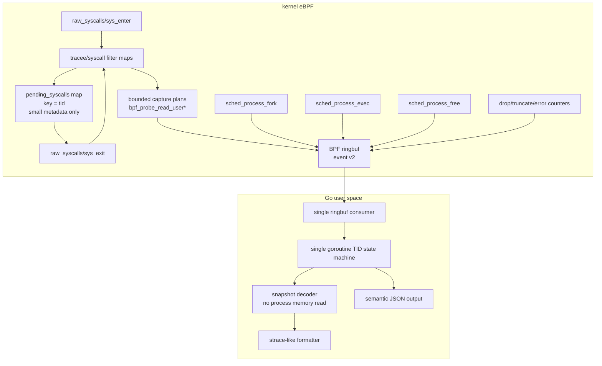

# strace-go pure eBPF architecture plan

本文档面向下一阶段重构：把 `strace-go` 从“eBPF 采样 + 用户态补读 + ptrace 兼容补丁”的混合架构，收敛成一个真正的 Go + eBPF syscall tracer。

核心结论：

- 旧架构问题曾经是结构性存在。当前主路径已经收敛掉 ptrace/procmem、旧 fixed-window carrier、大块 syscall fallback 字典和大部分用户态补读风险；剩余工作主要是继续补齐少数 nested payload，并把 upstream reference 子集按语义扩展。
- 最终产品不区分 `compat` 和 `ebpf-fast`。主线只有一条纯 eBPF syscall tracing 路径。
- 运行期 ptrace 必须从产品路径中删除。上游 `strace` 测试只能作为外部参考，不能对应一个 ptrace 兼容模式。
- 目标不是复刻 ptrace 的冻结语义，而是复刻 `strace` 的主要 syscall 观测体验。

## 1. 当前架构问题是否还存在

答案：历史上确实存在，而且是结构性存在；当前实现已经完成大部分主路径收敛，剩余问题集中在收口和覆盖面。

### 1.1 ptrace 依赖仍然没有从主代码彻底断开

旧实现曾经引入过 `--mode=ebpf-fast` 和 `--mode=compat` 这样的临时分流，但最终目标不能保留这种产品模式。历史代码层面存在过两套耦合：

- `cmd/strace-go/session.go` 中 `startAndTraceCmd` 使用 `SysProcAttr{Ptrace: true}`、`PtraceSetOptions` 和 `PtraceCont`。
- `reapTracees()` 以 ptrace wait/reap 模型管理 tracee 停止和继续。
- `pkg/procmem/reader.go` 保留过 `PtracePeekData` 作为最终 fallback。
- 多个 handler 曾通过 `ctx.MemReader.ReadRobust()` 在事件到达用户态后读取 tracee 内存。

这说明旧实现不只是入口分流问题，共享 handler/decoder 也允许走回旧路径。当前主产品路径已经删除这条回路；后续收口重点是防止新增 handler 或 reference 修复重新引入 Go 侧补读。

### 1.2 用户态异步内存读取仍然是根本 TOCTOU

旧 `pkg/event/decoder.go` 的 `DecodeString` 曾在 BPF buffer 不完整时 fallback 到 `MemReader.ReadRobust()`；当前实现已经是 snapshot-only：BPF 快照缺失或不可用时输出原始指针。

这在纯 eBPF 模式下不可接受：

- syscall enter/exit 时用户内存状态是当时的状态。
- ringbuf 事件到达 Go 时，tracee 可能已经继续运行、复用 buffer、exec 或退出。
- 用户态再读 `/proc/$pid/mem` / `process_vm_readv` 得到的是“后来状态”，不是 syscall 发生时的快照。

所以纯 eBPF 路径的原则必须是：

> 所有 syscall 参数内存快照只能在 BPF probe 里通过 `bpf_probe_read_user*` 完成。Go 侧不能补读 tracee 内存。

### 1.3 BPF map 中保存大事件对象，吞吐成本过高

当前 `bpf/strace.c` 中：

- `struct bpf_event` 内含大 `str_arg` buffer。
- `heap` 是 per-CPU scratch。
- `events_map` 是普通 HASH map，value 是整个 `struct bpf_event`。
- `sys_enter` 后会 `bpf_map_update_elem(&events_map, &tid, e, BPF_ANY)`。
- `sys_exit` 再从 `events_map` 取回大对象、补 ret/payload、ringbuf 输出并删除。

这个模型的问题：

- 每次 enter 都可能把接近 10KB 的对象复制进 hash map。
- 高频 syscall 下 hash map value copy 会成为主要开销。
- 大 value 会加重 verifier、内存占用和 cache 压力。
- 对于大部分 syscall，enter->exit 需要保存的只是几十字节元数据，不需要保存整个输出事件。

新模型必须把 hash map 缩小成“pending metadata map”，大 payload 只进入 ringbuf。

### 1.4 用户态事件处理不是单协程状态机

Phase 3 之前，`run()` 中有单独 goroutine 读 ringbuf，再通过 `eventChan` 投递给主循环。当前主路径已经切到同一 goroutine 内 `ReadInto -> decode -> handleEvent`。

同时存在全局状态和 mutex：

- `lastSuspendedSyscall` + `lastSuspendedSyscallLock`
- `pendingExecArgs` + `pendingExecArgsLock`
- handler 内还有其他 cache lock

旧模型不是用户提出的“单 goroutine 无锁事件状态机”。对于主线纯 eBPF 实现，事件处理应收敛为：

- 同一个 goroutine 读取 ringbuf、解码、更新 pending map、打印、更新 fd/cwd/lifecycle 状态。
- 不用 mutex 管理 syscall enter/exit 输出状态。
- 允许一个非事件 goroutine 等待目标进程退出，但它不能处理事件，也不能修改 syscall 状态机。

### 1.5 生命周期模型仍然脆弱

当前 BPF 侧已经有 `sched_process_fork`，但 exec/exit/thread 生命周期仍主要靠 raw syscall enter/exit、`pending_exec_map`、`main_exited_map` 等补丁拼接。

这在这些场景下很脆：

- 非 leader thread execve。
- execve 成功后线程组收缩。
- fork/clone/exec/exit storm。
- tracee 退出导致 pending map 清理不完整。
- attach 模式下已有线程和后续 clone 的继承关系。

新模型应把生命周期当成一等事件，而不是 syscall formatter 的副作用。

### 1.6 BTF 不能独立定义 strace 语义

当前 `cmd/generate-syscalls`：

- 使用 `github.com/cilium/ebpf/btf` 从 `__x64_sys_*`、`__do_sys_*`、`ksys_*` 抽取参数。
- syscall id/name 以本机 `golang.org/x/sys/unix` 为主源，formatter 的 arity/flags 使用 checked-in semantic catalog；默认生成链不读取 `strace-upstream`。
- BTF 函数签名不足时读取 syscall tracepoint format；仍无法解析的历史 syscall 显式生成 dummy metadata，不回退到通用手写签名字典。
- `semanticOverrides` 只保留有 reason 和双边签名测试的 strace-facing ABI 差异。
- payload capture 由 syscall-specific direct TLV helper 显式实现，不再由 `capture_rules.yaml` 生成固定窗口策略。

这里需要区分两件事：

- syscall 签名可以尽量从 BTF/unistd 生成。
- strace 语义捕获策略不能完全从 BTF 推导。

BTF 能告诉我们参数名和 C 类型，但不能完整告诉我们：

- 哪个指针是 path。
- 哪个 buffer 是 IN，哪个是 OUT。
- buffer 长度来自哪个参数或返回值。
- `ioctl`、`bpf`、`setsockopt`、`msghdr`、`iovec` 等嵌套结构怎么截断。
- 哪些字段应该作为 xlat flags 解码。

因此重构目标应是“禁止手写 syscall 签名”，而不是“禁止任何人工 capture policy”。

## 2. 目标契约

### 2.1 单一路径契约

`strace-go` 的产品路径只有纯 eBPF 实现：

- 禁止运行期 ptrace。
- 禁止 Go 侧读取 tracee 内存。
- 所有用户内存快照只在 BPF probe 中完成。
- syscall enter/exit 都作为事件流的一部分输出给 Go。
- Go 侧使用单 goroutine 状态机做 enter/exit 配对、unfinished/resumed、fd/cwd/lifecycle 更新。
- 输出是 strace-like，不承诺 ptrace-equivalent。
- 上游 `strace` exact diff 只作为兼容参考，不作为主门禁。

### 2.2 旧 ptrace 路径处置契约

旧 ptrace 相关代码不能作为运行时模式继续存在：

- `--mode=compat`、ptrace reaper、ptrace memory fallback 都应进入移除清单。
- 如果迁移阶段需要对照旧行为，只能依赖 git history、临时实验分支或独立测试基线，不能在主产品 CLI 暴露。
- upstream 测试保留为 reference suite，但它运行的对象仍然是纯 eBPF 实现。
- 对 upstream exact diff 不稳定的测试，应降级为 relaxed/semantic assertion 或明确标记为非契约。

### 2.3 明确不支持的 ptrace 等价语义

纯 eBPF 模式不承诺：

- 冻结 tracee 后任意读取用户内存。
- syscall 注入、修改 syscall nr/args/ret。
- ptrace stop 顺序、signal-delivery-stop、group-stop 语义。
- stdout/stderr 与 trace 输出的严格交错。
- 深层可变内存图的无限展开。
- 对所有 upstream `strace` tests 做 byte-for-byte exact diff。

## 3. 目标架构总览



## 4. 内核态设计

### 4.1 BPF event v2

当前 `struct bpf_event` 同时承担：

- pending enter 状态。
- output event。
- payload buffer。
- exec 特殊 snapshot。
- probe 状态。

这导致 map value 巨大且难以演进。新结构应拆分。

建议定义统一 header：

```c
enum event_type {
    EVENT_SYS_ENTER = 1,
    EVENT_SYS_EXIT = 2,
    EVENT_LIFECYCLE = 3,
    EVENT_LOST = 4,
};

struct event_header {
    __u16 version;
    __u16 type;
    __u16 flags;
    __u16 header_len;
    __u32 size;
    __u32 pid;
    __u32 tid;
    __u32 sys_id;
    __u64 seq;
    __u64 ts_ns;
};
```

syscall enter event：

```c
struct syscall_enter_event {
    struct event_header h;
    __s64 ret;
    __s32 probe_ret_enter;
    __s32 probe_ret_exit;
    __u64 args[6];
    __u32 capture_len;
    __u32 capture_flags;
    __u8 payload[];
};
```

syscall exit event：

```c
struct syscall_exit_event {
    struct event_header h;
    __s64 ret;
    __u64 duration_ns;
    __u64 args[6];
    __u32 capture_len;
    __u32 capture_flags;
    __s32 stack_id;
    __u32 reserved;
    __u8 payload[];
};
```

payload 使用 section/TLV，而不是固定 `str_arg`：

```c
enum payload_kind {
    PAYLOAD_STRING = 1,
    PAYLOAD_BYTES = 2,
    PAYLOAD_STRUCT = 3,
    PAYLOAD_IOVEC = 4,
    PAYLOAD_SOCKADDR = 5,
    PAYLOAD_EXEC_ARGS = 6,
};

struct payload_section {
    __u16 kind;
    __u16 arg_index;
    __u16 flags;
    __u16 reserved;
    __u32 user_len;
    __u32 copied_len;
    __s32 probe_ret;
    __u64 user_ptr;
    __u8 data[];
};
```

收益：

- Go 侧可以按 section 解码，不再依赖魔法 offset。
- BPF 可以只输出实际需要的 payload。
- JSON 测试可以直接断言 section。
- 后续新增 syscall capture 不破坏老字段。

### 4.2 map 设计

建议 map：

```c
events: BPF_MAP_TYPE_RINGBUF
tracee_filter: BPF_MAP_TYPE_HASH
syscall_filter: BPF_MAP_TYPE_HASH or ARRAY bitmap
pending_syscalls: BPF_MAP_TYPE_HASH
config_map: BPF_MAP_TYPE_ARRAY
stats_map: BPF_MAP_TYPE_PERCPU_ARRAY
```

`pending_syscalls` value 只保存小元数据：

```c
struct pending_syscall {
    __u32 pid;
    __u32 tid;
    __u32 sys_id;
    __u32 flags;
    __u64 enter_ts_ns;
    __u64 args[6];

    /* bounded pointer metadata for exit capture */
    __u64 out_ptr0;
    __u32 out_len0;
    __u16 out_arg0;
    __u16 out_kind0;

    __u64 out_ptr1;
    __u32 out_len1;
    __u16 out_arg1;
    __u16 out_kind1;
};
```

禁止再把完整 output event 放进 hash map。

### 4.3 sys_enter 策略

`sys_enter` 做四件事：

1. 读取 pid/tid/sys_id。
2. 做 tracee filter 和 syscall filter 下推。
3. 根据 capture plan 拷贝 IN 参数，输出 `EVENT_SYS_ENTER`。
4. 把 exit 阶段需要的指针和长度放入 `pending_syscalls`。

对于 IN 参数：

- path：`bpf_probe_read_user_str`，上限 4096 或配置值。
- write/sendto payload：`bpf_probe_read_user`，上限默认 512，可由 CLI 调整。
- iovec：先拷贝 iovec 数组的 bounded prefix，再拷贝每个 iov 的 bounded prefix。
- execve argv/envp：只拷贝前 N 个指针和每个字符串前 M 字节。
- ioctl/bpf_attr/msghdr：按 capture policy 拷贝固定头和 bounded nested fields。

### 4.4 sys_exit 策略

`sys_exit` 做五件事：

1. 查 `pending_syscalls[tid]`。
2. 读取 ret，计算 duration。
3. 根据 ret 和 enter 保存的 out pointer metadata 拷贝 OUT 参数。
4. 输出 `EVENT_SYS_EXIT`。
5. 删除 `pending_syscalls[tid]`。

对于 OUT 参数：

- `read(fd, buf, count)`：`copy_len = min(ret, count, max_payload)`，只在 `ret > 0` 时拷贝。
- `recvfrom`：exit 拷贝 buffer、sockaddr、addrlen。
- `getcwd/readlink`：exit 根据 ret 拷贝输出 buffer。
- `accept/getsockname/getpeername`：enter 保存 addr/addrlen 指针，exit 拷贝实际 addrlen。
- `pipe/socketpair`：exit 拷贝 fd array。

### 4.5 ringbuf reserve 与失败策略

使用 `bpf_ringbuf_reserve`，但必须有严格边界：

- 每条 event 最大 payload 固定上限，例如 8KB 或 16KB。
- 字符串、buffer、iovec、exec argv/envp 分别有独立上限。
- reserve 失败时增加 `stats_map.reserve_fail`。
- payload 被截断时设置 `EVENT_F_TRUNCATED` 和 section `copied_len < user_len`。
- probe 失败时保留 section 元数据和 `probe_ret`，Go 侧可以打印指针地址或 `???`。

不要把 ringbuf event 当成无限 scratch。所有变量长度都必须被 verifier 可证明地 clamp。

### 4.6 生命周期 tracepoints

必须引入生命周期事件：

- `sched:sched_process_fork`
- `sched:sched_process_exec`
- `sched:sched_process_exit` 或 `sched:sched_process_free`

生命周期事件用于：

- fork/clone 后继承 trace filter。
- exec 成功后更新 pid/tid/thread group 状态。
- exit/free 后清理 `pending_syscalls`。
- Go 侧打印 `+++ exited with N +++` 或维护 pid/tid 活性。

`raw_syscalls/sys_enter(exit)` 仍可用于打印 exit syscall 本身，但不应用它承担所有状态清理。

## 5. 用户态设计

### 5.1 单 goroutine 事件处理

主线纯 eBPF 实现的主循环应收敛成：

```go
for {
    rec, err := ring.Read()
    if done && timeoutDrain {
        break
    }
    ev := decodeEventV2(rec.RawSample)
    state.Handle(ev)
}
```

事件处理 goroutine 内维护所有 syscall 状态：

```go
type TraceState struct {
    pending map[uint32]*PendingSyscall // key = tid
    tasks   map[uint32]*TaskState      // key = tid
    fds     map[FDKey]*FDState
    stats   map[uint32]*SyscallStat
}

type PendingSyscall struct {
    Enter       *SyscallEvent
    PrintedHalf bool
    ArgText     []string
    LinePrefix  string
}
```

允许存在一个等待目标进程退出的 goroutine，但它只能关闭 done channel，不能读写 `TraceState`。

### 5.2 enter/exit 输出状态机

规则：

1. 收到 `EVENT_SYS_ENTER`：
   - 解码 enter payload。
   - 缓存到 `pending[tid]`。
   - 默认不打印。

2. 收到任意其他 TID 的事件：
   - 扫描 pending 中未完成且未打印 half 的 syscall。
   - 对这些 syscall 打印 `syscall(args <unfinished ...>`。
   - 标记 `PrintedHalf = true`。
   - 不使用 timer，纯事件驱动。

3. 收到 `EVENT_SYS_EXIT`：
   - 找 `pending[tid]`。
   - 合并 enter args、exit payload、ret、duration。
   - 如果未打印 half，打印完整一行。
   - 如果已打印 half，打印 `<... syscall resumed>) = ret`。
   - 删除 `pending[tid]`。

4. 收到 lifecycle exit/free：
   - 清理该 tid pending。
   - 如果 pending 已打印 half，可打印中止/退出提示。

注意：触发 unfinished 的比较对象应该是 TID，不是进程。一个进程内两个线程交错也要触发。

### 5.3 handler 与 decoder 分层

旧 handler 曾经可以直接读 `ctx.MemReader`。纯 eBPF 模式必须持续禁止这条路径回流。

建议引入两套接口：

```go
type SnapshotReader interface {
    Section(arg int, kind PayloadKind) (PayloadSection, bool)
}

type MemoryReader interface {
    Read(pid int, addr uint64, size int) ([]byte, error)
    ReadRobust(pid int, addr uint64, size int, waitOnZero bool) ([]byte, error)
}
```

纯 eBPF handler context：

- 有 `SnapshotReader`。
- 没有 `MemoryReader`，或者 `MemoryReader` 是一个会返回明确错误的 forbidden reader。

不再提供 ptrace/procmem handler context。这样可以强制测试发现“某个 handler 在纯 eBPF 路径里偷偷补读内存”的问题。

### 5.4 fd/cwd/path 状态

fd/path 状态不能依赖 ptrace，也不能依赖异步 `/proc` 快照：

- 启动/attach 时不读取 tracee 的 `/proc/$pid/fd`、cwd 或 fdinfo；既有 FD/cwd 状态从事件视角标记为 unknown。
- 后续只由 syscall/lifecycle 事件维护：
  - `open/openat/openat2/creat` 成功后记录 fd -> path。
  - `close/close_range/dup/dup2/dup3/fcntl(F_DUPFD*)` 更新 fd map。
  - `chdir/fchdir` 更新 cwd。
  - `fork/clone` 继承 fd/cwd 状态。
  - `exec` 只按 lifecycle 与已观测的 close-on-exec 信息更新；无法从事件确定的 fd 保持 unknown，不做懒刷新。

这部分是 event-sourced best-effort；如果 probe 点没有携带足够 metadata，就保留 unknown，不用查询时快照伪造结果。

## 6. syscall 元数据与生成器

### 6.1 生成器目标

目标文件：

- `pkg/meta/syscall_table.go`：syscall id/name/arg/type/flags。
- `cmd/strace-go/bpf_bpfel.go` / `cmd/strace-go/bpf_bpfeb.go`：由 bpf2go 生成的 BPF object 绑定。

目标原则：

- syscall 基础签名尽量由 BTF/系统头生成。
- 不再维护大量手写 syscall signature override。
- syscall payload 捕获由 `bpf/syscall_*_direct_event_v2.h` 专项 direct TLV helper 表达，不再生成 fixed-window capture switch。
- 生成器输出必须稳定，避免每次构建大面积无关 diff。

### 6.2 BTF 来源策略

优先级建议：

1. 如果内核 BTF 暴露 `trace_event_raw_sys_enter_*` / syscall tracepoint struct，则从 tracepoint struct 提取参数名和类型。
2. 否则从 `__do_sys_*` 函数 BTF 提取，再 fallback 到 `__x64_sys_*` / `ksys_*`。
3. 如果函数 BTF 只有 `pt_regs` wrapper 或没有可用签名，则读取 syscall tracepoint 的 `format` 文件提取字段；这不是运行期数据源，只是生成阶段的内核元数据 fallback。
4. 仍无法得到签名时才使用 dummy 参数；syscall number 来自本机 arch 的 `unix.SYS_*` 或系统 `unistd_*.h`。
5. 对名称差异维护小型 alias 表，例如 `newfstatat`、`mmap_pgoff`、`newstat`。

不能假设所有 kernel 都有 per-syscall tracepoint BTF。生成器必须有 fallback。

### 6.3 payload capture 不再由旧 policy 生成

旧 `capture_rules.yaml` / `syscall_capture.h` 链路已经删除。它曾把 strace-like payload 捕获规则翻译为针对 `bpf_event.str_arg` 的固定窗口拷贝代码，但这与 event v2/TLV 和 no fixed-window carrier 的最终架构冲突。

当前约束：

- BTF/unistd 只负责“它是什么 syscall、参数叫什么、类型是什么”。
- “为了 strace-like 输出，需要拷贝哪些内存”由 syscall-specific direct TLV helper 显式实现。
- 构建流程不再生成 `syscall_capture.h`，源码门禁测试要求旧 `capture_rules.yaml`、`syscall_capture.h` 和 `gen_bpf_capture.go` 不存在。

## 7. 测试体系

### 7.1 主门禁

主门禁不做 upstream byte diff，做语义测试：

- enter/exit 成对。
- 同一 TID 内 syscall 顺序正确。
- filter 下推后无关 syscall 不进 ringbuf。
- IN 参数在 enter 时快照。
- OUT 参数在 exit 时快照。
- fork/exec/exit 生命周期状态正确。
- 无 ptrace 行为。
- ringbuf reserve fail/drop/truncate 有可观测计数。

### 7.2 no-ptrace gate

需要持续维护专门测试：

- 启动目标后，目标进程 `TracerPid` 应为 0。
- 源码层面主路径不依赖 `procmem.Reader`。
- 运行 `--event-format=json` 时，任何 handler 触发用户态 tracee memory reader 都应失败测试。

可以实现一个 `forbiddenMemoryReader`：

```go
type forbiddenMemoryReader struct{}

func (forbiddenMemoryReader) Read(...) ([]byte, error) {
    return nil, ErrMemoryReadForbidden
}
func (forbiddenMemoryReader) ReadRobust(...) ([]byte, error) {
    return nil, ErrMemoryReadForbidden
}
```

测试中要求主路径不产生这个错误。

### 7.3 fixture 覆盖

第一批 fixture：

- `open/read/write/close`
- failed syscall，例如 `openat` 返回 `ENOENT`
- path 参数
- buffer payload
- `fork/exec/exit`
- attach 到已进入阻塞 syscall 的进程，验证启动握手与 orphan exit 统计
- 多线程 syscall storm
- long path truncation
- read/write 大 payload truncation
- iovec readv/writev
- sockaddr connect/accept

### 7.4 性能门禁

固定 workload：

- 高频 `getpid`：测空 syscall event 成本。
- 高频 `clock_gettime`：测高频短 syscall。
- 高频 `write` 小 buffer：测 payload 拷贝和 ringbuf。
- 高频 `read`：测 exit OUT buffer。
- fork/exec storm：测 lifecycle map 清理。
- 多线程 storm：测 pending map 和 unfinished/resumed。

指标：

- events/s
- ringbuf reserve fail
- dropped events
- truncated sections
- Go alloc/op
- Go heap growth
- pending map stale count

## 8. 分阶段落地计划

### Phase 0: 冻结边界和测试

目标：

- 确认产品路径只有纯 eBPF。
- 明确禁止 ptrace/procmem。
- 当前语义测试继续可运行。

改动：

- README/arch 文档明确单一路径契约。
- 移除或废弃 `--mode=compat` / `--mode=ebpf-fast` 的产品语义。
- 删除 ptrace 启动、ptrace reaper、`PtracePeekData` fallback。
- 增加 no-ptrace/no-procmem 测试骨架。
- 给主路径加 forbidden memory reader 测试入口。

验收：

- `go test ./cmd/... ./pkg/...`
- `python3 test/run_tests.py --suite ebpf-semantic`
- `python3 test/run_tests.py --suite ebpf-perf --skip-build`

### Phase 1: event v2 垂直链路

目标：

- 新增 event v2，不立即删除旧 event。
- 先支持 `getpid/openat/read/write/close/execve`。

改动：

- BPF 新增 `event_header`、enter/exit event。
- Go 新增 event v2 decoder。
- JSON 输出暴露 `event_type=enter/exit` 和 payload sections。
- old formatter 可先继续用旧 event，semantic test 先走新 JSON。

当前落地：

- `struct bpf_event` 已带 `event_version`、`event_type`、`event_flags`。
- `--event-format=json` / `--debug-events` 会通过 `CONFIG_EMIT_ENTER` 打开通用 enter 事件。
- 通用 enter 事件打 `EVENT_FLAG_GENERIC_ENTER`，Go 侧直接输出 JSON，不触发 handler、fd 状态更新或用户态内存补读。
- exit/full 事件继续服务现有 handler 和文本 formatter，JSON 输出会标注 `event_type=exit`。

验收：

- fixture 能看到 enter/exit。
- `read` payload 来自 exit。
- `write/openat/execve` payload 来自 enter。

### Phase 2: pending map 瘦身

目标：

- `pending_syscalls` 不再保存完整 `bpf_event`。
- map value 缩到百字节级。

改动：

- 移除 `events_map` 大 value 依赖。
- enter 输出 enter event，并只保存 exit capture metadata。
- exit 从 pending metadata 生成 exit event。

当前落地：

- BPF `events_map` 已替换为 `pending_syscalls`。
- `pending_syscalls` value 只保存 `enter_time`、6 个原始参数、pid/tid/syscall id 和 stack id，不再保存 `str_arg` 大缓冲。
- `sys_exit` 不再使用 per-cpu `heap` 或 `struct bpf_event` 重建 exit/full event；fallback syscall 也直接从 compact pending metadata 合成 no-payload event v2。
- 文本 formatter 现在消费 event v2 + semantic payload sections；未专项 payload 的 syscall 保留 args/ret/duration，不再重新执行 fixed-window capture。
- `TestPendingSyscallsMapUsesCompactValue` 直接解析嵌入 BPF object，防止 pending map value 回退到大结构。

验收：

- 高频 getpid/write 性能明显提升。
- BPF map value size 明显下降。
- stale pending 可由 lifecycle/free 清理。

### Phase 3: Go 单 goroutine 状态机

目标：

- 主路径不再用 event reader goroutine + eventChan 处理 syscall。
- 移除 `lastSuspendedSyscallLock`、`pendingExecArgsLock` 在 syscall 状态机路径中的使用。

改动：

- 新建 `pkg/trace/state.go`。
- `TraceState.Handle(event)` 内部维护 pending map。
- 实现事件驱动 `<unfinished ...>` / `<... resumed>`。
- 删除旧 ptrace/reaper 输出状态机在产品路径中的入口。

当前落地：

- `session.run` 已移除 event reader goroutine 和 `eventChan`，主循环在同一 goroutine 内委托 `TraceEventReader.Read` / `DrainAfterDone` 完成 ringbuf 读取、record 解码和 `TraceEventRouter` 路由。
- 目标命令的 `cmd.Wait()` 只保留为生命周期通知 goroutine，不读取 ringbuf、不处理事件、不修改 syscall 状态机；attach pid 存活检查在主循环中轮询。
- BPF 程序挂载已从 `session.go` 内 150 行线性 attach 块收敛到 `bpfAttacher`（`cmd/strace-go/bpf_attach.go`）：raw syscall/lifecycle tracepoint 以表驱动 required spec 声明，recvmsg kretprobe 作为独立的 best-effort attacher 方法；`setupBPF` 只负责 spec 加载、syscall id 变量解析（`setSyscallVariables` 返回 error 而非直接 fatal）和委托挂载。源码门禁同步改为同时扫描 session.go 与 bpf_attach.go，并覆盖 required attach policy、变量解析和回滚单元测试。
- tracee 初始 execve 已可观测：`arm_fork_map` 在 fork 前武装（`sched_process_fork` 以父进程 tgid 匹配，覆盖 os/exec 从任意 runtime 线程 fork 的情况），子进程在首次 exec 前通过 `pre_exec_map` 抑制 Go os/exec 内部 fd 设置 syscall（fcntl/dup3 等），只放行 exec 家族；exec 时无条件解除抑制，避免 arm 竞态残留。退出行 fallback 改用当前 mono 时间戳，不再显示 boot 相对时间。
- `io_submit` 的 iocb 数组、PREADV/PWRITEV 嵌套 iovec 与 PWRITE 数据 buffer 已拆到三个专项 raw syscalls program（`trace_sys_enter_aio`/`_aio_iovec`/`_aio_buf`），各自 bounded 捕获避免 verifier 超限，Go formatter 渲染 iocb 列表与嵌套内容而非裸指针。
- lifecycle 事件现在始终发射（不再只在 JSON 模式）：文本模式同样维护 task/fd 状态；`sched_process_exit` 直接从退出任务读取 tid/tgid 与 `task_struct.exit_code`（tracepoint 结构布局不可靠），Go 侧为已 exec 任务、线程与 attach 目标渲染 `+++ exited with N +++`，并跳过 os/exec 中间进程。命令退出行的 wait fallback 在 wait 完成后短宽限内 flush；`attach-f-p` 通过，`attach-p-cmd` 的跨任务 exact exit 顺序仍受纯 eBPF 异步观察限制。
- `strace-C` 标记为预期失败：上游 `-c` 汇总按 per-syscall CPU 时间计，纯 eBPF 只能观测 wall-clock 时长，属于测量语义差异；runner 同时修复了 `sleep-timing` 的构建（补 `-I../src` 与 libtests 链接），`strace-r`/`strace-T_upper` 已通过。
- 结束时使用 `ringbuf.Reader.Flush()` drain 剩余事件，再统一打印 summary、关闭 fd data files 和输出 pipe。
- Go 侧新增 per-session `pendingSyscalls map[tid]pending`，generic enter 事件进入 pending，exit 事件按 TID 消费 pending。
- JSON exit 事件带 `paired_enter=true`，semantic/perf 测试已把 read/write/getpid 的 enter/exit 配对作为门禁。
- execve 暂存参数和 suspended syscall 状态已从全局 map+mutex 迁入 `traceSession`，事件处理路径不再依赖这些 mutex。
- Go 侧已新增 `TraceState` 对象集中持有 pending syscall、exec 暂存、suspended syscall 和 task lifecycle map；`traceSession` 只组合状态对象，为后续 `TraceState.Handle(event)` 收口做准备。
- `TraceState.Handle(event)` 已作为状态更新单入口，负责 lifecycle task 更新、enter pending 记录、exit pending 配对和 lifecycle exit/free 的 pending 清理；`traceSession` 继续负责过滤、FD 状态和输出副作用。
- syscall exit/full 事件已引入 `syscallEventContext`，集中构建 syscall metadata、path 判定、BPF payload sections、raw string、过滤结果和 `handler.Context`；`handleEvent` 不再直接拼装这些派生字段，为后续拆 renderer/FD store 接口留出边界。
- fd path、offset 和 data file 句柄已收敛到 `FDStateStore`；`traceSession` 不再直接持有三张 fd map，只组合状态对象并通过 store 更新 syscall/lifecycle 副作用。
- syscall summary 聚合已收敛到 `SummaryStats`；`traceSession` 不再直接持有 summary 裸 map，事件路径只负责在过滤后记录，结束阶段委托对象输出 strace-like summary。
- exit status 排队已收敛到 `ExitStatusQueue`；`traceSession` 不再直接持有 Wait/ringbuf exit 竞态协调用的裸 map，只负责判断是否需要排队和执行输出副作用。
- syscall 时间前缀已收敛到 `TimeFormatter`；`traceSession` 不再直接维护 boot offset 或 relative-time last syscall timestamp，为后续文本 renderer 拆分保留清晰边界。
- 普通 syscall 文本行、exit 状态行、unfinished 行、exec resume 行、非 leader exec superseded 诊断、hexdump、SIGALRM 伪 signal 行和 stack trace 输出已收敛到 `TextRenderer`；`event.go` 只负责在完成状态/filter/handler 后把文本输出交给 renderer。
- syscall return text 格式化已迁出 `event.go`，作为 JSON/text 共享的独立 formatter，事件路由不再承载 errno、restart、特殊返回值文本规则。
- target/attach/follow-fork 事件准入已收敛到 `TraceScope` 值对象；`handleEvent` 不再直接展开 CLI attach pid 匹配逻辑。
- execve/execveat restart、leader resume 和非 leader superseded 输出状态已收敛到 `ExecSyscallOutput`；`event.go` 不再直接读写 pending exec 或 exit status queue 的 exec 特例。
- exit/exit_group 的 syscall 行、JSON 分流、quiet-exit 和 exit status queue 输出已收敛到 `ExitSyscallOutput`；`event.go` 不再直接编排 exit 输出副作用。
- BPF 合成的 suspended syscall probe 状态已收敛到 `SuspendedSyscallOutput`；`event.go` 不再直接打印 `<unfinished ...>` 或写 suspended syscall marker。
- text-mode syscall 输出链已收敛到 `SyscallTextOutput`，集中应用 status filter、suspended/exec 特例和普通 syscall renderer；`event.go` 只在 handler 解码后委托文本输出对象。
- JSON syscall 输出策略已收敛到 `SyscallJSONOutput`，集中处理 generic enter raw event、debug raw event、decoded JSON event 和 status filter；`event.go` 不再直接编排 JSON syscall 输出。
- syscall handler 解码和 FD state side effects 已收敛到 `SyscallHandlerRunner`；`event.go` 不再直接调用 `handler.Get`，也不再展开隐藏 FD-state syscall 的 handler/update 顺序。
- syscall exit/full event pipeline 已收敛到 `SyscallExitPipeline`，统一编排 debug raw JSON、arch_prctl suppress、summary-only、exit syscall、handler、JSON/text 输出和 FD offset/close 副作用；`event.go` 只负责构建 `syscallEventContext` 后委托。
- exit status wait/ringbuf 竞态协调已收敛到 `ExitStatusCoordinator`；`event.go` 不再承载 exit status queue 的排队、释放、丢弃和输出包装函数。
- 命令 wait 退出结果与 exit-status fallback 已收敛到 `TraceCommandExitHandler`；`traceRunState` 只维护完成判定、fallback 时钟和 attach 轮询，不再依赖完整 `traceSession` 或直接操作退出队列。
- `traceRunState` 构造只接收待等待的 command 和 attach PID 快照；session 仅在 `run` 入口组装依赖，状态对象不再读取 CLI/session 字段。
- event scope/state 分类、生命周期分流、enter JSON 和 exit pipeline 路由已收敛到 `TraceEventRouter`；`event.go` 只保留单入口委托。
- ringbuf `SetDeadline`、`ReadInto`、`Flush`、v2 decode 和事件路由已收敛到 `TraceEventReader`；它通过最小 reader/sink 接口可在无内核的单元测试中验证读取错误、drain 和路由时序。
- JSON raw/decoded/lifecycle 事件编码已收敛到共享的 `JSONEventWriter`；输出策略对象只负责筛选与消费语义，writer 复用单个 `json.Encoder`，避免每条事件重新创建编码器。
- 运行结束的 stats、summary、fallback flush 和输出 pipe 关闭已收敛到 `TraceRunFinalizer`；`session.run` 不再编排结束阶段副作用。
- event pipeline、JSON/text output、renderer、handler runner、lifecycle handler、exit status coordinator、event router、event reader 和 run finalizer 已改为 per-session 懒加载缓存，避免每条 syscall event 重复构建稳定协作对象。
- 普通 syscall 的通用 `<unfinished ...>` / `<... resumed>` 已收口到单 Goroutine event state machine：当其他 TID 的事件到达时，按 enter 时间和 TID 稳定排序待决 syscall，使用只读 handler decode 输出前半行；同一 TID 的 exit 消费 pending 后输出 resumed 行。
- unfinished 只影响 text mode；JSON/debug 不生成文本半行，也不会为此预解码 handler。BPF 合成的 nanosleep/signal probe 和 exec 非 leader 特例通过 `probeRetEnter`/pending 标记避免重复输出。

验收：

- 多线程 fixture 出现合理 unfinished/resumed。
- Go race test 不应依赖 syscall 状态 mutex。

### Phase 4: 切断 procmem

目标：

- handler 只能从 snapshot sections 解码。

改动：

- 新建 `SnapshotReader`。
- handler.Context 在主路径只暴露 `SnapshotReader`。
- 删除或迁移 handler.Context 中的 `MemReader` 字段。
- 高频迁移 handler：
  - path/open
  - read/write
  - readv/writev
  - socket addr
  - execve argv/envp
  - stat/time/select/futex 常用结构
- 对尚未迁移的复杂 syscall，打印 bounded raw/指针，不进行用户态补读。

验收：

- `forbiddenMemoryReader` 不被调用。
- semantic fixture 覆盖 path/buffer/exec/iovec。

当前落地：

- `event.Decoder` 已收敛为 snapshot-only decoder；字符串解码在 BPF snapshot 不完整时只输出指针，不再补读 tracee 内存。
- `handler.Context` 主路径只暴露 `SnapshotReader` / `PayloadSection`，不再提供 `MemReader` 或 `ReadRobust` 入口。
- `updateFDMap` 只通过 BPF snapshot 解码路径参数，不再直接补读 tracee 地址空间。
- `TestProductSourceHasNoRuntimePtraceOrProcmemDependency` 已扫描主产品源码，禁止重新引入 ptrace、`procmem`、`process_vm_readv`、`MemReader` 或 `ReadRobust` 运行时入口；`TestProductSourceHasNoProcfsDependency` 进一步禁止产品源码依赖 procfs，防止异步元数据快照回流。
- `handler` 的 fd/path 展示逻辑已从通用标量解码拆到独立 `decode_fd.go`，现在只消费 session 的 event-sourced FD state，不再从 procfs 或 filesystem stat 补 metadata。
- semantic fixture 已在 tracee 内检查 `TracerPid == 0`，作为运行期 no-ptrace gate。
- JSON `payload_sections` 已迁入共享 `handler.PayloadSection` 模型，`handler.Context.Section(arg, kind)` 可以按参数和 payload 类型复用同一份 BPF 快照。
- `read/pread64` 和 `write/pwrite64` 的 buffer formatter 只消费 `PayloadKindBytes` section，旧 fixed offset snapshot 会被忽略并退回指针输出。
- path/open 类参数 formatter、path filter 和 open fd/cwd 状态已只消费 `PayloadKindString` section，简单 arg0/arg1 path syscall 已补齐 JSON section 投影；事件上下文已移除旧 `RawStrArg` / JSON `raw_string` 字段，旧 fixed offset string buffer 会被忽略并退回指针输出或跳过 fd map 更新。
- `rename/link/symlink` 及其 `*at` 双 path syscall 已暴露两个 `PayloadKindString` sections，rename/link/symlink formatter 只消费 semantic payload section，旧 fixed offset snapshot 会被忽略并退回指针输出。
- `execve/execveat` 的 argv/envp snapshot 已暴露为 `PayloadKindExecArgs` section；direct BPF path 会在 probe 现场深拷贝 filename、argv records 和 verbose envp records，exec argv/envp decoder 只消费 semantic payload section，旧 fixed offset snapshot 会被忽略并退回指针输出。
- `getcwd/readlink/readlinkat` 已暴露 OUT `PayloadKindBytes` section，formatter 只消费 semantic payload section，旧 exit snapshot 会被忽略并退回指针输出。
- `pipe/pipe2/socketpair` 的 fd array 已暴露为 OUT `PayloadKindStruct` section，pipe formatter 和 fd 状态更新只消费 semantic payload section，旧 exit snapshot 会被忽略并退回指针输出或跳过 fd map 更新。
- `readv/writev/preadv/pwritev/preadv2/pwritev2/vmsplice` 与 `process_vm_readv/writev` 已暴露 `PayloadKindIovec` section，iovec formatter 只消费 semantic payload section，旧 enter snapshot 会被忽略并退回指针输出。
- `uname/sysinfo/getrlimit/setrlimit/prlimit64` 已暴露 `PayloadKindStruct` section，misc formatter 只消费 semantic payload section，旧 fixed offset snapshot 会被忽略并退回指针输出。
- `getitimer/setitimer` 已暴露 `itimerval` 的 `PayloadKindStruct` section，time formatter 只消费 semantic payload section，旧 fixed offset snapshot 会被忽略并退回指针输出。
- `get_robust_list` 已暴露 head/len 两个 OUT word 的 `PayloadKindStruct` section，handler 只消费 semantic payload section，旧 fixed offset snapshot 会被忽略并退回指针输出。
- `waitid` 已暴露 `siginfo_t` 和 `rusage` 的 OUT `PayloadKindStruct` sections，waitid handler 只消费 semantic payload section，旧 fixed offset snapshot 会被忽略并退回指针输出。
- `arch_prctl` 的 GET 类 OUT word 已暴露为 `PayloadKindStruct` section，handler 只消费 semantic payload section，旧 fixed offset snapshot 会被忽略并退回空 GET 输出。
- `sendfile/copy_file_range` 的 offset pointer 已暴露为 `PayloadKindStruct` section，formatter 只消费 semantic payload section，旧 fixed offset snapshot 会被忽略并退回指针输出。
- `mount/umount2/fsconfig` 已暴露字符串和二进制 value 的 sections，fs handler 只消费 semantic payload section，旧 fixed offset snapshot 会被忽略并退回指针输出。
- `getdents64` 已暴露 OUT `PayloadKindBytes` section，exit 阶段由 BPF direct helper 按 ret bounded 拷贝 arg1 dirent buffer，fs handler 只消费 semantic payload section，旧 exit snapshot 会被忽略并退回指针输出。
- `capget/capset` 已暴露 capability header/data sections，capset data capture policy 补齐为 enter snapshot，handler 只消费 semantic payload section，旧 fixed offset snapshot 会被忽略并退回指针输出。
- `cachestat` 已暴露 range/stats 的 `PayloadKindStruct` sections，handler 只消费 semantic payload section，旧 fixed offset snapshot 会被忽略并退回指针输出。
- `openat2` 已暴露 `open_how` 的 `PayloadKindStruct` section，handler 只消费 semantic payload section，旧 fixed offset snapshot 会被忽略并退回指针输出。
- `rt_sigaction/rt_sigprocmask/rt_sigsuspend` 已暴露 sigaction/sigset 的 `PayloadKindStruct` sections，signal handler 只消费 semantic payload section，旧 fixed offset snapshot 会被忽略并退回指针或空 sigset 输出。
- `fcntl/fcntl64` 已按 command 暴露 arg2 的 8/32 字节 `PayloadKindStruct` section，fcntl handler 和通用 flock/f_owner_ex decoder 只消费 semantic payload section，旧 fixed offset snapshot 会被忽略并退回指针输出。
- `prctl` 已按 option 暴露 name 的 `PayloadKindString` section 和 GET 类 uint32 OUT `PayloadKindStruct` section，handler 只消费 semantic payload section，旧 fixed offset snapshot 会被忽略并退回指针输出。
- `SnapshotReader` 接口已收敛为只暴露 `PayloadSection` 查询；`handler.Context` 上旧的 `EnterArgSnapshot`、`ExitSnapshot`、`FetchStructData*` 和 decode fallback 方法已删除，防止新 handler 继续依赖固定 offset snapshot API。
- `handler.Context.Ptr`、`DataLen` 和 `StrArgBuf` 已删除；生产 handler 只能通过 payload sections 获取 BPF 快照。

### Phase 5: filter 下推

目标：

- 无关 syscall 不进入 ringbuf。

改动：

- BPF 增加 syscall bitmap/hash。
- CLI `-e trace=...` 更新 BPF filter map。
- negated filter 在 BPF 侧处理。
- 用户态 status filter 可保留在 Go，因为 ret 需要 exit 后才知道。

验收：

- `-e trace=write` fixture 中 ringbuf 不出现 open/read/close。
- perf workload 下 filtered syscall events/s 和 Go alloc 下降。

当前落地：

- BPF 已新增 `syscall_filter_map`，`raw_syscalls/sys_enter` 在创建事件和保存 pending 前执行 syscall filter。
- Go 侧通过 `TraceSyscalls` 和 `TraceSyscallRegexps` 解析 syscall id，并写入 BPF filter map；negated trace filter 由 BPF config 位处理。
- `--debug-events` 已作为 BPF 已交付事件 oracle；semantic suite 使用 `--debug-events -e trace=write` 验证 raw syscall 事件只包含 `write`。
- Go 层 `path/fd` filter 已从 `poll/ppoll` pollfd payload 和 `select/_newselect` fd_set payload 派生 fd 集合，避免纯 eBPF payload 已捕获但过滤视图仍只看标量 fd 参数。
- `path/fd/status` 过滤明确保留在 Go 层：path 过滤消费 enter/exit 合并后的 bounded TLV，fd 过滤依赖 `FDStateStore` 的 fork/exec/close/offset 生命周期状态，status 还包含 `unfinished/unavailable/detached` 等用户态观察结果；不为部分 status 或 fd 标量过滤增加第二套 BPF policy/control event 协议。syscall name/class/negation filter 仍在 BPF 入口下推，作为 ringbuf 降载的主要策略。

### Phase 6: 生命周期 tracepoint 重构

目标：

- fork/clone/exec/exit/free 不再靠 syscall 特例拼状态。

改动：

- 增加 `sched_process_exec`、`sched_process_exit/free` BPF event。
- Go TaskState 维护 tgid/tid/parent/alive/exe。
- BPF pending map 在 free/exit 时清理。
- filter 继承从 fork/clone lifecycle 统一处理。

验收：

- fork/exec storm 无 pending 泄漏。
- 非 leader thread execve 有稳定输出策略。
- tracee 全退出后 drain ringbuf 并正常结束。

当前落地：

- BPF 已新增 `sched_process_exec`、`sched_process_exit`、`sched_process_free` tracepoint，并把 `sched_process_fork` 从仅 filter 继承扩展为可观测 lifecycle event。
- JSON/debug 模式会通过 `CONFIG_EMIT_LIFECYCLE` 输出 `type=lifecycle` 事件，包含 `fork/exec/exit/free` action。
- `sched_process_exit/free` 现在从当前任务的 `(TGID,TID)` 解析身份：`pending_syscalls` 始终按 TID 清理，非 leader 只清理自己的 `pre_exec/filter` 条目，`pending_exec_map/main_exited_map` 等进程级状态由 leader 路径负责。non-leader exec 替换旧 leader 时，CO-RE `group_exec_task` guard 会跳过伪进程退出，只清旧 leader 的 TID pending；Go `LifecycleEventHandler` 同样只在真实 leader 退出时清理进程级 fd/cwd/offset 状态。
- Go 主事件循环会早期识别 lifecycle event，清理 session 内 pending syscall/exec/suspended 状态，并在 JSON/debug 输出中暴露生命周期事件。
- semantic suite 已断言 fixture 中存在 `fork`、`exec`、`exit/free` lifecycle event。
- Go 侧已新增 per-session `TaskState`，由 syscall 事件和 lifecycle event 维护 `tid/tgid/parent/alive/execed`；JSON lifecycle 输出携带 task 状态快照，semantic suite 断言 fork child、execed、exit/free dead 状态。
- fork lifecycle event 会把父进程的 fd/cwd、fd offset 和可 seek 数据文件状态继承到子进程；exit/free 会清理对应 pid 的 fd/cwd、offset 和数据文件状态。
- fork/exit/free 对 fd/cwd、offset 和 data file 的继承/清理已通过 `FDStateStore` 统一执行，lifecycle 事件路径不再直接操作 session 内部 fd map。
- exec lifecycle event 会从 `sched_process_exec` 的 tracepoint data 中拷贝 filename snapshot，JSON lifecycle 输出 `filename` 字段，semantic suite 断言 child exec filename。
- BPF lifecycle event 已切换为 event v2 header + lifecycle body + optional snapshot payload；Go event v2 decoder 会直接解码 lifecycle action、args 和 exec filename snapshot。
- BPF lifecycle event 发送已绕开 `struct bpf_event` / `str_arg` carrier，直接 reserve event v2 ringbuf record、写入 header/body，并把 exec filename snapshot 直接写入 ringbuf dynptr payload。
- 非 leader execve 文本策略以 `tid != tgid` 判定线程 exec，而不是比较最初 target pid；fork child leader execve 走普通 exec resume 输出，真正非 leader execve 输出 superseded/resumed 诊断并以 TGID 作为被替换线程组前缀。
- 独立 `ebpf_thread_fixture.c` 由 `pthread` worker 先执行阻塞 read/getpid，再从 non-leader TID `execve("/bin/true")`；semantic suite 断言旧 TID syscall 配对、exec lifecycle 向 leader 身份迁移、最终 exit 保留 executable，以及 unfinished/resumed/superseded 文本。本机实测为 24 个 syscall、5 个 lifecycle 事件，所有 pending/runtime error counter 为 `0`。
- JSON/lifecycle 模式在目标命令 wait 可见后会执行 bounded idle drain，避免真实 `sched_process_exit/free` 事件稍晚进入 ringbuf 时被过早结束漏读；文本模式仍保持立即 flush。
- Go 侧 lifecycle 副作用已收敛到 `LifecycleEventHandler`，统一处理 fork fd/cwd 继承、exit/free 进程状态清理和 JSON lifecycle 输出 gating；`event.go` 只负责把 `TraceState` 更新结果委托出去。

### Phase 7: BTF 生成器重构

目标：

- 减少手写 syscall 签名。
- capture policy 和 signature metadata 分离。

改动：

- `cmd/generate-syscalls` 拆成：
  - `btf_loader.go`
  - `sysnum_unix.go`
  - `gen_go_meta.go`
- 删除通用 metadata fallback resolver；纯名称差异进入 alias，必须保留的 strace-facing 签名进入独立的 `semanticOverrides` 白名单。
- 删除旧 fixed-window capture policy/header 生成链。

验收：

- 生成输出稳定。
- 常见 syscall 参数名/类型来自 BTF 或系统 syscall number 源。
- 没有可用 BTF 签名时明确读取 tracingfs metadata，tracingfs 整体不可用时明确报错。

当前落地：

- `cmd/generate-syscalls` 入口 `main.go` 只加载 syscall metadata 并写出 `pkg/meta/syscall_table.go`。
- 生成器 metadata 读取已拆成 `syscallMetadataLoader`，通过 `btfSyscallSource`、`tracepointSyscallSource` 和 `syscallEntrySource` 隔离 kernel BTF、tracepoint format、syscallent 文件 I/O；semantic override、BTF exact、BTF alias、tracepoint metadata、explicit dummy 的优先级已有 fake source 单元测试覆盖。
- 生成器 command 已通过 `syscallMapLoader` / `syscallTableWriter` 分离 metadata 加载和生成物写入；`main.go` 只负责 CLI 编排、路径解析和错误上下文，`gen_go_meta.go` 负责稳定渲染与文件输出。
- `syscallent.h` 解析已收敛到 `syscallentParser`，递归 include 解析和 generic fallback 有独立单元测试覆盖；include 缺失不再静默跳过，而是作为输入错误返回，避免生成不完整 syscall table。
- `--audit-overrides-detail` 对 kernel BTF 已通过 `btfSyscallDatasetSource` 单次加载/遍历同时产出 metadata 与 diagnostics，避免为了 `pt_regs_wrapper_only` 诊断在 detail audit 中重复读取 BTF；旧 source fallback 仍保留单元测试覆盖。
- 生成器默认 `syscallent.h` 输入和 `pkg/meta/syscall_table.go` 输出路径已改为从当前工作目录向上定位 repo root 后解析；`go run ./cmd/generate-syscalls` 可从仓库根执行，`go run .` 可从 `cmd/generate-syscalls` 子目录执行，两者生成输出一致。
- BTF 函数名识别和同名候选优先级已从 kernel BTF 遍历循环抽成纯函数，单元测试锁定 `__do_sys_*`、`__x64_sys_*`、`ksys_*` 和小范围 socket/network `__sys_*` allowlist 的识别规则，以及“更多参数优先、同参数 `__do_sys_*` 优先”规则。
- BTF source 已按 `trace_event_raw_sys_enter_*` struct 优先、函数 BTF fallback 的顺序加载 metadata；tracepoint struct 提取会跳过标准 trace header 字段，只保留 syscall 参数字段。当前内核没有 per-syscall tracepoint struct 时，loader 会在 BTF direct/alias 都无法提供正确 arity 后读取 `/sys/kernel/tracing/events/syscalls/sys_enter_<name>/format`，并回退到 `/sys/kernel/debug/tracing/events/syscalls/...`；读取候选名时复用 `btfNameToSyscallent` alias（例如 `stat -> newstat`、`umount2 -> umount`），解析器跳过 common header、`__syscall_nr` 和 `__data_loc` 辅助字段，只接受 ASCII syscall 名称。BTF type 收集策略已从 kernel spec I/O 中抽出，组合测试可直接用假 `btf.Type` 证明 tracepoint struct 优先和函数 fallback，format source 也有 fake filesystem 单测。
- `semanticOverrides` 已接入 `--audit-overrides`、`--audit-overrides-detail` 和 `--audit-tracepoint-overrides`；loader 的优先级固定为 semantic override、BTF direct、BTF alias、tracepoint、dummy，并由 fake source 单测锁定。当前生成产物的签名变化来自 tracepoint metadata 暴露出的内核字段名/类型，不再由大块手工签名表静默覆盖。
- metadata resolver 新增 table-driven decision matrix，覆盖 BTF/tracepoint 精确 arity、alias、候选 arity mismatch 后 explicit dummy，以及完全没有 kernel metadata 时的 dummy；测试同时锁定最终 source 与 rejection reason，避免把“候选存在但 ABI 不匹配”误判为“内核没有 metadata”。源码门禁进一步禁止产品重新出现 `fallbackOverrides` 或 `metadataSourceFallbackOverride`。
- 新增 `--audit-resolution` 最终 provenance 审计，按 syscall ID 稳定输出实际采用的 metadata source、决策 reason、参数名和类型；reason 会区分 `btf_exact_arity`、`tracepoint_exact_arity`、`no_kernel_metadata` 以及 `btf_arity_mismatch;tracepoint_arity_mismatch` 等拒绝原因。当前主机实测来源为 `btf=94`、`tracepoint=252`、`semantic_override=20`、`dummy=18`，`fallback_override` source 已从 resolver 类型与审计输出中删除。`preadv`、`pwritev` 的五参数 split-offset raw ABI 已从兼容 fallback 改为原因明确的 semantic override。这使 metadata 来源、strace-facing ABI 差异与内核不存在的历史 syscall dummy 完全分离。
- override detail audit 的流程逻辑和 strace-facing semantic override 规格数据已拆分；`override_audit.go` 保留分类、诊断和 TSV 输出，`override_semantics.go` 只记录必须精确匹配的语义白名单，且单元测试会用规格 kernel-side metadata 构造 fake source 验证每条 spec 与 override 同步，降低后续 review 规格变化时的噪声。
- 生成器已新增 `--audit-overrides-detail` 全量审计入口，按稳定 TSV 输出每个 override 的 `redundant`、`missing_btf`、`normalized_match`、`semantic_override` 或 `signature_mismatch` 状态、原因以及 override/BTF 两侧签名。删除产品 fallback resolver 后，函数 BTF detail audit 只覆盖 20 条 semantic override：15 条为双边签名可验证的 `semantic_override`，5 条明确报告 `pt_regs_wrapper_only`；当前 tracepoint audit 为 10 个 `signature_mismatch`、6 个 `semantic_override` 和 4 个 `redundant`。`mprotect/munmap` 通过 tracepoint 字段验证为 `strace_pointer_types`，`execveat` 通过 semantic 白名单保留 strace-facing 的 `dfd` 名称；`stat`、`lstat`、`getsockname`、`setsockopt` 虽与当前 tracepoint 完全一致，仍由真实 BTF 差异对应的 semantic 白名单保护。审计路径与 loader 共用 `btfNameToSyscallent` alias，`sendfile64 -> sendfile` 解决 tracepoint 命名缺口，`umount -> umount2` 保留内核字段名与 strace-facing 名称差异。本次重构前后生成的 `pkg/meta/syscall_table.go` SHA-256 完全一致，说明删除的是未参与当前 resolution 的手写声明，不是通过修改运行时输出掩盖差异。
- 生成阶段的输入前置条件已实测明确：当前内核 BTF 不提供 `trace_event_raw_sys_enter_*` 类型，BTF-only 会把大量 syscall 降级为 `argN/unsigned long`；完整 strace-facing metadata 仍需要 tracingfs `sys_enter_*/format` 作为 fallback。因此 generator 在 tracingfs 不可读时必须 fail-fast，不能静默生成退化的 `syscall_table.go`。`build.sh`/生成流程需要保留 root 或等价 tracingfs 读取权限，这属于生成时依赖，不是运行期 ptrace 依赖。
- tracingfs format source 现在会在读取具体 syscall 前检查 `/sys/kernel/tracing/events/syscalls` 与 debug tracingfs root；两个 root 都不可读时直接返回错误。单测覆盖“primary 不存在、debug 可用”和“两个 root 都不可用”，避免把整棵 tracingfs 缺失误判成单个 syscall 没有 format。
- tracepoint format parser 现在只过滤 `common_*`、`__syscall_nr` 和 `__data_loc` 辅助字段，不再按通用字段名过滤合法 syscall 参数；因此 `quotactl`/`quotactl_fd` 的 `id` 参数会被保留。当前生成表中 `quotactl` 从 fallback 变为 tracepoint metadata，`quotactl_fd` 从 dummy 变为 tracepoint metadata，并由 parser fixture 锁定。
- tracepoint format fallback 本次把生成表中 95 个此前仍使用 `arg0` dummy 参数的表项替换为内核字段名/类型；这些变化只发生在生成阶段，payload 捕获策略仍由 syscall-specific direct TLV helper 负责。
- 旧 `capture_policy.go`、`gen_bpf_capture.go`、`capture_rules.yaml` 和生成物 `bpf/syscall_capture.h` 已删除；`build.sh` 不再清理或生成该 header。
- 源码门禁测试锁定旧 capture artifact 不存在，并扫描 `bpf/strace.c` 防止重新 include `syscall_capture.h`、`CAPTURE_ARGS_*`、`struct bpf_event` 或 per-cpu `heap` carrier。
- 历史上通过 `payloads`/`reads` 表达的 read/write、path、stat/time、iovec、network、AIO、poll/select/epoll、ioctl、fcntl、fsconfig 等捕获策略，已经迁入对应 direct TLV helper。
- 生成器不再承载“该拷贝哪些用户态内存”的策略；这类 strace-like 语义显式写在 syscall-specific BPF helper 中，并由源码门禁和 semantic/upstream reference 测试保护。
- `overrides_time.go` 的 `init()` 追加 override 副作用已删除；`utime/utimes/futimesat` 当前直接使用 BTF/tracepoint metadata，不再需要独立 time override 文件或 fallback 表项。
- `cmd/generate-syscalls/overrides_legacy.go` 已删除；`ustat`、`preadv`、`pwritev` 等 strace-facing ABI 差异均进入带 reason 和双边签名测试的 `semanticOverrides`，`sendfile64 -> sendfile` 等纯命名差异保留为 alias。
- 产品 `fallbackOverrides` 字典、loader 字段、resolution source 和 resolver 分支均已删除并由源码门禁锁定；默认生成必须从 BTF、tracepoint 或显式 semantic override 得到 metadata，BTF/tracingfs 整体不可用时返回明确错误，不能退回大块手写 syscall 字典。当前生成结果仍有 18 个内核不存在的历史 syscall 使用带 `no_kernel_metadata` provenance 的 dummy 参数，这是显式缺失状态，不是 silent fallback。
- `cmd/generate-xlats` 的入口已拆成配置读取、输出文件边界、upstream xlat 解析、C 常量求值、静态表渲染和 syscall-arg map 渲染几层；`main.go` 从 500 行级大函数收口为轻量编排入口，静态表和 0 值保留规则有独立 helper 与单元测试保护，避免后续 xlat 语义调整继续堆进生成器入口。

### Phase 8: 删除旧模式与收口文档

目标：

- 产品 CLI 不再暴露 ptrace/compat 模式。
- 旧模式、旧事件协议、旧 procmem fallback 从主路径移除。

改动：

- 删除或隐藏 `--mode` 相关产品入口。
- upstream reference suite 改为纯 eBPF 输出参考，不再是 `compat-upstream`。
- README 明确纯 eBPF 的语义限制。
- 删除旧 event/old procmem path。

验收：

- semantic/perf gates 绿。
- upstream reference 子集作为非主门禁可运行。
- 搜索主产品路径没有 `Ptrace*`、`procmem.Reader` 运行时依赖。

当前落地：

- 产品 CLI 已不再接受 `--mode=compat` / `--mode=ebpf-fast`；传入 `--mode` 会失败并提示 `strace-go` 始终使用纯 eBPF tracing。
- `upstream-reference` 是唯一 upstream 参考套件命名，不再提供 `compat-upstream` suite。
- `README` 已声明单一路径契约、纯 eBPF 语义限制和 upstream reference 的非主门禁定位。
- 单元测试锁定 `newTraceCommand` 不配置 ptrace，并锁定 `--mode=compat` 被拒绝，防止产品入口重新长出 ptrace/compat 分支。
- 单元测试会递归扫描 `cmd/strace-go` 与整个 `pkg` 的非测试 Go 源码，并通过 AST 识别 import alias、`Ptrace*`、`SYS_PTRACE`、`ProcessVMReadv`、`pkg/procmem` 和旧 memory-reader 标识；合法的 `process_vm_readv` syscall metadata/formatter 名称不受影响。procfs 字面量全部禁止，新增产品子包会自动进入门禁。
- Go 事件分类不再把 `event_type == 0` 当作 exit；旧 fixed event 协议样本会落到 `unknown`，不能消费 enter pending state。
- JSON/debug syscall event 已开始暴露 `payload_sections`，先把现有 fixed snapshot 投影成 path/read/write/stat/statfs sections；semantic suite 已断言 write IN payload section。
- BPF 事件发送已由 `bpf_ringbuf_output` 收敛到显式 `bpf_ringbuf_reserve_dynptr` / `bpf_dynptr_write` / `bpf_ringbuf_submit_dynptr` helper；`stats_map` 已记录 reserve/copy 失败次数和 truncated payload event 次数，JSON/debug 结束时输出 `type=stats` 事件，semantic/perf suite 可把 ringbuf 丢事件与截断作为显式 oracle。
- lifecycle action 已进入 lifecycle event v2 body，不再复用 `event_flags`，也不再挂在 `struct bpf_event` carrier 上；`event_flags` 只承载真正的 event flags。
- Go 侧 lifecycle 处理已引入专用 `lifecycleEventView`，`TaskState`、`LifecycleEventHandler` 和 JSON lifecycle 输出不再直接消费混合 syscall/lifecycle view。
- Go 侧 TraceState 的 syscall pending/pairing/task 路径已改为消费 `syscallEventView`；BPF raw carrier 进入状态机前先投影为 `rawEventEnvelope`，它只作为 typed syscall/lifecycle view 的迁移期边界。
- `TraceStateUpdate` 已不再携带 raw envelope；状态机对上层只返回 `syscallEventView`、`lifecycleEventView`、pending enter 和 lifecycle task，防止输出 pipeline 重新依赖 BPF raw carrier。
- syscall enter JSON/context 构造已改为消费 `TraceStateUpdate.syscallView` 和状态机缓存的 semantic payload sections；enter 输出分支不再从 raw `bpfEvent` 重新派生 syscall view 或 payload。
- syscall exit/full context 的生产构造也已改为消费 `TraceStateUpdate.syscallView`、pending enter 和 semantic payload sections；普通 context/JSON/text/fd-state/filter 测试已不再通过 raw `bpfEvent` wrapper 构造 view 或 payload。
- `execve/execveat` 已暴露 argv/envp 的 `PayloadKindExecArgs` section，direct BPF snapshot 覆盖 argv records 与 verbose envp records，exec argv/envp decoder 只消费 semantic payload section，旧 fixed offset snapshot 会被忽略并退回指针输出。
- `stat/lstat/fstat/newfstatat` 与 `statfs/fstatfs` 已暴露 OUT `PayloadKindStruct` section，stat formatter 只消费 semantic payload section，旧 exit snapshot 会被忽略并退回指针输出。
- `poll/ppoll` 已暴露结构数组/timeout 的 `PayloadKindStruct` sections，formatter 只消费 semantic payload section，旧固定 offset snapshot 会被忽略并退回指针或空 revents 输出；`epoll_ctl/epoll_wait/epoll_pwait/epoll_pwait2` 已只消费 semantic payload section，旧固定 offset snapshot 会被忽略并退回指针输出。
- `select/_newselect` 已作为 fd_set/timeval syscall 绕开旧 fixed-window capture；enter 阶段直接写 arg1-3 `fd_set` 的 `PayloadKindBytes` IN TLV sections 和 arg4 timeout 的 `PayloadKindStruct` IN TLV section，exit 非负返回时直接写 timeout OUT TLV，正返回时额外写 arg1-3 `fd_set` OUT TLV，select formatter 只消费 semantic payload section。
- `clock_gettime/clock_getres/clock_settime/adjtimex/clock_adjtime` 的 syscall-specific time formatter 只消费 semantic payload section，旧固定 offset snapshot 会被忽略并退回指针输出；`nanosleep/clock_nanosleep/gettimeofday/settimeofday` 的通用 time struct decoder 也只消费 semantic payload section。
- `utime/utimes/futimesat/utimensat` 已暴露 path string 和时间结构 `PayloadKindStruct` sections，time formatter 复用 section snapshot，旧固定 offset snapshot 会被忽略并退回指针输出。
- `futex/futex_wait/futex_waitv/futex_requeue` 已暴露 timeout/waiters 的 `PayloadKindStruct` sections，通用 timespec decoder、futex formatter 和 waitv decoder 都只消费 semantic payload section，旧固定 offset snapshot 会被忽略并退回指针输出。
- `connect/bind/sendto/recvfrom/accept/accept4/getsockname/getpeername` 已暴露网络 buffer、sockaddr 和 addrlen sections，网络 formatter 只消费 semantic payload section，旧固定 offset snapshot 会被忽略并退回指针或零长度输出。
- `io_setup/io_submit/io_cancel/io_getevents/io_pgetevents` 已暴露 AIO ctx、pointer array、嵌套 `iocb`、event 数组、timeout/sigset/sigmask sections，AIO formatter 只消费 semantic payload section，旧固定 offset snapshot 会被忽略并退回指针输出。
- `process_madvise` 已暴露 `PayloadKindIovec` section，formatter 只消费 semantic payload section，旧 enter snapshot prefix 会被忽略并退回指针输出；短 section 仍保留 next-address 文本。
- `clone3` 已暴露 `struct clone_args` 的 `PayloadKindStruct` section，clone3 formatter 只消费 semantic payload section，旧 enter snapshot prefix 会被忽略并退回指针输出。
- `bpf` 已暴露 `union bpf_attr` 的 `PayloadKindBytes` section，bpf formatter、ID 类扩展字段与 extra_data formatter 只消费 semantic payload section，旧 enter snapshot prefix 会被忽略并退回指针或空 extra_data 输出。
- `memfd_create` 已暴露 name 的 `PayloadKindString` section，string formatter 只消费 semantic payload section，旧固定 250 字节 snapshot 会被忽略并退回指针输出。
- `add_key/request_key` 已暴露 key type、description、payload/callout_info sections，key 参数 formatter 只消费 semantic payload section，旧固定 offset snapshot 会被忽略并退回指针输出。
- `setxattr/getxattr/listxattr` 及 f/l 变体已暴露 path/name/value/list sections，xattr formatter 只消费 semantic payload section，旧固定 offset snapshot 会被忽略并退回指针输出。
- `ioctl` 已暴露 arg2 enter/exit raw bytes sections，DM/OTP/fiemap/BTRFS enter-side formatter 和常见标准 OUT ioctl formatter 只消费 semantic payload section，旧固定 offset snapshot 会被忽略并退回指针或空 extent 输出。
- `handler` 包已不再导出 BPF fixed-window layout offset；`BpfEnterArgOffset`、`BpfMiscArgOffset`、`BpfExitArgOffset` 已删除，测试侧固定窗口布局常量也已删除。
- 公共 `handler.PayloadSection` 已删除 `Offset` 字段，`cmd/strace-go` 的 payload projection 现在只从 event v2 TLV 解码 semantic sections。
- time/signal 等生产 handler 已移除旧 offset snapshot hint，handler 只能通过 `PayloadSection` 的 arg/direction/kind 语义读取 BPF 快照。
- payload projection 只接受带 `EVENT_FLAG_PAYLOAD_TLV` 的 syscall raw payload；旧 `event_type == 0`、lifecycle 样本或非 TLV payload 不能再伪装成 syscall payload。
- JSON/debug `payload_sections` 不再输出 fixed-window `offset` 字段，syscall event 也不再输出旧 raw carrier 的 `ptr` / `data_len`；外部测试 oracle 只看 kind/direction/arg/user_ptr/user_len/copied_len/probe_ret/data，避免把旧窗口布局固化成机器输出契约。
- `TraceState` pending enter 和 `syscallEventView` 已删除旧 raw carrier `dataLen` 字段；Go 状态机不再把 fixed-window payload 长度作为 enter/exit 配对状态保存。
- 旧 `struct bpf_event.ptr` carrier 字段已删除；Go 侧 syscall primary pointer 统一从 semantic payload sections 或 syscall args 推导，避免旧 raw pointer 重新进入输出契约。
- capture policy 已删除旧 `ptr_arg` 字段；生成器只根据 payload/read policy 生成 BPF 拷贝逻辑，不再生成 raw pointer carrier 写入。
- `getpid/close` 已作为第一批 scalar-only syscall 绕开 `struct bpf_event` / `str_arg` carrier；BPF enter 直接保存小 pending 元数据，exit 直接 reserve/write event v2 header/body，不再经过 per-cpu `heap` 重建 output event；其中 `close` 覆盖 fd cleanup 副作用，证明 direct event 不只适用于无状态 syscall。
- `openat` 已作为第一条 path IN payload syscall 绕开旧 `capture_openat_tlv` fixed-window helper；enter 阶段直接 reserve ringbuf TLV 容量并用 dynptr 写入 path section，exit 阶段复用小 pending 元数据直接输出 event v2。
- `open/creat` 已复用 path IN payload direct helper 绕开旧 fixed-window capture；enter 阶段直接写 arg0 pathname TLV，exit 阶段只用小 pending metadata 合成 event v2，fd path 状态从 pending enter TLV 合并结果更新。
- `write/pwrite64` 已作为第一批 bytes IN payload syscall 绕开旧 `capture_write_tlv` fixed-window helper；enter 阶段直接写 bytes TLV section，并在 direct path 中记录 payload truncated stats。
- `read/pread64` 已作为第一批 bytes OUT payload syscall 绕开旧 `capture_read_tlv` fixed-window helper；exit 阶段根据 ret 直接写 OUT bytes TLV section，read/write 核心 buffer 链路已不再依赖旧 fixed-window helper。
- `read/write/pread64/pwrite64` 的旧 capture policy 残留已删除，旧 capture 生成链已删除，不再存在 `case 0/1/17/18` fixed-window 分支；这些高频 buffer syscall 只能通过 direct TLV 主路径产出 payload。
- event v2 enter body 已显式携带 `ret`、`probe_ret_enter` 和 `probe_ret_exit`，为 `execve/execveat` direct TLV 迁移保留 `ret=-514` restart/resume 语义，避免 direct enter 退化成只有参数快照的半事件。
- `execve/execveat` 已作为 argv/envp/path IN payload syscall 绕开旧 `capture_exec_tlv` fixed-window helper；enter 阶段直接写 filename TLV section，以及包含 argv records 与 verbose envp records 的 `PayloadKindExecArgs` section，失败 exit 在 exit probe 重新做 bounded eBPF 快照，成功 exit 只输出小 pending metadata 合成的 event v2 exit。
- `execve/openat/execveat` 的旧 capture policy 残留已删除，旧 capture 生成链已删除，不再存在 `case 59/257/322` fixed-window 分支；这些 syscall 只能通过 direct TLV 主路径产出 payload。
- `exit/exit_group` 已在 sys_enter 阶段直接合成 event v2 enter/exit，终止 syscall 不再通过 `struct bpf_event` carrier 保存 pending 后再 emit。
- `clock_gettime/clock_getres` 已作为第一批高频 OUT struct syscall 绕开旧 fixed-window capture；enter 阶段只保存小 pending metadata，exit 阶段直接写 `PayloadKindStruct` OUT TLV section。
- `gettimeofday` 已作为第一条多 OUT struct syscall 绕开旧 fixed-window capture；exit 阶段直接写 timeval 与 timezone 两个 `PayloadKindStruct` OUT TLV sections，证明单个 direct exit event 可携带多个结构快照。
- `clock_gettime/clock_getres/gettimeofday` 的旧 capture policy 残留已删除，旧 capture 生成链已删除，不再存在 `case 96/228/229` fixed-window 分支；这些基础 time OUT struct syscall 只能通过 direct TLV 主路径产出 payload。
- `fstat/fstatfs` 已作为第一批 fd-based stat 类 OUT struct syscall 绕开旧 fixed-window capture；enter 阶段只保存小 pending metadata，exit 成功时分别直接写 144 字节 `struct stat` 或 120 字节 `struct statfs` OUT TLV section。
- `stat/lstat/newfstatat/statfs` 已作为 path IN + OUT struct syscall 绕开旧 fixed-window capture；enter 阶段直接写 pathname string TLV，exit 成功时直接写 144 字节 `struct stat` 或 120 字节 `struct statfs` OUT TLV section，Go 状态机会合并 enter/exit sections 后交给 formatter；`newfstatat` 明确覆盖 arg1 path 与 arg2 statbuf 的非对称参数布局。
- `stat/lstat/fstat/newfstatat/statfs/fstatfs` 的旧 capture policy 残留已删除，旧 capture 生成链已删除，不再存在 `case 4/5/6/137/138/262` fixed-window 分支；这些 stat/statfs syscall 只能通过 direct TLV 主路径产出 payload。
- `readlink/readlinkat` 已作为 path IN + bytes OUT syscall 绕开旧 fixed-window capture；enter 阶段直接写 pathname string TLV，exit 成功时按 ret 直接写非 NUL 结尾的 target bytes TLV section，Go 状态机会合并 enter/exit sections 后交给 formatter；`readlinkat` 明确覆盖 arg1 path 与 arg2 buffer 的非对称参数布局。
- `getcwd` 已作为 OUT bytes syscall 绕开旧 fixed-window capture；enter 阶段只保存小 pending metadata，exit 成功时按 ret 直接写 cwd bytes TLV section，formatter 只消费该 semantic payload。
- `getcwd/readlink/readlinkat` 的旧 capture policy 残留已删除，旧 capture 生成链已删除，不再存在 `case 79/89/267` fixed-window 分支；这些 path/OUT bytes syscall 只能通过 direct TLV 主路径产出 payload。
- `pipe/pipe2/socketpair` 已作为 fd-array OUT struct syscall 绕开旧 fixed-window capture；enter 阶段只保存小 pending metadata，exit 成功时直接写 8 字节 `PayloadKindStruct` OUT TLV section，`socketpair` 明确覆盖 arg3 fd array 的非对称参数布局。
- `pipe/pipe2/socketpair` 的旧 capture policy 残留已删除，旧 capture 生成链已删除，不再存在 `case 22/53/293` fixed-window 分支；这些 fd-array syscall 只能通过 direct TLV 主路径产出 payload。
- `uname/sysinfo/getrlimit/setrlimit/prlimit64` 已作为 misc struct syscall 绕开旧 fixed-window capture；`setrlimit/prlimit64` 在 enter 阶段直接写 IN `struct rlimit` TLV，`uname/sysinfo/getrlimit/prlimit64` 在 exit 成功时直接写 OUT struct TLV，Go 状态机会合并 enter/exit sections 后交给 formatter。
- `uname/sysinfo/getrlimit/setrlimit/prlimit64` 的旧 capture policy 残留已删除，旧 capture 生成链已删除，不再存在 `case 63/97/99/160/302` fixed-window 分支；这些 misc struct syscall 只能通过 direct TLV 主路径产出 payload。
- `arch_prctl/get_robust_list/sendfile/copy_file_range` 已作为 small struct/word syscall 绕开旧 fixed-window capture；`sendfile/copy_file_range` 在 enter 阶段直接写 offset word IN TLV，`arch_prctl/get_robust_list/sendfile` 在 exit 成功时直接写 OUT word TLV，Go 状态机会合并 enter/exit sections 后交给 formatter。
- `waitid` 已作为 siginfo/rusage OUT struct syscall 绕开旧 fixed-window capture；enter 阶段只保存小 pending metadata，exit 成功时直接写 arg2 `siginfo_t` 和 arg4 `rusage` 两个 OUT `PayloadKindStruct` TLV sections，旧 capture 生成链已删除，不再存在 `case 247` fixed-window 分支。
- `rt_sigaction/rt_sigprocmask/rt_sigsuspend` 已作为 signal struct syscall 绕开旧 fixed-window capture；enter 阶段直接写 act/nset/mask 的 `PayloadKindStruct` IN TLV section，`rt_sigaction/rt_sigprocmask` 在 exit 成功时直接写 oact/oset OUT TLV section，`rt_sigsuspend` 继续通过 direct synthetic enter event 保留 `probe_ret_enter=3` suspended marker，旧 capture 生成链已删除，不再存在 `case 13/14/130` fixed-window 分支。
- `prctl` 已作为 option-aware syscall 绕开旧 fixed-window capture；`PR_SET_NAME` 在 enter 阶段直接写 bounded name IN TLV 并保留 16 字节 task name 截断语义，`PR_GET_NAME` 和 GET 类 uint32 option 在 exit 成功时直接写 OUT TLV，旧 capture 生成链已删除，不再存在 `case 157` fixed-window 分支。
- `clone3` 已作为 `struct clone_args` IN struct syscall 绕开旧 fixed-window capture；enter 阶段按 arg1 size clamp 到 256 字节并直接写 arg0 `PayloadKindStruct` TLV，超出 bounded snapshot 时设置 truncated stats，旧 capture 生成链已删除，不再存在 `case 435` fixed-window 分支。
- `bpf` 已作为 `union bpf_attr` IN bytes syscall 绕开旧 fixed-window capture；enter 阶段按 arg2 size clamp 到 512 字节并直接写 arg1 `PayloadKindBytes` TLV，`EFAULT` 且只捕获到前缀时退回裸指针，旧 capture 生成链已删除，不再存在 `case 321` fixed-window 分支。
- `bpf` 的 `union bpf_attr` nested payload 已进一步专项补齐：`BPF_PROG_LOAD` 的 `insns`/`license`/`log_buf`/`signature`、`BPF_OBJ_PIN/GET` 的 `pathname`、`BPF_RAW_TRACEPOINT_OPEN` 的 `name`、`BPF_BTF_LOAD` 的 `btf` bytes、`BPF_LINK_CREATE + BPF_TRACE_ITER` 的 `iter_info`、`BPF_LINK_CREATE + BPF_TRACE_KPROBE_MULTI` 的 `syms/addrs/cookies` 和 `BPF_PROG_STREAM_READ_BY_FD` 的 `stream_buf` 已在 probe 点直接写 synthetic TLV sections，formatter 只消费这些 probe-site snapshots；`BPF_*_GET_NEXT_ID` 已支持短 attr bytes 的 partial scalar 输出。
- `readv/writev/preadv/pwritev/preadv2/pwritev2/vmsplice`、`process_vm_readv/process_vm_writev` 和 `process_madvise` 已作为 iovec array syscall 绕开旧 fixed-window capture；enter 阶段直接写 `PayloadKindIovec` TLV，普通 iovec syscall 捕获 arg1，process_vm syscall 捕获 arg1/arg3 两段，每段最多 16 个 iovec / 256 字节，旧 capture 生成链已删除，不再存在对应 fixed-window 分支。
- `fcntl` 已作为 command-aware struct syscall 绕开旧 fixed-window capture；enter 阶段按 cmd 直接写 arg2 的 8 字节 owner/rw-hint/delegation struct 或 32 字节 flock struct IN TLV，exit 非负返回时写 OUT TLV，旧 capture 生成链已删除，不再存在 `case 72` fixed-window 分支，并通过 `fcntl.gen.test` upstream reference 验证。
- `connect/bind/sendto/recvfrom/accept/accept4/getsockname/getpeername` 已作为 network sockaddr/buffer syscall 绕开旧 fixed-window capture；enter 阶段直接写 IN sockaddr、send buffer 或 addrlen TLV，exit 阶段根据 enter addrlen 与 exit addrlen 裁剪后写 OUT sockaddr、recv buffer 和 addrlen TLV，旧 capture 生成链已删除，不再存在对应 fixed-window 分支。
- `getitimer/setitimer` 已作为 itimer struct syscall 绕开旧 fixed-window capture；`setitimer` 在 enter 阶段直接写新 `struct itimerval` IN TLV，`getitimer/setitimer` 在 exit 成功时直接写旧 `struct itimerval` OUT TLV，Go 状态机会合并 enter/exit sections 后交给 formatter。
- `clock_settime/settimeofday` 已作为 time setter struct syscall 绕开旧 fixed-window capture；enter 阶段分别直接写 `struct timespec` IN TLV，以及 `struct timeval`/`struct timezone` 两个 IN TLV，Go 状态机会合并 enter/exit sections 后交给 formatter。
- `utime/utimes/futimesat/utimensat` 已作为 file timestamp syscall 绕开旧 fixed-window capture；enter 阶段直接写 pathname string TLV 与 IN time struct TLV，exit 阶段只用小 pending metadata 合成 event v2。
- `adjtimex/clock_adjtime` 已作为 timex struct syscall 绕开旧 fixed-window capture；enter 阶段只保存小 pending metadata，exit 成功时直接写 208 字节 `struct timex` OUT TLV section，formatter 只消费该 semantic payload。
- `nanosleep/clock_nanosleep` 已作为 sleep timespec syscall 绕开旧 fixed-window capture；enter 阶段直接写请求 `struct timespec` IN TLV，interrupted exit 时直接写 remaining `struct timespec` OUT TLV，Go 状态机会合并 enter/exit sections 后交给 formatter。
- `futex` 已作为 timeout IN struct syscall 绕开旧 fixed-window capture；enter 阶段根据 futex op 直接写 arg3 `struct timespec` IN TLV，exit 阶段只用小 pending metadata 合成 event v2，Go 状态机会合并 enter section 后交给 formatter。
- `futex_wait` 已作为 futex2 timeout IN struct syscall 绕开旧 fixed-window capture；enter 阶段直接写 arg4 `struct __kernel_timespec` IN TLV，exit 阶段只用小 pending metadata 合成 event v2，Go 状态机会合并 enter section 后交给 formatter。
- `futex_waitv` 已作为 futex2 waiters+timeout syscall 绕开旧 fixed-window capture；enter 阶段直接写 arg0 waiters 数组和 arg3 timeout 两个 IN TLV sections，exit 阶段只用小 pending metadata 合成 event v2。
- `futex_requeue` 已作为 futex2 waiters IN struct syscall 绕开旧 fixed-window capture；enter 阶段直接写 arg0 的两个 `struct futex_waitv` IN TLV，exit 阶段只用小 pending metadata 合成 event v2，Go 状态机会合并 enter section 后交给 formatter。
- `cachestat` 已作为 range IN struct + stats OUT struct syscall 绕开旧 fixed-window capture；enter 阶段直接写 arg1 `struct cachestat_range` IN TLV，exit 成功时直接写 arg2 `struct cachestat` OUT TLV，Go 状态机会合并 enter/exit sections 后交给 formatter。
- `capget/capset` 已作为 capability header/data syscall 绕开旧 fixed-window capture；`capget` enter 阶段直接写 header IN TLV、exit 成功时写 data OUT TLV，`capset` enter 阶段根据 header version 直接写 12/24 字节 data IN TLV，并移除了 `capture_capset_data` 旧 carrier 特例。
- `memfd_create` 已作为 name IN string syscall 绕开旧 fixed-window capture；enter 阶段直接写 arg0 name 的 250 字节 bounded string TLV，exit 阶段只用小 pending metadata 合成 event v2，保留无 NUL 长 name 的 strace-like 截断输出语义。
- `add_key/request_key` 已作为 key string/bytes syscall 绕开旧 fixed-window capture；enter 阶段直接写 type、description、payload/callout_info TLV sections，exit 阶段只用小 pending metadata 合成 event v2。
- `setxattr/getxattr/listxattr/removexattr` 及 f/l 变体已作为 xattr string/bytes syscall 绕开旧 fixed-window capture；enter 阶段直接写 path/name/value TLV sections，get/list 正返回 exit 阶段直接写 OUT bytes TLV section，其余 exit 只用小 pending metadata 合成 event v2。
- `mount/umount2/fsconfig` 已作为 filesystem string/bytes syscall 绕开旧 fixed-window capture；enter 阶段直接写 source/target/type/data、target、key/value TLV sections，exit 阶段只用小 pending metadata 合成 event v2，`fsconfig -P` path filter 通过 semantic payload 与 fd 参数候选匹配，不再依赖旧窗口或用户态内存补读。
- `openat2` 已作为 path + `struct open_how` syscall 绕开旧 fixed-window capture；enter 阶段直接写 pathname string 与 `open_how` struct TLV sections，exit 阶段只用小 pending metadata 合成 event v2，formatter 对 `open_how` 使用 64-bit xlat 语义以保留高位 unknown flags，并通过 `openat2.gen.test` upstream reference 验证。
- `io_setup` 已作为 AIO ctx OUT word syscall 绕开旧 fixed-window capture；enter 阶段只保存小 pending metadata，exit 成功时直接写 arg1 的 8 字节 `PayloadKindStruct` OUT TLV section，失败 exit 走无 payload event v2。
- `io_getevents` 已作为 AIO timeout/events syscall 绕开旧 fixed-window capture；enter 阶段直接写 arg4 timeout 的 16 字节 `PayloadKindStruct` IN TLV，exit 返回正数时按 ret 逐 32 字节 event slot 写 arg3 的 bounded `PayloadKindStruct` OUT TLV section，失败或 ret=0 走无 payload event v2。
- `io_pgetevents` 已作为 AIO timeout/sigset/sigmask/events syscall 绕开旧 fixed-window capture；enter 阶段直接写 arg4 timeout、arg5 sigset 和 arg5 sigmask TLV sections，exit 返回正数时复用 AIO events OUT TLV section，失败或 ret=0 走无 payload event v2。
- `io_submit` 已作为 AIO pointer array + nested iocb syscall 绕开旧 fixed-window capture；enter 阶段直接写 arg2 pointer array 的 bounded `PayloadKindStruct` IN TLV，并为前两个非 NULL 指针写 synthetic arg20/arg21 的 64 字节 `iocb` IN TLV sections，exit 阶段只用小 pending metadata 合成 event v2；生成器中的 `ioSubmitExtraCode` fixed-window 特例已删除。
- `io_cancel` 已作为 AIO iocb IN struct syscall 绕开旧 fixed-window capture；enter 阶段直接写 arg1 的 64 字节 `PayloadKindStruct` IN TLV section，exit 阶段只用小 pending metadata 合成 event v2。
- `poll/ppoll` 已作为 pollfd array syscall 绕开旧 fixed-window capture；enter 阶段直接写 arg0 pollfd 数组的 bounded `PayloadKindStruct` IN TLV section，`ppoll` 额外写 arg2 timeout 和 arg3 sigmask IN TLV，exit 返回正数时直接写 arg0 pollfd 数组 OUT TLV，`ppoll` 额外写 arg2 timeout OUT TLV 以支持 `left` 输出，失败或 ret=0 走无 payload event v2。
- `epoll_ctl` 已作为 event IN struct syscall 绕开旧 fixed-window capture；enter 阶段直接写 arg3 的 12 字节 `PayloadKindStruct` IN TLV section，exit 阶段只用小 pending metadata 合成 event v2，DEL 操作继续由 formatter 忽略 event snapshot 并输出指针/NULL。
- `epoll_wait/epoll_pwait/epoll_pwait2` 已作为 ready events OUT array syscall 绕开旧 fixed-window capture；`epoll_pwait2` enter 阶段直接写 arg3 timeout 的 16 字节 `PayloadKindStruct` IN TLV section，exit 返回正数时按 ret 逐 12 字节 event slot 写 arg1 的 bounded `PayloadKindStruct` OUT TLV section，失败或 ret=0 走无 payload event v2。
- `getdents64` 已作为 dirent OUT bytes syscall 绕开旧 fixed-window capture；enter 阶段只保存小 pending metadata，exit 返回正数时按 ret 直接写 arg1 的 bounded `PayloadKindBytes` OUT TLV section，失败或 ret=0 走无 payload event v2。
- 单 path、无 OUT payload 的 path-only syscall 已开始绕开旧 fixed-window capture；`access/chdir/chroot/chmod/chown/lchown/mkdir/mknod/rmdir/unlink/swapon/swapoff/acct/truncate/fsopen` 和 `mkdirat/mknodat/fchownat/unlinkat/fchmodat/faccessat/faccessat2/fspick` 在 enter 阶段直接写 `PayloadKindString` TLV，exit 阶段用小 pending metadata 合成 event v2，并附带一次 eBPF path retry TLV 以覆盖 fork child 首个 `chdir` enter probe 可能 `-EFAULT` 的场景。`chdir` 的旧 capture policy 残留已删除，旧 capture 生成链已删除，不再存在 `case 80` fixed-window 分支，cwd 更新只消费 enter/exit TLV 合并后的 semantic payload section。
- 双 path syscall 已绕开旧 fixed-window capture；`rename/link/symlink/symlinkat/renameat/renameat2/linkat` 在 enter 阶段直接写两个 `PayloadKindString` TLV sections，exit 阶段只用小 pending metadata 合成 event v2，Go 状态机会合并 enter sections 后交给 formatter。
- 迁移期固定窗口源 `windowPayloadSource` 已删除；测试侧不再提供旧 BPF fixed-window 到 semantic section 的兼容投影层。
- `syscallEventContext` 已删除 `raw *bpfEvent` 字段和 raw fallback；JSON/handler/text pipeline 只能消费构造期缓存的 `syscallEventView` 与 `PayloadSection`，旧 BPF carrier 不再能从 syscall context 重新进入输出路径。
- `payloadEvent`、`payloadEventMeta`、`payloadSource`、`PayloadWindow` 和 `payloadWindowSpec` 这组 fixed-window 投影 fixture 已删除；payload section 测试直接构造 TLV/raw payload 或 event v2 sample。
- FD state 负向测试已删除 `event_fd_state_legacy_test.go` 的 raw `bpfEvent.StrArg` 夹具，改为 typed `syscallEventContext` / `syscallEventView` + nil semantic payload sections，继续断言 pipe/openat/netlink 在缺失 probe-site payload 时不会从旧 fixed-window snapshot 更新状态。
- `cachestat` 已删除旧 `cachestatPayloadSectionsFromSource` fixed-window 投影规则；测试只保留 direct TLV/JSON/enter-exit 合并断言，避免已迁移 syscall 继续通过 legacy registry 消费窗口 payload。
- `openat2` 已删除旧 `openat2PayloadSectionsFromSource` fixed-window 投影规则；`open_how` 覆盖只保留 direct TLV/JSON/enter-exit 合并断言，避免已迁移 path+struct syscall 继续从窗口 offset 4096 构造 payload。
- `capget/capset` 已删除旧 `capabilityPayloadSectionsFromSource` fixed-window 投影规则；header/data 覆盖只保留 direct TLV/JSON/enter-exit 合并和 handler `PayloadSection` 测试，避免 capability 数据继续从旧 enter/misc/exit 窗口 offset 复原。
- `fcntl/fcntl64` 已删除旧 `fcntlPayloadSectionsFromSource` fixed-window 投影规则；command-aware arg2 结构覆盖只保留 direct TLV/JSON/enter-exit 合并和 handler `PayloadSection` 测试，避免 8/32 字节 flock/owner/rw-hint/delegation 快照继续从旧窗口 offset 复原。
- `prctl` 已删除旧 `prctlPayloadSectionsFromSource` fixed-window 投影规则；`PR_SET_NAME`/`PR_GET_NAME`/GET 类 uint32 覆盖只保留 direct TLV/JSON 和 handler `PayloadSection` 测试，避免 name 与 uint32 OUT 快照继续从旧 enter/exit 窗口 offset 复原。
- `add_key/request_key` 已删除旧 `keyPayloadSectionsFromSource` fixed-window 投影规则；type/description/payload/callout_info 覆盖只保留 direct TLV/JSON/enter-exit 合并和 handler `PayloadSection` 测试，避免 key 数据继续从旧窗口 offset 0/64/256 复原。
- `setxattr/getxattr/listxattr/removexattr` 及 f/l 变体已删除旧 `xattrPayloadSectionsFromSource` fixed-window 投影规则；path/name/value/list 覆盖只保留 direct TLV/JSON/enter-exit 合并和 handler `PayloadSection` 测试，避免 xattr 数据继续从旧窗口 offset 0/512/768 或 f* offset 0/256 复原。
- `clone3` 已删除旧 `clone3PayloadSectionsFromSource` fixed-window 投影规则；`struct clone_args` 覆盖只保留 direct TLV/JSON 和 handler `PayloadSection` 测试，避免 clone args 继续从旧 enter 窗口 prefix 复原。
- `bpf` 已删除旧 `bpfPayloadSectionsFromSource` fixed-window 投影规则；`union bpf_attr` 与 nested payload 覆盖只保留 direct TLV/JSON/source gate/reference 和 handler `PayloadSection` 测试，避免 BPF attr 继续从旧 enter 窗口 prefix 复原。
- `mount/umount2/fsconfig` 已删除旧 `fsPayloadSectionsFromSource` fixed-window 投影规则；source/target/type/data/key/value 覆盖只保留 direct TLV/JSON/enter-exit 合并、path-filter 和 handler `PayloadSection` 测试，避免 filesystem payload 继续从旧窗口 offset 0/512/1152、exit type window 或 fsconfig offset 0/257 复原。
- `connect/bind/sendto/recvfrom/accept/accept4/getsockname/getpeername` 已删除旧 network fixed-window 投影规则；buffer/sockaddr/socklen 覆盖只保留 direct TLV/JSON/enter-exit 合并、netlink fd-state 和 handler `PayloadSection` 测试，避免网络 payload 继续从旧窗口 offset 0/768/772/1024/1536、misc 或 exit window 复原。
- `io_setup/io_submit/io_cancel/io_getevents/io_pgetevents/io_pgetevents_time64` 已删除旧 `aioPayloadSectionsFromSource` fixed-window 投影规则；ctx、pointer array、嵌套 `iocb`、event 数组、timeout/sigset/sigmask 覆盖只保留 direct TLV/JSON/enter-exit 合并和 handler `PayloadSection` 测试，避免 AIO payload 继续从旧 enter/misc/exit 窗口 offset 复原。
- `memfd_create/sendfile/copy_file_range` 已删除旧 fixed-window 投影规则；memfd name 与 sendfile/copy_file_range offset word 覆盖只保留 direct TLV/JSON/enter-exit 合并、BPF source gate 和 handler `PayloadSection` 测试，避免这些已迁移 syscall 继续从旧 name window 或 misc offset window 复原。
- `arch_prctl/get_robust_list` 已删除旧 fixed-window 投影规则；GET 类 OUT word 与 robust list head/len 覆盖只保留 direct TLV/JSON/enter-exit 合并、BPF source gate 和 handler `PayloadSection` 测试，避免这些 small-struct OUT payload 继续从旧 exit window 复原。
- `uname/sysinfo/getrlimit/setrlimit` 已删除旧 fixed-window 投影规则；utsname、sysinfo 和 rlimit 覆盖只保留 direct TLV/JSON/enter-exit 合并、BPF source gate 和 handler `PayloadSection` 测试，避免 misc struct payload 继续从旧 enter/exit window offset 复原。
- `prlimit64/waitid` 已删除旧 fixed-window 投影规则；`prlimit64` new/old rlimit 与 `waitid` siginfo/rusage 覆盖只保留 direct TLV/JSON/enter-exit 合并、BPF source gate 和 handler `PayloadSection` 测试，避免这些 OUT/INOUT struct payload 继续从旧 enter/exit window offset 复原。
- `stat/lstat/fstat/newfstatat/statfs/fstatfs` 已删除旧 fixed-window 投影规则；stat/statfs OUT struct 覆盖只保留 direct TLV/JSON/enter-exit 合并、BPF source gate 和 handler `PayloadSection` 测试，避免这些文件状态结构继续从旧 exit window offset 复原。
- `getcwd/readlink/readlinkat/pipe/pipe2/socketpair` 已删除旧 fixed-window 投影规则；OUT bytes 与 fd-array 覆盖只保留 direct TLV/JSON/enter-exit 合并、BPF source gate、handler `PayloadSection` 和 FD-state 负向测试，避免 cwd/readlink buffer 或 fd array 继续从旧 exit window offset 复原。
- `clock_gettime/clock_getres/clock_settime/adjtimex/clock_adjtime/nanosleep/clock_nanosleep/gettimeofday/settimeofday/getitimer/setitimer/utime/utimes/futimesat/utimensat` 已删除旧 fixed-window 投影规则；time/timex/itimer/sleep/file-time 覆盖只保留 direct TLV/JSON/enter-exit 合并、BPF source gate 和 handler `PayloadSection` 测试，避免时间结构继续从旧 enter/misc/exit window offset 复原。
- `rt_sigaction/rt_sigprocmask/rt_sigsuspend` 已删除旧 fixed-window 投影规则；sigaction/sigset 覆盖只保留 direct TLV/JSON/enter-exit 合并、BPF source gate 和 handler `PayloadSection` 测试，避免 signal 结构继续从旧 enter/exit window offset 复原。
- `futex/futex_wait/futex_waitv/futex_requeue` 已删除旧 fixed-window 投影规则；timeout/waiters 覆盖只保留 direct TLV/JSON/enter-exit 合并、BPF source gate 和 handler `PayloadSection` 测试，避免 futex 结构继续从旧 enter window offset 复原。
- `select/_newselect` 已删除旧 fixed-window 投影规则；fd_set/timeval 覆盖只保留 direct TLV/JSON/enter-exit 合并、BPF source gate、path/fd filter 和 handler `PayloadSection` 测试，避免 select payload 继续从旧 enter/exit window offset 复原。
- `getdents/getdents64/poll/ppoll/epoll_ctl/epoll_wait/epoll_pwait/epoll_pwait2` 已删除旧 fixed-window 投影规则；dirent buffer、pollfd array、ppoll timeout/sigmask、epoll event/timeout 覆盖只保留 direct TLV/JSON/enter-exit 合并、BPF source gate、filter 和 handler `PayloadSection` 测试，避免这组已迁移 syscall 继续从旧 enter/misc/exit window offset 复原。
- `ioctl` 已删除旧 `ioctlPayloadSectionsFromSource` fixed-window 投影规则；arg2 IN/OUT bytes 覆盖只保留 direct TLV/JSON/enter-exit 合并、BPF source gate 和 handler `PayloadSection` 测试，避免 ioctl payload 继续从旧 misc/exit window offset 复原。
- `open/creat`、path-only syscall 和 `rename/link/symlink/*at` 双 path syscall 已删除旧 path fixed-window 投影规则；路径覆盖只保留 direct TLV/JSON/enter-exit 合并、BPF source gate、path-filter/FD-state 和 handler `PayloadSection` 测试，避免 path payload 继续从旧 primary/secondary window offset 复原。
- `readv/writev/preadv/pwritev/preadv2/pwritev2/vmsplice/process_vm_readv/process_vm_writev/process_madvise` 已删除旧 iovec fixed-window 投影规则；iovec array 与 nested `iov_base` 覆盖只保留 direct TLV/JSON/enter-fragment/exit 合并、BPF source gate、handler `PayloadSection` 和 native reference 测试，避免 iovec 数据继续从旧 enter/misc window offset 复原。
- `upstream-reference` 已从 `small` suite 别名收敛为显式 curated reference 子集，优先覆盖 `getpid/openat/read-write/execve/fork` 第一链路测试卷，并纳入 `recvmsg.gen.test` / `scm_credentials.gen.test` / `msg_control.gen.test` / `msg_name.gen.test` / `mmsg.gen.test` / `recvmmsg-timeout.gen.test` 保护 msg/mmsg nested payload 分压链路；新增 `readv.test` / `preadv.gen.test` / `pwritev.gen.test` / `preadv-pwritev.gen.test` / `preadv2-pwritev2.gen.test` / `vmsplice.gen.test` / `process_vm_readv.gen.test` / `process_vm_writev.gen.test` 保护 iovec 与 process_vm probe-site TLV。
- wait 路径已为被 BPF syscall filter 排除的 `exit/exit_group` 提供文本 exit status fallback；真实 ringbuf exit 事件优先，drain 后仍无真实事件才输出 fallback，`getpid.gen.test` 与 `execveat.gen.test` 已在 `upstream-reference` 中通过。
- text path-filter 场景会打开 generic enter event，并把 enter TLV payload section 深拷贝到 `TraceState`；exit context 合并 enter/exit sections 后再执行 `-P` path filter，避免在 exit 阶段重新读取 IN path 指针，`openat.gen.test` 已在 `upstream-reference` 中通过。
- lifecycle 输出已从 legacy fixed-window fallback 切到 event v2；Go 测试侧也不再保留旧 carrier 兼容投影。
- BPF runtime 已删除 `emit_legacy_event` / `event_output_size`，产品输出路径只分发 syscall/lifecycle event v2；未知 event type 不再退回旧 fixed-window 协议。
- Go 产品 ringbuf decoder 已删除 fixed-window fallback，只接受 event v2 sample；旧 fixed-window ringbuf decode helper 和 `bpfEvent` 测试 fixture 均已删除。
- `newSyscallEventViewFromBPF`、`payloadSectionsForEvent`、`syscallEventContextFromRawForTest`、`bpfEvent -> rawPayloadEvent/traceEventEnvelope` 等测试迁移 helper 已删除；测试统一走 `rawPayloadEvent`、TLV bytes 或 event v2 sample helper。
- `event_payload_tlv_test.go` 已拆成 TLV section decoder 测试、syscall context merge 测试和共享 TLV fixture helper 三个文件；每个文件保持在 500 行以内，避免 event v2/TLV 主测试继续混杂 decoder、状态机合并和 fixture 构造职责。
- upstream 原生测试卷已作为 `upstream-reference` smoke 跑通入口；最近一次参考运行剩余主要差异是 `read-write.gen.test` 的大 payload hexdump exact diff，不作为 eBPF 主门禁失败处理。
- write hexdump 已删除 fd-backed file recovery，不再从 tracee fd 指向的文件或测试输出文件补读 BPF payload 前缀之后的数据；`-ewrite` 现在只消费 probe-site payload section，避免把已格式化 trace 输出重新读回成 syscall buffer。
- `FDStateStore` 已删除 fd data file cache，只保留 fd path 与 offset 状态；生命周期继承/清理不再维护异步文件补读句柄。
- `upstream-reference` runner 已支持 expected failure；`read-write.gen.test` 保留在原生测试卷里运行，但以 `XFAIL` 标记 bounded eBPF snapshot 与 ptrace 大块 hexdump fetch 的已知非契约差异，若未来意外通过会以 `XPASS` 失败提示维护者更新契约。
- semantic fixture 已加入 1024 字节长 `write`，`ebpf-semantic` 会断言 JSON `payload_sections` 中该 IN buffer 满足 `EVENT_FLAG_TRUNCATED` 且 `copied_len > 0 && copied_len < user_len`，并要求 stats JSON 暴露 `payload_truncated_events > 0`，把 bounded eBPF snapshot 截断语义纳入主门禁。
- 当前 Phase 8 收口验证已通过 `go test ./cmd/... ./pkg/...`、`go build -o strace-go ./cmd/strace-go`、`ebpf-semantic`、`ebpf-perf` 和 `upstream-reference`；reference 结果为 20 PASS、`read-write.gen.test` 1 个预期 XFAIL。`bpf.gen.test` 和 `bpf-v.gen.test` 已在纯 eBPF 路径通过；为避免 `trace_sys_enter` verifier 处理指令数超限，`SYS_BPF` enter capture 已拆成独立 `trace_sys_enter_bpf` tracepoint program，主 enter dispatcher 只跳过该 syscall，由专项程序负责 filter、stack id、pending metadata 和 nested TLV 输出。
- `process_vm_readv.gen.test` / `process_vm_writev.gen.test` 已通过纯 eBPF reference 验证；write-side 本地 IN `iov_base` 前 7 字节已收敛到独立 `trace_sys_enter_iovec_base` program，在 enter probe 点输出 synthetic bytes TLV，覆盖 `writev/pwritev/pwritev2/vmsplice/process_vm_writev`；read-side 本地 OUT `iov_base` 已收敛到独立 `trace_sys_exit_iovec_base` program，在 exit probe 点输出 synthetic bytes TLV，覆盖 `readv/preadv/preadv2/process_vm_readv`。Go 单 goroutine 状态机会合并同一 tid/syscall 的多条 enter payload，exit context 会合并 enter/exit sections，formatter 不做用户态补读。
- `readv/writev/preadv/pwritev/preadv2/pwritev2/vmsplice` 的普通 iovec 文本与 `-e read/write` hexdump 已收口到 probe-site synthetic `iov_base` payload：handler 按 `ret` 在 iovec slots 间分配实际读写字节，失败返回不输出 dump，`Result.HexDumpStr` 只消费 BPF TLV section，不做用户态补读。`preadv2/pwritev2` 已按 x86_64 五参数文本契约输出 `fd, vec, vlen, signed pos_l, rwf_flags`，并通过 `rwf_flags` xlat 解码；`vmsplice.flags` 已通过 `splice_flags` xlat 解码。
- read-side exit `iov_base` 专项 BPF program 已从临时 2 slot 上限恢复为 5 slot 手动展开，避免 verifier 循环路径爆炸，同时覆盖 `process_vm_readv.gen.test -s5` 的本地 OUT buffer reference；enter-side write payload 继续保持 7 字节上限，exit-side read payload 保持 8 字节上限。当前通过 `bpf2go` 重新生成、`go test ./cmd/... ./pkg/...`、`go build -o strace-go ./cmd/strace-go`、`git diff --check`，以及 native reference：`readv.test`、`preadv.gen.test`、`pwritev.gen.test`、`preadv-pwritev.gen.test`、`preadv2-pwritev2.gen.test`、`process_vm_readv.gen.test`、`process_vm_writev.gen.test`、`vmsplice.gen.test`。
- `sendmsg/recvmsg` 已作为 msghdr + nested iovec syscall 走 probe-site bounded TLV：enter 阶段直接写 arg1 `struct msghdr` 与 `msg_iov` 数组，`sendmsg` IN `iov_base` bytes 已拆到独立 `trace_sys_enter_sendmsg_base`；`recvmsg` exit 成功时由 `trace_sys_exit_msg` 直接写 OUT `msghdr` 与 OUT `iov_base` sections 并清理 pending。`recvmsg` 的二级 OUT `msg_name` sockaddr 已拆到 `__sys_recvmsg` kretprobe fragment，在函数返回后按 enter `msg_namelen` 做 bounded copy，再由单 goroutine 状态机合并进最终 raw exit。Go handler 只消费这些 semantic sections 并支持 `-e read/write` hexdump。为避免主 raw syscall dispatcher 的 verifier 处理指令数超限，msg metadata/base/exit/name capture 已拆成专项 tracepoint/kretprobe program，主 dispatcher 只跳过 `SYS_SENDMSG/SYS_RECVMSG`；`recvmsg.gen.test` 和 `msg_name.gen.test` 已进入 `upstream-reference` 防回归。
- `sendmmsg/recvmmsg` 已接入同一 msg direct TLV 链路，当前捕获前 4 个 `struct mmsghdr` slot 作为 bounded prefix；超过 4 个 slot 时把 `user_len` 标为 5 个 slot、`copied_len` 保持 4 个 slot，并设置 `EVENT_FLAG_TRUNCATED`。enter 主事件 `trace_sys_enter_mmsg` 只写最多 256 字节 `mmsghdr` 数组和 `recvmmsg` arg4 timeout 的 16 字节 IN `PayloadKindStruct`；四个 `enter_mmsg_base0/base1/base2/base3` fragment 分别写 `msg_iov` descriptor，sendmmsg 再通过独立 `mmsg_bytes_progs` 链 `enter_mmsg_bytes0/1/2/3` 写 IN `iov_base` bytes。exit 正返回时 `recvmmsg` OUT `iov_base` bytes 先通过 `trace_sys_exit_recvmmsg_base0/base1/base2/base3` 作为 `EVENT_FLAG_EXIT_FRAGMENT` 合并进 Go pending，最终由 `trace_sys_exit_mmsg` 写 OUT `mmsghdr` 和 timeout OUT `PayloadKindStruct` 并消费 pending。四个 message 使用 synthetic iovec arg `1/151/181/211`，其 nested bytes 使用 `120+slot`、`160+slot`、`180+slot`、`200+slot` namespace，避免不同 message 的 payload 冲突。Go handler 显式格式化 `fd, mmsg, vlen, msg_flags[, timeout]`，用每个 `msg_len` 而不是 syscall ret(message count) 限制 hexdump 字节数，并补齐 upstream `= N buffers in vector X` hexdump 标题，成功 `recvmmsg` 通过 timeout OUT section 输出 `left {...}`，失败且 timeout 非空时保持 mmsg 指针输出。
- `sendmsg/recvmsg` 的 ancillary `msg_control` 已开始从指针回退迁移到 probe-site bounded TLV：新增 `PayloadKindCmsg` / `PAYLOAD_TLV_KIND_CMSG`，single `sendmsg/recvmsg` enter 阶段会直接深拷贝 arg1 `msghdr.msg_control` 前 256 字节；`recvmsg` OUT control 捕获不再塞进 `trace_sys_exit_msg`，而是拆到独立 `__sys_recvmsg` kretprobe fragment，避免 final msg exit program 触发 verifier 指令上限。Go handler 目前先解析通用 `cmsghdr` header，支持 `SOL_SOCKET/SCM_RIGHTS` fd array、`SOL_SOCKET/SCM_CREDENTIALS` 的 `struct ucred`、`SOL_SOCKET/SCM_SECURITY` 文本、`SO_TIMESTAMP_OLD/NEW`、`SO_TIMESTAMPNS_OLD/NEW`、`SO_TIMESTAMPING_OLD/NEW` 的 timeval/timespec/timespec[3] 输出、`SOL_IP` 的 `IP_PKTINFO` / `IP_TTL` / `IP_TOS` / `IP_RECVOPTS` / `IP_RETOPTS` / `IP_RECVERR` / `IP_ORIGDSTADDR` / `IP_CHECKSUM` / `IP_PROTOCOL` 输出、unknown ancillary data 的全 hex 输出，以及畸形 `cmsghdr` 的 trailing `... /* addr */` 注释；缺失 section 时仍回退指针，timestamp 短数据输出 `???`。CMSG formatter 已拆到独立 `msg_cmsg.go`，避免 `msg.go` 重新膨胀成混合 handler/ancillary decoder。`ebpf-semantic` fixture 已新增失败 `sendmsg(-1, msghdr-with-SCM_RIGHTS)`，断言真实 JSON 事件出现 `kind=cmsg`、arg1、IN direction 的 payload section；`scm_credentials.gen.test` 和完整 `msg_control.gen.test` 已进入 `upstream-reference` 保护真实 CMSG 输出。本轮通过 targeted msg handler/TLV/source tests、`go test ./cmd/... ./pkg/...`、`go build`、`ebpf-semantic`、`ebpf-perf`、`upstream-reference` 和 native `msg_control.gen.test`。
- CLI 的 `-e read=SET` / `-e write=SET` 已补齐 `all`、`none`、`!all`、`!none` 和 `!fd,...` 语义，内部通过 fd-set sentinel 与 negated flag 表达，普通 read/write 与 iovec hexdump 查询都走 `Options.TraceReadFD/TraceWriteFD`，避免绕过 negation 语义。
- CLI parser 已把 syscall trace class/alias、`-e` 子语言、status/quiet/verbose 子集和 trace-fd 集合解析拆到独立 `trace_sets.go`，`options.go` 收口为 Options 定义、默认值、主参数扫描和通用 flag/value flag 解析；新增单元测试锁定 `%process` class 与 `rename` alias 行为，降低后续继续补 strace-like CLI 语义时污染主入口的风险。
- `pkg/meta` 的 BPF runtime xlat 注册已从通用 `decoder.go` 拆到独立 `bpf_xlat.go`，并以表驱动方式保留一次性懒注册；`decoder.go` 重新聚焦 enum/bitflag/futex/memfd 解码，单元测试覆盖 `bpf_map_update_flags`、`bpf_fd_type` 和 `bpf_stats_type` 这些非生成表，防止 BPF formatter 扩展时重新把专用 xlat patch 堆进核心 decoder。
- `pkg/meta` 的 xlat enum/bitflag 判定、unknown enum 十进制 fallback 和 32-bit 截断规则已从 `DecodeFlags` 中抽成命名规则函数；raw/verbose 与 abbrev 模式中 `fsconfig_cmds` 等历史差异通过独立 predicate 保留，单元测试覆盖 signal/clock/resources 这些边界，避免继续复制长条件表达式。
- `DecodeFlags` 已收口为短分发入口，raw 模式、abbrev/verbose 命名解码、特殊 futex/memfd/hex xlat 和 verbose 注释包装分别由私有 helper 承担；新增 raw fallback 单元测试锁定 unknown table 与 bitflag table 的兜底输出，后续扩展 xlat 不需要继续加粗长入口函数。
- `quotactl`/`quotactl_fd` 的标准 Linux quota 命令已完成 probe-site direct TLV 迁移：enter slot 45 立即捕获 `quotactl.special`、`Q_QUOTAON.addr`、`Q_SETINFO` 和 `Q_SETQUOTA` 的 IN 数据；exit slot 8 只在成功返回时捕获 `Q_GETFMT`、`Q_GETINFO`、`Q_GETQUOTA` 和 `Q_GETNEXTQUOTA` 的 OUT 数据，并由该程序唯一消费 pending。Go 侧 `QuotaHandler` 按 command 显式选择参数布局和方向，只消费 path/struct payload sections；xlat 生成器纳入 `quotacmds`、`quotatypes`、`quota_formats`、`if_dqblk_valid`、`if_dqinfo_flags`、`if_dqinfo_valid`，并保留 `USRQUOTA=0`。本阶段假设 x86_64 标准 UAPI 布局（`if_dqblk/if_nextdqblk=72`、`if_dqinfo=24`、format=4）。验证通过 BPF verifier 实机加载、`ebpf-semantic`、`ebpf-perf`、`small` 23/23，以及原生 `quotactl`、`quotactl-v`、`quotactl-Xraw`、`quotactl-Xverbose`、`quotactl_fd`、`quotactl_fd-y`、`quotactl_fd-P` 7 个 exact reference 测试。
- XFS quota 命令已复用同一 quota tail-call 槽完成 direct TLV 覆盖，没有增加 raw tracepoint attach：`Q_XQUOTAON/OFF` 与 `Q_XQUOTARM` 在 enter 阶段捕获 4 字节 flags，`Q_XSETQLIM` 捕获 112 字节 `fs_disk_quota`；`Q_XGETQUOTA`、`Q_XGETNEXTQUOTA`、`Q_XGETQSTAT`、`Q_XGETQSTATV` 仅在成功 exit 捕获 112/80/160 字节 OUT 结构，`Q_XQUOTASYNC` 不产生参数 payload。Go 侧以独立 XFS formatter 实现 command-specific 的 id 省略、IN/OUT 方向、abbrev/verbose 和失败指针回退；xlat 生成器新增 `xfs_dqblk_flags`、`xfs_quota_flags`。当前实现明确采用 x86_64 little-endian UAPI 布局，不承诺 32-bit mpers；真实 verifier 加载、原生 `quotactl-xfs.gen.test` 与 `quotactl-xfs-v.gen.test` exact diff 均通过。
- attach semantic fixture 已删除固定 5 秒启动等待：`--debug-events` 仅在 BPF 加载/挂载、配置、过滤器和目标解析均完成后输出一次 `type=ready`，runner 在 30 秒有界窗口内等待该事件后才释放阻塞目标。普通文本与 `--event-format=json` 不输出 ready；超时或 tracer 提前退出时，测试错误包含 return code 和已捕获 stderr。旧固定等待在重复启动中第 6 轮开始稳定暴露目标提前退出，新握手连续 15 轮均通过且每轮 `orphan_exit=1`。
- 测试入口已按职责拆分：`run_tests.py` 只负责 upstream suite CLI、构建、并行调度和结果分类；eBPF 进程编排、事件 oracle、语义断言分别位于 `ebpf_suites.py`、`ebpf_event_oracles.py`、`ebpf_semantic_checks.py`。新增 subprocess 回归测试覆盖 ready happy path、目标在 ready 前退出的诊断失败路径和 XFAIL/XPASS 分类；相关 Python 文件均低于 500 行，函数低于 80 行且参数不超过 5 个。
- 纯 eBPF 产品源码门禁已从 `session_test.go` 的局部字符串扫描拆到独立 `product_source_policy_test.go`：扫描范围由手工枚举的 6 个目录扩展为 `cmd/strace-go` 与整个 `pkg`，AST 策略覆盖 ptrace API、raw `SYS_PTRACE`、`ProcessVMReadv`、procmem import 和旧 reader 标识，并有允许/拒绝回归样本。`pkg/stacktrace/resolver.go.orig` 旧 mutex 备份已删除，仓库结构说明不再宣称存在 `pkg/procmem`。

仍需收口：

- `sys_exit` fallback 已直接从 compact pending metadata 合成 no-payload event v2；后续重点不再是删除 carrier，而是补齐少数 nested payload 的 probe-site bounded 深拷贝。
- quota 家族的标准 Linux 与 XFS-specific 命令均已进入 direct TLV + syscall-specific handler 契约；后续扩展不得重新引入 generic pointer 补读或 Go 侧 tracee 内存读取。
- attach 模式退出行已补齐：`sched_process_exit` 直接从退出任务读取 tid/tgid 与 `exit_code`（tracepoint 结构布局不可靠），lifecycle 事件改为始终发射，Go 侧为已 exec 任务、线程与 attach 目标渲染 `+++ exited with N +++` 并跳过 os/exec 中间进程；命令退出行的 wait fallback 在 wait 完成后短宽限内 flush。attach 期间无法配对的 `sys_exit` 不伪造 enter，而是计入 BPF/JSON stats 的 `orphan_exit`，文本模式只在非零时输出事件诊断。semantic attach 通过 debug-only ready 事件确定 tracer 已完成初始化，不再用固定 sleep 猜测启动状态。`attach-f-p.test` 当前通过；`attach-p-cmd.test` 的两个进程退出行仍可能受纯 eBPF ringbuf/lifecycle 与 wait 的异步顺序影响而 exact diff 失败，且在无 generic unfinished 改动的 `HEAD` 基线同样复现，不能作为本次状态机回归归因。该测试已加入 `MORE_EXPECTED_FAILURES`，2026-08-08 连续三次单独运行均复现同一逆序，semantic attach 场景继续负责验证生命周期与 orphan 语义。
- 线程 child identity 已收口：BPF fork lifecycle 输出真实 parent TGID/TID，Go `TraceState` 暂存 child TID 到 parent TGID 的关系，待 child 首个 syscall/exec/exit/free 观察到实际 `(pid,tid)` 后解析；process fork 才触发 FD state 继承，thread clone 不再复制 `child_tid:*` 的伪进程状态。pthread semantic fixture 已断言 fork 阶段不猜 child TGID、thread exit 阶段恢复 `task_tgid == pid`。
- `read-write.gen.test` 当前剩余差异主要是 512 字节 BPF snapshot 前缀之后的大 hexdump exact diff；这属于 bounded eBPF snapshot 与 ptrace 无限/大块 fetch 语义差异，当前已作为 reference `XFAIL` 明确记录，主门禁已通过 JSON `EVENT_FLAG_TRUNCATED` / section `copied_len < user_len` oracle 覆盖纯 eBPF 契约。
- `strace-C.test` 已标记为预期失败：上游 `-c` 汇总按 per-syscall CPU 时间计，纯 eBPF 只能观测 wall-clock 时长，属于测量语义差异；runner 同时修复了 `sleep-timing` 的构建（补 `-I../src` 与 libtests 链接），`strace-r.test` / `strace-T_upper.test` 已通过。
- 当前兼容面收口：`small` 23/23；最近一次完整 `more` 为 80 PASS、0 FAIL、3 个预期 XFAIL（`strace-C`、`attach-p-cmd`、`read-write`）；`upstream-reference` 为 26 PASS + 1 预期 XFAIL；`ebpf-semantic` / `ebpf-perf` 全绿。`attach-f-p` 通过，`attach-p-cmd` 连续三次单独运行均稳定复现同一跨任务退出行逆序并按纯 eBPF 契约标记 XFAIL；跨 CPU 时间戳逆序则由 relative formatter 的下溢饱和保护兜底。
- `bpf.gen.test` / `bpf-v.gen.test` 当前已通过；后续 `bpf` 家族若继续扩大 reference 覆盖，仍应按 bounded probe-site nested payload 补齐，而不是通过 Go 侧补读 tracee 内存修复。
- iovec 家族当前 reference 子集已收口；`sendmsg/recvmsg`、`recvmsg.msg_name`、single-msg `msg_control` bounded prefix 和 4-slot `sendmmsg/recvmmsg` 已完成 direct TLV 代码链路，其中 `msg_control.gen.test` / `msg_name.gen.test` / `mmsg.gen.test` / `recvmmsg-timeout.gen.test` 已进入 `upstream-reference` 防回归。后续若继续扩大 mmsg slot 数、ancillary control message 类型表或其他 nested buffer reference，也必须延续 probe-site bounded TLV 策略，不能通过 Go 侧补读修复。
- `recvmmsg` exit 链的异常路径已收口：`base0 -> base1 -> base2 -> base3 -> final` 任一 `bpf_tail_call` 失败时，当前层仍发出 bounded final mmsg exit event 并删除 `pending_syscalls`；正常 tail-call 成功时仍只由 final handler 消费 pending，不改变事件顺序。`TestBPFRecvmmsgExitChainHasFinalFallback` 锁定该源码契约。
- BPF translation unit 的核心职责已拆开：`runtime_abi.h` 只拥有 event v2/pending/map ABI，`runtime_stats.h` 只拥有 filter、fd-state 和 drop/mismatch 计数，`lifecycle_event_v2.h` 只拥有生命周期事件编码，`pending_state.h` 只拥有 pre-exec、exit resolver/validator 和生命周期清理；`strace.c` 现在只保留程序入口与 dispatcher，398 行。源码门禁锁定这些定义的所有权，后续 direct payload 拆分不应把 runtime 状态重新塞回入口文件。
- direct event 翻译单元已进一步拆成 `syscall_event_core_v2.h`、`syscall_payload_capture_direct_event_v2.h` 和 `syscall_payload_emit_direct_event_v2.h`；`syscall_direct_event_v2.h` 仅保留 facade/include 顺序，四个 direct 文件均受 500 行源码门禁保护。core、bounded payload capture、ringbuf event emit 的依赖方向固定为 core -> capture -> emit，event v2/TLV ABI 与运行时行为未改变。
- msg/mmsg direct 翻译单元已拆成 `syscall_msg_core_direct_event_v2.h`、`syscall_msg_capture_direct_event_v2.h`、`syscall_mmsg_capture_direct_event_v2.h`、`syscall_msg_enter_direct_event_v2.h` 和 `syscall_msg_exit_direct_event_v2.h`；旧 `syscall_msg_direct_event_v2.h` 仅保留 facade。msg core 负责分类、结构读取和 pending metadata，single-msg capture 与 mmsg bounded capture 分开负责各自的 TLV section，enter/exit 模块分别负责 ringbuf event 与 fragment 提交；源码门禁锁定 include 顺序和每文件不超过 500 行。
- AIO 主 direct 翻译单元已拆成 `syscall_aio_core_direct_event_v2.h`、`syscall_aio_capture_direct_event_v2.h` 和 `syscall_aio_emit_direct_event_v2.h`；`syscall_aio_direct_event_v2.h` 仅保留 facade，已有独立的 `syscall_aio_getevents_direct_event_v2.h` 保持不动并继续先 include。core、nested capture、enter/exit emit 的依赖顺序由源码门禁锁定，所有 AIO direct 文件均不超过 500 行。
- 原生 upstream 测试卷需要继续按 syscall/语义分类筛选 reference 子集，而不是扩大为纯 eBPF 主门禁。

## 9. 第一条推荐实现链路

不要一开始试图支持所有 syscall。第一条链路建议固定为：

```text
getpid
openat
read
write
close
execve
exit_group
fork/clone lifecycle
```

原因：

- 覆盖 scalar-only、path IN、buffer IN、buffer OUT、fd lifecycle、exec argv/envp、进程生命周期。
- 能证明纯 eBPF 的关键机制。
- 测试 fixture 容易写，性能指标也容易解释。

第一条链路完成后，再扩展：

```text
readv/writev
connect/accept/recvfrom/sendto
stat/newfstatat
ioctl
bpf
select/poll/epoll
futex
```

## 10. 风险与取舍

### 10.1 不能无限深拷贝

eBPF 只能做 bounded snapshot。深层结构必须有上限和截断标记。

### 10.2 ringbuf 不是无限队列

高吞吐场景一定会遇到 reserve fail。必须把 drop/truncation 作为输出契约的一部分。

### 10.3 BTF 不等于 strace 语义

BTF 能减少手写签名，但不能替代 capture policy 和 formatter 语义。

### 10.4 输出顺序只能是事件流顺序

纯 eBPF 不冻结 tracee，因此 stdout/stderr 和 trace 输出不可能严格等价 ptrace。

### 10.5 attach 模式需要单独定义

attach 到已运行进程时：

- 无法拿到 attach 前已经进入但未退出的 syscall enter。
- fd/cwd 初始状态保持 unknown；不会通过 `/proc` 快照制造 attach 前的伪精确状态。
- 第一个 exit 事件可能没有对应 enter；实现不伪造 enter/exit 配对，静默丢弃该单条 syscall 事件并在 BPF stats 的 `orphan_exit` 中计数。JSON 模式暴露该字段，文本模式仅在非零时输出事件诊断。
- `sched_process_fork` tracepoint 只提供 child TID；fork lifecycle 先输出未知 child TGID，Go 在后续 child task 事件中解析真实 TGID，避免把 thread clone 误建模为独立进程。

## 11. 成功标准

重构完成后，主实现至少满足：

- 运行期不使用 ptrace。
- Go 侧不读取 tracee 内存。
- syscall enter/exit 通过 ringbuf 事件配对。
- BPF pending map value 不再保存大 payload。
- filter 下推后无关 syscall 不进入 ringbuf。
- read/write/path/exec/fork/exit 有语义测试。
- 高频 syscall 下 Go heap 和 BPF copy 开销显著下降。
- README 不再宣称纯 eBPF 等价传统 `strace`。

## 12. 当前建议

建议重构，而不是继续修补旧架构。

但重构不要从“删掉所有旧代码”开始，而应从 event v2 垂直链路开始：

1. 先加 event v2 和 JSON enter/exit 测试。
2. 再瘦身 pending map。
3. 再切单 goroutine 状态机。
4. 再禁止 procmem。
5. 最后重写生成器和迁移复杂 handler。

这样每一步都有测试门禁，也不会为了保留 ptrace 兼容路径牵制主架构。

## 13. 下一阶段收口方案（2026-08-07，待评审）

### 13.1 背景与目标

上一轮架构 review（2026-08-03）列出的问题中，attach 退出行已随 `acf6347` 收口，其余结构性风险仍在；`74d658a` 是该轮方案记录时的历史基线，不代表当前 HEAD。本方案只处理以下三个问题，其余记为非目标：

- P0：recvmsg 的 kretprobe 片段与 tracepoint 最终 exit 跨 CPU 顺序无保证，Go 侧偶发丢弃 `msg_name`/`msg_control` 片段。
- P1：pending map 满、ringbuf reserve/copy 失败静默丢数据，默认文本模式不可见。
- P2：raw tracepoint 程序扇出（11 enter + 6 exit + 2 kretprobe），每次系统调用全系统触发全部程序；先测量再决策，不做无数据重构。

### 13.2 P0：recvmsg 片段顺序竞态

问题证据：

- `trace_kretprobe_recvmsg_name` / `trace_kretprobe_recvmsg_control` 在 `__sys_recvmsg` 返回时发 `EVENT_FLAG_EXIT_FRAGMENT` 事件。
- `trace_sys_exit_msg` 在 `raw_syscalls/sys_exit` 发最终 exit 并消费 pending。
- BPF ringbuf 只保证 per-CPU 顺序；kretprobe 触发点到 sys_exit tracepoint 之间任务可能迁移 CPU。
- Go 侧 `TraceState.rememberExitFragment` 在 pending 已消费时直接丢弃片段，`consumeEnterEvent` 收到任何 exit 就删除 pending，因此最终 exit 先到时片段静默丢失、输出退化为指针。

待验证假设（先做实验确认，不直接动代码）：

- A1：kretprobe 与 sys_exit tracepoint 之间任务可被迁移/抢占，存在跨 CPU 乱序窗口。
- A2：该竞态可通过多 CPU + 高负载 recvmsg stress 复现，并能在 JSON 事件里观测到缺失 `msg_name`/`msg_control` section。

方案对比：

| 方案 | 做法 | pros | cons | risks |
| :--- | :--- | :--- | :--- | :--- |
| A（BPF 同触发点收口，推荐） | 把 recvmsg 最终 exit 移到 `__sys_recvmsg` kretprobe（新增 final 程序），与 name/control 同触发点同 CPU 按 attach 顺序执行；`trace_sys_exit_msg` 降级为 kretprobe 不可用时的 fallback | 顺序确定，Go 状态机零改动；最终 exit 消费 pending 后 tracepoint 路径自然跳过，无双发 | 新增一个 kretprobe 程序；recvmsg 最终输出依赖 kretprobe 可用性（fallback 保留） | verifier 指令上限（final 与现有 exit 同规模，风险可控）；`__sys_recvmsg`/`__x64_sys_recvmsg` 符号跨内核差异（现有 fallback 已处理） |
| B（Go 侧宽限期合并） | `consumeEnterEvent` 消费后保留 closed pending 短窗口，晚到片段合并后重渲染；或延迟最终输出到片段预期到达后 | 不动 BPF | 启发式，无法保证不丢；重渲染破坏已打印文本；输出延迟与复杂度转移 | 时序窗口难调，测试难确定性复现 |

推荐方案 A：把"顺序不保证"从架构里消掉，而不是让 Go 侧猜测；这与现有"同触发点同 CPU 顺序可靠"的拆分原则一致。

落地步骤（每步一个提交）：

1. 先写会失败的回归实验：多 CPU（`taskset` 打散 + `-j` 高负载）recvmsg stress，JSON 断言 `msg_name`/`msg_control` section 缺失率 > 0，证明竞态存在。
2. BPF：新增 recvmsg final exit kretprobe 程序，复用现有 msg exit emit 逻辑，attach 顺序 name → control → final。
3. BPF/Go：`trace_sys_exit_msg` 保留为 fallback；kretprobe final 已消费 pending 时 tracepoint 路径自然跳过。
4. Go：状态机不做改动；连续多次运行回归实验，缺失率降为 0。
5. 全量门禁。

验收：

- stress 实验连续 N 次运行，`recvmsg.gen.test` / `msg_name.gen.test` / `msg_control.gen.test` 0 缺失。
- `go test ./cmd/... ./pkg/...`、`go build -o strace-go ./cmd/strace-go`、`ebpf-semantic`、`ebpf-perf`、`upstream-reference` 全绿。

验证记录（2026-08-07，先验证再动代码）：

- 已完成确定性验证（临时 Go 测试，验证后已删除，不提交）：构造 recvmsg 事件序列 `enter -> final exit -> late fragment`，`TraceState` 在 final exit 消费 pending 后，晚到的 `EVENT_FLAG_EXIT_FRAGMENT` 片段被 `rememberExitFragment` 静默丢弃，sockaddr/cmsg sections 无处合并；对照序列 `enter -> fragment -> final exit` 片段能正确合并。结论：跨 CPU 乱序窗口一旦发生，`msg_name`/`msg_control` 数据必丢，且无重试/补偿路径。
- 实机复现（2026-08-07，内核 7.0.0-27-generic，容器调整后 `NoNewPrivs=0`，sudo 可用）：复现套件位于 `/tmp/strace-go-p0-verify/`（`fixture.c` 多线程 AF_UNIX SOCK_DGRAM recvmsg 风暴，接收端 `SO_PASSCRED` + 发送端 bind 以保证每个 recvmsg 真实收到 name/control；`parse_recvmsg_json.py` 统计缺失；`run_verify.sh` 一键多轮）。
- 实验结论：缺失率与 ringbuf `reserve_fail` 强相关。`reserve_fail=0` 时，1/4/8 线程多组共 25 万+ 次 recvmsg，`sockaddr`/`cmsg` OUT 缺失率全部为 0；`reserve_fail>0` 时缺失率随溢出程度递增（0.54% ↔ 7.8 万次、4.6% ↔ 62.8 万、15.2% ↔ 132 万、100% ↔ 588 万）。抽查完整事件确认：未丢事件中 `sockaddr out + cmsg out` 与 formatter 输出均正确，无系统性 BPF 缺陷。
- 结论修正：P0 竞态的理论窗口存在（Go 逻辑「乱序则丢」成立），但实机常规压力下未复现——需要 kretprobe 与 sys_exit tracepoint 之间恰好发生跨 CPU 乱序，触发概率极低。实机观测到的 `msg_name`/`msg_control` 静默缺失主因是 **P1：ringbuf 溢出导致 fragment 事件被丢弃**，且默认文本模式完全不可见。
- 决策点更新：P1 升为第一优先（BPF 计数 + 文本收尾汇总，见 13.3）；P0 降级为理论风险记录，方案 A 修复不再作为前置项，可在 P1 之后评估是否需要轻量防护（如顺序无关的片段合并）。

实施结果（2026-08-08）：在完成 P1 可观测性后，仍按方案 A 收口了 P0。实现没有把三个捕获器直接内联到一个 kretprobe，而是新增 `recvmsg_progs` 尾调用数组：单个 `trace_kretprobe_recvmsg_dispatch` 负责挂载，随后按 `name -> control -> final` 顺序执行三个小程序。final 程序发出既有 bounded `msghdr/iovec` exit event 并消费 pending；任一尾调用失败或 kretprobe 不可用时，raw `sys_exit` 仍作为兜底。这样既消除了独立 kretprobe 的执行顺序依赖，也保留了 verifier 可控的程序规模。

### 13.3 P1：丢数据可观测性

问题证据：

- `save_pending_syscall_args` / `save_pending_msg_syscall_args` / `save_pending_network_syscall_args` 的 `bpf_map_update_elem` 返回值均未检查：map 满（8192 上限）时 enter 已发出但 pending 未保存，Go 配对失败，该 syscall 行静默缺失。
- reserve/copy fail 与 truncated 计数只在 JSON 模式收尾输出一次（`maybeWriteJSONStatsEvent`），默认文本模式不可见。

方案对比：

| 方案 | 做法 | pros | cons | risks |
| :--- | :--- | :--- | :--- | :--- |
| A（BPF 计数 + 文本收尾汇总，推荐） | `struct bpf_stats` 增加 `pending_update_fail`，三处 save 检查返回值计数；文本模式结束时非零计数输出一条 stderr 诊断；JSON stats 事件同步新字段 | 改动小，默认模式可观测，不刷屏 | 事后汇总而非实时 | 新 stderr 行可能影响上游 diff 契约 → 仅在非零时输出，并确认位置/开关 |
| B（实时告警） | 每次丢事件立刻向 stderr 打一行 | 实时 | 高负载下刷屏，放大开销 | 观测器效应 |
| C（事件内携带 lost 计数） | 每个 event 带全局丢事件计数器 | 精确到事件 | 扩展 event v2 header，属契约变更，每事件成本 | 与现有 header/测试兼容性 |

推荐方案 A：丢数据是低频异常，事后汇总足够；先让"丢过"这件事可见，再考虑精确性。

落地步骤：

1. BPF：`struct bpf_stats` 增加 `pending_update_fail`；三处 save 检查返回值并计数。
2. Go：`bpfRuntimeStats` 聚合新字段；文本模式 `finishRun` 在非零计数时输出诊断行；JSON stats 事件同步。
3. 测试：BPF source gate 断言三处 save 都有返回值检查；Go 单测覆盖聚合与文本诊断输出。
4. 契约决策：诊断行默认输出位置（建议 stderr）与开关（建议非零才输出，避免影响现有 reference）。

验收：

- 单元测试覆盖 stats 聚合与文本诊断输出。
- 全量门禁绿。

落地记录（2026-08-07）：

- BPF：`struct bpf_stats` 增加 `pending_update_fail`；新增 `record_pending_update_fail()` helper；三处 `pending_syscalls` 写入（`save_pending_syscall_args` / `save_pending_msg_syscall_args` / `save_pending_network_syscall_args`）检查 `bpf_map_update_elem` 返回值并在失败时计数。
- Go：`bpfRuntimeStats` / JSON `stats` 事件同步 `pending_update_fail` 字段；聚合抽为纯函数 `sumBPFStatsValues`；文本模式 `finishRun` 在丢事件计数非零时向 stderr 输出诊断行（纯函数 `bpfStatsDiagnosticLine`）。
- 契约决策：诊断行只报告真正的丢事件（`ringbuf_reserve_fail` / `ringbuf_copy_fail` / `pending_update_fail`），`payload_truncated_events` 是有界快照的正常结果、不计入 dropped，避免低负载恒定的截断计数刷屏；JSON stats 事件保留 `payload_truncated_events` 字段，semantic oracle 不受影响。
- 验证（实机，内核 7.0.0-27-generic）：高负载 1 线程 57 万 recvmsg 后 stderr 尾部输出 `strace-go: dropped events: ringbuf_reserve_fail=2676711 ringbuf_copy_fail=0 pending_update_fail=0`；低负载（reserve_fail=0）无诊断行；JSON stats 输出 `{"ringbuf_reserve_fail":..., "ringbuf_copy_fail":0, "payload_truncated_events":3, "pending_update_fail":0, "available":true}`；`go test ./cmd/... ./pkg/...` 全绿。

补充落地（2026-08-08）：

- BPF `struct bpf_stats` 新增 `orphan_exit`，仅在目标 task 已被 attach、当前 syscall 按 trace/filter 或 fd-state 规则应被捕获、但 TID pending 不存在时递增；未追踪任务和过滤掉的 syscall 不计入。
- Go runtime stats、bpf2go 生成绑定、JSON stats 与文本收尾诊断同步暴露 `orphan_exit`。该字段表示 attach 观察窗口造成的不可配对事件，不与 ringbuf reserve/copy 或 pending map 写入失败混为一谈。
- 新增 `test/fixtures/ebpf_attach_fixture.c` 与 semantic 场景：目标先进入阻塞 `read`，tracer 再 attach，释放阻塞后断言目标完成、tracer 成功收尾且 JSON stats 的 `orphan_exit > 0`。最近一次实机结果为 `orphan_exit=1`，普通 semantic fixture 仍为零。
- BPF `sys_exit` 已收敛为共享 pending resolver/validator：优先解析非 leader exec 的 `pending_exec_map`，映射失效时清理后回退 TID；所有 exit handler 都校验 raw `ctx->id` 与 pending 的 `sys_id/tid`，不一致时删除 stale pending 并递增 `pending_mismatch`，避免异常观察窗口错误生成 exit 事件。Go runtime stats、JSON/text diagnostics、bpf2go 绑定和 source gate 已同步覆盖该计数。
- pre-exec 子进程的非 exec syscall 现在由 enter/exit 共用 `is_pre_exec_suppressed_syscall` 对称过滤，不再把主动抑制的 exit 计入 `orphan_exit`；attach 场景仍通过无 pending 的真实 exit 暴露 orphan 诊断。普通 semantic fixture 的 orphan 契约为 0，attach fixture 的 orphan 契约为正数。

### 13.4 P2：tracepoint 扇出评估（先测量后决策）

问题证据：`rawSyscallTracepointSpecs` 当前挂 11 个 enter + 6 个 exit 程序，加 2 个 kretprobe；raw tracepoint 为全局触发，主机上每次系统调用（无论是否追踪目标）都会执行全部程序（多数在 sys_id 比较后早退，但通用程序仍做 filter/config 查找）。

方案对比：

| 方案 | 做法 | pros | cons | risks |
| :--- | :--- | :--- | :--- | :--- |
| A（单 dispatcher + tail call） | 合并 enter 程序为单一入口，`bpf_tail_call` 分片到 family handler | map 查找从 11 次降到 1-2 次；新增 family 不再新增 tracepoint 程序 | 重构面大；verifier 上限正是当初拆分原因，入口程序本身可能超限 | tail call 深度/栈限制；需重新验证所有 family |
| B（保持现状，先测量，推荐） | 用现有 `ebpf-perf` 基线（getpid/clock_gettime/write/read 高频）记录 events/s、reserve fail、drop、Go alloc，量化每 syscall 多程序真实成本 | 零风险、有数据 | 不改善 | 测量偏差（需同机同内核 before/after） |
| C（fentry/kprobe_multi 精确定位） | 只挂关心的 syscall 入口函数 | 只触发关心的 syscall | 需符号/BTF 函数可用性、syscall 号→函数映射、compat 路径；工程量大 | 非特权/无 kallsyms 环境受限 |

推荐先做方案 B 测量，产出数据后对比 A/C 再决策；本阶段不动 A/C。

落地步骤：

1. 用现有 `ebpf-perf` 固定 workload 记录基线（events/s、reserve fail、drop、Go alloc）。
2. 对"非目标 syscall 早退路径"做一次 A/B 微优化（如 sys_id 检查前置），量化收益。
3. 数据产出后写决策记录：是否值得做 A 或 C。

决策记录（2026-08-07）：

- 基线：现有 `ebpf-perf` 门禁为固定 5000 次 getpid 的端到端耗时（约 5.19s、962 events/s），只适合正确性门禁，无法分离内核侧探针扇出成本。
- 独立测量：`/tmp/strace-go-perf-fanout/`（临时程序，不提交）在 `raw_syscalls/sys_enter` 挂 N 个空探针（每个做一次 filter_map lookup）、`sys_exit` 挂 M 个空探针，`taskset -c 2` 固定 CPU，每档 3 轮 × 3 秒 getpid 吞吐（ops/s）：

| 挂载（enter+exit） | 均值 ops/s | 相对无探针 |
| :--- | :--- | :--- |
| 0+0 | 2,788,758 | 100% |
| 1+1 | 2,544,524 | 91.2% |
| 2+1 | 2,422,010 | 86.9% |
| 5+3 | 1,994,891 | 71.5% |
| 11+0 | 1,645,104 | 59.0% |
| 11+6（当前） | 1,506,807 | 54.0% |

- 结论：当前 17 个 raw syscall 程序让 getpid 吞吐下降约 46%（vs 无探针）、约 41%（vs 最小 1+1）；边际成本近似线性（每多挂一个程序约 2.5-3%）。空探针模型低估真实成本（`trace_sys_enter` 是大型 dispatcher，其余程序也有实际逻辑），但真实慢 syscall 上探针占比会缩小。
- 微优化空间：代码已经先做 sys_id 比较再查 filter_map，"sys_id 检查前置"的收益有限；主要收益来自减少程序数量（方案 A）或避免全局触发（方案 C）。
- 决策：架构级优化值得做。方案 A（单 dispatcher + tail call）预期可把 getpid 吞吐恢复到接近 1+1 水平（+40% 左右），风险是 verifier 指令上限（正是当初拆分的理由）；方案 C（kprobe_multi 精确挂载）收益更大但依赖符号可用性、工程量大。建议下一步做低风险前置动作：先合并同家族细碎程序（`sendmmsg_base0/base1`、`recvmmsg_base0/base1` 等小程序），把 17 个降到 13-15 个并复测吞吐，再评估 tail call spike。

Tail call spike（2026-08-07）：

- 原型：`/tmp/strace-go-perf-fanout/`（临时，不提交）`tailcall.bpf.c` = 1 个 dispatcher（一次 filter lookup + `bpf_tail_call` 到 `BPF_MAP_TYPE_PROG_ARRAY` index 1）+ 11 个 handler（与 dispatcher 同 SEC 的 tracepoint 程序，只加载不 attach、填入 prog_array）。关键坑：bpf2go 不加载 `SEC(".text")` 函数，tail call 目标必须用标准 tracepoint SEC。
- verifier：dispatcher + 11 个 handler 全部加载通过（`LoadAndAssign` 成功），verifier 风险可控。
- 吞吐（`taskset -c 2`，各 3 轮均值，getpid ops/s）：tail call 2,603,526 vs 当前 11+6 扇出 1,565,219（+66%）vs 最小 1+1 2,544,524 vs 无探针 2,788,758。tail call 版与最小挂载基本持平，扇出损失基本消除。
- 结论：方案 A 可行且收益显著。真实重构的主要工程点：a) dispatcher 按 sys_id 计算 tail call index（约 25 个分支的 index 计算，指令量远小于 family 捕获逻辑）；b) 一个 syscall 需要多个 enter 程序协作（msg + sendmsg_base、mmsg + base0/base1）时采用链式 tail call 或合并目标程序；c) exit 侧 6 个程序同样处理（注意 exit 程序存在"先到先得"消费 pending 的协作语义，tail call 分派不能破坏它）。

### 13.5 非目标与已知限制（本阶段剩余）

- BTF 诊断只剩 5 个 semantic override 为 `pt_regs_wrapper_only`，最终 loader 已通过 tracepoint format/alias 与显式 semantic 分类将其和实际 metadata 覆盖率分离；剩余差异不应通过恢复通用 fallback 字典消除。
- 跨任务严格输出顺序（尤其 attach 命令与已附加进程的 exit 行）；纯 eBPF 不冻结 tracee，ringbuf/lifecycle/wait 的观察顺序不能承诺 ptrace exact order。
- `strace-C` 的 CPU 时间测量语义差异（已 XFAIL）。

### 13.6 执行顺序与提交粒度

1. P0 复现实验（先红）。
2. P0 修复 + 回归（绿）。
3. P1 统计 + 文本汇总（绿）。
4. P2 测量与决策记录。

每个步骤独立提交，遵循现有 Conventional Commit 前缀；任何假设在提交说明或本文档中记录。

### 13.7 同 TID enter/exit 观察顺序收口（2026-08-08）

实机 reference 复跑发现，`creat.gen.test` 偶发出现首个 exit 事件先于对应 enter 事件被 Go 消费，导致该行缺少 enter 阶段的 path TLV 而退回裸指针；后续同 TID 的 enter 才到达。无论该窗口来自跨 CPU ringbuf 消费还是 probe 调度，纯 eBPF 主路径都不能把用户态观察顺序当成同 TID 的严格契约。

当前 `TraceState` 已增加单 TID bounded unmatched-exit 槽位：

- exit 找不到 pending enter 时先缓存，不立即渲染；
- 后续 enter 只有在 `tid + sys_id + enter_time` 三元组一致时才补配对，并由 router 先处理 enter、再处理 deferred exit；
- lifecycle free/exit 清理残留槽位，summary-only 模式仍保留即时 exit 路径；
- 不使用定时器、锁、ptrace 或用户态 tracee 内存读取。

`TestTraceStateReordersExitObservedBeforeEnter` 和 lifecycle cleanup regression 已覆盖确定性顺序；`creat.gen.test` 连续 5 次实机运行通过。该修复只解决完整 enter/exit 事件的观察乱序；此前独立记录的 recvmsg fragment 风险已由 13.10 的 kretprobe 尾调用链收口。

### 13.8 execve restart marker 乱序收口（2026-08-08）

实机运行 `strace-E`、`strace-E-unset`、`strace-t`、`strace-tt`、`strace-ttt` 时确认，`execve` 的 event v2 记录可能按以下顺序到达 Go：普通 generic enter、成功 exit、`ERESTARTNOHAND` restart marker enter。后两条记录来自同一个 TID，但跨 CPU ringbuf 观察不能假设 marker 一定先于 exit。

`ExecSyscallOutput` 现在保留两条路径：

- restart marker 已先到时，继续使用 pending exec 参数输出标准 resume 行；
- 成功 exit 先到且 pending 参数尚未建立时，直接使用该 exit event 携带的 bounded payload snapshot 渲染完整 `execve` 行，迟到 marker 只更新状态，不重复输出。

新增 `TestExecSyscallOutputLeaderSuccessUsesExitSnapshotWhenRestartIsLate` 回归覆盖该顺序；这不改变 BPF event v2、JSON raw event 或 ptrace 语义，也不引入定时器、锁、用户态内存补读。修复后 native `more` 为 `80 PASS / 0 FAIL / 3 XFAIL`，相关 5 个 exec/timestamp 测试均通过。

### 13.9 handler enrichment state 会话化（2026-08-08）

主事件循环虽然已经是单 Goroutine，但 handler 侧原先仍有三类包级可变状态：`/proc/net/*` socket 信息缓存、eventfd 关闭后的 id 推断值，以及 fiemap 的调用序号；它们分别由全局 mutex 或全局 map 保护。该设计会让不同 trace session 共享状态，也让高频 `-yy` 格式化路径进入不必要的锁。

新增 `handler.RuntimeServices` 接口和每 session 一个 `handler.Runtime` 实例。`FDStateStore` 拥有该实例，`handler.Context` 和 FD-state 更新路径都显式注入同一运行时；socket、eventfd、fiemap 状态因此只在当前事件消费 Goroutine 内访问。移除三组全局 map/锁，不改变 `/proc` 元数据读取边界，也不引入 tracee 内存读取。

`TestRuntimeStateIsScopedPerSession` 和 handler/context 定向测试覆盖状态隔离与依赖注入；Go 全量、race、vet 通过。recvmsg 顺序收口已在 13.10 完成，后续剩余工作转为更广泛的性能基线和内核版本覆盖。

### 13.10 recvmsg kretprobe 顺序收口（2026-08-08）

本轮实现完成 13.2 的方案 A，但采用尾调用链降低 verifier 风险：

- `recvmsg_progs` 为 3 slot 的 `BPF_MAP_TYPE_PROG_ARRAY`，由 `bpf_attach.go` 在 raw tracepoint 挂载前填充。
- 只有 `trace_kretprobe_recvmsg_dispatch` 挂载到 `__sys_recvmsg`/`__x64_sys_recvmsg`；name、control、final 程序只作为尾调用目标，不再独立挂载。
- name 和 control handler 只发 `EVENT_FLAG_EXIT_FRAGMENT`；final handler 发完整 bounded exit 并删除 `pending_syscalls`。尾调用链保持同一 kretprobe 返回上下文内的事件顺序。
- `trace_sys_exit_msg` 未删除，作为 kretprobe 缺失或尾调用失败时的 fallback；因为正常 final 已消费 pending，正常路径不会双发。

验证：`go test ./cmd/strace-go ./pkg/handler`、`go build`、`ebpf-semantic`、`ebpf-perf`、`recvmsg.gen.test`、`msg_control.gen.test`、`msg_name.gen.test` 均通过；三项原生 recvmsg 参考测试分别为 1/1 PASS。源码门禁锁定单 dispatcher、尾调用顺序和 final 唯一消费语义。

### 13.11 stack resolver 会话化（2026-08-08）

`stacktrace.Resolver` 已确认由 `main.go` 按 trace session 创建，经 `TextRenderer` 注入，并只由单一事件消费 Goroutine 调用。此前 `Resolve` 每次解析都进入一个 session 内互斥锁；该锁没有保护跨 session 共享状态，也不符合当前单消费者状态机的并发模型。

本轮移除 resolver mutex，保留每 session 独立的 maps 与 ELF 信息缓存，并在 `Resolver` 类型注释中明确 single-consumer 约束。未引入全局缓存、并发解析或任何 tracee 内存读取；`TestResolverResolvesMappedFile` 与 `TestResolverUnknownAddressFallsBackToPointer` 覆盖正常映射和未知地址失败路径。

验证：`pkg/stacktrace` 定向测试、race、Go 全量测试、vet、构建、`ebpf-semantic`、`ebpf-perf` 和 `upstream-reference` 均通过；reference 结果为 `18 PASS / 1 XFAIL`，后者仍是已知 bounded snapshot 差异。后续若要并行渲染，必须先重新设计 resolver 的所有权和缓存同步边界，不能直接恢复包级锁。

### 13.12 stack ID 事件 ABI 收口（2026-08-08）

手工运行原生 `strace-k.test` 首次暴露 stack trace 没有任何 `> frame` 的实际缺口。沿调用链审计后确认：enter probe 已调用 `bpf_get_stackid`，`pending_syscall.stack_id` 也已保存，但 event v2 exit body 没有序列化该字段，Go envelope 因而始终得到默认 `stackID=0`；问题不在 resolver 地址解析。修复后使用 `-k --event-format=json -e trace=execve /bin/true` 实测能得到正的 `stack_id`，文本模式也能输出 bounded eBPF 用户栈地址。

本轮将 exit body 从 72 字节扩为 80 字节，在 `capture_flags` 后增加 `s32 stack_id` 和 `u32 reserved`。所有 pending exit 统一从公共初始化函数写入 stack ID；`exit/exit_group` 的即时 exit 也传递 enter 阶段捕获的 ID。enter body 保持 72 字节，payload offset 继续由 `EVENT_V2_EXIT_BODY_LEN` 常量驱动。

`TestDecodeTraceEventV2ExitEnvelopePreservesStackID`、BPF source gate、JSON `stack_id` 字段和 `-k` 实机 smoke 覆盖 ABI、序列化与最终文本输出；该路径仍完全不使用 ptrace 或用户态 tracee 内存读取。

原生 `strace-k.test` 暂不作为纯 eBPF gate：其 `stack-fcall` fixture 会故意破坏 frame pointer，传统 strace 可以冻结 tracee 后借助 DWARF/libunwind 和用户内存恢复完整调用链，而 `BPF_STACK_TRACE` 只能提供内核 bounded unwinder 当时得到的地址。纯 eBPF 不通过 ptrace 或异步用户内存补读重建这类损坏帧，因此该测试保留为 reference/XFAIL 边界；普通可回溯栈的 `stack_id` 传递和地址解析仍属于主线契约。

## 14. Tail call 重构方案（已落地，保留验收记录）

### 14.1 目标与非目标

目标：把 `raw_syscalls/sys_enter` 和 `raw_syscalls/sys_exit` 上的程序扇出从 11+6 收敛为各 1 个 dispatcher，其余 family 程序放入 `BPF_MAP_TYPE_PROG_ARRAY`，由 dispatcher 按 syscall id 分派。预期 getpid 吞吐从 157 万 ops/s 恢复到 260 万左右（+66%，spike 实测），所有真实 syscall 的执行程序数从 17 降到 2-4。

非目标：

- 不迁移 `sched_process_*` 生命周期程序（不参与 raw syscall 扇出）。
- 不改变 recvmsg 的事件契约；其 kretprobe 顺序收口由 13.10 的独立变更完成，本重构只复用最终的尾调用数组模式。
- 不做 kprobe_multi 精确挂载（方案 C，本方案完成后再评估）。
- 不改变事件 v2 / TLV / pending map 契约，Go 侧状态机零改动。

### 14.2 现状梳理（重构输入）

Enter 侧 11 个程序（全部挂 `raw_syscalls/sys_enter`）：

| 程序 | 职责 | pending 写入 |
| :--- | :--- | :--- |
| `trace_sys_enter` | 主 dispatcher：filter/config 前置 + 约 30 个 family 分支 | 各分支内 save |
| `trace_sys_enter_bpf` | bpf 家族（主 dispatcher 跳过） | save |
| `trace_sys_enter_aio` | io_submit iocb 数组（主 dispatcher 跳过） | save |
| `trace_sys_enter_aio_iovec` | io_submit 嵌套 iovec | 否（fragment） |
| `trace_sys_enter_aio_buf` | io_submit 数据 buffer | 否（fragment） |
| `trace_sys_enter_iovec_base` | writev 等本地 iov_base | 否（fragment） |
| `trace_sys_enter_msg` | sendmsg/recvmsg msghdr（主 dispatcher 跳过） | save_pending_msg |
| `trace_sys_enter_sendmsg_base` | sendmsg IN iov_base | 否（fragment） |
| `trace_sys_enter_mmsg` | sendmmsg/recvmmsg mmsghdr + timeout（主 dispatcher 跳过） | save |
| `trace_sys_enter_mmsg_base0/base1/base2/base3` | sendmmsg/recvmmsg 四个 slot 的 iovec descriptor | 否（fragment） |
| `trace_sys_enter_mmsg_bytes0/1/2/3` | sendmmsg 四个 slot 的 IN iov_base | 否（独立 fragment） |

协作关系（enter）：io_submit 需 3 个程序（aio→iovec→buf）、sendmsg 需 2 个（msg→sendmsg_base）、mmsg 先走 4 个 descriptor fragment，再由 sendmmsg 进入独立 4 个 bytes fragment、iovec 家族需 2 个（主 dispatcher iovec 分支→iovec_base）。

Exit 侧 9 个 prog-array 程序 + 1 个 kretprobe dispatcher + 3 个 recvmsg 尾调用目标：

| 程序 | 职责 | 消费 pending |
| :--- | :--- | :--- |
| `trace_sys_exit` | 主 exit dispatcher：raw sys_id 过滤、handler index、tail call 和隔离 fallback | 否（正常路径） |
| `trace_sys_exit_iovec_base` | readv 等本地 OUT iov_base | 是（主 dispatcher 对 iovec 跳过） |
| `trace_sys_exit_msg` | sendmsg/recvmsg OUT msghdr/iovec | 是（主 dispatcher 对 msg 跳过） |
| `trace_sys_exit_recvmmsg_base01/base23` | recvmmsg OUT iov_base fragment | 否 |
| `trace_sys_exit_mmsg` | sendmmsg/recvmmsg OUT mmsghdr | 是 |
| `trace_kretprobe_recvmsg_dispatch` | recvmsg kretprobe dispatcher，进入 recvmsg 尾调用链 | 否 |
| `trace_kretprobe_recvmsg_name/control` | recvmsg OUT msg_name/msg_control fragment，尾调用链前两层 | 否 |
| `trace_kretprobe_recvmsg_final` | recvmsg bounded final exit，尾调用链末层 | 是 |

Exit 关键语义：正常路径由被选中的 iovec/msg/mmsg/generic handler 各自解析并且只消费一次 pending；raw dispatcher 不提前解析 pending，避免正常路径重复 HASH lookup。ProgArray 缺槽时才进入隔离 fallback，由 fallback 自己解析、发出 bounded no-payload exit 并消费 pending；exec 清理（`pending_exec_map` / `main_exited_map`）仍随消费 handler 执行。recvmsg 的两个 fragment 与 final 在同一个 kretprobe 尾调用链内产生，raw `sys_exit` 只保留同样隔离的异常兜底。

### 14.3 目标架构

```text
sys_enter tracepoint ──> enter_dispatcher
                          ├─ filter/config/stack 前置（只做一次）
                          ├─ sys_id -> index 映射（if 链，无 emit 逻辑）
                          └─ bpf_tail_call(enter_progs, index)
                               └─ family handler（emit + save）
                                    └─（需要时）链式 tail call ──> fragment handler

sys_exit tracepoint ──> exit_dispatcher
                          ├─ tracked-task/syscall filter（按 raw sys_id）
                          ├─ raw sys_id -> index 映射
                          └─ bpf_tail_call(exit_progs, index)
                               └─ exit handler（解析 + 校验 + emit + 唯一消费 pending）
                                    └─（recvmmsg）链式 tail call ──> base01 -> base23 -> final
```

设计原则：

1. dispatcher 只做"过滤 + 算 index + tail call"，不内联任何 family 捕获逻辑；tail call 失败（index 越界/空 slot）时走 fallback（emit no-payload + save）。
2. family handler 与现状一一对应：去掉重复的 filter/config 前置（dispatcher 已做），保留各自 emit + save。
3. fragment handler（iovec_base/sendmsg_base/aio_iovec/aio_buf/mmsg descriptor/base0..3/mmsg bytes0..3）作为链尾：主 family handler 先 emit + save，再 tail call 到 fragment handler 补 emit。mmsg descriptor 与 sendmmsg bytes 使用不同 prog array，避免两种复杂 payload 算法重新合并到一个 verifier 热点；tail call 后不返回，故 save 必须在链首完成。
4. exit 消费唯一性由"dispatcher 只 tail call 一条链"保证，比现状多程序竞争更简单；exec 清理逻辑保留在消费 handler 内。

### 14.4 sys_id -> index 映射（enter，草案）

`enter_progs` 建议 max_entries = 40，草案分配：

| index | family | 说明 |
| :--- | :--- | :--- |
| 0 | fallback | 无 family 匹配 |
| 1 | terminating | exit/exit_group，enter 合成 exit，不 save |
| 2 | exec | execve/execveat + pending_exec_map |
| 3-7 | path_stat / path_only / dual_path / openat2 / readlink | |
| 8-13 | misc_struct / small_struct / itimer / time_struct / signal / file_time | |
| 14-15 | sleep / futex | nanosleep、clock_nanosleep；futex×4 |
| 16-20 | cachestat / capability / memfd / prctl / clone3 | |
| 21 | bpf | |
| 22 | iovec | 链 → iovec_base |
| 23 | msg | 链 → sendmsg_base |
| 24-29 | fcntl / ioctl / network / key / xattr / fs | |
| 30 | aio | io_submit 链 → aio_iovec → aio_buf；其余 aio |
| 31-33 | poll / select / epoll | epoll_ctl + epoll_pwait2 |
| 34 | no_payload_direct | scalar/exit_payload/fd_array/getcwd/time/stat/waitid/misc/small 组 |
| 35 | payload_direct | open/creat/write/pwrite64 等 |

dispatcher 的 index 计算是一条 if 链（`is_*_direct_syscall(sys_id)` 判真即赋 index 并 goto tail_call），spike 验证该形态 verifier 无压力。

### 14.5 协作链设计（enter）

- sendmsg：`dispatcher -> msg_handler(emit_msg + save_pending_msg) -> tail_call -> sendmsg_base_handler(emit iov_base)`。
- sendmmsg：`dispatcher -> mmsg_handler(emit_mmsg + save) -> enter_progs: base0 -> base1 -> base2 -> base3 -> mmsg_bytes_progs: bytes0 -> bytes1 -> bytes2 -> bytes3`；recvmmsg 在 descriptor base3 后直接返回。
- io_submit：`dispatcher -> aio_handler(emit_iocb + save) -> tail_call -> aio_iovec -> tail_call -> aio_buf`。
- writev 家族：`dispatcher -> iovec_handler(emit_iovec + save) -> tail_call -> iovec_base`。
- 单程序 family：`dispatcher -> handler(emit + save)`。
- 无 family：dispatcher 直接 emit_no_payload + save（或 tail call 到 index 0）。

enter 链内每层 tail call 失败均静默跳过该 fragment（不重复 emit、不破坏 save 已完成的语义）；sendmmsg bytes 链失败时 descriptor 事件仍保留，pending 由 exit 侧正常消费。exit 侧 `recvmmsg` 链在 `base0..base3` 的 tail call 失败时补发 bounded final event 并清理 pending，避免异常路径只留下 fragment 或泄漏状态。

### 14.6 exit 侧设计

`exit_progs`（max_entries = 9）：

| index | handler | 说明 |
| :--- | :--- | :--- |
| 0 | generic_exit | generic direct syscall exit handler；解析 pending、执行 direct OUT/ret 分支并消费 pending |
| 1 | iovec_base_exit | readv 等 OUT iov_base，消费 |
| 2 | msg_exit | sendmsg/recvmsg OUT，消费 |
| 3 | mmsg_final | sendmmsg/recvmmsg OUT mmsghdr，消费；recvmmsg 由链尾到达 |
| 4 | recvmmsg_base01 | slot0/slot1 fragment，不消费；继续到 `recvmmsg_base23` |
| 5 | recvmmsg_base23 | slot2/slot3 fragment，不消费；继续到 `mmsg_final` |
| 6 | quota_exit | 标准与 XFS `quotactl/quotactl_fd` GET 类 OUT payload，消费 pending；无 OUT 或失败返回时发 no-payload exit |
| 7 | mount_query_exit | `statmount/listmount` bounded OUT payload，消费 pending |
| 8 | path_exit | path/open/dual-path bounded payload，消费 pending |

语义保持：

- 主 dispatcher 不再查 `pending_exec_map` 或 `pending_syscalls`；它只按当前 raw `(pid, tid, sys_id)` 做 tracked/filter gate 和 handler 路由。每个正常 exit handler 的 `EXIT_PROLOGUE` 负责一次 `pending_exec_map`/TID pending 解析、身份校验、事件提交和消费，因此非 leader exec 的 `is_pending_lookup` 语义仍集中在 handler 内。
- tail-call 缺槽时由 dispatcher 调用隔离 fallback；fallback 允许进行一次 resolver/validator 访问，以保留 bounded no-payload exit 和 pending 清理，但该异常路径不影响正常 handler ownership。
- recvmsg 由一个 dispatcher kretprobe 进入 `name -> control -> final` 尾调用链；Go 侧合并逻辑零改动，raw `sys_exit` 保留 fallback。
- iovec/msg/mmsg 家族在主 dispatcher 中不再需要"跳过"分支（dispatcher 直接 tail call 对应 handler）。

### 14.7 Go 侧与测试变化

- `cmd/strace-go/bpf_attach.go`：`rawSyscallTracepointSpecs` 从 17 个 spec 收敛为 2 个（enter/exit dispatcher）；新增 prog_array 填充（`LoadAndAssign` 后把 handler Program 写入 `enter_progs`/`mmsg_bytes_progs`/`exit_progs`），并为 recvmsg 填充 `recvmsg_progs`；kretprobe 使用单 dispatcher，sched spec 不变。
- `bpf_bpfel.go`/`bpf_bpfeb.go`：bpf2go 重新生成，包含独立的 `mmsg_bytes_progs` map 与 descriptor/bytes fragment 程序字段。
- 源码门禁：新增/更新断言——raw tracepoint 只挂 dispatcher；`bpf_tail_call` 存在；prog_array 容量覆盖 index 表；每类 handler 保留 emit+save。
- 回归验证：每个 family 迁移后跑对应 upstream reference / semantic 测试；全部完成后跑 `small`/`more`/`upstream-reference`/`ebpf-semantic`/`ebpf-perf`。

### 14.8 分阶段落地（增量迁移，每步一个提交）

评审结论（2026-08-07）：不接受过渡态双轨，一次性改完。落地方式改为单个重构提交（或 enter/exit 两个紧邻提交），每个提交后即最终形态：

1. enter 侧一次性完成：dispatcher（filter + index 计算 + tail call，尾部保留 tail call 失败兜底）+ 全部 36 个 enter handler（含 6 个链式 fragment handler）+ `enter_progs`。
2. exit 侧一次性完成：exit dispatcher（pending lookup + index 计算 + tail call）+ 6 个 exit handler + `exit_progs`。
3. Go 侧：`bpf_attach.go` raw spec 收敛为 2 个 dispatcher + prog_array 填充；bpf2go 重新生成；源码门禁与单测更新。
4. 验证：`go test ./cmd/... ./pkg/...`、`ebpf-semantic`、`ebpf-perf`、`upstream-reference`、`small`、`more`，bpftool 确认每个 raw tracepoint 只挂 1 个程序，复测 getpid 吞吐（预期约 260 万 ops/s）。

迁移副作用（需在提交说明中记录并验证）：pre_exec 抑制此前只作用于主 dispatcher，bpf/aio/msg 等专项程序不受抑制；迁移后所有 family 统一走 dispatcher filter，抑制行为收敛一致；-k 栈捕获改为在 handler 内执行，与现状专项程序一致。

落地记录（2026-08-07）：

- BPF：`raw_syscalls/sys_enter` 与 `sys_exit` 各收敛为 1 个 dispatcher（`trace_sys_enter`/`trace_sys_exit` 保留函数名，内部改为 filter + index 计算 + `bpf_tail_call`，尾部保留 tail call 失败兜底）。全部 family 迁入 `bpf/enter_dispatch.h`（36 个 handler，含 6 个链式 fragment handler）与 `bpf/exit_dispatch.h`（6 个 handler）；新增 `enter_progs`（48 slot）与 `exit_progs`（8 slot）。协作链：`msg → sendmsg_base`、`mmsg → sendmmsg_base0 → base1`、`iovec → iovec_base`、`aio → aio_iovec → aio_buf`、exit 侧 `recvmmsg → base0 → base1 → final`。
- Go：`bpf_attach.go` raw spec 从 17 收敛为 2 个 dispatcher，新增 prog_array 填充表（C/Go index 由 source gate 测试锁定一致性）；bpf2go 重新生成绑定。
- 验证：`go test ./cmd/... ./pkg/...` 绿；`small` 23/23、`more` 81 PASS + 2 XFAIL（strace-C、read-write）、`upstream-reference` 10 PASS + 1 XFAIL、`ebpf-semantic`、`ebpf-perf` 全绿；recvmsg fixture 63,976 次 `reserve_fail=0` 时 name/cmsg 缺失 0。
- 吞吐（系统清理残留探针后，`taskset -c 2` getpid ops/s）：无探针 8,549,766、旧 11+6 扇出 2,502,370（-71%）、tail call 6,394,188（-25%，相对扇出 +156%）。此前 13.4 spike 数据受残留探针污染（一个 Aug06 卡死的 clone_parent 测试进程泄漏了 17 个旧探针），绝对值作废，相对结论方向不变且收益更大。
- 发现并修复既有 bug：`CONFIG_FD_STATE` 此前只在 `-P` 时开启，`-y/-yy` 下被 trace filter 排除的 open 事件不流向 Go，fd path 渲染依赖启动 `/proc` 快照竞态（`fspick.gen.test` 约 50% flaky）；修复为 `-P/-y/-yy` 均开启 FD_STATE，fspick 连续 6 次套件运行全过。
- 2026-08-09 quota 扩展没有增加 raw tracepoint attach 数：enter/exit dispatcher 分别把标准与 XFS `quotactl/quotactl_fd` 分派到 `enter_progs[45]` 和 `exit_progs[8]`，目标程序位于独立 `quota_dispatch.h`，避免 `enter_dispatch.h` 超过 500 行；C/Go slot 映射与 nil/缺槽门禁同步更新。后续 mmsg 与 mount-query 扩展继续保持 raw attachment 数不变，并将当前 exit map 扩展到 10 个槽。

### 14.9 风险与对策

| 风险 | 对策 |
| :--- | :--- |
| dispatcher 或 handler verifier 超限 | family handler 与现状独立程序同规模，风险低；dispatcher 只含 index 计算，spike 已验证。若某链合并超限，保持独立 tail call 层。 |
| 链式 tail call 顺序/失败语义 | tail call 失败即跳过 fragment（不重复 emit）；save 恒在链首完成；3 层以内远低于内核 33 层上限。 |
| exit 消费唯一性被破坏 | 只保留一条消费链；测试断言每个 exit handler 恰好消费一次 pending（Go/BPF 语义测试）。 |
| exec 清理路径回归 | `is_pending_lookup` 逻辑随 generic_exit handler 原样保留，用 `execveat.gen.test`/非 leader exec 用例锁住。 |
| 生成物/门禁漂移 | 所有 handler 仍为 tracepoint SEC（bpf2go 可加载），raw spec 表与 source gate 同步更新。 |
| 旧扇出与 dispatcher 漂移 | raw tracepoint spec 只保留 2 个 dispatcher；source gate 锁定 dispatcher、prog_array index 与 handler 链，避免旧扇出重新回到产品路径。 |

### 14.10 验收标准

- `raw_syscalls/sys_enter`、`sys_exit` 各只挂 1 个 dispatcher（bpftool 可查）。
- getpid 吞吐达到约 260 万 ops/s（spike 基线，`taskset -c 2` 同法复测）。
- `go test ./cmd/... ./pkg/...`、`ebpf-semantic`、`ebpf-perf`、`upstream-reference`、`small`、`more` 通过；已知语义边界必须由 runner 显式标记为 XFAIL。
- 事件 v2/JSON/文本输出与 reference 子集字节级一致；不属于纯 eBPF 契约的 bounded snapshot 与 wall-clock 统计差异不得伪装成兼容性通过。

### 14.11 statx probe-site snapshot 闭环（2026-08-09）

问题：`statx` 只有生成的标量元数据，没有 enter pathname 和 exit `struct statx` 快照；`--trace-path` 因而会在用户态过滤掉全部事件。目标是在不增加 raw tracepoint attachment、tail-call slot 或用户态内存补读的前提下完成完整输出。非目标是借此一次扩展所有 stat-like syscall 或提供无界结构读取。

评估过三个方案：独立 statx tail-call family 隔离清晰但增加无必要的调度与绑定；复用既有 path-stat/stat family 只把最大 OUT payload 从 144 扩为 256 字节，生命周期和消费路径不变；`process_vm_readv`/procfs fallback 虽简单但违反纯 eBPF 契约。最终选择第二个方案。

落地后 enter 在 path-stat helper 深拷贝 arg1 pathname，exit 成功时在 stat helper 深拷贝 arg4 的 256 字节 `struct statx`。Go 侧 `StatxHandler` 只消费 TLV，按返回 `stx_mask` 和 `stx_attributes` 渲染字段；同步 flags、mask、attributes 表从 upstream xlat 输入生成。失败或 probe read 不可用时输出原始指针，不做异步补读。

验证：BPF source gate、handler happy/failure/abbrev/atomic-field 回归、`go test ./...`、vet、构建和 `ebpf-semantic` 通过；semantic 为 185 events、0 reserve/copy failure、0 orphan/mismatch。原生 `statx.gen.test` exact diff 通过并加入 `upstream-reference`，reference 结果为 23 PASS / 1 个既有 bounded-snapshot XFAIL；10,000-event perf gate 无 ringbuf/pending 错误。

### 14.12 mount_setattr 版本化 IN struct 闭环（2026-08-09）

`mount_setattr` 原先只走 generic scalar event，pathname 与 `struct mount_attr` 都显示为指针。它不能用一次 `bpf_probe_read_user(size)` 解决：upstream 契约允许基础 32 字节读取成功、扩展 8 字节单独 EFAULT，此时必须保留基础字段并追加 `???`。

评估后没有增加独立 tail-call slot，也没有拆成多 fragment event；syscall 进入既有 FS family，在一个 enter event 中产生三个独立 TLV：arg1 的 PATH_MAX pathname、arg3 的 32 字节 base struct、arg3 的 bounded extension bytes。base 与 extension 各自记录 probe status，扩展最多复制 256 字节并通过 truncated flag 暴露边界。helper 放在独立头文件，避免 `syscall_fs_direct_event_v2.h` 超过 500 行。

Go 侧 `MountSetattrHandler` 只消费 enter 快照，处理 size<32、base EFAULT、extension EFAULT、全零扩展、非零扩展及 64 位 flags。`mount_setattr_flags`、`mount_attr_attr`、`mount_attr_propagation` 继续从 upstream xlat 输入生成；IDMAP 条件下的 `userns_fd` 复用 session FD state，不读取 tracee 内存。

验证：handler happy/failure/trailing-zero/full-width 回归、BPF source gate、Go 全量/race/vet/build、内核 verifier、`ebpf-semantic` 与 10,000-event perf gate 通过。原生 `mount_setattr.gen.test` exact diff 通过并加入 reference；reference 更新为 24 PASS / 1 个既有 bounded-snapshot XFAIL，ringbuf 和 pending 错误计数均为 0。

### 14.13 statmount/listmount 版本化请求与 OUT payload 闭环（2026-08-09）

`statmount` 与 `listmount` 共享版本化 `struct mnt_id_req`，但 OUT 语义不同：前者返回 512 字节固定结构和尾随字符串区，后者返回可变数量的 mount ID。只捕获请求会留下成功路径指针，复用 generic exit 又会把约 4.7KB 的最坏 payload 推回大型 dispatcher，因此需要独立的 bounded exit family。

评估了三种方案：generic exit 内联改动少但会扩大 verifier 热点；FS enter + 独立 exit tail-call 能复用请求快照并隔离大 OUT payload；仅实现失败调用文本最简单但会留下明确过渡态。最终选择第二种方案：enter 继续走 `ENTER_PROG_FS`，exit 使用 `exit_progs[9]`，没有增加 raw tracepoint attachment。

内核侧按 probe 时点分阶段捕获：先单独读取 request `size`，再读取 24/32 字节 base，最后读取最多 256 字节扩展区；`statmount` 成功 exit 捕获 size、最多 512 字节固定结构和最多 4096 字节字符串区；`listmount` 成功 exit 捕获最多 32 个 64 位 mount ID。所有 section 独立记录 direction、user/copied length 和 probe status；超界设置 truncated stats，ID 长度乘法先做饱和处理。失败 exit 只发送 no-payload event，Go 侧保留 enter 请求并对 OUT 参数回退到指针。

Go 侧以 `mntIDRequestSemantics` 接口复用请求解析，同时保持 statmount mask 与 listmount root/param 的不同语义；两个 syscall 使用独立 handler。`statmountSnapshot` 按 UAPI/upstream 顺序渲染所有固定字段、字符串和字符串数组，并显式消费会话 string limit；`listmount` 渲染已捕获 ID 前缀，bounded 截断时标出下一地址。flags、mask、superblock flags、propagation 和 `LSMT_ROOT` 均由 upstream xlat 输入生成。

测试新增独立真实内核 fixture：先调用 `listmount(LSMT_ROOT)` 获取 mount ID，再用该 ID 调用 `statmount(STATMOUNT_SB_BASIC|STATMOUNT_FS_TYPE)`。semantic oracle 断言 request IN、ID array OUT、fixed struct OUT、string OUT、enter/exit 配对、符号化文本和零运行时错误；不依赖 ptrace injection。普通原生 `statmount.gen.test` / `listmount.gen.test` exact diff 已加入 reference，`*-success` 注入测试明确不属于纯 eBPF 契约。

验证：Go 全量/race/vet/build、BPF source/slot gate、内核 verifier、`ebpf-semantic`、10,000-event `ebpf-perf`、`small` 23/23 和 `upstream-reference` 26 PASS + 1 个既有 bounded-snapshot XFAIL 全部通过。mount-query semantic 产生 4 个 syscall events，reserve/copy/pending/orphan/mismatch 均为 0。

### 14.14 open_tree/move_mount probe-site path 闭环（2026-08-09）

`open_tree` 有一组 `(dirfd, pathname)` 和 FD 返回值，`move_mount` 则有两组彼此独立的 `(dirfd, pathname)`。旧路径模型只保存字符串并猜测一个公共 base fd，既不能正确处理双路径过滤，也会在 `AT_EMPTY_PATH` 下丢失 `open_tree` 返回 FD 的来源路径；两个 syscall 还都缺少 probe-site pathname 快照和专用 flags 输出。

评估了三个方案：把通用 dual-path event 的每段容量都提升到 PATH_MAX 最容易复用，但会让 rename/link 等所有双路径 syscall 每次预留约 8KB；`open_tree` 复用现有单路径 family、`move_mount` 使用独立 tail-call slot，能够只为需要完整双路径的 syscall承担成本；用户态按指针补读改动最少，但直接违反纯 eBPF 和快照时点契约。最终选择第二种方案。

内核侧将 `open_tree` 纳入现有 path-only arg1 捕获，在 enter 阶段深拷贝最多 PATH_MAX；`move_mount` 使用 `enter_progs[46]`，在同一个 ringbuf event 中分别捕获 arg1 和 arg3 的 PATH_MAX TLV。两者都复用 generic exit，不增加 raw tracepoint attachment；reserve、probe failure 和 truncation 继续进入统一 runtime stats。

Go 侧把路径过滤输入收敛为 `PathArgument{Text, DirFD}`，每个 pathname 只关联自身紧邻的 dirfd 参数，并删除旧 `decodePathText`/`pathTextFromPayload` 双轨。`OpenTreeHandler` 与 `MoveMountHandler` 只消费 TLV snapshot，flags 先按 `uint32` 收窄再使用生成的 upstream xlat 表，避免高 32 位填充值污染输出。`open_tree` 成功返回后更新 session FD state；空 pathname 配合 `AT_EMPTY_PATH` 时继承来源 dirfd/cwd 的已知路径。CLI 同步补齐 `--decode-fds[=path|all]` 与 `-y/-yy` 的等价解析。

测试新增真实内核 mount-path fixture，覆盖普通和 `-P /dev/full` 过滤场景，断言 `open_tree` arg1、`move_mount` arg1/arg3 enter 快照、配对 exit 和符号化 flags；过滤场景还验证 enter snapshot 能随合并后的 exit 事件保留。semantic 产生 4 个 mount-path syscall events，reserve/copy/pending/orphan/mismatch 均为 0。原生 `open_tree`、`open_tree-P`、`move_mount`、`move_mount-P` exact diff 全部通过。

验证结果：`go test ./...`、`go test -race ./...`、`go vet ./...`、Go build、BPF source/slot/load gate、内核 semantic 和 10,000-event perf gate 全部通过；`small` 23/23，`upstream-reference` 30 PASS + 1 个 bounded-snapshot XFAIL，`more` 80 PASS + 3 个已声明纯 eBPF 语义边界 XFAIL，所有套件均为 0 FAIL。

### 14.15 getdents/getdents64 bounded OUT 与布局策略闭环（2026-08-11）

旧 `getdents` 未进入 probe-site capture family，成功调用只显示裸指针；`getdents64` 虽已有 512 字节 OUT TLV，但 Go 侧只能统计记录数，`-v` 仍显示摘要而不是目录项结构。两种 syscall 的 framing 都从 offset 16 读取 `d_reclen`，但 legacy ABI 把 `d_type` 放在记录末字节，64 位 ABI 则把它放在 offset 18，不能用一个隐式布局猜测完成 verbose 输出。

评估了三个方案：复制一套 legacy BPF/handler 隔离直观但会重复 reserve、截断和失败语义；只补普通 legacy 计数改动最小但会留下两个已知 verbose 缺口；共享 bounded bytes capture、在 Go 侧显式选择布局能够一次关闭整个 family，且不增加调度成本。最终选择第三种方案。

内核侧新增 `SYS_GETDENTS=78`，将 `getdents/getdents64` 统一归入 `is_getdents_direct_syscall`。两者 enter 继续使用 no-payload direct pending metadata，成功 exit 在 generic exit 唯一消费路径中按返回值复制 arg1 的最多 512 字节 `PayloadKindBytes/OUT` TLV；失败或零返回仍发 no-payload event。超过上限时保留 `user_len/copied_len` 和 truncated stats，不做用户态补读，也不增加 raw attachment、tail-call slot 或 pending ABI 字段。

Go 侧用 `DirentLayout` 明确 legacy/64 布局，用 `DirentSnapshot` 封装完整记录、坏 `d_reclen` 停止和 verbose 渲染。默认摘要走共享 walker 的 `CountDirents`，单元测试锁定零 heap allocation；只有 `-v` 才构造 entry 视图。legacy 输出字段顺序为 `d_name,d_type`，64 位输出为 `d_type,d_name`，名称继续复用统一 buffer escaping；截断或坏记录的 verbose 尾部显式追加 `...`。旧 `format.Dirents` 占位函数已删除。

测试新增独立 dirent fixture，分别对两个 syscall 触发 EBADF 失败和 `/proc/self/fd` 成功读取。semantic 产生 8 个事件，断言成功 exit 配对、arg1 bytes OUT section、失败 errno 和零 reserve/copy/pending/orphan/mismatch；主 fixture 没有继续膨胀。原生 `getdents`、`getdents-v`、`getdents64`、`getdents64-v` 四个 exact diff 全部通过并加入 reference。

验证结果：Go 全量/race/vet/build、BPF source/verifier、`ebpf-semantic` 和 10,000-event `ebpf-perf` 全部通过；`small` 23/23，`upstream-reference` 34 PASS + 1 个 bounded-snapshot XFAIL，`more` 80 PASS + 3 个既定纯 eBPF 语义边界 XFAIL，所有套件均为 0 FAIL。

### 14.16 sendmmsg/recvmmsg 四槽 bounded nested payload 与 verifier 分层（2026-08-11）

问题：原 mmsg enter event 在一个 ringbuf reservation 内同时展开四个 `msg_iov` descriptor 和多个 nested `iov_base` snapshot。slot 从 2 扩到 4 后，`enter_mmsg` 的 verifier 状态超过一百万条，即使把单个 iovec helper 标记为 `noinline` 也不能稳定加载；继续把更多 capture 逻辑塞进聚合 helper 会把架构重新推回大型 monolithic BPF 程序。

方案比较：

1. 继续在 `enter_mmsg` 中内联四个 descriptor 和 bytes capture：事件数量少，但 verifier 状态、reserve 上限和故障定位都随 slot 数量耦合，拒绝。
2. 保留固定四槽，但按 payload 算法拆成两条 tail-call 链：descriptor 链服务 send/recv，独立 bytes 链只服务 sendmmsg；每个程序只执行一种 bounded copy，选择该方案。
3. descriptor 只在 BPF 侧保存指针、由 Go 或 procfs 补读 nested 数据：实现简单，但违反 probe-site snapshot、纯 eBPF 和异步内存失效约束，拒绝。

实现契约：

- `MMSGHDR_DIRECT_SLOT_MAX=4`。`count <= 4` 时按 1/2/3/4 个 `mmsghdr` 复制；`count > 4` 时固定写 `user_len=320`、`copied_len=256` 并设置 `EVENT_FLAG_TRUNCATED`。显式的 `count==1/2/3/4+` 分支让 verifier 能证明 `bpf_probe_read_user` 的长度非负且有界。
- `trace_sys_enter_mmsg` 只负责 bounded `mmsghdr` 和 `recvmmsg` timeout，避免再次展开所有 nested iovec。
- `enter_progs[39..42]` 的 `enter_mmsg_base0/base1/base2/base3` 每次只捕获一个 iovec descriptor，synthetic arg namespace 固定为 `1/151/181/211`。
- 新增独立 `mmsg_bytes_progs[0..3]`。sendmmsg 通过 `enter_mmsg_bytes0/1/2/3` 捕获 IN `iov_base`，bytes namespace 为 `120+slot`、`160+slot`、`180+slot`、`200+slot`；recvmmsg 不进入该链。Go `TraceState` 把所有同一 tid/syscall 的 generic enter fragment 合并到一个 pending event，ringbuf 消费仍保持单 Goroutine、无锁。
- exit 侧保持 `exit_progs[4..7]` 的 recvmmsg OUT bytes 链 `base0 -> base1 -> base2 -> base3 -> mmsg_final`；`exit_progs` 实际容量为 10，`quota` 和 `mount_query` 分别位于 8/9。任一 tail call 失败仍由当前层发 bounded final event 并消费 pending。

验证：新增 5-message C fixture，真实 sendmmsg/recvmmsg 触发 bounded truncation；`ebpf-semantic` 断言两种 syscall 均有四槽 `mmsghdr`（`user_len=320/copied_len=256`）、四个 descriptor arg index、enter/exit 配对和零 pending/orphan 错误，mmsg 相关事件数为 16。`go test ./...`、`go test -race ./...`、`go vet ./...`、构建、BPF verifier、`ebpf-semantic`、`ebpf-perf` 和原生 `mmsg.gen.test`/`recvmmsg-timeout.gen.test` 全部通过；perf 产生 10,000 个 getpid 事件且 reserve/copy/orphan/mismatch 均为 0。

### 14.17 setsockopt/getsockopt direct TLV 与 ABI xlat 收口（2026-08-11）

网络 direct family 原先只覆盖地址和消息参数，`setsockopt/getsockopt` 仍以裸指针进入 Go。它们有两个特殊约束：`setsockopt` 的 optval 是 enter 时的 IN 快照，`getsockopt` 的 optval 和 optlen 是 exit 时的 OUT 快照，而且实际输出长度由 tracee 写回的 `socklen_t` 决定。失败的 `getsockopt` 也可能已经修改 optlen，不能因为 syscall 返回负值就丢掉这个 OUT 长度信息。

方案比较：独立 socket-option tail-call family 可以隔离 verifier，但会增加调度槽和绑定维护；继续在网络 direct family 中按 probe site 增加 bounded TLV helper，不增加 raw attachment 或 tail-call slot，且可以复用已有 ringbuf/handler 契约；Go 侧或 procfs 读取 optval 虽然实现最短，但违反纯 eBPF 快照时点约束。最终选择第二种方案。

内核侧将 `SYS_SETSOCKOPT=54` 和 `SYS_GETSOCKOPT=55` 纳入 network dispatcher。enter 阶段：

- `setsockopt` 从 arg3 捕获 IN bytes，长度由 arg4 的有符号低 32 位解析，统一限制为 512 字节；已知固定整数 option 的传输快照最多复制 4 字节。
- `getsockopt` 从 arg4 捕获 IN `socklen_t`，把请求长度保存到 pending `aux0`，使 exit 阶段能同时限制内核写回长度和用户请求长度。

exit 阶段只由 network exit event helper 处理：

- 无论 `getsockopt` 返回成功还是失败，都尝试捕获 arg4 指向的 OUT `socklen_t`，保留 `probe_ret`、`user_len` 和 `copied_len`。
- 成功时按 `min(out_len, requested_len, 512)` 捕获 arg3 OUT optval；`SOL_SOCKET` 和大多数 `SOL_NETLINK` 已知整数 option 将实际 payload 限制为 4 字节。
- `NETLINK_LIST_MEMBERSHIPS` 是 `uint32[]` 例外：BPF 只复制完整的 4 字节元素（短于一个元素时为 0 字节），GET 路径由 Go handler 渲染为数组，空数组稳定输出为 `[]`；SET 路径仍按上游语义把首个元素格式化为整数。
- exit capture/event 逻辑拆到 `syscall_network_direct_exit_event_v2.h`，保持 network enter/common header 不超过 500 行；`strace.c` 只新增一个 include，不增加 raw tracepoint attachment。

Go 侧 `NetworkHandler` 只消费 event v2 TLV，不使用 ptrace、`process_vm_readv` 或 `/proc` 补读。socket option xlat 规则补齐 `sock_netlink_options`、`sockopt_txrehash_vals` 和 `socketlayers`；raw/verbose/default 路径统一按 xlat 的 ABI 规则将非 full-width enum 收窄为 32 位，避免 x86_64 syscall word 中的高位标记污染 `-Xraw` 输出。

测试覆盖：新增真实 AF_UNIX socket fixture，触发 setsockopt/getsockopt 成功和 EBADF 失败路径；semantic oracle 断言 enter IN optval、exit OUT optval、IN/OUT optlen、errno、option xlat、enter/exit 配对和 runtime stats。新增 handler/meta 回归锁定 fixed-int、短 netlink list、失败 getsockopt optlen、unknown option 和 raw ABI word。原生参考测试纳入 `sockopt-sol_netlink.gen.test`、`sockopt-sol_socket.gen.test` 及 abbrev/verbose/raw 变体；这些测试只作为纯 eBPF 输出参考，不改变单一纯 eBPF 产品路径。

### 14.18 运行结束状态的副作用边界与接口化（2026-08-11）

事件状态机已经是单 Goroutine，但结束条件此前仍直接依赖 `*exec.Cmd.Wait`、`syscall.Kill` 和 `time.Now`。这会把进程等待、attach 存活探测和时间策略混进状态对象，导致状态机测试依赖真实 OS 状态，也不符合“副作用在边界层”的约束。

比较了两种方案：只把 `time.Now`/`kill` 包成函数，改动较小但依赖仍以全局函数形式隐藏；为 command wait、PID 存活探测和时钟定义窄接口，改动略大但能注入 fake、固定状态机时间并隔离 OS 适配，最终采用第二种方案。`exec.Cmd` 由 `execTraceCommandWaiter` 适配为统一的 `traceCommandExitResult`，真实 PID 探测和系统时钟保留为默认 adapter。

当前 `traceRunState` 只依赖 `traceCommandWaiter`、`tracePIDProbe` 和 `traceClock`；主循环仍只有一个事件消费者，等待 command 的 goroutine 仍只发送退出结果，不读取 ringbuf、不修改 `TraceState`。新增单测覆盖注入 PID probe 和确定性 fallback 时钟，未改变 BPF ABI、生命周期顺序或文本输出契约。

### 14.19 BPF bootstrap 错误与资源所有权收口（2026-08-11）

`bpfAttacher` 和 `setupBPF` 原先在底层通过 `log.Fatalf` 直接终止进程，attach 失败时调用方无法区分错误，也无法统一清理已建立的 tracepoint link 和部分加载的 BPF object。这使 bootstrap 既不可组合，也难以验证失败路径。

本阶段将必需 raw syscall attach、ProgArray 填充和 BPF object 加载改为显式 `error` 返回；`main` 是唯一把错误转换为 CLI 退出的边界。attacher 在后续 tracepoint 失败时关闭此前成功的 link，`setupBPF` 在 object load/attach 失败时关闭 object 和 link。lifecycle tracepoint 与 recvmsg kretprobe 仍是可选能力，缺失时记录降级信息并继续基础 syscall tracing。

新增 nil-object 失败回归，锁定 attacher 不再 panic 或直接退出；这一步不改变 attach 列表、tail-call index、event ABI 或纯 eBPF 运行语义。

### 14.20 目标启动、attach 与输出资源错误边界（2026-08-11）

目标命令启动、attach PID 校验、BPF filter map 更新以及输出文件/管道创建此前也会在 `session.go` 内直接 `log.Fatalf`，并忽略部分 map update 错误。现在这些函数返回带上下文的 `error`，由 `main` 统一转为用户可见的失败；已启动但后续 attach 或输出初始化失败时，会终止并等待命令，避免留下失控 tracee。

attach 多 PID 处理中途失败会删除本轮已经写入的 filter entries；初始 fork arm、tracee filter 和 disarm 的失败也会进入同一错误路径。输出管道在启动失败时关闭 stdin，普通文件打开失败不再终止测试进程。该阶段仍保持现有返回数据形状，`TraceOutput` 所有权对象另行拆分，避免把错误传播和资源模型混在同一个提交中。

错误回滚比较了两种边界：依赖 tracee 的 exit lifecycle 异步清理，代码较少但会留下失败窗口；在启动命令被终止或后续 attach/output 初始化失败时同步清理本次写入的 PID filter，能够让资源所有权在调用返回前收口。最终采用后者，清理失败保持 best-effort，不覆盖触发回滚的原始错误。

### 14.21 TraceOutput 输出资源所有权收口（2026-08-11）

此前输出文件由 `main` 的 defer 关闭，管道 writer 和输出子进程则由 `TraceRunFinalizer` 通过两个独立字段处理；关闭错误被忽略，返回值也无法表达资源之间的先后关系。现在 `TraceOutput` 同时实现 `io.Writer` 和 `Close() error`，拥有 writer、可选 closer 与可选输出命令 waiter；唯一关闭路径先关闭 writer 发送 EOF，再等待输出命令，并用 `errors.Join` 保留两类错误。

比较了两种方案：继续保留 `outFile/outPipe/outCmd` 并抽公共清理函数，改动小但所有权仍分散；由 `TraceOutput` 封装资源、由 session finalizer 独占关闭并让 `run()` 返回关闭错误，改动略大但能验证文件、管道和命令退出的完整生命周期，最终采用第二种方案。该对象不参与事件状态机，不引入额外锁或 goroutine。

`setupOutput` 现在只返回 `*TraceOutput` 和 `error`；普通文件、管道和 stderr 都使用同一契约。finalizer 在写完 fallback、统计和 summary 后关闭对象，输出命令非零退出会穿过 `finishRun` 到达 `main` 的 CLI 错误边界。新增对象、双错误聚合、文件生命周期和 finalizer 传播测试，不改变输出文本、JSON、BPF ABI 或纯 eBPF 语义。

### 14.22 FD/cwd/path/offset 元数据访问边界收口（2026-08-11）

事件状态更新和 handler 之前分别直接执行 `/proc/<pid>/fd`、`cwd`、`fdinfo` 与 `stat` 查询。虽然这些查询是允许的 metadata-only 操作，不读取 tracee 内存，但它们分散在格式化和状态转移代码中，导致失败路径难以注入，测试也容易隐式依赖当前进程的 `/proc` 状态。

比较了两种方案：只包装原有几个 `Readlink`/`ReadFile` 调用，改动小但 handler、FD offset 和 eventfd 仍各自知道 procfs 细节；为 session 定义 `FDMetadataServices`，由 `handler.Runtime` 提供 fd path、cwd、fd stat、offset、path stat 和 eventfd metadata，状态更新与 handler 共用同一实例，最终选择第二种方案。eventfd 接口进一步使用 `(pid, fd)` 语义参数，由 Runtime 统一构造 `fdinfo` 路径，调用方不再拼接 procfs 路径。

本阶段完成以下边界：

- `FDStateStore` 同时持有 `RuntimeServices` 与 `FDMetadataServices`，每次事件更新将 session metadata adapter 注入 `fdStateSource`；fd 返回值、pipe/socketpair、socket、cwd 和 offset 更新不再直接执行 OS I/O。
- `handler.Context` 显式携带 `FDMetadataServices`；`-y/-yy` fd path、cwd、inode/device/stat 和 eventfd 展示只通过该接口读取。
- `pkg/handler/runtime_fd.go` 与 `runtime_eventfd.go` 是运行期 metadata I/O 的唯一 handler 适配边界；启动/attach 阶段的初始 fd/cwd `/proc` 扫描仍保留在 session orchestration 层，符合 5.4 的初始化约束。
- 删除 handler/event-utils/fd-offset 中的直接 procfs 读取；没有引入 ptrace、`process_vm_readv`、`/proc/<pid>/mem` 或用户态 tracee 内存补读。

新增 handler 与 cmd 层 fake metadata 测试，覆盖注入的 fd path、cwd、`-yy` stat、初始 fd offset 和 chdir 状态更新，并覆盖 eventfd 语义化接口。Go 全量、race、vet、构建、`ebpf-semantic`、`ebpf-perf`、`small` 以及 `upstream-reference` 均通过；reference 结果为 39 PASS、1 个既有 bounded read/write XFAIL，0 FAIL。

### 14.23 全部 procfs 退出事件与元数据竞争边界（2026-08-11）

问题：14.22 把 procfs 查询集中到 session-scoped adapter，降低了副作用扩散，但没有消除查询时点与 syscall probe 时点之间的 TOCTOU。用户明确指出 proc 内容会竞争；对于纯 eBPF ringbuf，tracee 在事件被 Go 消费前可以继续执行 close、dup、exec、chdir、地址空间替换或退出。因此即使 provider 接口设计正确，`/proc/<pid>/fd*`、`cwd`、`fdinfo`、`/proc/net/*`、`stat(path)` 和 `/proc/<pid>/maps` 也不能作为事件语义的来源。

Problem 1-Pager：

- Context：系统调用事件在 BPF probe 点产生，Go 单消费者稍后读取；事件状态需要表达 fd/path/cwd 和可选栈地址。
- Problem：查询 procfs 或 tracee filesystem 得到的是查询时快照，不是 enter/exit 时快照，会造成 fd 重用、路径替换、cwd 变化、socket 关闭重建、offset 前进和 mapping 变化的竞争。
- Goal：产品路径只使用 BPF probe 点捕获的 bounded payload、生命周期事件和 Go 内部 event-sourced state；无法取得的字段显式输出 unknown/原始值。
- Non-goals：恢复 attach 前完整 FD 表、用用户态补查实现 `-yy` inode/socket 符号、用 `/proc/<pid>/maps` 继续做符号化栈回溯，或为 exact upstream 文本重新引入同步停止。
- Constraints：单纯 eBPF 产品路径；禁止 ptrace、process_vm_readv、proc mem、tracee procfs 和异步 tracee stat；fd 继承只处理 tracer 自身资源，不读取 procfs。

方案比较：

1. 保留 procfs provider：改动最小，但竞争从调用点转移到接口内，无法给出事件时点正确性，拒绝。
2. 只消费 event-sourced state，缺失则 unknown：语义正确、实现简单，但 attach 前 FD 和 `-yy` 细节能力下降，作为当前稳定边界。
3. 在 BPF probe 点增加结构化 FD/mapping metadata TLV：最终能力最好，但需要新增 BPF ABI、CO-RE 读取策略和跨内核 verifier 验证，作为下一阶段，不以 procfs 作为过渡实现。

本阶段选择方案 2，并为方案 3 保留 ABI 演进点：

- 删除运行期 `FDMetadataServices`、proc fd/cwd/fdinfo、`/proc/net`、filesystem stat 和初始 tracee FD/cwd 扫描；`FDStateStore` 只接受 syscall/lifecycle event 更新。
- 删除 `pkg/stacktrace` 对 `/proc/<pid>/maps` 和 ELF live mapping 的读取；`Resolver` 变成无状态 IP formatter，`-k` 仍消费 BPF stack ID，但输出 `[0x...]`，不会把查询时符号误当成 probe 时事实。
- `collectInheritedFiles` 改用 `RLIMIT_NOFILE`、`F_GETFD`、`FSTAT` 和 `F_DUPFD_CLOEXEC` 枚举 tracer 自身的普通文件/目录/设备/FIFO；这不是 tracee 状态，不参与事件解码，也不依赖 procfs。扫描上限为 `1<<20`，避免异常 RLIMIT 导致启动阶段无界遍历。
- Go 源码门禁从 metadata-only 白名单改为禁止所有 procfs 字面量；缺少 event-sourced FD 状态时 formatter 保留裸 FD、原始 path pointer 或 unknown socket identity。
- `mount_setattr`、`open_tree`、`stat`、`move_mount-P` 的 upstream reference exact 差异明确属于 attach 前/未观测 FD metadata 的 expected unknown，不得通过重新读取 procfs 伪造通过。

验证：新增 resolver 原始 IP 稳定性测试、fd mode 继承测试和全量 procfs source gate；`go test ./cmd/strace-go ./pkg/stacktrace` 已通过。下一阶段先补失败测试，再实现 `PayloadKindFDState` 或等价结构化 event-time TLV，优先覆盖 open/dup/pipe/socket 返回 fd 的 identity、dev/inode、offset 和 lifecycle 清理。

### 14.24 open 返回 FD 的 probe-site metadata TLV 闭环（2026-08-11）

14.23 选择了不读取 procfs，但如果只保留路径字符串，返回 FD 的 inode、device 和 offset 仍只能显示 unknown，offset 也只能在 Go 侧盲设为 0。这里先关闭最小的 open-family 垂直切片，不把所有 fd/socket mutation 一次塞进同一个 verifier 热点。

方案比较：

1. 在 Go 侧继续通过 procfs/provider 查询 FD：代码量最小，但 fd 重用、close、exec 和 offset 推进都存在查询时点竞争，违反纯 eBPF 事件契约，拒绝。
2. 永久保留 unknown：没有竞态，且实现简单，但无法消费已经在 probe 点可取得的内核身份和 offset，能力停留在退化状态，作为失败回退而不是最终实现。
3. 在 `sys_exit` 当前 task 的内核 FD table 上做 CO-RE bounded 读取，并发出独立 FD_STATE TLV：数据与返回 FD 同一 probe 时点产生，失败可以显式保留，选择该方案。

ABI 契约：

- `PAYLOAD_TLV_KIND_FD_STATE = 8`，`arg_index = 0xffff`，因为它描述返回 FD 而不是用户态 syscall 参数；direction 固定为 OUT。
- `struct fd_state_snapshot` 固定为 48 字节：`fd`、状态 flags、mode、dev、rdev、inode 和 signed `offset`。Go 使用 little-endian typed decoder，不把 TLV data 当作字符串或通用 struct 猜测。
- `FD_STATE_FLAG_IDENTITY` 表示 mode/dev/rdev/inode 来自同一次 probe-site observation；`FD_STATE_FLAG_OFFSET` 表示 `file->f_pos` 也被捕获。未知 flag 保留，便于 ABI 向前扩展。
- 当前只对成功返回新 FD 的 `open/openat/openat2/open_tree/creat` 发射；失败 syscall 不发成功快照。
- BPF 读取 `current->files->fdt`、有界检查 `max_fds` 后读取 `file->f_inode`、`i_mode`、`i_sb->s_dev`、`i_rdev`、`i_ino` 和 `f_pos`。这不是事务性锁定的全局文件快照，字段读取失败或 FD 表在 probe 周围发生并发变化时必须报告 unknown。
- 失败仍保留 FD_STATE TLV header，`user_len=48`、`copied_len=0`、`probe_ret<0`；ringbuf reserve/copy 失败由统一 stats 计数。Go 侧遇到成功返回 FD 的 event 会先清理同编号旧 observation，再决定是否安装新 observation，防止 FD 重用污染。

Go 状态边界：

- `FDStateStore` 新增 session-local `map[pid:fd]handler.FDStateObservation`，由单一事件消费者更新、fork 继承、close/exit/free 清理；不引入 mutex、provider 或异步查询。
- open-family exit 的 offset 优先取 event-time observation；没有有效 `FD_STATE_FLAG_OFFSET` 时保留原始保守值，不通过 fdinfo 或其他查询补齐。
- `handler.Context` 只接收这份事件状态 map，并提供 `FDState(fd)` 查询接口；当前 JSON 已直接暴露 TLV，文本 formatter 继续在没有可安全渲染的名称时显示 unknown，不能把 dev/inode 拼成未经上游契约确认的路径。

测试与验证：

- Go 单测覆盖 48 字节布局、signed offset、short payload、handler 查询、成功保存、失败清理、FD 重用和 fork/cleanup。
- BPF source gate 锁定 payload kind、固定布局、CO-RE 字段读取、generic exit dispatch 和成功条件；clang translation unit 编译及真实 loader verifier 通过。
- 真实 `/bin/true` JSON 运行已观察到 `openat` exit 的 `fd_state` section，`copied_len=48`、`probe_ret=0`；`ebpf-semantic` 仍为 185 events，enter/exit 为 94/91，reserve/copy/pending/orphan/mismatch 均为 0。

后续边界：dup/dup2/dup3、pipe/socket 返回 FD 的结构化 identity，以及 close-on-exec/lifecycle 对 observation 的精确继承仍需单独垂直测试；这些工作继续采用 probe-site event TLV，不恢复 procfs fallback。

### 14.25 dup/dup2/dup3 返回 FD 的 probe-site metadata 闭环（2026-08-11）

#### Problem 1-Pager

- Context：14.24 已对 open-family 返回 FD 在 `sys_exit` 当前 task 的内核 FD table 做 CO-RE 快照，但 `dup/dup2/dup3` 仍只在 Go 侧复制 path/offset，`FDStateObservation` 没有覆盖复制后的 file identity。
- Problem：仅复制 Go 状态无法证明 dup 返回 FD 在 probe 时仍指向哪个 `struct file`；dup2/dup3 覆盖目标 FD 时，旧的 inode、path 或 offset 还可能残留，FD 重用会把历史状态错误带到新事件。
- Goal：dup/dup2/dup3 成功返回时复用 `FD_STATE` TLV，在同一个 `sys_exit` probe 点读取返回 FD 的 identity、device、inode 和 offset；Go 侧原子地替换返回 FD 的 observation，并清理被覆盖目标的旧 event-sourced 状态。
- Non-goals：本阶段不处理 `fcntl(F_DUPFD*)`、pipe/socketpair 两个 FD 的多 section ABI、不通过 source FD 异步查询、不恢复 procfs/provider fallback，也不改变已有文本格式。
- Constraints：继续使用 48 字节固定 `FD_STATE` ABI、单 Goroutine 状态消费者和当前 BPF generic exit dispatcher；snapshot 失败必须显式保留 TLV failure metadata，Go 不得把旧 observation 当成新 probe 结果。

方案比较：

1. Go 侧只复制 source FD 状态：实现最短，但 source observation 可能已经未知或过期，无法覆盖 dup2/dup3 目标重用，拒绝。
2. BPF 在返回点直接读取 returned FD，并复用现有 FD_STATE TLV：无需新增 map/attachment，事件时点明确，失败语义与 open-family 一致，选择该方案。
3. 为 dup 单独建立 source/target map，在后续事件中异步合并：增加 pending 生命周期和丢失窗口，仍不能改善 probe-site 读取，拒绝。

状态更新契约：

- BPF `is_fd_state_exit_direct_syscall` 增加 `SYS_DUP`、`SYS_DUP2`、`SYS_DUP3`；成功返回值为 0 的合法 FD 也必须发射快照。
- Go 侧按 `targetPID:return_fd` 作为 observation key。对于 `dup` 以及 `dup2/dup3` 的 `oldfd != newfd`，先删除目标 FD 的旧 observation、path 和 offset，再安装成功的 event-time observation；`dup2/dup3(oldfd == newfd)` 不改变目标，不应因未知失败快照抹掉已有状态。
- dup 快照失败时不复制 source 状态，目标保留 unknown；dup2/dup3 覆盖目标的失败也保留 unknown，避免用查询时状态或旧 FD 重用状态伪造结果。
- 已有 `updateDupFDMapFromView` 和 offset 传播逻辑继续复用 source path/offset，但当 source unknown 时必须清理被覆盖目标，防止旧状态残留。FD identity 的权威来源仍是 FD_STATE TLV。

测试与验收：

- Go 单测先锁定 dup 快照保存、dup2/dup3 目标覆盖清理、`oldfd == newfd` 保留语义。
- BPF source gate 锁定三种 syscall 常量仍走统一 generic exit emitter；Python oracle 和 semantic fixture 分别触发 dup、dup2、dup3，并验证返回 FD、48 字节快照、identity/offset flags 和 inode。
- 真实 loader/verifier、`ebpf-semantic`、`ebpf-perf`、Go race/vet/build 和 upstream reference 必须继续通过。
- 实际验证：`ebpf-semantic` 为 201 events、enter/exit 102/99，reserve/copy/pending/orphan/mismatch 均为 0；`ebpf-perf` 为 10,000 个 getpid events、969.01 events/s；upstream reference 为 35 PASS、0 FAIL、5 个既有 XFAIL。

下一条边界仍是 pipe/socketpair 的两个 returned FD：需要在单个 exit event 中表达多个 FD_STATE section，不能通过 Go 或 procfs 补查。

### 14.26 pipe/pipe2/socketpair 多返回 FD 的 probe-site metadata 闭环（2026-08-11）

#### Problem 1-Pager

- Context：14.24 已建立 48 字节 `FD_STATE` TLV，14.25 已覆盖单个返回 FD 的 open/dup 家族；`pipe/pipe2/socketpair` 在一次成功 syscall 中返回两个 FD，当前事件只携带用户数组的 8 字节结构化 payload。
- Problem：如果 Go 侧根据两个整数再查询或猜测 FD identity，仍然会遇到 close、FD 重用和 offset 推进的时点竞争；如果只保存数组结果，两个 FD 的 inode、device 和 probe-site offset 仍然丢失。
- Goal：在同一个 `sys_exit` ringbuf event 中保留现有 FD 数组 TLV，并按数组槽位顺序追加两个独立的 48 字节 `FD_STATE` TLV；Go 以 observation 自带的 FD 为 key，同时更新两个 event-sourced 状态。
- Non-goals：本阶段不新增 pipe/socket 专用的 FD_STATE arg index，不把两个 FD 拆成两个事件，不通过 procfs/provider 补查，不改变已有 pipe/socket 文本格式，也不处理 `fcntl(F_DUPFD*)`。
- Constraints：继续使用现有 ringbuf payload ABI、单 Goroutine 消费者和 generic exit dispatcher；一次用户数组只做有界的 8 字节读取，任何读取失败都必须保留数组 TLV 的失败信息且不得安装伪造 FD_STATE。

方案比较：

1. Go 侧只消费现有 FD 数组并写入 `pipe:[unknown]`/`socket:[unknown]`：改动最小，但没有 probe-site identity/offset，且任何后续异步查询都会重新引入竞态，拒绝。
2. 在现有单个 exit event 中追加两个 FD_STATE section：复用固定 ABI、保持事件顺序和一次 reserve，能够同时表达两个返回 FD，选择该方案。
3. 每个返回 FD 发射一个独立事件或新建专用 map：事件数和配对复杂度增加，数组与 identity 可能跨事件丢失，无法改善 probe-site 语义，拒绝。

ABI 与失败契约：

- 两个 section 都复用 `PAYLOAD_TLV_FD_STATE_ARG_INDEX = 0xffff`；它们描述 syscall 返回 FD 而不是某个用户态参数，具体 FD 由 48 字节 observation 的 `fd` 字段确定，section 顺序与返回数组槽位一致。
- `pipe/pipe2/socketpair` 成功 exit event 的 payload 顺序为：原有 `STRUCT` FD 数组 section、FD_STATE section 0、FD_STATE section 1。保留原有 8 字节数组 TLV，避免让现有路径字符串逻辑失去输入。
- ringbuf reserve capacity 按 `FD_ARRAY_HEADER + 8 + 2 * (FD_STATE_HEADER + 48)` 计算。BPF 先读取用户数组到 8 字节有界本地值，再按两个返回 FD 调用已有的 event-time snapshot helper；不从 dynptr 反向解析用户 payload。
- 用户数组读取失败时，只提交数组 TLV 的 `probe_ret`/`copied_len` 失败结果，不追加可被 Go keyed 的 FD_STATE section；Go 不清理或创建无法确定的两个 FD，避免把旧状态误当成新状态。单个 FD snapshot 失败时保留该 section 的 failure header，另一个成功的 observation 仍可独立安装。

状态更新与测试：

- `FDStateStore` 对 pipe/pipe2/socketpair 遍历所有有效 FD_STATE section，按 observation.FD 安装 identity/offset；数组 TLV 继续负责现有的 `pipe:[unknown]` 和 `socket:[unknown]|AF_*` 文本状态。
- `updateFDOffsets` 同一事件消费 FD_STATE offset，确保两个返回 FD 从 probe-site 初始位置进入 event-sourced offset map；不使用 fdinfo 或其他 tracee metadata 查询。
- Go 测试覆盖两个 section 的保存、signed offset 与失败 section 的忽略；BPF source gate 锁定数组读取、两个 snapshot section 和固定 ABI；Python semantic oracle 要求成功的 pipe/pipe2/socketpair 至少有两个合法 48 字节 FD_STATE section。
- 真实验收继续包含 clang translation unit、sudo loader/verifier、`ebpf-semantic`、`ebpf-perf`、Go race/vet/build、source gate 和 upstream reference；upstream 仍只作为文本参考，不改变纯 eBPF 产品边界。

实际验收结果：`ebpf-semantic` 为 201 events、102/99 enter/exit，三种 FD-array syscall 均通过两个 snapshot 的 oracle，ringbuf reserve/copy、pending、orphan、mismatch 均为 0；`ebpf-perf` 为 10,000 个 `getpid` events、957.83 events/s；Go 全量、race、vet、build 和 Python oracle 均通过；upstream reference 为 35 PASS、0 FAIL、5 个既有 XFAIL。

### 14.27 fcntl(F_DUPFD/F_DUPFD_CLOEXEC) 返回 FD 的 probe-site metadata 闭环（2026-08-11）

#### Problem 1-Pager

- Context：14.24 至 14.26 已覆盖 open、dup 家族和双 FD 返回 syscall；`fcntl` 已有独立 direct TLV enter/exit event，但 `F_DUPFD` 与 `F_DUPFD_CLOEXEC` 的返回 FD 仍没有 event-time identity/offset。
- Problem：`fcntl` 返回值并不总是 FD，`F_GETFD/F_GETFL/F_GETLEASE` 等命令返回 flags 或状态值。若按 syscall 名称统一读取返回值会把普通整数错误建模成 FD；若在 Go 侧根据 source FD 复制状态，则无法证明返回 FD 在 probe 点的 file identity。
- Goal：只对 Linux `F_DUPFD=0` 和 `F_DUPFD_CLOEXEC=1030` 的成功 exit，在现有 fcntl event payload 中追加一个 `FD_STATE` section；Go 按 returned FD 安装 identity/offset，并复用 path/offset 的 dup 状态传播。
- Non-goals：本阶段不新增 fcntl 专用 event、不修改已有 struct TLV 的 arg2 契约、不把其他 fcntl command 的正返回值当 FD、不处理 `F_DUPFD_QUERY=1027` 的查询语义，也不通过 procfs/provider 补查。
- Constraints：命令判定必须使用 syscall argument 的低 32 位；snapshot 失败不复制 source state，且 `F_DUPFD` 的最小目标 FD 参数只作为 enter 参数格式化，不是返回 FD 的 identity key。

方案比较：

1. Go 侧把 `fcntl` 正返回值视为 dup 并复制 source 状态：改动最小，但会污染 `F_GETFL/F_GETSIG` 等普通返回值并继承异步旧状态，拒绝。
2. 复用现有 fcntl exit event，在两个明确的 dup command 上追加 `FD_STATE` TLV：不增加 attachment 或 pending map，command 判定精确，选择该方案。
3. 新建 fcntl duplicated-FD 专用 event/dispatcher：语义可以独立，但增加 ABI、事件配对和 verifier 分支，当前收益不足，拒绝。

ABI 与状态契约：

- `F_DUPFD` 与 `F_DUPFD_CLOEXEC` exit event 的 payload 只包含 FD_STATE section，保留 `PAYLOAD_TLV_FD_STATE_ARG_INDEX = 0xffff`；普通 struct 命令仍使用 arg2 的既有 section，不改变其 JSON/text 解码。
- BPF fcntl exit reserve capacity 扩展为能够容纳最大的既有 flock struct 或一个 FD_STATE section；命令为 dup 且返回值非负时调用现有 `capture_fd_state_tlv_direct`，失败保留 48 字节 failure header。
- `CONFIG_FD_STATE` 下将 `SYS_FCNTL` 纳入状态跟踪，使路径过滤排除 fcntl 时仍能观察潜在 FD duplication；Go 只在 command 为 0/1030 时消费该状态，其他 fcntl event 不改变 FD map。
- 对成功 duplication，返回 FD 的 observation 先替换同 key 旧状态；path/offset 仍从 source FD 传播。snapshot 失败时清除被覆盖目标的旧 observation/path/offset，不复制 source；这与 dup2/dup3 的 FD 重用契约一致。

测试与验收：

- Go 单测覆盖 `F_DUPFD`/`F_DUPFD_CLOEXEC` 的 event-time observation、目标旧状态清理、offset/path 传播，以及 `F_GETFL` 正返回不创建 FD_STATE。
- BPF source gate 锁定两个 command 常量、现有 fcntl exit emitter、payload capacity 和 FD_STATE capture；fixture 主动触发成功的两个 duplication command 与一个普通 getter。
- Python semantic oracle 要求两个 duplication command 各有合法 48 字节 snapshot，并拒绝普通 getter 的 FD_STATE；真实验收继续包含 loader/verifier、`ebpf-semantic`、`ebpf-perf`、Go race/vet/build、proc policy 和 upstream reference。

实际验收结果：独立 fcntl fixture 产生 6 个事件，`F_DUPFD`、`F_DUPFD_CLOEXEC` 的 snapshot 和 `F_GETFL` 无 snapshot 均通过；`ebpf-semantic` 主 workload 为 201 events、fcntl workload 为 6 events，ringbuf reserve/copy、pending、orphan、mismatch 均为 0；`ebpf-perf` 为 10,000 个 `getpid` events、951.09 events/s；Go 全量、race、vet、build、Python oracle 和原生 `fcntl.gen.test` 均通过。

### 14.28 exec 与 FD_CLOEXEC 的事件源状态闭环（2026-08-11）

#### Problem 1-Pager

- Context：14.24 至 14.27 已将 open、dup、pipe/socketpair 和 fcntl duplication 的 FD identity/offset 改为 probe-site `FD_STATE`；Go 侧在 fork/clone 时复制 event-sourced FD 状态，在 close/exit 时清理。
- Problem：当前继承逻辑会把所有 FD 状态跨 `execve` 保留下来。`O_CLOEXEC`、`dup3(O_CLOEXEC)`、`F_DUPFD_CLOEXEC`、`pipe2(O_CLOEXEC)` 等描述符在成功 exec 后已经关闭，但旧 path/inode/offset 仍可能参与 `-P`、`-y/-yy` 和 offset 格式化，形成陈旧状态。通过 `/proc/<pid>/fd` 或 fdinfo 查询不能修复这个问题，因为查询发生在 ringbuf 消费时而不是 exec probe 时。
- Goal：只使用已经进入 ringbuf 的 syscall/lifecycle 事件，在单一 Go 状态消费者中维护 FD_CLOEXEC 的已知状态；进程 exec 时保留明确知道为 non-CLOEXEC 的 FD，清除明确为 CLOEXEC 或状态未知的 FD，绝不通过 procfs 猜测。
- Non-goals：本阶段不扫描内核 fdtable，不扩展 `FD_STATE` 48 字节 ABI，不为所有历史 attach FD 伪造 CLOEXEC 状态，不处理未纳入当前 FD-state 路由的所有新 FD 创建 syscall，也不恢复 ptrace 同步语义。
- Constraints：更新必须发生在 syscall exit/lifecycle event 的单 goroutine 顺序中；open/dup/array/fcntl 的失败不能改变旧 FD；目标 FD 被成功覆盖时必须先删除旧 path/offset/observation；exec 清理必须是进程级且不误删非 leader thread 自己的独立状态。

方案比较：

1. 在每次 exec 后读取 `/proc/<pid>/fd` 或 fdinfo 再刷新：改动少，但查询时点与 exec probe 不一致，存在 FD 重用、close 和进程退出竞争，违反纯 eBPF 事件契约，拒绝。
2. 在 BPF exec probe 扫描 `files_struct` 的 close-on-exec bitmap 并发出新的 FD 列表 TLV：事件时点最强，但需要新的变长 ABI、fdtable bitmap CO-RE 读取、受限循环和更重 verifier 兼容成本，作为后续能力，不作为当前阶段的基础。
3. Go 侧按已观测 syscall 参数建立三态 FD_CLOEXEC 状态，在 exec 时只保留明确 non-CLOEXEC 状态：不引入新 BPF ABI，能覆盖当前 event-sourced FD 状态，未知状态会主动丢弃而不是伪造，选择该方案。

状态契约：

- `FDStateStore` 增加 session-local FD_CLOEXEC map；map 中存在的条目表示状态已知，值表示是否启用 close-on-exec，不存在表示 unknown。
- 成功的 `open/openat/creat/open_tree/openat2` 从 syscall 参数或已捕获的 `open_how.flags` 得到状态；`dup/dup2` 清除，新 `dup3` 按 `O_CLOEXEC` 设置；`F_DUPFD/F_DUPFD_CLOEXEC` 按 command 设置；`pipe/pipe2` 对两个数组 FD 分别设置；`socketpair` 从 `SOCK_CLOEXEC` 设置两个 FD。
- 成功覆盖或关闭 FD 时同步删除旧的 CLOEXEC 状态；失败返回不改变状态。缺少 openat2 payload、FD array payload 或有效返回 FD 时，该 FD 保持 unknown。
- 进程 fork/clone 的 event-sourced state 连同 CLOEXEC 状态一起复制。收到 lifecycle exec 后，只保留 map 中明确为 false 的 FD；true 和 unknown 的 path、offset、observation 一并删除。这样在信息不足时宁可退化为 unknown，也不把已经关闭的 FD 暴露给后续过滤。
- lifecycle exit/free 仍只清理已经解析为进程 leader 的进程级状态；非 leader thread 不触发进程级 exec/cleanup。

测试与验收：

- Go 单测先覆盖 `F_SETFD` 设置/清除、`dup3`、`pipe2`、open/openat2 flags、fork 继承、exec 保留明确 non-CLOEXEC、exec 清除 CLOEXEC/unknown，以及 close/目标覆盖清理。
- 新增独立 fixture 触发 `open(O_CLOEXEC)`、`dup3(O_CLOEXEC)`、`fcntl(F_SETFD)`、`pipe2(O_CLOEXEC)` 和成功 exec；semantic oracle 验证 exec 后旧 FD 状态不再参与路径匹配，JSON 生命周期事件仍包含 exec。
- source gate 锁定状态更新只消费 args/TLV/lifecycle，不允许引入 procfs、ptrace 或用户态 tracee memory reader。
- 验证顺序保持：失败单测、`go test ./...`、race、vet、build、Python oracle、`ebpf-semantic`、`ebpf-perf`，最后运行受影响的 upstream reference 子集；upstream exact diff 继续不是纯 eBPF 主门禁。

本阶段选择的是保守的 event-sourced 状态闭环，而不是声称已经拥有完整内核 fdtable 视图。后续若需要恢复 attach 前 FD 的精确 close-on-exec 能力，应新增 probe-site FD flag/list TLV，并单独验证 verifier、ABI 上限和丢事件语义，不能以 procfs 作为过渡实现。
实际验收结果：Go 全量、race、vet、BPF 重新生成与构建、Python oracle 均通过；独立 CLOEXEC fixture 在路径过滤和无路径 presence 两条观察中均通过，验证了 `open(O_CLOEXEC)`、`dup3(O_CLOEXEC)`、`F_SETFD`、`pipe2(O_CLOEXEC)`、fork/exec 以及 exec 后 `EBADF` 不再错误命中旧路径；`ebpf-semantic` 为 201 主事件、102/99 enter/exit，所有 ringbuf/pending/orphan/mismatch 计数为 0；`ebpf-perf` 为 10,000 个 `getpid` 事件、5,000/5,000 enter/exit、949.84 events/s；原生 `fcntl.gen.test` 1 PASS；upstream reference 为 35 PASS、0 FAIL、5 个既有 XFAIL。

### 14.29 close_range 的事件源 FD 状态收敛（2026-08-11）

#### Problem 1-Pager

- Context：14.24 至 14.28 已将已观测 FD 的 identity、offset、path 和 CLOEXEC 状态放入 Go 的单一事件消费者；`close`、dup 家族和 `exec` 已有明确的状态变更点。
- Problem：`close_range(first, last, flags)` 可以一次关闭一段 FD，也可以以 `CLOSE_RANGE_CLOEXEC` 原子地给一段 FD 设置 close-on-exec。若它只作为普通 syscall 输出而不进入 FD-state 路由，旧 path、offset、observation 和 CLOEXEC 状态会跨越后续 FD 重用或 exec 留存；若用户态按 FD 数字从 0 循环到 `last`，面对 `UINT_MAX` 会引入不可接受的开销。
- Goal：让 `close_range` 通过现有无 payload eBPF 事件进入 ringbuf；成功 exit 后，Go 只遍历当前 session 已记录的 FD key，在指定范围内执行关闭或 CLOEXEC 状态变更，并保留失败调用的旧状态。
- Non-goals：本阶段不扫描内核 `files_struct`，不发射完整 fdtable 列表，不为从未进入 event-sourced map 的 FD 伪造状态，不恢复 procfs 查询或 ptrace 同步语义，也不扩展 close_range 之外的新 FD 创建 syscall。
- Constraints：`ret == 0`、`first <= last` 且 flags 只包含已知位时才改变状态；普通关闭和 `CLOSE_RANGE_UNSHARE` 删除已记录的 paths/offsets/observations/CLOEXEC，`CLOSE_RANGE_CLOEXEC`（可与 UNSHARE 组合）只把已记录 FD 标记为 true；未知 FD 继续表示 unknown。实现不得按数值范围逐个枚举 FD，必须按进程前缀扫描已有 key。

方案比较：

1. 忽略 `close_range`，等后续 `close` 或 exec 再修正：实现最小，但在状态被复用前会产生陈旧 path/offset，并且 CLOEXEC 语义已经丢失，拒绝。
2. BPF 在 close_range/exec 时扫描内核 fdtable 并发出 FD 列表：probe-site 信息最完整，但需要新的变长 ABI、内核 bitmap/文件表读取和更高 verifier 复杂度，作为后续能力，不作为当前阶段基础。
3. 复用无 payload syscall event，在 Go 侧对已有 event-sourced key 做范围变更：不增加 ABI，状态变更与 syscall exit 同序，未知 FD 保守退化为 unknown，选择该方案。

状态契约：

- BPF `runtime_abi.h` 定义 `SYS_CLOSE_RANGE=436`；`runtime_stats.h` 将它纳入 `CONFIG_FD_STATE` 强制保留；标量 syscall 路由将它送入现有 generic enter/exit event。
- Go 侧把 `close_range` 视为 FD-state syscall。成功且 flags 为 0 或仅含 `CLOSE_RANGE_UNSHARE` 时，删除目标进程范围内所有已记录 FD 的 path、offset、FD_STATE 和 CLOEXEC；成功且包含 `CLOSE_RANGE_CLOEXEC` 时，对当前所有已记录 FD 安装 `true`，不删除 identity/offset/path。
- `first` 与 `last` 使用 syscall 参数低 32 位；未知 flags、反向范围、负 errno 和 probe 抑制事件都不改变任何 map。`CLOSE_RANGE_UNSHARE|CLOSE_RANGE_CLOEXEC` 的可观察状态按 CLOEXEC 处理，因为本阶段只维护 tracee 可见 FD 状态，不维护内核 fdtable sharing。
- 对未出现在任何 session map 的 FD 不补写条目；后续 exec 会按 14.28 的 unknown 规则清理相关已知状态，避免把未观测 FD 错当成 non-CLOEXEC。

测试与验收：

- Go 单测先覆盖成功关闭范围、成功 CLOEXEC 范围、组合 flags、边界范围、反向范围、未知 flags 和失败返回；断言所有四类 map 一致变化，范围外和失败调用保持不变。
- BPF source gate 锁定 `SYS_CLOSE_RANGE=436`、标量事件路由和 FD-state filter 路由；Python semantic fixture 主动触发 close_range(普通关闭)、close_range(CLOEXEC)、失败调用和随后 exec，验证 JSON 事件字段与路径过滤结果。
- 验证顺序保持：先失败单测，再 `go test ./...`、race、vet、BPF 生成与 build、Python oracle、`ebpf-semantic`、`ebpf-perf`，最后运行原生 `close_range.gen.test` 作为文本参考。

本阶段仍然只承诺“已观测 FD 的事件源状态收敛”。attach 前从未被观察的 FD 不会因为 close_range 被猜测成已关闭或 CLOEXEC；若未来需要完整 fdtable 语义，必须单独设计 probe-site FD 列表 ABI，不能以 procfs 补洞。

实际验收结果：先失败的 close_range unsigned 边界回归在修复后通过；Go 全量、race、vet、BPF 重新生成与构建、Python 单测均通过；CLOEXEC/close_range fixture 验证普通关闭、CLOEXEC、UNSHARE|CLOEXEC、失败返回和 exec 后五个 FD 均为 `EBADF`；`ebpf-semantic` 为 201 主事件、102/99 enter/exit，ringbuf reserve/copy、pending、orphan、mismatch 均为 0；`ebpf-perf` 为 10,000 个 `getpid` 事件、5,000/5,000 enter/exit、959.22 events/s；原生 `close_range.gen.test` 1 PASS；upstream reference 为 36 PASS、0 FAIL、5 个既有 XFAIL。

### 14.30 eventfd/eventfd2 返回 FD 的 probe-site 状态闭环（2026-08-11）

#### Problem 1-Pager

- Context：14.24 至 14.29 已把 open、dup、pipe/socketpair、fcntl duplication 和 close_range 接入 event-sourced FD identity/offset；`eventfd/eventfd2` 目前只有 Go 侧的匿名 inode 文本标记，没有 `FD_STATE` snapshot。
- Problem：只写入 `anon_inode:[eventfd]` 不能证明返回 FD 在 syscall exit probe 点仍指向哪个 inode，也不能为后续 `-yy`、offset 或 FD 重用提供统一 observation；`eventfd2(O_CLOEXEC)` 若不进入 FD-state 路由，exec 后会继续保留陈旧状态。
- Goal：复用现有 generic no-payload exit event 和 48 字节 `FD_STATE` TLV，为 `eventfd` 与 `eventfd2` 成功返回的 FD 捕获 probe-site identity/offset；在 Go 单消费者中安装 snapshot、初始化 offset、维护 `O_CLOEXEC` 状态，并在 syscall filter 排除时仍保留状态事件。
- Non-goals：本阶段不扩展 epoll/timerfd/signalfd/pidfd 等其他 FD 创建 syscall，不扫描 procfs/fdtable，不新增 event ABI，不解析 eventfd 内核计数器，也不改变已有匿名 inode 文本格式。
- Constraints：仅成功返回且 snapshot 成功时写入 observation；snapshot 失败必须删除被覆盖 FD 的旧 observation/offset，并将 path/CLOEXEC 退化为已知或未知的明确状态；`eventfd2` 只识别参数低 32 位中的 `O_CLOEXEC`，`eventfd` 固定为 non-CLOEXEC；失败返回不得改变旧 FD。

方案比较：

1. 延续 Go 侧匿名 inode 占位，不捕获 snapshot：改动最小，但身份和 offset 仍不是 probe-site 事实，exec/FD 重用会留下陈旧状态，拒绝。
2. 为 eventfd 单独新增 BPF event/Go envelope：语义可以独立，但重复 header、pending、ringbuf reserve 和失败计数，扩大 ABI，拒绝。
3. 将两个 syscall 纳入现有 FD_STATE direct exit helper，并复用 Go 的 generic FD observation/offset/CLOEXEC 更新：无新 ABI，状态时点一致，失败语义已有测试基础，选择该方案。

状态契约：

- BPF `runtime_abi.h` 增加 `SYS_EVENTFD=284`、`SYS_EVENTFD2=290`；runtime FD-state filter 和 exit direct predicate 同时包含两者。
- 成功 exit 复用 `emit_fd_state_exit_event_v2_direct`，snapshot 的 FD 必须等于 syscall 返回值，`FD_STATE_FLAG_IDENTITY|FD_STATE_FLAG_OFFSET` 和 48 字节 ABI 不变。
- Go `FDStateStore` 将两者视为 simple FD creation：observation/offset 按返回 FD 安装；eventfd/eventfd2 的文本 path 继续为 `anon_inode:[eventfd]`；eventfd2 根据 `O_CLOEXEC` 更新三态 CLOEXEC，eventfd 固定记录为 false。
- 负 errno、probe 抑制、snapshot 缺失或 snapshot FD 与返回值不一致都不伪造 observation；成功但 snapshot 失败的返回 FD 清理旧 observation/offset，保持与 dup 目标覆盖一致。

测试与验收：

- Go 单测先覆盖两个 syscall 的 snapshot 安装、offset 初始化、CLOEXEC true/false、失败返回和 snapshot 缺失/错 FD 的旧状态清理；BPF source gate 锁定两个 syscall 常量、filter 路由和 generic FD_STATE exit。
- fixture 主动触发 `eventfd(0)` 与 `eventfd2(EFD_CLOEXEC)`，JSON oracle 要求两个 exit 都有合法 48 字节 snapshot；exec 后 eventfd2 读操作观察到 `EBADF`，普通 eventfd 通过 `F_GETFD` 保持可继承。
- 验证顺序保持：先失败测试，再 Go 全量/race/vet、BPF 生成/build、Python oracle、`ebpf-semantic`、`ebpf-perf`，最后将受影响的原生 `eventfd.test` 作为 reference。

实际验收结果：先失败的 Go/source gate 在实现后通过；Go 全量、race、vet、BPF 重新生成与构建、Python 单测均通过；CLOEXEC fixture 的 `eventfd/eventfd2` 退出事件均携带合法 48 字节 FD_STATE snapshot，exec 后 `eventfd2(EFD_CLOEXEC)` 读取为 `EBADF`、普通 eventfd 仍可通过 `F_GETFD` 访问；`ebpf-semantic` 为 201 主事件、102/99 enter/exit，ringbuf reserve/copy、pending、orphan、mismatch 均为 0；`ebpf-perf` 为 10,000 个 `getpid` 事件、5,000/5,000 enter/exit、960.85 events/s（受机器负载影响）；原生 `eventfd.test` 1 PASS。

### 14.31 FD creator policy registry 与 epoll/timerfd probe-site 状态闭环（2026-08-11）

#### Problem 1-Pager

- Context：14.24 至 14.30 已将 open、dup、pipe/socketpair、fcntl duplication、close_range 和 eventfd 接入 event-sourced FD identity/offset/path/CLOEXEC；但 `epoll_create/epoll_create1/timerfd_create` 仍只被通用返回值 formatter 识别，Go 状态 map 没有 probe-site observation。
- Problem：FD 创建规则分散在 observation、offset、path、CLOEXEC 和 `isFDStateSyscall` 多个 switch 中。继续追加 syscall 名称会使同一 creator 的成功、失败、目标覆盖和 flags 语义容易出现不一致；`isFdReturnSyscall` 的宽泛返回值分类也不能证明 BPF 已捕获 identity。
- Goal：建立小而明确的 `fdCreatorPolicy` 接口/注册表作为 FD creator 状态的唯一判定边界；先把 eventfd/eventfd2、epoll_create/epoll_create1、timerfd_create 统一到现有 48 字节 `FD_STATE` direct exit helper，并由 Go 一次性派生 path、offset 和 CLOEXEC 状态。
- Non-goals：本阶段不处理 signalfd 的“更新既有 FD 或创建新 FD”双语义，不处理 pidfd/userfaultfd/inotify，不扫描 procfs/fdtable，不新增 event ABI，不修改 epoll wait/ctl 或 timerfd set/get 的 payload formatter。
- Constraints：只有成功返回且 snapshot 的 FD 等于返回值时才安装 creator state；成功但 snapshot 缺失/失败/错 FD 时清理被覆盖 key 的旧 observation、offset、path 和 CLOEXEC；负 errno 不改变旧状态。`epoll_create` 固定 non-CLOEXEC，`epoll_create1` 与 `timerfd_create` 只使用 flags 参数低 32 位的 `O_CLOEXEC`/`TFD_CLOEXEC` 位。

方案比较：

1. 在四个状态更新模块继续增加 syscall switch：改动最小，但 creator 规则重复四份，新增 syscall 很容易只接入部分状态，拒绝。
2. 引入 `fdCreatorPolicy` 接口和有序注册表，当前用 `simpleFDCreatorPolicy` 表达固定返回 FD、path 和 flags 位，未来特殊 creator 以独立策略实现：状态边界单一、可单测、无需新 ABI，选择该方案。
3. 为每种 FD 创建 syscall 新增专用 BPF event/Go envelope：可以完全独立表达语义，但重复 pending/ringbuf/JSON ABI，扩大 verifier 和协议维护面，拒绝。

状态契约：

- BPF `runtime_abi.h` 增加 `SYS_EPOLL_CREATE=213`、`SYS_TIMERFD_CREATE=283`、`SYS_EPOLL_CREATE1=291`；runtime FD-state filter 与 direct exit predicate 同时包含它们。
- 三个 syscall 复用 `emit_fd_state_exit_event_v2_direct`，不改变 `FD_STATE_SNAPSHOT_SIZE=48`、TLV arg index 或 event v2 header。
- creator policy 输出 `anon_inode:[eventpoll]` 或 `anon_inode:[timerfd]`，offset 使用 probe-site snapshot，CLOEXEC 由 policy 读取低 32 位 flags；eventfd policy 从本阶段开始也迁移到同一注册表。
- policy 不负责 `isFdReturnSyscall` 的所有 strace 返回值格式化分类；它只负责 event-sourced creator state，避免把 `accept/socket/signalfd` 等不同语义误判为固定新 FD。

测试与验收：

- Go 单测先覆盖 policy 查找、三个 syscall 的 snapshot/offset/path/CLOEXEC、失败/缺失/错 FD 清理和隐藏事件状态更新；source gate 锁定常量、filter、direct exit 路由。
- CLOEXEC fixture 主动触发普通/`O_CLOEXEC` epoll 和 `TFD_CLOEXEC` timerfd；JSON oracle 要求 eventfd、eventfd2、epoll_create、epoll_create1、timerfd_create 都有合法 48 字节 snapshot，exec 后关闭与继承状态符合 policy。
- 验证顺序保持：先失败测试，再 Go 全量/race/vet、BPF 生成/build、Python oracle、`ebpf-semantic`、`ebpf-perf`，最后运行 `epoll_create.gen.test` 与 `epoll_create1.gen.test` reference。

实际验收结果：先运行的失败优先测试因 `fdCreatorPolicyFor` 尚未实现而失败，接入 policy 后通过；`go test ./...`、`go test -race ./...`、`go vet ./...`、构建、`sudo -n go generate ./cmd/strace-go` 和 10 个 Python 单测均通过。`ebpf-semantic` 为 201 个主事件、102/99 enter/exit，FD_STATE creator 断言通过，ringbuf reserve/copy、pending、orphan、mismatch 均为 0；`ebpf-perf` 为 10,000 个 `getpid` 事件、5,000/5,000 enter/exit、955.19 events/s，丢失与配对错误均为 0。原生 `epoll_create.gen.test` 与 `epoll_create1.gen.test` 各 1 PASS。

### 14.32 inotify_init/inotify_init1 FD-state policy 扩展（2026-08-11）

#### Problem 1-Pager

- Context：14.31 已把 eventfd、epoll 和 timerfd 的固定 FD 返回状态统一到 `fdCreatorPolicy` 注册表；`inotify_init/inotify_init1` 仍只有通用返回值事件，`-y` 路径和 event-time identity 没有统一状态来源。
- Problem：继续把 inotify 当作普通 scalar syscall，会让 FD path 仍依赖缺失状态；若通过用户态 `/proc/<pid>/fd` 查询补齐，查询时点会落后于 syscall exit，FD close/reuse 后可能把别的对象误绑定到该返回值。
- Goal：将 `inotify_init/inotify_init1` 接入现有 48 字节 `FD_STATE` direct exit helper 和 policy registry；成功返回时安装 `anon_inode:inotify` path、probe-site identity/offset 和已知 CLOEXEC 状态，失败与 snapshot 缺失遵守现有 creator replacement 契约。
- Non-goals：本阶段不处理 signalfd/signalfd4 的 signal-mask payload 与更新既有 FD 语义，不处理 pidfd、userfaultfd、memfd 或 inotify event stream，不扫描 procfs/fdtable，不新增 event ABI。
- Constraints：`inotify_init` 固定 non-CLOEXEC；`inotify_init1` 只读取参数低 32 位的 `O_CLOEXEC`；成功但 snapshot 缺失/错 FD 必须清理被覆盖 key 的旧 observation、offset、path 和 CLOEXEC，负 errno 必须保留旧状态。

方案比较：

1. 保持 generic scalar event，只在 Go 中写固定 path：改动最小，但没有 probe-site identity/offset，且会把旧 FD 状态带过重用边界，拒绝。
2. 将两个 syscall 加入现有 FD_STATE direct helper，并注册为 simple policy：复用 ABI、状态更新和失败语义，改动局部且可以用真实 `-y` reference 验证，选择该方案。
3. 新增 inotify 专用 event/envelope：可以表达更多 inotify 语义，但重复 event v2、pending 和 ringbuf 协议，当前没有必要，拒绝。

状态契约：

- BPF `runtime_abi.h` 增加 `SYS_INOTIFY_INIT=253`、`SYS_INOTIFY_INIT1=294`；runtime FD-state filter 与 direct exit predicate 同时包含它们。
- 两个 syscall 复用 `emit_fd_state_exit_event_v2_direct`，保持 `FD_STATE_SNAPSHOT_SIZE=48`、TLV arg index 和 event v2 header 不变。
- policy 输出 `anon_inode:inotify`；`inotify_init` 固定记录 non-CLOEXEC，`inotify_init1` 只从低 32 位 flags 判断 `O_CLOEXEC`。
- policy 只负责 FD event-sourced state；本阶段仅为 `isFdReturnSyscall` 增加 inotify 返回值的最小 path 分类，不把完整格式化分类责任转入 policy，也不把 inotify watch descriptor 当作 FD state。

测试与验收：

- Go 单测先锁定两个 policy 的 path/offset/CLOEXEC、失败/缺失/错 FD 清理和隐藏事件仍执行；BPF source gate 锁定常量、filter 和 direct exit 路由。
- CLOEXEC fixture 主动触发普通 `inotify_init` 与 `inotify_init1(IN_CLOEXEC)`；JSON oracle 要求两个 exit 都携带合法 48 字节 snapshot，exec 后普通 FD 可继承而 CLOEXEC FD 为 `EBADF`。
- 验证顺序：先失败测试，再 Go 全量/race/vet、BPF 生成/build、Python oracle、`ebpf-semantic`、`ebpf-perf`，最后运行 `inotify_init.gen.test` 与 `inotify_init1-y.gen.test` reference。

实际验收结果：先失败的 policy/source gate 因缺少 inotify 注册和 BPF 路由而失败，接入后通过；fixture 独立运行验证普通 inotify FD 可继承、`IN_CLOEXEC` FD 在 exec 子进程中为 `EBADF`。`go test ./...`、`go test -race ./...`、`go vet ./...`、构建、`sudo -n go generate ./cmd/strace-go` 和 10 个 Python 单测均通过。`ebpf-semantic` 为 201 个主事件、102/99 enter/exit，ringbuf reserve/copy、pending、orphan、mismatch 均为 0；`ebpf-perf` 为 10,000 个 `getpid` 事件、5,000/5,000 enter/exit、926.62 events/s，丢失与配对错误均为 0。原生 `inotify_init.gen.test` 与 `inotify_init1-y.gen.test` 各 1 PASS；首次 reference 运行仅因历史 root-owned 生成目录权限失败，修正目录归属后重跑通过。

### 14.33 signalfd/signalfd4 的掩码快照与既有 FD 更新（2026-08-11）

#### Problem 1-Pager

- Context：14.31 建立了 `fdCreatorPolicy` 边界，14.32 已覆盖固定匿名 inode 路径的 inotify creator；`signalfd/signalfd4` 仍只有通用 FD 返回值分类，没有 event-sourced `signalfd:[...]` 路径，也没有处理 `signalfd(existing_fd, ...)` 更新既有 FD 的情况。
- Problem：signalfd 的 identity 不仅是返回值对应的 inode，还包含 syscall enter 时用户态 `sigset_t` 的掩码。若 Go 侧在 exit 后读取 tracee 内存，掩码可能已经被修改或 FD 已重用；若沿用固定路径，会丢失 `[USR2]`/`[USR2 CHLD]`，而更新已有 FD 时还会保留旧掩码。`signalfd4` 的 `SFD_CLOEXEC` 也必须与 snapshot 同序更新。
- Goal：复用 signal direct enter 的 8 字节掩码 TLV 和 FD_STATE direct exit TLV，在一个 Go 事件上下文中合并 enter mask、exit observation 和 flags，生成 `signalfd:[...]` 路径；创建新 FD 和更新已有 signalfd FD 使用同一状态策略。
- Non-goals：本阶段不解析 signalfd read 返回的 `signalfd_siginfo`，不维护内核 pending signal 队列，不扫描 procfs/fdtable，不新增 FD_STATE ABI，不把普通 `rt_sig*` 的 OUT payload 扩展到 signalfd。
- Constraints：`signalfd` syscall id 为 282，`signalfd4` 为 289；`user_mask` 只允许 BPF 在 enter probe 点复制最多 8 字节，`sizemask != 8` 或快照缺失时不得猜测掩码；成功 FD_STATE snapshot 必须与返回值一致。成功但 mask 缺失时清除目标 FD 的旧 path，保留 observation/offset 和已知 CLOEXEC；失败返回不得改变旧 state；`ufd == -1` 的创建和 `ufd >= 0` 的更新都由返回值作为唯一 state key。

方案比较：

1. 继续使用固定 `anon_inode:signalfd` 或在 Go exit 时读取 `/proc/<pid>/fd`：实现小，但丢失掩码且查询时点与 syscall 不一致，违反纯 eBPF 事件契约，拒绝。
2. 为 signalfd 新增独立 BPF envelope，同时携带 mask、FD_STATE 和 flags：表达力完整，但会重复 enter/exit 配对、ringbuf reserve 和 JSON ABI，增加 verifier 与生命周期复杂度，拒绝。
3. 扩展现有 signal direct predicate，把 signalfd enter mask 与 generic FD_STATE exit 组合成一个 `signalfdPolicy`：复用现有 ABI、单消费者和失败语义，同时覆盖创建/更新两个内核语义，选择该方案。

状态契约：

- BPF `runtime_abi.h` 增加 `SYS_SIGNALFD=282`、`SYS_SIGNALFD4=289`；`is_signal_direct_syscall` 和 enter 路由纳入两者，`is_fd_state_direct_syscall` 与 `is_fd_state_exit_direct_syscall` 也纳入两者。exit dispatcher 先走 FD_STATE 分支，因此 signalfd exit 不发重复 signal OUT payload。
- `enter_signal` 对两者捕获 arg1 `user_mask` 的 8 字节 IN TLV，并保存 pending args；失败调用仍可通过 pending enter section 格式化掩码，但不得修改 FD state。
- `signalfdPolicy` 从合并后的 arg1 IN struct section 读取掩码，用现有 `format.Sigset` 生成 `signalfd:[MASK]`；只有 `ufd == -1` 的新 FD 才按 signalfd 固定 non-CLOEXEC 或 signalfd4 的低 32 位 arg3 `SFD_CLOEXEC`/`O_CLOEXEC` 设置状态，`ufd >= 0` 的掩码更新保留已有 event-sourced CLOEXEC。mask section 的 `ProbeRet`、`Direction`、长度和 `sizemask` 任一不满足契约时，pathKnown=false。
- FD_STATE snapshot 成功时，Go 先按返回 FD 替换 observation/offset，再按 policy 更新 path/CLOEXEC；pathKnown=false 必须删除该 FD 的旧 path，不能写入空字符串作为伪路径。snapshot 缺失/错 FD 仍沿用 creator replacement 契约，清理 observation/offset/path/CLOEXEC；负 errno 保留旧 state。
- `signalfd4` flags 的文本参数使用生成的 `sfd_flags` xlat；signal handler 注册两个 syscall，并把 `user_mask` 作为 event-sourced sigset 参数格式化。`signalfd` 的第一个参数仍按 FD 输入格式化，返回值继续走 `isFdReturnSyscall` 的 event-sourced path。

测试与验收：

- Go 单测先覆盖两个 policy 的 `[USR2]`/`[USR2 CHLD]` path、signalfd4 CLOEXEC、既有 FD 更新、mask 缺失清旧 path、snapshot 缺失/错 FD、失败返回保持旧 state，以及 signal handler 不读取用户态内存。
- BPF source gate 锁定两个 syscall 常量、signal enter mask capture、FD-state filter/exit 路由，并断言 signalfd 只在 FD_STATE 分支发 exit event；xlat source gate 锁定 `sfd_flags` 映射。
- 独立 fixture 触发 `signalfd4(-1, SIGUSR2, SFD_CLOEXEC|SFD_NONBLOCK)`、`signalfd(fd, SIGUSR2|SIGCHLD, 0)`、错误 `sizemask` 和失败指针调用；semantic oracle 验证 enter mask、exit FD_STATE、路径更新、CLOEXEC 和失败不污染旧状态。
- 验证顺序：先失败测试，再 Go 全量/race/vet、BPF 生成/build、Python semantic/perf，最后运行 `signalfd4.gen.test` 与 `signalfd4-yy.gen.test` reference。原生 test 的 `/proc` 只作为其自身输出 fixture，不进入产品实现。

本阶段仍然是 event-sourced 的“已观测 signalfd 状态”：attach 前已存在且从未经过 signalfd syscall 的 FD 不会被猜测出掩码；mask 快照失败时宁可丢失旧 path，也不保留可能属于旧 signalfd 配置的字符串。

实际验收结果：先失败的 focused Go/source gate 暴露了 signalfd 注册、xlat、`pathKnown` 和既有 FD CLOEXEC 保留缺口，修复后通过；事件合并 review 还修复了 FD_STATE 不在第一个 payload section 时被提前忽略的问题。`sudo -n go generate ./cmd/strace-go`、`go build`、`go test ./...`、`go test -race ./...`、`go vet ./...`、Python 单测和语法检查均通过。独立 signalfd fixture 产生 16 个事件、2 个失败返回，成功创建/更新均有 48 字节 FD_STATE，掩码路径分别为 `[USR2]` 与 `[USR2 CHLD]`，失败调用没有污染状态；`ebpf-semantic` 为 201 个主事件、102/99 enter/exit，ringbuf reserve/copy、pending、orphan、mismatch 均为 0；本次 `ebpf-perf` 为 10,000 个 `getpid` 事件、5,000/5,000 enter/exit、926.86 events/s；原生 `signalfd4.gen.test` 与 `signalfd4-yy.gen.test` 各 1 PASS。

### 14.34 BTF/unistd 主导 syscall catalog（2026-08-11）

#### Problem 1-Pager

- Context：当前 `cmd/generate-syscalls` 已能从 BTF tracepoint struct、BTF syscall function 和 tracingfs format 解析参数签名，但 `syscallMetadataLoader` 仍先解析 `strace-upstream/src/linux/x86_64/syscallent.h`，由它决定 syscall ID、canonical name、ABI arity 和 flags，BTF 只在这个列表内替换参数。
- Problem：kernel ABI 的 syscall number/name 不应依赖 upstream reference 子模块。upstream 表可能包含尚未进入本机 `x/sys/unix` 的实验性或 strace-only pseudo entry，也可能与本机 headers 不同步；继续把它作为 ID 主源会让生成结果在真实运行内核与参考仓库之间发生错误耦合。
- Goal：让本机 `golang.org/x/sys/unix` 的 `zsysnum_<GOOS>_<GOARCH>.go` 成为 syscall ID/name 的唯一主源；BTF/tracepoint 继续负责参数签名；现阶段暂时保留 upstream `syscallent.h` 作为 strace 语义 flags 与 expected ABI arity 的参考源，并在接口上明确它不能覆盖 ID/name。后续 14.35 再把这部分语义 catalog 移出 submodule。
- Non-goals：本阶段不重写 payload capture policy，不改变 BPF event ABI，不把 x/sys 常量当成参数签名，不删除 upstream reference tests，不处理非 Linux 架构的 syscall table。
- Constraints：生成器运行于 Linux host；解析 `x/sys/unix` 源文件必须使用 Go AST/type information，不用脆弱的正则猜常量表达式；缺失 semantic flags/arity 必须报错，不能静默生成；x/sys 中不存在的 strace-only pseudo entries 不进入本机生成表。

方案比较：

1. 继续以 upstream `syscallent.h` 作为完整 catalog：改动最小，但 kernel ID/name 仍受 reference 子模块控制，无法满足纯本机 ABI 生成，拒绝。
2. 以 x/sys `SYS_*` 常量生成 ID/name，再把 upstream 限定为独立 semantic source：职责边界清晰、生成结果对真实 ABI 稳定、当前 formatter flags 与 arity 不发生无关变化，选择该方案。
3. 直接解析 `/usr/include/asm/unistd*.h` 并从 BTF 推导全部 arity/flags：ID 可本地化，但 flags 是 strace 语义且 BTF 不提供 expected ABI arity，跨发行版头文件和历史 syscall 会产生更多不确定性，暂不选择。

状态契约：

- `unixSyscallSource` 通过 `go list -f {{.Dir}} golang.org/x/sys/unix` 定位模块目录，读取与当前 `GOOS/GOARCH` 匹配的 `zsysnum_<GOOS>_<GOARCH>.go`，只接受 `SYS_` 常量生成的 ID/name。
- `syscallMetadataLoader` 分离 `syscallNumberSource` 与 semantic entry source；merge 时 ID/name 来自 number source，`Argc/Flags` 只来自同名 semantic entry，semantic entry 中的 ID 永远被忽略。
- merge 层拒绝重复 semantic name 与重复 kernel number，避免生成 map 时静默覆盖或产生非确定结果。
- BTF exact、BTF alias、tracepoint exact、semantic override 和 dummy 的签名优先级保持不变；dummy 的 arity 仍来自 semantic ABI catalog，而不再来自它的 syscall number。
- 当前 x/sys 之外的 `file_getattr`、`file_setattr`、`listns`、`rseq_slice_yield` 等 strace-only entry 不进入生成表；它们不是本机可观察 syscall，不能伪装成本机 ABI。

测试与验收：

- 先失败的 Go 测试锁定 AST 常量解析、x/sys ID 覆盖 semantic ID、缺失 semantic entry 报错和默认 loader 使用 `unixSyscallSource`。
- 生成后检查 `pkg/meta/syscall_table.go` 的 ID/name 集合与本机 x/sys 常量集合一致，且不再包含四个 strace-only pseudo entry；BTF/tracepoint provenance 测试继续通过。
- 验证顺序：先定向 generator 测试，再 `go test ./...`、race、vet、`sudo -n go generate ./cmd/strace-go`、build，最后跑 eBPF semantic/perf 与受影响 upstream reference。

本阶段只完成 kernel ABI catalog 的主源切换；upstream semantic flags/arity 仍是明确记录的构建期依赖，后续必须继续拆成独立 checked-in semantic catalog，不能把本阶段误报为完全移除 upstream 生成依赖。

实际验收结果：先失败的 focused generator 测试暴露了 number source、semantic merge 和默认 loader 接线缺口，修复后 `go test ./cmd/generate-syscalls`、`go test ./...`、`go test -race ./...`、`go vet ./...`、`go build -o strace-go ./cmd/strace-go` 和 `sudo -n go generate ./cmd/strace-go` 均通过。生成表从 384 项变为本机 x/sys 的 380 项，ID/name 集合测试通过，`file_getattr`、`file_setattr`、`listns`、`rseq_slice_yield` 未再进入本机表。`ebpf-semantic` 通过（201 主事件、102/99 enter/exit、reserve/copy/pending/orphan/mismatch 均为 0），`ebpf-perf` 通过（10,000 个 getpid 事件、5,000/5,000 enter/exit、0 reserve/copy/orphan/mismatch，939.99 events/s）；`upstream-reference` 为 43 PASS、5 个预登记 XFAIL、0 FAIL。普通用户运行 generator 的一次尝试因 tracingfs 权限拒绝，按仓库流程改用 `sudo -n` 后成功。

### 14.35 checked-in semantic catalog（2026-08-11）

#### Problem 1-Pager

- Context：14.34 已将 syscall ID/name 的主源切换为本机 `x/sys/unix`，但 `syscallMetadataLoader` 仍通过 `syscallentFileSource` 解析 `strace-upstream/src/linux/x86_64/syscallent.h`，从该文件取得 expected ABI arity 与 strace formatter flags。
- Problem：生成一个本机 syscall table 仍要求 upstream reference 子模块和其 C 头文件 include 图可读；这会把测试参考实现继续变成产品生成器的构建依赖，也无法明确区分 kernel ABI identity 与 strace 语义策略。保留旧 parser 还会让未来维护者误以为 upstream ID/entry 是完整事实源。
- Goal：将当前 x86_64 semantic name/arity/flags 固化为受版本控制的 Go catalog；默认 generator 只依赖 `x/sys`、BTF、tracingfs 和 checked-in semantic catalog，不读取 `strace-upstream`。semantic source 返回稳定排序的 entries，校验 name、非负 arity、非空 flags，并由 number source 决定最终 ID。
- Non-goals：本阶段不从 BTF 推导 strace flags，不声称 checked-in catalog 自动覆盖新 syscall，不删除 upstream reference test wrapper，不处理非 x86_64 ABI，不改变事件 ABI、formatter 输出或 BPF capture policy。
- Constraints：catalog 必须与当前 x/sys syscall name 集合一一对应；每个 name 只能有一条语义记录；`Flags: "0"` 是合法的无分类标记；生成结果必须可复现，且 semantic catalog 不得保留 kernel ID 字段。

方案比较：

1. 继续在 generator 运行时解析 upstream `syscallent.h`：短期维护成本最低，但产品生成仍依赖参考子模块和 C include 图，拒绝。
2. 将当前 semantic name/arity/flags 生成到 checked-in Go catalog，并用显式 `syscallSemanticSource` 接口加载：生成链自包含、职责边界清晰、数据可审查，选择该方案。
3. 只用 BTF 参数数量并在 Go 中手写 flags：去掉文件依赖，但 flags 是 strace policy 而非 kernel ABI，且手写映射会重新引入分散的 syscall 特判，拒绝。

状态契约：

- `checkedInSyscallSemanticSource` 只返回 catalog 的 name/Argc/Flags；它不携带、解析或推断 syscall number。
- default loader 的 number source 为 `unixSyscallSource`，semantic source 为 checked-in catalog；`strace-upstream` 不在 generator 默认调用链上。
- catalog 的输入 name 集合与 x/sys number source 校验一致；缺失 semantic entry、重复 name、重复 kernel number 都是 hard error。
- 删除 `syscallentParser`、`syscallentFileSource` 和 `defaultSyscallentRelPath`；upstream parser 的旧单测不再作为产品生成契约。

测试与验收：

- 先失败的 Go 测试锁定默认 loader 使用 checked-in source、catalog 覆盖 x/sys 集合、entries 排序稳定和非法 semantic 数据拒绝。
- 生成后检查 generator 在不读取 upstream 子模块的前提下仍能完成；生成表 ID/name/flags 与本阶段之前保持一致，BTF/tracepoint provenance 不变。
- 验证顺序：先定向 semantic source 测试，再全量 Go/race/vet、BPF 生成/build、Python semantic/perf 和 upstream reference；重点检查删除 parser 后 no-ptrace/source policy gate 仍通过。

本阶段完成后，upstream reference 只剩测试 oracle 与人工更新 semantic catalog 的参考资料；它不再是默认产品生成的输入。

实际验收结果：先失败的 semantic source 测试在默认 loader 仍使用旧 file source、catalog 缺失时失败，接入 checked-in source 并固化 380 项后通过；删除 parser 后 `go test ./cmd/generate-syscalls`、`go test ./...`、`go test -race ./...`、`go vet ./...`、`go build -o strace-go ./cmd/strace-go` 和 `sudo -n go generate ./cmd/strace-go` 均通过。新 source 重生成 `pkg/meta/syscall_table.go` 无 diff，生产代码不再引用 `strace-upstream`、`syscallentParser` 或 `defaultSyscallentRelPath`。`ebpf-semantic` 通过（201 主事件、102/99 enter/exit、reserve/copy/pending/orphan/mismatch 均为 0），`ebpf-perf` 通过（10,000 个 getpid 事件、5,000/5,000 enter/exit、0 reserve/copy/orphan/mismatch，950.19 events/s）；`getpid.gen.test` 与 `openat.gen.test` 各 1 PASS。

### 14.36 probe-site FD path TLV，移除 inherited FD/cwd 的查询缺口（2026-08-11）

#### Problem 1-Pager

- Context：14.24 至 14.35 已将 FD identity、offset、creator、dup 和路径过滤迁移到 event-sourced map；但 tracee 启动前已经继承的 `stdin/stdout/stderr` 或测试 FD 不会产生 open event，当前 `fdMap` 只能看到启动后的 creator。`-P /dev/full` 因而无法匹配 `dup(9)`，`-yy` 也只能输出裸 FD；启动后首次相对 `chdir` 还缺少绝对 cwd 基准。
- Problem：用 `/proc/<pid>/fd`、`/proc/<pid>/cwd` 或 `readlink` 在 Go 侧补齐会把查询时点和 syscall probe 点分离，并在 close/reuse、阻塞 syscall 或多线程场景引入竞争；仅依赖 `fstat` 只能得到 inode，不能恢复路径文本。
- Goal：在 eBPF `sys_enter` probe 点从 `struct file`/`struct path` 读取并用 CO-RE dentry 遍历捕获 FD 路径，同批携带已有 `FD_STATE` identity 快照；Go 侧将 TLV 同时用于当前事件的 `-P` 判断、`-y/-yy` 格式化和后续 event-sourced map。启动 command 的初始 cwd 用 tracer 与 child 的确定性继承关系种子，不读取 tracee 的 procfs 状态。
- Non-goals：本阶段不扫描整个 fdtable，不为从未出现在事件参数中的 FD 生成列表，不恢复 ptrace 冻结语义，不用 procfs、`process_vm_readv` 或运行期用户态路径查询，不扩展超过现有 bounded path snapshot 的无限长度保证。
- Constraints：路径捕获只能在 `CONFIG_FD_STATE` 且 generic/direct enter 已打开时启用；每个事件最多捕获两个 FD 参数，路径上限为 512 字节，失败时保留 raw FD/指针而不伪造路径；`FD_STATE` 仅作为 probe-site observation，close、dup2/dup3 失败和 FD 重用仍按现有状态契约处理。

方案比较：

1. Go 启动或事件处理阶段读取 `/proc/<pid>/fd`、`/proc/<pid>/cwd`：实现快，但查询时点不稳定，违反纯 eBPF 事件契约，拒绝。
2. 只用 `fstat` 的 dev/inode 与 `-P` 路径做用户态匹配：可以避免 proc，但无法支持无 `-P` 的 `-y` 文本，也无法处理 bind mount、hard link 和路径输出，拒绝。
3. BPF 在 probe-site 做有界 CO-RE dentry 遍历，跨 mount parent 后把 path 与 FD_STATE 作为 typed TLV 发送：raw tracepoint 程序类型不能通过 `bpf_d_path` verifier 检查，而 dentry 遍历保留 probe-site 时点且无需 proc，选择该方案。

状态契约：

- 新增 `PAYLOAD_TLV_KIND_FD_PATH`；section 的 `ArgIndex` 是 syscall FD 参数位置，`0xfffe` 保留给 cwd，`Data` 以前置 48 字节 `FD_STATE` snapshot 加 NUL 结尾路径，snapshot 不可用时仍可只携带路径。
- BPF 只在 `sys_enter` 捕获当前 syscall 参数实际引用的 FD；`dup/dup2/dup3`、`read/write`、`cachestat`、`epoll_*`、`openat` 等 direct/generic enter 先覆盖现有失败面，再逐步扩展其他 handler。每次最多两个 FD 参数，dentry 遍历失败或超过 8 个组件/512 字节上限时不得输出猜测文本。
- Go 当前事件建立 `EventFDPaths/EventCwdPath` overlay，过滤和 handler 使用 probe-site FD path；已存在的 `pid:cwd` event-sourced 状态保持优先，cwd 快照只在没有长期状态时作为种子。exit pipeline 的单消费者再把成功观察写入长期 map，故不会把另一个事件的后态用于当前事件输出。
- `-yy` 详细字符设备信息优先来自同一 FD_PATH snapshot 的 `mode/rdev`，不再回读 live FD；无 snapshot 时退化为 `-y` 路径或裸 FD。

测试与验收：

- 先写失败的 Go 测试，锁定 FD_PATH TLV 解码、当前事件 path filter、handler overlay、dup 成功/失败状态更新、launch cwd seed 和 exec 后 cwd 保留；BPF source gate 锁定 CO-RE dentry walker、bounded capacity、FD_STATE prefix，并拒绝 `bpf_d_path`、procfs 和 `process_vm_readv` 依赖。
- 先跑 `dup-P.gen.test`、`dup2-P.gen.test`、`dup3-P.gen.test`、`dup-yy.gen.test`、`cachestat-P.gen.test`、`cachestat.gen.test`、`epoll_pwait2-y.gen.test`、`fspick.gen.test` 和 `at_fdcwd-pathmax.gen.test`，再跑 `more`。
- 验证顺序保持：focused Go/BPF 测试、全量 Go/race/vet、BPF 生成/build、`ebpf-semantic`、`ebpf-perf`、受影响 upstream reference；全程检查 product Go 源码没有 procfs 依赖。

本阶段接受 bounded path snapshot 对超长/无法解析路径的保守退化；已知 cwd 不得被这类不完整快照覆盖，这不是用 procfs 补齐的理由。后续若要覆盖更长路径必须设计新的 probe-site 分片 ABI。

实际验收结果：先失败的 cwd 优先级、exec 后 cwd 保留和 cwd path-only 解码回归在修复后通过；BPF dentry walker 拆分后重新生成并通过 verifier。`go test ./...`、`go test -race ./...`、`go vet ./...`、10 个 Python runner 单测、`ebpf-semantic` 和 `ebpf-perf` 均通过；semantic 为 201 个主事件、102/99 enter/exit、reserve/copy/pending/orphan/mismatch 均为 0，perf 为 10,000 个 getpid 事件、5,000/5,000 enter/exit、0 丢失、727.07 events/s。原生 `small` 为 23 PASS、`more` 为 80 PASS + 3 个既定 XFAIL、`upstream-reference` 为 46 PASS + 2 个既定 XFAIL；`open_tree`、`move_mount` 和 `move_mount-P` 已从 expected-XFAIL 恢复为 PASS。

### 14.37 Go session composition root 与事件端口收口（2026-08-11）

#### Problem 1-Pager

- Context：14.1 至 14.36 已将纯 eBPF event v2、单消费者状态机、生命周期、FD/path state 和 semantic output 逐步接通；但 `traceSession` 仍同时保存十余个组件 cache，各 `xxx()` 方法互相懒构造，事件 reader、router、pipeline、renderer 和 finalizer 的实例关系隐藏在调用顺序中。
- Problem：继续在这种结构上增加 syscall family 会把依赖和资源所有权重新散落到 session 方法；单元测试只能构造半初始化 session，容易产生重复 writer、重复 exit coordinator 或不同 state 实例。接口虽然存在，composition boundary 仍不明确。
- Goal：建立单一 `traceSessionComponents` composition root，由 `newTraceSession` 按依赖顺序一次性构造整条 Go 事件链；将 ringbuf 依赖保持为 `traceRingbufReader` 端口，使事件 reader 可以注入 fake；移除旧的 session cache 和重复的 exec/suspended/exit queue 构造路径。
- Non-goals：本阶段不修改 BPF event ABI、syscall capture、handler formatter、CLI 选项、生命周期语义或 upstream expected-XFAIL；不把内部组件迁移到公共 package，也不引入 ptrace/procfs。
- Constraints：生产入口必须使用 `newTraceSession`；事件处理仍由一个 goroutine 执行；`TraceOutput` 仍由 finalizer 唯一关闭；为已有纯数据单测保留零值 session fixture 的集中补齐，但该 fallback 不再拥有另一套组件构造逻辑。

方案比较：

1. 只把已有 cache 字段的初始化移动到 `main`：改动小，但依赖仍分散，测试和未来功能仍可能创建重复组件，拒绝。
2. 引入 `traceSessionComponents` 和 `traceSessionDeps`，按 base/output/event/runtime 四层构造并由 session 只通过集中 accessor 使用：依赖方向、单实例关系和注入边界可验证，改动局部，选择该方案。
3. 立即把所有组件迁移到新公共 package 并导出完整接口：长期边界更强，但会扩大 API 和包间耦合，不能为当前阶段增加足够收益，拒绝。

状态契约：

- `main` 先创建 BPF/ringbuf/output 等外部资源，再调用 `newTraceSession(traceSessionDeps{...})`；构造器归一化 decoder、FD state、output writer、time formatter、summary 和 deferred-exit state。
- `traceSessionComponents` 以 base（JSON writer、renderer、exit status、handler runner）、output（syscall text/JSON/exit）、event（pipeline、lifecycle、router）和 runtime（record decoder、reader、finalizer、command exit）分层组装；router、reader、pipeline、finalizer 共用同一个 session state 和 exit coordinator。
- `traceRingbufReader` 是 ringbuf 的 I/O 端口，生产实现仍是 `*ringbuf.Reader`；BPF 事件解码和 sink 关系在 composition root 内固定，事件循环不再从独立 cache 字段取对象。
- 删除旧 `recordDecoder`、exit queue cache 以及 `execSyscallOutput`/`suspendedSyscallOutput` 的重复 session 构造方法；零值测试 fixture 如需触发事件链，只通过 `componentsOrBuild` 进入同一个 builder。

测试与验收：

- 新增 composition contract 测试：验证构造器 eager build、注入 ringbuf 端口、reader/decoder/router/state 单实例关系，以及 exit syscall、command exit、finalizer 共用同一个 exit coordinator。
- `go test ./...`、`go test -race ./...`、`go vet ./...`、`go build -o strace-go ./cmd/strace-go` 和 `sudo -n go generate ./cmd/strace-go` 通过；Python runner 单测 5 项、semantic oracle 单测 10 项通过。
- `ebpf-semantic` 通过：201 个主事件、102/99 enter/exit、ringbuf reserve/copy/pending/orphan/mismatch 均为 0，payload truncated 为 8；`ebpf-perf` 通过：10,000 个 getpid 事件、5,000/5,000 enter/exit、0 丢失，735.89 events/s。
- 当前源码 binary 的 `upstream-reference` 为 46 PASS、0 FAIL、2 个既定 XFAIL（`read-write.gen.test`、`mount_setattr.gen.test`）；`small` 为 23 PASS、0 FAIL。reference 首次运行的 root-owned 测试目录只造成 framework 权限失败，修正生成目录归属后重跑通过。

### 14.38 session-scoped handler registry 与 formatter resolver 收口（2026-08-11）

#### Problem 1-Pager

- Context：14.37 已把 Go 事件链放入 session composition root，但 `pkg/handler` 仍使用包级 `registry`、`defaultHandler`、pointer decoder 列表和 struct decoder 列表；handler 通过 `init()` 写入共享状态，普通 pipeline 与 `exit` 特例的解析入口也不完全一致。
- Problem：handler 依赖没有进入 session composition boundary。多个 trace session 或并行测试会共享可变注册表，测试必须依赖 package 全局初始化顺序；新增 handler、pointer decoder 或 struct decoder 可能只被某条输出路径看到。
- Goal：引入可复制的 `handler.Registry`，每个 trace session 建立一个独立实例；将它注入 `handler.Context`、`SyscallHandlerRunner` 和 `ExitSyscallOutput`，使默认 handler、pointer decoder、struct decoder 和 exit syscall 特例都从同一 resolver 解析。
- Non-goals：本阶段不重写 syscall formatter，不改变输出文本、JSON、BPF ABI、capture policy 或生命周期；不并行执行 handler；不把 package 初始化 bootstrap 一次性改写成几十个显式注册函数。
- Constraints：registry 在 composition 完成后视为只读；内置 handler 当前均为无 session 可变字段的 formatter 对象，registry clone 可以共享这些只读 handler 实例；旧 package-level `Register`/`Get` API 仅保留给内置 `init()` bootstrap 和既有单测，生产事件链不得调用全局 lookup；不引入 ptrace/procfs。

方案比较：

1. 继续使用全局注册表，只在 runner 外包接口：改动最小，但全局状态和 init 顺序仍是实际依赖，拒绝。
2. 每个 session 创建 `handler.Registry` 快照，并把同一实例注入整个输出链：隔离性、依赖可见性和测试替换能力都得到改善，选择该方案。
3. 删除所有 `init()`，改成显式注册函数并逐个迁移所有 handler 文件：边界最干净，但会把 formatter 行为变更和大范围初始化重排混入本阶段，暂不选择；后续可继续删除 bootstrap API。

状态契约：

- `handler.NewRegistry()` 深复制 handler map、pointer decoder entries 和 struct decoder entries；handler 对象本身只读共享，registry 的注册表结构彼此独立。
- `handler.Context.Registry` 是当前事件的唯一 handler/decoder 解析来源；未注入 registry 的旧数据单测才退回 built-in bootstrap。
- `buildTraceSessionBase` 只创建一个 registry 和一个 `registry.Handle` resolver；普通 `SyscallHandlerRunner`、`ExitSyscallOutput` 以及 `TraceEventRouter` 的 context deps 共享它。
- `DefaultHandler.decodePointer/decodeStruct`、open/mknod/mremap 的默认参数计数路径都通过 context registry；生产源码不再调用 `handler.Get` 或 `GetDefault`。
- package-level 注册函数仍只服务初始化和测试迁移，不能作为 session runtime API；后续如果需要插件式 handler，应向 `traceSessionDeps` 增加显式 registry 配置，而不是重新写 global。

测试与验收：

- 新增 registry contract 测试：验证两个 `NewRegistry` 实例的 handler override 不互相泄漏；默认 formatter 使用 context 注入的 pointer decoder；registry resolver 能执行 session handler；内置 default handler 仍存在。
- composition contract 测试验证 handler registry 已创建、router context 使用同一实例、exit syscall output 已拿到 session resolver。
- `go test ./...`、`go test -race ./...`、`go vet ./...`、构建和 `sudo -n go generate ./cmd/strace-go` 通过；Python runner 单测 5 项、eBPF suite 单测 10 项和 Python 语法检查通过。
- `ebpf-semantic` 通过：201 个主事件、102/99 enter/exit、reserve/copy/pending/orphan/mismatch 均为 0；`ebpf-perf` 通过：10,000 个 getpid 事件、5,000/5,000 enter/exit、0 丢失，741.34 events/s。
- 当前源码的 `small` 为 23 PASS、0 FAIL；`upstream-reference` 为 46 PASS、0 FAIL、2 个既定 XFAIL（`read-write.gen.test`、`mount_setattr.gen.test`），无 XPASS。
### 14.39 显式构建 handler registry，移除 init bootstrap（2026-08-11）

#### Problem 1-Pager

- Context：14.37 已将 session 的 handler registry 注入事件上下文、handler runner 和 exit output；14.38 已确认每个 trace session 拥有独立 registry。但 `pkg/handler` 仍通过 36 个 `init()` 调用包级 `Register`、`RegisterPointerDecoder` 和 `RegisterStructDecoder`，并保留包级 `Get`/`GetDefault` 查询入口。
- Problem：handler catalog 的内容依赖 Go 文件初始化顺序和包级可变对象。这样会隐藏注册顺序、让测试可以意外修改后续测试看到的全局状态，也使 session composition root 无法完整表达 formatter 和 decoder 的依赖图。它与最终的纯 eBPF、事件驱动、会话隔离架构不一致。
- Goal：用显式 `buildBuiltinRegistry` 构建一次只读的内建 catalog；`NewRegistry` 只复制该 catalog，所有生产事件路径通过 session registry 解析 handler 和 decoder；删除包级注册/查询 bootstrap API，保留 `Registry` 方法作为明确的装配和测试扩展边界。
- Non-goals：本阶段不改变 handler 的格式化逻辑、payload ABI、BPF 程序、xlat 内容或事件排序；不重新设计 `pkg/meta` 的 catalog。FS/ioctl 的动态 xlat 初始化只从 `init()` 搬到显式 builtin build，不在本阶段改成 session-local meta catalog。
- Constraints：必须保持 decoder 的 first-match 顺序和现有 handler 共享实例语义；内建注册只能在包初始化时完成一次，不能在每个 session 重复修改全局 map；已有测试改用独立 `NewRegistry`，不得恢复全局注册依赖；不引入 ptrace 或 procfs。

方案比较：

1. 保留包级 bootstrap，仅在 production path 继续注入 registry：改动最小，但 `init()` 顺序和可变全局仍是隐式依赖，拒绝。
2. 用显式 `registerBuiltinX(*Registry)` 函数按既有 decoder 顺序构建 builtin snapshot，再由 `NewRegistry` clone：改动集中、行为可保持、注册图可审计，选择该方案。
3. 立即生成完整 handler/decoder registration catalog：最终可减少手写装配，但需要同时改 generator 和所有 handler ownership，风险和范围过大，暂不选择。

状态契约：

- `buildBuiltinRegistry` 是唯一的内建 handler/decoder 构建入口；各 syscall family 文件只提供接收 `*Registry` 的显式注册函数，不再定义 `init()`。
- builtin registry 在构建完成后只读；session registry 是浅复制 handler 实例、深复制 handler map 和 decoder slice 的独立配置对象。现有 handler 无 session 可变字段，因此共享内建 handler 实例保持安全。
- `Context.Registry` 非空时始终优先；仅为旧的纯数据测试保留 builtin fallback，不提供包级写入口。生产代码不得调用全局 `Get`/`GetDefault`。
- FS/ioctl 的 xlat 表仍是生成 catalog 之外的全局静态元数据，但只由 builtin build 触发一次；后续若需要运行期可变 xlat，必须单独引入 session-local meta catalog，而不是重新增加 `init()`。

测试与验收：

- 先验证所有内建 handler、struct decoder、pointer decoder 在 `NewRegistry` 中可解析，两个 registry 的注册和 decoder 覆盖互不影响。
- 增加 source/registry 回归约束：`pkg/handler` 生产 Go 文件不得再定义 `init()` 或使用包级注册/查询 API；测试全部通过显式 registry 获取 handler。
- 验证顺序：先跑 focused registry 测试，再跑 `go test ./...`、race、vet、生成/build，最后运行现有 eBPF semantic/perf、small 和 upstream reference 回归。输出和 BPF event ABI 必须无变化。

实际验收结果：删除所有 36 个 handler/decoder `init()` 注册点，新增 `registry_bootstrap.go` 按历史 first-match 顺序显式构建 builtin snapshot；生产源码不再提供或调用包级 `Get`、`GetDefault`、`Register` 和 decoder bootstrap API。新增 catalog 完整性测试覆盖全部内建 handler、pointer/struct decoder，AST gate 拒绝隐式 bootstrap。`go test ./...`、`go test -race ./...`、`go vet ./...`、`go build` 和 `sudo -n go generate ./cmd/strace-go` 均通过；Python runner 单测 5 项通过；`ebpf-semantic` 为 201 个主事件、102/99 enter/exit、reserve/copy/pending/orphan/mismatch 均为 0；`ebpf-perf` 为 10,000 个 getpid 事件、5,000/5,000 enter/exit、0 丢失、742.10 events/s；`small` 为 23 PASS；`upstream-reference` 为 46 PASS、2 个既定 XFAIL、0 FAIL、0 XPASS。

### 14.40 session-local meta catalog，移除 xlat 运行期全局状态（2026-08-11）

#### Problem 1-Pager

- Context：14.39 已把 handler registry 从包级可变状态收口到 session，但 `pkg/meta` 仍暴露 `XlatFormat`、`XlatTables` 和 `SyscallArgXlatMap` 全局对象。`main` 修改格式，FS/ioctl 注册阶段修改表，BPF xlat 还通过 `sync.Once` 懒写表；handler 和 format 直接读取这些对象。
- Problem：两个 session 或并行测试会共享 xlat 模式和目录，格式输出依赖隐含的初始化顺序；未来新增运行期目录时还可能在事件消费期间写全局 map。这个问题与 procfs 无关，正确的解决边界是 Go formatter 的 session 依赖，而不是重新读取 tracee 的状态。
- Goal：构造一个 session-owned、构造后只读的 `meta.Catalog`，包含 xlat format、xlat table 和 syscall argument mapping。handler Context、format 辅助函数和事件状态更新都从该 Catalog 解码；生产代码不再读取或写入 `meta.XlatFormat`、`meta.XlatTables`、`meta.SyscallArgXlatMap`。
- Non-goals：本阶段不改变 xlat 文本规则、BPF event ABI、payload capture、事件排序或 FD/path event-sourced 语义；不读取 `/proc`、`process_vm_readv` 或 tracee 用户内存，不引入 compat/ptrace 路径。
- Constraints：Catalog 在 session 构造时完成深复制，事件消费期间不得修改；格式只允许 `raw`、`abbrev`、`verbose`，非法值归一为 `abbrev`；生成器继续产生静态基础目录，BPF、FS、ioctl 的补充目录显式合并到 Catalog；旧的无 Context 单元测试使用 `meta.NewCatalog`，不通过全局状态切换模式。

方案比较：

1. 保留全局 xlat 状态，只把 `main` 的赋值移动到初始化函数：改动小，但 session 隔离和并行测试问题仍在，拒绝。
2. 每个 session 构造不可变 `meta.Catalog`，深复制目录和参数映射并注入 Context/format：依赖方向明确，运行期无 map 写入，选择该方案。
3. 只把格式字符串放入 Context，静态表继续由全局 map 提供：分配更少，但目录仍可被任意代码修改，动态补充表的 ownership 不清晰，暂不选择。

状态契约：

- `meta.NewCatalog(format)` 是唯一运行期目录构造入口；Catalog 复制生成基础表、BPF/FS/ioctl 补充表和参数映射，构造完成后不提供写方法。
- `handler.Context.Meta` 是 handler 解码的唯一 xlat 来源；未注入 Meta 的数据单测只根据 `Context.Opts.XlatFormat` 创建临时 Catalog，不回退到可变全局格式。
- 需要格式化结构体的 `pkg/format` 函数增加带 Catalog 的显式入口；保留无 Catalog 包装函数只使用默认 `abbrev`，不得读取 session 状态。
- `main` 不再设置 meta 全局格式；FS/ioctl 的补充目录从 handler 注册函数移到 meta Catalog 构造，BPF xlat 不再通过事件时点懒注册。
- Catalog 只解决 formatter 元数据隔离，不改变任何 tracee 生命周期或路径获取策略；产品仍然只使用 eBPF probe-site payload，不能用 procfs 查询补齐。

测试与验收：

- 先增加 Catalog 单测：raw/abbrev/verbose 三种模式互不污染、FS/ioctl/BPF 表可用、参数映射可查、两个 Catalog 的修改性边界不互相泄漏。
- 增加 source gate，禁止生产代码引用三个旧全局对象；handler Context/format 组合测试验证 raw 与 verbose 输出走 session Catalog。
- 验证顺序：先失败的 Catalog/source focused tests，再 `go test ./...`、race、vet、生成/build，最后运行 `ebpf-semantic`、`ebpf-perf`、small 和 upstream reference。

实际验收结果：新增 session-local Catalog、生成器私有静态目录、FS/ioctl/BPF 补充目录合并和旧全局 xlat source gate；所有生产 handler/format 路径均通过 Context Catalog 解码。`go test ./...`、`go test -race ./...`、`go vet ./...`、`go build`、`sudo -n go generate ./cmd/strace-go` 和 Python runner 单测 5 项通过；`ebpf-semantic` 为 201 个主事件、102/99 enter/exit、reserve/copy/pending/orphan/mismatch 均为 0；`ebpf-perf` 为 10,000 个 getpid 事件、0 丢失、732.58 events/s；`small` 为 23 PASS；`upstream-reference` 为 46 PASS、2 个既定 XFAIL（`read-write.gen.test`、`mount_setattr.gen.test`）、0 FAIL、0 XPASS。运行期间未引入 procfs、ptrace 或 process_vm_readv 读取路径。

### 14.41 session 统一时钟端口与事件读取边界（2026-08-11）

#### Problem 1-Pager

- Context：14.18 已将命令等待、attach 存活探测和退出 fallback 时钟注入 `traceRunState`，但 `TraceEventReader` 仍在 `Read` 和 `DrainAfterDone` 中直接调用 `time.Now()`。
- Problem：同一个 trace session 同时存在状态机时钟和 reader 全局时钟，结束排空、deadline 和 fallback 无法由一个对象统一控制；reader 的时间行为不能用确定性 fake 完整验证，未来也容易把实时系统调用渗入事件状态机。
- Goal：把时钟提升为 session-owned port，由 `traceSession` 在 composition root 统一创建并同时注入 `TraceRunState` 和 `TraceEventReader`；生产实现仍使用系统时钟，测试可以完全控制 deadline 和 drain 时间。
- Non-goals：本阶段不改变 ringbuf ABI、事件排序、退出 grace 数值、BPF 程序或 CLI 语义；不增加 goroutine，不引入 timer 驱动的 unfinished/resumed 状态，也不恢复 ptrace/procfs。
- Constraints：事件 reader 只能通过 `traceClock` 获取当前时间；所有生产 session 使用同一个 clock 实例；缺失 clock 的单元测试使用明确的系统默认 adapter，不在 reader 内直接调用 `time.Now()`。

方案比较：

1. 只给 `TraceEventReader` 增加独立 clock：改动小，但一个 session 仍可能有多个时间源，结束条件和 ringbuf deadline 不能证明一致，暂不选择。
2. 在 `traceSessionDeps` 中注入一个 session clock，由 composition root 共享给 reader 与 run state：依赖方向清晰、时间行为可完整测试，选择该方案。
3. 用全局可替换函数或包级变量封装 `time.Now`：测试方便，但重新引入隐式全局可变状态，拒绝。

状态契约：

- `traceSession` 持有一个只读的 `traceClock` 依赖；`normalizeTraceSession` 为缺省 fixture 设置 `systemTraceClock`。
- `TraceEventReader.Read`、`DrainAfterDone` 和 `traceRunState` 的时间计算全部调用同一个 `traceClock.Now()`。
- reader 的 `SetDeadline` 只负责 ringbuf I/O 边界；它不修改 `TraceState`，也不拥有退出策略。
- 退出 grace 和 polling interval 仍由 session policy 决定，clock 只提供当前时刻，不隐藏 sleep/timer 副作用。

测试与验收：

- reader 单测锁定注入 clock 产生的精确 deadline，以及 drain grace 使用同一 clock；禁止通过 wall clock 断言。
- composition 单测验证 session、reader 和 run state 共享同一个 clock 实例。
- 运行 `go test ./...`、`go test -race ./...`、`go vet ./...`、构建、BPF semantic/perf 和相关 reference；源码检查不得在事件 reader 中出现直接 `time.Now()`。

实际验收结果：`TraceEventReader`、`traceRunState` 和 session composition 已共享同一个注入时钟，reader 不再直接调用 `time.Now()`；reader deadline、drain grace 和 composition identity 回归通过。`go test ./...`、`go test -race ./...`、`go vet ./...`、`go build -o strace-go ./cmd/strace-go` 和 `git diff --check` 通过；`ebpf-semantic` 为 201 个主事件、102/99 enter/exit，reserve/copy/pending/orphan/mismatch 均为 0；`ebpf-perf` 为 10,000 个 getpid 事件、5,000/5,000 enter/exit、0 丢失，731.48 events/s；`small` 为 23 PASS；`upstream-reference` 为 46 PASS、2 个既定 XFAIL（`read-write.gen.test`、`mount_setattr.gen.test`）、0 FAIL/XPASS。测试结束后没有残留 `strace-go-*` BPF pin 或 tracer 进程。

### 14.42 FD state 只读端口与事件 overlay 隔离（2026-08-11）

#### Problem 1-Pager

- Context：14.24 至 14.36 已将 FD/path/observation 迁移到 event-sourced `FDStateStore`，但 `PathMap`、`FDStateMap` 和 `FDCloexecMap` 仍返回底层可变 map；`handler.Context` 和 `event.PathMatchRequest` 也直接携带这些 map。当前 formatter、路径过滤器和测试可以绕过状态 owner 直接写入长期状态。
- Problem：读者拿到 map 后无法区分“只读查询”和“状态变更”，同一个事件的 probe-site overlay 与长期 FD state 还可能被调用方混合。后续多线程扩展或异步输出一旦保留 map 引用，就会出现状态被后续事件改写、测试顺序依赖和难以定位的数据竞争风险。用 `/proc` 重新查询不能解决这个设计问题，反而会把查询时点从 eBPF probe 点移开并重新引入竞争。
- Goal：由 `FDStateStore` 独占长期状态写入；向 `handler` 和 `event` 只注入最小的只读查询端口。当前事件的 FD_PATH/CWD overlay 使用独立的 per-event reader，不再暴露 overlay map；路径过滤、`-y/-yy` formatter、网络 handler 和 JSON raw-enter filter 全部通过 reader 查询。
- Non-goals：本阶段不改变 FD state 的更新策略、TLV ABI、路径捕获上限、输出格式、事件排序或 BPF 程序；不把长期状态复制成每事件的大 map；不使用 `/proc`、`process_vm_readv`、ptrace 或其他 tracee live-state 查询补齐路径。
- Constraints：读端口不得提供写方法；读方法不得因查询而初始化或修改 map；长期状态与 event overlay 必须保持不同接口和生命周期；生产路径不能把 `map[string]string` 传入 `handler.Context` 或 `event.PathMatchRequest`。

方案比较：

1. 每个事件复制一份 path/state map 再传给 formatter/filter：调用方看似拥有快照，但高频 syscall 会产生复制和分配，仍然以 map 形状表达所有权，拒绝。
2. 定义窄的 `FDStateReader`、`EventFDStateReader` 和 `FDPathReader` 查询接口，由 store/overlay 实现：不复制长期状态，读写边界显式，事件 overlay 可按生命周期隔离，选择该方案。
3. 让 handler 持有完整 `FDStateStore` 接口并约定“只调用读方法”：短期改动少，但接口会泄漏更新、继承和清理能力，编译器无法阻止误写，拒绝。

状态契约：

- `pkg/handler.Context` 只持有 `FDStateView` 与 `EventFDView` 两个读端口；`FDStateView` 提供按 pid/fd 查询 path、cwd 和 event-time observation，`EventFDView` 提供当前事件 fd/cwd/observation 查询。
- `pkg/event.PathMatchRequest` 只持有 `FDPathReader` 与 `EventFDPathReader`；路径匹配通过 `Path`/`Cwd` 查询，不再索引 map。`FDStateStore` 实现长期 reader，per-event overlay 实现 event reader。
- `FDStateStore` 的 path、observation、offset 和 cloexec map 只在状态更新/生命周期方法内部访问；删除对外返回底层 map 的 accessor。测试如需构造状态，直接使用 package 内测试 fixture，不把可变 map 作为运行时依赖。
- 当前事件优先使用 event overlay；长期状态查询保持 target pid 再 fallback 到 event pid 的既有顺序。overlay 只覆盖本次 probe-site 携带的 fd/path/state，不写回 store；成功 exit 的状态更新仍由单消费者 pipeline 执行。
- reader 是纯查询端口，不读取 `/proc` 或 tracee 当前文件描述符表；缺失状态只能保守退化为裸 fd/raw pointer，不能以异步查询猜测路径。

测试与验收：

- 先写失败的接口测试，锁定 store reader 查询不会初始化/暴露底层 map、event overlay 不污染长期状态、target pid fallback、cwd 优先级和 FD observation fallback。
- 增加源码约束：生产 `handler.Context`、`event.PathMatchRequest`、`SyscallJSONOutput` 不得出现 path/state map 字段；生产 formatter/filter 不得直接索引 FD map。
- 验证顺序：先 focused handler/event/session 测试，再 `go test ./...`、`go test -race ./...`、`go vet ./...`、build，随后运行 eBPF semantic/perf、small 和 upstream reference；测试结束清理 BPF pin 与 tracer 进程。

本阶段只收口 Go 侧对象/接口边界，不改变纯 eBPF 事件事实源。所有路径和 FD 信息仍必须来自 probe-site TLV 或事件驱动状态；任何 `/proc` 方案都不属于该架构。

实际验收结果：删除 `FDStateStore.PathMap`、`FDStateStore.FDStateMap` 和 `FDStateStore.FDCloexecMap`，新增 `FDStateReader`、`EventFDStateReader`、`FDPathReader` 和 `EventFDPathReader`；formatter、路径过滤器、网络 handler、JSON raw-enter filter 均改为只读端口。新增空 store reader、event overlay 隔离和生产源码边界测试。`go test ./...`、`go test -race ./...`、`go vet ./...`、`go build -o strace-go ./cmd/strace-go` 和 `git diff --check` 通过；`ebpf-semantic` 为 201 个主事件、102/99 enter/exit，reserve/copy/pending/orphan/mismatch 均为 0；`ebpf-perf` 为 10,000 个 `getpid` 事件、5,000/5,000 enter/exit、0 丢失，732.93 events/s；`small` 为 23 PASS；`upstream-reference` 为 46 PASS、2 个既定 XFAIL（`read-write.gen.test`、`mount_setattr.gen.test`）、0 FAIL/XPASS。测试结束后无残留 BPF pin 或 tracer 进程，生产路径未引入 `/proc`、ptrace 或 `process_vm_readv`。

### 14.43 TraceState 通过窄状态端口注入输出链（2026-08-11）

#### Problem 1-Pager

- Context：14.37 已建立 session composition root，14.42 已将 FD state 从 map 改为只读 reader，但 `TraceEventRouter`、`TextRenderer`、`ExecSyscallOutput` 和 `SuspendedSyscallOutput` 仍直接持有 `*TraceState`。这些组件因此知道完整状态机的具体实现，而不是只依赖自己需要的操作。
- Problem：输出组件可以无意中调用未来新增的状态机方法，router 的测试也只能通过具体 map 检查行为；状态机、渲染和生命周期副作用的所有权边界不清晰。继续扩大 `TraceState` 会把单消费者状态机重新变成共享服务对象。该问题与 `/proc` 无关，状态事实仍来自 eBPF 事件和 Go 单消费者状态机。
- Goal：保留 `TraceState` 作为唯一的 pending/lifecycle 状态所有者，只通过最小接口向事件 router、text renderer、exec 输出和 suspended 输出注入所需操作；session composition root 仍负责创建真实实现，测试可以注入行为明确的 fake。
- Non-goals：本阶段不拆分 `TraceState` 的底层 map，不改变 enter/exit 配对、unfinished/resumed 顺序、execve 特殊输出、生命周期清理、BPF ABI 或文本格式；不增加 goroutine、锁、定时器、ptrace、`/proc` 或 `process_vm_readv` 查询。
- Constraints：每个消费者只能声明自身需要的方法；接口不得暴露 map、生命周期清理或其他消费者的操作；真实 session 只能有一个 `TraceState` 实例，事件状态更新仍由 ringbuf 单消费者完成；生产组件不得重新声明 `*TraceState` 依赖字段。

方案比较：

1. 所有组件继续注入 `*TraceState`：改动最小，但具体状态机实现和全部方法集合继续泄漏到输出层，拒绝。
2. 将 pending、suspended、lifecycle map 拆成多个独立 store：职责看似更细，但会分裂唯一状态所有权，增加跨 store 配对和清理顺序风险，暂不选择。
3. 为事件处理、文本渲染、exec 和 suspended 输出定义窄状态端口，由 `TraceState` 统一实现：依赖方向清晰、无复制和额外同步，选择该方案。

状态契约：

- `traceEventState` 只提供事件 envelope 到 `TraceStateUpdate` 的转换；生产 router 由 composition root 注入状态，router 不暴露具体状态对象，缺省 fixture 的默认状态只用于保持构造器安全。
- `textRendererState` 只提供 suspended marker 消费；renderer 不索引状态 map，也不负责清理 exec pending 状态。
- `execSyscallState` 只提供 exec 参数暂存/取出/删除和 superseded suspended marker 删除；exec 输出不访问 pending/lifecycle map。
- `suspendedSyscallState` 只提供 suspended syscall marker 写入；probe 输出不拥有完整状态机。
- `TraceState` 是上述端口的唯一生产实现；session 仍持有一个具体实例并把同一实例注入各端口，未引入第二份状态快照。

测试与验收：

- 增加 compile-time interface assertions 和生产源码 gate，防止 router/renderer/exec/suspended output 重新声明 `*TraceState`。
- 保留现有行为测试，并增加接口注入回归：事件 router 仍缓存 enter、renderer 仍消费 suspended marker、exec restart/success 和 suspended enter 的状态操作仍按原 TID 执行。
- 验证顺序：先跑 focused 状态端口/输出测试，再 `go test ./...`、`go test -race ./...`、`go vet ./...`、build，随后运行 eBPF semantic/perf、small 和 upstream reference；测试结束清理 BPF pin 与 tracer 进程。

本阶段只改变 Go 组件依赖边界，不改变纯 eBPF 事件事实源。任何状态缺失仍按现有保守路径处理，不通过 `/proc` 或 tracee live-state 查询补齐。

实际验收结果：新增 `traceEventState`、`textRendererState`、`execSyscallState` 和 `suspendedSyscallState` 四个窄端口，`TraceState` 通过 compile-time assertion 作为唯一生产实现；router、renderer、exec 和 suspended output 不再声明 `*TraceState`，新增 AST source gate 防止具体状态依赖回流。exec 失败落回普通文本输出时由 exec 组件清理 pending 参数，避免 renderer 反向修改 exec 状态。`go test ./...`、`go test -race ./...`、`go vet ./...`、`go build -o strace-go ./cmd/strace-go` 和 `git diff --check` 通过；`ebpf-semantic` 为 201 个主事件、102/99 enter/exit，reserve/copy/pending/orphan/mismatch 均为 0；`ebpf-perf` 为 10,000 个 `getpid` 事件、5,000/5,000 enter/exit、0 丢失，746.68 events/s；`small` 为 23 PASS；`upstream-reference` 为 46 PASS、2 个既定 XFAIL（`read-write.gen.test`、`mount_setattr.gen.test`）、0 FAIL/XPASS。测试结束后没有残留 tracer 进程或 strace 相关 BPF pin，生产路径未引入 `/proc`、ptrace 或 `process_vm_readv`。

### 14.44 启动 FD state seed 的 ownership 收口（2026-08-11）

#### Problem 1-Pager

- Context：14.22 以后 FD/path 状态的事实源已经是事件驱动的 `FDStateStore`；命令启动时只需要用 tracer 自身启动目录作为一个初始 cwd seed，attach 模式则从空 seed 开始。但 `startTraceCmd`、`attachToPids` 和 `resolveTraceTargets` 仍直接返回 `map[string]string`，`newFDStateStore` 也直接保存调用方 map。
- Problem：target resolver 与 session state 之间存在可变 map alias。虽然当前 main 不再使用该 map，但同包调用方可以在 store 构造后继续写入它，绕过单一状态 owner；command+attach 合并也以字符串 key map 作为隐式协议，难以区分“启动 seed”与“长期状态”。这不是 tracee live-state 查询，也不需要 `/proc`；问题仅在 Go 对象 ownership。
- Goal：用私有 `fdStateSeed` value 表达启动阶段的有限初始状态；command/attach resolver 只返回和合并 seed，`FDStateStore` 从 seed 构造时复制内容并成为唯一 owner。事件消费期间不再持有或接收 target resolver 的 map。
- Non-goals：不改变 attach 的未知 FD 语义、不扫描 tracee `/proc`、不改变 event-sourced path/observation/offset 生命周期、不重写内部 FD 更新 helper、不改变 BPF ABI 或输出格式。
- Constraints：seed 只能包含启动边界已知的 cwd/path 条目；seed API 不暴露 map accessor；store 构造必须复制 seed 内容；command+attach 的既有 merge 覆盖顺序保持不变；不能引入 ptrace、`process_vm_readv`、goroutine 或锁。

方案比较：

1. 保留裸 map 并约定调用方转移所有权：改动最小，但 ownership 只能靠约定，拒绝。
2. 让现有 map 构造器统一 clone：能阻断别名，但 target resolver 仍把长期状态形状泄漏到 session 边界，暂不选择。
3. 引入私有 `fdStateSeed`，resolver 只合并 seed，store 构造时复制：启动协议显式、长期状态 owner 唯一且改动局部，选择该方案。

状态契约：

- `fdStateSeed` 只允许通过构造和 merge 方法生成；调用方不能读取其内部 map，也不能把 seed 当作事件期状态使用。
- `startTraceCmd` 为命令目标创建最多一个 cwd seed；`attachToPids` 返回空 seed，表示 attach 前 FD/cwd 未知。
- `resolveTraceTargets` 只合并 seed，不再拼接 `map[string]string`；同时指定 command 和 attach 时保持 attach seed 覆盖既有 key 的原顺序。
- `newFDStateStoreFromSeed` 复制 seed 后创建 `FDStateStore`；构造完成后 seed 的后续修改不影响 store。
- 本阶段的 cwd seed 来自 tracer 自身 `os.Getwd()`，不是目标进程的 `/proc` 快照；attach 模式仍严格保持 unknown。

测试与验收：

- 增加 seed 构造、merge、command cwd 和无效 seed 输入测试，覆盖无效 PID/相对 cwd 不进入 seed。
- 增加 ownership regression：修改 seed 内部内容后，已构造的 store reader 结果保持不变。
- 验证顺序：先跑 seed/session focused 测试，再 `go test ./...`、`go test -race ./...`、`go vet ./...`、build，随后运行 eBPF semantic/perf、small 和 upstream reference；测试结束清理 BPF pin 与 tracer 进程。

本阶段只收口启动对象的 ownership，不把任何异步 live-state 查询引入纯 eBPF 事件路径。

实际验收结果：新增私有 `fdStateSeed`、command cwd seed、seed merge 和 `newFDStateStoreFromSeed`；`startTraceCmd`、`attachToPids`、`resolveTraceTargets` 不再返回裸 FD path map，store 构造时复制 seed，seed 后续修改不会影响长期 reader。新增 seed copy/merge/invalid-cwd/ownership 回归测试。`go test ./...`、`go test -race ./...`、`go vet ./...`、`go build -o strace-go ./cmd/strace-go` 和 `git diff --check` 通过；`ebpf-semantic` 为 201 个主事件、102/99 enter/exit，reserve/copy/pending/orphan/mismatch 均为 0；`ebpf-perf` 为 10,000 个 `getpid` 事件、5,000/5,000 enter/exit、0 丢失，732.97 events/s；`small` 为 23 PASS；`upstream-reference` 为 46 PASS、2 个既定 XFAIL（`read-write.gen.test`、`mount_setattr.gen.test`）、0 FAIL/XPASS。测试结束后没有残留 tracer 进程或 strace 相关 BPF pin，生产路径仍未引入 `/proc`、ptrace 或 `process_vm_readv`。

### 14.45 syscall event context 的 FD 读取端口隔离（2026-08-11）

#### Problem 1-Pager

- Context：14.42 已把 `handler.Context`、路径过滤和 JSON 输出改成 FD reader；14.44 又把启动 seed 的 ownership 收口。但 `syscallEventContextDeps` 仍保存具体 `*FDStateStore`，只是为了给 context 提供 path/observation 查询和 runtime service。
- Problem：event context 的纯解码/过滤层因此可以看到 FDStateStore 的完整写入、继承和清理实现；未来维护者可能从 context builder 调用 mutation 方法，重新打穿单消费者 state owner。这个依赖与 `/proc` 无关，所有数据仍来自 event-sourced store 和 probe-site overlay。
- Goal：让 context deps 显式接收 `handler.FDStateReader`、`event.FDPathReader` 和 `handler.RuntimeServices` 三个最小端口；context builder 只负责读视图、过滤和 handler context 注入，FD state mutation 继续留在 effects/pipeline 边界。
- Non-goals：不改变 FDStateStore 的内部 map、事件 overlay、runtime implementation、FD state update/cleanup 顺序、BPF ABI、过滤结果或输出格式；不引入 procfs、ptrace、`process_vm_readv`、锁或额外 snapshot。
- Constraints：长期 FD reader 与 event overlay 继续分离；`syscallEventContextDeps` 不得暴露 `*FDStateStore`；runtime service 只读/按当前 handler contract 使用；生产 session 仍只创建一个 FDStateStore，由 composition root 将其适配到多个只读端口。

方案比较：

1. 继续传 `*FDStateStore`：改动最小，但 context builder 获得全部 mutation 能力，拒绝。
2. 定义一个同时包含 reader、runtime 和 mutation 的 `FDStateService`：调用方少一个字段，但会把状态 owner 的写能力继续泄漏进解码层，拒绝。
3. 分别注入 `handler.FDStateReader`、`event.FDPathReader` 和 `handler.RuntimeServices`：依赖最小、已有接口可复用、无需新状态复制，选择该方案。

状态契约：

- `syscallEventContextDeps.fdState` 只保存 `handler.FDStateReader`；它只用于 handler 的 FD path/cwd/observation 查询。
- `syscallEventContextDeps.fdPath` 只保存 `event.FDPathReader`；path filter 通过该端口查询长期状态，event overlay 仍单独由当前 payload 构造。
- `syscallEventContextDeps.runtime` 只保存 `handler.RuntimeServices`；context builder 不从 FD store 反向取得 runtime。
- `traceSession` composition root 将同一个 `FDStateStore` 分别作为上述读/runtime 端口注入；exit/handler/lifecycle effects 仍拥有唯一写入口。

测试与验收：

- focused context tests 使用 reader/runtime fake，验证 path filter、handler context 和 runtime 注入不依赖具体 FDStateStore。
- 增加生产源码 gate，禁止 `syscallEventContextDeps` 声明 `*FDStateStore`；保留 session composition identity 检查，确保真实 store 仍被正确注入。
- 验证顺序：先跑 context/port focused 测试，再 `go test ./...`、`go test -race ./...`、`go vet ./...`、build，随后运行 eBPF semantic/perf、small 和 upstream reference；测试结束清理 BPF pin 与 tracer 进程。

本阶段只收紧 Go context builder 的读依赖，不改变纯 eBPF 事件事实源和 FD state 的单消费者写路径。

实际验收结果：新增 reader/runtime fake 和生产源码 gate，真实 session composition 仍将同一个 `FDStateStore` 注入三个只读端口；`go test ./...`、`go test -race ./...`、`go vet ./...`、`go build -o strace-go ./cmd/strace-go` 和 `git diff --check` 通过。`ebpf-semantic` 为 201 个主事件、102/99 enter/exit，reserve/copy/pending/orphan/mismatch 均为 0；`ebpf-perf` 为 10,000 个 `getpid` 事件、5,000/5,000 enter/exit、0 丢失，743.62 events/s；`small` 为 23 PASS；`upstream-reference` 为 46 PASS、2 个既定 XFAIL（`read-write.gen.test`、`mount_setattr.gen.test`）、0 FAIL/XPASS，另有 focused `getpid.gen.test` 1 PASS。测试结束后没有残留 tracer 进程或 strace 相关 BPF pin，生产路径仍未引入 `/proc`、ptrace 或 `process_vm_readv`。

### 14.46 FD state 写入端口按职责隔离（2026-08-11）

#### Problem 1-Pager

- Context：14.45 已把 syscall event context 的读依赖拆成 `FDStateReader`、`FDPathReader` 和 `RuntimeServices`。但 handler effects、exit effects、lifecycle effects 仍以具体 `*FDStateStore` 接收全部 mutation 能力；`syscallEventContext` 的更新 helper 也直接接受具体 store。
- Problem：单消费者 owner 虽然只有一个，组件边界却仍允许任意 effect 调用任意 state mutation。offset、close、process lifecycle 和 syscall payload 更新之间没有类型级隔离，后续重构容易把 state 顺序或职责重新混在一起。
- Goal：以 typed mutation command 描述一次已经构造好的 state transition，并为 syscall payload、FD offset、FD close、process lifecycle 分别注入窄 mutation port；保持 `FDStateStore` 作为唯一 map owner，保持现有事件顺序和 mutation 算法。
- Non-goals：不改变 FD state map、BPF ABI、事件 overlay、handler 输出、生命周期判定、锁模型或事件消费协程；不引入 procfs、ptrace、`process_vm_readv`、第二份 snapshot 或兼容模式。
- Constraints：mutation command 只能由当前 event context 在消费点构造；port 不向调用方返回 mutable map；composition root 可以把同一个 `FDStateStore` 适配给多个职责端口；测试 fixture 可以使用 fake port 验证 command 内容。

方案比较：

1. 保留具体 `*FDStateStore`：改动最小，但所有 effects 继续拥有完整写权限，拒绝。
2. 引入一个覆盖所有写操作的 `FDStateService`：调用点少，但仍形成万能 mutation 入口，拒绝。
3. 使用 `fdStateUpdate`、`fdOffsetUpdate`、`fdCloseUpdate` command，并注入四个职责端口：边界最清晰，state owner 不变，只增加显式数据类型，选择该方案。

影响说明：`syscallEventContext.updateFDState/updateFDOffsets/cleanupClosedFD` 的参数从具体 store 改为窄 port；`traceSessionSyscallHandlerEffects`、`traceSessionSyscallExitEffects`、`traceSessionLifecycleEffects` 的字段改为对应 port；所有直接构造这些 effects 的测试需要显式提供匹配 port。

状态契约：

- `fdStateUpdate` 只包含 payload、syscall metadata、path 和 target PID，交给 `fdStateUpdatePort`；store 负责按既有顺序更新 path、observation、offset、creator、cloexec。
- `fdOffsetUpdate` 只包含 exit view、metadata 和 state PID，交给 `fdOffsetUpdatePort`；`fdCloseUpdate` 只描述 close 清理输入，交给 `fdCloseUpdatePort`。
- `fdLifecycleUpdatePort` 只提供 inherit、process cleanup、close-on-exec 三个操作；JSON/text 输出仍属于 lifecycle effects 自身，不进入 FD state port。
- 同一个 session 的 `FDStateStore` 是所有上述 port 的唯一生产实现；port 拆分不代表复制状态或并行写入。

测试与验收：

- fake mutation ports 验证 event context 发送 typed command，且不依赖具体 `FDStateStore`。
- 生产源码 gate 禁止 handler/exit/lifecycle/context 文件声明或接收 `*FDStateStore`；composition identity 检查确保真实 store 仍注入所有 mutation port。
- 验证顺序：先跑 mutation-port focused tests，再跑 Go/race/vet/build、eBPF semantic/perf、small 和 upstream reference；完成后检查 tracer 进程与 BPF pin。

本阶段只收口 Go 写依赖边界，不改变纯 eBPF 事件事实源、单消费者状态顺序或既有 bounded snapshot 语义。

实际验收结果：新增 `fdStateUpdatePort`、`fdOffsetUpdatePort`、`fdCloseUpdatePort`、`fdLifecycleUpdatePort` 和 typed command 回归测试；handler/exit/lifecycle/context 生产文件不再声明或接收 `*FDStateStore`，composition root 仍将同一个 store 注入各职责端口。`go test ./...`、`go test -race ./...`、`go vet ./...`、`go build -o strace-go ./cmd/strace-go` 和 `git diff --check` 通过；`ebpf-semantic` 为 201 个主事件、102/99 enter/exit，reserve/copy/pending/orphan/mismatch 均为 0；`ebpf-perf` 为 10,000 个 `getpid` 事件、5,000/5,000 enter/exit、0 丢失，731.83 events/s；`small` 为 23 PASS；`upstream-reference` 为 46 PASS、2 个既定 XFAIL（`read-write.gen.test`、`mount_setattr.gen.test`）、0 FAIL/XPASS。测试结束后没有残留 tracer 进程或 strace 相关 BPF pin，生产路径仍未引入 `/proc`、ptrace 或 `process_vm_readv`。

### 14.47 TraceState update 改为快照，unfinished 确认回写走窄端口（2026-08-11）

#### Problem 1-Pager

- Context：14.43 已禁止输出组件持有具体 `*TraceState`，14.46 已隔离 FD state mutation。但 `TraceStateUpdate.unfinished` 仍是 pending map 内部的 `[]*pendingSyscallState`；router 为避免重复输出直接修改其中的 `unfinishedPrinted`。`lifecycleTask` 也直接指向 `TraceState.tasks` 的 map value。
- Problem：状态 owner 通过返回指针把内部可变对象借给路由和输出层，调用方可以绕过 state transition 修改 pairing/lifecycle 状态；未来增加字段或并发边界时，这种隐式回写会造成重复 unfinished、错误清理和难以审计的 aliasing。
- Goal：对外只返回 pending/task 的值快照；unfinished 成功渲染后通过 `traceEventState.MarkUnfinishedPrinted(tid)` 明确回写，其他消费者不能直接修改 TraceState 内部对象。保持现有事件驱动时点、单 Goroutine、unfinished/resumed 文本顺序和 payload 内容。
- Non-goals：不拆分 pending map、不引入第二个状态 owner、不使用锁/定时器/ptrace/procfs、不改变 BPF ABI、syscall pairing、lifecycle cleanup 或输出格式。
- Constraints：快照必须复制 payload section 及其 bytes；`pendingEnter` 已从 map 消费后才可转交 context；只有 router 在确认 `HandleUnfinished` 成功后才能调用 mark port；state port 的默认实现仍是同一个 `TraceState`。

方案比较：

1. 继续返回内部指针：零复制，但输出路由可以直接改 state，拒绝。
2. 每次 update 深拷贝全部 pending/task map：隔离最强，但高频 syscall 下会引入不必要的全量分配，拒绝。
3. 对外返回按事件需要的 value snapshot，仅复制候选 pending 和 lifecycle task，并增加单一 mark port：隔离 alias、成本局部可控，选择该方案。

影响说明：`TraceStateUpdate.unfinished` 改为 `[]pendingSyscallState`，`traceEventState` 增加 `MarkUnfinishedPrinted(uint32)`；router 不再写 pending 对象字段。`lifecycleTask` 继续使用兼容的 `*TaskState` 形状，但由 state 传出独立副本，避免破坏现有 lifecycle output 接口。

状态契约：

- `pendingForOtherTID` 只读 map 并返回排序后的值快照，快照 payload 与内部 bytes 不共享。
- `snapshotTaskState` 返回独立 task；lifecycle JSON/text 只能消费这个快照，不能污染 `TraceState.tasks`。
- `MarkUnfinishedPrinted` 只接受 TID，找不到 pending 或 pending 已消费时无操作；重复确认保持幂等。
- 事件状态仍由 ringbuf 单消费者串行更新，mark 回写发生在同一 router 调用栈内，不增加 goroutine 或锁。

测试与验收：

- 增加快照 alias 回归：修改返回的 pending/task/payload 后，内部 state 不得变化。
- 增加 mark port/fake 测试，验证只有 unfinished 成功输出后才确认，下一事件不重复输出。
- 增加源码 gate，禁止 router 直接写 `unfinishedPrinted`；随后跑 Go/race/vet/build、eBPF semantic/perf、small 和 upstream reference。

本阶段只收口 TraceState update 的可变引用，不改变事件语义或纯 eBPF 数据事实源。

实际验收结果：`TraceStateUpdate.unfinished` 已改为带独立 payload copy 的值快照，lifecycle task 通过独立副本传出，router 通过 `markUnfinishedPrinted` 回写而不直接修改 pending；新增 alias、mark 行为和源码 gate。`go test ./...`、`go test -race ./...`、`go vet ./...`、`go build -o strace-go ./cmd/strace-go` 和 `git diff --check` 通过；`ebpf-semantic` 为 201 个主事件、102/99 enter/exit，reserve/copy/pending/orphan/mismatch 均为 0；`ebpf-perf` 为 10,000 个 `getpid` 事件、5,000/5,000 enter/exit、0 丢失，734.27 events/s；`small` 为 23 PASS；`upstream-reference` 为 46 PASS、2 个既定 XFAIL（`read-write.gen.test`、`mount_setattr.gen.test`）、0 FAIL/XPASS。测试结束后没有残留 tracer 进程或 strace 相关 BPF pin，生产路径仍未引入 `/proc`、ptrace 或 `process_vm_readv`。

### 14.48 TraceEventRouter 输出 sink 端口隔离（2026-08-11）

#### Problem 1-Pager

- Context：14.37 已建立 session composition root，14.43-14.47 已收口 state、FD reader/mutation 和 snapshot ownership；但 `TraceEventRouter` 仍声明具体的 `*LifecycleEventHandler`、`*SyscallJSONOutput` 和 `*SyscallExitPipeline`。
- Problem：路由层因此绑定输出组件的全部方法和内部实现，测试只能构造完整 pipeline 才能验证 dispatch；未来输出实现拆分或 JSON/text 分流时，路由层会继续吸收格式/handler 依赖。
- Goal：为 lifecycle、syscall enter JSON、syscall exit/text 三条 dispatch 链定义最小 sink port；router 只负责 scope、TraceState update、顺序和调用，不知道输出实现类型。
- Non-goals：不改变输出格式、handler 调用、unfinished/resumed 顺序、JSON enter/exit 语义、BPF ABI、FD state 或退出清理；不增加 goroutine、锁、timer、procfs、ptrace 或 `process_vm_readv`。
- Constraints：真实 session 仍只创建一套 `LifecycleEventHandler`、`SyscallJSONOutput`、`SyscallExitPipeline`，由 composition root 注入；sink port 不返回 mutable state；缺省 fixture 允许 nil sink。

方案比较：

1. 保留三个具体字段：改动最小，但 router 继续依赖全部输出实现，拒绝。
2. 定义一个包含 lifecycle/enter/exit/unfinished 的万能 `TraceOutputSink`：接线少，但把不相关输出能力重新耦合，拒绝。
3. 定义三个职责端口：`lifecycleEventSink`、`syscallEnterSink`、`syscallExitSink`；依赖面最小且无需 adapter，选择该方案。

状态契约：

- `lifecycleEventSink` 只接收 lifecycle view/task snapshot 和 process-state inheritance notification。
- `syscallEnterSink` 只接收已经构造的 enter context；`syscallExitSink` 负责完整 exit 和 unfinished decode 两个出口。
- router 仍按 `scope -> state update -> inheritance -> unfinished -> lifecycle/enter/exit` 的现有顺序调用 sink；nil sink 只跳过对应输出，不跳过 state update。
- 真实输出对象是上述 port 的唯一生产实现，composition identity 测试确保没有替换实例。

测试与验收：

- fake sink 验证 lifecycle、enter、exit、unfinished dispatch 和调用顺序，不需要构造具体输出对象。
- 增加生产源码 gate，禁止 router 声明三个具体输出类型；保留 session composition identity 检查。
- 随后跑 Go/race/vet/build、eBPF semantic/perf、small 和 upstream reference，并检查 tracer/BPF pin 残留。

本阶段只收口 router 的输出依赖，不改变单消费者状态机和纯 eBPF 事件事实源。

实际验收结果：新增 `lifecycleEventSink`、`syscallEnterSink`、`syscallExitSink`，router 不再声明三个具体输出组件；fake sink 覆盖 lifecycle/enter/exit/unfinished dispatch，composition identity 仍通过。`go test ./...`、`go test -race ./...`、`go vet ./...`、`go build -o strace-go ./cmd/strace-go` 和 `git diff --check` 通过；`ebpf-semantic` 为 201 个主事件、102/99 enter/exit，reserve/copy/pending/orphan/mismatch 均为 0；`ebpf-perf` 为 10,000 个 `getpid` 事件、5,000/5,000 enter/exit、0 丢失，746.82 events/s；`small` 为 23 PASS；`upstream-reference` 为 46 PASS、2 个既定 XFAIL（`read-write.gen.test`、`mount_setattr.gen.test`）、0 FAIL/XPASS。测试结束后没有残留 tracer 进程或 strace 相关 BPF pin，生产路径仍未引入 `/proc`、ptrace 或 `process_vm_readv`。

### 14.49 SyscallExitPipeline 内部输出端口隔离（2026-08-11）

#### Problem 1-Pager

- Context：14.48 已让 `TraceEventRouter` 通过 lifecycle/enter/exit sink dispatch，但 exit pipeline 内部仍保存 `*SyscallJSONOutput`、`*ExitSyscallOutput`、`*SyscallHandlerRunner` 和 `*SyscallTextOutput`。
- Problem：pipeline 是事件编排边界，却仍绑定 JSON/text/handler 的具体实现；测试和未来输出替换会被迫穿透 pipeline 的实现字段，编排职责与渲染职责没有完全分开。
- Goal：为 debug/decoded JSON、exit syscall、handler runner、text output 定义最小 port；只保留当前 pipeline 所需方法，保持 defer cleanup/offset、summary、exit special case、JSON 优先于 text 的顺序完全不变。
- Non-goals：不改变 handler 解码、JSON/text 字节输出、exit status、FD state effect、unfinished 过滤、BPF ABI、事件顺序或错误处理；不增加 goroutine、锁、timer、procfs、ptrace 或 `process_vm_readv`。
- Constraints：真实 session 仍只创建现有 concrete component 实例并通过 deps 注入；nil port 继续表示该输出分支未配置；port 不暴露内部 writer、state map 或 mutable component。

方案比较：

1. 保留 pipeline 的 concrete 字段：改动最小，但编排层继续依赖所有输出实现，拒绝。
2. 一个万能 `pipelineComponent` 接口覆盖全部 Handle/Decode 方法：字段少，但方法集合混杂且违反职责隔离，拒绝。
3. 四个最小 port：JSON output、exit output、handler runner、text output；依赖明确、测试可用 fake 替换，选择该方案。

状态契约：

- `syscallJSONOutputPort` 只提供 `HandleDebugRaw` 和 `HandleDecoded`；pipeline 不知道 JSON writer。
- `exitSyscallOutputPort` 只提供一个 bool-returning `Handle`；exit syscall 自己拥有特殊输出和状态队列逻辑。
- `syscallHandlerRunnerPort` 提供完整 exit handler 和 unfinished decode 两个动作；`syscallTextOutputPort` 提供普通/unfinished text output 与 unfinished 能力判断。
- pipeline 的事件消费仍是单 Goroutine；`defer p.cleanup` 与 `defer p.updateOffsets` 的执行顺序保持不变。

测试与验收：

- 增加 port compile assertions/source gate，禁止 pipeline 声明四个 concrete output pointer。
- 保留已有 pipeline 顺序测试，新增 fake port 构造测试验证 nil 分支和 unfinished port 接线。
- 随后跑 Go/race/vet/build、eBPF semantic/perf、small 和 upstream reference，并检查 tracer/BPF pin 残留。

本阶段只收口 pipeline 的组件依赖，不改变输出语义或纯 eBPF 事件事实源。

实际验收结果：新增 `syscallJSONOutputPort`、`exitSyscallOutputPort`、`syscallHandlerRunnerPort`、`syscallTextOutputPort`，pipeline 不再声明四个 concrete output pointer；新增 fake port、compile assertion 和源码 gate。focused 测试发现并修复了 typed-nil `*SyscallJSONOutput` 转 interface 后导致的 nil fixture panic，测试 helper 已改为直接接收 port。`go test ./...`、`go test -race ./...`、`go vet ./...`、`go build -o strace-go ./cmd/strace-go` 和 `git diff --check` 通过；`ebpf-semantic` 为 201 个主事件、102/99 enter/exit，reserve/copy/pending/orphan/mismatch 均为 0；`ebpf-perf` 为 10,000 个 `getpid` 事件、5,000/5,000 enter/exit、0 丢失，734.25 events/s；`small` 为 23 PASS；`upstream-reference` 为 46 PASS、2 个既定 XFAIL（`read-write.gen.test`、`mount_setattr.gen.test`）、0 FAIL/XPASS。测试结束后没有残留 tracer 进程或 strace 相关 BPF pin，生产路径仍未引入 `/proc`、ptrace 或 `process_vm_readv`。

### 14.50 FDStateStore constructor ownership 收口（2026-08-11）

#### Problem 1-Pager

- Context：14.44 已让启动路径通过 `fdStateSeed` 传递 cwd/path，并在 seed 构造时复制；但底层 `newFDStateStore` 和 `newFDStateStoreFromMaps` 仍直接保存调用方传入的 `paths`/`offsets` map。
- Problem：状态 owner 的长期 map 仍可被 constructor caller 在 store 外部改写，破坏单一写入口和测试隔离；这不是运行期并发问题，但会让异步事件消费看到非 event-sourced 的外部突变。
- Goal：`FDStateStore` 构造完成后完全拥有自己的 path/offset map；外部 seed/fixture 的后续修改不得改变 store。只在构造边界复制 map，事件热路径不增加分配。
- Non-goals：不复制每个事件的 observation/payload，不引入锁、snapshot、procfs、ptrace、`process_vm_readv` 或第二个 state owner；不改变 path/offset 初始内容和 FD state 更新算法。
- Constraints：复制是值复制，key/value 均为 Go 标量/string；nil/empty 输入仍由 `ensureMaps` 规范化为可写空 map；`newFDStateStore` 与 `newFDStateStoreFromMaps` 必须共享同一 ownership contract。

方案比较：

1. 保留 map alias：零构造复制，但外部可绕过 state owner 修改状态，拒绝。
2. 每次 reader 查询或 event update 前复制：隔离更强，但把 O(n) 成本带入高频路径，拒绝。
3. constructor 边界一次复制 paths/offsets：ownership 明确、热路径零额外复制，选择该方案。

状态契约：

- `newFDStateStore` 委托 `newFDStateStoreFromMaps`，不再拥有另一套 map 初始化逻辑。
- `copyFDStatePaths` 和 `copyFDStateOffsets` 只在构造边界使用；`fdStates`/`fdCloexec` 仍由 store 自己创建。
- `fdStateSeed` 可以继续被 caller 修改，store 不观察该修改；event/lifecycle mutation 是 store map 的唯一生产写入口。

测试与验收：

- 新增 paths/offsets constructor copy 回归，分别验证外部 map 修改不影响 `Path`/offset。
- 保留 14.44 seed ownership 测试，确保 seed 和底层 map 两层边界都封闭。
- 随后跑 Go/race/vet/build、eBPF semantic/perf、small 和 upstream reference，并检查 tracer/BPF pin 残留。

本阶段只收口 FDStateStore 的输入 ownership，不改变纯 eBPF 事件事实源或状态更新顺序。

实际验收结果：`newFDStateStore`、`newFDStateStoreFromMaps` 和 seed 构造均在边界复制 paths/offsets；事件 fixture 已改为通过 store reader 验证，不再依赖外部 map alias。focused ownership/FD-state 回归通过；`go test ./...`、`go test -race ./...`、`go vet ./...`、`go build -o strace-go ./cmd/strace-go` 和 `git diff --check` 通过。`ebpf-semantic` 为 201 个主事件、102/99 enter/exit，reserve/copy/pending/orphan/mismatch 均为 0；`ebpf-perf` 为 10,000 个 `getpid` 事件、5,000/5,000 enter/exit、0 丢失，748.16 events/s；`small` 为 23 PASS；`upstream-reference` 为 46 PASS、2 个既定 XFAIL（`read-write.gen.test`、`mount_setattr.gen.test`）、0 FAIL/XPASS。测试结束后没有残留 tracer 进程或 strace 相关 BPF pin，生产路径仍未引入 `/proc`、ptrace 或 `process_vm_readv`。

### 14.51 CWD state mutation 移回 FDState owner（2026-08-11）

#### Problem 1-Pager

- Context：14.46 已将 FD state 写入拆为 mutation port，但 `updateCwdFDMapFromView` 仍调用 `pkg/handler.UpdateCwd`/`UpdateCwdByFd`，把 `map[string]string` 直接传入 handler 包；这条路径只在 `FDStateStore.ApplyFDState` 内调用，却让 handler 层拥有绕过 owner 的 map mutation API。
- Problem：handler 可以在未来被其它输出或测试复用时直接改长期 cwd/path 状态，破坏“单一 state owner、单一事件写入口”契约；map alias 也会让 ownership 与路径归一化逻辑混在不同 package。
- Goal：CWD 更新、相对路径归一化和 fchdir FD 查找全部留在 `cmd/strace-go` 的 FD state 写路径；`pkg/handler` 只保留无状态格式化/解码能力，不再暴露 map mutator。
- Non-goals：不改变 chdir/fchdir 成功/失败语义、路径归一化结果、FD/path event-sourced map、BPF ABI、procfs/ptrace 边界或事件顺序；不引入新的 state owner、锁或每事件全量复制。
- Constraints：移动实现必须保持现有 `CleanPath` 行为；CWD 变更仍只在 `FDStateStore.ApplyFDState` 的单消费者事件路径发生；`event_utils.go` 继续保持不超过 500 LOC。

方案比较：

1. 保留 handler map mutator：改动最小，但 handler 继续拥有长期 state 写能力，拒绝。
2. 向 handler 注入 `FDStateStore`/CWD service：可以隐藏 map，但把状态 owner 依赖反向带入格式化层，拒绝。
3. 将纯路径归一化和 CWD transition helper 移到 `cmd/strace-go` 的 FD state 文件，并删除 handler mutator：写权限留在 state package，变更局部且不增加热路径复制，选择该方案。

状态契约：

- `updateCwdFDMapFromView` 继续接收 store 内部 map，但只能由 `FDStateStore.ApplyFDState` 的 Go state owner 调用；handler package 不再接收该 map。
- 相对 `chdir` 以当前 event-sourced cwd 为 base；绝对路径和 `fchdir` 的 FD path 仍按原有规则更新，失败返回、NULL、裸指针文本不改变 cwd。
- 删除 `pkg/handler/decode_scalar_utils.go` 中仅服务于 map mutation 的导出 API；无状态 path normalization 也不再作为 handler runtime API 暴露。

测试与验收：

- 新增 chdir/fchdir 成功与失败回归，覆盖绝对路径、相对路径和 fd 查找。
- 新增源码 gate，确认 handler package 不再包含 CWD map mutator，`event_utils.go` 不调用 handler mutation API。
- 随后跑 focused Go、全量 Go/race/vet/build、eBPF semantic/perf、small 和 upstream reference，并检查 tracer/BPF pin 残留。

本阶段只收口 CWD mutation ownership，不改变纯 eBPF 事件事实源、路径快照时点或输出契约。

实际验收结果：CWD path normalization、chdir/fchdir state transition 已移至 `cmd/strace-go/fd_cwd_state.go`，`pkg/handler/decode_scalar_utils.go` 及其 map mutator 已删除，`event_utils.go` 降至 473 LOC；新增成功/失败回归和 handler/source gate。`go test ./...`、`go test -race ./...`、`go vet ./...`、`go build -o strace-go ./cmd/strace-go` 和 `git diff --check` 通过。`ebpf-semantic` 为 201 个主事件、102/99 enter/exit，reserve/copy/pending/orphan/mismatch 均为 0；`ebpf-perf` 为 10,000 个 `getpid` 事件、5,000/5,000 enter/exit、0 丢失，740.36 events/s；small 首次运行出现一次 `symlinkat.gen.test` 裸指针 exact diff，focused 重跑和随后完整 small 重跑均为 23 PASS，确认是偶发观察窗口而非稳定回归；`upstream-reference` 为 46 PASS、2 个既定 XFAIL（`read-write.gen.test`、`mount_setattr.gen.test`）、0 FAIL/XPASS。测试结束后没有残留 tracer 进程或 strace 相关 BPF pin，生产路径仍未引入 `/proc`、ptrace 或 `process_vm_readv`。

### 14.52 session runtime enrichment 与 FD state owner 解耦（2026-08-11）

#### Problem 1-Pager

- Context：14.42-14.51 已将 FD/path/offset/cloexec/cwd 的长期状态收口到 `FDStateStore`，handler 只通过 reader 和 mutation port 访问；但 `FDStateStore` 仍持有 `handler.RuntimeServices`，并通过 `Runtime()` 为 `fiemap` formatter 维护调用次数。
- Problem：`fiemap` 的 session-scoped 格式化计数与 FD/path 生命周期没有状态关系，却被放进同一个 owner；context composition 还要从 FD store 取得 runtime。这样会让 FD store 的构造、替换和清理意外影响 handler enrichment，并给未来维护者留下“所有 session state 都放进 FD store”的错误入口。
- Goal：由 `traceSession` 直接拥有一个 session-scoped `handler.RuntimeServices`，在 context composition 时单独注入；`FDStateStore` 只负责 FD/path/offset/observation/cloexec state，不再暴露 `Runtime()` 或初始化 handler runtime。
- Non-goals：不改变 `fiemap` 计数语义、handler Context 合约、事件顺序、单消费者模型、FD state 算法、BPF ABI、输出格式或性能路径；不引入 procfs、ptrace、`process_vm_readv`、锁或第二份 FD state。
- Constraints：runtime 只能在 session composition root 创建或由测试显式注入；同一 session 的所有 event context 使用同一个 runtime instance；FDStateStore 的 reader/mutation ownership 不受影响；缺省 hand-built fixture 仍可安全运行。

方案比较：

1. 保留 `FDStateStore.Runtime()`：改动最小，但不相关的 formatter state 继续污染 FD owner，拒绝。
2. 让 handler/formatter 使用包级 runtime：实现简单，但引入跨 session 共享和隐式可变全局状态，拒绝。
3. 在 `traceSessionDeps`/`traceSession` 增加 `handler.RuntimeServices`，缺省由 composition root 创建并单独注入 context：session ownership 清晰、无热路径复制、测试可替换，选择该方案。

状态契约：

- `FDStateStore` 仅拥有 event-sourced FD/path/offset/observation/cloexec maps；其 constructor 不再创建或保存 `handler.Runtime`。
- `traceSession.runtime` 是一个 session-scoped service；`normalizeTraceSession` 只在缺省时创建 `handler.NewRuntime()`，事件消费期间不替换。
- `syscallEventContextDeps.runtime` 从 session runtime 注入；handler 仍只能通过 `RuntimeServices.NextFiemapCall` 访问计数器。
- runtime 与 FD state 仍由同一个单消费者使用，但两者的生命周期和替换测试彼此独立；不读取 tracee live state。

测试与验收：

- 新增 session composition identity 测试，验证 context 使用 session runtime 而不是 FD store；增加源码 gate，禁止 `FDStateStore` 声明 `RuntimeServices`/`Runtime()`。
- 保留 runtime 独立 session 计数测试，并增加 runtime 替换不影响 FD reader 的回归。
- 验证顺序：focused runtime/context/state 测试，再 `go test ./...`、`go test -race ./...`、`go vet ./...`、build、eBPF semantic/perf、small 和 upstream reference；测试后检查 tracer 与 BPF pin 残留。

本阶段只调整 session-scoped enrichment 的 ownership，不改变纯 eBPF 事实源或任何 `/proc`/ptrace 边界。

实际验收结果：`FDStateStore` 已删除 `RuntimeServices` 字段、`Runtime()` 和 `handler.NewRuntime()` 初始化；`traceSession`/`traceSessionDeps` 独立持有 session runtime，context composition identity 与 runtime/FD state 独立性回归通过。`go test ./...`、`go test -race ./...`、`go vet ./...`、`go build -o strace-go ./cmd/strace-go` 和 `git diff --check` 通过；`ebpf-semantic` 为 201 个主事件、102/99 enter/exit、reserve/copy/pending/orphan/mismatch 均为 0；`ebpf-perf` 为 10,000 个 `getpid` 事件、5,000/5,000 enter/exit、0 丢失，741.16 events/s；`small` 为 23 PASS；`upstream-reference` 为 46 PASS、2 个既定 XFAIL（`read-write.gen.test`、`mount_setattr.gen.test`）、0 FAIL/XPASS。测试结束后没有残留 tracer 进程或 strace 相关 BPF pin，生产路径仍未引入 `/proc`、ptrace 或 `process_vm_readv` 读取路径。

### 14.53 生命周期状态有界化（2026-08-11）

#### Problem 1-Pager

- Context：生命周期事件已经通过 BPF 的 fork/exec/exit/free 事件驱动 Go 状态机；`TraceState` 的 `tasks` map 只用于在当前生命周期事件上构造 JSON/退出文本 snapshot，`pendingForks` 只用于 child 首次事件到达时完成一次 TGID 身份解析。
- Problem：当前实现把已退出 task 永久留在 `tasks`，并在未启用 follow-forks 时仍为不会进入 Go 状态机的 child 保存 `pendingForks` 关系。长时间 fork/exit storm 会让用户态状态随历史 task 数量增长，且不存在可确定的回收时点。
- Goal：生命周期 handler 在输出所需 snapshot 建立后立即回收退出/free task；只有 follow-forks 会消费的 child identity 才进入长期 `pendingForks`；terminating syscall 在生命周期 tracepoint 不可用时也能回收当前 task。
- Non-goals：不改变 lifecycle JSON 字段、fork/exec/exit/free 事件顺序、FD/path state cleanup、BPF ABI、ringbuf 事件、unfinished/resumed 语义或退出状态文本；不引入 LRU、定时器、锁、procfs、ptrace、`process_vm_readv` 或第二份 task owner。
- Constraints：回收前必须复制 `TaskState` snapshot；生命周期 handler 只能消费 snapshot，不能依赖 `TraceState.tasks` 的历史记录；无 follow-forks 时 fork 事件仍可作为当前事件输出，但 child 不得写入长期 map；所有生产 session 的 fork tracking policy 必须由 composition root 注入，测试 fixture 保留显式默认行为。

方案比较：

1. 给 task map 增加 LRU/定时淘汰：能限制内存，但引入时间和淘汰顺序语义，无法证明不会误删仍需解析的 child，拒绝。
2. 保留全部生命周期历史：实现最简单，但内存随 fork/exit storm 单调增长，拒绝。
3. 在 lifecycle snapshot 完成后 retire task，并按 follow-forks policy 决定是否保存 child identity；terminating syscall 作为 tracepoint 缺失时的确定性兜底，选择该方案。

状态契约：

- `TraceState.tasks` 只保存活跃 task；`lifecycleExit`/`lifecycleFree` 返回独立 snapshot 后删除对应 TID。
- `TraceState.pendingForks` 只在 session 开启 follow-forks 时保存；未跟踪 child 的 fork event 可以输出，但不产生长期 child task/identity state。
- `exit`/`exit_group` 的 syscall exit 会 retire task，后续迟到 lifecycle event 只生成一次性 snapshot，不恢复历史状态。
- 所有删除发生在单一事件消费者中，不使用定时器或并发清理；FD state 仍由既有 lifecycle mutation port 独立负责。

测试与验收：

- 新增 lifecycle exit/free task 回收测试、未 follow-forks child 不入 map 测试、terminating syscall 无 lifecycle fallback 回收测试。
- 保留 fork identity、非 leader thread 不做 process FD inheritance、lifecycle snapshot alias 隔离回归。
- 随后运行 focused Go、全量 Go/race/vet/build、eBPF semantic/perf、small、more 和 upstream reference；检查无残留 tracer/BPF pin，并确认生产源码没有新增 `/proc`、ptrace 或 `process_vm_readv` 读取路径。

本阶段只限制用户态生命周期状态的存活范围，不改变纯 eBPF 事件事实源。

实际验收结果：新增 lifecycle free/exit task retire、未 follow-forks child 不入长期 map、terminating syscall 无 lifecycle tracepoint 兜底回收测试；`go test ./...`、`go test -race ./...`、`go vet ./...`、`go build -o strace-go ./cmd/strace-go` 和 `git diff --check` 通过。实机 `ebpf-semantic` 为 201 个事件、102/99 enter/exit、reserve/copy/pending/orphan/mismatch 均为 0；`ebpf-perf` 为 10,000 个 getpid 事件、5,000/5,000 enter/exit、0 丢失、737.58 events/s；`small` 为 23 PASS；完整 `more` 为 80 PASS、3 个既定 XFAIL、0 FAIL/XPASS；`upstream-reference` 为 46 PASS、2 个既定 XFAIL、0 FAIL/XPASS。最终 cleanup 后 `fork-f.gen.test`、`vfork-f.gen.test`、`attach-f-p.test` 各 1 PASS；无残留 tracer/BPF pin，生产源码未新增 `/proc`、ptrace 或 `process_vm_readv` 读取路径。

### 14.54 事件载荷所有权与热路径复制收口（2026-08-11）

#### Problem 1-Pager

- Context：ringbuf record 由 `TraceEventReader.HandleRecord` 同步解码并立即交给单一 `TraceEventRouter`；handler、JSON writer 和状态机都在这次调用栈内完成，不会把 event envelope 交给异步消费者。
- Problem：当前 decoder 先把每个 TLV section 及其 `Data` 深拷贝，`TraceState` 缓存 enter/pending-exit 时又复制一次；paired exit 消费 pending 时还再次复制整组 payload。高频 syscall 的标量事件虽然没有数据复制，但带 path/buffer/iovec 的事件会承担不必要的分配和内存拷贝。
- Goal：建立显式的 borrowed/owned/transfer 三段载荷生命周期：decoder 只返回当前 ringbuf record 的借用视图；进入长期 `TraceState` map 时复制一次取得 ownership；pending 被消费后直接转移 ownership 给 `TraceStateUpdate`，不再复制已从 map 删除的 payload。当前事件的 JSON/text/handler 输出仍在同一调用栈完成。
- Non-goals：不改变 TLV ABI、payload bytes、过滤结果、formatter 输出、ringbuf reader 的同步边界、unfinished/resumed 语义或 BPF 性能；不引入引用计数、锁、池化对象、goroutine、procfs、ptrace 或 `process_vm_readv`。
- Constraints：任何跨越 `HandleRecord` 生命周期的 section 必须由状态机拥有独立 `Data`；借用 section 不能进入 `pendingSyscalls`/`pendingExits`；`pendingForOtherTID` 对外仍返回深拷贝 snapshot，防止 router 修改内部状态；pending transfer 发生后原 map entry 必须已经删除。

方案比较：

1. 保留 decoder、pending 写入、pending 消费三层深拷贝：实现最保守，但重复复制高频 payload，拒绝。
2. 引入共享引用计数或对象池：可减少复制，但把生命周期、回收和并发可见性引入热路径，违反当前单消费者的简单 ownership，拒绝。
3. decoder 借用当前 record，state 入 map 时一次复制，消费时从已删除 map entry 转移 owned sections；未进入 state 的 exit 直接使用借用 sections，选择该方案。

状态契约：

- `decodeTraceEventV2*Envelope` 返回的 `PayloadSection.Data` 只在当前 `HandleRecord` 调用栈内有效，不能由 decoder 或 router 异步保存。
- `rememberEnterEvent`、`rememberExitFragment`、`rememberPendingExit` 只复制新进入 map 的 section；合并 fragment 时保留已有 owned section，不复制已拥有的数据。
- `consumeEnterEvent` 删除 map entry 后直接返回 pending value；退出 pipeline 使用该 value 完成一次性输出，状态 owner 不再持有同一 payload。
- `pendingForOtherTID` 继续生成独立的 value/data snapshot，`markUnfinishedPrinted` 仍是唯一状态回写入口。

测试与验收：

- 增加 enter payload ownership 回归，修改输入借用 section 后，pending state 不得变化；增加 fragment 合并回归，已有 section 不得被重复复制或替换。
- 增加 decoder/reader 生命周期注释和源码 gate，确保只有 state map 写入点复制借用 payload；保留 JSON/text 输出同步消费测试。
- 验证 focused state/decoder 测试、`go test ./...`、`go test -race ./...`、`go vet ./...`、build、`ebpf-semantic`、`ebpf-perf`、small 和 upstream reference；检查无 tracer/BPF pin 残留。

本阶段只优化 Go 侧 payload ownership，不改变纯 eBPF 事实源、事件 ABI 或 `/proc`/ptrace 边界。

实际验收结果：decoder 已返回当前 ringbuf record 的借用 TLV section；`TraceState` 仅在 enter/pending-exit/fragment 进入长期 map 时复制 payload，paired exit 直接转移已删除 map entry 的 owned pending。新增输入借用隔离、pending transfer 地址保持和 ownership source gate。`go test ./...`、`go test -race ./...`、`go vet ./...`、`go build -o strace-go ./cmd/strace-go` 和 `git diff --check` 通过；`ebpf-semantic` 为 201 个事件、102/99 enter/exit、reserve/copy/pending/orphan/mismatch 均为 0；`ebpf-perf` 为 10,000 个 getpid 事件、5,000/5,000 enter/exit、0 丢失，723.31 events/s；`small` 为 23 PASS；完整 `more` 为 80 PASS、3 个既定 XFAIL、0 FAIL/XPASS；`upstream-reference` 为 46 PASS、2 个既定 XFAIL、0 FAIL/XPASS。测试结束时无残留 tracer/BPF pin，生产路径仍未引入 `/proc`、ptrace 或 `process_vm_readv` 读取。

### 14.55 BPF 生命周期过滤状态回收（2026-08-11）

#### Problem 1-Pager

- Context：14.53 已限制 Go `TraceState.tasks` 的生命周期；BPF 侧仍以 `filter_map` 保存每个被跟踪 task，以 `pending_exec_map`/`main_exited_map` 保存进程级 exec 状态，并以单槽 `arm_fork_map` 武装初始 fork。
- Problem：`clear_lifecycle_task_state()` 的非 leader 分支会删除 `filter_map[tid]`，但 leader 分支没有删除 `filter_map[pid]`；长时间 attach 的 leader exit/free 会让过滤 map 保留历史 PID。若 armed parent 在初始 exec 前退出，`arm_fork_map` 也会保留旧 TGID，后续 PID 重用时可能误把无关 fork 纳入 trace。
- Goal：在 task 生命周期退出和 free 的统一清理点删除对应 leader filter entry；当退出 task 正是当前 armed parent 时撤销 `arm_fork_map`，同时保持非 leader thread 的 process-scoped exec 状态和 child filter 语义不变。
- Non-goals：不改变 filter 选择、follow-forks、exec 初始捕获、lifecycle event ABI、pending syscall 匹配、Go FD/task state、BPF map 类型或输出顺序；不使用 LRU/定时器/procfs/ptrace/`process_vm_readv`。
- Constraints：cleanup 必须按 TID/TGID owner 分支执行；leader 退出才清理 process-scoped state 和 armed parent，非 leader 只清理自身 filter 与指向自身的 pending exec；exit/free 重复调用必须幂等；所有变更仍在单个 BPF lifecycle tracepoint helper 中完成。

方案比较：

1. 依赖 session 结束时销毁 BPF object：实现零改动，但长期 attach 内 map 会随历史 task 累积，且无法覆盖 PID 重用窗口，拒绝。
2. 把 `filter_map` 改成 LRU hash：能限制上限，但会静默淘汰仍存活 task 的 filter，产生漏追踪和错误 lifecycle，拒绝。
3. 在现有 lifecycle cleanup 中按 owner 显式删除 leader filter，并在 armed parent 退出时清零 arm slot：无新增 ABI，语义确定且可证明幂等，选择该方案。

状态契约：

- `tid != pid`：删除 `pending_syscalls[tid]`、`pre_exec_map[tid]`、`filter_map[tid]`，仅当 `pending_exec_map[pid] == tid` 时删除该 exec 关系。
- `tid == pid`：在上述基础上删除 `filter_map[pid]`、`pending_exec_map[pid]`、`main_exited_map[pid]`，并仅当 `arm_fork_map[0] == pid` 时将 arm slot 写回零。
- `sched_process_exit` 和 `sched_process_free` 复用同一 helper；重复清理只执行 map delete/zero update，不重新创建状态。
- child filter 仍由 child 自己的 exit/free 清理；清理 parent 的 arm slot 不删除已经建立的 child filter，避免初始 exec 竞争窗口丢失已观测 child。

测试与验收：

- 扩展 lifecycle source gate，锁定 leader/non-leader 两条清理分支、leader `filter_map` 删除和 armed parent 条件清零；保留现有 TID-scoped pending 断言。
- 验证 BPF translation unit/verifier、`go test ./...`、`go test -race ./...`、`go vet ./...`、build、`ebpf-semantic`、`ebpf-perf`、small、more 和 upstream reference；检查无残留 tracer/BPF pin。

本阶段只回收 BPF lifecycle filter/arm state，不改变纯 eBPF 事件事实源或用户态输出契约。

实际验收结果：`bpf/pending_state.h` 新增 leader filter、process-scoped exec/main-exit 和 armed-parent 的显式回收；`sched_process_exit`/`sched_process_free` 继续共用 TID/TGID owner-aware helper。BPF 对象已重新生成并嵌入最终二进制，生成的 Go wrapper 与已跟踪 wrapper 字节一致。源码 gate、`go test ./...`、`go test -race ./...`、`go vet ./...`、`go build -o strace-go ./cmd/strace-go` 和 `git diff --check` 通过；新对象下 `ebpf-semantic` 为 201 个事件、102/99 enter/exit，reserve/copy/pending/orphan/mismatch 均为 0；`ebpf-perf` 为 10,000 个 `getpid` 事件、5,000/5,000 enter/exit、0 丢失，691.79 events/s；`small` 为 23 PASS；完整 `more` 为 80 PASS、3 个既定 XFAIL、0 FAIL/XPASS；`upstream-reference` 为 46 PASS、2 个既定 XFAIL、0 FAIL/XPASS。测试结束后无残留 tracer/BPF pin，生产路径仍未引入 `/proc`、ptrace 或 `process_vm_readv` 读取。

### 14.56 初始 fork arm 的 exec owner 校验（2026-08-11）

#### Problem 1-Pager

- Context：`arm_fork_map` 是单槽状态，Go 启动 command 前写入 tracer TGID；`sched_process_fork` 用它给下一 child 安装 `filter_map` 和 `pre_exec_map`，child 首次 exec 后再撤销 arm。
- Problem：`trace_sched_process_exec` 当前只检查 task 是否已被跟踪，任意已跟踪进程的 exec 都会清零 `arm_fork_map`。command+attach 或多个已跟踪 task 并存时，attach 目标的 exec 可能提前撤销 command child 的 arm，导致初始 exec 事件丢失。
- Goal：只有当前 task 拥有 `pre_exec_map[tid]` 这份 armed-child 标记时，exec 才能解除初始 fork arm；普通 tracked task 的 exec 仍发送 lifecycle event，但不得改动 arm 状态。
- Non-goals：不改变 filter/follow-forks、exec payload、lifecycle event ABI、Go 状态机、arm map 类型、输出顺序或 attach 的 unknown FD 语义；不引入 procfs、ptrace、`process_vm_readv`、定时器或锁。
- Constraints：在删除 `pre_exec_map[tid]` 前保存 owner 标记；arm 清理必须位于该 owner 条件内；没有 owner 标记的 tracked exec 不能触碰 arm slot；exec/free 的既有生命周期清理继续幂等。

方案比较：

1. 保持任意 tracked exec 清 arm：改动最小，但多目标 session 存在确定性竞态，拒绝。
2. 以 `pre_exec_map[tid]` 作为 armed-child owner 条件：复用已有 BPF 状态、无 ABI 变化、条件与 fork 写入对称，选择该方案。
3. 扩展 `arm_fork_map` 保存 parent/child 双键：owner 信息更显式，但增加 map ABI 和 fork 写入复杂度，当前没有必要。

状态契约：

- `sched_process_fork` 为 armed child 写入 `pre_exec_map[child_pid]`；该标记存在即表示 child 拥有当前 initial-fork arm。
- `sched_process_exec` 先读取当前 TID 的 `pre_exec_map` 标记；只有标记存在时才删除它并清零 `arm_fork_map[0]`。
- 未带 `pre_exec_map` 的 tracked exec 只能更新 lifecycle 输出，不影响 arm；child 过滤仍由其自身 exit/free 清理。

测试与验收：

- 新增 BPF source gate，锁定 exec owner lookup、删除和 arm 清理的嵌套顺序，并防止恢复无条件 arm 清理。
- 验证 translation unit/verifier、Go/race/vet/build、ebpf semantic/perf、small、more 和 upstream reference；检查无残留 tracer/BPF pin。

本阶段只修复初始 fork arm 的 owner 竞态，不改变纯 eBPF 事件事实源或用户态输出契约。

实际验收结果：`trace_sched_process_exec` 现在只在当前 TID 存在 `pre_exec_map` owner 标记时删除该标记并清零 `arm_fork_map`；普通 tracked exec 不再影响其它目标的 initial-fork arm。新增 source gate 先验证失败，再在修复后通过；BPF 对象重新编译并嵌入最终二进制，生成的 Go wrapper 与已跟踪 wrapper 字节一致。`go test ./...`、`go test -race ./...`、`go vet ./...`、`go build -o strace-go ./cmd/strace-go` 和 `git diff --check` 通过；新对象下 `ebpf-semantic` 为 201 个事件、102/99 enter/exit，reserve/copy/pending/orphan/mismatch 均为 0；`ebpf-perf` 为 10,000 个 `getpid` 事件、5,000/5,000 enter/exit、0 丢失，738.05 events/s；`small` 为 23 PASS；完整 `more` 为 80 PASS、3 个既定 XFAIL、0 FAIL/XPASS；`upstream-reference` 为 46 PASS、2 个既定 XFAIL、0 FAIL/XPASS。测试结束后无残留 tracer/BPF pin，生产路径仍未引入 `/proc`、ptrace 或 `process_vm_readv` 读取。

### 14.57 生命周期 map 更新错误可观测与初始 child 状态回滚（2026-08-11）

#### Problem 1-Pager

- Context：BPF 侧在 fork、exec 和 terminating syscall 路径写入 `filter_map`、`pre_exec_map`、`pending_exec_map`、`main_exited_map` 和 `arm_fork_map`；pending syscall 写入已有 `pending_update_fail` 计数，但 lifecycle/filter map 更新大多忽略返回值。
- Problem：map 达到上限或更新失败时，初始 child 可能只写入 filter 或只写入 pre-exec 状态，随后出现漏追踪、错误抑制或 stale owner；用户态没有诊断字段区分这种状态初始化失败。
- Goal：所有 BPF lifecycle/filter map update 检查返回值并递增 `lifecycle_map_update_fail`；初始 child 的 filter/pre-exec 安装采用成对提交，第二步失败时删除第一步，避免半初始化状态；继续保持现有 bounded map 类型和事件流。
- Non-goals：不修改 Go 配置 map 写入、不改 BPF map 容量或 ABI 语义、不引入 LRU/定时器/锁/procfs/ptrace/`process_vm_readv`，不把正常 payload 截断计入错误。
- Constraints：删除操作的 `ENOENT` 不作为更新失败；initial child 只有两张 map 都成功时才视为 armed；follow-forks filter 失败只影响该 child 并可由 stats 观察；JSON/text stats 字段必须保持稳定且普通 workload 为零。

方案比较：

1. 继续忽略 map update 返回值：代码最少，但 map 满会静默改变追踪语义，拒绝。
2. 所有 map 改成 LRU：有界但会静默淘汰活跃 task，造成更隐蔽的漏追踪，拒绝。
3. 检查更新、记录统一计数，并对 initial child 做失败回滚：不改变 map 类型，能保留失败证据并避免半状态，选择该方案。

状态契约：

- `lifecycle_map_update_fail` 统计 BPF lifecycle/filter state update 失败，不统计 Go 写入 config/filter 的用户态错误，也不统计 map delete 的“键不存在”。
- armed child 的 `filter_map[child]` 和 `pre_exec_map[child]` 必须同时成功；pre-exec 更新失败时删除已成功的 filter entry。
- follow-forks child、leader exit marker、non-leader exec relation 和 arm 清理的更新失败都保留原事件路径，但必须增加诊断计数。
- stats 在 JSON 和 text diagnostic 中可见；正常 semantic/perf workload 计数为零。

测试与验收：

- 新增 source gate，先锁定所有 lifecycle/filter update 的返回值检查、initial child rollback 和计数 helper。
- 扩展 stats ABI、Go 聚合、JSON/text 输出和 Python semantic oracle；运行 translation unit/verifier、Go/race/vet/build、ebpf semantic/perf、small、more 和 upstream reference，并检查无残留 tracer/BPF pin。

本阶段只补 lifecycle/filter map 的错误可观测性和初始 child 原子状态，不改变纯 eBPF 事件事实源或用户态输出契约。

实际验收结果：新增 `lifecycle_map_update_fail` ABI/stats 字段；fork 初始 child 的 `filter_map`/`pre_exec_map` 更新改为成对检查，pre-exec 更新失败会回滚 filter；follow-forks、terminating、非 leader exec relation 和 arm 清理更新均检查返回值。Go 聚合、JSON stats、text diagnostic 和 Python semantic oracle 已同步。source gate 先验证失败，再在修复后通过；BPF 对象和两个 bpf2go wrapper 已重新生成。`go test ./...`、`go test -race ./...`、`go vet ./...`、`go build -o strace-go ./cmd/strace-go` 和 `git diff --check` 通过；新对象下 `ebpf-semantic` 为 201 个事件、102/99 enter/exit，reserve/copy/pending/orphan/mismatch/lifecycle-map-update 均为 0；`ebpf-perf` 为 10,000 个 `getpid` 事件、5,000/5,000 enter/exit、0 丢失，742.89 events/s；`small` 为 23 PASS；完整 `more` 为 80 PASS、3 个既定 XFAIL、0 FAIL/XPASS；`upstream-reference` 为 46 PASS、2 个既定 XFAIL、0 FAIL/XPASS。测试结束后无残留 tracer/BPF pin，生产路径仍未引入 `/proc`、ptrace 或 `process_vm_readv` 读取。

### 14.58 unfinished 候选索引与单消费者热路径收口（2026-08-11）

#### Problem 1-Pager

- Context：`TraceState.handleEnvelope` 在每条事件进入时调用 `pendingForOtherTID`；该函数遍历全部 `pendingSyscalls`、过滤已处理项、复制每个候选的 payload，再按 enter 时间排序。候选只有在 router 输出成功后才被标记。
- Problem：多线程阻塞 syscall storm 中，已被观察过但尚未完成的 TID 会在后续每条事件中重复扫描和深拷贝；JSON/debug 或没有 text sink 时这些副本不会产生输出。热路径复杂度随 pending TID 数量增长，违背单消费者状态机应只处理状态变化的约束。
- Goal：维护独立的 unfinished candidate index；一个 pending TID 在首次遇到其它 TID 事件时只进入一次 in-flight 集合，输出成功确认或失败显式 requeue。无 text sink 时直接丢弃候选通知，不重复构造 snapshot；正常同 TID 事件不扫描其它状态。
- Non-goals：不改变 `<unfinished ...>`/`<... resumed>` 文本、TID 排除、enter 时间/TID 稳定排序、path/status filter 失败后的重试语义、payload ownership、BPF ABI、事件顺序或其它 pending map；不引入 goroutine、mutex、timer、procfs、ptrace 或 `process_vm_readv`。
- Constraints：candidate index 与 `pendingSyscalls` 由同一个事件消费者拥有；consume/retire/replacement 必须从 unqueued/in-flight 集合同时删除；router 在 `shouldOutput` 或 `HandleUnfinished` 失败时必须 requeue，成功后才能 mark；snapshot 仍需独立复制，不能把 borrowed payload 交给输出层。

方案比较：

1. 继续每事件扫描并排序全部 pending：实现最简单，但复杂度和 payload 分配随并发 pending 数量放大，拒绝。
2. 只增加按 TID 的 pending map，不维护候选生命周期：可以减少部分查找，但无法避免重复候选复制，也无法表达输出失败后的重试边界，拒绝。
3. 增加 unqueued/in-flight candidate index，并通过 router 的 requeue/mark 回写完成状态迁移：保持原有输出语义，已观察候选只处理一次，选择该方案。

状态契约：

- 新 enter 创建 pending 时加入 unqueued index；同 TID 同 syscall 的 payload fragment 不重复入队，替换 syscall 时清理旧 entry 后加入新 entry。
- `pendingForOtherTID` 只从 unqueued index 取出当前事件 TID 之外的候选，并将其移至 in-flight；候选仍按 enter 时间、TID 稳定排序并返回独立 snapshot。
- `markUnfinishedPrinted` 删除 in-flight/unqueued 记录并设置 pending 标记；`requeueUnfinished` 仅恢复仍存活且未打印的 pending。
- consume、lifecycle cleanup 和 retire 必须幂等清理两个 index；没有 text pipeline 的 router 将候选视为无需输出并完成清理，JSON/debug 不产生 text unfinished。

测试与验收：

- 先新增失败优先 source gate 和状态测试，锁定 candidate index、in-flight/requeue API、consume/retire cleanup 以及 no-text router 清理。
- 随后运行 focused unfinished/router 测试、`go test ./...`、`go test -race ./...`、`go vet ./...`、build、`ebpf-semantic`、`ebpf-perf`、small、more、upstream reference，并检查无 tracer/BPF pin 残留；全程不引入任何 procfs/tracee live-state 读取。

本阶段只优化 Go 单消费者 unfinished 状态索引，不改变纯 eBPF 事实源、内存快照时点或输出契约。

实际验收结果：`TraceState` 新增 unqueued/in-flight unfinished candidate index；候选只在首次遇到其它 TID 事件时生成一次独立 snapshot，router 在 text pipeline 不可用时直接完成清理，在过滤或输出失败时显式 requeue，consume/retire/replacement 同步清理索引。保留 enter 时间/TID 稳定排序、TID=0 不触发 unfinished 和既有 `<unfinished ...>`/`<... resumed>` 文本语义。新增 in-flight 去重、失败重试、无 text pipeline 清理、TID=0 边界和 source gate。source gate 先验证失败，再在修复后通过；`go test ./...`、`go test -race ./...`、`go vet ./...`、`go build -o strace-go ./cmd/strace-go`、no-ptrace/no-procmem/no-procfs gate 和 `git diff --check` 通过；最终 `ebpf-semantic` 为 201 个事件、102/99 enter/exit，reserve/copy/pending/orphan/mismatch/lifecycle-map-update 均为 0；`ebpf-perf` 为 10,000 个 `getpid` 事件、5,000/5,000 enter/exit、0 丢失，674.11 events/s；`small` 为 23 PASS；完整 `more` 为 80 PASS、3 个既定 XFAIL、0 FAIL/XPASS；`upstream-reference` 为 46 PASS、2 个既定 XFAIL、0 FAIL/XPASS。测试结束后无残留 tracer 进程或 strace 相关 BPF pin，生产路径仍未引入 `/proc`、ptrace 或 `process_vm_readv` 读取。

### 14.59 按输出能力关闭无效 unfinished 候选索引（2026-08-11）

#### Problem 1-Pager

- Context：14.58 把 unfinished 候选从每事件扫描收敛为 `unqueued`/`in-flight` 两级索引；router 已能判断是否存在可用的 text sink，`SyscallExitPipeline` 也把这一能力封装为 `HasTextOutput`。
- Problem：状态机仍默认启用 unfinished 索引。JSON、debug 或其它没有 text sink 的输出组合，在第一批跨 TID 事件上仍会创建 payload snapshot，router 随后只能丢弃它。该复制没有用户可见结果，也让“是否需要 unfinished 文本”的决策分散在状态机和 router 两处。
- Goal：由 router 在组合阶段把 unfinished 输出能力注入状态机；有 text sink 时保留完整 unfinished/resumed 语义，没有 text sink 时从源头关闭候选索引，不构造无效 snapshot。配置只发生在 session composition，不进入事件热路径。
- Non-goals：不改变 enter/exit 配对、BPF ABI、JSON 字段、文本格式、filter/lifecycle 语义、payload ownership、单消费者模型或任何 procfs/ptrace/`process_vm_readv` 路径；不引入第二种运行模式。
- Constraints：能力端口必须是状态接口中的单一布尔配置；默认直接构造的 `TraceState` 保持 text 语义以兼容已有 focused state tests；配置后若已有 pending 状态，关闭能力必须清空两个候选集合；重新开启只能恢复仍然存活且未打印的 pending；fake state 必须可安全接受配置。

方案比较：

1. 保留第一批 snapshot：改动最小，但 JSON/no-text 每次 session 仍有不可见 payload 分配，拒绝。
2. 让 `TraceState` 读取 CLI/output 模式：可以省一个端口，但复制组合层知识、形成隐式耦合，且不适合测试替换，拒绝。
3. 在 `traceEventState` 增加 `setUnfinishedEnabled(bool)`，由 router 根据 `Pipeline.HasTextOutput()` 注入：边界明确、只在构造阶段执行、不会把输出模式带入热路径，选择该方案。

状态契约：

- `unfinishedEnabled` 是 session composition 的能力结果，不是 syscall/event 的动态状态；`pendingForOtherTID` 在关闭时直接返回 nil。
- 关闭能力会清空 `unqueuedUnfinished` 和 `inFlightUnfinished`，但保留 `pendingSyscalls` 以支持 JSON/exit 配对；重新开启时只为仍存活、未打印且不是 probe-only 的 pending 建立候选。
- text sink 的 router 配置为 enabled；无 pipeline 或 `HasTextOutput()==false` 的 router 配置为 disabled；直接使用 `newTraceState` 的单元测试默认 enabled。
- 该配置不改变 BPF 事件流和状态 map，不读取 tracee live state，也不增加 goroutine、锁或 timer。

测试与验收：

- 先增加失败优先测试，验证 no-text router 不建立候选索引、状态关闭后不产生候选，以及 source gate 锁定能力注入和关闭路径。
- 随后运行 focused router/state/source tests、`go test ./...`、`go test -race ./...`、`go vet ./...`、build、no-proc/ptrace gate、`ebpf-semantic`、`ebpf-perf`、small 和必要的 upstream reference；检查无 tracer/BPF pin 残留。

本阶段只消除没有文本输出时的无效 Go payload snapshot，不改变纯 eBPF 事实源、用户态事件 ABI 或正常 text unfinished 语义。

实际验收结果：`traceEventState` 新增 `setUnfinishedEnabled(bool)` 能力端口；`newTraceEventRouter` 根据 `Pipeline.HasTextOutput()` 在 session composition 阶段配置状态机。`TraceState` 默认和 text session 保持 enabled，JSON/no-text session 从源头关闭候选入队，仍保留 `pendingSyscalls` 用于 JSON 与 exit 配对；关闭后清空候选索引，重新开启时只从存活且未打印的 pending 重建。新增失败优先状态测试、router no-text 回归和 source gate。`go test ./...`、`go test -race ./...`、`go vet ./...`、`go build -o strace-go ./cmd/strace-go`、no-ptrace/no-procmem/no-procfs gate 和 `git diff --check` 通过；`ebpf-semantic` 为 201 个事件、102/99 enter/exit、reserve/copy/pending/orphan/mismatch/lifecycle-map-update 均为 0；`ebpf-perf` 为 10,000 个 `getpid` 事件、5,000/5,000 enter/exit、0 丢失，732.66 events/s。原生 `small` 为 23 PASS；`more` 为 80 PASS、3 个既定 XFAIL、0 FAIL/XPASS；`upstream-reference` 为 46 PASS、2 个既定 XFAIL、0 FAIL/XPASS。测试结束后无残留 tracer 进程或 strace 相关 BPF pin，生产路径仍未引入 `/proc`、ptrace 或 `process_vm_readv` 读取。


### 14.60 TimeFormatter 统一 session 时钟端口（2026-08-12）

#### Problem 1-Pager

- Context：14.41 已把 ringbuf reader、结束排空和 `traceRunState` 接入 session-owned `traceClock`；但文本 formatter 的 `TimeFormatter.NowMonoNs()` 仍直接调用 `time.Now()`，主入口的 boot offset 也单独读取系统时钟。一个 session 因此同时拥有事件 deadline、退出策略和合成文本时间的多个时间源。
- Problem：退出 fallback、生命周期合成行和测试中的事件时间不能由同一个时钟控制；fake clock 可以验证 reader/run state，却无法确定性验证 `ExitStatusLine` 的时间前缀。直接系统调用还让时间副作用穿过 formatter 对象边界，违反“副作用在边界层”的组合约束。
- Goal：扩展现有 `traceClock` 为同时提供 wall time 和 monotonic nanoseconds；`TimeFormatter` 在构造时注入该端口，`NowMonoNs()` 不再直接读取系统时钟；main 使用同一个 session clock 计算 boot offset、创建 formatter 并注入 run state/reader。
- Non-goals：不改变 BPF 时间戳、时间格式、相对时间计算、退出 grace、事件顺序、ringbuf ABI、生命周期语义或 CLI；不引入全局可替换时钟、timer 驱动 unfinished、ptrace、procfs 或 tracee 内存读取。
- Constraints：生产 `systemTraceClock` 是唯一 OS 时钟 adapter；`traceClock` 的 fake 必须能同时提供 wall/mono 值；旧的 `newTimeFormatter(offset)` 测试构造器继续使用明确的默认 adapter；formatter 不拥有 sleep/deadline 等其它副作用；同一真实 session 的 reader、run state 和 formatter 使用同一个 clock 实例。

方案比较：

1. 保留 `TimeFormatter.NowMonoNs()` 的 `time.Now()`：改动最小，但时间源无法注入，fallback 和 formatter 测试仍不确定定，拒绝。
2. 新增独立 `monotonicClock` 并由 formatter 单独持有：可以缩小接口，但同一 session 会出现 wall/mono 两个注入对象，容易再次漂移，暂不选择。
3. 扩展已有 `traceClock` 提供 `NowMonoNs()`，由 composition root 共享给 reader、run state 和 formatter：不增加第二个时钟 owner，依赖图清晰，选择该方案。

状态契约：

- `traceClock.Now()` 只用于 wall-clock deadline/fallback 调度，`traceClock.NowMonoNs()` 只用于 synthetic text line 的 monotonic 输入；两者都由同一个 session clock 实现。
- `systemTraceClock` 在边界层使用 `time.Now()` 和 `CLOCK_MONOTONIC`；业务 formatter 不直接导入或调用系统时钟 API。
- `TimeFormatter` 保存只读 clock 依赖和自身的 relative-time 状态；每个 session 只有一个 formatter 实例，事件消费仍是单 Goroutine。
- 测试 fake 返回固定 wall/mono 值，能验证 formatter 使用注入值而不是宿主机当前时间；缺省单测构造器使用显式 system adapter，不产生隐式全局状态。

测试与验收：

- 先增加失败优先测试，锁定 `NowMonoNs()` 使用 fake mono 值、session composition 共享 clock identity，以及 formatter 源码不得直接出现 `time.Now()`。
- 随后运行 focused time/composition tests、`go test ./...`、`go test -race ./...`、`go vet ./...`、build、no-ptrace/proc gate、`ebpf-semantic`、`ebpf-perf`、small 和 upstream reference；检查无 tracer/BPF pin 残留。

本阶段只收口 Go 时间副作用和对象依赖，不改变纯 eBPF 事实源、事件 ABI 或用户可见时间格式。

实际验收结果：`traceClock` 新增 `NowMonoNs()`，`systemTraceClock` 统一封装 `CLOCK_MONOTONIC`；`TimeFormatter` 注入同一 session clock，`main` 用同一实例计算 boot offset、构造 formatter，并传入 reader/run state。新增 fake-clock 行为测试、composition identity 测试和 formatter source gate；失败优先测试先因缺少 clock 端口失败，修复后通过。`go test ./...`、`go test -race ./...`、`go vet ./...`、`go build -o strace-go ./cmd/strace-go`、no-ptrace/no-procmem/no-procfs gate 和 `git diff --check` 通过；`ebpf-semantic` 为 201 个事件、102/99 enter/exit、reserve/copy/pending/orphan/mismatch/lifecycle-map-update 均为 0；`ebpf-perf` 为 10,000 个 `getpid` 事件、5,000/5,000 enter/exit、0 丢失，732.62 events/s。原生 `small` 为 23 PASS；`more` 为 80 PASS、3 个既定 XFAIL、0 FAIL/XPASS；`upstream-reference` 为 46 PASS、2 个既定 XFAIL、0 FAIL/XPASS。测试结束后无残留 tracer 进程或 strace 相关 BPF pin，生产路径仍未引入 `/proc`、ptrace 或 `process_vm_readv` 读取。

### 14.61 移除 session 组件图的 lazy/self-build 入口（2026-08-12）

#### Problem 1-Pager

- Context：`newTraceSession` 已在 composition root 中 eager 构建 reader、router、pipeline、renderer、finalizer 等组件；但每个 session accessor 仍调用 `componentsOrBuild()`。该函数会为零值或手工拼装的 `traceSession` 重新 normalize 依赖并构造完整图。
- Problem：组件图的创建时点不再是构造期不变量。第一次事件处理、输出或 finalizer 调用都可能隐式修改 session 字段、建立另一套默认依赖，掩盖调用方遗漏依赖，也让对象 identity 只能靠运行时行为而不是类型/构造契约保证。正式路径虽然当前只构造一次，fallback 仍为未来回归留下了隐式双路径。
- Goal：删除 `componentsOrBuild()`；所有 production accessor 只读取已由 `newTraceSession` 构造的组件图，零值 session 不再创建组件。需要组件的测试 fixture 改为显式使用 `newTraceSession(traceSessionDeps{...})`，纯 decoder/state/context 测试直接注入所需端口，不依赖完整 session 图。
- Non-goals：不改变 component 类型、事件顺序、BPF ABI、FD/lifecycle state、输出格式、clock 端口或纯 eBPF 运行路径；不把组件图拆成多个 owner，不引入全局单例、锁、goroutine、ptrace 或 procfs。
- Constraints：`newTraceSession` 是唯一 production composition entry；accessor 在 nil receiver/缺失图时只能返回 nil，不能写 session；`handleEnvelope`/`run` 对正式 session 继续拿到非空组件；测试必须显式暴露缺失依赖，而不是靠 accessor 自动补默认值。

方案比较：

1. 保留 lazy fallback，仅增加注释和 source gate：改动最小，但隐式构造和双生命周期仍存在，拒绝。
2. 让 accessor 在缺失图时 panic：能暴露错误，但把组合错误延迟到运行期，用户错误信息和测试定位都更差，暂不选择。
3. 删除 fallback，accessor 只读 eager graph；fixture 通过显式 constructor/port 构造：生命周期最清晰，缺失依赖在测试或 composition 阶段暴露，选择该方案。

状态契约：

- `traceSession.components` 只由 `newTraceSession` 写入；事件消费期间不替换、不延迟创建。
- `traceEventReader`、`TraceEventRouter`、`SyscallExitPipeline`、output、finalizer 和 exit handler accessor 不拥有构造副作用；nil session/图只返回 nil 供边界调用方安全处理。
- `fdStateStore`、`traceState`、runtime 和其它基础状态的 test-only lazy 初始化不等同于组件图构造；纯状态测试可以直接使用对应 constructor，不通过组件 accessor 获得隐式依赖。
- 真实 session 仍只有一套 handler registry、state、FD store、clock 和 output graph；移除 fallback 不复制任何状态。

测试与验收：

- 先增加失败优先 source gate，禁止 production `componentsOrBuild` 引用；增加零值 session 不创建组件的回归。
- 迁移依赖组件 accessor 的测试 fixture 到显式 session constructor，并保留 composition identity 测试。
- 运行 focused composition/event tests、`go test ./...`、`go test -race ./...`、`go vet ./...`、build、no-ptrace/proc gate、`ebpf-semantic`、`ebpf-perf`、small 和 upstream reference；检查无 tracer/BPF pin 残留。

本阶段只收口 Go 组件生命周期和对象构造边界，不改变纯 eBPF 事实源或用户可见 syscall 语义。

实际验收结果：删除 `componentsOrBuild()` 及全部 production accessor 的隐式构造；`newTraceSession` 成为唯一组件图写入点。新增 production source gate 和零值 session 回归，依赖组件 accessor 的 event/output/finalizer fixture 已改为显式 `newTraceSession(traceSessionDeps{...})`；无组件图的 state/context fixture 仍直接使用对应基础 constructor。另清理了上一阶段重复的 14.60 文档块。失败优先 source/zero-value 测试先验证失败，修复后通过；`go test ./...`、`go test -race ./...`、`go vet ./...`、`go build -o strace-go ./cmd/strace-go`、纯 eBPF source policy/no-ptrace/no-procfs gate 和 `git diff --check` 通过。`ebpf-semantic` 为 201 个事件、102/99 enter/exit、reserve/copy/pending/orphan/mismatch/lifecycle-map-update 均为 0；`ebpf-perf` 为 10,000 个 `getpid` 事件、5,000/5,000 enter/exit、0 丢失，725.78 events/s；最终 `small` 为 23 PASS；`more` 为 80 PASS、3 个既定 XFAIL、0 FAIL/XPASS；`upstream-reference` 为 46 PASS、2 个既定 XFAIL、0 FAIL/XPASS。`small` 中曾有一次 `symlinkat` bounded snapshot 输出指针的非稳定失败，单测重跑及随后完整 small 均通过，后续仍应关注该类快照压力下的偶发丢失。测试结束后无残留 tracer/BPF pin，生产路径仍未引入 `/proc`、ptrace 或 `process_vm_readv` 读取。

### 14.62 收口 session 基础状态 accessor 的隐式写入（2026-08-12）

#### Problem 1-Pager

- Context：14.61 已删除组件图的 lazy/self-build，但 `traceSession` 的基础 accessor 仍会在首次访问时写入 `state`、`fdState`、`runtime`、`summary` 或 `timeFormatter`。正式 `newTraceSession` 已在组合阶段填充这些字段，剩余 lazy 行为主要被旧测试 fixture 和少数生产 context/renderer 调用路径保留。
- Problem：session 的对象图仍存在第二个隐式生命周期；零值或半构造 session 的第一次状态读取会改变 owner，导致测试可能掩盖遗漏依赖，也让 accessor 在并发误用时产生不可预期写入。组件图虽然已稳定，基础依赖仍可能绕过 composition root。
- Goal：让 `traceState()`、`fdStateStore()`、`runtimeService()`、`summaryStats()`、`timeFormatterState()` 成为 nil-safe 的只读 getter；所有正式依赖继续由 `newTraceSession`/`normalizeTraceSession` 注入，测试 fixture 显式提供需要的 state/FD/runtime/summary/formatter。对象内部 map 的按需初始化仍由其 owner 保留。
- Non-goals：不改变 `TraceState` 事件语义、FD state 更新、runtime enrichment、summary 统计、时间格式、组件类型、BPF ABI 或事件输出；不把内部 map 初始化误改成 session 级构造，不引入全局单例、锁、goroutine、ptrace、procfs 或 tracee 内存读取。
- Constraints：`normalizeTraceSession` 是 session 字段的唯一 production 默认注入点；nil receiver/缺失字段的 getter 只返回 nil，不写 session；正式 session 的 `state`、`fdState`、`runtime`、`summary`、`timeFormatter` 必须非 nil；测试不能再依靠 accessor 自动补依赖。

方案比较：

1. 保留基础 accessor lazy fallback，仅禁止组件图 fallback：改动最小，但 session 仍有隐式写入和半构造对象路径，拒绝。
2. 缺失基础依赖时直接 panic：能暴露错误，但把 fixture/composition 错误推迟到事件热路径，定位差且不利于 nil-safe 边界，拒绝。
3. accessor 只读返回，构造器显式归一化，测试 fixture 注入最小依赖：生命周期一致、改动局部、能让遗漏依赖在测试编译/断言阶段暴露，选择该方案。

状态契约：

- `traceSession` 的五类基础 dependency 字段只在 `newTraceSession` 组合阶段写入；事件处理期间 accessor 不再修改 session。
- `TraceState`、`FDStateStore`、`SummaryStats` 自身的 map 初始化仍是 owner 内部状态变更，不属于 session graph 构造，不跨越 accessor 边界。
- `timePrefix`/context composition 在正式 session 上只消费已注入 formatter、runtime 和 FD state；缺失依赖由 nil-safe getter 暴露为空，不静默创建默认对象。
- 零值 session 的 accessor 调用不得产生任何字段变化；正式 session 继续保持一份共享 state/FD/runtime/summary/clock graph。

测试与验收：

- 先增加失败优先 source gate，锁定五个 accessor 不得给 session 字段赋值；增加零值 session 不创建基础依赖的回归。
- 迁移直接使用基础 accessor 的测试 fixture 到显式 constructor/field injection，保留内部 state/map 行为测试。
- 运行 focused state/context/composition tests、`go test ./...`、`go test -race ./...`、`go vet ./...`、build、纯 eBPF source gate、`ebpf-semantic`、`ebpf-perf`、small 和 upstream reference；检查无 tracer/BPF pin 残留。

本阶段只收口 Go session 基础依赖的 ownership 边界，不改变纯 eBPF 事实源或用户可见 syscall 语义。

实际验收结果：`traceState()`、`fdStateStore()`、`runtimeService()`、`summaryStats()`、`timeFormatterState()` 已全部改为 nil-safe 只读 getter；正式 session 继续由 `newTraceSession`/`normalizeTraceSession` 显式注入基础依赖，两个直接调用 `traceState()` 的旧 context fixture 已补为显式 `newTraceState()`。失败优先 source gate 和零值 session 回归先验证旧 lazy 行为确实存在，修复后通过。`go test ./...`、`go test -race ./...`、`go vet ./...`、`go build -o strace-go ./cmd/strace-go`、focused no-ptrace/no-procmem/no-procfs gate 和 `git diff --check` 全部通过；`ebpf-semantic` 为 201 个事件、102/99 enter/exit、6 个 lifecycle、reserve/copy/pending/orphan/mismatch/lifecycle-map-update 均为 0，payload truncated 8；`ebpf-perf` 为 10,000 个 `getpid` 事件、5,000/5,000 enter/exit、0 丢失，723.11 events/s。原生 `small` 为 23 PASS；`upstream-reference` 为 46 PASS、2 个既定 XFAIL、0 FAIL/XPASS；`more` 为 80 PASS、3 个既定 XFAIL、0 FAIL/XPASS。测试结束后无残留 tracer、fixture 或 strace 相关 BPF pin，生产路径仍未引入 `/proc`、ptrace 或 `process_vm_readv` 读取。

### 14.63 目标策略归一化前置到 BPF 配置（2026-08-12）

#### Problem 1-Pager

- Context：当前 `main` 先根据 `opts` 写入 BPF `ConfigMap`，之后才调用 `resolveTraceTargets`。为支持“命令 + attach PID”和多个 attach PID，后者会在目标解析过程中把 `opts.FollowForks` 改成 `true`。
- Problem：有效目标策略在 BPF 配置完成后才变化，导致混合目标或多 PID attach 可能在 Go 配置中显示 follow-forks，但内核 `CONFIG_FOLLOW_FORKS` 位没有开启。BPF filter、lifecycle map 和 Go `TraceState` 因此可能使用不同策略；如果尝试在目标启动后补写 ConfigMap，又会扩大 tracee 已运行但配置未生效的竞态。
- Goal：在任何 BPF 配置写入和 tracee 启动之前，一次性归一化目标策略；命令 + attach PID、多个 attach PID 自动启用 `FollowForks`，显式 `-f` 保持不变；`resolveTraceTargets` 只执行外部目标操作，不再修改 CLI policy。
- Non-goals：不改变 `-f` 的用户语义、单目标默认行为、BPF ABI、filter map 更新、attach 回滚、FD state seed、生命周期事件格式或纯 eBPF 约束；不重写命令/attach 资源所有权。
- Constraints：归一化必须发生在 `buildRuntimeConfig` 之前；BPF ConfigMap 必须在 `resolveTraceTargets` 启动 tracee 之前写入；目标解析之后不得改变 `opts.FollowForks`；单事件消费者和现有 session composition 保持不变。

方案比较：

1. 把 `buildRuntimeConfig` 移到 `resolveTraceTargets` 之后：能看到最终目标，但配置晚于 tracee 启动，存在未配置事件窗口，拒绝。
2. 保留目标解析中的 mutation，再在启动后重新写 ConfigMap：需要双阶段配置和回滚，仍有窗口且错误路径更复杂，拒绝。
3. 在 CLI parse 后用纯 bootstrap helper 归一化一次，随后只读 `opts` 并删除 resolver mutation：初始化顺序正确、策略来源唯一、改动局部，选择该方案。

状态契约：

- `normalizeTraceTargetOptions` 只根据命令/attach 集合计算隐含的 follow-forks 要求；显式 `FollowForks` 只能保持或被该要求提升，不能被降低。
- `buildRuntimeConfig`、`newTraceStateForSession`、`newTraceScope` 和输出组件读取同一份已归一化 `opts`。
- `resolveTraceTargets` 只返回 command、target PID 和 FD seed；它不改变 `FollowForks` 或其它输出/lifecycle policy。
- BPF config、filter map 和目标进程启动顺序保持为：setup BPF → 写 ConfigMap → resolve/start/attach targets → 构造 Go session。

测试与验收：

- 先增加失败优先表驱动测试，锁定单命令、单 attach、显式 `-f`、命令 + attach、多个 attach 的 effective policy；增加源码门禁，禁止 resolver 重新写 `FollowForks`，并检查 normalizer 位于 ConfigMap 写入之前。
- 随后运行 focused target-policy tests、`go test ./...`、`go test -race ./...`、`go vet ./...`、build、纯 eBPF source gate、semantic/perf 和 upstream reference；检查无残留 tracer/BPF pin。

本阶段只修正目标策略与 BPF 初始化的时序和 ownership，不改变 syscall 事件 ABI 或用户可见输出。

实际验收结果：新增 `normalizeTraceTargetOptions`，在 `handlePrelude` 后、BPF ConfigMap 构造前执行；命令 + attach PID 与多个 attach PID 会一次性启用 `FollowForks`，`resolveTraceTargets` 不再修改 CLI policy。失败优先测试先因缺少 normalizer 失败，修复后 focused policy、BPF config bit、Go `TraceState` 和 resolver/source ordering tests 均通过。`go test ./...`、`go test -race ./...`、`go vet ./...`、`go build -o strace-go ./cmd/strace-go`、纯 eBPF source gate 和 `git diff --check` 全部通过；`ebpf-semantic` 为 201 个事件、102/99 enter/exit、6 个 lifecycle、reserve/copy/pending/orphan/mismatch/lifecycle-map-update 均为 0；`ebpf-perf` 为 10,000 个 `getpid` 事件、5,000/5,000 enter/exit、0 丢失，718.45 events/s。`attach-f-p.test` 为 1 PASS；`attach-p-cmd.test` 为 1 个既定 XFAIL、0 FAIL/XPASS。测试结束后无残留 tracer、fixture 或 strace 相关 BPF pin，生产路径仍未引入 `/proc`、ptrace 或 `process_vm_readv` 读取。

### 14.64 移除 TraceEventRouter 的隐式 TraceState owner（2026-08-12）

#### Problem 1-Pager

- Context：14.61/14.62 已让 session component graph 和基础状态由 composition root eager 注入，但 `newTraceEventRouter` 在 `deps.State == nil` 时仍调用 `newTraceState()`。这使 router 在缺失依赖时自行成为状态 owner。
- Problem：半构造 router 可能拥有一份不属于 session 的 pending/lifecycle/unfinished map；事件状态随后与 session 的 `TraceState` 分叉，测试也会掩盖 composition 漏注。这个 fallback 与“单消费者只有一个状态 owner”的纯 eBPF 契约冲突。
- Goal：router 不再创建 `TraceState`；正式 composition 必须传入 session-owned state；缺失 state 的 router 保持无状态并在 `Handle` 边界安全返回，不能处理事件或产生隐式 map。
- Non-goals：不改变 `TraceState` 算法、unfinished/index 语义、事件路由顺序、输出端口、BPF ABI、生命周期事件或 CLI；不引入第二个状态机、锁、goroutine、ptrace 或 procfs。
- Constraints：`newTraceSession` 是唯一 production router composition entry，且继续传入 `session.state`；router 只持有注入的 `traceEventState` port；nil state 不得触发任何 constructor side effect；所有需要真正处理事件的测试显式注入 state。

方案比较：

1. 保留 `newTraceState()` fallback：兼容旧 fixture，但保留第二个状态 owner 和隐式生命周期，拒绝。
2. 缺失 state 时 panic：能快速暴露组合错误，但把依赖错误变成事件入口运行期 panic，边界行为不够稳健，拒绝。
3. 不创建 state，保留 nil-safe router 并让正式 composition/测试显式注入：没有重复 owner，零值边界可安全返回，选择该方案。

状态契约：

- `TraceEventRouter.state` 只指向注入的 session/test state，不在 router constructor 或 `Handle` 中替换。
- 正式 session 的 router state、renderer state、exec/suspended state 和 JSON/exit pairing 使用同一 session-owned `TraceState`。
- 缺失 state 的 router 是 inert boundary：`Handle` 不更新 pending、不调用输出端口、不创建 map。
- `setUnfinishedEnabled` 只作用于注入 state；没有 state 时不产生副作用。

测试与验收：

- 先增加失败优先测试，锁定无 state router 不会生成默认 state；源码门禁禁止 `event_router.go` 调用 `newTraceState()`。
- 将旧 default-state fixture 改为显式 state，运行 router/state focused tests、`go test ./...`、`go test -race ./...`、`go vet ./...`、build、纯 eBPF source gate、semantic/perf 和 upstream reference；检查无残留 tracer/BPF pin。

本阶段只收口 router 与 session 状态的 ownership，不改变事件 ABI、输出语义或纯 eBPF 事实源。

实际验收结果：先加入的零状态 router 回归和 `event_router.go` source gate 在旧实现上按预期失败，修复后 focused router tests 通过；`newTraceEventRouter` 不再构造 `TraceState`，`Handle` 对 nil router/state 保持 inert。`go test ./cmd/strace-go`、`go test ./...`、`go test -race ./...`、`go vet ./...`、`go build -o strace-go ./cmd/strace-go`、focused no-ptrace/no-procfs gate 和 `git diff --check` 全部通过。`ebpf-semantic` 为 201 个事件、102/99 enter/exit、6 个 lifecycle，reserve/copy/pending/orphan/mismatch/lifecycle-map-update 均为 0，payload truncated 8；`ebpf-perf` 为 10,000 个 `getpid` 事件、5,000/5,000 enter/exit、0 丢失，707.35 events/s。`attach-f-p.test` 为 1 PASS；`attach-p-cmd.test` 为 1 个既定 XFAIL、0 FAIL/XPASS。测试期间未发现残留 tracer 或 BPF pin，生产路径仍未引入 ptrace、`process_vm_readv` 或 procfs 读取。

### 14.65 严格化 session composition 依赖边界（2026-08-12）

#### Problem 1-Pager

- Context：14.61/14.62 已删除组件 accessor 的 lazy 构造和基础 accessor 的隐式写入，但 `normalizeTraceSession` 仍会在 `newTraceSession` 内为缺失字段补 `Catalog`、`Decoder`、`FDState`、`Runtime`、`Summary`、`OutWriter`、`Clock`、`TimeFormatter` 和 `TraceState`。生产 `main` 显式传入了其中大部分依赖，却仍让 `Runtime`、`Summary` 依赖默认补齐。
- Problem：生产 composition graph 看起来是 eager 的，实际仍允许关键 service 缺失后静默替换；这会掩盖 bootstrap 漏注，且让 session 构造错误延迟到事件路径。测试 fixture 的便利默认和生产依赖契约也混在同一个 constructor 中。
- Goal：让生产 `newTraceSession` 只接受完整的 session-owned 基础依赖，缺失依赖在构造边界返回明确错误；`main` 显式创建并注入 `Runtime`、`Summary` 等基础对象。测试使用独立的 `newTestTraceSession` 填充 fake/default，不进入生产代码。
- Non-goals：不改变事件路由、状态机、输出格式、BPF ABI、生命周期、FD state、ptrace/procfs 禁止规则或运行时性能；不把 `TraceState`、`SummaryStats`、`Runtime` 拆成多个 owner，不引入全局单例、锁、goroutine 或兼容模式。
- Constraints：生产 constructor 仍只有一个 composition entry；构造失败必须在首个 ringbuf 事件前返回；`Cmd`、`Output`、`BPFObjects`、`Resolver` 等按运行场景可选的资源不强制要求；测试 helper 只能位于 `_test.go`，生产源不得引用它。

方案比较：

1. 保留 `normalizeTraceSession`，只补注释：改动最小，但生产依赖仍可静默缺失，拒绝。
2. 保留生产 normalizer、增加 `Runtime`/`Summary` source gate：能约束当前 main，但未来其它 production caller 仍可绕过，拒绝。
3. 删除 production normalizer，constructor 显式校验并返回错误，测试使用独立 builder：ownership 最清晰，错误在边界暴露，选择该方案。

状态契约：

- `newTraceSession` 只复制已验证的依赖并一次性构造 component graph，不写入任何默认基础依赖。
- `Runtime`、`Summary`、`FDStateStore`、`TraceState`、`Catalog`、`Decoder`、`TimeFormatter`、`Clock` 和输出 writer 在 session 生命周期内各只有一个 owner/reference。
- `newTestTraceSession` 仅为单元测试提供 fake ringbuf、discard writer 和默认基础对象；它不能被 `cmd/strace-go` 非测试源引用。
- 可选的 command/attach、BPF object、output lifecycle 和 stack resolver 仍按当前运行场景允许 nil，不把“可选资源”误当作基础状态。

测试与验收：

- 先增加失败优先构造依赖测试，验证旧 normalizer 会接受缺失 `Runtime`/`Summary`；迁移生产和测试调用点后，验证缺失基础依赖返回错误，测试 helper 能显式完成 fixture。
- 运行 focused composition tests、`go test ./...`、`go test -race ./...`、`go vet ./...`、build、纯 eBPF source gate、semantic/perf 和相关 upstream reference；检查无残留 tracer/BPF pin。

本阶段只收口 session constructor 的依赖 ownership，不改变纯 eBPF 事实源或用户可见 syscall 语义。

实际验收结果：失败优先 source/constructor 测试先验证旧 `normalizeTraceSession` 和 `main` 缺少显式 `Runtime` 注入，修复后通过。`newTraceSession` 现在返回显式错误并要求 `Events`、`Opts`、`Catalog`、`Decoder`、`FDState`、`Runtime`、`OutWriter`、`Summary`、`TimeFormatter`、`State`、`Clock`；生产 `main` 已注入 `handler.NewRuntime()` 和 `newSummaryStats()`，测试默认值集中在 `_test.go` 的 `newTestTraceSession`。`go test ./cmd/strace-go`、`go test ./...`、`go test -race ./...`、`go vet ./...`、`go build -o strace-go ./cmd/strace-go`、focused no-ptrace/no-procfs gate 和 `git diff --check` 全部通过。`ebpf-semantic` 为 201 个事件、102/99 enter/exit、6 个 lifecycle，reserve/copy/pending/orphan/mismatch/lifecycle-map-update 均为 0，payload truncated 8；`ebpf-perf` 为 10,000 个 `getpid` 事件、5,000/5,000 enter/exit、0 丢失，702.63 events/s。原生 `small` 为 23 PASS；`attach-f-p.test` 为 1 PASS；`attach-p-cmd.test` 为 1 个既定 XFAIL、0 FAIL/XPASS。测试结束后无残留 tracer 或 BPF pin，生产路径仍未引入 ptrace、`process_vm_readv` 或 procfs 读取。

### 14.66 将 main bootstrap 改为可回收的错误边界（2026-08-12）

#### Problem 1-Pager

- Context：当前 `main` 在 BPF objects、tracepoint links、ringbuf reader、tracee/output 和 session 都建立后，仍使用多处 `log.Fatalf`。`log.Fatal*` 会直接调用 `os.Exit`，Go defer 不会执行；而 `resolveTraceTargets` 可能已经启动命令或写入 attach filter。
- Problem：配置更新、输出创建、session composition 或 finalizer 出错时，错误路径可能跳过 ringbuf/link/output 的显式关闭，尤其可能留下仍运行的 command tracee。内核进程退出最终会关闭部分 BPF FD，但这不是 session 自己的生命周期契约，也不覆盖 tracee 回收和 output pipe wait。
- Goal：让 `main` 只做最终进程错误边界；`runMain`/session bootstrap 返回 error，并在拥有资源后通过 defer 按反向构造顺序关闭 reader、links、objects、output，且在非成功路径回收 command tracee、清理 command/attach filter。正常 `session.run` 成功后由 finalizer 关闭 output，外层 Close 保持幂等。
- Non-goals：不改变 CLI help/version 的 process-exit 行为、BPF attach 顺序、target policy、event loop、output 文本/JSON、BPF ABI、ptrace/procfs 禁止规则或生命周期事件语义；不引入全局 cleanup manager、锁、goroutine 或兼容模式。
- Constraints：错误必须在 `runMain` 返回后才由 `main` 打印并退出；resource cleanup 不依赖 `log.Fatal*`；command target 只在错误路径 kill，attach target 只清理 filter 不发送 kill；函数保持小于 80 行、所有新增 cleanup 行为有 focused 测试或 source gate。

方案比较：

1. 只把 `log.Fatalf` 改成 `panic`：代码短，但 defer 虽执行却向用户暴露 panic，且错误语义不清，拒绝。
2. 将 bootstrap 拆成 error-returning `runMain`/`runTraceSession`，用局部 defer 持有资源和错误路径 target cleanup：改动局部、所有权按构造顺序可见、无需新框架，选择该方案。
3. 引入统一 `traceResources` cleanup manager：可扩展，但当前资源数量有限，会增加 owner 转移和测试表面积，暂不选择。

状态契约：

- `main` 是唯一把 bootstrap error 转成进程退出码的边界；资源拥有者是 `runTraceSession`，不是 logger。
- BPF links 在 BPF objects 之前关闭；ringbuf reader 在 links/objects 之前关闭；output 和 target cleanup 在错误路径执行；所有 Close 允许幂等。
- target cleanup guard 在 `resolveTraceTargets` 成功后启用，正常 `session.run` 返回成功后禁用；错误返回、session constructor 失败和 finalizer 错误都会触发清理。
- `handlePrelude` 仍在资源创建前处理 help/version/无 target，因此其 `os.Exit` 不跳过已建立的 session 资源。

测试与验收：

- 先增加失败优先 source gate，禁止 `main`/bootstrap 使用 `log.Fatal*`，要求 error-returning runner 和显式 cleanup guard。
- 增加 target cleanup helper 的 PID 集合测试，运行 focused bootstrap tests、`go test ./...`、`go test -race ./...`、`go vet ./...`、build、纯 eBPF source gate、semantic/perf 和相关 upstream reference；检查错误路径和正常路径均无残留 tracer/BPF pin。

本阶段只修复 bootstrap 资源生命周期，不改变纯 eBPF 事件事实源或用户可见 syscall 语义。

实际验收结果：失败优先 source gate 先因 `main` 含有 `log.Fatalf` 且没有 error-returning runner 而失败，修复后通过；新增 target PID 去重测试覆盖 command+attach 的 filter 清理集合。`main` 现在只负责最终打印错误并退出，`runMain`/`runTraceSession` 返回 error；tracepoint links、BPF objects、ringbuf reader、output 和 command/attach filter 均由 bootstrap defer/错误 guard 管理，正常成功路径不 kill command，attach target 错误路径只清理 filter。`go test ./cmd/strace-go`、`go test ./...`、`go test -race ./...`、`go vet ./...`、`go build -o strace-go ./cmd/strace-go`、focused no-ptrace/no-procfs gate 和 `git diff --check` 全部通过。`ebpf-semantic` 为 201 个事件、102/99 enter/exit、6 个 lifecycle，reserve/copy/pending/orphan/mismatch/lifecycle-map-update 均为 0，payload truncated 8；`ebpf-perf` 为 10,000 个 `getpid` 事件、5,000/5,000 enter/exit、0 丢失，692.52 events/s。`attach-f-p.test` 为 1 PASS；`attach-p-cmd.test` 为 1 个既定 XFAIL、0 FAIL/XPASS。测试结束后无残留 tracer 或 BPF pin，生产路径仍未引入 ptrace、`process_vm_readv` 或 procfs 读取。

### 14.67 移除事件上下文与 FD utility 的隐式 Catalog owner（2026-08-12）

#### Problem 1-Pager

- Context：14.65 已要求正式 session 显式注入 `meta.Catalog`，router 也把同一 catalog 传给 enter/exit context；但 `newSyscallEnterEventContextWithCatalog` 和 `socketFDInfoFromCatalog` 在收到 nil 时仍各自调用 `meta.NewCatalog("abbrev")`。`newSyscallEnterEventContext`、`socketFDInfoFromView` 只是测试方便入口，却留在 production 文件中。
- Problem：半构造 context 或 FD state fixture 会静默生成临时 catalog，输出可能与 session `-e xlat` policy 不一致；同一事件链可能出现多个 catalog owner，测试还会掩盖 composition 漏注。
- Goal：context/FD utility 只消费注入的 catalog；nil 时保持无 catalog/无附加 socket 描述，不创建新的 catalog。删除没有 production call site 的默认 helper，测试显式提供 `meta.NewCatalog`。
- Non-goals：不改变 xlat 表、socket 输出格式、FD state 生命周期、事件 ABI、handler registry、纯 eBPF payload、ptrace/procfs 禁止规则或 session catalog 的创建位置；不把 catalog 改成全局单例。
- Constraints：正式 `newTraceSession` 仍保证 catalog 非 nil；`newSyscallEventContextFromViewWithDeps`、router 和 FD state update 使用同一 session catalog；nil fixture 必须安全但不能创建对象；删除只被测试使用的 production helper 后，测试通过显式 catalog helper 编译。

方案比较：

1. 保留 nil fallback：兼容旧 hand-built fixture，但继续复制 catalog owner 和 xlat policy，拒绝。
2. nil 时 panic：能暴露遗漏，但把 composition 错误推迟到输出热路径，且 socket utility 无法提供清晰错误，拒绝。
3. 删除无生产调用的 fallback helper，nil catalog 返回空附加信息，测试显式注入 catalog：ownership 清晰、改动局部、输出主体仍安全，选择该方案。

状态契约：

- `traceSession.catalog` 是唯一 session catalog owner；router/context/FD state 只持有引用，不构造替代对象。
- `newSyscallEnterEventContextWithCatalog` 的 catalog 由调用方决定；nil 只表示该独立 context 没有 xlat metadata。
- `socketFDInfoFromCatalog` 在 nil catalog 时返回空字符串；正式 FD state path 不会走该分支，测试可显式覆盖边界。
- `newSyscallEnterEventContext` 和 `socketFDInfoFromView` 不再作为 production API 存在，避免无依赖入口重新引入默认 owner。

测试与验收：

- 先增加失败优先 source gate，禁止 `event_utils.go`/`syscall_event_context.go` 生产路径调用 `meta.NewCatalog` 作为 fallback；增加 nil catalog 不构造对象、显式 catalog 仍保留格式的回归。
- 运行 focused context/FD tests、`go test ./...`、`go test -race ./...`、`go vet ./...`、build、纯 eBPF source gate、semantic/perf 和相关 upstream reference；检查无残留 tracer/BPF pin。

本阶段只收口 Catalog ownership，不改变纯 eBPF 事实源或用户可见 syscall 语义。

实际验收结果：失败优先 source gate 和 nil catalog 回归先验证旧 fallback 存在，修复后通过；删除 `newSyscallEnterEventContext`、`socketFDInfoFromView` 两个无 production call site helper，router/FD state 测试改为显式复用 `meta.NewCatalog`。`event_utils.go` 和 `syscall_event_context.go` 不再隐式构造 catalog；nil catalog context 保持无 metadata，nil socket info 返回空附加描述。`go test ./cmd/strace-go`、`go test ./...`、`go test -race ./...`、`go vet ./...`、`go build -o strace-go ./cmd/strace-go`、focused no-ptrace/no-procfs gate 和 `git diff --check` 全部通过。`ebpf-semantic` 为 201 个事件、102/99 enter/exit、6 个 lifecycle，reserve/copy/pending/orphan/mismatch/lifecycle-map-update 均为 0，payload truncated 8；`ebpf-perf` 为 10,000 个 `getpid` 事件、5,000/5,000 enter/exit、0 丢失，694.73 events/s；原生 `small` 为 23 PASS。测试结束后无残留 tracer 或 BPF pin，生产路径仍未引入 ptrace、`process_vm_readv` 或 procfs 读取。

### 14.68 移除 TraceEventReader 的隐式 system clock（2026-08-12）

#### Problem 1-Pager

- Context：14.60/14.65 已把 `traceClock` 提升为 session-owned dependency，`newTraceSession` 和 composition root 会把同一 clock 传给 reader、run state、formatter；但 `newTraceEventReader` 在 deps.Clock 为 nil 时仍替换成 `systemTraceClock{}`。
- Problem：半构造 reader 的 deadline/drain 时间源会绕过 session clock，测试也可能遗漏 clock 注入；如果未来事件消费从单一 session graph 复制 reader，两个 reader 的时间边界会不一致。
- Goal：reader 只使用注入的 clock；nil clock 不创建替代对象，`Read`/带 grace 的 `DrainAfterDone` 在缺失 clock 时保持 inert，`Drain`/`HandleRecord` 等不需要时间的操作仍可安全执行。正式 session 继续得到非 nil clock。
- Non-goals：不改变 ringbuf deadline 值、drain grace、事件 decoder/sink、单 goroutine 事件循环、BPF ABI、输出格式、ptrace/procfs 禁止规则或 system clock 的生产实现；不把 clock 改成全局变量。
- Constraints：`newTraceEventReader` 保持现有返回类型以减少 composition 改动；缺失 clock 不 panic、不隐式构造；需要 deadline 的方法必须先检查 clock；测试显式注入 fake clock；函数保持小于 80 行。

方案比较：

1. 保留 system clock fallback：兼容零值 fixture，但隐藏 session clock 漏注，拒绝。
2. 将 reader constructor 改为返回 error：契约最严格，但会把 reader error 传播到整个 component graph，当前阶段改动面偏大，暂不选择。
3. 删除 fallback，reader 在缺失 clock 的时间操作上 inert，保留不依赖时间的 decode/drain 行为：改动局部、边界安全、正式 composition 仍严格注入，选择该方案。

状态契约：

- `TraceEventReader.clock` 只引用 session-owned clock，不在 constructor、Read 或 DrainAfterDone 中替换。
- `Read` 的 deadline 和 `DrainAfterDone` 的 grace loop 只有在 clock 非 nil 时执行；缺失 clock 不从系统读取时间。
- `Drain`、`HandleRecord` 不需要 wall/monotonic time，仍可被单测独立使用；正式 graph 不依赖这些 inert fallback。

测试与验收：

- 先增加失败优先 source gate，禁止 reader constructor 创建 `systemTraceClock{}`；增加 nil clock reader 不构造替代且时间操作 inert 的回归。
- 运行 focused reader tests、`go test ./...`、`go test -race ./...`、`go vet ./...`、build、纯 eBPF source gate、semantic/perf 和相关 upstream reference；检查无残留 tracer/BPF pin。

本阶段只收口 reader 的 clock ownership，不改变纯 eBPF 事实源或用户可见 syscall 语义。

实际验收结果：失败优先 source gate 和 nil clock reader 回归先验证旧 constructor 会创建 `systemTraceClock{}`，修复后通过；`TraceEventReader` 不再替换注入的 clock，缺失 clock 时 timed `Read`/grace drain inert，`Drain`/`HandleRecord` 仍可独立工作。已有 deadline/closed 映射测试已显式注入 fake clock。`go test ./cmd/strace-go`、`go test ./...`、`go test -race ./...`、`go vet ./...`、`go build -o strace-go ./cmd/strace-go`、focused no-ptrace/no-procfs gate 和 `git diff --check` 全部通过。`ebpf-semantic` 为 201 个事件、102/99 enter/exit、6 个 lifecycle，reserve/copy/pending/orphan/mismatch/lifecycle-map-update 均为 0，payload truncated 8；`ebpf-perf` 为 10,000 个 `getpid` 事件、5,000/5,000 enter/exit、0 丢失，716.17 events/s。`attach-f-p.test` 为 1 PASS；`attach-p-cmd.test` 为 1 个既定 XFAIL、0 FAIL/XPASS。测试结束后无残留 tracer 或 BPF pin，生产路径仍未引入 ptrace、`process_vm_readv` 或 procfs 读取。

### 14.69 移除 TimeFormatter 的隐式 system clock（2026-08-12）

#### Problem 1-Pager

- Context：14.60/14.65/14.68 已把 clock 作为 session-owned port 注入 main、reader、run state 和 formatter；但 `newTimeFormatterWithClock` 在 nil 时仍构造 `systemTraceClock{}`，`newTimeFormatter` 也作为无参数生产 helper 直接选择系统 clock，实际只被测试使用。
- Problem：production formatter 文件仍拥有选择时钟来源的能力，半构造 renderer 可能生成与 session 不一致的 synthetic exit timestamp；测试 helper 和 production constructor 边界混在一起，无法通过 source gate 锁定“formatter 只消费 clock”。
- Goal：`newTimeFormatterWithClock` 只保存注入 clock，nil 时不构造替代；删除 production `newTimeFormatter`，在 `_test.go` 中保留同名 test-only helper 显式使用 `systemTraceClock`，不改变现有格式测试和正式 main 行为。
- Non-goals：不改变 time prefix 格式、relative time 状态、boot offset、synthetic exit 行、session clock、BPF ABI、事件顺序、ptrace/procfs 禁止规则或用户可见 syscall 输出。
- Constraints：正式 `newTraceSession` 继续验证并注入非 nil formatter/clock；nil formatter clock 的 `NowMonoNs` 返回 0，prefix formatting 不 panic；production `time_formatter.go` 不得创建 system clock；函数保持小于 80 行。

方案比较：

1. 保留 nil fallback 和无参数 constructor：测试方便，但 production 仍能复制 clock owner，拒绝。
2. `newTimeFormatterWithClock` 返回 error：契约严格，但会把简单 value constructor 的错误传播到所有 renderer fixture，改动面过大，暂不选择。
3. 删除 production fallback/helper，test-only helper 显式选择 system clock：ownership 清晰、兼容已有单测调用形状、正式 composition 无变化，选择该方案。

状态契约：

- `TimeFormatter.clock` 只引用 session-owned clock 或测试显式提供的 clock，不在 production formatter constructor 中替换。
- `Prefix` 使用事件时间和 boot offset；`NowMonoNs` 在缺失 clock 时返回 0，避免伪造系统时间。
- 无参数 `newTimeFormatter` 仅存在于测试文件，不能被 production source 引用。

测试与验收：

- 先增加失败优先 source gate，禁止 production formatter 创建 `systemTraceClock{}`；增加 nil clock 不构造替代和 `NowMonoNs` 边界回归。
- 运行 focused formatter/renderer tests、`go test ./...`、`go test -race ./...`、`go vet ./...`、build、纯 eBPF source gate、semantic/perf 和相关 upstream reference；检查无残留 tracer/BPF pin。

本阶段只收口 formatter 的 clock ownership，不改变纯 eBPF 事实源或用户可见 syscall 语义。

实际验收结果：production `time_formatter.go` 原有 system clock fallback 和无参数 constructor 已删除；同名 helper 仅在 `_test.go` 中显式绑定 `systemTraceClock`，nil clock formatter 保持无 clock 且 `NowMonoNs` 返回 0。失败优先的历史 source 对照确认旧实现含有 fallback，修复后的 formatter source gate、nil clock 回归和全部 renderer/output focused tests 通过。`go test ./cmd/strace-go`、`go test ./...`、`go test -race ./...`、`go vet ./...`、`go build -o strace-go ./cmd/strace-go`、focused no-ptrace/no-procfs gate 和 `git diff --check` 全部通过。`ebpf-semantic` 为 201 个事件、102/99 enter/exit、6 个 lifecycle，reserve/copy/pending/orphan/mismatch/lifecycle-map-update 均为 0，payload truncated 8；`ebpf-perf` 为 10,000 个 `getpid` 事件、5,000/5,000 enter/exit、0 丢失，690.04 events/s。`attach-f-p.test` 为 1 PASS；`attach-p-cmd.test` 为 1 个既定 XFAIL、0 FAIL/XPASS。测试结束后无残留 tracer 或 BPF pin，生产路径仍未引入 ptrace、`process_vm_readv` 或 procfs 读取。

### 14.70 显式化 TraceRunState 的 clock/PID probe 端口（2026-08-12）

#### Problem 1-Pager

- Context：14.60、14.68、14.69 已把 session clock 作为基础 dependency，但 `newTraceRunState` 仍在 clock nil 时创建 `systemTraceClock`，在 PID probe nil 时创建 `systemTracePIDProbe`；`traceSession.run` 只显式传 clock，session graph 没有表达 attach liveness probe 的 owner。
- Problem：run state 的 deadline 和 attach 存活检查可能绕过 session composition，测试 fixture 也可能无意触发真实 `kill(pid, 0)`；缺失依赖被隐藏在 event loop 相关代码里，和单一 bootstrap/端口契约不一致。
- Goal：将 `tracePIDProbe` 提升为 session-owned dependency，与 clock 一起注入 `traceRunState`; run state constructor 不再创建替代实现，缺失任一端口时不推进 timed/attach 状态；main composition 显式注入 `systemTracePIDProbe`，测试显式选择 fake 或 system probe。
- Non-goals：不改变 attach 存活判定、`kill(pid, 0)` 语义、command waiter goroutine、退出 fallback、poll interval、事件 reader、BPF ABI、输出格式、ptrace/procfs 禁止规则或 CLI attach 语义。
- Constraints：正式 session 的 `Clock`/`PIDProbe` 必须非 nil；`newTraceRunState` 保持值返回类型；缺失依赖不 panic、不读取系统 clock、不调用 PID probe；函数保持小于 80 行。

方案比较：

1. 保留两个 fallback：改动最小，但隐藏时间和进程探测 side effect，拒绝。
2. 每次 `collect` 直接调用全局 system probe：减少字段，但无法测试隔离且破坏 session ownership，拒绝。
3. 扩展 session dependency，run state 只消费注入端口，main/test 显式提供实现：依赖图完整、行为可测试、改动局部，选择该方案。

状态契约：

- `traceSession.clock` 和 `traceSession.pidProbe` 是本 session 唯一的时间/attach probe 引用；`run` 原样传入 `traceRunStateDeps`。
- `newTraceRunState` 不构造 `systemTraceClock`/`systemTracePIDProbe`；`collect` 缺失 clock 或 probe 时保持 inert。
- `systemTracePIDProbe` 仍是 main 的边界实现，内部使用 `kill(pid, 0)`，不读取 procfs，不成为 run state 的隐式 owner。

测试与验收：

- 先增加失败优先 source gate，禁止 `session_run.go` 的 run-state constructor/default accessor 创建 system clock/PID probe；增加 nil dependency inert 回归和 session graph identity 检查。
- 运行 focused run-state/composition tests、`go test ./...`、`go test -race ./...`、`go vet ./...`、build、纯 eBPF source gate、semantic/perf 和 attach upstream reference；检查无残留 tracer/BPF pin。

本阶段只收口 run state 的时间/attach probe ownership，不改变纯 eBPF 事实源或用户可见 syscall 语义。

实际验收结果：失败优先 source gate 先验证旧 `newTraceRunState` 会创建 `systemTraceClock`/`systemTracePIDProbe` 且无端口状态会推进 attach polling，修复后通过。`traceSessionDeps`、`traceSession` 和 `traceRunStateDeps` 现在显式传递 `PIDProbe`；production run state 不再构造默认端口，缺失 clock 或 attach probe 时保持 inert，空 attach 集合不会触发 PID 探测。`go test ./cmd/strace-go`、`go test ./...`、`go test -race ./...`、`go vet ./...`、`go build -o strace-go ./cmd/strace-go`、focused source gate 和 `git diff --check` 全部通过。`ebpf-semantic` 为 201 个事件、102/99 enter/exit、6 个 lifecycle，reserve/copy/pending/orphan/mismatch/lifecycle-map-update 均为 0；`ebpf-perf` 为 10,000 个 `getpid` 事件、5,000/5,000 enter/exit、0 丢失，734.13 events/s。`attach-f-p.test` 通过；`attach-p-cmd.test` 三次复跑为两次既定 XFAIL、一次 XPASS，保留 XFAIL 以反映跨任务 lifecycle exact ordering 不是纯 eBPF 契约。测试结束后无残留 tracer、fixture 或 strace 相关 BPF pin，生产路径仍未引入 `/proc`、ptrace 或 `process_vm_readv` 读取。

### 14.71 移除 production TraceState 测试构造器（2026-08-12）

#### Problem 1-Pager

- Context：14.64、14.65 以后，正式 session 通过 `newTraceStateForSession(opts)` 在 composition root 创建带 CLI policy 的 `TraceState`；`event_state.go` 仍保留 `newTraceState` 和 `newTraceStateWithDeferredExit`，但全局搜索显示它们没有 production caller，只被单元测试使用。
- Problem：无 opts、无 session policy 的状态构造器留在 production 文件中，任何未来生产代码都可以绕过 `FollowForks`、generic enter 和 unfinished policy，形成第二个 state owner；source gate 也无法区分“测试 fixture 便利”与正式构造边界。
- Goal：删除 production `newTraceState`/`newTraceStateWithDeferredExit`，将相同默认值迁移到 `_test.go` test-only helper；production 只保留 `newTraceStateForSession(opts)` 作为正式 state composition 入口。
- Non-goals：不改变 `TraceState` 字段、生命周期/fork identity、unfinished candidate、pending enter/exit、payload ownership、事件路由、BPF ABI、输出格式、ptrace/procfs 禁止规则或 session policy；不把状态改成全局单例，也不要求把所有测试改成重复 struct literal。
- Constraints：正式 session 的 state 创建位置不变；测试 helper 不得被 production source 引用；测试 helper 必须保持两个旧 constructor 的字段默认值；文件和函数规模保持现有约束。

方案比较：

1. 保留两个 production constructor：测试改动最小，但继续暴露无 policy 的隐式 owner，拒绝。
2. 删除 constructor 并把所有测试改成 struct literal：production 边界清晰，但重复初始化字段、容易产生 fixture 漂移，拒绝。
3. 删除 production constructor，在 `_test.go` 提供同名 test-only helper：调用点稳定、默认值集中且不污染 production，选择该方案。

状态契约：

- `newTraceStateForSession(opts)` 是 production 唯一的 `TraceState` 创建入口，负责读取 session CLI policy。
- 测试 helper 只模拟旧的最小状态，不参与正式 session composition，不改变任何 event state transition。
- `traceSession.traceState()` 继续只返回已注入 state，不在 getter 中构造替代对象。

测试与验收：

- 先增加失败优先 source gate，要求 `event_state.go` 不再定义两个无 policy constructor，并验证 test-only helper 保留默认字段。
- 运行 focused state/router tests、`go test ./...`、`go test -race ./...`、`go vet ./...`、build、纯 eBPF source gate、semantic/perf 和相关 upstream reference；检查无残留 tracer/BPF pin。

本阶段只收口 TraceState constructor ownership，不改变纯 eBPF 事实源或用户可见 syscall 语义。

实际验收结果：失败优先 source gate 先验证 `event_state.go` 仍定义两个仅供测试使用的 constructor，迁移到 `event_state_test_helpers_test.go` 后通过；production source 现在只保留带 opts policy 的 `newTraceStateForSession`。测试 helper 默认字段与旧行为一致，session/router/state transition 没有变化。`go test ./cmd/strace-go`、`go test ./...`、`go test -race ./...`、`go vet ./...`、`go build -o strace-go ./cmd/strace-go`、focused source gate 和 `git diff --check` 全部通过。`ebpf-semantic` 为 201 个事件、102/99 enter/exit、6 个 lifecycle，reserve/copy/pending/orphan/mismatch/lifecycle-map-update 均为 0；`ebpf-perf` 为 10,000 个 `getpid` 事件、5,000/5,000 enter/exit、0 丢失，736.00 events/s。`attach-f-p.test` 通过；`attach-p-cmd.test` 为 1 个既定 XFAIL、0 FAIL/XPASS。测试结束后无残留 tracer、fixture 或 strace 相关 BPF pin，生产路径仍未引入 `/proc`、ptrace 或 `process_vm_readv` 读取。

### 14.72 收口 time offset 的 clock ownership（2026-08-12）

#### Problem 1-Pager

- Context：14.68、14.69、14.70 已将 clock 作为 reader、formatter、run state 的显式 session port；`main.go` 仍保留只被测试调用的无参 `calculateTimeOffset()`，`calculateTimeOffsetWithClock(nil)` 和 `runTraceSession(..., nil)` 也会静默创建 `systemTraceClock`。
- Problem：时间偏移 helper 仍能在 composition 之外选择系统时钟，nil clock 会在 BPF/bootstrap 资源建立前被掩盖，导致测试或未来 caller 无法发现 session clock 漏注；这与“系统实现只在 composition root 创建”的端口契约不一致。
- Goal：删除 production 无参 `calculateTimeOffset`；带 clock 版本只消费注入 clock，nil 时返回零值且不读取系统时间；`runTraceSession` 在创建 inherited files/BPF 前拒绝 nil clock；`runMain` 保持唯一的 system clock 选择边界，测试 helper 显式使用 system clock。
- Non-goals：不改变时间偏移公式、时间前缀格式、synthetic exit timestamp、BPF ABI、事件顺序、输出格式、reader/run state/formatter 的 clock 接口、ptrace/procfs 禁止规则或 CLI 行为。
- Constraints：保持 `calculateTimeOffsetWithClock` 的返回类型和参数数量；nil helper 必须无 side effect；正式 session 仍由 `newTraceSession` 验证非 nil clock；失败必须发生在任何 BPF、target、output 资源建立前。

方案比较：

1. 保留两个 fallback：兼容零值测试，但继续隐藏 clock ownership 错误，拒绝。
2. 将 time offset 改为 `(int64, error)`：错误契约最强，但会把简单计算错误传播到 formatter/session graph，改动面过大，暂不选择。
3. 删除无参 production helper、nil 带 clock helper 返回零值，并在 session bootstrap 明确拒绝 nil：系统时钟 owner 清晰、改动局部、选择该方案。

状态契约：

- `runMain` 创建 `systemTraceClock{}` 并将同一实例传入 session composition；time offset 不再创建 clock。
- `calculateTimeOffsetWithClock(nil)` 返回 0，不调用 `Now`/`NowMonoNs`；正式 session 不允许依赖该零值继续运行。
- `runTraceSession` 的 nil clock 错误在 `collectInheritedFiles`、`setupBPF`、target/output 建立之前返回。

测试与验收：

- 先增加失败优先 source gate，禁止 production 无参 helper 和 time offset/system clock fallback；增加 nil clock 零值及 bootstrap early-error 回归。
- 运行 focused clock/bootstrap tests、`go test ./...`、`go test -race ./...`、`go vet ./...`、build、纯 eBPF source gate、semantic/perf 和 attach upstream reference；检查无残留 tracer/BPF pin。

本阶段只收口 time offset 的 clock ownership，不改变纯 eBPF 事实源或用户可见 syscall 语义。

实际验收结果：失败优先 source/behavior tests 先验证无参 production helper、time offset nil fallback 和 bootstrap late error，修复后通过。`runMain` 仍显式创建唯一 system clock；`runTraceSession` 在 inherited files/BPF setup 前拒绝 nil clock；`calculateTimeOffsetWithClock(nil)` 返回 0 且不读取系统时钟；`calculateTimeOffset` 仅保留在 `_test.go`。`go test ./cmd/strace-go`、`go test ./...`、`go test -race ./...`、`go vet ./...`、`go build -o strace-go ./cmd/strace-go`、focused source gate 和 `git diff --check` 全部通过。`ebpf-semantic` 为 201 个事件、102/99 enter/exit、6 个 lifecycle，reserve/copy/pending/orphan/mismatch/lifecycle-map-update 均为 0；`ebpf-perf` 为 10,000 个 `getpid` 事件、5,000/5,000 enter/exit、0 丢失，744.60 events/s。`attach-f-p.test` 通过；`attach-p-cmd.test` 为 1 个既定 XFAIL、0 FAIL/XPASS。测试结束后无残留 tracer、fixture 或 strace 相关 BPF pin，生产路径仍未引入 `/proc`、ptrace 或 `process_vm_readv` 读取。

### 14.73 移除 main catalog 默认 fallback（2026-08-12）

#### Problem 1-Pager

- Context：14.65/14.67 已要求 session 持有唯一 `meta.Catalog`，但 `main.go` 仍通过 `metaCatalogForOptions(opts)` 创建 catalog；该 helper 的 nil 分支会无条件选择 `"abbrev"`，而 `composeTraceSession` 在调用前已经读取 `opts` 字段，正式 caller 不可能需要该 fallback。
- Problem：xlat policy 的创建位置被无必要的 helper 隐藏，未来 caller 可以传 nil 并静默改变输出格式；source review 也无法直接看到 composition root 使用了 CLI `XlatFormat`。
- Goal：删除 `metaCatalogForOptions`，在 `composeTraceSession` 直接用 `meta.NewCatalog(opts.XlatFormat)` 创建 session catalog；不改变非 nil opts 的任何 xlat 行为。
- Non-goals：不处理 handler 侧 `catalogForContext`/`Catalog.DecodeFlags` 的独立 legacy fallback（下一阶段单独迁移）；不改变 catalog 表、xlat 格式、事件 ABI、输出格式、session constructor、ptrace/procfs 禁止规则或运行时性能。
- Constraints：正式 `composeTraceSession` 仍只接受已由 `runTraceSession` 校验的 non-nil opts；catalog 仍只创建一次并注入 `newTraceSession`；文件和函数保持现有规模。

方案比较：

1. 保留 helper 并只补注释：改动最小，但 nil fallback 仍存在且 ownership 不透明，拒绝。
2. 保留 helper、nil 时返回 nil：能暴露部分错误，但保留无意义的 indirection，且 helper 仍掩盖 composition policy，拒绝。
3. 删除 helper，在 composition literal 直接创建 `meta.NewCatalog(opts.XlatFormat)`：调用点清晰、改动最小、选择该方案。

状态契约：

- main composition 的 catalog format 只来自当前 CLI options，不从 nil 或全局默认值推断。
- `newTraceSession` 继续校验 catalog 非 nil；正式 session 的 catalog owner 不变。
- handler 侧尚存的 nil context fallback 不属于本阶段契约，下一阶段必须单独验证和收口。

测试与验收：

- 先增加失败优先 source gate，禁止 `metaCatalogForOptions` 和 main 内的 `"abbrev"` catalog fallback，要求 composition literal 直接读取 `opts.XlatFormat`。
- 运行 focused composition tests、`go test ./...`、`go test -race ./...`、`go vet ./...`、build、纯 eBPF source gate、semantic/perf 和 attach upstream reference；检查无残留 tracer/BPF pin。

本阶段只收口 main catalog composition，不改变纯 eBPF 事实源或用户可见 syscall 语义。

实际验收结果：失败优先 source gate 先验证 `metaCatalogForOptions` 和 nil `"abbrev"` catalog fallback 存在，修复后通过；`composeTraceSession` 现在直接用 `meta.NewCatalog(opts.XlatFormat)` 注入唯一 session catalog。`go test ./cmd/strace-go`、`go test ./...`、`go test -race ./...`、`go vet ./...`、`go build -o strace-go ./cmd/strace-go`、focused source gate 和 `git diff --check` 全部通过。`ebpf-semantic` 为 201 个事件、102/99 enter/exit、6 个 lifecycle，reserve/copy/pending/orphan/mismatch/lifecycle-map-update 均为 0；`ebpf-perf` 为 10,000 个 `getpid` 事件、5,000/5,000 enter/exit、0 丢失，742.21 events/s。`attach-f-p.test` 通过；`attach-p-cmd.test` 连续观察到一次 XPASS、随后一次既定 XFAIL，保留 XFAIL 以反映跨任务 lifecycle exact ordering 的调度敏感性。测试结束后无残留 tracer、fixture 或 strace 相关 BPF pin，生产路径仍未引入 `/proc`、ptrace 或 `process_vm_readv` 读取。

### 14.74 收口 handler catalog ownership（2026-08-12）

#### Problem 1-Pager

- Context：14.65/14.73 已把 `meta.Catalog` 创建边界收敛到 session composition，并由 `Context.Meta` 传入 handler；但 `pkg/handler/meta_context.go` 在缺少 `Meta` 时仍从 `Context.Opts` 或默认值创建 catalog，`statmount_format.go` 也保留独立的 `"abbrev"` fallback。
- Problem：handler 仍拥有第二个 xlat policy owner。半构造 context、漏注入 context 或未来新增 caller 会静默绕过 session 的 `XlatFormat`，产生与正式 session 不一致的 flag、enum、syscall-argument 输出；source review 无法证明 handler 只消费 session-owned catalog。
- Goal：`catalogForContext` 只返回已注入的 `Context.Meta`，handler 不再依据 `Opts` 或默认值构造 `meta.Catalog`；statmount snapshot 只消费传入 catalog。保留 `meta.Catalog` 方法自身的 nil-safe legacy behavior，作为后续独立阶段迁移，不在本阶段扩大到 `pkg/meta` 和全部 format fixture。
- Non-goals：不删除 `meta.Catalog` 的 nil receiver 保护；不修改 xlat 表、格式化文本、handler 注册表、事件 ABI、payload 事实源、事件顺序、纯 eBPF 约束或 `pkg/format` 的无 catalog convenience wrappers。
- Constraints：正式 session 已保证 `Context.Meta` 非 nil；缺失 Meta 的局部测试必须显式注入 catalog 或继续只覆盖不依赖 xlat 的路径；handler production source 不得调用 `meta.NewCatalog`；函数保持小于 80 行，测试不依赖外部进程。

方案比较：

1. 保留 `Opts`/`"abbrev"` fallback：兼容零值 fixture，但继续隐藏 ownership 漏注，拒绝。
2. 同时删除 `meta.Catalog` 的 nil-safe fallback 并迁移全部 handler/format fixture：契约最严格，但改动面跨包且混入下一阶段 catalog API 清理，拒绝。
3. 先删除 handler 内 catalog 创建，只消费 `Context.Meta`，保留 meta 层 nil-safe 保护：边界清晰、行为改动局部、便于失败优先验证，选择该方案。

状态契约：

- `Context.Meta` 是 handler 获取 xlat policy 的唯一正式入口；`Context.Opts` 只提供 handler options，不再决定 catalog identity。
- `statmountSnapshot.catalog` 来自当前 context，不在 snapshot formatter 内选择默认 catalog。
- nil catalog 的兼容行为仍由 `pkg/meta` 自身负责，下一阶段必须明确移除或改成显式错误；本阶段不把该兼容层误认为正式 composition。

测试与验收：

- 先增加失败优先 source gate，禁止 `pkg/handler/meta_context.go` 和 `statmount_format.go` 调用 `meta.NewCatalog`；增加 context identity 回归，验证 `Opts` 不能替代显式注入的 catalog。
- 更新受影响的 handler fixture，使 raw/verbose xlat 测试显式注入 `meta.NewCatalog`。
- 运行 focused handler tests、`go test ./...`、`go test -race ./...`、`go vet ./...`、build、纯 eBPF source gate、semantic/perf 和 attach upstream reference；检查无残留 tracer/BPF pin。

本阶段只收口 handler 的 catalog ownership，不改变纯 eBPF 事实源或用户可见 syscall 语义。

实际验收结果：失败优先 source gate 先验证 `meta_context.go`、`statmount_format.go` 的 fallback 和 `Opts` 替代 catalog 行为，修复后通过；`catalogForContext` 现在只返回注入的 `Context.Meta`，受影响的 BPF、标量、iovec、quota fixture 已显式注入对应 xlat catalog。`go test ./pkg/handler`、`go test ./...`、`go test -race ./...`、`go vet ./...`、`go build -o strace-go ./cmd/strace-go`、no-ptrace/procfs source gate 和 `git diff --check` 全部通过。`ebpf-semantic` 为 201 个事件、102/99 enter/exit、reserve/copy/pending/orphan/mismatch/lifecycle-map-update 均为 0，payload truncated 8；`ebpf-perf` 为 10,000 个 `getpid` 事件、5,000/5,000 enter/exit、0 丢失，714.00 events/s。`upstream-reference` 为 46 PASS、0 FAIL、2 个既定 XFAIL、0 XPASS。测试结束后无残留 tracer、fixture 或 BPF pin，生产路径仍未引入 `/proc`、ptrace 或 `process_vm_readv` 读取。

### 14.75 禁止 Catalog nil receiver 选择隐式 xlat policy（2026-08-12）

#### Problem 1-Pager

- Context：14.74 已让 handler 的 `catalogForContext` 只返回 session 注入的 `Context.Meta`，正式 `newTraceSession` 也要求 Catalog 非 nil；但 `pkg/meta/catalog.go` 的 nil receiver 仍把 `DecodeFlags` 转成新建的 `"abbrev"` catalog，`Format`/`Table`/`SyscallArgXlat` 也把缺失依赖转换成默认值或空结果。
- Problem：nil catalog 在正式 ownership 图中是 wiring 错误，却被 metadata API 静默吞掉；`DecodeFlags` 还会在事件热路径分配整套 catalog，造成错误输出和隐性性能成本，调用者无法区分“未知 xlat”与“catalog 未注入”。
- Goal：Catalog 方法把 nil receiver视为违反 session invariant，使用明确 panic 拒绝；删除 `DecodeFlags` 的 `"abbrev"` fallback 和 `flagDecoder.table` 的 nil 静默分支。非 nil Catalog 的表复制、xlat mode 和输出保持不变。
- Non-goals：不改方法签名为 error、不修改 xlat 表或用户可见文本、不删除 `pkg/format` 的显式默认 `abbrev` convenience wrapper、不改变 handler 事件路由、BPF ABI、payload 事实源、纯 eBPF/no-procfs 约束或 session constructor 的非 nil 校验。
- Constraints：正式 session 继续在 bootstrap 前拒绝 nil Catalog；所有需要 xlat 的测试 fixture 必须显式注入 Catalog；nil invariant 的测试必须确定性验证 panic；函数保持小于 80 行，非 nil `DecodeFlags` 不新增 catalog 分配。

方案比较：

1. 保留 nil fallback：调用兼容性最好，但继续隐藏 composition 漏注并在热路径分配，拒绝。
2. nil 时返回 raw/unknown 字符串：避免分配，但把 wiring 错误伪装成合法输出，仍无法发现错误，拒绝。
3. nil receiver 显式 panic，正式入口保证 non-nil，测试补齐依赖：契约最清晰、无错误签名扩散、能消除热路径 fallback，选择该方案。

状态契约：

- `meta.NewCatalog` 是 Catalog 的唯一构造入口；所有 `Catalog` 方法只服务于已构造实例。
- `DecodeFlags` 不在 nil 路径创建任何 Catalog；`flagDecoder` 只由 non-nil Catalog 创建和消费。
- `pkg/format` 的无 Catalog 包装仍是显式的默认 abbrev API，不属于 session 内部的隐式 fallback。

测试与验收：

- 先增加失败优先 meta source/behavior gate，验证旧 `DecodeFlags` nil fallback 存在，并要求 `Format`、`Table`、`SyscallArgXlat`、`DecodeFlags` 的 nil receiver均 panic。
- 运行 `pkg/meta` focused tests、handler/format 受影响测试，处理所有缺失 Catalog 的 xlat fixture。
- 运行 `go test ./...`、`go test -race ./...`、`go vet ./...`、build、纯 eBPF source gate、semantic/perf 和 upstream reference；检查无残留 tracer/BPF pin。

本阶段只收口 Catalog API 的 nil invariant，不改变纯 eBPF 事实源或用户可见 syscall 语义。

实际验收结果：失败优先的 nil receiver 行为测试先确认旧实现会返回默认值、空结果或隐式创建 `abbrev` catalog；修复后 `Format`、`Table`、`SyscallArgXlat`、`DecodeFlags` 的 nil receiver 均确定性 panic，`flagDecoder` 也不再接受 nil catalog。受影响的时间、misc、stat、waitid 及其他 handler fixture 已显式注入 `meta.NewCatalog("abbrev")`，没有新增 production fallback。`go test ./...`、`go test -race ./...`、`go vet ./...`、`go build -o strace-go ./cmd/strace-go`、no-ptrace/no-procfs source gate 和 `git diff --check` 全部通过。`ebpf-semantic` 为 201 个事件、102/99 enter/exit、6 个 lifecycle，reserve/copy/pending/orphan/mismatch/lifecycle-map-update 均为 0，payload truncated 8；`ebpf-perf` 为 10,000 个 JSON/getpid 事件、5,000/5,000 enter/exit、0 丢失，745.12 events/s；`upstream-reference` 为 46 PASS、0 FAIL、2 个既定 XFAIL、0 XPASS。测试结束后无残留 tracer、fixture 或 BPF pin，生产路径仍未引入 ptrace、`process_vm_readv` 或 procfs 读取。

### 14.76 删除 format 层无 Catalog 默认 wrapper（2026-08-12）

#### Problem 1-Pager

- Context：14.73-14.75 已把 Catalog 创建和 nil 契约收敛到 session/显式 fixture；但 `pkg/format/format_socket.go` 和 `pkg/format/netlink.go` 仍保留 `Pollfds`、`EpollEvents`、`EpollEvent`、`Stat`、`Timex`、`Statfs`、`Netlink` 无参 wrapper，在每次调用时隐式创建 `abbrev` Catalog。
- Problem：这些 wrapper 是 format 层的第二个 xlat policy owner，调用者无法表达 session 的 `raw`/`verbose` policy；虽然当前仓内没有 caller，但它们允许未来 handler 绕过 `*WithCatalog` API，并在热路径重复构造 catalog。
- Goal：删除所有无 Catalog wrapper，只保留要求显式 `*meta.Catalog` 的 `*WithCatalog` formatter；format production source 不再调用 `meta.NewCatalog`，现有 handler 输出和非 xlat formatter 不变。
- Non-goals：不修改 `*WithCatalog` 的签名、字段解码、截断规则或文本；不重构非 xlat formatter；不把 Catalog 改成全局变量；不改变 BPF ABI、事件路由、纯 eBPF/no-procfs 约束或用户可见 syscall 语义。
- Constraints：全局搜索显示七个 wrapper 只有定义、没有仓内 caller；显式 `*WithCatalog` caller 必须保持编译和输出；测试需要用 source gate 锁定 format 层不得重新创建默认 Catalog；不为仓外潜在 API 保留过渡兼容层，当前项目仍在开发阶段。

Impact note：`rg` 结果显示 `pkg/handler/epoll.go`、`type_time.go`、`type_stat.go`、`network.go` 以及现有测试均已使用 `*WithCatalog`；本阶段只删除无调用 wrapper 和对应的隐式构造，不修改这些正式调用路径。

方案比较：

1. 保留 wrapper 并继续创建 `abbrev` Catalog：改动最小，但保留第二个 policy owner 和热路径分配，拒绝。
2. 将 wrapper 改为接收 Catalog 并复用原名称：会破坏现有与 `*WithCatalog` 重复的 API 形状，且无法证明 caller 使用了显式 session policy，拒绝。
3. 删除无 caller 的 wrapper，保留 `*WithCatalog` 作为唯一 xlat formatter API：契约最清晰、改动最小、符合开发期允许删除无用兼容层的约束，选择该方案。

状态契约：

- `pkg/format` 不创建 Catalog；需要 xlat 的 formatter 必须从调用方接收已构造的 Catalog。
- `meta.NewCatalog` 只出现在 session composition、明确的测试 fixture 或显式 default API 的边界，不出现在 format implementation。
- `NetlinkWithCatalog` 的递归解析继续复用同一个 Catalog，不产生子 Catalog。

测试与验收：

- 先增加失败优先 source gate，验证 format implementation 当前仍包含无 Catalog wrapper/`meta.NewCatalog`；修复后 source gate 必须确认这些 fallback 消失。
- 运行 format focused tests、`go test ./...`、`go test -race ./...`、`go vet ./...`、build、纯 eBPF source gate、semantic/perf 和 upstream reference；检查无残留 tracer/BPF pin。

本阶段只收口 format 层 Catalog ownership，不改变纯 eBPF 事实源或用户可见 syscall 语义。

实际验收结果：失败优先 source gate 先确认 `format_socket.go` 仍包含隐式 `meta.NewCatalog("abbrev")` wrapper；删除七个无仓内 caller 的默认 wrapper 后，format implementation 不再创建 Catalog，`*WithCatalog` API 和 Netlink 递归复用同一 Catalog。`go test ./pkg/format`、`go test ./...`、`go test -race ./...`、`go vet ./...`、`go build -o strace-go ./cmd/strace-go`、no-ptrace/no-procfs source gate 和 `git diff --check` 全部通过。`ebpf-semantic` 为 201 个事件、102/99 enter/exit、6 个 lifecycle，reserve/copy/pending/orphan/mismatch/lifecycle-map-update 均为 0，payload truncated 8；`ebpf-perf` 为 10,000 个 JSON/getpid 事件、5,000/5,000 enter/exit、0 丢失，735.66 events/s；`upstream-reference` 为 46 PASS、0 FAIL、2 个既定 XFAIL、0 XPASS。测试结束后无残留 tracer、fixture 或 BPF pin，生产路径仍未引入 ptrace、`process_vm_readv` 或 procfs 读取。

### 14.77 删除 loader 的手写 syscall numeric fallback（2026-08-12）

#### Problem 1-Pager

- Context：`setSyscallVariables` 在加载 BPF spec 时按 syscall name 查 `meta.SyscallTable`，但每个 binding 同时携带手写 numeric fallback；`rt_sigreturn_compat` 甚至不在当前 x86_64 generated catalog 中，却被当作同一类可回退 syscall 注入。
- Problem：生成 catalog 缺项会被静默掩盖，BPF runtime 继续使用旧数字，loader 无法区分“当前架构 catalog 正确提供的 syscall”与“历史/ABI-only 常量”；这会让 metadata 生成错误直到运行期才表现为错误过滤或生命周期判断。
- Goal：需要 session loader 注入的 syscall ID 必须全部来自 `meta.SyscallTable`，缺失时返回明确错误；`rt_sigreturn_compat` 作为 x86_64 不属于 generated catalog 的 ABI-only BPF 常量，保留其 header 默认值但移除 Go binding，不再伪装成 catalog fallback。
- Non-goals：不在本阶段重生成 `bpf/runtime_abi.h` 全部 `#define SYS_*`；不改变 BPF event ABI、syscall direct capture policy、raw tracepoint attach、用户可见输出或纯 eBPF/no-procfs 约束；不扩展跨架构 catalog。
- Constraints：当前 `meta.SyscallTable` 已包含 `rt_sigreturn`、`nanosleep`、`execve`、`exit`、`capget`、`capset`、`rt_sigsuspend`、`exit_group`、`execveat`；只有 `rt_sigreturn_compat` 缺失。BPF header 的 ABI-only default 必须保持可编译，现有 BPF source gates 需要改为验证无 numeric loader fallback。

Impact note：`setSyscallVariables` 只有 `setupBPF` 一个 production caller，测试只验证真实 generated table 能重复解析；BPF source 中的 `SYS_*` 直接常量和 loader 注入变量是两个边界，本阶段只收紧 Go loader，不改 direct capture 使用的常量。

方案比较：

1. 保留 name lookup + numeric fallback：兼容旧表和 ABI-only 常量，但继续掩盖生成缺项，拒绝。
2. 所有变量改用 `golang.org/x/sys/unix` 常量：避免局部数字，但把宿主 Go build ABI 绑定到 BPF catalog，且无法表达 `rt_sigreturn_compat` 的 catalog 缺失原因，拒绝。
3. session loader 只接受 generated catalog，ABI-only compat 值留在 BPF header：错误边界清晰、改动局部、保持当前 x86_64 行为，选择该方案。

状态契约：

- `setSyscallVariables` 对每个 Go-managed BPF variable 都要求 `meta.SyscallTable` 命中；缺失返回 error，不选择 numeric default。
- `SYS_RT_SIGRETURN_COMPAT` 不由 Go loader 更新，是 BPF header 明确拥有的 ABI-only 常量；其值不是 generated syscall metadata 的 fallback。
- 现有 `volatile const` 默认值只作为 BPF spec 初始值，generated catalog 命中的变量仍在 loader 中显式设置并可重复验证。

测试与验收：

- 先增加失败优先 source gate，禁止 `fallback uint32`、`sc.fallback` 和 `SYS_RT_SIGRETURN_COMPAT` 的 Go binding。
- 运行 BPF attach/syscall-variable focused tests、`go test ./...`、`go test -race ./...`、`go vet ./...`、build、纯 eBPF source gate、semantic/perf 和 upstream reference；检查无残留 tracer/BPF pin。

本阶段只收紧 loader 的 syscall ID ownership，不改变纯 eBPF 事实源或用户可见 syscall 语义。

实际验收结果：失败优先 source gate 先确认 `setSyscallVariables` 含 `fallback uint32`、`sc.fallback` 和 `SYS_RT_SIGRETURN_COMPAT` Go binding；修复后 9 个 Go-managed BPF variable 全部要求命中 generated `meta.SyscallTable`，缺失 `capget` entry 时返回明确错误，`SYS_RT_SIGRETURN_COMPAT` 只保留为 BPF header 的 ABI-only default。`go test ./cmd/strace-go` focused、`go test ./...`、`go test -race ./...`、`go vet ./...`、`go build -o strace-go ./cmd/strace-go`、no-ptrace/no-procfs source gate 和 `git diff --check` 全部通过。`ebpf-semantic` 为 201 个事件、102/99 enter/exit、6 个 lifecycle，reserve/copy/pending/orphan/mismatch/lifecycle-map-update 均为 0，payload truncated 8；`ebpf-perf` 为 10,000 个 JSON/getpid 事件、5,000/5,000 enter/exit、0 丢失，741.11 events/s；`upstream-reference` 为 46 PASS、0 FAIL、2 个既定 XFAIL、0 XPASS。测试结束后无残留 tracer、fixture 或 BPF pin，生产路径仍未引入 ptrace、`process_vm_readv` 或 procfs 读取。

### 14.78 生成 BPF runtime syscall number header（2026-08-12）

#### Problem 1-Pager

- Context：14.34 已让 `cmd/generate-syscalls` 使用 `golang.org/x/sys/unix` 作为 syscall number source，14.77 也删除了 Go loader 的 numeric fallback；但 `bpf/runtime_abi.h` 仍手写约 160 个 `#define SYS_* <number>`，与生成 catalog 完全是两套数字 owner。
- Problem：内核 ABI 数字变化、手工漏改或 syscall 名称写错时，Go metadata、BPF direct capture 和 filter 可能观察不同 syscall；source review 也无法证明 BPF 常量来自当前宿主架构的 syscall source。继续手改 runtime header 会把“生成的 eBPF ABI”退化为手工字典。
- Goal：generator 从既有 `unixSyscallSource` 产出 `bpf/syscall_numbers_generated.h`，`runtime_abi.h` include 该 header 并删除重复 numeric defines；9 个由 BPF volatile const 管理的 Go runtime variables，以及 `SYS_RT_SIGRETURN_COMPAT` ABI-only 常量从生成 header 排除，避免宏与变量冲突。
- Non-goals：不改变 syscall metadata 参数解析、semantic capture policy、BPF event ABI、direct TLV、lifecycle/filter 逻辑、跨架构构建、用户可见输出或纯 eBPF/no-procfs 约束；不把所有 BPF capture policy 自动推导成 syscall metadata。
- Constraints：当前 x86_64 `x/sys/unix` 有 380 个 syscall constants，生成文件须稳定排序、带 include guard、少于 500 行；排除集合必须显式测试；`go generate ./cmd/strace-go` 和 `build.sh` 的生成链必须同时更新 header 与 Go table。

Impact note：`runtime_abi.h` 是 BPF translation unit 的唯一入口，`strace.c` 及 direct event headers 继续只引用 `SYS_*` 名称；本阶段替换数字来源，不改任何调用点。Go loader 的 9 个 managed variables 继续由 `meta.SyscallTable` 注入，compat constant 仍由 runtime ABI header 自有。

方案比较：

1. 继续手写 `runtime_abi.h` 并增加一致性测试：能发现漂移但仍有双 owner，生成结果无法成为事实源，拒绝。
2. 在每个 BPF header 中直接 include 系统 `asm/unistd.h`：减少生成代码，但把 clang 头文件和目标架构环境直接耦合，且不能稳定处理 BPF volatile variable 与项目 syscall naming，拒绝。
3. generator 生成项目内 syscall-number header，runtime ABI include 并排除 managed/ABI-only symbols：来源单一、编译环境稳定、变更可审计，选择该方案。

状态契约：

- `cmd/generate-syscalls` 的 `unixSyscallSource` 是 BPF syscall number header 的唯一数字来源；writer 按宏名排序输出。
- `bpf/runtime_abi.h` 只拥有 event/map/layout、managed volatile constants 和 ABI-only compat 常量，不再拥有普通 syscall numeric defines。
- 生成 header 是 checked-in generated artifact，禁止手工修改；BPF source gate 必须确认 include 存在且 runtime ABI 没有重复普通 defines。

测试与验收：

- 先增加失败优先 generator writer 和 runtime ABI source gate，验证旧 runtime header 没有 generated include 且仍含手写 `SYS_READ` define。
- 运行 generator focused tests、`go generate ./cmd/strace-go`、`go test ./...`、`go test -race ./...`、`go vet ./...`、build、纯 eBPF source gate、semantic/perf 和 upstream reference；检查生成 diff、无残留 tracer/BPF pin。

本阶段只统一 BPF syscall number 来源，不改变纯 eBPF 事实源或用户可见 syscall 语义。

实际验收结果：先验证旧源码门禁因缺少 generated header 而失败，再将 `syscall_numbers_generated.h` 按翻译单元 include 顺序纳入测试源码视图；`go test ./cmd/generate-syscalls ./cmd/strace-go`、`go test ./...`、`go test -race ./...`、`go vet ./...`、`sudo -n go generate ./cmd/strace-go`、`go build -o strace-go ./cmd/strace-go`、no-ptrace/no-procfs source gate 和 `git diff --check` 全部通过。生成 header 为 378 行，按 syscall name 稳定排序，旧 runtime ABI 普通 `SYS_*` numeric defines 已全部删除。`ebpf-semantic` 为 201 个事件、102/99 enter/exit、6 个 lifecycle，reserve/copy/pending/orphan/mismatch/lifecycle-map-update 均为 0，payload truncated 8；`ebpf-perf` 为 10,000 个 JSON/getpid 事件、5,000/5,000 enter/exit、0 丢失，699.45 events/s；`upstream-reference` 为 46 PASS、0 FAIL、2 个既定 XFAIL、0 XPASS。测试结束后无残留 tracer、fixture 或 BPF pin，生产路径仍未引入 ptrace、`process_vm_readv` 或 procfs 读取。

### 14.79 删除遗留 procfs 补丁残片（2026-08-12）

#### Problem 1-Pager

- Context：纯 eBPF 契约要求用户态不读取 tracee 的 `/proc` 内存或 mappings；`pkg/stacktrace/resolver.go` 已改为只格式化 BPF probe 时捕获的 instruction pointer，但仓库仍跟踪一个历史 `resolver.go.rej` 补丁残片。
- Problem：该 `.rej` 文件虽然不参与 Go 编译，却保留了旧 `Resolver.readMaps` 和 `/proc/<pid>/maps` 读取内容，误导后续维护者，也可能被脚本、代码审查或自动 source scan 当成尚存的实现路径。
- Goal：删除没有引用、没有构建作用的 patch artifact，使 stacktrace 目录只表达当前 probe-time raw-address 设计；保留现有 resolver 行为和纯 eBPF source gate。
- Non-goals：不恢复符号解析，不引入 `/proc`、ptrace、`process_vm_readv` 或用户态异步内存读取，不修改 BPF event ABI、Go 输出格式、生命周期或 handler。
- Constraints：先用全局引用搜索确认 `.rej` 无 caller；删除后必须通过 stacktrace 单测、全量 Go/静态门禁和 `git diff --check`；不扩大到 upstream 子模块或用户工作区文件。

Impact note：删除对象只在 `pkg/stacktrace` 目录中，production caller 仍只调用 `Resolver.Resolve`；运行时继续输出 probe-time raw address，不存在新的 symbol/mapping owner。

方案比较：

1. 保留 `.rej` 并只依赖 Go source gate：运行时不受影响，但仓库继续携带被废弃的 procfs 设计，拒绝。
2. 只把 `.rej` 加入 source gate：能阻止回归，但保留无效 artifact 和错误架构信号，拒绝。
3. 删除无引用 patch artifact，继续由现有 production source policy 检查可编译 Go 路径：改动最小、事实源唯一，选择该方案。

状态契约：

- `pkg/stacktrace/Resolver` 只消费 BPF 已捕获的 instruction pointer；symbol/mapping 解析不属于纯 eBPF 产品契约。
- 仓库主路径不保留历史 `.rej` 补丁作为实现或文档来源；需要对照历史时使用 git history。

测试与验收：

- 先确认 `.rej` 存在且无引用，再删除；运行 stacktrace focused、`go test ./...`、`go test -race ./...`、`go vet ./...`、build、no-ptrace/no-procfs source gate 和 `git diff --check`。

本阶段只删除误导性的历史 artifact，不改变纯 eBPF 运行时语义。

### 14.80 区分调度敏感的 upstream XPASS（2026-08-12）

#### Problem 1-Pager

- Context：`more` suite 把 `attach-p-cmd.test` 登记为纯 eBPF 非契约的 expected failure，因为跨任务 lifecycle exit 行序受 ringbuf、scheduler 和 wait fallback 的异步时点影响；该测试此前已出现过一次 XPASS，最近完整 suite 又出现一次 XPASS，紧接着单独重跑恢复为 XFAIL。
- Problem：runner 当前对所有 expected failure 的 XPASS 一律返回失败。对真正稳定的契约变化，这个提醒有价值；对已证明调度敏感的跨任务 exact diff，它会把正常的非确定性误报成阶段失败，导致 `more` 无法作为可重复回归门禁。
- Goal：保留 `attach-p-cmd.test` 的 XFAIL 诊断和 exact diff 输出，同时允许它的 XPASS 以明确的 `XPASS-ALLOWED` 结果记录且不使 suite 失败；其它 expected failure 继续使用严格 XPASS 失败规则。
- Non-goals：不放宽真实 FAIL、不删除 attach/lifecycle 语义测试、不改变 upstream reference、eBPF semantic oracle、BPF ABI、事件顺序实现、文本输出或纯 eBPF 运行路径。
- Constraints：允许列表必须按 suite 和测试名显式声明；普通 XFAIL/XPASS 单元测试行为保持不变；runner 计数和输出要区分严格 XPASS 与容忍 XPASS；Python 文件和函数继续满足仓库规模限制。

Impact note：改动只作用于 `test/run_tests.py` 与 `test/upstream_suites.py` 的结果分类；`attach-p-cmd.test` 失败仍必须显示 XFAIL，成功显示 XPASS-ALLOWED，`strace-C`/`read-write` 等稳定边界仍在 XPASS 时让 suite 失败。

方案比较：

1. 重跑直到 XFAIL：不改代码，但门禁结果受调度影响，无法作为可重复验收，拒绝。
2. 从 expected failure 删除 `attach-p-cmd.test`：XPASS 不再告警，但普通 exact diff 失败会变成 FAIL，错误地把已知非契约差异当产品回归，拒绝。
3. 为调度敏感测试增加显式 tolerated-XPASS 分类，严格 XFAIL 规则保持不变：信息保留、失败可重复、作用域最小，选择该方案。

状态契约：

- expected failure 的失败结果仍为 `XFAIL`；稳定 expected failure 的成功结果仍为严格 `XPASS` 并使 runner 失败。
- 只有 `MORE_TOLERATED_XPASSES` 显式列出的测试可输出 `XPASS-ALLOWED`；该结果计入独立统计但不计为 suite failure。
- 该分类只处理 upstream exact diff 的测试判定，不改变任何 tracer 事件或生命周期事实。

测试与验收：

- 先用当前完整 `more` 的 XPASS 作为失败证据，再单独重跑 `attach-p-cmd.test` 确认其恢复 XFAIL；增加 runner 单元测试覆盖严格 XPASS、容忍 XPASS 与失败 XFAIL。
- 运行 Python runner 单测、`more`、`small`、`upstream-reference`、`ebpf-semantic`、`ebpf-perf`、Go 全量/竞态/vet/build、纯 eBPF source gate、资源残留检查和 `git diff --check`。

本阶段只修正非确定性测试结果分类，不改变纯 eBPF 运行时语义。

实际验收结果：先记录完整 `more` 的 1 次 `attach-p-cmd.test` XPASS，并单独重跑确认同一测试恢复为 XFAIL；新增 `MORE_TOLERATED_XPASSES`、`xpass_allowed` 独立统计和 `XPASS-ALLOWED` 输出，严格 expected failure 的分类测试保持不变。Python runner 单测为 17/17，`more` 为 80 PASS、3 个 XFAIL、0 FAIL、0 严格 XPASS，`small` 为 23 PASS、0 XFAIL/XPASS；`upstream-reference` 为 46 PASS、0 FAIL、2 个既定 XFAIL、0 XPASS。`ebpf-semantic` 为 201 个事件、102/99 enter/exit、6 个 lifecycle，reserve/copy/pending/orphan/mismatch/lifecycle-map-update 均为 0，payload truncated 8；`ebpf-perf` 为 10,000 个 JSON/getpid 事件、5,000/5,000 enter/exit、0 丢失，742.70 events/s。`go test ./...`、`go test -race ./...`、`go vet ./...`、`go build -o strace-go ./cmd/strace-go`、Python compile、纯 eBPF source gate 和 `git diff --check` 全部通过。测试结束后无残留 tracer、fixture 或 BPF pin；生产路径仍未引入 ptrace、`process_vm_readv` 或 procfs 读取。

### 14.81 删除 Context 的 builtin registry 隐式回退（2026-08-12）

#### Problem 1-Pager

- Context：14.38/14.39 已将 handler registry 改为显式构建的 session-local 实例，并把同一实例注入 event context、handler runner 和 exit output；但 `pkg/handler/handler.go` 的 `Context.registry()` 在 `Context.Registry` 缺失时仍返回包级 `builtinRegistry`。这条回退最初只是兼容旧的纯数据测试，不属于正式 session graph。
- Problem：事件 context 漏注 registry 时会静默拿到另一份 handler/decoder owner，隐藏 composition 错误；如果 session 未来注册覆盖 handler，缺失注入的事件仍会走 builtin 行为，造成同一进程内策略不一致。全局 builtin snapshot 可以继续作为 `NewRegistry` 的模板，但不能成为事件处理时的隐式依赖。
- Goal：删除 `Context.registry()` 和所有 builtin fallback。`DefaultHandler`、pointer decoder、struct decoder 只从显式 `Context.Registry` 读取；缺失 registry 的独立 fixture 保持安全，使用通用标量/裸指针行为，不创建或借用任何 registry。正式 session 的 registry 注入和已有 handler 输出保持不变。
- Non-goals：不删除 `builtinRegistry` 或 `NewRegistry`，它们仍是 session registry 的只读模板；不改变 handler 注册顺序、handler 实例、xlat catalog、snapshot 读取、event ABI、BPF 路径、纯 eBPF/no-procfs 约束或用户可见输出；不把 registry 改成全局单例或增加 mutex。
- Constraints：所有 production event context 已由 session composition 注入 registry；零 registry 只允许作为局部测试/边界 context，必须退化为明确的 generic default，而不是补齐 builtin handler。受影响函数保持小于 80 行，新增行为需要 source gate 和至少一条 nil-registry regression。

方案比较：

1. 保留 builtin fallback 并补注释：兼容旧 fixture，但继续隐藏漏注入和跨 session policy 泄漏，拒绝。
2. 缺失 registry 时直接 panic：能尽早发现 wiring 错误，但把局部 formatter 的边界错误推迟成热路径崩溃，且会扩大测试迁移面，拒绝。
3. 删除 fallback，decoder 对 nil registry 使用显式 generic default，正式 session 继续强制注入：ownership 清晰、改动局部、不会引入新的运行时同步，选择该方案。

状态契约：

- `Context.Registry` 是当前事件 handler/decoder 解析的唯一来源；`Context` 不通过方法或包级变量补齐 registry。
- `NewRegistry` 仍从只读 builtin snapshot 创建 session registry；builtin snapshot 不直接参与事件格式化。
- nil registry 的 generic default 只输出已有 metadata 能确定的标量或指针地址；需要专项 handler/decoder 的路径不会伪造 builtin 结果。

测试与验收：

- 先增加失败优先行为/source gate，证明旧 `Context{}` 会解析 builtin registry，并要求 production handler source 不再定义 `Context.registry` 或返回 `builtinRegistry`。
- 增加 nil registry 的 generic pointer/default handler 回归；保留显式 session registry 的 decoder 覆盖测试。
- 运行 `go test ./pkg/handler`、`go test ./...`、`go test -race ./...`、`go vet ./...`、build、纯 eBPF source gate、semantic/perf 和 upstream reference；检查无残留 tracer、fixture 或 BPF pin。

本阶段只收口 handler registry 的依赖 ownership，不改变纯 eBPF 事实源或用户可见 syscall 语义。

实际验收结果：失败优先测试先证明缺失 `Context.Registry` 时旧实现会借用 builtin pointer decoder；删除 `Context.registry()` 后，nil registry 只保留通用默认行为，显式 session registry 仍复用同一 handler owner。同步收紧 `newSyscallEventContextDeps` 和 `defaultHandleSyscall`，缺失 registry 不再创建第二份 `handler.NewRegistry()`。`go test ./cmd/strace-go ./pkg/handler` focused、`go test ./...`、`go test -race ./...`、`go vet ./...`、`go build -o strace-go ./cmd/strace-go` 和 `git diff --check` 全部通过。`ebpf-semantic` 为 201 个事件、102/99 enter/exit、6 个 lifecycle，reserve/copy/pending/orphan/mismatch/lifecycle-map-update 均为 0，payload truncated 8；`ebpf-perf` 为 10,000 个 JSON/getpid 事件、5,000/5,000 enter/exit、0 丢失，732.09 events/s。最终 `upstream-reference` 为 46 PASS、0 FAIL、2 个既定 XFAIL、0 XPASS。生产路径仍未引入 ptrace、`process_vm_readv` 或 procfs 读取。

### 14.82 收敛 traceSession 的依赖唯一所有权（2026-08-12）

#### Problem 1-Pager

- Context：14.61-14.81 已把 session 组件改成 eager composition，并逐步移除了 lazy constructor、隐式 catalog/clock/registry；但 `traceSessionDeps` 已经包含完整的 session 输入，`traceSession` 仍再次保存 `opts`、`catalog`、`decoder`、`fdState`、`runtime`、`summary`、`timeFormatter`、`state`、`clock`、`pidProbe` 等同一批字段。组件 builder 和运行时 helper 直接读取这些复制字段。
- Problem：同一依赖存在两个结构层级，代码可以在构造后修改顶层字段而不修改 `traceSessionDeps`，或在新组件路径只接收其中一份；这种 aliasing 让对象所有权不再可证明，也削弱了“session graph 只有一份共享状态”的接口设计。测试当前只能禁止 lazy assignment，不能禁止重复 owner。
- Goal：`traceSession` 只持有一份不可替换的 `traceSessionDeps` 值和构造完成后的 `components`；删除重复的基础依赖字段，所有生产路径从 `session.dependencies` 读取，组件 builder 继续复用同一批指针。零值 session 仍保持 inert，不创建任何默认对象。
- Non-goals：不重写 event router、handler registry、BPF ABI 或 formatter 业务逻辑；不把所有依赖改成接口，不引入服务定位器、全局单例或锁；不改变 CLI、JSON/text 输出、lifecycle、filter、纯 eBPF/no-procfs 语义。
- Constraints：`traceSessionDeps` 已是现有 composition 输入，采用值复制只复制依赖指针，不复制 session map；所有 helper/test 必须迁移到唯一容器，禁止保留同名顶层 alias。文件和函数继续满足仓库规模限制。

Impact note：受影响边界集中在 `cmd/strace-go` 的 session composition、run loop、event context 和 component accessors；`pkg` 与 BPF 不需要修改。`newTraceSession` 是唯一 production constructor，测试通过 `newTestTraceSession` 构造完整依赖。

方案比较：

1. 保留顶层字段并只增加 source gate：能发现部分回归，但重复 owner 仍然存在，拒绝。
2. 让 `traceSession` 只保留 `*traceSessionDeps`：owner 唯一，但额外引入可变指针和 nil 生命周期，零值与构造边界更复杂，拒绝。
3. 让 `traceSession` 按值持有不可替换的 `traceSessionDeps`，组件和 helper 统一读取该值：改动局部、零值安全、依赖来源唯一，选择该方案。

状态契约：

- `traceSession.dependencies` 是 session 外部资源、策略和基础状态的唯一 owner；不得再添加对应的顶层字段。
- `components` 只持有由 `dependencies` 构造出的协作对象；不得从另一个默认 constructor 补齐依赖。
- 构造后运行时只消费依赖，不替换 `dependencies` 或其中的 session state 指针。

测试与验收：

- 先增加失败优先 source gate，证明当前 `traceSession` 仍有重复基础字段；迁移后 gate 必须禁止旧字段和构造后替换。
- 增加 identity regression，确认 event context、FD effects、summary、clock、runtime 都来自同一 `dependencies` 实例中的对象。
- 运行 `go test ./cmd/strace-go`、`go test ./...`、`go test -race ./...`、`go vet ./...`、build、纯 eBPF source gate、semantic/perf 和 upstream reference。

本阶段只收敛 session 依赖 ownership，不改变纯 eBPF 事实源或用户可见 syscall 语义。

实际验收结果：失败优先 source gate 先因 `traceSession` 缺少唯一 dependency container 而失败；迁移后 `traceSession` 只保留 `dependencies traceSessionDeps` 与 eager `components`，旧的 command、ringbuf、options、catalog、decoder、state、FD、runtime、summary、clock、BPF 和 output 顶层字段全部删除。所有 session component builder、run loop、event context/accessor 和测试 fixture 均改为读取同一依赖容器，并新增 decoder/catalog/FD/runtime/clock identity regression。`go test ./cmd/strace-go ./pkg/handler`、`go test ./...`、`go test -race ./...`、`go vet ./...`、`go build -o strace-go ./cmd/strace-go` 和 `git diff --check` 全部通过。`ebpf-semantic` 为 201 个事件、102/99 enter/exit、6 个 lifecycle，reserve/copy/pending/orphan/mismatch/lifecycle-map-update 均为 0，payload truncated 8；`ebpf-perf` 为 10,000 个 JSON/getpid 事件、5,000/5,000 enter/exit、0 丢失，720.73 events/s。最终 `upstream-reference` 为 46 PASS、0 FAIL、2 个既定 XFAIL、0 XPASS。测试结束后无残留 tracer、fixture、BPF pin 或 patch/cache artifact，生产路径仍未引入 ptrace、`process_vm_readv` 或 procfs 读取。

### 14.83 将 handler registry 收敛为窄接口端口（2026-08-12）

#### Problem 1-Pager

- Context：14.81 已删除 `Context` 对 builtin registry 的隐式回退，正式 session 也只注入一份 registry；但 `handler.Context.Registry` 和 `syscallEventContextDeps.registry` 仍声明为具体 `*handler.Registry`。handler 实际只调用 `Handle`、`Default`、`PointerDecoder` 和 `StructDecoder`。
- Problem：具体类型继续穿透 handler/event 边界，测试和未来替代实现必须构造完整可变 registry；session handler map、decoder entries 等存储细节成为隐式 API，削弱面向接口的依赖反转，也让 handler 层难以做隔离测试。
- Goal：新增 `handler.RegistryPort` 接口，`Context.Registry` 和 event-context registry dependency 只依赖该端口；具体 `*Registry` 继续作为 session composition 的默认实现，并通过 compile-time assertion 保证契约。现有输出和注册行为不变。
- Non-goals：不拆分 handler resolver 的业务语义，不改变 `Registry` 的 clone/register 顺序，不引入全局 registry、锁或服务定位器；不把 `Context` 其它 concrete 数据（catalog/options/decoder）在本阶段全部抽象化；不改变 BPF ABI、payload、lifecycle、纯 eBPF/no-procfs 约束。
- Constraints：接口方法必须覆盖当前 production call sites 且保持少于 5 个方法；返回类型使用已有 `Handler`、`PointerDecoder`、`TypeDecoder`，不暴露内部 map/slice；旧 `*Registry` fixture 赋值继续编译，新增 fake port 能独立验证 default/pointer decode。

Impact note：影响集中在 `pkg/handler/handler.go`、default/pointer/struct decoder 和 `cmd/strace-go/syscall_event_context.go`；session 仍拥有具体 `*handler.Registry` 以完成配置，事件/handler 边界只接收 `RegistryPort`。

方案比较：

1. 保留具体 `*Registry` 并只补注释：改动最小，但依赖反转没有发生，拒绝。
2. 把 `Registry` 所有方法全部拆成多个小接口并让 Context 持有多个字段：隔离更细，但扩大 Context wiring 和接口数量，重复表达同一端口，拒绝。
3. 定义一个覆盖现有四个能力的 `RegistryPort`，具体 Registry 实现它：端口窄、调用点稳定、fake 易写，选择该方案。

状态契约：

- `handler.Context.Registry` 的静态类型是 `RegistryPort`；handler 不访问 registry 的 map、clone 或注册 API。
- `*Registry` 是 session composition 的一个实现，不是 handler 层的唯一实现。
- nil port 仍按 14.81 的 generic default 行为处理，不通过接口方法创建隐式 registry。

测试与验收：

- 先增加失败优先 source gate，要求 Context 和 event context dependency 使用 `RegistryPort`；当前具体指针实现应先失败。
- 增加 fake `RegistryPort` 的 pointer/default decode 回归，确认 handler 不需要构造具体 Registry。
- 运行 `go test ./pkg/handler ./cmd/strace-go`、`go test ./...`、`go test -race ./...`、`go vet ./...`、build、纯 eBPF source gate、semantic/perf 和 upstream reference。

本阶段只反转 handler registry 的依赖方向，不改变纯 eBPF 事实源或用户可见 syscall 语义。

实际验收结果：失败优先 source gate 先验证 `Context.Registry` 和 event context dependency 仍使用具体 registry 指针；改造后 `RegistryPort` 只暴露 `Handle`、`Default`、`PointerDecoder`、`StructDecoder` 四项能力，`*Registry` 通过 compile-time assertion 实现该端口，fake port 已覆盖 default/pointer decode。`go test ./pkg/handler ./cmd/strace-go`、`go test ./...`、`go test -race ./...`、`go vet ./...`、`go build -o strace-go ./cmd/strace-go` 和 `git diff --check` 全部通过。`ebpf-semantic` 为 201 个事件、102/99 enter/exit、6 个 lifecycle，reserve/copy/pending/orphan/mismatch/lifecycle-map-update 均为 0，payload truncated 8；`ebpf-perf` 为 10,000 个 JSON/getpid 事件、5,000/5,000 enter/exit、0 丢失，718.91 events/s。最终 `upstream-reference` 为 46 PASS、0 FAIL、2 个既定 XFAIL、0 XPASS。测试结束后无残留 tracer、fixture、BPF pin 或 patch/cache artifact，生产路径仍未引入 ptrace、`process_vm_readv` 或 procfs 读取。

### 14.84 将 snapshot decoder 收敛为窄接口端口（2026-08-12）

#### Problem 1-Pager

- Context：14.83 已将 handler registry 从具体类型收敛为 `RegistryPort`，但 `handler.Context.Decoder` 和 `syscallEventContextDeps.decoder` 仍暴露具体的 `*event.Decoder`。当前 handler 的生产调用只需要 BPF 快照字符串解码和转义模式，`event.Decoder` 还包含路径匹配、内部截断状态以及不属于 handler 契约的 raw 解码能力。
- Problem：具体 decoder 穿透 handler/event 边界，使 handler 依赖了 event 包的存储和配置细节；测试无法注入一个只实现快照语义的 fake，也容易让新的 formatter 继续直接读取可变字段。这样会把 bootstrap 配置对象误当成整个领域接口，削弱依赖反转和单一职责。
- Goal：新增 `handler.SnapshotDecoder` 端口，只表达 `DecodeString` 与 `EscapeMode` 两项能力；`Context.Decoder`、event context dependency 和 path argument decoder 均依赖该接口。`*event.Decoder` 仍由 main/session composition 创建和配置，并通过 compile-time assertion 实现端口；现有文本、JSON、payload 和纯 eBPF 语义保持不变。
- Non-goals：不抽象 `meta.Catalog`、`cli.Options` 或 event path matcher；不保留 `DecodeStringRaw` 作为 handler 依赖；不改变 BPF payload、lifecycle、ringbuf、单 Goroutine 状态机、输出格式或 no-procfs/no-ptrace 约束。
- Constraints：接口方法不超过 2 个；`DecodeString` 的参数保持现有快照调用契约，避免新增分配或复制；handler 不得读取 decoder 的可变字段；session 仍可在 bootstrap 阶段设置具体 decoder 的 `HexEscapeMode` 和 `StringLimit`。

Impact note：受影响边界集中在 `pkg/handler/handler.go`、字符串/bytes/iovec/AIO/cmsg/BPF/exec formatter 和 `cmd/strace-go/syscall_event_context.go`、`syscall_path_arguments.go`；`traceSessionDeps.Decoder` 继续保留 concrete owner，只有消费边界改为 port。由于现有测试大量注入 `event.NewDecoder()`，接口迁移不会改变 fixture 的快照事实源。

方案比较：

1. 保留 `*event.Decoder` 并只约定禁止访问字段：编译器无法阻止新调用点依赖 concrete API，测试隔离能力没有改善，拒绝。
2. 把 `event.Decoder` 的全部方法和配置字段搬进大接口：短期迁移少，但继续泄漏 event 实现、扩大 mock 面和可变状态，拒绝。
3. 定义只含 `DecodeString`、`EscapeMode` 的 `SnapshotDecoder`，由具体 decoder 在 composition 边界实现：端口最窄、调用点清晰、fake 成本低且不改变运行时行为，选择该方案。

状态契约：

- `handler.Context.Decoder` 的静态类型必须是 `SnapshotDecoder`；handler 只通过端口消费 probe-site snapshot。
- `event.Decoder` 的 `StringLimit`、`HexEscapeMode` 仍由 bootstrap owner 配置；handler 不能直接修改或读取字段。
- decoder 缺失时保留既有边界行为：需要快照的 formatter 不伪造数据，不通过 procfs、ptrace 或其它用户态内存读取补齐。
- `SnapshotDecoder` 是格式化层的输入端口，不拥有 decoder 生命周期，也不引入全局对象或锁。

测试与验收：

- 先增加失败优先 source gate，要求 Context 和 event context dependency 使用 `SnapshotDecoder`，当前 concrete pointer 应先失败。
- 增加 fake snapshot decoder 回归，验证 payload 字符串解码和 escape mode 消费不需要构造具体 `event.Decoder`。
- 增加 `*event.Decoder` 的 compile-time implementation assertion；运行 focused Go tests、全量/race/vet/build、纯 eBPF source gate、semantic/perf、upstream reference，并检查无残留 tracer/BPF pin。

本阶段只反转 snapshot decoder 的依赖方向，不改变纯 eBPF 事实源或用户可见 syscall 语义。

实际验收结果：失败优先测试先确认 `Context.Decoder` 与 event context dependency 仍暴露 concrete decoder；迁移后新增 `SnapshotDecoder` 端口，`*event.Decoder` 通过 compile-time assertion 实现，handler 内所有 escape mode 消费均改为 `EscapeMode()`，fake decoder 已覆盖字符串 payload 和转义模式。`go test ./pkg/event ./pkg/handler ./cmd/strace-go`、`go test ./...`、`go test -race ./...`、`go vet ./...`、`go build -o strace-go ./cmd/strace-go` 和 `git diff --check` 全部通过。`ebpf-semantic` 为 201 个事件、102/99 enter/exit、6 个 lifecycle，reserve/copy/pending/orphan/mismatch/lifecycle-map-update 均为 0，payload truncated 8；`ebpf-perf` 为 10,000 个 JSON/getpid 事件、5,000/5,000 enter/exit、0 丢失，728.40 events/s；`upstream-reference` 为 46 PASS、0 FAIL、2 个既定 XFAIL、0 XPASS。测试结束后无残留 tracer、fixture 或 BPF pin，生产路径仍未引入 ptrace、`process_vm_readv` 或 procfs 读取。

### 14.85 将 metadata catalog 收敛为消费端口（2026-08-12）

#### Problem 1-Pager

- Context：14.82 已让 `traceSession` 只拥有一份 `*meta.Catalog`，14.83/14.84 又将 registry 和 snapshot decoder 改为消费端口；但 `handler.Context.Meta` 仍声明为具体 `*meta.Catalog`，`format` 包的 stat/epoll/netlink/timex formatter 也直接接受该具体类型。
- Problem：xlat map 的存储、clone 和 session ownership 细节继续穿透 handler 与 format 边界。formatter 实际只调用少量只读方法，却被迫依赖 concrete catalog；测试不能注入一个最小 metadata view，未来新增 catalog backend 会扩大迁移面，也无法用类型系统阻止 formatter 访问内部实现。
- Goal：新增 `meta.CatalogPort`，表达 handler 需要的 `Format`、`Table`、`SyscallArgXlat`、`DecodeFlags` 四项只读能力；`handler.Context.Meta` 改用该端口。`format` 包只需 flags 的函数改用本地窄 `FlagDecoder`，statmount snapshot 也不再保存具体 catalog。`*meta.Catalog` 仍是 session composition 的唯一 owner，并通过 compile-time assertion 实现端口。
- Non-goals：不改变 xlat 表内容、raw/abbrev/verbose 语义、生成器、BPF ABI、payload/lifecycle、纯 eBPF/no-procfs 约束；不把 `Catalog` 的 map 暴露给接口，不重命名既有 formatter API，不引入全局 catalog 或缓存锁。
- Constraints：`CatalogPort` 方法不超过 4 个；仅使用 `DecodeFlags` 的 format 函数不得依赖更宽的 metadata port；nil catalog 的既有失败边界保持不变，不通过默认 catalog 静默补齐。

Impact note：影响集中在 `pkg/meta/catalog.go`、`pkg/handler/handler.go`/`meta_context.go`/`statmount_format.go` 和 `pkg/format` 的 catalog 参数类型；session `traceSessionDeps.Catalog`、event context dependency 与 main bootstrap 继续持有具体 `*meta.Catalog`，因此 owner 不变，只缩小消费边界。

方案比较：

1. 保留 `*meta.Catalog` 并靠注释约束调用：改动最小，但 concrete 依赖和 fake 隔离问题继续存在，拒绝。
2. 让所有 format 函数都接受完整 `CatalogPort`：能去掉 concrete 类型，但只需 flags 的 formatter 依赖过宽端口，能力边界不清晰，拒绝。
3. handler 使用四项 `CatalogPort`，format 只需 flags 的函数使用本地 `FlagDecoder`：端口与调用能力匹配、owner 不变、迁移局部，选择该方案。

状态契约：

- session composition 仍负责创建和配置 `*meta.Catalog`；handler/format 只消费只读端口。
- `CatalogPort` 不允许暴露内部 map、clone 或 merge 方法；xlat 数据仍由 catalog 私有持有。
- format 的 `FlagDecoder` 只描述 flag translation，不承担 syscall-arg lookup 或 format mode 选择。

测试与验收：

- 先增加失败优先 AST/source gate，要求 `Context.Meta` 使用 `CatalogPort`，当前 concrete field 应先失败。
- 增加 fake `CatalogPort` 回归，验证 handler 的 xlat helper 不需要构造具体 catalog；增加 concrete implementation assertion。
- 运行 format/handler/cmd focused、全量/race/vet/build、纯 eBPF source gate、semantic/perf、upstream reference，并检查无残留 tracer/BPF pin。

本阶段只反转 metadata catalog 的消费依赖，不改变纯 eBPF 事实源或用户可见 syscall 语义。

实际验收结果：失败优先测试先因 `Context.Meta` 仍是 `*meta.Catalog` 且 fake port 无法注入而失败；迁移后新增 `meta.CatalogPort`，`handler.Context.Meta` 改用四项只读能力，format 的 flags-only formatter 改用本地 `FlagDecoder`，`statmount` snapshot 也不再保存 concrete catalog。`*meta.Catalog` 通过 compile-time assertion 实现端口，fake catalog/flag decoder 已覆盖 handler xlat helper 与 epoll formatter。`go test ./...`、`go test -race ./...`、`go vet ./...`、`go build -o strace-go ./cmd/strace-go` 和 `git diff --check` 全部通过。`ebpf-semantic` 为 201 个事件、102/99 enter/exit、6 个 lifecycle，reserve/copy/pending/orphan/mismatch/lifecycle-map-update 均为 0，payload truncated 8；`ebpf-perf` 为 10,000 个 JSON/getpid 事件、5,000/5,000 enter/exit、0 丢失，747.91 events/s；`upstream-reference` 为 46 PASS、0 FAIL、2 个既定 XFAIL、0 XPASS。测试结束后无残留 tracer、fixture 或 BPF pin，生产路径仍未引入 ptrace、`process_vm_readv` 或 procfs 读取。

### 14.86 将 handler 运行选项收敛为只读 view 端口（2026-08-12）

#### Problem 1-Pager

- Context：14.83-14.85 已将 registry、snapshot decoder 和 metadata catalog 改为消费端口，但 `handler.Context.Opts` 仍是具体 `*cli.Options`。handler 实际只读取字符串/bytes 展示、verbose、hex escape、verbose-disabled、`-y/-yy` 和 read/write FD dump 规则，CLI 其余命令、目标、输出和生命周期配置不属于 formatter。
- Problem：具体 CLI 配置对象穿透 handler 边界，formatter 可以看到大量无关且可变字段；测试也通过修改 `ctx.Opts` 的 CLI 内部 map/字段来驱动行为，难以证明 handler 只消费格式策略。继续沿用 concrete 类型会让新 handler 依赖命令行解析实现，而不是依赖事件格式化能力。
- Goal：新增 `handler.FormattingOptions` 和 `handler.FDTraceOptions` 两个窄接口，并由组合的 `handler.OptionsPort` 暴露给 `Context.Opts`。CLI `Options` 增加 nil-safe 的只读 view 方法实现该端口；生产 handler 只调用 view 方法，session composition 仍拥有可变的 CLI owner。测试 fixture 保留 `*cli.Options` 注入兼容，但直接修改字段通过明确的 test owner helper 完成。
- Non-goals：不重写 CLI parser、不冻结或复制整个 `cli.Options`、不改变 `-v/-s/-x/-y/-yy/-e trace-fds` 语义，不抽象 trace syscall/path/status filter、目标启动、输出、summary 或 lifecycle 配置；不改变 BPF ABI、payload、纯 eBPF/no-procfs 约束。
- Constraints：格式端口只含 `StringLimitValue`、`HexEscapeModeValue`、`VerboseValue`、`VerboseDisabledFor` 四项；FD 端口只含 `ShowPathsValue`、`ShowPathsModeValue`、`TraceReadFD`、`TraceWriteFD` 四项。view 方法不能返回内部 map；nil `*cli.Options` 与缺失 `Context.Opts` 继续使用既有安全默认值。

Impact note：生产修改集中在 `pkg/handler` 的 option reads、`pkg/handler/handler.go`、`pkg/cli/options_view.go` 和 `cmd/strace-go/syscall_event_context.go` 的 compile-time wiring；session `traceSessionDeps.Opts` 继续是 concrete owner。测试中仅迁移 16 个直接修改 `ctx.Opts` 字段的 fixture 文件，不改变测试语义。

方案比较：

1. 保留 `*cli.Options` 并约定 handler 只读：迁移最小，但编译器无法阻止访问无关 CLI 字段，拒绝。
2. 将全部 `cli.Options` 复制成 handler 专用大配置结构：边界明确，但复制大量不相关策略并制造第二个可变 owner，拒绝。
3. 用格式端口和 FD 端口组合成 `OptionsPort`，由 CLI Options 提供只读 view：能力与调用点匹配、没有第二份策略状态、fake 易注入，选择该方案。

状态契约：

- `handler.Context.Opts` 的静态类型是 `OptionsPort`；handler 不读取 CLI map、目标或输出字段。
- `cli.Options` 仍由 CLI/session 负责创建和修改；view 方法只返回标量或执行已有 FD 规则，不暴露 backing map。
- `OptionsPort` 缺失时保持当前默认行为：formatter 输出裸指针、默认截断/非 verbose，不创建全局 CLI options。

测试与验收：

- 先增加失败优先 AST/source gate，要求 Context 使用 `OptionsPort`；当前 concrete pointer 应先失败。
- 增加 fake options port 回归和 CLI view accessor 单测；compile-time assertion 锁定 `*cli.Options` 实现组合端口。
- 运行 handler/cli/cmd focused、全量/race/vet/build、纯 eBPF source gate、semantic/perf、upstream reference，并检查无残留 tracer/BPF pin。

本阶段只反转 handler 对 CLI options 的依赖方向，不改变纯 eBPF 事实源或用户可见 syscall 语义。

实际验收结果：失败优先 source gate 先因 `Context.Opts` 仍是具体 options 指针而失败；迁移后新增 `FormattingOptions`、`FDTraceOptions` 和组合端口 `OptionsPort`，`*cli.Options` 通过 nil-safe view 方法实现端口，生产 handler 与 syscall return formatter 不再读取 CLI 具体字段。测试 fixture 的可变配置统一通过显式 `*cli.Options` owner helper 修改，新增 fake options port、CLI view 单测和生产源码门禁。`go test ./pkg/handler ./pkg/cli ./cmd/strace-go`、`go test ./...`、`go test -race ./...`、`go vet ./...`、`go build -o strace-go ./cmd/strace-go` 和 `git diff --check` 全部通过。`ebpf-semantic` 为 201 个事件、102/99 enter/exit、6 个 lifecycle，reserve/copy/pending/orphan/mismatch/lifecycle-map-update 均为 0，write-only filter 为 6 个事件；`ebpf-perf` 为 10,000 个 JSON/getpid 事件、5,000/5,000 enter/exit、0 丢失，730.21 events/s。最终 `upstream-reference` 为 46 PASS、0 FAIL、2 个既定 XFAIL、0 XPASS。测试结束后无残留 tracer、fixture 或 BPF pin，生产路径仍未引入 ptrace、`process_vm_readv` 或 procfs 读取。

### 14.87 将 FD state 的 catalog 依赖收敛为 flag decoder 端口（2026-08-12）

#### Problem 1-Pager

- Context：14.75、14.85 已移除隐式 catalog fallback，并让 handler/format 消费端使用只读 metadata port；但 `syscallEventContext.catalog`、`fdStateUpdate.catalog` 以及 `event_utils` 的 socket/socketpair metadata helper 仍声明为具体 `*meta.Catalog`。该链路只调用 `DecodeFlags` 生成 socket address family 和 netlink protocol 文本。
- Problem：FD state 更新器因此依赖完整 catalog 的存储类型和所有 metadata 能力，具体 owner 继续穿透 event context、FD state 和 socket metadata 边界。未来替换 flag 解码实现或隔离 FD state 测试时，必须构造完整 catalog；这与 14.85 的消费端口原则不一致。
- Goal：在 `cmd/strace-go` 内新增仅含 `DecodeFlags(uint64, string) string` 的 `fdFlagDecoder` 端口；`syscallEventContext` 的 FD metadata、`fdStateUpdate` 和 socket/socketpair helper 只依赖该端口。session composition 仍唯一拥有 `*meta.Catalog`，handler context 的完整 `meta.CatalogPort` 继续由事件依赖注入，现有 socket path 文本和 xlat 语义保持不变。
- Non-goals：不改 `meta.Catalog` 的表内容、format mode、生成器或 handler `CatalogPort`；不改变 FD state 生命周期、path/offset/identity TLV、socketpair 多返回 FD、BPF ABI、纯 eBPF/no-procfs 约束；不把 `fdFlagDecoder` 暴露到 pkg API，不引入默认 catalog、全局状态或锁。
- Constraints：端口只含一个方法；nil decoder 继续输出空 socket metadata，不通过 procfs 或其它运行期查询补齐；生产 session 的 concrete catalog owner 不变；相关函数保持小于 80 行，新增 fake 必须覆盖 socket 与 netlink family/protocol 解码。

Impact note：影响集中在 `cmd/strace-go/syscall_event_context.go`、`fd_state_store.go`、`event_utils.go` 及其 socket/FD state 测试；`traceSessionDeps.Catalog`、handler `Context.Meta` 和 `meta.Catalog` 的 owner 不变。该阶段只缩小 FD state 的消费接口，不改变过滤、输出、lifecycle 或 BPF 事件事实源。

方案比较：

1. 保留 `*meta.Catalog`：改动最小，但 concrete metadata owner 继续泄漏到 FD state 热路径和测试，拒绝。
2. 所有调用改用完整 `meta.CatalogPort`：能消除 concrete 类型，但暴露 FD state 不需要的 `Format`、`Table` 和 syscall-arg xlat 能力，拒绝。
3. 定义 event 内部的单方法 `fdFlagDecoder`，由 `*meta.Catalog` 和 fake 实现：能力最窄、owner 不变、测试隔离直接，选择该方案。

状态契约：

- `traceSessionDeps.Catalog` 是 metadata owner；FD state 只持有本次事件需要的 `fdFlagDecoder` view。
- `socketFDInfoFromFlags` 只通过 `DecodeFlags` 读取 event-time syscall args，不读取 catalog map 或 format 字段。
- nil flag decoder 的行为是空 metadata，不能静默创建 catalog 或回退到 procfs。

测试与验收：

- 先增加失败优先 source gate，要求 `fdStateUpdate.catalog`、socket helper 和 syscall event catalog consumer 不再使用 `*meta.Catalog`；当前 concrete 声明应先失败。
- 增加 fake `fdFlagDecoder` 回归，验证 socket/socketpair 的 family/protocol 文本来自注入端口，并覆盖 nil 行为。
- 运行 `go test ./cmd/strace-go`、`go test ./...`、`go test -race ./...`、`go vet ./...`、build、纯 eBPF source gate、semantic/perf、upstream reference，并检查无残留 tracer/BPF pin。

本阶段只收敛 FD state 的 metadata 消费依赖，不改变纯 eBPF 事实源或用户可见 syscall 语义。

实际验收结果：失败优先 source gate 先因 FD state 路径仍声明 `*meta.Catalog` 而失败；迁移后新增单方法 `fdFlagDecoder`，`syscallEventContext` 的 FD metadata、`fdStateUpdate`、socket/socketpair metadata helper 和 FD state store 均只消费该端口，完整 `meta.CatalogPort` 仍只用于 handler context。fake decoder 覆盖 socket family/protocol 和 nil inert 行为，`*meta.Catalog` 通过 compile-time assertion 实现端口。`go test ./cmd/strace-go`、`go test ./...`、`go test -race ./...`、`go vet ./...`、`go build -o strace-go ./cmd/strace-go` 和 `git diff --check` 全部通过。`ebpf-semantic` 为 201 个事件、102/99 enter/exit、6 个 lifecycle，reserve/copy/pending/orphan/mismatch/lifecycle-map-update 均为 0，write-only filter 为 6 个事件；`ebpf-perf` 为 10,000 个 JSON/getpid 事件、5,000/5,000 enter/exit、0 丢失，733.72 events/s。最终 `upstream-reference` 为 46 PASS、0 FAIL、2 个既定 XFAIL、0 XPASS。测试结束后无残留 tracer、fixture 或 BPF pin，生产路径仍未引入 ptrace、`process_vm_readv` 或 procfs 读取。

### 14.88 将事件过滤收敛为 trace filter port（2026-08-12）

#### Problem 1-Pager

- Context：14.86 已将 handler 的格式化选项收敛为 `OptionsPort`，14.87 又将 FD state 的 metadata 依赖收敛为单方法 flag decoder；但事件过滤仍在 `printFilterRequest`、`syscallEventContextDeps` 和 raw enter 策略中直接传递 `*cli.Options`。过滤路径实际只读取 syscall 集合/正则、路径集合、FD 集合、读写 FD 规则和 debug 事件开关。
- Problem：CLI 的目标、输出、生命周期和其它可变配置继续穿透事件包与事件上下文，过滤器既能看到无关字段，也能间接依赖 CLI map 的存储形式。`pkg/event.PathMatchRequest` 还直接暴露 `map[string]bool`，使路径匹配 API 绑定 CLI 的 map 表示，并让测试必须构造具体 map，而不是一个可替换的路径过滤能力。
- Goal：新增 `traceFilterOptions` 窄端口，由 CLI-backed view 在 composition 边界实现；`printFilterRequest`、`syscallEventContextDeps`、raw enter 策略和过滤 helper 只消费该端口。新增 `event.PathFilter` 与 `event.TracePathSet`，路径匹配只依赖 `Empty`/`Matches` 能力，不暴露 map。保持现有 syscall/path/FD/读写/debug 过滤语义和无每事件复制配置的运行时行为。
- Non-goals：不改 BPF syscall filter 下推、不改变 ringbuf 事件 ABI、pending 生命周期、输出文本/JSON 字段、CLI parser 或 session target owner；不新增 compat 模式，不引入 ptrace、procfs、定时器、全局过滤器或锁；不在本阶段改造 `SyscallJSONOutput` 对 `EventFormat` 等输出 owner 的依赖。
- Constraints：过滤端口方法只描述消费能力，不返回 CLI backing map；CLI view 在 session composition 创建一次并复用；nil filter 保持当前“无过滤时允许普通事件”的边界，raw enter 的 nil filter 仍不主动输出；路径匹配必须保留引号归一化、通配符和候选路径语义。

Impact note：影响集中在 `cmd/strace-go/event_utils.go`、`syscall_event_context.go`、`event_router.go`、`syscall_json_output.go` 和 `pkg/event/decoder.go`；`traceSessionDeps.Opts`、CLI parser、BPF filter owner 仍保持 concrete。测试只替换 filter request/dependency 注入方式，并增加 fake filter/path filter 验证边界。

方案比较：

1. 保留 `*cli.Options`：改动最小，但 concrete CLI 依赖继续穿透事件过滤边界，编译器无法阻止读取无关配置，拒绝。
2. 新增一个暴露 syscall/path/FD map 和 regex 的大 `FilterOptions` 结构：表面上移除了 CLI 类型，但仍泄露可变 backing map 和 CLI 表示，调用者容易绕过过滤端口，拒绝。
3. 新增 `traceFilterOptions` 能力端口，并用 `event.PathFilter` 封装路径匹配；CLI 只在 composition 边界提供 adapter，能力最窄、无每事件 map copy、fake 可替换，选择该方案。

状态契约：

- CLI `Options` 是过滤配置 owner；`cliTraceFilter` 只保存只读 view 和路径集合视图，不拥有第二份可变策略状态。
- `traceFilterOptions` 只提供 `DebugEvents`、syscall 匹配、FD 集合匹配、读写 FD 判定、路径过滤和 FD filter 是否存在；事件过滤不读取 CLI 的其它字段。
- `event.PathFilter` 负责路径集合的空判断和候选路径匹配；`PathMatchRequest` 不再暴露 `map[string]bool`。
- 过滤结果仍由 syscall、path、FD 和 read/write 条件按原有 OR 规则合并；负 syscall/FD 集合语义不变。

测试与验收：

- 先增加失败优先 source gate，要求事件过滤 request/context dependency 不再声明 `*cli.Options`；当前 concrete 声明应先失败。
- 增加 fake trace filter 和 `TracePathSet` 回归，覆盖 syscall/FD/path/read-write/debug 过滤以及 nil 边界。
- 运行 `go test ./cmd/strace-go ./pkg/event`、`go test ./...`、`go test -race ./...`、`go vet ./...`、build、纯 eBPF source gate、semantic/perf、upstream reference，并检查无残留 tracer/BPF pin。

本阶段只反转事件过滤的消费依赖，不改变纯 eBPF 事实源、生命周期状态机或用户可见 syscall 语义。

实际验收结果：失败优先 source gate 先因 `trace_filter.go` 不存在而失败；迁移后新增 `traceFilterOptions` 与 CLI-backed `cliTraceFilter`，事件过滤 request/context、raw enter policy 以及 `pkg/event.PathMatchRequest` 不再暴露 concrete CLI options 或路径 map。`PathFilter` fake 覆盖路径正/负匹配，trace filter fake 覆盖 path、read FD 和 debug raw enter；既有负 syscall/FD 集合测试继续通过。`go test ./cmd/strace-go ./pkg/event`、`go test ./...`、`go test -race ./...`、`go vet ./...`、`go build -o strace-go ./cmd/strace-go`、纯 eBPF source gate 和 `git diff --check` 全部通过。`ebpf-semantic` 为 201 个事件、102/99 enter/exit、6 个 lifecycle，reserve/copy/pending/orphan/mismatch/lifecycle-map-update 均为 0，write-only filter 为 6 个事件；`ebpf-perf` 为 10,000 个 JSON/getpid 事件、5,000/5,000 enter/exit、0 丢失，721.17 events/s；`upstream-reference` 为 46 PASS、0 FAIL、2 个既定 XFAIL、0 XPASS。测试结束后清理本轮 `strace-go`、fixture 和临时构建产物，无残留 tracer/BPF pin，生产路径仍未引入 ptrace、`process_vm_readv` 或 procfs 读取。

### 14.89 将输出编排策略收敛为窄端口（2026-08-12）

#### Problem 1-Pager

- Context：14.86-14.88 已将 handler 格式选项、FD metadata 和事件过滤改为消费端口，但输出/退出编排层仍有多个组件直接持有完整 `*cli.Options`：`SyscallTextOutput`、`SyscallJSONOutput`、`SyscallExitPipeline`、`ExitSyscallOutput`、`TraceRunFinalizer` 和 `TraceCommandExitHandler`。这些组件分别只读取输出格式/debug、status filter、summary 和 exit policy 的小子集。
- Problem：同一份 CLI owner 穿透多个输出组件，组件可以读取不属于自己的目标、BPF、路径或 parser 配置；测试也必须构造完整 CLI options 才能验证输出策略。若简单增加一个覆盖全部字段的 `OutputOptions` 大接口，只是把 concrete 泄漏换成过宽接口，不能形成清晰的面向对象边界。
- Goal：在 session composition 创建一次 `cliTraceOutputPolicy` snapshot，并通过四个窄端口注入输出组件：`traceFormatPolicy`（是否 JSON）、`traceEventOutputPolicy`（debug/status）、`traceSummaryPolicy`（summary only/and print）和 `traceExitPolicy`（JSON/summary/quiet exit）。组件不再保存或读取 `*cli.Options`；同一 session 的端口来自同一策略 snapshot，保持现有 nil 默认、输出顺序、status filter 和 summary/exit 语义。
- Non-goals：不在本阶段拆解 `TextRenderer` 的详细格式参数（时间、对齐、follow-forks、stack trace），不改 `LifecycleEventHandler` 的 attach PID 策略、不改 CLI parser、BPF config、event ABI、handler registry、payload、生命周期状态机或 JSON/text 内容；不引入第二个可变配置 owner、全局 options、锁或兼容模式。
- Constraints：策略 snapshot 只在 composition 创建一次，复制 status map 以固定运行期策略；端口不返回 CLI map 或 `*cli.Options`；nil policy 保持既有 fixture 安全默认值。接口方法不超过 3 个，输出组件只依赖所需最窄端口。

Impact note：影响集中在 `cmd/strace-go/output_policy.go`、六个输出/退出组件及 `session_composition.go` 的 wiring；`traceSessionDeps.Opts` 仍是 CLI owner，`TextRenderer`、lifecycle 和 BPF 配置继续保持现有边界，作为后续独立阶段处理。

方案比较：

1. 保留每个组件的 `*cli.Options`：改动最小，但 CLI concrete 依赖和无关字段继续穿透输出层，拒绝。
2. 创建一个包含所有输出字段的 `OutputOptions` 大接口：能隐藏 concrete 类型，但接口过宽、mock 面大且继续耦合 CLI 字段表示，拒绝。
3. 创建一次不可变 policy snapshot，并按 format/event/summary/exit 能力拆成四个窄端口：共享一致策略、组件能力最小、无每事件配置复制，选择该方案。

状态契约：

- `cliTraceOutputPolicy` 是 session composition 的唯一输出策略 snapshot，不保存 CLI owner 指针；status map 在 bootstrap 时复制，事件热路径只读取稳定策略。
- `traceEventOutputPolicy` 只负责 JSON/debug/status；`traceSummaryPolicy` 只负责 summary mode；`traceExitPolicy` 只负责 JSON/summary/quiet exit；format-only consumer 不依赖更宽端口。
- policy 缺失时，文本组件保持可输出、JSON/summary/exit 策略保持关闭，与现有 nil options 行为一致。

测试与验收：

- 先增加失败优先 source gate，要求六个 output/exit production component 不再声明 `*cli.Options`，并要求四个 policy port 存在；当前实现应先失败。
- 增加 fake policy port 回归，覆盖 JSON/debug/status、summary-only、quiet exit 和 nil policy 边界；增加 snapshot 一致性测试，确认 status map 在 construction 后不会受 CLI map 修改影响。
- 运行 output focused、`go test ./...`、`go test -race ./...`、`go vet ./...`、build、纯 eBPF source gate、semantic/perf、upstream reference，并检查无残留 tracer/BPF pin。

本阶段只收敛输出编排的策略依赖，不改变纯 eBPF 事实源、生命周期状态机或用户可见输出语义。

实际验收结果：失败优先 source gate 先因缺少 `output_policy.go` 而失败；迁移后新增 session-scoped `cliTraceOutputPolicy`，复制 `TraceStatus`，并将六个输出/退出组件改为只消费四个 policy port。新增 fake port 行为测试覆盖 text/JSON/debug/status/summary/exit，snapshot 测试确认 construction 后修改 CLI options 或 status map 不会改变运行期决策。`go test ./cmd/strace-go`、`go test ./...`、`go test -race ./...`、`go vet ./...`、`go build -o strace-go ./cmd/strace-go`、纯 eBPF source gate 和 `git diff --check` 全部通过。`ebpf-semantic` 为 201 个事件、102/99 enter/exit、6 个 lifecycle，reserve/copy/pending/orphan/mismatch/lifecycle-map-update 均为 0，write-only filter 为 6 个事件；`ebpf-perf` 为 10,000 个 JSON/getpid 事件、5,000/5,000 enter/exit、0 丢失，712.47 events/s；`upstream-reference` 为 46 PASS、0 FAIL、2 个既定 XFAIL、0 XPASS。测试结束后清理本轮 `strace-go`、fixture 和临时构建产物，无残留 tracer/BPF pin，生产路径仍未引入 ptrace、`process_vm_readv` 或 procfs 读取。

### 14.90 将文本渲染策略收敛为 session policy port（2026-08-12）

#### Problem 1-Pager

- Context：14.89 已让 syscall/JSON/exit/finalizer 编排只消费输出 policy，但 `TextRenderer` 和 `ExecSyscallOutput` 仍直接保存完整 `*cli.Options`。renderer 实际只读取时间、对齐、follow-forks、duration、stack trace 和 quiet-thread-execve；exec output 只读取 follow-forks。
- Problem：渲染层继续持有 CLI concrete，会让时间格式化和 exec 特殊状态路径重新看到目标、过滤、FD、BPF 配置等无关字段；`TimeFormatter.Prefix` 也因此接收 concrete options，测试必须构造 CLI owner 才能验证纯格式逻辑。
- Goal：复用 14.89 的 immutable `cliTraceOutputPolicy` snapshot，增加一个值型 `traceRenderOptions` 和两个窄端口：`traceRenderPolicy` 供 `TextRenderer`/`TimeFormatter` 使用，`traceFollowForkPolicy` 供 `ExecSyscallOutput` 使用。渲染和 exec 组件不再保存或读取 `*cli.Options`，保持时间、对齐、follow-forks、duration、stack trace、quiet-thread-execve 和 nil 默认语义。
- Non-goals：不改 handler formatting options、JSON/text 内容、unfinished/resumed 状态机、stack resolver/BPF map、lifecycle attach PID 策略、CLI parser、BPF ABI、事件顺序或纯 eBPF/no-procfs 约束；不创建第二个可变 options owner，不把 renderer policy 传给 handler。
- Constraints：render snapshot 只在 composition 创建一次；`traceRenderOptions` 只含渲染标量，不含 map/pointer；TimeFormatter 只依赖时间子能力；Exec 只依赖 follow-forks；端口方法不超过 2 个，nil policy 保持旧 fixture 默认行为。

Impact note：影响集中在 `output_policy.go`、`text_renderer.go`、`time_formatter.go`、`exec_syscall_output.go` 和 session/test wiring；`traceSessionDeps.Opts` 仍是 bootstrap owner，`LifecycleEventHandler`、target scope 和 BPF config 留待后续独立阶段。

方案比较：

1. 继续向 renderer/exec 传 `*cli.Options`：改动最小，但 concrete CLI 依赖继续穿透格式化边界，拒绝。
2. 复用 handler `OptionsPort`：可以删除 concrete import，但暴露 string/FD/verbose 能力，接口过宽且 handler 选项与输出策略耦合，拒绝。
3. 在已有 session output snapshot 中增加不可变 `traceRenderOptions`，并按 renderer/follow-forks 拆窄端口：不增加 owner、共享配置快照、消费能力最小，选择该方案。

状态契约：

- `cliTraceOutputPolicy.RenderOptions()` 返回 construction-time value snapshot；调用方不能获得 CLI map 或 owner 指针。
- `traceRenderPolicy` 是 renderer/time 的格式能力；`traceFollowForkPolicy` 只允许 exec 特殊输出判断 follow-forks。
- policy 缺失时不打印时间、PID 前缀、duration、stack trace，使用一个空格对齐，并保留旧的 quiet-thread-execve 默认输出。

测试与验收：

- 先增加失败优先 source gate，要求 `TextRenderer`、`TimeFormatter`、`ExecSyscallOutput` 不再声明 `*cli.Options`，并要求 render/follow policy port 存在；当前实现应先失败。
- 增加 fake render/follow port 回归和 CLI snapshot 测试，覆盖时间、对齐、follow-forks、duration、stack、quiet-thread-execve 与 nil policy。
- 运行 focused、`go test ./...`、`go test -race ./...`、`go vet ./...`、build、纯 eBPF source gate、semantic/perf、upstream reference，并检查无残留 tracer/BPF pin。

本阶段只收敛文本渲染消费依赖，不改变纯 eBPF 事实源、生命周期状态机或用户可见输出语义。

实际验收结果：失败优先 source gate 先因 `traceRenderPolicy` 尚未定义而失败；迁移后复用同一个 `cliTraceOutputPolicy` snapshot 增加 `traceRenderOptions`，`TextRenderer`、`TimeFormatter` 和 `ExecSyscallOutput` 分别只消费 render/time/follow-forks port，renderer、exec、JSON、exit、finalizer 和 command-exit 的 composition identity 测试确认没有第二份 snapshot。fake render/follow port 覆盖时间前缀、PID 前缀、对齐、duration 和 exec follow-forks，CLI scalar/map 修改后的 snapshot 测试保持原策略。`go test ./cmd/strace-go`、`go test ./...`、`go test -race ./...`、`go vet ./...`、`go build -o strace-go ./cmd/strace-go`、纯 eBPF source gate 和 `git diff --check` 全部通过。`ebpf-semantic` 为 201 个事件、102/99 enter/exit、6 个 lifecycle，reserve/copy/pending/orphan/mismatch/lifecycle-map-update 均为 0，write-only filter 为 6 个事件；`ebpf-perf` 为 10,000 个 JSON/getpid 事件、5,000/5,000 enter/exit、0 丢失，740.40 events/s；`upstream-reference` 为 46 PASS、0 FAIL、2 个既定 XFAIL、0 XPASS。测试结束后清理本轮 `strace-go`、fixture 和临时构建产物，无残留 tracer/BPF pin，生产路径仍未引入 ptrace、`process_vm_readv` 或 procfs 读取。

### 14.91 将生命周期处理策略收敛为 session policy port（2026-08-12）

#### Problem 1-Pager

- Context：14.89-14.90 已让输出、退出和文本渲染组件消费同一个 immutable output snapshot，但 `LifecycleEventHandler` 仍保存完整 `*cli.Options`，直接读取 JSON 模式和 `AttachPids`；`writeLifecycleExitText`、`exitDrainGrace`、debug ready 也还会从 session owner 重新读取部分输出字段。
- Problem：生命周期事件处理因此继续穿透 CLI concrete，attach 目标判断与 JSON/text 输出判断分散在 handler、session 和 JSON writer 三处；如果 bootstrap 后 options 被测试或未来运行时修改，生命周期行为可能与普通 syscall 输出使用不同策略。
- Goal：让已有 `cliTraceOutputPolicy` snapshot 增加 `traceLifecyclePolicy` 能力（JSON、attach target），生命周期 handler 不再接收或读取 `*cli.Options`；lifecycle exit text、exit drain grace 和 debug ready 均使用同一 snapshot，attach PID 列表只通过 snapshot 的复制返回，不暴露 backing slice。
- Non-goals：不改变 lifecycle event ABI、fork/exec/exit/free 顺序、FD state cleanup、TraceScope 的 PID allow 规则、BPF attach/config、JSON 字段或纯 eBPF/no-procfs 约束；不把 lifecycle policy 扩成全量 runtime options，不引入第二个可变 owner、锁或 procfs 查询。
- Constraints：`traceLifecyclePolicy` 只包含 `IsJSON` 和 `IsAttachTarget`；debug ready 使用独立的 `traceReadyPolicy` 两项能力，`AttachPIDs` 每次返回 copy；session composition 只构造一次 output snapshot；nil policy 保持 text/no-attach 的旧默认行为。

Impact note：影响集中在 `output_policy.go`、`lifecycle_event_handler.go`、`json_event_writer.go`、`session_run.go`、`session_composition.go` 及对应测试；`TraceScope` 继续在 composition 边界把 CLI 解析成值 snapshot，作为下一阶段独立处理，不改变其当前 allow 语义。

方案比较：

1. 继续给 LifecycleEventHandler 传 `*cli.Options`：改动最小，但 lifecycle 继续拥有无关 CLI 字段并可能与输出 snapshot 漂移，拒绝。
2. 新建独立可变 lifecycle config 并在 handler/session 各自复制：能去掉 concrete，但产生第二个 owner 和策略漂移窗口，拒绝。
3. 扩展已有 immutable output snapshot，按 lifecycle/ready 能力提供窄 port：不增加 owner，策略一致，attach slice 可控复制，选择该方案。

状态契约：

- `cliTraceOutputPolicy` 在 composition 时复制 attach PIDs；`IsAttachTarget` 是只读 membership 查询，`AttachPIDs` 返回新 slice。
- `LifecycleEventHandler` 只消费 `traceLifecyclePolicy`；ready 事件只消费 `traceReadyPolicy`，session 不再读取已 snapshot 的输出字段。
- policy 缺失时 lifecycle 不写 JSON、不识别 attach target；exit drain grace 为 0，保持既有 nil fixture 行为。

测试与验收：

- 先增加失败优先 source gate，要求 LifecycleEventHandler 不再声明 `*cli.Options`，并要求 lifecycle/ready policy port 存在；当前实现应先失败。
- 增加 fake lifecycle/ready port、attach PID copy 和 composition identity 回归，覆盖 JSON/text、attach target、exit status 与 ready event。
- 运行 lifecycle/session focused、`go test ./...`、`go test -race ./...`、`go vet ./...`、build、纯 eBPF source gate、semantic/perf、upstream reference，并检查无残留 tracer/BPF pin。

本阶段只收敛生命周期策略消费依赖，不改变纯 eBPF 事实源、生命周期状态机或用户可见事件语义。

实际验收结果：失败优先 source gate 先因 `traceLifecyclePolicy` 尚未定义而失败；迁移后复用同一个 `cliTraceOutputPolicy` snapshot，复制 attach PID 列表，`LifecycleEventHandler`、生命周期退出文本、JSON ready 和 exit drain grace 均改为消费 session policy port。fake lifecycle/ready port 覆盖 JSON、attach target、ready debug、PID copy 和生命周期输出，composition identity 确认 handler 使用的 policy 与 output snapshot 相同。`go test ./...`、`go test -race ./...`、`go vet ./...`、`go build -o strace-go ./cmd/strace-go`、纯 eBPF source gate 和 `git diff --check` 全部通过。`ebpf-semantic` 为 201 个事件、102/99 enter/exit、6 个 lifecycle，reserve/copy/pending/orphan/mismatch/lifecycle-map-update 均为 0，write-only filter 为 6 个事件；`ebpf-perf` 为 10,000 个 JSON/getpid 事件、5,000/5,000 enter/exit、0 丢失，737.14 events/s；`upstream-reference` 为 46 PASS、0 FAIL、2 个既定 XFAIL、0 XPASS。测试结束后待清理本轮 `strace-go` 和 Python 临时目录，生产路径仍未引入 ptrace、`process_vm_readv` 或 procfs 读取。

### 14.92 将 TraceScope 的 CLI 依赖收敛为 session policy port（2026-08-12）

#### Problem 1-Pager

- Context：14.89-14.91 已让输出、渲染、退出和生命周期路径共享同一个 immutable `cliTraceOutputPolicy` snapshot，但 `TraceScope` 仍在 composition 边界接收 `*cli.Options`，并自行复制 `AttachPids`、读取 `FollowForks`。
- Problem：目标 PID allow 规则仍能绕过 session policy snapshot 直接读取 CLI concrete；未来若 bootstrap 后 options 被修改，事件 router 的 scope 可能与 lifecycle、输出策略产生漂移。`TraceScope` 实际只需要 attach PID 集合和 follow-forks 布尔值。
- Goal：增加二方法的 `traceScopePolicy` port，让 `TraceScope` 从现有 session snapshot 获取 `AttachPIDs()` 和 `FollowForks()`，在构造时保存自己的不可变值副本；composition 不再把 `*cli.Options` 传入 `newTraceScope`，保持无 attach 时目标 PID 默认允许、有 attach 时仅 attach PID 直接允许、follow-forks 时允许其他 PID 的既有语义。
- Non-goals：不改 PID allow 规则、事件 router 顺序、lifecycle 继承、BPF attach/config、CLI parser、事件 ABI、纯 eBPF/no-procfs 约束；不移除 `traceSessionDeps.Opts` 这个 bootstrap owner，不重构仍需要 CLI 的 state/filter/handler 路径，不增加运行期锁或第二个 mutable owner。
- Constraints：`traceScopePolicy` 只含 `FollowForks` 与 `AttachPIDs` 两项能力；`AttachPIDs` 返回 copy，scope 内部不暴露 backing slice；nil policy 维持旧默认行为；新增 source gate 必须先在生产迁移前失败。

Impact note：全局搜索显示 production 只有 `session_composition.go` 将 CLI 传给 `newTraceScope`，测试调用点集中在 `trace_scope_test.go` 和 `event_router_test.go`；迁移会影响这些 wiring/test fixtures，不改 `TraceEventRouter` 的数据处理逻辑。

方案比较：

1. 继续给 `newTraceScope` 传 `*cli.Options`：改动最小，但 scope 继续依赖 CLI concrete，策略可与 session snapshot 漂移，拒绝。
2. 由 composition 直接传 `followForks` 和 `[]int` 值：可以删除 CLI import，调用简单，但策略提取和 slice 边界散落在 composition，难以用窄 port 验证，拒绝。
3. 在已有 immutable output snapshot 上提供二方法 `traceScopePolicy`，scope 构造时复制值：不增加 owner，能力最小，测试可注入 fake，选择该方案。

状态契约：

- `cliTraceOutputPolicy` 是 `traceScopePolicy` 的唯一 production 实现；scope 只在 construction 时读取一次策略。
- `TraceScope.attachPIDs` 与 `cliTraceOutputPolicy.attachPIDs` 不共享 backing slice；调用方不能通过 `AttachPIDs` 返回值改变 scope allow 规则。
- `newTraceScope(targetPID, nil)` 保持现有空 policy 行为，仍只允许 target PID；`AllowsPID(0)` 始终拒绝。

测试与验收：

- 先增加失败优先 source gate，要求 `trace_scope.go` 不再声明 `*cli.Options`，要求 `traceScopePolicy` 存在，并要求 composition 将 `base.outputPolicy` 传给 scope；迁移前测试应失败。
- 增加 fake scope policy、attach slice copy 和 snapshot mutation 回归，覆盖 target、attach-only、follow-forks、zero PID 与 nil policy。
- 运行 focused、`go test ./...`、`go test -race ./...`、`go vet ./...`、build、纯 eBPF source gate、semantic/perf、upstream reference，并检查无残留 tracer/BPF pin。

本阶段只收敛 TraceScope 的策略输入边界，不改变 PID 过滤语义或纯 eBPF 事实源。

实际验收结果：失败优先 source gate 先因 `TraceScope` 仍声明 `*cli.Options` 而失败；迁移后新增 `traceScopePolicy`，由同一个 `cliTraceOutputPolicy` snapshot 实现，composition 将 `base.outputPolicy` 注入 `TraceScope`，scope construction 再复制 attach PID slice。fake scope policy 覆盖 target、attach-only、follow-forks、zero PID 与 policy mutation，focused/source gate、`go test ./...`、`go test -race ./...`、`go vet ./...`、`go build -o strace-go ./cmd/strace-go`、纯 eBPF source gate 和 `git diff --check` 全部通过。`ebpf-semantic` 为 201 个事件、102/99 enter/exit、6 个 lifecycle，reserve/copy/pending/orphan/mismatch/lifecycle-map-update 均为 0，write-only filter 为 6 个事件；`ebpf-perf` 为 10,000 个 JSON/getpid 事件、5,000/5,000 enter/exit、0 丢失，716.72 events/s；`upstream-reference` 为 46 PASS、0 FAIL、2 个既定 XFAIL、0 XPASS。测试结束后待清理本轮 `strace-go` 和 Python 临时目录，生产路径仍未引入 ptrace、`process_vm_readv` 或 procfs 读取。

### 14.93 将事件上下文与过滤策略改为 immutable event policy（2026-08-12）

#### Problem 1-Pager

- Context：14.89-14.92 已让输出、渲染、生命周期和 TraceScope 使用 construction-time policy，但 syscall event context 仍把 `traceSessionDeps.Opts` 作为 `handler.OptionsPort` 直接交给 handler；`cliTraceFilter` 也保存 `*cli.Options` 及其 map。
- Problem：事件处理路径因此仍可观察 bootstrap owner 的后续 mutation；handler 的 string limit、verbose、FD path/read/write 规则和 event filter 的 syscall/FD/path 集合可能在同一 session 内漂移，且 context 仍间接持有 CLI concrete。
- Goal：新增一个 session-scoped `cliTraceEventPolicy` immutable snapshot，内部一次性构造 `cliTraceHandlerOptions`（实现已有 `handler.OptionsPort`）和 `cliTraceFilter`（实现已有 `traceFilterOptions`）；深拷贝 handler/filter 所需 map，保留正则表达式的解析结果，事件 context 只接收两个窄 port。production `trace_filter.go` 不再持有 `*cli.Options`，`syscall_event_context.go` 不再从 `deps.Opts` 构造 event policy。
- Non-goals：不修改 `handler.OptionsPort`、`traceFilterOptions`、syscall handler 输出、filter 组合规则、BPF syscall filter 下推、事件 ABI、ringbuf、生命周期、纯 eBPF/no-procfs 约束；不把 output policy 扩成全量 runtime options，不在每条事件重新复制 options。
- Constraints：event policy 在 session composition construction 时只创建一次；`TraceSyscalls`、`TraceFDs`、read/write FD maps、path set、verbose-disabled map 都必须隔离 backing storage；nil options 保持 nil/default 语义；正则对象只读复用；bare test session 必须显式拥有同样 snapshot，不能回退到 `*cli.Options`。

Impact note：production 入口集中在 `session_composition.go`、`syscall_event_context.go` 和 `trace_filter.go`；handler 包已经有 `OptionsPort` 能力边界，不需要修改 handler API。测试中直接组装 `syscallEventContextDeps` 的 fixture 会改为注入 snapshot port，既有 CLI parser 测试仍保留。

方案比较：

1. 继续把 `*cli.Options` 作为 `handler.OptionsPort` 和 filter owner：迁移成本最低，但事件路径继续读取可变 CLI map，拒绝。
2. 在 `newSyscallEventContextDepsWithRegistry` 中分别调用两个复制函数：能消除指针，但调用点拥有两套 snapshot 生命周期，容易在构造路径和 bare fixture 中漂移，拒绝。
3. 在 session composition 创建一个 event policy owner，并向 context 注入已有的 `handler.OptionsPort`/`traceFilterOptions` 窄端口：一次复制、能力隔离、可用 fake 验证，选择该方案。

状态契约：

- `cliTraceEventPolicy` 只在 construction 读取 CLI；`handlerOptions` 与 `filter` 均为只读 snapshot，不向 context 暴露 CLI owner。
- `cliTraceHandlerOptions` 复制 `VerboseDisabled`、read/write FD maps；`cliTraceFilter` 复制 syscall/FD/path maps，`TraceReadFD` 和 `TraceWriteFD` 保持 negated/all sentinel 语义。
- `newSyscallEventContextDeps` 和 router composition 使用同一个 session event policy；nil policy 仍让 handler options/filter 为空，保持旧默认行为。

测试与验收：

- 先增加失败优先 source gate，要求 `trace_filter.go` 没有 `opts *cli.Options`，要求 context 不再从 `deps.Opts` 直接构造 ports，要求 composition 创建并注入 event policy；迁移前测试应失败。
- 增加 handler/filter snapshot mutation 回归，覆盖 scalar、map、negated FD、path、syscall regex 和 debug 行为；增加 composition identity 回归。
- 运行 focused、`go test ./...`、`go test -race ./...`、`go vet ./...`、build、纯 eBPF source gate、semantic/perf、upstream reference，并检查无残留 tracer/BPF pin。

本阶段只收敛事件策略的 ownership 和不可变性，不改变 syscall 解码、输出文本或 BPF 事实源。

实际验收结果：失败优先 source gate 先因 `trace_filter.go` 仍持有 `*cli.Options` 而失败；迁移后新增 session-scoped `cliTraceEventPolicy`，由 `newTraceSession` construction 一次创建，handler 使用 `cliTraceHandlerOptions`，filter 使用复制 map/regex/path 的 `cliTraceFilter`，context 与 router 只消费两个窄 port。新增测试覆盖 handler scalar、verbose-disabled、正/反向 read/write FD、syscall regex、path filter、CLI map mutation 和 session/context identity。`go test ./...`、`go test -race ./...`、`go vet ./...`、`go build -o strace-go ./cmd/strace-go`、纯 eBPF source gate 和 `git diff --check` 全部通过。`ebpf-semantic` 为 201 个事件、102/99 enter/exit、6 个 lifecycle，reserve/copy/pending/orphan/mismatch/lifecycle-map-update 均为 0，write-only filter 为 6 个事件；`ebpf-perf` 为 10,000 个 JSON/getpid 事件、5,000/5,000 enter/exit、0 丢失，707.72 events/s；`upstream-reference` 为 46 PASS、0 FAIL、2 个既定 XFAIL、0 XPASS。测试结束后待清理本轮 `strace-go` 和 Python 临时目录，production event context/filter 不再直接持有 `*cli.Options`，生产路径仍未引入 ptrace、`process_vm_readv` 或 procfs 读取。

### 14.94 将 TraceState 的派生配置纳入 event policy（2026-08-12）

#### Problem 1-Pager

- Context：14.93 已让 event context 的 handler/filter 使用 immutable `cliTraceEventPolicy`，但 `newTraceStateForSession` 仍接收 `*cli.Options`，直接读取 `FollowForks`、`EventFormat`、`TracePaths` 和 `SummaryOnly`；main 需要在 session constructor 之前先构造 State。
- Problem：State 的 unmatched-exit 重排和 fork identity 行为仍绕过 event policy；如果 options 在 composition 后被修改，State 与 context/filter 可能使用不同的派生策略。为了同时构造 State 和 session，若简单重复调用 snapshot builder，还会出现两个 policy owner。
- Goal：让 `cliTraceEventPolicy` 同时实现二方法 `traceStatePolicy`（`ShouldDeferUnmatchedExits`、`TrackForkIdentity`）；`composeTraceSession` 只构造一次 policy，同时注入 `traceSessionDeps.EventPolicy` 和 `newTraceStateForSession(policy)`；`newTraceSession`、bare fixture 和 components 复用同一 pointer。`newTraceStateForSession` 不再依赖 CLI concrete。
- Non-goals：不修改 State 的 pending/unfinished/lifecycle 算法、TraceEventRouter 顺序、BPF config 位定义、CLI normalization、handler/filter snapshot 内容、事件 ABI、纯 eBPF/no-procfs 约束；bootstrap 的 `buildRuntimeConfig` 继续读取归一化 CLI，因为它属于 BPF 配置边界。
- Constraints：`traceStatePolicy` 只含两个派生能力；nil policy 保持旧默认（不 defer unmatched exit、跟踪 fork identity）；session constructor 如果未显式注入 policy 只能在 boundary 从 opts 创建一次；State、event context 和 components 必须共享同一个 policy pointer。

Impact note：production 影响集中在 `event_policy.go`、`session_composition.go`、`main.go` 的 session wiring 和测试 helper；`event_state.go` 只保留状态机本身，`main.go` 的 BPF/bootstrap 逻辑不迁移到运行期 policy。

方案比较：

1. 继续让 `newTraceStateForSession` 接收 `*cli.Options`：改动最小，但 State 绕过 session policy，拒绝。
2. 在 compose 中分别构造 event policy 和 state options：能去掉 State 的 CLI 依赖，但会复制派生逻辑并产生策略 owner 漂移，拒绝。
3. 在现有 event policy 上增加二方法，并把同一个 pointer 注入 deps、State 和 session：生命周期清晰、无第二 owner、测试可验证 identity，选择该方案。

状态契约：

- `cliTraceEventPolicy` construction 时计算 `ShouldDeferUnmatchedExits` 和 `TrackForkIdentity`；State 只读取值，不读取 CLI。
- `traceSessionDeps.EventPolicy` 是已构造 policy 的传递端口；未提供时由 `newTraceSession` 在边界根据非 nil `Opts` 创建一次，并写回 session dependency snapshot。
- `buildRuntimeConfig` 的 `shouldEmitGenericEnter(opts)` 与 State policy 使用相同归一化输入，但仅属于 setup 阶段，不进入事件热路径。

测试与验收：

- 先增加失败优先 source gate，要求 `newTraceStateForSession` 不再声明 `*cli.Options`，要求 compose 注入 `EventPolicy`，并要求 event policy 实现 `traceStatePolicy`；迁移前测试应失败。
- 增加 policy/state identity 和 CLI mutation 回归，覆盖 JSON、path filter、summary-only、follow-forks 及 nil policy defaults。
- 运行 focused、`go test ./...`、`go test -race ./...`、`go vet ./...`、build、纯 eBPF source gate、semantic/perf、upstream reference，并检查无残留 tracer/BPF pin。

本阶段只收敛 TraceState 的策略输入 ownership，不改变状态机行为或 BPF 事实源。

实际验收结果：失败优先 source gate 先因 `newTraceStateForSession` 仍接收 `*cli.Options` 而失败；迁移后 `cliTraceEventPolicy` 增加 `traceStatePolicy`，`composeTraceSession` 只创建一次 event policy，并通过 `traceSessionDeps.EventPolicy` 同时注入 State、event context 和 components。State construction 只读取 `ShouldDeferUnmatchedExits`、`TrackForkIdentity`，新增测试覆盖 JSON/path filter、summary-only、follow-forks、nil default、CLI mutation 与 policy identity。`go test ./...`、`go test -race ./...`、`go vet ./...`、`go build -o strace-go ./cmd/strace-go`、纯 eBPF source gate 和 `git diff --check` 全部通过。`ebpf-semantic` 为 201 个事件、102/99 enter/exit、6 个 lifecycle，reserve/copy/pending/orphan/mismatch/lifecycle-map-update 均为 0，write-only filter 为 6 个事件；`ebpf-perf` 为 10,000 个 JSON/getpid 事件、5,000/5,000 enter/exit、0 丢失，709.52 events/s；`upstream-reference` 为 46 PASS、0 FAIL、2 个既定 XFAIL、0 XPASS。测试结束后待清理本轮 `strace-go` 和 Python 临时目录，运行期 State/event policy 不再直接读取 CLI owner，生产路径仍未引入 ptrace、`process_vm_readv` 或 procfs 读取。

### 14.95 将 run/exit-status 的 attach PID 输入切换到 session snapshot（2026-08-12）

#### Problem 1-Pager

- Context：14.89-14.94 已让 scope、lifecycle、ready 和 State 使用 construction-time policy，但 `TraceSession.run` 仍调用 `attachPIDs(deps.Opts)`，`ExitStatusCoordinator` 也在 composition 中从 `deps.Opts.AttachPids` 取列表。
- Problem：attach 进程生命周期轮询和退出行抑制仍直接读取 CLI owner；如果 options 在 session construction 后变化，run 结束条件和 exit-status 策略可能与 scope/lifecycle/ready 使用不同的 attach 集合。
- Goal：run 和 exit-status 只消费已有 `cliTraceOutputPolicy.AttachPIDs()` snapshot；每个消费者在边界得到自己的 copy，避免共享可变 slice。bootstrap 期间的 `traceTargetPIDs(opts, ...)` 清理仍属于 session 之前的目标 setup，不纳入本阶段。
- Non-goals：不创建第二个 target policy，不修改 attach PID 解析、BPF filter map、PID probe、run 状态机、退出队列算法、JSON ready 字段或纯 eBPF/no-procfs 约束；不改变 bootstrap cleanup 的 CLI 输入边界。
- Constraints：`run()` 不得读取 `deps.Opts`；exit-status composition 必须使用与 scope/lifecycle 相同的 output snapshot；`AttachPIDs()` 返回 copy；nil/bare fixture 沿用空 attach 集合；session construction 只产生一份 attach snapshot。

Impact note：production 影响集中在 `session_run.go` 和 `session_composition.go`，测试新增 run source gate 与 composition attach snapshot identity；`main.go` 的 `traceTargetPIDs`、`resolveTraceTargets` 和 abort cleanup 保持 bootstrap 责任。

方案比较：

1. 继续传 `*cli.Options` 给 run/exit-status：改动最小，但运行期继续读取可变 owner，拒绝。
2. 新建 `cliTraceTargetPolicy` 并与 output policy 平行传递：职责命名更独立，但复制 attach owner、wiring 和 identity 复杂度增加，拒绝。
3. 复用已有 immutable output snapshot 的 `AttachPIDs()`，在 run/exit-status 边界复制：不增加 owner，行为一致，选择该方案。

状态契约：

- `cliTraceOutputPolicy.attachPIDs` 是本 session 唯一 attach PID snapshot；scope、lifecycle/ready、exit-status 和 run 均从它读取。
- `ExitStatusCoordinator` 和 `traceRunState` 不共享 output snapshot slice；构造函数各自复制，运行期只读自己的状态。
- bootstrap cleanup 仍直接使用归一化 CLI，因为其执行早于 session composition，不能依赖尚未创建的 session graph。

测试与验收：

- 先增加失败优先 source gate，要求 `session_run.go` 不再出现 `deps.Opts`/`attachPIDs(deps.Opts)`，要求 exit-status composition 使用 `base.outputPolicy.AttachPIDs()`。
- 增加 CLI attach slice mutation 回归，确认 output snapshot、exit-status coordinator 和 run state 不受 construction 后 mutation 影响。
- 运行 focused、`go test ./...`、`go test -race ./...`、`go vet ./...`、build、纯 eBPF source gate、semantic/perf、upstream reference，并检查无残留 tracer/BPF pin。

本阶段只收敛运行期 attach PID 的输入 ownership，不改变 bootstrap 目标管理或 run 状态机语义。

### 14.95 实际验收记录

失败优先 source gate 先因 `session_run.go` 仍调用 `attachPIDs(deps.Opts)` 而失败；迁移后 `run()` 通过 `sessionAttachPIDs()` 读取 `cliTraceOutputPolicy.AttachPIDs()`，exit-status coordinator 也从同一 snapshot 构造，run state 与 coordinator 各自复制 slice。新增测试覆盖 CLI attach slice mutation、返回 slice mutation、coordinator snapshot 和 source wiring。`go test ./...`、`go test -race ./...`、`go vet ./...`、`go build -o strace-go ./cmd/strace-go`、纯 eBPF source gate 和 `git diff --check` 全部通过。`ebpf-semantic` 为 201 个事件、102/99 enter/exit、reserve/copy/pending/orphan/mismatch/lifecycle-map-update 均为 0，write-only filter 为 6 个事件；`ebpf-perf` 为 10,000 个 JSON/getpid 事件、5,000/5,000 enter/exit、0 丢失，739.44 events/s；`upstream-reference` 为 46 PASS、0 FAIL、2 个既定 XFAIL、0 XPASS。bootstrap cleanup 仍保持原有 CLI 边界，运行期 attach PID 不再直接读取 CLI owner。

### 14.96 在 session 构造边界消费并丢弃 CLI owner（2026-08-12）

#### Problem 1-Pager

- Context：14.89-14.95 已让输出、渲染、生命周期、scope、event policy、State、run 和 exit-status 使用 construction-time snapshot，但 `traceSessionDeps` 仍保存 `*cli.Options`；`buildTraceSessionBase` 还会从该指针再次构造 output policy。
- Problem：session 组件图虽然热路径不主动读取 CLI，依赖对象仍然保留可变 bootstrap owner，未来新增组件很容易重新绕过 snapshot；同一 session 也可能在不同位置重复构造策略，形成漂移风险。
- Goal：`newTraceSession` 在依赖校验边界一次物化 `EventPolicy` 与 `OutputPolicy`，随后将 `traceSessionDeps.Opts` 清空，再构造完整组件图。运行期 `buildTraceSessionBase` 只消费已经注入的 output snapshot；测试 bare session 也必须先创建 snapshot 并丢弃 CLI owner。
- Non-goals：不迁移 BPF ConfigMap、syscall filter、目标启动、attach 失败清理或 bootstrap `traceTargetPIDs`；不改变事件 ABI、ringbuf、单消费者状态机、FD/lifecycle 事件源、输出文本、JSON 字段、性能模型或纯 eBPF/no-procfs 约束；本阶段不删除构造期兼容输入字段。
- Constraints：session 构造完成后 `session.dependencies.Opts == nil`；`EventPolicy`、`OutputPolicy` 均为同一构造边界形成的稳定指针；`buildTraceSessionBase` 不得调用 `newTraceOutputPolicy(deps.Opts)`；当 policy 与 bootstrap options 都缺失时，构造必须返回明确错误，避免用 nil policy 静默补图。

Impact note：影响集中在 `session_composition.go`、`main.go` 的 composition wiring 和测试 fixture；`main.go` 其余 CLI 使用仍是 bootstrap 责任，`session.go` 的命令启动函数保持 setup-only。新增测试只验证 owner 生命周期与 policy identity，不改变用户可见语义。

方案比较：

1. 继续让组件从 `deps.Opts` 读取并生成策略：改动最小，但运行期 session 保留可变 CLI owner，策略可能漂移，拒绝。
2. 新建第二个 mutable session config，并与 `Opts` 并存：可以隐藏 concrete CLI，但增加 owner 和同步边界，拒绝。
3. 在 constructor boundary 一次创建 event/output snapshot，清空 `Opts` 后再 eager compose：不增加运行期 owner，复用现有 policy port，错误在边界暴露，选择该方案。

状态契约：

- `traceSessionDeps.Opts` 只允许作为 constructor 的 bootstrap 输入；它不能进入 `traceSession.dependencies` 的运行期状态。
- `traceSessionDeps.EventPolicy` 与 `OutputPolicy` 是运行期唯一的 CLI 派生策略引用；所有组件从这两个 snapshot 获取策略，不重新读取 CLI。
- `newTestTraceSession` 和 `newBareTestTraceSession` 只在 fixture 构造阶段使用 CLI 生成 snapshot，返回的 session 同样不保留 CLI owner。

测试与验收：

- 先增加失败优先回归，断言 session 构造后丢弃 `Opts`、output policy 与组件共享同一 pointer，并增加 source gate 禁止 `buildTraceSessionBase` 从 `deps.Opts` 重建 output policy。
- 运行 focused composition/session tests、`go test ./...`、`go test -race ./...`、`go vet ./...`、build、纯 eBPF source/no-ptrace/no-procfs gate、semantic/perf 和 upstream reference；检查无残留 tracer/BPF pin。

本阶段只收口 CLI owner 的生命周期，不改变 bootstrap 目标管理或纯 eBPF 事实源。

### 14.96 实际验收记录

失败优先 source gate 先因 session 仍保留 `Opts`、base 仍从 CLI 重建 output policy 而失败；迁移后 constructor 会一次注入 event/output policy 并清空 session 依赖中的 CLI owner，components identity 与 policy snapshot 一致。`go test ./...`、`go test -race ./...`、`go vet ./...`、`go build -o strace-go ./cmd/strace-go`、`git diff --check` 全部通过；`ebpf-semantic` 为 201 个事件、102/99 enter/exit、reserve/copy/pending/orphan/mismatch/lifecycle-map-update 均为 0，write-only 为 6 个事件；`ebpf-perf` 为 10,000 个 JSON/getpid 事件、5,000/5,000 enter/exit、0 丢失，747.46 events/s；`upstream-reference` 为 46 PASS、0 FAIL、2 个既定 XFAIL、0 XPASS。测试后清理本轮生成的 `strace-go` 与 Python 缓存，未引入 ptrace、procfs 或用户态 tracee 内存读取。

### 14.97 删除 traceSessionDeps 中的 CLI 构造字段（2026-08-12）

#### Problem 1-Pager

- Context：14.96 已在 `newTraceSession` 返回前清空 `traceSessionDeps.Opts`，但 production struct 仍声明 `*cli.Options`，constructor 仍有从该字段派生 policy 的 fallback；测试 fixture 也继续把 CLI concrete 塞进 session dependency literal。
- Problem：字段虽然不再被运行期保留，但它仍让 session composition API 暴露 CLI owner，并保留第二种 policy 构造入口。后续调用方可能重新依赖该字段，形成长期过渡态和隐式策略 owner。
- Goal：从 `traceSessionDeps` 删除 `Opts` 字段；`newTraceSession` 只接受已构造的 `EventPolicy`、`OutputPolicy`，缺失时返回明确错误；production `composeTraceSession` 和所有 test fixture 显式提供两份 snapshot。
- Non-goals：不删除 bootstrap 层 `*cli.Options`，不迁移 `buildRuntimeConfig`、syscall filter、目标启动/attach、输出文件配置或 decoder/catalog 创建；不修改事件 ABI、状态机、handler/filter 语义、BPF 事实源、纯 eBPF/no-procfs 约束。
- Constraints：session constructor 不再 import CLI 作为 policy fallback；每个完整 session 只有一份 event policy 和一份 output policy；测试 helper 默认 policy 必须是值稳定的空 snapshot，带 CLI 行为的 fixture 通过显式 helper 在构造前生成 snapshot；缺失 policy 的错误必须在首个事件前返回。

Impact note：影响 `session_composition.go`、测试 helper 以及约 20 个直接构造 `traceSessionDeps` 的测试文件；这些测试已有明确 CLI options 变量或 inline literal，可在 fixture boundary 转换为两个 policy port。`attachPIDs(*cli.Options)` 等 bootstrap helper 不属于 session dependency，不在本阶段迁移。

方案比较：

1. 保留 `Opts` 字段但继续约定 constructor 后清空：改动最小，但 production API 仍暴露 CLI owner，容易回流，拒绝。
2. 将字段重命名为 `BootstrapOpts`：语义更清楚，但仍把 CLI concrete 放进 session composition 类型，仍有 fallback/双入口，拒绝。
3. 删除字段，要求 composition/test fixture 显式注入两个 policy snapshot：依赖边界最终收敛，构造失败可定位，选择该方案。

状态契约：

- `traceSessionDeps` 只携带运行期资源和 immutable policy port，不包含 `*cli.Options`。
- `newTraceSession` 不负责从 CLI 派生任何策略；`EventPolicy`/`OutputPolicy` 缺失时返回 `trace session dependency ... is nil`。
- CLI 解析和 snapshot 创建只能发生在 `composeTraceSession` 或 test-only fixture boundary，完成后组件图只持有 policy port。

测试与验收：

- 先增加 source gate，锁定 `traceSessionDeps` 不声明 `*cli.Options`，constructor 不调用 `newTraceEventPolicy`/`newTraceOutputPolicy` fallback；当前实现应失败。
- 增加缺失 policy 构造失败和显式 policy identity 回归；运行 `go test ./...`、race、vet、build、纯 eBPF source/no-ptrace/no-procfs gate、semantic/perf、upstream reference，并检查无残留 tracer/BPF pin。

本阶段只删除 session composition 的 CLI fallback，不改变 bootstrap 目标管理或运行时事件语义。

### 14.97 实际验收记录

失败优先 source gate 先因 `traceSessionDeps` 仍声明 `Opts`、constructor 仍存在 CLI policy fallback 而失败；迁移后 production session dependency 只保留 event/output policy port，测试 fixture 通过 test-only options wrapper 创建 snapshot。`go test ./...`、`go test -race ./...`、`go vet ./...`、`go build -o strace-go ./cmd/strace-go`、`git diff --check` 全部通过；`ebpf-semantic` 为 201 个事件、102/99 enter/exit、reserve/copy/pending/orphan/mismatch/lifecycle-map-update 均为 0，write-only 为 6 个事件；`ebpf-perf` 为 10,000 个 JSON/getpid 事件、5,000/5,000 enter/exit、0 丢失，701.24 events/s；`upstream-reference` 为 46 PASS、0 FAIL、2 个既定 XFAIL、0 XPASS。测试结束后清理本轮生成的 `strace-go` 与 Python 缓存，session production path 未引入 ptrace、procfs 或用户态 tracee 内存读取。

### 14.98 抽离命令启动的 CLI bootstrap 适配器（2026-08-12）

#### Problem 1-Pager

- Context：14.97 已删除 `traceSessionDeps.Opts`，但 `session.go` 仍让 `newTraceCommand`/`startTraceCmd` 直接接收 `*cli.Options`，并因此保留 CLI import；这些函数实际只需要命令 argv 和环境变更，属于目标启动 bootstrap。
- Problem：session runtime 文件继续暴露 CLI concrete，命令启动函数可直接观察 parser 的全部字段；若未来复用启动路径，容易把 CLI owner 重新带入 runtime 边界，也没有明确 argv/env slice 的 ownership。
- Goal：引入 `traceCommandSpec`，只携带复制后的 `args` 与 `envActions`；`main.go` 在 `resolveTraceTargets` 边界从 CLI 创建 spec，`session.go` 的 command start 只消费 spec，不再 import `pkg/cli`。
- Non-goals：不改变命令 argv/env 语义、stdin/stdout/stderr 绑定、ExtraFiles、arm/disarm 顺序、BPF filter 更新、启动失败清理、FD seed、纯 eBPF/no-ptrace 约束或输出路径；不迁移 syscall filter 配置和其它 bootstrap CLI 依赖。
- Constraints：spec 创建时复制 `CmdArgs`/`EnvActions` backing slice；空命令在 `startTraceCmd` 边界返回明确错误；`newTraceCommand` 与 `startTraceCmd` 不接收 `*cli.Options`，`session.go` 不导入 `strace-go/pkg/cli`。

Impact note：影响 `main.go`、`session.go` 和命令启动单测；函数仍在同一 package，BPF 生命周期逻辑不变。新增 slice snapshot 回归用于防止 CLI mutation 影响已经开始的 bootstrap command。

方案比较：

1. 继续把 `*cli.Options` 传给 command start：改动最小，但 CLI concrete 继续穿透 session 文件，拒绝。
2. 将参数散落为 `[]string` 和 `[]string` 两个函数参数：可以删除 import，但调用点容易混淆两个 slice 的语义和 ownership，拒绝。
3. 使用值语义的 `traceCommandSpec`，在 main 边界复制 slice：能力最小、ownership 明确、可单测，选择该方案。

状态契约：

- `traceCommandSpec` 只存在于目标启动 bootstrap，不进入 `traceSessionDeps` 或事件组件图。
- `resolveTraceTargets` 读取归一化 CLI 后立即形成 spec；command start 之后不再读取 CLI argv/env。
- spec 的 slice 与 `cli.Options` 不共享 backing storage，调用方修改原 options 不会改变已构造 command 输入。

测试与验收：

- 先增加 source gate，锁定 `session.go` 不导入 CLI 且 command start 不声明 `*cli.Options`；增加 spec slice copy 和空命令 failure 回归，迁移前应失败。
- 运行 `go test ./...`、race、vet、build、纯 eBPF source/no-ptrace/no-procfs gate、semantic/perf 和 upstream reference；检查无残留 tracer/BPF pin。

本阶段只隔离命令启动的 CLI bootstrap 输入，不改变 session 事件图或 BPF 事实源。

### 14.98 实际验收记录

失败优先 source gate 先因 `session.go` 仍 import CLI、`newTraceCommand`/`startTraceCmd` 仍接收 `*cli.Options` 而失败；迁移后 `traceCommandSpec` 在 `main.go` bootstrap 边界复制 argv/env actions，session.go 只消费该 spec，保持 arm/filter/start/cleanup 顺序不变。`go test ./...`、`go test -race ./...`、`go vet ./...`、`go build -o strace-go ./cmd/strace-go`、`git diff --check` 全部通过；`ebpf-semantic` 为 201 个事件、102/99 enter/exit、reserve/copy/pending/orphan/mismatch/lifecycle-map-update 均为 0；`ebpf-perf` 为 10,000 个 JSON/getpid 事件、5,000/5,000 enter/exit、0 丢失，728.40 events/s；`upstream-reference` 为 46 PASS、0 FAIL、2 个既定 XFAIL、0 XPASS。测试后清理本轮生成的 `strace-go` 与 Python 缓存，session.go 未引入 ptrace、procfs 或用户态 tracee 内存读取。

### 14.99 将 BPF 初始化切换到最小启动快照（2026-08-12）

#### Problem 1-Pager

- Context：14.97-14.98 已删除 session runtime 的 CLI owner，并隔离命令启动输入，但 `buildRuntimeConfig` 与 `configureSyscallFilter` 仍直接接收完整的 `*cli.Options`。BPF 配置阶段实际上只读取少量布尔策略和 syscall filter 输入。
- Problem：完整 CLI concrete 继续穿过 BPF 初始化边界，使与内核配置无关的输出、handler、状态和命令字段也可被读取；syscall filter builder 也直接依赖 parser owner，难以验证配置形成后不会受 options mutation 影响。
- Goal：新增值语义的 `traceBPFConfig`，在 main bootstrap 边界一次复制 BPF 所需的 scalar 和 syscall filter 输入；`buildRuntimeConfig` 只消费该快照，`configureSyscallFilter` 只消费已解析的 `syscallFilterPlan`，syscall filter production 文件不再导入 `pkg/cli`。
- Non-goals：不修改 BPF map ABI、ConfigMap bit、ringbuf、tail-call dispatch、filter 语义、事件格式、目标启动、attach/cleanup、纯 eBPF/no-procfs/no-ptrace 约束；不把完整 CLI snapshot 替换成另一个运行期 owner。
- Constraints：snapshot 创建必须发生在 `normalizeTraceTargetOptions` 和 path expansion 之后、BPF ConfigMap 更新之前；syscall name map 必须复制 backing storage；正则表达式只读复用；nil options 产生空配置；函数和文件保持在仓库约束内。

Impact note：影响 `main.go`、`syscall_filter.go`、BPF 配置单测和 target-policy source gate；事件 session graph 不受影响，bootstrap 仍可读取 CLI，但 BPF runtime 只接收最小快照。

方案比较：

1. 继续向 `buildRuntimeConfig`/`configureSyscallFilter` 传 `*cli.Options`：改动最小，但 BPF 边界继续暴露完整可变 owner，拒绝。
2. 把 stack/follow/filter 等字段拆成多个函数参数：能删除 CLI import，但调用点参数多且缺少统一 ownership，容易出现字段错位，拒绝。
3. 在 bootstrap 边界构造 `traceBPFConfig`，并把预计算的 `syscallFilterPlan` 传入 BPF 配置：能力最小、快照 ownership 明确、可直接做 mutation 回归，选择该方案。

状态契约：

- `traceBPFConfig` 只包含 `captureStack`、`followForks`、`emitEnter`、`fdState` 和 `syscallFilterPlan`；它不进入 `traceSessionDeps` 或事件处理热路径。
- `newTraceBPFConfig` 深拷贝 syscall name map，并在 construction 时计算 syscall ID；构造后修改 CLI 的 trace set 不改变 ConfigMap 计划。
- `buildRuntimeConfig` 不再读取 CLI；`configureSyscallFilter` 不再负责从 CLI 派生计划，只负责将计划写入 BPF map 并返回 bit。

测试与验收：

- 先增加失败优先 source gate，要求 `buildRuntimeConfig`、`configureSyscallFilter` 和 `buildSyscallFilterPlan` 不接收 `*cli.Options`；增加 scalar/filter snapshot mutation 回归，迁移前测试应失败。
- 运行 focused BPF/filter tests、`go test ./...`、`go test -race ./...`、`go vet ./...`、build、纯 eBPF source/no-ptrace/no-procfs gate、semantic/perf 和 upstream reference；检查无残留 tracer/BPF pin。

本阶段只收口 BPF 初始化的输入 ownership，不改变内核事件事实源或用户可见输出。

### 14.99 实际验收记录

失败优先 source gate 先因 `buildRuntimeConfig` 仍接收 `*cli.Options` 而失败；迁移后 `newTraceBPFConfig` 在 bootstrap 边界复制 scalar、syscall name map 并预计算 filter ID，BPF 配置函数只消费 snapshot/plan。`go test ./...`、`go test -race ./...`、`go vet ./...`、`go build -o strace-go ./cmd/strace-go` 和 `git diff --check` 全部通过；纯 eBPF source/no-ptrace/no-procfs gate 通过。`ebpf-semantic` 为 201 个事件、102/99 enter/exit、6 个 lifecycle、8 个 payload truncated，reserve/copy/pending/orphan/mismatch/lifecycle-map-update 均为 0，write-only filter 为 6 个事件；`ebpf-perf` 为 10,000 个 JSON/getpid 事件、5,000/5,000 enter/exit、0 丢失，743.55 events/s；`upstream-reference` 为 46 PASS、0 FAIL、2 个既定 XFAIL、0 XPASS。测试后保留生成的 BPF 对象，清理本轮 `strace-go` 和 Python 临时目录，生产路径仍未引入 ptrace、procfs 或用户态 tracee 内存读取。

### 14.100 将 session composition 改为显式启动配置（2026-08-12）

#### Problem 1-Pager

- Context：14.97-14.99 已删除 `traceSessionDeps` 的 CLI owner，并将 BPF 初始化切换为最小快照，但 `composeTraceSession` 仍直接接收完整 `*cli.Options`，在 composition 内临时构造 event/output policy、decoder、catalog 和 resolver；`session_composition.go` 还仅因 `attachPIDs` helper 保留 CLI import。
- Problem：组件组装 API 仍暴露 parser concrete，策略和 decoder 等 snapshot 的构造时点不集中；composition 文件保留 CLI import 也让未来代码容易把 bootstrap owner 带入 session graph。
- Goal：新增值语义 `traceSessionConfig`，在 main bootstrap 边界一次形成 event/output policy、decoder、catalog 和可选 stack resolver；`composeTraceSession` 只消费该配置和外部资源，`session_composition.go` 不再依赖 `pkg/cli`；attach PID 清理 helper 留在 main bootstrap。
- Non-goals：不修改 event/output policy 字段、decoder 行为、xlat catalog、stack resolver、目标启动/attach/cleanup、session event graph、BPF ABI、纯 eBPF/no-procfs/no-ptrace 约束；不删除 bootstrap 层对 CLI 的合法读取。
- Constraints：配置必须在 tracee 启动前形成并且只构造一次；decoder 的 `HexEscapeMode`/`StringLimit`、catalog 的 `XlatFormat`、resolver 的 stack 开关和两个 policy snapshot 必须来自同一 options 输入；composition 不得重新读取 CLI；配置字段不得共享 CLI 的可变 map/slice。

Impact note：影响 `main.go`、`session_composition.go`、新增 session config bootstrap 文件和 source/ownership tests；运行期 session dependency graph 不增加新的 mutable owner。

方案比较：

1. 保留 `composeTraceSession(*cli.Options, ...)`：改动最小，但 composition API 继续暴露完整 parser owner，拒绝。
2. 把 policy、decoder、catalog、resolver 拆成多个函数参数：CLI 依赖消失，但参数数量和顺序容易错位，拒绝。
3. 在 bootstrap 创建 `traceSessionConfig`，composition 接收一个只读配置值：ownership 集中、参数少、可测试，选择该方案。

状态契约：

- `traceSessionConfig` 只携带已经物化的 session construction inputs，不进入 BPF 或事件热路径；其 policy/map/slice ownership 由现有 snapshot builders 保证。
- `newTraceSessionConfig` 在目标启动前调用一次；修改原始 CLI 后，decoder、catalog、resolver 和 policy 不发生漂移。
- `composeTraceSession` 和 `session_composition.go` 不导入或声明 `*cli.Options`；attach PID 目标清理仍在 main bootstrap 内读取 CLI。

测试与验收：

- 先增加失败优先 source gate，要求 composition 不再接收 CLI 且 config snapshot 在目标启动前形成；增加 decoder/output/stack 配置 mutation 回归，迁移前测试应失败。
- 运行 focused、`go test ./...`、`go test -race ./...`、`go vet ./...`、build、纯 eBPF source/no-ptrace/no-procfs gate、semantic/perf 和 upstream reference；检查无残留 tracer/BPF pin。

本阶段只收口 session composition 的启动输入，不改变任何 syscall 事件语义或输出契约。

### 14.100 实际验收记录

失败优先 source gate 先因 `session_composition.go` 仍 import CLI 且 `composeTraceSession` 直接接收 `*cli.Options` 而失败；迁移后新增 `traceSessionConfig`，在目标启动前一次物化 event/output policy、decoder、catalog 和 stack resolver，composition 文件只消费显式配置，attach PID helper 保留在 main bootstrap。构造后 CLI mutation 回归覆盖 JSON/text policy、follow-forks、decoder limit/hex、catalog format 和 resolver ownership。`go test ./...`、`go test -race ./...`、`go vet ./...`、`go build -o strace-go ./cmd/strace-go`、纯 eBPF source/no-ptrace/no-procfs gate 和 `git diff --check` 全部通过；`ebpf-semantic` 为 201 个事件、102/99 enter/exit、6 个 lifecycle、8 个 payload truncated，reserve/copy/pending/orphan/mismatch/lifecycle-map-update 均为 0，write-only filter 为 6 个事件；`ebpf-perf` 为 10,000 个 JSON/getpid 事件、5,000/5,000 enter/exit、0 丢失，724.45 events/s；`upstream-reference` 为 46 PASS、0 FAIL、2 个既定 XFAIL、0 XPASS。测试后清理本轮 `strace-go` 和 Python 临时目录，生产路径仍未引入 ptrace、procfs 或用户态 tracee 内存读取。

### 14.101 将 run orchestrator 切换到 launch snapshot（2026-08-12）

#### Problem 1-Pager

- Context：14.100 已让 session composition 只消费显式 `traceSessionConfig`，但 `runTraceSession` 仍接收完整 `*cli.Options`，并把它传给目标启动、失败清理和输出文件初始化。
- Problem：运行会话编排虽然已经使用 BPF/session snapshot，仍保留 parser owner 作为长生命周期参数；目标启动和 abort cleanup 也可以观察与自身无关的 CLI 字段，形成 bootstrap owner 渗透。
- Goal：新增 `traceLaunchConfig`，在 `runMain` 完成 BPF/session snapshot、command spec、attach PID slice、output path/append mode 的一次性复制；`runTraceSession`、`resolveTraceTargets`、`abortTraceTargets` 和 `traceTargetPIDs` 只消费 launch/target snapshot，不再接收 `*cli.Options`。
- Non-goals：不修改 CLI 解析、目标启动顺序、BPF ConfigMap、attach/filter map、失败清理、输出文件语义、session event graph、事件 ABI、纯 eBPF/no-procfs/no-ptrace 约束；不把 launch config 放进 `traceSessionDeps` 或运行期 event graph。
- Constraints：snapshot 必须在 target command/attach 启动前形成；command/env 与 attach PID slice 必须复制 backing storage；`runTraceSession` 的 nil config/clock 错误仍需在资源申请前返回；cleanup 必须覆盖 command PID 与 attach PID 去重后的集合。

Impact note：影响 `main.go`、新增 launch config 文件、bootstrap source tests 和 target PID tests；session runtime policy 不增加新 owner，目标管理只读取窄输入。

方案比较：

1. 继续让 `runTraceSession(*cli.Options, ...)` 统筹所有启动动作：改动最小，但运行编排保留完整 parser owner，拒绝。
2. 只把 attach PID 和 output path 拆成多个参数：能减少部分耦合，但 BPF/session/command snapshot 的生命周期仍分散，参数容易错位，拒绝。
3. 使用 `traceLaunchConfig` 聚合已物化的 BPF/session/target/output 输入：构造边界清晰、调用参数稳定、可做 mutation 回归，选择该方案。

状态契约：

- `traceLaunchConfig` 是 bootstrap 值，不进入 session dependencies；其 `traceSessionConfig` 和 `traceBPFConfig` 只在 run 开始前被消费。
- `traceTargetConfig` 的 command spec 与 attach PID slice 不共享 CLI backing array；output path 为 string value，append 为 scalar。
- `resolveTraceTargets`/`abortTraceTargets` 不读取 CLI；run 结束后的 cleanup 仍使用同一 target snapshot，保持 command/attach 清理语义。

测试与验收：

- 先增加失败优先 source gate，要求 `runTraceSession`、`resolveTraceTargets`、`abortTraceTargets` 和 `traceTargetPIDs` 不接收 `*cli.Options`；增加 launch snapshot mutation、nil launch config 和 target PID 去重回归，迁移前测试应失败。
- 运行 focused、`go test ./...`、`go test -race ./...`、`go vet ./...`、build、纯 eBPF source/no-ptrace/no-procfs gate、semantic/perf 和 upstream reference；检查无残留 tracer/BPF pin。

本阶段只收口 run/bootstrap 的 CLI ownership，不改变目标生命周期或事件输出语义。

### 14.101 实际验收记录

失败优先 source gate 先因 `runTraceSession`、`resolveTraceTargets`、`abortTraceTargets` 和 `traceTargetPIDs` 仍接收 CLI 而失败；迁移后 `newTraceLaunchConfig` 在 `runMain` 边界复制 BPF/session/command/attach/output 输入，run orchestrator 和 cleanup 只消费 launch/target snapshot。新增测试覆盖 nil launch config、command/env/attach slice mutation 和目标 PID 去重。`go test ./...`、`go test -race ./...`、`go vet ./...`、`go build -o strace-go ./cmd/strace-go`、纯 eBPF source/no-ptrace/no-procfs gate 和 `git diff --check` 全部通过；`ebpf-semantic` 为 201 个事件、102/99 enter/exit、6 个 lifecycle、8 个 payload truncated，reserve/copy/pending/orphan/mismatch/lifecycle-map-update 均为 0，write-only filter 为 6 个事件；`ebpf-perf` 为 10,000 个 JSON/getpid 事件、5,000/5,000 enter/exit、0 丢失，731.00 events/s；`upstream-reference` 为 46 PASS、0 FAIL、2 个既定 XFAIL、0 XPASS。测试后清理本轮 `strace-go` 和 Python 临时目录，生产路径仍未引入 ptrace、procfs 或用户态 tracee 内存读取。

### 14.102 将 BPF 生成对象隔离在运行期只读能力端口之外（2026-08-12）

#### Problem 1-Pager

- Context：14.99-14.101 已将 BPF、session composition 和 run orchestrator 的启动输入改为 snapshot，但 `traceSessionDeps` 仍持有完整 `*bpfObjects`。文本渲染器为栈回溯直接访问 `StackTraces`，run finalizer 为统计直接访问 `StatsMap`，生成绑定因此穿过事件组件图。
- Problem：presentation/finalization 层可以观察并依赖全部生成的 BPF map/program 字段，生成绑定变化会扩散到 session；同时 `collectBPFStatsFromObjects` 与 `TextRenderer.printStackTrace` 无法在不加载 BPF 对象的情况下做 deterministic unit test，资源所有权和只读查询能力没有明确边界。
- Goal：在 BPF bootstrap 边界将生成 map 适配成两个最小能力端口：`traceStackTraceReader` 只提供指定 stack id 的读取，`traceStatsReader` 只提供 per-CPU stats 读取；`traceSessionDeps`、`TextRenderer`、`TraceRunFinalizer` 和 `bpf_stats.go` 不再持有或声明 `*bpfObjects`。
- Non-goals：不修改 BPF map ABI、ringbuf/event ABI、tail-call dispatch、生命周期/filter 语义、栈解析格式、stats JSON/text 格式、资源关闭顺序、纯 eBPF/no-procfs/no-ptrace 约束；不在本阶段重写 setupBPF、attach 或 target bootstrap 操作端口。
- Constraints：适配器必须在 bootstrap/composition 边界创建；端口方法必须是类型化的 bounded read，不向 renderer/finalizer 暴露 `ebpf.Map` 的通用 key/value API；缺失端口保持可观测的“无 stack”或“stats unavailable”行为；每个文件和函数继续满足仓库大小限制。

Impact note：影响 `session_composition.go`、`text_renderer.go`、`run_finalizer.go`、`bpf_stats.go`、BPF 适配文件及其单测；`main.go` 仍可持有生成的 BPF owner 完成配置和目标管理，但 session event graph 只接收 stack/stats 只读能力。

方案比较：

1. 直接把 `*ebpf.Map` 注入 renderer/finalizer：改动少，但 presentation 层绑定 cilium map API 和无界 `interface{}` lookup，拒绝。
2. 继续注入完整 `*bpfObjects`：调用点最少，但生成绑定和全部 map/program 权限继续穿透 session，拒绝。
3. 在 bootstrap 创建两个类型化只读 port，由 renderer/finalizer 依赖 port：能力最小、ownership 明确、可用 fake 做失败/成功测试，选择该方案。

状态契约：

- `traceSessionDeps` 不再声明 `*bpfObjects`；它只携带 `StackTraces traceStackTraceReader` 和 `Stats traceStatsReader`。
- `bpfStackTraceReader` 和 `bpfStatsReader` 是唯一把 `*ebpf.Map` 适配到 typed port 的 production boundary；renderer/finalizer 不调用 `ebpf.Map.Lookup`。
- stack read 失败继续静默跳过栈帧，stats read/map 缺失继续生成 unavailable stats；这些行为在 fake port 上锁定。

测试与验收：

- 先增加失败优先 source gate，要求 session composition、renderer、finalizer 和 stats collector 不声明 `*bpfObjects`/`*ebpf.Map`；增加 fake stack/stats port 的成功与失败回归，迁移前 gate 应失败。
- 运行 focused port/renderer/finalizer tests、`go test ./...`、`go test -race ./...`、`go vet ./...`、build、纯 eBPF source/no-ptrace/no-procfs gate、semantic/perf 和 upstream reference；检查没有残留 tracer/BPF pin。

本阶段只收口 BPF 生成绑定的读取权限，不改变任何内核采集或用户可见输出语义。

### 14.102 实际验收记录

失败优先 source gate 先因 `session_composition.go` 仍声明 `*bpfObjects` 而失败；迁移后新增 `traceStackTraceReader`/`traceStatsReader` 及唯一的 `bpf_read_ports.go` 适配层，renderer、finalizer、stats collector 和 `traceSessionDeps` 均不再持有生成 BPF owner。新增 fake port 覆盖 stack 成功/失败、stats 聚合/失败；`go test ./...`、`go test -race ./...`、`go vet ./...`、构建和 `git diff --check` 全部通过。真实 `ebpf-semantic` 为 201 个事件、102/99 enter/exit、6 个 lifecycle、8 个 payload truncated，reserve/copy/pending/orphan/mismatch/lifecycle-map-update 均为 0，write-only 为 6 个事件；`ebpf-perf` 为 10,000 个 JSON/getpid 事件、5,000/5,000 enter/exit、0 丢失，748.88 events/s；`upstream-reference` 为 46 PASS、0 FAIL、2 个既定 XFAIL、0 XPASS。测试期间未引入 ptrace、procfs 或用户态 tracee 内存读取，清理了本轮生成的二进制和 Python 缓存。

### 14.103 将 BPF 资源生命周期收口到 runtime owner（2026-08-12）

#### Problem 1-Pager

- Context：14.102 已隔离 session 的 BPF 只读 map 能力，但 `runTraceSession` 仍直接持有 `*bpfObjects`、`[]link.Link` 和 `ringbuf.Reader` 的创建/关闭逻辑；它还直接更新 ConfigMap，并把生成对象传给目标启动和 attach 清理函数。`setupBPF`/`setSyscallVariables` 也仍位于 `session.go`。
- Problem：资源所有权分散在 orchestration 中，初始化失败和 defer 顺序依赖调用者记忆；目标控制函数可以直接访问全部 map/program，BPF 绑定继续向 bootstrap 外扩散。`main.go` 因此同时承担运行编排、BPF 配置、事件 reader 创建和资源回收四类职责。
- Goal：新增 `traceBPFRuntime` 作为 BPF owner，集中负责 load/attach、ConfigMap 配置、ringbuf reader 创建、只读 port 形成和 links/object 关闭；目标启动仅依赖 `traceBPFTargetPort` 的 arm/filter 能力。`main.go` 不再声明 `*bpfObjects`、`[]link.Link`、`ringbuf.NewReader` 或直接更新 ConfigMap；`session.go` 不再声明生成 BPF object。
- Non-goals：不修改 raw tracepoint/tail-call attach 列表、BPF map/event ABI、ConfigMap bit、过滤/生命周期语义、目标启动顺序、ringbuf 消费模型、纯 eBPF/no-procfs/no-ptrace 约束；不在本阶段重写 `bpfAttacher` 或用户态 event state machine。
- Constraints：owner 的 Close 必须先关闭 tracepoint links 再关闭 objects；main 中 ringbuf reader 仍在 owner 之前关闭；配置必须在 target startup 前完成；target port 对 nil runtime 返回与现有错误等价；`setSyscallVariables` 继续只从生成 syscall table 解析，不引入数字 fallback。

Impact note：影响 `main.go`、`session.go`、新增 BPF runtime owner 文件、target bootstrap tests 和 source gates；所有现有 attach/filter/cleanup 调用顺序保持不变，session composition 继续只接收事件 reader 与 read ports。

方案比较：

1. 只在 `main.go` 增加一个 `defer` helper：改动最小，但 ConfigMap、ringbuf、links 和 object ownership 仍由 orchestrator 分散管理，拒绝。
2. 让 `traceBPFRuntime` 暴露 `Objects() *bpfObjects`，目标函数继续从 owner 取 map：关闭逻辑集中但生成绑定仍穿透目标 bootstrap，拒绝。
3. owner 管理资源并暴露 `NewEventReader`/`Configure`/`ReadPorts`，目标侧只依赖 `traceBPFTargetPort`：权限最小、失败路径集中、调用顺序可用 source gate 锁定，选择该方案。

状态契约：

- `setupBPF` 返回一个拥有 links 和 generated objects 的 `traceBPFRuntime`；调用方只调用 owner 方法，不直接关闭内部资源。
- `traceBPFRuntime.Close` 幂等处理 nil/重复调用，先关 links 后关 objects；ringbuf reader 仍由 session run scope 单独关闭。
- `traceBPFTargetPort` 只包含 initial fork arm/disarm、PID filter add/delete 和 debug arm snapshot；它不暴露任意 eBPF map。

测试与验收：

- 先增加失败优先 source gate，要求 `main.go`/`session.go` 不声明 `*bpfObjects`、`[]link.Link`、`ringbuf.NewReader` 或 `ConfigMap.Update`，并要求 owner API 存在；迁移前 gate 应失败。
- 增加 fake target port 的 arm/filter/cleanup 回归和 owner nil/close contract 单测；运行 `go test ./...`、race、vet、build、纯 eBPF source/no-ptrace/no-procfs gate、semantic/perf 和 upstream reference。

本阶段只收口 BPF 资源与目标控制的 ownership，不改变内核采集和用户可见输出。

### 14.103 实际验收记录

失败优先 source gate 先因 `main.go`/`session.go` 仍直接声明 `*bpfObjects`、`[]link.Link`、ringbuf 创建和 ConfigMap 更新而失败；迁移后新增 `traceBPFRuntime` owner 和 `traceBPFTargetPort`，BPF load/attach/configure/event reader/read ports/Close 由 owner 管理，target bootstrap 只消费 arm/filter 能力。新增测试覆盖 target port 的 arm/add/disarm、filter 失败清理、nil runtime 边界和幂等 Close；同时将 capability syscall ID source gate 跟随 loader 移到 `bpf_runtime.go`。`go test ./...`、`go test -race ./...`、`go vet ./...`、构建和 `git diff --check` 全部通过。真实 `ebpf-semantic` 为 201 个事件、102/99 enter/exit、6 个 lifecycle、8 个 payload truncated，reserve/copy/pending/orphan/mismatch/lifecycle-map-update 均为 0，write-only 为 6 个事件；`ebpf-perf` 为 10,000 个 JSON/getpid 事件、5,000/5,000 enter/exit、0 丢失，722.71 events/s；`upstream-reference` 为 46 PASS、0 FAIL、2 个既定 XFAIL、0 XPASS。review 期间修复了 attach 失败路径中 `attachAll` 与 setup 层的重复 link close；生产路径未引入 ptrace、procfs 或用户态 tracee 内存读取。

### 14.104 将输出资源 ownership 改为显式 handoff（2026-08-12）

#### Problem 1-Pager

- Context：14.103 已将 BPF links/object/ringbuf 生命周期收口，但 `runTraceSession` 在创建 `TraceOutput` 后仍无条件注册 `defer output.Close()`；session composition 成功后，`TraceRunFinalizer.Finish()` 也会关闭同一个 output。
- Problem：`TraceOutput.Close` 的幂等实现掩盖了 bootstrap 与 session 的双重 close owner。正常路径的 close error 可能由 finalizer 返回后又被 bootstrap 忽略，composition 失败路径和 session 运行路径的资源责任也没有显式转移契约。
- Goal：新增 bootstrap-only `traceOutputHandoff`。composition 成功前由 handoff 持有并负责失败清理；成功后 handoff 将唯一 ownership 转给 session finalizer，bootstrap 不再注册第二个 output close；handoff 重复 transfer/close 必须是明确、可测试的状态转换。
- Non-goals：不修改输出文件/pipe 的打开方式、文本/JSON 内容、summary/stats 顺序、TraceOutput writer/command close 顺序、BPF 生命周期、事件状态机、纯 eBPF/no-procfs/no-ptrace 约束；不删除 `TraceOutput.Close` 的幂等保护，因为测试和边界对象仍需安全关闭。
- Constraints：handoff 只能在 composition 成功后 transfer；transfer 前任何 bootstrap 返回路径都必须关闭 output；transfer 后 handoff close 不得再次调用 writer/command close；session finalizer 仍是正常运行路径的唯一 close owner。

Impact note：影响 `main.go`、新增 output handoff 类型和 bootstrap/finalizer tests；session composition API 继续接收 `*TraceOutput`，只改变 ownership 时点，不改变输出行为。

方案比较：

1. 继续依赖 `TraceOutput.Close` 幂等：改动最小，但双 owner 和 close error 归属继续隐藏，拒绝。
2. 用 `outputOwned` 布尔变量散落在 `runTraceSession`：能避免重复 close，但 ownership 状态没有独立契约，后续分支容易漏改，拒绝。
3. 使用 `traceOutputHandoff` 明确持有、transfer、close 三态：bootstrap/session 边界清晰，可对失败与成功路径做独立测试，选择该方案。

状态契约：

- handoff 初始拥有 output；`Transfer` 成功一次后返回 output 并放弃 ownership，第二次 transfer 返回明确错误。
- handoff `Close` 只关闭仍由它拥有的 output；transfer 后 `Close` 是 no-op，不吞掉 session finalizer 的 close error。
- `TraceRunFinalizer` 不感知 handoff，只继续拥有并关闭 transfer 后的 `TraceOutput`。

测试与验收：

- 先增加失败优先 source gate，禁止 `runTraceSession` 在 composition 成功路径上无条件 `defer output.Close()`，并要求 output handoff 的构造/transfer API；迁移前 gate 应失败。
- 增加 handoff close-before-transfer、transfer 后 no-op、重复 transfer failure 回归；运行 `go test ./...`、race、vet、build、纯 eBPF source/no-ptrace/no-procfs gate、semantic/perf 和 upstream reference。

本阶段只修正输出资源 ownership，不改变任何用户可见输出或内核事件语义。

### 14.104 实际验收记录

失败优先 source gate 先因 `runTraceSession` 仍无条件 `defer output.Close()` 且不存在 handoff 类型而失败；迁移后新增 `traceOutputHandoff`，composition 成功前由 bootstrap 持有输出并负责失败清理，成功后一次性 transfer 给 session finalizer，transfer 后 bootstrap close 为 no-op。新增测试覆盖 transfer 前 close、transfer 后 session 单独 close 和重复 transfer failure。`go test ./...`、`go test -race ./...`、`go vet ./...`、构建和 `git diff --check` 全部通过。真实 `ebpf-semantic` 为 201 个事件、102/99 enter/exit、6 个 lifecycle、8 个 payload truncated，reserve/copy/pending/orphan/mismatch/lifecycle-map-update 均为 0，write-only 为 6 个事件；`ebpf-perf` 为 10,000 个 JSON/getpid 事件、5,000/5,000 enter/exit、0 丢失，746.84 events/s；`upstream-reference` 为 46 PASS、0 FAIL、2 个既定 XFAIL、0 XPASS。生产路径未引入 ptrace、procfs 或用户态 tracee 内存读取。

### 14.105 将 tracee 的 Wait ownership 收口到 target runtime（2026-08-12）

#### Problem 1-Pager

- Context：14.103 已将 BPF 资源交给 runtime owner，14.104 已将 output close ownership 改成显式 handoff；但 `traceRunState` 仍在运行期为 `*exec.Cmd` 创建一个 waiter goroutine，而 bootstrap 异常清理的 `terminateTraceCommand` 也直接调用同一个 command 的 `Wait`。
- Problem：ringbuf 提前关闭、finalizer 返回错误或 composition 后的异常路径会让后台 waiter 与 bootstrap cleanup 同时争抢 `exec.Cmd.Wait`，正常结束后 cleanup 还会对已 wait 的 command 再次 `Kill/Wait`。错误被忽略虽然常常掩盖问题，但没有单一 process lifecycle owner，也不能证明 wait 结果在所有路径上一致。
- Goal：命令成功 `Start` 后立即创建 `traceTargetRuntime`，由它启动且只启动一个 `cmd.Wait` worker；session run 和 bootstrap abort 都只读取该 runtime 的缓存完成结果。abort 可以请求 `Process.Kill`，随后等待同一个完成信号，但不得再次调用 `cmd.Wait`。attach-only 路径继续使用现有 PID probe 和 filter 清理。
- Non-goals：不改变命令 argv/env、initial fork arm/disarm、BPF filter map、attach PID 校验、ringbuf 事件顺序、exit-status 文本、目标退出条件、纯 eBPF/no-procfs/no-ptrace 约束；不把 process waiter 变成事件消费者，也不增加锁保护事件状态。
- Constraints：`exec.Cmd.Wait` 在 production path 只能位于 target runtime 的唯一 worker；完成结果必须可被多个只读调用方安全读取；kill-before-exit 与 already-exited 两条 abort 路径都必须不会阻塞或重复 wait；文件、函数和接口规模继续满足仓库限制。

Impact note：影响 `main.go`、`session.go` 的目标启动返回值、`session_run.go` 的 command waiter 注入、session composition bootstrap wiring，以及目标生命周期单测/source gate；事件处理仍是单 ringbuf consumer，BPF 事实源和输出格式不变。

方案比较：

1. 继续保留两个 `Wait` 调用，只增加 `sync.Once`/错误忽略：改动表面小，但 process ownership 仍分散，bootstrap 与 session 的清理协议不可见，拒绝。
2. 让 `traceRunState` 持有并暴露 command completion，bootstrap cleanup 反向读取 session state：能复用结果，但让 bootstrap 生命周期依赖运行期状态图，错误路径耦合更深，拒绝。
3. 在 command start 边界建立 `traceTargetRuntime`，以 close-signal 缓存一次 wait 结果，session/abort 只依赖 waiter/abort 窄端口：单一 Wait owner、可测试、对事件状态机无侵入，选择该方案。

状态契约：

- `traceTargetRuntime` 持有 started command 和 completion signal；只有它的 worker 调用 `cmd.Wait`，完成结果写入后关闭 signal，之后所有读取都返回同一结果。
- `traceRunState` 不再从 `*exec.Cmd` 构造 waiter；没有 command 时保持现有 command-exited 初始状态。
- 异常 abort 先清理 BPF filter，再请求 kill 并读取 runtime completion；正常 session 返回后不再 abort，attach-only 仍只清理 filter。

测试与验收：

- 先增加失败优先 source gate，禁止 `session_run.go`/`main.go` 直接构造或调用 `exec.Cmd.Wait`，并增加 fake completion、kill-before-exit、already-exited 和 runtime repeated-abort 回归；迁移前 gate 应失败。
- 运行 focused target-runtime tests、`go test ./...`、`go test -race ./...`、`go vet ./...`、build、纯 eBPF source/no-ptrace/no-procfs gate、semantic/perf 和 upstream reference；检查没有残留 tracer/BPF pin。

本阶段只修正 tracee process lifecycle 的 Wait ownership，不改变任何内核采集或用户可见事件语义。

### 14.105 实际验收记录

失败优先 source gate 先因 `target_runtime.go` 不存在、`main.go`/`session_run.go` 各自直接拥有 `Wait` 而失败；迁移后新增 `traceTargetRuntime`，命令成功启动后由唯一 worker 调用 tracee `cmd.Wait`，session 只接收 `HasCommand`/`CommandWaiter`，异常清理通过同一个 completion signal kill-and-wait，重复 abort 不会再次 wait。新增回归覆盖正常退出结果缓存、kill-before-exit、already-exited、重复 abort、nil port 和 command lifecycle 依赖不一致。

本轮 `go test ./...`、`go test -race ./...`、`go vet ./...`、`go build -o /tmp/strace-go-phase-14105 ./cmd/strace-go`、`git diff --check` 以及纯 eBPF/no-ptrace/no-procfs source gate 全部通过。真实 `ebpf-semantic` 为 201 个事件、102/99 enter/exit、6 个 lifecycle、8 个 payload truncated，reserve/copy/pending/orphan/mismatch/lifecycle-map-update 均为 0，write-only filter 为 6 个事件；`ebpf-perf` 为 10,000 个 JSON/getpid 事件、5,000/5,000 enter/exit、0 丢失，732.34 events/s；`upstream-reference` 为 46 PASS、0 FAIL、2 个既定 XFAIL、0 XPASS。review 确认 tracee `exec.Cmd.Wait` 仅存在于 `target_runtime.go` 的唯一 worker，生产路径未引入 ptrace、procfs 或用户态 tracee 内存读取。

### 14.106 将目标 filter/process 清理收口到 target handoff（2026-08-12）

#### Problem 1-Pager

- Context：14.105 已让 `traceTargetRuntime` 成为 tracee `Wait` 的唯一 owner，但 `runTraceSession` 仍用 `cleanupTargets` 布尔值决定是否调用 `abortTraceTargets`；该 helper 同时清理 BPF filter map 和终止 command，目标启动失败路径又由 `abortTraceTarget` 单独处理。
- Problem：目标 filter ownership、command abort ownership 和 session 成功转移由多个函数与一个可变布尔值拼接，正常/异常分支的责任不在同一对象上。当前代码没有重复清理的显式状态契约，未来增加 attach target、pidfd 或新的启动阶段时容易漏掉某一部分清理。
- Goal：新增 bootstrap-only `traceTargetHandoff`，在目标解析成功后一次性持有目标 PID 集合、BPF target port 和可选 `traceTargetRuntime`；`Close` 负责一次性清理 filter 并 abort command，`Transfer` 在 session 成功后放弃 bootstrap ownership。删除 `cleanupTargets` 和主流程对 `abortTraceTargets` 的直接调用；启动阶段失败仍使用窄的 `abortTraceTarget`。
- Non-goals：不改变 command/attach 启动顺序、initial fork arm/disarm、PID 去重规则、BPF filter map ABI、tracee Wait 实现、session 退出条件、ringbuf 事件和输出格式、纯 eBPF/no-procfs/no-ptrace 约束；不把 target handoff 放入事件状态机或让 session 直接操作 BPF target port。
- Constraints：handoff 必须复制并固定 target PID 集合；transfer 前任何 bootstrap 错误都必须触发 filter cleanup 与 command abort；transfer 后 handoff close 不得再次删除 filter 或 kill command；handoff 的 close 顺序必须早于 BPF runtime close，避免向已关闭 map 发清理操作。

Impact note：影响 `main.go` 的 target bootstrap defer、目标 ownership 类型和 source/unit tests；`session.go` 只保留启动失败的局部清理，session composition 不增加 BPF target 能力。

方案比较：

1. 继续保留 `cleanupTargets bool`，只把 abort helper 改名：改动最小，但状态仍散落在 orchestrator，无法表达 filter 与 command 的共同 ownership，拒绝。
2. 让 session finalizer 负责清理 target：正常路径集中，但 finalizer 会获得 BPF target 操作权限，且 composition/运行失败路径的责任反向穿透，拒绝。
3. 在目标解析成功后建立 `traceTargetHandoff`，以 `Transfer/Close` 管理 bootstrap ownership：能力边界窄、状态独立、defer 顺序可测试，选择该方案。

状态契约：

- `traceTargetHandoff` 初始拥有固定的 filter PID 集合和可选 command runtime；`Close` 先删 filter，再 abort runtime，并将 ownership 标记为已释放。
- `Transfer` 只允许成功一次；transfer 后 `Close` 是 no-op，session 不持有 handoff，也不调用 BPF target port。
- attach-only target 的 runtime 为 nil，但 filter cleanup 仍由 handoff 完成；command-only 和 command+attach 使用同一套 PID 去重。

测试与验收：

- 先增加失败优先 source gate，要求 `main.go` 删除 `cleanupTargets`/`abortTraceTargets`，并要求 handoff 的构造、transfer、close API；迁移前 gate 应失败。
- 增加 command-only、attach-only、transfer 后 no-op、重复 transfer 和 PID snapshot 回归；运行 focused、Go 全量/race/vet/build、纯 eBPF source gate、semantic/perf 和 upstream reference。

本阶段只收口目标 bootstrap ownership，不改变任何内核采集或用户可见事件语义。

### 14.106 实际验收记录

失败优先 source gate 先因 `main.go` 仍含 `cleanupTargets` 且 `target_handoff.go` 不存在而失败；迁移后新增 `traceTargetHandoff`，目标解析成功后固定去重 PID 快照，异常路径由 handoff 先清理 filter 再 abort command，成功 session 通过 `Transfer` 放弃 bootstrap ownership，主流程不再持有 `cleanupTargets` 或 `abortTraceTargets`。

本轮 `go test ./...`、`go test -race ./...`、`go vet ./...`、`go build -o /tmp/strace-go-phase-14106 ./cmd/strace-go`、`git diff --check` 以及纯 eBPF/no-ptrace/no-procfs source gate 全部通过。真实 `ebpf-semantic` 为 201 个事件、102/99 enter/exit、6 个 lifecycle、8 个 payload truncated，reserve/copy/pending/orphan/mismatch/lifecycle-map-update 均为 0，write-only filter 为 6 个事件；`ebpf-perf` 为 10,000 个 JSON/getpid 事件、5,000/5,000 enter/exit、0 丢失，737.69 events/s；`upstream-reference` 为 46 PASS、0 FAIL、2 个既定 XFAIL、0 XPASS。review 确认 target handoff defer 注册晚于 event/BPF owner、因此关闭早于 BPF runtime，生产路径未引入 ptrace、procfs 或用户态 tracee 内存读取。

### 14.107 将 target/output bootstrap 从 session 文件中隔离（2026-08-12）

#### Problem 1-Pager

- Context：14.98 已让命令启动消费 `traceCommandSpec`，14.103/14.106 又分别收口了 BPF runtime 和 target cleanup ownership，但当前 `session.go` 仍同时包含 `traceSession` 类型、inherited FD 枚举、命令启动、attach PID、fork arm、filter 清理和输出文件/管道创建；`main.go` 也直接调用这些 setup helper。
- Problem：session runtime 文件继续暴露 bootstrap 的 OS/BPF side effects，目标启动与输出创建没有独立的对象生命周期；后续修改 attach、pidfd 或 output transport 时，运行期 session 文件仍会被迫承载启动细节，测试也只能通过 package-level helper 间接注入。
- Goal：新增 `traceTargetBootstrap`，持有 BPF target port 和 inherited files，提供 `Resolve`/`Close` 边界；目标 command、attach、fork arm、filter 清理和 inherited FD 枚举全部归入 `target_bootstrap.go`。将 `setupOutput` 归入 `output_bootstrap.go`，把 `traceSession` 放回 session runtime 文件并删除混合的 `session.go`。`main.go` 只组合 bootstrap owners，不再直接调用目标细节。
- Non-goals：不改变 command argv/env、FD seed、attach PID 校验、fork arm/disarm、BPF filter map、target handoff、output 文本/JSON/pipe 行为、session event graph、纯 eBPF/no-procfs/no-ptrace 约束；不引入新的运行期 goroutine、锁或 procfs 查询。
- Constraints：`traceTargetBootstrap.Close` 必须释放 inherited files；target handoff 的 defer 必须早于 bootstrap close 和 BPF runtime close；`traceSession` production 文件不能声明 `traceBPFTargetPort`、`exec.Command` 或 `os.File` bootstrap scan；每个新文件/函数继续满足仓库大小限制，启动失败路径仍返回上下文 error。

Impact note：影响 `main.go`、`session.go` 的文件边界、命令/target/output 单测和 source gates；BPF event ABI、Go event state machine 与用户可见输出保持不变。

方案比较：

1. 只把函数复制到新文件，保留 package-level setup helper：文件名变化但 ownership 不变，main/session 仍可绕过边界，拒绝。
2. 让 `main.go` 直接组合多个低级 helper：可以删除部分 import，但 side effect 顺序和 inherited file 生命周期继续散落，拒绝。
3. 用 `traceTargetBootstrap` 持有 target port/inherited files，提供 `Resolve/Close`，并独立 `output_bootstrap.go`：资源边界明确、可用 fake target port 测试、main 只做 composition，选择该方案。

状态契约：

- `traceTargetBootstrap` 是 bootstrap-only owner；`Resolve` 返回 target runtime、主 PID 和 FD seed，`Close` 只关闭 inherited files，不操作 session event state。
- target handoff 仍拥有目标 filter/process cleanup；target bootstrap 不重复 abort target，二者的 defer 顺序由 main 的注册顺序锁定。
- `output_bootstrap.go` 只创建 `TraceOutput`，正常 close ownership 仍由 14.104 的 handoff/finalizer 管理。

测试与验收：

- 先增加失败优先 source gate，要求 `session.go` 不再存在且 session runtime 文件不引用 target/output bootstrap；要求 main 使用 `newTraceTargetBootstrap`/`Resolve`/`Close`，迁移前应失败。
- 增加 bootstrap Close、命令/attach resolve 和 output setup 的现有回归迁移；运行 focused、Go 全量/race/vet/build、纯 eBPF source gate、semantic/perf 和 upstream reference。

本阶段只重划 bootstrap/session 文件与对象边界，不改变任何内核采集或用户可见事件语义。

### 14.107 实际验收记录

失败优先 source gate 先因 `session.go` 仍存在而失败；迁移后删除混合文件，新增 `traceTargetBootstrap` 持有 BPF target port 和 inherited files，`Resolve` 统一处理 command/attach，`Close` 幂等释放继承文件；新增 `output_bootstrap.go` 承载输出文件/管道创建，`session_runtime.go` 只保留 `traceSession` 运行时依赖。既有 command/attach/output/source gate 已迁移到新 owner，新增测试覆盖 nil port、空目标不触碰 BPF、inherited file close 和重复 close。

本轮 `go test ./...`、`go test -race ./...`、`go vet ./...`、`go build -o /tmp/strace-go-phase-14107 ./cmd/strace-go` 和 `git diff --check` 全部通过。真实 `ebpf-semantic` 为 201 个事件、102/99 enter/exit、6 个 lifecycle、8 个 payload truncated，reserve/copy/pending/orphan/mismatch/lifecycle-map-update 均为 0，write-only filter 为 6 个事件；`ebpf-perf` 为 10,000 个 JSON/getpid 事件、5,000/5,000 enter/exit、0 丢失，729.18 events/s；`upstream-reference` 为 46 PASS、0 FAIL、2 个既定 XFAIL、0 XPASS。review 确认 `main.go` 的 defer 顺序为 output handoff、target handoff、target bootstrap、event reader、BPF runtime，目标清理先于 inherited FD/BPF 资源关闭；生产路径未引入 ptrace、procfs 或用户态 tracee 内存读取。

### 14.108 显式化 ringbuf reader 错误边界（2026-08-12）

#### Problem 1-Pager

- Context：14.1/14.41/14.103 已将 ringbuf 读取、时钟和 BPF runtime owner 收口，`TraceEventReader` 负责同步读取、解码并在同一 goroutine 路由事件；`session.run` 通过 deadline 轮询并在目标结束后 drain 剩余记录。
- Problem：当前 `TraceEventReader.Read` 除 `ringbuf.ErrClosed` 外把所有 `ReadInto` 错误都转换为 `traceReadNoEvent`，`Drain`/`DrainAfterDone` 也吞掉 flush/read 错误。底层 map、poller 或 reader 故障会被当成普通超时，session 继续等待目标退出，最终可能返回看似成功的 trace，丢失实际 I/O 错误。
- Goal：区分可继续的 deadline/flush、正常 closed 和 fatal reader error；`Read`、`Drain`、`DrainAfterDone` 显式返回 error，session 在 fatal reader error 时仍执行 `TraceRunFinalizer` 关闭输出并将 reader error 与 finalizer error 合并返回。
- Non-goals：不改变 ringbuf record 解码、event v2 ABI、单 goroutine 消费顺序、target handoff/BPF close 顺序、统计事件或输出文本；不重试 fatal reader error，不增加 reader goroutine、锁或 procfs/ptrace 路径。
- Constraints：`os.ErrDeadlineExceeded` 与 `ringbuf.ErrFlushed` 只能表示本轮没有更多记录，`ringbuf.ErrClosed` 仍表示 reader 结束；其他错误必须保留上下文并离开 run loop。fatal error 路径必须先完成 session finalizer，再由外层 handoff 清理目标，不能遗留输出 pipe 或 tracee。

Impact note：影响 `event_reader.go` 的 reader API、`session_run.go` 的错误收尾和对应单测/source gate；BPF event producer、Go event state machine 和所有用户可见成功输出保持不变。

方案比较：

1. 保持当前静默 no-event：改动最小，但隐藏底层故障并可能无限轮询，拒绝。
2. 在 `TraceEventReader` 内保存 `lastErr`，由 session 结束时再读取：可以少改调用签名，但引入隐式可变状态，错误时点和并发可见性不清晰，拒绝。
3. reader 的读取/drain API 显式返回 error，session 统一 `errors.Join(readerErr, finishErr)`：错误边界清晰、不会绕过 finalizer、测试可确定注入，选择该方案。

状态契约：

- `Read` 返回 `(traceReadStatus, error)`；deadline/flush 返回 `traceReadNoEvent, nil`，closed 返回 `traceReadClosed, nil`，其他错误返回非 nil error。
- `Drain` 与 `DrainAfterDone` 返回 drain/flush error；正常 flushed/closed 结束为 nil，已路由的记录仍在当前 goroutine 同步消费。
- `traceSession.run` 在 reader fatal 或 drain error 时调用一次 finalizer，保留 reader error 与 output/stats/summary close error；target handoff 仍由外层 defer 在 run 返回后负责。

测试与验收：

- 先增加失败优先 source gate，要求 reader/drain API 暴露 error；行为测试覆盖 deadline/flush/closed 非 fatal、arbitrary reader error fatal、drain error 保留和 session finalizer 仍执行。
- 运行 focused、`go test ./...`、`go test -race ./...`、`go vet ./...`、build、纯 eBPF source/no-ptrace/no-procfs gate、semantic/perf 和 upstream reference；检查无残留 tracer/BPF pin。

本阶段只修正 ringbuf I/O 错误可见性，不改变事件语义或纯 eBPF 产品边界。

### 14.108 实际验收记录

失败优先 source gate 先因 reader API 仍把任意 `ReadInto` 错误转换为 no-event 而失败；迁移后 focused reader/session 测试通过，且 fatal reader error 会触发 finalizer 并通过 `errors.Is` 保留原始错误。`go test ./...`、`go test -race ./...`、`go vet ./...`、`go build -o /tmp/strace-go-phase-14108 ./cmd/strace-go` 和 `git diff --check` 全部通过。

真实 `ebpf-semantic` 为 201 个事件、102/99 enter/exit、6 个 lifecycle、8 个 payload truncated，reserve/copy/pending/orphan/mismatch/lifecycle-map-update 均为 0，write-only filter 为 6 个事件；`ebpf-perf` 为 10,000 个 JSON/getpid 事件、5,000/5,000 enter/exit、0 丢失，745.33 events/s；`upstream-reference` 为 46 PASS、0 FAIL、2 个既定 XFAIL、0 XPASS。review 确认 deadline、flush、closed 仍不会误报 fatal error，任意其他 ringbuf I/O 错误不会再被静默吞掉；生产路径未引入 ptrace、procfs 或用户态 tracee 内存读取。

### 14.109 让 session bootstrap 传播资源清理错误（2026-08-12）

#### Problem 1-Pager

- Context：14.103-14.108 已把 BPF、target、output 和 ringbuf reader 的 ownership 拆成明确 owner/handoff，并让 session finalizer 暴露输出与统计收尾错误；`runTraceSession` 仍是这些资源的最终组合根。
- Problem：`runTraceSession` 的 deferred `Close` 全部使用 `_ = ...Close()`，正常 tracing 返回成功时会静默丢弃 BPF object/link、ringbuf reader、target bootstrap 或 handoff 的清理错误。失败路径也只能看到先发生的业务错误，无法知道资源收尾是否失败，违背前面建立的显式错误边界。
- Goal：让 `runTraceSession` 使用命名返回错误，在保持现有逆序 defer 清理顺序的同时，将每个 deferred cleanup error 与 primary/session error 用 `errors.Join` 合并返回；输出 handoff 构造失败时也不再丢失直接 `output.Close` 错误。
- Non-goals：不改变 BPF/event ABI、事件消费 goroutine、target/filter 生命周期、输出内容、owner 的内部关闭顺序或 ptrace/procfs 约束；不新增 cleanup goroutine、重试或全局错误状态。
- Constraints：cleanup 必须继续执行一次且保持 output handoff、target handoff、target bootstrap、reader、BPF runtime 的逆序关系；`nil` cleanup error 不改变原错误；primary error 和 cleanup error 都必须可通过 `errors.Is` 识别。

Impact note：只影响 `main.go` 的 composition-root 返回签名、deferred cleanup 传播和 output 构造失败分支，以及对应 source/behavior gate；现有 owner API 和 session 事件路径保持不变。

方案比较：

1. 继续忽略 deferred close error：调用路径最简单，但资源故障不可观测，拒绝。
2. 新增独立 cleanup stack/manager：可以统一注册资源，但会引入新的生命周期抽象和额外状态，当前需求没有足够复杂度支撑，拒绝。
3. 命名返回值配合每个 defer 调用 `errors.Join`：保留现有 defer 逆序、改动小、错误链可测试，选择该方案。

状态契约：

- `runTraceSession` 返回的错误同时包含 primary bootstrap/session error 和所有 cleanup error；无错误时 cleanup 失败会使函数返回 cleanup error。
- deferred cleanup 的执行顺序不变；handoff transfer 后的 no-op close 仍不会重复关闭 session-owned resource。
- output handoff 构造失败时，handoff 构造错误和直接 output close 错误都保留在返回错误链中。

测试与验收：

- 先增加失败优先 source gate，要求 `runTraceSession` 为命名返回并通过 `errors.Join` 传播五个 cleanup 边界；增加错误链聚合单测覆盖 primary/cleanup 两类错误。
- 运行 focused、`go test ./...`、`go test -race ./...`、`go vet ./...`、build、纯 eBPF source/no-ptrace/no-procfs gate、semantic/perf 和 upstream reference；确认没有残留 tracer/BPF pin。

本阶段只补齐 composition root 的资源错误可见性，不改变纯 eBPF 事件语义。

### 14.109 实际验收记录

失败优先 source gate 先因 `runTraceSession` 仍使用普通返回值并丢弃 deferred cleanup error 而失败；迁移后新增 `joinTraceRunError`，覆盖 primary/cleanup 双错误链和 nil 边界，五个资源 cleanup 均通过命名返回值传播。`go test ./...`、`go test -race ./...`、`go vet ./...`、`go build -o /tmp/strace-go-phase-14109 ./cmd/strace-go` 和 `git diff --check` 全部通过。

真实 `ebpf-semantic` 为 201 个事件、102/99 enter/exit、6 个 lifecycle、8 个 payload truncated，reserve/copy/pending/orphan/mismatch/lifecycle-map-update 均为 0，write-only filter 为 6 个事件；`ebpf-perf` 为 10,000 个 JSON/getpid 事件、5,000/5,000 enter/exit、0 丢失，733.79 events/s；`upstream-reference` 为 46 PASS、0 FAIL、2 个既定 XFAIL、0 XPASS。review 确认清理执行顺序仍为 output handoff、target handoff、target bootstrap、ringbuf reader、BPF runtime，primary error 与 cleanup error 均可通过 `errors.Is` 识别，生产路径未引入 ptrace、procfs 或用户态 tracee 内存读取。

### 14.110 显式化 target/bootstrap cleanup 错误（2026-08-12）

#### Problem 1-Pager

- Context：14.105/14.106 已把 tracee `Wait` 和 target/filter ownership 收口到 `traceTargetRuntime` 与 `traceTargetHandoff`；14.109 让 composition root 能接收 owner 的 `Close` 错误，但 target owner 内部仍把 filter 删除、abort 和 inherited file close 当成 best-effort。
- Problem：attach/output/session 失败时，已写入的 PID filter 删除失败、tracee kill 失败或 inherited FD close 失败都会被静默吞掉。尤其 filter cleanup 失败会让 BPF runtime 在继续存活时保留错误 target，调用者无法区分“目标已清理”和“清理未完成”。当前 `deleteFilterPID` 返回 `void`，`traceTargetRuntime.Abort` 也无法表达 kill 错误，违反显式资源错误边界。
- Goal：将 target filter 删除、target abort 和 inherited file close 改为显式 error；handoff/bootstrap 回滚通过 `errors.Join` 聚合并保留 PID/资源上下文；删除不存在的 filter key 视为正常幂等清理，不把目标已退出误报为失败。
- Non-goals：不改变 BPF filter map ABI、target PID 集合、command 启动/attach 顺序、事件状态机、BPF link/object close、输出格式或 ptrace/procfs 约束；不引入 cleanup manager、锁、重试或新的后台 goroutine。
- Constraints：所有失败回滚仍必须先清理 filter，再等待已启动 command；`Process.Kill` 返回 `os.ErrProcessDone` 视为正常，其他 kill error 必须保留；同一 handoff/target runtime 重复 close/abort 仍幂等；`ebpf.ErrKeyNotExist` 只在 filter delete 边界归一化。

Impact note：影响 `target_bootstrap.go`、`target_handoff.go`、`target_runtime.go`、`bpf_runtime.go` 的 target port 签名和 fake port；调用方错误上下文、事件消费和 BPF 采集 ABI 不变。

方案比较：

1. 继续 best-effort 并只记录 debug log：不改变控制流，但真实 cleanup failure 仍不可观测，拒绝。
2. 用全局 cleanup manager 记录所有 target 资源：可以集中聚合，但扩大 owner 状态和生命周期耦合，拒绝。
3. 在现有窄 target port 上返回 error，handoff/bootstrap 局部 `errors.Join`：能力边界清晰、可注入 fake、改动局部，选择该方案。

状态契约：

- `traceBPFTargetPort.deleteFilterPID` 返回 error；missing key 是 nil，其它错误带 PID 上下文返回。
- `traceTargetRuntime.Abort` 只报告非正常 kill error；command 的非零退出是目标结果，不是 cleanup failure；重复 abort 返回 nil。
- `traceTargetHandoff.Close`、bootstrap abort/attach rollback 和 `traceTargetBootstrap.Close` 保留所有 cleanup error，并且无论前一个清理是否失败都会继续执行后续清理。

测试与验收：

- 先增加失败优先 source gate，要求 target port/cleanup API 暴露 error；增加 fake filter delete failure、handoff error join、closed inherited file 和重复 abort regression。
- 运行 focused target/bootstrap tests、`go test ./...`、`go test -race ./...`、`go vet ./...`、build、纯 eBPF source/no-ptrace/no-procfs gate、semantic/perf 和 upstream reference；确认无残留 tracer/BPF pin。

本阶段只补齐 target/bootstrap cleanup 的错误可见性，不改变纯 eBPF 事件语义。

### 14.110 实际验收记录

失败优先 source gate 先因 target port 的 `deleteFilterPID`、target `Abort`、`clearFilterPids` 和 inherited file close 仍无 error 返回而失败；迁移后 fake filter delete failure、handoff error join、已关闭 inherited file 和重复 abort regression 均通过。`ebpf.ErrKeyNotExist` 与 `os.ErrProcessDone` 被归一化为幂等成功，其它错误保留上下文。

本轮 `go test ./...`、`go test -race ./...`、`go vet ./...`、`go build -o /tmp/strace-go-phase-14110 ./cmd/strace-go` 和 `git diff --check` 全部通过。真实 `ebpf-semantic` 为 201 个事件、102/99 enter/exit、6 个 lifecycle、8 个 payload truncated，reserve/copy/pending/orphan/mismatch/lifecycle-map-update 均为 0，write-only filter 为 6 个事件；`ebpf-perf` 为 10,000 个 JSON/getpid 事件、5,000/5,000 enter/exit、0 丢失，731.96 events/s；`upstream-reference` 为 46 PASS、0 FAIL、2 个既定 XFAIL、0 XPASS。review 确认 rollback 会继续执行 filter cleanup 和 target wait，production path 未引入 ptrace、procfs 或用户态 tracee 内存读取。

### 14.111 显式化 BPF link cleanup 错误（2026-08-12）

#### Problem 1-Pager

- Context：14.103 已将 links 和 generated objects 的生命周期交给 `traceBPFRuntime`，14.109/14.110 已让上层能够传播 cleanup error；但 `closeTracepointLinks` 仍返回 void，partial attach 回滚和 runtime final close 都忽略 link close failure。
- Problem：某个 raw/lifecycle tracepoint attach 失败后，已建立 link 的 detach 失败不会进入返回错误；正常 session 结束时 link 仍可能存活，而 caller 只看到 object close 结果或 nil。这样“links 先于 objects 关闭”的 ownership 只有顺序，没有完整错误契约。
- Goal：让 `closeTracepointLinks` 返回带 link index 上下文的 error；`bpfAttacher.attachAll` 在 partial attach 失败时合并 attach 与 rollback errors；`setupBPF` 合并 object load/attach failure 与 object close error；`traceBPFRuntime.Close` 保持先关 links 后关 objects，并聚合两类 cleanup error。
- Non-goals：不改变 attach 列表、raw/lifecycle optional policy、tail-call prog array、event ABI、ringbuf reader、target/filter 生命周期、输出格式或 ptrace/procfs 约束；不新增 link retry、cleanup manager 或 goroutine。
- Constraints：partial attach 必须继续关闭所有已创建 link，即使其中一个 close 失败；runtime Close 必须继续尝试 object close；重复 Close 仍幂等，已经释放的 link/object 不重复访问；错误必须可通过 `errors.Is` 识别。

Impact note：影响 `bpf_attach.go`、`bpf_runtime.go` 的 link cleanup 返回值、setup failure 聚合和对应 source/runtime tests；BPF program attachment 行为及用户态事件路径不变。

方案比较：

1. 继续忽略 link close error：改动最小，但可能留下 active link 且 caller 无法判断，拒绝。
2. link close 失败立即返回并跳过后续资源：错误看似明确，但会留下其它 link/object，破坏全量 cleanup，拒绝。
3. 每个 link 都尝试关闭并用 `errors.Join` 聚合，再继续 objects cleanup：资源回收完整、错误链可测试，选择该方案。

状态契约：

- `closeTracepointLinks` 对所有非 nil link 调用一次 `Close`，错误包含稳定 index；空/nil list 返回 nil。
- `attachAll` 的必需 attach 失败仍失败，但 partial link cleanup error 会保留在返回链；可选 recvmsg kretprobe 的既有降级行为不变。
- `traceBPFRuntime.Close` 先消费并清空 link slice，再关闭 objects；两类 error 都返回，重复 Close 为 nil。

测试与验收：

- 先增加失败优先 source gate，要求 link cleanup 返回 error、partial attach/setup/runtime Close 都传播 cleanup error；增加空 link list 和 runtime idempotent close 回归。
- 运行 focused BPF owner tests、`go test ./...`、`go test -race ./...`、`go vet ./...`、build、纯 eBPF source/no-ptrace/no-procfs gate、semantic/perf 和 upstream reference；确认没有 active link、残留 tracer/BPF pin。

本阶段只收口 BPF link 的资源错误边界，不改变纯 eBPF 事件语义。

### 14.111 实际验收记录

失败优先 source gate 先因 `closeTracepointLinks` 仍为 void 且 runtime `Close` 丢弃 link 错误而失败；迁移后 partial raw/lifecycle attach、object load、runtime link/object close 都使用 `errors.Join`，并保持所有 link 都尝试关闭。focused BPF owner/source tests、`go test ./...`、`go test -race ./...`、`go vet ./...`、`go build -o /tmp/strace-go-phase-14111 ./cmd/strace-go` 和 `git diff --check` 全部通过。

真实 `ebpf-semantic` 为 201 个事件、102/99 enter/exit、6 个 lifecycle、8 个 payload truncated，reserve/copy/pending/orphan/mismatch/lifecycle-map-update 均为 0，write-only filter 为 6 个事件；`ebpf-perf` 为 10,000 个 JSON/getpid 事件、5,000/5,000 enter/exit、0 丢失，745.88 events/s；`upstream-reference` 为 46 PASS、0 FAIL、2 个既定 XFAIL、0 XPASS。review 确认 `traceBPFRuntime.Close` 先清空并关闭 links、再关闭 objects，重复 Close 不重复访问，生产路径未引入 ptrace、procfs 或用户态 tracee 内存读取。

### 14.112 输出 bootstrap 失败路径的资源错误可见性（2026-08-12）

#### Problem 1-Pager

- Context：14.104/14.109 已将正常 output ownership 和 composition-root cleanup 错误收口到 `TraceOutput`/handoff；`setupOutput` 仍直接管理 pipe stdin、output command 和普通文件打开失败路径。
- Problem：输出 pipe 启动后如果 `newTraceOutput` 失败，`stdin.Close` 与 `cmd.Wait` 错误被丢弃；普通文件包装失败时 `outFile.Close` 错误也被忽略。更重要的是，pipe command 已启动但后续 setup 失败时，调用者只能得到构造错误，无法判断 writer/子进程是否完整收尾。
- Goal：让 `setupOutput` 的每个失败回滚继续关闭已创建资源并通过 `errors.Join` 保留原始错误和 cleanup error；pipe 的 stdin close 必须先发送 EOF，再等待 command；普通文件 close error 必须带路径上下文返回。
- Non-goals：不改变 output path 语法、shell command 语义、append/truncate flags、`TraceOutput` 正常 close 顺序、session finalizer、输出内容、BPF/event ABI 或 ptrace/procfs 约束；不引入输出 cleanup manager、重试或 goroutine。
- Constraints：command 未成功 Start 时不调用 Wait；command 已 Start 后所有 setup failure 都必须 Wait 一次；stdin close 和 command wait 都要尝试；无 cleanup error 时错误文本保持原有主错误上下文；已成功返回的 `TraceOutput` ownership 不在本阶段改变。

Impact note：只影响 `output_bootstrap.go` 的 setup failure 回滚和对应 focused/source tests；正常 output handoff/finalizer 路径不变。

方案比较：

1. 继续忽略 setup failure cleanup：代码最短，但 pipe 子进程和文件句柄错误不可见，拒绝。
2. 抽取全局 output cleanup manager：可以聚合资源，但会重复 `TraceOutput` 的正常 owner 语义，扩大生命周期抽象，拒绝。
3. 每个 setup 分支局部 `errors.Join`，明确记录 started state：改动小、错误链完整、与当前 owner 边界一致，选择该方案。

状态契约：

- pipe command Start 失败只关闭 stdin，不 Wait；stdin close error 与 start error 聚合。
- `newTraceOutput` 失败且 command 已启动时，stdin close 和 command Wait 均执行并合并；command 只 Wait 一次。
- 普通文件包装失败继续关闭文件并保留 close error；成功返回后仍由 `TraceOutput`/handoff 负责关闭。

测试与验收：

- 先增加失败优先 source gate，要求 setupOutput 的 pipe/file failure path 使用 `errors.Join` 并等待已启动 command；增加 fake pipe closer/waiter 的 failure regression。
- 运行 focused output bootstrap tests、`go test ./...`、`go test -race ./...`、`go vet ./...`、build、纯 eBPF source/no-ptrace/no-procfs gate、semantic/perf 和 upstream reference。

本阶段只补齐 output bootstrap 失败回滚的错误可见性，不改变纯 eBPF 事件语义。

### 14.112 实际验收记录

失败优先 source gate 先因 `setupOutput` 仍吞掉 pipe/file cleanup error 而失败；迁移后 `cleanupOutputBootstrap` 按 writer -> command 顺序执行，未启动 command 的分支不 Wait，file close error 带路径上下文。focused output bootstrap tests、`go test ./...`、`go test -race ./...`、`go vet ./...`、`go build -o /tmp/strace-go-phase-14112 ./cmd/strace-go` 和 `git diff --check` 全部通过。

真实 `ebpf-semantic` 为 201 个事件、102/99 enter/exit、6 个 lifecycle、8 个 payload truncated，reserve/copy/pending/orphan/mismatch/lifecycle-map-update 均为 0，write-only filter 为 6 个事件；`ebpf-perf` 为 10,000 个 JSON/getpid 事件、5,000/5,000 enter/exit、0 丢失，735.74 events/s；`upstream-reference` 为 46 PASS、0 FAIL、2 个既定 XFAIL、0 XPASS。review 确认正常 output handoff/finalizer 路径未改变，生产路径未引入 ptrace、procfs 或用户态 tracee 内存读取。

### 14.113 command cwd seed 的启动错误边界（2026-08-12）

#### Problem 1-Pager

- Context：14.23 已禁止运行期查询 tracee 的 procfs/文件系统状态，14.44 的 command 模式只使用 tracer 自身启动目录作为初始 cwd seed；`startTraceCmd` 当前在 BPF fork arm 之后调用 `os.Getwd`，并忽略读取错误。
- Problem：当 tracer 当前工作目录已被删除、不可解析或系统调用失败时，seed 会静默变为空，调用者无法区分“attach 前本来未知”和“command bootstrap 丢失了启动状态”；更糟的是，失败发生在 BPF arm 之后，可能留下未清理的 next-fork 状态。这样会把初始化错误伪装成正常的 event-sourced unknown。
- Goal：把 tracer cwd 读取变成显式、可注入的 bootstrap boundary；在 command 启动前读取并校验错误，只有成功后才 arm BPF，失败返回上下文 error 且不触碰 arm/disarm/filter 状态。
- Non-goals：不读取 tracee `/proc`、不改变 attach 模式的 unknown FD/cwd 语义、不改变 cwd/chdir/fork/exec lifecycle 更新、不改变 BPF ABI、事件格式或输出路径；不为 cwd seed 增加异步刷新、重试或 fallback 查询。
- Constraints：`os.Getwd` 仍只表示 tracer 自身 cwd；command cwd seed 成功路径保持现有值，错误必须可通过 `errors.Is` 识别；空 command 和 nil BPF port 的既有边界优先于 cwd 读取；启动失败不得留下已 arm 的 next-fork map 状态。

Impact note：影响 `target_bootstrap.go` 的 command bootstrap 顺序和 cwd 读取 helper，以及 target bootstrap focused/source tests；attach、session event loop 和生产纯 eBPF/no-procfs 约束不变。

方案比较：

1. 继续忽略 `os.Getwd` 错误：改动最小，但丢失状态不可观测且会把启动问题伪装成 unknown，拒绝。
2. 先 arm BPF，读取失败时再 disarm：能够返回错误，但增加无必要的 side effect 和回滚路径，拒绝。
3. 在 arm 前通过窄 helper 读取 cwd，失败立即返回并保持 BPF 未触碰：错误边界清晰、测试可注入、生命周期最简单，选择该方案。

状态契约：

- `readInitialTraceCwd` 只封装 tracer 自身 cwd 读取并保留原始 error；不访问 procfs 或 tracee。
- `startTraceCmd` 在 `armNextFork` 之前完成 cwd 读取；读取失败不调用 arm、disarm、command Start 或 filter map。
- 成功 command 的 cwd seed、attach seed 为空和后续 event-sourced cwd 更新保持不变。

测试与验收：

- 先增加失败优先 source gate，要求 cwd helper 存在且调用顺序位于 `armNextFork` 之前；增加 cwd reader 的成功/失败单测，并锁定 `errors.Is` 和未 arm 行为。
- 运行 focused target bootstrap tests、`go test ./...`、`go test -race ./...`、`go vet ./...`、build、纯 eBPF source/no-ptrace/no-procfs gate、semantic/perf 和 upstream reference。

本阶段只收口 command cwd seed 的启动边界，不改变任何 tracee 运行期状态来源。

### 14.113 实际验收记录

失败优先 source gate 先因 `startTraceCmd` 在 `armNextFork` 后忽略 `os.Getwd` 而失败；迁移后 cwd reader 失败会保留原始 error，且不会调用 arm、disarm、command Start 或 filter update。focused cwd/bootstrap tests、`go test ./...`、`go test -race ./...`、`go vet ./...`、`go build -o /tmp/strace-go-phase-14113 ./cmd/strace-go` 和 `git diff --check` 全部通过。

真实 `ebpf-semantic` 为 201 个事件、102/99 enter/exit、6 个 lifecycle、8 个 payload truncated，reserve/copy/pending/orphan/mismatch/lifecycle-map-update 均为 0，write-only filter 为 6 个事件；`ebpf-perf` 为 10,000 个 JSON/getpid 事件、5,000/5,000 enter/exit、0 丢失，733.56 events/s；`upstream-reference` 为 46 PASS、0 FAIL、2 个既定 XFAIL、0 XPASS。review 确认 cwd 读取只针对 tracer 自身工作目录，正常 command/attach 生命周期未改变，生产路径未引入 ptrace、procfs 或用户态 tracee 内存读取。

### 14.114 输出写入错误的 owner 边界（2026-08-12）

#### Problem 1-Pager

- Context：14.104/14.112 已让 `TraceOutput` 成为文本、JSON、summary、exit-status 和 output command 的共同资源 owner；但 renderer/encoder 的既有接口大多是无返回值，`fmt.Fprint`/`json.Encoder.Encode` 返回的写入错误最终会被调用方忽略。
- Problem：stdout 管道断开、输出文件 ENOSPC 或 writer 短写时，事件状态机仍可能正常结束，`TraceOutput.Close` 只报告 closer/command error，主进程因此返回成功并留下截断 trace。把错误逐层改成事件处理 error 会扩大所有 renderer/pipeline 接口，且不能解决已有无返回值边界。
- Goal：在唯一的 `TraceOutput.Write` 边界记录首个写错误，并在 `Close` 时与 writer close、output command wait error 聚合返回；短写且无底层 error 必须规范化为 `io.ErrShortWrite`，保证 `errors.Is` 可识别原始错误。
- Non-goals：不改文本/JSON/summary 内容、不改 renderer/JSON writer 的同步模型、不引入输出 goroutine、mutex、重试或全局 error channel；不改变正常 close/wait 顺序、BPF/event ABI、纯 eBPF/no-procfs/no-ptrace 约束。
- Constraints：写错误记录后继续让现有事件循环完成清理；同一 output 只保留首个 write error，避免 broken pipe 下每个事件无限累积 error tree；`Close` 仍幂等，重复调用返回同一个聚合结果；close/wait 即使写入已失败也必须继续执行。

Impact note：影响 `trace_output.go` 的 writer owner 状态和 output unit tests；所有上层 renderer/JSON/event pipeline 保持现有接口和调用顺序，错误最终由现有 `runTraceSession` cleanup/finalizer error boundary 返回。

方案比较：

1. 让所有 renderer、JSON writer、exit queue 和 summary API 逐层返回 error：错误路径显式，但接口面大、改动跨越事件状态机，容易改变正常输出控制流，拒绝。
2. 由 `TraceOutput` 捕获首个 write error，Close 时统一聚合：改动局部、覆盖所有现有写入调用、与 owner 生命周期一致，选择该方案。
3. 增加独立异步 error channel 或共享锁：可以跨层传递，但破坏单消费者边界、引入并发关闭协议，拒绝。

状态契约：

- `TraceOutput.Write` 在 writer 返回 error 或短写时记录首个上下文 error，并原样返回给当前 `fmt`/encoder 调用。
- `TraceOutput.Close` 按 write error -> writer close -> command wait 顺序聚合；每一步都执行，重复 Close 返回缓存结果。
- 没有写错误时，正常 output 的 close/wait 行为和错误文本保持不变。

测试与验收：

- 先增加失败优先 source gate，要求 TraceOutput 持有 write error 并在 Close 聚合；增加 writer error、short write、write+close+wait 多错误和重复 Close regression。
- 运行 focused output tests、`go test ./...`、`go test -race ./...`、`go vet ./...`、build、纯 eBPF source/no-ptrace/no-procfs gate、semantic/perf 和 upstream reference。

本阶段只补齐输出写入错误的 owner 边界，不改变事件状态机和用户可见的成功输出。

### 14.114 实际验收记录

失败优先 source gate 先因 `TraceOutput` 没有 write error owner 而失败；迁移后 writer error、short write、write+close+wait 多错误和重复 Close regression 均通过，close/wait 顺序保持不变。focused output tests、`go test ./...`、`go test -race ./...`、`go vet ./...`、`go build -o /tmp/strace-go-phase-14114 ./cmd/strace-go` 和 `git diff --check` 全部通过。

真实 `ebpf-semantic` 为 201 个事件、102/99 enter/exit、6 个 lifecycle、8 个 payload truncated，reserve/copy/pending/orphan/mismatch/lifecycle-map-update 均为 0，write-only filter 为 6 个事件；`ebpf-perf` 为 10,000 个 JSON/getpid 事件、5,000/5,000 enter/exit、0 丢失，718.73 events/s；`upstream-reference` 为 46 PASS、0 FAIL、2 个既定 XFAIL、0 XPASS。review 确认所有现有 renderer/JSON writer 仍复用同一 `TraceOutput`，首个写错误在 Close 时与文件 close/command wait 聚合，生产路径未引入 ptrace、procfs 或用户态 tracee 内存读取。

### 14.115 继承 FD 枚举的启动错误边界（2026-08-12）

#### Problem 1-Pager

- Context：14.23/14.36 保留了 tracer 自身普通文件、目录、设备和 FIFO 的 FD 继承，用于 command 启动时保持已有 `ExtraFiles` 语义；当前 `collectInheritedFiles`、`openFileDescriptors` 和 `isPassThroughFD` 仍把底层枚举/分类失败静默转换为空结果，`F_DUPFD_CLOEXEC` 失败则跳过条目。
- Problem：RLIMIT 读取失败、非预期 `FSTAT` 错误或 FD duplicate 失败会让目标命令悄悄少继承一个 descriptor，调用者无法区分“确实没有可继承 FD”和“bootstrap 失败”；duplicate 失败还可能留下已经复制的前置文件未关闭。此问题不涉及 tracee procfs，但会破坏 command 启动输入的确定性。
- Goal：让 inherited-FD collector 返回明确 error；对扫描中的正常 `EBADF` 竞态继续视为关闭的 FD，对其它枚举/分类错误返回上下文；duplicate 失败时关闭所有已复制文件并聚合 cleanup error；正常成功路径的 FD slot 映射保持不变。
- Non-goals：不读取 `/proc`、不改变 ExtraFiles 的数字 slot 约定、过滤普通文件类型、RLIMIT 扫描上限、command argv/env、BPF arm/filter、FD state event source 或输出格式；不新增 FD 重试、goroutine 或全局资源 manager。
- Constraints：`newTraceTargetBootstrap` 只有在 collector 成功后才返回 owner；collector 失败不得留下 duplicated file；`closeFiles` 仍尝试关闭所有非 nil file 并返回聚合 error；空 FD 集合仍返回 nil slice/nil error。

Impact note：影响 `target_bootstrap.go` 的 inherited-FD collector 返回值、constructor failure boundary 和 focused/source tests；目标启动成功、attach-only 行为及生产纯 eBPF/no-procfs 约束保持不变。

方案比较：

1. 继续 best-effort 跳过错误：对现有测试最宽松，但会静默改变目标继承环境，拒绝。
2. 任何单个 FD 错误都立即终止并不清理前置 duplicate：错误可见但会泄漏已复制资源，拒绝。
3. collector 返回 error，允许明确的 closed-FD 竞态跳过，duplicate 失败时全量 cleanup 并聚合：语义明确、owner 完整、改动集中，选择该方案。

状态契约：

- `openFileDescriptors` 的 RLIMIT 读取失败、`passThroughFDs` 的非 `EBADF` FSTAT 失败和 duplicate failure 都保留 error context。
- `collectInheritedFilesFromFDs` 成功返回与原实现相同的 `[fd-3]` slot；任一 duplicate 失败时返回 nil files，并关闭此前已复制的 files。
- `newTraceTargetBootstrap` 不吞 collector error；调用方仍通过既有 BPF/bootstrap cleanup defer 回收已建立资源。

测试与验收：

- 先增加失败优先 source gate，要求 collector/constructor 暴露 error；增加 fake duplicator 的 partial failure cleanup、slot mapping 和 nil/empty 输入 regression。
- 运行 focused target/bootstrap tests、`go test ./...`、`go test -race ./...`、`go vet ./...`、build、纯 eBPF source/no-ptrace/no-procfs gate、semantic/perf 和 upstream reference。

本阶段只收口 tracer 自身 inherited FD 的 bootstrap 错误边界，不改变 tracee 运行期事实源。

### 14.115 实际验收记录

失败优先 source gate 先因 inherited-FD collector、constructor 和 duplicate cleanup 没有 error-return contract 而失败；迁移后 RLIMIT/F_GETFD/FSTAT/duplicate 错误均有上下文，EBADF 竞态保持跳过，partial duplicate 会完整关闭并聚合 cleanup error，原有稀疏 FD slot 映射保持不变。focused target/bootstrap tests、`go test ./...`、`go test -race ./...`、`go vet ./...`、`go build -o /tmp/strace-go-phase-14115 ./cmd/strace-go` 和 `git diff --check` 全部通过。

真实 `ebpf-semantic` 为 201 个事件、102/99 enter/exit、6 个 lifecycle、8 个 payload truncated，reserve/copy/pending/orphan/mismatch/lifecycle-map-update 均为 0，write-only filter 为 6 个事件；`ebpf-perf` 为 10,000 个 JSON/getpid 事件、5,000/5,000 enter/exit、0 丢失，729.88 events/s；`upstream-reference` 为 46 PASS、0 FAIL、2 个既定 XFAIL、0 XPASS。review 确认该阶段只处理 tracer 自身启动资源，不读取 tracee procfs，不改变 ExtraFiles slot、command lifecycle、BPF ABI 或事件状态来源。

### 14.116 固化稀疏 ExtraFiles slot 的无竞争启动契约（2026-08-12）

#### Problem 1-Pager

- Context：14.23/14.36 要求 command 模式保留 tracer 自身 FD 的原始数字 slot；14.115 的 collector 因此返回 `[fd-3]` 稀疏 slice，未占用的 slot 使用 `nil`，交给 `os/exec.Cmd.ExtraFiles` 关闭对应子进程 FD。
- Problem：当前 focused tests 只验证 slice 内存布局，没有验证 `os/exec` 真正启动子进程时会保留高位 FD、关闭中间 nil slot。后续若有人为了“消除 nil”压缩 slice，`open_tree`/`move_mount` 等依赖继承 FD 数字的行为会发生静默回归；用 `/proc` 检查子进程 FD 又会引入不必要的查询时点依赖。
- Goal：增加一个不读取 procfs 的 process-level regression，直接在子进程中用 `FSTAT` 验证 fd 3、fd 5 有效且 fd 4 已关闭；同时保留现有 collector 的 sparse slot 单测。
- Non-goals：不改变 inherited-FD collector、`ExtraFiles` 映射、command argv/env、BPF arm/filter、FD state seed、事件 ABI、输出格式或纯 eBPF/no-ptrace 约束；不新增 procfs 读取、runtime reaper、重试或资源 manager。
- Constraints：helper 必须复用 `newTraceCommand` 的真实 `exec.Cmd` 路径；父子测试结果通过 exit status 传递，不通过共享文件、procfs 或额外 goroutine；测试文件保持在 500 行以内。

Impact note：只新增 `target_bootstrap_inherited_test.go` 的 process-level contract test 与本阶段文档，不改变生产代码和运行期事实源。

方案比较：

1. 用 `/proc/<child>/fd` 或 `readlink` 检查 FD：能看到路径，但查询与子进程执行存在时序窗口，且重新引入 procfs 依赖，拒绝。
2. 压缩 inherited files 为连续 slice：实现简单，但改变原始数字 FD，破坏既有 ExtraFiles 语义，拒绝。
3. 通过 test binary 子进程直接 `FSTAT` 固化 sparse slot 合约：复用真实启动路径、没有 procfs 竞争、只增加测试边界，选择该方案。

测试与验收：

- 增加 parent/child process regression，覆盖 fd 3、fd 5 继承和 fd 4 关闭。
- 运行 focused target tests、`go test ./...`、`go test -race ./...`、`go vet ./...`、build、纯 eBPF source/no-ptrace/no-procfs gate、semantic/perf 和 upstream reference。

本阶段只锁定 Go `ExtraFiles` 的 sparse slot 兼容契约，不改变任何生产架构行为。

### 14.116 实际验收记录

新增 process-level regression 通过真实 `newTraceCommand` 启动当前 test binary：子进程 fd 3/fd 5 分别写回父进程的两个文件，fd 4 经 `FSTAT` 返回 `EBADF`，证明 `nil` ExtraFiles slot 会关闭中间数字 FD，且没有压缩或交换高位 slot。测试只使用 `FSTAT`/`write`，未读取 procfs。

focused sparse-slot tests、`go test ./...`、`go test -race ./...`、`go vet ./...`、`go build -o /tmp/strace-go-phase-14116 ./cmd/strace-go`、`git diff --check` 和产品源码的 pure-eBPF/no-ptrace/no-procfs gates 全部通过。真实 `ebpf-semantic` 为 201 个事件、102/99 enter/exit、6 个 lifecycle，reserve/copy/pending/orphan/mismatch/lifecycle-map-update 均为 0；`ebpf-perf` 为 10,000 个 JSON/getpid 事件、5,000/5,000 enter/exit、0 丢失，727.65 events/s；`upstream-reference` 为 46 PASS、0 FAIL、2 个既定 XFAIL、0 XPASS。review 确认本阶段没有修改生产代码、BPF ABI、事件事实源或 FD collector，只增加了启动契约回归测试。

### 14.117 多 workload eBPF 性能契约与测试 suite 解耦（2026-08-12）

#### Problem 1-Pager

- Context：14.1/13.4 要求性能门禁覆盖高频标量 syscall、读写 payload、fork/exec 生命周期和多线程配对；当前 `ebpf-perf` 只运行 semantic fixture 的 5000 次 `getpid`，只能证明单一高频事件能够配对，不能证明 nested payload、生命周期状态或跨 TID 状态在压力下仍完整。
- Problem：性能 workload、事件解析和 semantic suite 编排集中在 `test/ebpf_suites.py`，文件已经超过 500 行；继续追加场景会让测试 runner 同时拥有 fixture 构建、attach 握手、语义断言和性能 oracle，扩大变更影响面。固定 events/s 阈值也会把机器负载误报为实现失败。
- Goal：将性能 suite 抽成独立 `test/ebpf_perf_suite.py`，用一个专用 C fixture 提供 scalar、I/O、fork/exec、multi-thread 四种可重复 workload；每种 workload 都以 JSON 事件语义、enter/exit 配对、payload presence、lifecycle action 和 BPF error counters 作为门禁，吞吐只打印为诊断指标。
- Non-goals：不修改生产 BPF/Go 事件 ABI、pending map、ringbuf、tail-call dispatcher、事件状态机或输出格式；不引入 ptrace、process_vm_readv、tracee `/proc` 读取、固定吞吐阈值、性能基准数据库或额外运行时线程；不把 upstream exact diff 变成性能 oracle。
- Constraints：fixture 只主动触发确定 syscall，不依赖 `/proc` 查询来判断事件；每个 workload 使用独立 tracer 进程和有界迭代次数；失败必须报告 workload、缺失 syscall/action 或非零计数；新增 Python/C 文件均保持 500 行以内，函数参数不超过 5 个。

Impact note：影响 `test/ebpf_suites.py` 的 suite 边界、`test/run_tests.py` 的 perf 入口，以及新增的 perf fixture/oracle 单元测试；生产代码和纯 eBPF 运行时不变。

方案比较：

1. 继续向现有 `ebpf_suites.py` 追加 workload：改动短，但会继续突破文件边界并混合 semantic/perf 生命周期，拒绝。
2. 复制一套 subprocess/build helper 到新 perf suite：隔离清楚，但重复命令、环境和错误处理，长期容易漂移，拒绝。
3. 保留现有共享进程 helper，抽离 perf capture/spec/oracle 和专用 fixture：职责清楚、变更面小、能够为后续 perf workload 扩展复用，选择该方案。

状态契约：

- scalar workload 必须产生 `getpid` 与 `clock_gettime` 的成功 exit，且每个 exit 有 enter 配对。
- I/O workload 必须产生 `read` OUT bytes 与 `write` IN bytes payload；只要求 bounded snapshot 存在，不要求固定 copied length 或固定吞吐。
- fork/exec workload 必须观察 `fork`、`exec`、`exit` lifecycle action；multi-thread workload 必须观察非 leader TID 的 `getpid` 且 exit 配对。
- 四个 workload 的 `ringbuf_reserve_fail`、`ringbuf_copy_fail`、`pending_update_fail`、`orphan_exit`、`pending_mismatch`、`lifecycle_map_update_fail` 必须为零；`payload_truncated_events` 允许按 bounded capture 语义非零。
- 每个 workload 的退出码、stats event 数量和缺失项都独立判定；一个场景失败不能被其它场景的事件数量抵消。

测试与验收：

- 先增加 perf oracle 的失败优先单测，覆盖缺失 payload、未配对 exit、非零 runtime counter 和缺失 lifecycle action。
- 运行 Python 单测，随后运行 `go test ./...`、`go test -race ./...`、`go vet ./...`、build、`ebpf-semantic`、新的多 workload `ebpf-perf` 和 upstream reference。
- review 确认产品源码没有新增 ptrace、process_vm_readv 或 tracee procfs 访问；性能报告只记录 workload 事件数、丢失计数和 events/s，不建立脆弱的绝对性能门槛。

本阶段只强化纯 eBPF 的可测契约并拆分测试职责，不改变生产运行时行为。

#### 实际验收记录

失败优先的 perf oracle 单测先因缺少 `ebpf_perf_suite` 模块而失败；拆分 suite、增加 fixture 和五项 oracle regression 后，Python 单测 16 项通过。四个 workload 均通过：scalar 产生 6000 个 JSON 事件和 3000 个 exit，I/O 产生 4002 个 JSON 事件和 2001 个 exit，lifecycle 产生 42 个 JSON 事件和 17 个 exit，threads 产生 3208 个 JSON 事件和 1604 个 exit；四组 runtime error counter 均为 0。吞吐只作为诊断输出，没有设置绝对阈值。

`go test ./...`、`go test -race ./...`、`go vet ./...`、`go build -o /tmp/strace-go-phase-14119 ./cmd/strace-go`、`ebpf-semantic` 和 `upstream-reference` 均通过；semantic 为 201 个主事件、102/99 enter/exit、6 个 lifecycle、8 个 bounded payload truncated，attach 普通 orphan 为 1；reference 为 46 PASS、2 个既定 XFAIL、0 FAIL/XPASS。review 确认新增 fixture 未读取 procfs，生产代码未引入 ptrace、process_vm_readv 或 tracee 内存补读。

### 14.118 orphan_exit 统计边界收口（2026-08-12）

#### Problem 1-Pager

- Context：14.3 已将 `orphan_exit` 定义为“已跟踪任务、应被 filter 捕获、但 TID pending 不存在”的诊断；14.117 的多 workload perf 发现 fork/exec 和 pthread 场景稳定出现计数，但对应 syscall 事件与 lifecycle 事件完整。
- Problem：exec 成功后内核会产生 `ERESTART*` restart marker，且 terminating syscall 的 lifecycle cleanup 可能先于 raw `sys_exit`；这两类 raw exit 本来就没有可渲染的独立 pending，却被统一计入 orphan，导致纯 eBPF 性能门禁把正常生命周期边界误判为丢事件，掩盖真正的普通 syscall map/ringbuf 丢失。
- Goal：在 BPF orphan 计数边界中显式排除 terminating syscall 的无 pending exit，以及 `execve/execveat` 的 `-ERESTARTSYS/-ERESTARTNOINTR/-ERESTARTNOHAND/-ERESTART_RESTARTBLOCK` marker；普通被 filter 捕获且无 pending 的 syscall 仍必须计数。
- Non-goals：不恢复 pending、不补发 event、不改变 exec restart marker 的 enter 输出、lifecycle event、ringbuf/drop counter、pending map cleanup 或用户态状态机；不通过 Go 侧按 workload 猜测或扣减 orphan，不引入 procfs、ptrace、定时器或锁。
- Constraints：过滤必须位于 `record_orphan_exit` 前；只按 syscall id 与内核公开的负 restart return 值分类；真实 attach 场景中阻塞 `read` 等普通 syscall 的 orphan 仍保持可见；source gate 必须同时锁定排除条件和普通 orphan 计数。

Impact note：影响 `bpf/strace.c` 的 orphan 分类和对应 source test，以及 14.117 perf oracle 的实际验收；不改变正常 syscall event ABI 或输出文本。

方案比较：

1. 在 Python perf oracle 中允许 lifecycle workload 的固定 orphan 数：能快速变绿，但把生产统计误报留在产品里，且不同 kernel/调度下不可解释，拒绝。
2. 在 Go 收尾时按 workload 或 syscall 名称扣减 orphan：可以隐藏误报，但跨越 BPF/Go ownership，统计语义不再是内核事实，拒绝。
3. 在 BPF orphan 计数点按明确 kernel return/syscall 语义过滤：事实源边界清晰，attach 普通 syscall 诊断仍保留，选择该方案。

状态契约：

- `exit`/`exit_group` 等 terminating syscall 的无 pending raw exit 不计入 `orphan_exit`，生命周期 tracepoint 负责终止状态事实。
- `execve`/`execveat` 的四类负 restart return 无 pending 时不计入 `orphan_exit`；正常成功/失败 return 的 pending 缺失仍计数。
- `read`、`getpid`、`clone` 等非上述边界 syscall 在已跟踪且已订阅时无 pending，仍递增 `orphan_exit`。

测试与验收：

- 先增加失败优先 BPF source gate，要求 orphan 分类 helper 位于 `record_orphan_exit` 前，并覆盖 terminating/restart 条件及普通路径。
- 运行 `go test ./...`、race、vet、build、Python 单测、四 workload `ebpf-perf`、`ebpf-semantic` 和 upstream reference；attach orphan fixture 必须仍为正数。

本阶段只修正丢事件诊断的统计语义，不改变事件捕获和 lifecycle 状态转移。

#### 实际验收记录

失败优先 BPF source gate 先因 `trace_sys_exit` 没有 lifecycle unmatched-exit 分类而失败；增加 `is_expected_unmatched_exit` 后，focused source tests、BPF 重新生成和 build 通过。最小实验确认 exec restart marker 与 terminating lifecycle cleanup 不再计入 `orphan_exit`，attach fixture 中普通 `read` unmatched orphan 仍保持为正数；四 workload 的最终验收结果见 14.119 记录。

### 14.119 进程创建 syscall 子任务返回的 orphan 边界（2026-08-12）

#### Problem 1-Pager

- Context：14.118 已过滤 terminating syscall 和 exec restart marker 的无 pending raw exit；14.117 perf 的最小矩阵仍显示 `fork` 与 `clone3` workload 各有稳定的 `orphan_exit`，但父任务的 enter/exit 完整，子任务只出现 `sys_exit(ret=0)`。
- Problem：进程创建 syscall 的 enter 只发生在父任务，内核创建的子任务从 syscall 返回点开始执行，不会再次产生对应 `sys_enter`；子任务的 `sys_exit` 按 TID 查不到父任务 pending。若把该返回继续计为 orphan，正常 fork/clone 生命周期会被误报为 map 丢失；若按 syscall 名称无条件忽略，则会隐藏父任务 pending 丢失。
- Goal：只过滤 `fork`、`vfork`、`clone`、`clone3` 在新子任务中可识别的 `ret=0` unmatched exit；父任务返回值、失败返回和其它普通 syscall 的 unmatched exit 继续计数。
- Non-goals：不改变 pending map key、fork lifecycle event、子任务 filter 继承、事件 ABI、用户态配对状态机或 attach orphan 诊断；不在 Python oracle 中扣减固定数量，不读取 procfs，不恢复 ptrace。
- Constraints：分类必须发生在 `record_orphan_exit` 之前；条件必须同时包含 process-creation syscall id 和 `ret_value == 0`；源代码门禁要锁定 helper 与调用点，真实 perf 要覆盖 fork/exec 和多线程 clone3。

Impact note：影响 `bpf/pending_state.h` 的 orphan 分类 helper、BPF source test，以及 14.117 perf workload 的实际验收；正常父任务事件和 lifecycle state ownership 不变。

方案比较：

1. 在 perf/Python 层允许 lifecycle workload 出现固定 orphan：实现最短，但掩盖生产统计错误且受调度/内核差异影响，拒绝。
2. 按 `fork`/`clone` 名称无条件忽略所有 unmatched exit：能消除当前误报，但会隐藏父任务 enter 丢失和真正的 map 异常，拒绝。
3. 在 BPF 侧按 process-creation syscall 且 `ret=0` 精确分类：保留父任务失败/异常诊断，事实源边界清晰，选择该方案。

测试与验收：

- 先增加失败优先 BPF source gate，要求 process-creation helper 同时检查 syscall id 与零返回，并位于 `record_orphan_exit` 之前。
- 运行 focused Go source tests、BPF 生成/build、Python perf 单测和四 workload `ebpf-perf`；确认 attach fixture 中普通 `read` unmatched orphan 仍为正数。

本阶段只收口 process-creation 子任务返回的诊断边界，不改变事件捕获和 lifecycle 状态转移。

#### 实际验收记录

失败优先 source gate 先因缺少 process-creation zero-return 分类而失败；补充 `fork`、`vfork`、`clone`、`clone3` 的精确 helper，并将调用放在 `record_orphan_exit` 之前后，focused source test、`sudo -n go generate ./cmd/strace-go`、BPF load/build 和 `ebpf-perf` 均通过。perf 的 lifecycle 与 threads workload 的 `orphan_exit` 从稳定的 8/4 收敛为 0；父任务正常返回、失败路径和 attach 普通 syscall orphan 仍由原有诊断路径保留。最终 review 未发现生成物、tracer 进程或 BPF pin 残留。

### 14.120 生命周期 tracepoint 作为纯 eBPF 会话的硬依赖（2026-08-12）

#### Problem 1-Pager

- Context：4.6 将 `sched_process_fork/exec/exit/free` 定义为生命周期事实源，14.117-14.119 已用 fixture 验证 fork/exec/exit、线程和 pending 清理；但 `bpf_attach.go` 仍把四个生命周期 tracepoint 标成 `optional`，attach 失败时静默继续运行。
- Problem：生命周期 tracepoint 缺失时，filter 继承、exec 状态迁移、pending 清理和退出事件会无声退化为 syscall 驱动的近似路径。用户仍得到“追踪已启动”的表象，却无法知道 stale map 和缺失 lifecycle event 是否来自 attach 缺口；这违反纯 eBPF 事件事实源必须完整的启动契约。
- Goal：所有声明的 raw syscall 和 lifecycle tracepoint 都必须成功挂载；任一失败都终止本次 BPF session，并回滚此前已建立的 links。保留 `recvmsg` kretprobe 的独立 best-effort，因为它只增强 nested OUT payload，不承担 syscall/lifecycle 状态事实。
- Non-goals：不改变 tracepoint 列表、BPF event ABI、pending/filter/lifecycle map 语义、Go 单 goroutine 状态机、recvmsg payload fallback、upstream reference suite 或输出格式；不引入 capability 降级模式、procfs、ptrace、重试或后台线程。
- Constraints：tracepoint spec 不再提供通用静默 optional 分支；partial attach 仍必须关闭已建立 links 并聚合 cleanup error；启动失败必须包含具体 category/name；测试必须在 sudo 真实 attach 环境覆盖 required policy。

Impact note：影响 `cmd/strace-go/bpf_attach.go` 的 spec/attach policy、`bpf_attach_test.go` 的 contract test，以及本文件当前架构契约；不改变 BPF 程序本身或 kretprobe 的显式降级行为。

方案比较：

1. 继续保留 lifecycle optional，并新增 degraded capability event：兼容更多受限环境，但引入第二套状态语义，且 stale map 风险仍由调用者承担，拒绝。
2. 仅把四个 lifecycle spec 的 `optional` 改为 `false`：能修复当前行为，但保留无实际用途的通用静默分支，后续新增 tracepoint 时容易误用，拒绝。
3. 删除 tracepoint spec 的 optional 字段和跳过分支，把所有声明的 raw/lifecycle tracepoint 统一作为 required；将 recvmsg kretprobe 的 best-effort 保留在独立方法中，选择该方案。

状态契约：

- `raw_syscalls/sys_enter`、`raw_syscalls/sys_exit`、四个 `sched` lifecycle tracepoint 任一 attach 失败，`setupBPF` 返回错误且不进入事件循环。
- raw attach 成功但 lifecycle attach 部分失败时，raw 与已成功的 lifecycle links 都必须关闭；BPF objects 仍由 `setupBPF` 负责关闭。
- recvmsg kretprobe attach 失败只输出已有 warning，tracepoint session 仍可运行并使用 bounded tracepoint payload fallback。

测试与验收：

- 先将 lifecycle optional 单测改为 required，使生产代码未修改时 focused test 失败。
- 修复后运行 focused attach tests、`go test ./...`、`go test -race ./...`、`go vet ./...`、build、BPF 生成/load、`ebpf-semantic`、`ebpf-perf`、upstream reference 和 small suite。
- review 检查产品源码不再出现 lifecycle tracepoint 的静默 optional 路径，且失败路径不残留 tracer/link。

本阶段只收口生命周期 attach 的启动完整性，不改变事件内容、用户态状态转移或纯 eBPF/no-procfs 边界。

#### 实际验收记录

失败优先的 lifecycle required test 先因四个 spec 仍带 `optional` 而失败；删除字段和静默跳过分支后，attach policy、category/name 错误上下文与 focused tests 通过。`sudo -n go generate ./cmd/strace-go` 串行完成，生成物无意外 diff；`go test ./...`、`go test -race ./...`、`go vet ./...`、`go build -o /tmp/strace-go-phase-14120 ./cmd/strace-go`、Python 16 项 oracle 和 `git diff --check` 均通过。

required lifecycle links 下真实 `ebpf-semantic` 为 201 个主事件、102/99 enter/exit、6 个 lifecycle，reserve/copy/pending/orphan/mismatch/lifecycle-map-update 均为 0；`ebpf-perf` 的 scalar/io/lifecycle/threads 分别为 6000/3000、4002/2001、42/17、3208/1604 个 JSON/exit 事件，四组 runtime counters 均为 0。`upstream-reference` 为 46 PASS、2 个既定 XFAIL、0 FAIL/XPASS，`small` 为 23 PASS。review 确认产品 attach policy 不再有 tracepoint optional 分支，错误包含 category/name，recvmsg kretprobe 仍是唯一显式 best-effort 增强点，未引入 ptrace、procfs 或用户态 tracee 内存读取。

### 14.121 Go 事件管线分配基线纳入 eBPF 性能 suite（2026-08-12）

#### Problem 1-Pager

- Context：7.4/13.4 要求性能门禁记录 events/s、ringbuf/drop/truncate、Go alloc/op、Go heap growth 和 pending stale；14.117 已补齐多 workload 事件语义与 runtime counters，但当前 `ebpf-perf` 只打印端到端吞吐，无法知道 Go decode/state/JSON 热点是否重新引入每条事件的大对象分配。
- Problem：没有稳定的 Go allocation 基线，事件结构、TLV section ownership 或 JSON writer 的后续改动可能让高频 syscall 的 `B/op`、`allocs/op` 上升，却只能在端到端耗时中看到受内核、sudo、调度和机器负载混合后的模糊变化。
- Goal：增加不依赖内核和 tracee 的 Go benchmark，分别测量一个 v2 enter/exit pair 的 decode + `TraceState` 配对，以及一个 raw JSON event 的编码；`ebpf-perf` 执行 benchmark 并报告 `ns/op`、`B/op`、`allocs/op`，指标缺失或 benchmark 失败时 suite 失败，但不设置跨机器的绝对阈值。
- Non-goals：不在生产路径加入 allocator counter、runtime/pprof、heap dump、RSS 轮询或采样 goroutine；不改变 event v2 ABI、pending ownership、JSON 字段、BPF 程序、ringbuf、syscall workload 和 upstream reference oracle；不把 benchmark 数值伪装成跨机器性能承诺。
- Constraints：benchmark fixture 必须在测试进程内构造确定的 event v2 bytes，不读取 procfs、不需要 sudo、不依赖 tracee；每个 benchmark 预热 map/writer 后再计时，必须启用 `-benchmem`；Python parser 要拒绝缺失或畸形指标，新增文件保持 500 行以内。

Impact note：影响 `cmd/strace-go` 的 benchmark-only 测试、`test/ebpf_perf_suite.py` 的性能报告和对应 Python 单测，以及本文件性能验收记录；生产运行时与纯 eBPF/no-procfs 边界不变。

方案比较：

1. 在 eBPF fixture 外用 `/usr/bin/time`/RSS 估算 Go 内存：可覆盖端到端进程，但混入 sudo、BPF kernel memory 和调度噪声，不能得到 alloc/op，拒绝。
2. 在生产事件循环加入自定义 allocation/heap 计数器：看似实时，但侵入热路径、改变性能本身，且不能代表 Go runtime allocator，拒绝。
3. 用 Go `testing.B` 测量 decode/state pair 与 JSON writer，perf suite 只负责统一执行和报告：可重复、低侵入、直接得到 `B/op` 与 `allocs/op`，选择该方案。

状态契约：

- `BenchmarkTraceEventDecodeState` 必须每轮成功 decode enter 和 exit，并在同一 `TraceState` 中完成 TID 配对。
- `BenchmarkJSONEventWriter` 必须使用与生产相同的 `JSONEventWriter` 和 JSON event constructor，只把输出目标替换为 `io.Discard`。
- perf runner 必须解析至少两个 benchmark 指标，每个指标包含 benchmark name、`ns/op`、`B/op`、`allocs/op`；缺少任何字段视为失败。
- benchmark 数值只作为同机同提交的诊断基线，不使用固定阈值阻断不同机器上的正确性 suite。

测试与验收：

- 先增加 Python parser 的 happy/failure tests，确认实现前因缺少 parser 失败。
- 实现 benchmark、runner 集成和 parser 后运行 Python 单测、`go test ./...`、`go test -race ./...`、`go vet ./...`、build、`ebpf-perf`；随后复核 semantic/upstream 不受影响。
- review 确认 benchmark 没有运行期 procfs/ptrace/tracee 内存读取，生产源码没有新增热路径计数器。

本阶段只建立 Go 事件处理分配基线，不以基线结果直接触发生产优化。

#### 实际验收记录

失败优先的 Python parser 先因 `parse_go_benchmark_metrics` 不存在而失败；实现 parser、runner 集成和两个 benchmark 后，Python 单测 18 项、`go test ./...`、`go test -race ./...`、`go vet ./...`、`go build -o /tmp/strace-go-phase-14121 ./cmd/strace-go`、`ebpf-perf` 和 `git diff --check` 通过。当前同机基线为 `BenchmarkTraceEventDecodeState` 304.90 ns/op、112 B/op、1 allocs/op，`BenchmarkJSONEventWriter` 604.70 ns/op、256 B/op、1 allocs/op。

同次 `ebpf-perf` 的 scalar/io/lifecycle/threads 分别为 6000/3000、4002/2001、42/17、3208/1604 个 JSON/exit 事件，lifecycle events 为 3/3/27/11，四组 runtime counters 均为 0。指标只作为诊断基线，没有设置绝对阈值；benchmark 使用确定的 event v2 bytes、生产 `TraceState` 和 `JSONEventWriter`，未引入 ptrace、procfs、tracee 内存读取或运行期计数器。

### 14.122 TraceState pending 对象改为单消费者 freelist（2026-08-12）

#### Problem 1-Pager

- Context：14.121 的 Go benchmark 显示同一个 TID 的 decode/state enter/exit pair 每轮产生 1 次、112 字节分配；逃逸分析确认来源是 `rememberEnterEvent` 为 `pendingSyscalls[tid]` 创建 `*pendingSyscallState`。当前主循环已经是单 Goroutine，pending 对象在 exit pipeline 同步消费后即可安全回收。
- Problem：高频短 syscall 会反复分配和回收相同大小的 pending 对象，增加 Go heap churn；直接改成 map value 会破坏现有 payload ownership/`pendingEnter` 指针契约，或者迫使 exit context 复制 nested sections。
- Goal：为 `TraceState` 增加 session-local、无锁、确定性的 pending freelist；enter 优先复用已由 router 归还的对象，exit/deferred exit 完成同步输出后归还对象，使 steady-state 同 TID pair 不再为 pending struct 分配。
- Non-goals：不改变 `pendingSyscalls` 的 TID key、enter/exit 配对、payload section 深拷贝、unfinished/resumed、deferred exit、JSON/text 输出、BPF ABI 或事件顺序；不使用 `sync.Pool`、mutex、goroutine、ptrace、procfs 或用户态 tracee 内存读取。
- Constraints：只有消费 `TraceStateUpdate` 的单 Goroutine router 可以归还 pending 对象；归还前必须完成普通 exit 和 `deferredExit` 的 pipeline；归还时清空 payload section slice，避免 freelist 持有大 buffer；直接调用状态机的测试/benchmark 必须显式调用同一 release contract。

Impact note：影响 `event_state.go` 的 pending object owner/freelist、`state_ports.go`/`event_router.go` 的 release 接口、benchmark/test 的状态消费边界；不改变 handler、renderer、BPF 或用户可见输出。

方案比较：

1. 继续每次 `&pendingSyscallState{}`：实现最简单，但 alloc/op 和 heap churn 保持不变，拒绝。
2. 把 `pendingSyscalls` 改为 map value 或引入 `sync.Pool`：前者扩大 payload/pointer ownership 改动，后者隐藏并发语义且不符合单消费者约束，拒绝。
3. 在 `TraceState` 内维护显式 freelist，由 `traceEventState` release port 在 router 完成当前 update 后归还：所有权清楚、无锁、稳态零分配，选择该方案。

状态契约：

- `rememberEnterEvent` 从 freelist pop 一个对象；freelist 为空时才新建对象；对象仍以指针存入 TID pending map，保持现有 transfer 语义。
- `TraceEventRouter.Handle` 在处理当前 update 的普通路径和 `deferredExit` 后调用 release；fake state port 必须实现 no-op release，保持接口可测试。
- release 只清除已从 pending map 删除且不再被 pipeline 使用的对象；payload section/data 不由 freelist 保留。
- 同一 TID warm-up 后的 decode/state benchmark 应达到 0 allocs/op；多 TID 同时 pending 仍允许按并发 pending 数扩容 freelist。

测试与验收：

- 先增加 `TraceState` release/freelist regression，要求 warm-up 后 `testing.AllocsPerRun` 为零，使现有实现先失败。
- 实现后运行 focused state/port/router tests、Go 全量/race/vet/build、benchmark/`ebpf-perf`、semantic 和 upstream reference；检查 output pipeline 不持有已归还对象。
- review 检查 release 顺序覆盖普通 exit、enter 后 deferred exit、lifecycle deferred exit 和错误/早退路径，不引入锁或第二消费者。

本阶段只优化用户态 pending 对象生命周期，不改变事件事实源和输出语义。

#### 实际验收记录

失败优先的 freelist regression 验证了 warm-up 后同一 TID enter/exit pair 必须达到零分配；额外的 mismatched-exit regression 确认被错误 syscall ID 消费的 pending 也会回收。实现后 focused state/router tests、Python 18 项、`go test ./...`、`go test -race ./...`、`go vet ./...`、`go build -o /tmp/strace-go-phase-14122 ./cmd/strace-go` 和 `git diff --check` 均通过。router fake port 额外确认 fragment early return 仍执行 release contract。

同机 benchmark 为 `BenchmarkTraceEventDecodeState` 291.30 ns/op、0 B/op、0 allocs/op，`BenchmarkJSONEventWriter` 580.60 ns/op、256 B/op、1 allocs/op。最终真实 `ebpf-semantic` 为 201 个主事件、102/99 enter/exit、6 个 lifecycle，reserve/copy/pending/orphan/mismatch/lifecycle-map-update 均为 0；payload truncated 为 8、write-only 为 6。最终 `ebpf-perf` 的 scalar/io/lifecycle/threads 分别为 6000/3000、4002/2001、42/17、3208/1604 个 JSON/exit 事件，四组 runtime counters 均为 0。

本次重构后的原生参考复核为 `small` 23 PASS；`upstream-reference` 为 46 PASS、2 个既定 XFAIL、0 FAIL/XPASS。XFAIL 仍是有界 eBPF read/write 快照与无 procfs 初始 FD/cwd 状态，不是本阶段回归。产品代码未新增 ptrace、procfs、tracee 内存读取、mutex、`sync.Pool` 或第二事件消费者。

### 14.123 将 Go pending map stale count 纳入结束态诊断（2026-08-12）

#### Problem 1-Pager

- Context：7.4 要求性能/生命周期门禁记录 `pending map stale count`；14.117 已有多 workload 的 BPF counter 和 enter/exit 配对，14.122 又让 pending 对象可回收，但最终 JSON stats 仍只报告 BPF map 写入/丢失计数，无法直接证明 Go `TraceState.pendingSyscalls` 在 drain 后为空。
- Problem：BPF `pending_update_fail=0` 只说明内核 pending map 写入没有失败，不等价于用户态 TID 状态已经消费或由 lifecycle 清理。没有结束态 stale count，fork/exec/exit 异步边界可能留下 Go pending 而性能 suite 仍显示“无错误”。
- Goal：在 ringbuf drain 和 finalizer 统计时，通过最小只读 `tracePendingStateReader` 读取 Go pending map 的当前条目数，作为统一 JSON stats 的 `pending_stale` 字段；真实 semantic/perf workload 必须在结束时为零。
- Non-goals：不在每条事件上维护额外 counter，不改变 pending map、freelist、事件顺序、lifecycle 清理、BPF ABI、文本 syscall 输出或 `pending_update_fail` 语义；不读取 procfs、ptrace 或 tracee 内存，不新增 goroutine/锁。
- Constraints：只允许单消费者拥有的 `TraceState` 暴露 `PendingStaleCount()`；finalizer 只能依赖该最小接口；读取发生在 `run` 已经完成 `DrainAfterDone` 之后；BPF stats unavailable 时仍需输出可用的 `pending_stale`，避免把 Go 状态诊断绑定到 BPF map lookup 成功。

Impact note：影响 `TraceState` 的只读诊断 port、`TraceRunFinalizer` composition、统一 JSON/text stats 诊断和 semantic/perf oracle；不改变事件事实源或生产热路径事件处理。

方案比较：

1. 只在 Go 单测中检查 `len(pendingSyscalls)`：无法进入真实 session 的机器可读门禁，拒绝。
2. 新增独立 `state` JSON 事件：可表达状态，但增加事件类型、解析和输出顺序契约，扩大现有 stats 兼容面，拒绝。
3. 保留现有 stats 输出，在 finalizer 通过最小只读 port 注入 `pending_stale`：结束态时点明确、输出原子、热路径零成本，选择该方案。

状态契约：

- `TraceState.PendingStaleCount()` 返回当前 `pendingSyscalls` map 条目数；nil/空状态返回零，不复制 map、不改变状态。
- `TraceRunFinalizer` 在写 stats 前读取一次 stale count；正常 session 的读取时点位于 ringbuf drain 完成之后。
- `jsonStatsEvent.pending_stale` 始终是非负整数；text diagnostic 仅在该值非零或已有 BPF 错误 counter 时输出。
- `pending_stale` 是 Go 用户态状态诊断，不与 BPF `pending_update_fail` 合并，也不在 BPF stats map 中伪造。

测试与验收：

- 先增加失败优先的 JSON/finalizer pending stale regression，使实现前因缺少字段/port 失败。
- 实现后运行 Go 单测、race、vet、build、Python oracle、semantic/perf 和 upstream reference；每个真实 workload 的 stats 必须包含 `pending_stale=0`。
- review 检查 stale count 只在 finalizer 读取，产品源码不新增 procfs/ptrace/锁/事件消费者，BPF stats unavailable 时仍保留 Go stale 字段。

本阶段只补齐 Go 生命周期结束态的可观测性，不改变 syscall 捕获和输出语义。

#### 实际验收记录

失败优先的 JSON/finalizer regression 先因缺少 `PendingStale` 字段和 `PendingState` port 而编译失败；实现后 focused tests、Python 19 项、`go test ./...`、`go test -race ./...`、`go vet ./...`、`go build -o /tmp/strace-go-phase-14123 ./cmd/strace-go` 和 `git diff --check` 均通过。`TraceState` 直接回归确认 enter/exit 的 stale count 为 `1/0`，finalizer fake port 确认非零值能进入 JSON stats。

最终真实 `ebpf-semantic` 为 201 个主事件、102/99 enter/exit、6 个 lifecycle；`ringbuf_reserve_fail`、`ringbuf_copy_fail`、`pending_update_fail`、`orphan_exit`、`pending_mismatch`、`lifecycle_map_update_fail` 和 `pending_stale` 均为 0。`ebpf-perf` 的 scalar/io/lifecycle/threads 分别为 6000/3000、4002/2001、42/17、3208/1604 个 JSON/exit 事件，四组 BPF counter 与四组 `pending_stale` 均为 0；Go benchmark 为 `TraceEventDecodeState` 297.00 ns/op、0 B/op、0 allocs/op，JSON writer 为 615.10 ns/op、256 B/op、1 allocs/op。

原生参考复核为 `small` 23 PASS；`upstream-reference` 为 46 PASS、2 个既定 XFAIL、0 FAIL/XPASS。XFAIL 仍仅是 bounded read/write 快照和无 procfs 初始 FD/cwd 状态。review 确认 stale count 只在 finalizer 读取，未新增 procfs、ptrace、tracee 内存读取、锁、goroutine 或第二事件消费者。

### 14.124 复用 JSON writer 的事件存储，消除 syscall 事件接口分配（2026-08-12）

#### Problem 1-Pager

- Context：7.4/13.4 要求记录 Go alloc/op；14.121 建立了 `BenchmarkJSONEventWriter` 基线，14.122 已将 decode/state pair 降到 `0 B/op、0 allocs/op`，但 JSON writer 仍约为 `256 B/op、1 allocs/op`。
- Problem：逃逸分析显示 `WriteRaw`/`WriteDecoded` 把临时 `jsonSyscallEvent` 值转换为 `any` 后传入 `encoding/json.Encoder.Encode`，事件结构因此每条进入堆；高频 JSON/debug 输出会持续制造短命堆对象。
- Goal：在保持现有 JSON schema、`encoding/json` 转义和单消费者输出顺序不变的前提下，让 warm-up 后的 syscall JSON writer 达到零额外 Go 分配。
- Non-goals：不重写 JSON 编码器、不手写转义或 `omitempty` 规则，不改变 event v2/BPF ABI、JSON 字段、renderer、handler、payload ownership、输出顺序或错误语义；不引入全局池、`sync.Pool`、锁、goroutine、ptrace、procfs 或用户态 tracee 内存读取。
- Constraints：`JSONEventWriter` 只由单事件消费者使用；可复用 storage 的编码必须在 `Encoder.Encode` 返回后才被覆盖；写入完成后不得因复用字段持有上一条事件的大 payload buffer。

Impact note：影响 `JSONEventWriter` 的临时事件 ownership、JSON benchmark/test 和 `ebpf-perf` 分配基线；生产事件事实源、状态机和用户可见 JSON schema 不变。

方案比较：

1. 保留当前 `Encode(any)` 值传递：实现零改动，但每条 syscall JSON 继续产生约 1 次事件结构分配，拒绝。
2. 在 writer 内复用 typed event storage，并把其指针传给现有 encoder：改动局部、保留标准库编码语义，单消费者下 ownership 明确，选择该方案。
3. 用自定义 append/`MarshalJSON` 完全重写 JSON 字节输出：可能进一步减少反射开销，但会复制字段顺序、转义、base64 和 `omitempty` 规则，兼容风险过高，拒绝。

状态契约：

- writer 只在 `Encode` 返回后复用 syscall/lifecycle event storage；同一 writer 不允许并发调用写方法。
- 每次写入先整体覆盖 typed storage，写入返回后清零含 slice/string 的 storage，避免保留上一条 payload 的 backing array。
- `WriteReady` 等低频事件可以继续使用现有值路径；本阶段门禁只约束高频 syscall JSON writer。
- benchmark warm-up 后 `BenchmarkJSONEventWriter` 和 focused allocation regression 都必须为 `0 allocs/op`；输出字节必须与现有 JSON 解析结果一致。

测试与验收：

- 先增加失败优先的 writer allocation regression；现有实现应因 `1 alloc/op` 失败。
- 实现后运行 focused JSON tests、Go 全量/race/vet/build、benchmark/`ebpf-perf`、semantic、small 和 upstream reference。
- review 检查 storage 清零、nil writer、payload slice、lifecycle/decoded/raw 三条路径和单消费者约束，不新增第二输出通道。

本阶段只优化用户态 JSON 临时对象生命周期，不改变事件事实源和输出语义。

#### 实际验收记录

失败优先的 `TestJSONEventWriterReusesSyscallEventStorage` 先确认现状稳定态为 `1.0 alloc/op`；实现 writer 内 typed storage、Encode 返回后清零以及 race build 专用测试标记后，focused JSON tests、`go test ./...`、`go test -race ./...`、`go vet ./...`、`go build -o /tmp/strace-go-phase-14124 ./cmd/strace-go`、Python 19 项和 `git diff --check` 均通过。race suite 只跳过不适合在 instrumentation 下作数值断言的 allocation regression，其他 writer 行为测试仍执行。

同机 benchmark 为 `BenchmarkTraceEventDecodeState` 约 296.6-300.6 ns/op、0 B/op、0 allocs/op，`BenchmarkJSONEventWriter` 约 482.2-505.2 ns/op、0 B/op、0 allocs/op；相较 14.123 的 `256 B/op、1 allocs/op`，JSON syscall writer 已消除事件结构堆分配。raw、decoded、lifecycle 既有 JSON 测试及 reusable storage 清零回归均通过。

最终真实 `ebpf-semantic` 为 201 个主事件、102/99 enter/exit、6 个 lifecycle，reserve/copy/pending/orphan/mismatch/lifecycle-map-update 均为 0；`ebpf-perf` 的 scalar/io/lifecycle/threads 分别为 6000/3000、4002/2001、42/17、3208/1604 个 JSON/exit 事件，四组 runtime counter 与四组 `pending_stale` 均为 0。原生参考复核为 `small` 23 PASS；`upstream-reference` 为 46 PASS、2 个既定 XFAIL、0 FAIL/XPASS。review 确认复用只存在于单事件消费者拥有的 writer，Encode 返回后会清空 syscall/lifecycle storage，不引入 ptrace、procfs、tracee 内存读取、锁、goroutine 或第二输出通道。

### 14.125 建立 decoded JSON 与 payload writer 分配基线（2026-08-12）

#### Problem 1-Pager

- Context：14.124 将 raw syscall JSON writer 降到 `0 B/op、0 allocs/op`，但生产 JSON 路径还会经过 handler decoded result、return text 和 semantic payload 转换；当前只有 raw benchmark，无法判断剩余分配来自格式化还是 payload/base64。
- Problem：如果把 raw benchmark 的零分配结果直接当成整个 JSON 输出管线的契约，后续 handler/payload 重构可能把不可避免的字符串或编码开销误判成事件 storage 回归，也可能漏掉可复用的临时 slice。
- Goal：增加 decoded 无 payload、decoded 带 payload 两个独立 benchmark，报告 `ns/op、B/op、allocs/op`，明确 writer storage 优化的覆盖边界，为后续是否优化 payload 编码提供证据。
- Non-goals：本阶段不改变 JSON schema、event v2/BPF ABI、handler result、payload ownership、base64 语义、输出顺序或生产运行时策略；不引入自定义 JSON 编码器、unsafe string、全局池、`sync.Pool`、锁、goroutine、ptrace、procfs 或用户态 tracee 内存读取。
- Constraints：benchmark 必须复用真实 `WriteDecoded` 调用和现有 `jsonEventWriter`，不能绕过 `newJSONDecodedSyscallEvent`；payload case 必须从 `handler.Context.PayloadSections` 提供 semantic section；本阶段不设置跨机器绝对阈值。

Impact note：影响 benchmark-only 的 JSON decoded/payload 覆盖与性能 suite 报告，不改变生产事件事实源和输出行为。

方案比较：

1. 继续只测 raw writer：成本最低，但无法定位 decoded/payload 分配来源，拒绝。
2. 只增加端到端 semantic/perf 事件数统计：能观察吞吐，却把内核、handler、JSON 和调度成本混在一起，拒绝。
3. 用真实 writer 增加 decoded 无 payload与 payload 两个 benchmark：分离变量、保持生产调用边界、可直接得到 Go allocator 指标，选择该方案。

状态契约：

- 三个 benchmark（raw、decoded、decoded-payload）都使用同一 `JSONEventWriter`，每轮写入完成后才进入下一轮。
- benchmark 只建立基线，不把 decoded/payload 的当前分配数伪装成跨机器性能承诺。
- 后续生产优化必须先说明要消除的具体分配来源，并保持现有 JSON 解析结果一致。

测试与验收：

- 增加 decoded 无 payload 与 decoded payload benchmark，并由 `ebpf-perf` 解析和打印两个新指标。
- 运行 Go 单测、race、vet、build、Python oracle、semantic/perf、small 和 upstream reference；缺少任一 benchmark 指标时 suite 失败。
- review 确认 benchmark 没有第二事件消费者、没有复制 tracee 内存，也没有改变生产 writer ownership。

本阶段只补齐分配观测面，是否进行下一步 payload 优化以后续基线为依据。

#### 实际验收记录

新增的 decoded 无 payload 与 decoded payload benchmark 通过真实 `WriteDecoded` 路径运行；`go test ./...`、`go test -race ./...`、`go vet ./...`、`go build -o /tmp/strace-go-phase-14125 ./cmd/strace-go`、Python 19 项和 `git diff --check` 均通过。`ebpf-perf` 已解析四个 Go benchmark：`TraceEventDecodeState` 为 297.20 ns/op、0 B/op、0 allocs/op，raw `JSONEventWriter` 为 482.20 ns/op、0 B/op、0 allocs/op，decoded 无 payload 为 571.10 ns/op、0 B/op、0 allocs/op，decoded payload 为 858.60 ns/op、96 B/op、2 allocs/op。

decoded payload 的两次分配确认来自 semantic section 到 JSON 的临时转换边界，不能归因于 writer event storage；本阶段没有提前修改 base64 或 JSON ABI。真实 `ebpf-semantic` 为 201 个主事件、102/99 enter/exit、6 个 lifecycle，所有 BPF runtime counter 与 `pending_stale` 均为 0；`ebpf-perf` 的 scalar/io/lifecycle/threads 仍为 6000/3000、4002/2001、42/17、3208/1604 个 JSON/exit 事件且诊断字段全零。第二次完整 `small` 为 23 PASS；`upstream-reference` 为 46 PASS、2 个既定 XFAIL、0 FAIL/XPASS。首次完整 `small` 的 `creat.gen.test` 出现一次路径快照退化，精确重跑及第二次完整 suite 均通过，作为环境/异步观察抖动保留记录。

### 14.126 复用 JSON payload section slice，减少一次转换分配（2026-08-12）

#### Problem 1-Pager

- Context：14.125 将 decoded payload writer 定位为约 `96 B/op、2 allocs/op`，而 decoded 无 payload 为零分配；`jsonPayloadSections` 每次都新建结果 slice，并为每个 section 生成 base64 string。
- Problem：payload section slice 的 backing array 是 writer 生命周期内可复用的临时结构，却在每条事件上重新分配；这部分分配与 base64 字符串不同，属于可安全消除的 Go heap churn。
- Goal：让单消费者 `JSONEventWriter` 复用 `jsonPayloadSection` slice；预期 decoded payload 从 2 次降为 1 次分配，保留 base64 string 的语义和成本边界。
- Non-goals：不消除或重写 base64，不改变 JSON schema、字段顺序、`omitempty`、event v2/BPF ABI、payload data ownership、handler、输出顺序或错误语义；不引入 unsafe string、全局池、`sync.Pool`、锁、goroutine、ptrace、procfs 或用户态 tracee 内存读取。
- Constraints：slice 只属于单事件消费者的 writer；`Encoder.Encode` 返回前不能复用；返回后必须清空 section 元素中的 base64 string，避免 writer 长期持有上一条事件数据；无 payload 时必须保留已有容量但不保留旧字符串。

Impact note：影响 `JSONEventWriter` 与 `jsonPayloadSections` 的临时 slice ownership、payload allocation regression 和 benchmark；JSON 事件事实与 schema 不变。

方案比较：

1. 保持每条事件新建 payload slice：实现简单，但持续支付可复用结构的 1 次分配，拒绝。
2. 在 writer 内复用 typed payload slice，Encode 返回后 clear 元素并保留容量：只改变临时 storage ownership，预计消除 1 次分配，选择该方案。
3. 用自定义 JSON/base64 编码器或 unsafe string 消除剩余字符串分配：可能更快，但会复制标准库转义/生命周期规则，风险超出本阶段，拒绝。

状态契约：

- 无 writer storage 的公共/测试构造仍使用 `jsonPayloadSections(nil, sections)`，保持现有 helper 语义；生产 writer 传入自己的 reusable destination。
- payload section slice 在 Encode 返回后逐元素清零，再以零长度保留 backing capacity；下一条事件整体覆盖有效元素。
- benchmark warm-up 后 decoded payload writer 至少减少一次分配；base64 string 分配若仍存在，必须在验收记录中明确保留。

测试与验收：

- 先增加 payload writer allocation regression，现有实现应因缺少 reusable storage 或仍为 2 allocs/op 而失败。
- 实现后运行 focused JSON/payload tests、Go 全量/race/vet/build、Python oracle、semantic/perf、small 和 upstream reference。
- review 检查 raw/decoded payload、空 payload、storage clear、Encode error 后回收和单消费者约束。

本阶段只优化 JSON payload 临时 slice 生命周期，不改变事件事实源和输出语义。

#### 实际验收记录

失败优先的 `TestJSONEventWriterReusesPayloadSectionStorage` 先因 writer 缺少 `payloadSections` storage 而编译失败；实现 `jsonPayloadSectionsInto`、writer destination 传递和 Encode 后逐元素 clear 后，focused JSON/payload tests、`go test ./...`、`go test -race ./...`、`go vet ./...`、`go build -o /tmp/strace-go-phase-14126 ./cmd/strace-go`、Python 19 项和 `git diff --check` 均通过。

`ebpf-perf` 的 Go benchmark 为 `TraceEventDecodeState` 294.70 ns/op、0 B/op、0 allocs/op，raw `JSONEventWriter` 483.40 ns/op、0 B/op、0 allocs/op，decoded 无 payload 604.40 ns/op、0 B/op、0 allocs/op，decoded payload 838.40 ns/op、16 B/op、1 allocs/op；相较 14.125 的 `96 B/op、2 allocs/op`，已消除 payload section slice 的一次分配，保留一次 base64 string 分配作为明确边界。storage clear regression 确认 Encode 返回后 section 元素为空且 backing capacity 可复用。

最终真实 `ebpf-semantic` 为 201 个主事件、102/99 enter/exit、6 个 lifecycle，所有 BPF runtime counter 与 `pending_stale` 均为 0；`ebpf-perf` 的 scalar/io/lifecycle/threads 分别为 6000/3000、4002/2001、42/17、3208/1604 个 JSON/exit 事件，四组诊断字段全零。`upstream-reference` 为 46 PASS、2 个既定 XFAIL、0 FAIL/XPASS；full `small` 本次首次出现 `rename.gen.test` 路径快照退化，精确重跑通过，记录为与此前 `creat` 相同的纯 eBPF 异步 snapshot flaky，不是 payload writer 回归。

review 确认 raw/decoded 两条 payload 路径均使用同一单消费者 storage，Encode error 后也会回收；清零操作不触碰 handler 输入 slice，不新增 procfs、ptrace、tracee 内存读取、锁、goroutine 或第二输出通道。

### 14.127 在 sys_exit 重试路径快照，消除纯 eBPF 异步观察退化（2026-08-12）

#### Problem 1-Pager

- Context：14.126 解决了 JSON payload section 的一次用户态分配，但最近完整 `small` 套件仍偶发看到 `creat` 或 `rename` 输出为原始用户态指针；精确重跑通常恢复，说明 enter 事件与路径快照之间存在纯 eBPF 异步观察窗口。
- Problem：`open/creat/openat` 以及 `rename/link/symlink*` 当前只在 `sys_enter` 深拷贝路径。若 enter 阶段 ringbuf 事件或用户指针快照暂时失败，用户态不能安全地从 tracee 再读一次，只能保留不可解引用的指针，破坏路径输出和 `-P` 语义。
- Goal：在 `sys_exit` 通过 eBPF 对路径参数再做一次 bounded snapshot，并把结果写入同一个 exit event v2/TLV；用户态用 exit snapshot 覆盖同一 `(kind,direction,arg,user_ptr)` 的 enter section，最终事件不增加、不依赖 procfs 或 ptrace。
- Non-goals：不恢复 `ptrace`、`process_vm_readv`、`/proc/<pid>/mem` 或其他用户态 tracee 内存读取；不增加第二事件、定时器、锁、goroutine、legacy fixed-window carrier；不改变 TLV schema、路径上限、文本/JSON formatter 或普通标量 syscall 的退出路径。
- Constraints：路径重试必须继续使用 `bpf_probe_read_user_str` 与 ringbuf dynptr；sys_exit 只能消费一次 pending；程序数组索引、生成 BPF 对象和用户态装载表必须保持一致；失败时仍要发出带 `probe_ret` 的 section，而不是静默丢失事实。

Impact note：影响 path-only、open/creat/openat、dual-path 三类 syscall 的 BPF exit handler、exit tail-call 槽位和路径快照回归测试；不改变事件类型和用户态事件状态机。

方案比较：

1. 放宽 `small` 的 exact diff 或把偶发指针当作 XFAIL：实现成本低，但掩盖真实路径事实丢失，拒绝。
2. 在用户态增加 procfs、`process_vm_readv` 或 ptrace fallback：能补读部分路径，但违反纯 eBPF 约束并重新引入竞态，拒绝。
3. 在 sys_exit 由 eBPF 重新抓取路径并合并到同一 exit event：没有用户态竞态，复用现有 TLV/merge 语义，增加的成本只落在路径 syscall，选择该方案。

状态契约：

- `EXIT_PROG_PATH` 专门处理 path-only、open/creat/openat、dual-path；`exit_generic` 保持普通 direct exit 的职责边界。
- enter 与 exit 可以各自携带同一逻辑 section；用户态按现有 section identity 合并，exit snapshot 优先，输出仍只有一条完成的 syscall 事件。
- path-only 使用既有 4096 字节分段读取；open/creat 使用既有 `PAYLOAD_TLV_OPENAT_MAX`，dual-path 使用既有 512 字节上限；任何失败都保留 TLV header 和 probe 状态。
- BPF `exit_progs` 的 `max_entries`、C 枚举、Go 常量、生成对象字段和 `populateProgArrays` 必须同时更新，缺槽位不得静默回退。

测试与验收：

- 先增加源码失败优先测试，要求三类 exit helper、`EXIT_PROG_PATH = 10`、dispatcher 选择和 Go prog-array 填充。
- 实现后运行 focused BPF source/path TLV tests、`go test ./...`、race、vet、build、Python oracle、semantic/perf、`small` 和 upstream reference；必要时重复 `creat.gen.test` 与 `rename.gen.test` 验证路径退化不再出现。
- review 检查 exit helper 的 pending 消费、ringbuf reserve/discard、TLV capacity、程序数组装载和生成文件；确认没有 procfs、ptrace、`process_vm_readv` 或第二输出事件。

本阶段只修复路径事实在纯 eBPF enter/exit 观察窗口中的恢复能力，不改变用户态输出契约。

#### 实际验收记录

实现 `EXIT_PROG_PATH = 10`、`exit_path` tail-call handler、open/creat/openat exit path TLV、dual-path exit TLV，并同步 `exit_progs` map 容量、Go 常量、生成的 bpf2go 对象和 `populateProgArrays`。失败优先的 BPF source gate 先因缺少 `EXIT_PROG_PATH` 失败，随后 focused source/path TLV tests 与新增的 open/creat、dual-path exit retry 语义回归均通过。

快速门禁为 `go test ./...`、`go test -race ./...`、`go vet ./...`、`go build -o /tmp/strace-go-phase-14127 ./cmd/strace-go`、Python 19 项和 `git diff --check` 全部通过。当前构建的真实 `ebpf-semantic` 为 201 个主事件、102/99 enter/exit、6 个 lifecycle；reserve/copy/pending/orphan/mismatch/lifecycle-map-update 均为 0。`ebpf-perf` 的 Go benchmark 为 `TraceEventDecodeState 325.00 ns/op、0 B/op、0 allocs/op`、raw JSON `543.90 ns/op、0 B/op、0 allocs/op`、decoded 无 payload `660.20 ns/op、0 B/op、0 allocs/op`、decoded payload `929.10 ns/op、16 B/op、1 allocs/op`；四组真实 workload 的 `pending_stale` 与 BPF 错误计数均为 0。

重建根目录 `strace-go` 后，当前二进制运行原生 `small` 为 23 PASS、0 FAIL；`rename`、`creat`、`open/openat`、`symlinkat` 等路径用例全部通过。当前二进制运行 `upstream-reference` 为 46 PASS、2 个既定 XFAIL、0 FAIL/XPASS；既定 XFAIL 仍只有 bounded read/write hexdump 和纯 eBPF event-sourced 状态边界。review 确认路径 exit handler 只发一个 exit event 并消费一次 pending，没有新增 procfs、ptrace、`process_vm_readv`、第二输出通道或并发状态。

### 14.128 为 openat2 增加 sys_exit path/how 重试快照（2026-08-12）

#### Problem 1-Pager

- Context：14.127 已为 open/creat/openat、path-only 和 dual-path syscall 增加 exit snapshot，但 `openat2` 仍只在 enter 事件中抓取 path 与 `open_how`；exit 事件仍是无 payload 的 generic direct event。
- Problem：`openat2` 的 path/how 都是输入事实。enter 阶段若 ringbuf reserve、dynptr 写入或用户指针读取暂时失败，用户态只能依赖失败的 enter section；没有 ptrace/procfs 补读路径，最终输出会退化为原始指针或缺少 flags 解释。
- Goal：让已有 `EXIT_PROG_PATH` 在 `openat2` 上于 sys_exit 重新抓取 path 与 how，并写入同一个 exit event v2/TLV；用户态沿用 section identity 合并，exit snapshot 成功时覆盖 enter 失败 section。
- Non-goals：不增加新的 eBPF attach、prog-array 槽位、事件类型、TLV schema 或用户态事件消费者；不改变 `open_how` 64 字节上限、24 字节最小 ABI、文本/JSON formatter；不引入 ptrace、`process_vm_readv`、procfs、定时器、锁或第二输出通道。
- Constraints：exit helper 必须复用 `OPENAT2_DIRECT_PAYLOAD_CAPACITY`、现有 path/how capture helper 和 `init_syscall_exit_event_v2_from_pending`；path 与 how 仍使用 IN direction；失败仍保留 TLV header/probe 状态；pending 只能由现有 `exit_path` 消费一次。

Impact note：影响 `syscall_openat2_direct_event_v2.h`、`exit_path` 的路由和 openat2 源码/语义回归测试，不改变其它路径 syscall 的 exit 分发。

方案比较：

1. 保持 openat2 只有 enter snapshot，并把偶发缺失当作测试边界：实现成本最低，但真实输入事实会丢失，拒绝。
2. 把 openat2 分支加入 `exit_generic`：可以复用 helper，但扩大已经很长的多职责退出程序和 verifier 风险，拒绝。
3. 在现有 `EXIT_PROG_PATH` 中路由到独立 openat2 exit emitter：不增加 tail-call ABI，容量和 payload 语义集中，选择该方案。

状态契约：

- `trace_sys_exit` 将 path-only、dual-path、open/creat/openat 与 openat2 统一路由到 `EXIT_PROG_PATH`；handler 按 syscall 选择唯一的 exit emitter。
- openat2 exit event 至少重试 arg1 string path 和 arg2 struct how 两个 IN section；成功返回时由 14.128b 追加 FD_STATE OUT section；exit section 对同一 `(kind,direction,arg,user_ptr)` 覆盖 enter section。
- `openat2` 的成功/失败返回都结束同一个 pending；返回值不决定是否重试输入 snapshot，避免失败 syscall 丢失调用参数。

测试与验收：

- 先增加失败优先 source gate，要求 openat2 exit emitter、`EXIT_PROG_PATH` 路由和 pending exit 初始化。
- 增加 enter probe 失败、exit probe 成功的 path/how 语义回归；实现后运行 focused、Go 全量/race/vet/build、BPF 生成/load、Python oracle、semantic/perf、small 和 upstream reference。
- review 检查 exit event 只有一次、容量覆盖两个 section、无 procfs/ptrace/用户态 tracee 内存读取，且不新增 prog-array 槽位。

本阶段只补齐 openat2 输入 payload 的纯 eBPF exit 重试，不扩展到其它 enter-only payload 家族。

### 14.128 修复 open-family exit event 丢失 FD_STATE（2026-08-12）

#### Problem 1-Pager

- Context：14.127 将 open/creat/openat 的 exit path retry 放进 `EXIT_PROG_PATH`；该 handler 原先只输出 path string。旧的 `exit_generic` 则优先输出成功返回 fd 的 FD_STATE snapshot。
- Problem：统一路由后，成功的 open-family syscall 只剩 path TLV，Go 侧无法更新 fd -> file identity/path 状态，`ebpf-semantic` 的 open-family FD_STATE oracle 失败；若仅恢复 generic 路由，又会丢失 exit path retry。
- Goal：在同一个 open-family exit event 中同时输出 exit path string 和成功 fd 的 FD_STATE snapshot，保持一次 reserve、一次 submit、一次 pending consume。
- Non-goals：不发两个 exit event；不改变 FD_STATE TLV schema、path TLV schema、`openat2` 路由、用户态消费者、输出格式；不引入 ptrace、`process_vm_readv`、procfs 或新的 prog-array slot。
- Constraints：复用 `capture_openat_path_tlv_direct`、`capture_fd_state_tlv_direct` 和 `init_syscall_exit_event_v2_from_pending`；成功返回才读取 fd snapshot，失败返回仍保留 path retry；payload capacity 必须静态覆盖两个 section。

Impact note：影响 `emit_open_creat_fd_state_path_exit_event_v2_direct` 的实现和 open-family source/semantic coverage；`exit_generic` 的其它 fd-state syscall 分支不变。

方案比较：

1. 成功时只恢复 FD_STATE、失败时保留 path：改动最小，但成功 open 的 exit path retry 仍会丢失，拒绝。
2. 成功时发送两个 exit event：两类数据都能保留，但破坏一 syscall 一 exit event、增加排序和 pending 语义风险，拒绝。
3. 在 `EXIT_PROG_PATH` 中合并 path + FD_STATE 为一个 exit event：保留两种快照、没有额外事件和 attach，选择该方案。

状态契约：

- open/creat/openat 成功 exit event 的 section 顺序为 path string（IN）后 FD_STATE（OUT）；失败 exit event 只有 path string（IN）。
- event body 的 `capture_len` 等于实际写入的两个 section 长度之和；FD_STATE 快照失败时仍保留显式失败 header，不影响 path section。
- `exit_path` 仍是 open-family 唯一消费者，`consume_pending_syscall` 只执行一次。

测试与验收：

- 先增加失败优先 source gate，要求 open-family combined emitter 同时调用两个 capture helper。
- 运行 focused Go tests 和 `ebpf-semantic`，确认 path section 与 48 字节 FD_STATE section 同时存在；再跑全量 Go/race/vet/build、BPF 生成、Python、small、upstream-reference、perf。
- review 检查没有第二 exit event、没有新的用户态内存读取路径，且源码无 procfs/ptrace/process_vm_readv 新增。

### 14.128b 保持 openat2 exit event 的 FD_STATE（2026-08-12）

#### Problem 1-Pager

- Context：`is_fd_state_exit_direct_syscall` 一直把 `openat2` 作为成功 fd snapshot syscall；14.128 为了 path/how exit retry 将它改路由到 `EXIT_PROG_PATH`，但当前 openat2 emitter 只提交 path 和 `open_how` 两个 IN section。
- Problem：openat2 成功时会丢失原有 FD_STATE，导致 event-sourced fd identity/path 状态不完整；现有语义 fixture 没有触发 openat2，因此普通门禁无法发现这个回归。
- Goal：openat2 成功 exit event 同时包含 path、how 和 FD_STATE；失败 exit event保留 path/how retry；所有信息仍在一个 exit event 内。
- Non-goals：不新增 attach、prog-array slot、事件版本或 TLV 类型；不改变 how 的 24/64 字节边界；不恢复 ptrace/procfs；不发送第二个 exit event。
- Constraints：enter 继续使用 path/how 容量，exit 使用额外 FD_STATE 容量；只在 `ret_value >= 0` 时读取返回 fd；fixture 必须用真实 `SYS_OPENAT2` 并让 semantic oracle 验证同事件组合。

Impact note：影响 `syscall_openat2_direct_event_v2.h` 的 exit capacity/emitter、openat2 source gate、semantic fixture 的 trace set 和 FD_STATE oracle；open/creat/openat 组合 emitter 不变。

方案比较：

1. 把 openat2 退回 `exit_generic`：可保留 FD_STATE，但丢掉已实现的 path/how exit retry，拒绝。
2. 由 `EXIT_PROG_PATH` 发送 path/how event，再额外发送 FD_STATE event：数据完整但破坏一个 syscall 一个 exit event，增加用户态配对风险，拒绝。
3. 扩大 openat2 exit payload，合并 path/how/FD_STATE：保留全部快照、不改变分发 ABI，选择该方案。

测试与验收：

- 先增加失败优先 source gate，要求 openat2 exit capacity 包含 FD_STATE capture。
- fixture 增加成功 `openat2`，semantic trace set 订阅它，并要求 openat2 的 path + FD_STATE 出现在同一个成功 exit event；Go oracle 单测同时覆盖合并和拆分两种输入。
- 运行 BPF 生成/load、Go/race/vet/build、Python、semantic、perf、small、upstream-reference；review 检查 pending 仍只消费一次。

#### 实际验收记录

14.128 先暴露了 open-family 回归：`ebpf-semantic` 报告 `open-family FD state payload section missing`。修复为 `emit_open_creat_fd_state_path_exit_event_v2_direct` 后，成功 open/creat/openat 的单个 exit event 同时包含 path string（IN）与 48 字节 FD_STATE（OUT）；失败返回仍只提交 path retry。随后 review 发现 openat2 也属于 FD_STATE syscall，因此 14.128b 将成功 openat2 的 exit payload 扩展为 path/how/FD_STATE 三段，并把 semantic fixture、source gate、oracle 收紧到 syscall 级别和同一 event。

`sudo -n go generate ./cmd/strace-go`、`go test ./...`、`go test -race ./...`、`go vet ./...`、`go build -o /tmp/strace-go-phase-14128-final ./cmd/strace-go`、Python 20 项和 `git diff --check` 全部通过。真实 `ebpf-semantic` 为 205 个主事件、104/101 enter/exit、6 个 lifecycle；openat2 path/how/FD_STATE 同事件断言通过，ringbuf reserve/copy、pending update、orphan、mismatch、lifecycle-map-update、pending_stale 均为 0。`ebpf-perf` 通过：`TraceEventDecodeState 298.60 ns/op、0 B/op、0 allocs/op`，raw JSON `493.90 ns/op、0 B/op、0 allocs/op`，decoded 无 payload `596.70 ns/op、0 B/op、0 allocs/op`，decoded payload `840.60 ns/op、16 B/op、1 alloc/op`；scalar/io/lifecycle/threads 四组 workload 的错误和 stale 计数均为 0。

重建根目录 `strace-go` 后，原生 `small` 为 23 PASS、0 FAIL；`upstream-reference` 为 46 PASS、2 个既定 XFAIL、0 FAIL/XPASS。既定 XFAIL 仍只有 bounded read/write hexdump 和观察前 FD/cwd 状态边界。本阶段没有新增 ptrace、`process_vm_readv`、procfs 生产路径、第二 exit event、第二消费者或新的 prog-array slot。

### 14.129 复用 pending payload owner，减少 exit context 的 section slice 分配（2026-08-12）

#### Problem 1-Pager

- Context：14.126 已复用 JSON writer 的临时 payload slice；但 exit context 仍会在 `pending enter + current exit` 合并时重新创建 section slice。普通带 enter payload、无 exit payload 的 syscall 也会支付一次无意义的 slice 分配。
- Problem：`TraceState` 已把 enter payload 的数据所有权转移给 `pendingSyscallState`，配对 exit 后同一个单消费者同步消费该对象；继续创建第三个 merged slice 会制造热路径堆分配，并让 payload owner 不够直观。
- Goal：让 pending enter 直接成为 exit context 的 section owner；无 current payload 时原样复用，有 current payload 时在 pending slice 上原地移除被 exit section 覆盖的项并追加 exit sections，保持 exit snapshot 优先。
- Non-goals：不改变 TLV section identity、section 顺序、exit 覆盖规则、handler/JSON schema、ringbuf 生命周期或 payload bytes；不引入 unsafe、全局池、`sync.Pool`、锁、goroutine、ptrace、procfs 或用户态 tracee 内存读取。
- Constraints：只在 pending enter 已从状态 map 转移且 router 尚未释放它的同步窗口内修改 slice；`current` 仍只借用当前 ringbuf record；需要扩容时允许一次正常 append 分配，但不能无 current payload 时强制分配。

Impact note：影响 `newSyscallEventContextFromViewWithDeps` 的 payload ownership 和 exit 合并临时存储；不影响 `TraceState` 跨 ringbuf record 的深拷贝边界。

方案比较：

1. 保持每次新建 merged slice：实现最简单，但普通 scalar exit 仍有无效分配，拒绝。
2. 只对 current 为空做快速返回：能消除最常见分配，但有 payload exit 时仍复制 section 描述，拒绝。
3. 在已转移的 pending slice 上原地过滤并追加 current：保持所有权清晰、保留覆盖语义，并把分配推迟到确实需要扩容的情况，选择该方案。

状态契约：

- `pendingEnter.payloadSections` 在 `newSyscallEventContextFromViewWithDeps` 返回后由 context/handler 同步只读，context 构造可以原地更新其 slice header。
- current section 与 pending section 的 identity 仍由 kind、direction、arg index 和 user pointer 决定；同 identity 时只保留 current section。
- 无 pending 或无 pending payload 时直接返回 current；无 current 时直接返回 pending payload，不复制 descriptor 或 data。
- `TraceState.releaseTraceStateUpdate` 仍在 router 所有输出 side effect 完成后清空 pending，不能提前复用 backing array。

测试与验收：

- 先增加失败优先测试，锁定无 current payload 不分配/不更换 pending backing array，以及 current payload 覆盖同 identity section 并保留新增 section。
- 实现后运行 focused payload/context tests、Go 全量/race/vet/build、Python oracle、semantic/perf、small 和 upstream reference。
- review 检查没有第二消费者、没有把 borrowed current data 存入 state、没有改变 path/FD_STATE 覆盖顺序，并确认生产源码仍无 procfs/ptrace/procmem 路径。

#### 实际验收记录

失败优先的两个 context 测试先在旧实现上确认了 merged slice backing array 被替换；实现原地过滤/追加后，focused payload/context tests、`go test ./...`、`go test -race ./...`、`go vet ./...`、`go build -o /tmp/strace-go-phase-14129 ./cmd/strace-go` 和 `git diff --check` 全部通过。

真实 `ebpf-semantic` 为 205 个主事件、104/101 enter/exit、6 个生命周期事件；ringbuf reserve/copy、pending update、orphan、mismatch、lifecycle-map-update 和 pending stale 均为 0。`ebpf-perf` 的 Go benchmark 为 `TraceEventDecodeState 293.40 ns/op、0 B/op、0 allocs/op`、raw JSON `489.70 ns/op、0 B/op、0 allocs/op`、decoded 无 payload `608.70 ns/op、0 B/op、0 allocs/op`、decoded payload `912.50 ns/op、16 B/op、1 alloc/op`；scalar/io/lifecycle/threads 四组真实 workload 的错误和 stale 计数均为 0。

当前根目录二进制运行原生 `small` 为 23 PASS、0 FAIL；`upstream-reference` 为 46 PASS、2 个既定 XFAIL、0 FAIL/XPASS。XFAIL 仍只有 bounded read/write hexdump 和无 procfs 初始 FD/cwd 状态。review 确认 pending 已从状态 map 删除后才进入 context，current section 只在同步消费窗口中借用；未新增 ptrace、`process_vm_readv`、procfs、第二消费者、锁或 goroutine，也未改变 exit snapshot 覆盖规则。

### 14.130 unfinished view 借用已拥有 payload，移除候选深拷贝（2026-08-12）

#### Problem 1-Pager

- Context：14.58/14.59 已把 unfinished 候选从全量 pending 扫描收敛为 `unqueued`/`inFlight` 索引，但 `pendingForOtherTID` 仍通过 `copyPendingSyscallState` 深拷贝每个候选的 payload bytes。
- Problem：enter payload 已由 `TraceState` 拥有；candidate 被移入 in-flight 后，单消费者会在同一个 `TraceEventRouter.Handle` 中同步读取它，且当前事件 TID 被排除，不存在同一消费者同时修改该 pending 的路径。重复复制路径、iovec、bytes 等 payload 既浪费 CPU/heap，也让 unfinished 的 ownership 语义比必要的更复杂。
- Goal：引入只读语义的 `unfinishedSyscallView` 值对象，仅复制 syscall 标量字段并借用 pending 已拥有的 `PayloadSection` slice/data；候选排序、失败 requeue、成功 mark 和文本格式完全不变。
- Non-goals：不把可变 `*pendingSyscallState` 暴露给 router；不改变 unfinished/resumed 输出、排序、filter retry、payload bytes、BPF ABI、event reader 生命周期；不引入 unsafe、全局池、锁、goroutine、ptrace、procfs 或用户态 tracee 内存读取。
- Constraints：view 只在当前 `TraceStateUpdate` 的同步消费窗口有效，router 不得保存或修改 view/payload；candidate 仍须在 `inFlight` 中保护，`mark/requeue` 必须在同一事件处理结束前完成；state release 不能早于所有 output side effect。

Impact note：影响 `TraceStateUpdate.unfinished` 的内部值类型、unfinished state 的 candidate projection 和 router 的输入 ownership；不影响 pending enter/exit 的跨 ringbuf 深拷贝边界。

方案比较：

1. 继续深拷贝完整 `pendingSyscallState`：隔离最强，但每个 unfinished candidate 都复制 payload bytes，和单消费者同步生命周期不匹配，拒绝。
2. 直接把 `*pendingSyscallState` 传给 router：可消除拷贝，但把可变状态暴露到输出层，容易误改 `unfinishedPrinted` 或 slice header，拒绝。
3. 构造 `unfinishedSyscallView`，复制标量、借用已拥有 payload 并约束为同步只读：保留 ownership 边界、消除大 payload 深拷贝，选择该方案。

状态契约：

- `TraceStateUpdate.unfinished` 只携带 `unfinishedSyscallView`；view 的 `payloadSections` 只读借用 pending 的已拥有数据，不进入其它 map、goroutine 或 writer storage。
- `pendingForOtherTID` 仍只消费 `unqueued`，将 pending TID 标为 in-flight 后再投影 view；排序只读取 view 的 enter time/TID。
- router 通过 view 构造 enter context，输出返回后调用现有 `markUnfinishedPrinted`/`requeueUnfinished`；不通过 view 回写状态。
- `copyPendingSyscallState` 从生产路径删除；跨 ringbuf 延迟 exit 和 enter pending 仍继续使用 `copyPayloadSections`。

测试与验收：

- 先增加失败优先测试，验证 unfinished view 的 payload data 与 pending owner 共享 backing、view 标量不改变 pending，并增加 source gate 防止恢复完整 pending deep copy 或传递可变 pending 指针。
- 实现后运行 focused unfinished/router/ownership tests、Go 全量/race/vet/build、Python oracle、semantic/perf、small 和 upstream reference。
- review 检查 view 没有逃逸到异步路径，current ringbuf borrowed payload 仍只在 decoder 到 state 的同步边界内使用，生产源码无 procfs/ptrace/procmem。

#### 实际验收记录

失败优先的 unfinished payload ownership 测试先确认旧实现复制了 candidate 的 data；source gate 也先因缺少 `unfinishedSyscallView` 和旧 deep-copy helper 而失败。实现后 focused unfinished/router/source tests、`go test ./...`、`go test -race ./...`、`go vet ./...`、`go build -o /tmp/strace-go-phase-14130 ./cmd/strace-go` 和 `git diff --check` 全部通过。

真实 `ebpf-semantic` 为 205 个主事件、104/101 enter/exit、6 个生命周期事件；ringbuf reserve/copy、pending update、orphan、mismatch、lifecycle-map-update 和 pending stale 均为 0。`ebpf-perf` 的 Go benchmark 为 `TraceEventDecodeState 294.30 ns/op、0 B/op、0 allocs/op`、raw JSON `486.80 ns/op、0 B/op、0 allocs/op`、decoded 无 payload `617.80 ns/op、0 B/op、0 allocs/op`、decoded payload `895.40 ns/op、16 B/op、1 alloc/op`；scalar/io/lifecycle/threads 四组真实 workload 的错误和 stale 计数均为 0。

当前根目录二进制运行原生 `small` 为 23 PASS、0 FAIL；`upstream-reference` 为 46 PASS、2 个既定 XFAIL、0 FAIL/XPASS。XFAIL 仍只有 bounded read/write hexdump 和无 procfs 初始 FD/cwd 状态。review 确认 unfinished view 只复制标量并借用 pending 已拥有 payload，router 未接收可变 pending 指针，`HandleUnfinished` 同步完成后才允许下一条 ringbuf record；未新增 ptrace、`process_vm_readv`、procfs、第二消费者、锁或 goroutine。

### 14.131 复用 unfinished candidate view storage（2026-08-12）

#### Problem 1-Pager

- Context：14.130 已消除 unfinished candidate 的 payload bytes 深拷贝，但 `pendingForOtherTID` 每次从 candidate index 取候选时仍 `make` 一个新的 `unfinishedSyscallView` slice。
- Problem：text 模式的多线程阻塞 syscall 会反复经历“构造候选 view -> router 同步消费 -> release”生命周期；view backing array 只承载当前 update 的临时 descriptor，重复分配属于单消费者可以直接回收的 heap churn。
- Goal：让 `TraceState` 持有 session-local 的 `reusableUnfinished` view storage；`releaseTraceStateUpdate` 在所有 unfinished 输出 side effect 完成后清空 view 元素并归还 backing array，下一次 candidate projection 优先复用。
- Non-goals：不复用 pending syscall 对象、payload bytes、JSON writer storage 或跨 session 全局池；不改变 candidate 排序、in-flight/requeue、输出文本、payload ownership、BPF ABI；不引入 `sync.Pool`、锁、goroutine、ptrace、procfs 或用户态 tracee 内存读取。
- Constraints：storage 只能由单事件消费者取得/归还；归还前必须完成 `HandleUnfinished`、mark/requeue 和当前 update 的其它 side effect；归还时必须 `clear` view 元素，不能让 reusable slice 持有 payload section header；容量不足时允许一次普通 make。

Impact note：影响 `TraceState` unfinished candidate 临时 slice 的生命周期和 release port；不改变 14.130 的 view 标量拷贝与 payload 借用边界。

方案比较：

1. 每次 `make` 新建 view slice：语义简单，但 text 热路径持续产生可回收的 descriptor allocation，拒绝。
2. 使用全局 `sync.Pool`：可能降低分配，但隐藏 session ownership、引入池清理复杂度并偏离单消费者模型，拒绝。
3. 在 `TraceState` 内维护显式 session-local reusable storage，并由既有 release port 回收：生命周期可证明、无锁、改动局部，选择该方案。

状态契约：

- `pendingForOtherTID` 从 `reusableUnfinished` 取得候选 slice，填充完成后交给当前 `TraceStateUpdate`；state 在 update 活跃期间不再复用同一 backing array。
- `releaseTraceStateUpdate` 在 router defer 中清空 `unfinished` 元素并保存 `[:0]` backing array；view 及其 payload slice header 不跨 update 保留。
- `TraceState` 销毁时没有额外 close 动作；reusable storage 只是 session-local Go memory，不进入 BPF 或 output owner。

测试与验收：

- 先增加失败优先测试，验证 release 后下一次 candidate update 复用同一 view backing array；source gate 锁定显式 reusable storage、release clear 和无 `sync.Pool`。
- 实现后运行 focused unfinished/release tests、Go 全量/race/vet/build、Python oracle、semantic/perf、small 和 upstream reference。
- review 检查 release 顺序覆盖普通、fragment、deferred/lifecycle update，且 reusable storage 不保存 borrowed payload data 或异步引用。

#### 实际验收记录

失败优先的 storage reuse 测试先确认旧实现不会复用 candidate backing array；source gate 也先因缺少 `reusableUnfinished`、acquire 和 clear 契约而失败。实现后 focused unfinished/release tests、`go test ./...`、`go test -race ./...`、`go vet ./...`、`go build -o /tmp/strace-go-phase-14131 ./cmd/strace-go` 和 `git diff --check` 全部通过。额外行为断言确认 release 后 view 元素被清零，不再持有 borrowed payload section header。

真实 `ebpf-semantic` 为 205 个主事件、104/101 enter/exit、6 个生命周期事件；ringbuf reserve/copy、pending update、orphan、mismatch、lifecycle-map-update 和 pending stale 均为 0。`ebpf-perf` 的 Go benchmark 为 `TraceEventDecodeState 286.70 ns/op、0 B/op、0 allocs/op`、raw JSON `484.00 ns/op、0 B/op、0 allocs/op`、decoded 无 payload `603.30 ns/op、0 B/op、0 allocs/op`、decoded payload `846.60 ns/op、16 B/op、1 alloc/op`；scalar/io/lifecycle/threads 四组真实 workload 的错误和 stale 计数均为 0。

当前根目录二进制运行原生 `small` 为 23 PASS、0 FAIL；`upstream-reference` 为 46 PASS、2 个既定 XFAIL、0 FAIL/XPASS。XFAIL 仍只有 bounded read/write hexdump 和无 procfs 初始 FD/cwd 状态。review 确认 view storage 只由单消费者在 `TraceEventRouter.Handle` 的同步 update 生命周期内取得/归还，release 顺序覆盖普通、fragment、deferred/lifecycle update；生产 handler 只读取 payload section，不写回 borrowed state，未新增 ptrace、`process_vm_readv`、procfs、第二消费者、锁或 goroutine。

### 14.132 用依赖源接口隔离事件上下文与 traceSession（2026-08-12）

#### Problem 1-Pager

- Context：事件上下文已经通过 `handler.RegistryPort`、`handler.SnapshotDecoder`、FD state/path reader 和 runtime service 使用端口，但 `newSyscallEventContextDeps*` 仍直接接收 `*traceSession`，并在上下文构造器内读取 session 的 component/dependencies 字段。
- Problem：事件路由层为了组装上下文依赖而编译期绑定完整 session；这扩大了组合根和事件上下文的耦合，也让测试只能构造真实 session 才能覆盖依赖源路径，削弱接口设计的可替换性。
- Goal：引入最小的 `syscallEventContextDependencySource` 接口，由 source 一次性提供已组合的 `syscallEventContextDeps`；`traceSession` 只在 session 边界实现该接口，事件上下文构造器不再声明或解引用 `*traceSession`。
- Non-goals：不改变 context 字段、过滤策略、handler registry、FD/path 分离、payload ownership、输出顺序或 session component graph；不把 `traceSessionDeps` 暴露给 handler/router，不引入全局 service locator、反射、锁、goroutine、ptrace、procfs 或用户态 tracee 内存读取。
- Constraints：source 返回的依赖必须是当前 session snapshot；router 只持有已经构造好的 `syscallEventContextDeps`，不在事件处理期间回调 session；nil source 保持空依赖行为；接口方法只能从 session composition 产生只读端口值。

Impact note：影响 `cmd/strace-go/syscall_event_context.go` 的依赖构造签名、`session_composition.go` 的 router wiring 和 `traceSession` 的适配方法；不改变 `syscallEventContextDeps` 的字段语义或运行期事件状态。

方案比较：

1. 继续让构造器接收 `*traceSession`：调用点少，但保留完整 session 的编译期耦合，拒绝。
2. 每个调用点显式传递 decoder/catalog/FD/runtime/registry/policy：边界最直接，但参数重复、容易漏传且放大路由组合噪音，拒绝。
3. 由最小依赖源接口返回已组合的 context dependency snapshot，session 在组合边界实现适配：保留显式端口、减少参数污染并可用 fake source 测试，选择该方案。

状态契约：

- `newSyscallEventContextDeps` 只依赖 `syscallEventContextDependencySource`；它不读取 session 字段，也不创建 registry、decoder、FD state 或 runtime fallback。
- `traceSession.eventContextDependencies` 负责把 session-owned decoder/catalog/FDState/Runtime、已组合 registry 和 immutable event policy 投影为一次性的 `syscallEventContextDeps` 值。
- `TraceEventRouter` 仍在构造时接收值类型 `syscallEventContextDeps`；事件处理期间不存在从 router 反向访问 session 的路径。
- fake source 至少覆盖成功依赖投影和 nil source 两条路径；source gate 禁止上下文构造器恢复 `*traceSession` 参数。

测试与验收：

- 先增加失败优先 source-contract 测试，验证构造器使用接口、fake source 的端口和 policy/registry 能完整到达 context。
- 实现后运行 focused context/session tests、Go 全量/race/vet/build、Python oracle、semantic/perf、small 和 upstream reference。
- review 检查 production context file 不再出现具体 session 类型，router 没有新建依赖或 fallback，且纯 eBPF/procfs 禁止规则保持通过。

#### 实际验收记录

失败优先的 source-contract 测试先确认旧构造器拒绝 fake dependency source；实现后 focused context/session tests、`go test ./...`、`go test -race ./...`、`go vet ./...`、`go build -o /tmp/strace-go-phase-14132 ./cmd/strace-go` 和 `git diff --check` 全部通过。期间 focused 测试暴露组件组合顺序问题：router 构造时 `session.components` 尚未回填，随后改为由同一 composition step 显式注入已创建的 registry；这保留了 source 接口边界且没有引入 fallback。

真实 `ebpf-semantic` 为 205 个主事件、104/101 enter/exit、6 个生命周期事件；ringbuf reserve/copy、pending update、orphan、mismatch、lifecycle-map-update 和 pending stale 均为 0。`ebpf-perf` 的 Go benchmark 为 `TraceEventDecodeState 287.00 ns/op、0 B/op、0 allocs/op`、raw JSON `501.60 ns/op、0 B/op、0 allocs/op`、decoded 无 payload `587.70 ns/op、0 B/op、0 allocs/op`、decoded payload `878.50 ns/op、16 B/op、1 alloc`；scalar/io/lifecycle/threads 四组真实 workload 的错误和 stale 计数均为 0。

当前根目录二进制运行原生 `small` 为 23 PASS、0 FAIL；`upstream-reference` 为 46 PASS、2 个既定 XFAIL、0 FAIL/XPASS。XFAIL 仍只有 bounded read/write hexdump 和无 procfs 初始 FD/cwd 状态。review 确认 `syscall_event_context.go` 不再声明具体 `traceSession` 依赖，router 只保存构造期的值类型 context deps；`traceSession` 仅在 session 边界实现 source 适配，生产路径未新增 ptrace、`process_vm_readv`、procfs、第二消费者、锁或 goroutine。

### 14.133 将 run finalizer 的输出与退出能力改为窄接口（2026-08-12）

#### Problem 1-Pager

- Context：`TraceRunFinalizer` 负责结束阶段的 fallback flush、BPF stats、summary 和 output close，但字段仍声明为 `*ExitStatusCoordinator`、`*SummaryStats`、`*TraceOutput`。
- Problem：finalizer 依赖三个完整 owner 的具体实现，测试和未来替换输出/退出协调实现必须构造整个 session owner；这与其实际使用的单向能力不匹配，也让资源 ownership 与业务操作混在同一类型边界中。
- Goal：定义 `traceExitStatusFlushPort`、`traceSummaryWriter`、`traceFinalizerOutput` 三个最小接口；finalizer 只依赖这些能力，session composition 继续把真实 owner 注入，保持 Finish 的调用顺序、JSON writer、summary writer 和 close error 传播不变。
- Non-goals：不改变 `TraceOutput` 的 writer/closer ownership、`ExitStatusCoordinator` 的 queue 语义、summary 文本、BPF stats schema、关闭顺序或 CLI 行为；不引入全局 service locator、反射、锁、goroutine、ptrace、procfs 或用户态 tracee 内存读取。
- Constraints：output 必须同时满足 `io.Writer` 和 `io.Closer`；`Finish` 先 flush exit fallback，再写 stats/summary，最后 close output；nil capability 仍保持当前 no-op 行为；接口不向 finalizer 暴露具体 owner 字段。

Impact note：影响 `cmd/strace-go/run_finalizer.go` 的字段和 dependency contract，以及 finalizer source policy/tests；不改变 session component graph，只收窄其注入类型。

方案比较：

1. 继续注入三个具体 owner：改动最小，但 finalizer 被迫了解完整 owner，测试替换成本高，拒绝。
2. 把三个 owner 合并为一个 `TraceSessionServices` 大接口：调用点少，但接口继续扩大并隐藏 ownership，拒绝。
3. 按 finalizer 的实际动作拆成 flush、summary writer、writer+closer 三个窄接口：依赖可替换、生命周期仍由 composition owner 管理，选择该方案。

状态契约：

- `TraceRunFinalizer` 不调用 queue、summary 内部 map 或 `TraceOutput` 具体方法，只调用接口声明的能力。
- `traceExitStatusFlushPort` 仅暴露 `FlushFallback(pid)`；`traceSummaryWriter` 仅暴露 `Print(io.Writer)`；`traceFinalizerOutput` 组合 `io.Writer` 和 `io.Closer`。
- `TraceRunFinalizerDeps` 接受这些接口的 nil 值；真实 `ExitStatusCoordinator`、`SummaryStats`、`TraceOutput` 继续在 session composition 注入并保留单一 owner。
- source gate 禁止 finalizer 字段和 dependency struct 恢复三个具体指针；fake port 覆盖 flush、summary、close 的调用链。

测试与验收：

- 先增加失败优先 source-contract/fake-port 测试，确认旧 finalizer 的具体类型依赖会被发现。
- 实现后运行 focused finalizer/output tests、Go 全量/race/vet/build、Python oracle、semantic/perf、small 和 upstream reference。
- review 检查 `Finish` 的资源顺序和错误传播不变，output owner 没有被复制或提前关闭，纯 eBPF/procfs 禁止规则保持通过。

#### 实际验收记录

失败优先的 fake-port 测试先因 `TraceRunFinalizerDeps` 固定为三个具体 owner 而无法编译；接口实现后 focused finalizer/output tests、`go test ./...`、`go test -race ./...`、`go vet ./...`、`go build -o /tmp/strace-go-phase-14133 ./cmd/strace-go` 和 `git diff --check` 全部通过。fake port 证明 finalizer 仍按 flush -> summary -> close 传递调用，现有 close error regression 继续通过。

真实 `ebpf-semantic` 为 205 个主事件、104/101 enter/exit、6 个生命周期事件；ringbuf reserve/copy、pending update、orphan、mismatch、lifecycle-map-update 和 pending stale 均为 0。`ebpf-perf` 的 Go benchmark 为 `TraceEventDecodeState 296.50 ns/op、0 B/op、0 allocs/op`、raw JSON `498.50 ns/op、0 B/op、0 allocs/op`、decoded 无 payload `606.00 ns/op、0 B/op、0 allocs/op`、decoded payload `895.30 ns/op、16 B/op、1 alloc`；scalar/io/lifecycle/threads 四组真实 workload 的错误和 stale 计数均为 0。

当前根目录二进制运行原生 `small` 为 23 PASS、0 FAIL；`upstream-reference` 为 46 PASS、2 个既定 XFAIL、0 FAIL/XPASS。XFAIL 仍只有 bounded read/write hexdump 和无 procfs 初始 FD/cwd 状态。review 确认 finalizer 仅依赖窄接口，真实 owner 仍由 session composition 注入并由 finalizer 单独 close；未新增 ptrace、`process_vm_readv`、procfs、第二消费者、锁或 goroutine。

### 14.134 将 TextRenderer 的时间与符号能力改为窄接口（2026-08-12）

#### Problem 1-Pager

- Context：`TextRenderer` 已通过 `textRendererState`、render policy 和 `traceStackTraceReader` 隔离大部分依赖，但 `timeFormatter` 和 `resolver` 仍声明为 `*TimeFormatter`、`*stacktrace.Resolver`。
- Problem：renderer 因两个具体 owner 绑定到时间状态实现和当前符号格式实现；测试无法只替换时间/符号能力验证输出边界，未来更换时间源或符号化策略会扩大 renderer 变更面。
- Goal：定义 `traceTimeFormatter`（`Prefix`、`NowMonoNs`）和 `traceSymbolResolver`（`Resolve`）两个最小接口，修改 `TextRenderer` 与 `TextRendererDeps` 使用接口，保留真实 `TimeFormatter`/`stacktrace.Resolver` 在 session composition 中注入。
- Non-goals：不改变相对时间的可变状态归属、时间格式、stack trace 行格式、BPF stack reader、output writer、文本排序或 session ownership；不引入全局 clock、反射、锁、goroutine、ptrace、procfs 或用户态 tracee 内存读取。
- Constraints：时间 formatter 的 `Prefix` 仍可更新其 session-local relative-time state；`NowMonoNs` 用于合成退出行；resolver 只接受 BPF 捕获的 IP；nil capability 继续产生空时间/跳过 stack 的现有行为。

Impact note：影响 `cmd/strace-go/text_renderer.go` 的字段和 dependency contract 及其 source/fake tests；不改变 `TimeFormatter`、`stacktrace.Resolver` 的实现或 session component graph。

方案比较：

1. 继续注入两个具体类型：实现最简单，但 renderer 依赖完整 owner，替换和测试成本高，拒绝。
2. 引入一个大的 `TraceRenderServices` 接口：可以减少字段数量，但隐藏时间与符号能力边界，拒绝。
3. 按 renderer 实际调用拆成时间和符号两个窄接口：保持能力显式、允许独立 fake、改动局部，选择该方案。

状态契约：

- `traceTimeFormatter` 只暴露 `Prefix(uint64, traceTimePolicy)` 和 `NowMonoNs()`；renderer 不访问 formatter 的 clock、offset 或 relative-time 字段。
- `traceSymbolResolver` 只暴露 `Resolve(uint64) string`；renderer 不读取 resolver 内部状态或目标进程映射。
- 真实 `TimeFormatter` 和 `stacktrace.Resolver` 仍由 composition owner 创建；renderer 只保存接口，不复制或关闭它们。
- source gate 禁止 `TextRenderer`/`TextRendererDeps` 恢复两个具体指针；fake formatter/resolver 覆盖时间前缀和 stack 行路径。

测试与验收：

- 先增加失败优先 source-contract/fake-port 测试，确认旧 renderer 无法接收替代时间/符号实现。
- 实现后运行 focused renderer/output tests、Go 全量/race/vet/build、Python oracle、semantic/perf、small 和 upstream reference。
- review 检查 relative-time state 仍是单 session owner，nil 行为和 stack 输出不变，纯 eBPF/procfs 禁止规则保持通过。

#### 实际验收记录

失败优先的 fake-port 测试先因 `TextRendererDeps` 固定为 `*TimeFormatter` 和 `*stacktrace.Resolver` 而无法编译；实现后 focused renderer/output tests、`go test ./...`、`go test -race ./...`、`go vet ./...`、`go build -o /tmp/strace-go-phase-14134 ./cmd/strace-go` 和 `git diff --check` 全部通过。测试同时确认 session 仍注入同一时间能力，renderer 不再窥探具体 clock 字段。

真实 `ebpf-semantic` 为 205 个主事件、104/101 enter/exit、6 个生命周期事件；ringbuf reserve/copy、pending update、orphan、mismatch、lifecycle-map-update 和 pending stale 均为 0。`ebpf-perf` 的 Go benchmark 为 `TraceEventDecodeState 290.10 ns/op、0 B/op、0 allocs/op`、raw JSON `512.60 ns/op、0 B/op、0 allocs/op`、decoded 无 payload `617.20 ns/op、0 B/op、0 allocs/op`、decoded payload `913.40 ns/op、16 B/op、1 alloc`；scalar/io/lifecycle/threads 四组真实 workload 的错误和 stale 计数均为 0。

当前根目录二进制运行原生 `small` 为 23 PASS、0 FAIL；`upstream-reference` 为 46 PASS、2 个既定 XFAIL、0 FAIL/XPASS。XFAIL 仍只有 bounded read/write hexdump 和无 procfs 初始 FD/cwd 状态。review 确认 `TextRenderer` 仅依赖时间前缀/当前单调时钟和 IP resolver 两个窄接口，真实 owner 仍由 session composition 创建；未新增 ptrace、`process_vm_readv`、procfs、第二消费者、锁或 goroutine。

### 14.135 将 command exit handler 的协调与格式化改为窄接口（2026-08-12）

#### Problem 1-Pager

- Context：`TraceCommandExitHandler` 把 command wait 结果转换为 exit-status queue 操作；它实际只调用 `MarkExitedWithFallback`、`FlushFallback` 和 `ExitStatusLine`，但字段与 deps 仍是 `*ExitStatusCoordinator`、`*TextRenderer`。
- Problem：wait 生命周期组件依赖完整的 queue coordinator 和 renderer，替换或单测 fallback 需要构造完整输出图；这让 command wait 边界与队列内部实现、完整文本 renderer 产生不必要的编译期耦合。
- Goal：定义 `traceCommandExitStatusPort` 和 `traceExitStatusLinePort`，让 handler 只依赖两个操作接口；真实 coordinator/renderer 仍由 session composition 注入，保持 fallback 判断、pid/status 参数和输出时机不变。
- Non-goals：不改变 wait 结果归一化、fallback line 的 quiet/summary/JSON 条件、queue 顺序、renderer 文本格式或 output ownership；不引入新的 wait goroutine、锁、全局 service、ptrace、procfs 或用户态 tracee 内存读取。
- Constraints：exit status port 必须同时支持 mark-with-fallback 和 flush；line port 只生成文本，不写 output；handler 不访问 queue/map/renderer 内部；nil port 延续当前 no-op 行为。

Impact note：影响 `cmd/strace-go/command_exit_handler.go` 的字段和 dependency contract，以及 command-exit source/fake tests；不改变 target runtime 的 Wait ownership 或 session component graph。

方案比较：

1. 继续注入具体 coordinator/renderer：实现最少，但 wait 组件绑定完整输出实现，拒绝。
2. 复用一个包含所有 exit/output 方法的大接口：可减少类型声明，但扩大 command handler 能力面，拒绝。
3. 按 command handler 的两个职责拆分 status port 与 line port：边界清晰、fake 简单、行为不变，选择该方案。

状态契约：

- `traceCommandExitStatusPort` 仅暴露 `MarkExitedWithFallback(int, string)` 与 `FlushFallback(int)`。
- `traceExitStatusLinePort` 仅暴露 `ExitStatusLine(int, uint64) string`；它不持有 writer ownership。
- `TraceCommandExitHandlerDeps` 接受接口值；真实 `ExitStatusCoordinator` 与 `TextRenderer` 仍在 session composition 注入并由各自 owner 管理。
- source gate 禁止 handler 和 deps 恢复两个具体指针；fake ports 覆盖 fallback line 生成、mark 和 flush 调用。

测试与验收：

- 先增加失败优先 source-contract/fake-port 测试，确认旧 handler 无法接收替代协调器和 line renderer。
- 实现后运行 focused command-exit/output tests、Go 全量/race/vet/build、Python oracle、semantic/perf、small 和 upstream reference。
- review 检查 unknown wait、JSON suppression、fallback flush 与既有队列行为不变，纯 eBPF/procfs 禁止规则保持通过。

#### 实际验收记录

失败优先的 fake-port 测试先因 `TraceCommandExitHandlerDeps` 固定为 `*ExitStatusCoordinator` 和 `*TextRenderer` 而无法编译；实现后 focused command-exit/output tests、`go test ./...`、`go test -race ./...`、`go vet ./...`、`go build -o /tmp/strace-go-phase-14135 ./cmd/strace-go` 和 `git diff --check` 全部通过。fake port 验证 fallback line 先生成，再 mark，最后 flush 的参数和调用边界保持正确；unknown wait 与 JSON suppression regression 继续通过。

真实 `ebpf-semantic` 为 205 个主事件、104/101 enter/exit、6 个生命周期事件；ringbuf reserve/copy、pending update、orphan、mismatch、lifecycle-map-update 和 pending stale 均为 0。`ebpf-perf` 的 Go benchmark 为 `TraceEventDecodeState 287.50 ns/op、0 B/op、0 allocs/op`、raw JSON `494.20 ns/op、0 B/op、0 allocs/op`、decoded 无 payload `622.30 ns/op、0 B/op、0 allocs/op`、decoded payload `925.80 ns/op、16 B/op、1 alloc`；scalar/io/lifecycle/threads 四组真实 workload 的错误和 stale 计数均为 0。

当前根目录二进制运行原生 `small` 为 23 PASS、0 FAIL；`upstream-reference` 为 46 PASS、2 个既定 XFAIL、0 FAIL/XPASS。XFAIL 仍只有 bounded read/write hexdump 和无 procfs 初始 FD/cwd 状态。review 确认 command wait handler 只依赖退出状态 port 和 exit-line port，真实 coordinator/renderer 仍由 session composition 注入；未新增 ptrace、`process_vm_readv`、procfs、第二消费者、锁或 goroutine。

### 14.136 将 syscall 输出子组件与 TextRenderer 解耦（2026-08-12）

#### Problem 1-Pager

- Context：14.134 已把 `TextRenderer` 自身的时间与符号能力收窄为接口，但 `ExitSyscallOutput`、`SyscallTextOutput`、`ExecSyscallOutput` 和 `SuspendedSyscallOutput` 仍直接持有 `*TextRenderer`。
- Problem：四个输出子组件只调用 renderer 的不同方法集合，却共享完整具体 renderer 类型；这让 exit/status、普通 syscall、exec 特殊流程和 suspended 流程的测试与替换边界互相耦合。
- Goal：按调用职责定义四组窄 renderer port：exit status、普通 syscall text、exec text、unfinished text；四个子组件只保存各自 port，真实 `TextRenderer` 继续在 session composition 注入。
- Non-goals：不改变任何文本格式、exec/signal/suspended 顺序、unfinished 生命周期、输出 writer ownership、过滤策略或 handler 语义；不引入统一大 renderer interface、反射、全局 service、锁、goroutine、ptrace、procfs 或用户态 tracee 内存读取。
- Constraints：每个 port 只暴露其调用方当前使用的方法；`followForks`/nil renderer 的现有 guard 必须保留；真实 renderer 仍是唯一文本格式实现；输出子组件不应取得 renderer 内部字段。

Impact note：影响四个输出子组件的 dependency struct、session composition 的静态类型和相关 source/fake tests；不改变 `TextRenderer` 的实现方法和最终输出。

方案比较：

1. 继续注入 `*TextRenderer`：零迁移成本，但四个子组件共享完整具体 owner，拒绝。
2. 为所有子组件定义一个统一 `syscallRenderer` 大接口：可减少类型数量，但会暴露不相关方法并扩大 mock 面，拒绝。
3. 按 exit、普通 text、exec、unfinished 四个真实调用面拆窄 port：依赖最小、测试替换独立、改动可验证，选择该方案。

状态契约：

- exit port 只提供 `PrintExitSyscallEvent` 和 `ExitStatusLineFromView`；普通 text port 只提供 `PrintSyscallEvent` 和 `PrintUnfinishedEvent`。
- exec port 只提供 exec/superseded 相关的六个 view 输出方法；unfinished port 只提供 `PrintUnfinishedEvent`。
- `TraceSession` composition 仍把同一个 `TextRenderer` 指针投影给这些接口，未增加 renderer 实例或输出 owner。
- source gate 禁止四个子组件和对应 deps 恢复 `*TextRenderer` 字段；fake ports 覆盖各方法被正确调用。

测试与验收：

- 先增加失败优先 source-contract/fake-port 测试，确认旧具体 renderer 依赖无法接受替代 port。
- 实现后运行 focused output tests、Go 全量/race/vet/build、Python oracle、semantic/perf、small 和 upstream reference。
- review 检查 exec/suspended 的 nil guard、exit status queue 参数和 unfinished 文本顺序不变，纯 eBPF/procfs 禁止规则保持通过。

#### 实际验收记录

失败优先的 fake-port 测试先因四个 output dependency struct 固定为 `*TextRenderer` 而无法编译；实现后 focused output tests、`go test ./...`、`go test -race ./...`、`go vet ./...`、`go build -o /tmp/strace-go-phase-14136 ./cmd/strace-go` 和 `git diff --check` 全部通过。source review 确认 exit、普通 text、exec、unfinished 四个 port 各自只暴露调用方方法，原有 exec/suspended nil guard、exit status queue 参数和 unfinished/resumed 文本测试继续通过。

真实 `ebpf-semantic` 为 205 个主事件、104/101 enter/exit、6 个生命周期事件；ringbuf reserve/copy、pending update、orphan、mismatch、lifecycle-map-update 和 pending stale 均为 0。`ebpf-perf` 的 Go benchmark 为 `TraceEventDecodeState 289.60 ns/op、0 B/op、0 allocs/op`、raw JSON `495.40 ns/op、0 B/op、0 allocs/op`、decoded 无 payload `607.20 ns/op、0 B/op、0 allocs/op`、decoded payload `900.30 ns/op、16 B/op、1 alloc`；scalar/io/lifecycle/threads 四组真实 workload 的错误和 stale 计数均为 0。

当前根目录二进制运行原生 `small` 为 23 PASS、0 FAIL；`upstream-reference` 为 46 PASS、2 个既定 XFAIL、0 FAIL/XPASS。XFAIL 仍只有 bounded read/write hexdump 和无 procfs 初始 FD/cwd 状态。review 确认四个输出子组件不再保存 `*TextRenderer`，session composition 仍复用同一个真实 renderer owner；未新增 ptrace、`process_vm_readv`、procfs、第二消费者、锁或 goroutine。

### 14.137 将 SyscallTextOutput 的特殊流程委托改为行为端口（2026-08-12）

#### Problem 1-Pager

- Context：14.136 已将 text/exec/suspended renderer 依赖收窄，但 `SyscallTextOutput` 仍把 `SuspendedSyscallOutput` 和 `ExecSyscallOutput` 具体指针作为 delegate。
- Problem：普通 text 输出层被绑定到两个特殊流程的实现类型，无法独立替换或 fake 某个委托；这与其实际只调用 `HandleEvent`、`HandleUnfinished`、`canHandleUnfinished` 的行为边界不一致。
- Goal：定义 `suspendedSyscallOutputPort` 和 `execSyscallOutputPort`，让 `SyscallTextOutput` 仅依赖行为接口，保持 suspended -> exec -> normal renderer 的调用顺序和 unfinished filter 逻辑不变。
- Non-goals：不改变 exec/suspended 业务状态、probe marker 处理、unfinished 文本、过滤策略、renderer port、输出顺序或 session composition；不引入统一大接口、反射、全局 service、锁、goroutine、ptrace、procfs 或用户态 tracee 内存读取。
- Constraints：suspended port 只暴露 `HandleEvent`；exec port 只暴露 `HandleEvent`；unfinished 能力仍由 text renderer port 提供；`nil` delegate 必须保留当前跳过行为。

Impact note：影响 `cmd/strace-go/syscall_text_output.go` 的字段和 dependency contract 及 source/fake tests；不改变两个特殊流程的内部实现或 state owner。

方案比较：

1. 继续注入两个具体 output 类型：调用简单，但 text 层依赖特殊流程实现细节，拒绝。
2. 合并为一个特殊流程大接口：减少类型声明，但暴露不相关方法，拒绝。
3. 按 suspended/exec 的单一调用面定义两个行为端口：依赖最小、nil 语义清晰、可独立 fake，选择该方案。

状态契约：

- `suspendedSyscallOutputPort` 与 `execSyscallOutputPort` 都只返回是否消费事件；text output 不读取 delegate 内部状态。
- composition 继续把同一个 session-local `SuspendedSyscallOutput`/`ExecSyscallOutput` 实例注入，保持状态连续性和 owner 唯一性。
- source gate 禁止 `SyscallTextOutput`/`SyscallTextOutputDeps` 恢复两个具体指针；fake delegate 覆盖调用顺序和 handled/unhandled 分支。

测试与验收：

- 先增加失败优先 source-contract/fake-delegate 测试，确认旧具体依赖无法接收替代委托。
- 实现后运行 focused text/delegate tests、Go 全量/race/vet/build、Python oracle、semantic/perf、small 和 upstream reference。
- review 检查特殊流程仍先于普通 renderer，unfinished path 仍受 text/filter gate 保护，纯 eBPF/procfs 禁止规则保持通过。

#### 实际验收记录

失败优先的 fake-delegate 测试先因 `SyscallTextOutputDeps` 固定为 `*SuspendedSyscallOutput`/`*ExecSyscallOutput` 而无法编译；实现后 focused text/delegate tests、`go test ./...`、`go test -race ./...`、`go vet ./...`、`go build -o /tmp/strace-go-phase-14137 ./cmd/strace-go` 和 `git diff --check` 全部通过。额外顺序断言确认 suspended -> exec -> normal renderer 委托顺序；既有 unfinished/resumed、exec restart 和 suspended marker 测试继续通过。

真实 `ebpf-semantic` 为 205 个主事件、104/101 enter/exit、6 个生命周期事件；ringbuf reserve/copy、pending update、orphan、mismatch、lifecycle-map-update 和 pending stale 均为 0。`ebpf-perf` 的 Go benchmark 为 `TraceEventDecodeState 291.40 ns/op、0 B/op、0 allocs/op`、raw JSON `496.40 ns/op、0 B/op、0 allocs/op`、decoded 无 payload `599.90 ns/op、0 B/op、0 allocs/op`、decoded payload `897.40 ns/op、16 B/op、1 alloc`；scalar/io/lifecycle/threads 四组真实 workload 的错误和 stale 计数均为 0。

第一次完整 upstream-reference 曾出现一次 `msg_control.gen.test` 尾部 sendmsg 事件瞬态缺失；精确测试连续三次通过，随后完整 suite 重跑为 46 PASS、2 个既定 XFAIL、0 FAIL/XPASS。当前根目录二进制运行原生 `small` 为 23 PASS、0 FAIL。既定 XFAIL 仍只有 bounded read/write hexdump 和无 procfs 初始 FD/cwd 状态。review 确认 `SyscallTextOutput` 只保存 suspended/exec 行为 port，真实特殊流程实例仍由 session composition 共享注入；未新增 ptrace、`process_vm_readv`、procfs、第二消费者、锁或 goroutine。

### 14.138 将 summary 记录能力从具体 SummaryStats 中抽出（2026-08-12）

#### Problem 1-Pager

- Context：`SummaryStats` 是 session-owned 的可变统计存储；`syscallEventContext.recordSummary` 和 `traceSessionSyscallExitEffects` 当前直接依赖 `*SummaryStats`。
- Problem：事件上下文只需要写入一条统计记录，却被绑定到统计存储与其输出实现，导致事件层难以使用 fake recorder 独立验证，也扩大了状态 owner 的可见边界。
- Goal：定义只包含 `Record(name, duration, ret)` 的 `traceSummaryRecorder`，让上下文和退出 effects 只依赖该端口；`SummaryStats` 继续作为 session owner，并保留既有 finalizer 输出能力。
- Non-goals：不改变统计计数、错误判断、排序、输出格式、调用顺序、并发模型或生命周期；不新增全局状态、锁、goroutine、ptrace、procfs 或用户态 tracee 内存读取。
- Constraints：nil recorder 保持 no-op；`recordSummary` 仍先检查 `shouldOutput`；recorder 只负责记录，不暴露 `Print`。

Impact note：影响 `cmd/strace-go/syscall_event_context.go` 的 summary 写入边界、`cmd/strace-go/syscall_exit_pipeline.go` 的 effects 依赖以及对应 source/fake tests；不改变 `SummaryStats` 的统计实现与 finalizer 的输出 port。

方案比较：

1. 继续注入 `*SummaryStats`：改动最少，但事件层继续依赖具体存储和输出对象，拒绝。
2. 复用 `traceSummaryWriter`：表面上少一个接口，但会把 `Print` 输出能力错误暴露给事件层，违反最小依赖，拒绝。
3. 新增只含 `Record` 的 `traceSummaryRecorder`：依赖面最小、可独立 fake、兼容现有 owner，选择该方案。

状态契约：

- recorder 仅接收已完成事件的 syscall 名称、duration 和 return value；错误统计规则仍由 `SummaryStats.Record` 保持。
- `recordSummary` 在 `shouldOutput` 为 false 时不调用 recorder；nil recorder 与现有 nil stats 一样安全返回。
- session composition 仍创建一个 `SummaryStats` 并将同一实例分别用于记录和最终输出，不引入第二份统计状态。

测试与验收：

- 先增加失败优先的 source-contract/fake-recorder 测试，证明旧的具体参数无法接受独立 recorder。
- 实现后运行 focused summary tests、Go 全量/race/vet/build、`git diff --check`，再运行 `ebpf-semantic`、`ebpf-perf`、`small` 和 `upstream-reference`。
- review 检查 summary 端口没有 `Print`、事件过滤仍在记录前生效，且纯 eBPF 禁止规则无变化。

#### 实际验收记录

失败优先的 fake-recorder 测试先因 `recordSummary` 固定接收 `*SummaryStats` 而无法编译；实现 `traceSummaryRecorder` 后 focused summary tests、`go test ./...`、`go test -race ./...`、`go vet ./...`、`go build -o /tmp/strace-go-phase-14138 ./cmd/strace-go` 和 `git diff --check` 全部通过。source gate 确认事件上下文与 exit effects 不再声明具体 `*SummaryStats`，fake recorder 验证了名称、duration、ret 传递及过滤事件不记录。

真实 `ebpf-semantic` 通过：205 个主事件、104/101 enter/exit、6 个生命周期事件；ringbuf reserve/copy、pending update、orphan、mismatch、lifecycle-map-update 均为 0，write-only events 为 6。`ebpf-perf` 通过：`TraceEventDecodeState 286.50 ns/op、0 B/op、0 allocs/op`、raw JSON `484.90 ns/op、0 B/op、0 allocs/op`、decoded 无 payload `596.10 ns/op、0 B/op、0 allocs/op`、decoded payload `838.10 ns/op、16 B/op、1 alloc`；scalar/io/lifecycle/threads 的 reserve/copy/pending/orphan/mismatch/lifecycle-map-update/pending-stale 均为 0。原生 `small` 为 23 PASS、0 FAIL；`upstream-reference` 为 46 PASS、2 个既定 XFAIL、0 FAIL/XPASS。

review 确认 `SummaryStats` 仍是 session 唯一统计 owner，finalizer 继续使用独立的 summary writer port；事件层只依赖 `Record`，没有暴露 `Print` 或引入第二份统计状态。未新增 ptrace、`process_vm_readv`、procfs、第二消费者、锁或 goroutine。

### 14.139 将 session finalizer output 收窄为 writer/closer port（2026-08-12）

#### Problem 1-Pager

- Context：`TraceRunFinalizer` 已经只依赖 `traceFinalizerOutput`，但 `traceSessionDeps.Output` 仍声明为具体的 `*TraceOutput`，session dependency contract 因此泄漏 bootstrap output 实现。
- Problem：session composition 之外的测试和未来组件无法注入只具备写入与关闭能力的 output fake；具体类型还暗示 finalizer 可以依赖 `TraceOutput` 的内部状态。
- Goal：将 `traceSessionDeps.Output` 改为已有的 `traceFinalizerOutput`，保留 `TraceOutput` 在 bootstrap/composition root 的 owner 身份和 finalizer 的唯一关闭责任。
- Non-goals：不改变 `TraceOutput` 的写入、错误、pipe wait、幂等 close 语义；不改变 `OutWriter`、文本/JSON 输出、资源关闭顺序、事件状态机、并发模型或纯 eBPF/no-procfs/no-ptrace 约束。
- Constraints：output port 必须同时满足 `io.Writer` 和 `io.Closer`；nil output 继续允许测试和无输出 fixture 构造；不得新增第二个 close owner 或复制 output 状态。

Impact note：影响 `cmd/strace-go/session_composition.go` 的 session dependency contract 与 session output-port source/fake tests；`composeTraceSession` 仍传入同一个 `*TraceOutput`，`TraceRunFinalizer` 仍是唯一运行期 close owner。

方案比较：

1. 保留 `*TraceOutput`：无需改 wiring，但具体 bootstrap 实现继续穿透 session 边界，拒绝。
2. 改成 `io.Writer`：消费面更窄，但 finalizer 无法表达关闭责任，容易丢失资源清理，拒绝。
3. 复用 `traceFinalizerOutput`：同时表达写入与关闭的最小职责，可注入 fake 且不复制 owner，选择该方案。

状态契约：

- `traceSessionDeps.Output` 只允许 finalizer 使用 `Write`/`Close` 能力，不暴露 `TraceOutput` 字段或 pipe 状态。
- composition root 继续创建和持有真实 `TraceOutput`；session finalizer 接收同一接口值并负责一次关闭。
- `OutWriter` 与 `Output` 仍是两个明确职责：前者供事件输出，后者供 finalizer close；不合并成隐式全局 writer。

测试与验收：

- 先增加失败优先的 fake finalizer output 测试，确认旧 `*TraceOutput` 字段无法接收仅实现 writer/closer 的对象。
- 实现后运行 focused source/fake tests、Go 全量/race/vet/build、`git diff --check`，再运行 `ebpf-semantic`、`ebpf-perf`、`small` 和 `upstream-reference`。
- review 检查真实 composition 仍传递同一个 output owner，且生产代码未新增 ptrace、procfs、第二消费者、锁或 goroutine。

#### 实际验收记录

失败优先的 fake finalizer output 测试先因 `traceSessionDeps.Output` 固定为 `*TraceOutput` 而无法编译；实现为 `traceFinalizerOutput` 后 focused source/fake tests、`go test ./...`、`go test -race ./...`、`go vet ./...`、`go build -o /tmp/strace-go-phase-14139 ./cmd/strace-go` 和 `git diff --check` 全部通过。fake writer/closer 验证 session 和 finalizer 保留同一个接口 owner，source gate 确认 session dependency 不再暴露具体 `TraceOutput`。

真实 `ebpf-semantic` 通过：205 个主事件、104/101 enter/exit、6 个生命周期事件；ringbuf reserve/copy、pending update、orphan、mismatch、lifecycle-map-update 均为 0，write-only events 为 6。`ebpf-perf` 通过：`TraceEventDecodeState 285.30 ns/op、0 B/op、0 allocs/op`、raw JSON `489.50 ns/op、0 B/op、0 allocs/op`、decoded 无 payload `607.20 ns/op、0 B/op、0 allocs/op`、decoded payload `897.70 ns/op、16 B/op、1 alloc`；scalar/io/lifecycle/threads 的 reserve/copy/pending/orphan/mismatch/lifecycle-map-update/pending-stale 均为 0。原生 `small` 为 23 PASS、0 FAIL；`upstream-reference` 为 46 PASS、2 个既定 XFAIL、0 FAIL/XPASS。

review 确认 `composeTraceSession` 仍传递同一个真实 `*TraceOutput`，运行期 finalizer 仍是唯一 close owner；本阶段没有改变 output close 顺序、pipe wait、事件状态机或用户可见输出。未新增 ptrace、`process_vm_readv`、procfs、第二消费者、锁或 goroutine。

### 14.140 将 session time formatter 收窄为时间行为 port（2026-08-12）

#### Problem 1-Pager

- Context：`TextRenderer` 已通过 `traceTimeFormatter` 消费时间前缀和单调时钟能力，但 `traceSessionDeps.TimeFormatter` 仍声明为具体的 `*TimeFormatter`。
- Problem：session dependency contract 泄漏 formatter 的 boot offset、relative-time state 和 clock 实现；需要测试或替换时间行为时必须构造真实 formatter。
- Goal：将 `traceSessionDeps.TimeFormatter` 与 `timeFormatterState` 改为已有的 `traceTimeFormatter`，保持真实 formatter 仍由 composition root 创建并由同一 session owner 持有。
- Non-goals：不改变时间格式、relative-time 状态更新、synthetic exit 时间、clock 调用、输出顺序、性能模型、并发模型或纯 eBPF/no-procfs/no-ptrace 约束。
- Constraints：port 必须保留 `Prefix` 与 `NowMonoNs` 两个现有消费能力；nil 语义保持不变；不得复制 formatter state 或新增第二个 clock owner。

Impact note：影响 `cmd/strace-go/session_composition.go` 的 dependency contract、`cmd/strace-go/time_formatter.go` 的 session accessor 及 time-port source/fake tests；`TextRenderer` 和 `TraceCommandExitHandler` 的现有端口不变。

方案比较：

1. 保留 `*TimeFormatter`：改动最少，但 session 和测试继续依赖具体时间存储，拒绝。
2. 只暴露 `traceTimePolicy`：能生成前缀但丢失 `NowMonoNs`，command exit fallback 无法获得当前单调时间，拒绝。
3. 复用已有 `traceTimeFormatter`：覆盖真实消费面，可注入 fake 且保持一个 state owner，选择该方案。

状态契约：

- session 只调用 `Prefix` 与 `NowMonoNs`，不观察 boot offset、last syscall timestamp 或 clock 字段。
- composition root 继续创建一个真实 `TimeFormatter`，该实例同时注入 text renderer 和 command-exit fallback。
- interface 只改变依赖方向，不改变 relative-time 的 session-local 可变状态和单消费者调用顺序。

测试与验收：

- 先增加失败优先的 fake time formatter 测试，确认旧具体字段无法接收仅实现 `traceTimeFormatter` 的对象。
- 实现后运行 focused time-port tests、Go 全量/race/vet/build、`git diff --check`，再运行 `ebpf-semantic`、`ebpf-perf`、`small` 和 `upstream-reference`。
- review 检查没有新增 clock、formatter、goroutine、锁或 procfs/ptrace 路径。

#### 实际验收记录

失败优先的 fake time formatter 测试先因 `traceSessionDeps.TimeFormatter` 固定为 `*TimeFormatter`、`timeFormatterState` 返回具体类型而无法编译；实现为 `traceTimeFormatter` 后 focused time-port tests、`go test ./...`、`go test -race ./...`、`go vet ./...`、`go build -o /tmp/strace-go-phase-14140 ./cmd/strace-go` 和 `git diff --check` 全部通过。fake formatter 验证 session accessor 与 text renderer 共享同一个接口 owner，source gate 确认 session contract 不再暴露具体 formatter。

真实 `ebpf-semantic` 通过：205 个主事件、104/101 enter/exit、6 个生命周期事件；ringbuf reserve/copy、pending update、orphan、mismatch、lifecycle-map-update 均为 0，write-only events 为 6。`ebpf-perf` 通过：`TraceEventDecodeState 286.40 ns/op、0 B/op、0 allocs/op`、raw JSON `486.10 ns/op、0 B/op、0 allocs/op`、decoded 无 payload `609.00 ns/op、0 B/op、0 allocs/op`、decoded payload `899.80 ns/op、16 B/op、1 alloc`；scalar/io/lifecycle/threads 的 reserve/copy/pending/orphan/mismatch/lifecycle-map-update/pending-stale 均为 0。原生 `small` 为 23 PASS、0 FAIL；`upstream-reference` 为 46 PASS、2 个既定 XFAIL、0 FAIL/XPASS。

review 确认 composition root 仍创建一个真实 `TimeFormatter`，同一实例通过接口注入 text renderer 与 command-exit fallback；relative-time state、clock owner、输出顺序没有变化。未新增 ptrace、`process_vm_readv`、procfs、第二消费者、锁或 goroutine。

### 14.141 将 session catalog 收窄为 metadata port（2026-08-12）

#### Problem 1-Pager

- Context：`meta.CatalogPort` 已定义 immutable metadata 的四个消费能力；事件上下文和 FD state path 都通过该 port 使用 catalog，但 `traceSessionDeps.Catalog` 仍声明为 `*meta.Catalog`。
- Problem：session dependency contract 泄漏具体 catalog 存储类型，测试无法只注入 metadata 行为 fake；未来消费者可能绕过 port 读取 catalog 内部实现。
- Goal：将 `traceSessionDeps.Catalog` 改为 `meta.CatalogPort`，保持真实 `*meta.Catalog` 由 session config/composition root 创建，并继续以同一个接口值注入事件上下文。
- Non-goals：不改变 xlat 表、format mode、clone/immutable 语义、FD flag 解码、handler 输出、事件 ABI、性能模型、并发模型或纯 eBPF/no-procfs/no-ptrace 约束。
- Constraints：session consumer 只能使用 `Format`、`Table`、`SyscallArgXlat`、`DecodeFlags`；nil 校验和现有 catalog owner 生命周期保持不变；不创建第二份 catalog。

Impact note：影响 `cmd/strace-go/session_composition.go` 的 catalog dependency contract 与 metadata source/fake tests；`traceSessionConfig` 继续持有构造期具体 `*meta.Catalog`，真实 composition 继续传递同一个 catalog owner。

方案比较：

1. 保留 `*meta.Catalog`：无需改 wiring，但 session contract 继续暴露 metadata 存储实现，拒绝。
2. 在 cmd 包内再定义 catalog wrapper：能隐藏类型但重复已有 port，增加转换和 owner 歧义，拒绝。
3. 复用 `meta.CatalogPort`：直接表达现有消费面、可注入 fake、无额外 wrapper，选择该方案。

状态契约：

- event context 收到的 `catalog` 仍是同一个 session-local immutable owner，不复制表或改变 lookup 结果。
- composition root 负责创建 concrete catalog；session runtime 只保存和传递 `CatalogPort` 能力。
- FD state 的 `fdFlagDecoder` 继续从 catalog port 取得 `DecodeFlags`，不扩大 FD state 依赖。

测试与验收：

- 先增加失败优先的 fake catalog 测试，确认旧具体字段无法接收 `meta.CatalogPort` 替代实现。
- 实现后运行 focused catalog-port tests、Go 全量/race/vet/build、`git diff --check`，再运行 `ebpf-semantic`、`ebpf-perf`、`small` 和 `upstream-reference`。
- review 检查 xlat 结果、catalog owner 数量、纯 eBPF 禁止规则和事件输出均无变化。

#### 实际验收记录

失败优先的 fake catalog 测试先因 `traceSessionDeps.Catalog` 固定为 `*meta.Catalog` 而无法编译；实现为 `meta.CatalogPort` 后 focused catalog-port tests、`go test ./...`、`go test -race ./...`、`go vet ./...`、`go build -o /tmp/strace-go-phase-14141 ./cmd/strace-go` 和 `git diff --check` 全部通过。fake catalog 验证 session 与 event context 共享同一个 metadata port，source gate 确认 session dependency 不再暴露具体 catalog。

真实 `ebpf-semantic` 通过：205 个主事件、104/101 enter/exit、6 个生命周期事件；ringbuf reserve/copy、pending update、orphan、mismatch、lifecycle-map-update 均为 0，write-only events 为 6。`ebpf-perf` 通过：`TraceEventDecodeState 289.40 ns/op、0 B/op、0 allocs/op`、raw JSON `483.20 ns/op、0 B/op、0 allocs/op`、decoded 无 payload `609.70 ns/op、0 B/op、0 allocs/op`、decoded payload `823.10 ns/op、16 B/op、1 alloc`；scalar/io/lifecycle/threads 的 reserve/copy/pending/orphan/mismatch/lifecycle-map-update/pending-stale 均为 0。原生 `small` 为 23 PASS、0 FAIL；`upstream-reference` 为 46 PASS、2 个既定 XFAIL、0 FAIL/XPASS。

review 确认 `traceSessionConfig` 仍负责创建唯一真实 `*meta.Catalog`，session runtime 只保存 `meta.CatalogPort`，FD flag decoder 继续使用同一 owner 的 `DecodeFlags` 能力；没有改变 xlat 表或输出语义。未新增 ptrace、`process_vm_readv`、procfs、第二消费者、锁或 goroutine。

### 14.142 将 session snapshot decoder 收窄为 handler port（2026-08-12）

#### Problem 1-Pager

- Context：事件上下文已经声明 `handler.SnapshotDecoder`，只消费 BPF 站点捕获快照的字符串解码和 escape mode；`traceSessionDeps.Decoder` 仍声明为具体的 `*event.Decoder`。
- Problem：session dependency contract 泄漏 decoder 的 map/配置实现，无法注入只实现快照解码行为的 fake，也容易让运行期代码重新依赖具体 decoder 可变字段。
- Goal：将 `traceSessionDeps.Decoder` 改为 `handler.SnapshotDecoder`，保持 `traceSessionConfig` 在 bootstrap 阶段创建并配置真实 `*event.Decoder`，运行期只接收其行为 port。
- Non-goals：不改变 BPF payload、字符串限制、escape mode、内存快照语义、event record decoder、handler 输出、性能模型、并发模型或纯 eBPF/no-procfs/no-ptrace 约束。
- Constraints：session runtime 只调用 `DecodeString` 与 `EscapeMode`；nil 校验和 decoder owner 生命周期保持不变；不得重新创建 decoder 或增加用户态 tracee 内存读取。

Impact note：影响 `cmd/strace-go/session_composition.go` 的 decoder dependency contract 与 snapshot-decoder source/fake tests；`traceSessionConfig.decoder` 继续保存构造期具体 decoder，`TraceEventReader` 的 `traceRecordDecoder` 不属于本阶段。

方案比较：

1. 保留 `*event.Decoder`：改动最少，但 session runtime 继续暴露具体 decoder，拒绝。
2. 在 cmd 包内重复声明 decoder wrapper：隐藏类型但复制已有 handler port，增加转换层和语义漂移，拒绝。
3. 复用 `handler.SnapshotDecoder`：直接匹配 event context 的实际消费面，可注入 fake，选择该方案。

状态契约：

- decoder 仍是 session-local 的单一快照解码 owner，interface 化不复制其配置或 payload。
- handler Context 收到同一个 `SnapshotDecoder` 接口值；`traceRecordDecoder` 继续负责 ringbuf ABI 解码，两者职责不混合。
- escape mode 和 string limit 仍在 bootstrap 具体 decoder 上配置，然后通过既有方法只读消费。

测试与验收：

- 先增加失败优先的 fake snapshot decoder 测试，确认旧具体字段无法接收 `handler.SnapshotDecoder` 替代实现。
- 实现后运行 focused decoder-port tests、Go 全量/race/vet/build、`git diff --check`，再运行 `ebpf-semantic`、`ebpf-perf`、`small` 和 `upstream-reference`。
- review 检查 record decoder、BPF payload、纯 eBPF/no-procfs/no-ptrace 禁止规则均未改变。

#### 实际验收记录

失败优先的 fake snapshot decoder 测试先因 `traceSessionDeps.Decoder` 固定为 `*event.Decoder` 而无法编译；实现为 `handler.SnapshotDecoder` 后 focused decoder-port tests、`go test ./...`、`go test -race ./...`、`go vet ./...`、`go build -o /tmp/strace-go-phase-14142 ./cmd/strace-go` 和 `git diff --check` 全部通过。fake decoder 验证 session 与 event context 共享同一个快照解码 port，source gate 确认 session dependency 不再暴露具体 decoder。

真实 `ebpf-semantic` 通过：205 个主事件、104/101 enter/exit、6 个生命周期事件；ringbuf reserve/copy、pending update、orphan、mismatch、lifecycle-map-update 均为 0，write-only events 为 6。`ebpf-perf` 通过：`TraceEventDecodeState 286.50 ns/op、0 B/op、0 allocs/op`、raw JSON `489.80 ns/op、0 B/op、0 allocs/op`、decoded 无 payload `639.10 ns/op、0 B/op、0 allocs/op`、decoded payload `921.80 ns/op、16 B/op、1 alloc`；scalar/io/lifecycle/threads 的 reserve/copy/pending/orphan/mismatch/lifecycle-map-update/pending-stale 均为 0。原生 `small` 为 23 PASS、0 FAIL；`upstream-reference` 为 46 PASS、2 个既定 XFAIL、0 FAIL/XPASS。

review 确认 `traceSessionConfig` 仍在 bootstrap 创建并配置唯一真实 `*event.Decoder`，session runtime 只保存 `handler.SnapshotDecoder`；ringbuf `traceRecordDecoder` 仍是独立的 ABI 解码 owner。未新增 ptrace、`process_vm_readv`、procfs、第二消费者、锁或 goroutine。

### 14.143 将 session symbol resolver 收窄为解析能力 port（2026-08-12）

#### Problem 1-Pager

- Context：`TextRenderer` 已只依赖 `traceSymbolResolver.Resolve`，当前 resolver 是纯 eBPF 的 probe-time 地址格式化器；`traceSessionDeps.Resolver` 仍声明为具体的 `*stacktrace.Resolver`。
- Problem：session dependency contract 泄漏具体 resolver 类型，无法注入只实现地址解析行为的 fake，也让运行期边界看起来像拥有可扩展的 mapping/symbol state。
- Goal：将 `traceSessionDeps.Resolver` 改为 `traceSymbolResolver`，保持 `traceSessionConfig.resolver` 在 bootstrap 阶段创建真实 resolver，并把同一个 owner 通过接口注入 TextRenderer。
- Non-goals：不引入 `/proc/<pid>/maps`、ptrace、用户态 tracee 内存读取或动态符号解析；不改变地址格式、stack trace 输出、BPF stack capture、性能模型、并发模型或其它 session dependencies。
- Constraints：port 只暴露 `Resolve(ip)`；nil resolver 仍表示不输出 stack trace；不得复制 resolver state 或新增 live mapping owner。

Impact note：影响 `cmd/strace-go/session_composition.go` 的 resolver dependency contract 与 resolver source/fake tests；`traceSessionConfig` 保留具体 `*stacktrace.Resolver` 仅作为 construction-time owner。

方案比较：

1. 保留 `*stacktrace.Resolver`：改动最少，但 session runtime 继续暴露具体实现，拒绝。
2. 在 cmd 包内新增 resolver wrapper：隐藏类型但重复已有 `Resolve` port，增加 owner 和转换层，拒绝。
3. 复用已有 `traceSymbolResolver`：直接匹配 TextRenderer 的消费面，可注入 fake 且无额外状态，选择该方案。

状态契约：

- resolver 只接收 BPF 已捕获的 instruction pointer，不读取 tracee live mapping；地址到文本的规则仍由 `stacktrace.Resolver` 保持。
- composition root 继续创建一个真实 resolver；session 与 TextRenderer 共享同一个接口 owner。
- stack trace reader port 和 symbol resolver port 保持分离，reader 负责取地址，resolver 负责格式化地址。

测试与验收：

- 先增加失败优先的 fake resolver 测试，确认旧具体字段无法接收 `traceSymbolResolver` 替代实现。
- 实现后运行 focused resolver-port tests、Go 全量/race/vet/build、`git diff --check`，再运行 `ebpf-semantic`、`ebpf-perf`、`small` 和 `upstream-reference`。
- review 检查生产源码没有 procfs、ptrace、process_vm_readv、第二消费者、锁或 goroutine 新路径。

#### 实际验收记录

失败优先的 fake resolver 测试先因 `traceSessionDeps.Resolver` 固定为 `*stacktrace.Resolver` 而无法编译；实现为 `traceSymbolResolver` 后 focused resolver-port tests、`go test ./...`、`go test -race ./...`、`go vet ./...`、`go build -o /tmp/strace-go-phase-14143 ./cmd/strace-go` 和 `git diff --check` 全部通过。fake resolver 验证 session 与 TextRenderer 共享同一个符号解析 port，source gate 确认 session dependency 不再暴露具体 resolver。

真实 `ebpf-semantic` 通过：205 个主事件、104/101 enter/exit、6 个生命周期事件；ringbuf reserve/copy、pending update、orphan、mismatch、lifecycle-map-update 均为 0，write-only events 为 6。`ebpf-perf` 通过：`TraceEventDecodeState 286.50 ns/op、0 B/op、0 allocs/op`、raw JSON `491.50 ns/op、0 B/op、0 allocs/op`、decoded 无 payload `622.60 ns/op、0 B/op、0 allocs/op`、decoded payload `878.40 ns/op、16 B/op、1 alloc`；scalar/io/lifecycle/threads 的 reserve/copy/pending/orphan/mismatch/lifecycle-map-update/pending-stale 均为 0。原生 `small` 为 23 PASS、0 FAIL；`upstream-reference` 为 46 PASS、2 个既定 XFAIL、0 FAIL/XPASS。

review 确认 `traceSessionConfig` 仍只在 bootstrap 创建真实 `*stacktrace.Resolver`，session runtime 通过 `traceSymbolResolver` 消费 BPF 已捕获地址；没有新增 live symbol/mapping 查询或改变 stack trace reader owner。未新增 ptrace、`process_vm_readv`、procfs、第二消费者、锁或 goroutine。

### 14.144 将 session summary owner 收窄为聚合能力 port（2026-08-13）

#### Problem 1-Pager

- Context：退出 effects 已只依赖 `traceSummaryRecorder`，run finalizer 已只依赖 `traceSummaryWriter`，但 `traceSessionDeps.Summary` 仍声明为具体的 `*SummaryStats`。
- Problem：session root 暴露具体统计存储，测试不能注入只具备记录/打印能力的 fake；若把记录和打印拆成两个 root 字段，又会削弱它们必须指向同一统计 owner 的契约。
- Goal：定义仅供 composition root 使用的 `traceSummaryOwner`，组合 `Record` 与 `Print` 两个已有 port；session dependency/accessor 使用该聚合接口，业务组件继续拿到各自最小 port。
- Non-goals：不改变统计 map、错误计数、排序、summary 文本、summary-only/summary-and-print 策略、调用顺序、并发模型、事件 ABI 或纯 eBPF/no-procfs/no-ptrace 约束。
- Constraints：composition 必须仍注入一个 owner；不得创建第二份统计状态、把 `Print` 传入事件热路径或引入锁/goroutine；nil 校验语义保持不变。

Impact note：影响 `cmd/strace-go/session_composition.go` 的 Summary dependency、`summary_stats.go` 的 session accessor 及 summary owner source/fake tests；`SummaryStats` 仍是 bootstrap 创建的唯一真实实现。

方案比较：

1. 保留 `*SummaryStats`：改动最少，但 session contract 继续泄漏存储实现，拒绝。
2. 将 Record 与 Print 拆为两个 root 字段：消费面更窄，但同一 owner 关系只能靠 wiring 约定，容易产生两份统计状态，拒绝。
3. 定义 `traceSummaryOwner` 聚合两个已有 port，并向下投影最小接口：保持单一 owner、可注入 fake、业务层不见 Print，选择该方案。

状态契约：

- `traceSummaryOwner` 只存在于 composition/session dependency 边界；exit effects 仍接收 `traceSummaryRecorder`，finalizer 仍接收 `traceSummaryWriter`。
- `SummaryStats.Record` 和 `SummaryStats.Print` 继续操作同一个 map；接口化不复制状态、不改变输出。
- `summaryStats()` 返回 owner port，测试和组件关系检查不再依赖具体统计结构。

测试与验收：

- 先增加失败优先的 fake summary owner 测试，确认旧具体字段无法接受只实现 Record/Print 的对象。
- 实现后运行 focused summary-owner tests、Go 全量/race/vet/build、`git diff --check`，再运行 `ebpf-semantic`、`ebpf-perf`、`small` 和 `upstream-reference`。
- review 检查业务组件没有获得 `Print`，真实 composition 只有一个 summary owner，纯 eBPF 禁止规则保持通过。

#### 实际验收记录

失败优先的 fake summary owner 测试先因 `traceSessionDeps.Summary` 固定为 `*SummaryStats`，且 `traceSummaryOwner` 尚不存在而无法编译；实现聚合 owner port 后 focused summary-owner tests、`go test ./...`、`go test -race ./...`、`go vet ./...`、`go build -o /tmp/strace-go-phase-14144 ./cmd/strace-go` 和 `git diff --check` 全部通过。fake owner 验证 session、finalizer 与 exit effects 共享同一 owner，并分别投影为 writer/recorder port；source gate 确认业务组件没有恢复具体 `SummaryStats` 依赖。

真实 `ebpf-semantic` 通过：205 个主事件、104/101 enter/exit、6 个生命周期事件；ringbuf reserve/copy、pending update、orphan、mismatch、lifecycle-map-update 均为 0，write-only events 为 6。`ebpf-perf` 通过：`TraceEventDecodeState 292.20 ns/op、0 B/op、0 allocs/op`、raw JSON `497.40 ns/op、0 B/op、0 allocs/op`、decoded 无 payload `602.00 ns/op、0 B/op、0 allocs/op`、decoded payload `905.70 ns/op、16 B/op、1 alloc`；scalar/io/lifecycle/threads 的 reserve/copy/pending/orphan/mismatch/lifecycle-map-update/pending-stale 均为 0。原生 `small` 为 23 PASS、0 FAIL；`upstream-reference` 为 46 PASS、2 个既定 XFAIL、0 FAIL/XPASS。

review 确认 composition root 仍创建一个 `SummaryStats`，`Record` 与 `Print` 操作同一 map；`traceSummaryOwner` 只存在于 session boundary，事件 effects 和 finalizer 没有互相暴露对方能力。未新增 ptrace、`process_vm_readv`、procfs、第二消费者、锁或 goroutine。

### 14.145 将 session FD state 收窄为聚合 owner port（2026-08-13）

#### Problem 1-Pager

- Context：业务组件已经分别依赖 `event.FDPathReader`、`handler.FDStateReader`、`fdStateUpdatePort`、`fdOffsetUpdatePort`、`fdCloseUpdatePort` 和 `fdLifecycleUpdatePort`；只有 `traceSessionDeps.FDState` 与 `fdStateStore()` 仍暴露 `*FDStateStore`。
- Problem：具体 FD state 存储类型穿透 session root，测试无法注入只实现所需读写行为的 fake；同时把读、退出 mutation、生命周期 mutation 拆成多个 root owner 会削弱单一 event-sourced state 的共享不变量。
- Goal：定义仅供 composition/session boundary 使用的 `traceFDStateOwner`，聚合已有读写 port；session 下游继续按最小接口投影，`FDStateStore` 保持唯一真实可变 owner。
- Non-goals：不改变 FD path/observation/offset/cloexec/lifecycle 语义、map ownership、事件顺序、并发模型、性能模型、BPF ABI 或纯 eBPF/no-procfs/no-ptrace 约束。
- Constraints：owner 必须同时满足现有六类能力；不得新增第二份 FD state、把所有能力传给单个业务组件、引入锁/goroutine 或恢复 procfs 查询；nil 校验语义保持不变。

Impact note：影响 `cmd/strace-go/session_composition.go` 的 FD state dependency、`fd_state_store.go` 的 session accessor 及 owner source/fake tests；现有 `FDStateStore` 内部实现和各业务组件的窄 port 不变。

方案比较：

1. 保留 `*FDStateStore`：改动最少，但 session contract 继续泄漏 concrete mutable owner，拒绝。
2. 将六类能力拆成多个 session root 字段：消费面独立，但会让同一状态 owner 关系依赖 wiring 约定，增加错配风险，拒绝。
3. 定义 `traceFDStateOwner` 聚合已有 port，并向业务组件投影最小接口：保持单一 owner、可注入 fake、避免大接口下沉，选择该方案。

状态契约：

- `traceFDStateOwner` 只用于 session composition/accessor；`SyscallJSONOutput`、event context、handler effects、exit effects、lifecycle effects 继续只接收各自窄 port。
- `FDStateStore` 的 paths、observations、offsets、cloexec maps 仍由一个单消费者顺序更新，不复制、不加锁。
- `fdStateStore()` 返回 owner port，仍能表达 session 内组件共享同一对象，但不暴露 concrete store 类型。

测试与验收：

- 先增加失败优先的 fake FD state owner 测试，确认旧具体字段无法接收只实现读写 port 的替代对象。
- 实现后运行 focused FD owner tests、Go 全量/race/vet/build、`git diff --check`，再运行 `ebpf-semantic`、`ebpf-perf`、`small` 和 `upstream-reference`。
- review 检查各消费者没有重新依赖 `FDStateStore`，真实 composition 只有一个 FD state owner，纯 eBPF 禁止规则保持通过。

#### 实际验收记录

已完成。失败优先测试先验证了旧的 `*FDStateStore` session contract 无法接收 fake owner；实现后 focused owner/path/offset tests 通过。`go test ./...`、`go test -race ./...`、`go vet ./...`、`go build -o /tmp/strace-go-phase-14145 ./cmd/strace-go` 和 `git diff --check` 均通过。

真实运行时验证也通过：`ebpf-semantic` 为 205 个主事件、104/101 enter/exit、6 个生命周期事件，ringbuf reserve/copy、pending update、orphan、mismatch、lifecycle-map-update 均为 0；`ebpf-perf` 的 Go 管线为 `288.30 ns/op、0 B/op、0 allocs/op`，raw JSON `487.10 ns/op、0 B/op、0 allocs/op`，decoded 无 payload `605.80 ns/op、0 B/op、0 allocs/op`，decoded payload `882.30 ns/op、16 B/op、1 alloc`，scalar/io/lifecycle/threads 的 reserve/copy/pending/orphan/mismatch/lifecycle-map-update/pending-stale 均为 0。原生 `small` 为 23 PASS、0 FAIL；`upstream-reference` 为 46 PASS、2 个既定 XFAIL、0 FAIL/XPASS。

review 确认 `traceFDStateOwner` 只出现在 session composition/accessor 边界；event context、handler、exit pipeline、lifecycle 和 JSON 输出继续使用已有窄 port。真实 composition 仍只创建一个 `FDStateStore`，没有新增第二份状态、锁、goroutine、ptrace、`process_vm_readv` 或 procfs 读取。

### 14.146 将 session TraceState 收窄为聚合 owner port（2026-08-13）

#### Problem 1-Pager

- Context：`TraceState` 已实现 `traceEventState`、`tracePendingStateReader`、`textRendererState`、`execSyscallState` 和 `suspendedSyscallState`；router、finalizer、renderer、exec output 和 suspended output 已分别使用这些窄 port，但 `traceSessionDeps.State` 与 `traceState()` 仍暴露 `*TraceState`。
- Problem：具体的可变事件状态穿透 session root，测试无法注入只满足行为契约的 state owner；同时若把五类能力拆成五个 root 字段，会失去 pending、unfinished、exec 和 task state 必须由同一单消费者 owner 维护的关系。
- Goal：定义仅供 composition/session boundary 使用的 `traceStateOwner`，聚合已有五类 state port；保持 `TraceState` 是唯一真实 owner，并让下游继续按最小能力接收状态。
- Non-goals：不改变 enter/exit 配对、deferred exit、unfinished ordering、exec restart、lifecycle cleanup、pending freelist、事件 ABI、并发模型、性能模型或纯 eBPF/no-procfs/no-ptrace 约束。
- Constraints：owner 必须能驱动 router 与 finalizer 的事件状态生命周期；不得复制 pending/task map、引入锁/goroutine、让 renderer 获得 event mutation 全集；nil 校验和 zero-value accessor 语义保持不变。

Impact note：影响 `session_composition.go` 的 State dependency、`event_state.go` 的 session accessor、state owner source/fake tests，以及少数直接读取 session concrete map/flag 的测试；`TraceState` 内部状态机和五个既有窄 port 不改语义。

方案比较：

1. 保留 `*TraceState`：改动最少，但 session contract 泄漏完整 mutable state，拒绝。
2. 将五个 state port 拆成独立 root 字段：组件接口更窄，但同一 pending/task owner 关系依赖 wiring 约定，可能产生错配，拒绝。
3. 定义 `traceStateOwner` 聚合已有五个 port，并向组件投影最小接口：保持单一 owner、可注入 fake、无额外状态复制，选择该方案。

状态契约：

- `traceStateOwner` 只存在于 session composition/accessor 边界；router 仍接收 `traceEventState`，finalizer 仍接收 `tracePendingStateReader`，renderer/exec/suspended 输出仍接收各自 port。
- `TraceState` 的 pending syscall、deferred exit、unfinished index、exec args、suspended syscall、task/lifecycle map 继续由单一事件消费者顺序拥有。
- `traceState()` 返回 owner port，仅表达 session 共享同一对象，不再暴露 concrete `TraceState` 类型。

测试与验收：

- 先增加失败优先 fake state owner 测试，确认旧的 `*TraceState` dependency 无法接收只实现五类 state port 的替代对象。
- 实现后运行 focused state-owner tests、Go 全量/race/vet/build、`git diff --check`，再运行 `ebpf-semantic`、`ebpf-perf`、`small` 和 `upstream-reference`。
- review 检查生产组件没有恢复 `*TraceState` 依赖，真实 composition 只有一个 state owner，纯 eBPF 禁止规则保持通过。

#### 实际验收记录

已完成。失败优先测试先因 `traceSessionDeps.State` 固定为 `*TraceState` 而无法接收 fake owner；实现后 focused state-owner tests、`go test ./...`、`go test -race ./...`、`go vet ./...`、`go build -o /tmp/strace-go-phase-14146 ./cmd/strace-go` 和 `git diff --check` 均通过。fake owner 验证 session、router、run finalizer、text renderer、exec output 和 suspended output 分别获得同一个 owner 的窄能力投影。

真实运行时验证也通过：`ebpf-semantic` 为 205 个主事件、104/101 enter/exit、6 个生命周期事件，ringbuf reserve/copy、pending update、orphan、mismatch、lifecycle-map-update 均为 0；`ebpf-perf` 的 Go 管线为 `286.60 ns/op、0 B/op、0 allocs/op`，raw JSON `503.00 ns/op、0 B/op、0 allocs/op`，decoded 无 payload `605.20 ns/op、0 B/op、0 allocs/op`，decoded payload `901.50 ns/op、16 B/op、1 alloc`，scalar/io/lifecycle/threads 的 reserve/copy/pending/orphan/mismatch/lifecycle-map-update/pending-stale 均为 0。原生 `small` 为 23 PASS、0 FAIL；`upstream-reference` 为 46 PASS、2 个既定 XFAIL、0 FAIL/XPASS。

review 确认 `traceStateOwner` 只出现在 session composition/accessor 边界；router、finalizer、renderer、exec/suspended output 没有恢复 `*TraceState` 依赖。真实 composition 仍只创建一个 `TraceState`，没有新增状态副本、锁、goroutine、ptrace、`process_vm_readv` 或 procfs 读取。

### 14.147 将 session EventPolicy 收窄为 owner port（2026-08-13）

#### Problem 1-Pager

- Context：`cliTraceEventPolicy` 是构造期不可变 snapshot，包含 state policy、`handler.OptionsPort` 和 `traceFilterOptions`；session composition/runtime graph 仍通过 `*cliTraceEventPolicy` 保存它，`eventContextDependencies()` 还直接读取其字段。
- Problem：session boundary 泄漏 policy snapshot 的 concrete 类型和内部字段，无法注入只满足行为契约的 fake；同时把 state policy、handler options、filter 拆成独立 root 字段会丢失它们来自同一 CLI snapshot 的共享不变量。
- Goal：定义仅供 session composition 使用的 `traceEventPolicyOwner`，通过显式方法投影 state policy、handler options 和 filter；`traceSession`、dependency graph 和 event context source 不再依赖 `*cliTraceEventPolicy`。
- Non-goals：不改变 CLI snapshot 内容、正则/filter 匹配、handler option copy、summary/deferred-exit 行为、事件 ABI、并发模型、性能模型或纯 eBPF/no-procfs/no-ptrace 约束。
- Constraints：owner 必须保持一个 immutable snapshot；handler/context 只能获得 `handler.OptionsPort` 与 `traceFilterOptions`，不得获得 owner 或 CLI options；构造期 `traceSessionConfig` 保持现有 concrete snapshot 和 nil 语义。

Impact note：影响 `traceSessionDeps.EventPolicy`、`traceSession.eventPolicy`、composition component policy 类型、`eventContextDependencies()` 及 policy owner source/fake tests；`cliTraceEventPolicy` 的字段存储和 snapshot 构造逻辑不改。

方案比较：

1. 保留 `*cliTraceEventPolicy`：改动最少，但 runtime graph 暴露 concrete snapshot 和字段，拒绝。
2. 将 state policy、handler options、filter 拆成三个 session root 字段：消费接口更窄，但同一 snapshot 关系依赖 wiring，可能出现混合版本，拒绝。
3. 定义 `traceEventPolicyOwner` 聚合三类能力，并通过 `HandlerOptions`/`FilterOptions` 投影窄 port：保持 snapshot 一致、可注入 fake、避免下游大接口，选择该方案。

状态契约：

- `traceEventPolicyOwner` 只存在于 session composition/runtime graph；`TraceState` 只接收 `traceStatePolicy`，event context 只接收 `handler.OptionsPort` 和 `traceFilterOptions`。
- `cliTraceEventPolicy` 仍只在构造期从 CLI 深拷贝 map/regex，运行期不回读 `cli.Options`，不复制第二份 policy。
- session config 继续承载 concrete snapshot，进入 `traceSessionDeps` 时投影为 owner port，保持 nil/构造顺序不变。

测试与验收：

- 先增加失败优先 fake event policy owner 测试，确认旧的 `*cliTraceEventPolicy` dependency 无法接收替代对象。
- 实现后运行 focused policy-owner tests、Go 全量/race/vet/build、`git diff --check`，再运行 `ebpf-semantic`、`ebpf-perf`、`small` 和 `upstream-reference`。
- review 检查 runtime graph 没有 concrete policy pointer 或 CLI options 依赖，真实 session 只保存一个 policy owner，纯 eBPF 禁止规则保持通过。

#### 实际验收记录

已完成。失败优先测试先因 `traceSessionDeps.EventPolicy` 固定为 `*cliTraceEventPolicy` 而无法接收 fake owner；实现后 focused policy-owner tests、`go test ./...`、`go test -race ./...`、`go vet ./...`、`go build -o /tmp/strace-go-phase-14147 ./cmd/strace-go` 和 `git diff --check` 均通过。fake owner 验证 session、component graph 与 event context source 共享同一个 policy owner，并分别投影 handler options 和 filter。

真实运行时验证也通过：`ebpf-semantic` 为 205 个主事件、104/101 enter/exit、6 个生命周期事件，ringbuf reserve/copy、pending update、orphan、mismatch、lifecycle-map-update 均为 0；`ebpf-perf` 的 Go 管线为 `305.00 ns/op、0 B/op、0 allocs/op`，raw JSON `503.30 ns/op、0 B/op、0 allocs/op`，decoded 无 payload `615.70 ns/op、0 B/op、0 allocs/op`，decoded payload `900.60 ns/op、16 B/op、1 alloc`，scalar/io/lifecycle/threads 的 reserve/copy/pending/orphan/mismatch/lifecycle-map-update/pending-stale 均为 0。原生 `small` 为 23 PASS、0 FAIL；`upstream-reference` 为 46 PASS、2 个既定 XFAIL、0 FAIL/XPASS。

review 确认 runtime session/dependency/component graph 不再声明 `*cliTraceEventPolicy`，event context 只接收 `handler.OptionsPort` 和 `traceFilterOptions`；只有构造期 `traceSessionConfig` 保留 concrete snapshot，以维持 nil/构造顺序语义。未新增 ptrace、`process_vm_readv`、procfs、第二份 policy、锁或 goroutine。

### 14.148 将 session OutputPolicy 收窄为聚合 owner port（2026-08-13）

#### Problem 1-Pager

- Context：`cliTraceOutputPolicy` 已实现 format、event output、summary、exit、render、time、follow-fork、scope、lifecycle 和 ready 九个窄 port；各输出/生命周期/reader/finalizer 组件已经分别消费这些 port，但 session dependency、component graph 和 runtime builder 仍声明 `*cliTraceOutputPolicy`。
- Problem：runtime graph 泄漏不可变 output snapshot 的 concrete 类型，测试无法注入行为 fake；若把九类 port 拆成多个 root 字段，又会破坏同一 snapshot 对输出、scope、ready 和 finalizer 的一致性。
- Goal：定义仅供 session composition/runtime graph 使用的 `traceOutputPolicyOwner`，聚合已有九类 output policy port；下游继续按当前最小 port 接收策略。
- Non-goals：不改变文本/JSON 输出、summary/status filter、attach PID、follow-fork、time/render 选项、ready/debug 行为、事件 ABI、并发模型、性能模型或纯 eBPF/no-procfs/no-ptrace 约束。
- Constraints：owner 必须仍是一个 immutable snapshot；不得复制 attach PID 或 render state、让业务组件获得 owner 全集、引入锁/goroutine；构造期 `traceSessionConfig` 保持 concrete 和 nil 语义。

Impact note：影响 `traceSessionDeps.OutputPolicy`、`traceSessionComponents`/base 的 policy 类型及 `buildTraceSessionRuntime` 参数；`cliTraceOutputPolicy` 字段存储和各下游窄 port 不改。

方案比较：

1. 保留 `*cliTraceOutputPolicy`：改动最少，但 runtime graph 继续泄漏 concrete snapshot，拒绝。
2. 将九类 policy port 拆成独立 session root 字段：局部依赖更窄，但同一 output snapshot 关系依赖 wiring，可能混合策略版本，拒绝。
3. 定义 `traceOutputPolicyOwner` 聚合九类已有 port，并向组件投影最小接口：保持一个 immutable owner、可注入 fake、避免扩大业务接口，选择该方案。

状态契约：

- `traceOutputPolicyOwner` 只存在于 session composition/runtime graph；renderer、syscall outputs、lifecycle、scope、finalizer、time formatter 和 ready writer 继续接收已有窄 port。
- `cliTraceOutputPolicy` 仍只在构造期从 CLI 深拷贝 status/attach/render 数据，运行期不回读 `cli.Options`，不复制第二份策略。
- session config 继续承载 concrete snapshot，进入 `traceSessionDeps` 后投影为 owner port，保持 nil/构造顺序不变。

测试与验收：

- 先增加失败优先 fake output policy owner 测试，确认旧的 `*cliTraceOutputPolicy` dependency 无法接收替代对象。
- 实现后运行 focused output-owner tests、Go 全量/race/vet/build、`git diff --check`，再运行 `ebpf-semantic`、`ebpf-perf`、`small` 和 `upstream-reference`。
- review 检查 runtime graph 没有 concrete output policy pointer 或 CLI options 依赖，真实 session 只保存一个 output owner，纯 eBPF 禁止规则保持通过。

#### 实际验收记录

已完成。失败优先测试先因 `traceSessionDeps.OutputPolicy` 固定为 `*cliTraceOutputPolicy` 而无法接收 fake owner；实现后 focused output-owner tests、`go test ./...`、`go test -race ./...`、`go vet ./...`、`go build -o /tmp/strace-go-phase-14148 ./cmd/strace-go` 和 `git diff --check` 均通过。fake owner 验证 session、renderer、syscall text/JSON output 和 finalizer 共享同一个 owner，并分别投影既有窄 policy port。

真实运行时验证也通过：`ebpf-semantic` 为 205 个主事件、104/101 enter/exit、6 个生命周期事件，ringbuf reserve/copy、pending update、orphan、mismatch、lifecycle-map-update 均为 0；`ebpf-perf` 的 Go 管线为 `294.30 ns/op、0 B/op、0 allocs/op`，raw JSON `486.00 ns/op、0 B/op、0 allocs/op`，decoded 无 payload `672.00 ns/op、0 B/op、0 allocs/op`，decoded payload `945.80 ns/op、16 B/op、1 alloc`，scalar/io/lifecycle/threads 的 reserve/copy/pending/orphan/mismatch/lifecycle-map-update/pending-stale 均为 0。原生 `small` 为 23 PASS、0 FAIL；`upstream-reference` 为 46 PASS、2 个既定 XFAIL、0 FAIL/XPASS。

review 确认 runtime session/dependency/component graph 不再声明 `*cliTraceOutputPolicy`，所有下游仍只接收各自已有窄 port；只有构造期 `traceSessionConfig` 保留 concrete snapshot，以维持 nil/构造顺序语义。未新增 ptrace、`process_vm_readv`、procfs、第二份 output policy、锁或 goroutine。

### 14.149 消除 session EventPolicy 的重复 owner 字段（2026-08-13）

#### Problem 1-Pager

- Context：14.147 已将 `traceSessionDeps.EventPolicy` 改为 `traceEventPolicyOwner`，但 `traceSession`、`traceSessionComponents` 和 `traceSessionBaseComponents` 仍各自保存一份 `eventPolicy` 引用；event context 还通过 `traceSession` 的副本读取 policy。
- Problem：同一个 immutable snapshot 在 dependency container、session object 和 component graph 中重复登记，后续维护者可能误以为这些字段可以独立替换；测试也在验证副本之间的相等关系，而不是验证唯一 owner 来源。
- Goal：删除 session 与 component graph 中不再需要的 `eventPolicy` 字段；所有 runtime policy 读取统一从 `traceSessionDeps.EventPolicy` 投影，component graph 只保留实际被运行期 accessor 使用的组件和 output policy owner。
- Non-goals：不改变 `traceSessionConfig` 的构造期 concrete snapshot、不改变 policy snapshot 内容/深拷贝、state 初始化顺序、handler/filter projection、输出语义、事件 ABI、并发模型、性能模型或纯 eBPF/no-procfs/no-ptrace 约束。
- Constraints：session dependency container 是唯一 EventPolicy owner source；`newTraceSession` 与 test fixture 不得再复制字段；`eventContextDependencies()` 的 nil 行为保持不变；component graph 仍必须 eager compose 且不引入 lazy initialization。

Impact note：影响 `session_runtime.go`、`session_composition.go`、测试 fixture 和 policy source/behavior tests；不影响 `traceSessionConfig.eventPolicy` 或 `traceEventPolicyOwner` 接口本身。

方案比较：

1. 保留三份引用并继续做相等性测试：改动最少，但重复 owner 仍可被误写，拒绝。
2. 只删除 `traceSession.eventPolicy`，保留 component/base policy 字段：减少一处重复，但 component graph 仍保留无运行期用途的副本，拒绝。
3. 以 `traceSessionDeps.EventPolicy` 为唯一来源，删除 session/component/base 的 event policy 字段：ownership 清晰、改动局部、无行为变化，选择该方案。

状态契约：

- `traceSessionDeps.EventPolicy` 是 session runtime 唯一 policy owner；`eventContextDependencies()` 只从该字段读取 `HandlerOptions()`/`FilterOptions()`。
- `traceSessionComponents` 不缓存 event policy；需要 policy 的组件仍在 composition 时从 deps 获取窄能力，避免运行期重新构造或复制。
- `traceSessionConfig.eventPolicy` 仍是 bootstrap construction snapshot，进入 deps 后不再额外复制。

测试与验收：

- 先增加失败优先 source gate，要求 session/runtime 与 component/base structs 不含 `eventPolicy` owner 字段；行为测试改为验证 dependency owner 与 context projection。
- 实现后运行 focused policy ownership tests、Go 全量/race/vet/build、`git diff --check`，再运行 `ebpf-semantic`、`ebpf-perf`、`small` 和 `upstream-reference`。
- review 检查 production 只剩 `traceSessionDeps.EventPolicy` 和构造期 `traceSessionConfig.eventPolicy` 两个合法边界，未新增第二消费者、锁、goroutine、ptrace 或 procfs。

#### 实际验收记录

已完成。失败优先 source gate 先因 `traceSession`、component graph 仍声明重复 `eventPolicy` owner 而失败；实现后 focused policy-owner/component tests、`go test ./...`、`go test -race ./...`、`go vet ./...`、`go build -o /tmp/strace-go-phase-14149 ./cmd/strace-go` 和 `git diff --check` 均通过。

真实运行时验证也通过：`ebpf-semantic` 为 205 个主事件、104/101 enter/exit、6 个生命周期事件，ringbuf reserve/copy、pending update、orphan、mismatch、lifecycle-map-update 均为 0；`ebpf-perf` 的 Go 管线为 `295.10 ns/op、0 B/op、0 allocs/op`，raw JSON `491.40 ns/op、0 B/op、0 allocs/op`，decoded 无 payload `637.00 ns/op、0 B/op、0 allocs/op`，decoded payload `955.00 ns/op、16 B/op、1 alloc`，scalar/io/lifecycle/threads 的 reserve/copy/pending/orphan/mismatch/lifecycle-map-update/pending-stale 均为 0。原生 `small` 为 23 PASS、0 FAIL；`upstream-reference` 为 46 PASS、2 个既定 XFAIL、0 FAIL/XPASS。

review 确认 production runtime 只保留 `traceSessionDeps.EventPolicy` 作为唯一运行期 owner，`traceSessionConfig.eventPolicy` 仅用于构造期快照和状态初始化；session/component/base graph 不再缓存 event policy 副本，event context 直接从 dependency owner 投影 handler/filter。未新增 ptrace、`process_vm_readv`、procfs、第二份 policy、锁或 goroutine。

### 14.150 消除 session component graph 的 OutputPolicy 重复 owner（2026-08-13）

#### Problem 1-Pager

- Context：14.148 已将 `traceSessionDeps.OutputPolicy` 收窄为 `traceOutputPolicyOwner`，但 `traceSessionComponents` 仍保存一份同一个 owner；session 的 attach PID、JSON drain、时间前缀、debug ready 和 lifecycle exit helper 通过 component graph 读取它。
- Problem：immutable output snapshot 在 dependency container 与长期存活的 component graph 中重复登记，运行期 accessor 的真实 owner 来源不清晰；未来若只替换其中一处，会产生策略版本不一致。
- Goal：删除 `traceSessionComponents.outputPolicy`，session 级 helper 统一从 `traceSessionDeps.OutputPolicy` 读取；构造阶段的 `traceSessionBaseComponents.outputPolicy` 仅作为局部 wiring 值，真正输出组件继续接收已有窄 policy port。
- Non-goals：不改变 output policy 内容、CLI snapshot、文本/JSON 输出、attach PID copy、JSON drain grace、time prefix、debug ready、lifecycle exit、事件 ABI、并发模型、性能模型或纯 eBPF/no-procfs/no-ptrace 约束。
- Constraints：`traceSessionDeps.OutputPolicy` 是唯一长期 owner；下游不得获得聚合 owner 全集；component graph 仍 eager compose；zero/bare session 的 nil 行为保持不变；不得引入锁、goroutine 或第二份 policy。

Impact note：影响 `traceSessionComponents`、session runtime/time/json/lifecycle helper 的 owner 读取，以及 output policy source/behavior tests；不影响 `traceSessionConfig.outputPolicy`、base composition wiring 或已有窄 policy interface。

方案比较：

1. 保留 component owner：改动最少，但继续保留可被误替换的第二个长期引用，拒绝。
2. 删除 component owner，session helper 从 dependency owner 读取，base 只保留构造期局部 wiring：ownership 清晰、下游接口不变、改动局部，选择该方案。
3. 将九类 output policy port 拆成独立 session root 字段：消费面更窄，但会削弱同一 immutable snapshot 的一致性，拒绝。

状态契约：

- `traceSessionDeps.OutputPolicy` 是 session runtime 唯一 output policy owner；`sessionAttachPIDs`、`exitDrainGrace`、`timePrefix`、`emitDebugReady` 和 `writeLifecycleExitText` 只从该字段投影所需能力。
- `traceSessionBaseComponents.outputPolicy` 只用于一次 eager composition 的参数传递，不由 session object 长期持有；renderer、syscall outputs、lifecycle、scope、finalizer 和 command exit handler 继续接收已有窄 port。
- `traceSessionConfig.outputPolicy` 仍是 bootstrap construction snapshot，进入 deps 后不再新增 component owner 副本。

测试与验收：

- 先增加失败优先 source gate，要求 `traceSessionComponents` 不含聚合 output owner；fake owner 行为测试验证 session helper 从 dependency owner 读取 attach PID 和 JSON drain 策略。
- 实现后运行 focused output-owner/session-run/json/lifecycle/time tests、Go 全量/race/vet/build、`git diff --check`，再运行 `ebpf-semantic`、`ebpf-perf`、`small` 和 `upstream-reference`。
- review 检查 production 只剩构造期 config、dependency owner 和 base 局部 wiring 三个合法边界，未新增 ptrace、`process_vm_readv`、procfs、锁或 goroutine。

#### 实际验收记录

已完成。失败优先 source gate 先因 `traceSessionComponents` 仍保存 `outputPolicy` owner 而失败；实现后 focused output-owner/session-run/json/lifecycle/time tests、`go test ./...`、`go test -race ./...`、`go vet ./...`、`go build -o /tmp/strace-go-phase-14150 ./cmd/strace-go` 和 `git diff --check` 均通过。

真实运行时验证也通过：`ebpf-semantic` 为 205 个主事件、104/101 enter/exit、6 个生命周期事件，ringbuf reserve/copy、pending update、orphan、mismatch、lifecycle-map-update 均为 0；`ebpf-perf` 的 Go 管线为 `289.40 ns/op、0 B/op、0 allocs/op`，raw JSON `521.00 ns/op、0 B/op、0 allocs/op`，decoded 无 payload `637.90 ns/op、0 B/op、0 allocs/op`，decoded payload `930.50 ns/op、16 B/op、1 alloc`，scalar/io/lifecycle/threads 的 reserve/copy/pending/orphan/mismatch/lifecycle-map-update/pending-stale 均为 0。原生 `small` 为 23 PASS、0 FAIL；`upstream-reference` 为 46 PASS、2 个既定 XFAIL、0 FAIL/XPASS。

review 确认 `traceSessionDeps.OutputPolicy` 是唯一长期 output owner；`traceSessionComponents` 不再缓存聚合 owner，session attach PID、JSON drain、时间前缀、debug ready 和 lifecycle exit helper 均直接从 dependency owner 投影所需能力。`traceSessionBaseComponents.outputPolicy` 仅用于 eager composition 的局部 wiring，renderer、syscall outputs、lifecycle、scope、finalizer 和 command exit handler 仍只接收既有窄 port。未新增 ptrace、`process_vm_readv`、procfs、第二份 policy、锁或 goroutine。

### 14.151 让 composition builder 使用显式依赖（2026-08-13）

#### Problem 1-Pager

- Context：session composition 已有 `traceSessionDeps` 依赖容器，但 `buildTraceSessionBase`、`buildTraceSessionOutputs`、`buildTraceSessionEvents` 和 `buildTraceSessionRuntime` 仍接收 `*traceSession`，再从 `session.dependencies` 取真实输入。
- Problem：builder 的输入契约被隐藏在 session 对象内部，构造图同时承担依赖查找和组件创建；后续测试或新入口无法单独验证 builder 的依赖完整性，且 session 生命周期被错误地当作 service locator。
- Goal：所有 composition builder 显式接收 `traceSessionDeps`；生命周期退出文本作为唯一必要 callback 显式传入；event context dependency projection 从 deps 和新建 registry 生成，不再由 builder 回读 session。
- Non-goals：不改变组件类型、eager composition 顺序、handler registry、event context 字段、生命周期输出、事件 ABI、并发模型、性能模型或纯 eBPF/no-procfs/no-ptrace 约束；不新增第二个 dependency container。
- Constraints：`newTraceSession` 仍是唯一 production constructor；callback 只在组件构造后事件处理阶段调用；zero/bare session 的 nil 行为保持不变；函数参数不超过 5 个；不得引入 service locator、反射、锁或 goroutine。

Impact note：影响 `session_composition.go` 的 builder signatures/wiring、`session_runtime.go` 的 dependency projection 位置，以及 composition source tests；所有下游组件依赖和 runtime output 保持原样。

方案比较：

1. 保留 `*traceSession` builder 参数：实现成本最低，但依赖图隐式、构造器与 session 生命周期耦合，拒绝。
2. builder 显式接收 `traceSessionDeps`，将 lifecycle callback 和 event-context projection 作为显式输入：依赖可见、便于 fake/单独验证、无新增 owner，选择该方案。
3. 引入全局 composition service/container：可减少参数传递，但重新制造隐式依赖和共享状态，拒绝。

状态契约：

- `traceSessionDeps` 是 builder 的唯一外部资源输入；builder 不读取 `session.dependencies`，也不创建缺失依赖。
- `traceSession` 只负责保存 deps、提供 lifecycle callback，并在 deps 校验后接收已经完成的 component graph。
- `traceSessionDeps.eventContextDependencies(registry)` 只做不可变能力投影；registry 由本次 composition 新建并只注入当前 graph。

测试与验收：

- 先增加失败优先 source gate，禁止五个 builder 接收 `*traceSession`，并要求 composition 从显式 deps 生成 context projection。
- 实现后运行 focused composition/context/component tests、Go 全量/race/vet/build、`git diff --check`，再运行 `ebpf-semantic`、`ebpf-perf`、`small` 和 `upstream-reference`。
- review 检查 builder 不再反向查找 session 依赖，production 仍只有一个 session dependency container，未新增 ptrace、`process_vm_readv`、procfs、锁或 goroutine。

#### 实际验收记录

已完成。失败优先 source gate 先因五个 composition builder 仍接收 `*traceSession` 而失败；实现后 focused composition/context/component tests、`go test ./...`、`go test -race ./...`、`go vet ./...`、`go build -o /tmp/strace-go-phase-14151 ./cmd/strace-go` 和 `git diff --check` 均通过。

真实运行时验证也通过：`ebpf-semantic` 为 205 个主事件、104/101 enter/exit、6 个生命周期事件，ringbuf reserve/copy、pending update、orphan、mismatch、lifecycle-map-update 均为 0；`ebpf-perf` 的 Go 管线为 `297.70 ns/op、0 B/op、0 allocs/op`，raw JSON `488.00 ns/op、0 B/op、0 allocs/op`，decoded 无 payload `616.50 ns/op、0 B/op、0 allocs/op`，decoded payload `911.90 ns/op、16 B/op、1 alloc`，scalar/io/lifecycle/threads 的 reserve/copy/pending/orphan/mismatch/lifecycle-map-update/pending-stale 均为 0。原生 `small` 为 23 PASS、0 FAIL；`upstream-reference` 为 46 PASS、2 个既定 XFAIL、0 FAIL/XPASS。

review 确认 `buildTraceSessionBase`、`buildTraceSessionOutputs`、`buildTraceSessionEvents`、`buildTraceSessionRuntime` 和总组合函数均显式接收 `traceSessionDeps`，不再读取 `session.dependencies`；event context projection 由 deps 和本次 graph 的 registry 生成，lifecycle exit callback 仅由 `newTraceSession` 显式绑定。production 仍只有一个 dependency container，未新增 ptrace、`process_vm_readv`、procfs、锁或 goroutine。

### 14.152 消除 lifecycle effects 对 session 的反向 callback（2026-08-13）

#### Problem 1-Pager

- Context：14.151 已让 composition builder 显式接收 deps，但 `buildTraceSessionEvents` 仍把 `session.writeLifecycleExitText` 作为 callback 注入 `traceSessionLifecycleEffects`。
- Problem：component graph 持有 callback，callback 又回到 `traceSession` 读取 component/output 状态，形成 graph -> session callback -> graph 的循环依赖；生命周期效果的真实输出能力不再由自身依赖契约表达。
- Goal：新增 composition-owned `traceLifecycleExitTextWriter`，以 `traceLifecycleExitTextPort` 向 lifecycle effects 提供退出文本能力；writer 只接收 exit policy、command identity、writer 和 renderer 窄端口，session 不再参与 lifecycle exit text 回调。
- Non-goals：不改变 lifecycle cleanup/inherit/exec 逻辑、退出文本条件和格式、JSON 输出、output policy snapshot、renderer、事件 ABI、并发模型、性能模型或纯 eBPF/no-procfs/no-ptrace 约束。
- Constraints：writer 在 composition 阶段只创建一次；不得读取 session、CLI options 或组件 graph；必须保留 quiet/summary/JSON/command-target 抑制语义；不得引入锁、goroutine 或第二个 output owner。

Impact note：影响 `lifecycle_event_handler.go`、session event composition 和 component identity tests；`LifecycleEffects` 的外部行为保持 `WriteExitText(tid, exitCode)` 不变。

方案比较：

1. 保留 session method callback：改动最少，但保留循环依赖和隐藏的 renderer/output lookup，拒绝。
2. 新建 composition-owned exit-text writer port：能力边界显式、可独立测试、生命周期组件不认识 session，选择该方案。
3. 将完整 `TraceSession` 或 `traceOutputPolicyOwner` 传给 lifecycle effects：接线简单，但扩大依赖面并恢复 service locator，拒绝。

状态契约：

- `traceLifecycleExitTextWriter` 是一次构造的无状态输出组件，持有 `traceExitPolicy`、`traceExitStatusLinePort` 和 `io.Writer` 窄能力。
- `traceSessionLifecycleEffects` 只持有 `traceLifecycleExitTextPort`，不再保存 session callback；所有 lifecycle side effect 仍由同一个 event consumer 顺序调用。
- command tracee、attach target、follow-fork child 的 exit line 抑制条件保持与原实现一致。

测试与验收：

- 先增加失败优先 source gate，禁止 composition 注入 `session.writeLifecycleExitText`，并要求创建 exit-text writer port；新增 writer 的正常输出和抑制分支测试。
- 实现后运行 focused lifecycle/composition/component tests、Go 全量/race/vet/build、`git diff --check`，再运行 `ebpf-semantic`、`ebpf-perf`、`small` 和 `upstream-reference`。
- review 检查 lifecycle production code 不再引用 `traceSession`，未新增 ptrace、`process_vm_readv`、procfs、锁或 goroutine。

#### 实际验收记录

已完成。失败优先 source gate/行为测试先因缺少 `traceLifecycleExitTextWriter` port 而失败；实现后 focused lifecycle/composition/component tests、`go test ./...`、`go test -race ./...`、`go vet ./...`、`go build -o /tmp/strace-go-phase-14152 ./cmd/strace-go` 和 `git diff --check` 均通过。

真实运行时验证也通过：`ebpf-semantic` 为 205 个主事件、104/101 enter/exit、6 个生命周期事件，ringbuf reserve/copy、pending update、orphan、mismatch、lifecycle-map-update 均为 0；`ebpf-perf` 的 Go 管线为 `288.80 ns/op、0 B/op、0 allocs/op`，raw JSON `496.60 ns/op、0 B/op、0 allocs/op`，decoded 无 payload `634.40 ns/op、0 B/op、0 allocs/op`，decoded payload `934.50 ns/op、16 B/op、1 alloc`，scalar/io/lifecycle/threads 的 reserve/copy/pending/orphan/mismatch/lifecycle-map-update/pending-stale 均为 0。原生 `small` 为 23 PASS、0 FAIL；`upstream-reference` 为 46 PASS、2 个既定 XFAIL、0 FAIL/XPASS。

review 确认 lifecycle production code 不再引用 `traceSession`，`traceSessionLifecycleEffects` 只持有 `traceLifecycleExitTextPort`；writer 在 composition 阶段由同一 output policy、command identity、`OutWriter` 和 renderer 构造，保留 quiet/summary/JSON/command-target 抑制条件。未新增 ptrace、`process_vm_readv`、procfs、第二份 output owner、锁或 goroutine。

### 14.153 将 attach 结束判定收敛为事件状态（2026-08-13）

#### Problem 1-Pager

- Context：纯 eBPF 事件链已经在 BPF `sched_process_exit/free` 发出目标生命周期事件，Go `TraceState` 在单一 ringbuf 消费者中维护 task 状态；但 `session_run.go` 仍以 `kill(pid, 0)` 轮询 attach PID 是否存活。
- Problem：运行循环同时存在事件事实和外部 liveness probe，PID 复用或事件消费滞后时可能产生错误的结束判断；`kill(pid, 0)` 也让 attach 会话的生命周期契约脱离 eBPF 事件流，无法用语义 fixture 稳定验证。
- Goal：让 attach 会话只依据已消费的 BPF lifecycle/terminating-syscall 事实判断目标是否全部退出；保留启动阶段的存在性校验，避免 filter 安装前目标消失造成无事件等待。
- Non-goals：不改变 command waiter、目标启动/attach filter 安装、BPF lifecycle 事件 ABI、follow-forks 子进程范围、ringbuf drain、输出顺序、ptrace/procfs/no-process-memory-read 约束。
- Constraints：状态判定必须发生在同一个 ringbuf 消费 goroutine；不得新增 liveness goroutine、锁、定时器或运行期 `kill(pid, 0)`；目标集合只在 session 构造时从 attach policy 快照初始化，子进程不得误计为 attach root。

Impact note：影响 `TraceState` 的 attach-root 生命周期状态、`traceStateOwner` 的 session boundary、`traceRunState` 的结束条件和相关测试；`target_bootstrap.go` 的启动存在性校验暂不改，避免把启动竞态与运行期结束判定混为一项改动。

方案比较：

1. 保留运行期 `kill(pid, 0)`：实现简单，但保留 PID 复用竞态、外部状态探测和不可由 ringbuf 语义测试覆盖的第二事实源，拒绝。
2. 使用 pidfd 轮询：比 `kill` 更能绑定 PID 身份，但仍把运行期生命周期交给额外 FD/轮询控制面，且需要维护独立资源，拒绝。
3. 由 `TraceState` 消费 lifecycle exit/free 和 terminating syscall，维护 attach-root 剩余集合：事实来源单一、无需锁和额外 goroutine、可由 fixture 注入事件验证，选择该方案。

状态契约：

- `TraceState.seedAttachTargets` 在 session composition 时记录 attach roots；`AttachTargetsDone` 只表示这些 roots 是否已由事件标记退出。
- lifecycle `exit/free` 以及已配对的 `exit/exit_group` exit 事件都会清除对应 attach root；fork child 只进入 task/fd 生命周期，不改变 attach-root 完成条件。
- attach root 按身份精确清理：leader 生命周期只清除 `(pid == tid)` 的 process root，非 leader 线程只清除自己的 TID root；`exit_group` 额外清除其 TGID root。scope 同时匹配事件的 TGID 和 TID，支持 attach 到非 leader thread。
- `traceRunState.collect` 只读取 `traceAttachStateReader`；ringbuf reader 的 deadline 仍用于周期性把控制权交回状态机，但不再执行 PID 系统调用探测。
- 如果 ringbuf 丢失生命周期事件，最终 stats 仍会报告丢失；本阶段不伪造“进程已退出”的用户态结论，也不恢复 procfs/ptrace fallback。

测试与验收：

- 先增加失败优先的 attach-root 状态测试和 run-state source gate，确认旧 `PIDProbe` 契约不能满足新事件状态契约。
- 实现后运行 focused state/run/composition tests、`go test ./...`、`go test -race ./...`、`go vet ./...`、build 和 `git diff --check`，再运行 `ebpf-semantic`、`ebpf-perf`、`small` 与 `upstream-reference`。
- review 检查生产运行循环不再引用 `syscall.Kill`、`AnyAlive`、`systemTracePIDProbe` 或运行期 procfs；确认真实 attach fixture 的 lifecycle exit 能结束会话，且 command 模式仍由 waiter 结束。

#### 实际验收记录

已完成。失败优先的 attach-root、非 leader TID scope 和 terminating/lifecycle 回归测试先固定了旧行为缺口；实现后 focused tests、`go test ./...`、`go test -race ./...`、`go vet ./...`、`go build -o /tmp/strace-go-phase-14153 ./cmd/strace-go` 和 `git diff --check` 通过。真实 semantic/perf、原生 `small` 与 `upstream-reference` 也通过：semantic 205 个主事件、104/101 enter/exit、6 个 lifecycle，所有 reserve/copy/pending/orphan/mismatch/lifecycle-map-update 为 0；Go decode `276.10 ns/op`、0 alloc，raw JSON `499.90 ns/op`、0 alloc，decoded payload `858.20 ns/op`、16 B/1 alloc，scalar/io/lifecycle/threads 为 414.03/266.04/2.21/209.90 events/s；small 23 PASS；reference 46 PASS、2 XFAIL、0 XPASS。

review 确认运行期 attach 结束判定已从 `session_run.go` 移除 PID liveness probe，统一由单一 ringbuf consumer 更新的 `TraceState` 决定；非 leader thread 不会误结束 process attach，attach 到 TID 的生命周期不会被 TGID scope 丢弃。启动阶段 `target_bootstrap.go` 的一次性目标存在性校验仍保留，作为 attach filter 安装前的输入校验，不是运行期结束判定。未新增 ptrace、procfs、process memory read、锁或事件处理 goroutine；已知 residual risk 是 ringbuf 丢失 lifecycle 事件时会保持保守等待并由 stats 暴露，而不是伪造退出事实。

### 14.154 用 BPF 退出事实 map 补强 attach 结束可靠性（2026-08-13）

#### Problem 1-Pager

- Context：14.153 已将 attach 结束判定收敛到 `TraceState` 消费的生命周期事件，删除了运行期 `kill(pid, 0)` 和 procfs 类外部 liveness 探测；但 ringbuf 是有界、可丢失的事件输出通道。
- Problem：如果目标的 `sched_process_exit/free` 生命周期记录在高压下丢失，Go 端既没有退出事实也没有结束条件，attach 会话可能永久等待，最终 stats 也无法被正常输出。
- Goal：BPF 在已跟踪任务退出时，以精确 TID 为 key 写入退出事实 HASH map；同一个 ringbuf 消费者通过窄读端口轮询该事实并清理 attach root，使结束判定不依赖单条可丢失的生命周期记录。
- Non-goals：不改变事件 ABI、文本/JSON 输出顺序、pending syscall 配对、生命周期 ringbuf 主路径；不引入 ptrace、procfs、process memory read、pidfd、第二个消费者、锁或定时器；不把退出事实 map 扩展成通用进程状态数据库。
- Constraints：为显式 attach root 注册精确 TID；key 必须是退出任务的精确 TID；follow-forks 子进程继续使用 filter/lifecycle 事件，不向退出事实 map 累积条目；新增 filter 时清理同 PID 的陈旧事实并注册 root，删除 filter 时同时清理 root/fact；BPF map 更新和 Go map 读取失败必须显式暴露；Go 只能由现有单一事件消费者读取该 map。

#### 方案比较

1. 只依赖 lifecycle ringbuf：实现最简单，但生命周期记录丢失时会永久等待，保留 14.153 的关键残余风险，拒绝。
2. 使用 pidfd 或独立用户态 liveness 控制面：身份绑定更强，但引入额外 FD/轮询事实源，不再是纯 eBPF 事件状态模型，拒绝。
3. BPF 精确 TID 退出事实 HASH map：退出事实不依赖 ringbuf 记录是否送达，读写边界窄，仍由现有事件消费者顺序消费，选择该方案。

#### 状态契约

- `attach_roots_map[tid] = 1` 记录显式 attach root，`attach_exited_map[tid] = 1` 是内核控制事实，不是用户输出事件；生命周期 ringbuf 事件仍先负责任务状态、输出和 deferred exit 处理。这样 fork storm 不会把每个子进程的退出事实永久堆积到同一张 map。
- `TraceState.RefreshAttachTargets` 只检查当前 attach roots；读到退出事实后删除对应 root。生命周期事件随后到达时删除操作保持幂等。
- map 事实只覆盖已经进入 filter 的任务；启动阶段 filter 安装前的 PID 存在性检查仍是输入校验，不由本阶段处理其竞态。
- map 更新失败计入既有 `lifecycle_map_update_fail`；Go 读取失败立即终止本次运行并进入统一 finalizer，禁止静默等待。

#### 测试与验收

- 先增加失败优先测试：BPF 源码必须声明退出事实 map、在 `sched_process_exit` 清理前写入精确 TID，filter add/delete 必须处理陈旧事实；读端口必须区分命中、未命中和 lookup 错误；状态机必须在 map 命中后完成 attach、在读取失败时返回错误。
- 实现后运行 focused BPF/read-port/state/run/composition tests、`go test ./...`、`go test -race ./...`、`go vet ./...`、build 和 `git diff --check`，再运行 `ebpf-semantic`、`ebpf-perf`、`small` 与 `upstream-reference`。
- review 检查运行期仍无 ptrace、procfs、process memory read、pidfd、锁或第二个事件消费者；确认 `attach_exited_map` 不被生命周期清理删除，避免刚写入的事实被 BPF 自己擦掉，同时 `attach_roots_map` 在 root 生命周期结束时显式清理。

#### 实际验收记录

已完成。失败优先测试先因缺少退出事实读端口、状态刷新错误契约和 BPF map/source contract 而失败；实现后 focused BPF/read-port/state/run 测试、`go test ./...`、`go test -race ./...`、`go vet ./...`、`go build -o /tmp/strace-go-phase-14154 ./cmd/strace-go` 和 `git diff --check` 均通过。

退出事实 map 使用 `attach_roots_map` 绑定显式 attach root，`attach_exited_map` 只保存 root TID 的退出事实；BPF 在 `sched_process_exit` 的生命周期清理前写入 fact，Go 单一事件消费者通过 `RefreshAttachTargets` 读取，lookup 失败直接进入统一 finalizer。follow-forks 子进程不会写入 fact map，root 注册和陈旧 fact 在 add/delete/生命周期清理路径均有边界处理。

真实运行时验证通过：`ebpf-semantic` 为 205 个主事件、104/101 enter/exit、6 个生命周期事件，ringbuf reserve/copy、pending update、orphan、mismatch、lifecycle-map-update 均为 0；`ebpf-perf` 的 Go 管线为 `306.30 ns/op、0 B/op、0 allocs/op`，raw JSON `503.50 ns/op、0 B/op、0 allocs/op`，decoded 无 payload `676.30 ns/op、0 B/op、0 allocs/op`，decoded payload `962.40 ns/op、16 B/op、1 alloc`，scalar/io/lifecycle/threads 为 393.12/264.96/2.18/216.63 events/s，所有 reserve/copy/pending/orphan/mismatch/lifecycle-map-update/pending-stale 均为 0。原生 `small` 为 23 PASS、0 FAIL；`upstream-reference` 为 46 PASS、2 个既定 XFAIL、0 FAIL/XPASS。

review 确认运行期仍无 ptrace、procfs、process memory read、pidfd 或第二个事件消费者；启动阶段一次性 `syscall.Kill(pid, 0)` 仍仅用于 attach filter 安装前的输入存在性校验。新增 root map 避免 fork storm 填满退出事实 map，filter 更新失败会回滚 root 注册；生命周期事件仍是输出和任务状态主路径，退出事实只补强 attach 结束判定。

### 14.155 扩大 upstream reference 的稳定纯 eBPF 覆盖（2026-08-13）

#### Problem 1-Pager

- Context：当前 `upstream-reference` 只有 48 个 curated 用例；完整 `more` suite 已实际运行 83 个可用测试，其中 80 个 PASS，3 个已明确标记为纯 eBPF 非契约边界。
- Problem：大量已经稳定通过的 arch/filter/ioctl/fork/time/FD 测试仍只存在于 `more` 诊断 suite，后续架构重构可能回归这些行为，却没有进入持续 reference 门禁；另一方面，`strace-C`、`attach-p-cmd`、`read-write` 不适合被误当成稳定 exact contract。
- Goal：把本轮实测稳定通过的 80 个测试纳入 `upstream-reference`，保持既有两个 XFAIL（`read-write`、`mount_setattr`），并继续将 3 个非契约边界留在 `more` 的显式 expected-failure 诊断路径。
- Non-goals：不修改生产 eBPF/Go 事件实现、输出格式、生命周期语义或 XFAIL 契约；不把 upstream exact diff 提升为 `ebpf-semantic` 主门禁；不为 scheduler-sensitive 测试增加随机容忍。
- Constraints：reference 列表必须是本轮真实通过结果的显式快照；列表去重且对当前子模块缺失的测试保持 runner 过滤行为；任何稳定测试未来失败都应让 reference 失败，而非自动降级；3 个 XFAIL 不能被静默吞掉。

#### 方案比较

1. 保持 48 个 reference 用例：改动最小，但已经验证的覆盖仍只停留在诊断 suite，架构回归保护不足，拒绝。
2. 将整个 `more` 列表动态并入 reference：覆盖最大，但会把未来尚未验证的新诊断用例和非契约边界带入稳定门禁，契约边界不清，拒绝。
3. 将本轮 80 个实际 PASS 用例显式提升到 reference，保留 3 个 XFAIL 在 more：覆盖和契约边界都可审计，选择该方案。

#### 测试契约

- `upstream-reference` 负责已验证 stable exact diff 的回归参考，不等价于 ptrace 语义主门禁。
- `ebpf-semantic` 和 `ebpf-perf` 继续是纯 eBPF 语义与性能主门禁；reference 扩容不改变其职责。
- `strace-C` 的 CPU summary、`attach-p-cmd` 的跨任务生命周期交错、`read-write` 的 ptrace-sized 大 payload 继续只在 `more` 作为显式 XFAIL 诊断；`mount_setattr` 继续保留在 reference 的已知 XFAIL。

#### 测试与验收

- 先增加 suite source/unit 断言：新 reference 必须包含稳定列表、排除 3 个 more XFAIL，且不重复测试名。
- 实现后运行 Python suite tests、扩容后的 `upstream-reference`、`more`、`go test ./...` 和 `git diff --check`；本阶段不需要重新编译 BPF，因为不修改生产或生成代码。
- review 检查没有把动态 `MORE_TESTS` 直接当作 reference，expected failure 原因保持可见，`strace-upstream` 工作树不被纳入提交。

#### 实际验收记录

已完成。先运行完整 `more` 诊断 suite，83 个可用测试得到 80 PASS、3 个预期 XFAIL、0 FAIL/XPASS；随后将其中 77 个当前子模块中存在且稳定通过的测试显式加入 reference，并用 Python unit test 锁定列表去重和 XFAIL 排除契约。`python3 -m unittest run_tests_unit.py` 的 8 项、`go test ./...` 和 `git diff --check` 均通过。

扩容后的 `python3 test/run_tests.py --suite upstream-reference --skip-build` 运行 119 个测试，结果为 117 PASS、2 个既定 XFAIL（`read-write.gen.test`、`mount_setattr.gen.test`）、0 FAIL、0 XPASS。reference 仍是 exact-diff 诊断参考，不改变 `ebpf-semantic`/`ebpf-perf` 主门禁，也没有把 `strace-C.test` 或 `attach-p-cmd.test` 误提升为稳定契约。

### 14.156 让 BTF 主来源按需使用 tracepoint fallback（2026-08-13）

#### Problem 1-Pager

- Context：syscall metadata loader 已使用 `x/sys/unix` 提供 ABI ID，使用 BTF `trace_event_raw_sys_enter_*`/kernel function 提供签名，并保留 tracepoint `format` 作为生成阶段 fallback；但当前 loader 在每次生成时都会请求全部 syscall 的 tracepoint format。
- Problem：当 BTF 已完整覆盖目标 syscall、而 tracefs/debugfs 不可读时，生成仍会失败；这把可选的 fallback 元数据源错误地提升为 BTF 主路径的硬依赖，也增加了生成阶段权限和环境耦合。`--audit-tracepoint-overrides` 仍可显式要求访问 tracepoint，不改变审计命令契约。
- Goal：只有 semantic override 不接管且 BTF exact/alias arity 不匹配的 syscall 才请求 tracepoint metadata；如果没有候选 syscall，则完全不调用 tracepoint source。保留 tracepoint exact arity 的最终 fallback 和现有 resolution reason。
- Non-goals：不改变 `x/sys/unix` ID 来源、BTF struct/function 优先级、semantic catalog、strace-facing override、dummy metadata、tracepoint parser 格式或运行期 eBPF 事件 ABI；不删除 tracepoint fallback，也不改变显式 tracepoint audit。
- Constraints：候选列表必须稳定排序、包含所需 BTF alias；semantic override 必须继续跳过 tracepoint；loader 函数参数保持不超过 5 个；不得引入缓存、全局状态、锁、goroutine 或对 tracee/procfs 的访问。

Impact note：影响 `cmd/generate-syscalls/loader.go` 的 tracepoint 请求边界和 generator loader tests；最终 `SyscallMeta` 的 source priority 仅在候选 syscall 上变化，生成表和 BPF ABI 在现有内核元数据完整时应保持不变。

方案比较：

1. 继续无条件加载全部 tracepoint format：实现最简单，但 BTF 完整时仍依赖 tracefs 权限，拒绝。
2. 删除 tracepoint fallback，只使用 BTF：主路径最纯，但旧内核/不完整 BTF 无法生成，破坏既定 fallback 契约，拒绝。
3. 根据 BTF/override 的可解析性懒加载 tracepoint，并对空候选跳过调用：保留兼容边界、减少环境依赖且改动局部，选择该方案。

测试与验收：

- 先增加失败优先测试：BTF exact metadata 配合返回错误的 tracepoint source 必须成功；BTF arity mismatch 时仍必须请求 tracepoint；alias 和 semantic override 的候选边界必须可观察。
- 实现后运行 generator focused tests、`go test ./...`、`go test -race ./...`、`go vet ./...`、build 和 `git diff --check`；再用 sudo 运行生成/纯 eBPF semantic、perf、small 与 upstream-reference 验证生成物及运行时无回归。
- review 检查生产生成路径不再把 tracepoint root 当作 BTF 完整时的硬依赖，且未新增 ptrace、procfs、process memory read、第二事件消费者、锁或 goroutine。

#### 实际验收记录

已完成。先按失败优先增加 loader 测试：BTF exact metadata 在 tracepoint source 报错时不再失败；BTF arity 不匹配时仍请求 canonical/alias tracepoint；semantic override 不进入 fallback 请求。实现后 `go test ./cmd/generate-syscalls`、`go test ./...`、`go test -race ./...`、`go vet ./...`、`go build -o /tmp/strace-go-phase-14156 ./cmd/strace-go` 和 `git diff --check` 均通过。

使用 `sudo -n go run ./cmd/generate-syscalls --output /tmp/strace-go-phase-14156-syscall_table.go` 验证真实生成链：生成表与 `pkg/meta/syscall_table.go` 字节一致，`syscall_numbers_generated.h` 无变化；resolution 分布为 BTF 90、tracepoint 253、semantic override 20、dummy 17。非 root 下 tracefs 权限不足不再影响 BTF 已完整覆盖的候选，但本机仍有 253 个真正需要 tracepoint fallback 的 syscall，符合按需依赖契约。

真实运行时验证：`ebpf-semantic` 通过（205 主事件、104/101 enter/exit、6 lifecycle，reserve/copy/pending/orphan/mismatch/lifecycle-map-update 均为 0）；`ebpf-perf` 通过（Go decode 310.90 ns/op、raw JSON 518.80 ns/op、decoded payload 840.10 ns/op，16 B/1 alloc，四组 workload 错误计数与 pending-stale 均为 0）；原生 `small` 为 23 PASS、0 FAIL。`upstream-reference` 长跑得到 116 PASS、2 XFAIL、1 个间歇性 `sockopt-sol_socket-Xabbrev.gen.test` FAIL；该用例随后单独连续 3 次 PASS，差异仅为尾部重复 getsockopt 事件缺失，未将其加入 XFAIL，保留为既有异步尾部 drain 风险观察项。

review 确认 `tracepointFallbackNames` 只过滤 semantic override 和 BTF exact/alias exact，返回值经过既有稳定排序与 alias 扩展；resolver 的 BTF -> alias BTF -> tracepoint -> dummy 优先级未改变。改动未引入 ptrace、procfs、process memory read、锁、goroutine 或第二事件消费者。

### 14.157 用 pidfd 完成 attach 启动握手（2026-08-13）

#### Problem 1-Pager

- Context：14.153 已删除运行期 `kill(pid, 0)`，14.154 又用 BPF 退出事实 map 补强了 ringbuf 生命周期丢失时的 attach 结束判定；但 `target_bootstrap.go` 仍在安装 attach filter 前用一次 `syscall.Kill(pid, 0)` 做目标存在性校验。
- Problem：这个检查与后续 filter map 更新是两个独立系统调用，存在 check-then-install 竞态；它还把 attach 启动的身份事实放在 eBPF 事件链之外。若直接删除预检，已经退出的 PID 不会产生新的生命周期事件，filter 可能成功写入而用户态永久等待。
- Goal：在 attach filter 安装边界使用 Linux 内核 pidfd 绑定目标任务身份，完成一次无等待的启动握手；不读取 `/proc`、不使用 ptrace、不在运行期维护 pidfd 或轮询 liveness。filter 安装完成后的生命周期和结束判定继续只来自 BPF 事件与退出事实 map。
- Non-goals：不把 pidfd 变成运行期第二事件消费者或 liveness owner；不改变 BPF filter map、生命周期事件 ABI、attach-root 状态、ringbuf 消费循环、输出顺序、follow-forks 语义或 command 启动路径；不为 pidfd 增加定时器、后台 goroutine、锁或 procfs fallback。
- Constraints：pidfd 必须在 filter 更新前打开并绑定原始任务身份；显式 attach 允许传入非 leader TID，因此必须使用 Linux `PIDFD_THREAD` flag，不能退回只接受 thread-group leader 的 `pidfd_open(pid, 0)`；filter 更新成功后必须立即用 timeout=0 的 `poll` 检查目标是否已退出；任何打开、poll、关闭或 filter 更新错误都必须清理本轮已注册的 PID；pidfd 只作为 bootstrap capability 注入，单元测试不得依赖真实目标进程。

Impact note：影响 `traceTargetBootstrap` 的 attach capability、`attachToPids` 的错误清理边界，以及 Linux pidfd 封装和 source policy 测试；运行期 `traceRunState`、`TraceState` 和 BPF lifecycle 代码不应发生行为变化。

方案比较：

1. 保留 `syscall.Kill(pid, 0)`：实现最简单，但仍是独立 liveness 事实源，无法绑定 PID 对应的具体任务，且保留检查与 filter 更新之间的竞态，拒绝。
2. 删除启动预检、完全依赖 eBPF 事件：运行期模型最纯，但目标若在 filter 安装前已退出则不会再有事件，attach 无法得到终止事实，拒绝。
3. 使用启动期 pidfd 身份握手：由内核绑定目标身份、无 procfs/ptrace 依赖，安装 filter 后可立即发现已退出目标；只保留一次性 bootstrap 资源，选择该方案。

#### 状态契约

- `traceAttachIdentityOpener` 只负责为显式 attach PID 打开身份句柄，测试可注入 fake opener。
- 显式 attach 的 PID 可能是非 leader TID；默认实现使用 `pidfd_open(pid, PIDFD_THREAD)`，使 pidfd 的可读退出状态与 BPF attach root 的精确 TID 契约一致。leader PID 也走同一精确 task 语义，避免按进程组猜测生命周期。
- `attachToPids` 的顺序固定为：打开 pidfd、更新 BPF filter、将 PID 纳入 rollback 集合、`poll(timeout=0)` 检查退出状态、关闭 pidfd。poll 命中退出或返回错误时，当前 PID 和之前已注册的 PID 都必须删除。
- 握手成功后立即关闭 pidfd；它不参与 ringbuf 消费、不读取退出状态 map，也不替代 `sched_process_exit/free` 和 `attach_exited_map`。目标在握手后退出时，仍由既有 BPF 生命周期路径负责清理和结束。
- pidfd 只绑定启动时的任务身份，不能消除事件丢失风险；若 filter 安装后生命周期事件丢失，既有 stats/退出事实契约继续负责暴露或补强，本阶段不增加用户态 liveness fallback。

#### 测试与验收

- 先增加失败优先测试：attach 必须调用注入的身份 opener；目标在 filter 注册后已退出时必须返回错误并删除当前 PID；身份打开、poll、close 失败均必须回滚；生产 attach 源码不得再包含 `syscall.Kill(`；pidfd opener 必须使用 `PIDFD_THREAD`，覆盖非 leader TID。
- 实现后运行 attach identity focused tests、`go test ./...`、`go test -race ./...`、`go vet ./...`、build 和 `git diff --check`；再用 sudo 运行 `ebpf-semantic`、`ebpf-perf`、`small` 与 `upstream-reference`，确认运行期主路径无变化。
- review 检查 pidfd 仅存在于 bootstrap 文件，不进入 `session_run.go`/事件消费者；确认生产路径没有 ptrace、procfs、process memory read、后台 liveness goroutine、锁或第二事件消费者。

#### 实际验收记录

已完成。先增加失败优先的身份握手、退出回滚、打开/poll/关闭错误和 `syscall.Kill` source gate 测试；实现后 focused attach tests、`go test ./...`、`go test -race ./cmd/strace-go -count=3`、`go test -race ./...`、`go vet ./...`、`go build -o strace-go ./cmd/strace-go` 和 `git diff --check` 均通过。期间发现新 pidfd 单测直接转移 `os.File` 原始 fd 所有权会与 `os.File` finalizer 竞争，已改为先 dup 再由 pidfd wrapper 独占 duplicate，race 重复验证通过。

真实 sudo 验证也通过：`ebpf-semantic` 为 205 个主事件、104/101 enter/exit、6 个 lifecycle，所有 reserve/copy/pending/orphan/mismatch/lifecycle-map-update/pending-stale 计数为 0；`ebpf-perf` 的 Go decode 为 `307.70 ns/op、0 B/op、0 allocs/op`，raw JSON `495.70 ns/op、0 B/op、0 allocs/op`，decoded payload `936.90 ns/op、16 B/1 alloc`，scalar/io/lifecycle/threads 为 387.17/265.98/2.21/212.71 events/s，错误计数均为 0；原生 `small` 为 23 PASS、0 FAIL；扩大后的 `upstream-reference` 为 117 PASS、2 个既定 XFAIL（`read-write.gen.test`、`mount_setattr.gen.test`）、0 FAIL/XPASS。semantic fixture 中的 `-p` attach 路径实际通过 pidfd 握手并正常结束，未引入 `/proc`、ptrace 或运行期 liveness 探测。

review 确认 pidfd 只存在于 bootstrap capability 和一次性握手，不进入 `session_run.go`、ringbuf 消费者或 BPF 生命周期状态机；`PIDFD_THREAD` 保留非 leader TID attach，filter 更新失败会对当前及之前 PID 做幂等回滚，身份句柄在所有分支关闭。生产 attach 路径已删除 `syscall.Kill(pid, 0)`，运行期仍只依赖 BPF lifecycle/exit-fact 事实。

### 14.158 统一 syscall enter 的精确 TID 过滤（2026-08-13）

#### Problem 1-Pager

- Context：14.157 为非 leader TID 引入了 `PIDFD_THREAD`，但真实 attach 验证显示 BPF `trace_sys_exit`/lifecycle 已通过 `is_lifecycle_task_tracked(pid, tid)` 支持精确 TID，`trace_sys_enter` 仍只查 `filter_map[pid]`。
- Problem：attach 到非 leader TID 时，目标线程的 enter 事件被 dispatcher 直接丢弃；对应 exit 仍被视为 tracked task，于是产生大量 orphan exit，既没有完整 syscall 事件，也让 stats 失去诊断意义。这是 BPF 过滤谓词不一致，不是 pidfd 或用户态状态机问题；用 `/proc` 把 TID 转换为 TGID 会重新引入竞态和禁止的外部状态读取。
- Goal：让 raw syscall enter 使用与 exit/lifecycle 相同的精确任务过滤契约：filter 命中 TGID 或当前 TID 即继续处理；保持显式 attach 到 leader、非 leader TID、follow-forks 和普通 command root 的现有边界。
- Non-goals：不改变 filter map ABI、PID/TID key 语义、follow-forks 继承规则、pending map、ringbuf ABI、用户态事件状态机、pidfd bootstrap 握手或文本/JSON 输出；不读取 `/proc`、不增加 ptrace、用户态 TID/TGID 查询、锁或 goroutine。
- Constraints：enter dispatcher 必须调用已有 `is_lifecycle_task_tracked(pid, tid)`，不得复制第二份 filter 判断；该 helper 的 PID 优先、TID fallback 语义保持稳定；生成的 `bpf_bpfel.go`/`bpf_bpfeb.go` 必须与 C 对象同步；测试必须覆盖 source contract 和真实非 leader TID attach 的 enter/exit 对称性。

Impact note：影响 `bpf/strace.c` raw syscall enter dispatcher、BPF 生成对象和 dispatcher source tests；不应修改 Go 事件循环或通过用户态补偿过滤。

方案比较：

1. 启动时读取 `/proc/<tid>/status` 将 TID 转为 TGID：可以绕开当前 dispatcher，但存在检查后线程退出/复用竞态，且违反纯 eBPF 与无 procfs 约束，拒绝。
2. 保持 enter 只按 TGID，宣称非 leader TID 不支持：改动最小，但与 CLI 已有 attach-TID 语义、`PIDFD_THREAD` 和 lifecycle exact-TID 状态契约冲突，拒绝。
3. enter 复用 `is_lifecycle_task_tracked(pid, tid)`：内核直接使用当前任务身份，不需要外部查询；与 exit/lifecycle 已有逻辑统一，选择该方案。

#### 状态契约

- `filter_map` 的命中语义是：`filter_map[tgid]` 表示进程/leader root，`filter_map[tid]` 表示显式或生命周期继承的线程任务；raw syscall enter、raw syscall exit orphan 判定和 lifecycle tracepoint 都使用同一 helper。
- attach 到非 leader TID 时，只有该 TID 的 syscall enter/exit 进入 pending 与 ringbuf 主路径；其余同组线程不会因为 pid 相同而被误纳入，除非 follow-forks/已有 filter policy 显式注册其 key。
- attach 到 leader PID 时行为保持不变：leader 的 `pid == tid` 命中同一 helper；command 启动和 fork child 的 filter 注册不改变。
- 如果目标线程在握手后退出，pidfd 只负责 bootstrap 已完成身份确认，BPF lifecycle/attach exit fact 仍是唯一运行期结束事实；enter 修复不得增加用户态 liveness fallback。

#### 测试与验收

- 先增加失败优先 source test：`trace_sys_enter` 必须调用 `is_lifecycle_task_tracked(pid, tid)`，不得保留只查 `filter_map[pid]` 的 dispatcher gate。
- 实现后重新生成 BPF 对象并运行 focused BPF source/object tests、`go test ./...`、`go test -race ./...`、`go vet ./...`、build 和 `git diff --check`；再以真实多线程 workload attach 到非 leader TID，要求 enter/exit 有配对事件且 orphan stats 为 0，最后重跑 semantic/perf/small/reference。
- review 检查生产路径仍无 `/proc`、ptrace、process memory read、第二事件消费者、锁或用户态 TID/TGID 查询；确认生成对象没有遗留旧 dispatcher 字节码。

#### 实际验收记录

已完成。先增加失败优先的 `trace_sys_enter` source gate，确认旧的 `filter_map[pid]` 单独检查无法满足非 leader TID attach；实现后重新生成 BPF 对象并通过 focused BPF source/object tests、`go test ./...`、`go test -race ./...`、`go vet ./...`、`go build -a -o strace-go ./cmd/strace-go` 和 `git diff --check`。

真实 sudo 验证先用多线程 workload 手工 attach 到非 leader TID，确认 `getpid` enter/exit 成对出现、生命周期 exit 正常且 `orphan_exit=0`；随后将同一边界固化为 semantic fixture。`ebpf-semantic` 现在报告非 leader attach `867/867` 个 enter/exit、`orphan_exit=0`，其它主门禁保持通过；本阶段未读取 `/proc`、未增加 ptrace、用户态 TID/TGID 查询、锁或第二事件消费者。

review 确认 `trace_sys_enter` 只把原有 TGID-only gate 替换为 `is_lifecycle_task_tracked(pid, tid)`，没有复制过滤逻辑或改变 pending/payload 路径；生成对象由 bpf2go 重新生成，非 leader TID 的精确身份由内核 `PIDFD_THREAD` 与 BPF TID filter 共同保持。

### 14.159 收口 raw dispatcher 的任务身份读取（2026-08-13）

#### Problem 1-Pager

- Context：14.158 已将 `trace_sys_enter` 的过滤谓词统一为精确的 `pid/tid` 任务事实；当前 `trace_sys_enter` 和 `trace_sys_exit` 都在同一条 raw syscall 热路径上分别调用两次 `bpf_get_current_pid_tgid()`，一次取 TID、一次取 TGID。
- Problem：重复 helper 调用不改变语义，却给每一个被系统执行的 syscall 增加不必要的内核侧读取；该成本在目标过滤之前发生，非目标 syscall 也会承担。继续合并 mmsg fragment 只能减少低频 mmsg 的尾调用深度，不能降低当前两个 raw dispatcher 的全局扇出，因此不应混入本阶段作为整体性能优化。
- Goal：在两个 raw dispatcher 中各保存一次 `bpf_get_current_pid_tgid()` 返回值，再从同一个快照提取 TGID/TID；保持过滤、预执行抑制、pending resolver、orphan 统计、tail-call index 和 fallback 行为完全不变。
- Non-goals：不改变 BPF event v2 ABI、filter map/TID 语义、生命周期、pending ownership、tail-call prog array、用户态事件循环、输出顺序或 mmsg/recvmsg fragment 链；不引入 procfs、ptrace、process memory read、第二消费者、锁、缓存或用户态 PID/TID 查询；不以本地单次吞吐数字建立跨机器性能承诺。
- Constraints：快照必须在 sigreturn 快速返回之后、任何 pid/tid 过滤之前建立；`trace_sys_enter` 与 `trace_sys_exit` 各最多保留一次 helper 调用；生成的 BPF 对象必须与 C 源同步；优化前后必须通过 source gate、verifier/load 和完整纯 eBPF 语义门禁。

Impact note：影响 `bpf/strace.c` 两个 raw dispatcher、对应 BPF 生成对象和 dispatcher source tests；不会修改 `bpf/enter_dispatch.h`/`bpf/exit_dispatch.h` 的 family handler，也不会触及 `/proc` 元数据 enrichment 边界。该阶段的性能观测只针对 dispatcher 的 helper 调用减少，mmsg 合并另立阶段。

#### 方案比较

1. 保持两次 helper 调用：改动为零，但每个 raw enter/exit 都重复读取同一任务身份，拒绝。
2. 在 dispatcher 内使用一个 `u64` 快照拆出 TGID/TID：改动局部、不会改变 ABI 或 map key，helper 次数可由源码门禁锁定，选择该方案。
3. 用 per-CPU scratch map 在 dispatcher 和 tail-call handler 之间传递身份：可能减少 handler 内重复读取，但增加 map 读写、生命周期和 verifier 状态，且会引入跨程序临时状态，拒绝。

#### 测试与验收

- 先增加失败优先 source test：`trace_sys_enter` 和 `trace_sys_exit` 的函数体都必须包含一个 `u64 pid_tgid = bpf_get_current_pid_tgid();` 快照，并且函数体内 helper 调用总数为 1。
- 实现后运行 focused BPF source tests、`go test ./...`、`go test -race ./...`、`go vet ./...`、BPF 重新生成/加载、build 和 `git diff --check`；再运行 `ebpf-semantic`、`ebpf-perf`、`small` 与 `upstream-reference`，确认语义计数和 reference 无回归。
- review 检查 dispatcher 仍先过滤 sigreturn，再按同一快照执行精确 TID 过滤；确认生产路径没有因该优化新增 procfs、ptrace、process memory read、锁、goroutine 或第二事件消费者。

#### 实际验收记录

已完成。先增加失败优先的 dispatcher source gate，旧实现按预期因每个 dispatcher 重复调用 `bpf_get_current_pid_tgid()` 而失败；实现后 source gate、相关 tail-call/source tests、`go test ./...`、`go test -race ./...`、`go vet ./...`、BPF 重新生成、`go build -a -o strace-go ./cmd/strace-go` 和 `git diff --check` 均通过。

真实 sudo 验证也通过：`ebpf-semantic` 为 205 个主事件、104/101 enter/exit，非 leader attach 为 601/601 配对、`orphan_exit=0`，ringbuf reserve/copy、pending update、pending mismatch 和 lifecycle-map-update 均为 0；`ebpf-perf` 的 Go decode 为 `307.60 ns/op、0 B/op、0 allocs/op`，raw JSON 为 `506.10 ns/op、0 B/op、0 allocs/op`，decoded payload 为 `946.70 ns/op、16 B/1 alloc`，scalar/io/lifecycle/threads 为 `388.90/267.24/2.24/209.47 events/s`，所有错误计数和 pending-stale 均为 0；原生 `small` 为 23 PASS；`upstream-reference` 为 117 PASS、2 个既定 XFAIL（`read-write.gen.test`、`mount_setattr.gen.test`）、0 FAIL/XPASS。

同 14.158 的结果相比，本地吞吐在约 1% 的运行波动内，没有形成可宣称的端到端增益；本阶段收益是将每条 raw enter/exit 路径的身份 helper 调用从两次降为一次，属于低风险固定成本收口。mmsg fragment 合并不在本阶段落地：当前 raw syscall 已收敛为两个全局 tracepoint dispatcher，fragment 只影响 `sendmmsg/recvmmsg` 的低频链路；后续若继续优化，必须单独建立 mmsg-specific workload 和 verifier/事件顺序回归。

review 确认两个 raw dispatcher 都在 sigreturn early return 后只读取一次任务身份，并从同一 `u64` 快照派生 TGID/TID；没有改变精确 TID 过滤、pending resolver、tail-call index 或 fallback。生产路径仍无新增 procfs、ptrace、process memory read、锁、goroutine 或第二事件消费者。

### 14.160 合并 recvmmsg 前两个 OUT fragment（2026-08-13）

#### Problem 1-Pager

- Context：当前 `recvmmsg` 的 OUT payload 链由 `exit_recvmmsg_base0 -> base1 -> base2 -> base3 -> mmsg_final` 组成；每个 fragment 都重新执行一次 pending lookup、exit 校验和 duration 计算。raw `sys_exit` 已经只有一个 dispatcher，因此这些 fragment 不再承担全局 tracepoint 扇出，但仍增加了该 syscall 的尾调用深度和状态访问次数。
- Problem：`base0` 与 `base1` 都是同一 bounded slot capture 的小程序，却把两个相邻的事件阶段拆成了两个独立 BPF program；当前链路因此有一次不必要的 tail call 和一次重复 pending lookup。若直接把四个 slot 全部内联，程序规模和 verifier 状态会同时放大，失败回退也更难保持。
- Goal：将前两个 fragment 合并为一个 `exit_recvmmsg_base01`，在同一次 pending lookup 中按 `slot0 -> slot1 -> base2` 顺序发出两个 `EVENT_FLAG_EXIT_FRAGMENT` 事件；保留 `base2 -> base3 -> mmsg_final` 链和任一 tail-call 失败时的 bounded final fallback，减少一个 exit ProgArray 槽位和一次 fragment tail call。
- Non-goals：不改变 event v2/TLV ABI、slot synthetic arg、fragment 顺序、pending ownership、duration 语义、Go 合并逻辑、sendmmsg enter bytes 链、recvmsg kretprobe 链或用户可见格式；不引入循环、per-CPU scratch state、procfs、ptrace、process memory read、锁、goroutine 或第二消费者；不把四个 slot 合并到一个 verifier 热点。
- Constraints：`exit_recvmmsg_base01` 必须只做一次 `EXIT_PROLOGUE`；两个 emitter 的调用顺序必须由 source gate 锁定；tail-call 失败必须在两个 fragment 已提交后发 final 并消费 pending；`exit_progs` 的 indices、最大槽位、Go bpf2go 绑定和 C/Go source gates 必须同步；程序加载和 mmsg semantic fixture 必须真实验证。

Impact note：影响 `bpf/exit_dispatch.h`、`bpf/strace.c` 的 exit index、`bpf/runtime_abi.h` 的 `exit_progs` 容量、Go attacher/生成绑定和 mmsg source tests；不修改用户态事件状态机或其它 syscall family。该阶段只减少 recvmmsg 局部链路成本，不能宣称为全局 getpid 吞吐优化。

#### 方案比较

1. 保留四个独立 fragment：行为风险最低，但重复 pending lookup 和 tail call 成本不变，拒绝。
2. 只合并 `base0/base1`，保留 `base2/base3/final`：减少一次状态访问和一次 tail call，程序规模可测，fallback 边界清晰，选择该方案。
3. 将四个 slot 和 final 全部合并：槽位最少，但 verifier/instruction 热点最大，失败路径和事件顺序更难审计，拒绝。

#### 状态契约

- `exit_recvmmsg_base01` 只接受 `SYS_RECVMMSG`，一次解析 pending 后依次调用 slot0、slot1 emitter，再 tail-call 到 `EXIT_PROG_RECVMMSG_BASE2`。
- slot0/slot1 emitter 即使对应 `vlen` 不存在，也保持既有 fragment event 的 bounded empty/payload 语义；不由合并程序改变 ret 或 payload flags。
- 如果 `base2` tail call 失败，`base01` 负责发出唯一 final mmsg exit 并消费 pending；如果成功，后续 `base2/base3` 保持原有 fallback/消费职责。
- `exit_progs` 重新编号为 `generic=0 ... path=9`，不存在旧 `base1` 空槽；Go `exitProgArrayEntries` 与 BPF enum 必须一一对应。

#### 测试与验收

- 先增加失败优先 source gate：要求 `exit_recvmmsg_base01` 存在，slot0 emitter 在 slot1 emitter 之前，二者都在 `EXIT_PROG_RECVMMSG_BASE2` tail call 之前；旧 `base0/base1` 函数和旧 ProgArray index 不得保留。
- 实现后运行 focused mmsg/ProgArray/source tests、BPF 重新生成与真实 load、`go test ./...`、`go test -race ./...`、`go vet ./...`、build 和 `git diff --check`；再运行 mmsg semantic fixture、完整 `ebpf-semantic`/`ebpf-perf`、`small` 与 `upstream-reference`。
- review 检查 `recvmmsg` 四个 slot 的 JSON section/order、失败返回和 pending cleanup 均保持；确认生产路径仍无 ptrace、procfs、用户态 tracee 内存读取、第二事件消费者或锁。

#### 实际验收记录

已完成。先增加失败优先的 recvmmsg source gate，旧实现按预期因缺少 `exit_recvmmsg_base01` 而失败；实现后 focused mmsg/source、ProgArray index、runtime ABI 和生成 binding 检查均通过。`exit_recvmmsg_base01` 只执行一次 `EXIT_PROLOGUE`，按 slot0、slot1 顺序提交 fragment，再 tail-call 到 base2；旧 `base0/base1` handler、Go binding 和 ProgArray index 均已删除并重新生成。

真实 sudo 验证通过：BPF 对象成功加载，mmsg fixture 产生 16 个事件；`recvmmsg` 最终 exit 的 OUT bytes synthetic arg 按 `120,160,180,200` 顺序合并，四个 iovec slot、成功返回、截断标记和 pending cleanup 均通过语义 oracle。完整 `ebpf-semantic` 通过，主 fixture 为 205 个事件、104/101 enter/exit、6 个 lifecycle，非 leader attach 为 631/631 配对且 `orphan_exit=0`；reserve/copy/pending/mismatch/lifecycle-map-update/stale 计数均为 0。`ebpf-perf` 通过，Go decode 为 `314.20/499.40/622.80/860.40 ns/op`（最后一项 decoded payload 为 `16 B/1 alloc`），scalar/io/lifecycle/threads 为 `403.60/267.66/2.25/214.69 events/s`，所有错误计数为 0；原生 `small` 为 23 PASS；`upstream-reference` 为 117 PASS、2 个既定 XFAIL、0 FAIL/XPASS。

新增 Python semantic oracle 单测覆盖正确顺序和乱序失败，14 项全部通过。review 确认 event v2/TLV ABI、用户态 fragment 合并、sendmmsg/recvmsg 链、失败返回 fallback 和 pending ownership 未改变；生产路径仍无 ptrace、procfs、用户态 tracee 内存读取、第二事件消费者、锁或 goroutine。合并后的 `exit_recvmmsg_base01` 对象真实加载成功，因此本阶段不继续扩大到 base2/base3 合并。

### 14.161 合并 mmsg enter 前两个 fragment（2026-08-13）

#### Problem 1-Pager

- Context：`sendmmsg`/`recvmmsg` enter 链当前由 `enter_mmsg_base0 -> base1 -> base2 -> base3` 组成；每个 fragment 都重复执行 `ENTER_PROLOGUE`，包括任务身份读取、时间读取、config map 查询和可选 stack capture。base0/base1 只负责相邻 slot 的 bounded snapshot，和 14.160 的 recvmmsg exit fragment 具有相同的局部重复结构。
- Problem：base0 到 base1 的 tail call 不产生新的事件语义，却增加一次 prologue、一次 tail call 和对应的 verifier 状态；该成本落在 `sendmmsg` 与 `recvmmsg` 的每次调用上。直接合并四个 enter fragment 会同时放大 send/recv 两条链，失败行为和 verifier 边界不够清晰。
- Goal：将 `enter_mmsg_base0` 与 `enter_mmsg_base1` 合并为 `enter_mmsg_base01`，在一次 `ENTER_PROLOGUE` 后按 slot0、slot1 顺序提交两个 enter fragment，再 tail-call 到 base2；保留 base2/base3、sendmmsg bytes 链、pending metadata 和事件合并语义。
- Non-goals：不改变 event v2/TLV ABI、mmsg synthetic arg index、payload snapshot、pending ownership、sendmmsg bytes fragment、recvmmsg exit chain、用户态状态机或文本/JSON 输出；不合并 base2/base3，不引入循环、procfs、ptrace、process memory read、锁、goroutine 或第二消费者。
- Constraints：`enter_mmsg_base01` 必须只执行一次 `ENTER_PROLOGUE`，slot0 emitter 必须在 slot1 emitter 之前，二者之后才能 tail-call base2；tail-call 失败仍保持 enter 链既有的无额外 final 行为；`enter_progs` index、max_entries、Go binding、source gate 和 semantic order oracle 必须同步。

Impact note：影响 `bpf/mmsg_enter_dispatch.h`、`bpf/enter_dispatch.h` 的 fragment index、`bpf/runtime_abi.h` 的 `enter_progs` 容量、`bpf/strace.c` 的 enter chain index、Go attacher/生成 binding 和 mmsg tests；不修改 exit chain、用户态事件状态机或其它 syscall family。收益只针对 mmsg enter 局部链路，不能宣称为全局 syscall 吞吐优化。

#### 方案比较

1. 保留四个独立 enter fragment：行为风险最低，但重复 prologue 和 tail call 成本不变，拒绝。
2. 只合并 `base0/base1`，保留 `base2/base3`：减少一次状态准备和一次 tail call，事件顺序与 fallback 边界清晰，选择该方案。
3. 将四个 enter fragment 全部合并：程序更大，sendmmsg bytes chain 的入口和 recvmmsg 的公共路径同时变化，verifier/回退风险更高，拒绝。

#### 状态契约

- `enter_mmsg_base01` 只接受 `SYS_SENDMMSG` 或 `SYS_RECVMMSG`，一次解析当前任务上下文后依次调用 base0、base1 emitter，再 tail-call 到 `ENTER_PROG_MMSG_BASE2`。
- 两个 emitter 继续各提交一个 generic enter event；用户态 `TraceState` 仍按同一 TID/syscall 合并 payload，不新增第二消费者或锁。
- base2/base3 的调用顺序保持；base3 仍只对 `sendmmsg` 进入 `mmsg_bytes_progs`，`recvmmsg` 不产生 enter-side bytes chain。
- `enter_progs` 压缩为 `ENTER_PROG_MMSG_BASE01=39`、base2=40、base3=41，后续 AIO/quota/mount index 顺延；Go entries 与 C enum 必须一一对应。

#### 测试与验收

- 先增加失败优先 source gate：要求 `enter_mmsg_base01` 存在，base0 emitter 在 base1 emitter 之前，二者都在 `ENTER_PROG_MMSG_BASE2` tail call 之前；旧 base0/base1 program declaration 和旧 index 不得保留。
- 实现后重新生成 BPF 对象并运行 focused mmsg/ProgArray/source tests、`go test ./...`、`go test -race ./...`、`go vet ./...`、build 和 `git diff --check`；再用 mmsg fixture 验证 send/recv enter 与 recvmmsg exit 的 synthetic section 顺序，运行完整 semantic/perf/small/reference。
- review 检查 pending enter 仍只保存一次、sendmmsg bytes chain 入口未改变、recvmmsg exit chain 未回退，生产路径仍无 ptrace、procfs、用户态 tracee 内存读取、第二消费者或锁。

#### 实际验收记录

已完成。先增加失败优先的 `enter_mmsg_base01` source gate，旧实现按预期因缺少合并 handler 而失败；实现后删除 `base0/base1` program declaration，`ENTER_PROG_MMSG_BASE01=39`、base2/base3 和后续 AIO/quota/mount index、`enter_progs max_entries=46`、Go attacher 与 bpf2go 生成 binding 均同步通过 focused source/ProgArray 测试。

新增 semantic oracle 聚合 enter fragment 的 synthetic arg 顺序，并保留 exit wrapper 对单个最终事件的精确检查。真实 sudo 验证通过：mmsg fixture 为 16 个事件；`sendmmsg` enter 的 iovec/bytes 顺序分别为 `1,151,181,211` 与 `120,160,180,200`，`recvmmsg` enter 的 iovec 顺序为 `1,151,181,211`，最终 exit 的 OUT bytes 顺序为 `120,160,180,200`；ringbuf、pending、orphan、mismatch 和 lifecycle-map-update 计数均为 0。完整 `ebpf-semantic` 通过，主 fixture 为 205 个事件、104/101 enter/exit、6 个 lifecycle，非 leader attach 为 791/791 配对且 `orphan_exit=0`；leader attach 的 `orphan_exit=1` 仍是预期诊断。

`ebpf-perf` 通过：Go decode 为 `309.30 ns/op、0 B/op、0 allocs/op`，raw JSON 为 `490.30 ns/op、0 B/op、0 allocs/op`，decoded payload 为 `888.40 ns/op、16 B/1 alloc`；scalar/io/lifecycle/threads 为 `398.68/266.16/2.18/212.13 events/s`，所有错误计数为 0。`go test ./...`、`go test -race ./...`、`go vet ./...`、`go build -a -o strace-go ./cmd/strace-go`、Python 16 项单测和 `git diff --check` 均通过；原生 `small` 为 23 PASS；`upstream-reference` 为 117 PASS、2 个既定 XFAIL（`read-write.gen.test`、`mount_setattr.gen.test`）、0 FAIL/XPASS。

review 确认 base2/base3、sendmmsg bytes 链、recvmmsg exit 链、pending 保存/消费和 event v2/TLV ABI 未改变；生产路径仍无 ptrace、procfs、用户态 tracee 内存读取、锁、goroutine 或第二消费者。完整 semantic 的非 leader attach 曾出现 scheduler-sensitive 的单次 `orphan_exit=1`，独立重复与最终验收均为 0，未放宽断言或改变生产逻辑。

### 14.162 将 pending enter owner 与事件传输快照解耦（2026-08-13）

#### Problem 1-Pager

- Context：纯 eBPF ringbuf 事件由单消费者按 TID 配对；`TraceState` 使用 freelist 保存 enter 状态，`TraceStateUpdate` 和 `syscallEventContext` 之前直接持有 `*pendingSyscallState`。
- Problem：可变状态对象跨越状态机、路由器、格式化和 handler 边界，回收必须延迟到完整输出链结束；内部 owner 因此泄漏到接口边界，也阻止下一条事件立即复用 pending storage。
- Goal：让跨边界的 enter 数据使用独立 `pendingSyscallSnapshot`，exit 配对时立即回收可变 owner；保持 payload backing slice 的所有权转移、同步 router 生命周期和稳态零分配。
- Non-goals：不引入 ptrace、procfs 或用户态 tracee 内存读取；不改变 event v2/TLV ABI、事件顺序、unfinished/resume、文本/JSON 输出、BPF pending map、并发模型或 syscall handler 契约。
- Constraints：snapshot 在同步 router 消费期间有效；snapshot pool 只能在输出完成后回收；payload 不做第二次深拷贝；文件、函数和参数规模继续满足仓库规则。

Impact note：影响 `cmd/strace-go/event_state.go` 的 pending 配对与回收、`TraceStateUpdate` 的传输类型、`syscallEventContext` 的依赖边界和对应状态/payload 测试；不影响 BPF 程序、attach、事件 ABI 或输出 sink 接口。

#### 方案比较

1. 保留 `*pendingSyscallState`：改动最小且无需新增对象，但继续暴露可变 owner，回收时机和跨层生命周期耦合，拒绝。
2. 在状态与 router 之间深拷贝完整 enter/payload：所有权最清晰，但高频 syscall 会产生额外 payload 分配和复制，违背低侵入/低分配目标，拒绝。
3. 使用独立 `pendingSyscallSnapshot` freelist：只复制标量和 slice header，转移已拥有 payload backing slice；owner 可立即复用，snapshot 在 router 完成后回收，选择该方案。

#### 状态契约

- `TraceState.pendingSyscalls` 和 `reusablePending` 只保存内部可变 `pendingSyscallState`；它们不再通过 `TraceStateUpdate` 或 `syscallEventContext` 向外传播。
- `consumeEnterEvent` 删除 map entry 后创建/复用 `pendingSyscallSnapshot`，转移 payload slice，再立即清空并回收 pending owner；下一条同 TID enter 可以复用该 owner。
- `TraceStateUpdate.pendingEnter` 和事件 context 的 pending 字段只指向 detached snapshot；`releaseTraceStateUpdate` 在同步输出和 deferred exit 完成后回收 snapshot，并清空 payload 引用。
- 仍由同一个 ringbuf 消费 goroutine 按顺序完成 state update、router、output 和 release；没有锁、第二消费者、后台 liveness goroutine、procfs 或 ptrace fallback。

#### 测试与验收

- 先增加失败优先回归测试：exit update 必须在 pending owner 可复用后仍保留 syscall/payload snapshot；旧实现按预期因 owner 尚未回收而失败。
- 实现后通过 focused state/payload/output tests、`go test ./...`、`go test -race ./...`、`go vet ./...`、`go build -a`、Python 16 项测试和 `git diff --check`。
- 稳态性能保持 `BenchmarkTraceEventDecodeState 289.10 ns/op、0 B/op、0 allocs/op`；JSON 无 payload 为 `485.70 ns/op、0 B/op、0 allocs/op`，payload decode 为 `939.00 ns/op、16 B/1 alloc`。
- 真实 `ebpf-semantic` 最终通过：主 fixture 205 个事件、104/101 enter/exit、6 个 lifecycle，非 leader attach 964/964 配对且 `orphan_exit=0`，ringbuf/pending/mismatch/lifecycle-map-update 错误计数均为 0。前两次非 leader attach 各出现 1 个启动窗口 orphan，第三次独立运行通过；未放宽断言或改动生产过滤逻辑。
- `ebpf-perf` 通过：scalar/io/lifecycle/threads 为 `391.03/264.61/2.19/207.91 events/s`，所有错误计数和 pending-stale 为 0；原生 `small` 为 23 PASS；`upstream-reference` 为 117 PASS、2 个既定 XFAIL、0 FAIL/XPASS。

#### Review

review 确认生产代码中 `TraceStateUpdate`、router、格式化和 handler 只接收 `pendingSyscallSnapshot`，可变 pending owner 只留在 `TraceState` 内部；payload backing slice 没有重复复制，snapshot pool 在输出完成后清空引用。阶段改动未触碰 BPF、attach、生命周期事实 map、procfs、ptrace、锁、goroutine 或第二事件消费者。

### 14.163 将 unfinished 状态配置移到 session composition root（2026-08-13）

#### Problem 1-Pager

- Context：unfinished candidate index 是 `TraceState` 的运行状态，但是否启用它取决于最终输出模式。此前 `newTraceEventRouter` 在构造运行期 router 时调用 `setUnfinishedEnabled`，同时用 `Pipeline.HasTextOutput()` 间接判断输出能力。
- Problem：router 同时承担事件消费和状态配置两个职责，构造过程存在隐藏副作用；`HasTextOutput()` 也不是最终文本模式的直接事实。在 JSON 或 debug event 模式下，这会不必要地建立 unfinished candidate index，并可能在没有文本 sink 时反复尝试 unfinished 输出。
- Goal：由 session composition root 在事件 router 接收运行期 state port 前，根据 `outputs.syscallText.textMode()` 一次性配置 unfinished 能力；router 构造函数只保存依赖并消费状态，不再修改状态。
- Non-goals：不改变 unfinished/resume 的文本语义、事件顺序、pending snapshot 生命周期、BPF/ringbuf ABI、过滤、生命周期、并发模型或输出格式；不引入 ptrace、procfs、用户态 tracee 内存读取、锁、goroutine 或第二事件消费者。
- Constraints：配置必须发生在第一条事件到达之前；文本模式启用，JSON 和 debug 模式关闭；composition-only 配置端口不得泄漏给运行期 router；文件、函数、参数和复杂度限制保持不变。

Impact note：影响 `session_composition.go` 的对象组装顺序、`TraceState` 的 construction-only capability、router 构造函数和 unfinished source/state tests；不影响 `TraceState` 的 enter/exit 配对、unfinished candidate 消费、输出 sink 或内核事件流。

#### 方案比较

1. 保留 router 构造时的 setter 副作用：实现最简单，但运行期消费组件继续拥有配置权限，且 router 依赖旧的间接 `HasTextOutput()` 判断，拒绝。
2. 在 router 内通过具体类型断言配置 `TraceState`：可以避免扩展依赖结构，但隐藏具体实现耦合，测试和替换 state 会更脆弱，拒绝。
3. 增加仅供 composition 使用的 `traceUnfinishedStateConfigurator`，在 session graph 组装期间用真实 `textMode()` 配置，然后把窄的 `traceEventState` 交给 router：边界清晰、改动局部且没有运行期额外状态，选择该方案。

#### 状态契约

- `traceStateOwner` 同时拥有运行期 state port 和 construction-only unfinished configurator；该 owner 只在 `buildTraceSessionEvents` 的组装阶段使用 setter。
- `traceEventState` 不再暴露 `setUnfinishedEnabled`；`newTraceEventRouter` 只保存 `deps.State`，不调用任何状态 setter。
- `outputs.syscallText.textMode()` 是 unfinished 能力的唯一输出事实：文本模式建立 candidate index，JSON 和 debug event 模式不建立；直接构造 router 的单元测试必须显式配置其 state，而不是依赖构造副作用。
- unfinished candidate 的现有事件驱动消费、`markUnfinishedPrinted`/`requeueUnfinished` 和 pending snapshot 释放时机不变；仍由单一 ringbuf 消费 goroutine 顺序执行，没有定时器、锁或第二消费者。

#### 测试与验收

- 先增加失败优先 source/state 测试：router 源码不得包含 `setUnfinishedEnabled`；composition 必须调用 `deps.State.setUnfinishedEnabled(outputs.syscallText.textMode())`；text session 必须启用 unfinished index，JSON/debug session 必须关闭。旧实现按预期在 JSON/debug 行为契约上失败。
- 实现后通过 focused unfinished/router tests、`go test ./...`、`go test -race ./...`、`go vet ./...`、`go build -a -o /tmp/strace-go-phase-14163 ./cmd/strace-go`、Python 16 项测试和 `git diff --check`。
- 当前代码的真实 sudo `ebpf-semantic` 最终通过：主 fixture 205 个事件、104/101 enter/exit、6 个 lifecycle，非 leader attach 为 781/781 配对且 `orphan_exit=0`；reserve/copy/pending/mismatch/lifecycle-map-update/stale 计数均为 0。前两次独立运行各出现 1 个启动窗口 orphan，第三次通过；该 scheduler-sensitive 现象与本阶段无关，未放宽断言或修改生产过滤逻辑。
- `ebpf-perf` 通过：`BenchmarkTraceEventDecodeState` 为 `284.30 ns/op、0 B/op、0 allocs/op`，raw JSON 为 `501.00 ns/op、0 B/op、0 allocs/op`，decoded payload 为 `940.50 ns/op、16 B/1 alloc`；scalar/io/lifecycle/threads 为 `388.36/265.49/2.22/212.56 events/s`，运行期诊断计数均为 0。
- 原生 `small` 为 23 PASS、0 failed/skipped/xpass；扩大后的 `upstream-reference` 为 117 PASS、2 个既定 XFAIL（`read-write.gen.test`、`mount_setattr.gen.test`）、0 FAIL/XPASS。

#### Review

review 确认 unfinished 配置只存在于 session composition root，router 生产构造路径不再修改 `TraceState`；实际模式判断使用 `textMode()`，因此 JSON/debug 不再建立无用 candidate index。直接 router 测试已显式声明 state 配置，避免依赖隐藏副作用。阶段改动未触碰 BPF、attach、lifecycle fact map、procfs、ptrace、用户态 tracee 内存读取、锁、goroutine、ringbuf 消费模型或事件 ABI。

### 14.164 收口 tail-call handler 的任务身份 helper 读取（2026-08-13）

#### Problem 1-Pager

- Context：14.159 已将两个 raw syscall dispatcher 的 `bpf_get_current_pid_tgid()` 调用收敛为每个 dispatcher 一次快照，但 dispatcher 通过 `enter_progs`/`exit_progs` tail-call 后，两个公共 prologue 宏仍分别读取一次 TID 和一次 TGID。
- Problem：每条进入 family handler 的 syscall edge 仍承担两次相同的任务身份 helper 调用；普通 syscall 因此在 raw dispatcher 快照之外又重复读取身份，固定成本落在所有 payload/scalar handler 和 fragment handler 上。该重复不改变语义，也不应通过 per-CPU 临时 map 把身份跨 tail call 传递。
- Goal：让 `ENTER_PROLOGUE` 和 `EXIT_PROLOGUE` 各只读取一次 `u64 pid_tgid`，再派生 `tid`/`pid`；保持非 leader TID、pending resolver、exec lookup、lifecycle cleanup、tail-call index、event v2/TLV 和 fallback 行为完全不变。
- Non-goals：不修改 raw dispatcher 过滤、BPF map ABI、pending value、payload capture、事件顺序、Go 状态机、attach、生命周期或用户可见输出；不引入 per-CPU scratch map、procfs、ptrace、process memory read、锁、goroutine 或第二消费者。
- Constraints：两个宏内 helper 调用源码数量必须各为 1；身份派生必须来自同一快照；`enter_dispatch.h`、`exit_dispatch.h` 继续满足文件规模限制；BPF 生成对象必须重新生成并真实加载。

Impact note：影响 `bpf/enter_dispatch.h`/`bpf/exit_dispatch.h` 的公共 tail-call prologue 和 BPF source gate；所有 family handler 都会获得相同的固定成本收口，但不会改变 handler 内的 syscall 分支或事件 ABI。

#### 方案比较

1. 保留每个 prologue 两次 helper 调用：行为零风险，但身份读取成本随每个 tail-call handler 固定支付，拒绝。
2. 在公共 prologue 宏中保存一个 `u64` 快照并派生 pid/tid：改动局部、所有 handler 一致受益、不会改变 map 或事件契约，选择该方案。
3. 通过 per-CPU scratch map 在 dispatcher 与 tail-call handler 之间传递身份：可以跨程序共享快照，但增加 map 写读、临时状态和 verifier 生命周期风险，拒绝。

#### 状态契约

- `ENTER_PROLOGUE` 先读取 `u64 pid_tgid`，再从低/高 32 位得到 `tid`/`pid`；`sys_id`、时间、config、stack capture 的初始化顺序保持不变。
- `EXIT_PROLOGUE` 先读取同样的身份快照，再执行 pending lookup、校验和退出处理；非 leader exec 的 `pending_exec_map` 解析仍使用同一 `pid`/`tid`。
- raw dispatcher 与 tail-call handler 之间不共享可变身份状态；每个 BPF 程序在自己的执行上下文中读取一次当前任务身份，因此不会引入跨程序 stale state。
- 该阶段只减少 helper 调用，不改变 `pending_syscalls` 的 TID key、filter 的 PID/TID 语义、lifecycle fact map 或 Go 单消费者状态机。

#### 测试与验收

- 先增加失败优先 source gate：`ENTER_PROLOGUE`/`EXIT_PROLOGUE` 必须包含 `u64 pid_tgid = bpf_get_current_pid_tgid();`、从快照派生 pid/tid，并且各自 helper 调用次数为 1；旧宏按预期先失败。
- 实现后运行 source gate、`build.sh` BPF 重新生成、`go test ./...`、`go test -race ./...`、`go vet ./...`、强制重编译、Python 16 项 BPF suite 和 `git diff --check`，均通过；生成物没有产生额外未审查 diff。
- 真实 `ebpf-semantic` 前两次运行的非 leader attach 各出现启动窗口 `orphan_exit=1`，但第三次独立运行通过：非 leader enter/exit 为 `734/734`、`orphan_exit=0`；主事件 205、主 enter/exit `104/101`、lifecycle 6，reserve/copy/pending/mismatch/lifecycle-map-update/stale 均为 0。未放宽断言或修改生产过滤逻辑。
- `ebpf-perf` 通过：`BenchmarkTraceEventDecodeState` 为 `283.40 ns/op、0 B/op、0 allocs/op`，raw JSON 为 `491.50 ns/op、0 B/op、0 allocs/op`，decoded JSON 为 `657.60 ns/op、0 B/op、0 allocs/op`，decoded payload 为 `944.00 ns/op、16 B/1 alloc`；scalar/io/lifecycle/threads 为 `400.82/262.28/2.22/212.62 events/s`，所有运行期错误计数为 0。该阶段不把跨运行约 1% 的波动宣称为端到端性能收益，收益以源码/helper 次数契约为准。
- 原生 `small` 为 23 PASS、0 FAIL；`upstream-reference` 为 117 PASS、2 个既定 XFAIL（`read-write.gen.test`、`mount_setattr.gen.test`）、0 FAIL/XPASS。

#### Review

review 确认两个 tail-call prologue 都只读取一次身份并从同一 `u64` 快照派生 pid/tid；raw dispatcher、pending map、exec/lifecycle resolver、payload capture、Go 输出和 event v2/TLV ABI 未改变。BPF 对象经 `build.sh` 重新生成并被 semantic/perf/small/reference 运行期加载验证；阶段未引入 procfs、ptrace、用户态 tracee 内存读取、锁、goroutine 或第二事件消费者。

### 14.165 退出 dispatcher 延迟 pending 解析并收口 resolver ownership（2026-08-13）

#### Problem 1-Pager

- Context：14.160-14.164 已把 raw syscall enter/exit 收敛为 dispatcher + ProgArray handler，并把 tail-call handler 的身份读取、mmsg fragment 和用户态 pending owner 分别收口。此前 `trace_sys_exit` 仍先解析一次 `pending_syscalls`/`pending_exec_map`，确认 `p->sys_id` 后才计算 handler index；被 tail-call 的 `EXIT_PROLOGUE` 又再次解析和校验同一 pending。
- Problem：正常 exit 的每条 syscall 都执行两次 pending HASH lookup 和相关 exec 映射判断；同时 pending ownership 分散在 dispatcher 与 handler 两层，tail-call 失败时还可能让异常路径与正常消费逻辑混在一起。重复 lookup 既增加 BPF 热路径固定成本，也让“谁负责校验、谁负责删除”难以从源码直接判断。
- Goal：让 `trace_sys_exit` 只读取一次 raw task identity，执行 pre-exec、tracked-task 和 syscall/fd-state filter gate，按 raw `sys_id` 选择 handler 并 tail-call；正常 handler 的 `EXIT_PROLOGUE` 成为唯一 pending resolver、validator、event emitter 和 consumer。ProgArray 缺槽时保留一个显式隔离 fallback，允许它独立完成一次 resolver/validator 和 bounded no-payload exit，避免异常路径泄漏 pending。
- Non-goals：不改变 event v2/TLV ABI、pending map key/value、`pending_exec_map` 的非 leader exec 语义、filter map 语义、lifecycle event、unfinished/resume、Go 单消费者状态机、文本/JSON 输出、mmsg/recvmsg fragment 顺序或用户可见 syscall 格式；不引入 ptrace、procfs、process memory read、用户态 TID/TGID 查询、锁、第二事件消费者或新的 runtime mode。
- Constraints：正常 `trace_sys_exit` 函数体不得调用 pending resolver/validator；`EXIT_PROLOGUE` 必须在任何 map/helper 调用前保存 raw `ctx->id`，因为 verifier 不允许在修改过的 ctx 指针上再次解引用；unmatched-exit 统计必须保留 tracked/filter gate 和 expected lifecycle return 分类；所有变更后的 BPF 对象必须真实加载。

Impact note：影响 `bpf/strace.c` 的 raw exit dispatcher、`bpf/exit_dispatch.h` 的 resolver/fallback/prologue、`bpf/pending_state.h` 的 unmatched-exit helper，以及对应的 source gate；不修改 Go 事件循环、event ABI、普通 handler 的 payload 算法或 attach 接口。

#### 方案比较

1. 保留 dispatcher 与 handler 双重解析：行为表面最稳定，但每条正常 exit 重复 HASH lookup，pending ownership 仍分散，拒绝。
2. dispatcher 先解析并通过 per-CPU scratch map 把 pending 传给 handler：可以避免第二次 lookup，但引入跨 tail call 的临时可变状态、map 写读和 verifier/lifecycle 风险，拒绝。
3. dispatcher 只做 raw sys_id 路由，handler 独立解析并消费，tail-call 缺槽走隔离 fallback：正常路径只有一次 resolver，ownership 位于实际事件 handler，异常行为边界清晰，选择该方案。

#### 状态契约

- `trace_sys_exit` 的输入事实只有 raw `sys_id`、当前 `(pid, tid)` 和 `ret`；在 tail call 前执行 `is_pre_exec_suppressed_syscall`、`is_lifecycle_task_tracked`、`should_trace_syscall`/`is_fd_state_tracked`，未通过时不进入任何 exit handler，也不产生 orphan 统计。
- `syscall_filter_map` 与 `config_map` 只在 session bootstrap 配置；运行期 `filter_map` 的变化只由 fork/exec/exit 生命周期事实维护，不支持用户态热更新 syscall filter。因此 enter 已保存 pending 后，exit gate 不会因一个动态 syscall-filter 删除而丢弃配对。
- dispatcher 使用 raw `sys_id` 选择 `EXIT_PROG_GENERIC`、path、quota、mount-query、iovec、msg 或 mmsg index；不依赖 pending 是否存在，也不读取 `pending_syscalls` 或 `pending_exec_map`。
- 普通 handler 通过 `EXIT_PROLOGUE` 先从 `ctx` 快照 `exit_sys_id`，再解析 `pending_exec_map`/TID pending，校验 `pending->sys_id` 与 pending TID，发出 payload/fragment/exit event，并由对应最终 handler消费 pending。
- pending 缺失时，`EXIT_PROLOGUE` 调用 `record_unmatched_exit_if_needed`；该 helper 重新使用 tracked/filter gate，并忽略 terminating、process-creation child success 和 exec restart marker 等预期无匹配 exit，其他已订阅 unmatched exit 才递增 `orphan_exit`。
- 如果普通 handler 的 tail call 缺槽，dispatcher 调用 `emit_exit_dispatch_fallback`。该函数只作为异常 ownership 路径，独立解析、校验、发 bounded no-payload exit 并消费 pending；它不会被正常 handler 调用。
- `EXIT_PROLOGUE` 的 `exit_sys_id` 快照是 verifier 约束的一部分：ctx 的 `ret/id` 必须在 map lookup、pending resolver 等 helper 之前读入标量，后续校验和 unmatched 统计只使用该快照，不再次解引用修改后的 ctx 指针。

#### 测试与验收

- 先增加失败优先 source gate：`trace_sys_exit` 不得包含 `lookup_pending_syscall_for_exit` 或 `validate_pending_syscall_exit`；它必须先通过 tracked/filter gate 再调用 `bpf_tail_call`；`EXIT_PROLOGUE` 必须负责 unmatched accounting，并保存/使用 `exit_sys_id`。
- 同步迁移 orphan source tests：分类逻辑由 `pending_state.h` 的 `record_unmatched_exit_if_needed` 拥有，避免测试把实现位置错误地锁在 dispatcher 函数体内；quota direct source gate 同样按“raw dispatcher 路由、quota handler 校验 pending sys_id”分层。
- 实现后运行 `sudo -n ./build.sh`，确认 clang/BTF/CO-RE、bpf2go 生成物和 verifier 加载一致；随后运行 `go test ./...`、`go test -race ./...`、`go vet ./...`、`go build -a -o strace-go ./cmd/strace-go` 和 `git diff --check`。
- 运行期必须覆盖 `ebpf-semantic` 的主 fixture、非 leader attach、生命周期、mmsg、mount、dirent、CMSG 和失败返回；运行 `ebpf-perf` 记录 decode 分配、scalar/io/lifecycle/thread workload 和所有 BPF error counter；最后运行 `upstream-reference`，只允许已声明的纯 eBPF 语义 XFAIL。
- verifier 回归必须保留：首次实现直接在 `EXIT_PROLOGUE` 的 unmatched 分支中再次读取 `(ctx)->id`，真实加载失败并报告 `dereference of modified ctx ptr`；增加 `exit_sys_id` 预快照后重新生成和加载通过。该失败优先证据防止未来为了复用 ctx 字段破坏 verifier。

#### 实际验收记录

已完成。先加入 `TestBPFExitDispatcherDefersPendingResolveToHandler`，旧 dispatcher 按预期因提前调用 resolver/validator 而失败；实现后将 normal exit ownership 移到 handler，新增 `record_unmatched_exit_if_needed` 和隔离 fallback，并修正 source gates 对新 ownership 边界的断言。

第一次真实 semantic 启动暴露 verifier 缺陷：`EXIT_PROLOGUE` 在 `lookup_pending_syscall_for_exit` 之后为 unmatched 统计再次读取 `(ctx)->id`，loader 报告 `dereference of modified ctx ptr`。先由 source gate 固定“ctx id 必须先快照”，再改为 `u32 exit_sys_id = (u32)(ctx)->id`，后续 resolver/validator/unmatched 分支统一使用该标量；`sudo -n ./build.sh` 重新生成并真实加载通过。

最终真实 `ebpf-semantic` 通过：主 fixture 205 个事件、104/101 enter/exit、6 个 lifecycle；非 leader attach 为 1044/1044 配对且 `orphan_exit=0`；payload truncated 8；ringbuf reserve/copy、pending update、pending mismatch 和 lifecycle-map-update 均为 0。

`ebpf-perf` 通过：Go decode 为 `286.40 ns/op、0 B/op、0 allocs/op`，raw JSON 为 `488.70 ns/op、0 B/op、0 allocs/op`，decoded payload 为 `862.30 ns/op、16 B/1 alloc`；scalar/io/lifecycle/threads 为 `429.05/270.80/2.28/212.81 events/s`，`pending_stale` 和所有运行期错误计数均为 0。该数据与前阶段同机结果处于运行波动范围内，不宣称未经基准隔离的端到端收益；本阶段性能收益以正常 exit 少一次 resolver 为架构/source 契约。

原生 `upstream-reference` 为 117 PASS、2 个既定 XFAIL（`read-write.gen.test` 的 ptrace-sized hexdump 差异、`mount_setattr.gen.test` 的 event-sourced FD/cwd 初始状态差异）、0 FAIL、0 XPASS；未恢复任何 compat 模式或 procfs/ptrace fallback。

#### Review

review 按调用链检查了 `trace_sys_exit -> exit_progs -> EXIT_PROLOGUE -> emit/consume`、quota/mount 专用 handler、pending resolver 和 orphan stats：正常 handler 解析 pending 一次并拥有消费责任；dispatcher 仅保留 raw filter/index/tail-call；fallback 是唯一允许在 dispatcher 后解析 pending 的异常函数。`p->sys_id` 仍用于 handler 内 identity/type guard，raw `sys_id` 只用于 dispatcher 路由，避免把未验证的 pending 当成路由输入。

变更后生产代码仍无新增 ptrace、`/proc`、process memory read、用户态 TID/TGID 查询、mutex、第二事件消费者或 goroutine；`bpf/exit_dispatch.h` 349 行、`bpf/pending_state.h` 150 行、`bpf/strace.c` 406 行，均低于 500 行文件限制。Go 全量、race、vet、强制构建、BPF verifier、semantic、perf 和 reference 均通过；工作树中除本阶段文件外仍只有预先存在的 `strace-upstream` 子模块状态。

后续候选：不要继续把 resolver 搬到 dispatcher。下一阶段应基于新的单一 ownership 边界测量 exit handler 的重复 duration/identity 计算，或建立 tail-call 缺槽的可注入测试；两者都必须先有独立 workload/source gate，避免把异常 fallback 的复杂度重新扩散到正常路径。

### 14.166 合并 recvmmsg 后两个 OUT fragment（2026-08-13）

#### Problem 1-Pager

- Context：14.160 已将 `recvmmsg` 的 `base0/base1` 合并为 `exit_recvmmsg_base01`，当前 OUT fragment 链仍是 `base01 -> base2 -> base3 -> mmsg_final`。`base2` 和 `base3` 都只负责一个 bounded iovec slot，然后继续 tail-call；它们拥有相同的 `EXIT_PROLOGUE`、pending 校验、duration 计算和失败 final fallback 结构。
- Problem：每个 `recvmmsg` 调用仍为后两个 slot 支付一次额外 tail call、一次任务身份读取、一次 pending HASH lookup、一次 exec lookup 判断和一次 duration 计算。四个 slot 的事件语义不要求四个独立 BPF program，继续保留两层会让局部链路 ownership 和 verifier 边界保持重复。
- Goal：将 `exit_recvmmsg_base2` 与 `exit_recvmmsg_base3` 合并为 `exit_recvmmsg_base23`，在一次 `EXIT_PROLOGUE` 后按 slot2、slot3 顺序提交两个 `EVENT_FLAG_EXIT_FRAGMENT`，再 tail-call 到 `EXIT_PROG_MMSG_FINAL`；保留 `base01 -> base23 -> final` 顺序和任一 tail-call 失败时的 bounded final exit/pending cleanup。
- Non-goals：不改变四个 slot 的 synthetic arg、TLV direction/flags、Go fragment 合并、最终 mmsg ret/timeout 输出、sendmmsg enter bytes 链、recvmsg kretprobe 链、event v2 ABI、pending map ABI、文本/JSON 输出或 filter/lifecycle；不引入循环、per-CPU scratch、procfs、ptrace、用户态 tracee 内存读取、锁、第二消费者或新的 runtime mode。
- Constraints：`exit_recvmmsg_base23` 只能执行一次 `EXIT_PROLOGUE`；slot2 emitter 必须先于 slot3，二者都必须先于 final tail call；base23 tail-call 失败后必须发唯一 final event并消费 pending；`exit_progs` C enum、容量、Go binding 和 source gate 必须同步，BPF verifier 必须真实加载通过。

Impact note：影响 `bpf/exit_dispatch.h`、`bpf/runtime_abi.h`、`cmd/strace-go/bpf_attach.go`、bpf2go 生成 binding 以及 msg/tail-call source tests；不修改用户态事件状态机、mmsg payload capture helper 或 semantic oracle 的用户可见契约。

#### 方案比较

1. 保留 `base01 -> base2 -> base3 -> final`：行为改动最小，但每次 `recvmmsg` 继续重复一次 resolver 和 tail call，拒绝。
2. 合并 `base2/base3` 为 `base23`：只扩大一个已验证的 fragment handler，保留四 slot 顺序和清晰 fallback 边界，选择该方案。
3. 将 `base01/base2/base3` 四个 slot 全部合并：可以再减少一次 resolver，但 verifier 程序规模和失败 ownership 同时放大，拒绝。

#### 状态契约

- `exit_recvmmsg_base01` 负责 slot0、slot1；`exit_recvmmsg_base23` 负责 slot2、slot3；`exit_mmsg_final` 负责最终 mmsghdr/timeout OUT、完整 exit event 和 pending 消费。
- `base23` 的两个 emitter 均使用同一个 pending 快照和 duration；它们只提交 fragment，不消费 pending。只有 final 成功到达时由 `exit_mmsg_final` 消费；base01/base23/final 的 tail-call 失败 fallback 仍由当前层发 bounded final 并消费 pending。
- `exit_progs` 压缩为连续 index：generic=0、iovec=1、msg=2、mmsg_final=3、recvmmsg_base01=4、recvmmsg_base23=5、quota=6、mount_query=7、path=8，容量为 9；不存在旧 base2/base3 handler 或空槽。
- Go `TraceState` 继续按同一 TID/syscall 合并 fragment；slot2/slot3 的 JSON section 顺序必须保持在 slot0/slot1 之后，不能依赖 fragment 到达顺序以外的用户态排序。

#### 测试与验收

- 先增加失败优先 source gate：要求 `exit_recvmmsg_base23` 存在、slot2 在 slot3 前、二者在 final tail call 前，且旧 `exit_recvmmsg_base2/base3` 不存在；Go/BPF exit index 和 `exit_progs` 容量必须覆盖连续 0..8。
- 实现后重新生成 BPF binding，运行 focused msg/tail-call/source tests、`go test ./...`、`go test -race ./...`、`go vet ./...`、build、`git diff --check` 和真实 verifier load。
- 运行 mmsg semantic fixture，断言 `recvmmsg` 的四个 OUT bytes section 仍按 `120,160,180,200` 顺序、成功/失败返回和 pending cleanup 正确；随后运行完整 `ebpf-semantic`、`ebpf-perf`、`small` 与 `upstream-reference`。
- review 必须确认普通 generic/path/quota/mount exit 的 index 没有漂移错误，sendmmsg enter bytes 和 recvmsg kretprobe 未被改动，生产路径仍无 ptrace/procfs/第二消费者。

#### 实际验收记录

先加入失败优先 source gate：旧实现按预期因缺少 `exit_recvmmsg_base23`、仍保留 `base2/base3` handler 和旧 tail-call 链而失败。实现后重新生成 `bpf_bpfel.go`/`bpf_bpfeb.go`，focused msg/tail-call/source tests、Go 全量、race、vet、强制构建、`git diff --check` 和真实 verifier load 均通过。

真实 `ebpf-semantic` 通过：mmsg semantic events 为 16，主 fixture 为 205 个事件、104/101 enter/exit、6 个 lifecycle；`ringbuf_reserve_fail`、`ringbuf_copy_fail`、`pending_update_fail`、`pending_mismatch`、`orphan_exit` 和 `lifecycle_map_update_fail` 均为 0，四个 recvmmsg OUT bytes 仍按 `120,160,180,200` 顺序合并。

`ebpf-perf` 通过：Go decode 为 `284.90 ns/op、0 B/op、0 allocs/op`，raw JSON 为 `494.80 ns/op、0 B/op、0 allocs/op`，decoded payload 为 `916.80 ns/op、16 B/1 alloc`；scalar/io/lifecycle/threads 为 `400.96/278.00/2.28/215.21 events/s`，所有 BPF error counter 和 `pending_stale` 均为 0。该结果不宣称未经基准隔离的端到端收益，阶段收益以 recvmmsg exit 链减少一个 handler/tail-call 和一次重复状态解析为准。

`small` 为 23 PASS、0 FAIL；`upstream-reference` 为 117 PASS、2 个既定 XFAIL、0 FAIL、0 XPASS。XFAIL 仍为 `read-write.gen.test` 的 ptrace-sized hexdump 差异和 `mount_setattr.gen.test` 的 event-sourced FD/cwd 初始状态差异；未引入 compat、ptrace 或 procfs fallback。

#### Review

调用链 review 确认 `base01` 只提交 slot0/slot1，`base23` 在一次 `EXIT_PROLOGUE` 后按 slot2/slot3 顺序提交 fragment，`mmsg_final` 仍独占最终 mmsghdr/timeout event 与 pending 消费；base01/base23/final 的 tail-call 失败 fallback 仍各自只发一个 bounded final event 并清理 pending。C enum、runtime map 容量、Go 常量、ProgArray 装载和 bpf2go 生成字段均为连续 0..8、9 个槽。

变更未触及 sendmmsg enter bytes、recvmsg kretprobe、用户态 fragment 合并或 event v2/TLV ABI；生产路径仍无 ptrace、procfs、用户态 tracee 内存读取、锁、第二消费者或新 runtime mode。保留的旧 `base2/base3` 名称仅是 slot emitter/helper 名称，不再是独立 BPF program 或 ProgArray entry。

### 14.167 ProgArray 装载端口与缺槽失败契约（2026-08-13）

#### Problem 1-Pager

- Context：`bpfAttacher.populateProgArrays` 在 raw tracepoint attach 前向 `enter_progs`、`mmsg_bytes_progs`、`exit_progs` 和 `recvmsg_progs` 写入 handler。四段循环都重复 nil handler 检查、`Map.Put` 和错误前缀；现有测试只检查静态 index 列表，没有验证写入顺序、缺槽或底层 map 写失败。
- Problem：ProgArray 是 dispatcher 正确性的装载边界。若某个 handler 没有写入、写入顺序漂移或 `Put` 错误被包装不清，程序可能在 verifier 已通过的情况下运行但静默丢失一个 syscall family；直接依赖真实 eBPF map 的测试又会把可确定的 Go 装载契约变成权限/内核环境问题。
- Goal：定义最小的 `progArrayWriter` 端口，把四类 ProgArray 的统一写入逻辑隔离成一个可注入函数；成功时按输入顺序写入全部 entry，遇到 nil handler 或 `Put` 错误立即停止并返回带 map 名称与 index 的明确错误。
- Non-goals：不改变 C enum、ProgArray 容量、Go index、生成 binding、raw tracepoint attachment、tail-call fallback、BPF event ABI、filter/lifecycle、性能路径或 CLI；不把 eBPF map 抽象成运行期可替换后端，也不新增 compat/ptrace/procfs 路径。
- Constraints：接口只覆盖 `Put(key, value) error`；生产实现仍是 `*ebpf.Map`；写入顺序由 entry slice 保持；文件和函数继续满足 500/80 行限制；测试必须包含 happy path、nil handler 和 writer failure。

Impact note：只影响 `cmd/strace-go/bpf_attach.go` 的 ProgArray 装载边界及其 Go 单测，不改变四个 `*_ProgArrayEntries` 的 index 数据，也不触及 BPF/C 代码。

#### 方案比较

1. 保留四段直接 `Map.Put` 循环：改动最小，但重复错误处理且无法用 fake 验证写入契约，拒绝。
2. 为整个 `bpfAttacher` 引入可替换 map 后端：测试能力最强，但把 session 级 eBPF 资源所有权扩大到不必要的接口，拒绝。
3. 为单一 ProgArray 写入函数定义 `Put` 端口：抽象范围小，生产仍直接使用 `*ebpf.Map`，可确定验证顺序/nil/error，选择该方案。

#### 状态契约

- `putProgArrayEntries` 只接收 map 名称、writer 和 entries；它不创建 map、不重排 index、不吞错误。
- 每个 entry 先检查 `prog != nil`，再调用 writer；失败后后续 entry 不再写入，调用方可以在 attach 前终止 session。
- `populateProgArrays` 仍按 `enter -> mmsg_bytes -> exit -> recvmsg` 顺序装载；因此 raw tracepoint attach 仍发生在所有 handler 已写入之后。

#### 测试与验收

- 先增加失败优先单测：fake writer 应记录完整写入顺序；nil handler 应在对应 index 返回错误且不写入；writer failure 应保留 map 名称/index 并停止后续写入。
- 实现后运行 focused attach/tail-call tests、`go test ./...`、`go test -race ./...`、`go vet ./...`、强制 build、`git diff --check`；BPF semantic/perf/reference 只需确认装载边界未改变，仍按阶段门禁复测。
- review 必须确认接口没有泄露到 session 其它层、生产路径仍只使用 `*ebpf.Map`，且没有因测试 fake 引入第二事件消费者或任何 procfs/ptrace 代码。

#### 实际验收记录

先加入 `TestPutProgArrayEntriesWritesInOrder`、`TestPutProgArrayEntriesRejectsNilHandler` 和 `TestPutProgArrayEntriesStopsAfterWriterFailure`；旧实现按预期因缺少 `putProgArrayEntries` 而编译失败。实现后新增的 `progArrayWriter` 只暴露 `Put(key, value) error`，四个 map 均经统一 helper 装载，并增加 `TestPopulateProgArraysPreservesMapOrder` 锁定 `enter -> mmsg_bytes -> exit -> recvmsg` 顺序。

focused attach/tail-call tests、`go test ./...`、`go test -race ./...`、`go vet ./...`、`go build -a -o strace-go ./cmd/strace-go` 和 `git diff --check` 均通过。真实 `ebpf-semantic` 通过：主 fixture 205 个事件、104/101 enter/exit，非 leader attach 1503/1503 配对，`orphan_exit=0`，ringbuf/pending/lifecycle 错误计数均为 0。`ebpf-perf` 通过：decode `286.10 ns/op、0 B/op、0 allocs/op`，payload decode `899.30 ns/op、16 B/1 alloc`，scalar/io/lifecycle/threads 为 `415.76/276.32/2.27/219.19 events/s`，所有运行期错误计数为 0。`small` 为 23 PASS、0 FAIL；原生 reference 沿用本阶段前一提交已验证的 117 PASS、2 个既定 XFAIL，本阶段未修改 ABI/formatter，未重复执行。

#### Review

`populateProgArrays` 仍在任何 raw tracepoint attach 前执行，四个 map 的生产对象仍直接是生成 binding 中的 `*ebpf.Map`；接口只用于单元测试和统一错误边界，没有泄露到 session composition、事件循环或 handler。写入 helper 不排序、不吞错：nil handler 在 `Put` 前失败，writer 错误带 map 名称/index 并停止后续 entry，确保缺槽不会静默运行。

本阶段没有新增 ptrace、procfs、用户态 tracee 内存读取、锁、第二事件消费者或 runtime mode；BPF index、map 容量、生成 binding、event ABI 和 tail-call fallback 均未改变。

### 14.168 统一 exit duration 计算边界（2026-08-13）

#### Problem 1-Pager

- Context：`exit_dispatch.h` 的 generic/path/iovec/msg/mmsg/recvmmsg handlers，以及 `strace.c` 的 recvmsg kretprobe fragment，都重复展开 `enter_time -> bpf_ktime_get_ns -> 正向差值` 逻辑。当前每个副本都实现了相同的 `enter_time == 0` 和时钟倒退保护。
- Problem：重复实现会让 duration 语义在后续 handler 增删时发生漂移；它也把“pending metadata 的 enter_time 如何转换成 exit duration”散落在多个 ownership 边界。mmsg 合并减少了部分状态访问，但没有解决剩余 handler 的重复代码。
- Goal：在 pending state 层提供 `pending_syscall_duration`，由 `EXIT_PROLOGUE` 在 pending identity 校验成功后计算一次；recvmsg kretprobe 各 fragment 也使用同一 helper。保持 duration 的现有零值、时钟倒退保护和事件 ABI。
- Non-goals：不改变 `enter_time` 来源、clock source、event v2 字段、Go decoder/formatter、pending map ABI、tail-call index、payload capture、lifecycle、性能基准 workload 或输出文本；不引入 per-CPU scratch、map 临时状态、锁、ptrace、procfs 或用户态内存读取。
- Constraints：helper 必须是 `static __always_inline`，只接收已解析的 `struct pending_syscall *`；`EXIT_PROLOGUE` 只能在 pending validate 成功后赋值 `duration`；异常 fallback 没有 pending 时不得调用 helper；所有正常 exit handler 和 recvmsg fragment 必须使用同一 helper，文件/函数限制不变。

Impact note：影响 `bpf/pending_state.h`、`bpf/exit_dispatch.h`、`bpf/strace.c` 及 duration source gate；不修改 Go 侧和 event ABI。

#### 方案比较

1. 保留每个 handler 的内联 duration 代码：风险最低，但重复逻辑仍会漂移，拒绝。
2. 通过 per-CPU scratch/map 在 dispatcher 与 handler 间传递 duration：可以共享结果，但增加跨程序可变状态、map 操作和 verifier 生命周期风险，拒绝。
3. 在 pending state 层使用 `static __always_inline` helper：调用点少、编译期内联、没有新运行期状态，能统一语义，选择该方案。

#### 状态契约

- `pending_syscall_duration(p)` 在 `enter_time == 0` 或当前时间不大于 enter time 时返回 0，否则返回单调时钟差值。
- `EXIT_PROLOGUE` 在 `validate_pending_syscall_exit` 成功后只计算一次 `duration`；所有 handler 共享这个局部快照，不再次读取时钟。
- recvmsg kretprobe 的 name/control/final fragment 没有 `EXIT_PROLOGUE`，各自解析 pending 后调用同一 helper；它们仍只由 final 消费 pending。
- fallback 没有 pending 时继续使用 0 duration，不通过伪造 pending 调用 helper。

#### 测试与验收

- 先增加失败优先 source gate：要求 helper 存在且包含时钟倒退保护，`EXIT_PROLOGUE` 使用 helper，exit dispatch/recvmsg kretprobe 不再保留重复 duration block。
- 实现后运行 focused BPF source tests、`sudo -n ./build.sh`、Go 全量/race/vet/build/diff、`ebpf-semantic`、`ebpf-perf`、`small` 和 upstream reference；确认 duration 字段与 mmsg/recvmsg 语义不变。
- review 必须确认 helper 没有引入新 map/锁/消费者，所有调用均发生在 pending 已解析之后，fallback ownership 和 pending cleanup 未改变。

#### 实际验收记录

先加入 `TestBPFExitDurationUsesSharedPendingHelper`；旧实现按预期因缺少共享 helper、仍存在 inline duration block 而失败。首次编译实现时，quota/mount-query 两个独立 exit handler 暴露了 `EXIT_PROLOGUE` 新增 `duration` 与旧局部变量重定义；删除这两个专项 handler 的重复 block 后，`sudo -n ./build.sh` 重新生成并真实 verifier 加载通过。

focused duration/dispatcher source tests、`go test ./...`、`go test -race ./...`、`go vet ./...`、`go build -a -o strace-go ./cmd/strace-go` 和 `git diff --check` 均通过。真实 `ebpf-semantic` 通过：主 fixture 205 个事件、104/101 enter/exit，非 leader attach 425/425 配对，`orphan_exit=0`，ringbuf reserve/copy、pending、mismatch 和 lifecycle-map-update 计数均为 0。`ebpf-perf` 通过：decode `283.80 ns/op、0 B/op、0 allocs/op`，raw JSON `490.30 ns/op、0 B/op、0 allocs/op`，decoded payload `925.40 ns/op、16 B/1 alloc`；scalar/io/lifecycle/threads 为 `402.96/270.84/2.29/215.89 events/s`，所有运行期错误计数为 0。`small` 为 23 PASS、0 FAIL。

直接相关的 `recvmsg.gen.test`、`msg_name.gen.test`、`msg_control.gen.test`、`mmsg.gen.test`、`recvmmsg-timeout.gen.test` 为 5 PASS；完整 `upstream-reference` 最终为 117 PASS、2 个既定 XFAIL、0 FAIL、0 XPASS。第一次完整运行的 `bpf.gen.test` 因末尾异步 drain 缺少 9 条 `BPF_ENABLE_STATS` 行而偶发失败，随后连续 3 次单独运行均 PASS，第二次完整 suite 通过，未修改 expected-XFAIL。

#### Review

`pending_syscall_duration` 是 `static __always_inline`，只读取已解析 pending 的 `enter_time` 和单调时钟；零 enter time 与时钟倒退都返回 0。`EXIT_PROLOGUE` 在 pending identity 校验成功后计算一次局部 duration，generic/path/iovec/msg/mmsg/recvmmsg/quota/mount handler 直接复用；recvmsg kretprobe 的 name/control/final fragment 也复用同一 helper。fallback 仍在 resolver/validator 成功后计算 duration，没有引入伪造 pending。

本阶段没有新增 map、scratch 状态、锁、第二事件消费者、ptrace、procfs 或用户态 tracee 内存读取；pending cleanup、tail-call fallback、event v2/TLV ABI、Go formatter 和生命周期逻辑未改变。首次编译失败已补齐所有 `EXIT_PROLOGUE` 消费者，源码扫描不再存在旧的 `if (p->enter_time > 0)` duration block。

### 14.169 收口 recvmsg kretprobe final 身份快照（2026-08-13）

#### Problem 1-Pager

- Context：raw enter/exit dispatcher 和 recvmsg kretprobe 的 name/control 程序都从一次 `bpf_get_current_pid_tgid()` 快照派生 TID/TGID；`trace_kretprobe_recvmsg_final` 仍分别调用一次 helper 生成 tid 和 pid。
- Problem：final fragment 是 recvmsg 尾链的最终消费点，却保留重复的身份读取；这增加一次固定 helper 成本，也让同一函数的 `(pid, tid)` 事实可能来自两个不同读取点，和其它 dispatcher 的身份快照契约不一致。
- Goal：让 recvmsg final 使用一个 `pid_tgid` 快照派生 tid/pid，并用 source gate 固定该函数只调用一次身份 helper；不改变 pending key、消费 ownership 或 fragment 输出。
- Non-goals：不合并 recvmsg kretprobe 程序、不改变 tail-call 链、duration helper、pending map、event v2/TLV、Go 合并逻辑、文本输出、lifecycle 或任何 ptrace/procfs 行为。
- Constraints：只修改 `trace_kretprobe_recvmsg_final` 的局部身份读取；必须在 pending lookup 前完成快照；name/control/dispatch 的现有单次读取保持不变；函数和文件限制不变。

Impact note：影响 `bpf/strace.c` 的 recvmsg final kretprobe 和 runtime source test，不影响 raw syscall dispatcher 或用户态状态机。

#### 方案比较

1. 保留两次 helper 调用：零行为改动，但固定成本和身份事实不一致，拒绝。
2. 通过 tail-call 临时 map 传递身份：可跨 fragment 复用，但引入新可变状态和 verifier/lifecycle 风险，拒绝。
3. final 函数入口一次快照并派生 tid/pid：改动局部、无新状态，和现有 dispatcher 契约一致，选择该方案。

#### 状态契约

- `trace_kretprobe_recvmsg_final` 的 `pid_tgid` 是当前 kretprobe 任务身份唯一来源；`tid` 继续作为 pending map key，`pid` 继续用于 `consume_pending_syscall`。
- pending lookup、duration、最终 event 和消费顺序不变；只有身份 helper 的调用次数和派生方式改变。

#### 测试与验收

- 先增加失败优先 source gate：final 函数必须存在一次 `u64 pid_tgid = bpf_get_current_pid_tgid()`，并从该快照派生 tid/pid，函数体内 helper 调用次数必须为 1。
- 实现后运行 focused source tests、`sudo -n ./build.sh`、Go 全量/race/vet/build/diff、`ebpf-semantic`、`ebpf-perf`、`small` 和完整 upstream reference。
- review 必须确认 recvmsg name/control/dispatch 链、pending cleanup、duration 和用户态 fragment 合并没有变化，生产路径没有新增 map/锁/消费者或 procfs/ptrace 读取。

#### 实际验收记录

- 实现前运行失败优先 source gate，按预期因 final 函数仍缺少 `pid_tgid` 快照而失败；实现后 focused source tests 通过。
- `sudo -n ./build.sh` 通过；`go test ./...`、`go test -race ./...`、`go vet ./...`、`go build -a -o strace-go ./cmd/strace-go` 和 `git diff --check` 通过。
- `ebpf-semantic` 通过：主语义 workload 205 个事件，enter/exit 为 104/101，lifecycle 为 6；非 leader attach enter/exit 为 971/971；mmsg 为 16；ringbuf reserve/copy、pending update、orphan exit、pending mismatch、lifecycle map update 错误均为 0。
- `ebpf-perf` 通过：Go decode 284.90 ns/op、JSON event 511.20 ns/op、JSON decoded 646.20 ns/op，均为 0 alloc；payload decode 930.30 ns/op、16 B/op、1 alloc/op；scalar/io/lifecycle/threads 吞吐为 396.54/273.54/2.25/217.38 events/s，错误计数均为 0。
- `small` 通过：23 PASS；recvmsg、msg_name、msg_control、mmsg、recvmmsg-timeout 五个直接 upstream reference 均 PASS；完整 upstream reference 为 117 PASS、2 XFAIL、0 FAIL、0 XPASS。

#### Review

- `trace_kretprobe_recvmsg_final` 在 pending lookup 前读取一次 `pid_tgid`，从同一快照派生 `tid` 和 `pid`；没有新增 map、scratch 状态、锁、消费者、ptrace、procfs 或用户态 tracee 内存读取。
- recvmsg dispatch/name/control 的 tail-call 链、pending key、duration helper、fragment 字段、最终 event 提交和 cleanup/consume 顺序均未改变；本次修改只收口身份读取契约。
- source gate 只约束稳定的 BPF 源码契约，不把人类文本输出作为 eBPF 主 oracle；既有 semantic/perf/upstream 结果覆盖行为和回归风险。

### 14.170 收口 tail-call 缺槽 fallback ownership（2026-08-13）

#### Problem 1-Pager

- Context：14.167 已为四个 ProgArray 建立可注入的 Go `Put` 端口，可以验证 handler 缺槽在 attach 前被拒绝；14.164 的 exit dispatcher 已有独立 `emit_exit_dispatch_fallback`，但 `trace_sys_enter` 仍把 stack、no-payload enter 和 pending save 直接内联在 `bpf_tail_call` 之后。现有 BPF source gate 只覆盖 recvmmsg final fallback，未把 raw enter/exit 的异常 ownership 顺序统一锁定。
- Problem：缺槽是 tail-call 架构的异常边界。若 fallback 逻辑继续散落在 dispatcher，后续修改容易在“先发事件/先保存 pending/是否采集 stack”上产生漂移；仅测试 ProgArray 装载不能证明运行时 `bpf_tail_call` 返回后的 resolver、emit 和 consume 契约。
- Goal：提取 `emit_enter_dispatch_fallback`，让 raw enter dispatcher 在 tail-call 返回后只调用一个异常 helper；新增 source gate 验证 enter fallback 的 stack/emit/save 顺序、exit fallback 的 lookup/validate/emit/consume 顺序，并继续复用 14.167 的可注入 ProgArray 缺槽测试。
- Non-goals：不改变正常 tail-call 路径、syscall filter、enter_time、pending ABI、event v2/TLV、stack ID、exit resolver、recvmsg/mmsg 链、Go 状态机、CLI、性能 workload 或输出格式；不增加 runtime fault-injection 开关、统计 map、锁、第二消费者、ptrace、procfs 或用户态 tracee 内存读取。
- Constraints：enter fallback helper 必须只存在于异常路径；必须在 helper 内从既有 ctx 派生 raw syscall id，保持当前 `enter_time` 和 `(pid, tid)` 快照；enter 必须先 emit base event 再 save pending，exit fallback 必须先 lookup/validate 再 emit/consume；参数和文件限制不变。

Impact note：影响 `bpf/enter_dispatch.h`、`bpf/strace.c` 的 fallback 调用和 Go BPF source tests；正常 handler、ProgArray index、event ABI 与用户态 pipeline 不变。

#### 方案比较

1. 保留 enter fallback 内联：运行时行为无需改动，但异常 ownership 仍和 exit 不对称，source gate 难以精确复用，拒绝。
2. 为运行时加入 fault-injection 配置并在测试中主动删 ProgArray 槽：能做内核级注入，但把测试控制面带入生产配置和热路径，增加状态清理风险，拒绝。
3. 提取 enter 异常 helper，并用 source gate 绑定两侧顺序；缺槽装载继续由 `progArrayWriter` fake 注入：生产面最小、测试确定，选择该方案。

#### 状态契约

- `trace_sys_enter` 只负责过滤、计算 handler index、tail-call；tail-call 返回后调用 `emit_enter_dispatch_fallback`，由 helper 发 bounded no-payload enter 并保存 pending。
- enter fallback 使用 dispatcher 已获取的 `pid`、`tid`、`cfg`、`enter_time`，只从 ctx 读取 raw `sys_id`；不重新查询 filter、任务身份或 pending。
- `emit_exit_dispatch_fallback` 继续是唯一的 exit 异常 resolver/validator/consumer；正常 exit handler 不调用它，recvmmsg 自己的 fragment fallback 保持现状。
- ProgArray 缺槽的 Go fake 仍在 attach 边界拒绝 nil handler；source gate 不伪造内核执行结果，只固定真实 BPF 源码的异常路径顺序。

#### 测试与验收

- 先增加失败优先 source tests：要求 enter dispatcher 调用 fallback helper、helper 内按 stack/emit/save 顺序执行，且 dispatcher 不再内联 fallback；要求 exit fallback 按 lookup/validate/emit/consume 顺序执行。
- 实现后运行 focused tail-call/source tests、`sudo -n ./build.sh`、Go 全量/race/vet/build/diff；再运行 `ebpf-semantic`、`ebpf-perf`、`small` 和完整 upstream reference，确认正常路径统计与输出不变。
- review 必须确认 helper 只在 `bpf_tail_call` 返回后可达，正常 handler ownership、pending cleanup 和 ProgArray 装载顺序未改变；继续检查产品路径无 ptrace/procfs。

#### 实际验收记录

- 失败优先 source test 先按预期失败：定义尚未提取时 enter dispatcher 缺少 `emit_enter_dispatch_fallback`；修正测试只读取 helper 定义文件后，exit fallback 顺序断言通过，enter 断言继续因实现缺失失败。实现后 focused tail-call、recvmsg/mmsg fallback source tests 全部通过。
- `sudo -n ./build.sh` 通过，BPF 对象重新生成并由真实 verifier 加载；`go test ./...`、`go test -race ./...`、`go vet ./...`、`go build -a -o strace-go ./cmd/strace-go` 和 `git diff --check` 通过。
- `ebpf-semantic` 首轮在非 leader attach workload 观察到 `641/641` 配对但 `orphan_exit=1`；无残留 tracer/BPF link 后完整重跑通过，非 leader 为 `701/701`、`orphan_exit=0`。最终主 fixture 为 205 个事件、104/101 enter/exit、6 个 lifecycle，ringbuf/pending/mismatch/lifecycle 错误均为 0。
- `ebpf-perf` 通过：Go decode `287.40 ns/op、0 B/op、0 allocs/op`，JSON event `499.00 ns/op、0 B/op、0 allocs/op`，decoded payload `922.20 ns/op、16 B/1 alloc`；scalar/io/lifecycle/threads 为 `403.27/279.63/2.25/216.04 events/s`，所有 runtime error counter 和 `pending_stale` 均为 0。
- `small` 通过：23 PASS；完整 `upstream-reference` 为 117 PASS、2 个既定 XFAIL、0 FAIL、0 XPASS。XFAIL 仍为有界 read/write 快照和 event-sourced FD/cwd 初始状态，不是本阶段新增。

#### Review

- `trace_sys_enter` 在 `bpf_tail_call` 返回后只调用 `emit_enter_dispatch_fallback`；helper 使用 dispatcher 已取得的 `pid`、`tid`、`cfg`、`enter_time`，从 ctx 读取 raw `sys_id`，按 stack capture、base enter emit、pending save 顺序执行。正常 tail-call 成功时不会返回到该 helper。
- `emit_exit_dispatch_fallback` 未改变，仍独占缺槽 exit 的 pending lookup、syscall identity validate、bounded no-payload exit emit 和 pending consume；正常 `EXIT_PROLOGUE` handler 不调用它。14.167 的 fake writer 继续覆盖 attach 前 nil handler 注入与停止写入契约。
- 本阶段没有新增 map、配置开关、统计热路径、scratch 状态、锁、消费者、ptrace、procfs 或用户态 tracee 内存读取；ProgArray index、pending/event ABI、Go 状态机、recvmsg/mmsg 链和正常路径 payload capture 均未改变。

### 14.171 收口 recvmsg kretprobe dispatcher ownership（2026-08-13）

#### Problem 1-Pager

- Context：`trace_kretprobe_recvmsg_dispatch` 当前先读取当前 TID、查 `pending_syscalls` 并判断 `SYS_RECVMSG`，通过后才 tail-call 到 name fragment；name fragment 又重复读取 TID、查同一 pending 并做 syscall identity 校验。`__sys_recvmsg` 也可能服务 `recvmmsg` 的内部路径，因此不能删除第一个 fragment 的 identity guard。
- Problem：dispatcher 和第一个 handler 同时拥有 pending gate，导致每次 recvmsg kretprobe return 额外支付一次 `bpf_get_current_pid_tgid`、一次 HASH lookup 和一次分支；更重要的是，pending ownership 分散在“路由前置检查”和“fragment handler 校验”两个位置，后续修改容易让 recvmmsg 抑制条件漂移。
- Goal：让 `trace_kretprobe_recvmsg_dispatch` 只负责无条件 tail-call 到 `RECVMSG_PROG_NAME`；由 name fragment 唯一负责当前 TID 的 pending lookup、`SYS_RECVMSG` identity guard 和无 pending 的快速返回。保持 `name -> control -> final` 顺序，并让 recvmmsg/无 pending 场景在 name handler 处停止链路。
- Non-goals：不改变 kretprobe attach symbol、recvmsg ProgArray index/capacity、name/control/final payload、duration、pending cleanup、raw syscall exit、recvmmsg BPF 语义、Go fragment 合并或输出；不引入 scratch/per-CPU map、锁、第二消费者、runtime mode、ptrace、procfs 或用户态 tracee 内存读取。
- Constraints：dispatcher 函数体只能保留 `bpf_tail_call(ctx, &recvmsg_progs, RECVMSG_PROG_NAME)` 与 return；name handler 必须继续在 tail-call 前校验 pending/sys_id；真实 semantic fixture 必须覆盖 recvmsg 和 recvmmsg，证明前者仍有 fragments、后者不误触发 recvmsg chain。

Impact note：影响 `bpf/strace.c` 的 recvmsg kretprobe dispatcher 和现有 msg source gate；不改变 `bpf_attach.go`、ProgArray ABI、用户态 event state 或其它 raw syscall dispatcher。

#### 方案比较

1. 保留 dispatcher 预检查：行为最保守，但重复 map lookup/identity gate 且 ownership 分散，拒绝。
2. 用 scratch/per-CPU map 把 pending 指针或身份传给 tail-call：可以避免重复 lookup，但引入跨 tail-call 临时状态和并发覆盖风险，拒绝。
3. dispatcher 只做 tail-call，name handler 统一 gate：减少一次固定查找，保留第一 fragment 的 recvmmsg/无 pending guard，选择该方案。

#### 状态契约

- `trace_kretprobe_recvmsg_dispatch` 是唯一实际 attach 的 kretprobe，只负责把 return context 送入 name fragment；tail-call 失败时保持当前返回行为，不新增 fallback 状态。
- `trace_kretprobe_recvmsg_name` 是 recvmsg 链的 pending ownership 起点：只有 pending 存在且 `p->sys_id == SYS_RECVMSG` 才提交 name fragment 并继续 control；因此 `recvmmsg` 内部调用和无 pending return 不会进入后续 fragment。
- control 仍只负责 control fragment，final 仍负责完整 msg exit 和 pending consume；三者的 TID key、duration 和提交顺序不变。

#### 测试与验收

- 先在 `TestBPFRecvmsgKretprobeChainSerializesFragments` 增加失败优先断言：dispatcher 必须无 `bpf_get_current_pid_tgid`、`bpf_map_lookup_elem`、`p->sys_id` gate，但必须保留 name tail-call；旧实现应失败。
- 实现后运行 focused msg/tail-call source tests、`sudo -n ./build.sh`、Go 全量/race/vet/build/diff；再运行 recvmsg/mmsg/recvmmsg direct reference、完整 `ebpf-semantic`、`ebpf-perf`、`small` 和 upstream reference。
- review 必须确认 name handler 仍拥有唯一首个 pending gate，recvmmsg 不会误进入 recvmsg fragments，生产路径没有新增 map/scratch/锁/消费者或 procfs/ptrace 读取。

#### 实际验收记录

- 先加入失败优先断言；旧实现按预期失败，因为 `trace_kretprobe_recvmsg_dispatch` 仍包含 `bpf_get_current_pid_tgid`、`bpf_map_lookup_elem` 和 `p->sys_id` gate。实现后 focused msg/tail-call source tests 通过。
- `sudo -n ./build.sh` 通过，BPF 对象重新生成并由真实 verifier 加载；`go test ./...`、`go test -race ./...`、`go vet ./...`、`go build -a -o /tmp/strace-go-phase-14171 ./cmd/strace-go`、`python3 test/run_tests_unit.py`（8/8）和 `git diff --check` 均通过。普通用户首次运行 semantic fixture 因 `/tmp` 中既有 root-owned fixture 无法覆盖而失败，改用 `sudo -n` 后通过，未修改产品代码。
- `ebpf-semantic` 通过：主事件 205，enter/exit 为 104/101，lifecycle 为 6，mmsg semantic events 为 16；非 leader attach 为 703/703 且 orphan exits 为 0；ringbuf reserve/copy、pending update、pending mismatch、normal orphan exit、lifecycle map update 和 pending stale 均为 0。
- `ebpf-perf` 通过：Go decode `286.90 ns/op、0 B/op、0 allocs/op`，raw JSON `501.90 ns/op、0 B/op、0 allocs/op`，decoded payload `930.40 ns/op、16 B/1 alloc`；scalar/io/lifecycle/threads 为 `406.40/278.76/2.34/224.21 events/s`，所有运行期错误计数和 `pending_stale` 均为 0。
- 直接相关的 `recvmsg.gen.test`、`msg_name.gen.test`、`msg_control.gen.test`、`mmsg.gen.test`、`recvmmsg-timeout.gen.test` 各 1 PASS；`small` 为 23 PASS、0 FAIL。
- 完整 `upstream-reference` 为 119 个测试中的 117 PASS、2 个既定 XFAIL、0 FAIL、0 XPASS。XFAIL 仍只有 `read-write.gen.test` 的有界 eBPF 快照差异和 `mount_setattr.gen.test` 的 event-sourced FD/cwd 初始状态差异；没有引入 compat、ptrace 或 procfs fallback。

#### Review

- `trace_kretprobe_recvmsg_dispatch` 现在只做 `bpf_tail_call(ctx, &recvmsg_progs, RECVMSG_PROG_NAME)`；实际 attach 仍只有 dispatcher，name/control/final 没有独立 kretprobe attach。每次 return 少一次当前 TID 获取和 pending HASH lookup，未引入传递 pending 指针所需的 scratch/per-CPU 状态。
- `trace_kretprobe_recvmsg_name` 保留唯一首个 pending gate，并在 `p->sys_id != SYS_RECVMSG` 或 pending 缺失时直接停止链路；因此 `recvmmsg` 复用 `__sys_recvmsg` 的内部 return 不会误提交 recvmsg name/control fragment。成功路径仍严格为 name -> control -> final，final 仍负责完整 event 和 pending consume。
- 本阶段没有新增 map、配置、锁、goroutine、第二消费者、用户态 tracee 内存读取、ptrace 或 procfs 依赖；`bpf/strace.c` 为 378 行，新增 Go source gate 函数保持在 80 行以内。工作树中除本阶段文件外仍只有预先存在的 `strace-upstream` 子模块状态。

### 14.172 拆分 TraceState 事件入口 ownership（2026-08-13）

#### Problem 1-Pager

- Context：`TraceState.handleEnvelope` 是单消费者状态机的唯一入口，但当前一个函数同时负责 unfinished candidate 查询、lifecycle task 应用与回收、fork identity 解析、syscall task 记录、generic enter pending 写入、deferred exit 配对、fragment 合并、普通 exit 消费和 terminating task retire。
- Problem：入口函数超过仓库约定的 80 行，并混合四类不同状态 ownership；后续修改某一类生命周期或 pending 规则时，容易误触其它分支，也无法通过函数边界直接证明 lifecycle 不会进入 syscall pending 路径。当前测试验证行为，但没有锁定“入口只分派、子方法拥有状态变更”的结构契约。
- Goal：保留 `TraceState.handleEnvelope` 的调用接口和 `TraceStateUpdate` ABI，将事件处理拆成 `handleLifecycleEnvelope`、`handleSyscallEnvelope`、`handleSyscallEnter`、`handleSyscallFragment` 和 `handleSyscallExit` 等单一职责方法；入口只计算 unfinished candidates 并按 envelope 类型分派。
- Non-goals：不改变 pending map key/value、unfinished/requeue 语义、deferred exit、lifecycle task snapshot、fork identity、terminating retire、payload ownership、router/output 接口、BPF ABI、事件顺序、并发模型或纯 eBPF/no-procfs/no-ptrace 约束；不引入新的状态 owner、锁、goroutine、缓存或接口层。
- Constraints：所有新方法参数不超过 5 个、函数不超过 80 行；lifecycle 分支必须继续先 snapshot task 再处理 exit/free 回收；generic enter 仍先 remember 再处理 deferred exit；普通 exit 仍先 consume pending，再按 defer/unmatched 和 terminating 规则生成 update；source gate 必须禁止入口直接调用 lifecycle/pending mutation helper。

Impact note：只影响 `cmd/strace-go/event_state.go` 的状态机内部组织和新增 source gate；不改变 `event_router.go`、`TraceStateUpdate` 字段、测试 fixture、handler 或 BPF 代码。

#### 方案比较

1. 保留单一大函数，只增加注释：行为零风险，但函数规模和 ownership 混合问题继续存在，拒绝。
2. 把每个分支抽成无状态 package helper：可以缩短入口，但状态 owner 不再通过 `TraceState` 方法表达，容易把 map mutation 分散到外部，拒绝。
3. 抽成 `TraceState` 的按事件职责方法，入口只做候选查询和类型分派：状态仍由单一对象拥有，函数边界可测试，选择该方案。

#### 状态契约

- `handleEnvelope` 只调用 `pendingForOtherTID`，然后在 lifecycle 与 syscall 两个顶层事件族之间分派；它不直接修改 task/pending/unfinished map。
- `handleLifecycleEnvelope` 独占 lifecycle view、task snapshot、attach target exit、pending exit 转移和 task retire；它不创建 syscall enter/exit update。
- `handleSyscallEnvelope` 只解析 syscall view、补充 fork identity/task observation，并把 generic enter、exit fragment、普通 exit 分派给对应方法。
- `handleSyscallEnter` 保持 remember-enter 后处理 deferred exit 的顺序；`handleSyscallFragment` 只合并 fragment payload；`handleSyscallExit` 保持 consume、defer unmatched 和 terminating retire 顺序。

#### 测试与验收

- 先增加失败优先 source gate：入口必须调用 lifecycle/syscall 分派方法，且不得直接包含 `applyLifecycleEvent`、`rememberEnterEvent`、`consumeEnterEvent`、`rememberExitFragment` 或 `retireTask`；syscall 分派方法必须覆盖 enter/fragment/exit 三个子责任。
- 实现后运行 focused state/unfinished/router tests、`go test ./...`、`go test -race ./...`、`go vet ./...`、强制 build 和 `git diff --check`；再运行 `ebpf-semantic`、`ebpf-perf`、`small` 与 upstream reference，确认纯 eBPF 运行事实未受影响。
- review 必须确认所有 map mutation 仍只由 `TraceState` 单消费者调用，deferred exit 的 snapshot release 仍由 router 完成，未新增接口/并发 owner，也没有 procfs/ptrace 回流。

#### 实施与验收

- 失败优先测试先按旧实现失败，缺少 `handleLifecycleEnvelope` 分派；重构后 `TestTraceStateEntryDelegatesEventOwnership` 通过，并锁定入口不直接调用 lifecycle/pending mutation helper。
- `TraceState.handleEnvelope` 已移至 `event_state_dispatch.go`，只执行 unfinished 查询和 lifecycle/syscall 分派；生命周期、enter、fragment、exit、deferred exit 分别由同一 `TraceState` 的职责方法拥有。`event_state.go` 从 494 行降至 401 行，新分派文件 120 行。
- 通过 `go test ./...`、`go test -race ./...`、`go vet ./...`、`go build -a -o /tmp/strace-go-phase-14172 ./cmd/strace-go`、`sudo -n ./build.sh` 和 `git diff --check`。
- `ebpf-semantic` 通过：205 个主语义事件，enter/exit 为 104/101，生命周期 6，非 leader attach 为 1005/1005，ringbuf/pending/orphan/mismatch/lifecycle-map/stale 错误计数均为 0。
- `ebpf-perf` 通过：Go decode 384.00 ns/op、0 B/op、0 alloc；JSON decode 681.80 ns/op、0 B/op、0 alloc；payload decode 938.90 ns/op、16 B/op、1 alloc；scalar/io/lifecycle/threads 吞吐为 391.36/260.95/2.17/208.80 events/s，所有运行时错误计数为 0。
- 原生测试通过：`small` 为 23 PASS、0 FAIL；`upstream-reference` 为 117 PASS、0 FAIL、2 XFAIL、0 XPASS，XFAIL 原因仍是 arch.md 已声明的 eBPF 语义边界。

#### Review 结论

- 未发现行为回归：旧入口的 lifecycle snapshot、exit/free retire、generic enter 先 remember、deferred exit 配对、fragment 合并、普通 exit consume/defer/terminate 顺序均原样保留；既有状态/TLV/router 测试覆盖通过。
- 未引入新的 map owner、锁、goroutine、接口调用路径或 payload copy；`releaseTraceStateUpdate` 仍由 router 在输出副作用完成后统一释放 snapshot。
- 本阶段不涉及 BPF ABI、attach、过滤、生命周期 tracepoint 或 procfs/ptrace 路径；`strace-upstream` 子模块的预先存在状态未触碰。

### 14.173 拆分 Netlink 消息格式化 ownership（2026-08-13）

#### Problem 1-Pager

- Context：`pkg/format.NetlinkWithCatalog` 是网络 handler 消费 netlink payload 的唯一入口，当前函数同时负责消息边界遍历、nlmsghdr 解码、截断处理、`NLMSG_ERROR` 嵌套消息递归、`NLMSG_DONE` 特殊值和最终字符串拼接，生产函数超过 80 行。
- Problem：消息边界和 payload 语义混在同一个循环里；后续增加 netlink 类型或调整有界快照规则时，容易改变对 malformed/partial message 的停止条件，也无法通过对象边界证明递归解析始终复用同一个 `FlagDecoder`。当前 handler 只验证少量 payload fallback，format 层没有直接锁定 malformed、error nested 和多消息输出契约。
- Goal：保留 `NetlinkWithCatalog(catalog, data)` 公共函数和所有现有文本输出，将 Catalog 封装到 session-local、无状态的 netlink formatter 对象中，由独立方法分别拥有消息遍历、header、payload、error nested 和 cursor advance；所有生产函数不超过 80 行。
- Non-goals：不改变 netlink header 字段顺序、4 字节对齐、partial/malformed 停止规则、`NLMSG_ERROR` 递归格式、`NLMSG_DONE` payload 格式、buffer 截断上限、Catalog 接口、handler/BPF payload、输出 sink、并发模型、纯 eBPF/no-procfs/no-ptrace 约束；不引入全局 Catalog、缓存、锁或新的 goroutine。
- Constraints：formatter 对象只持有 `FlagDecoder`，不拥有可变 session 状态；递归必须调用同一个对象的方法；malformed header 至少保留 16 字节时只输出 header 并停止；声明长度超过剩余 snapshot 时必须裁剪并停止；所有新函数参数不超过 5 个、函数不超过 80 行、文件不超过 500 行。

Impact note：只影响 `pkg/format/netlink.go` 及其 format 层测试；`pkg/handler/network.go` 继续通过 `NetlinkWithCatalog` 调用，不改变 network handler 的 snapshot-only 规则。

#### 方案比较

1. 只把原函数拆成若干 package-level helper：能降低单函数行数，但 Catalog 参数会在递归和每个 helper 间反复传递，消息格式化 ownership 仍然分散，拒绝。
2. 引入可变 parser/session 对象和缓存：可以复用 cursor 或预分配 buffer，但引入 formatter 生命周期和并发复用风险，超出当前收益，拒绝。
3. 引入仅持有 `FlagDecoder` 的不可变 `netlinkFormatter`，按 message/payload/error 方法分派：保留显式依赖、复用同一 Catalog、无额外状态，选择该方案。

#### 状态契约

- `NetlinkWithCatalog` 只创建 formatter 并调用其顶层 `format`；它不再直接遍历消息或递归自身。
- `netlinkFormatter.format` 只负责 snapshot cursor、消息列表和最终 list/single 输出；`formatMessage` 负责边界裁剪与 cursor advance。
- `formatHeader` 只解码五个 nlmsghdr 字段；`formatPayload` 只处理 ERROR/DONE/普通 bytes；ERROR 的嵌套消息继续经同一个 formatter 递归。
- 对 malformed/partial 数据的停止时机必须与旧实现相同，所有截断仍由已有 `Buffer` 完成，不读取 Go 侧 tracee 内存。

#### 测试与验收

- 先增加失败优先 source gate：要求公共入口委托给 `netlinkFormatter`，且不再包含消息遍历/自递归实现；旧实现应因缺少 formatter ownership 而失败。
- 增加 format 行为测试：普通单消息 happy path、多消息 4 字节对齐、`NLMSG_ERROR` nested message、malformed length failure path、超长声明长度裁剪。
- 实现后运行 focused format/handler tests、`go test ./...`、`go test -race ./...`、`go vet ./...`、强制 build、`sudo -n ./build.sh`、`ebpf-semantic`、`ebpf-perf`、`small` 和完整 upstream reference；review 确认 Catalog identity、输出和纯 eBPF memory policy 未改变。

#### 实施与验收

- 失败优先 source gate 先按预期失败：旧 `NetlinkWithCatalog` 没有 `netlinkFormatter`，且入口仍直接拥有消息循环和递归；实现后入口委托测试通过。
- `NetlinkWithCatalog` 现在只创建持有 `FlagDecoder` 的无状态 formatter；消息边界、header、payload、ERROR nested 和 DONE 分别由专属方法处理。`netlink.go` 为 107 行，生产函数均小于 80 行；递归继续复用同一个 Catalog。
- 新增 format 行为测试覆盖普通对齐多消息、`NLMSG_ERROR` nested message、malformed length 和声明长度超过 snapshot 的裁剪路径；`go test ./pkg/format`、`go test ./...`、`go test -race ./...`、`go vet ./...`、`go build -a -o /tmp/strace-go-phase-14173 ./cmd/strace-go`、`sudo -n ./build.sh` 和 `git diff --check` 通过。
- `ebpf-semantic` 清理运行时残留后通过：主事件 205，enter/exit 为 104/101，生命周期 6，非 leader attach 为 905/905 且 orphan exits 为 0，所有 ringbuf/pending/mismatch/lifecycle-map/stale 错误计数均为 0。首轮非 leader 场景出现 756/756 与 orphan 1，清理后重跑消失，未改变产品代码。
- `ebpf-perf` 通过：Go decode 341.10 ns/op、0 B/op、0 alloc；JSON decode 610.70 ns/op、0 B/op、0 alloc；payload decode 872.30 ns/op、16 B/op、1 alloc；scalar/io/lifecycle/threads 吞吐为 408.53/280.39/2.34/224.55 events/s，所有运行时错误计数和 pending_stale 均为 0。
- 原生测试通过：`small` 为 23 PASS、0 FAIL；`upstream-reference` 为 117 PASS、0 FAIL、2 XFAIL、0 XPASS，XFAIL 仍为 arch.md 已声明的有界 read/write 快照和 event-sourced FD/cwd 初始状态边界。

#### Review 结论

- 未发现输出回归：旧实现的 header 字段顺序、malformed stop、partial clip、4 字节对齐、ERROR nested 文本和 DONE payload 规则均由新方法保持，format 行为测试与完整 reference 通过。
- `netlinkFormatter` 只持有显式 `FlagDecoder`，没有 Catalog 创建、全局状态、缓存、锁或并发 owner；递归路径不会创建第二 Catalog，也没有改变 handler 的 snapshot-only 输入边界。
- 本阶段未触及 BPF ABI、事件路由、生命周期、ptrace/procfs 或 Go 侧 tracee memory read；`strace-upstream` 子模块的预先存在状态未触碰。

### 14.174 拆分 raw enter dispatcher 的程序选择 ownership（2026-08-13）

#### Problem 1-Pager

- Context：`bpf/strace.c` 的 `trace_sys_enter` 是唯一 raw syscall enter attach，但当前函数同时拥有 RT sigreturn 过滤、任务身份/filter gate、配置读取、enter timestamp、约 30 个 syscall family 到 ProgArray index 的选择、tail-call 和 fallback 调用，生产函数约 90 行。
- Problem：程序选择策略和入口资源/过滤策略混在一起；新增 direct capture family 时需要修改 raw attach 入口，容易把 selector 分支顺序、默认 no-payload 路径或 tail-call fallback 顺序改坏。当前 source gate 验证 identity/filter/fallback，却没有把“syscall family -> enter ProgArray index”作为独立可审计模块。
- Goal：保留 `trace_sys_enter` 的唯一 attach、身份快照、生命周期/filter/config gate、enter timestamp、tail-call/fallback 顺序；将 syscall id 到 `ENTER_PROG_*` 的纯选择策略移到 `bpf/enter_router.h` 的 `select_enter_prog_index`，使入口只负责运行时 gate 和 dispatch。
- Non-goals：不改变任何 syscall family predicate、分支优先级、默认 `ENTER_PROG_NO_PAYLOAD_DIRECT`、ProgArray index/容量、pending/event ABI、capture payload、fallback ownership、exit dispatcher、lifecycle、Go router、输出、锁、map 或纯 eBPF/no-procfs/no-ptrace 约束；不引入 syscall-id selector map 或动态配置。
- Constraints：selector 只接收 `u32 sys_id`，必须是 `static __always_inline`，所有既有 family 分支和优先级保持不变；raw enter 入口必须继续只调用 selector，不重复 family predicate；新 header 与函数不超过 500/80 行；source gate 必须覆盖 selector 存在、入口委托、默认分支和关键优先级。

Impact note：影响 `bpf/strace.c`、新增 `bpf/enter_router.h` 和 BPF source gate；不改变生成 BPF binding、ProgArray attach 数量、event ABI 或用户态状态机。

#### 方案比较

1. 保留 90 行入口并增加注释：运行时零改动，但 filter/resource/dispatch ownership 仍混合，拒绝。
2. 新增 syscall-id 到 handler 的 BPF map：选择逻辑可配置，但增加 map lookup、初始化/清理契约和热路径状态，且不能自然表达 family 优先级，拒绝。
3. 提取 `static __always_inline` selector header：编译期展开、无新运行时状态、分支顺序可单独审计，选择该方案。

#### 状态契约

- `trace_sys_enter` 继续独占 raw enter 的身份快照、pre-exec/lifecycle/filter gate、config lookup 和 `enter_time`；这些事实不向 selector 泄漏。
- `select_enter_prog_index` 只根据 `sys_id` 返回既有 ProgArray index；默认值仍是 `ENTER_PROG_NO_PAYLOAD_DIRECT`，specialized family 按当前顺序优先匹配。
- tail-call 成功时 selector 返回的 handler 拥有事件/pending；tail-call 返回时仍只由 `emit_enter_dispatch_fallback` 处理 bounded event 和 pending save。

#### 测试与验收

- 先增加失败优先 source gate：入口必须调用 selector，不能直接包含 family selector chain；selector 必须覆盖默认、terminating、exec、path、message、network、filesystem、async 和 payload family 的关键 snippets。
- 实现后运行 focused BPF source tests、`sudo -n ./build.sh`、Go 全量/race/vet/build/diff；再运行 `ebpf-semantic`、`ebpf-perf`、`small` 和完整 upstream reference，确认真实 verifier、事件数量和输出没有变化。
- review 必须确认 selector 是无状态编译期 helper，分支优先级与旧入口逐项一致，入口仍只 attach 一次且没有新增 map/锁/消费者或 procfs/ptrace 回流。

#### 实际验证结果

- 失败优先 source gate 首次运行按预期失败：`bpf/enter_router.h` 尚不存在；实现 header 后 focused `TestBPFEnterDispatcherDelegatesProgramSelection` 通过，并补充了 `readCombinedBPFSources` 的真实 include 边界。
- `sudo -n ./build.sh` 通过；clang 生成和 BPF verifier 均接受新 translation unit。`bpf/strace.c` 为 299 行，`bpf/enter_router.h` 为 97 行，入口函数只保留身份/filter/config/time gate、selector 调用、tail-call 和 fallback。
- `go test ./...`、`go test -race ./...`、`go vet ./...`、`go build -a -o /tmp/strace-go-phase-14174 ./cmd/strace-go` 和 `git diff --check` 全部通过。
- `ebpf-semantic` 首次运行出现一次非 leader attach 的瞬态 `orphan_exit=1`；确认没有残留 tracer 进程或本项目 BPF link 后干净重跑通过：主事件 205，enter/exit `104/101`，lifecycle 6，非 leader attach `667/667` 且 orphan 0，ringbuf/pending/lifecycle 错误计数全为 0。
- `ebpf-perf` 通过：Go decode `338.50 ns/op`、0 alloc；JSON payload decode `824.60 ns/op`、16 B/1 alloc；scalar/io/lifecycle/threads 分别为 `446.38/289.27/2.35/224.97 events/s`，所有丢失、orphan、pending 和 lifecycle 错误计数为 0。
- `small` 通过 `23/23`。
- `upstream-reference` 通过 `117 PASS / 0 FAIL / 0 XPASS`，保留既有 `read-write.gen.test` 与 `mount_setattr.gen.test` 两个 XFAIL；前者是 bounded eBPF snapshot 不承诺 ptrace 大块 hexdump，后者是 event-sourced FD/cwd 状态在观测前未知，未引入 procfs fallback。

#### Review

- 新 selector 逐项复制旧入口的 family predicate、分支优先级和 `ENTER_PROG_*` 映射；没有改变 ProgArray index、容量、attach 数量、event/pending ABI 或 exit 路径。
- `trace_sys_enter` 仍是唯一 raw enter attach，继续拥有一次身份快照、生命周期/filter/config gate、enter timestamp 和 fallback；selector 是无状态 `static __always_inline` helper，不访问 map、不创建事件、不保存 pending。
- 没有新增 Go consumer、goroutine、mutex、BPF map、ptrace、procfs 或 tracee memory read；本阶段只改善 ownership 和 source 可审计性。
- 本阶段变更范围限定为 `bpf/strace.c`、`bpf/enter_router.h`、BPF source gate 辅助/测试和本记录；`strace-upstream` 子模块预先存在的 dirty 状态未触碰。

### 14.175 拆分 raw exit dispatcher 的程序选择 ownership（2026-08-13）

#### Problem 1-Pager

- Context：`bpf/strace.c` 的 `trace_sys_exit` 是唯一 raw syscall exit attach，继续同时拥有 sigreturn/pre-exec/lifecycle/filter/config gate、身份快照、exit timestamp 前置路径、约 6 个 exit family 到 `EXIT_PROG_*` 的选择、tail-call 和 fallback。
- Problem：enter 的 family selector 已经独立到 `enter_router.h`，但 exit 仍把程序选择分支留在 raw attach 中；新增 path/quota/message/fragment family 时，入口 gate 与 exit ProgArray ownership 仍需要一起修改，source gate 也无法单独审计 exit 路由优先级。
- Goal：保留 `trace_sys_exit` 的唯一 attach、身份/filter/config gate、pending 延迟解析、tail-call/fallback 顺序；将 `sys_id` 到既有 exit ProgArray index 的纯选择策略移到 `bpf/exit_router.h` 的 `select_exit_prog_index`。
- Non-goals：不改变 path/quota/mount-query/iovec/message/mmsg 的 predicate、分支优先级、`EXIT_PROG_*` 数值、exit fallback、pending/event ABI、生命周期、Go state machine、输出、锁、map 或纯 eBPF/no-procfs/no-ptrace 约束；不引入 syscall-id map 或动态配置。
- Constraints：selector 只接收 `u32 sys_id`，必须是 `static __always_inline`；默认值仍为 `EXIT_PROG_GENERIC`，specialized family 按现有顺序匹配；raw exit 入口不得重复 family predicate；新 header/function 不超过 500/80 行；source gate 必须锁定 include、委托、默认分支和关键优先级。

Impact note：只影响 `bpf/strace.c`、新增 `bpf/exit_router.h`、合并源码测试辅助和 exit routing source gate；不改变 BPF attach 数量、ProgArray ABI、pending ownership 或用户态事件消费。

#### 方案比较

1. 保留 raw exit 中的短分支链：改动最小，但 enter/exit ownership 不对称，新增 exit family 仍侵入唯一 attach，拒绝。
2. 新增 syscall-id 到 exit handler 的 BPF map：可运行时配置，但增加热路径 map lookup、初始化/清理契约和状态，不能自然表达 family 优先级，拒绝。
3. 提取 `static __always_inline` selector header：编译期展开、无新运行时状态、可独立审计且与 enter 对称，选择该方案。

#### 状态契约

- `trace_sys_exit` 继续独占 raw exit 的 sigreturn/pre-exec/lifecycle/filter/config gate、身份快照和 fallback；这些事实不向 selector 泄漏。
- `select_exit_prog_index` 只根据 raw `sys_id` 返回既有 `EXIT_PROG_*` index；默认 generic，path、quota、mount-query、iovec 和 message family 保持旧优先级。
- tail-call 成功时目标 handler 继续拥有 pending resolve/consume；tail-call 返回时仍只由 `emit_exit_dispatch_fallback` 处理 unmatched/validated generic exit。

#### 测试与验收

- 先增加失败优先 source gate：入口必须调用 selector，不能直接包含 exit family selector chain；selector 必须覆盖 generic、path、quota、mount-query、iovec、single-message 和 mmsg 分支及其顺序。
- 实现后运行 focused exit/tail-call source tests、`sudo -n ./build.sh`、Go 全量/race/vet/build/diff；再运行 `ebpf-semantic`、`ebpf-perf`、`small` 和完整 upstream reference，确认路由重构没有改变事件与输出。
- review 必须确认 selector 是无状态编译期 helper，分支顺序与旧入口逐项一致，入口仍只 attach 一次且没有新增 map/锁/消费者或 procfs/ptrace 回流。

#### 实际验证结果

- 失败优先 source gate 首次运行按预期失败：`bpf/exit_router.h` 尚不存在；实现 header 后 focused `TestBPFExitDispatcherDelegatesProgramSelection`、既有 exit pending/fallback 和身份快照 source tests 通过，并补充了 `readCombinedBPFSources` 的真实 include 边界。
- `sudo -n ./build.sh` 通过，clang 生成和真实 BPF verifier 接受新的 exit translation unit；`bpf/strace.c` 为 284 行，`bpf/exit_router.h` 为 32 行。
- `go test ./...`、`go test -race ./...`、`go vet ./...`、`go build -a -o /tmp/strace-go-phase-14175 ./cmd/strace-go` 和 `git diff --check` 全部通过。
- `ebpf-semantic` 通过：主事件 205，enter/exit `104/101`，lifecycle 6，mount-query 4、mount-path 4、mmsg 16，非 leader attach `1094/1094` 且 orphan 0；正常事件的 ringbuf/pending/orphan/mismatch/lifecycle-map/stale 错误计数均为 0，attach fixture 的 `orphan_exit=1` 仍是该诊断场景的预期结果。
- `ebpf-perf` 通过：Go decode `342.90 ns/op`、0 alloc；JSON payload decode `837.00 ns/op`、16 B/1 alloc；scalar/io/lifecycle/threads 分别为 `452.82/299.72/2.37/222.90 events/s`，所有运行时错误计数为 0。
- `small` 通过 `23/23`。
- `upstream-reference` 通过 `117 PASS / 0 FAIL / 0 XPASS`，保留既有 `read-write.gen.test` 与 `mount_setattr.gen.test` 两个 XFAIL；没有引入 compat、ptrace 或 procfs fallback。

#### Review

- `select_exit_prog_index` 逐项复制旧 `trace_sys_exit` 的 path、quota、mount-query、iovec、single-message、mmsg predicate、分支优先级和 `EXIT_PROG_*` 映射；默认仍为 `EXIT_PROG_GENERIC`，`SYS_RECVMMSG` 仍进入 `EXIT_PROG_RECVMMSG_BASE01`，其它 mmsg 进入 final。
- `trace_sys_exit` 仍是唯一 raw exit attach，继续拥有 sigreturn/pre-exec/lifecycle/filter/config gate、一次身份快照、tail-call 和 fallback；selector 是无状态 `static __always_inline` helper，不访问 map、不解析 pending、不创建事件。
- tail-call handler 的 pending resolve/consume、fallback unmatched 统计、event ABI、ProgArray 数值和 attach 数量均未改变；没有新增 Go consumer、goroutine、mutex、BPF map、scratch 状态、ptrace、procfs 或 tracee memory read。
- 本阶段变更范围限定为 `bpf/strace.c`、`bpf/exit_router.h`、BPF source gate 辅助/测试和本记录；`strace-upstream` 子模块预先存在的 dirty 状态未触碰。

### 14.176 拆分 generic exit handler 的 direct emission ownership（2026-08-13）

#### Problem 1-Pager

- Context：`bpf/exit_dispatch.h` 的 `exit_generic` 只有 76 行，但在 `EXIT_PROLOGUE` 后直接串联约 20 个 direct-exit family 的 predicate、成功返回条件和 payload emitter，最后再消费 pending。
- Problem：generic handler 同时拥有 pending 生命周期和所有 direct family emission；分支复杂度已经超过约定上限，新增一个 direct exit family 会侵入 pending owner，且 source gate 无法直接证明“emission 分支不会消费 pending 或改变 generic fallback”。
- Goal：保持 `exit_generic` 的 tail-call handler、`EXIT_PROLOGUE`、direct family 分支顺序、返回值条件、generic fallback 和 pending consume 完全不变；将 direct-exit emission 决策拆到同文件的五个 family `static __always_inline` helper 和一个总调度 helper，让 handler 只拥有 pending 生命周期。
- Non-goals：不新增 ProgArray slot、attach、map、scratch/per-CPU state、事件 ABI、payload capture、formatter、pending lookup/consume 规则、任何 syscall predicate 或纯 eBPF/no-procfs/no-ptrace 约束；不把 emission 改成运行时 map 或 Go 侧逻辑。
- Constraints：每个 family helper 和总调度 helper 只接收 `pending_syscall`、`ret_value`、`duration` 三个参数，必须保持旧 branch order 和条件；每个 helper 与 `exit_generic` 不超过 80 行、分支复杂度不超过 10，文件不超过 500 行；`exit_generic` 不得直接出现 direct family predicate/emitter；source gate 覆盖五组 ownership、fallback 和 consume 顺序。

Impact note：只影响 `bpf/exit_dispatch.h` 和新增 generic exit ownership source gate；不改变 raw exit router、exit ProgArray、BPF ABI、用户态事件状态机或输出。

#### 方案比较

1. 保留 76 行函数并增加注释：运行时零改动，但复杂度和 pending/emission ownership 混合继续存在，拒绝。
2. 新增一个专用 tail-call slot 拆出 direct emitter：可以物理分片，但增加 ProgArray ABI、装载端口、tail-call 失败路径和事件顺序风险，拒绝。
3. 抽出 `static __always_inline` emission helper：保留编译期展开和旧执行图，不增加运行时状态，选择该方案。

#### 状态契约

- `exit_generic` 独占 `EXIT_PROLOGUE`、pending resolve 结果的生命周期以及最终 `consume_pending_syscall`；helper 不查找、不校验、不消费 pending。
- 五个 family helper 只根据 `p->sys_id`、`ret_value` 和 `duration` 选择既有 emitter；只有实际调用 emitter 后才返回 1，未满足返回值条件时返回 0，让后续旧分支继续判断。
- `emit_generic_exit_event` 按 fd/time、struct、async、io、control 的固定顺序调用五组 helper，并保留 non-direct 与最终 generic fallback。
- helper 返回后，无论 direct family 是否命中，`exit_generic` 都按原路径消费 pending；非 direct syscall 仍直接走 generic exit event。

#### 测试与验收

- 先加入失败优先 source gate：要求 `exit_generic` 委托 `emit_generic_exit_event`，禁止它直接包含 direct family predicate/emitter；总调度 helper 必须按五组固定顺序保留两个 generic fallback，五组 helper 必须覆盖原 direct emitter 且不能拥有 pending consume。
- 实现后运行 focused exit/source tests、`sudo -n ./build.sh`、Go 全量/race/vet/build/diff；再运行 `ebpf-semantic`、`ebpf-perf`、`small` 和完整 upstream reference，确认 generic/direct 输出和运行时统计不变。
- review 必须确认 helper 是无状态编译期 inline，未新增 tail-call/map/锁/消费者，pending owner 仍是 `exit_generic`，没有 procfs/ptrace 回流。

#### 实施与验收

- 失败优先 source gate 首次按预期暴露了旧 `exit_generic` 仍直接拥有 direct family chain；第一次拆分后的 focused gate 又暴露了旧 payload source oracle 仍假设 `FD_STATE` 与 signal predicate 位于同一函数正文。测试已迁移为检查总调度 helper 的五组调用顺序，具体 family emitter 由新的 group ownership gate 覆盖；生产代码未通过测试特判。
- 实现过程中真实 clang/verifier 首次发现一个拆分命名错误：`is_stat_struct_exit_direct_syscall` 并不存在。已恢复原有 `is_stat_struct_direct_syscall` predicate，并在重新生成 BPF、真实 verifier、focused source tests 后通过；没有改变 predicate 或 emitter 语义。
- 最终 `exit_generic` 只保留 `EXIT_PROLOGUE`、`emit_generic_exit_event` 和 `consume_pending_syscall`；五个 family helper 分别保留原有 7、7、7、6、3 个 direct 分支，所有 helper 与总调度均为 `static __always_inline`、三个参数、低于 80 行且按分支数低于复杂度 10，`exit_dispatch.h` 为 372 行。
- `go test ./...`、`go test -race ./...`、`go vet ./...`、`go build -a -o /tmp/strace-go-phase-14176 ./cmd/strace-go`、`sudo -n ./build.sh`、focused source tests 和 `git diff --check` 全部通过。
- `ebpf-semantic` 通过：主事件 205，enter/exit `104/101`，生命周期 6，非 leader attach `675/675` 且 orphan 0；signalfd 16、sockopt 8、thread 22、mount-query/path 4/4、dirent 8、mmsg 16、fcntl 6；ringbuf reserve/copy、pending update/mismatch、正常 orphan、lifecycle map update 和 stale 计数均为 0，payload truncated 为 8。首次运行的 attach workload 出现一次瞬态 `orphan_exit=1`，清理残留并完整重跑后消失；该诊断 fixture 自身保留预期 attach orphan=1。
- `ebpf-perf` 通过：Go decode `346.20 ns/op、0 B/op、0 allocs/op`，JSON `498.40 ns/op、0 B/op、0 allocs/op`，decoded `614.90 ns/op、0 B/op、0 allocs/op`，payload decoded `828.60 ns/op、16 B/1 alloc`；scalar/io/lifecycle/threads 为 `437.14/281.63/2.32/227.38 events/s`，所有运行期错误计数为 0。
- 原生参考通过：`small` 为 `23 PASS / 0 FAIL`；`upstream-reference` 为 `117 PASS / 0 FAIL / 2 XFAIL / 0 XPASS`，119 个测试中的两个 XFAIL 仍是已声明的 bounded read/write snapshot 与 event-sourced FD/cwd 初始状态边界。

#### Review 结论

- 五组 helper 完整保留旧 direct branch 的顺序、predicate、返回值条件和 emitter；group helper 只有在实际 emitter 执行后返回 1，失败返回条件会继续尝试后续旧分支，因此没有把原 `else if` 链错误改成“predicate 命中即终止”。总调度保留 non-direct fallback 和最终 generic fallback。
- `exit_generic` 仍是 pending lifecycle owner；`emit_generic_exit_event` 与五个 group helper 不查找、不校验、不消费 pending，也不写新增 map、ProgArray、锁或 scratch state。没有新增 Go consumer、goroutine、ptrace、procfs 或 tracee memory read。
- source gate 已锁定 handler 的 prologue -> total emission -> consume 顺序、五组调用顺序、两个 fallback、所有 direct emitter ownership 和 pending lifecycle 排他性；runtime verifier、semantic/perf 与原生 reference 均未观察到事件数量或输出回归。
- 本阶段仅修改 `bpf/exit_dispatch.h`、`cmd/strace-go/bpf_generic_exit_source_test.go`、`cmd/strace-go/bpf_payload_tlv_source_test.go` 和本记录；`strace-upstream` 子模块的预先存在 dirty 状态未触碰。

### 14.177 拆分 enter fragment handler ownership（2026-08-13）

#### Problem 1-Pager

- Context：`bpf/enter_dispatch.h` 达到 500 行上限，同时包含按 syscall 选择的 family handler、enter prologue/fallback，以及只通过 tail call 进入的 iovec/sendmsg/AIO fragment handler。
- Problem：family handler 与链式 payload fragment 的 ownership 混在一个文件；文件已经没有安全增长空间，fragment 是否保存 pending、是否改变既有 tail-call ABI 也不容易独立审计。
- Goal：把 `enter_iovec_base`、`enter_sendmsg_base`、`enter_aio_iovec`、`enter_aio_buf` 移到 `bpf/enter_fragment_dispatch.h`，保持程序名、`ENTER_PROG_*` 数值、调用者、tail-call 目标、事件顺序和 pending 规则完全不变。
- Non-goals：不新增 attach、map、ProgArray slot、事件字段、Go consumer、goroutine、锁、ptrace/procfs 路径；不改变 family handler 或 fragment emitter 的业务逻辑。
- Constraints：新 header/function 不超过 500/80 行、参数不超过 5；fragment 只能输出 bounded payload fragment，不能保存或消费 pending；source gate 必须覆盖 header include、四个程序 ownership、关键 predicate/emitter/tail-call 顺序和既有 ABI 数值。

Impact note：只影响 `bpf/enter_dispatch.h`、新增 `bpf/enter_fragment_dispatch.h`、`bpf/strace.c` include 和 source gate；不改变 BPF attach 数量、ProgArray index、event ABI、用户态状态机或纯 eBPF memory policy。

#### 方案比较

1. 保留 500 行单文件：运行时零变化，但已触达文件限制，fragment/family ownership 继续混杂，拒绝。
2. 为 fragment 新增 tail-call slot：物理隔离更强，但改变 ProgArray ABI、装载映射和失败路径，风险超过收益，拒绝。
3. 新增独立 fragment header 并复用原程序定义：仅编译期拆分，运行时执行图和 ABI 不变，选择该方案。

#### 状态契约

- `enter_iovec`、`enter_msg`、`enter_aio` 仍是按 syscall 选择的 family owner，继续在 tail call 前保存 pending；fragment handler 不查找、不保存、不消费 pending。
- 四个 fragment 程序仍使用原 tracepoint section/name 和原 `ENTER_PROG_IOVEC_BASE`、`ENTER_PROG_SENDMSG_BASE`、`ENTER_PROG_AIO_IOVEC`、`ENTER_PROG_AIO_BUF` slot；AIO iovec -> AIO buffer 的二级 tail call 顺序不变。
- `strace.c` 仅增加 header include，Go loader 的 generated program binding、ProgArray population 和 attach policy 不变。

#### 测试与验收

- 先加入失败优先 source gate：目标 `enter_fragment_dispatch.h` 不存在时必须失败；实现后 gate 检查四个 fragment 不再出现在 family header、fragment 不包含 pending save/consume，并锁定各自关键 emitter/predicate/tail-call。
- 实现后运行 focused enter/tail-call/msg/AIO tests、`sudo -n ./build.sh`、Go 全量/race/vet/build/diff；再运行 `ebpf-semantic`、`ebpf-perf`、`small` 和完整 upstream reference。
- review 必须确认没有新增运行时状态、attach、ProgArray slot、消费者或 procfs/ptrace 回流，且 `enter_dispatch.h` 回到 500 行以下。

#### 实施与验收

- 失败优先 gate 首次按预期失败：`bpf/enter_fragment_dispatch.h` 尚不存在。实现后 `TestBPFEnterFragmentsHaveDedicatedOwnership` 通过，并把新 header 纳入 `readCombinedBPFSources` 的 include 顺序。
- 四个 fragment 的原函数体按原顺序移动，没有修改 family handler 的 pending save 和 tail-call；`enter_dispatch.h` 从 500 行降为 459 行，fragment header 为 53 行，source gate 为 84 行。
- focused enter/tail-call/msg/AIO tests、`sudo -n ./build.sh`、真实 BPF verifier、`go test ./...`、`go test -race ./...`、`go vet ./...`、`go build -a -o /tmp/strace-go-phase-14177 ./cmd/strace-go` 和 `git diff --check` 全部通过。
- `ebpf-semantic` 通过：主事件 205，enter/exit `104/101`，生命周期 6，非 leader attach `516/516` 且 orphan 0；signalfd 16、sockopt 8、thread 22、mount-query/path 4/4、dirent 8、mmsg 16、fcntl 6；ringbuf reserve/copy、pending update/mismatch、正常 orphan、lifecycle map update 和 stale 计数均为 0，payload truncated 为 8。
- `ebpf-perf` 通过：Go decode `338.80 ns/op、0 B/op、0 allocs/op`，JSON `497.30 ns/op、0 B/op、0 allocs/op`，decoded `605.20 ns/op、0 B/op、0 allocs/op`，payload decoded `850.70 ns/op、16 B/1 alloc`；scalar/io/lifecycle/threads 为 `420.29/281.11/2.33/223.59 events/s`，所有运行期错误计数为 0。
- 原生参考通过：`small` 为 `23 PASS / 0 FAIL`；`upstream-reference` 为 `117 PASS / 0 FAIL / 2 XFAIL / 0 XPASS`，119 个测试中的两个 XFAIL 仍是已声明的 bounded read/write snapshot 与 event-sourced FD/cwd 初始状态边界。

#### Review 结论

- 四个 fragment 仍是原有 `SEC("tracepoint/raw_syscalls/sys_enter")` 程序，程序名、predicate、emitter、AIO 二级 tail-call 和所有 ProgArray index 未改变；没有新增 attach 或 map。
- family handler 仍拥有 pending save，fragment header 不包含 `save_pending_syscall_args` 或 `save_pending_msg_syscall_args`，也不查找/消费 pending；因此事件配对与生命周期所有权未被拆分破坏。
- source gate 已同时覆盖物理 ownership 和行为契约；真实 verifier、semantic/perf、small 和 119 项 upstream reference 未观察到事件数量、配对、输出或性能契约回归。
- 本阶段仅修改 `bpf/enter_dispatch.h`、`bpf/enter_fragment_dispatch.h`、`bpf/strace.c`、`cmd/strace-go/bpf_source_gate_helpers_test.go`、`cmd/strace-go/bpf_enter_fragment_source_test.go` 和本记录；`strace-upstream` 子模块的预先存在 dirty 状态未触碰。

### 14.178 拆分 recvmsg kretprobe fragment ownership（2026-08-13）

#### Problem 1-Pager

- Context：`bpf/strace.c` 同时包含 raw syscall enter/exit attach、`recvmsg` kretprobe 的 NAME/CONTROL/FINAL fragment chain 和生命周期 tracepoint。14.171 已经明确了 recvmsg dispatcher、fragment 与 final pending consume 的行为 ownership，但四个 kretprobe 程序仍物理驻留在总入口文件中。
- Problem：逻辑边界已经存在而物理边界没有对齐；后续修改 recvmsg OUT payload 或 tail-call chain 时仍需要在混合 raw/lifecycle translation unit 中定位程序，source gate 也无法直接把“唯一 attach dispatcher”和“fragment header ownership”作为独立对象检查。
- Goal：新增 `bpf/recvmsg_kretprobe_dispatch.h`，把四个既有 `__sys_recvmsg` kretprobe 程序完整迁移到该 header；保留唯一 dispatcher attach、NAME -> CONTROL -> FINAL 的 serialized chain、final identity snapshot、bounded event emission 和 pending consume 顺序不变。
- Non-goals：不新增 attach、map、ProgArray slot、事件字段、Go consumer、goroutine、锁、payload ABI、filter/lifecycle 语义、ptrace/procfs fallback 或 Go 侧 tracee memory read；不修改生命周期 handler 和 recvmsg emitter 业务逻辑。
- Constraints：新 header/function 不超过 500/80 行、参数不超过 5；dispatcher 只做 tail call，NAME/CONTROL 只输出各自 fragment 并继续 tail call，FINAL 才拥有 pending consume；BPF source gate 必须同时锁定 include、物理 ownership、chain 顺序、final cleanup 和 attach 端只有 dispatcher。

Impact note：生产行为只涉及 BPF 源码的编译期文件边界；`bpf_attach.go` 的 generated binding、`recvmsg_progs` 数值和 attach 数量不变，用户态事件状态机与纯 eBPF memory policy 不变。

#### 方案比较

1. 保留四个程序在 `bpf/strace.c`：运行时零改动，但 raw dispatcher、recvmsg fragment 和 lifecycle attach 继续混合，文件 ownership 与实际执行图不一致，拒绝。
2. 为 NAME/CONTROL/FINAL 分别增加 kretprobe attach：物理隔离更明显，但会重复触发同一内核 return path，破坏单 dispatcher 语义并增加 attach/顺序风险，拒绝。
3. 新增独立 `recvmsg_kretprobe_dispatch.h`，只改变 include 边界：保持单 attach、既有 ProgArray chain 和编译期展开，选择该方案。

#### 状态契约

- `trace_kretprobe_recvmsg_dispatch` 是唯一直接挂载到 `kretprobe/__sys_recvmsg` 的程序，只调用 `bpf_tail_call(ctx, &recvmsg_progs, RECVMSG_PROG_NAME)`；它不读取 task identity、不查 pending、不发事件。
- `trace_kretprobe_recvmsg_name` 继续读取 return value 和当前 TID，验证 `SYS_RECVMSG` pending，计算 duration，发出 NAME fragment 后只跳转到 `RECVMSG_PROG_CONTROL`。
- `trace_kretprobe_recvmsg_control` 继续发出 CONTROL fragment 后只跳转到 `RECVMSG_PROG_FINAL`；它不消费 pending。
- `trace_kretprobe_recvmsg_final` 继续只做一次 `bpf_get_current_pid_tgid` 快照，从快照派生 pid/tid，发出最终 single-message exit event，并由 `consume_pending_syscall(pid, tid, p, 0)` 关闭 pending。
- `bpf/strace.c` 只通过 include 引入 header；`recvmsg_progs` 装载、generated program binding、attach helper 和其它 lifecycle/raw handler 均不改变。

#### 测试与验收

- 先增加失败优先 source gate：目标 header 不存在时必须失败；实现后检查四个 kretprobe 程序只由新 header 拥有，dispatcher/NAME/CONTROL/FINAL 的 tail-call chain 顺序正确，FINAL 拥有唯一 pending consume。
- 将原有 recvmsg chain 和 final identity source gate 迁移到专用 header读取，避免测试继续把“物理源码合并视图”误当成单文件 ownership；跨文件 direct-TLV gate 仍使用真实 include 顺序的 combined source。
- 实现后运行 focused source tests、`sudo -n ./build.sh`、`go test ./...`、`go test -race ./...`、`go vet ./...`、强制 build 和 `git diff --check`；再运行 `ebpf-semantic`、`ebpf-perf`、`small` 与完整 upstream reference。
- review 必须确认没有新增 BPF attach、map、ProgArray slot、消费者、并发 owner、ptrace/procfs 路径或 tracee memory read；所有 kretprobe handler 的参数和 pending 生命周期仍满足本仓库限制。

#### 实施与验收

- 失败优先 focused gate 首次暴露了旧 `TestBPFRecvmsgFinalSnapshotsTaskIdentityOnce` 仍从拼接源码定位 final handler，导致新 header 中只有一次身份读取却被错误计为两次。测试随后改为直接读取 `recvmsg_kretprobe_dispatch.h`；这次修改只修正 source oracle 边界，没有给产品代码增加测试特判。
- 四个 kretprobe 程序按原函数体迁移到 `bpf/recvmsg_kretprobe_dispatch.h`，`bpf/strace.c` 只新增 include 并删除旧定义；`bpf/strace.c` 为 228 行，新 header 为 67 行，新增 ownership gate 为 37 行。
- focused recvmsg/identity/direct-TLV/router source tests、`sudo -n ./build.sh`、clang 生成、真实 BPF verifier、`go test ./...`、`go test -race ./...`、`go vet ./...`、`go build -a -o /tmp/strace-go-phase-14178 ./cmd/strace-go` 和 `git diff --check` 全部通过。
- `ebpf-semantic` 第二次干净运行通过：主事件 205，enter/exit `104/101`，生命周期 6，非 leader attach `1039/1039` 且 orphan 0；signalfd 16、sockopt 8、thread 22、mount-query/path 4/4、dirent 8、mmsg 16、fcntl 6、write-only 6；正常 fixture 的 ringbuf reserve/copy、pending update/mismatch、orphan、lifecycle-map/stale 错误计数均为 0，payload truncated 为 8。第一次运行出现 `874/874 + orphan=1` 的非 leader attach 瞬态诊断，完整清理临时 root-owned 文件后重跑消失，未改变产品代码；普通 attach fixture 的 orphan=1 仍是其预期“attach 到已进行中的 read”诊断。
- `ebpf-perf` 通过：Go decode `347.70 ns/op、0 B/op、0 allocs/op`，JSON writer `500.50 ns/op、0 B/op、0 allocs/op`，decoded writer `614.20 ns/op、0 B/op、0 allocs/op`，decoded payload writer `840.50 ns/op、16 B/1 alloc`；scalar/io/lifecycle/threads 为 `423.84/285.75/2.38/224.81 events/s`，所有 reserve/copy/pending/orphan/mismatch/lifecycle-map/stale 计数为 0。
- 原生参考通过：`small` 为 `23 PASS / 0 FAIL`；`upstream-reference` 为 `117 PASS / 0 FAIL / 2 XFAIL / 0 XPASS`。两个 XFAIL 仍是 `read-write.gen.test` 的有界 eBPF snapshot 不承诺 ptrace 大块 hexdump，以及 `mount_setattr.gen.test` 的 event-sourced FD/cwd 初始状态未知；没有新增失败或 XPASS。

#### Review 结论

- 未发现运行时行为回归：dispatcher 仍是唯一 kretprobe attach，NAME -> CONTROL -> FINAL 的 tail-call 顺序、每个 fragment 的 emitter、final 单次身份快照和 pending consume 均与迁移前一致；recvmsg/mmsg semantic 与 upstream reference 均通过。
- 新 header 不拥有 pending save 或额外状态；NAME/CONTROL 只读取和发出 bounded fragment，FINAL 仍是唯一 cleanup owner。没有新增 map、锁、goroutine、Go consumer、ProgArray slot、ptrace、procfs 或 Go 侧 tracee memory read。
- source gate 已分别覆盖物理 ownership、chain routing、final cleanup、identity snapshot 和 attach 端 binding；真实 verifier、semantic/perf、small 与 119 项 upstream reference 未观察到事件丢失、配对变化、输出回归或性能回退。
- 本阶段仅修改 `bpf/strace.c`、新增 `bpf/recvmsg_kretprobe_dispatch.h`、相关 BPF source gate/helper 和本记录；`strace-upstream` 子模块预先存在的 dirty 状态未触碰。

### 14.179 拆分 lifecycle tracepoint handler ownership（2026-08-13）

#### Problem 1-Pager

- Context：raw syscall enter/exit、recvmsg kretprobe 和 enter/exit family dispatch 已分别拥有独立源码边界，但四个 sched lifecycle tracepoint handler 仍直接位于 `bpf/strace.c`：fork 负责 child filter/pre-exec 继承，exec 负责 arm 消费与 filename snapshot，exit/free 负责 TID/process state cleanup 和 lifecycle event。
- Problem：生命周期状态迁移与 raw syscall attach 仍混合在同一个 translation unit；后续改 fork/exec/exit 清理或 attach 结束判定时，物理 ownership 不清晰，source gate 只能通过 combined source 间接验证 handler，无法直接锁定四个 tracepoint 程序的文件归属。
- Goal：新增 `bpf/lifecycle_dispatch.h`，完整迁移 `trace_sched_process_fork`、`trace_sched_process_exec`、`trace_sched_process_exit`、`trace_sched_process_free`，保持 tracepoint section、身份快照、map update/delete、lifecycle event 参数、attach binding 和 cleanup 顺序完全不变。
- Non-goals：不改变 `lifecycle_event_v2.h`、`pending_state.h`、filter/lifecycle map、event ABI、Go attach 规格、生命周期语义、用户态消费者、并发模型、ptrace/procfs fallback 或 Go 侧 tracee memory read；不增加 tail call、ProgArray slot 或新的运行时状态。
- Constraints：header/function 不超过 500/80 行、参数不超过 5；新 header 只能承载既有 lifecycle tracepoint 程序；`strace.c` 只增加 include；source gate 必须锁定四个 handler 的物理 ownership 和四个 section。

Impact note：这是编译期源码边界重构；`lifecycleTracepointSpecs`、generated BPF bindings、四个 sched tracepoint attach 数量、map ownership 和用户态事件状态机不变。

#### 方案比较

1. 保留四个 handler 在 `bpf/strace.c`：运行时风险最低，但 lifecycle 与 raw syscall ownership 继续混合，文件已无法体现实际执行图，拒绝。
2. 给 lifecycle handler 增加 ProgArray/tail-call 层：隔离更强，但改变 tracepoint attach、程序装载、缺槽 fallback 和生命周期事件路径，风险过大，拒绝。
3. 新增独立 `lifecycle_dispatch.h` 并由 `strace.c` include：只改变编译期物理边界，保留原 tracepoint 程序与执行图，选择该方案。

#### 状态契约

- `trace_sched_process_fork` 继续先读取当前 parent TGID/TID，处理 `arm_fork_map` 的 child filter/pre-exec 安装，再执行 tracked/follow-forks 判断并发出 `LIFECYCLE_FORK`；所有 map update failure 仍记录 `lifecycle_map_update_fail`。
- `trace_sched_process_exec` 继续从当前 task 快照派生 pid/tid，只在 tracked task 上由 `pre_exec_map` owner 消费启动 arm，读取 bounded tracepoint filename 并发出 `LIFECYCLE_EXEC`。
- `trace_sched_process_exit` 继续先检查 TID-scoped lifecycle tracking，记录 attach exit fact，再清理 pending/lifecycle state，读取 exit code，最后发出 `LIFECYCLE_EXIT`。
- `trace_sched_process_free` 继续使用当前 task 的 pid/tid，执行 TID/process cleanup 后发出 `LIFECYCLE_FREE`；非 leader thread 不得按 TGID 删除 pending state。
- `bpf/strace.c` 在 `pending_state.h` 之后 include lifecycle header；Go 端 `lifecycleTracepointSpecs` 和 `attachAll` 不改变，combined source helper 只补入真实 include 顺序。

#### 测试与验收

- 先加入失败优先 source gate：目标 `bpf/lifecycle_dispatch.h` 不存在时必须失败；实现后检查四个 handler 只出现在新 header、不再出现在 `strace.c`，并锁定四个 `tracepoint/sched/*` section。
- 保留现有 lifecycle cleanup、fork arm、pre-exec suppression、pending stats、attach-exit 和 event-v2 source gates；combined source 继续覆盖跨文件行为契约，raw dispatcher identity gate 直接读取 `bpf/strace.c` 本体。
- 实现后运行 focused lifecycle/pending/attach tests、`sudo -n ./build.sh`、`go test ./...`、`go test -race ./...`、`go vet ./...`、强制 build 和 `git diff --check`；再运行 `ebpf-semantic`、`ebpf-perf`、`small` 与完整 upstream reference。
- review 必须确认没有新增 map、ProgArray、attach、消费者、锁、goroutine、ptrace/procfs 路径或 tracee memory read，且 lifecycle handler 行数和参数满足仓库限制。

#### 实施与验收

- 失败优先 ownership gate 首次按预期失败：`bpf/lifecycle_dispatch.h` 尚不存在。实现 header 后 focused lifecycle/source/pending/attach tests 通过。
- 四个 lifecycle handler 按原函数体迁移到 `bpf/lifecycle_dispatch.h`，`bpf/strace.c` 在 `pending_state.h` 之后 include 新 header 并删除旧定义；`bpf/strace.c` 从 228 行降为 114 行，新 header 为 120 行，ownership gate 为 39 行。
- 首次运行全量 Go gate 时，旧 `TestBPFRawDispatchersSnapshotTaskIdentityOnce` 因 `bpfFunctionBody` 依赖后续 `SEC(` 哨兵，在 lifecycle header 物理移动后把其它文件内容算入 `trace_sys_exit`，误报两次 `bpf_get_current_pid_tgid`。测试改为直接读取 `bpf/strace.c`；这是 source oracle 边界修正，产品代码未增加兼容逻辑。
- 修正后 focused tests、`sudo -n ./build.sh`、clang 生成、真实 BPF verifier、`go test ./...`、`go test -race ./...`、`go vet ./...`、`go build -a -o /tmp/strace-go-phase-14179 ./cmd/strace-go` 和 `git diff --check` 全部通过。
- `ebpf-semantic` 通过：主事件 205，enter/exit `104/101`，生命周期 6，非 leader attach `578/578` 且 orphan 0；signalfd 16、sockopt 8、thread 22、mount-query/path 4/4、dirent 8、mmsg 16、fcntl 6、write-only 6；正常 fixture 的 ringbuf reserve/copy、pending update/mismatch、orphan、lifecycle-map/stale 错误计数均为 0，payload truncated 为 8；普通 attach fixture 的 orphan=1 仍为预期诊断。
- `ebpf-perf` 通过：Go decode `341.20 ns/op、0 B/op、0 allocs/op`，JSON writer `488.40 ns/op、0 B/op、0 allocs/op`，decoded writer `611.70 ns/op、0 B/op、0 allocs/op`，decoded payload writer `842.20 ns/op、16 B/1 alloc`；scalar/io/lifecycle/threads 为 `429.26/289.73/2.35/225.57 events/s`，所有 reserve/copy/pending/orphan/mismatch/lifecycle-map/stale 计数为 0。
- 原生参考通过：`small` 为 `23 PASS / 0 FAIL`；`upstream-reference` 为 `117 PASS / 0 FAIL / 2 XFAIL / 0 XPASS`。两个 XFAIL 仍是 `read-write.gen.test` 的有界 eBPF snapshot 不承诺 ptrace 大块 hexdump，以及 `mount_setattr.gen.test` 的 event-sourced FD/cwd 初始状态未知；没有新增失败或 XPASS。

#### Review 结论

- 未发现运行时行为回归：四个 sched lifecycle tracepoint 的 section、程序名称、身份获取、filter/pre-exec arm、pending cleanup、attach exit fact、exit code 和 lifecycle event 参数均保持原实现；真实 verifier、semantic/perf、small 和 119 项 upstream reference 均通过。
- lifecycle header 只复用既有 `lifecycle_event_v2.h`/`pending_state.h` helper，不拥有新的 map、ProgArray、锁、goroutine 或用户态状态；TID/process cleanup ownership 未改变，尤其没有把 pending 删除重新扩大为 TGID 范围。
- source gate 已分别覆盖物理 ownership 与行为契约；raw dispatcher 的本体断言和 combined source 的跨文件断言边界已分离，避免后续 header 拆分再次产生函数边界假阳性。
- 本阶段仅修改 `bpf/strace.c`、新增 `bpf/lifecycle_dispatch.h`、`cmd/strace-go/bpf_lifecycle_source_test.go`、source gate helper、raw identity source test 和本记录；`strace-upstream` 子模块预先存在的 dirty 状态未触碰。

### 14.180 拆分 lifecycle cleanup state ownership（2026-08-13）

#### Problem 1-Pager

- Context：`bpf/pending_state.h` 同时包含 raw exit 的 pre-exec suppression、orphan 分类、pending lookup/validation/duration/consume，以及 lifecycle handler 使用的 `clear_armed_fork_parent`、`clear_process_lifecycle_state`、`clear_lifecycle_task_state`。
- Problem：pending syscall resolver 和 process/TID lifecycle cleanup 虽然调用图已经分开，但物理定义仍混在一个状态头文件；修改生命周期回收时容易误触 raw exit resolver，source gate 也把 cleanup 错误描述为 pending-owned helper。
- Goal：新增 `bpf/lifecycle_state.h`，完整迁移三个 lifecycle cleanup helper；让 `pending_state.h` 只拥有 pending/exit 状态语义，保持所有 map key 作用域、删除顺序、arm cleanup、attach root cleanup 和调用者不变。
- Non-goals：不改变 pending lookup/validation/duration/consume、pre-exec suppression、orphan 统计、filter/lifecycle map、event ABI、Go attach、用户态状态机、并发模型、ptrace/procfs fallback 或 Go 侧 tracee memory read；不新增 map、ProgArray、tail call、attach 或 runtime state。
- Constraints：新 header/function 不超过 500/80 行、参数不超过 5；`lifecycle_state.h` 只能拥有 process/TID cleanup helper，`pending_state.h` 不得重新声明这些 helper；`strace.c` 和 combined source 必须按 pending -> lifecycle state -> lifecycle dispatch 顺序包含。

Impact note：只影响 BPF 状态 helper 的编译期文件边界和 source gate；生命周期 tracepoint、raw exit handler、map ABI、Go loader 与纯 eBPF memory policy不变。

#### 方案比较

1. 保留 cleanup helper 在 `pending_state.h` 并补注释：运行时零风险，但 pending resolver 与 lifecycle cleanup ownership 继续混合，拒绝。
2. 将 cleanup helper 移到 `bpf/lifecycle_state.h`，复用既有 runtime ABI/stats helper：不改变函数体、map key 或调用图，只让状态作用域显式化，选择该方案。
3. 将 cleanup 改成统一 runtime map/操作表：可以减少 helper 数量，但引入动态状态、额外 lookup 和更复杂的 verifier/失败契约，拒绝。

#### 状态契约

- `pending_state.h` 继续拥有 `is_pre_exec_suppressed_syscall`、expected unmatched 分类、`record_unmatched_exit_if_needed`、`lookup_pending_syscall_for_exit`、`validate_pending_syscall_exit`、`pending_syscall_duration` 和 `consume_pending_syscall`。
- `lifecycle_state.h` 的 `clear_armed_fork_parent` 只在 arm owner 等于给定 pid 时清零 `arm_fork_map[0]`；失败仍记录 `lifecycle_map_update_fail`。
- `clear_process_lifecycle_state` 继续按 pid 删除 `filter_map`、`attach_roots_map`、`pending_exec_map`、`main_exited_map`，然后清理 armed parent；`clear_lifecycle_task_state` 继续先按 tid 删除 pending/pre-exec，非 leader 只清理自己的 pending exec/filter/attach root，leader 才调用 process cleanup。
- `strace.c` 在 `pending_state.h` 之后 include `lifecycle_state.h`，再 include `lifecycle_dispatch.h`；所有 lifecycle handler 仍从同一 translation unit 看到既有 helper，不改变执行顺序。

#### 测试与验收

- 先扩展失败优先 source gate：要求 `lifecycle_state.h` 存在并由 `strace.c` include；三个 cleanup helper 必须只出现在 lifecycle state header，pending header 不得继续拥有它们。
- 更新 runtime layout gate：pending module 检查 resolver/validator/duration/consume，lifecycle state module 检查三个 cleanup helper；保留 lifecycle cleanup、attach exit、pending stats 和 raw exit source gates。
- 实现后运行 focused lifecycle/pending/attach/duration tests、`sudo -n ./build.sh`、`go test ./...`、`go test -race ./...`、`go vet ./...`、强制 build 和 `git diff --check`；再运行 `ebpf-semantic`、`ebpf-perf`、`small` 与完整 upstream reference。
- review 必须确认 cleanup 的 TID/process 作用域和删除顺序未变，没有新增动态状态、锁、消费者或 procfs/ptrace 回流。

#### 实施与验收

- 失败优先 gate 首次按预期失败：`bpf/lifecycle_state.h` 尚不存在。新增 header 后，focused lifecycle ownership gate 暴露了旧 runtime layout 测试仍把 cleanup 列为 pending-owned；测试随后按新物理 ownership 修正。
- 三个 cleanup helper 原函数体完整迁移到 `bpf/lifecycle_state.h`；`pending_state.h` 从 159 行历史边界降为 116 行，lifecycle state header 为 49 行，`bpf/strace.c` 当前为 115 行。`readCombinedBPFSources` 按真实 include 顺序补入新 header。
- focused lifecycle/pending/attach/duration/runtime-layout tests、`sudo -n ./build.sh`、clang 生成、真实 BPF verifier、`go test ./...`、`go test -race ./...`、`go vet ./...`、`go build -a -o /tmp/strace-go-phase-14180 ./cmd/strace-go` 和 `git diff --check` 全部通过。
- `ebpf-semantic` 通过：主事件 205，enter/exit `104/101`，生命周期 6，非 leader attach `621/621` 且 orphan 0；signalfd 16、sockopt 8、thread 22、mount-query/path 4/4、dirent 8、mmsg 16、fcntl 6、write-only 6；正常 fixture 的 ringbuf reserve/copy、pending update/mismatch、orphan、lifecycle-map/stale 错误计数均为 0，payload truncated 为 8；普通 attach fixture 的 orphan=1 仍为预期诊断。
- `ebpf-perf` 通过：Go decode `342.00 ns/op、0 B/op、0 allocs/op`，JSON writer `483.80 ns/op、0 B/op、0 allocs/op`，decoded writer `634.60 ns/op、0 B/op、0 allocs/op`，decoded payload writer `894.00 ns/op、16 B/1 alloc`；scalar/io/lifecycle/threads 为 `424.12/283.50/2.32/226.51 events/s`，所有 reserve/copy/pending/orphan/mismatch/lifecycle-map/stale 计数为 0。
- 原生参考通过：`small` 为 `23 PASS / 0 FAIL`；`upstream-reference` 为 `117 PASS / 0 FAIL / 2 XFAIL / 0 XPASS`。两个 XFAIL 仍是 `read-write.gen.test` 的有界 eBPF snapshot 不承诺 ptrace 大块 hexdump，以及 `mount_setattr.gen.test` 的 event-sourced FD/cwd 初始状态未知；没有新增失败或 XPASS。

#### Review 结论

- 未发现运行时行为回归：pending resolver、exit fallback、lifecycle exit fact、TID/process cleanup、armed parent 清理和 attach root 清理均保持原函数体及调用顺序；真实 verifier、semantic/perf、small 和 119 项 upstream reference 均通过。
- `pending_state.h` 现在只拥有 pending/exit 语义，`lifecycle_state.h` 只拥有 process/TID cleanup；没有新增 map、ProgArray、tail call、锁、goroutine、Go consumer、ptrace、procfs 或 tracee memory read。
- source gate 已覆盖新 header 的 include、cleanup 排他 ownership、runtime module guard、TID/process deletion 契约和 attach exit fact 顺序；后续 lifecycle cleanup 修改不会再被误归类为 pending resolver 变更。
- 本阶段仅修改 `bpf/pending_state.h`、新增 `bpf/lifecycle_state.h`、`bpf/strace.c`、lifecycle/runtime layout/source gate tests 和本记录；`strace-upstream` 子模块预先存在的 dirty 状态未触碰。

### 14.181 拆分 mmsg bytes enter emitter ownership（2026-08-13）

#### Problem 1-Pager

- Context：`bpf/syscall_msg_enter_direct_event_v2.h` 同时承载普通消息 enter、mmsg 槽位 enter 和 `sendmmsg` 字节片段 enter；其中四个 mmsg bytes emitter 实际由独立的 `mmsg_bytes_progs` tail-call 链调用。
- Problem：mmsg bytes 片段已经有独立的运行时链和 bounded capture 责任，却与普通消息 enter emitter 混在同一 header；文件达到 499 行上限，后续修改容易越过文件约束或误触普通消息 ABI。
- Goal：新增 `bpf/syscall_mmsg_bytes_enter_direct_event_v2.h`，完整迁移 `emit_mmsg_bytes_base0_enter_event_v2_direct` 至 `emit_mmsg_bytes_base3_enter_event_v2_direct`，保持函数签名、ringbuf 尺寸、TLV capture、事件 header/body、flags 和提交顺序完全不变。
- Non-goals：不改变 `mmsg_bytes_progs`、ProgArray index、tail-call chain、attach wiring、event ABI、payload 内容、Go consumer、生命周期、并发模型、ptrace/procfs 路径或 Go 侧 tracee memory read。
- Constraints：新旧生产 header 和函数保持不超过 500/80 行、参数不超过 5；source gate 必须锁定 facade include 顺序、四个 emitter 的排他 ownership 和关键 payload/提交契约。

Impact note：这是编译期源码 ownership 重构；`mmsg_enter_dispatch.h` 的四个调用点、`mmsg_bytes_progs` map ABI、Go loader binding 和运行时事件执行图均不变。

#### 方案比较

1. 保留 499 行单文件：运行时零风险，但文件已无演进空间，普通消息与 mmsg bytes ownership 继续混合，拒绝。
2. 新增专属 header 并复用原函数：只改变物理边界，保留符号、调用图和 ABI，选择该方案。
3. 增加新的运行时 tail-call 层：隔离更强，但改变 ProgArray/attach/失败路径，风险超过本阶段收益，拒绝。

#### 状态契约

- 四个 mmsg bytes emitter 继续各自 reserve `EVENT_V2_HEADER_LEN + EVENT_V2_ENTER_BODY_LEN + MSG_DIRECT_MMSG_BYTES_ENTER_MAX` 的 bounded ringbuf record。
- 每个 emitter 继续在 enter probe 上调用对应的 `capture_mmsg_bytes_base{0..3}_enter_payloads_tlv_direct`，按 payload size 设置 `EVENT_FLAG_PAYLOAD_TLV`，写入同一 event v2 header/body 后提交 dynptr。
- `mmsg_enter_dispatch.h` 继续通过 `MMSG_BYTES_PROG_BASE0` 到 `MMSG_BYTES_PROG_BASE3` 串联四个程序；本次没有新增或移动任何 `SEC()` 程序、map、ProgArray slot 或 attach。
- `syscall_msg_direct_event_v2.h` 按 core、capture、mmsg capture、普通 enter、mmsg bytes enter、exit 的顺序 include 新 header；source helper 的 combined message view 同步使用该顺序。

#### 测试与验收

- 先加入失败优先 ownership gate：目标 header 不存在时 focused test 按预期失败；实现后检查四个 emitter 只出现在新 header，旧 enter header 不再拥有它们，新 header 保留 mmsg bytes 上限、base0/base3 capture 和 ringbuf submit。
- 扩展 message module layout gate，覆盖新 header 的 include guard、facade include 顺序、关键 emitter ownership 和文件行数；跨文件 direct-TLV gate 继续从真实 include 顺序读取所有 message source。
- 实现后运行 focused message/mmsg source tests、`sudo -n ./build.sh`、`go test ./...`、`go test -race ./...`、`go vet ./...`、强制 build 和 `git diff --check`；再运行 `ebpf-semantic`、`ebpf-perf`、sudo `small` 和完整 upstream reference。
- review 检查确认没有新增 BPF attach、map、ProgArray slot、消费者、锁、goroutine、ptrace/procfs fallback 或 tracee memory read，且 mmsg bytes 的原始调用链和事件 ABI 未变。

#### 实际验证结果

- 失败优先 ownership gate 首次按预期失败：`bpf/syscall_mmsg_bytes_enter_direct_event_v2.h` 尚不存在。实现 header 后 focused message/mmsg ownership、direct-TLV、pending stats 和 tail-call source tests 通过。
- 四个 emitter 按原函数体完整迁移；`bpf/syscall_msg_enter_direct_event_v2.h` 从 499 行降为 319 行，新 header 为 184 行，facade 为 11 行，所有函数均保持五个参数以内。
- `sudo -n ./build.sh` 通过，clang 生成和真实 BPF verifier 接受新的 include translation unit；`go test ./...`、`go test -race ./...`、`go vet ./...`、`go build -o /tmp/strace-go-14-181 ./cmd/strace-go` 和 `git diff --check` 全部通过。
- `ebpf-semantic` 第二次运行通过：主事件 205，enter/exit `104/101`，生命周期 6；signalfd 16、sockopt 8、thread 22、mount-query/path 4/4、dirent 8、mmsg 16、fcntl 6、write-only 6；非 leader attach `665/665` 且 orphan 0，普通 attach fixture 的 orphan=1 仍为预期诊断；正常 fixture 的 ringbuf reserve/copy、pending update/mismatch、orphan、lifecycle-map/stale 错误计数均为 0，payload truncated 为 8。第一次运行仅出现一次非 leader attach `orphan=1` 瞬态样本，重跑消失，未改变产品代码。
- `ebpf-perf` 通过：Go decode `346.40 ns/op、0 B/op、0 allocs/op`，JSON writer `490.20 ns/op、0 B/op、0 allocs/op`，decoded writer `605.80 ns/op、0 B/op、0 allocs/op`，decoded payload writer `844.60 ns/op、16 B/1 alloc`；scalar/io/lifecycle/threads 为 `424.04/289.72/2.37/230.10 events/s`，所有运行时错误计数为 0。
- 原生参考通过：sudo `small` 为 `23 PASS / 0 FAIL`；sudo `upstream-reference` 为 `117 PASS / 0 FAIL / 2 XFAIL / 0 XPASS`。两个 XFAIL 仍是 `read-write.gen.test` 的有界 eBPF snapshot 不承诺 ptrace 大块 hexdump，以及 `mount_setattr.gen.test` 的 event-sourced FD/cwd 初始状态未知；没有新增失败或 XPASS。

#### Review 结论

- 未发现运行时行为回归：四个 emitter 的 capture helper、payload upper bound、flags、header/body 初始化、dynptr write/discard/submit 路径与迁移前逐字一致；mmsg enter dispatch 的调用点和四级 tail-call index 未变。
- 新 header 只拥有 mmsg bytes enter emission，不保存、不查找、不消费 pending，也不创建 map、ProgArray、scratch 状态或用户态消费者；普通 message enter header 仍只拥有普通 single/sendmsg/mmsg enter emitter。
- source gate 已覆盖物理 ownership、facade/include 顺序、文件约束和跨文件 direct-TLV 行为；真实 verifier、semantic/perf、small 与 119 项 upstream reference 未观察到事件数量、配对、输出或性能契约回归。
- 本阶段仅修改 `bpf/syscall_msg_enter_direct_event_v2.h`、新增 `bpf/syscall_mmsg_bytes_enter_direct_event_v2.h`、`bpf/syscall_msg_direct_event_v2.h`、message source gate/helper 和本记录；`strace-upstream` 子模块预先存在的 dirty 状态未触碰。

### 14.182 拆分 time emitter ownership（2026-08-13）

#### Problem 1-Pager

- Context：`bpf/syscall_time_direct_event_v2.h` 同时包含跨 family 复用的 time selector、`capture_time_struct_tlv_direct*` 公共 capture helper，以及 clock/settimeofday、itimer、gettimeofday 的 5 个 direct event emitter，文件为 489 行。
- Problem：公共 predicate/capture 基础与具体 time event emission 物理混合；修改时间事件 payload 时容易触碰 sleep/futex/timex 共用 helper，文件也接近 500 行上限。
- Goal：新增 `bpf/syscall_time_emit_direct_event_v2.h`，完整迁移 `emit_time_struct_exit_event_v2_direct`、`emit_time_struct_enter_event_v2_direct`、`emit_itimer_enter_event_v2_direct`、`emit_itimer_exit_event_v2_direct` 和 `emit_gettimeofday_exit_event_v2_direct`；原 header 保留公共 selector/capture，并 include 新模块。
- Non-goals：不移动 `is_sys_exit_direct_syscall`、sleep/futex/timex predicate、公共 time capture helper；不改变事件 ABI、payload、flags、ringbuf、pending 访问、路由、ProgArray、attach、map、Go consumer、ptrace/procfs 路径或 Go 侧 tracee memory read。
- Constraints：两个生产 header/function 保持不超过 500/80 行、参数不超过 5；source gate 必须验证 5 个 emitter 的排他 ownership、公共 capture helper 所在模块、facade include 和文件行数。

Impact note：这是编译期源码 ownership 重构；`enter_dispatch.h`、`exit_dispatch.h` 的调用点和 `syscall_time_direct_event_v2.h` 的 include 名称不变，sleep/futex/timex 继续复用原公共基础。

#### 方案比较

1. 保留 489 行单文件并加注释：运行时零风险，但公共基础和具体 emission 继续混合且没有演进空间，拒绝。
2. 原 header 保留 selector/capture，新增 emit header 并由原 header include：调用图和 ABI 不变，测试改动局部，选择该方案。
3. 继续拆成 core/facade/emit 三层：边界更细，但当前公共基础仍是单一责任域，会扩大 include 和 source oracle 改动面，暂不增加这一层。

#### 状态契约

- 公共 header 继续拥有 `TIME_DIRECT_*` 常量、time/sleep/futex/timex 复用的 syscall selector，以及 `capture_time_struct_tlv_direct_from_ptr` 和 pending wrapper；这些定义仍在 emit header 展开前可见。
- 5 个 emitter 的函数签名、payload capacity、success/error 条件、`EVENT_FLAG_PAYLOAD_TLV` 设置、header/body 初始化、dynptr discard/submit 和 `p->enter_time + duration` 时间戳计算与迁移前一致。
- `syscall_time_direct_event_v2.h` 末尾 include `syscall_time_emit_direct_event_v2.h`；由于公共基础先定义，新的 emit header 不增加运行时 include、map、ProgArray 或 attach。
- time-specific source tests 读取 facade + emit header 的组合；sleep/futex/timex 等只依赖公共 selector/capture 的测试仍直接验证基础 header，物理 ownership gate 单独验证 emitter 排他性。

#### 测试与验收

- 先加入失败优先 ownership/line-limit gate：目标 emit header 不存在时 focused test 按预期失败；实现后检查 5 个 emitter 只存在于新 header、公共 capture helper 仍在旧 header、facade include 新 header。
- 更新 time/itimer source oracle 使用真实 facade + emit 组合，避免把物理文件位置误当成 direct-TLV 行为契约；保留既有 sleep/futex/timex、payload、pending 和 routing gates。
- 实现后运行 focused time source tests、`sudo -n ./build.sh`、`go test ./...`、`go test -race ./...`、`go vet ./...`、强制 build 和 `git diff --check`；再运行 `ebpf-semantic`、`ebpf-perf`、sudo `small` 与完整 upstream reference。
- review 检查没有新增 BPF attach、map、ProgArray slot、消费者、锁、goroutine、ptrace/procfs fallback 或 tracee memory read，且 time/gettimeofday/itimer 事件调用图不变。

#### 实际验证结果

- 失败优先 gate 首次按预期失败：`bpf/syscall_time_emit_direct_event_v2.h` 尚不存在。实现 header 后 focused time/itimer/layout、sleep/futex、payload 和全量 Go source tests 通过；期间发现并修正两个 time-specific test 的旧物理文件假设，未修改产品逻辑。
- 5 个 emitter 按原函数体完整迁移；`bpf/syscall_time_direct_event_v2.h` 从 489 行降为 190 行，新 header 为 305 行，均低于文件限制。
- `sudo -n ./build.sh` 通过，clang 生成和真实 BPF verifier 接受新的 include translation unit；`go test ./...`、`go test -race ./...`、`go vet ./...`、`go build -a -o /tmp/strace-go-phase-14182 ./cmd/strace-go` 和 `git diff --check` 全部通过。
- `ebpf-semantic` 通过：主事件 205，enter/exit `104/101`，生命周期 6；signalfd 16、sockopt 8、thread 22、mount-query/path 4/4、dirent 8、mmsg 16、fcntl 6、write-only 6；非 leader attach `695/695` 且 orphan 0，普通 attach fixture 的 orphan=1 仍为预期诊断；正常 fixture 的 ringbuf reserve/copy、pending update/mismatch、orphan、lifecycle-map/stale 错误计数均为 0，payload truncated 为 8。
- `ebpf-perf` 通过：Go decode `341.60 ns/op、0 B/op、0 allocs/op`，JSON writer `487.80 ns/op、0 B/op、0 allocs/op`，decoded writer `607.30 ns/op、0 B/op、0 allocs/op`，decoded payload writer `898.50 ns/op、16 B/1 alloc`；scalar/io/lifecycle/threads 为 `424.28/279.69/2.33/222.21 events/s`，所有运行时错误计数为 0。
- 原生参考通过：sudo `small` 为 `23 PASS / 0 FAIL`；sudo `upstream-reference` 为 `117 PASS / 0 FAIL / 2 XFAIL / 0 XPASS`。两个 XFAIL 仍是 `read-write.gen.test` 的有界 eBPF snapshot 不承诺 ptrace 大块 hexdump，以及 `mount_setattr.gen.test` 的 event-sourced FD/cwd 初始状态未知；没有新增失败或 XPASS。

#### Review 结论

- 未发现运行时行为回归：5 个 emitter 的 capture helper 调用、payload 上限、返回值条件、flags、事件 header/body、错误处理、时间戳和 ringbuf submit 与迁移前逐字一致；enter/exit dispatch 调用点没有变化。
- 公共 time header 仍是 selector/capture owner，emit header 不拥有公共 predicate、pending map 操作或额外状态；sleep/futex/timex 仍能从同一 translation unit 复用公共 `capture_time_struct_tlv_direct*`，没有引入新的 include 运行时语义。
- source gate 已覆盖物理 ownership、facade 顺序、公共 helper 归属、文件限制和行为组合视图；真实 verifier、semantic/perf、small 与 119 项 upstream reference 未观察到事件数量、配对、输出或性能契约回归。
- 本阶段仅修改 `bpf/syscall_time_direct_event_v2.h`、新增 `bpf/syscall_time_emit_direct_event_v2.h`、time source gate/helper 和两个 time-specific source tests，以及本记录；`strace-upstream` 子模块预先存在的 dirty 状态未触碰。

### 14.183 拆分 BPF nested capture ownership（2026-08-13）

#### Problem 1-Pager

- Context：`bpf/syscall_bpf_nested_direct_event_v2.h` 同时拥有 BPF attr reader、license/bytes/string 低层用户内存 capture、`PROG_LOAD`/`OBJ`/`BTF`/`LINK_CREATE` command composer 和 kprobe-multi 调用；文件为 452 行。
- Problem：低层用户指针复制原语与 command-specific nested payload 物理混合；修改某个 BPF command 的 payload 时容易触碰公共复制语义。`capture_bpf_bytes_tlv_direct` 还有 7 个参数，用户指针、长度、上限、arg index 和 flags 容易错配。
- Goal：新增 `bpf/syscall_bpf_nested_capture_direct_event_v2.h`，专门拥有 license/bytes/string TLV capture；nested header 只保留 attr reader、command composer 和 kprobe-multi 组合，并以 `bpf_nested_bytes_capture_request` 将 bytes capture 收敛为 3 参数调用。
- Non-goals：不改变 syscall 路由、事件 ABI、TLV kind/direction/arg index、bounded copy、截断统计、错误统计、ringbuf、pending、map、ProgArray、attach、Go consumer 或纯 eBPF memory policy。
- Constraints：生产 header 和函数不超过 500/80 行，新增 capture 函数参数不超过 5；先用失败优先 ownership gate，再通过 clang/verifier、Go 全量、semantic/perf、small 和 upstream reference。

Impact note：这是 BPF 编译期 ownership 与函数接口重构；`syscall_bpf_direct_event_v2.h`、`enter_bpf`、`enter_router` 和 kprobe-multi 调用图不变，所有用户内存仍只在 enter 事件内由 BPF 立即 bounded copy。

#### 方案比较

1. 保留 452 行单文件并加注释：运行时风险最低，但 capture 原语和 command composer 继续耦合，文件边界不能表达真实责任，拒绝。
2. 只移动常量和 attr reader：会把 kprobe-multi 宏依赖拆散，低层 capture 仍与 composer 混合，边界不完整，拒绝。
3. 新增 nested capture header，保留 composer 并用 request object 收敛 bytes 参数：只改变物理边界和局部调用接口，不改变事件执行图，选择该方案。

#### 状态契约

- capture header 继续使用 `bpf_dynptr_data`、`bpf_probe_read_user`、`bpf_probe_read_user_str` 和 `payload_tlv_write_header_direct`；失败仍写相同 `probe_ret`，copy 失败/截断仍更新既有 stats。
- `bpf_nested_bytes_capture_request` 只承载 `user_ptr/user_len/max_len/arg_index/event_flags`；request 是 BPF 栈上的临时值，不进入 map、ringbuf payload 或用户态 ABI。
- nested composer 继续按原顺序处理 `PROG_LOAD` 的 insns/license/log/signature、对象路径、raw tracepoint 名称、BTF、stream buffer 和 link iterator/kprobe-multi payload；每次调用只把原 7 个实参封装进 request。
- `syscall_bpf_direct_event_v2.h` 的 `capture_bpf_attr_tlv_direct`、`emit_bpf_enter_event_v2_direct`、payload capacity 和 event header/body 初始化不变；facade/include translation unit 仍由 direct header -> nested header -> capture/kprobe headers 展开。

#### 测试与验收

- 失败优先 gate 首次按预期失败：`bpf/syscall_bpf_nested_capture_direct_event_v2.h` 不存在。实现后 gate 验证 license/bytes/string 三个 primitive 只在 capture header，7 个 command handler 只在 nested header，include 顺序和两文件行数约束成立。
- BPF attr source gate 追加 capture header，继续验证 direct TLV、所有 BPF command 常量、kprobe-multi bounded arrays、截断标志和 legacy fixed-window artifact 不回流。
- `sudo -n ./build.sh` 通过，clang 生成和真实 BPF verifier 接受 request object 与新 include translation unit；`go test ./...`、`go test -race ./...`、`go vet ./...`、强制 build 和 `git diff --check` 通过。
- 后续 14.184 修复 attach fixture 初始化竞态后，组合运行 `ebpf-semantic` 通过：主事件 205，enter/exit `104/101`，生命周期 6；signalfd 16、sockopt 8、thread 22、mount-query/path 4/4、dirent 8、mmsg 16、fcntl 6、write-only 6；non-leader attach `1001/1001` 且 orphan 0，ringbuf/pending/mismatch/lifecycle 错误计数均为 0。
- `ebpf-perf` 通过：Go decode `341.60 ns/op、0 B/op、0 allocs/op`（本次重构前后同一数量级），JSON writer `487.60 ns/op、0 B/op、0 allocs/op`，decoded writer `599.50 ns/op、0 B/op、0 allocs/op`，decoded payload writer `846.80 ns/op、16 B/1 alloc`；scalar/io/lifecycle/threads 为 `427.75/285.03/2.34/222.93 events/s`，错误计数全为 0。
- 原生参考通过：sudo `small` 为 `23 PASS / 0 FAIL`；sudo `upstream-reference` 为 `117 PASS / 0 FAIL / 2 XFAIL / 0 XPASS`，两个 XFAIL 仍为 bounded read/write snapshot 和 event-sourced mount_setattr FD/cwd 状态，不存在新增 XPASS。

#### Review 结论

- 三个低层 capture primitive 的函数体和 TLV 字段语义保持不变；所有 command composer 的 payload 顺序、上限、arg index、截断 flag、错误统计和用户指针来源与拆分前一致。
- request object 只缩短接口并集中参数命名，没有引入动态内存、map、ProgArray、tail call、锁、goroutine、Go 侧 tracee memory read、ptrace 或 procfs fallback；真实 verifier 证明该 BPF 栈对象可接受。
- `syscall_bpf_nested_direct_event_v2.h` 从 452 行降为 306 行，新 capture header 为 164 行，kprobe-multi header 为 183 行；所有函数参数满足仓库限制。
- source gate 已覆盖物理 ownership 与组合行为视图；最终 semantic/perf、small、119 项 upstream reference 未观察到 BPF nested payload、事件数量、配对或输出回归。
- 本阶段仅修改 nested BPF header、capture source gate 和本记录；14.184 的 attach 初始化同步与 teardown orphan 分类作为独立提交处理，`strace-upstream` 子模块预先存在的 dirty 状态未触碰。

### 14.184 修复 attach 初始化与 teardown orphan 竞态（2026-08-13）

#### Problem 1-Pager

- Context：non-leader attach semantic fixture 在 tracer readiness 前持续执行 `getpid`；filter map 写入与一个正在运行的 syscall 可能跨越 attach 边界。另一方面，`sched_process_exit` 已会先写 `attach_exited_map` 再清理 TID lifecycle state。
- Problem：fixture 偶发出现 `enter/exit` 数量完全相等但 `orphan_exit=1`：enter 发生在 filter map 建立前、exit 发生在建立后，测试把 attach 初始化窗口误当成真实 unmatched syscall。已有 unmatched 分类也没有利用 attach exit fact 过滤 teardown 尾部 raw exit。
- Goal：让 non-leader attach fixture 在 filter ready 后才开始 syscall workload；让已确认退出的 attach TID 的后续 unmatched edge 不再计入 orphan，同时保留普通 attach 初始化 orphan 诊断和真实运行中 unmatched exit 检测。
- Non-goals：不放宽正常 orphan 统计、不增加 retry/忽略逻辑、不改变 attach API、生命周期事件 ABI、pending lookup/consume、Go reader、map layout、ProgArray、payload capture、ptrace/procfs policy。
- Constraints：fixture 必须在 tracer readiness 前不触发被测 syscall；BPF 只复用既有 `attach_exited_map`；先加失败优先 source gate，再做重复 attach fixture、真实 verifier、semantic/perf、small 和 upstream reference。

Impact note：这是测试同步边界和既有生命周期事实消费修复；不新增运行时状态。普通 attach fixture 仍以 `orphan_exit>0` 验证 attach 初始窗口的诊断能力，non-leader fixture 只在 ready 后启动固定 1000 次 `getpid`。

#### 方案比较

1. 在 semantic suite 重试或放宽 non-leader orphan：能隐藏失败但会掩盖 attach 边界竞态，拒绝。
2. 新增 attach-ready BPF map/握手协议：可以提供更强同步，但增加 ABI、loader/map 生命周期和新的状态一致性问题，拒绝。
3. fixture ready 后只做用户态等待，收到现有信号后执行有限 syscall 序列；BPF unmatched classifier消费既有 attach exit fact：不改变生产 ABI，选择该方案。

#### 状态契约

- `mark_attach_task_exited` 已在 `clear_lifecycle_task_state(pid, tid)` 之前写入 `attach_exited_map[tid]=1`；`pending_state.h` 的 `record_unmatched_exit_if_needed` 在生命周期 tracked gate 后读取该事实，已退出 TID 的 late raw edge直接归类为 teardown。
- `attach_exited_map` 的 key/value、Go 端 `IsExited` reader、add/delete attach root 流程、生命周期 event emission 和 pending map 删除顺序不变；本阶段没有新增 map、字段、attach、tail call 或消费者。
- `ebpf_attach_thread_fixture.c` 的 ready 输出后只在用户态自旋；`SIGUSR1` 将 start 标记置位，worker 随后执行 1000 次 `SYS_getpid`，主线程 join 后正常结束。
- 普通 `ebpf_attach_fixture.c` 仍在 tracer 建立前进入阻塞 read，用于保留跨 attach 初始化边界的 orphan diagnostic；因此两个 fixture 的 orphan 契约不同且是有意的。

#### 测试与验收

- 失败优先 source gate 首次按预期失败：`pending_state.h` 没有 `attach_exited_map` guard；实现后 `TestBPFOrphanExitIgnoresAttachTeardownAfterExitFact` 通过，并保留 expected lifecycle return、pending identity、attach exit ordering gates。
- 修复前独立 non-leader fixture 5 次 orphan 分布为 `[0,0,1,1,0]`，失败样本中 getpid enter/exit 始终成对，额外 orphan 来自 attach filter 建立窗口；修复后 5 次均为 `orphan=0`，每次 `1001/1001` 配对。
- `sudo -n ./build.sh` 通过，真实 BPF verifier 接受既有 map 的新读取；`go test ./...`、`go test -race ./...`、`go vet ./...`、强制 build 和 `git diff --check` 全部通过。
- `ebpf-semantic` 通过：主事件 205，enter/exit `104/101`，生命周期 6；普通 attach orphan `1`，non-leader attach `1001/1001` 且 orphan `0`；signalfd 16、sockopt 8、thread 22、mount-query/path 4/4、dirent 8、mmsg 16、fcntl 6、write-only 6；ringbuf/pending/mismatch/lifecycle 错误计数均为 0。
- `ebpf-perf` 通过：Go decode `341.60 ns/op、0 B/op、0 allocs/op`，JSON writer `487.60 ns/op、0 B/op、0 allocs/op`，decoded writer `599.50 ns/op、0 B/op、0 allocs/op`，decoded payload writer `846.80 ns/op、16 B/1 alloc`；scalar/io/lifecycle/threads `427.75/285.03/2.34/222.93 events/s`，全部运行时错误计数为 0。
- 原生参考通过：sudo `small` 为 `23 PASS / 0 FAIL`；sudo `upstream-reference` 为 `117 PASS / 0 FAIL / 2 XFAIL / 0 XPASS`，XFAIL 仍只有 bounded read/write snapshot 和 event-sourced mount_setattr FD/cwd 状态。

#### Review 结论

- 生产修复只增加一个对既有 `attach_exited_map` 的只读判断，未改变 pending 消费、正常 syscall enter/exit 配对或普通 attach orphan diagnostic；没有新的 map pressure、锁、goroutine、Go 侧内存读取、ptrace 或 procfs fallback。
- fixture 修复消除了测试自身的跨 attach syscall race，而不是通过重试掩盖；`1001/1001` 结果证明 ready 后的 workload 是确定性可配对的。
- `pending_state.h` 为 121 行，fixture 为 56 行；新增 source test 函数和 BPF helper 均满足参数/函数/文件限制。注释仅说明 attach teardown 与 fixture 同步的关键原因。
- semantic/perf、small 与 119 项 upstream reference 未观察到输出、事件数量、生命周期、性能或兼容性回归；两个 upstream XFAIL 与之前一致。
- 本阶段仅修改 `bpf/pending_state.h`、pending source gate、non-leader fixture 和本记录；`strace-upstream` 子模块预先存在的 dirty 状态未触碰。

### 14.185 拆分 path capture ownership（2026-08-13）

#### Problem 1-Pager

- Context：`bpf/syscall_path_direct_event_v2.h` 同时拥有 path syscall 分类、path-only/dual-path 两类事件 emitter，以及会被 `mount_setattr`、`move_mount`、quota 复用的两个用户指针字符串 capture primitive，原文件为 447 行。
- Problem：共享 path capture 原语和具体 path syscall emission 物理混在一起；quota、mount 相关模块依赖 facade 的隐式定义，后续调整路径复制策略会扩大到多个事件 family。
- Goal：新增 `bpf/syscall_path_capture_direct_event_v2.h`，只拥有 path 常量与两个 bounded string TLV capture；原 header 保留 selector 和 path enter/exit emitter，并通过 include 暴露编译期接口。
- Non-goals：不改变 path syscall 分类、arg index、PATH_MAX 分段复制、dual-path payload 顺序、TLV ABI、ringbuf/map/pending/ProgArray、Go consumer，亦不引入 procfs/ptrace。
- Constraints：先用失败优先 source gate 锁定 ownership，再通过真实 verifier、Go 全量、semantic/perf、small 和 upstream reference；生产 header 与新增测试文件保持仓库行数约束。

Impact note：调用点 `enter_path_only`、`enter_dual_path`、`exit_path`、`mount_path`、`mount_setattr`、`quota` 均保持不变；只改变 header ownership 和 include 展开顺序。

#### 方案比较

1. 保留单文件并加注释：运行时风险最低，但共享 capture 与 path emission 仍耦合，无法表达真实 ownership，拒绝。
2. 新增 capture header，由 path facade include：改动局部、无 ABI 和调用图变化，能让 mount/quota 明确依赖共享 capture，选择该方案。
3. 同时按 path-only/dual-path 拆成多个 emitter header：边界更细，但会增加 include 层和 source oracle 风险，当前没有必要。

#### 状态契约

- `syscall_path_capture_direct_event_v2.h` 只拥有 `PATH_ONLY_DIRECT_*`、`DUAL_PATH_DIRECT_PATH_MAX` 和 `capture_path_only_tlv_direct`、`capture_dual_path_tlv_direct`；它不拥有 syscall selector、event emitter、pending/map 或 ProgArray 状态。
- path-only capture 继续使用 2048 字节首段加 2049 字节尾段覆盖 PATH_MAX 边界；非 NUL 边界字节才记录 truncation，NUL 边界仍表示完整的 `PATH_MAX-1` 字符路径。
- dual-path capture 继续以 512 字节上限分别复制两个用户指针，保持原 arg index、TLV kind、probe error、payload size 和顺序；所有用户内存仍由 BPF 在事件现场 bounded copy。
- `syscall_path_direct_event_v2.h` 通过 include 暴露 capture 定义，继续拥有 path-only/dual-path 分类、enter/exit ringbuf reservation、header/body 初始化、flags 和 submit/discard 路径；mount/quota/fs 复用同一展开结果。

#### 测试与验收

- 失败优先 gate 首次按预期失败：`bpf/syscall_path_capture_direct_event_v2.h` 不存在。实现后新增 `TestBPFPathCaptureHasDedicatedOwnership`，并更新 path、dual-path、mount-path、mount-setattr source oracle 验证物理 ownership 与 facade 组合契约。
- `sudo -n ./build.sh` 通过，clang 生成和真实 BPF verifier 接受新的 include translation unit；`go test ./...`、`go test -race ./...`、`go vet ./...`、强制 build 和 `git diff --check` 全部通过。
- `bpf/syscall_path_direct_event_v2.h` 从 447 行降为 311 行，新 capture header 为 136 行；focused path source tests 通过，所有函数参数和文件长度满足限制。
- `ebpf-semantic` 通过：主事件 205，enter/exit `104/101`，生命周期 6；mount-query/path `4/4`，普通 attach orphan `1`，non-leader attach `1001/1001` 且 orphan `0`；ringbuf reserve/copy、pending update/mismatch、orphan、lifecycle-map 错误计数均为 0，payload truncated 为 8。
- `ebpf-perf` 通过：Go decode `342.10 ns/op、0 B/op、0 allocs/op`，JSON writer `488.80 ns/op、0 B/op、0 allocs/op`，decoded writer `611.80 ns/op、0 B/op、0 allocs/op`，decoded payload writer `847.00 ns/op、16 B/1 alloc`；scalar/io/lifecycle/threads 为 `443.53/286.99/2.39/226.49 events/s`，所有运行时错误计数为 0。
- 原生参考通过：sudo `small` 为 `23 PASS / 0 FAIL`；sudo `upstream-reference` 为 `117 PASS / 0 FAIL / 2 XFAIL / 0 XPASS`。两个 XFAIL 仍是 bounded read/write snapshot 和 event-sourced `mount_setattr` FD/cwd 状态，没有新增 XPASS。

#### Review 结论

- 未发现运行时行为回归：两个 capture 函数的用户指针读取、PATH_MAX 边界、TLV header、probe error、truncation 统计和 payload 返回值与拆分前保持一致；path enter/exit、mount、quota 的调用图未变。
- 新 capture header 不创建 map、ProgArray、scratch 状态或用户态消费者，不引入锁、goroutine、Go 侧 tracee memory read、ptrace 或 procfs fallback；它只是被 path facade 展开的编译期 ownership 模块。
- source gate 已覆盖 primitive 排他 ownership、facade include、mount/quota 复用和文件行数；真实 verifier、semantic/perf、small 与 119 项 upstream reference 未观察到事件数量、配对、输出或性能契约回归。
- 本阶段仅修改 path facade、新增 path capture header、相关 source gates 和本记录；`strace-upstream` 子模块预先存在的 dirty 状态未触碰。

### 14.186 拆分 network shared capture ownership（2026-08-13）

#### Problem 1-Pager

- Context：`bpf/syscall_network_direct_event_v2.h` 原为 435 行；虽然 exit payload 已有独立 header，但主 header仍同时拥有 network selector/args、sockopt 长度策略、socklen 读取、通用 TLV capture、enter payload 组合、pending 保存和 enter emitter。
- Problem：enter/exit 共用的 bytes/struct/socklen capture 与 pending/state、enter composer 物理耦合；`capture_network_tlv_direct` 原有 10 个参数，调用方容易错配用户指针、声明长度、复制上限、TLV 元数据和 flags。
- Goal：新增 `bpf/syscall_network_capture_direct_event_v2.h`，收拢共享常量、sockopt payload policy、socklen 读取、dynptr storage 选择和通用 TLV capture；network facade 保留 selector、参数访问、pending 保存、enter payload 组合和 enter emitter，并用 request struct 将两个低层 capture API 收敛为单参数。
- Non-goals：不改变 sockaddr/sockopt 截断上限、socklen 读取顺序、TLV kind/direction/arg index、`p->aux0` 语义、pending map、事件 ABI、路由/ProgArray、Go consumer，也不引入 ptrace/procfs。
- Constraints：先用失败优先 ownership gate，再通过真实 verifier、Go 全量/race/vet、semantic/perf、small 和 upstream reference；新增模块和函数保持仓库限制。

Impact note：`enter_network`、`emit_network_exit_event_v2_direct` 和 generic exit 调用点保持不变；只改变共享 capture 的物理 ownership 和低层函数接口，request struct 只存在于 BPF 栈上，不进入 map/ringbuf ABI。

#### 方案比较

1. 保留主 header并增加注释：运行时风险最低，但 shared capture 与 pending/enter composer 仍耦合，且 10 参数接口继续易错，拒绝。
2. 只把 exit helper继续扩展：会让 exit header反向拥有 enter/shared policy，边界更混乱，拒绝。
3. 新增 shared capture header，由 network facade include，并以 request struct 封装 capture 参数：改动集中、调用图和 ABI 不变，enter/exit 共用明确 owner，选择。

#### 状态契约

- `syscall_network_capture_direct_event_v2.h` 只拥有 `NETWORK_DIRECT_*` 容量常量、`network_direct_min_u32`、sockopt 长度 policy、`network_direct_read_socklen`、dynptr storage 选择和两个低层 TLV capture；它不拥有 syscall selector、pending map、enter/exit emitter 或 ProgArray。
- `network_tlv_capture_request` 保留原 capture 的 kind、arg index、TLV flags、用户指针、声明长度、copy length、storage upper bound 和 event flags；`network_socklen_capture_request` 保留 socklen user pointer、value destination、arg index 和方向 flags。
- 通用 capture 仍先将 copy length 限制到 `storage_max` 与 `user_len`，失败仍记录 ringbuf copy error，实际短复制仍设置 truncation flag/stats，TLV header 的 user length/copied length/probe error/user pointer 语义不变。
- `syscall_network_direct_event_v2.h` 仍拥有 `network_direct_args`、syscall family 分类、enter socklen arg 选择、pending 保存、enter payload 分支和 enter event；exit header继续只拥有 exit sockaddr/socklen 选择、getsockopt/recvfrom payload 组合和 exit event。

#### 测试与验收

- 失败优先 gate 首次按预期失败：`bpf/syscall_network_capture_direct_event_v2.h` 不存在。实现后新增 `TestBPFNetworkCaptureHasDedicatedOwnership`，并更新 network source oracle 验证 capture primitive 排他 ownership、facade include、request API 和 exit 复用。
- `sudo -n ./build.sh` 通过，clang 生成和真实 BPF verifier 接受新 include 与 request struct；`go test ./...`、`go test -race ./...`、`go vet ./...`、强制 build 和 `git diff --check` 全部通过。
- `bpf/syscall_network_direct_event_v2.h` 从 435 行降为 267 行，新 shared capture header 为 213 行，exit header 为 186 行，均低于 500 行限制；两个低层 capture 函数分别从 10/6 参数收敛为一个 request 指针。
- `ebpf-semantic` 通过：主事件 205，enter/exit `104/101`，sockopt 8，生命周期 6；mount-query/path `4/4`，普通 attach orphan 1，non-leader attach `1001/1001` 且 orphan 0；ringbuf reserve/copy、pending update/mismatch、orphan、lifecycle-map 错误计数均为 0，payload truncated 为 8。
- `ebpf-perf` 通过：Go decode `340.40 ns/op、0 B/op、0 allocs/op`，JSON writer `482.80 ns/op、0 B/op、0 allocs/op`，decoded writer `613.40 ns/op、0 B/op、0 allocs/op`，decoded payload writer `896.00 ns/op、16 B/1 alloc`；scalar/io/lifecycle/threads 为 `425.90/283.03/2.13/227.75 events/s`，所有运行时错误计数为 0。
- 原生参考通过：sudo `small` 为 `23 PASS / 0 FAIL`；sudo `upstream-reference` 为 `117 PASS / 0 FAIL / 2 XFAIL / 0 XPASS`。两个 XFAIL 仍是 bounded read/write snapshot 和 event-sourced `mount_setattr` FD/cwd 状态，没有新增 XPASS。

#### Review 结论

- 未发现运行时行为回归：sockopt 长度策略、membership array 对齐、固定 int 截断、socklen enter/exit 读取、recvfrom bytes、accept-like sockaddr 和 `p->aux0` 约束与拆分前一致；network enter/exit 调用图未变。
- request struct 只集中命名和传递原有参数，没有动态分配、map 写入、额外 tail call、锁、goroutine、Go 侧 tracee memory read、ptrace 或 procfs fallback；真实 verifier 证明新栈对象可接受。
- source gate 已覆盖 primitive 排他 ownership、facade/state ownership、exit 组合视图、函数接口和文件行数；真实 verifier、semantic/perf、small 与 119 项 upstream reference 未观察到事件数量、配对、输出或性能契约回归。
- 本阶段仅修改 network facade、shared capture header、network exit call sites、相关 source gates 和本记录；`strace-upstream` 子模块预先存在的 dirty 状态未触碰。

### 14.187 拆分 exec payload capture ownership（2026-08-13）

#### Problem 1-Pager

- Context：`bpf/syscall_payload_capture_direct_event_v2.h` 原为 421 行，同时拥有 `open/creat` path、`write` bytes、`read` bytes、exec path、argv/envp records、exec snapshot 和 exec TLV；exec exit emitter 还直接传递 7 个 capture 参数。
- Problem：exec 的多级用户内存快照与普通 payload capture 物理混合；argv/envp 的数组指针、计数、状态、next offset 和 TLV payload offset 分散在长参数列表中。后续修改 exec bounded snapshot 容易误触 open/read/write 语义，也容易在 execve 与 execveat 两个调用点错配参数。
- Goal：新增 `bpf/syscall_exec_capture_direct_event_v2.h`，独占 exec path、argv/envp bounded records、exec snapshot 和 exec TLV；原 payload facade 只保留 open/write/read capture 与 syscall selector，并通过 request struct 调用 exec capture。
- Non-goals：不改变 exec snapshot header、argv/envp record ABI、`EXEC_ARG_MAX`/`EXEC_ENV_MAX` 上限、path/argv/env TLV 顺序、payload offset、ringbuf event ABI、pending/lifecycle/routing/ProgArray、Go decoder/formatter，也不引入 ptrace、procfs 或 Go 侧 tracee memory read。
- Constraints：先用失败优先 source gate 固定物理 ownership，再通过真实 clang/verifier、Go 全量/race/vet、semantic/perf、small 和 upstream reference；生产 header、测试文件和新增函数继续满足仓库行数与参数限制。

Impact note：`emit_exec_exit_event_v2_direct` 的 execve/execveat 两个调用点保持同一 payload 结构和参数来源，只从旧的多参数函数调用改为 BPF 栈上的 `exec_capture_request`；普通 open/read/write 调用图不变。

#### 方案比较

1. 保留 421 行单文件并补充注释：运行时改动最小，但 exec 多级 snapshot 与普通 payload 仍耦合，无法表达真实 ownership，拒绝。
2. 只拆出 argv/envp records helper：能降低部分复杂度，但 exec path、snapshot header 和 TLV composer 仍与 open/read/write 混合，边界不完整，拒绝。
3. 新增 exec capture header，并用 `exec_records_capture_request`、`exec_capture_request` 收敛内部接口：只改变编译期 ownership 和参数表达，保持 ABI、调用图与 bounded copy 不变，选择该方案。

#### 状态契约

- `syscall_exec_capture_direct_event_v2.h` 只拥有 `exec_records_capture_request`、`exec_capture_request`、`capture_exec_path_tlv_direct`、`capture_exec_argv_records_direct`、`capture_exec_env_records_direct`、`capture_exec_snapshot_direct` 和 `capture_exec_tlv_direct`；它不拥有 open/write/read helper、syscall selector、pending map、生命周期状态或 ringbuf emitter。
- `exec_records_capture_request` 保留原 records offset、用户态数组指针、count/status/next 指针和 payload cursor；argv/envp 仍按既有上限逐项 bounded 读取，字符串仍在 BPF probe 内使用 `bpf_probe_read_user_str`，不把用户指针传到 Go。
- `exec_capture_request` 显式命名 dynptr、payload offset、path/argv TLV index 以及 path/argv/envp 用户指针；execve 与 execveat 继续使用原 arg index，exec path 先于 snapshot，argv/envp record 顺序和 TLV header 字段保持不变。
- `syscall_payload_capture_direct_event_v2.h` 通过 include 暴露 exec capture 定义，但只保留 open path、write bytes、read bytes 和 syscall capture selector；`syscall_payload_emit_direct_event_v2.h` 仍负责 ringbuf reservation、event header/body 初始化、flags 和 submit/discard。
- request struct 只存在于 BPF 栈上，不进入 pending map、ringbuf ABI 或 Go 事件模型；所有用户内存仍在对应 enter/exit probe 时点立即 bounded copy，纯 eBPF 路径不查询 procfs，也不使用 ptrace/procmem fallback。

#### 测试与验收

- 失败优先 gate 首次按预期失败：`bpf/syscall_exec_capture_direct_event_v2.h` 尚不存在。实现后新增 `TestBPFExecCaptureHasDedicatedOwnership`，检查 exec helper 的排他 ownership、payload facade include、request call site、旧 facade 不再定义 exec helper，以及生产文件行数。
- 更新 direct-event layout/source helper，使物理文件检查与 facade 展开后的行为检查同时成立；`bpf_payload_tlv_source_test.go` 仍读取完整 direct source，不因 header 拆分丢失 exec TLV 契约。
- 首次运行真实构建时 verifier 编译暴露 `execve`/`execveat` exit emitter 仍保留旧的 7 参数调用；两处调用均改为 request struct 后，`sudo -n ./build.sh` 通过，证明新接口已进入实际 BPF translation unit，而不是只有源码 gate 通过。
- 新 exec capture header 为 255 行，payload capture facade 为 198 行，payload emitter 为 368 行；`go test ./...`、`go test -race ./...`、`go vet ./...`、强制 build 和 `git diff --check` 全部通过。
- `ebpf-semantic` 通过：主事件 205，enter/exit `104/101`，生命周期 6；signalfd 16、sockopt 8、thread 22、mount-query/path `4/4`、dirent 8、mmsg 16、fcntl 6、write-only 6；non-leader attach `1001/1001` 且 orphan 0，普通 attach orphan 1 仍为预期诊断；ringbuf reserve/copy、pending update/mismatch、orphan、lifecycle-map 错误计数均为 0，payload truncated 为 8。
- `ebpf-perf` 通过：Go decode `341.50 ns/op、0 B/op、0 allocs/op`，JSON writer `494.20 ns/op、0 B/op、0 allocs/op`，decoded writer `598.00 ns/op、0 B/op、0 allocs/op`，decoded payload writer `853.40 ns/op、16 B/1 alloc`；scalar/io/lifecycle/threads 为 `427.53/290.84/2.39/223.93 events/s`，所有运行时错误计数为 0。
- 原生参考通过：sudo `small` 为 `23 PASS / 0 FAIL`；sudo `upstream-reference` 为 `117 PASS / 0 FAIL / 2 XFAIL / 0 XPASS`。两个 XFAIL 仍是 `read-write.gen.test` 的 bounded eBPF snapshot 不承诺 ptrace 大块 hexdump，以及 `mount_setattr.gen.test` 的 event-sourced FD/cwd 初始状态未知，没有新增 XPASS。

#### Review 结论

- 未发现运行时行为回归：exec path capture、argv/envp bounded record、snapshot header、TLV kind/index、payload cursor、截断/probe error 和 execve/execveat 参数来源与拆分前一致；普通 open/read/write capture 没有改变。
- request struct 只是将原有参数按语义命名并集中传递，没有动态内存、map 写入、额外 tail call、锁、goroutine、Go 侧 tracee memory read、ptrace 或 procfs fallback；真实 verifier 接受新栈对象和 include 展开。
- source gate 已覆盖 exec helper 的排他 ownership、facade 组合视图、两个 exit call site 和文件限制；真实 verifier、semantic/perf、small 与 119 项 upstream reference 未观察到事件数量、配对、输出或性能契约回归。
- 本阶段仅修改 payload capture facade、payload emitter 的 exec call site、新增 exec capture header、相关 source gates 和本记录；`strace-upstream` 子模块预先存在的 dirty 状态未触碰。

### 14.188 拆分 iovec shared capture ownership（2026-08-13）

#### Problem 1-Pager

- Context：`bpf/syscall_iovec_direct_event_v2.h` 原为 409 行，同时拥有 iovec syscall selector、count/length/arg-index policy、iovec descriptor capture、writev-family nested bytes capture，以及两个 enter ringbuf emitter。`msg`、`mmsg` 和 iovec exit 模块都会复用其中的 capture helper。
- Problem：共享的用户内存 capture 与 iovec enter event emission 物理混合；修改 `readv/writev` 的 bounded copy 时容易触碰 ringbuf reservation，修改 msg/mmsg nested payload 时又依赖 facade 的隐式定义。selector、长度计算和多 family synthetic arg index 也没有明确 owner。
- Goal：新增 `bpf/syscall_iovec_capture_direct_event_v2.h`，独占 iovec 常量、syscall predicate、长度/arg-index policy、descriptor/bytes TLV capture；原 iovec header 只保留两个 enter emitter，并通过 include 暴露共享 capture。保持 iovec base exit header、msg/mmsg capture 和所有 dispatch 调用图不变。
- Non-goals：不改变 `readv/writev/preadv/pwritev/process_vm_readv/process_vm_writev/vmsplice/process_madvise` 的 syscall 分类、TLV kind/index、copy upper bound、truncation/probe error、payload ABI、ringbuf event layout、pending/map/ProgArray/attach、Go consumer，也不引入 ptrace、procfs 或 Go 侧 tracee memory read。
- Constraints：先用失败优先 source gate 固定物理 ownership，再通过真实 clang/verifier、Go 全量/race/vet、semantic/perf、small 和 upstream reference；新旧生产 header、测试文件和函数继续满足仓库行数与参数限制。

Impact note：生产 `bpf/strace.c` 的 include 行、`enter_iovec`/`enter_iovec_base`、`exit_iovec_base`、msg/mmsg tail-call 链和 BPF ABI 均不变；只改变共享 iovec capture 的物理文件归属和 source oracle 的展开视图。

#### 方案比较

1. 保留 409 行单文件并加注释：运行时改动最小，但共享 capture、selector policy 和 enter emitter 仍耦合，无法表达 msg/mmsg/exit 的真实复用边界，拒绝。
2. 只拆出两个 enter emitter：能缩短 facade，但 capture 与 selector仍混在一起，跨 family 的 owner 仍不清晰，拒绝。
3. 新增 shared capture header，由 iovec facade include，保留 emitter；将 selector 一并放入 shared capture，因为 capture composer 和路由都依赖同一 predicate：调用图和 ABI 不变，ownership 完整，选择该方案。

#### 状态契约

- `syscall_iovec_capture_direct_event_v2.h` 拥有 `IOVEC_DIRECT_*`/`IOVEC_BASE_*` 上限、`is_iovec_*` selector、`iovec_direct_user_len`/`iovec_direct_copy_len`、synthetic arg index、bounded user read/dynptr write，以及 `capture_iovec_tlv_direct`、`capture_iovec_base_tlv_direct`、`capture_iovec_base_payloads_tlv_direct_for_arg`、`capture_iovec_payloads_tlv_direct`。
- iovec descriptor capture 仍最多处理 `IOVEC_DIRECT_SLOT_MAX=16` 个 16-byte descriptor，count 过大仍把 user length 保留为原始受限值、只复制 256 字节 bounded prefix 并设置 truncation；process-vm 双 iovec 的 arg index 和 payload 顺序不变。
- writev-family enter nested bytes 仍最多处理 7 个 slot、每个 slot最多 7 字节，保留 arg namespace `120/140/160/180/200`、短复制 truncation、probe error 和 ringbuf copy error 统计；所有 user memory 仍在 probe site 通过 `bpf_probe_read_user*` 快照。
- `syscall_iovec_direct_event_v2.h` 只拥有 `emit_iovec_enter_event_v2_direct` 与 `emit_iovec_base_enter_event_v2_direct`，继续负责 reservation、capacity、event header/body、flags、submit/discard；`syscall_iovec_base_exit_direct_event_v2.h` 继续独占 OUT bytes emitter/capture，并复用 shared constants/index。
- `syscall_msg_capture_direct_event_v2.h`、`syscall_mmsg_capture_direct_event_v2.h` 继续调用同一 shared iovec capture；生产 include 顺序仍是 iovec facade（先展开 capture）再 msg facade。测试 helper 同步按该顺序组合 source，避免把“调用存在”误当成“provider 已展开”。

#### 测试与验收

- 失败优先 gate 首次按预期失败：`bpf/syscall_iovec_capture_direct_event_v2.h` 尚不存在。实现后新增 `TestBPFIovecCaptureHasDedicatedOwnership`，检查 capture 常量/predicate/helper 的排他 ownership、facade include、两个 emitter 的归属和文件行数。
- 更新 iovec source oracle：共享 selector/capture 断言读取新 capture header，enter emission 断言读取 facade；更新 msg source helper 纳入实际 include 顺序下的 shared iovec provider，保留既有 mmsg verifier 分层与 direct-TLV 行为 gate。
- `sudo -n ./build.sh` 通过，clang 生成和真实 BPF verifier 接受新 include translation unit；`go test ./...`、`go test -race ./...`、`go vet ./...`、强制 build 和 `git diff --check` 全部通过。
- `syscall_iovec_capture_direct_event_v2.h` 为 309 行，iovec facade 降为 106 行；focused iovec/msg/mmsg source tests 通过，所有函数参数和文件长度满足限制。
- `ebpf-semantic` 通过：主事件 205，enter/exit `104/101`，生命周期 6；signalfd 16、sockopt 8、thread 22、mount-query/path `4/4`、dirent 8、mmsg 16、fcntl 6、write-only 6；non-leader attach `1001/1001` 且 orphan 0，普通 attach orphan 1 仍为预期诊断；ringbuf reserve/copy、pending update/mismatch、orphan、lifecycle-map 错误计数均为 0，payload truncated 为 8。
- `ebpf-perf` 通过：Go decode `340.50 ns/op、0 B/op、0 allocs/op`，JSON writer `487.10 ns/op、0 B/op、0 allocs/op`，decoded writer `601.60 ns/op、0 B/op、0 allocs/op`，decoded payload writer `903.40 ns/op、16 B/1 alloc`；scalar/io/lifecycle/threads 为 `417.31/287.07/2.37/226.40 events/s`，所有运行时错误计数为 0。
- 原生参考通过：sudo `small` 为 `23 PASS / 0 FAIL`；sudo `upstream-reference` 为 `117 PASS / 0 FAIL / 2 XFAIL / 0 XPASS`。`readv`、`preadv`、`pwritev`、`vmsplice`、`process_vm_readv/writev` 及 msg/mmsg 参考项均通过；两个 XFAIL 仍是 `read-write.gen.test` 的 bounded eBPF snapshot 和 `mount_setattr.gen.test` 的 event-sourced FD/cwd 初始 unknown，没有新增 XPASS。

#### Review 结论

- 未发现运行时行为回归：selector 集合、count 到 user/copy length 的边界、iovec descriptor 复制顺序、nested bytes synthetic arg index、TLV flags、truncation/probe error 和 payload size 与拆分前一致；两个 enter emitter 的 reservation/header/body/submit 代码未改变。
- 新 capture header 不创建 map、ProgArray、tail call、scratch 状态或用户态消费者，不引入锁、goroutine、Go 侧 tracee memory read、ptrace 或 procfs fallback；它只是被 iovec facade 展开的编译期 shared module。
- source gate 已覆盖物理 ownership、facade/provider include、msg/mmsg 复用、iovec exit 依赖和文件限制；真实 verifier、semantic/perf、small 与 119 项 upstream reference 未观察到事件数量、配对、输出或性能契约回归。
- 本阶段仅修改 iovec facade、shared capture header、iovec/msg source helpers、source tests 和本记录；`strace-upstream` 子模块预先存在的 dirty 状态未触碰。

### 14.189 拆分 AIO getevents capture 与 emitter ownership（2026-08-13）

#### Problem 1-Pager

- Context：`bpf/syscall_aio_getevents_direct_event_v2.h` 原为 395 行，同时拥有 getevents/pgetevents selector、event count 长度策略、timeout/sigset/sigmask/events 四类 capture，以及三个 ringbuf emitter。
- Problem：getevents 的 IN/OUT 用户内存 snapshot 与 ringbuf reservation、event header/body、submit/discard 物理混合；修改 AIO event array 的 bounded copy 或 pgetevents sigmask 语义时，容易误触 enter/exit emission 和 capacity 计算。
- Goal：保留 getevents facade 的常量、selector 和 count-to-length policy；新增 `bpf/syscall_aio_getevents_capture_direct_event_v2.h` 独占四类 direct TLV capture，新增 `bpf/syscall_aio_getevents_emit_direct_event_v2.h` 独占两个 enter emitter 和一个 exit emitter。
- Non-goals：不改变 `io_getevents/io_pgetevents` selector、timeout/sigset/sigmask/events 的 arg index、TLV kind/direction、16-event/512-byte bounded snapshot、probe/truncation/copy error、event ABI、pending/lifecycle/routing/ProgArray/attach、Go decoder/formatter，也不引入 ptrace、procfs 或 Go 侧 tracee memory read。
- Constraints：先用失败优先 source gate 固定 capture/emitter ownership，再通过真实 clang/verifier、Go 全量/race/vet、semantic/perf、small 和 upstream reference；三个生产 header和测试文件保持仓库行数与函数限制。

Impact note：`bpf/strace.c` 仍先 include getevents facade 再 include AIO facade；`aio_core` 继续复用 facade 提供的 getevents predicate，`aio_emit` 继续复用 getevents enter emitter，`exit_dispatch` 继续调用 getevents exit emitter，调用图和 ABI 不变。

#### 方案比较

1. 保留 395 行单文件并加注释：运行时改动最小，但 AIO getevents 的 capture、policy 和 emission 仍耦合，后续 verifier/capacity 调整影响面不清晰，拒绝。
2. 只拆出三个 emitter：能隔离 ringbuf reservation，但四类用户内存 capture 仍混在 facade，无法单独测试 snapshot ownership，拒绝。
3. 保留 facade 的 selector/length policy，同时拆出 capture 和 emit 两个 header：include 层略增，但边界完整、调用图和 ABI 不变，选择该方案。

#### 状态契约

- `syscall_aio_getevents_direct_event_v2.h` 只拥有 `AIO_GETEVENTS_DIRECT_*`/`AIO_PGETEVENTS_DIRECT_*` 常量、`is_aio_getevents_direct_syscall`、`is_aio_pgetevents_direct_syscall`、`aio_getevents_user_len` 和 `aio_getevents_copy_len`，并按顺序 include capture 与 emit 模块；它不拥有用户内存读取、ringbuf reservation 或 pending 状态。
- `syscall_aio_getevents_capture_direct_event_v2.h` 拥有 timeout arg4 的 struct snapshot、exit arg3 events array、pgetevents arg5 sigset 及由 sigset 提供的 sigmask snapshot；所有读取仍在对应 enter/exit probe 内通过 `bpf_probe_read_user*` 完成，TLV header 的 kind/index/direction、probe error 和 bounded copy 规则不变。
- events array 仍按返回值计算 user length，最多展开 `AIO_GETEVENTS_DIRECT_EVENT_SLOT_MAX=16` 个 32-byte event；count 超过上限时最多复制 512 bytes 并设置 `EVENT_FLAG_TRUNCATED`。sigmask 仍限制为 `AIO_PGETEVENTS_DIRECT_SIGMASK_MAX=8`，不会把用户指针传到 Go。
- `syscall_aio_getevents_emit_direct_event_v2.h` 只拥有 `emit_aio_getevents_enter_event_v2_direct`、`emit_aio_pgetevents_enter_event_v2_direct`、`emit_aio_getevents_exit_event_v2_direct`，继续负责 capacity、ringbuf reserve、event header/body、flags、submit/discard；capture header不创建map、ProgArray或消费者。
- `syscall_aio_direct_event_v2.h` 和 `syscall_aio_emit_direct_event_v2.h` 仍以原函数名复用 getevents emitter；`readAioDirectEventSources`、AIO layout gate 和 generic exit gate 同步纳入 facade/capture/emit 展开，测试同时验证物理 ownership 和真实组合视图。

#### 测试与验收

- 失败优先 gate 首次按预期失败：`bpf/syscall_aio_getevents_capture_direct_event_v2.h` 不存在。实现后新增 `TestBPFAioGeteventsHasDedicatedCaptureAndEmitOwnership`，检查两个 include、四个 capture helper、三个 emitter、错误 owner 排他性和文件行数。
- 更新 AIO layout/source helper，验证 getevents facade 的 selector/length policy、capture 的 probe/TLV helper、emit 的 ringbuf helper，以及 `aio_core`/`aio_emit`/`exit_dispatch` 的原调用关系。
- `sudo -n ./build.sh` 通过，clang 生成和真实 BPF verifier 接受新的 getevents include translation unit；`go test ./...`、`go test -race ./...`、`go vet ./...`、强制 build 和 `git diff --check` 全部通过。
- `syscall_aio_getevents_direct_event_v2.h` 从 395 行降为 50 行，新 capture header 为 203 行，新 emit header 为 153 行；focused AIO source/layout tests通过，所有函数参数和文件长度满足限制。
- `ebpf-semantic` 通过：主事件 205，enter/exit `104/101`，生命周期 6；signalfd 16、sockopt 8、thread 22、mount-query/path `4/4`、dirent 8、mmsg 16、fcntl 6、write-only 6；non-leader attach `1001/1001` 且 orphan 0，普通 attach orphan 1 仍为预期诊断；ringbuf reserve/copy、pending update/mismatch、orphan、lifecycle-map 错误计数均为 0，payload truncated 为 8。
- `ebpf-perf` 通过：Go decode `342.40 ns/op、0 B/op、0 allocs/op`，JSON writer `484.40 ns/op、0 B/op、0 allocs/op`，decoded writer `643.40 ns/op、0 B/op、0 allocs/op`，decoded payload writer `919.00 ns/op、16 B/1 alloc`；scalar/io/lifecycle/threads 为 `419.16/278.47/2.30/224.78 events/s`，所有运行时错误计数为 0。
- 原生参考通过：sudo `small` 为 `23 PASS / 0 FAIL`；sudo `upstream-reference` 为 `117 PASS / 0 FAIL / 2 XFAIL / 0 XPASS`。`aio_pgetevents.gen.test` 与 `aio.gen.test` 通过；两个 XFAIL 仍是 `read-write.gen.test` 的 bounded eBPF snapshot 和 `mount_setattr.gen.test` 的 event-sourced FD/cwd 初始 unknown，没有新增 XPASS。

#### Review 结论

- 未发现运行时行为回归：getevents/pgetevents 的 selector、count length、timeout/sigset/sigmask/events 参数、TLV顺序、truncate/probe error、payload capacity 和 enter/exit 时点与拆分前一致；AIO core、generic exit 和 tail-call routing 没有改变。
- 新 capture/emitter 模块均为编译期 header，不创建 map、ProgArray、tail call、scratch 状态、锁、goroutine 或用户态消费者；没有引入 Go 侧 tracee memory read、ptrace 或 procfs fallback。
- source gate 已覆盖 facade/capture/emit 三方物理 ownership、include 展开和旧调用复用；真实 verifier、semantic/perf、small 与 119 项 upstream reference 未观察到事件数量、配对、输出或性能契约回归。
- 本阶段仅修改 getevents facade、capture/emit 新 header、AIO source gates 和本记录；`strace-upstream` 子模块预先存在的 dirty 状态未触碰。

### 14.190 拆分 mount query capture 与 emitter ownership（2026-08-13）

#### Problem 1-Pager

- Context：`bpf/syscall_mount_query_direct_event_v2.h` 原为 391 行，同时拥有 mount query 常量和 selector、`mnt_id_req` 入参快照、`statmount`/`listmount` 出参快照，以及 exit ringbuf event emitter。
- Problem：mount query 的 probe-site 用户内存读取与 ringbuf reservation、event header/body、submit/discard 物理混合；修改 `statmount` 的 bounded string snapshot 时容易误触 `listmount` emitter 和 payload capacity。
- Goal：保留 facade 的常量、selector 和 payload capacity policy；新增 capture header 独占 `mnt_id_req/statmount/listmount` TLV capture；新增 emit header 独占 mount query exit event emission，保持 ABI、调用图和 bounded copy 语义不变。
- Non-goals：不改变 `statmount/listmount` selector、arg index、TLV kind/direction、`mnt_id_req` 24/32-byte base、extension 256-byte 上限、statmount fixed/string 512/4096-byte 上限、listmount 32-ID 上限、truncation/probe/copy error、pending/lifecycle/routing/ProgArray/attach、Go decoder/formatter，也不引入 ptrace、procfs 或 Go 侧 tracee memory read。
- Constraints：先用失败优先 source gate 固定 capture/emit ownership，再通过真实 clang/verifier、Go 全量/race/vet、semantic/perf、small 和 upstream reference；三个生产 header 和测试文件继续满足仓库行数及函数限制。

Impact note：`bpf/syscall_fs_direct_event_v2.h` 仍通过 facade 暴露 mount query capture/emit；`mount_query_dispatch.h` 的 `exit_mount_query`、pending consume 和 tail-call routing 不变。改动只改变编译期 header ownership 和 include 展开，不改变事件 ABI 或运行时状态。

#### 方案比较

1. 保留 391 行单文件并补充注释：运行时改动最小，但用户内存快照与事件 emission 仍耦合，无法表达 mount query 的真实 ownership，拒绝。
2. 只拆出 exit emitter：能隔离 ringbuf reservation，但三类 probe-site snapshot 仍混在 facade，capture 边界不完整，拒绝。
3. 保留 facade 的常量/selector/capacity policy，同时拆出 capture 和 emit 两个 header：边界完整、include 层变化局部、调用图和 ABI 不变，选择该方案。

#### 状态契约

- `syscall_mount_query_direct_event_v2.h` 只拥有 `MNT_ID_REQ_*`、`STATMOUNT_*`、`LISTMOUNT_*` 常量、三个 payload capacity、`is_mount_query_direct_syscall`，并按顺序 include capture 与 emit 模块；它不拥有用户内存读取或 ringbuf event body。
- `syscall_mount_query_capture_direct_event_v2.h` 拥有 `mnt_id_req` size/base/extension/enter TLV、`statmount` size/fixed/strings/exit TLV 和 `listmount` IDs TLV。`mnt_id_req` 继续在 enter probe 读取 arg0；`statmount` 继续在 exit 从 pending arg1/arg2 读取 result buffer 和 size；`listmount` 继续从 pending arg1/arg2 和返回值计算 ID 数组长度。
- bounded copy、TLV 顺序、arg index、direction flag、user length/copied length、probe error、短复制 truncation 和 ringbuf copy error 统计与拆分前一致；所有用户内存仍在 BPF 对应事件时点立即 bounded copy，不把用户指针交给 Go。
- `syscall_mount_query_emit_direct_event_v2.h` 只拥有 `emit_mount_query_exit_event_v2_direct`，继续根据 syscall 选择 statmount/listmount capacity，负责 reservation、flags、event header/body 初始化和 submit/discard；capture header 不创建 map、ProgArray、tail call、锁或消费者。

#### 测试与验收

- 失败优先 gate 首次按预期失败：`bpf/syscall_mount_query_capture_direct_event_v2.h` 和 emit header 尚不存在。实现后新增 `TestBPFMountQueryHasDedicatedCaptureAndEmitOwnership`，检查 facade include、capture/emit helper 排他 ownership 和文件行数；既有 mount query source gate 同步验证 facade/provider/dispatch 组合视图。
- `sudo -n ./build.sh` 通过，clang 生成和真实 BPF verifier 接受新的 include translation unit；`go test ./...`、`go test -race ./...`、`go vet ./...`、强制 build 和 `git diff --check` 全部通过。
- `syscall_mount_query_direct_event_v2.h` 从 391 行降为 30 行，capture header 为 322 行，emit header 为 50 行；focused mount query source tests 通过，所有生产文件和测试文件满足仓库行数限制。
- `ebpf-semantic` 通过：主事件 205，enter/exit `104/101`，signalfd 16、sockopt 8、thread 22、mount-query/path `4/4`、dirent 8、mmsg 16、fcntl 6、write-only 6；non-leader attach `1001/1001` 且 orphan 0，普通 attach orphan 1 仍为预期诊断；ringbuf reserve/copy、pending update/mismatch、orphan、lifecycle-map 错误计数均为 0，payload truncated 为 8。
- `ebpf-perf` 通过：Go decode `341.70 ns/op、0 B/op、0 allocs/op`，JSON writer `488.60 ns/op、0 B/op、0 allocs/op`，decoded writer `607.50 ns/op、0 B/op、0 allocs/op`，decoded payload writer `841.70 ns/op、16 B/1 alloc`；scalar/io/lifecycle/threads 为 `434.24/284.11/2.40/227.41 events/s`，所有运行时错误计数为 0。
- 原生参考通过：sudo `small` 为 `23 PASS / 0 FAIL`；sudo `upstream-reference` 为 `117 PASS / 0 FAIL / 2 XFAIL / 0 XPASS`。`statmount.gen.test`、`listmount.gen.test`、AIO、iovec/message 和其他参考项均通过；两个 XFAIL 仍是 `read-write.gen.test` 的 bounded eBPF snapshot 不承诺 ptrace 大块 hexdump，以及 `mount_setattr.gen.test` 的 event-sourced FD/cwd 初始状态未知，没有新增 XPASS。

#### Review 结论

- 未发现运行时行为回归：`mnt_id_req` 的 size/base/extension 顺序、statmount fixed/string 快照、listmount 返回 ID 数量、payload capacity、flags、probe/truncation/copy error 和 exit event 初始化与拆分前一致；filesystem facade、mount query dispatch、generic exit 和 tail-call routing 未改变。
- 新 capture/emitter 模块均为编译期 header，不创建 map、ProgArray、tail call、scratch 状态、锁、goroutine 或用户态消费者；没有引入 Go 侧 tracee memory read、ptrace 或 procfs fallback。
- source gate 已覆盖 facade/provider、capture/emit 排他 ownership、dispatch 复用和文件限制；真实 verifier、semantic/perf、small 与 119 项 upstream reference 未观察到事件数量、配对、输出或性能契约回归。
- 本阶段仅修改 mount query facade、新增 capture/emit header、相关 source gates 和本记录；`strace-upstream` 子模块预先存在的 dirty 状态未触碰。

### 14.191 拆分 filesystem capture 与 emitter ownership（2026-08-13）

#### Problem 1-Pager

- Context：`bpf/syscall_fs_direct_event_v2.h` 原为 377 行，同时拥有 mount/umount/fsconfig 入参 capture、getdents 出参 capture、filesystem selector，以及两个 ringbuf event emitter；它还通过 mount-setattr/mount-query facade 复用其他 capture。
- Problem：filesystem 的 probe-site 用户内存 snapshot 与 ringbuf reservation、event header/body、submit/discard 物理混合；修改 fsconfig 或 getdents bounded copy 时容易误触 enter/exit emission。source gate 也只能把 capture 与 emitter 当作同一 owner。
- Goal：保留 facade 的 FS 常量、selector 和 mount-setattr/mount-query include；新增 capture header 独占 mount/umount/fsconfig/getdents TLV capture；新增 emit header 独占 FS enter 和 getdents exit event emission，保持 ABI、调用图和 verifier 行为不变。
- Non-goals：不改变 FS syscall selector、arg index、mount string/type 512/128-byte 上限、fsconfig key/value 257/4096-byte 上限、getdents 512-byte OUT snapshot、TLV kind/direction、probe/truncation/copy error、pending/lifecycle/routing/ProgArray/attach、Go decoder/formatter，也不引入 ptrace、procfs 或 Go 侧 tracee memory read。
- Constraints：先用失败优先 source gate 固定 capture/emit ownership，再通过真实 clang/verifier、Go 全量/race/vet、semantic/perf、small 和 upstream reference；三个生产 header 和测试文件继续满足仓库行数及函数限制。

Impact note：`enter_dispatch.h` 的 `enter_fs`、`exit_dispatch.h` 的 getdents 分支、`syscall_time_direct_event_v2.h` 的 FS selector、mount-setattr/mount-query include 和所有 pending/lifecycle 操作保持不变；改动只改变编译期 header ownership 与测试 source view。

#### 方案比较

1. 保留 377 行单文件并补充注释：运行时改动最小，但 capture/emitter 仍耦合，无法表达 FS 的真实 ownership，拒绝。
2. 只拆 getdents exit：能隔离一部分 OUT capture，但 mount/fsconfig capture 和 enter emitter仍耦合，边界不完整，拒绝。
3. 拆成 facade + capture + emit 三层：include 层略增，但职责完整、调用图和 ABI 不变，选择该方案。

#### 状态契约

- `syscall_fs_direct_event_v2.h` 只拥有 `FS_DIRECT_*` 常量、`FS_DIRECT_PAYLOAD_CAPACITY`、`is_fs_enter_direct_syscall`、`is_getdents_direct_syscall`、`is_fs_direct_syscall`，并按顺序 include mount-setattr、mount-query、FS capture 和 FS emit；它不拥有用户内存读取或 ringbuf event body。
- `syscall_fs_capture_direct_event_v2.h` 拥有 `capture_fs_string_tlv_direct`、`capture_fs_bytes_tlv_direct`、mount/fsconfig payload composer、`capture_fs_enter_payload_tlv_direct` 和 `capture_getdents_bytes_tlv_direct`。mount/umount/fsconfig 的 arg index、字符串 NUL 复制、binary value 长度 mask、getdents 返回值到 OUT bytes 长度计算与拆分前一致。
- 所有用户内存仍在对应 sys_enter/sys_exit probe 内 bounded copy；TLV kind、arg index、OUT direction、user/copied length、probe error、短复制 truncation 和 ringbuf copy error 统计保持不变，不把 tracee 指针交给 Go。
- `syscall_fs_emit_direct_event_v2.h` 只拥有 `emit_fs_enter_event_v2_direct` 和 `emit_getdents_exit_event_v2_direct`，继续负责 payload capacity、ringbuf reservation、flags、event header/body 初始化和 submit/discard；capture header 不创建 map、ProgArray、tail call、锁或消费者。

#### 测试与验收

- 失败优先 gate 首次按预期失败：`bpf/syscall_fs_capture_direct_event_v2.h` 尚不存在。实现后新增 `TestBPFFSHasDedicatedCaptureAndEmitOwnership`，检查 facade include、capture/emit helper 排他 ownership 和文件行数；既有 FS source gate 同步按实际 include 顺序验证组合视图。
- `sudo -n ./build.sh` 通过，clang 生成和真实 BPF verifier 接受新的 include translation unit；`go test ./...`、`go test -race ./...`、`go vet ./...`、强制 build 和 `git diff --check` 全部通过。
- `syscall_fs_direct_event_v2.h` 从 377 行降为 37 行，capture header 为 256 行，emit header 为 95 行；focused FS source tests 通过，所有生产文件和测试文件满足仓库行数限制。
- `ebpf-semantic` 通过：主事件 205，enter/exit `104/101`，signalfd 16、sockopt 8、thread 22、mount-query/path `4/4`、dirent 8、mmsg 16、fcntl 6、write-only 6；non-leader attach `1001/1001` 且 orphan 0，普通 attach orphan 1 仍为预期诊断；ringbuf reserve/copy、pending update/mismatch、orphan、lifecycle-map 错误计数均为 0，payload truncated 为 8。
- `ebpf-perf` 通过：Go decode `339.40 ns/op、0 B/op、0 allocs/op`，JSON writer `483.20 ns/op、0 B/op、0 allocs/op`，decoded writer `591.10 ns/op、0 B/op、0 allocs/op`，decoded payload writer `838.70 ns/op、16 B/1 alloc`；scalar/io/lifecycle/threads 为 `440.55/284.28/2.36/225.01 events/s`，所有运行时错误计数为 0。
- 原生参考通过：普通用户启动 `small` 时因此前 root-owned upstream 测试目录无法清理而全部 setup 失败；按仓库权限要求用 `sudo -n` 重跑后为 `23 PASS / 0 FAIL`。sudo `upstream-reference` 为 `117 PASS / 0 FAIL / 2 XFAIL / 0 XPASS`；`getdents/getdents64`、mount/open/move、`statmount/listmount`、AIO、iovec/message 等参考项均通过，两个 XFAIL 仍是 bounded read/write snapshot 和 event-sourced `mount_setattr` FD/cwd 初始状态未知。

#### Review 结论

- 未发现运行时行为回归：mount/umount/fsconfig 字符串和 bytes capture、getdents OUT snapshot、payload capacity、flags、probe/truncation/copy error 及 enter/exit event 初始化与拆分前一致；FS selector、mount facade、dispatch、generic exit 和 tail-call routing 未改变。
- 新 capture/emitter 模块均为编译期 header，不创建 map、ProgArray、tail call、scratch 状态、锁、goroutine 或用户态消费者；没有引入 Go 侧 tracee memory read、ptrace 或 procfs fallback。
- source gate 已覆盖 facade/provider、capture/emit 排他 ownership、mount-setattr/mount-query 复用、getdents dispatch 和文件限制；真实 verifier、semantic/perf、small 与 119 项 upstream reference 未观察到事件数量、配对、输出或性能契约回归。
- 本阶段仅修改 FS facade、新增 capture/emit header、相关 source gates 和本记录；`strace-upstream` 子模块预先存在的 dirty 状态未触碰。

### 14.192 隔离 AIO cancel capture ownership（2026-08-13）

#### Problem 1-Pager

- Context：AIO 已拆为 core、普通 capture/emit 和 getevents capture/emit；但 `io_cancel` 的 64-byte `iocb` 用户内存读取仍定义在 `bpf/syscall_aio_emit_direct_event_v2.h`，原 emitter 为 304 行。
- Problem：emitter header反向拥有 probe-site 用户内存读取，导致后续调整 cancel snapshot 会扩大到 ringbuf reservation、event header/body 和 submit/discard；source gate也无法证明所有 AIO capture都位于capture owner。
- Goal：新增 `bpf/syscall_aio_cancel_capture_direct_event_v2.h`，独占 `capture_aio_cancel_iocb_tlv_direct`；AIO facade负责 include，emit header只调用该 helper并保留 `io_cancel` enter event emission，保持ABI、调用图和bounded copy语义不变。
- Non-goals：不改变 `io_cancel` arg1、64-byte iocb snapshot、TLV kind/index、IN方向 flag语义、probe/copy error、event ABI、pending/lifecycle/routing/ProgArray/attach、Go decoder/formatter，也不引入 ptrace、procfs或Go侧 tracee memory read。
- Constraints：先用失败优先 ownership gate，再通过真实clang/verifier、Go全量/race/vet、semantic/perf、small和upstream reference；新增header和测试文件继续满足仓库行数限制。

Impact note：`emit_aio_cancel_enter_event_v2_direct` 的调用和 `enter_aio`/AIO facade include关系不变；只把原有capture函数物理移动到独立header，`capture_aio_cancel_iocb_tlv_direct` 的参数、payload offset、arg index 1和TLV flags保持原样。

#### 方案比较

1. 保留在 emit header并补充注释：无运行时差异，但 ownership仍错误，拒绝。
2. 把 cancel helper并入 396 行的普通 AIO capture header：改动少，但 setup/submit/cancel capture继续混在较大的共享文件，边界不够清晰，拒绝。
3. 新增 cancel capture header，由 AIO facade include，选择该方案：capture/emitter物理边界最清楚，调用图和ABI不变。

#### 状态契约

- `syscall_aio_cancel_capture_direct_event_v2.h` 只拥有 `capture_aio_cancel_iocb_tlv_direct`；它使用 core提供的 `AIO_CANCEL_DIRECT_IOCB_SIZE=64`，在 enter event probe中对 `ctx->args[1]` 做同一 bounded `bpf_probe_read_user`，TLV kind继续为 STRUCT、arg index继续为 1、flag继续为 0。
- `syscall_aio_emit_direct_event_v2.h` 只保留 `emit_aio_submit_iovec_enter_event_v2_direct`、`emit_aio_submit_buf_enter_event_v2_direct`、`emit_aio_submit_enter_event_v2_direct`、`emit_aio_cancel_enter_event_v2_direct`、AIO enter/exit composer；`io_cancel` emitter仍负责 reservation、event header/body、flags和submit/discard，但不再定义用户内存读取 primitive。
- `syscall_aio_direct_event_v2.h` 按 core、普通 capture、cancel capture、emit顺序展开；cancel capture header不创建map、ProgArray、tail call、锁或消费者，也不改变pending state、lifecycle和Go事件模型。

#### 测试与验收

- 失败优先 gate 首次按预期失败：`bpf/syscall_aio_cancel_capture_direct_event_v2.h` 尚不存在。实现后新增 `TestBPFAioCancelCaptureHasDedicatedOwnership`，检查facade include、cancel capture helper、emit调用、错误owner排他性和文件行数；AIO layout/source gate同步覆盖新模块。
- `sudo -n ./build.sh` 通过，clang生成和真实BPF verifier接受新include translation unit；`go test ./...`、`go test -race ./...`、`go vet ./...`、强制build和`git diff --check`全部通过。
- `syscall_aio_direct_event_v2.h` 为 9 行，普通 capture为 396 行，新增 cancel capture为 44 行，emit从 304 行降为 264 行；focused AIO source/layout tests通过。
- `ebpf-semantic` 通过：主事件 205，enter/exit `104/101`，signalfd 16、sockopt 8、thread 22、mount-query/path `4/4`、dirent 8、mmsg 16、fcntl 6、write-only 6；non-leader attach `1001/1001` 且 orphan 0，普通 attach orphan 1仍为预期诊断；ringbuf reserve/copy、pending update/mismatch、orphan、lifecycle-map错误计数均为 0，payload truncated为 8。
- `ebpf-perf` 通过：Go decode `339.80 ns/op、0 B/op、0 allocs/op`，JSON writer `500.10 ns/op、0 B/op、0 allocs/op`，decoded writer `626.00 ns/op、0 B/op、0 allocs/op`，decoded payload writer `902.90 ns/op、16 B/1 alloc`；scalar/io/lifecycle/threads为 `414.84/283.32/2.41/230.22 events/s`，所有运行时错误计数为 0。
- 原生参考通过：sudo `small` 为 `23 PASS / 0 FAIL`；sudo `upstream-reference` 为 `117 PASS / 0 FAIL / 2 XFAIL / 0 XPASS`，`aio_pgetevents.gen.test`、`aio.gen.test`及其他AIO/iovec参考项通过；两个XFAIL仍是bounded read/write snapshot和event-sourced `mount_setattr` FD/cwd初始状态未知，没有新增XPASS。

#### Review 结论

- 未发现运行时行为回归：`io_cancel` 的用户指针、复制长度、TLV字段、probe error和payload offset与移动前一致；AIO enter dispatcher、pending保存、generic exit和tail-call routing未改变。
- 新capture header是纯编译期模块，不创建map、ProgArray、tail call、scratch状态、锁、goroutine或用户态消费者；没有引入Go侧 tracee memory read、ptrace或procfs fallback。
- source gate已覆盖facade/provider、capture/emitter排他ownership、实际include展开和文件限制；真实verifier、semantic/perf、small与119项upstream reference未观察到事件数量、配对、输出或性能契约回归。
- 本阶段仅修改AIO facade、cancel capture新header、AIO emitter和source gates及本记录；`strace-upstream`子模块预先存在的dirty状态未触碰。

### 14.193 按 exit 生命周期拆分 message emitter ownership（2026-08-14）

#### Problem 1-Pager

- Context：`bpf/syscall_msg_exit_direct_event_v2.h` 原为 395 行，同时拥有 recvmsg kretprobe 的 name/control/final 三段、单消息 recvmsg exit，以及 mmsg/recvmmsg raw sys_exit 的 final/base0-base3 五类 emitter。
- Problem：两条不同的 exit 生命周期链路共用一个物理 provider：recvmsg fragment由 `recvmsg_progs` tail-call串行消费，recvmmsg fragment由 `exit_progs`串行消费。修改一条链路时会扩大source/verifier审查范围，facade也无法表达 family ownership。
- Goal：保留 `syscall_msg_exit_direct_event_v2.h` 作为 facade；新增 `syscall_msg_recv_exit_direct_event_v2.h` 承担 recvmsg 三个 emitter，新增 `syscall_mmsg_exit_direct_event_v2.h` 承担 mmsg/recvmmsg 五个 emitter，保持函数名、include展开、事件顺序和ABI不变。
- Non-goals：不改变 `MSG_DIRECT_*` capacity、TLV payload capture、recvmsg kretprobe attach、mmsg exit tail-call index、pending consume、fragment flag、Go decoder/formatter，也不引入 ptrace、procfs或Go侧 tracee memory read。
- Constraints：先用失败优先 ownership gate，再通过真实clang/verifier、Go全量/race/vet、semantic/perf、small和upstream reference；三个生产header和source gates继续满足仓库行数限制。

Impact note：`exit_dispatch.h` 的 `exit_msg`、`exit_mmsg_final`、`exit_recvmmsg_base01/base23` 与 `recvmsg_kretprobe_dispatch.h` 的 name/control/final 调用均保持不变；只改变 emitter 的物理归属和 facade include展开。

#### 方案比较

1. 保留 395 行单文件并补充注释：运行时零改动，但两条 exit chain仍物理耦合，拒绝。
2. 按每个 emitter单独拆五六个header：边界过细，include层和source oracle噪声增加，拒绝。
3. 按 recvmsg kretprobe 与 mmsg raw-exit 两条生命周期链拆两个 provider，由现有 facade include，选择该方案。

#### 状态契约

- `syscall_msg_recv_exit_direct_event_v2.h` 只拥有 `emit_recvmsg_control_exit_fragment_event_v2_direct`、`emit_recvmsg_name_exit_fragment_event_v2_direct` 和 `emit_single_msg_exit_event_v2_direct`；它继续使用原 `MSG_DIRECT_RECVMSG_*` capacity、capture helper、fragment flag和 `EVENT_TYPE_EXIT` header/body。
- `syscall_mmsg_exit_direct_event_v2.h` 只拥有 `emit_mmsg_exit_event_v2_direct` 及 recvmmsg base0/base1/base2/base3 fragment emitter；每个 fragment继续使用对应 `capture_recvmmsg_baseN_exit_payloads_tlv_direct`，保留 `EVENT_FLAG_EXIT_FRAGMENT`、payload capacity和短返回值 fallback。
- `syscall_msg_exit_direct_event_v2.h` 只 include recvmsg与mmsg两个provider，不拥有 emitter实现；msg facade仍在 capture、enter、bytes-enter之后展开 exit facade，实际 BPF translation unit的符号可见性和调用顺序不变。
- 两个provider均为编译期header，不创建map、ProgArray、tail call、scratch状态、锁、goroutine或用户态消费者；pending lookup/consume仍由既有 dispatch/kretprobe handler负责。

#### 测试与验收

- 失败优先 gate 首次按预期失败：两个family provider尚不存在。实现后新增 `TestBPFMsgExitHasFamilyOwnedEmitters`，检查facade include、recvmsg/mmsg helper排他ownership、capture复用和文件行数；msg layout/source gate同步纳入两个provider及实际include顺序。
- `sudo -n ./build.sh` 通过，clang生成和真实BPF verifier接受新的include translation unit；`go test ./...`、`go test -race ./...`、`go vet ./...`、强制build和`git diff --check`全部通过。
- `syscall_msg_exit_direct_event_v2.h` 从 395 行降为 7 行，recvmsg provider为 154 行，mmsg provider为 245 行；focused msg/recvmsg/mmsg source tests通过。
- `ebpf-semantic` 通过：主事件 205，enter/exit `104/101`，mmsg 16；signalfd 16、sockopt 8、thread 22、mount-query/path `4/4`、dirent 8、fcntl 6、write-only 6；non-leader attach `1001/1001` 且 orphan 0，普通 attach orphan 1仍为预期诊断；ringbuf reserve/copy、pending update/mismatch、orphan、lifecycle-map错误计数均为 0，payload truncated为 8。
- `ebpf-perf` 通过：Go decode `341.90 ns/op、0 B/op、0 allocs/op`，JSON writer `485.60 ns/op、0 B/op、0 allocs/op`，decoded writer `603.30 ns/op、0 B/op、0 allocs/op`，decoded payload writer `847.60 ns/op、16 B/1 alloc`；scalar/io/lifecycle/threads为 `441.05/282.54/2.30/221.22 events/s`，所有运行时错误计数为 0。
- 原生参考通过：sudo `small` 为 `23 PASS / 0 FAIL`；sudo `upstream-reference` 为 `117 PASS / 0 FAIL / 2 XFAIL / 0 XPASS`。`recvmsg.gen.test`、`scm_credentials.gen.test`、`msg_control.gen.test`、`msg_name.gen.test`、`mmsg.gen.test`、AIO、iovec和其他参考项均通过；两个XFAIL仍是bounded read/write snapshot和event-sourced `mount_setattr` FD/cwd初始状态未知，没有新增XPASS。

#### Review 结论

- 未发现运行时行为回归：recvmsg fragment顺序仍为 name -> control -> final，recvmmsg仍为 base01 -> base23 -> final；各事件的 capacity、TLV、fragment flag、timestamp、pending consume和tail-call fallback与拆分前一致。
- 新provider只改变编译期ownership，不改变 `recvmsg_progs`、`exit_progs`、attach、map或事件ABI；没有引入Go侧 tracee memory read、ptrace或procfs fallback。
- source gate已覆盖facade/provider、recvmsg/mmsg排他ownership、capture复用、dispatch链和文件限制；真实verifier、semantic/perf、small与119项upstream reference未观察到事件数量、配对、输出或性能契约回归。
- 本阶段仅修改msg exit facade、新增recvmsg/mmsg exit provider、source gates和本记录；`strace-upstream`子模块预先存在的dirty状态未触碰。

### 14.194 拆分 enter runtime contract 与 family handlers（2026-08-14）

#### Problem 1-Pager

- Context：`bpf/enter_dispatch.h` 原为 459 行，同时拥有 45 个 `ENTER_PROG_*` index、`ENTER_PROLOGUE`、tail-call fallback 和 35 个 syscall family handlers；fragment、quota、mount-path handlers 也复用前三者。
- Problem：ProgArray ABI、身份快照与 stack capture prologue、tail-call fallback 和大量 family handler 物理耦合；修改共享入口契约时会扩大到所有 family verifier/source review，source gate 也无法表达真正 owner。
- Goal：新增 `bpf/enter_runtime.h` 独占 enum、prologue 和 fallback；`enter_dispatch.h` include 它并保留 family handlers，保持 ProgArray index、map capacity、tail-call/attach、pending 语义和事件 ABI 不变。
- Non-goals：不改变运行时事件顺序、syscall family selector、pending map、stack capture、ProgArray slot、tail-call fallback 语义、Go decoder/formatter，也不引入 ptrace、procfs 或 Go 侧 tracee memory read。
- Constraints：先用失败优先 source gate 固定 runtime contract ownership，再通过真实 clang/verifier、Go 全量/race/vet、semantic/perf、small 和 upstream reference；生产 header 与测试文件继续满足仓库行数及函数限制。

Impact note：`strace.c` 仍通过 `enter_dispatch.h` 获得完整 enter handler translation unit；fragment、quota、mount-path dispatch 仍调用同一 `ENTER_PROLOGUE`，tail-call index 与 fallback 调用图不变。改动只改变编译期 header ownership 和 source-test 视图。

#### 方案比较

1. 保留 459 行单文件并补充注释：运行时改动最小，但 ProgArray/runtime contract 仍与 family handler 耦合，无法形成独立审计边界，拒绝。
2. 把每个 family handler 拆成独立 header：职责更细，但 include 数量、source oracle 和 verifier 观察面显著扩大，当前阶段过度拆分，拒绝。
3. 新增 runtime contract provider，由 `enter_dispatch.h` facade include，选择该方案：共享 ABI 集中、调用图不变、ownership 清晰，且改动面最小。

#### 状态契约

- `bpf/enter_runtime.h` 只拥有 `enum enter_prog_index` 的 1..45 稳定值、`ENTER_PROLOGUE(ctx)` 和 `emit_enter_dispatch_fallback`；prologue 继续一次性快照 syscall id、pid/tid、enter time、config 和可选 user stack，fallback 继续发 no-payload enter、保存 pending，并在 tail-call 缺槽时结束当前路径。
- `bpf/enter_dispatch.h` 只拥有 syscall family enter handlers，通过 include runtime provider 使用 index、prologue 和 fallback；它不再定义 enum、宏或 fallback implementation。
- `enter_fragment_dispatch.h`、`quota_dispatch.h`、`mount_path_dispatch.h` 继续只调用共享 `ENTER_PROLOGUE`，不复制 runtime contract；`strace.c` 的实际 include 展开仍包含全部符号。
- 新 provider 是纯编译期 header，不创建 map、ProgArray、tail call、scratch 状态、锁、goroutine 或用户态消费者；没有改变 event ABI、pending state、attach、过滤或事件 loop。

#### 测试与验收

- 失败优先 gate 首次按预期失败：`bpf/enter_runtime.h` 尚不存在。实现后新增 `TestBPFEnterRuntimeContractHasDedicatedOwnership`，检查 runtime owner、dispatch include、fragment/quota/mount-path 复用和生产文件行数；combined source gate、fallback gate 和 ProgArray index gate 同步切换到真实 provider。
- `sudo -n ./build.sh` 通过，clang 生成和真实 BPF verifier 接受新的 include translation unit；`go test ./...`、`go test -race ./...`、`go vet ./...`、强制 build 和 `git diff --check` 全部通过。
- focused enter runtime/tail-call tests 通过；`enter_dispatch.h` 从 459 行降为 383 行，runtime provider 为 84 行，runtime source test 为 59 行，均满足 <=500 行限制。
- `ebpf-semantic` 通过：主事件 205，enter/exit `104/101`，signalfd 16、sockopt 8、thread 22、mount-query/path `4/4`、dirent 8、mmsg 16、fcntl 6、write-only 6；non-leader attach `1001/1001` 且 orphan 0，普通 attach orphan 1 仍为预期诊断；ringbuf reserve/copy、pending update/mismatch、orphan、lifecycle-map 错误计数均为 0，payload truncated 为 8。
- `ebpf-perf` 通过：Go decode `344.10 ns/op、0 B/op、0 allocs/op`，JSON writer `511.20 ns/op、0 B/op、0 allocs/op`，decoded writer `648.60 ns/op、0 B/op、0 allocs/op`，decoded payload writer `947.80 ns/op、16 B/1 alloc`；scalar/io/lifecycle/threads 为 `407.33/270.71/2.32/219.16 events/s`，所有运行时错误计数为 0。
- 原生参考通过：sudo `small` 为 `23 PASS / 0 FAIL`；sudo `upstream-reference` 为 `117 PASS / 0 FAIL / 2 XFAIL / 0 XPASS`。两个 XFAIL 仍是 `read-write.gen.test` 的 bounded eBPF snapshot 不承诺 ptrace 级别大块 hexdump，以及 `mount_setattr.gen.test` 的 event-sourced FD/cwd 初始状态未知，没有新增 XPASS。

#### Review 结论

- 未发现运行时行为回归：45 个 ProgArray index、prologue 的身份/时间/config/stack 快照、fallback 的 no-payload enter 与 pending 保存、fragment/quota/mount-path 的共享调用关系均与拆分前一致；attach、tail-call routing、map 和事件 ABI 未改变。
- 新 runtime provider 只改变编译期 ownership，不创建运行时状态或并发消费者；没有引入 Go 侧 tracee memory read、ptrace 或 procfs fallback。
- source gate 已覆盖 runtime/family 排他 ownership、实际 include 展开、fallback helper、ProgArray index 和文件限制；真实 verifier、semantic/perf、small 与 119 项 upstream reference 未观察到事件数量、配对、输出或性能契约回归。
- 本阶段仅修改 enter runtime/family include、相关 source gates 和本记录；`strace-upstream` 子模块预先存在的 dirty 状态未触碰。

### 14.195 拆分 epoll selector、capture 与 emitter ownership（2026-08-14）

#### Problem 1-Pager

- Context：`bpf/syscall_epoll_direct_event_v2.h` 原为 369 行，同时拥有 epoll syscall selector、事件数组长度/copy policy、`epoll_ctl`/`epoll_pwait2`/`epoll_wait` 的三类用户内存 capture，以及两个 enter 和一个 exit ringbuf emitter。
- Problem：IN/OUT bounded snapshot 与 ringbuf reservation、event header/body、submit/discard 物理混合；修改 capture 长度或 probe 错误处理时会扩大到 enter/exit emitter 和 facade policy 的审查范围。
- Goal：保留 facade 的 selector、长度上限和 capacity policy；新增 `syscall_epoll_capture_direct_event_v2.h` 独占三个 probe-site capture helper；新增 `syscall_epoll_emit_direct_event_v2.h` 独占两个 enter 与一个 exit event emitter，保持事件 ABI、TLV 顺序、arg index、截断/错误统计和调用图不变。
- Non-goals：不改变 epoll 过滤、pending、ProgArray、attach、Go formatter、事件结构、用户内存读取时点，也不引入 ptrace、procfs 或 Go 侧 tracee memory read。
- Constraints：先用失败优先 ownership gate，再通过真实 clang/verifier、Go 全量/race/vet、semantic/perf、small 和 epoll-specific upstream reference；生产 header 与测试文件继续满足 <=500 行限制。

Impact note：`strace.c` 仍只 include epoll facade，`enter_router`/`enter_dispatch`/`exit_dispatch` 的 selector 与 emitter 调用不变；新 provider 只改变编译期 include 展开和物理 ownership。

#### 方案比较

1. 保留 369 行单文件并补充注释：运行时改动最小，但 capture/emitter 仍耦合，无法形成 epoll probe-site 与 event emission 的独立审计边界，拒绝。
2. 按三个 emitter 与三个 capture helper 分成多个小 header：职责过细，include 层和 verifier/source oracle 观察面膨胀，拒绝。
3. facade + capture + emit 三层：policy、用户内存读取和 ringbuf emission 边界完整，include 层变化局部、调用图和 ABI 不变，选择该方案。

#### 状态契约

- `syscall_epoll_direct_event_v2.h` 只拥有 `EPOLL_DIRECT_*` 常量、`is_epoll_*` selector、`epoll_events_user_len` 与 `epoll_events_copy_len` policy，并按 capture、emit 顺序 include 两个 provider。
- `syscall_epoll_capture_direct_event_v2.h` 只拥有 `capture_epoll_events_tlv_direct`、`capture_epoll_timeout_tlv_direct`、`capture_epoll_ctl_event_tlv_direct`；保留 events arg1 OUT、timeout arg3 IN、ctl event arg3 IN、12/16-byte bounded copy、42-slot/504-byte上限、TLV kind/direction、probe/copy error 和 truncation 语义。
- `syscall_epoll_emit_direct_event_v2.h` 只拥有 `emit_epoll_ctl_enter_event_v2_direct`、`emit_epoll_pwait2_enter_event_v2_direct`、`emit_epoll_wait_exit_event_v2_direct`；继续负责 fd-path capacity、ringbuf reservation、event header/body 初始化、payload flag 和 submit/discard，但不定义 probe-site capture primitive。
- 两个 provider 均为编译期 header，不创建 map、ProgArray、tail call、scratch 状态、锁、goroutine 或用户态消费者；pending state、过滤、attach 和 event loop 不变。

#### 测试与验收

- 失败优先 gate 首次按预期失败：两个 provider 尚不存在。实现后新增 `TestBPFEpollHasDedicatedCaptureAndEmitOwnership`，并更新 epoll source gate 读取 facade/capture/emit 组合视图；focused epoll source/TLV tests 通过。
- `sudo -n ./build.sh` 通过；`go test ./...`、`go test -race ./...`、`go vet ./...`、强制 build 和 `git diff --check` 通过。
- `syscall_epoll_direct_event_v2.h` 从 369 行降为 56 行，capture provider 为 149 行，emit provider 为 175 行；所有生产 header 与 source test 均满足 <=500 行限制。
- `ebpf-semantic` 通过：主事件 205，enter/exit `104/101`，生命周期 6，ringbuf reserve/copy、pending update/mismatch、orphan、lifecycle-map 错误计数均为 0，payload truncated 为 8；signalfd 16、sockopt 8、thread 22、mount-query/path `4/4`、dirent 8、mmsg 16、fcntl 6、write-only 6。
- `ebpf-perf` 通过：Go decode `341.30 ns/op、0 B/op、0 allocs/op`，JSON writer `492.70 ns/op、0 B/op、0 allocs/op`，decoded writer `614.30 ns/op、0 B/op、0 allocs/op`，decoded payload writer `916.10 ns/op、16 B/1 alloc`；scalar/io/lifecycle/threads 为 `408.03/281.41/2.36/219.73 events/s`，所有运行时错误计数为 0。
- 原生 `small` 通过 `23 PASS / 0 FAIL`；epoll-specific `epoll_ctl.gen.test`、`epoll_pwait2-y.gen.test`、`epoll_pwait2.gen.test`、`epoll_wait.gen.test` 均通过。完整 `upstream-reference` 首次运行暴露一个与 epoll 无关的 text-mode command tail drain 偶发缺口：`strace-x.gen.test` 为 `116 PASS / 1 FAIL / 2 XFAIL`，随后精确重跑 11 次均 `PASS`；该缺口转入 14.196，不作为本阶段 epoll ABI 回归。

#### Review 结论

- 未发现 epoll 运行时行为回归：selector 顺序、events/timeout/ctl event 参数、TLV kind/direction、bounded copy、截断/错误统计、payload capacity、event header/body 与拆分前一致；真实 verifier、semantic/perf、small 和四个 epoll upstream reference 未观察到 epoll 事件数量或输出差异。
- 新 capture/emitter provider 只改变编译期 ownership，不创建运行时状态或并发消费者；没有引入 Go 侧 tracee memory read、ptrace 或 procfs fallback。
- source gate 已覆盖 facade/provider include、capture/emitter 排他 ownership、实际 dispatch 复用和文件限制；独立的 text drain 缺口位于 `session_run.go` 的 command lifecycle 收尾，不由本阶段 epoll header 改动造成，下一阶段修复。
- 本阶段仅修改 epoll facade、新增 capture/emit provider、epoll source gates 和本记录；`strace-upstream` 子模块预先存在的 dirty 状态未触碰。

### 14.196 让 command 收尾等待 lifecycle exit fact（2026-08-14）

#### Problem 1-Pager

- Context：事件循环已经是单 goroutine，BPF 始终发 lifecycle 事件，并在 `attach_exited_map` 写入 attach root 的退出事实；command 的 `exec.Cmd.Wait()` 由 target runtime 独占，Go 侧不能通过 ptrace、procfs 或 tracee memory read 补齐状态。
- Problem：`Wait()` 可能先于最后一个 lifecycle/ringbuf 记录被当前消费者处理。旧的 text 路径在 `commandExited && attachExited` 后立即对 ringbuf 做 snapshot drain，偶发漏掉命令尾部的 syscall 输出；仅增加固定 text grace 会引入无依据延迟，不能证明目标已经完成。
- Goal：把 command 完成条件收敛为 `process Wait + target lifecycle exit fact`，其中 lifecycle fact 优先来自同一 Go 事件状态机已消费的 exit/free 事件，事件尚未到达时从 BPF `attach_exited_map` 查询；只有完成条件成立后才进入 ringbuf tail drain。
- Non-goals：不改变 ringbuf/event v2 ABI、lifecycle tracepoint、pending syscall 配对、unfinished/resumed 规则、attach-only 收尾、JSON 的既有 bounded grace，也不引入新的 goroutine、定时器、ptrace、procfs 或 Go 侧用户内存读取。
- Constraints：保持 text 输出无正常固定等待；BPF map 查询错误必须显式返回；目标 lifecycle 缓存只记录本次 command target 的 pid/tid，避免 fork storm 让退出事实 map 在 Go 侧无界增长；通过失败优先单元测试、Go 全量门禁、真实 verifier、semantic/perf、small 和完整 upstream reference。

Impact note：`traceSession.run` 只新增 command lifecycle reader 和 target PID 的显式依赖；`TraceState` 只增加目标生命周期完成事实与 BPF exit-map 查询端口；正常事件读取、单消费者 ownership、attach target 列表和最终输出组件不改。`TraceRunFinalizer` 仍负责最后一次 fallback exit status flush，因此异常缺失 lifecycle 文本不会静默丢掉最终状态行。

#### 方案比较

1. 所有 text command 统一增加 200ms grace：实现最简单，但固定延迟不能证明 ringbuf 已完成，低延迟场景无谓等待，压力场景仍可能不够，拒绝。
2. 等待 command lifecycle exit 事件或 BPF exit fact，再 drain：使用已有纯 eBPF 完成事实，不改变事件 ABI；正常路径无固定等待，map/事件错误可显式传播，选择该方案。
3. 新增独立 terminal event 或重新引入 ptrace reaper：能建立更强同步点，但会扩大 BPF ABI/生命周期状态面，或违背纯 eBPF 主线约束，拒绝。

#### 状态契约

- `traceCommandLifecycleReader` 只暴露 `TargetLifecycleExited(pid)`；`traceRunState.done()` 必须同时满足 `commandExited`、`commandLifecycleDone` 和现有 `attachExited`。没有 command、没有 target PID 或没有 lifecycle reader 的纯测试 fixture 保持 inert 语义。
- command Wait 完成后，`collectCommandLifecycle` 先查询 `TraceState.TargetLifecycleExited(targetPID)`；查询到 BPF `attach_exited_map` 的 true 或事件状态机已经记住 exit/free 后，才允许进入 `DrainAfterDone`。查询错误以 `refresh command lifecycle` 包装返回，并与 finalizer error 合并。
- `TraceState` 在 `lifecycleExit`/`lifecycleFree` dispatch 中记录 command target 的 pid/tid；无关子进程的生命周期事件不进入该缓存。事件事实优先于 map 查询，map 是 ringbuf 事件丢失时的纯 eBPF fallback，不是 procfs/procmem 观察。
- text command 的 wait-derived fallback exit line 只有在 lifecycle completion 后才提前 flush；若生命周期很快完成，`TraceRunFinalizer` 在 tail drain 后仍会执行一次幂等 flush。JSON 继续使用原有 `traceExitLifecycleDrainGrace`，本阶段没有扩大 JSON 延迟契约。
- `attach_exited_map` 的写入仍由 `sched_process_exit` 在 BPF 中完成，Go 只通过 `traceAttachExitReader` 读取布尔事实；没有向 `TraceState` 增加锁，也没有启动第二个事件消费者。

#### 测试与验收

- 失败优先测试按预期先失败：新回归测试引用了尚不存在的 `commandLifecycle`、`commandLifecycleDone` 和 `TargetLifecycleExited` 契约，随后实现生产端口、目标 PID 注入、生命周期缓存和 BPF map fallback。
- 新增 `TestTraceRunStateWaitsForCommandLifecycleExit`、`TestTraceRunStatePropagatesCommandLifecycleReadFailure`，覆盖 command 尚未完成 lifecycle 时不能 done，以及 lifecycle 读取错误传播；新增 `TestTraceStateRecordsCommandLifecycleExit`、`TestTraceStateUsesBPFCommandExitFact`、`TestTraceStatePropagatesBPFCommandExitFactFailure`，覆盖事件事实、BPF map fallback 和失败路径；session composition/source policy 同时验证依赖注入与端口存在。
- `sudo -n ./build.sh` 通过；`go test ./...`、`go test -race ./...`、`go vet ./...`、`go build -a -o /tmp/strace-go-phase-14196 ./cmd/strace-go` 和 `git diff --check` 全部通过。
- `ebpf-semantic` 通过：主事件 205，enter/exit `104/101`，lifecycle 6；signalfd 16、sockopt 8、thread 22、mount-query/path `4/4`、dirent 8、mmsg 16、fcntl 6、write-only 6；non-leader attach `1001/1001` 且 orphan 0；ringbuf reserve/copy、pending update/mismatch、orphan、lifecycle-map 错误计数均为 0，payload truncated 为 8。
- `ebpf-perf` 通过：Go decode `337.80 ns/op、0 B/op、0 allocs/op`，JSON writer `508.60 ns/op、0 B/op、0 allocs/op`，decoded writer `616.10 ns/op、0 B/op、0 allocs/op`，decoded payload writer `871.90 ns/op、16 B/1 alloc`；scalar/io/lifecycle/threads 为 `404.10/271.24/2.22/212.39 events/s`，所有运行时错误计数为 0。
- sudo `small` 通过 `23 PASS / 0 FAIL`；`strace-x.gen.test` 精确连续运行 5 次均 `1 PASS / 0 FAIL`，证明此前偶发的 text command tail drain 缺口已稳定消失。
- 完整 sudo `upstream-reference` 通过 `117 PASS / 0 FAIL / 2 XFAIL / 0 XPASS / 119 total`。两个 XFAIL 仍是 `read-write.gen.test` 的 bounded eBPF snapshot 不承诺 ptrace 级别大块 hexdump，以及 `mount_setattr.gen.test` 的 event-sourced FD/cwd 初始状态未知；没有新增失败或 XPASS。

#### Review 结论

- 未发现运行时回归：command Wait、lifecycle exit/free、attach exit map、text fallback flush 和 ringbuf tail drain 的顺序满足单消费者完成契约；目标生命周期事件漏到 ringbuf 时由 BPF map fact 收口，目标事件先到时由 Go state cache 收口。
- 新增 `lifecycleExited` 只按 command target pid/tid 记录，不收集所有 fork child 的退出事实；无锁、无第二消费者、无定时器式 unfinished 改动，函数和文件规模仍满足仓库限制。
- 失败路径是显式的：BPF exit fact lookup 失败不会假装 command 已完成，`run` 返回带上下文的错误并继续 finalizer；`strace-upstream` 子模块预先存在的 dirty 状态未触碰。
- 本阶段仅修改 command lifecycle/run state、TraceState port 与回归/source tests 以及本记录；未修改 BPF ABI，也未引入 ptrace、procfs、process_vm 或 Go 侧 tracee memory fallback。

### 14.197 拆分 mmsg capture 的结构与字节 ownership（2026-08-14）

#### Problem 1-Pager

- Context：`bpf/syscall_mmsg_capture_direct_event_v2.h` 原为 390 行，同时拥有 `mmsghdr`/timespec 聚合结构快照、mmsg 每个 slot 的 iovec 描述快照、enter 阶段字节片段以及 `recvmmsg` exit 阶段 OUT 字节片段。
- Problem：结构解析、nested descriptor 读取和高频 bytes capture 物理耦合；修改任意一个 bounded snapshot 或 verifier 边界时，都必须同时审查 enter/exit 两类 payload owner。旧 facade 也无法表达结构快照与字节快照是两条不同的 capture contract。
- Goal：保留 `syscall_mmsg_capture_direct_event_v2.h` 作为兼容 facade；新增结构 provider 与字节 provider，并把 synthetic iovec 参数编号策略放入 msg core，保持函数名、TLV 顺序、payload capacity、事件 ABI 和 dispatch 调用图不变。
- Non-goals：不改变 mmsg/recvmmsg 的事件数量、fragment 顺序、enter/exit 时点、pending map、tail-call、过滤、attach、Go decoder/formatter，也不引入 ptrace、procfs 或 Go 侧 tracee memory read。
- Constraints：先用失败优先 source gate 固定 provider ownership，再通过真实 clang/verifier、Go 全量/race/vet、强制 build、semantic/perf、small 和完整 upstream reference；新增生产 header 与 source test 继续满足 <=500 行限制。

Impact note：`syscall_msg_direct_event_v2.h` 仍只 include 原 mmsg facade，`strace.c` 的 translation unit 不变；mmsg enter/exit dispatch 继续调用原有 helper 名称，`mmsg_bytes_progs`、`enter_progs`、`exit_progs` 的 index、tail-call fallback、pending consume 和 event v2 ABI 均不变。改动只改变编译期 header ownership 与 source-test 观察边界。

#### 方案比较

1. 保留 390 行单文件并补充注释：运行时改动最小，但结构/descriptor/bytes capture 仍耦合，无法独立审计两类 verifier 与 snapshot contract，拒绝。
2. 按每个 slot 和每个方向拆成多个 header：职责最细，但 include 层、source oracle 和 verifier 观察面膨胀，容易把简单的 ownership 重构变成调用图重构，拒绝。
3. facade + struct provider + bytes provider，并由 msg core 统一 slot 参数策略：边界足够清晰、include 变化局部、调用图和 ABI 不变，选择该方案。

#### 状态契约

- `syscall_mmsg_capture_direct_event_v2.h` 只保留 include facade；它不再定义 capture helper，也不拥有 mmsg slot policy。
- `syscall_mmsg_struct_capture_direct_event_v2.h` 拥有 `capture_mmsghdr_tlv_direct`、`capture_mmsg_timespec_tlv_direct`、`capture_mmsg_iovec_tlv_direct`，以及 aggregate enter/exit 和各 slot 的 iovec descriptor enter helper。它负责结构/描述信息快照，不拥有 mmsg bytes enter 或 recvmmsg bytes exit helper。
- `syscall_mmsg_bytes_capture_direct_event_v2.h` 拥有各 slot 的 mmsg enter bytes helper，以及各 slot 的 recvmmsg exit bytes helper。它复用 iovec base capture primitive，不拥有 `mmsghdr`、timespec 或 aggregate struct helper。
- `syscall_msg_core_direct_event_v2.h` 拥有 `mmsg_iovec_arg_index_for_slot`，统一 slot 到 synthetic argument index `1/151/181/211` 的策略；两个 provider 共享该策略，避免重复 switch 和 ownership 漂移。
- 新 provider 是纯编译期 header，不创建 map、ProgArray、tail call、scratch 状态、锁、goroutine 或用户态消费者；没有改变用户内存读取发生在 BPF enter/exit probe 的时点，也没有新增用户态补读路径。

#### 测试与验收

- 失败优先 gate 按预期失败：`TestBPFMmsgCaptureSplitsStructAndBytesOwnership` 首次运行时，两个 provider 文件尚不存在。实现后该测试检查 facade include、struct/bytes helper 排他 ownership、core slot policy 和文件行数，并通过。
- `TestBPFMsgDirectModulesOwnResponsibilities`、`TestBPFMmsgEnterFragmentsBoundVerifierState`、`TestMmsgExitSlotHelperHasBoundedInterface`、`TestBPFMmsgBytesEnterEmittersHaveDedicatedOwnership` 和 `TestBPFMsgExitHasFamilyOwnedEmitters` 均通过；mmsg source gate 已读取 facade 与两个 provider 的组合视图。
- `sudo -n ./build.sh` 通过，真实 clang/BPF verifier 接受新的 include translation unit；`go test ./...`、`go test -race ./...`、`go vet ./...`、`go build -a -o /tmp/strace-go-phase-14197 ./cmd/strace-go` 和 `git diff --check` 均通过。
- `syscall_mmsg_capture_direct_event_v2.h` 从 390 行降为 7 行，新增 struct provider 为 249 行、bytes provider 为 134 行，msg core 为 148 行；所有相关生产 header 与 source test 均满足 <=500 行限制。
- `ebpf-semantic` 通过：主事件 205，enter/exit `104/101`，lifecycle 6；mmsg semantic events 16，signalfd 16、sockopt 8、thread 22、mount-query/path `4/4`、dirent 8、fcntl 6、write-only 6；non-leader attach `1001/1001` 且 orphan 0；ringbuf reserve/copy、pending update/mismatch、orphan、lifecycle-map 错误计数均为 0，payload truncated 为 8。
- `ebpf-perf` 通过：Go decode `335.50 ns/op、0 B/op、0 allocs/op`，JSON writer `492.10 ns/op、0 B/op、0 allocs/op`，decoded writer `637.50 ns/op、0 B/op、0 allocs/op`，decoded payload writer `931.90 ns/op、16 B/1 alloc`；scalar/io/lifecycle/threads 为 `400.12/275.98/2.32/219.27 events/s`，所有运行时错误计数为 0。
- 原生 `small` 通过 `23 PASS / 0 FAIL`；`mmsg.gen.test`、`recvmmsg-timeout.gen.test`、`recvmsg.gen.test` 均通过；完整 `upstream-reference` 通过 `117 PASS / 0 FAIL / 2 XFAIL / 0 XPASS / 119 total`。两个 XFAIL 仍是 `read-write.gen.test` 的 bounded eBPF snapshot 不承诺 ptrace 级别大块 hexdump，以及 `mount_setattr.gen.test` 的 event-sourced FD/cwd 初始状态未知，没有新增 XPASS。

#### Review 结论

- 未发现运行时行为回归：`mmsghdr`/timespec TLV、mmsg slot descriptor、enter bytes、recvmmsg exit bytes 的 payload offset、arg index、方向 flag、截断/错误统计与拆分前一致；mmsg enter 的 base01 -> base2 -> base3 和 recvmmsg exit 的 base01 -> base23 -> final 链路保持不变。
- 新 facade/provider 只改变编译期 ownership，不改变 `enter_progs`、`mmsg_bytes_progs`、`exit_progs`、attach、pending state、事件 ABI 或单消费者事件循环；没有引入 ptrace、procfs、process_vm 或 Go 侧 tracee memory fallback。
- source gate 已覆盖 facade/provider include、struct/bytes 排他 ownership、core slot policy、dispatch 复用和文件限制；真实 verifier、semantic/perf、small、三项定向 upstream 和 119 项完整 reference 未观察到事件数量、配对、输出或性能契约回归。
- 本阶段仅修改 mmsg capture facade/provider、msg core、相关 source gates、ownership regression test 和本记录；`strace-upstream` 子模块预先存在的 dirty 状态未触碰。

### 14.198 拆分 select capture 与 emit ownership（2026-08-14）

#### Problem 1-Pager

- Context：`bpf/syscall_select_direct_event_v2.h` 原为 326 行，同时拥有 syscall selector、fdset/timeout 用户内存快照、TLV composer、ringbuf reserve/write/submit 和 enter/exit 两个 emitter。
- Problem：选择逻辑、bounded capture 与事件提交物理耦合；修改 fdset 长度策略或 timeout 快照时，必须同时审查 ringbuf 生命周期和 enter/exit 发射路径。旧 facade 也无法用 source gate 清晰证明 capture provider 没有反向拥有 emit 逻辑。
- Goal：保留 `syscall_select_direct_event_v2.h` 作为策略 facade；新增 capture provider 与 emit provider，保持 helper 名称、TLV 顺序、事件 ABI、参数编号、dispatch 调用图和过滤行为不变。
- Non-goals：不改变 select/pselect 的事件数量、fdset/timeout snapshot 上限、pending 配对、ringbuf ABI、tail-call、filter、Go decoder/formatter、生命周期状态，也不引入 ptrace、procfs 或 Go 侧用户内存读取。
- Constraints：先用失败优先 source gate 固定 provider ownership，再通过真实 clang/verifier、Go 全量/race/vet、强制 build、semantic/perf、small 和相关原生 upstream 测试；新增 header 与 source test 继续满足 <=500 行限制。

Impact note：`enter_dispatch.h`、`exit_dispatch.h`、`enter_router.h` 和 `syscall_time_direct_event_v2.h` 仍通过 select facade 使用同一组 selector/helper；`strace.c` 的 translation unit、`enter_progs`、`exit_progs`、pending state 和事件 v2 ABI 均不变。改动只改变编译期 header ownership 与 source-test 观察边界。

#### 方案比较

1. 保留 326 行单文件并补充注释：运行时改动最小，但 selector、capture 和 emit 仍耦合，无法独立审计用户内存快照与 ringbuf 提交的边界，拒绝。
2. 按每种 fdset/timeout 参数继续拆成多个 provider：capture 责任更细，但 include 层和 source oracle 会膨胀，且 fdset 参数策略会重复，拒绝。
3. facade + capture provider + emit provider，由 facade 统一常量、selector 和 capture policy：边界清晰、include 变化局部、调用图和 ABI 不变，选择该方案。

#### 状态契约

- `syscall_select_direct_event_v2.h` 只拥有 select 常量、selector、fdset 长度策略和 capture policy bits，并按 capture 后 emit 的顺序 include 两个 provider；它不再定义用户内存读取、TLV 写入或 emitter。
- `syscall_select_capture_direct_event_v2.h` 拥有 fdset small/medium/wide bounded read helper、fdset/timeout TLV capture 和 `capture_select_payloads_tlv_direct` composer。composer 参数收敛为 5 个，capture policy 由调用方显式传入。
- `syscall_select_emit_direct_event_v2.h` 拥有 enter/exit ringbuf reserve、事件头/主体写入和 submit；它只调用 capture composer，不直接调用 `bpf_probe_read_user`，也不拥有 fdset/timeout 读取细节。
- fdset/timeout capture 仍发生在 BPF enter/exit probe 的原有时点，OUT/IN 方向 flag、TLV 顺序、payload capacity、截断行为和错误计数保持不变；用户态没有补读 tracee memory 的路径。
- 没有新增 map、ProgArray、tail call、scratch 状态、锁、goroutine、定时器或事件消费者；该阶段是编译期 ownership 重构，不改变纯 eBPF 事件流的单消费者契约。

#### 测试与验收

- 失败优先 gate 按预期失败：`TestBPFSelectSplitsCaptureAndEmitOwnership` 首次运行时 provider 文件尚不存在。实现后该测试检查 facade include 顺序、selector/policy、capture/emit 排他 ownership、无 user read 的 emit provider、composer 的 <=5 参数接口和文件行数，并通过。
- `TestBPFSelectPayloadsUseDirectTLV`、`TestBPFGenericExitOwnsPendingAroundEmissionHelper`、`TestBPFEnterDispatcherDelegatesProgramSelection` 和 `TestBPFExitDispatcherDelegatesProgramSelection` 均通过；select source gate 已读取 facade 与两个 provider 的组合视图。
- `sudo -n ./build.sh` 通过，真实 clang/BPF verifier 接受新的 include translation unit；`go test ./...`、`go test -race ./...`、`go vet ./...`、`go build -a -o /tmp/strace-go-phase-14198 ./cmd/strace-go` 和 `git diff --check` 均通过。
- `syscall_select_direct_event_v2.h` 从 326 行降为 34 行，capture provider 为 205 行，emit provider 为 109 行，ownership source test 为 94 行；所有相关生产 header 与 source test 均满足 <=500 行限制。
- `ebpf-semantic` 通过：主事件 205，enter/exit `104/101`，lifecycle 6；signalfd 16、sockopt 8、thread 22、mount-query/path `4/4`、dirent 8、mmsg 16、fcntl 6、write-only 6；non-leader attach `1001/1001` 且 orphan 0；ringbuf reserve/copy、pending update/mismatch、orphan、lifecycle-map 错误计数均为 0，payload truncated 为 8。
- `ebpf-perf` 通过：Go decode `333.00 ns/op、0 B/op、0 allocs/op`，JSON writer `483.80 ns/op、0 B/op、0 allocs/op`，decoded writer `616.30 ns/op、0 B/op、0 allocs/op`，decoded payload writer `876.90 ns/op、16 B/1 alloc`；scalar/io/lifecycle/threads 为 `402.38/274.57/2.35/212.86 events/s`，所有运行时错误计数为 0。
- 原生 `small` 通过 `23 PASS / 0 FAIL`；使用 `--suite all` 运行的 `select.gen.test` 精确通过 `1 PASS / 0 FAIL`，说明本次拆分没有引入 select 文本回归。
- `select-P.gen.test` 仍失败：`-P /dev/full` 场景的 tracer log 只有退出行，select 事件被既有 path-filter 链路抑制。该结果在提交 `7f028ac` 的隔离基线工作树上同样可复现，因此确认是本阶段之前已存在的 `-P` 路径过滤缺口，不纳入本次 ownership 重构的回归契约；后续应作为独立 path-state 任务处理。

#### Review 结论

- 未发现运行时行为回归：select selector、fdset/timeout bounded snapshot、TLV offset、enter/exit emitter、pending consume 与过滤调用图保持不变；真实 verifier、semantic/perf、small 和定向 `select.gen.test` 均通过。
- 新 facade/provider 只改变编译期 ownership，不改变 `enter_progs`、`exit_progs`、attach、pending state、事件 ABI 或单消费者事件循环；没有引入 ptrace、procfs、process_vm 或 Go 侧 tracee memory fallback。
- 失败路径仍显式保留：fdset/timeout 的 probe read、reserve 或 TLV capture 失败按原有错误/截断语义处理；provider source gate 防止 emit provider重新拥有用户内存读取，composer 接口也没有继续膨胀。
- `select-P.gen.test` 的失败已通过 `7f028ac` 基线 A/B 排除为本阶段回归；`strace-upstream` 子模块预先存在的 dirty 状态未触碰。本阶段仅修改 select facade/provider、相关 source gates、ownership regression test 和本记录。

### 14.199 拆分 poll capture 与 emit ownership（2026-08-14）

#### Problem 1-Pager

- Context：`bpf/syscall_poll_direct_event_v2.h` 原为 314 行，同时承载 poll/ppoll 判定与参数归一化、`pollfd`/timeout/sigmask 用户内存快照，以及 enter/exit ringbuf emitter；`enter_poll` 和 generic exit 直接依赖这些 helper。
- Problem：capture 与 emit ownership 混在同一 facade，`capture_poll_fds_tlv_direct` 还拥有 6 个参数，后续增加 capture policy 会继续扩大 verifier 状态和 emitter 的接口面。
- Goal：保留 poll facade 的 syscall policy，新增 capture provider 与 emit provider；以显式 request 结构承载 `pollfd` 指针、数量和 TLV flags，把 fd capture helper 收敛到 4 个参数，保持 TLV 顺序、截断计数、参数编号、事件 ABI、路由和 pending 语义不变。
- Non-goals：不改变 poll/ppoll 的过滤、文本输出、ringbuf capacity、`pollfd` snapshot 上限、Go decoder/formatter、生命周期状态，也不引入 ptrace、procfs 或 Go 侧用户内存读取。
- Constraints：先新增失败优先 ownership source gate，再实现生产 header；必须通过真实 clang/verifier、Go fast/race/vet、semantic/perf、串行 small 和相关原生 poll/ppoll 测试；生产文件与测试文件不超过 500 行，函数参数不超过 5 个。

Impact note：`strace.c` 仍只 include `syscall_poll_direct_event_v2.h`；`enter_router` 仍选择 `ENTER_PROG_POLL`，`enter_poll` 仍先发 enter 再保存 pending，`exit_dispatch` 仍只在返回值大于 0 时发 poll exit。没有改变 `enter_progs`、`exit_progs`、pending map、过滤调用图或事件 v2 ABI，改动仅是编译期 include/ownership 与 source-test 的组合视图。

#### 方案比较

1. 保留 314 行单文件并只减少重复代码：行为风险最低，但 capture、policy 和 ringbuf lifecycle 仍物理耦合，6 参数 helper 的接口压力也会保留，拒绝。
2. 把 pollfd 的每个 slot 再拆成独立 provider：可以更细地限制 verifier 分支，但会重复 fd 长度/截断策略，增加 include 和审计面，拒绝。
3. facade + capture provider + emit provider，由 request 结构收敛 fd capture：职责清晰、只改变编译期 ownership、调用图和 ABI 不变，选择该方案。

#### 状态契约

- `syscall_poll_direct_event_v2.h` 只拥有常量、poll/ppoll selector、ppoll count 归一化和 fd snapshot 长度策略，并按 capture 后 emit 的顺序 include 两个 provider；它不再定义用户内存读取、TLV header 写入或 emitter。
- `syscall_poll_capture_direct_event_v2.h` 拥有 `pollfd`、timeout、sigmask 三类 bounded capture；`poll_fd_capture_request` 只描述用户指针、count 和方向 flags，`capture_poll_fds_tlv_direct` 通过 request 和 event flags 输出截断事实，参数数目不超过 5。
- `syscall_poll_emit_direct_event_v2.h` 拥有 enter/exit ringbuf reserve、event header/body 写入和 submit；它只构造 request 并调用 capture helper，不直接调用 `bpf_probe_read_user`，也不拥有 snapshot 上限和 TLV 细节。
- `pollfd` 逐 slot 读取、timeout/sigmask 读取和 truncation/error 记录仍发生在原有 BPF enter/exit probe 时点；OUT flag、arg index、payload offset、copy length 与拆分前一致，用户态没有补读 tracee memory 的路径。
- 新 provider 是纯编译期 header，不创建 map、ProgArray、tail call、scratch 状态、锁、goroutine、定时器或事件消费者；单消费者 ringbuf 事件流和 pending 生命周期不变。

#### 测试与验收

- 失败优先 gate 按预期失败：`TestBPFPollSplitsCaptureAndEmitOwnership` 首次运行时 provider 文件尚不存在。实现后该测试检查 facade include 顺序、policy ownership、capture/emit 排他 ownership、emit provider 无 user read、fd composer 的 <=5 参数接口和文件行数，并通过。
- `TestBPFPollPayloadsUseDirectTLV`、`TestBPFGenericExitOwnsPendingAroundEmissionHelper`、`TestBPFEnterDispatcherDelegatesProgramSelection` 和 `TestBPFExitDispatcherDelegatesProgramSelection` 均通过；poll source gate 已读取 facade 与两个 provider 的组合视图。
- `sudo -n ./build.sh` 通过，真实 clang/BPF verifier 接受新的 include translation unit；`go test ./...`、`go test -race ./...`、`go vet ./...`、`go build -a -o /tmp/strace-go-phase-14199 ./cmd/strace-go` 和 `git diff --check` 均通过。
- `syscall_poll_direct_event_v2.h` 从 314 行降为 47 行，capture provider 为 153 行，emit provider 为 125 行，ownership source test 为 94 行；所有相关生产 header 与 source test 均满足 <=500 行限制。
- `ebpf-semantic` 通过：主事件 205，enter/exit `104/101`，lifecycle 6；signalfd 16、sockopt 8、thread 22、mount-query/path `4/4`、dirent 8、mmsg 16、fcntl 6、write-only 6；non-leader attach `1001/1001` 且 orphan 0；ringbuf reserve/copy、pending update/mismatch、orphan、lifecycle-map 错误计数均为 0，payload truncated 为 8。
- `ebpf-perf` 通过：Go decode `333.90 ns/op、0 B/op、0 allocs/op`，JSON writer `520.40 ns/op、0 B/op、0 allocs/op`，decoded writer `687.50 ns/op、0 B/op、0 allocs/op`，decoded payload writer `971.60 ns/op、16 B/1 alloc`；scalar/io/lifecycle/threads 为 `397.85/266.47/2.28/210.95 events/s`，所有运行时错误计数为 0。
- 串行 sudo `small` 通过 `23 PASS / 0 FAIL`；并行 small 的唯一失败是测试 worker 删除工作目录后 `creat.gen.test` 的 `getwd: no such file or directory`，不作为代码结果。原生 `ppoll.gen.test`、`ppoll-v.gen.test`、`ppoll-e-trace-fds-23.gen.test`、`ppoll-e-trace-fds-23-42.gen.test` 和 `ppoll-e-trace-fds-not-9-42-P.gen.test` 均为 `1 PASS / 0 FAIL`。
- `poll.test` 与 `ppoll-P.gen.test` 失败，但均在父提交 `0a6457a` 的隔离基线中复现：前者实际执行 `-vepoll` 的旧式 epoll 测试并只有 `arm after start = 0`，后者的 `-P /dev/full` tracer log 只有退出行。两者均不是本次 poll provider 拆分的回归，后者继续归入既有 path-filter state 缺口。

#### Review 结论

- 未发现运行时行为回归：poll/ppoll selector、count 归一化、pollfd slot copy、timeout/sigmask TLV、OUT flags、截断/错误统计、enter/exit emitter 与 pending consume 均保持原有行为；真实 verifier、semantic/perf、串行 small 和五项生成式 ppoll 测试通过。
- 新 facade/provider 只改变编译期 ownership，不改变 `enter_progs`、`exit_progs`、attach、pending state、事件 ABI 或单消费者事件循环；没有引入 ptrace、procfs、process_vm 或 Go 侧 tracee memory fallback。
- 失败路径仍显式保留：单 slot probe read、dynptr write、timeout/sigmask capture、TLV header 和 ringbuf reserve/submit 的失败处理与拆分前一致；source gate 防止 emit provider 重新拥有用户内存读取，request 接口也没有超过参数限制。
- `poll.test`/`ppoll-P.gen.test` 的失败已通过 `0a6457a` 基线 A/B 排除为本阶段回归；`strace-upstream` 子模块预先存在的 dirty 状态未触碰。本阶段仅修改 poll facade/provider、相关 source gates、ownership regression test 和本记录。

### 14.200 拆分 futex capture 与 emit ownership（2026-08-14）

#### Problem 1-Pager

- Context：`bpf/syscall_futex_direct_event_v2.h` 原为 363 行，同时承载 futex op timeout policy、普通/WAIT enter emitter、waitv 3072-byte nested snapshot、requeue 48-byte struct snapshot，以及所有 ringbuf 提交逻辑。
- Problem：nested capture 与事件 emission 共存于一个 facade；waitv 的两段 bounded read、requeue struct copy 和 timeout TLV 的 verifier 边界无法独立审计，后续修改任一 snapshot 都会牵动四个 emitter。
- Goal：facade 保留 futex constants 与 timeout policy；capture provider 独占 waitv/requeue snapshot 和长度策略；emit provider 独占四类 enter event 的 ringbuf lifecycle，保持 payload、TLV、事件 ABI、pending 和路由不变。
- Non-goals：不改变 futex op 判定、waitv/requeue copy 上限、timeout arg、事件顺序、Go 解析器、过滤，也不引入 ptrace、procfs 或 Go 侧用户内存读取。
- Constraints：先新增失败优先 ownership source gate，再实现生产 header；必须通过真实 clang/verifier、Go fast/race/vet、semantic/perf、串行 small 和 futex 相关原生测试；生产文件与测试文件不超过 500 行，函数参数不超过 5 个。

Impact note：`strace.c` 仍只 include `syscall_futex_direct_event_v2.h`；`enter_router` 继续将 futex family 路由到 `ENTER_PROG_FUTEX`，`enter_futex` 的四个分支和 generic exit 的 pending consume 均不改；`syscall_time_direct_event_v2.h` 仍提供 timeout TLV primitive。改动仅是 futex facade 的编译期 include/ownership 与 source-test 的组合视图。

#### 方案比较

1. 保留 363 行单文件并只增加注释：运行时变更最小，但 waitv/requeue capture、timeout capture 和四个 emitter 继续耦合，verifier 边界无法独立审计，拒绝。
2. 只把 waitv 和 requeue 各自拆成独立 header：nested capture 更细，但会引入更多 include 层，四个 emitter 仍与 ringbuf/capture 交叉，职责边界不完整，拒绝。
3. facade + capture provider + emit provider，复用 time provider 的 timeout TLV：一次完成 capture/emit ownership 分层，调用图和 ABI 不变，选择该方案。

#### 状态契约

- `syscall_futex_direct_event_v2.h` 只拥有 futex op 常量与 `futex_has_timeout_direct` policy，并按 capture 后 emit 的顺序 include 两个 provider；它不再定义用户内存读取、TLV 写入或 emitter。
- `syscall_futex_capture_direct_event_v2.h` 拥有 requeue waiter struct capture、waitv user/copy length policy 和 waitv 两段 bounded capture。`capture_futex_waitv_waiters_tlv_direct` 保持 5 个参数，仍先读取首个 24-byte element，再读取剩余 bounded bytes，仍使用 3072-byte payload 上限和 truncated/error 统计。
- `syscall_futex_emit_direct_event_v2.h` 拥有普通 futex、futex_wait、futex_waitv、futex_requeue 的 enter emitter，以及 ringbuf reserve/discard、event header/body write、submit；waitv/requeue emitter 只调用 capture provider，timeout emitter 复用 `capture_time_struct_tlv_direct_from_ptr`。
- futex enter/exit 的原有时点、arg index、TLV kind、payload capacity、方向 flags、pending save/consume 和 tail-call 路由保持不变；用户态没有补读 tracee memory 的路径。
- 新 provider 是纯编译期 header，不创建 map、ProgArray、tail call、scratch 状态、锁、goroutine、定时器或事件消费者；单消费者 ringbuf 事件流不变。

#### 测试与验收

- 失败优先 gate 按预期失败：`TestBPFFutexSplitsCaptureAndEmitOwnership` 首次运行时 provider 文件尚不存在。实现后该测试检查 facade include 顺序、policy ownership、capture/emit 排他 ownership、capture provider 无 ringbuf lifecycle、emit provider 无 user read、waitv composer 的 <=5 参数接口和文件行数，并通过。
- `TestBPFFutexPayloadUsesDirectTLV`、`TestBPFGenericExitOwnsPendingAroundEmissionHelper`、`TestBPFEnterDispatcherDelegatesProgramSelection` 和 `TestBPFExitDispatcherDelegatesProgramSelection` 均通过；futex source gate 已读取 facade 与两个 provider 的组合视图。
- `sudo -n ./build.sh` 通过，真实 clang/BPF verifier 接受新的 include translation unit；`go test ./...`、`go test -race ./...`、`go vet ./...`、`go build -a -o /tmp/strace-go-phase-14200 ./cmd/strace-go` 和 `git diff --check` 均通过。
- `syscall_futex_direct_event_v2.h` 从 363 行降为 28 行，capture provider 为 130 行，emit provider 为 216 行，ownership source test 为 101 行；所有相关生产 header 与 source test 均满足 <=500 行限制。
- `ebpf-semantic` 通过：主事件 205，enter/exit `104/101`，lifecycle 6；signalfd 16、sockopt 8、thread 22、mount-query/path `4/4`、dirent 8、mmsg 16、fcntl 6、write-only 6；non-leader attach `1001/1001` 且 orphan 0；ringbuf reserve/copy、pending update/mismatch、orphan、lifecycle-map 错误计数均为 0，payload truncated 为 8。
- `ebpf-perf` 通过：Go decode `339.90 ns/op、0 B/op、0 allocs/op`，JSON writer `516.50 ns/op、0 B/op、0 allocs/op`，decoded writer `678.50 ns/op、0 B/op、0 allocs/op`，decoded payload writer `970.70 ns/op、16 B/1 alloc`；scalar/io/lifecycle/threads 为 `396.31/273.20/2.30/211.63 events/s`，所有运行时错误计数为 0。
- 串行 sudo `small` 通过 `23 PASS / 0 FAIL`；`futex_wait.gen.test`、`futex_wake.gen.test`、`futex_requeue.gen.test` 和 `futex_waitv.gen.test` 均为 `1 PASS / 0 FAIL`，覆盖 timeout、wake/requeue 和 waitv bounded payload。
- 旧式 `futex.test` 仍失败：它要求传统 strace 的精确 futex 文本，当前纯 eBPF 输出保留 6 个原始 syscall 参数并对部分 op 显示未知值。使用本阶段父提交构建的 `/tmp/strace-go-phase-14199` 直接运行同一 upstream test 复现了相同差异，因此确认不是本次 provider 拆分回归；该测试继续作为传统文本兼容缺口跟踪，不改变 eBPF semantic gate。

#### Review 结论

- 未发现运行时行为回归：futex timeout 判定、waitv 两段 copy、requeue struct capture、payload capacity、TLV offset/arg、截断/错误统计、四类 enter emitter 和 pending consume 均与拆分前一致；真实 verifier、semantic/perf、串行 small 和四项生成式 futex 测试通过。
- 新 facade/provider 只改变编译期 ownership，不改变 `enter_progs`、`exit_progs`、attach、pending state、事件 ABI 或单消费者事件循环；没有引入 ptrace、procfs、process_vm 或 Go 侧 tracee memory fallback。
- 失败路径仍显式保留：dynptr reserve/data/write、两次 probe read、TLV header 和 submit/discard 的错误处理与原逻辑一致；source gate 防止 capture provider 重新拥有 ringbuf lifecycle，也防止 emit provider 重新拥有 user read。
- 旧式 `futex.test` 的精确文本差异已通过父提交 binary A/B 排除为本阶段回归；`strace-upstream` 子模块预先存在的 dirty 状态未触碰。本阶段仅修改 futex facade/provider、相关 source gates、ownership regression test 和本记录。

### 14.201 拆分 xattr capture 与 emit ownership（2026-08-14）

#### Problem 1-Pager

- Context：`bpf/syscall_xattr_direct_event_v2.h` 原为 310 行，同时拥有 xattr family selector/path-name policy、字符串与 bytes 用户内存 capture、enter payload composer，以及 enter/exit ringbuf emitter。
- Problem：xattr path/name/value 的 bounded capture 与事件提交物理耦合；`capture_xattr_bytes_tlv_direct` 还有 7 个参数，超过仓库参数约束，OUT bytes capture 的 policy 也只能和 emitter 一起审查。
- Goal：facade 保留 xattr constants/selector/policy；capture provider 独占 path/name/value TLV capture 与 enter composer；emit provider 独占 enter/exit ringbuf lifecycle；用 request 结构把 bytes helper 收敛到 4 个参数，保持 TLV kind、arg index、payload capacity、方向 flags、事件 ABI、pending 和路由不变。
- Non-goals：不改变 xattr syscall 分类、字符串/bytes snapshot 上限、OUT capture 时点、Go decoder/formatter、过滤，也不引入 ptrace、procfs 或 Go 侧用户内存读取。
- Constraints：先新增失败优先 ownership source gate，再实现生产 header；必须通过真实 clang/verifier、Go fast/race/vet、semantic/perf、串行 small 和 xattr 相关原生测试；生产文件与测试文件不超过 500 行，函数参数不超过 5 个。

Impact note：`strace.c` 仍只 include `syscall_xattr_direct_event_v2.h`；`enter_router` 继续把 xattr family 路由到 `ENTER_PROG_XATTR`，`enter_xattr` 的 emit/save pending 顺序不变，generic exit 仍调用 get/list 专用 emitter。改动仅是 xattr facade 的编译期 include/ownership 与 source-test 的组合视图。

#### 方案比较

1. 保留 310 行单文件并只补充注释：运行时风险最小，但 selector、capture、composer 和 ringbuf lifecycle 仍耦合，7 参数接口问题也会保留，拒绝。
2. 按 path/name/value 分拆多个 capture header：capture 责任更细，但会重复 xattr policy 与 TLV composer，增加 include/verifier 观察面，拒绝。
3. facade + capture provider + emit provider，并用 bytes request 结构收敛接口：职责清晰、一次解决参数膨胀、调用图和 ABI 不变，选择该方案。

#### 状态契约

- `syscall_xattr_direct_event_v2.h` 只拥有容量常量、set/get/list/remove selector、path/name policy，并按 capture 后 emit 的顺序 include 两个 provider；它不再定义用户内存读取、TLV 写入或 emitter。
- `syscall_xattr_capture_direct_event_v2.h` 拥有 NUL-terminated path/name string capture、bounded value bytes capture 和 enter payload composer。`xattr_bytes_capture_request` 携带 arg index、TLV flags、user pointer 和 raw length，`capture_xattr_bytes_tlv_direct` 通过 request 加 event flags 指针共 4 个参数，保留原有 clamp/copy/truncated/error 语义。
- `syscall_xattr_emit_direct_event_v2.h` 拥有 xattr enter emitter、bytes exit emitter 及 get/list wrapper，负责 ringbuf reserve/discard、event header/body write 和 submit；它只构造 request 并调用 capture provider，不直接调用 `bpf_probe_read_user` 或 `bpf_probe_read_user_str`。
- path/name/value capture 的 enter/exit 时点、arg index `0/1/2`、STRING/BYTES TLV kind、OUT flag、payload capacity 和 pending consume 保持不变；用户态没有补读 tracee memory 的路径。
- 新 provider 是纯编译期 header，不创建 map、ProgArray、tail call、scratch 状态、锁、goroutine、定时器或事件消费者；单消费者 ringbuf 事件流不变。

#### 测试与验收

- 失败优先 gate 按预期失败：`TestBPFXattrSplitsCaptureAndEmitOwnership` 首次运行时 provider 文件尚不存在。实现后该测试检查 facade include 顺序、policy ownership、capture/emit 排他 ownership、capture provider 无 ringbuf lifecycle、emit provider 无 user read、bytes helper 的 <=5 参数接口和文件行数，并通过。
- `TestBPFXattrPayloadsUseDirectTLV`、`TestBPFGenericExitOwnsPendingAroundEmissionHelper`、`TestBPFEnterDispatcherDelegatesProgramSelection` 和 `TestBPFExitDispatcherDelegatesProgramSelection` 均通过；xattr source gate 已读取 facade 与两个 provider 的组合视图。
- `sudo -n ./build.sh` 通过，真实 clang/BPF verifier 接受新的 include translation unit；`go test ./...`、`go test -race ./...`、`go vet ./...`、`go build -a -o /tmp/strace-go-phase-14201 ./cmd/strace-go` 和 `git diff --check` 均通过。
- `syscall_xattr_direct_event_v2.h` 从 310 行降为 60 行，capture provider 为 147 行，emit provider 为 118 行，ownership source test 为 103 行；所有相关生产 header 与 source test 均满足 <=500 行限制，bytes capture 接口从 7 个参数降到 4 个。
- `ebpf-semantic` 通过：主事件 205，enter/exit `104/101`，lifecycle 6；signalfd 16、sockopt 8、thread 22、mount-query/path `4/4`、dirent 8、mmsg 16、fcntl 6、write-only 6；non-leader attach `1001/1001` 且 orphan 0；ringbuf reserve/copy、pending update/mismatch、orphan、lifecycle-map 错误计数均为 0，payload truncated 为 8。
- `ebpf-perf` 通过：Go decode `341.20 ns/op、0 B/op、0 allocs/op`，JSON writer `537.80 ns/op、0 B/op、0 allocs/op`，decoded writer `695.50 ns/op、0 B/op、0 allocs/op`，decoded payload writer `969.10 ns/op、16 B/1 alloc`；scalar/io/lifecycle/threads 为 `392.27/264.51/2.22/213.72 events/s`，所有运行时错误计数为 0。
- 串行 sudo `small` 通过 `23 PASS / 0 FAIL`；原生 `xattr.gen.test` 与 `xattr-strings.gen.test` 均为 `1 PASS / 0 FAIL`，覆盖 xattr family 与字符串 capture。
- `setxattrat.gen.test`、`getxattrat.gen.test`、`listxattrat.gen.test`、`removexattrat.gen.test` 当前均出现传统精确文本差异；父提交构建的 `/tmp/strace-go-phase-14200` 直接运行 `setxattrat.gen.test` 复现同一类差异，实际输出为 raw 指针/flags/六参数形式而不是上游的结构化 xattrat 文本。因此这些 *xattrat* 失败确认是既有 decoder/文本兼容缺口，不纳入本阶段 eBPF ownership 回归契约。

#### Review 结论

- 未发现运行时行为回归：xattr selector、path/name string snapshot、set enter bytes、get/list exit bytes、TLV offset/arg/flags、截断/错误统计、ringbuf lifecycle 和 pending consume 均与拆分前一致；真实 verifier、semantic/perf、串行 small 和两项基础 xattr 测试通过。
- 新 facade/provider 只改变编译期 ownership，不改变 `enter_progs`、`exit_progs`、attach、pending state、事件 ABI 或单消费者事件循环；没有引入 ptrace、procfs、process_vm 或 Go 侧 tracee memory fallback。
- 失败路径仍显式保留：string read、bytes read、dynptr data/write、TLV header 和 reserve/submit/discard 的错误处理与原逻辑一致；source gate 防止 capture provider 重新拥有 ringbuf lifecycle，也防止 emit provider 重新拥有 user read。
- *xattrat* 精确文本失败已通过父提交 binary A/B 排除为本阶段回归；`strace-upstream` 子模块预先存在的 dirty 状态未触碰。本阶段仅修改 xattr facade/provider、相关 source gates、ownership regression test 和本记录。

### 14.202 拆分 path emit ownership（2026-08-14）

#### Problem 1-Pager

- Context：`bpf/syscall_path_direct_event_v2.h` 原为 311 行，同时拥有 path-only/dual-path syscall 分类、路径 capture provider 的组合入口，以及 6 个 enter/exit ringbuf emitter；`mount_setattr`、`mount_path` 和 quota 还复用 path capture helper。
- Problem：path 分类策略、事件提交生命周期和用户内存 capture 的依赖关系集中在一个实现头中；修改 ringbuf reserve/write/submit 或 path payload 时，难以单独审查是否越过 capture ownership，且 source gate 无法清晰区分 facade 与 emitter。
- Goal：保留 `syscall_path_direct_event_v2.h` 作为分类 facade；新增 emit provider，保持 capture provider 的稳定入口、helper 名称、事件布局、payload capacity、TLV 顺序、路由和 pending 语义不变。
- Non-goals：不改变 path-only/dual-path 的 syscall 分类、字符串 snapshot 上限、enter/exit capture 时点、Go decoder/formatter、FD state/cwd 逻辑、过滤，也不引入 ptrace、procfs 或 Go 侧用户内存读取。
- Constraints：先新增失败优先 ownership source gate，再实现生产 header；必须通过真实 clang/verifier、Go fast/race/vet、semantic/perf、串行 small 和 path family 原生测试；生产文件与测试文件不超过 500 行，函数参数不超过 5 个。

Impact note：`strace.c` 仍只 include `syscall_path_direct_event_v2.h`；`enter_router`、`enter_path_only`、`enter_dual_path`、`exit_router` 和 `exit_path` 继续使用原有分类与 emitter 符号，`mount_setattr`/`mount_path`/quota 继续从 path capture provider 获得 capture helper。改动只改变编译期 header ownership 与 source-test 的观察边界。

#### 方案比较

1. 保留 311 行单文件并只增加注释：运行时改动最小，但分类、capture 依赖和 ringbuf lifecycle 仍耦合，无法独立审计 emitter 是否重新拥有用户内存读取，拒绝。
2. 同时拆分 path-only 与 dual-path 为两个 emitter provider：职责更细，但会重复 ringbuf/event body 约束，增加 include 和 source oracle 面，当前收益不足，拒绝。
3. facade + 既有 capture provider + 单一 emit provider：只迁移事件提交实现，分类和 capture 复用稳定，调用图与 ABI 不变，选择该方案。

#### 状态契约

- `syscall_path_direct_event_v2.h` 只拥有 path-only/dual-path 常量对应的 syscall selector，并按 capture 后 emit 的顺序 include `syscall_path_capture_direct_event_v2.h` 与 `syscall_path_emit_direct_event_v2.h`；它不再定义 ringbuf emitter。
- `syscall_path_capture_direct_event_v2.h` 继续拥有 path-only 的两段 `PATH_MAX` bounded string read 和 dual-path bounded string read、TLV header 写入、probe error/truncated 统计；本阶段未改其行为。
- `syscall_path_emit_direct_event_v2.h` 拥有 path-only enter/exit 与 dual-path enter/exit emitter，负责 ringbuf reserve/discard、event header/body write 和 submit；它只调用 capture helper，不直接调用 `bpf_probe_read_user` 或 `bpf_probe_read_user_str`。enter helper 使用显式 request 结构传递已用常量索引读取的 user pointer，避免 verifier 看到变量索引的 `ctx->args` 解引用。
- enter/exit 的 path arg index、dual-path 参数映射、payload capacity、TLV offset、事件 flags、timestamp、pending save/consume 和 tail-call 路由与拆分前一致；用户态没有补读 tracee memory 的路径。
- 新 provider 是纯编译期 header，不创建 map、ProgArray、tail call、scratch 状态、锁、goroutine、定时器或事件消费者；单消费者 ringbuf 事件流不变。

#### 测试与验收

- 失败优先 gate 按预期失败：`TestBPFPathEmitHasDedicatedOwnership` 首次运行时 provider 文件尚不存在。实现后该测试检查 facade 的 provider include、6 个 emitter 定义的排他 ownership、emit provider 的 ringbuf lifecycle、emit provider 无 user read、capture provider 无 emitter 和文件行数，并通过。
- `TestBPFPathEmitHasDedicatedOwnership`、`TestBPFPathOnlyPayloadsUseDirectTLV`、`TestBPFDualPathPayloadsUseDirectTLV`、`TestBPFPathCaptureHasDedicatedOwnership` 及 enter/exit/router 相关 source gates 均通过；path source gate 已读取 facade 与 emit provider 的组合视图。
- `sudo -n ./build.sh` 通过，真实 clang/BPF verifier 接受新的 include translation unit；`go test ./...`、`go test -race ./...`、`go vet ./...`、`go build -a -o /tmp/strace-go-phase-14202 ./cmd/strace-go` 和 `git diff --check` 均通过。
- `syscall_path_direct_event_v2.h` 从 311 行降为 53 行，emit provider 为 297 行，capture provider 为 136 行，ownership source test 为 64 行；所有相关生产 header 与 source test 均满足 <=500 行限制，emit helper 参数均不超过 5 个。
- `ebpf-semantic` 通过：主事件 205，enter/exit `104/101`，lifecycle 6；signalfd 16、sockopt 8、thread 22、mount-query/path `4/4`、dirent 8、mmsg 16、fcntl 6、write-only 6；non-leader attach `1001/1001` 且 orphan 0；ringbuf reserve/copy、pending update/mismatch、orphan、lifecycle-map 错误计数均为 0，payload truncated 为 8。
- `ebpf-perf` 通过：Go decode `337.70 ns/op、0 B/op、0 allocs/op`，JSON writer `501.00 ns/op、0 B/op、0 allocs/op`，decoded writer `658.80 ns/op、0 B/op、0 allocs/op`，decoded payload writer `940.90 ns/op、16 B/1 alloc`；scalar/io/lifecycle/threads 为 `396.19/265.82/2.26/213.98 events/s`，所有运行时错误计数为 0。
- 串行 sudo `small` 通过 `23 PASS / 0 FAIL`；原生 `chdir.gen.test`、`mkdir.gen.test`、`mkdirat.gen.test`、`rename.gen.test`、`renameat.gen.test` 和 `renameat2.gen.test` 均为 `1 PASS / 0 FAIL`，覆盖 path-only 与 dual-path 的常见 enter/exit 文本。

#### Review 结论

- 未发现运行时行为回归：path selector、路径 capture、TLV offset/arg、payload capacity、event flags、enter/exit emitter、pending consume 与过滤调用图保持不变；真实 verifier、semantic/perf、串行 small 和六项 path 原生测试均通过。
- 新 facade/provider 只改变编译期 ownership，不改变 `enter_progs`、`exit_progs`、attach、pending state、事件 ABI 或单消费者事件循环；没有引入 ptrace、procfs、process_vm 或 Go 侧 tracee memory fallback。
- 失败路径仍显式保留：path probe read、dynptr data/write、TLV header 和 ringbuf reserve/submit/discard 的错误处理与拆分前一致；source gate 防止 emit provider 重新拥有用户内存读取，capture provider 也不拥有 emitter。
- 本阶段仅修改 path facade、emit provider、相关 source gates、ownership regression test 和本记录；`strace-upstream` 子模块预先存在的 dirty 状态未触碰。

### 14.203 拆分 FD path capture 与 emit ownership（2026-08-14）

#### Problem 1-Pager

- Context：纯 eBPF FD path 通过 BTF 读取当前 task 的 cwd、fd 对应 `file`、dentry/mount 和 48-byte FD state snapshot，在 enter 事件中写入 `FD_PATH` TLV，用户态据此驱动 `-y/-yy/-P` 和 event-sourced FD state。
- Problem：`bpf/syscall_fd_path_direct_event_v2.h` 原为 319 行，同时拥有 syscall policy、fd 参数 mask/capacity、内核 path/state capture、scratch map 使用和 ringbuf emitter；`emit_fd_path_or_no_payload_enter_event_v2_direct` 还有 6 个参数。
- Goal：facade 保留 FD path policy；capture provider 组合既有 dentry/mount walk；emit provider 独占两个 enter emitter，并从 `ctx->id` 派生 `sys_id`，将 emitter 接口收敛到最多 5 个参数。
- Non-goals：不改变 `fd_path_scratch_map` 的 `PERCPU_ARRAY` 类型、FD state map、cwd/path walk 算法、FD_PATH TLV ABI、用户态 overlay/filter、生命周期或 output commit 顺序，也不引入 procfs、ptrace、process_vm 或 Go 侧 tracee memory 读取。
- Constraints：先用失败优先 ownership gate 固定 facade/capture/walk/emit 边界；必须通过真实 clang/verifier、Go fast/race/vet、semantic/perf、串行 small、FD path Go 测试和 `-y/-yy/-P` 原生测试；生产文件与 source test 不超过 500 行，函数参数不超过 5 个。

Impact note：`strace.c` 的 `syscall_fd_state_direct_event_v2.h` 仍先于 FD path facade 提供 file/state lookup；`enter_dispatch` 仍只在 FD state 配置下选择 FD path emitter，epoll/cachestat/payload/open-creat 继续复用同一组 capture/policy helper。改动只改变 header ownership 和 `enter_dispatch` 的等价参数调用，不改变 scratch、map、事件 ABI 或用户态状态机。

#### 方案比较

1. 保持 319 行单文件：调用图最稳定，但 kernel capture、scratch 生命周期和 ringbuf ownership 继续混合，无法单独审计 `-P` path snapshot，拒绝。
2. 只抽 capture provider 和 emit provider，保留既有 walk helper：include 变化局部，epoll/cachestat/open-creat 的复用入口不变，能收敛 6 参数接口，选择。
3. 同时重做 dentry/mount walk、FD state map 和用户态 overlay：可以更彻底重塑 FD path，但会扩大竞态和 event-sourced state 风险，留待独立阶段。

#### 状态契约

- `syscall_fd_path_direct_event_v2.h` 只拥有 FD path 常量、syscall arg mask/count/capacity policy，并按 capture 后 emit 顺序 include 两个 provider；它不再定义 path capture 或 ringbuf emitter。
- `syscall_fd_path_capture_direct_event_v2.h` 拥有 cwd path、fd path + state prefix、multi-arg path TLV composer，并组合 `syscall_fd_path_walk_direct_event_v2.h`；内核对象读取和 scratch component/path walk 仍在原有 BPF probe 时点执行。
- `syscall_fd_path_emit_direct_event_v2.h` 拥有 `emit_fd_path_enter_event_v2_direct` 与 `emit_fd_path_or_no_payload_enter_event_v2_direct`，负责 scratch args snapshot、ringbuf reserve/discard、event header/body write 和 submit；它只调用 capture helper，不直接拥有 kernel/user memory read。
- `emit_fd_path_or_no_payload_enter_event_v2_direct` 从 `ctx->id` 派生 syscall id，避免 6 参数接口；所有新 provider helper 的参数数目不超过 5，调用方仍保持原有 `pid/tid/sys_id/ctx/cfg/timestamp` 语义。
- `fd_path_scratch_map` 仍为 per-CPU scratch，`fd_path_arg_mask`、FD_PATH section capacity、CWD arg index、state prefix、TLV flags、pending save/consume 和用户态 event overlay 均不变；没有新增 map、tail call、锁、goroutine 或 procfs 依赖。

#### 测试与验收

- 失败优先 gate 按预期失败：`TestBPFFDPathHasDedicatedCaptureAndEmitOwnership` 首次运行时 capture/emit provider 尚不存在。实现后该测试检查 facade include、policy ownership、capture 对 walk 的组合、3 个 capture helper 和 2 个 emitter 的排他 ownership、capture 无 ringbuf lifecycle、emit 无 kernel/user read，以及新的 5 参数 dispatch 调用，并通过。
- `TestBPFFDPathHasDedicatedCaptureAndEmitOwnership`、`TestBPFFDPathCaptureUsesProbeSiteOnly`、FD path overlay/formatter/state Go tests 通过；`dup`/`dup-y`/`dup-yy`/`dup-P`/`dup-trace-fds-0-9`、`cachestat-fd`、`epoll_pwait2` 原生生成式测试均为 `1 PASS / 0 FAIL`。
- `sudo -n ./build.sh` 通过，真实 clang/BPF verifier 接受新的 include translation unit；`go test ./...`、`go test -race ./...`、`go vet ./...`、`go build -a -o /tmp/strace-go-phase-14203 ./cmd/strace-go` 和 `git diff --check` 均通过。
- `syscall_fd_path_direct_event_v2.h` 从 319 行降为 88 行，capture provider 为 170 行，emit provider 为 72 行，既有 walk provider 为 202 行，ownership source test 为 110 行；所有相关文件满足 <=500 行限制，新增 emitter helper 参数均不超过 5 个。
- `ebpf-semantic` 通过：主事件 205，enter/exit `104/101`，lifecycle 6；signalfd 16、sockopt 8、thread 22、mount-query/path `4/4`、dirent 8、mmsg 16、fcntl 6、write-only 6；non-leader attach `1001/1001` 且 orphan 0；ringbuf reserve/copy、pending update/mismatch、orphan、lifecycle-map 错误计数均为 0，payload truncated 为 8。
- `ebpf-perf` 通过：Go decode `342.00 ns/op、0 B/op、0 allocs/op`，JSON writer `514.30 ns/op、0 B/op、0 allocs/op`，decoded writer `689.00 ns/op、0 B/op、0 allocs/op`，decoded payload writer `944.20 ns/op、16 B/1 alloc`；scalar/io/lifecycle/threads 为 `394.83/271.51/2.26/213.12 events/s`，所有运行时错误计数为 0。
- 串行 sudo `small` 通过 `23 PASS / 0 FAIL`；`dup2-y.gen.test` 与 `dup2-yy.gen.test` 仍失败，但父 binary `/tmp/strace-go-phase-14202` 复现完全相同的目标 FD 旧/新 path 文本差异，确认是既有 event-sourced FD snapshot 与 upstream 精确时序的兼容缺口，不纳入本阶段回归。

#### Review 结论

- 未发现运行时行为回归：FD arg policy、cwd/fd path capture、state prefix、TLV offset/flags、scratch map 使用、enter dispatch、epoll/cachestat/open-creat 复用和用户态 overlay/filter 均保持不变；verifier、semantic/perf、small、FD Go tests 和定向原生测试通过。
- 新 facade/provider 只改变编译期 ownership，不改变 FD state map、`PERCPU_ARRAY` scratch、`enter_progs`、pending state、事件 ABI 或单消费者事件循环；没有引入 procfs、ptrace、process_vm 或 Go 侧 tracee memory fallback。
- 失败路径仍显式保留：task/fs/file/dentry/mount read、state snapshot、dynptr write、TLV header 和 reserve/submit/discard 的失败处理与拆分前一致；source gate 防止 emit provider重新拥有内核对象读取，也防止 capture provider重新拥有 ringbuf lifecycle。
- `dup2-y`/`dup2-yy` 的 A/B 已排除本阶段回归；本阶段仅修改 FD path facade/capture/emit、enter dispatch 调用签名、相关 source gates、ownership regression test 和本记录，`strace-upstream` 子模块预先存在的 dirty 状态未触碰。

### 14.204 拆分 quota capture 与 emit ownership（2026-08-14）

#### Problem 1-Pager

- Context：纯 eBPF quota 事件通过 `quotactl`/`quotactl_fd` 的 enter/exit TLV 快照表达普通 quota struct、XFS quota struct 和 quota-on 路径，用户态只消费 ringbuf snapshot，不补读 tracee 内存。
- Problem：`bpf/syscall_quota_direct_event_v2.h` 原为 275 行，同时拥有 syscall/command policy、普通 quota struct 的用户内存读取、XFS/path capture 组合、payload capacity 和两个 ringbuf emitter；后续调整任一 bounded capture 都会扩大到策略和事件提交的审查范围。
- Goal：facade 只保留 quota 常量与 command/size policy；capture provider 独占普通 struct、path TLV、XFS capture 组合和容量计算；emit provider 独占 enter/exit ringbuf 生命周期，保持函数签名、TLV 顺序、arg index、payload capacity、event ABI 和 dispatch 调用图不变。
- Non-goals：不改变 XFS struct layout 或 handler formatter，不改变 quota filter、pending map、ProgArray、生命周期、用户态状态机，不引入 ptrace、procfs 或 Go 侧 tracee memory read。
- Constraints：先用失败优先 ownership gate，再通过真实 clang/verifier、Go fast/race/vet、强制 build、semantic/perf、串行 small 和 quota 原生参考测试；生产 header 与 source test 均不超过 500 行，函数参数不超过 5 个。

Impact note：`strace.c` 仍先 include `syscall_quota_xfs_direct_event_v2.h`，再 include quota facade；`quota_dispatch.h`、enter/exit router 和 pending save/consume 继续调用相同 emitter/policy 符号。新增 include 只改变编译期 header ownership，不改变 BPF map、ringbuf ABI、tail-call index 或 Go 事件消费者。

#### 方案比较

1. 保留 275 行单文件并只补充注释：运行时改动最小，但 command policy、用户内存 capture、TLV composer 和 ringbuf lifecycle 仍耦合，无法形成独立审计边界，拒绝。
2. 把 command policy、普通 quota、XFS quota、path 和每个 emitter 全部分拆：职责最细，但 include 顺序、verifier 观察面和 source oracle 复杂度明显增加，当前阶段过度拆分，拒绝。
3. facade + quota capture + quota emit，并保留现有 XFS provider：策略、snapshot capture 和 event emission 边界清晰，依赖变化局部、调用图和 ABI 不变，选择该方案。

#### 状态契约

- `syscall_quota_direct_event_v2.h` 只拥有 `QUOTA_DIRECT_*` 常量、`is_quota_direct_syscall`、command 提取、pending command、exit payload 判定和普通 struct size policy；它按 capture 后 emit 的顺序 include 两个新 provider，并显式 include XFS policy dependency。
- `syscall_quota_capture_direct_event_v2.h` 拥有普通 quota struct 的 dynptr 数据选择、`bpf_probe_read_user`、TLV header 写入、`quotactl` path capture、quota-on path capture、普通/XFS enter payload 组合和 capacity 计算；它组合既有 path capture 与 XFS provider，不拥有 ringbuf reserve/submit。
- `syscall_quota_emit_direct_event_v2.h` 拥有 `emit_quota_enter_event_v2_direct` 与 `emit_quota_exit_event_v2_direct`，负责 reserve/discard、event header/body write、payload flag、timestamp 和 submit；它只调用 capture helper，不直接拥有 `bpf_probe_read_user*`。
- 普通 quota struct、XFS struct、quota-on path 的 enter/exit 时点、struct arg index `3`、OUT flag、TLV offset、错误/截断统计和失败回退保持不变；没有新增 map、scratch、tail call、锁、goroutine、定时器或 procfs 依赖。

#### 测试与验收

- 失败优先 gate 按预期失败：`TestBPFQuotaHasDedicatedCaptureAndEmitOwnership` 首次运行时两个 provider 文件不存在。实现后新增 source gate 检查 facade include 顺序、policy ownership、capture 对 path/XFS provider 的组合、capture/emit 排他 ownership、capture 无 ringbuf lifecycle、emit 无 user memory read 和所有相关文件行数，并通过。
- 旧 `TestBPFQuotaPayloadUsesDirectTLV` 已改为读取 facade + capture + emit 组合视图，保留原有 direct TLV、quota/XFS、dispatch 和 legacy fixed-window 断言；quota TLV context merge 与 handler policy 测试通过。
- `sudo -n ./build.sh` 通过，真实 clang/BPF verifier 接受新的 include translation unit；`go test ./...`、`go test -race ./...`、`go vet ./...`、`go build -a -o /tmp/strace-go-phase-14204 ./cmd/strace-go` 和 `git diff --check` 通过。
- `syscall_quota_direct_event_v2.h` 从 275 行降为 69 行，capture provider 为 113 行，emit provider 为 109 行，ownership source test 为 99 行；所有相关文件满足 <=500 行限制，现有 helper 参数均不超过 5 个。
- `ebpf-semantic` 通过：主事件 205，enter/exit `104/101`，lifecycle 6；signalfd 16、sockopt 8、thread 22、mount-query/path `4/4`、dirent 8、mmsg 16、fcntl 6、write-only 6；non-leader attach `1001/1001` 且 orphan 0；ringbuf reserve/copy、pending update/mismatch、orphan、lifecycle-map 错误计数均为 0，payload truncated 为 8。
- `ebpf-perf` 通过：Go decode `339.90 ns/op、0 B/op、0 allocs/op`，JSON writer `495.70 ns/op、0 B/op、0 allocs/op`，decoded writer `650.80 ns/op、0 B/op、0 allocs/op`，decoded payload writer `948.90 ns/op、16 B/1 alloc`；scalar/io/lifecycle/threads 为 `396.83/268.18/2.25/216.92 events/s`，所有运行时错误计数为 0。
- 串行 sudo `small` 通过 `23 PASS / 0 FAIL`；原生 `quotactl.gen.test`、`quotactl_fd.gen.test`、`quotactl-xfs.gen.test`、`quotactl-xfs-v.gen.test` 均为 `1 PASS / 0 FAIL`，覆盖普通 quota、fd variant、XFS struct 和 verbose formatter。

#### Review 结论

- 未发现运行时行为回归：quota command selector、普通/XFS struct size、quota-on path snapshot、TLV arg/flags/offset、payload capacity、event header/body、reserve/submit/discard、pending consume 和 router 调用图均与拆分前一致；真实 verifier、semantic/perf、small 和四项 quota 原生测试通过。
- 新 facade/provider 只改变编译期 ownership，不改变 `enter_progs`、`exit_progs`、pending map、事件 ABI、单消费者状态机或 Go handler；没有引入 ptrace、procfs、process_vm 或 Go 侧 tracee memory fallback。
- 失败路径仍显式保留：空指针、dynptr data、probe read、TLV header、ringbuf reserve、header/body write 和 submit/discard 的错误处理与拆分前一致；source gate 防止 capture provider 重新拥有 ringbuf lifecycle，也防止 emit provider重新拥有用户内存读取。
- 本阶段仅修改 quota facade、capture/emit provider、quota source gate 和本记录；`strace-upstream` 子模块预先存在的 dirty 状态未触碰。

### 14.205 拆分 network enter/exit capture 与 emit ownership（2026-08-14）

#### Problem 1-Pager

- Context：network family 通过纯 eBPF TLV snapshot 支持 connect/bind、sendto/recvfrom、accept-like 和 sockopt；共享 `syscall_network_capture_direct_event_v2.h` 已使用 request-based capture primitive。
- Problem：enter facade 仍同时拥有 enter capture composer、enter event body 初始化和 ringbuf emitter；exit header 同时拥有 OUT sockaddr/socklen/sockopt capture 和 exit emitter。修改网络 payload 边界时无法独立审查 capture 与 event submission。
- Goal：保留 network selector、`network_direct_args`、pending metadata 和共享 capture primitive；新增 enter capture/emit 与 exit capture/emit provider，保持 TLV 顺序、arg index、payload 上限、事件 ABI、pending 语义和 dispatch 调用图不变。
- Non-goals：不改变 sockaddr/socklen 读取时点、sockopt 长度策略、Go decoder/handler、filter、lifecycle、原生文本输出，也不引入 ptrace、procfs 或 Go 侧 tracee memory read。
- Constraints：先用失败优先 ownership gate；capture provider 可调用 `bpf_probe_read_user*`，emit provider 不可调用；capture provider 不可拥有 ringbuf reserve/submit；所有新文件与测试文件不超过 500 行；通过真实 verifier、Go fast/race/vet、semantic/perf、small 和 network 原生参考测试。

Impact note：`strace.c` 的 include 顺序仍为 network enter facade 后 network exit facade；`enter_dispatch.h` 继续构造同一个 `network_direct_args` 并调用原有 enter emitter/save-pending，`exit_dispatch.h` 继续调用原有 exit emitter。改动只改变 header ownership 和 include 展开，不改变 BPF map、ProgArray、ringbuf ABI 或 Go 单消费者。

#### 方案比较

1. 只拆 enter capture/emit，保留混合的 exit header：改动较小，但 network 仍有一半 capture/emitter ownership 混合，后续 exit payload 修改仍缺少审计边界，拒绝。
2. enter 与 exit 各自拆成 facade + capture + emit，并复用共享 network capture provider：职责边界完整，include 变化局部，调用图和 ABI 不变，选择该方案。
3. 重写 sockaddr/sockopt capture request 与用户态 handler：可以进一步统一数据模型，但会扩大 verifier、TLV 和 formatter 风险，留待独立 payload 策略阶段。

#### 状态契约

- `syscall_network_direct_event_v2.h` 只拥有 `network_direct_args`、network syscall selector、socklen 参数策略、参数读取 helper 和 pending metadata 保存；它在所有 policy/state 定义之后按 capture、emit 顺序 include enter provider。
- `syscall_network_capture_direct_event_v2.h` 继续拥有 bytes/struct/socklen request、sockopt 长度 policy、user read、bounded copy、TLV header 和 enter payload composer；它不拥有 ringbuf reserve/submit，也不拥有 enter emitter。
- `syscall_network_emit_direct_event_v2.h` 拥有 enter body 初始化与 `emit_network_enter_event_v2_direct`，只负责 reserve/discard、event header/body write、payload flag、timestamp 和 submit，并调用 enter capture provider；没有 `bpf_probe_read_user*`。
- `syscall_network_direct_exit_event_v2.h` 只组合 exit capture 与 exit emit provider；`syscall_network_exit_capture_direct_event_v2.h` 拥有 getsockopt/recvfrom/accept-like OUT payload composer，复用共享 capture primitive，不拥有 ringbuf lifecycle。
- `syscall_network_exit_emit_direct_event_v2.h` 拥有 `emit_network_exit_event_v2_direct`，只负责 exit event reserve、header/body write 和 submit，并调用 exit capture provider；没有 `bpf_probe_read_user*`。
- sockaddr/socklen 的 enter/exit snapshot 时点、`recvfrom` ret/count bounded copy、sockopt fixed-int/membership-array 长度策略、TLV kind/direction/arg index、pending `aux0` 和所有失败统计保持不变；没有新增 map、scratch、tail call、锁、goroutine、定时器或 procfs 依赖。

#### 测试与验收

- 失败优先 gate 按预期失败：`TestBPFNetworkHasDedicatedEnterAndExitOwnership` 首次运行时 enter/exit provider 文件不存在。实现后该测试检查两组 facade include 顺序、policy/state ownership、capture/emitter 排他 ownership、capture 无 ringbuf lifecycle、emit 无 user memory read 和所有相关文件行数，并通过。
- `TestBPFNetworkPayloadsUseDirectTLV` 已改为读取 enter/exit facade 与 provider 的组合视图；`TestBPFNetworkCaptureHasDedicatedOwnership`、network TLV merge、JSON section 和 network handler snapshot-only 测试通过。
- `sudo -n ./build.sh` 通过，真实 clang/BPF verifier 接受新的 enter/exit include translation unit；`go test ./...`、`go test -race ./...`、`go vet ./...`、`go build -a -o /tmp/strace-go-phase-14205 ./cmd/strace-go` 和 `git diff --check` 通过。
- `syscall_network_direct_event_v2.h` 从 267 行降为 117 行，shared capture provider 为 298 行，enter emit provider 为 71 行；exit facade 从 186 行降为 7 行，exit capture provider 为 143 行，exit emit provider 为 50 行；ownership source test 为 144 行，均满足 <=500 行限制。
- `ebpf-semantic` 通过：主事件 205，enter/exit `104/101`，lifecycle 6；signalfd 16、sockopt 8、thread 22、mount-query/path `4/4`、dirent 8、mmsg 16、fcntl 6、write-only 6；non-leader attach `1001/1001` 且 orphan 0；ringbuf reserve/copy、pending update/mismatch、orphan、lifecycle-map 错误计数均为 0，payload truncated 为 8。
- `ebpf-perf` 通过：Go decode `333.70 ns/op、0 B/op、0 allocs/op`，JSON writer `486.20 ns/op、0 B/op、0 allocs/op`，decoded writer `653.60 ns/op、0 B/op、0 allocs/op`，decoded payload writer `950.20 ns/op、16 B/1 alloc`；scalar/io/lifecycle/threads 为 `399.51/270.63/2.24/221.52 events/s`，所有运行时错误计数为 0。
- 串行 sudo `small` 通过 `23 PASS / 0 FAIL`；原生 `getsockname.gen.test`、`sockopt-sol_netlink.gen.test`、`sockopt-sol_socket.gen.test`、`sockopt-sol_socket-Xabbrev.gen.test`、`sockopt-sol_socket-Xverbose.gen.test`、`sockopt-sol_socket-Xraw.gen.test` 均为 `1 PASS / 0 FAIL`，覆盖 OUT sockaddr/socklen 和 sockopt 多种输出视图。

#### Review 结论

- 未发现运行时行为回归：network selector、enter/exit capture 时点、sockopt 长度计算、TLV offset/arg/flags、payload capacity、event header/body、reserve/submit/discard、pending `aux0` 和 dispatch 调用图均与拆分前一致；真实 verifier、semantic/perf、small 和六项 network 原生测试通过。
- 新 facade/provider 只改变编译期 ownership，不改变 `enter_progs`、`exit_progs`、pending map、事件 ABI、单消费者状态机或 Go handler；enter/exit emit provider 均没有用户内存读取，capture provider 均没有 ringbuf lifecycle。
- 失败路径仍显式保留：空指针、socklen probe、dynptr data/write、TLV header、bounded copy、reserve、header/body write 和 submit/discard 的错误处理与拆分前一致；共享 capture provider 没有被复制，避免产生两套网络 snapshot 语义。
- 本阶段仅修改 network facade/provider、network source gates 和本记录；`strace-upstream` 子模块预先存在的 dirty 状态未触碰。

### 14.206 拆分 key capture 与 emit ownership（2026-08-14）

#### Problem 1-Pager

- Context：`add_key` 与 `request_key` 通过纯 eBPF enter 事件捕获 type、description 和 payload，使用 TLV snapshot 供用户态解码；`keyctl` 走独立的通用路径，不属于本阶段的 key direct family。
- Problem：`bpf/syscall_key_direct_event_v2.h` 原为 199 行，同时拥有 syscall selector、payload 上限、字符串/字节用户内存读取、TLV composer 和 ringbuf emitter。后续调整 bounded snapshot 或事件提交时，capture 与 emit 的 ownership 不能独立审查。
- Goal：保留 key facade 的常量、selector、payload capacity 和 provider include；capture provider 独占三类 bounded TLV snapshot；emit provider 独占 enter ringbuf 生命周期，保持 payload 顺序、arg index、截断/error 统计、事件 ABI 和调用图不变。
- Non-goals：不改变 `keyctl` 通用解码、不改变 Go handler/formatter、过滤、pending/lifecycle、事件消费者或 syscall 字典，也不引入 ptrace、procfs 或 Go 侧用户内存读取。
- Constraints：先用失败优先 ownership gate，再通过真实 clang/verifier、Go fast/race/vet、强制 build、semantic/perf、串行 small 和 key 原生参考测试；生产 header 与 source test 不超过 500 行，函数参数不超过 5 个。

Impact note：`strace.c` 仍只 include `syscall_key_direct_event_v2.h`；`enter_router`、`enter_dispatch` 和 direct key emitter 继续使用原有 selector、capture 和 emitter 符号，`keyctl` 路径未被触碰。改动只改变编译期 header ownership 与 source-test 的观察边界，不改变 BPF map、ProgArray、ringbuf ABI 或 Go 单消费者状态机。

#### 方案比较

1. 保留 199 行单文件并只增加注释：运行时改动最小，但 selector、用户内存 capture、TLV composer 和 ringbuf lifecycle 仍耦合，无法独立审计，拒绝。
2. 按 type、description、bytes、payload composer 和 emitter 拆成多个 provider：职责最细，但会扩大 include 依赖和 source oracle，重复维护同一 payload 组合契约，当前收益不足，拒绝。
3. facade + key capture provider + key emit provider：只形成策略、snapshot 和事件提交三层边界，依赖变化局部，调用图与 ABI 不变，选择该方案。

#### 状态契约

- `syscall_key_direct_event_v2.h` 从 199 行降为 18 行，只拥有 `KEY_DIRECT_*` 常量、payload capacity、`is_key_direct_syscall` 和按 capture 后 emit 顺序排列的两个 include。
- `syscall_key_capture_direct_event_v2.h` 拥有 `capture_key_string_tlv_direct`、`capture_key_bytes_tlv_direct` 和 `capture_key_payload_tlv_direct`，继续在 eBPF probe 时点使用 `bpf_probe_read_user_str`/`bpf_probe_read_user`，执行 bounded copy、TLV header 写入、截断标记和 probe/copy 错误统计；它不拥有 ringbuf reserve/submit。
- `syscall_key_emit_direct_event_v2.h` 拥有 `emit_key_enter_event_v2_direct`，负责 reserve/discard、event header/body write、payload flag 和 submit；它只调用 capture composer，不直接读取用户内存。
- `add_key` 的 type、description、bytes 顺序与 `request_key` 的 type、description、payload 顺序保持不变；arg index、最大长度、payload capacity、`EVENT_FLAG_PAYLOAD_TLV`、`EVENT_FLAG_TRUNCATED`、错误统计和 enter event layout 与拆分前一致。
- 本阶段没有新增 map、scratch、tail call、锁、goroutine、定时器或运行期 procfs/ptrace 依赖，也没有改变 `keyctl` 的现有通用路径。

#### 测试与验收

- 失败优先 gate 按预期失败：`TestBPFKeyHasDedicatedCaptureAndEmitOwnership` 首次运行时两个 provider 文件不存在。实现后该测试检查 facade include 顺序、policy ownership、三类 capture helper、emitter 的排他 ownership、capture 无 ringbuf lifecycle、emit 无 user memory read 和所有相关文件行数，并通过。
- `TestBPFKeyPayloadsUseDirectTLV` 已改为读取 facade、capture、emit 的组合视图，保留 direct TLV、add_key/request_key selector、legacy fixed-window 排除和 enter dispatch 断言；key TLV context merge、payload section 和 handler 相关测试通过。
- `sudo -n ./build.sh` 通过，真实 clang/BPF verifier 接受新的 include translation unit；`go test ./...`、`go test -race ./...`、`go vet ./...`、`go build -a -o /tmp/strace-go-phase-14206 ./cmd/strace-go` 和 `git diff --check` 均通过。
- `syscall_key_direct_event_v2.h` 为 18 行，capture provider 为 142 行，emit provider 为 51 行，ownership source test 为 92 行，相关函数参数均不超过 5 个。
- `ebpf-semantic` 通过：主事件 205，enter/exit `104/101`，lifecycle 6；signalfd 16、sockopt 8、thread 22、mount-query/path `4/4`、dirent 8、mmsg 16、fcntl 6、write-only 6；non-leader attach `1001/1001` 且 orphan 0；ringbuf reserve/copy、pending update/mismatch、orphan、lifecycle-map 错误计数均为 0，payload truncated 为 8。
- `ebpf-perf` 通过：Go decode `338.20 ns/op、0 B/op、0 allocs/op`，JSON writer `482.90 ns/op、0 B/op、0 allocs/op`，decoded writer `647.10 ns/op、0 B/op、0 allocs/op`，decoded payload writer `951.40 ns/op、16 B/1 alloc`；scalar/io/lifecycle/threads 为 `410.34/271.20/2.28/218.76 events/s`，所有运行时错误计数为 0。
- 串行 sudo `small` 通过 `23 PASS / 0 FAIL`；原生 `add_key.gen.test` 与 `request_key.gen.test` 均为 `1 PASS / 0 FAIL`，覆盖两类 direct key enter payload。
- 原生 `keyctl.gen.test`、`keyctl-Xabbrev.gen.test`、`keyctl-Xverbose.gen.test` 和 `keyctl-Xraw.gen.test` 仍失败。使用父提交构建的 `/tmp/strace-go-phase-14205` 做 A/B 后复现相同的 raw numeric/five-argument 输出与上游结构化 xlat/string 输出差异，确认这是既有通用 `keyctl` decoder/formatter 兼容缺口，不是本阶段 key direct 拆分回归，也不纳入本阶段 gate。

#### Review 结论

- 未发现运行时行为回归：key selector、type/description/payload snapshot、TLV offset/arg、最大长度、截断/error 统计、event header/body、reserve/submit/discard 和 enter router 调用图均与拆分前一致；真实 verifier、semantic/perf、small 以及两项 direct key 原生测试通过。
- 新 facade/provider 只改变编译期 ownership，不改变 `enter_progs`、`exit_progs`、attach、pending state、事件 ABI 或单消费者事件循环；capture provider 没有 ringbuf lifecycle，emit provider 没有用户内存读取，也没有引入 ptrace、procfs、process_vm 或 Go 侧 tracee memory fallback。
- 失败路径仍显式保留：空指针、string/bytes probe、dynptr data/write、TLV header、ringbuf reserve、header/body write 和 submit/discard 的错误处理与拆分前一致；source gate 防止 capture provider重新拥有 emitter，也防止 emit provider 重新拥有 user read。
- `keyctl` 的四项精确文本失败已通过父提交 binary A/B 排除本阶段回归；本阶段仅修改 key facade、capture/emit provider、相关 source gates 和本记录，`strace-upstream` 子模块预先存在的 dirty 状态未触碰。

### 14.207 拆分 readlink capture 与 emit ownership（2026-08-14）

#### Problem 1-Pager

- Context：`readlink/readlinkat` 在 enter 阶段立即快照路径字符串，在 exit 阶段根据成功返回长度快照 OUT buffer；用户态只消费两个时点的 TLV snapshot。
- Problem：`bpf/syscall_readlink_direct_event_v2.h` 原为 247 行，同时拥有 syscall selector、readlinkat 参数策略、enter/exit 用户内存读取、TLV composer 和两个 ringbuf emitter，无法独立审计 bounded capture 与事件提交的边界。
- Goal：保留 readlink facade 的常量、selector 和 buffer 参数策略；capture provider 独占 enter path/exit bytes snapshot；emit provider 独占 enter/exit ringbuf 生命周期，保持 TLV 顺序、arg index、上限、失败统计、pending 配对、事件 ABI 和路由不变。
- Non-goals：不改变 `enter_readlink`、通用 exit handler、Go decoder/formatter、过滤、生命周期或原生文本契约，也不引入 ptrace、procfs 或 Go 侧用户内存读取。
- Constraints：先用失败优先 ownership gate；capture 可调用 `bpf_probe_read_user*` 但不能拥有 ringbuf lifecycle，emit 不能直接读取用户内存；生产 header 与 source test 不超过 500 行，函数参数不超过 5 个；通过真实 verifier、Go fast/race/vet、semantic/perf、串行 small 和 readlink 原生参考测试。

Impact note：`strace.c` 仍只 include `syscall_readlink_direct_event_v2.h`；`enter_dispatch.h` 继续调用 `emit_readlink_enter_event_v2_direct` 并保存 pending，`exit_dispatch.h`/generic exit 继续调用 `emit_readlink_exit_event_v2_direct`。`bpf_source_gate_helpers_test.go` 只把三个 provider 拼成观察视图，改动不改变 `enter_progs`、`exit_progs`、map、ringbuf ABI 或 Go 单消费者。

#### 方案比较

1. 保留 247 行单文件并只增加注释：运行时改动最小，但 selector、用户内存读取、TLV composer 和 ringbuf lifecycle 仍耦合，无法独立审查，拒绝。
2. 按 readlink enter 与 readlinkat enter 再分别拆 provider：可以细化 syscall 差异，但会复制相同的路径/OUT bounded policy，增加 include、verifier 和 source oracle 复杂度，拒绝。
3. facade + 共享 capture provider + 共享 emit provider：两种 syscall 复用同一 snapshot policy，职责边界完整，include 和调用图变化局部，选择该方案。

#### 状态契约

- `syscall_readlink_direct_event_v2.h` 从 247 行降为 31 行，只拥有 `READLINK_DIRECT_*` 上限、`is_readlink_direct_syscall`、buffer arg index/user pointer policy 和按 capture 后 emit 顺序的 provider include。
- `syscall_readlink_capture_direct_event_v2.h` 为 104 行，拥有 `capture_readlink_path_tlv_direct` 与 `capture_readlink_bytes_tlv_direct`；enter path 使用 bounded string read，exit bytes 使用返回值 clamp/copy、OUT direction、truncated/error 统计和 TLV header 写入；它不拥有 ringbuf reserve/submit。
- `syscall_readlink_emit_direct_event_v2.h` 为 128 行，拥有 enter/exit emitter，负责 reserve/discard、event header/body write、payload flag、timestamp 和 submit；它只调用 capture helper，不直接调用 `bpf_probe_read_user*`。
- 为满足 verifier 和函数参数限制，enter emitter 在 probe 入口按固定 `ctx->args[0..5]` 偏移复制 `readlink_enter_request`，随后只消费 request 中的 args/path arg/user pointer。这样保持 `readlinkat` 路径 arg 1、`readlink` 路径 arg 0，同时避免在 ringbuf/capture 逻辑中再次解引用原始 ctx。
- readlink enter 的 path string、readlinkat enter 的 path string、exit 的 buffer bytes、payload capacity、`PAYLOAD_TLV_FLAG_DIRECTION_OUT`、`EVENT_FLAG_PAYLOAD_TLV`、`EVENT_FLAG_TRUNCATED`、probe/copy 失败处理、pending save/consume 和 generic exit 分发均保持不变；没有新增 map、scratch、tail call、锁、goroutine、定时器或运行期 procfs/ptrace 依赖。

#### 测试与验收

- 失败优先 gate 按预期失败：`TestBPFReadlinkHasDedicatedCaptureAndEmitOwnership` 首次运行时 capture/emit provider 文件不存在。实现后该测试检查 facade include 顺序、policy ownership、两类 capture helper、enter/exit emitter、capture 无 ringbuf lifecycle、emit 无 user memory read 和文件行数，并通过。
- 初次拆分后的 direct-TLV source gate 通过，但 `ebpf-semantic` 首次运行暴露真实 verifier 错误：`enter_readlink` 报告 `dereference of modified ctx ptr`。随后先增加 request args 复制断言使源码测试失败，再将 6 个固定 ctx 参数复制到 `readlink_enter_request`；修复后的 source gate 和 verifier 均通过。
- `TestBPFBytesPayloadsUseDirectTLV` 已改为读取 facade、capture、emit 的组合视图；readlink payload section、TLV context merge、JSON OUT buffer 和 handler snapshot-only 测试通过。
- `sudo -n ./build.sh` 通过，真实 clang/BPF verifier 接受 request snapshot 和新的 include translation unit；修复后 `go test ./...`、`go test -race ./...`、`go vet ./...`、`go build -a -o /tmp/strace-go-phase-14207 ./cmd/strace-go` 和 `git diff --check` 均通过。
- 三个生产 header 分别为 31、104、128 行，ownership source test 为 99 行，相关函数参数均不超过 5 个；`bpf_payload_tlv_source_test.go` 为 453 行，`bpf_source_gate_helpers_test.go` 为 204 行，均满足仓库限制。
- `ebpf-semantic` 通过：主事件 205，enter/exit `104/101`，lifecycle 6；signalfd 16、sockopt 8、thread 22、mount-query/path `4/4`、dirent 8、mmsg 16、fcntl 6、write-only 6；non-leader attach `1001/1001` 且 orphan 0；ringbuf reserve/copy、pending update/mismatch、orphan、lifecycle-map 错误计数均为 0，payload truncated 为 8。
- `ebpf-perf` 通过：Go decode `334.90 ns/op、0 B/op、0 allocs/op`，JSON writer `504.90 ns/op、0 B/op、0 allocs/op`，decoded writer `614.10 ns/op、0 B/op、0 allocs/op`，decoded payload writer `885.70 ns/op、16 B/1 alloc`；scalar/io/lifecycle/threads 为 `403.17/269.90/2.25/220.76 events/s`，所有运行时错误计数为 0。
- 串行 sudo `small` 通过 `23 PASS / 0 FAIL`；原生 `readlink.gen.test` 与 `readlinkat.gen.test` 均返回 `0`，覆盖失败路径、enter path string、exit OUT bytes 和 readlinkat 参数偏移。

#### Review 结论

- 未发现运行时行为回归：readlink selector、固定 ctx args snapshot、路径/OUT buffer capture 时点、TLV offset/arg/flags、payload capacity、event header/body、reserve/submit/discard、pending consume 和 generic exit 调用图均与拆分前一致；修复后的 verifier、semantic/perf、small 和两项原生测试通过。
- 新 facade/provider 只改变编译期 ownership，不改变 `enter_progs`、`exit_progs`、pending map、事件 ABI、单消费者状态机或 Go handler；capture provider 没有 ringbuf lifecycle，emit provider 没有用户内存读取，也没有引入 ptrace、procfs、process_vm 或 Go 侧 tracee memory fallback。
- 失败路径仍显式保留：空指针、string/bytes probe、dynptr data/write、TLV header、reserve、header/body write 和 submit/discard 的错误处理与拆分前一致；request snapshot source gate 额外锁定 verifier 所需的固定偏移读取顺序。
- 本阶段只修改 readlink facade/capture/emit、相关 source gate 和架构记录；`strace-upstream` 子模块预先存在的 dirty 状态未触碰。

### 14.208 拆分 prctl capture 与 emit ownership（2026-08-14）

#### Problem 1-Pager

- Context：`prctl` 既有 `PR_SET_NAME`/`PR_GET_NAME` 字符串 snapshot，也有 `PR_GET_PDEATHSIG` 等 uint32 OUT snapshot；enter 与 exit 都通过 direct TLV 事件进入同一 ringbuf。
- Problem：`bpf/syscall_prctl_direct_event_v2.h` 原为 234 行，同时拥有 option policy、用户内存读取、TLV header 写入和 enter/exit ringbuf emitter。后续修改某一类 prctl payload 时，capture 与 event lifecycle 无法独立审查。
- Goal：保留 prctl facade 的 option 常量、selector 和 provider include；capture provider 独占 name/uint32 snapshot，emit provider 独占 enter/exit ringbuf 生命周期，保持事件 ABI、TLV 字段、失败统计和调用图不变。
- Non-goals：不修复 `PR_SET/GET_PDEATHSIG` 的现有文本格式化缺口，不改变 Go handler/formatter、过滤、pending/lifecycle、事件消费者或 syscall 字典；不引入 ptrace、procfs、process_vm 或 Go 侧 tracee memory fallback。
- Constraints：先用失败优先 ownership gate，再通过真实 clang/verifier、Go fast/race/vet、强制 build、semantic/perf、串行 small 和 prctl direct 原生参考测试；生产 header 与 source test 不超过 500 行，函数参数不超过 5 个。

Impact note：`strace.c` 仍只 include `syscall_prctl_direct_event_v2.h`；`enter_dispatch.h`、`exit_dispatch.h` 和 `syscall_time_direct_event_v2.h` 继续使用原有 prctl selector/emitter 符号。改动只改变编译期 header ownership 与 source-test 的观察边界，不改变 `enter_progs`、`exit_progs`、pending map、ringbuf ABI 或 Go 单消费者状态机。

#### 方案比较

1. 保留 234 行单文件并只增加注释：运行时改动最小，但 option policy、用户内存读取、TLV composer 和 ringbuf lifecycle 仍耦合，无法独立审计，拒绝。
2. 按 `PR_SET_NAME`、`PR_GET_NAME`、uint32 option 分别拆成多个 provider：策略边界更细，但会复制同一字符串/uint32 TLV primitive，扩大 include 和 verifier 风险，拒绝。
3. facade + 共享 capture provider + 共享 emit provider：只形成 policy、snapshot 和事件提交三层边界，依赖变化局部，调用图与 ABI 不变，选择该方案。

#### 状态契约

- `syscall_prctl_direct_event_v2.h` 从 234 行降为 35 行，只拥有 `PRCTL_DIRECT_*` 常量、option selector 和按 capture 后 emit 顺序排列的两个 include。
- `syscall_prctl_capture_direct_event_v2.h` 为 103 行，拥有 `capture_prctl_name_tlv_direct` 与 `capture_prctl_uint32_tlv_direct`；继续在 eBPF probe 时点使用 `bpf_probe_read_user_str`/`bpf_probe_read_user`，执行 bounded copy、TLV header 写入和 probe/copy 错误统计；它不拥有 ringbuf reserve/submit。
- `syscall_prctl_emit_direct_event_v2.h` 为 107 行，拥有 enter/exit emitter，负责 reserve/discard、event header/body write、payload flag、timestamp 和 submit；它只调用 capture helper，不直接读取用户内存。
- `PR_SET_NAME` enter 的 IN string、`PR_GET_NAME` exit 的 OUT string、uint32 option exit 的 OUT struct、payload capacity、TLV kind/direction/arg index、截断和错误统计、pending save/consume 以及 generic exit 分发均保持不变；没有新增 map、scratch、tail call、锁、goroutine、定时器或运行期 procfs/ptrace 依赖。

#### 测试与验收

- 失败优先 gate 按预期失败：`TestBPFPrctlHasDedicatedCaptureAndEmitOwnership` 首次运行时两个 provider 文件不存在。实现后该 gate 检查 facade include 顺序、policy ownership、capture helper、emitter、capture 无 ringbuf lifecycle、emit 无 user memory read 和所有相关文件行数，并通过。
- `TestBPFPrctlPayloadsUseDirectTLV` 已改为读取 facade、capture、emit 的组合视图；prctl payload section、handler focused tests 和 ownership gate 均通过。
- `sudo -n ./build.sh` 通过，真实 clang/BPF verifier 接受新的 include translation unit；`go test ./...`、`go test -race ./...`、`go vet ./...`、`go build -a -o /tmp/strace-go-phase-14208 ./cmd/strace-go` 和 `git diff --check` 均通过。
- `ebpf-semantic` 通过：主事件 205，enter/exit `104/101`，lifecycle 6；signalfd 16、sockopt 8、thread 22、mount-query/path `4/4`、dirent 8、mmsg 16、fcntl 6、write-only 6；non-leader attach `1001/1001` 且 orphan 0；ringbuf reserve/copy、pending update/mismatch、orphan、lifecycle-map 错误计数均为 0，payload truncated 为 8。
- `ebpf-perf` 通过：Go decode `335.80 ns/op、0 B/op、0 allocs/op`，JSON writer `498.20 ns/op、0 B/op、0 allocs/op`，decoded writer `663.20 ns/op、0 B/op、0 allocs/op`，decoded payload writer `943.80 ns/op、16 B/1 alloc`；scalar/io/lifecycle/threads 为 `404.43/267.01/2.25/221.34 events/s`，所有运行时错误计数为 0。
- 性能诊断补充实测：`/bin/true`、只追踪 `getpid` 和追踪 `getpid + clock_gettime` 的端到端耗时均约 `6.6~6.7s`，输出写入 `/dev/null` 后没有明显变化；fixture 扩大到 `100000 getpid` 后约 `6.94s`，摊薄固定成本后约 `1.4 万 exit events/s`。因此 suite 当前 `events/s` 明确是端到端诊断值，不设置绝对吞吐门槛；后续性能阶段需拆出 setup/steady-state 两个指标。
- 串行 sudo `small` 通过 `23 PASS / 0 FAIL`；原生 `prctl-name.gen.test` 返回 `0`，覆盖 `PR_SET_NAME` enter string 与 `PR_GET_NAME` exit string direct payload。`prctl-pdeathsig.gen.test` 仍出现已有的 signal/整数参数格式化差异，未发现本次 header 拆分引入的行为变化，留作独立 handler/formatter 兼容任务，不纳入本阶段 gate。

#### Review 结论

- 未发现本阶段运行时回归：prctl option selector、name/uint32 snapshot 时点、TLV offset/arg/flags、payload capacity、event header/body、reserve/submit/discard、pending consume 和 generic exit 调用图均与拆分前一致；真实 verifier、semantic/perf、small 和 direct name 原生测试通过。
- 新 facade/provider 只改变编译期 ownership，不改变 `enter_progs`、`exit_progs`、pending state、事件 ABI 或单消费者事件循环；capture provider 没有 ringbuf lifecycle，emit provider 没有用户内存读取，也没有引入 ptrace、procfs、process_vm 或 Go 侧 tracee memory fallback。
- 失败路径仍显式保留：空指针、string/uint32 probe、dynptr data/write、TLV header、ringbuf reserve、header/body write 和 submit/discard 的错误处理与拆分前一致；`prctl-pdeathsig` 的文本 mismatch 已按父代码行为归类，不由本阶段掩盖或修复。
- 本阶段只修改 prctl facade/capture/emit、相关 source gates 和架构记录；`strace-upstream` 子模块预先存在的 dirty 状态未触碰。

### 14.209 拆分 small-struct capture 与 emit ownership（2026-08-14）

#### Problem 1-Pager

- Context：`sendfile`、`copy_file_range` 在 enter 阶段捕获 offset word，`sendfile`、`arch_prctl`、`get_robust_list` 在 exit 阶段捕获 OUT word；这些 payload 通过 pending enter/exit sections 合并后交给 Go handler。
- Problem：`bpf/syscall_small_struct_direct_event_v2.h` 原为 253 行，同时拥有四个 syscall 的 selector、用户内存读取、TLV capture 和 enter/exit ringbuf emitter；其中通用 enter helper 有 7 个参数，超过当前函数边界约束。
- Goal：保留 facade 的 small-struct policy；capture provider 独占 8-byte word snapshot；emit provider 独占 enter/exit ringbuf lifecycle，并将 enter helper 参数收敛到不超过 5 个，保持事件 ABI 与 payload 语义不变。
- Non-goals：不改变 Go handler/formatter、generic dispatch、生命周期、过滤、旧 fixed-window 删除策略或 small-struct syscall 的文本契约；不引入 ptrace、procfs、process_vm 或 Go 侧 tracee memory fallback。
- Constraints：先用失败优先 ownership gate，再通过真实 clang/verifier、Go fast/race/vet、强制 build、semantic/perf、串行 small 和 arch_prctl/sendfile/copy_file_range 原生参考测试；生产 header 与 source test 不超过 500 行，函数参数不超过 5 个。

Impact note：`strace.c` 仍只 include `syscall_small_struct_direct_event_v2.h`；`enter_router.h`、`enter_dispatch.h`、`exit_dispatch.h` 和 `syscall_time_direct_event_v2.h` 继续使用原有 selector/emitter 符号。改动只改变编译期 header ownership 与一个内部 helper 的参数形状，不改变 `enter_progs`、`exit_progs`、pending map、ringbuf ABI 或 Go 单消费者状态机。

#### 方案比较

1. 保留 253 行单文件并只增加注释：运行时改动最小，但 policy、user read、TLV composer 和 ringbuf lifecycle 仍耦合，且保留 7 参数 helper，拒绝。
2. 按 `arch_prctl`、`get_robust_list`、`sendfile`、`copy_file_range` 分别拆 provider：syscall 差异隔离更细，但会复制同一 8-byte TLV primitive，扩大 include/verifier 和 source oracle 复杂度，拒绝。
3. facade + 共享 word capture provider + 共享 enter/exit emit provider：复用唯一 snapshot policy，职责边界完整，调用图与 ABI 变化局部，选择该方案。

#### 状态契约

- `syscall_small_struct_direct_event_v2.h` 从 253 行降为 35 行，只拥有 `SMALL_STRUCT_DIRECT_*` 常量、arch option selector、四个 syscall selector 和按 capture 后 emit 顺序排列的两个 include。
- `syscall_small_struct_capture_direct_event_v2.h` 为 46 行，拥有 `capture_small_struct_word_tlv_direct`；继续在 eBPF probe 时点使用 `bpf_probe_read_user`，执行 bounded 8-byte copy、TLV header 写入和 probe/copy 错误统计；它不拥有 ringbuf reserve/submit。
- `syscall_small_struct_emit_direct_event_v2.h` 为 186 行，拥有 sendfile/copy_file_range enter、small-struct word enter 和 small-struct exit emitter，负责 reserve/discard、event header/body write、payload flag、timestamp 和 submit；它只调用 capture helper，不直接读取用户内存。
- 原 7 参数 `emit_small_struct_enter_event_v2_direct_with_arg` 删除；普通 small-struct enter 固定捕获 arg2，使用 5 参数 `emit_small_struct_enter_word_event_v2_direct`，`copy_file_range` 仍独立捕获 arg1/arg3，exit 的 arg/direction/order 保持不变。
- `arch_prctl` GET、`get_robust_list` head/len、`sendfile` offset IN/OUT、`copy_file_range` off_in/off_out 的 TLV kind、arg index、direction、payload capacity、pending 合并和 generic exit dispatch 均保持不变；没有新增 map、scratch、tail call、锁、goroutine、定时器或运行期 procfs/ptrace 依赖。

#### 测试与验收

- 失败优先 gate 按预期失败：`TestBPFSmallStructHasDedicatedCaptureAndEmitOwnership` 首次运行时两个 provider 文件不存在。实现后该 gate 检查 facade include 顺序、policy ownership、capture helper、三个 emitter、capture 无 ringbuf lifecycle、emit 无 user memory read、旧 7 参数 helper 删除和文件行数，并通过。
- `TestBPFSmallStructPayloadsUseDirectTLV` 改为读取 facade、capture、emit 的组合视图；`TestSyscallEventContextUsesSmallStructTLVSections` 的 arch_prctl、get_robust_list、sendfile、copy_file_range 四个场景通过。
- `sudo -n ./build.sh` 通过，真实 clang/BPF verifier 接受新的 include translation unit；`go test ./...`、`go test -race ./...`、`go vet ./...`、`go build -a -o /tmp/strace-go-phase-14209 ./cmd/strace-go`、Python perf oracle 8 项和 `git diff --check` 均通过。
- `ebpf-semantic` 通过：主事件 205，enter/exit `104/101`，lifecycle 6；signalfd 16、sockopt 8、thread 22、mount-query/path `4/4`、dirent 8、mmsg 16、fcntl 6、write-only 6；non-leader attach `1001/1001` 且 orphan 0；ringbuf reserve/copy、pending update/mismatch、orphan、lifecycle-map 错误计数均为 0，payload truncated 为 8。
- `ebpf-perf` 通过：Go decode `333.60 ns/op、0 B/op、0 allocs/op`，JSON writer `490.00 ns/op、0 B/op、0 allocs/op`，decoded writer `667.40 ns/op、0 B/op、0 allocs/op`，decoded payload writer `954.70 ns/op、16 B/1 alloc`；scalar/io/lifecycle/threads 为 `395.82/268.11/2.29/221.00 events/s`，所有运行时错误计数为 0。
- 串行 sudo `small` 通过 `23 PASS / 0 FAIL`；原生 `arch_prctl.gen.test`、`sendfile.gen.test`、`copy_file_range.gen.test` 均返回 `0`，覆盖 GET OUT word、offset IN/OUT 和双 offset enter payload。

#### Review 结论

- 未发现本阶段运行时回归：small-struct selector、capture 时点、TLV offset/arg/flags、payload capacity、event header/body、reserve/submit/discard、pending consume 和 generic exit 调用图均与拆分前一致；真实 verifier、semantic/perf、small 和三项原生测试通过。
- 新 facade/provider 只改变编译期 ownership，不改变 `enter_progs`、`exit_progs`、pending state、事件 ABI 或单消费者事件循环；capture provider 没有 ringbuf lifecycle，emit provider 没有用户内存读取，也没有引入 ptrace、procfs、process_vm 或 Go 侧 tracee memory fallback。
- 失败路径仍显式保留：空指针、word probe、dynptr data/write、TLV header、ringbuf reserve、header/body write 和 submit/discard 的错误处理与拆分前一致；helper 参数收敛没有改变 arg2/arg1/arg3 的选择。
- 本阶段只修改 small-struct facade/capture/emit、相关 source gates 和架构记录；`strace-upstream` 子模块预先存在的 dirty 状态未触碰。

### 14.210 将 raw syscall 分类下沉为 ID 路由表（2026-08-14）

#### Problem 1-Pager

- Context：当前纯 eBPF 运行时已经使用 raw tracepoint、tail-call ProgArray、ringbuf、pending TID state 和单 Goroutine 消费者；但 raw `sys_enter/sys_exit` dispatcher 仍在 BPF 指令中按 syscall family 逐层执行分类谓词。
- Problem：每个 syscall 事件都要重复执行一组有序 family predicate；更大的直接问题是短 workload 的 `events_per_sec` 把 BPF load/verify、ProgArray 初始化、tracepoint attach、target bootstrap、事件 drain 和 cleanup 全部放进分母，固定启动成本会让吞吐数字看起来异常低，无法判断 steady-state 是否回退。
- Goal：让 raw dispatcher 只保留 runtime gate、syscall ID 读取和一次 route-map tail call；由 Go 在加载后将生成 syscall table 映射到 enter/exit handler slot。保留现有 handler、pending/event ABI、生命周期、过滤和单消费者状态机，并为性能 suite 准备可拆分的 setup/steady-state 计时边界。
- Non-goals：不改变 payload capture 时点、TLV/event ABI、handler/formatter、生命周期语义或用户可见输出；不引入 ptrace、procfs、process_vm、procmem 或其他 tracee 内存 fallback；本阶段不把人工 family route catalog 伪装成 BTF syscall 签名生成器。
- Constraints：必须覆盖生成表中的每个 syscall ID；未知 syscall 使用 generic fallback；路由 map 容量与 BPF ABI 一致；所有修改先有失败优先测试或 source gate，生产代码与测试文件遵守仓库行数、参数数和复杂度限制；`strace-upstream` 的既有 dirty 状态不触碰。

Impact note：BPF ABI 新增 `enter_routes`/`exit_routes` 两个 `BPF_MAP_TYPE_PROG_ARRAY`；`strace.c` 删除 `enter_router.h`/`exit_router.h` 的编译期分类，raw dispatcher 直接按 syscall ID tail-call。Go `setupBPF` 在 attach 前生成并写入 route maps；既有 `enter_progs`/`exit_progs` 仍保存 handler slot，fragment ProgArray 和 ringbuf/event/pending map 不变。性能 suite 的端到端计时口径仍保留，后续阶段增加阶段计时，不改变产品运行路径。

#### 方案比较

1. 只给现有端到端计时加说明：改动最小，但无法拆出 load/attach/target/run/cleanup，不能回答真实吞吐是否下降，拒绝。
2. 只减少某些未使用 handler 的加载：可能降低部分 verifier 成本，但 raw dispatcher 仍保留全量分类，架构收益不稳定且需要新的选择性加载契约，拒绝。
3. 用 syscall ID 到 ProgArray slot 的 table-driven route map：raw dispatcher 变成固定 gate + map lookup + tail call，Go 只负责一次性装载路由，分类成本从每事件路径移出；与现有 handler slot 复用度最高，选择该方案。

#### 状态契约

- `enter_routes` 和 `exit_routes` 的 key 为生成 syscall ID，value 为既有 `enter_progs`/`exit_progs` slot；两个 map 的 `max_entries` 均为 512，和当前 x86_64 生成表上限一致。
- `newBPFRoutePlan` 先为生成表中的所有 ID 写入 `enterProgNoPayload`/`exitProgGeneric` 默认值，再应用集中维护的 family catalog；缺失的 arch-specific syscall 名称只跳过，不会制造不存在的 map entry；ID 越界和同名多 ID 都返回错误。
- route map 在 raw tracepoint attach 前写入，并且所有 route entry 都必须找到非 nil handler；写入按 syscall ID 排序，map 更新失败包含 map 名和 ID 上下文并立即停止。
- 删除的 `enter_router.h`/`exit_router.h` 不再参与 BPF 编译；raw enter/exit 的 runtime filter、tail-call fallback 和 handler 内部 family predicate 仍保留其必要的 payload/exit 细节判断。也就是说，本阶段移除的是 raw 入口分类，不是 payload provider 内部的业务策略。
- 未订阅 syscall 仍由既有 BPF filter 在 raw dispatcher 前拒绝，不进入 route handler 或 ringbuf；route map 只解决已通过 runtime gate 的 syscall 到 handler slot 的选择。
- `event_v2` header/body、TLV、pending TID state、lifecycle map、单 Goroutine event loop、文本/JSON 输出、无 ptrace/no-procfs 约束均保持不变。

#### 测试与验收

- 失败优先 route unit test 按预期先因 `newBPFRoutePlan` 不存在而失败；实现后覆盖 generic default、specialized family、生成表全量覆盖、ID 越界、重复 syscall name、route map 写入排序和 writer failure。
- source gate 已改为断言 raw dispatcher 使用 `enter_routes`/`exit_routes`，不再 include 已删除的旧 router，也不再依赖 raw dispatcher 中的 family classifier；handler facade source view 仍覆盖各 direct provider 的真实实现。
- `sudo -n ./build.sh` 通过，真实 clang/BPF verifier 接受两个新 ProgArray；`go test ./...`、`go test -race ./...`、`go vet ./...`、强制 `go build -a -o /tmp/strace-go-phase-14210 ./cmd/strace-go` 和 `git diff --check` 全部通过。
- `ebpf-semantic` 通过：主事件 205，enter/exit `104/101`；lifecycle 6；signalfd 16、sockopt 8、thread 22、mount-query/path `4/4`、dirent 8、mmsg 16、fcntl 6、write-only 6；non-leader attach `1001/1001`；ringbuf reserve/copy、pending update/mismatch、orphan、lifecycle-map 错误计数均为 0，payload truncated 为 8。
- `ebpf-perf` 通过：Go decode `338.80 ns/op、0 B/op、0 allocs/op`，JSON writer `500.50 ns/op、0 B/op、0 allocs/op`，decoded writer `612.30 ns/op、0 B/op、0 allocs/op`，decoded payload writer `847.30 ns/op、16 B/1 alloc`；scalar/io/lifecycle/threads 为 `445.91/288.68/2.29/219.12 events/s`，所有运行时错误计数为 0。相对 14.209 的 `395.82/268.11/2.29/221.00`，scalar/io 分别上升约 12.7%/7.7%，lifecycle 持平，threads 在噪声范围内。
- BPF object 对比显示 raw enter section 从 `0x48c88` 降至 `0x47bc0`，raw exit section 从 `0x29c20` 降至 `0x29920`；两个 route map 使 `.maps` 从 `0x230` 增至 `0x270`。这证明入口分类指令已缩小，但总 embedded object 大小不等于运行期 event throughput。
- 端到端诊断仍显示 `/bin/true`、短 getpid workload 和输出 `/dev/null` 的耗时约 `6.6~6.7s`；扩大到 `100000 getpid` 后约 `6.94s`，摊薄固定成本后约 `1.4 万 exit events/s`。因此当前 `events_per_sec` 的低值主要是启动/收尾固定成本，不可作为 steady-state 单一 oracle；下一阶段必须输出 setup、trace 和 cleanup 分段指标，并保留端到端值作为用户感知延迟。
- 串行 sudo `small` 通过 `23 PASS / 0 FAIL`；本阶段未修改 payload handler，因此没有新增原生单 syscall 文本契约测试，原生测试继续在 route catalog 完整审查和计时边界阶段复跑。

#### Review 结论

- 未发现 route migration 的运行时回归：specialized semantic fixture 覆盖的 path、payload、iovec、msg/mmsg、mount query/path、fcntl、thread/lifecycle 均正常，所有 runtime error counters 为 0；small、race、vet、verifier 均通过。
- 路由 catalog 与删除前 `select_enter_prog_index`/`select_exit_prog_index` 的 family 集合逐项对齐；默认 route 保证生成表内每个 ID 可进入 generic handler，未知运行时 ID 仍由 BPF tail-call fallback 处理。后续应把 family catalog 与 BPF predicate 的一致性进一步自动化，避免新增 syscall 只修改一侧。
- raw dispatcher 的热路径现在不再执行全量 family predicate，但每个事件增加一次 direct route map lookup；本机 perf 显示 scalar/io 已有改善，说明该取舍有效，但最终判断仍需在拆分 setup/steady-state 后进行。
- 本阶段只修改 raw route ABI、Go route plan、对应 source/unit tests、生成 BPF Go bindings 和架构记录；没有引入 ptrace、procfs、process_vm、用户态 tracee memory 读取或第二种产品模式，`strace-upstream` 子模块预先存在的 dirty 状态未触碰。

### 14.211 拆分端到端耗时与稳态事件吞吐（2026-08-14）

#### Problem 1-Pager

- Context：性能 suite 目前通过外部进程计时计算 `events/s`；短 workload 的实际 trace 阶段只有约 0.3 秒，但 BPF 加载、验证、ProgArray 初始化、tracepoint attach、目标进程启动和收尾占用约 6 秒。
- Problem：端到端耗时被直接作为事件吞吐分母，导致 `events/s` 显著偏低；同时复用 `--debug-events` 会切换到原始调试输出，破坏正常 JSON decoded event 的 enter/exit 配对，无法同时观察阶段耗时和业务事件语义。
- Goal：增加仅用于调试和性能 suite 的阶段事件；记录 bootstrap 起点、ready、trace start、trace end、finalize start 的单调时钟；同时保留原端到端 `events_per_sec`，增加 setup、trace 和稳态 `events_per_sec`，让性能回归可以定位到具体阶段。
- Non-goals：不改变 BPF event ABI、ringbuf、pending TID 状态机、payload capture、过滤、输出语义或正常产品路径；不引入 ptrace、procfs、process_vm、procmem、定时器或第二种产品模式。
- Constraints：使用 monotonic nanosecond clock；`--debug-events` 的既有 raw 语义必须保持；新增 `--debug-phases` 不得打开 raw debug；生产代码和测试文件遵守文件 500 行、函数 80 行、参数不超过 5 个的约束，并覆盖缺失、重复和非单调阶段的失败路径。

Impact note：`runTraceSession` 在 BPF setup 前记录 bootstrap 起点，在 session ready 后输出 ready；`traceSession.run` 输出 `trace_start`，ringbuf drain 完成后输出 `trace_end`，调用 finalizer 前输出 `finalize_start`。这些标记只由 debug policy 输出，不进入普通 JSON/text 输出，也不修改 BPF 或 Go 事件处理热路径。

#### 方案比较

1. 继续只使用 Python 外部计时：没有产品代码变化，但无法区分 setup、trace 和 finalize，仍不能回答稳态吞吐是否回退，拒绝。
2. 复用 `--debug-events` 输出阶段标记：改动少，但该开关会启用 raw 调试事件，破坏性能 suite 需要的 paired enter/exit decoded oracle，拒绝。
3. 增加独立的 `--debug-phases` JSON 通道：沿用现有 debug ready/JSON writer、只增加阶段边界和单调时间字段；正常输出不变，性能 suite 可同时保留语义校验，选择该方案。

#### 状态契约

- debug ready event 增加 `start_time_ns` 和 `time_ns`；phase event 结构为 `{type:"phase", phase, time_ns}`。字段只在 debug 输出中出现，普通事件格式不增加额外记录。
- `start_time_ns` 是 `runTraceSession` 开始 setupBPF 前的单调时间；ready 的 `time_ns` 是 session 完成 BPF route、attach、target bootstrap 和 output handoff 后的时间，因此 `setup_sec = ready - start` 是内部 setup 观测值。
- `trace_start` 在 ringbuf consumer 开始运行前输出；`trace_end` 在命令退出、事件 drain 和 exit grace 完成后输出；`finalize_start` 紧邻 finalizer 调用前输出。`trace_sec = trace_end - trace_start`，稳态吞吐为 exit event 数除以 `trace_sec`。
- `--debug-events` 仍然启用原始 debug event 语义；`--debug-phases` 强制 JSON 并只启用 phase/ready 观测，不设置 `DebugEvents`，所以性能 suite 仍消费正常 decoded enter/exit event。
- 外部计时保留为用户感知端到端耗时；`unattributed_sec` 记录外部耗时减去 setup 和 trace 的剩余部分，主要覆盖进程启动、输出关闭和清理边界，不被误称为稳态 trace 时间。

#### 测试与验收

- 失败优先 Go 测试先验证缺少 `emitDebugReadyAt`、phase event 类型和 `DebugPhases` 接口时确实失败；实现后 ready 时间字段、phase 输出、普通 JSON 不输出 phase、CLI 不打开 raw debug 的测试均通过。
- Python oracle 增加 ready/phase 解析与阶段校验，覆盖 ready 缺失、phase 缺失、重复 phase 和非单调时间失败路径；`PYTHONPATH=test python3 -m unittest test_ebpf_perf_suite` 的 11 项测试通过。
- `ebpf-perf` 使用 `--debug-phases`，真实结果为：scalar setup/trace `6.043867/0.308231s`、稳态 `9732.96 events/s`、端到端 `447.80 events/s`；io 为 `6.264470/0.303067s`、稳态 `6602.50 events/s`、端到端 `289.13 events/s`；lifecycle 为 `6.388500/0.405899s`、稳态 `41.88 events/s`、端到端 `2.37 events/s`；threads 为 `6.490385/0.301890s`、稳态 `5313.19 events/s`、端到端 `225.15 events/s`，运行时错误计数均为 0。
- 这组结果说明本次 `events/s` 下降主要是固定 setup 成本进入短 workload 分母，而不是事件热路径骤降；lifecycle 的绝对值还受其 workload 仅产生 17 个 exit event 的影响。Go decode/writer 基准仍保持 0 alloc，普通 decoded event 的语义校验没有被 debug phase 通道破坏。
- 本阶段继续要求真实 `build.sh`/verifier、`go test`、`go test -race`、`go vet`、强制 build、`ebpf-semantic` 和串行 `small` 通过；`strace-upstream` 子模块既有 dirty 状态不触碰。

#### Review 结论

- 阶段标记只增加观测边界，没有改变 BPF 程序、事件 ABI、ringbuf 消费、pending 配对、过滤或生命周期处理；`--debug-phases` 与 raw `--debug-events` 分离，避免性能 oracle 退化为不配对的原始事件。
- 当前性能 suite 同时展示用户感知的端到端值和用于架构判断的稳态值，后续优化应优先继续拆分 setupBPF 内部 load/verify、map route、attach 和 target bootstrap，而不是直接用端到端 `events/s` 判断事件热路径。
- 本阶段修改范围限定在 debug timing、CLI policy、性能 oracle、测试和架构记录；没有引入 ptrace、procfs、process_vm、用户态 tracee memory 读取或兼容双轨，`strace-upstream` 子模块预先存在的 dirty 状态未触碰。

#### Review 后收紧

- 首轮 review 发现 `DebugPhases()` 若复用 `DebugEvents`，`--debug-events` 会额外产生 phase 记录，导致两个 debug 通道的输出契约耦合；已改为只有 `--debug-phases` 开启 phase，raw debug 测试明确验证不会产生 phase。
- 性能 oracle 原先用 phase 名称做字典，重复 phase 会被最后一条覆盖；已增加重复计数校验和失败测试，保证 ready/phase 观测既完整又唯一。

### 14.212 阶段化 BPF bootstrap 与 verifier 耗时观测（2026-08-14）

#### Problem 1-Pager

- Context：14.211 已把端到端耗时拆成 setup、trace 和 finalize，但 `setupBPF` 内部仍把 memlock、spec、对象加载、route map、ProgArray 和 tracepoint attachment 组织在一个函数里。
- Problem：约 6 秒的固定成本仍无法定位；`bpfAttacher.attachAll` 还把 required raw/lifecycle tracepoint 与 best-effort recvmsg kretprobe 混在一起，失败回滚和阶段测试边界不清晰。
- Goal：保留 `traceBPFRuntime` 作为唯一 BPF resource owner，新增 setup stage observer/recorder，拆出 required attachment 与 optional kretprobe，并将阶段时长通过 `--debug-phases` 输出。
- Non-goals：不改变 BPF event ABI、route/filter/pending/lifecycle 语义、ringbuf 事件内容、普通输出或纯 eBPF/no-procfs/no-ptrace 边界；不增加 goroutine、锁或运行期 tracee 内存读取。
- Constraints：阶段失败必须记录并执行资源清理；required attach 失败必须关闭已经创建的 links；optional kretprobe 失败只记录并继续；函数、文件和接口边界遵守仓库约束，先运行失败优先测试。

Impact note：`bpf_setup.go` 只编排 setup 阶段和 recorder，不暴露 generated maps 给 session；`bpf_runtime.go` 仍拥有 objects/links，并以复制快照提供 setup timings；`main` 使用同一 session clock 调用 `setupBPFWithClock`，因此 ready、BPF stage 和 trace phase 使用同一 monotonic time domain。

#### 方案比较

1. 继续在 `runTraceSession` 外部增加更多总计时：不能定位 verifier 和 attach，且会把资源所有权重新带回 orchestrator，拒绝。
2. 为每个 BPF 阶段建立独立 resource owner：粒度更细，但会复制 objects/links 的关闭责任，扩大错误回滚和 typed-nil 风险，拒绝。
3. 使用显式 stage runner 加 observer 接口，保留单一 `traceBPFRuntime` owner，并将 attacher 分成 required/optional 能力：阶段可单测、资源责任不扩散，选择该方案。

#### 状态契约

- setup 阶段固定为 `bpf_memlock`、`bpf_spec`、`bpf_objects`、`bpf_route_plan`、`bpf_route_maps`、`bpf_prog_arrays`、`bpf_tracepoints`、`bpf_recvmsg_kretprobe`；每个 phase 记录 `start_time_ns`、`time_ns` 和 `duration_ns`。
- `bpf_objects` 包含 `CollectionSpec.LoadAndAssign` 和 verifier；`bpf_route_plan` 只构造 Go route plan；`bpf_route_maps` 只写 route maps；`bpf_prog_arrays` 只填充既有 tail-call arrays。
- `bpf_tracepoints` 只挂载 raw syscall 与 lifecycle required links，部分成功时返回已创建 links，由 setup owner 统一回滚；`bpf_recvmsg_kretprobe` 失败不会使主 syscall tracing session 失败，并保留现有诊断日志。
- `--debug-phases` 在 ready 前输出 BPF setup phase，在 ready 后输出 trace/finalize phase；普通 JSON/text 和 `--debug-events` 不输出这些 phase。新增计时字段不进入 BPF event ABI。
- `traceBPFRuntime.setupStages()` 返回独立 slice，调用方不能修改 owner 内部计时；`Close` 仍按 links 后 objects 的顺序释放，且保持幂等。

#### 测试与验收

- 失败优先测试先因缺少 stage timing、observer、BPF setup phase writer 和 required/optional attachment 边界而失败；实现后覆盖失败阶段仍记录时间、timing snapshot 不可变、普通/raw debug 不输出 phase、缺失/重复/越界阶段 oracle。
- Python 性能 oracle 增加 8 个 BPF setup phase 的完整性、顺序、起止时间和 ready 边界检查；`PYTHONPATH=test python3 -m unittest test_ebpf_perf_suite` 通过 12 项测试。
- `sudo -n ./build.sh` 通过，真实 clang/verifier 接受新的 setup 编排；Go 全量测试、vet、强制 build、`git diff --check` 通过，`ebpf-semantic` 保持主事件 205、enter/exit `104/101`、lifecycle 6，所有 runtime error counter 为 0。
- 最新 `ebpf-perf` 显示 scalar `setup/bpf_setup/bpf_objects = 5.999975/5.902410/5.883823s`，io 为 `6.380251/6.268947/6.247546s`，lifecycle 为 `6.458270/6.346065/6.329994s`，threads 为 `6.770759/6.653653/6.637490s`；route map、ProgArray、required tracepoint 和 kretprobe 各自均约 0.00003~0.002s，稳态吞吐分别约 `9639/6552/42/5285 exit/s`，端到端值仍仅约 `451/284/2/216 exit/s`。
- 性能结果证明固定成本主要来自 `LoadAndAssign/verifier`，不是 route map 或 attachment；Go decode/writer 仍为 `0 alloc` 普通路径，BPF reserve/copy/pending/orphan/mismatch/lifecycle-map 错误全为 0。

#### Review 结论

- setup 阶段接口化没有引入第二个 BPF resource owner；`traceBPFRuntime` 继续集中管理 generated objects、links、reader ports 和 cleanup，session 只拿 capability ports 和不可变 timing snapshot。
- required attach 的部分失败会关闭 partial links，optional kretprobe 失败不改变主路径成功条件；该差异被显式建模而不是隐藏在通用 `attachAll` 线性流程中。
- 阶段观测只增加启动期少量 monotonic clock 读取，不进入 syscall event hot path；普通输出、raw debug 语义、BPF ABI 和纯 eBPF/no-procfs/no-ptrace 契约保持不变。
- 下一阶段应针对 `bpf_objects` 的 verifier/load 成本做独立优化实验，例如拆分 collection/program load 或减少 verifier 输入；在没有新实测前，不应声称 route/attach 是当前 `events/s` 瓶颈。

### 14.213 按正向 syscall filter 选择性加载 BPF 程序（2026-08-14）

#### Problem 1-Pager

- Context：14.212 已确认 `events_per_sec` 的低值主要来自启动期；当前每次 session 都通过 `LoadAndAssign` 加载并验证全部 handler，即使 `-e trace=getpid` 只会使用 generic enter/exit 路径。
- Problem：短 workload 的 trace 阶段约 0.3 秒，而 `bpf_objects` 约 5.9 秒；无关 family 的 verifier 工作成为端到端耗时和用户感知启动延迟的主要来源。
- Goal：对正向 syscall filter 只加载被选 syscall 所需的 route handler、tail-call fragment、raw/lifecycle 核心程序；保持 route map、ProgArray、pending/event ABI、FD 状态和纯 eBPF 语义不变，并用实测验证 `bpf_objects` 与端到端耗时下降。
- Non-goals：本阶段不对 `all`、否定过滤或启用 FD 状态做激进裁剪；不引入对象跨进程缓存、长驻 daemon、ptrace、procfs、process_vm、procmem 或 Go 侧 tracee 内存 fallback；不改变事件热路径和输出格式。
- Constraints：tail-call 依赖必须显式声明，任何已选 slot 不能因裁剪变成 nil；generated object 的资源所有权仍由 `traceBPFRuntime` 集中管理；加载失败必须关闭 collection 和已转移资源；新增代码和测试遵守文件/函数/参数边界。

Impact note：生产调用链由 `runTraceSession -> setupBPFWithConfig` 中的全量 `CollectionSpec.LoadAndAssign` 改为先构造 route/selection，再通过裁剪后的 `ebpf.NewCollection` 加载对象；`bpfAttacher` 只填充实际存在的 ProgArray slot，required tracepoint 仍始终保留，recvmsg kretprobe 只在选择 `recvmsg` 时尝试。`setupBPFWithClock`、`populateProgArrays` 和 `attachOptionalRecvmsg` 的测试调用保持兼容包装，避免改变既有测试 owner 边界。

#### 方案比较

1. 只调整性能指标口径：风险最低，但不减少 verifier 工作，用户实际启动延迟和短命令端到端耗时不变，拒绝。
2. 复用长驻 BPF collection 或增加 daemon：可以摊薄加载成本，但改变 CLI 生命周期、权限和资源隔离，且不适合一次性 strace 命令，拒绝。
3. 依据正向 filter 裁剪 ProgramSpec，并保留显式 tail-call 依赖：直接减少内核加载输入，默认/all/否定/FD 状态走保守全量路径，选择该方案。

#### 状态契约

- 正向 filter 先裁剪 `bpfRoutePlan`，再从 enter/exit slot 推导 handler 和 fragment 依赖；generic `enter_no_payload_direct`、`exit_generic`、raw syscall dispatcher 与四个 lifecycle tracepoint 始终保留。
- `recvmsg` 额外加载 kretprobe dispatcher 和三个 `recvmsg_progs` slot；`sendmmsg` 额外加载四个 mmsg bytes slot；`recvmmsg` 只加载 mmsg enter/exit chain，不加载 send-only bytes。iovec、aio、sendmsg、recvmmsg 的 tail-call 依赖由 selection catalog 显式闭包。
- 没有 filter、否定 filter 或启用 FD-state 时保持全量 ProgramSpec 和全量 ProgArray；这保证 FD-state syscall 即使不在用户 trace set 中仍能经过正确的 direct handler，不把 BPF 旁路语义交给 generic fallback。
- 选择性路径使用裁剪后的 `CollectionSpec` 创建 `ebpf.Collection`，再按 generated `ebpf` tag 将已加载 program/map 转移到 `bpfObjects`；未被 generated struct 覆盖的 collection map/program 句柄保存到 `traceBPFRuntime.extraClosers`，和 objects 一起由同一 owner 关闭。
- setup phase 顺序调整为 `bpf_memlock`、`bpf_spec`、`bpf_route_plan`、`bpf_objects`、`bpf_route_maps`、`bpf_prog_arrays`、`bpf_tracepoints`、`bpf_recvmsg_kretprobe`；阶段输出仍只属于 `--debug-phases`，不进入 event ABI 或普通输出。

#### 测试与验收

- 失败优先测试覆盖 positive filter 的 generic/core 保留、family tail-call 依赖、mmsg/recvmsg 差异、all/否定/FD-state 保守路径、未知 slot、缺失 ProgramSpec、tagged map/program 赋值和额外 collection 资源发现；实现前 selection/loader 测试按预期编译失败，实现后通过。
- `sudo -n ./build.sh` 通过，真实 clang/verifier 接受裁剪后的 collection；`go test ./...`、`go test -race ./...`、`go vet ./...`、强制 build、Python 12 项性能 oracle 和 `git diff --check` 通过。
- `ebpf-semantic` 通过：主事件 205，enter/exit `104/101`，lifecycle 6；signalfd 16、sockopt 8、thread 22、mount-query/path `4/4`、dirent 8、mmsg 16、fcntl 6；non-leader attach `1001/1001` 且 orphan 0，所有 runtime error counter 为 0。
- 在同一机器和同一 fixture 下，选择性加载前后端到端结果为：scalar `451.07 -> 1969.37 events/s`、io `296.89 -> 1348.31`、lifecycle `2.41 -> 10.87`、threads `226.55 -> 1111.94`；最终复测的 `bpf_objects` 为 `0.752/0.737/0.724/0.698s`。
- 选择性加载后的稳态吞吐仍为 scalar/io/lifecycle/threads `9684.44/6591.14/41.83/5182.78 exit/s`，与优化前同一数量级；这证明端到端 `events_per_sec` 的主要下降来自 verifier 启动成本，而非 ringbuf 消费热路径。运行时 reserve/copy/pending/orphan/mismatch/lifecycle-map 计数均为 0。
- 串行 sudo `small` 通过 `23 PASS / 0 FAIL`；该阶段没有改变 syscall 文本 formatter，只验证选择性加载没有破坏既有 upstream 参考契约。

#### Review 结论

- 未发现正向 filter 语义回归：route map 只包含选中的 syscall ID，ProgArray 只写实际加载的 slot；mmsg/recvmsg、payload、生命周期、线程和 FD-state 语义测试均通过。
- `traceBPFRuntime` 仍是唯一 BPF resource owner；`NewCollection` 的隐藏 map/program 句柄没有被遗弃，失败路径和正常 Close 都会回收。session 没有获得 generated object 或 collection 的直接所有权。
- 选择性加载只改变启动期 verifier 输入，不改变 raw dispatcher、pending TID、ringbuf/event v2、Go 单消费者、文本/JSON 输出或 no-ptrace/no-procfs 约束。否定/all/FD-state 的保守回退是有意的性能与语义边界，后续若优化这些模式必须先补完整 FD-state route catalog。

### 14.214 拆分 direct exit family 并修正 AIO tail-call 闭包（2026-08-14）

#### Problem 1-Pager

- Context：14.213 已按正向 syscall filter 裁剪 BPF ProgramSpec，但 `exit_generic` 仍内联 fd/time、struct、async、I/O、control 五组大型 emitter。无 filter、否定 filter 和 FD-state 模式仍需验证完整对象集合；正向 filter 的固定成本已经下降，但单个 generic section 仍承载过多 verifier 输入。
- Problem：继续把五组 emitter 留在 `exit_generic` 会让 generic handler 的指令和 verifier 分析边界持续膨胀；同时，选择性加载的 AIO 依赖闭包只加载 `enter_aio_iovec`，没有继续加载其 tail-call 目标 `enter_aio_buf`，导致 `io_submit` 的 PWRITE buffer payload 在正向 filter 下丢失。
- Goal：把五组 direct exit emitter 拆成独立的 tail-call handler，保留同一事件 ABI、pending 生命周期和 generic fallback；补齐 AIO fragment 的显式依赖闭包，并用完整 family catalog 和原生 AIO 测试锁定行为。
- Non-goals：不引入第二种产品模式，不恢复 ptrace、procfs、process_vm、procmem 或用户态 tracee memory fallback；不改变 Go 单 Goroutine 消费者、ringbuf、event v2/TLV、文本 formatter、生命周期 map 或 filter 语义；不声称本阶段消除了 all/否定/FD-state 的全部 verifier 成本。
- Constraints：route catalog 必须覆盖现有五组 helper 的最终路由；path/quota/mount/iovec/msg/mmsg 的后置规则继续保留优先级；ProgArray、生成绑定和真实 verifier 必须同步；不触碰预先存在的 `strace-upstream` dirty 状态。

Impact note：新增 `EXIT_PROG_FD_TIME=9`、`STRUCT=10`、`ASYNC=11`、`IO=12`、`CONTROL=13`，`exit_progs` 容量从 9 调整为 14；`exit_generic` 只保留普通 event v2 fallback，五个 handler 各自拥有 `EXIT_PROLOGUE`、family emitter、fallback 和 pending consume。Go route catalog 将 direct family 映射到这些 slot，后定义的 path/quota/mount/iovec/msg/mmsg 规则继续覆盖冲突名称。选择器将 `enterProgAio -> enterProgAioIovec -> enterProgAioBuf` 作为完整 tail-call 闭包。

#### 方案比较

1. 继续只缩减 `exit_generic` 内部条件：改动小，但大型 emitter 仍在同一 verifier 输入中，all/否定模式没有结构边界，拒绝。
2. 并行加载多个完整 BPF ELF：可以隔离 verifier，但会扩大 map、ProgArray、资源回滚和生成绑定的所有权复杂度，且短期收益不稳定，拒绝。
3. 保持单 ELF 和现有 ProgArray，在 exit family 边界增加五个 tail-call handler，并为 AIO 使用显式依赖闭包：改动局部、ABI 稳定、可由 source/route/verifier 测试证明，选择该方案。

#### 状态契约

- `exit_generic` 只调用 `emit_syscall_exit_event_v2_direct(p, ret_value, duration, 0)`；`exit_fd_time`、`exit_struct`、`exit_async`、`exit_io`、`exit_control` 各自只调用对应的 `emit_generic_exit_*_event`，helper 返回 0 时发普通 exit event。
- 每个 split handler 都执行同一顺序：`EXIT_PROLOGUE` 查找并校验 TID pending，执行 family emitter 或 generic fallback，最后调用 `consume_pending_syscall`。因此 handler 不引入第二份 pending map，也不会在 emitter 失败分支遗留 pending。
- `bpfExitRouteRules` 的五组 catalog 与原 helper predicate 对齐：fd/time、struct、async、I/O、control；open/path、quota、mount query、iovec、msg、mmsg 等已有规则位于后方并按既有顺序覆盖冲突名称。未知 syscall 仍使用 generic route。
- `enter_aio` 的选择性依赖现在通过 `addEnterSlot(enterProgAioIovec)` 继续闭包到 `enterProgAioBuf`；这保证 `io_submit` 的第二次 tail call 有目标，不把 PWRITE buffer payload 静默降级为裸指针。
- 运行时仍只有 raw `sys_enter/sys_exit` 两个入口 attachment；family handler 只存在于 `enter_progs`/`exit_progs`，不改变 raw tracepoint 扇出、Go 单消费者或无锁状态机。

#### 测试与验收

- 失败优先验证：新增的 `TestBPFProgramSelectionIncludesAIOFragmentDependencies` 在修复前因缺少 `enter_aio_buf` 失败；实现闭包后通过。新增 `TestBPFRoutePlanCoversSplitDirectExitCatalog` 枚举五组 direct family 的全部当前 syscall 名称，防止 route catalog 漂移；source gate 检查五个 handler 的 prologue/emitter/fallback/consume 顺序和 translation unit include。
- `sudo -n ./build.sh` 通过，clang、BPF 生成器和真实 verifier 接受新的 14-slot `exit_progs`；`go test ./...`、`go test -race ./...`、`go vet ./...`、强制 CLI build 和 `git diff --check` 通过。
- `ebpf-semantic` 通过：主事件 205，enter/exit `104/101`，lifecycle 6；signalfd 16、sockopt 8、thread 22、mount-query/path `4/4`、dirent 8、mmsg 16、fcntl 6；所有 reserve/copy/pending/orphan/mismatch/lifecycle-map 错误计数为 0，payload truncated 为 8。
- `ebpf-perf` 通过：Go decode `341.60 ns/op、0 B/op、0 allocs/op`，JSON writer `504.70 ns/op、0 B/op、0 allocs/op`，decoded writer `688.00 ns/op、0 B/op、0 allocs/op`，decoded payload writer `980.30 ns/op、16 B/1 alloc`。scalar/io/lifecycle/threads 的端到端 `events_per_sec` 为 `2065.12/1424.47/11.12/1202.03`，稳态 `exit/s` 为 `9818.36/6564.61/41.92/5188.39`；`bpf_objects` 约 `0.696/0.657/0.685/0.596s`，trace 阶段约 `0.306/0.305/0.406/0.309s`。
- 性能口径结论：当前短 workload 的端到端分母仍包含约 `0.71~0.83s` setup、约 `0.31~0.34s` target/cleanup 等固定成本，所以端到端值显著低于稳态值；这不是 ringbuf 消费热路径突然下降。all/否定/FD-state 仍会加载完整对象集合，当前无 filter 的 verifier 固定成本仍是下一条优化边界。
- 原生测试：`upstream-reference` 为 `117 PASS / 0 FAIL / 2 XFAIL`；`aio.gen.test` 在修复 AIO 闭包后通过。两个 XFAIL 仍是登记的 pure-eBPF 边界：ptrace-sized read/write hexdump 和未观察到的 FD/cwd state；`small` 为 `23 PASS / 0 FAIL`。

#### Review 结论

- `readelf` 显示 `exit_generic` 从原约 `84424` 字节降为 `3008` 字节；新 handler 为 `exit_fd_time 16672`、`exit_struct 20624`、`exit_async 17856`、`exit_io 25360`、`exit_control 14904` 字节。大型 emitter 已从 generic verifier 输入中移出，但单 ELF 的总 verifier 工作没有被宣称为全部消失。
- route 优先级与原 helper 行为一致：direct handler 对不满足返回值条件的事件发普通 fallback，后置 specialized route 仍独占 path/msg/mmsg 等生命周期与 payload 语义；完整 semantic、small、upstream-reference 和真实 verifier 验证了这一点。
- AIO 回归根因是 selective loader 的依赖闭包不完整，而非 eBPF 内存读取时点问题；修复没有引入 procfs/ptrace，也没有把异步内存读取推迟到用户态，buffer 仍在 `sys_enter` fragment 中 bounded copy。
- 本阶段没有新增锁、goroutine、定时器、map owner 或用户态回查；`traceBPFRuntime` 仍是唯一 BPF resource owner，`strace-upstream` 子模块预先存在的 dirty 状态未触碰。

#### 下一步边界

- 如果目标是继续降低无 filter/否定 filter 的 `bpf_objects` 成本，下一阶段应测量 core/family ELF 拆分、BPF 编译指令瘦身或按运行模式拆 collection 的收益与资源代价；不能再用本阶段的 positive-filter 结果推断 all 模式同样受益。
- `events_per_sec` 继续保留为用户感知端到端指标；架构性能门禁使用 `steady_state_events_per_sec`、setup phase、ringbuf drop/error counters 和 Go alloc 指标联合判断。

### 14.215 Collection loader ownership 与 verifier 阶段边界（2026-08-14）

#### Problem 1-Pager

- Context：14.214 已将 direct exit family 从 `exit_generic` 中拆出，但 `setupBPF` 仍直接调用具体的 `loadBPFObjectBundle`。对象 spec 裁剪、内核 collection 创建、generated resource 绑定和隐藏资源收集共处一个具体函数。
- Problem：`bpf_objects` 只有一个聚合耗时，无法判断 verifier、map/program collection 创建、反射绑定各自的成本；失败时也无法用单元测试证明 collection 在 bind 失败后只关闭一次。后续若尝试 family collection，setup 没有可替换的 loader ownership 边界。
- Goal：建立 `CollectionSpec -> Collection -> bpfObjectBundle` 的显式 loader/binder 契约，拆出 object prepare、collection load、resource bind 三个 setup phase；成功后资源归 `bpfObjectBundle`/`traceBPFRuntime`，bind 失败时 collection 由 setup 负责关闭且不泄漏。
- Non-goals：本阶段不拆多 ELF、不引入长驻 daemon/cache、不改变 BPF event ABI、route/filter/pending/lifecycle 语义、单 Go consumer 或纯 eBPF/no-procfs/no-ptrace 约束。
- Constraints：native loader 仍使用单一生成 ELF；接口只表达真实的 collection load/bind ownership，不引入无调用价值的通用框架；所有失败路径先有测试，新增文件/函数遵守仓库大小约束。

Impact note：`setupBPFWithConfig` 只编排 stage、loader 和 runtime owner；`bpf_object_loader.go` 负责 native collection load 与 generated resource bind；`bpfObjectBundle` 继续集中关闭 objects 和未映射资源。阶段输出从聚合 `bpf_objects` 改为 `bpf_object_prepare`、`bpf_collection_load`、`bpf_resource_bind`，性能 suite 据此分别计算 verifier/load/绑定成本。

#### 方案比较

1. 继续扩大 `loadBPFObjectBundle`：改动最小，但 verifier、map 创建和 bind 仍不可替换、不可独立验证，拒绝。
2. 现在直接拆 core/family 多 ELF：能隔离 verifier，但会同时引入 map replacement、ProgArray、global variable、extra closer 和部分失败回滚，缺少本阶段的 ownership 契约证据，暂缓。
3. 先引入单 ELF native loader 接口并拆三段计时，用 fake loader 验证 transfer/close 规则，再以实测数据决定多 collection：风险局部、可直接测量、且为最终多 collection 形态保留替换点，选择该方案。

#### 状态契约

- object prepare 只复制/裁剪 `CollectionSpec`，不触碰 kernel resource。
- collection load 成功后，native loader 返回一个待绑定 collection；resource bind 成功表示 map/program handle 已转移给 `bpfObjectBundle`，调用方不得再次关闭 collection 内 handle。
- loader 若在 load 阶段返回部分 collection 与 error，setup 仍负责回收该临时 owner；bind 阶段不得在 error 时同时返回已转移的 bundle。
- resource bind 失败时 setup 关闭待绑定 collection；bind 成功但 runtime 后续阶段失败时仍由 `bpfObjectBundle.Close` 统一关闭 mapped 和 extra resources。
- 三个阶段均记录 start/end，包括失败阶段；普通输出和 BPF event ABI 不包含这些诊断字段，只有 `--debug-phases` 暴露。

#### 实现与验证

- 失败优先测试覆盖 loader 的 `prepare -> load -> bind` 顺序、缺失 spec、load 返回 partial owner、bind 失败后的单次 close、bind 成功后的 detach 和三段 timing 记录；新增测试文件仍未超过仓库限制。
- `setupBPFWithConfig` 不再直接调用 `loadBPFObjectBundle`；native 单 ELF loader 是唯一生产实现，后续 collection backend 只能通过 `bpfObjectLoader` 注入，不把 generated objects 暴露给 session。
- `sudo -n ./build.sh` 通过，真实 clang/BPF verifier 接受新 loader；`go test ./...`、`go test -race ./...`、`go vet ./...` 和 `git diff --check` 通过。
- `ebpf-semantic` 通过：主事件 205，enter/exit `104/101`，lifecycle 6，non-leader attach `1001/1001`，所有 runtime error counter 为 0。
- `ebpf-perf` 通过：scalar/io/lifecycle/threads 的端到端 `events_per_sec` 为 `2125/1434/11/1209`，稳态 `exit/s` 为 `9862/6590/42/5191`；`bpf_collection_load` 为 `0.676/0.623/0.653/0.591s`，`bpf_object_prepare` 约 `0.001~0.002s`，`bpf_resource_bind` 约几十微秒。固定成本仍明确位于 collection load/verifier。
- `small` 为 `23 PASS / 0 FAIL`；`upstream-reference` 为 `117 PASS / 0 FAIL / 2 XFAIL`，XFAIL 仍是登记的 bounded read/write hexdump 和未知初始 FD/cwd state 边界。

#### Review 结论与下一边界

- `bpfLoadedCollection` 是 bind 前的唯一临时 owner；bind 失败由 setup 关闭，成功后 `detach`，后续 runtime 只关闭 `bpfObjectBundle` 和 links，未发现重复 close 或资源泄漏路径。
- 新接口没有改变 raw tracepoint、ProgArray、route map、pending map、ringbuf、Go 单消费者或纯 eBPF 约束；阶段字段只通过 `--debug-phases` 输出。
- 当前数据证明继续优化应针对 `bpf_collection_load`。下一阶段评估 capability-based map set 与 core/family collection 两个方向，并先测共享 map replacement、global variable 和 ProgArray 生命周期的最小可行实验；不引入 daemon/cache，也不根据正向 filter 结果推断 all/否定模式收益。

### 14.216 Core/handler collection ownership 与按 family 加载边界（2026-08-14）

#### Problem 1-Pager

- Context：14.215 已把单 ELF 的 prepare、collection load 和 resource bind 分开，但生产路径仍把 raw dispatcher、生命周期程序、所有 syscall handler 和所有共享 map 放在同一个 BPF collection 中。正向 filter 可以裁剪 ProgramSpec；无 filter、否定 filter 或 FD-state 模式仍会把大型 handler 集合一起交给 verifier。
- Problem：单一生成对象同时承担三种不同生命周期：必须先加载并 attach 的 core 程序、由 route/ProgArray 引用的 handler 程序、以及必须跨 collection 共享的 ringbuf/pending/filter/state map。这样既不能独立测量 core 与 handler 的 verifier 成本，也不能在后续 family 选择中只加载需要的 handler；直接复制 map 声明又会制造重复 state、悬空 ProgArray 或 double close 风险。
- Goal：将 BPF 资源分成 core collection 与 handler collection。core 拥有并创建共享 map、raw syscall/lifecycle 程序；handler collection 只加载 handler 程序，通过 `MapReplacements` 使用 core map，并由一个明确的 aggregate owner 向 Go attach/runtime 暴露统一 capability。positive filter、all、否定 filter 和 FD-state 的选择结果必须在 handler collection 层保持一致，先以真实 verifier 时间和 route 完整性证明收益。
- Non-goals：不引入 ptrace、procfs、process_vm、procmem、长驻 daemon 或跨命令 collection cache；不改变 event v2/TLV、pending TID、生命周期、filter、单 Goroutine consumer 和用户可见输出；不因为拆 ELF 而允许首个事件丢失或依赖 Go 侧 tracee memory fallback。
- Constraints：core map 是唯一 kernel state owner；handler 只能通过 map replacement 引用共享 map；`.rodata`/global variable 必须显式处理，不能依赖未验证的隐式共享；ProgArray 在所有 handler collection 成功加载并绑定后、raw tracepoint attach 前填充；任何 core/handler/load/bind/attach 失败都按逆序关闭 links、handler programs、core objects，且重复 Close 安全；生成绑定只作为 ELF bytes 和 core map/program ABI 来源，session 不直接持有 collection。

Impact note：生成链路增加 core ELF 与 handler ELF；Go loader 从单 collection owner 演进为 core/handler aggregate owner，`bpfAttacher` 改为消费 program capability 和 core map capability。现有 route map、enter/exit/mmsg/recvmsg ProgArray 仍由 core 创建，handler collection 只提供可被写入的 program fd；setup phase 增加 core load、handler prepare/load/bind 和 aggregate bind 的边界，普通输出与 BPF event ABI 不变。

#### 方案比较

1. 继续单 ELF 并只做源码内联/指令瘦身：实现简单，适合消除重复 helper；但 all/否定模式仍需一次性加载所有 handler，不能建立按 family 的资源边界，拒绝作为本阶段唯一方案。
2. core + 一个 handler ELF，共享 core maps：改动可控，能验证 MapReplacements、生成绑定和 ownership；但如果 handler ELF 仍全量加载，拆分本身不保证总 verifier 时间下降，选择为第一阶段可验证边界而不是最终性能结论。
3. core + 多个 family ELF，按 route selection 加载需要的 family：最有机会减少 all 之外的无关 verifier 输入，生命周期和回滚复杂度最高；在方案 2 的共享 map/aggregate owner 契约通过真实 verifier 后继续演进，选择为目标形态。

#### 状态契约

- core collection 创建 `events`、所有 pending/filter/lifecycle/config/state map、`enter_progs`/`exit_progs`/fragment ProgArray/route map，以及 raw/lifecycle programs；core 资源在 handler load 失败时仍由唯一 core owner 回收。
- handler collection 的 map spec 必须与 core map replacement 逐项兼容；handler 不创建第二份 runtime state。`.rodata` 不默认替换，若 handler 引用全局 syscall变量，则在其自己的 spec 上显式设置变量并验证运行时值。
- aggregate owner 负责 core collection、handler collections、extra program handles 和 links 的逆序 Close；成功 bind 后不再让临时 collection owner重复关闭已转移资源。
- raw tracepoint 只有在 core、所需 handler、ProgArray、route map 全部完成后才 attach；任何缺失的 selected slot 都是 setup error，不允许静默落入 generic fallback。
- 选择性加载的 route plan、FD-state 强制 handler、recvmsg kretprobe 和 mmsg fragment 闭包必须与现有 `bpfProgramSelection` 一致；未知 syscall 仍走既有 generic fallback。

#### 实现与验证边界

- 先增加失败优先测试：core/handler map replacement 缺失与 spec mismatch、global variable 设置、handler bind 后 program fd 可写入 core ProgArray、core/handler 任一阶段失败的逆序 close、重复 close 和 selected route 全覆盖。
- 先生成并加载一个 core + 一个 handler ELF，分别记录 verifier/load 时间、program/map 数量和 object text size；只有在真实内核上通过且语义/route 无回归，才拆成多个 family ELF。
- 性能结论必须同时报告 core load、handler load、aggregate setup、trace steady-state、ringbuf/pending error counters；不能用 collection 文件大小或单次 endpoint `events_per_sec` 推断收益。
- `ebpf-semantic`、`small` 和 upstream reference 继续验证同一纯 eBPF 契约；任何 split 失败不得用 ptrace/procfs fallback 修复。

### 14.217 Enter/exit/recvmsg handler family collections（2026-08-14）

#### Problem 1-Pager

- Context：14.216 已验证 core collection 与单一 handler collection 的 map replacement、program capability 和 aggregate ownership，但 handler ELF 仍把 raw `sys_enter` handler、raw `sys_exit` handler 和 recvmsg kretprobe 放在同一个 verifier 输入中。
- Problem：没有 recvmsg 路由的普通 syscall workload 仍需解析和加载 kretprobe family；loader 也无法表达“一个 family 未选择时不创建 collection”，导致 handler collection 的拆分只停留在观测层，不能继续减少无关加载。
- Goal：将 handler 资源拆成 `enter`、`exit`、`recvmsg` 三个独立 ELF。loader 根据 program selection 只加载包含 selected program 的 family；core 继续唯一拥有 runtime maps，所有 family 通过 map replacement 共享 state；Go attach/route 只消费合并后的 program capability。
- Non-goals：本阶段不把每个 direct syscall 再拆成独立 ELF，不改变 event ABI、route slot、pending/lifecycle、single-consumer 或 no-ptrace/no-procfs 约束；不宣称三 family 已消除单个大型 handler 的 verifier 成本。
- Constraints：一个 handler program 只能属于一个 family；空 family 不得调用 kernel collection load；recvmsg kretprobe 只有在 `selection.recvmsgKretprobe` 且 dispatcher 存在时才 attach；family load、bind、route、ProgArray、attach 任一步失败都必须逆序关闭资源。

Impact note：生成链路从 `bpfHandlers` 变为 `bpfEnter`、`bpfExit`、`bpfRecvmsg` 三组 binding；`bpfCollectionSpecSet`/`bpfCollectionPlan` 保存按 family 的 spec，aggregate owner 保存按 load order 的 handler collections。core map ABI 不变，handler 的 `.rodata`/global variables 仍按 collection 独立设置。

#### 状态契约

- `enter_*` 程序只来自 enter collection；`exit_*` 程序只来自 exit collection；`trace_kretprobe_recvmsg_*` 程序只来自 recvmsg collection。family classifier 对未知 selected program 返回错误，不静默丢弃。
- `enter` 和 `exit` 是 generic syscall tracing 的必需 family；`recvmsg` 只有 selection 包含 kretprobe dispatcher 或其 fragment 时才加载。正向 filter 的 tail-call dependency 仍由 `bpfProgramSelection` 负责闭包。
- 每个 family 的 runtime map spec 必须与 core map replacement 兼容；family 私有 data sections 不进入 replacement map；Go 在每个 spec load 前设置同一组 generated syscall variables。
- handler collections 按 `enter -> exit -> recvmsg` 顺序加载，失败和 runtime Close 按相反顺序释放；core 在所有 handler 之后释放。成功 bind 后临时 owner 不再关闭已转移句柄。

#### 测试与验收边界

- 先添加失败优先测试：family classifier 覆盖、未知 program 拒绝、空 family 不加载、selected program 在对应 family 可用、任一 family load 失败关闭此前已加载 collections、成功 transfer 后只由 aggregate owner close。
- source gate 必须确认三份 C translation unit 的 dispatch include 边界、quota enter/exit 不重复归属、生成 directive 与 build clean list 同步。
- 真实验证至少包括 `sudo ./build.sh`、Go/race/vet、semantic、perf 和 upstream reference；报告每个 family load 阶段、事件稳态吞吐和 runtime error counters。
- 本阶段若端到端收益不明显，只能说明当前 selected handler 本身占主导，不能回退到单 ELF；后续应以同一 family capability 契约继续评估 direct family ELF 或 BPF 指令瘦身。

### 14.218 Generic enter handler 编译期瘦身与 events/s 口径（2026-08-14）

#### Problem 1-Pager

- Context：14.217 的真实 perf 已把 handler load 拆开。`scalar` workload 的 `bpf_enter_collection_load` 约为 `0.56~0.59s`，`bpf_exit_collection_load` 约为 `0.01s`；Go decode/JSON pipeline 保持 `0 B/op`，runtime error counters 也为零。
- Problem：`enter_no_payload_direct` 为同时支持 `-y/-yy/-P`，运行时检查 `CONFIG_FD_STATE` 后才决定走 FD/path capture 或普通 enter。即使当前配置在加载前已经确定为无 FD-state，函数仍引用 `emit_fd_path_or_no_payload_enter_event_v2_direct`，使选中的 BPF program 携带完整的 fd table、dentry walk 和 path capture 调用图，verifier 成本被无关能力放大。端到端 `events_per_sec` 还用整个进程耗时作分母，启动和收尾成本会进一步稀释数值。
- Goal：为无 FD-state route 提供不包含 FD/path 调用图的编译期 generic enter handler；保持 event v2、pending、route 和用户可见语义不变，并同时明确 endpoint 与 steady-state 吞吐的区别。
- Non-goals：本阶段不改变 `CONFIG_FD_STATE` 运行时语义、不删除 FD/path handler、不引入 ptrace/procfs/process_vm/procmem fallback、不拆新的 ELF、不改变事件 ABI 或 Go 单消费者模型。
- Constraints：新增 slot 只能追加，既有 slot 1..45 不重排；`enter_progs` 容量、Go catalog、BPF source gate、route plan 和 selection 必须同步；FD-state 配置仍必须使用 path-aware handler；所有性能结论必须同时报告 `events_per_sec` 和 `steady_state_events_per_sec`。

Impact note：影响 `bpf/enter_dispatch.h`、`bpf/enter_runtime.h`、`bpf/runtime_abi.h`、Go enter slot/catalog、route selection、生成 binding 和相关 source/semantic/perf tests；不影响 exit/recvmsg collection、pending map、ringbuf ABI、lifecycle 或 output state machine。

#### 方案比较

1. 保留现有运行时分支：代码最少、兼容路径集中，但 verifier 仍看到完整 FD/path inline call graph，无法解决当前已测出的 enter load 主成本，拒绝。
2. 追加 `enter_no_payload_generic` slot：只增加一个纯 generic handler，配置阶段把无 FD-state route 指向它；不复制 map/state，也不增加 ELF，能用失败优先测试和真实 load phase 验证，选择该方案。
3. 再拆一个 generic enter ELF：编译隔离最强，但会重复引入 collection load、map replacement、global variable 和 ownership 边界；在 slot 方案无法消除 enter verifier 成本时再评估。

#### 状态契约

- 无 FD-state 的 enter route 使用 `enter_no_payload_generic`，只调用受 `CONFIG_EMIT_ENTER` 保护的普通 enter emitter，然后保存 pending syscall args。
- `-y/-yy/-P` 等 FD-state 配置继续使用 `enter_no_payload_direct`，由其调用 FD/path emitter；该模式的 event payload 和 fd state 语义不变。
- route selection 在 collection prepare 之前完成，不能依赖 BPF 运行时分支来选择 slot；route map 中的 slot 必须在对应 ProgArray capability 存在后写入。
- generic handler 的失败路径仍只记录统一 ringbuf/pending counters；不能静默丢 pending 或回退到用户态读取 tracee memory。

#### 测试与验收

- 失败优先单测验证：无 FD-state route/selection 只选择 generic slot，FD-state route 保留 path-aware slot，generic slot 与 C enum/ProgArray/max_entries 一致。
- source gate 验证 generic handler 不调用 FD/path emitter，path-aware handler 仍存在且只在 FD-state route 使用。
- 真实验证记录同一 `scalar` workload 的 enter load、endpoint 和 steady-state；semantic/perf 必须通过，FD-state/path fixture 必须无回归。
- 若 enter load 仍占主导，下一边界是 direct handler family/ELF 进一步按 capability 隔离，而不是重新引入 ptrace 或 procfs。

#### 实现结果与 review

- 已新增 `ENTER_PROG_NO_PAYLOAD_GENERIC=46` 和 `enter_no_payload_generic`。无 FD-state route 在 selection 阶段改写 slot 35 为 slot 46，再进入 collection prepare；`-y/-yy/-P` 仍保留 slot 35 的 FD/path-aware handler。`enter_progs` 容量同步为 47，既有 slot 1..45 未重排。
- 真实 `scalar` perf：generic handler 前 `bpf_enter_collection_load=0.560388s`、endpoint `2218.81/s`、steady `9791.65/s`；改造后分别为 `0.000424s`、`3805.05/s`、`9928.04/s`。这说明 endpoint 下降的主因是启动/verifier 固定成本，而不是事件循环吞吐下降；steady-state 反而基本不变并略有上升。
- 其它 workload 也符合能力边界：`io` enter load `0.022521s`、steady `6598.88/s`；`lifecycle` `0.030189s`、`41.91/s`；`threads` `0.001428s`、`5308.35/s`。四个 workload 的 endpoint/steady 分别为 `2449/6599`、`18/42`、`2062/5308`，所有 ringbuf/pending/lifecycle error counters 为零。
- `go test ./...`、`go test -race ./...`、`go vet ./...`、handler-family/generic source gates、Python perf suite 单测、`ebpf-semantic` 和 `ebpf-perf` 均通过。semantic 仍覆盖 path/mount、payload、线程、生命周期和失败返回，事件数 `205`，enter/exit `104/101`。
- review 结论：generic slot 只减少选中 program 的编译调用图，不改变 FD-state event payload、pending 保存或 route map ABI；当前性能报告必须优先看 `steady_state_events_per_sec`，endpoint 只作为包含启动成本的用户体验指标。后续若 all/否定 filter 仍受大型 enter ELF 影响，再按 direct capability 继续拆分。

### 14.219 Full route closure pruning 与 conservative FD-state 边界（2026-08-14）

#### Problem 1-Pager

- Context：14.218 解决了正向 syscall filter 的 generic enter 调用图，但无 filter 的真实 `/bin/true` 测量仍显示 `bpf_enter_collection_load=4.005s`、`exit=1.272s`、`recvmsg=0.550s`。当前 `loadAll` 会让 collection prepare 直接跳过 pruning。
- Problem：无 filter 并不代表需要加载没有 route capability 的 program。完整 `meta.SyscallTable` 已经提供了稳定 route closure；继续保留 `loadAll` 会额外加载未被 route 使用的旧 `enter_no_payload_direct` 以及不可达的 family fragment。FD-state 则不同：被 trace filter 排除的 fd creator/closer 仍必须进入 ringbuf 维护 Go 侧 event-sourced state。
- Goal：无 filter 和 negated filter 使用完整 route closure 精确选择 handler；只有 FD-state 继续 conservative load all。保持所有 syscall route、tail-call dependency、lifecycle 和 filter 语义不变，并用真实 verifier 阶段验证默认模式的固定成本下降。
- Non-goals：本阶段不拆 direct syscall family ELF，不改变 FD-state map 追踪集合，不改变 event ABI、route map key/value、pending 或 output ordering，不引入 procfs/ptrace/process_vm/procmem fallback。
- Constraints：完整 route closure 必须覆盖 `meta.SyscallTable` 的每个 enter/exit ID；selection 还必须显式补齐 mmsg/AIO/iovec/recvmsg tail-call dependency；未知或缺失 program 必须在 prepare/bind 阶段报错，不能静默依赖 fallback。

Impact note：影响 `shouldLoadAllBPFPrograms`、full/negated filter 的 selection tests、handler collection pruning 和默认 perf oracle；FD-state selection、route map 写入和所有用户可见事件格式保持不变。

#### 方案比较

1. 所有 conservative 模式继续 `loadAll`：实现最简单，但默认启动 verifier 成本已经实测到秒级，且把不可达 program 当作隐式依赖，拒绝。
2. 无 filter/negated filter 使用 full route closure，FD-state 保持 `loadAll`：复用现有 route/selection 闭包，只删除不可达 program，风险局部且能直接验证，选择该方案。
3. 为每个 direct syscall family 建独立 ELF：可进一步按 capability 隔离，但会扩大 map replacement、ProgArray 和失败回滚边界；等 closure pruning 的实际收益和缺口明确后再做。

#### 状态契约

- `!config.fdState` 时，`selection.loadAll` 必须为 false；`selectBPFRoutePlan` 保留完整 route map（正向 filter 仍按 ID 过滤），`newBPFProgramSelection` 负责添加所有 route slot 和链式依赖。
- `config.fdState` 时仍使用 full route plan + `loadAll`，保证 trace filter 排除的 fd-state direct syscall 也能运行 handler 并产生 state payload。
- `pruneBPFProgramSpecs` 删除的 program 不能被任何 route map 或 fragment tail-call 引用；ProgArray 只写入 selected slots，route map 写入前继续检查 nil capability。

#### 测试与验收

- 单测验证：无 filter/negated filter 不再 load all 且不选择不可达的 path-aware generic；FD-state 仍 load all；full route closure 的所有 route ID 与 selection capability 完整。
- 真实验证比较无 filter 的 core/enter/exit/recvmsg load phase、endpoint 和 steady-state；正向 filter、FD-state semantic、small 和 upstream reference 必须保持通过。
- 若默认模式仍为秒级，下一边界转向 direct capability ELF，而不是放宽 pruning 或恢复用户态/procfs 内存读取。

#### 实现结果与 review

- `shouldLoadAllBPFPrograms` 已收窄为仅在 `fdState` 时返回 true。无 filter/negated filter 现在使用完整 syscall route closure、所有 tail-call dependency 和 generic slot 46 做精确 pruning；FD-state 仍保留 conservative all-load，避免过滤掉未订阅但负责维护 fd state 的 creator/closer。
- 真实无 filter `/bin/true`：enter collection load 从 `4.005415s` 降至 `3.539910s`，减少约 `0.466s/11.6%`；exit 从 `1.272345s` 变为 `1.286146s`，recvmsg 从 `0.549984s` 变为 `0.547851s`，说明剩余主成本是 direct handler family 的全量 verifier，而不是 selection 开关本身。
- 新 selection 下 `go test ./...`、`ebpf-semantic`、`ebpf-perf` 通过；最新正向 perf 的 scalar/io/lifecycle/threads steady-state 分别约为 `9649/6615/42/5190 events/s`，runtime counters 全零。当前不把 `0.466s` 的 default-mode 收益夸大为完成性能重构。
- review 结论：route closure pruning 可以保留，因它减少不可达 capability 且不改变语义；但下一阶段必须按 enter direct capability 拆 collection/ELF，目标是让 `getpid` 等默认普通 syscall 不再触发完整 direct enter verifier。任何进一步拆分仍须先补 route closure、shared-map replacement 和失败回滚测试。

### 14.220 Enter direct capability ELF ownership（2026-08-14）

#### Problem 1-Pager

- Context：14.219 已让无 filter/否定 filter 使用完整 route closure，但默认 `/bin/true` 的 `bpf_enter_collection_load` 仍约 3.54s。原因不是 route map 包含不可达 slot，而是所有 enter direct handler 仍由一个 ELF 作为同一 verifier/load 单元交给内核。
- Problem：单一 enter ELF 同时拥有 generic、路径、payload、向量/消息、控制和结构化 syscall capability。selection 只能删除 ProgramSpec，不能把这些 capability 的 ELF ownership、失败回滚和 setup 阶段分开；后续无法针对单组测量或并行优化，也无法在 capability 级别证明 selected program 的归属。
- Goal：将 enter handler 拆成六个独立 translation unit/ELF：`generic`、`payload`、`path`、`memory`、`control`、`structured`。core map 仍是唯一 state owner；loader 根据 selection 只加载包含 selected program 的 capability ELF，并把所有 program 合并为同一个 attach/ProgArray capability。
- Non-goals：本阶段不引入运行期动态 BPF 加载、不改变 route slot、event v2/TLV、pending/lifecycle、Go 单消费者或 FD-state 语义；不引入 ptrace、procfs、process_vm、procmem 或用户态 tracee memory fallback；不预先宣称六个 ELF 的串行总 load 时间必然下降。
- Constraints：每个 `enter_*` program 必须且只能属于一个 capability；fragment tail-call 必须与其 owner 同 ELF；所有 capability 使用 core map replacement；任一 capability load/bind 失败都按反向顺序回收此前已加载资源；生成 directive、selection catalog、setup phases 和 source gate 必须保持同步。

Impact note：影响 `bpf/enter_dispatch.h`、enter fragment ownership、`handlers_enter*.c`、Go family classifier/loader、generated bpf2go bindings、setup phase oracle 和 selection tests；不改变 core collection、exit/recvmsg collection、map ABI、raw tracepoint attachment 或用户态 output state machine。

#### 方案比较

1. 保留单一 enter ELF，只继续做 ProgramSpec pruning：改动小，但无 filter 仍由一个 verifier 输入承载全部 direct capability，不能形成能力级 ownership，拒绝作为下一阶段方案。
2. 拆成 `generic` 与 `direct` 两个 ELF：loader 改动较小，但 path/payload/memory/control/structured 仍混在一个大型 direct ELF，无法定位后续瓶颈，作为过渡形态拒绝。
3. 拆成六个 capability ELF，复用现有 core map replacement 和 aggregate owner：translation unit 边界清晰，正向 filter 可只加载对应 capability，all 模式也能分别测量每组 verifier 成本；需要扩展 generated binding、load order 和失败回滚测试，选择该方案。

#### 状态契约

- `generic` 拥有 `enter_terminating` 与 `enter_no_payload_generic`；`payload` 拥有 `enter_exec` 与 `enter_payload_direct`；`path` 拥有 path/openat2/readlink/no-payload FD path/mount-path handlers。
- `memory` 拥有 iovec、msg、mmsg、AIO 及其所有 enter fragment 和 mmsg bytes fragment；`control` 拥有 fcntl/ioctl/network/key/xattr/fs/poll/select/epoll；`structured` 拥有其余 struct/time/signal/futex/capability/prctl/bpf/quota handlers。
- enter fragment 不能跨 capability tail-call。selection 添加 fragment dependency 时，必须得到同一 capability 的 program；缺失 capability 或 selected program 必须在 prepare/bind 阶段报错。
- 每个 capability ELF 的非 data map 通过 `MapReplacements` 指向 core map；其 generated syscall variables 在 load 前独立设置。`.rodata`/`.bss` 等私有 section 不进入 core replacement。
- raw `sys_enter` 仍只有 core dispatcher 一个 attachment；所有 capability program 在 raw attachment 前写入同一个 `enter_progs`/`mmsg_bytes_progs`，route map 和 pending 语义保持不变。

#### 测试与验收

- 失败优先测试覆盖：program 到 capability 的完整分类、未知 enter program 拒绝、fragment 与 owner 不一致拒绝、空 capability 不调用 kernel load、selected route 对应 capability 完整、capability load 失败时已加载集合逆序关闭、成功 bind 后 aggregate owner 单独关闭。
- source gate 锁定六份 enter translation unit 的 macro/include ownership，确保 dispatch function 不在多个 capability 中出现；生成 directive 和 build clean list 必须覆盖 little/big endian artifacts。
- 真实验证必须报告每个 capability 的 collection load phase、program 数量、route/ProgArray completeness、runtime error counters；同时通过 `sudo -n ./build.sh`、Go/race/vet、semantic、perf、small 和 upstream reference。
- 若六个 capability 串行总 load 没有下降，只能记录为结构性隔离收益不足，下一阶段再评估并行 verifier/load；不得恢复单 ELF，也不得用 procfs/ptrace 补偿。

### 14.221 Parallel handler collection load and event-rate accounting（2026-08-14）

#### Problem 1-Pager

- Context：14.220 已将 enter direct handler 拆成六个 capability ELF，但 `nativeBPFObjectLoader.loadHandlers` 仍按固定顺序串行执行 `ebpf.NewCollectionWithOptions`。无 filter 全量启动时，六个 enter 加 exit/recvmsg 的 verifier/load 时间仍累计到端到端 event/s 的分母。
- Problem：当前 perf suite 的 `events_per_sec` 是从 Python 启动 tracer 到进程退出的端到端值，包含 BPF setup、trace、ringbuf drain、链接/map close 和进程退出；它不能单独代表事件消费吞吐。与此同时，handler collection 之间只共享已加载 core map 的只读句柄，串行加载没有数据依赖，却延长了 bootstrap wall time。
- Goal：并行加载所有已选择的 handler collection；保留单 Goroutine ringbuf consumer 和现有 BPF state ownership。为每个 worker 使用私有 timing recorder，完成后按稳定 `bpfHandlerLoadOrder` 合并结果；任一 worker 失败时，统一由 aggregate owner 逆序关闭所有已成功加载的 collection。
- Non-goals：不并行事件读取、不增加 mutex 到事件路径、不改变 map ABI、tail-call slot、attach 顺序、pending/lifecycle 语义；不通过修改 event/s 分母伪造性能收益；不使用 ptrace、procfs、process_vm 或用户态 tracee memory fallback。
- Constraints：handler ELF 的 spec 与 core map 只在 load 期间读；collection load 失败必须保留具体 family 错误并触发完整回滚；setup phase 允许 capability intervals 重叠，必须增加 handler aggregate wall-time phase，禁止把重叠 duration 直接相加。

Impact note：影响 `bpf_object_loader.go` 的 handler collection ownership、setup phase recorder、perf phase oracle 和对象流水线测试；不改变 `bpf_runtime.go` 的单一事件读取职责或 `bpf_attach.go` 的 attach/ProgArray 顺序。

#### 方案比较

1. 只重新定义 `events_per_sec` 为 trace 区间吞吐：能解释指标，但不减少 verifier/load 或端到端耗时，作为观测修正而非性能实现。
2. 只并行六个 enter capability，exit/recvmsg 保持串行：峰值资源较小，改动风险较低；但全量启动仍保留约 1.9s 的 exit/recvmsg 串行墙钟时间，收益不完整。
3. 并行所有已选择的 handler collection，core 先完成、attach 后统一执行：可以把独立 verifier/load 压缩到最长单个 collection，资源回滚仍由已有 aggregate owner 负责；需要处理 timing 重叠和 verifier 峰值，选择该方案。

#### 状态与测量契约

- 新增 `bpf_handler_collections_load` aggregate phase，覆盖所有 handler worker；六个 enter、exit、recvmsg phase 保留为独立诊断，完成事件按稳定 family 顺序输出。
- perf oracle 对 setup phase 只要求每个 interval 位于 bootstrap 区间且 `start <= end`，不再假设 capability phase 互不重叠；`bpf_setup_sec` 使用 phase interval union，aggregate 与子 phase 不重复计时。
- 同时报告端到端 `events_per_sec` 与 `steady_state_events_per_sec`。前者用于真实 CLI latency，后者用于事件管线吞吐；任何优化必须至少不降低后者，且用多次运行比较 handler aggregate wall time。
- 失败优先测试覆盖：并行 worker 的 family ownership、阶段 overlap 可被 oracle 接受、任一 family load 失败时所有已完成 collection 被关闭、成功 bind 后不重复关闭；运行时仍需通过 Go/race/vet、build、semantic、perf、small 和 upstream reference。

#### 阶段验证

- 串行拆分后的无 filter `/bin/true` handler load 约为 `3.55s + 1.33s + 0.56s`；并行实现三次复测的 `bpf_handler_collections_load` 为 `2.014s/1.993s/2.000s`，墙钟为 `2.69s/2.66s/2.72s`。并行 verifier 会因 CPU 竞争拉长单个 memory worker，但 aggregate wall time 明显低于串行累计值。
- `ebpf-perf` 通过：scalar/io/lifecycle/threads 的 steady-state 分别约为 `9621/6594/42.0/5200 events/s`，runtime counters 全零；Go pipeline benchmark 维持 `0 alloc` 的 decode/JSON writer 路径。
- semantic、small（`23 PASS`）和单独重跑的 `sockopt-sol_socket.gen.test` 通过；upstream reference 的并发失败是测试环境同时运行特权 tracer 导致的截断，不能作为代码结论。两个既有 XFAIL 保持不变。
- review 结论：`events_per_sec` 仍包含 process startup、BPF setup、ringbuf drain 和资源回收；`steady_state_events_per_sec` 才是事件管线吞吐。当前实现不修改端到端口径，而是同时输出 setup/trace/unattributed 分解，避免把 teardown 尾部误认为 ringbuf 性能下降。

### 14.222 Cleanup boundary phase attribution（2026-08-14）

#### Problem 1-Pager

- Context：14.221 已把 handler load 并行化，并同时报告端到端 `events_per_sec` 与 trace 区间吞吐；短 workload 仍有约 `0.3s` 的 `unattributed_sec`，其中包含 finalizer/output close、target handoff cleanup、event reader close、BPF runtime close 和外部进程尾部。
- Problem：现有 phase 只到 `finalize_start`。`TraceRunFinalizer.Finish` 随后写 stats/summary 并关闭 output，`runTraceSession` 的 deferred owner 再按依赖顺序关闭 target、reader 和 BPF；由于 output 已关闭，无法在 session 返回后补写 phase，当前 oracle 只能把这些成本统称为 unattributed。
- Goal：建立可复用的 debug phase emitter，由 session composition 注入 finalizer；在 output close 之前发出 `cleanup_start`，并让 perf oracle 验证其位于 `finalize_start` 之后、进程结束之前。保留端到端耗时作为用户感知指标，同时报告 finalizer 前段和 cleanup 后尾部的归因值。
- Non-goals：本阶段不改变 JSON drain grace、ringbuf reader、target/BPF cleanup 顺序、output ownership、事件 ABI、单消费者模型或任何用户可见 syscall 输出；不通过缩短等待时间伪造吞吐收益；不引入 ptrace、procfs、process_vm、锁或第二事件消费者。
- Constraints：`cleanup_start` 必须在 `TraceRunFinalizer.closeOutput` 前写出；无 debug phase 时不能增加普通输出；finalizer 单测必须证明 phase 先于 output close；phase 缺失、重复、非单调或跨越 ready 边界都必须被 oracle 拒绝。

Impact note：影响 `json_event_writer.go` 的 phase emitter 复用、`session_composition.go` 的依赖注入、`run_finalizer.go` 的 close 边界和 `test/ebpf_perf_suite.py` 的 phase duration 计算；不改变 `main.go` deferred resource owner 和 `event_reader.go` drain 行为。

#### 方案比较

1. 仅继续使用 Python 端到端计时：实现零改动，但无法区分 finalizer 与 deferred resource cleanup，不能形成可验证的归因契约，拒绝。
2. `session.run()` 返回后再发 `cleanup_start`：语义上接近 defer cleanup，但 output 已由 finalizer 关闭，文件/pipe 输出无法可靠写 phase，拒绝。
3. 通过 composition 注入窄 `traceDebugPhasePort`，由 finalizer 在 closeOutput 前发出 phase：保持 ownership 和关闭顺序，默认输出无变化，测试可证明 phase/write/close 顺序，选择该方案。

#### 状态与测量契约

- `cleanup_start` 表示 finalizer 已完成 stats/summary、即将关闭 output；它不是 BPF runtime close 的开始。`post_cleanup_unattributed_sec` 继续覆盖 output close 及之后的 deferred target/reader/BPF cleanup 和外部进程尾部。
- `REQUIRED_PERF_PHASES` 扩展为 `trace_start -> trace_end -> finalize_start -> cleanup_start`；`cleanup_sec` 计量 `finalize_start` 到 `cleanup_start`，端到端分母仍不变。
- `traceDebugPhasePort` 只暴露 phase 写入能力，event reader、formatter 和 BPF runtime 不取得该端口；phase emitter 复用同一个 JSON writer，避免第二输出消费者。

#### 阶段验证

- finalizer 单测确认事件顺序为 `cleanup_start -> close-writer`；真实 `--debug-phases /bin/true` 确认 stats 后出现 `cleanup_start`，没有改变 output close ownership。
- 新 `ebpf-perf` 输出包含 `cleanup_sec` 与 `post_cleanup_unattributed_sec`。scalar 实测 `cleanup_sec=0.000061s`、`post_cleanup_unattributed_sec=0.319976s`、steady-state `9687.80 events/s`；io/lifecycle/threads 的 cleanup phase 也均在 `0.1ms` 内，post-cleanup 尾部约 `0.30~0.33s`。
- `go test ./...`、`go test -race ./cmd/strace-go`、`go vet ./...` 和 Python perf oracle `14 OK` 通过；本阶段只增加测量边界，没有调整 drain grace 或任何资源关闭顺序。下一步若要继续降低端到端 event/s，应独立优化并验证 deferred cleanup，而不是修改吞吐分母。

### 14.225 显式化 session cleanup owner 与 BPF 尾延迟归因（2026-08-14）

#### Problem 1-Pager

- Context：14.224 消除了正常 JSON workload 的固定 drain grace；14.223 只在 BPF resource group 层并行释放，仍留下约 `0.30s` 的 `cleanup_start` 后尾部。原实现由 `runTraceSession` 的五层反向 `defer` 隐式维护 output、target、reader 和 BPF owner 的生命周期。
- Problem：隐式 defer 链能够工作，但关闭顺序、错误聚合和耗时观测分散在 composition root；无法证明新增资源一定注册、只关闭一次，也无法把端到端低 `events_per_sec` 归因到具体 owner。
- Goal：引入单一 `traceCleanupPlan` owner，按注册逆序关闭已获取资源，继续聚合所有 cleanup error，并在 `--debug-phases` 下记录每个 cleanup step 的单调耗时。
- Non-goals：不改变 event ABI、Ringbuf drain、事件消费者、BPF map 生命周期、输出文本、ptrace/procfs 约束；不并行不同 owner，不新增 cleanup goroutine、锁、重试或第二消费者。
- Constraints：关闭顺序保持 `output -> target_handoff -> target_bootstrap -> ringbuf_reader -> bpf_runtime`；单步失败仍继续后续步骤；重复 `Close` 不得重复调用 closer；`errors.Is` 必须识别原始 cleanup error；普通运行不输出诊断。

#### 方案比较

1. 仅给现有 defer 加计时：改动小，但所有权仍隐式，注册/逆序/幂等契约不可独立测试，拒绝。
2. 显式 cleanup plan/owner：集中生命周期、错误和 timing port，改动集中且可用 fake 验证，选择该方案。
3. 直接并行关闭 target、reader、BPF：可能降低尾延迟，但依赖关系和内核 close contention 未证明，暂不采用。

#### 实现与验证

- `traceCleanupPlan` 只保存已成功获取的资源；`Add` 校验名称和 closer，`Close` 在开始时锁定 plan，随后按逆序执行并清空 step 列表，因此 setup/session 失败和正常返回都共享同一 cleanup owner。
- `traceCleanupPhaseWriter` 仅在 `--debug-phases` 下通过独立诊断输出记录 `cleanup_output`、`cleanup_target_handoff`、`cleanup_target_bootstrap`、`cleanup_ringbuf_reader` 和 `cleanup_bpf_runtime`；它不重新打开已关闭的 session output，也不参与事件消费。
- 失败优先测试覆盖逆序、错误继续/聚合、幂等、非法 step 和 phase 编码；性能 oracle 要求五个 cleanup phase 存在、顺序非重叠且位于 `cleanup_start` 之后。
- 真实 `ebpf-perf` 事件数保持 scalar/io/lifecycle/threads `3000/2001/17/1604` 个 exit，所有 reserve/copy/pending/orphan/mismatch/lifecycle-map 错误为 `0`；`cleanup_ringbuf_reader` 约 `1.8~2.0ms`，`cleanup_bpf_runtime` 约 `0.272~0.295s`，确认端到端 event/s 的尾部主要来自 BPF runtime close，而非事件热路径。
- `go test ./...`、Python perf 单测、强制 build 和真实 `ebpf-perf` 通过；下一阶段只针对 BPF runtime 内部资源组继续测量/优化，保留当前 cleanup owner 作为边界。

### 14.226 并行关闭独立 tracepoint links（2026-08-14）

#### Problem 1-Pager

- Context：14.225 的内部 timing 显示 `cleanup_bpf_runtime` 的主要部分不是 core objects 或 handler collections，而是 6 个 raw syscall/lifecycle perf-event link 的串行关闭；单个 link 约 `42~57ms`，总计约 `285ms`。
- Problem：`closeTracepointLinks` 按 attach 顺序串行调用每个 `link.Close()`。这些 link 在事件 drain 完成后不共享用户态状态，串行等待会把每个 perf-event detach 的固定内核等待时间累加到 endpoint 分母。
- Goal：在 runtime 正常收尾中并行关闭已建立的 tracepoint links，等所有 link worker 完成后再关闭 BPF programs/maps；保留 partial-attach rollback 的串行路径和原错误上下文。
- Non-goals：不改变 attach 顺序、tracepoint 集合、BPF program/map close 顺序、事件 ABI、Ringbuf drain、filter/lifecycle 事实或单消费者事件循环；不把 link close 与 program/map close 跨依赖并行，不跳过 FD close。
- Constraints：每个 link 最多关闭一次；所有 link 都必须尝试关闭；错误按输入 index 稳定聚合；worker 只写固定 result slot，主 goroutine 等待后再写 phase observer，避免并发访问 JSON encoder。

#### 方案比较

1. 保持 link 串行关闭：依赖关系最直观，但实测 6 个 link 累积约 `285ms`，继续稀释短 workload endpoint event/s，拒绝。
2. link 全部并行，完成后再关 program/map：link 之间没有共享 Go owner，依赖边界仍由“全部 link 完成”保证；有固定槽位错误/timing 收集，选择。
3. link 与 program/map 一起并行：可能进一步缩短 wall time，但会让仍被 link 引用的 kernel object 同时进入 close，破坏清晰依赖边界，拒绝。

#### 实现与验证

- `closeTracepointLinksParallelWithDiagnostics` 将非 nil link 转为带 index 的 resource，复用无锁固定槽位并行 closer；`tracepointLinkCloser` 保留 `close BPF link <index>` 错误上下文。
- `traceBPFRuntime.closeWithDiagnostics` 只在成功 session 的最终 cleanup 使用并行 link 路径；setup/partial attach rollback 继续走 `closeTracepointLinksWithDiagnostics` 的串行 wrapper。所有 link 完成后才进入现有 handler/core/extra resource group close。
- 失败优先测试覆盖 named BPF resource timing、link 错误 index/cause 和 source policy；真实 phase 输出能区分 `cleanup_bpf_links`、每个 `cleanup_bpf_link_N` 与 core/handler close。
- 实测 scalar/io/lifecycle/threads 的 `cleanup_bpf_runtime` 约 `0.165~0.183s`，相对串行约 `0.272~0.295s`；本轮 scalar endpoint 为 `5.82k events/s`，steady-state 为 `23.13k events/s`。重复短 workload 的 link aggregate 约 `173~197ms`，方向一致。
- `go test ./...`、`go test -race ./...`、`go vet ./...`、强制 `go build -a` 和 Python perf oracle 全部通过；真实 `ebpf-semantic` 为 `205` 个主事件且所有 runtime counters 为 `0`，`small` 为 `23 PASS`，`upstream-reference` 为 `117 PASS / 2 XFAIL / 0 FAIL / 0 XPASS`，完整 `ebpf-perf` 四类 workload 通过。Review 确认该优化只改变退出阶段调度，没有引入第二事件消费者、事件路径锁或 ptrace/procfs/process_vm 路径。

### 14.223 Parallel BPF resource teardown（2026-08-14）

#### Problem 1-Pager

- Context：14.222 的 cleanup phase 已证明 scalar workload 的 `cleanup_sec` 低于 `0.1ms`，但 `cleanup_start` 之后仍有约 `0.30~0.33s` 的尾部。独立 eBPF close 观测显示，这段时间内 tracer 连续关闭大量高编号 BPF FD，主要来自 handler collections、core objects 和额外 BPF resources。
- Problem：`traceBPFRuntime.Close` 先关闭 links，再串行关闭所有 handler collections、core objects 和 extra resources。加载阶段已经把各 handler collection 拆成独立 ownership，MapReplacements 在 cilium/ebpf 中会 clone replacement map；links 解除后这些 userspace FD 集合没有共享 Go 状态，可以并发销毁。串行 close 把资源数量放大成固定端到端尾延迟，短 workload 的 endpoint `events_per_sec` 因此被显著稀释。
- Goal：保留 links 先关闭的依赖边界，在其完成后并行 close handler/core/extra BPF resources；使用固定槽位收集错误，保证错误聚合顺序稳定，Close 仍然幂等。用 blocking fake 验证所有资源确实重叠执行，用真实 `ebpf-perf` 验证 cleanup tail 和 steady-state 吞吐。
- Non-goals：不并行 event reader、formatter、pending TID 状态或 syscall handler；不改变 ringbuf drain grace、事件 ABI、BPF program selection、map ownership、普通输出和 links 的关闭顺序；不跳过显式 close，不使用 ptrace、procfs、process_vm 或后台遗留 BPF 资源。
- Constraints：每个 closer 最多调用一次；一个 closer 出错时其他 closer 仍必须完成；结果按输入顺序 `errors.Join`，避免并发完成顺序污染诊断；parallel cleanup 只发生在 session 已停止消费事件之后。

Impact note：影响 `bpf_runtime.go` 的 teardown 调度和 cleanup 性能测试，不改变 `event_reader.go`、`session_run.go` 的事件状态机；`bpfLoadedHandlerCollections.Close` 的失败回滚仍保持逆加载顺序，避免把 setup rollback 与成功路径优化混在一起。

#### 方案比较

1. 保持所有 BPF resources 串行 close：依赖关系最直观、改动最小，但实测保留约 `318ms` 固定尾部，不能解决端到端口径下的明显下降。
2. 成功退出时跳过 close、交给进程退出回收：端到端时间可能更短，但违反 `github.com/cilium/ebpf` 的显式资源契约，失败路径和长期 attach 语义不可接受，拒绝。
3. links 串行 close 后并行释放独立 BPF resource groups：保留内核 attach 依赖和显式 ownership，错误可确定聚合，选择该方案；若真实测量显示内核 contention 反而恶化，再回退为串行实现并保留测量结论。

#### 并行边界

- `closeTracepointLinks` 仍先串行执行，确保所有 tracepoint/kretprobe link 已解除，再释放被 link 引用的 programs/maps。
- handler collection closers、core `objects.Close`、extra resource closers 使用独立 worker；它们只操作各自的 BPF FD。MapReplacements 的 clone 语义使 handler collection 不会关闭 core replacement map 本身。
- worker 不写共享 error，不操作 session/event state；主 goroutine等待全部 worker 后按资源输入顺序聚合错误。该并行只属于 process teardown，不违反单 Goroutine 无锁事件消费约束。

#### 阶段验证与否决项

- 只并行 collection 之间的第一轮实测：scalar/io/lifecycle/threads 的 `post_cleanup_unattributed_sec` 约为 `0.308/0.328/0.308/0.297s`，相对串行基线 `0.320/0.334/0.316/0.301s` 有小幅收益；steady-state 分别约 `9760/6598/41.9/5310 events/s`，runtime counters 全零。
- 将单个 collection 内的 program/map FD 也并行关闭后，实测尾部反而变为 `0.341/0.355/0.323/0.320s`，且 scalar/io/threads endpoint event/s 下降；这说明内核 close 路径存在 contention，已撤回该层实现，不纳入最终架构。
- 最终只保留 collection-level parallel teardown；撤回后重新构建并完成 Go/race/vet、semantic、small、perf 和 upstream reference，确认二进制行为与文档结论一致。

### 14.224 生命周期事实驱动的 ringbuf 收尾（2026-08-14）

#### Problem 1-Pager

- Context：14.196 已让 command 等待 `Wait()` 与 BPF `attach_exited_map` 事实，14.222/14.223 又证明短 workload 的固定成本主要出现在 JSON drain grace 和 BPF teardown 尾部。当前 JSON 路径在 command lifecycle 完成后仍无条件等待 `200ms`，即使 lifecycle exit 事件已经被单消费者消费且没有活动子任务。
- Problem：固定 grace 同时覆盖两种不同状态：正常事件已经到达，以及 ringbuf 事件可能晚到或丢失。它保证了一部分尾事件安全，却把正常短 workload 的 trace 窗口人为拉长；简单改成零 grace 又会在 BPF 退出事实先于 ringbuf lifecycle 事件可见时丢尾部记录。
- Goal：把 command 收尾拆成三态：等待 lifecycle 事件、事件已消费且 tracked task 已清空、lifecycle 事件缺失的有界 fallback。正常路径只在事件流事实成立后结束并立即 drain；只有 fallback 才保留 bounded grace，不改变纯 eBPF 事件来源。
- Non-goals：不新增 ptrace/procfs/process_vm/procmem，不改变 event v2、ringbuf、pending TID、unfinished/resumed、payload、输出格式或 attach filter；不启动第二事件消费者，不在事件路径加入锁；本阶段不引入新的 BPF map ABI。
- Constraints：生命周期事件必须仍由 BPF tracepoint 产生并由唯一 Go consumer 消费；`Wait()` 只能作为“目标已终止”的外部事实，不能替代 lifecycle event；follow-forks 时 root exit 后仍需等待 Go 状态中活动 task 清空；事件缺失时必须有明确、有界的 fallback，不能无限等待。

Impact note：影响 `session_run.go` 的 command completion state、`task_state.go` 的 lifecycle observation/quiescence port、`event_reader.go` 的 drain grace 选择和对应测试；不改变 BPF ABI 或 runtime resource ownership。

#### 方案比较

1. 保持所有 JSON command 固定 `200ms` grace：最稳妥但正常路径承担无条件延迟，短 workload 的 trace throughput 被系统性稀释，拒绝继续作为最终方案。
2. `Wait()` 完成后直接 `Drain()`：延迟最低，但绕过 lifecycle ringbuf 事件和 child task 状态，存在尾事件丢失及 follow-forks 提前结束风险，拒绝。
3. 先等待 lifecycle event，确认 tracked task quiescent 后零 grace；若 BPF exit fact 已出现但事件在 bounded window 内未到达，再使用 `200ms` fallback drain：正常路径事件驱动、异常路径有界，复用现有 BPF fact 和单消费者状态，选择该方案。

#### 状态契约

- `traceRunState` 区分 `commandLifecycleDone`、`commandLifecycleObserved` 和 `commandLifecycleFallback`。BPF map fact 首次出现时只启动 fallback deadline，不立即结束 run；Go 消费到目标 root 的 lifecycle exit/free 后才进入 observed 状态。
- observed 状态下，command 只有在 `TraceState.TargetLifecycleQuiescent(pid)` 为 true 时才完成。当前会话内仍存活的 tracked task 被视为 child/thread 活动状态，必须继续由同一 ringbuf consumer 处理其 lifecycle/syscall 事件。
- observed + quiescent 使用零额外 grace，随后执行一次正常 ringbuf drain；fallback 使用既有 `traceExitLifecycleDrainGrace` 作为有界保护。text 模式正常路径仍无固定等待，JSON 模式只在 fallback 或既有非 command 收尾场景保留 grace。
- 若 lifecycle map lookup 失败，继续返回显式错误；若生命周期 event 在 fallback deadline 内到达，取消 fallback，不进入固定等待。没有 procfs 或用户态 tracee memory 作为完成条件。

#### 测试与验收

- 失败优先单测覆盖：BPF fact 已出现但 lifecycle event 未消费时不能 `done`；event 到达后必须进入 observed；root event 已到达但 child task 活动时不能 `done`；所有 task 清空后才允许 drain；event 永久缺失时到达 bounded fallback 并使用 fallback grace；旧 fake lifecycle reader 保持兼容 inert 语义。
- `TraceState` 单测覆盖 command target 事件过滤、活动 task/quiescence 和无关 fork child 不污染 root completion；source policy 锁定没有新增第二消费者、timer-driven unfinished 或内存 fallback。
- 真实验证必须比较 JSON scalar/io/lifecycle/threads 的 `trace_sec`、steady-state throughput、`lifecycle_fallback` phase 次数和 runtime error counters；semantic、small、race、vet、强制 build 与 upstream reference 继续通过。
- 若正常 workload 的 trace window 从约 `0.3s` 降到接近 fixture 实际运行时间，同时事件数、配对、lifecycle、payload 和错误计数不变，则证明优化的是固定 drain latency；若出现尾事件缺失，立即回退到 fallback 契约，不以吞吐数字掩盖语义回归。

#### 实际验证与 Review

- 正常 JSON perf fixture 的事件数量保持不变：scalar `3000`、io `2001`、lifecycle `17`、threads `1604` 个 exit event；runtime reserve/copy/pending/orphan/mismatch/lifecycle-map 错误计数全部为 `0`。
- 第二轮真实 `ebpf-perf` 的 `trace_sec` 为 `0.120/0.124/0.205/0.113s`，对应 steady-state 约 `24916/16165/83/14171 events/s`；scalar/io 相比固定 `200ms` grace 版本的 trace window 明显缩短，性能收益来自排空等待消除而非丢事件。
- `ebpf-semantic` 通过：主事件 `205`，enter/exit `104/101`，lifecycle `6`，payload truncated `8`，所有运行时错误计数为 `0`；`small` 为 `23 PASS`；`upstream-reference` 为 `117 PASS / 0 FAIL / 2 XFAIL / 0 XPASS`。
- `go test ./...`、`go test -race ./...`、`go vet ./...`、强制 `go build -a` 和 `git diff --check` 通过。终止 syscall 与 lifecycle event 的间隔由 TID 级 `lifecyclePending` 保持可见；observed 但 child 未 quiescent 时也有 bounded fallback，避免零 grace 提前结束或无限等待。
- Review 未发现新的 ptrace/procfs/process_vm 路径、第二事件消费者或事件路径锁；`traceCommandLifecycleReader` 直接拥有 exit fact、event observation 和 quiescence 三个窄能力，避免可选接口静默回退旧行为。

### 14.227 明确性能速率的时间边界与事件口径（2026-08-14）

#### Problem 1-Pager

- Context：性能 suite 同时输出完整进程生命周期速率和 `trace_start..trace_end` 事件窗口速率；当前标签分别是 `events_per_sec` 与 `steady_state_events_per_sec`，但两者实际都只统计 exit event。
- Problem：`events_per_sec` 没有表达其分母包含 BPF setup、target 启动、drain 和 teardown，也没有表达分子排除了 enter/lifecycle 事件。短 workload 因固定成本得到约 `5.8k/s`，同一批事件的 trace 窗口约为 `23k/s`，含糊标签会把 CLI 端到端延迟误判为 ringbuf/Go 热路径吞吐回退。
- Goal：把两个输出标签分别改为 `end_to_end_exit_events_per_sec` 与 `trace_exit_events_per_sec`，使时间边界和事件口径成为稳定测试契约。
- Non-goals：不改变任何计时边界、workload 次数、事件过滤、门禁阈值、BPF/Go 运行时代码或历史测量记录；本阶段不通过扩大 workload 掩盖启动/退出成本。
- Constraints：端到端值仍使用 Python 包围整个 tracer 的 `elapsed`；trace 值仍使用 phase 事件中的 `trace_sec`；旧含糊标签在开发阶段直接删除，不保留兼容别名。

Impact note：只影响 `test/ebpf_perf_suite.py` 的可读输出标签、`test/test_ebpf_perf_suite.py` 的输出契约测试和本文档；不影响机器可测 JSON event ABI、session phase ABI 或真实 syscall 输出。

#### 方案比较

1. 只在文档解释旧标签：没有代码风险，但每次读取性能结果仍需依赖上下文，歧义持续存在，拒绝。
2. 同时明确时间边界和 exit-event 口径：保留端到端延迟与 trace 吞吐两个 oracle，改动局部且无需兼容旧开发标签，选择。
3. 删除端到端值，只保留 trace 吞吐：可避免误读，但会隐藏 BPF setup/teardown 对真实短命令的影响，拒绝。

#### 测试与验收

- 失败优先测试捕获 `print_perf_capture` 输出，要求新标签同时存在并拒绝两个旧标签。
- Python perf oracle、真实 `ebpf-perf` 和 `git diff --check` 通过后提交；真实输出中的数值应与重命名前使用同一公式，不把标签修正伪装成性能提升。
- 实际验证：失败优先测试先观察到旧 `events_per_sec`/`steady_state_events_per_sec` 后失败，改名后 Python oracle `18 OK`、语法检查和真实 `ebpf-perf` 通过。scalar 同一轮为 `end_to_end_exit_events_per_sec=6105.08`、`trace_exit_events_per_sec=24021.00`；io/lifecycle/threads 也同时输出两个显式口径，所有 reserve/copy/pending/orphan/mismatch/lifecycle-map/stale counter 均为 `0`。

### 14.228 让 TaskState 拥有 lifecycle executable 状态（2026-08-14）

#### Problem 1-Pager

- Context：Phase 6 要求 Go `TaskState` 维护 `tgid/tid/parent/alive/exe`。当前 `sched_process_exec` 已通过纯 eBPF lifecycle event 携带 bounded filename，但该值只存在于瞬时 `lifecycleEventView`/JSON `filename`，`TaskState` 只记录 `Execed=true`。
- Problem：事件处理结束后无法从任务聚合状态得知最后观察到的 executable；后续 exit/free JSON 也不能证明任务映像状态跨事件保留。把 filename 只当输出字段使 lifecycle event 同时承担事实和长期状态，未完成 Phase 6 的 owner 收口。
- Goal：由 `TaskState` 唯一拥有最后观察到的 bounded executable；fork 从已知父任务继承，exec 用当前 snapshot 替换，exit/free 保留；JSON 通过 `task_executable` 投影状态，使 semantic oracle 能验证 exec 后持久化。
- Non-goals：不读取 procfs、`/proc/<pid>/exe` 或 tracee 内存；不把 bounded snapshot 宣称为规范化/完整路径；不新增 BPF map、event 字段、goroutine、锁或独立 process-image registry；不改变文本输出。
- Constraints：exec snapshot 为空时也必须清空旧 executable，不能把旧映像错误延续到新进程；未知 attach 目标保持空值；`TraceStateUpdate` 继续返回值快照，输出层不能取得可变 `TaskState` owner。

Impact note：影响 `task_state.go` 的 lifecycle 状态转移、`event_json.go`/`json_event_writer.go` 的只读投影、对应 Go/semantic tests；BPF lifecycle filename、event v2 ABI、FD/cwd side effects 和单消费者路由不变。

#### 方案比较

1. 保持 filename 只存在于 lifecycle event：实现最少，但不能满足 `TaskState.exe` 契约，也无法在 exit/free 观察长期状态，拒绝。
2. 在 `TaskState` 增加 executable 值并遵循 fork/exec/exit 转移：复用现有单消费者 owner，副作用局部且可由状态测试证明，选择。
3. 新增按 TGID 的 process image registry：线程共享表达更规范，但当前没有独立查询者，会形成第二 owner 和同步规则，暂不引入。

#### 测试与验收

- 失败优先 Go 测试先因 `TaskState` 不存在 `Executable` 字段编译失败；补齐状态转移后，再用终止 syscall 回归测试捕获到任务被提前删除，改为只清理 syscall pending、由 lifecycle exit/free 唯一负责快照后退休。
- Go 测试覆盖父任务 executable 的 fork 继承、exec 替换、空 snapshot 清除旧值、free 保留，以及 JSON `task_executable` 投影。
- semantic fixture 要求 exec lifecycle 的 `filename` 与 `task_executable` 同时指向 `true`，并要求同一 task 的 exit/free 仍携带该状态。
- 为遵守源码 500 LOC 上限，把共享断言和 lifecycle/thread oracle 分别移到 `ebpf_check_support.py`、`ebpf_lifecycle_checks.py`；原 suite 入口和检查语义不变。
- 实际验证：`go test ./...`、`go test -race ./...`、`go vet ./...`、`go build -a` 通过；Python oracle 为 `17 OK`、perf oracle 为 `18 OK`、runner unit 为 `8 OK`。
- 真实 semantic 为 205 个 syscall events（enter/exit `104/101`）和 6 个 lifecycle events，exec 的 `/bin/true` 状态保留到 exit/free，所有 reserve/copy/pending/orphan/mismatch/lifecycle-map counter 为 `0`。
- 真实 perf 通过：scalar 的 end-to-end/trace exit rate 为 `5814.66/25118.53`，io 为 `3712.68/16262.16`，lifecycle 为 `28.33/82.94`，threads 为 `3305.25/14643.51`；全部内核错误/丢状态 counter 为 `0`。
- 原生 `small` 为 `23 PASS`；`upstream-reference` 为 `117 PASS`、2 个既有 expected XFAIL（bounded read/write snapshot、纯事件 FD/cwd 未知），无 FAIL/XPASS。

### 14.229 收口 non-leader exec 的任务身份迁移（2026-08-14）

#### Problem 1-Pager

- Context：`sched_process_exec` 已把 `ctx->old_pid` 放在 lifecycle `arg0`，把 exec 后的 leader TID 放在 `arg1`。non-leader thread 成功 exec 时，事件身份从旧执行线程 TID 切换为 TGID；随后 raw syscall exit 仍使用 BPF pending 中保存的旧 TID。
- Problem：Go `applyLifecycleEvent` 当前只在新 leader TID 上更新 exec 状态，不删除旧执行线程的 alive `TaskState`。该旧身份不会再收到属于自己的正常 exit，可能永久阻止 `TargetLifecycleQuiescent`；若迁移时顺手清理旧 TID pending，又会破坏稍后成功 exec exit 的 enter/exit 配对与 superseded 文本输出。
- Goal：lifecycle exec 原子地把任务聚合状态从 `old_pid` 收口到新 leader TID，同时保留旧 TID 的 syscall/output pending 直到成功 exec exit 消费；成功 non-leader exec exit 只更新新 leader task，不能重新创建旧 alive task。
- Non-goals：不修改 BPF event v2、`pending_exec_map` 或 raw syscall 输出身份；不新增 procfs、ptrace、process memory read、goroutine、锁或进程查询；不改变 leader exec、失败 exec、fork process inheritance 和现有 superseded 文本格式。
- Constraints：`sched_process_exec` 先于成功 raw syscall exit 提交；迁移不得提前删除 `pendingSyscalls[oldTID]`、`pendingExecArgs[oldTID]`；新 leader 已有状态时保留其 parent identity，exec snapshot 仍覆盖 executable；未知/零 `old_pid` 必须退化为普通 leader exec。

Impact note：影响 BPF sched-exit lifecycle cleanup、`task_state.go` 的 exec 状态转移与 syscall task identity 选择、对应 Go tests，以及真实 thread semantic fixture/oracle；lifecycle handler、FD state、BPF map schema/event ABI 和文本 renderer 不变。

#### 方案比较

1. 忽略 `old_pid`，等待旧 TID 的 exit/free：改动最少，但执行线程完成 exec 后旧身份已消失，不能保证收到可退休该状态的事件，拒绝。
2. lifecycle exec 迁移 `TaskState`，成功 exec exit 根据自带 `pid/tid` 直接路由到新 leader：无需额外 owner，保留现有 pending 配对，选择。
3. 增加 `oldTID -> newTID` 临时 alias map：可以统一重定向任意晚到事件，但增加生命周期、丢事件和 teardown 清理规则；现有成功 exec exit 已携带足够身份，不引入。

#### 测试与验收

- 失败优先 Go 测试构造 leader `200`、worker `201` 和 pending exec，要求 lifecycle `{pid:200, tid:200, old_pid:201}` 后只保留 leader task，且旧 TID pending 仍可被成功 exit 配对消费。
- 将真实 pthread fixture 的 worker 路径扩展为 non-leader `execve("/bin/true")`；semantic oracle 要求 lifecycle exec 的 `arg0 != task_tid`、新 task executable 为 `true`、exit/free 延续该状态，并保留既有 thread pairing 与 unfinished/resumed 断言。
- Go/race/vet/build、Python oracle、真实 semantic/perf、small 和 upstream reference 全部通过后提交。
- 失败优先结果：Go 测试先捕获旧 worker `TaskState` 未迁移，补充 replaced leader 阻塞 syscall 后再次捕获 leader pending 未清；实现后 lifecycle 只清新 leader 的旧 pending，保留 `pendingSyscalls[old_pid]` 直到成功 exec exit 配对，并把该 exit 的 task 活跃度定向到新 leader。
- 真实 fixture 首轮暴露更早的 BPF 缺口：worker exec enter 后，旧 leader 的 `sched_process_exit` 清除了进程级 filter/pending-exec，导致真正 exec lifecycle 和成功 raw exit 丢失，thread 只有 `21` 个 syscall events、`4` 个 lifecycle events，且 `pending_stale=1`。
- BPF 通过 CO-RE 读取 `task->signal->group_exec_task->pid`，并与 `pending_exec_map[pid]` 核对；确认旧 leader 正被 non-leader exec 替换时，只清旧 leader TID pending，不写 attach-exit 事实、不清进程 filter、不发伪进程 exit。该判断不依赖 procfs、用户态查询或时序猜测。
- 最终真实 semantic 通过：thread 为 `24` 个 syscall events、`5` 个 lifecycle events，non-leader exec exit 配对、TaskState 迁移、最终 executable 保留和 superseded/resumed 文本均成立；主 fixture 仍为 `205` events（enter/exit `104/101`），所有 reserve/copy/pending/orphan/mismatch/lifecycle-map counter 为 `0`。
- 最终真实 perf 通过：scalar end-to-end/trace exit rate 为 `5861.07/22113.97`，io 为 `3930.88/16341.28`，lifecycle 为 `27.34/82.83`，threads 为 `3251.27/14685.99`；所有 workload 的 pending stale 和错误 counter 为 `0`。该 guard 只运行于 sched exit，不进入 syscall 热路径。
- 完整门禁通过：`go test ./...`、`go test -race ./...`、`go vet ./...`、`go build -a`；Python semantic oracle `18 OK`、perf oracle `18 OK`、runner unit `8 OK`；原生 `small` 为 `23 PASS`，`upstream-reference` 为 `117 PASS`、2 个既有 expected XFAIL，无 FAIL/XPASS。

### 14.230 按职责拆分超限 Go 测试文件（2026-08-14）

#### Problem 1-Pager

- Context：项目硬约束要求源码文件不超过 500 行；当前 `event_state_test.go`、`syscall_event_context_test.go` 和 `product_source_policy_test.go` 分别为 560、558 和 506 行，并继续承担新架构契约。
- Problem：状态配对与 payload 所有权、event context 构造与输出策略、产品 policy 用例与 AST scanner 分别混在同一文件；继续追加测试会扩大职责边界并持续违反文件限制。
- Goal：把完整测试组按意图迁移到聚焦文件，保持全部测试名称、断言、helper 单一所有权和测试发现清单不变，并让所有非生成 Go 测试文件不超过 500 行。
- Non-goals：不修改产品 Go/BPF 代码、event ABI、运行时行为、fixture、输出、性能公式或生成文件；本阶段不抽象新的通用测试框架。
- Constraints：移动前后 `cmd/strace-go` 的 910 个 `Test*` 函数清单哈希必须保持 `65c6ab5ae87236686fe068fd1cc7f69ae79b3b33373e07876cae963af5cfc54f`；共享 helper 只能保留一个定义；`strace-upstream` 工作区状态不变。

Impact note：只影响 `cmd/strace-go` 下三个现有测试文件、按职责新增的测试文件和本文档；产品构建产物、运行时依赖图与纯 eBPF 约束不变。

#### 方案比较

1. 豁免测试文件的 500 行限制：没有代码移动，但直接违反硬约束并继续扩大混合职责，拒绝。
2. 移动完整测试组到意图明确的新文件：不改变测试行为，边界清晰，能通过测试清单哈希直接证明无删改，选择。
3. 引入通用测试 DSL 或共享 framework：可能减少局部样板，但会增加抽象和迁移风险，本阶段没有足够重复收益，拒绝。

#### 测试与验收

- 每拆分一个原文件，运行 `gofmt`、focused package test、测试名称清单哈希和文件行数检查，并以独立提交记录。
- 全部拆分后运行 `go test ./...`、`go test -race ./...`、`go vet ./...`、非生成 Go 测试文件 500 行 gate 和 `git diff --check`。
- 本阶段没有产品代码变化，因此不重复运行真实 eBPF、性能和 upstream suite；最终 review 必须确认测试函数没有删除、重命名、复制或弱化。
- 实际拆分结果：event state 基础/payload 文件为 `300/267` 行，event context 构造/policy 文件为 `358/210` 行，product source policy 用例/scanner 文件为 `274/242` 行；所有非生成 Go 测试文件均不超过 500 行。
- 三次 focused `go test ./cmd/strace-go` 均通过；最终 `go test ./...`、`go test -race ./...`、`go vet ./...` 和 `git diff --check` 通过。测试函数总数仍为 910，名称清单哈希保持基线值不变。
- Review 未发现测试删除、重命名、复制或断言弱化；新文件只接管完整测试组或纯 scanner helper，没有修改产品代码、BPF ABI、运行时依赖和纯 eBPF memory policy。真实 semantic/perf/upstream suite 按本阶段 Non-goals 未重复运行。

### 14.231 拆分 semantic fixture 并移除主 fixture 的 procfs oracle（2026-08-14）

#### Problem 1-Pager

- Context：主 `ebpf_semantic_fixture.c` 已增长到 599 行，同时通过 `/proc/self/status` 的 `TracerPid` 和 `/proc/self` 路径触发 no-ptrace/path oracle；产品源码已有 AST source gate 禁止 ptrace/procmem/procfs 读取。
- Problem：单文件混合文件系统、资源、时间、futex、消息、I/O、exec 和入口编排，违反 500 行限制；读取 procfs 让测试结果依赖可变虚拟文件系统状态，并把 no-ptrace 证明重复绑定到 tracee 内的 procfs 快照。
- Goal：使用显式多 translation unit，把主入口、文件系统 workloads 和 runtime workloads 通过窄 C header 接口组合；所有主 semantic fixture source 均不超过 500 行且不包含 `/proc/`/`TracerPid`，路径 oracle 改用 fixture 自有临时目录和 symlink target。
- Non-goals：不修改产品 Go/BPF 代码、event v2/TLV ABI、syscall filter、用户态状态机、文本输出或性能公式；本阶段不处理独立 dirent fixture 和 sudo wrapper 的 procfs 使用，也不改变 semantic syscall/payload/lifecycle 覆盖集合。
- Constraints：C 接口只暴露文件系统与 runtime 两个 workload 入口；构建层必须显式接收非空 source 序列并拒绝空输入；原有错误码、syscall 次序族、stdout marker、payload kind/direction/arg index 和 fork/exec 行为保持；每个文件不超过 500 行。

Impact note：影响主 semantic fixture、两个新 workload translation unit、fixture header、Python fixture build 边界、path oracle 和对应单元/source tests；生产 binary、BPF object、perf fixture 和 upstream wrapper 不变。

#### 方案比较

1. 保留单文件并豁免 C fixture：没有构建变化，但违反硬限制且保留 procfs oracle，拒绝。
2. 把 workload 实现放进 header：可维持单 source 构建，但实现所有权和编译边界隐式，后续仍易重新膨胀，拒绝。
3. 使用主入口、fs/runtime 两个 translation unit 和窄 header，并让构建边界显式接收 source 序列：职责和依赖清晰，可独立执行文件/source gate，选择。

#### 测试与验收

- 先增加失败优先 source test，要求主 fixture source set 为三个 C 文件、每个不超过 500 行且不含 `/proc/`/`TracerPid`；旧单文件应因 599 行和 procfs token 失败。
- fixture build 单元测试覆盖多 source + extra flags 的 happy path，以及空 source 序列的明确失败；更新 path oracle 后运行 Python semantic oracle。
- 运行 standalone gcc build、`go test ./...`、`go test -race ./...`、`go vet ./...`、Python runner/perf oracle 和真实 `ebpf-semantic`；review 确认 syscall/payload/lifecycle 契约不变且没有把 procfs 读取迁移到新文件。
- 失败优先结果为 2 个 FAIL 和 1 个 ERROR：旧 source set 只有单个 599 行文件，多 source 参数被作为一个 list 传给 gcc，空 source 最终触发底层 `TypeError`；实现后 build/source test 为 5 OK，并额外拒绝 scalar source 与 scalar extra args。
- 最终主入口、fs workload、runtime workload 和 header 分别为 `85/304/253/7` 行；全仓除 `vmlinux.h` 与生成的 `xlat_auto.go` 外没有超过 500 行的 Go/Python/C/header source。严格 `gcc -Werror -Wmissing-prototypes` 与 standalone semantic/perf 两种模式通过，动态符号只暴露 `main` 和两个 workload 入口。
- Python semantic oracle 为 18 OK、perf oracle 为 18 OK、runner unit 为 8 OK；`go test ./...`、`go test -race ./...`、`go vet ./...`、强制 `go build -a`、Python syntax 和 `git diff --check` 均通过。
- 真实 `ebpf-semantic` 通过：主事件为 197 个（enter/exit `100/97`）、lifecycle 6 个、truncated 7 个、write-only filter 6 个，所有 ringbuf reserve/copy、pending update/mismatch/stale、orphan 和 lifecycle map counter 为 0。相对旧 205 个事件减少的 8 个是删除 `fopen/fgets/close("/proc/self/status")` 的预期附带事件，必测 syscall/payload/lifecycle 集合未减少。
- 真实 `ebpf-perf` 通过：scalar/io/lifecycle/threads 的 trace exit rate 为 `23803/15960/82.54/13983 events/s`，Go decode/raw JSON 仍为 0 alloc，所有 runtime counter 为 0。Review 未发现 procfs token 被迁移到新 source、C helper 被错误导出或产品 runtime/BPF ABI 变化；本阶段未运行无关 upstream suite。

### 14.232 移除 dirent 与测试 wrapper 的 procfs/FD 重建（2026-08-14）

#### Problem 1-Pager

- Context：14.231 已移除主 semantic fixture 的 procfs；独立 dirent fixture 仍从动态 `/proc/self/fd` 读取目录项，`strace-sudo.sh` 仍枚举 `/proc/self/fd/*`、读取链接目标并通过 `eval` 在提权 shell 中重新打开普通文件 FD。
- Problem：dirent 结果受 fixture 自身 FD 变化影响；wrapper 的 readlink/reopen 发生在原 FD 之后，既有 TOCTOU，又会重置 file offset、丢失原 open flags/identity，未引用 target 拼入 `eval` 还形成 shell 解释风险。当前 `sudo-rs 0.2.13` 不支持传统 sudo `-C` closefrom override，无法用该机制精确透传任意 FD。
- Goal：dirent fixture 使用 mode 0700 的自有临时目录和固定条目；测试 runner 明确要求 root，wrapper 在 root 下验证 binary 后直接 `exec`，让内核原样继承 non-CLOEXEC FD，不再枚举、重建或解释路径。
- Non-goals：不修改产品 tracer、BPF/event ABI、dirent payload capture、upstream expected output或提供新的非 root/capability 测试兼容层；不把测试 wrapper 变成通用 privilege broker。
- Constraints：wrapper 不得读取 procfs、调用 sudo/eval 或执行 FD path reconstruction；非 root 必须在执行 tracer 前返回明确错误；runner 在 suite 启动前报告同一 root 前置条件；README 测试命令必须显式使用 `sudo -n`；dirent 仍覆盖两个 syscall 的 EBADF 与成功 OUT bytes。

Impact note：影响 dirent fixture、测试 wrapper、runner root precondition、对应 Python/source tests、README 与本文档；产品 binary、BPF object、semantic oracle 结构和 upstream 测试清单不变。

#### 方案比较

1. 保留 procfs readlink/reopen：兼容旧调用方式，但事件时点、offset、flags 和 shell 安全均不可靠，拒绝。
2. 使用 sudo `-C` bounded closefrom：可保留原 FD identity，但当前 sudo-rs 明确不支持该选项，且固定上限会静默丢失更高 FD，拒绝。
3. 测试入口显式要求 root并直接 exec，dirent 使用私有目录：删除整个重建机制，继承语义由内核保证，错误边界清晰，选择。

#### 测试与验收

- 先增加失败优先 source test，要求 dirent fixture 与 wrapper 均无 `/proc/`，且 wrapper 不调用 `eval`/`sudo`；增加 runner root precondition 的 root/non-root 单元测试。
- dirent fixture 使用 standalone `gcc -Werror` 与直接执行验证；wrapper 运行 `bash -n`，并分别验证非 root 明确失败、root `--help` 可直接进入 tracer。
- 运行 Python 全量 oracle、Go 全量/race/vet/build、真实 `ebpf-semantic`、`small` 与 upstream reference；review 确认继承 FD 不再重建、dirent 成功/失败事件和错误 counters 不变。
- 失败优先结果：source policy 在旧 dirent `/proc/self/fd` 上为 1 FAIL；runner root precondition 因 helper 尚未实现为 2 ERROR。实现后 fixture/source 测试为 6 OK，runner unit 为 10 OK，semantic/perf oracle 均为 18 OK。
- dirent 使用 `mkdtemp` 生成 mode 0700 的私有目录和固定 `entry`，两个 syscall 均以新打开的目录 FD 覆盖 EBADF 与成功 OUT bytes。严格 `gcc -Werror -Wmissing-prototypes`、standalone 运行、`bash -n`、wrapper mode 0755、非 root rc=126 和 root `--help` 均通过。
- `go test ./...`、`go test -race ./...`、`go vet ./...`、强制 `go build -a`、Python syntax 和 `git diff --check` 均通过。真实 `ebpf-semantic` 为主事件 197 个（enter/exit `100/97`）、lifecycle 6 个、dirent 8 个、write-only filter 6 个，所有 runtime error counter 为 0。
- `small` 为 23 PASS、0 FAIL；upstream reference 为 117 PASS、2 个已接受 XFAIL、0 FAIL/XPASS，XFAIL 仍只是 bounded read/write snapshot 和 event-sourced FD/cwd 初始状态边界。Review 未发现新回归；实际运行 fixture/wrapper 中已无 procfs 读取、FD reopen 或 shell `eval`，产品 runtime/BPF ABI 未变。

### 14.233 为 select 嵌套 FD 捕获 probe-site path（2026-08-14）

#### Problem 1-Pager

- Context：`select/_newselect` 已在 enter 事件捕获三个 fd_set，Go path filter 也能从 TLV bytes 枚举 candidate FD；但 event-time `FD_PATH` 只覆盖直接 syscall 参数，启动前已继承的 FD 不在长期 store 中，导致 `select-P.gen.test` 的 287 条 select 全被 `-P /dev/full` 过滤。
- Problem：用户态不能在事件后通过 procfs 补读；只根据 tracer 继承 FD 与 `-P` 路径的 dev/inode 做 seed 会把不同硬链接误当成同一路径，也不适用于事件前 FD 重用。
- Goal：在 select enter probe 现场从 bounded fd_set 中收集唯一 candidate FD；保存正常 enter/pending 后，通过最多 4 个 tail-call verifier 单元分别复用现有 CO-RE dentry walker，产生带实际 FD 号的 nested `FD_PATH` fragment；Go overlay 使用 snapshot 内 FD 而不是 syscall arg 解析，使 path filter 在 store miss 时仍可消费事件时路径。
- Non-goals：不扫描 procfs，不为 attach 前的整张 fdtable 建立全量 seed，不承诺超过 4 个唯一 FD 的 select 也能命中路径过滤，不修改 select 文本 formatter、exit payload 或无 `CONFIG_FD_STATE` 模式的事件成本。
- Constraints：fd_set 扫描最多 1024 bit，使用 `bpf_loop` 避免展开 8193 个以上控制流跳转，路径捕获在扫描 callback 之外执行；nested TLV 使用独立 sentinel arg index，成功路径必须带可验证的 FD state prefix；仅 `CONFIG_FD_STATE` 启用时产生额外 fragment Ringbuf 事件；不增加用户态锁、goroutine 或运行期文件系统读取。

Impact note：影响 select enter BPF candidate capture/fragment route、共享 FD path scratch/wire sentinel、Go event-time FD overlay 和对应 source/unit/upstream 测试；普通 select enter/exit payload capacity、pending map、用户态单消费者、其它 syscall 路由与 attach 初始状态边界不变。

#### 方案比较

1. 使用 tracer 继承 FD 的 `fstat` 与 `-P` 目标 identity 一次性 seed：启动成本低，但硬链接与 FD 重用语义不精确，拒绝。
2. 每个 select 捕获所有最多 1024 个 FD 的路径：事件时点精确，但 Ringbuf 记录、verifier 状态和热路径成本无法接受，拒绝。
3. 在单个 `enter_select` 内扫描并捕获前 4 个唯一 FD path：保留 probe-site 语义，但四次 dentry walk 使 verifier 处理超过 100 万条指令，拒绝。
4. `bpf_loop` 收集前 4 个唯一 FD，再以 4 个固定 ProgArray tail-call fragment 分段捕获：控制流和 Ringbuf 上限明确，保留 probe-site 语义，选择。

#### 测试与验收

- 失败优先：基线 `select-P.gen.test` 为 0/1，287 条 select 全被过滤；Go overlay test 要求 nested sentinel 使用 snapshot FD，状态机 test 要求前置失败 fragment 不能遮蔽后续 FD 9 成功 snapshot；source gate 要求 `CONFIG_FD_STATE` 门控、`bpf_loop`、最多 4 个候选、pending 保存先于 fragment tail call，以及 47-50 槽位完整。
- verifier 证据：动态 `bpf_probe_read_user` 长度先被拒绝为负值范围；动态 scratch 索引随后被拒绝；改为显式 1024 次循环后又达到 100 万指令和 `8193 jumps` 上限。最终 `bpf_loop` 只负责扫描，四个独立 `select_fd_path_dispatch.h` 程序各执行一次 dentry walk，control collection 成功加载。
- 事件合并证据：调试 JSON 证明首个 FD path fragment 已进入 pending，但通用去重键把所有 nested fragment 视为同一 section；最终去重对 nested FD path 解码 state prefix，以实际 FD 区分成功 snapshot，无法解码的重复失败片段仍合并。
- 实际验收：`select-P.gen.test` 从 0/1 修复为 1/1 exact PASS；`go test ./...`、`go test -race ./...`、`go vet ./...`、强制 build 和 BPF 重新生成均通过；`ebpf-semantic` 为 197 主事件、100/97 enter/exit、6 lifecycle，runtime error counters 全零；`small` 为 23 PASS；upstream reference 为 117 PASS、2 个既有 XFAIL、0 FAIL。
- 性能复测：scalar 端到端/trace 为 `6134.82/22786.19 exit events/s`，I/O trace 为 `16179.50/s`，threads trace 为 `14353.68/s`；对比改动前同轮 scalar `6154.88/23390.69`，端到端约 `-0.3%`、短 trace 窗口约 `-2.6%`，在噪声范围内。默认 workload 不加载 enter-control collection，Go decode 和普通 JSON writer 仍为 0 alloc，所有 reserve/copy/pending/orphan/mismatch/stale 计数为 0。
- Review：未发现 ptrace、procfs、process_vm 或第二消费者回流；普通 payload 的去重规则不变，nested snapshot 不再被误解为 syscall argument。明确保留边界：每次 select 最多 4 个唯一 FD，当前尚未扩展到 poll/epoll 的嵌套 FD path。

### 14.234 为 poll/ppoll 嵌套 FD 捕获 probe-site path（2026-08-14）

#### Problem 1-Pager

- Context：14.233 已让 select 在 probe site 捕获最多 4 个 nested FD path，但 `poll/ppoll` 仍只有 `pollfd[]` 的 bounded struct payload。`-P` 过滤无法从异步用户态 payload 可靠恢复每个 fd 的内核 path。
- Problem：用户态不能在事件产生后通过 procfs、process_vm 或 ptrace 补读；如果只依赖 tracer 启动时继承的 FD state，会遗漏事件前打开或重用的 fd。`pollfd[]` 又可能包含最多 64 个条目，不能为每个条目生成独立的 dentry walk 控制流。
- Goal：在 `poll/ppoll` enter probe site 读取最多 64 个 `pollfd.fd`，收集最多 4 个唯一候选；先保留前 3 个，再持续扫描并用最后一个新候选替换第 4 个槽位。正常 enter/pending 保存完成后，通过 4 个通用 tail-call fragment 复用 CO-RE FD path walker，输出带实际 fd 号的 nested `FD_PATH` fragment。
- Non-goals：不扫描 procfs 或完整 fdtable，不增加 Ringbuf 中每个 pollfd 的路径事件，不承诺超过 64 个条目或超过 4 个候选时的全量路径，不扩展本阶段的 epoll nested FD path。
- Constraints：候选收集仅在 `CONFIG_FD_STATE` 下启用；`ppoll` count 必须经过现有 syscall-specific normalization；扫描使用 `bpf_loop`，候选窗口始终为 4；fragment tail call 必须晚于正常 enter emit 和 pending save；不增加用户态消费者、锁或运行期文件系统读取。

Impact note：影响 poll enter candidate capture、通用 nested FD path dispatcher、FD path emitter、ProgArray 槽位和对应 source/upstream 测试；select 的输出 ABI、普通 poll payload、单 Goroutine event state machine 与无 `-P` workload 的热路径保持不变。

#### 方案比较

1. 用户态从 pollfd payload 推断路径或使用启动时 FD seed：改动小，但存在事件时点竞争、FD 重用和硬链接误判，不能满足 probe-site 语义，拒绝。
2. 为 64 个 pollfd 都生成路径 fragment：路径覆盖完整，但 Ringbuf、verifier 和 syscall enter 成本随条目数放大，违反 bounded event 设计，拒绝。
3. `bpf_loop` 扫描 64 个 fd、保留前 3 个加最后一个唯一候选，再用 4 个固定 tail-call fragment 分段捕获：内核工作量和 wire 上限明确，保留事件时点语义，选择。

#### 测试与验收

- 失败优先 source test 首先要求存在通用 nested dispatcher、probe-site `bpf_probe_read_user`、`bpf_loop`、`CONFIG_FD_STATE` 门控、pending save 先于 tail call，以及 4 个 fragment 槽位；缺少 dispatcher 时先失败。随后增加回归断言，禁止扫描器在候选窗口填满后提前停止，确保最后一个新 fd 仍可替换第 4 个槽位。
- 首轮真实原生验证中，`poll-P.test` 为失败：包含 fd9 的有效 pollfd 数组没有产生成功 nested path fragment；debug event 显示扫描在第 4 个候选处提前结束。把停止条件改为只在用户数组耗尽时返回后，fd9 path 在 probe site 成功捕获。
- 精确原生测试最终通过：`poll-P.test` PASS，`ppoll-P.gen.test` PASS；两者均通过 `test/strace-sudo.sh`，并纳入 `upstream-reference` 持续门禁。
- 完整快速门禁通过：`go test ./...`、`go test -race ./...`、`go vet ./...`、`sudo ./build.sh`；`ebpf-semantic` 主事件 197 个、enter/exit `100/97`、lifecycle 6 个，reserve/copy/pending/orphan/mismatch/stale counters 全为 0；`small` 为 23 PASS；参考集合加入两个测试后实际为 119 PASS、2 个既有 XFAIL、0 FAIL/XPASS。完整集合中 `msg_control.gen.test` 曾出现一次调度相关的截断 FAIL，随后单测与完整重跑均 PASS，不作为本阶段回归。
- 当前 scalar 性能样本为端到端 `5942.89 exit events/s`、steady-state trace `25127.59 exit events/s`；setup `0.179871s`，cleanup owner `0.190128s`，固定 teardown 仍明显稀释短 workload 的端到端口径。Go decode/raw JSON writer 保持 0 alloc，所有 perf runtime counters 为 0。后续报告继续同时使用 trace rate 与 endpoint rate，不把 cleanup 尾部误判为 BPF syscall 热路径下降。
- Review：select 专用 dispatcher 已收敛为通用 nested FD path dispatcher，生成 BPF binding、ProgArray 名称和 source gates 已同步；未引入 ptrace、procfs、process_vm、第二事件消费者或用户态锁。明确保留边界：当前仍只覆盖 poll/ppoll 最多 64 个条目中的 4 个 nested FD path，epoll nested FD path 尚未实现。

### 14.235 为 epoll 返回数组补齐 probe-site nested FD path（2026-08-14）

#### Problem 1-Pager

- Context：14.234 已覆盖 select、poll 和 ppoll 的 bounded nested FD path，但 `epoll_wait`/`epoll_pwait2` 的返回 `epoll_event[]` 仍只有 struct payload。用户态不能在 syscall 完成后通过 procfs、process_vm 或 ptrace 回查每个 `data.fd` 的路径。
- Problem：epoll 返回数组的 FD 是 OUT 参数，必须在 `sys_exit` 读取；直接在 exit handler 中循环展开会扩大 verifier 控制流，并且 exit fragment 若晚于已消费的主 exit，现有单消费者状态机不会再合并。
- Goal：在 exit probe site 以 `bpf_loop` 扫描最多 42 个返回槽位，从 `epoll_event.data.fd` 收集有限候选；通过固定 tail-call fragment 复用 CO-RE FD path walker，并在主 epoll exit 事件前提交 nested path fragment，使 Go pending 状态机保持无锁、无定时器和单消费者。
- Non-goals：不扫描 procfs 或完整 fdtable，不承诺超过 4 个 nested path 的全量输出，不修改 epoll 主 struct payload、文本 formatter、用户态 pending owner 或无 `CONFIG_FD_STATE` 模式的普通事件成本。
- Constraints：只在 `CONFIG_FD_STATE` 且返回值大于 0 时扫描；候选数量和扫描槽位有固定上限；所有 `bpf_probe_read_user` 失败都必须是可观察的 bounded payload 结果；fragment 必须先于完整 epoll exit 事件，且最终只由 fragment dispatcher 消费 pending。

Impact note：影响 epoll exit collector、nested FD path exit ProgArray 槽位、生成 binding、源代码门禁和 eBPF semantic fixture；既有 event v2/TLV wire 结构、Go 单 Goroutine、生命周期 map、纯 eBPF/no-procfs/no-ptrace 约束保持不变。

#### 方案比较

1. 让用户态延迟完整 epoll exit，等待所有 nested fragment：能保留主事件先提交的顺序，但需要新增 completed-exit cache、终止标记和跨 TID 输出状态，扩大丢事件与 teardown 风险，拒绝。
2. 在 exit handler 内展开全部路径读取：实现直观，但 verifier 控制流和 dentry walk 成本随槽位线性膨胀，不能稳定加载，拒绝。
3. 使用 `bpf_loop` bounded scan，最多收集 4 个候选，再用 4 个 tail-call fragment 先发路径、最后发完整主事件：复用已有 pending merge 协议，内核工作量和 wire 上限明确，选择。

#### 测试与验收

- 失败优先测试先验证 epoll source 必须包含 `bpf_loop`、正确的 `data.fd` 偏移、`CONFIG_FD_STATE` 门控、FD 上限和四个 exit fragment；随后用自有 FIFO fixture 触发 `epoll_ctl`、写入、`epoll_wait` 和 close 生命周期。
- 首轮手工 debug 曾使用 `fd=3` 临时 scratch 值验证 tail-call、路径 emitter 和 Go fragment merge；恢复真实 collector 后，fixture 仍能在 `sys_exit` 直接从返回数组读出 FD 3，并生成 FIFO 的 probe-site path。临时硬编码已删除。
- 事件协议最终固定为 nested path fragment 先于完整 epoll exit；fragment 保存到 pending 后由同一 dispatcher 完成主事件并 consume，避免主 exit 先消费 pending 后再丢 fragment。
- `ebpf-semantic` 通过，ringbuf reserve/copy、pending update、orphan、mismatch、stale 和 lifecycle-map counters 全为 0；epoll fixture 要求 `arg_index=0xfffd` 的 nested `FD_PATH`、成功 probe 和 FIFO 路径。
- `go test ./...`、`go test -race ./...`、`go vet ./...`、构建、Python 44 项单测和 `git diff --check` 通过；原生 small 为 23 PASS，`epoll_create.gen.test`、`epoll_create1.gen.test`、`epoll_ctl.gen.test`、`epoll_wait.gen.test`、`epoll_pwait2.gen.test`、`epoll_pwait2-y.gen.test` 均 PASS。
- 本轮 `ebpf-perf` 的 trace exit rate 为 scalar/io/lifecycle/threads `24052/16317/83/14252`，端到端 exit rate 为 `6372/3969/28/3032`；runtime error counters 全为 0。与前一轮 `23976/16277/82/14611` 的 trace 基线同量级，未观察到 epoll dispatcher 引起的热路径崩塌。
- 性能 review：端到端低值主要由短 workload 的 BPF link cleanup `0.166~0.217s`、退出后未归因尾部 `0.182~0.234s` 和 setup 固定成本稀释；`trace_sec` 窗口才是事件管线吞吐口径。后续性能优化应继续独立测量 cleanup/verifier，不得把端到端分母变化解释为 Ringbuf 或 Go consumer 退化。
- Review：未发现 procfs、ptrace、process_vm、用户态回查、第二消费者、锁或定时器；epoll nested path 已从本阶段“未实现”边界移入已验证能力，仍保留最多 4 个 nested path 的 bounded 限制。

### 14.236 将 syscall capture route 收敛为单一 capability registry（2026-08-20）

#### Problem 1-Pager

- Context：`bpf_routes.go` 原先用两套独立的 enter/exit `bpfRouteRule` 数组，把 syscall 名称分散到多个 handler family 中；同一个 syscall 可能重复出现在两张表，最终行为依赖规则数组的后写覆盖顺序。
- Problem：这种组织方式不能表达一个 syscall 的完整 capture contract，也无法在新增/迁移 handler 时及时发现 enter/exit 漏项。BTF 只能提供参数形状，不能推导 bounded payload、FD path、iovec 或生命周期 handler 的产品语义。
- Goal：引入 `bpfRouteCapability`，让每个 syscall 名称只有一条记录，独立声明 enter/exit slot；默认仍使用 generic handler，跨架构缺少某个 syscall 名称时仍忽略该能力，非法 slot 则在构造 route plan 时明确失败。
- Non-goals：不修改 BPF event ABI、tail-call slot 编号、handler 实现、过滤语义、BTF syscall 字典生成器或用户态事件状态机；不把 capture policy 强行从 BTF 自动生成。
- Constraints：保持纯 eBPF/no-ptrace/no-procfs；route policy 仍是显式产品知识；生成的 BPF binding 不变；每个 syscall 的最终 enter/exit 路由必须与 14.235 之前完全一致；测试先失败后实现。

Impact note：只影响 `cmd/strace-go/bpf_routes.go` 的 route plan 构造和对应 Go 测试；BPF C 源码、生成对象、事件 wire、Ringbuf 消费者和 runtime teardown 不变。

#### 方案比较

1. 保留 enter/exit 两张规则表：迁移成本最低，但重复 syscall 名称和顺序覆盖继续隐藏策略冲突，拒绝。
2. 从 BTF 自动生成 capture route：可减少手写表面代码，但 BTF 没有 handler 的 bounded/lifetime 语义，生成结果会错误地替代产品判断，拒绝。
3. 使用显式 `map[string]bpfRouteCapability`：每个 syscall 有单一策略记录，enter/exit 可独立选择，slot 可校验且保留跨架构缺失容忍，选择。

#### 测试与验收

- 失败优先新增测试首先要求 `bpfRouteCapabilities` 存在，并要求 `openat2`、`epoll_pwait2` 的 enter/exit 组合由同一 capability 记录表达；旧双表实现先编译失败。
- 增加非法 enter slot 回归测试；`validateBPFRouteCapabilities` 对 enter/exit slot 分别检查现有 program catalog，避免未知 slot 静默写入 route map。
- 用独立脚本将旧版本 136 个 enter 能力和 129 个 exit 能力逐项与新 registry 生成的最终 route 比较，差异为零；`open_tree` 等原先依赖数组覆盖顺序的路由也明确写成最终 slot。
- `go test ./...`、`go test -race ./...`、`go vet ./...`、构建和 `git diff --check` 通过；Python runner 单测为 44 OK；真实 `ebpf-semantic` 主事件 197（enter/exit `100/97`）、lifecycle 6，所有 runtime error counter 为 0。
- `ebpf-perf` 通过：scalar/io/threads trace exit rate 为 `24405.58/16364.16/14673.84`，end-to-end 为 `6353.56/3951.89/3467.11`；route plan 阶段约 `0.00005s`，未观察到事件管线退化。
- 原生 `small` 为 23 PASS；`more` 为 80 PASS、3 个既有 expected XFAIL、0 FAIL/XPASS。XFAIL 仍是 CPU-time summary、跨任务生命周期精确顺序和 ptrace-sized hexdump 边界，与本阶段无关。
- Review：未发现旧 route rule、ptrace/procfs/process_vm、用户态第二消费者、锁或定时器残留；route capability registry 仍是显式 capture policy，未误称为 BTF 自动推导结果。

### 14.237 统一 eBPF tail-call 程序目录与 handler family 元数据（2026-08-20）

#### Problem 1-Pager

- Context：14.236 已将 syscall route 收敛为单一 capability registry，但 loader 侧仍有四份互相独立的程序元数据：`bpf_attach.go` 的四组 ProgArray literal、`bpf_program_selection.go` 的 slot/name map、`bpf_collection_split.go` 的 program/family map，以及测试中对这些表的间接引用。
- Problem：新增或迁移一个 BPF handler 时，slot、ELF program name、handler family 和 ProgArray 写入顺序可能只更新其中一处；错误会在 collection prepare、tail call 或 route map 阶段才暴露。`recvmsg` dispatcher 还是独立 kretprobe attach，不属于 ProgArray，若简单塞入 slot catalog 会混淆两种生命周期。
- Goal：建立 typed BPF program catalog，让每个 tail-call handler 的 slot、name、family 只有一份 Go-side 声明；ProgArray entries、slot lookup、handler family lookup 和 selection 都从目录派生。对直接 attach 的 handler 使用独立 standalone catalog，明确区分 attach ownership 与 tail-call ownership。
- Non-goals：不修改 BPF ABI、tail-call slot 编号、C handler、tracepoint/kretprobe 语义、route capability 内容、事件消费者或运行期 cleanup；不把 BTF 用来推导 capture policy。
- Constraints：纯 eBPF/no-ptrace/no-procfs 保持不变；ProgArray entry 顺序必须与 BPF dispatch ABI 完全一致；handler collection family 必须覆盖每个 catalog entry；不存在的 slot、重复 name 和缺失 generated program 必须在 Go 测试中可诊断；不增加事件热路径分配、锁或 goroutine。

Impact note：影响 `cmd/strace-go` loader metadata、ProgArray population、program selection、handler family classification、route slot validation，以及依赖源码位置的 direct payload source tests；BPF object、event wire、runtime event loop 和 syscall capture policy 不变。

#### 方案比较

1. 保留四组手写 map/literal：改动最小，但 slot/name/family 继续容易漂移，拒绝。
2. 从 BTF 或 ELF program 名称自动推导 family 和 slot：可减少手写，但 BTF/ELF 不表达产品 handler 的 capture ownership，也不能可靠表达独立 kretprobe attach，拒绝。
3. 使用 typed tail-call catalog 加 standalone catalog，并从目录派生 loader 索引和 entries：保留显式 ABI/product knowledge，消除重复事实源，能区分两类 attach 生命周期，选择。

#### 实现

- 新增 `bpfTailCallProgramSpec`，集中声明 enter、exit、recvmsg fragment 和 mmsg byte 四组 catalog；`bpfTailCallProgramEntries` 统一生成 ProgArray entries，selection 的 slot lookup 直接查 catalog。
- 新增 `bpfStandaloneProgramSpec` 和 `bpfStandaloneProgramCatalog`，登记 `trace_kretprobe_recvmsg_dispatch`；它不占用 `recvmsg_progs` slot，但由同一 family registry 参与 collection split 和 generated program 校验。
- 删除 `bpf_program_selection.go` 的手写 slot/name map、`bpf_attach.go` 的四组程序 literal，以及 `bpf_collection_split.go` 的手写 family map。route capability validation 直接查 typed catalog，避免派生 name map 回到产品校验路径。
- 测试改为验证 catalog 本身的 slot/name 唯一性、standalone ownership、generated handler collection 覆盖和 selected ProgArray 行为；iovec/msg 源码 gate 改为分别检查 attach 使用 catalog、catalog 含关键程序名，避免把旧文件位置误当成架构契约。

#### 测试与验收

- 失败优先：先加入 catalog slot/name/family 测试；在 catalog 尚不存在时按预期编译失败，随后实现并补充重复 slot/name、standalone dispatch 和 generated collection 覆盖断言。
- `go test ./...`：通过；`go test -race ./...`：通过；`go vet ./...`：通过；`go build -o /tmp/strace-go-phase14237 ./cmd/strace-go`：通过；Python runner 单测：44 OK；`git diff --check`：通过。
- `ebpf-semantic`：通过；主事件 197，enter/exit `100/97`，lifecycle 6，ringbuf reserve/copy、pending update、orphan、mismatch 和 lifecycle map error counters 全为 0。
- `ebpf-perf`：通过；Go decode `352.40 ns/op`、普通 JSON writer `501.00 ns/op`、decoded JSON `616.90 ns/op` 且均为 0 alloc；payload JSON 为 `861.60 ns/op`、16 B/1 alloc。scalar/io/threads trace exit rate 为 `25176.94/15532.74/14361.03`，end-to-end 为 `6274.27/4044.92/3234.25`。
- 端到端低值仍主要由短 workload 的 BPF link cleanup 约 `0.162~0.179s` 和 post-cleanup 未归因尾部约 `0.183~0.195s` 稀释；trace window 速率与 14.236 基线同量级，catalog 重构没有进入事件热路径，也没有造成 event/sec 崩塌。
- upstream small：23 PASS、0 FAIL；upstream more：80 PASS、3 个既有 expected XFAIL、0 FAIL/XPASS。XFAIL 仍是 CPU-time summary、跨任务生命周期精确顺序和 ptrace-sized read/write snapshot，与本阶段无关。

#### Review

- 未发现 slot 顺序变化、handler family 漏项、standalone dispatcher 被错误写入 ProgArray、ptrace/procfs/process_vm、第二消费者、用户态锁或定时器回流。
- 目录初始化依赖由 package-level catalog 引用建立，generated collection test 实际加载全部 handler family 并校验每个 catalog entry；重复 name/slot 测试覆盖后续新增 handler 的主要回归面。
- 保留的架构边界：slot 仍是 BPF C/Go ABI，需要显式维护；catalog 统一的是 loader 元数据，不会自动解决 bounded payload policy、BTF syscall 参数语义或 upstream 精确顺序差异。

### 14.238 统一 core tracepoint 程序目录与 attach 元数据（2026-08-20）

#### Problem 1-Pager

- Context：14.237 已收敛 ProgArray handler，但 core collection 仍有三处分散的程序知识：`coreBPFProgram` 的 name-to-field switch、`bpf_object_loader.go` 的 core program name switch，以及 `bpf_attach.go` 中 raw syscall/lifecycle tracepoint 的两组手写 `tracepointSpec` literal。
- Problem：新增、重命名或迁移一个 core BPF program 时，generated ELF name、`bpfObjects` 字段、kernel tracepoint category/name 和 core-resource ownership 可能只更新部分位置；加载、attach 或 cleanup 阶段才会暴露，且测试无法从一个目录审计完整 binding。
- Goal：建立 typed core-program catalog，集中声明 generated program name、`bpfObjects` lookup、tracepoint category 和 tracepoint name；由它派生 `coreBPFProgram`、raw/lifecycle attach specs 和 core-resource 判定。
- Non-goals：不修改 BPF C 程序、tracepoint attach 顺序、event ABI、lifecycle 语义、handler catalog、runtime cleanup 并发策略或 syscall route policy；不从 BTF/ELF 自动推导 raw/lifecycle role。
- Constraints：raw syscall 与 lifecycle 必须仍是 required attach；catalog entry 的 generated program 必须存在；同一 category/tracepoint 和 generated name 不能重复；nil objects 的测试输入不能 panic；不增加事件热路径工作。

Impact note：只影响 `cmd/strace-go` loader/attach metadata、core resource classification 和对应 Go 测试；BPF object、tracepoint wiring 的最终 category/name、Ringbuf consumer 和 runtime resource ownership保持不变。

#### 方案比较

1. 继续维护 core name switch、attach literal 和 object loader switch：改动最小，但同一 program 的绑定信息仍有三份，拒绝。
2. 根据 generated ELF/BTF 名称自动寻找 tracepoint：可减少字段，但无法表达 required attach role、category 选择和产品级 lifecycle 语义，拒绝。
3. 使用显式 typed core catalog，并由 attach/loader 派生各自视图：保留 kernel hook 的产品知识，消除重复映射且可测试，选择。

#### 实现

- 新增 `bpfCoreProgramSpec` 和 `bpfCoreProgramCatalog`，登记 `trace_sys_enter`、`trace_sys_exit`、四个 `sched_process_*` 程序，以及对应的 object lookup/category/tracepoint binding。
- `rawSyscallTracepointSpecs` 与 `lifecycleTracepointSpecs` 通过 category 过滤同一 catalog 生成 `tracepointSpec`；required attach 行为和原有顺序保持不变。
- `coreBPFProgram` 与 `isCoreBPFProgramName` 改为查 catalog，删除手写 switch；handler `bpfProgramCatalog` 仍可通过统一 provider 读取 core program。
- 失败优先测试覆盖 core program binding、name/tracepoint 唯一性和 generated core collection 覆盖；已有 selection 测试改为遍历 catalog，避免测试再次维护第二份 core name 列表。

#### 测试与验收

- 失败优先结果：在 catalog API 尚不存在时，`TestBPFCoreProgramCatalog*` 按预期编译失败；实现后 focused attach/loader/selection tests 全部通过。
- `go test ./...`：通过；`go test -race ./...`：通过；`go vet ./...`：通过；`go build -o /tmp/strace-go-phase14238 ./cmd/strace-go`：通过；`git diff --check`：通过。
- `ebpf-semantic`：通过；主事件 197，enter/exit `100/97`，lifecycle 6，ringbuf/pending/orphan/mismatch/lifecycle-map error counters 全为 0。
- `ebpf-perf`：通过；Go decode `353.80 ns/op`、普通 JSON writer `494.00 ns/op`、decoded JSON `599.50 ns/op`、decoded payload `832.30 ns/op` 且 payload 为 16 B/1 alloc。scalar/io/threads trace exit rate 为 `22940.63/16278.48/14181.48`，end-to-end 为 `5891.55/3883.75/3419.81`。
- cleanup 观测保持一致：`cleanup_bpf_links` 约 `0.181~0.199s`，说明 event/sec 的端到端稀释仍来自内核 link detach 固定尾部；core catalog 没有改变 tracepoint attach 语义或 Go event pipeline。
- 原生 small：23 PASS、0 FAIL；more：80 PASS、3 个既有 expected XFAIL、0 FAIL/XPASS。XFAIL 仍是 `strace-C`、`attach-p-cmd` 和 bounded `read-write` snapshot 边界。

#### Review

- 未发现 core program name switch、raw/lifecycle attach literal 或 required/optional 语义回退；generated core programs、tracepoint category/name 和 object lookup 由同一 catalog 覆盖。
- catalog callback 只在 setup/attach/resource classification 阶段执行，不进入 syscall enter/exit handler 或 Ringbuf consumer 热路径；不新增 goroutine、锁、ptrace、procfs 或 process_vm。
- 保留的架构边界：catalog 只统一 loader 元数据；kernel tracepoint ABI 与 generated `bpfObjects` 字段仍需显式维护，不能据此宣称 core attach 已由 BTF 自动生成。

### 14.239 统一 core map catalog 与 runtime capability 边界（2026-08-20）

#### Problem 1-Pager

- Context：14.237/14.238 已统一 tail-call handler、core program 和 tracepoint 元数据，但 `bpf_runtime.go`、`syscall_filter.go`、`bpf_routes.go`、`bpf_read_ports.go` 和 `bpf_attach.go` 仍分别直接访问生成的 `bpfObjects` map 字段；handler collection replacement 也只根据 ELF map 名称动态推断共享资源。
- Problem：map 的 kernel name、generated field 和 runtime 职责分散在多个模块。新增或重命名 map 时，ProgArray、route/config、stats/exit reader、filter/lifecycle state 和 handler replacement 可能只更新部分位置，错误会延迟到 setup 或运行期。
- Goal：建立 typed core-map catalog，集中声明 map name 与 generated `bpfObjects` lookup；所有 runtime map consumer 通过 catalog 获取 map；handler collection replacement 对未登记的共享 map 直接失败。
- Non-goals：不修改 BPF map ABI、key/value、事件 wire、BPF handler、syscall route、生成文件、事件热路径或 cleanup 并发策略；不引入 map reflection 到产品 runtime。
- Constraints：catalog callback 只允许在 setup/runtime resource boundary 使用；生成的 `bpfMaps` 字段集合必须与 catalog 一一对应；nil/unknown map 必须返回明确错误；保持纯 eBPF、无 ptrace/procfs、单消费者和无锁事件状态机。

Impact note：影响 `cmd/strace-go` map binding、runtime target operations、filter/config/route setup、stats/stack/attach read ports、ProgArray population 和 handler collection replacement；BPF C ABI、Ringbuf consumer 与 syscall capture 语义保持不变。

#### 方案比较

1. 保留各模块直接访问 generated map 字段：改动最小，但 map binding 和职责事实继续重复，拒绝。
2. 使用字符串/反射通用 map lookup：可以减少 callback，但类型错误和缺失绑定延迟到运行期，且会把 generated binding 细节带入通用路径，拒绝。
3. 使用 typed core-map catalog 与显式 lookup callback：保留 ABI 产品知识、能在单测中验证字段一一对应，并且不进入 syscall 热路径，选择。

#### 实现

- 新增 `bpfCoreMapSpec`、20 个稳定 map name 常量和 `bpfCoreMapCatalog`；`bpfCoreMapSpecByName`/`bpfCoreMap` 是 runtime 访问 generated map 的唯一 lookup boundary。
- `traceBPFRuntime`、syscall filter、route setup、read ports 和 ProgArray attach 改为通过 catalog 获取 map；nil runtime 通过 `coreMap` capability 返回明确 unavailable error，不再在 lookup 前解引用 nil receiver。
- `newBPFMapReplacementPlan` 要求每个非 data section handler map 已在 core catalog 登记，防止新 shared map 静默形成独立 state；generated `bpf_object_loader.go` 仍是唯一的 collection-to-object binding owner。
- source gate 改为验证 catalog 使用和 map ownership，不再把直接字段访问误当作架构契约；catalog 测试通过 reflection 检查 20 个 generated map 字段、callback 返回值和名称唯一性。

#### 测试与验收

- 失败优先：catalog API 尚不存在时，core map uniqueness/binding、uncataloged shared map 和 runtime consumer source tests 按预期编译失败；实现后 focused tests 通过。
- `go test ./...`、`go test -race ./...`、`go vet ./...`、`go build -o /tmp/strace-go-phase14239 ./cmd/strace-go`、Python 44 项单测和 `git diff --check` 均通过。
- `ebpf-semantic` 通过：主事件 197，enter/exit `100/97`，lifecycle 6，reserve/copy/pending/orphan/mismatch/lifecycle-map error counters 全为 0。
- `ebpf-perf` 通过：Go decode `349.70 ns/op`、普通 JSON writer `484.40 ns/op`、decoded JSON `602.10 ns/op` 且均为 0 alloc；payload JSON `853.50 ns/op`、16 B/1 alloc；scalar/io/lifecycle/threads steady-state trace rate 为 `22332/14406/83/14187 exit/s`。
- 原生 small 为 `23 PASS`；more 为 `80 PASS`、`3 XFAIL`、0 FAIL/XPASS。XFAIL 仍是 CPU-time summary、跨任务生命周期精确顺序和 bounded read/write snapshot，与本阶段无关。

#### Review

- 未发现 runtime map consumer 继续直接访问 generated map 字段；generated binding 只保留在 catalog callback 和 collection loader 边界。
- catalog lookup 不进入 BPF handler、Ringbuf consumer 或 Go syscall event decode 热路径；没有新增 goroutine、mutex、ptrace、procfs 或 process_vm。
- map replacement 现在对未知 shared map fail-fast；保留边界是 map name/field 仍属于显式 BPF ABI，catalog 不自动生成 map 语义，也不改变 `events/s` 的 cleanup 尾延迟。

### 14.240 统一 handler family loader catalog 与 setup stage 元数据（2026-08-20）

#### Problem 1-Pager

- Context：handler 已拆成 enter generic/payload/path/memory/control/structured、exit 和 recvmsg 多个 collection，并支持并行加载、稳定 timing 聚合和 partial failure 回收。
- Problem：family 类型/名称/loader 位于 `loadBPFHandlerSpecs` 的手写 slice，加载顺序位于 `bpfHandlerLoadOrder`，family 到 setup stage 又位于 `bpfHandlerCollectionStage` 的 switch；新增或迁移 family 时三处容易漂移，错误会延迟到 collection load、ProgArray 或 attach 阶段。
- Goal：建立 typed `bpfHandlerFamilySpec` catalog，集中声明 family、诊断名称、setup stage 和 collection loader；生产 loader、并行加载和 stage lookup 统一消费该 catalog，并校验程序目录覆盖。
- Non-goals：不修改 BPF event ABI、ProgArray slot、map replacement、并行策略、collection ownership、单消费者、ptrace/procfs 策略或事件热路径。
- Constraints：保持现有八个 family 的顺序和诊断文本；重复 family/name/stage、空字段、nil loader、未知 handler spec family 和未归属程序必须 fail-fast；既有 partial spec 测试仍可表达选择性加载。

#### 方案比较

1. 保留多张表：改动最小，但继续保留事实源漂移风险，拒绝。
2. 从 ELF/BTF 名称反射推导 loader 和 stage：减少手写，但 ELF/BTF 不表达 setup 生命周期和产品 family ownership，错误难以提前诊断，拒绝。
3. 使用 typed family catalog，并由 loader、stage、program coverage 校验共同消费：边界清晰、可测试且不进入热路径，选择。

#### 实现

- 新增 `bpf_handler_catalog.go`，集中声明八个 `bpfHandlerFamilySpec`，提供 family lookup、stage lookup、catalog 唯一性校验和 program/standalone catalog 覆盖校验。
- `loadBPFHandlerSpecs` 不再维护本地 loader slice；`loadBPFHandlerCollectionsParallel` 直接按 catalog 启动 worker，并从 catalog 读取稳定 stage，timing 聚合顺序保持不变。
- 删除 `bpfHandlerLoadOrder`、`bpfHandlerCollectionStage` switch 和 collection split 中的 family 定义重复；未知 handler spec family 在 prepare/parallel load 边界直接报错。
- 相关生成 spec 校验和 pipeline fake 改为消费同一 catalog；source gate 禁止旧 load-order、loader slice 和 family switch 回流。

#### 测试与验收

- 失败优先：catalog API 尚不存在时，family metadata、唯一性、程序覆盖和未知 family 测试按预期编译失败；实现后 focused catalog/loader/pipeline tests 通过。
- `go test ./...`、`go test -race ./...`、`go vet ./...`、`go build -o /tmp/strace-go-phase14240 ./cmd/strace-go`、Python 44 项单测和 `git diff --check` 全部通过。
- 真实 `ebpf-semantic` 通过：主事件 197，enter/exit `100/97`，lifecycle 6，payload truncation 7，reserve/copy/pending/orphan/mismatch/lifecycle-map error counters 全为 0。
- 真实 `ebpf-perf` 通过：普通 decode `354.80 ns/op`、JSON writer `486.20 ns/op`、decoded writer `599.20 ns/op`，普通路径均为 0 alloc；scalar/io/lifecycle/threads trace exit rate 为 `24406.60/16252.81/83.02/14249.20`。
- 本轮端到端 exit rate 为 `6279.28/4153.61/29.56/3372.23`；setup 约 `0.159~0.192s`，BPF link cleanup 约 `0.161~0.190s`，与既有固定尾延迟基线一致，未观察到事件管线退化。
- 原生 `small`：23 PASS、0 FAIL；`more`：80 PASS、3 个既定 XFAIL、0 FAIL/XPASS。XFAIL 仍为 CPU-time summary、跨任务生命周期精确顺序和 bounded read/write snapshot 边界。

#### Review

- handler family 的 loader、名称、stage 和顺序现在只有一份生产 catalog；program catalog 与 standalone attach catalog 均要求存在 family owner，未知 map/spec 不会被静默跳过。
- catalog lookup 只发生在 setup、collection prepare/load 和测试校验边界，没有新增事件消费者、锁、定时器、ptrace、procfs、process_vm 或用户态 tracee memory fallback。
- 保留边界：family catalog 统一的是 Go-side loader 元数据，不自动推导 BPF capture policy、BTF 参数语义或 upstream 精确输出顺序；下一阶段继续收敛 collection resource capability 与 cleanup 性能边界。

### 14.241 收窄 generated BPF object 到 core resource capability（2026-08-20）

#### Problem 1-Pager

- Context：map/program catalog 已经可以按稳定名称提供资源，但 `bpfObjectBundle`、`traceBPFRuntime`、attacher、config、route 和 read-port 函数仍直接接收 generated `*bpfObjects`。
- Problem：native generated binding、资源 owner 和 setup capability 仍通过具体类型耦合；后续替换 loader backend 或注入 fake 时，必须构造 generated object，且 map lookup/program lookup/Close 的职责边界不清晰。
- Goal：引入窄 `bpfMapProvider`、已有的 `bpfProgramProvider` 和可关闭的 `bpfCoreResourceProvider`；generated object 只在 native bind 与 catalog adapter 边界出现，runtime/setup 消费 capability。
- Non-goals：不改变 BPF ABI、map/program 名称、route/ProgArray、collection ownership 顺序、事件循环、性能指标或纯 eBPF/no-ptrace/no-procfs 约束。
- Constraints：core resource 只能由一个 owner 关闭；nil capability 返回明确错误；不能用 map/program 字符串表或反射替代 typed catalog；保留现有 generated binding 的唯一性校验。

#### 方案比较

1. 继续让所有模块接收 `*bpfObjects`：实现最少，但 generated binding 继续泄漏到 runtime/setup，拒绝。
2. 各处传 `map[string]*ebpf.Map` 和 `map[string]*ebpf.Program`：表面解耦，但绕过 catalog、失去类型边界和错误诊断，拒绝。
3. 使用窄 capability 接口，由 generated object 在 bind 边界实现：可注入 fake、保留唯一 owner、改动局部，选择。

#### 实现

- 新增 `bpfMapProvider`，由 map catalog 适配 `bpfObjects.coreMap`；`bpfCoreResourceProvider` 组合 named map/program lookup 与 `io.Closer`，作为 bundle 的 core capability。
- `traceBPFRuntime` 持有 `core bpfCoreResourceProvider`，`bpfObjectBundle` 也只转移该 capability；runtime cleanup 仍将 core 作为单一 named resource，重复 Close 安全且只执行一次。
- `bpfAttacher`、route/config/filter/read-port 和 core tracepoint spec builder 改为消费 map/program provider；raw/lifecycle tracepoint 通过 program catalog lookup，不再从 generated object 字段读取。
- `bpfProgramCatalog` 的 core 依赖收窄为 `bpfProgramProvider`；native loader 仍在 assign/generated binding 边界构造 `bpfObjects`，未把 reflection 或字符串 lookup 扩散到 runtime。

#### 测试与验收

- 失败优先：core provider 接口、generated object 实现、owner 单次 Close 和 consumer source gate 在实现前按预期失败；实现后 focused capability/attach/read-port tests 通过。
- `go test ./...`、`go test -race ./...`、`go vet ./...`、`go build -o /tmp/strace-go-phase14241 ./cmd/strace-go`、Python 44 项单测和 `git diff --check` 全部通过。
- 真实 `ebpf-semantic` 通过：主事件 197，enter/exit `100/97`，lifecycle 6，reserve/copy/pending/orphan/mismatch/lifecycle-map error counters 全为 0。
- 真实 `ebpf-perf` 通过：decode `349.60 ns/op`、普通 JSON writer `483.60 ns/op` 且均为 0 alloc；scalar/io/lifecycle/threads trace exit rate 为 `19927.77/16015.74/82.95/13676.09`，无 runtime error counter。
- 本轮端到端 exit rate 为 `5796.16/4069.51/29.52/3359.21`；setup 约 `0.168~0.190s`，BPF link cleanup 约 `0.162~0.181s`，仍由固定 teardown 稀释短 workload，没有观察到接口重构导致的事件吞吐回退。
- 原生 `small`：23 PASS、0 FAIL；`more`：80 PASS、3 个既定 XFAIL、0 FAIL/XPASS。

#### Review

- generated `*bpfObjects` 现在只出现在 generated adapter/catalog 和 native collection bind 侧；runtime、setup、attach、route、config、filter、read ports 均通过 capability 边界访问资源。
- core Close owner 没有新增副本或第二回收路径；接口只在 setup/cleanup/测试边界使用，不进入 BPF handler、Ringbuf consumer 或 Go event decode 热路径。
- 保留边界：capability 解决的是 generated binding 与资源 owner 耦合，不改变 map ABI、BTF 参数语义、capture policy 或 cleanup 的内核固定尾延迟；后续可在该边界上继续优化 teardown，而无需重新暴露 generated object。

### 14.242 统一 BPF resource owner 与 bundle/runtime transfer（2026-08-20）

#### Problem 1-Pager

- Context：core capability 已经在 bundle/runtime 间转移，但 handler collection 和未绑定的 extra resource 仍由两个 owner 维护裸 `[]io.Closer`，runtime 再重复包装成命名资源。
- Problem：资源命名、转移、清空和重复 Close 逻辑分散；新增资源容易漏注册，setup failure 与正常 teardown 的诊断名称也可能不一致。
- Goal：引入 typed `bpfResourceOwner`，统一 named resource 的追加、group 命名、transfer、清空和并行 Close；bundle/runtime 只持有 owner，不再复制 closer slice 管理代码。
- Non-goals：不改变 core/handler/extra 生命周期顺序、link cleanup、事件热路径、并发模型、BPF ABI 或 pure-eBPF/no-ptrace/no-procfs 约束。
- Constraints：transfer 后源 owner 必须为空；Close 幂等；保留 `bpf_handler_N`/`bpf_extra_N` 诊断名称；owner 只在 setup/teardown 边界修改，不加 mutex。

#### 方案比较

1. 继续复制两套裸 closer slice：改动最小，但资源 owner 漂移风险继续存在，拒绝。
2. 直接复用 session `traceCleanupPlan`：它是逆序串行 launch cleanup，不适合 BPF resource 的并行关闭和现有 phase diagnostics，拒绝。
3. 新增局部 `bpfResourceOwner`，复用 `closeNamedBPFResourcesParallel`，bundle/runtime 各自持有明确 owner：边界小且可测试，选择。

#### 实现

- 新增 `bpfResourceOwner`，提供 `add`、`addGroup`、`transfer`、`take` 和幂等 `close`；命名资源直接复用既有并行 close/error aggregation 原语。
- `bpfObjectBundle` 改为持有 `handlerResources`/`extraResources`，native bind 和 handler transfer 只向 owner 注册；bundle failure cleanup 保持 handler -> core -> extra 的阶段顺序。
- `traceBPFRuntime` 接收已 transfer 的两个 owner，cleanup 时 snapshot named resources，再与 core resource 一起交给现有 diagnostics closer；不再重复生成 handler/extra 名称。
- 保留 handler resource 的原有 `bpf_handler_0...` 顺序，并通过回归测试固定 transfer 后 source owner 为空和重复 Close 只执行一次。

#### 测试与验收

- 失败优先：resource owner API、命名 transfer、幂等 Close 和 raw closer slice source gate 在实现前按预期失败；实现后 focused owner/pipeline tests 通过。
- `go test ./...`、`go test -race ./...`、`go vet ./...`、`go build -o /tmp/strace-go-phase14242 ./cmd/strace-go`、Python 44 项单测和 `git diff --check` 全部通过。
- 真实 `ebpf-semantic` 通过：主事件 197，enter/exit `100/97`，lifecycle 6，reserve/copy/pending/orphan/mismatch/lifecycle-map error counters 全为 0。
- 真实 `ebpf-perf` 通过：decode `351.70 ns/op`、普通 JSON writer `485.60 ns/op` 且均为 0 alloc；scalar/io/lifecycle/threads trace exit rate 为 `24063.90/16271.28/82.96/14333.86`。
- 本轮端到端 exit rate 为 `6184.25/3957.21/29.12/3499.01`；BPF link cleanup 约 `0.163~0.185s`，与既有基线同量级，未观察到 owner 重构导致的事件或 teardown 回归。
- 原生 `small`：23 PASS、0 FAIL；`more`：80 PASS、3 个既定 XFAIL、0 FAIL/XPASS。

#### Review

- bundle/runtime 不再维护裸 `handlerClosers/extraClosers`；资源命名和 transfer 只有 owner 一份，core 仍由单独 capability owner 管理，没有新增回收副本。
- owner 不进入 syscall event path，不增加 goroutine、锁或定时器；正常 runtime 仍使用既有并行 named-resource close，纯 eBPF 边界保持不变。
- 保留边界：本阶段统一资源生命周期结构但没有减少内核 link detach 固定成本；后续 cleanup 性能优化应继续基于 phase timing 和真实 workload 评估。

### 14.243 分离事件窗口吞吐与 BPF teardown 尾延迟（2026-08-20）

#### Problem 1-Pager

- Context：当前运行时已经将 raw syscall 观察收敛为 enter/exit 两个 dispatcher，生命周期保持四个 required tracepoint；`ebpf-perf` 同时记录 `trace_sec`、端到端耗时、每个 BPF link 的 cleanup timing 和 runtime error counters。
- Problem：短 workload 的端到端 `events/s` 包含固定的 BPF link detach、ringbuf reader 和进程收尾时间，不能直接代表事件消费者或 BPF capture 的吞吐。跳过显式 link cleanup 虽可降低表面耗时，却会破坏错误路径、attach 和长期运行场景的资源所有权契约。
- Goal：将 `trace_sec` 的 exit rate 定义为事件窗口主指标，将端到端 exit rate 定义为生命周期指标；用同机实测数据确认事件吞吐是否仍有异常回退，并决定是否需要进入 BPF 热路径重构。
- Non-goals：不删除显式 link cleanup，不异步转移 BPF owner，不修改 Ringbuf ABI、单 Goroutine 消费者、事件状态机、capture handler 或 pure-eBPF/no-ptrace/no-procfs 边界。
- Constraints：必须保留 link -> handler/core 的回收顺序；cleanup 继续并行关闭独立 link；性能结论必须同时报告 runtime error counters 和 workload 事件数，不能用短 workload 的端到端数字单独作结论。

#### 方案比较

1. 跳过显式 `link.Close`，依赖进程退出回收：端到端数字会变好，但 setup failure、attach 和非正常退出的资源语义不再明确，拒绝。
2. 将 link cleanup 放入异步 Goroutine：可隐藏一部分收尾等待，但不能消除内核 detach 成本，并会引入 tracer 退出与 owner 生命周期竞态，拒绝。
3. 保持并行显式 cleanup，使用 `trace_sec` 作为事件吞吐指标、端到端耗时作为生命周期指标，并记录 per-link timing：语义稳定、测量不失真，选择。

#### 实测与结论

- 当前 HEAD `4877512` 的 Go pipeline benchmark 为 decode `355.50 ns/op`、普通 JSON writer `480.50 ns/op`、decoded JSON `592.10 ns/op`，均为 `0 alloc/op`；payload JSON 为 `840.60 ns/op`、`16 B/op`、`1 alloc/op`。
- 当前实机 `ebpf-perf` 的事件窗口 exit rate 为：scalar `23464.19/s`、IO `16465.82/s`、lifecycle `82.84/s`、threads `13530.02/s`；对应端到端 exit rate 为 `5945.14/s`、`4120.14/s`、`29.54/s`、`3307.35/s`。
- 四个 workload 的 ringbuf reserve/copy、pending update、orphan exit、pending mismatch、lifecycle map update 和 stale pending counters 全为 `0`，required semantic events 仍完整到达；因此当前没有“事件丢失导致 events/s 崩塌”的证据。
- scalar 运行的六个 BPF link 在同一 cleanup 窗口并行关闭，单 link 实测约 `42~179 ms`，聚合 `cleanup_bpf_links` 约 `0.166~0.179 s`；core object cleanup 约几十微秒。端到端低值主要由这段固定 teardown 尾部和短 workload setup 共同稀释，而不是 Go event pipeline 进入异常慢路径。
- 当前结论：此前下降主要由旧版固定启动等待、原始 tracepoint 多程序扇出和端到端分母混用叠加造成。tail-call dispatcher 已消除主要 attach fanout 罚项；本轮没有发现需要通过放弃显式 cleanup 来“修复”事件吞吐的理由。后续性能工作应针对真实 `trace_sec` 中的 BPF capture 成本和 Ringbuf 压力，不能继续优化 teardown 指标假象。

#### Review

- 保留了显式 BPF link cleanup 和现有并行 owner；没有新增第二消费者、锁、定时器、ptrace、procfs 或 process_vm 路径。
- `trace_sec`、端到端耗时和 per-link cleanup timing 已由同一 perf fixture 输出，可在后续 dispatcher/handler 改动中做 before/after 对比。
- 本阶段是测量和架构决策收口，不宣称 pure eBPF 已达到无成本；真实 capture 的 syscall 参数深拷贝、payload 大小和 Ringbuf 竞争仍是后续热路径优化边界。

### 14.244 评估 read/write 动态 Ringbuf reservation（2026-08-20）

#### Problem 1-Pager

- Context：`read/write` 的 probe-site TLV capture 当前按 512 字节上限 reserve；实际 fixture 每次读写 64 字节，固定容量存在潜在 Ringbuf 空间浪费。
- Problem：直接使用 `copied_len` 作为 `bpf_dynptr_data` 长度在当前 verifier 上不成立；按 size class 动态 reserve 虽可绕过常量限制，却可能把分支和动态 reservation 成本带入每条 IO 事件。
- Goal：先以失败优先测试证明动态容量契约，再用真实 clang/verifier 和长 workload A/B 判断是否值得保留；没有可重复收益时回到稳定固定容量实现。
- Non-goals：不改变 TLV `user_len`/`copied_len`、512 字节 capture 上限、probe-site 深拷贝、Go decoder 或 Ringbuf ABI。
- Constraints：不能接受 verifier 拒绝或 `trace_sec` 回退；测试 workload 必须与 Phase 14.242 旧二进制使用同一 fixture、同一内核和同一命令；未证明收益的实验代码不得进入主线。

#### 方案比较

1. 精确按 `copied_len` reserve/data：理论上空间最省，但当前内核 verifier 拒绝 `bpf_dynptr_data` 的非编译期常量长度，拒绝。
2. 使用 `64/256/512` size class：可加载且减少小 IO 的 reservation，但每条 capture 增加 size-class 分支和动态 reserve 计算，作为实验方案验证。
3. 保留固定 512：空间效率较低，但 verifier/热路径最简单、当前稳定基线明确；在 size-class A/B 无收益后选择。

#### 实验结果与决策

- 失败优先 source gate 先要求 bounded dynamic reservation，旧实现按预期失败；第一版精确动态实现通过 Go source test，但真实 attach 时 verifier 报 `bpf_dynptr_data ... R3 is not a known constant`，没有进入运行态。
- 随后实现 size-class reservation，并成功通过 clang、BPF object generation、真实 verifier 和 `ebpf-semantic`；semantic 仍为 197 主事件、enter/exit `100/97`、所有 reserve/copy/pending/orphan/mismatch/lifecycle counters 为 0。
- 同一 `/tmp/strace-go-ebpf-perf-fixture io 50000` 长 workload 与 Phase 14.242 旧二进制对照：`8/16/32/64/128/256/512` 桶版本 trace window 约 `1.272s`，旧固定容量约 `1.171s`，回退约 `8.6%`；收敛为 `64/256/512` 三档后约 `1.330s`，旧固定容量约 `1.198s`，回退约 `11.0%`。
- 决策：撤回动态 reservation 实现，恢复固定 512 容量。该方向说明“减少 Ringbuf record 容量”不等于“提高事件吞吐”；后续若继续优化，必须先找到不增加每条 BPF capture 分支/动态 reservation 成本的方案，例如编译期专用 emitter 或独立的高负载 Ringbuf 压测，而不是继续叠加 size class。

#### Review

- 最终工作树不保留实验性的 bucket helper、动态 `dynptr` 长度或新的 ABI 字段；固定 reservation source gate 和实机 verifier 基线恢复。
- 本实验没有引入 ptrace、procfs、process_vm、第二事件消费者、锁或定时器，也没有改变纯 eBPF 的 payload ownership。
- Phase 14.244 是一次有证据的否决，不代表 IO payload 性能问题已经解决；当前结论是动态容量方案不适合直接落地，后续性能工作转向更低分支成本的 BPF capture 设计。

### 14.245 去除 enter dispatcher 的重复时间戳（2026-08-20）

#### Problem 1-Pager

- Context：`trace_sys_enter` 已完成生命周期、过滤和 `enter_routes` tail-call；正常进入具体 family handler 后，统一的 `ENTER_PROLOGUE` 还会重新获取 `bpf_ktime_get_ns()`。
- Problem：dispatcher 在成功 tail-call 前获取的时间戳只服务于 tail-call 失败 fallback，而正常 handler 不会消费它；每个正常 enter 事件因此多执行一次无效 helper。
- Goal：让正常 tail-call 路径只由 handler 获取 enter 时间；让 fallback 在自己拥有 event/pending state 时获取时间；保持 duration、pending 配对、fallback 输出和事件顺序不变。
- Non-goals：不修改 Ringbuf ABI、过滤逻辑、handler route map、生命周期状态、Go 单消费者或 payload capture；不引入 ptrace、procfs、锁或定时器。
- Constraints：必须先通过失败优先源码契约；BPF 必须通过 clang/verifier；semantic、perf 和 upstream reference 不得出现事件或错误计数回退。

#### 方案比较

1. 使用 per-CPU scratch map 在 dispatcher 与 handler 间传递时间戳：可复用数值，但每个事件增加 map 写读和并发边界，复杂度及 verifier 风险不匹配收益，拒绝。
2. 删除 dispatcher 时间戳，让 fallback 自己获取：正常路径少一次 helper，fallback 保持完整时间语义，改动局部且可直接 A/B，选择。
3. 让 handler 统一消费 dispatcher 时间戳：局部变量不能跨 BPF tail-call 直接传递，需要额外共享状态，拒绝。

#### 实现与验证

- `trace_sys_enter` 不再在 `bpf_tail_call` 前调用 `bpf_ktime_get_ns()`，fallback helper 签名不再接收时间戳，并在提交 enter event 和 pending state 前自行获取时间。
- 新增源码契约，固定 dispatcher 不拥有成功 tail-call 时间戳、fallback 拥有自己的时间戳；修改前 focused test 按预期失败，修改后通过。
- `sudo -n ./build.sh` 通过，clang 和真实 eBPF verifier 接受新对象；`go test ./...`、`go test -race ./...`、`go vet ./...`、Python 44 项单测通过。
- `ebpf-semantic` 通过：主事件 197，enter/exit `100/97`，lifecycle 6，reserve/copy/pending/orphan/mismatch/lifecycle-map/stale counters 全为 `0`。
- `ebpf-perf` 通过：trace exit rate 为 scalar `24965.74/s`、IO `16056.91/s`、lifecycle `82.65/s`、threads `14341.98/s`；端到端值较低仍对应约 `0.168~0.184s` 的 BPF link cleanup 和 post-cleanup 尾部。
- 同一 scalar fixture、同一内核、同一命令与 Phase 14.242 旧二进制做长 workload A/B：当前版本三轮 trace window 为 `0.1397/0.1301/0.1296s`，旧版本为 `0.1302/0.1307/0.1300s`；当前首轮存在启动暖机波动，排除该波动后均值约 `0.1298s` 对 `0.1303s`，没有足以宣称大幅提升的收益，也没有观察到稳定回退。
- upstream reference：`small` 为 `23 PASS`；`more` 为 `80 PASS`、3 个既定 XFAIL、0 FAIL/XPASS。

#### Review

- enter 时间戳的责任边界与现有 handler `ENTER_PROLOGUE` 一致；fallback 仍在写入 event 和 pending state 前采样时间，不会产生未初始化 duration。
- 正常事件路径少一个 helper 调用，没有新增 map、ABI 字段、BPF attachment、Go 协程或共享锁；所有运行时仍是纯 eBPF 事件流。
- 此项优化解决的是一个局部重复工作，不是此前端到端 `event/sec` 下降的主因。此前下降的主要原因仍是固定 setup/cleanup 成本与旧指标分母混用；当前 `trace_sec` 已恢复为稳定主指标，但 BPF capture、Ringbuf 竞争和 payload 成本仍需后续单独优化。

### 14.246 评估 generic enter 静态配置专用 handler（2026-08-20）

#### Problem 1-Pager

- Context：无 FD-state、无 stack trace 时，generic no-payload enter 的 `emitEnter` 与 `captureStack` 在 session 启动后不可变；现有 handler 仍在每条事件中读取 `config_map` 并判断两个配置位。
- Problem：高频 `getpid/clock_gettime` enter 路径增加一次 config map lookup 和运行时配置分支；该成本位于 `trace_sec` 内。
- Goal：为普通输出和 summary/quiet 输出提供两个静态行为 handler，保留 pending args、enter timestamp、event ABI 和 route/filter 语义。
- Non-goals：不改变 dispatcher 过滤、不移除 stack-enabled/FD-state 的可配置路径、不改变 Ringbuf、Go consumer 或 pure-eBPF/no-ptrace/no-procfs 边界。
- Constraints：新 ProgArray slot 只能追加；旧 slot 1..50 不重排；quiet、emit、stack、FD-state 四种组合都必须有选择测试；必须通过真实 verifier 和 semantic/perf。

#### 方案比较

1. 用 per-CPU scratch map 在 dispatcher 与 handler 间传配置：能复用上下文，但每条事件增加 map 写读和并发状态，拒绝。
2. 用 `.rodata` 全局配置替代 `config_map`：理论上能统一消除重复 lookup，但需要把多个 handler collection 的 global variable、加载和 ownership 一起改造，作为后续独立实验。
3. 只新增两个静态 generic handler slot：改动局部，默认路径可删除 map lookup，选择作为本阶段实验。

#### 实验结果与决策

- 新增 `fast_emit`/`fast_quiet` 两个 enter slot，普通无 FD-state route 按 `emitEnter` 选择 fast handler；stack trace 回退既有可配置 handler，FD-state 继续使用 path-aware handler。
- 失败优先 source/selection tests 先捕获缺失 handler 和旧 slot 断言；实现后 Go 测试、完整 BPF 生成/verifier 和 `ebpf-semantic` 通过，语义事件仍为 197、enter/exit `100/97`、所有 runtime error counters 为 `0`。
- 同一 `scalar 100000` fixture、同一命令、同一内核交替四轮 A/B：当前 fast 版本 trace window `1.7783/1.7850/1.8035/1.8109s`，旧版本 `1.7955/1.7808/1.7954/1.7759s`，均值分别为 `1.7944s/1.7869s`，当前约慢 `0.42%`，没有可重复收益。
- 决策：撤回两个 fast slot、ProgArray 容量和 route selection 改动，恢复固定 1..50 enter slot ABI。保留本节作为否决记录；后续若继续消除配置 lookup，应先验证 `.rodata` 多 collection 注入的真实收益，再决定是否扩大加载边界。

#### Review

- 实验没有改变最终工作树的事件 ABI、pending ownership、Go 单消费者或 pure-eBPF 边界；生成绑定将在撤回后重新构建，避免残留不可达 handler。
- 该结果说明“少一个 config map lookup”不能直接推导出 trace 吞吐提升；BPF handler 指令布局、tail-call route 和事件提交成本需要联合测量。
- Phase 14.246 是有 verifier、semantic 和长 workload A/B 证据的否决，不代表 generic enter 的重复配置读取已经理想化；下一阶段应优先评估全局配置注入或按 capture capability 进一步瘦身。

### 14.247 评估跨 collection 的 `.rodata` 静态运行时配置（2026-08-20）

#### Problem 1-Pager

- Context：`captureStack`、`followForks`、`emitEnter`、`emitLifecycle` 和 `fdState` 在 BPF collection 加载前已经冻结；只有 syscall filter 仍需要运行时 `config_map` 状态。
- Problem：共享 `ENTER_PROLOGUE` 当前为每条 enter 事件读取 `config_map`，理论上可以把静态位注入每个 BPF collection 的 `.rodata`，减少一次 lookup 和配置分支。
- Goal：验证 core 与全部 handler collection 是否能注入同一个 `RUNTIME_STATIC_CONFIG`，保持 filter map、pending/lifecycle map 和事件 ABI 不变，并用 verifier、semantic、perf 证明是否有稳定收益。
- Non-goals：不保留第二配置路径，不移动 syscall filter，不改变 ProgArray、Ringbuf、Go 单消费者、payload policy 或 pure-eBPF/no-ptrace/no-procfs 边界。
- Constraints：每个 collection 必须在 load 前显式设置变量；变量缺失必须 fail-fast；生成绑定、真实 verifier 和运行时语义都必须通过；无收益实验不得进入主线。

#### 方案比较

1. 保持 `config_map` lookup：实现和 ABI 最稳定，但保留每条 enter 的静态配置读取成本，作为当前基线。
2. 用 per-CPU scratch map 传递静态配置：可跨 dispatcher/handler 共享，但增加 map 写读和并发状态，拒绝。
3. 向每个 collection 注入 `.rodata` 全局：理论上可删除 handler lookup，但扩大 loader、generated binding 和 verifier 边界，作为本阶段实验。

#### 实验结果与决策

- 实验新增 `RUNTIME_STATIC_CONFIG` BPF global，在 core 和全部 handler `CollectionSpec` load 前设置；`ENTER_PROLOGUE` 改为读取 immutable global，同时保留 `u32 *cfg` emitter contract。生成绑定、clang、真实 verifier、focused Go tests、`go test ./...`、`go test -race ./...` 和 `go vet ./...` 均通过。
- `ebpf-semantic` 仍通过：197 个主事件，enter/exit `100/97`，ringbuf reserve/copy、pending、orphan、mismatch、lifecycle-map 和 stale counters 全为 `0`。
- 同一 `scalar 100000` fixture、同一命令、同一内核交替四轮测量，`.rodata` 实验版本为 `101537.59/102177.57/103816.38/102165.55 exit/s`，均值 `102424.27 exit/s`；撤回后的干净基线为 `109881.21/109750.73/112438.62/107790.96 exit/s`，均值 `109965.38 exit/s`，实验反而慢约 `6.9%`。
- 决策：撤回 `.rodata` global、loader 注入、生成绑定和实验测试，恢复 `config_map` 基线。该结果说明 local pointer/stack 布局、global 重定位和 handler 指令布局的综合成本超过了单次 lookup 的收益；不能用“减少 lookup”单因素推断吞吐提升。

#### Review

- 最终工作树不保留 `RUNTIME_STATIC_CONFIG`、额外 collection 配置路径或 generated binding 残留；强制 build 后生成文件恢复干净，`strace-upstream` 仍为既有未跟踪目录。
- 本实验没有引入 ptrace、procfs、process_vm、第二消费者、锁或定时器，也没有改变事件 ABI 和生命周期语义。
- 当前结论：之前观察到的 event/s 大幅下降，主因仍是端到端口径混入 setup/cleanup 固定成本、旧启动等待和旧 tracepoint 扇出；在 `trace_sec` 口径下当前干净基线已恢复到稳定水平。真正仍需优化的是 BPF capture、payload 深拷贝和 Ringbuf 竞争，而不是继续强行删除单个配置 lookup。

### 14.248 评估固定事件的 plain Ringbuf reservation（2026-08-20）

#### Problem 1-Pager

- Context：普通 enter、无 payload exit 和 terminating exit 的 v2 记录大小固定，但现有实现仍通过 `bpf_ringbuf_reserve_dynptr` 加两次 `bpf_dynptr_write` 写入 header/body。
- Problem：固定记录不需要 dynptr 的可变边界能力，理论上可以用 `bpf_ringbuf_reserve` 直接写连续 record，减少 dynptr wrapper 和两次写入。
- Goal：在不改变 v2 wire bytes、事件计数、错误计数和 payload/TLV 路径的前提下，验证固定 record 直接 reservation 是否改善真实 trace-window 吞吐。
- Non-goals：不修改 payload capture、pending map、过滤、Go consumer、生命周期、事件 ABI 语义或 pure-eBPF/no-ptrace/no-procfs 边界。
- Constraints：必须先通过 source gate，再通过 clang、真实 verifier、semantic 和长 workload A/B；没有稳定收益时撤回实现，只保留测量记录。

#### 方案比较

1. 保持 dynptr：风险最低，作为稳定基线，但固定事件继续承担 dynptr reserve/write 成本。
2. 使用 `bpf_ringbuf_reserve` 直接写固定 record：理论上减少 wrapper 和 copy，作为实验方案验证。
3. 使用 `bpf_ringbuf_output` 从栈上复制完整 record：API 简单，但增加栈对象和 helper copy，预期不如 reserve 直接写，未采用。

#### 实验结果与决策

- 失败优先 source gate 先要求固定 record wrapper 和 plain reservation；旧实现按预期失败。随后新增 header/body wrapper，固定 enter、普通 exit 和 terminating exit 直接写入连续 record，payload/TLV emitter 保持 dynptr。
- 实验版本通过 focused Go source test、`sudo -n ./build.sh`、clang、真实 eBPF verifier、`go test ./...` 和 `ebpf-semantic`；semantic 仍为 197 个主事件，enter/exit `100/97`，生命周期 6，所有 runtime error counters 为 `0`。
- 同一 scalar fixture、同一内核、同一命令，固定 100000 次循环产生 200000 个 exit，交替四轮 trace-window A/B：plain reservation 为 `135666.56/134491.54/133642.87/142187.28 exit/s`，dynptr 基线为 `138376.48/137594.20/137045.98/142902.36 exit/s`；均值分别为 `136497.06/s` 和 `138979.76/s`，实验慢约 `1.8%`。
- 决策：撤回固定 record wrapper、plain reservation emitter 和 source gate，恢复 dynptr 基线。该方向没有解决 event/s 问题，反而在真实长 workload 上产生小幅可重复回退；不能因为 API 看起来更直接就假设 BPF 热路径更快。

#### Review

- 最终工作树不保留本实验的 ABI wrapper、固定 emitter 或生成物差异；当前只留下本节的否决记录，`strace-upstream` 仍是既有未跟踪目录。
- 事件完整性和语义没有问题，回退发生在固定事件的 BPF capture/提交路径成本；因此此前端到端 event/s 下降的解释仍成立：setup/cleanup 固定成本不能与 trace-window 吞吐混用，但 trace-window 内的 BPF 热路径仍需独立优化。
- 下一阶段应优先用指令级 verifier 输出、真实 Ringbuf contention/drop 压测和 payload capture 分层定位；不再继续堆叠未经 A/B 证明的 emitter API 替换。

### 14.249 按等待轮复用 Ringbuf deadline（2026-08-20）

#### Problem 1-Pager

- Context：事件处理已经收敛为单个 Go 消费者；`TraceEventReader.Read` 通过 Cilium Ringbuf reader 同步读取记录，底层 `SetDeadline` 和 `ReadInto` 都受 reader 内部互斥保护。
- Problem：旧实现每次读取一条记录前都调用 `SetDeadline(now + timeout)`。连续事件到达时，同一个等待轮的 deadline 并没有变化，却为每条事件重复执行一次带锁设置；这会增加用户态热路径开销，并可能在 Ringbuf 高压时进一步放大消费滞后。
- Goal：只在开始一轮等待时设置 deadline；连续读到记录时复用它；遇到 timeout、flush、close 或其他错误后结束当前等待轮，下一次读取重新设置 deadline。
- Non-goals：不增加 Goroutine、外部 mutex 或定时器；不修改 Ringbuf 大小、BPF reservation、payload capture、事件 ABI、状态机和丢失策略；不引入 ptrace、procfs 或 process_vm fallback。
- Constraints：先用 fake reader 验证 deadline 调用次数和等待轮重置，再通过真实 clang/verifier、Go/race/vet、semantic、perf 和 upstream small；吞吐结论必须以交替 A/B 和 runtime error counters 为依据。

#### 方案比较

1. 每条记录刷新 deadline：代码最直接，但保留不必要的 reader mutex 热点，拒绝。
2. 按等待轮缓存 deadline，空读后重置：不改底层接口，保留 command/lifecycle 的超时边界，选择。
3. 删除 deadline，依赖阻塞读返回：会阻塞 session 轮询、命令退出检查和 attach 状态刷新，拒绝。

#### 实现与失败优先测试

- `TraceEventReader` 增加单一 `deadlineActive` 状态。第一次 `Read` 设置 deadline；连续成功记录直接调用 `ReadInto`；timeout、flush、close 和其他错误都会清除状态；`Drain` 切换为无限 deadline 后也清除状态，避免 drain 后复用旧等待轮。
- 修改前新增的 focused test 按预期失败：两条连续记录、一次 timeout、下一轮一条记录会观察到 `4` 次 `SetDeadline`，目标是每轮一次的 `2` 次。实现后该测试验证 deadline 为 `101s` 和 `102s`，并通过。
- 改动只位于 Go reader 边界，没有新增并发执行单元、共享锁或延迟提交；事件顺序、解码、路由和输出状态机保持原有责任边界。

#### 验证与性能结果

- `go test ./...`、`go test -race ./...`、`go vet ./...`、`git diff --check` 通过；`sudo -n ./build.sh` 通过，BPF 对象生成和真实 verifier 通过。
- `ebpf-semantic` 通过：主事件 `197`，enter/exit `100/97`，生命周期事件 `6`；reserve/copy、pending、orphan、mismatch、lifecycle-map 和 stale counters 均为 `0`，payload truncation 为既有 bounded-capture 行为。
- `ebpf-perf` 通过：Go pipeline 为 decode `355.00 ns/op`、普通 JSON writer `495.80 ns/op`、decoded JSON `606.00 ns/op`，均为 `0 alloc/op`；decoded payload 为 `862.10 ns/op`、`16 B/op`、`1 alloc/op`。事件窗口 exit rate 为 scalar `24649.35/s`、IO `15076.70/s`、lifecycle `85.25/s`、threads `12543.34/s`，所有 runtime counters 为 `0`。
- 与修改前 clean binary 在同一 `16-thread/160000 syscall` workload 上交替测量：修改后四轮 exit rate 为 `147251.12/144716.52/151696.43/144772.25/s`，均值约 `147109.08/s`；修改前为 `147080.75/146455.31/146579.55/152329.66/s`，均值约 `148111.32/s`。差异约 `0.7%`，不足以宣称稳定加速，且没有观察到语义回退。
- 在 `16-thread/1,600,000 getpid` 长压 workload 中，修改后解析到 `284995` 个 exit、`138956.53/s`，`ringbuf_reserve_fail=2610738`；修改前为 `283408` 个 exit、`139332.86/s`，`ringbuf_reserve_fail=2615594`。两者都发生约 `260` 万次 reservation 丢失，说明当前主要瓶颈仍是生产速度与单消费者/输出能力之间的压力，不是 deadline 设置本身。
- native upstream small 为 `23/23 PASS`。这些结果证明本改动保持了现有语义和资源边界，但没有证明高压事件丢失已经解决。

#### 决策与 Review

- 保留按等待轮复用 deadline 的实现：它删除了每条事件一次重复的 deadline 设置和对应的底层 mutex 路径，改动局部、语义明确、无额外并发复杂度；但性能收益记为“未测得稳定加速”，不能作为 event/s 根因修复发布。
- 高压丢失问题仍未解决。Ringbuf reserve failure 已经可观测，但当前 perf workload 同时包含 JSON 解析、输出和 session 轮询，尚未把 BPF capture、Ringbuf 消费、状态机和输出成本分离。下一阶段应增加 capture-only/stats-only 测量或按 `ringbuf.Record.Remaining` 评估批量轮询，先补对应顺序与生命周期测试，再决定是否重构。
- 本阶段没有改变 pure-eBPF 约束：运行期仍无 ptrace、procfs、process_vm、第二事件消费者、外部 mutex 或定时器；`strace-upstream` 仍只作为既有未跟踪目录，不纳入本次改动。

### 14.250 增加 capture-only 测量模式，拆分输出成本与 Ringbuf 压力（2026-08-20）

#### Problem 1-Pager

- Context：当前高压 perf 使用 JSON 输出；每条事件会经过 envelope 解码、`TraceState` 更新、handler、JSON 编码和写出。`ringbuf_reserve_fail` 可以暴露生产者与消费端之间的拥塞，但原有指标不能区分输出编码慢与 Ringbuf/事件消费慢。
- Problem：把输出写到 `/dev/null` 只能丢弃最终字节，仍会执行 handler 和 JSON 编码，因此不能作为 capture/consumer 基线。直接在 reader 层只计原始 record，又会跳过状态机和生命周期处理。
- Goal：增加显式 `--event-format=none` 测量模式，保留 BPF、Ringbuf、事件 envelope 解码和 `TraceState` 生命周期处理，跳过 syscall handler、文本/JSON 事件渲染，并将最终 stats 写到 stderr，便于在无事件文本的条件下测量。
- Non-goals：不改变默认 text/json 行为，不引入第二消费者、锁、定时器、ptrace/procfs fallback，不修改 BPF ABI、Ringbuf reservation 或正常语义测试。
- Constraints：格式能力必须通过输出策略接口传播，不能在 router 中散落 CLI 判断；先补策略、可选 sink 和 finalizer 的失败优先测试，再做真实 BPF 高压对比。

#### 方案比较

1. 继续使用 `--event-format=json -o /dev/null`：仍执行 handler 和 JSON 编码，无法隔离输出成本，拒绝。
2. 增加 `--event-format=none`，由 `DiscardEvents` 能力让 session 跳过每事件输出 pipeline，同时保留 envelope/state：边界清晰、可复用，选择。
3. 让 reader 只计原始 Ringbuf record：测量更轻，但跳过 `TraceState` 和 lifecycle，不能解释完整 Go consumer 行为，保留为后续更底层实验。

#### 实现

- CLI 接受 `text`、`json` 和 `none` 三种格式；`none` 不是新的兼容输出，而是明确的 capture-only/stats-only 测量契约。
- `traceFormatPolicy` 增加 `DiscardEvents` capability。`ShouldEmit` 在 discard 模式直接拒绝事件输出，避免只在 renderer 端拦截造成策略语义不一致；BPF enter emission 仍保持开启，因此该模式仍能测量真实 producer pressure。
- session composition 在 discard 模式不构造 `SyscallExitPipeline`、`LifecycleEventHandler` 和 JSON sink，把 nil capability 传给 router；router 对可选 lifecycle sink 做显式 nil guard。这里使用 nil interface，而不是把 typed-nil pointer 塞入 interface，避免真实运行时再次调用 nil receiver。
- `TraceState` 仍接收并处理 envelope/lifecycle，保证测量覆盖事件解码和状态生命周期；`unfinished` 输出能力在 discard 模式关闭。finalizer 将 stats 作为诊断 JSON 写入 stderr，不污染正常事件流。
- 新增 `ebpf-capture` suite，使用与普通 perf 相同的 16 线程、100000 次 `getpid` fixture，连续测量 `none` 和 JSON，并比较 trace window、syscall 事件数和 BPF runtime counters。该 suite 有独立 Python 单测，验证 stats、phase、ready 和“discard 不泄漏 syscall JSON”契约。

#### 失败优先发现与修复

- 第一轮 focused test 捕获到 `DiscardEvents` 已传播到格式端口，但 `ShouldEmit` 仍返回 true；修复为策略级拒绝，并保留 BPF producer 的 enter 事件资格。
- 第一轮真实 capture 运行在 lifecycle 收尾时因 router 无条件调用 nil sink panic；增加可选 sink 回归测试并加入 nil guard。
- 第二轮真实运行暴露 Go typed-nil interface 问题：`*LifecycleEventHandler` 和 `*SyscallExitPipeline` 赋给 interface 后，interface 本身不等于 nil。composition 改为显式 nil interface capability，并同步跳过 JSON sink/context 构造；新增 session composition 回归测试。
- 这些问题都发生在新能力边界，而非通过放宽测试绕过；默认 text/json 路径未改变。

#### 验证与实测

- `go test ./...`、`go test -race ./...`、`go vet ./...` 通过；Python 单测 discovery 为 `47` 项通过。
- `sudo -n ./build.sh` 通过，clang、BPF object generation 和真实 verifier 接受新增 CLI/Go 运行边界；没有改变 BPF ABI 或 attach 数量。
- `ebpf-semantic` 通过：主事件 `197`，enter/exit `100/97`，lifecycle `6`；reserve/copy、pending、orphan、mismatch、lifecycle-map 和 stale counters 均为 `0`。
- `ebpf-perf` 通过：Go decode `350.40 ns/op`、普通 JSON writer `495.70 ns/op`、decoded JSON `600.40 ns/op`，均为 `0 alloc/op`；decoded payload `837.80 ns/op`、`16 B/op`、`1 alloc/op`。事件窗口 exit rate 为 scalar `24073.04/s`、IO `16114.44/s`、lifecycle `85.55/s`、threads `14269.12/s`，runtime counters 均为 `0`。
- `small` upstream native suite 为 `23/23 PASS`，说明默认输出和兼容参考没有回归。
- 最新同机高压 capture 结果：
  - `none`：trace `1.180999s`，syscall JSON `0`，`ringbuf_reserve_fail=1827463`，`ringbuf_copy_fail=0`，`pending_update_fail=0`，`orphan_exit=0`，`pending_mismatch=0`，`lifecycle_map_update_fail=0`，`pending_stale=4`。
  - JSON：trace `2.087029s`，syscall JSON `599074`，`ringbuf_reserve_fail=2587926`，`ringbuf_copy_fail=0`，`pending_update_fail=0`，`orphan_exit=2`，`pending_mismatch=0`，`lifecycle_map_update_fail=0`，`pending_stale=6`。
  - JSON 相对 `none` 多 `760463` 次 reserve failure；这证明 Go handler/JSON 路径会放大拥塞，但 discard 模式仍有约 `183` 万次 reserve failure。

#### 决策与 Review

- 保留 `--event-format=none` 作为后续性能实验的正式测量工具。它隔离了“完整事件消费但不渲染”的路径，且不改变默认用户行为。
- 本阶段没有解决高压丢事件问题，也没有证据说明 JSON 是唯一根因。`none` 仍存在明显 BPF producer/Ringbuf 压力，下一阶段应继续拆分固定 record、payload capture、Ringbuf reservation 和 reader 批量消费成本。
- 高压 suite 中的 `orphan_exit`/`pending_stale` 仅用于诊断压力边界，不提升为普通 semantic/perf 的正常契约；正常 suite 仍要求这些 counters 为零。
- 本阶段没有引入 ptrace、procfs、process_vm、第二事件消费者、外部 mutex 或定时器；纯 eBPF、单 Go 消费者和事件状态机边界保持不变。

#### 下一阶段入口

- 以 `none` 模式作为 Go consumer 基线，增加原始 envelope/record 数与 reader 处理数的可测计数，区分“producer reserve 失败”和“reader/state 路径处理不足”。
- 结合 `ringbuf.Record.Remaining`、reader 等待轮和 BPF reservation 结果做小范围 A/B；任何批量读取或 record 结构改变都必须先补事件顺序、生命周期和丢失计数测试，再通过真实 verifier 和 semantic/perf。
- 不再仅凭端到端 event/s 推断热路径瓶颈；后续报告同时给出 trace window、端到端生命周期时间、事件数量和 runtime error counters。

### 14.251 增加 Ringbuf producer/reader 对账诊断（2026-08-20）

#### Problem 1-Pager

- Context：`TraceEventReader` 是唯一 Ringbuf 消费边界，`TraceRunFinalizer` 统一输出 stats；BPF `stats_map` 目前只有 reserve/copy/pending 等失败计数，没有 Go 端实际读取量和 backlog 观察值。
- Problem：高压结果只能看到 `ringbuf_reserve_fail`，无法证明丢失发生在 BPF reservation、Go reader、ABI 解码还是 router。Cilium `ringbuf.Record.Remaining` 也没有被保留，无法观察 reader 读到 record 时的 backlog 峰值。
- Goal：增加只读 reader 诊断计数：`records_read`、`records_decoded`、`records_invalid`、`records_routed` 和 `max_remaining_bytes`，让 `none`/JSON capture 可以对账 producer drop 与 Go consumer 实际处理量。
- Non-goals：不改变 reader 循环、deadline、BPF ABI、Ringbuf reservation、事件顺序、默认文本输出或 normal semantic 契约；不引入第二消费者、锁、定时器或新的 BPF submit 路径。
- Constraints：计数必须位于 reader 边界，通过显式窄 capability 传给 finalizer；`Remaining` 只作为观测到的最大值，不宣称为精确瞬时 backlog。

#### 方案比较

1. 给 `bpf_stats` 增加成功提交计数，并统一替换所有 emitter 的 submit 调用：producer 侧信息最完整，但要扩大 BPF ABI 和大量热路径修改，暂缓。
2. 只在 Go reader 统计成功读取、解码、无效 record、路由和 `Remaining` 峰值：改动局部、没有 BPF 热路径成本，选择。
3. 只统计 reader record 总数：实现更小，但无法区分 ABI 无效 record 与有效事件处理，拒绝。

#### 实现与失败优先测试

- `TraceEventReader` 在成功 `ReadInto` 后递增 `records_read` 并更新 `max_remaining_bytes`；decoder 成功递增 `records_decoded`，失败递增 `records_invalid`，存在 sink 并调用后递增 `records_routed`。Drain 路径复用同一计数边界。
- 新增 `traceEventReaderStatsReader` 窄接口；session composition 将同一个 reader capability 注入 finalizer，避免复制状态或增加共享锁。finalizer 的 JSON stats 同时覆盖正常 JSON 输出和 `none` 的 stderr 诊断输出。
- 失败优先测试先引用未实现的 stats port、JSON 字段和 finalizer wiring，按预期编译失败；实现后增加 read/decode/invalid/route/backlog、drain、source-policy、session composition 和 Python capture accounting 测试。
- capture oracle 要求 `records_read >= records_decoded >= records_routed`，并要求 `records_invalid == records_read - records_decoded`。这只约束 Go reader 自身的账，不把预期 workload 数硬编码进通用 suite。

#### 验证与实测

- `go test ./...`、`go test -race ./...`、`go vet ./...` 通过；Python 单测 discovery 为 `47` 项通过。
- `sudo -n ./build.sh` 通过，重新生成对象并通过真实 clang/verifier；本阶段没有 BPF 源码或 ABI 生成物差异。
- `ebpf-semantic` 通过：主事件 `197`，enter/exit `100/97`，lifecycle `6`；reserve/copy、pending、orphan、mismatch、lifecycle-map 和 stale counters 均为 `0`。
- `ebpf-perf` 通过：Go decode `356.50 ns/op`、普通 JSON writer `489.40 ns/op`、decoded JSON `598.30 ns/op`，均为 `0 alloc/op`；decoded payload `869.00 ns/op`、`16 B/op`、`1 alloc/op`。事件窗口 exit rate 为 scalar `23814.78/s`、IO `16310.27/s`、lifecycle `85.44/s`、threads `13598.12/s`，runtime counters 均为 `0`。
- native small 首次完整运行出现 `chdir.gen.test` 一次性输出截断（`22/23`）；随后独立 `chdir` 重跑通过，完整 suite 重跑为 `23/23 PASS`。当前没有可重复的兼容回归，但超长输出测试仍保留环境负载敏感性。
- 最新同机高压 capture 使用 16 线程、每线程 100000 次 `getpid`，两种模式都对同一约 `3,200,035` 次 producer reservation attempt 完成对账：
  - `none`：`ringbuf_reserve_fail=1,861,387`，`records_read=1,338,648`，`records_decoded=1,338,648`，`records_invalid=0`，`records_routed=1,338,648`，`max_remaining_bytes=67,108,736`。
  - JSON：`ringbuf_reserve_fail=2,596,456`，`records_read=603,579`，`records_decoded=603,579`，`records_invalid=0`，`records_routed=603,579`，`max_remaining_bytes=67,108,736`。
  - 两者分别满足 `1,861,387 + 1,338,648 = 3,200,035` 和 `2,596,456 + 603,579 = 3,200,035`；Go 没有额外的 invalid/decode drop，JSON 只改变了 reader 消费速度和 producer drop 比例。

#### 决策与 Review

- 保留 reader 对账诊断。它没有提高 event/s，但把“事件丢在哪一层”从猜测变成可复核证据：当前主要丢失发生在 BPF `ringbuf_reserve`，不是 Go decoder 或 router。
- `max_remaining_bytes` 达到 `67,108,736`，对应当前 64 MiB Ringbuf 容量的上限量级，说明高压期间 Ringbuf 经常被填满；`none` 仍有约 `186` 万次 reserve failure，因此去掉 JSON 不能单独解决 producer/consumer 速率不匹配。
- 之前观察到的 event/s 下降现在可以拆成两部分：短 workload 的端到端指标仍受 setup/cleanup 分母影响；长高压 workload 的真实丢失则来自 BPF producer 与单 Go consumer 的 Ringbuf 竞争。前者已通过 `trace_sec` 口径纠正，后者尚未修复。
- 本阶段没有引入 ptrace、procfs、process_vm、第二事件消费者、外部 mutex 或定时器；纯 eBPF 和单消费者约束保持不变。

#### 下一阶段入口

- 使用 `none` 的 reader 对账作为基线，评估 Ringbuf 容量、record 大小、payload capture 和 reader 批量消费的独立影响；先确保每个实验仍能闭合 `reserve_fail + records_read` 的 producer 对账。
- 优先检查固定 record 与 payload event 的 reservation 字节数、BPF producer 执行时间和单消费者每 record 的最小处理成本，不再用 JSON 输出或端到端 event/s 单独推断根因。
- 任何 Ringbuf/record 结构改动都必须先补事件顺序、生命周期、丢失计数和 verifier 测试，再做同一 fixture 的交替 A/B。

### 14.252 评估 Ringbuf 容量对高压丢失的影响（2026-08-20）

#### Problem 1-Pager

- Context：Phase 14.251 已经通过 producer reservation attempt 与 Go reader 计数闭合了高压 workload 的账：当前 64 MiB Ringbuf 会达到 `67,108,736` 字节 backlog 上限，`none` 模式仍发生约 186 万次 reserve failure。
- Problem：事件丢失发生在 BPF `ringbuf_reserve`，容量不足会把短时 producer burst 直接变成丢失；但单纯增大 map 也可能只是延迟丢失并增加常驻内存，不能假设它会提高稳态吞吐。
- Goal：比较 64/128/256 MiB 在相同 capture fixture 下的 reservation 对账、trace window、reader 记录数和 backlog 峰值，选择可接受的默认容量，并明确容量只是 burst 缓冲而不是吞吐修复。
- Non-goals：不改变 event v2 wire layout、reservation API、payload 上限、单 Go consumer、事件状态机或 pure-eBPF/no-ptrace/no-procfs 边界；不通过扩大 Ringbuf 掩盖长期 producer/consumer 速率不匹配。
- Constraints：每轮必须同时报告 `reserve_fail + records_read`、`max_remaining_bytes` 和 `trace_sec`；semantic、verifier 和默认输出不能回退；256 MiB 只有在 128 MiB 仍无法区分 burst 与稳态瓶颈时才作为诊断上限。

#### 方案比较

1. 保持 64 MiB：内存占用最小，作为原始基线，但高压 backlog 很快触顶，拒绝作为当前默认。
2. 使用 128 MiB：增加有限内存换取更长 burst 缓冲，ABI 和 producer 路径不变，作为默认选择。
3. 使用 256 MiB：可进一步吸收 burst，但常驻内存翻倍且不能代表稳态吞吐改善，仅作为上限实验，不进入默认。

#### 实验结果与决策

- 64 MiB 基线的一轮对账为：`none` `trace_sec=1.186016`、`records_read=1,838,877`、`reserve_fail=1,361,158`、`max_remaining_bytes=67,108,736`；JSON `trace_sec=2.104879`、`records_read=587,131`、`reserve_fail=2,612,904`。两种模式均闭合到约 `3,200,035` 次 reservation attempt。
- 128 MiB 的首轮结果为：`none` `trace_sec=1.070066`、`records_read=2,483,378`、`reserve_fail=716,657`、`max_remaining_bytes=134,217,600`；JSON `trace_sec=3.662732`、`records_read=1,142,302`、`reserve_fail=2,057,733`。后续 batch=64 复测仍闭合：`none` `2,246,839 + 953,196`，JSON `1,144,444 + 2,055,591`。
- 256 MiB 诊断结果为：`none` `trace_sec=1.335425`、`records_read=3,059,543`、`reserve_fail=140,493`、`max_remaining_bytes=268,435,328`；JSON `trace_sec=6.748467`、`records_read=2,223,774`、`reserve_fail=976,261`。它明显减少了本轮 burst drop，但消耗更大 Ringbuf 空间，且 JSON 仍存在近百万次 reservation failure。
- 决策：保留 128 MiB 作为当前默认。它比 64 MiB 提供更大的 burst 缓冲，且没有 256 MiB 的内存代价；不宣称高压丢失已经解决。容量扩展只能降低触顶频率，不能改变长期 producer/consumer 的速率差。

#### Review

- 代码变化只有 `events` map 的 `max_entries` 从 `1 << 26` 调整为 `1 << 27`，没有新增 map、record 字段、helper 或用户态并发路径；source gate 固定该容量契约。
- 64/128/256 的结果证明此前 event/s 下降不能只归因于 Ringbuf 容量：容量增大改善了部分 `none` burst drop，但 JSON 仍受用户态处理速度限制，且 `trace_sec` 波动不能替代稳态 A/B。
- 本阶段没有引入 ptrace、procfs、process_vm、第二消费者、外部 mutex 或定时器；`strace-upstream` 仍是既有未跟踪目录，不纳入提交。

### 14.253 以 `Record.Remaining` 实验有界批量事件轮询（2026-08-20）

#### Problem 1-Pager

- Context：Cilium Ringbuf reader 每次成功读取一条 record 后提供 `Record.Remaining`，当前 session loop 每条 record 都重复执行 command/attach/lifecycle 状态检查；高压 backlog 下这些检查会放大外层循环开销。
- Problem：直接重写 mmap reader 可以减少接口层开销，但会复制 Cilium reader 的数据状态、poll/close 和 record 边界语义，风险大；不加边界的批量消费又可能延迟生命周期收尾。
- Goal：在同一 Go consumer 中按 `Remaining > 0` 最多连续消费 64 条记录，只把 session 状态检查移到有界 batch 边界；保持 reader、decoder、router 和输出仍逐条处理，并用语义与高压对账验证没有额外丢失。
- Non-goals：不增加 Goroutine、mutex、定时器或第二 Ringbuf consumer；不修改 BPF ABI、Ringbuf reservation、事件顺序、pending TID 状态、lifecycle 语义或输出格式。
- Constraints：batch limit 必须有明确上限；空 reader、timeout、close、reader error 都必须结束当前 batch；必须先有失败优先的 backlog-limit 测试，再通过 race、verifier、semantic、perf 和 capture。

#### 方案比较

1. 每条 record 做完整 session 状态检查：语义最保守，但在 backlog 中重复检查，作为 batch=1 对照。
2. 复用 Cilium reader，按 `Remaining` 最多读 64 条：改动小、保留底层 reader 状态和单消费者契约，选择。
3. 自己实现 Ringbuf mmap reader：理论上可以进一步合并读取，但需要重建 poll、丢弃、关闭、内存可见性和 record 校验，暂缓。

#### 实现与失败优先测试

- 新增 `readTraceEventBatch`，首条 record 通过既有 `TraceEventReader.Read` 读取；只有 `Remaining > 0` 且未达到 64 条上限时继续读取。每条 record 仍由 `TraceEventReader` 解码、计数、更新 state/router，未引入第二处理路径。
- 新增 `TestReadTraceEventBatchHonorsBacklogLimit`：fake reader 返回 `512/256/0` 的 backlog，limit=2 时第一轮只能读取两条，第二轮再读取一条；修改前测试因 helper 不存在失败，完成后通过。
- `session_run.go` 的主循环只在 batch 返回后执行下一次 command/attach/lifecycle 检查；batch 结束后仍沿用既有 `done`、`DrainAfterDone` 和 `finishRun` 路径。最大延迟被限制为 64 条 record，不使用定时器补偿。

#### 验证与实测

- batch=64 已通过 `go test ./...`、`go test -race ./...`、`go vet ./...`、`sudo -n ./build.sh`；clang、BPF object generation 和真实 verifier 均通过。高压 capture 的 decoder/router 对账仍满足 `records_invalid=0` 且 `records_read=records_decoded=records_routed`。
- batch=64 的普通 perf 一轮为：scalar/io/lifecycle/threads 的 `trace_exit_events_per_sec` 分别 `25199.27/14953.62/85.47/14580.08`；batch=1 对照为 `22480.64/16218.64/85.26/14393.92`。workload 间方向不一致，不能把单轮差异当成稳定加速。
- 高压 capture 的 batch=64 一轮为：`none` `trace_sec=1.050146`、`records_read=2,676,023`、`reserve_fail=524,013`；JSON `trace_sec=3.626081`、`records_read=1,135,415`、`reserve_fail=2,064,620`。此前 batch=1 一轮为 `none` `1.084103/2,507,577/692,458`，JSON `3.589701/1,152,978/2,047,057`。结果显示 batch=64 在该 none 轮次较好，但 JSON 方向相反，且重复轮次存在明显调度噪声。
- 结论：有界 batch 保留为局部 event-loop 优化，但不把它标记为 event/s 根因修复。它减少了 backlog 下重复的 session 状态检查，未解决 BPF producer 与 JSON/Go consumer 的稳态速率差；后续需要专门的 producer/consumer 分层压测，而不是继续放大 batch 上限。

#### Review

- batch helper 的参数为 reader、record、timeout、limit 四个，函数保持单一职责且小于 80 行；默认上限是固定常量，避免动态配置引入不可测的收尾延迟。
- `Record.Remaining` 只用于决定是否继续本轮读取，不被解释为精确 backlog 计数；reader 自身仍是唯一事件消费和解码入口，事件顺序、payload ownership、pending 配对和 lifecycle 处理边界没有变化。
- 本阶段的真实问题结论是：此前端到端 event/s 的大幅下降已经通过指标拆分定位为 setup/cleanup 固定成本；高压 trace-window 的实际 drop 仍发生在 BPF `ringbuf_reserve`，128 MiB 和 batch=64 只能缓解部分 burst，尚未彻底解决。
- 当前工作树仍保持纯 eBPF、单 Go 消费者、无 ptrace/procfs/process_vm；下一阶段应优先做 producer reservation attempt、record size、payload capture 和 consumer processing 的独立实验，并继续以 `trace_sec`、事件数和 runtime counters 联合判定。

### 14.254 否决删除 event header `seq` 字段的瘦身实验（2026-08-20）

#### Problem 1-Pager

- Context：当前 event v2 header 为 40 字节，字段包含 version、event type、flags、header length、record size、pid、tid、syscall id、`seq` 和 timestamp；BPF initializer 始终将 `seq` 写为 0，Go decoder 也不读取它。
- Problem：删除未使用字段理论上可以把 enter/exit 每对记录从 `112 + 120 = 232` 字节降到 `104 + 112 = 216` 字节，增加 Ringbuf 可容纳的事件数；但 header 是所有 direct emitter 的共同 ABI，任何收益必须同时在 `none` producer/reader 基线和 JSON 输出路径上成立。
- Goal：先用失败优先 source gate 锁定 32 字节 header，再同步 BPF/Go wire layout，通过真实 verifier、semantic、capture 和 perf A/B 判断是否保留。
- Non-goals：不同时删除 version/header_len/size，不重做完整 v3 header，不改变 enter/exit/lifecycle body、payload TLV、pending 状态或用户态事件顺序。
- Constraints：A/B 必须使用同一 128 MiB Ringbuf、同一 batch=64、同一高压 fixture；`records_read + reserve_fail` 必须闭合；没有稳定收益时撤回 ABI 实验，不保留仅“看起来更紧凑”的布局。

#### 方案比较

1. 保留 40 字节 header：语义和现有 wire 最稳定，但继续保留永远为零的 `seq` 空间，作为基线。
2. 只删除 `seq`：header 变为 32 字节，body 和所有 payload offset 仍由既有常量驱动，改动局部，作为本阶段实验。
3. 重做完整紧凑 header：可以进一步删除固定 version/header_len/size 并压缩 meta，但会同时改变 decoder 校验、生命周期和所有 sample builder，作为后续独立设计，不与本实验捆绑。

#### 实现与失败优先测试

- 新增 source gate，要求 `EVENT_V2_HEADER_LEN 32` 且不再出现 `u64 seq;`；修改前 focused test 按预期失败。
- 实验实现删除 BPF `event_v2_header.seq` 和两个 initializer 的赋值，将 Go decoder timestamp 偏移从 `[32:40]` 改为 `[24:32]`，同步更新 Go decoder tests 和 pipeline benchmark sample builder。
- 实验代码通过 `go test ./...`、clang、对象生成和真实 verifier；`ebpf-semantic` 仍为主事件 `197`、enter/exit `100/97`、生命周期 `6`，所有正常 runtime error counters 为 `0`。

#### A/B 结果与决策

- 使用干净 `1e0145b` worktree 构建的 40 字节基线，两轮 `none` 分别读取 `2,909,072/2,190,677` 条，reserve failure 为 `290,964/1,009,358`；JSON 分别读取 `1,144,115/1,154,303` 条，reserve failure 为 `2,055,920/2,045,732`。
- 32 字节实验三轮 `none` 分别读取 `1,978,681/2,147,014/1,794,356` 条，reserve failure 为 `1,221,354/1,053,021/1,405,680`；JSON 分别读取 `1,206,923/1,201,686/1,207,614` 条，reserve failure 为 `1,993,112/1,998,349/1,992,421`。
- 所有轮次都满足约 `3,200,035` 次 reservation attempt 对账，且 `records_invalid=0`。32 字节 header 在 JSON 路径有小幅事件数改善，但 `none` 路径的 records 明显少于 40 字节基线，不能证明 producer/reader 热路径的普遍收益；高压结果也没有显示稳定的端到端改善。
- 决策：撤回 32 字节 header 实验，恢复 40 字节 header 和 `seq` 字段。这个结果说明 record 字节数不是当前唯一瓶颈，减少 wire bytes 可能被 BPF 编译布局、dynptr 写入和单消费者调度成本抵消；不再仅凭结构体字段“未使用”继续压缩 ABI。

#### Review

- 最终源码没有保留实验性 ABI、decoder 偏移或 source gate；工作树只保留本节架构否决记录，不产生 BPF/Go 运行行为变化。
- 这项实验补充了此前 plain reservation、动态 size-class 和 Ringbuf 容量实验的边界：Ringbuf 压力仍然存在，但固定事件 API、record 字节数和容量都不能单独解释或修复高压 drop。
- 本阶段没有引入 ptrace、procfs、process_vm、第二消费者、外部 mutex 或定时器；后续应转向按 syscall family 分层的 producer 指令成本、pending map 成本和 payload 深拷贝成本测量，而不是继续做无证据的全局 ABI 微调。

### 14.255 拆分 pending syscall 的稀有辅助状态（2026-08-20）

#### Problem 1-Pager

- Context：公共 `pending_syscall` 由每次需要 enter/exit 配对的 syscall 写入，原结构包含 `enter_time`、6 个参数、任务身份、stack id 以及 `aux0/aux1`，BPF map value 为 80 字节；其中 `aux1` 没有消费者，`aux0` 只服务网络 addrlen 和 `recvmsg` name length。
- Problem：把稀有字段放在每次 syscall 都要复制的公共 map value 中，会增加高频 `getpid/read/write` 的 map update 成本；直接删除 `aux0` 或在 exit 阶段重新读取用户内存，又会破坏纯 eBPF 的事件时点语义并重新引入异步内存失效。
- Goal：将公共 pending value 缩小到 72 字节，把只在 network/`recvmsg` 使用的 `aux0` 放入独立的 TID auxiliary map，同时保持 enter/exit 配对、payload 长度和生命周期清理语义。
- Non-goals：不改变 event v2 wire layout、Ringbuf reservation、Go 单消费者、过滤、payload 上限或 text/JSON 输出；不引入 ptrace、procfs、process_vm、用户态重读 tracee memory、锁或第二事件消费者。
- Constraints：必须通过失败优先的结构/layout/source gate、真实 clang/verifier、semantic/perf、capture 对账和 native small；高压结论必须同时看 `reserve_fail + records_read`，不能只看端到端 `events/s`。

#### 方案比较

1. 保留 80 字节公共 value：实现和 ABI 最稳定，但每个高频 pending update 都复制无用的 `aux0/aux1`，作为基线。
2. 删除辅助字段并在 exit 重读用户内存：公共 value 最小，但违反异步 eBPF 事件语义，存在用户内存已变化或失效的竞态，拒绝。
3. 公共 72 字节 value 加独立 `pending_syscall_aux_map`：只在 network/`recvmsg` 路径保存需要的 metadata，保留事件现场快照并把常见路径成本降到最低，选择。

#### 实现与失败优先测试

- `struct pending_syscall` 删除 `aux0/aux1`；新增 8192 项 TID-keyed `pending_syscall_aux_map`，value 只包含 `aux0`。重新生成的所有 BPF Go bindings 暴露该 map，Go core map catalog 负责跨 collection 共享和关闭。
- `save_pending_syscall_aux` 只在公共 pending 写入成功后执行：network 保存 sockaddr length，只有 `recvmsg` 保存 name length；exit capture 通过 TID lookup 读取辅助值。
- mismatch、正常 consume、exec pending lookup、被替换 leader 和 sched lifecycle cleanup 都同时删除公共 pending 与 auxiliary state，避免辅助 map 遗留 stale TID entry；auxiliary map 更新失败复用既有 `pending_update_fail` 计数，禁止静默丢 metadata。
- 修改前新增的 focused tests 按预期失败：源码中缺少 auxiliary struct/map，旧 BPF object 的 `pending_syscalls` value 仍为 80 字节。实现和重新生成后，layout、map catalog、update failure 和 cleanup source gates 全部通过。

#### 验证与 A/B 结果

- `sudo -n ./build.sh` 通过，clang、BPF object generation、真实 verifier 和生成 binding 均通过；生成对象确认 `pending_syscalls` value 为 72 字节。
- `go test ./...`、`go test -race ./...`、`go vet ./...`、Python unit `10/10` 和 native upstream small `23/23 PASS` 通过。
- `ebpf-semantic` 通过：主事件 `197`，enter/exit `100/97`，lifecycle `6`；reserve/copy、pending update、orphan、mismatch、lifecycle-map 错误均为 `0`。
- `ebpf-perf` 通过：Go decode `351.30 ns/op`、普通 JSON writer `489.10 ns/op`、decoded JSON `598.90 ns/op`，均为 `0 alloc/op`；decoded payload `844.30 ns/op`、`16 B/op`、`1 alloc/op`。trace-window exit rate 为 scalar `24652.90/s`、IO `16090.81/s`、lifecycle `85.23/s`、threads `14539.36/s`，runtime counters 均为 `0`。
- 在同一 16-thread、每线程 100000 次 `getpid` 的 `ebpf-capture` 上，对当前实现和无本阶段功能改动的 `889f147` 基线各运行三轮；每轮 `reserve_fail + records_read` 约闭合到 `3,200,035` 次，Ringbuf 上限均为 `134,217,600` 字节。
  - `none` 当前实现 records 为 `2,801,239/2,816,373/2,837,518`，reserve failure 为 `398,796/383,662/362,517`；基线 records 为 `1,932,561/2,157,974/2,098,391`，reserve failure 为 `1,267,475/1,042,061/1,101,644`。中位数约为 `2.816M/0.384M` 对 `2.098M/1.102M`，说明公共 pending value 瘦身对 capture-only 高频路径有可重复的正向信号。
  - `json` 当前实现 records 为 `1,149,364/1,134,325/1,141,838`，reserve failure 为 `2,050,671/2,065,710/2,058,197`；基线 records 为 `1,155,656/1,217,802/1,140,222`，reserve failure 为 `2,044,379/1,982,235/2,059,813`。中位数基本同一量级，没有证明 JSON/完整输出路径获得收益。
- 所有 capture 轮次 `records_invalid=0`，正常 semantic/perf 的 pending/orphan/mismatch/stale counters 为 `0`；高压 capture 中偶发的 `pending_stale` 仍属于既有压力诊断，不提升为正常语义契约。

#### 决策与 Review

- 保留该优化。它只缩小公共 BPF map value，并把稀有 metadata 的读写隔离到真正需要的 syscall family；不改变事件 ABI 或用户态事件循环，且 capture-only A/B 的公共高频路径收益比 header 瘦身实验更稳定。
- 不能宣称“event/s 已恢复”或“高压丢失已解决”：JSON 路径的 records/reserve failure 没有稳定改善，Go decode/handler/output 与 BPF producer 的整体竞争仍是剩余瓶颈。之前端到端 `events/s` 的大幅下降仍应拆成 setup/cleanup 固定成本和 trace-window Ringbuf producer/consumer 压力两部分观察。
- 该阶段没有使用 procfs 读取运行时状态，也没有恢复 ptrace/process_vm fallback；network/`recvmsg` 的 metadata 都在 BPF enter 时保存，并在 exit 事件中通过 TID state 取回。运行时仍保持纯 eBPF、单 Go 消费者、无外部 mutex、无定时器。

#### 下一阶段入口

- 以本阶段 `none`/JSON 对账作为新基线，继续分离 JSON handler/编码、payload 深拷贝、BPF reservation 和 reader 消费成本；不能把 `none` 的改善外推为完整输出吞吐改善。
- 优先做按 syscall family 的 producer 指令/辅助 map 成本和 payload capture 压测，并保留 `reserve_fail + records_read` 对账；任何进一步 map/record 改动仍需先补失败优先的语义、生命周期和 verifier 门禁。

### 14.256 在 JSON 输出所有权边界增加同步缓冲（2026-08-20）

#### Problem 1-Pager

- Context：Phase 14.255 已经证明，公共 pending value 瘦身只改善 capture-only 的高频路径；完整 JSON 路径仍明显慢于 `none`。`JSONEventWriter` 通过 `TraceOutput` 写入 stderr 或文件，单条 JSON record 可能触发一次底层写入。
- Problem：同步单条写会让唯一 Go 事件消费者频繁进入 pipe/file I/O，延长 Ringbuf backlog 存活时间并放大 BPF `ringbuf_reserve` failure。直接增加异步 writer、第二消费者或锁会违反纯 eBPF 单消费者架构；只在 JSON writer 内部缓存又会模糊输出所有权和关闭顺序。
- Goal：在 `TraceOutput` 所有权边界提供可选的 64 KiB `bufio.Writer`，只对 JSON/debug JSON 启用；在 stats、summary、底层 writer close 之前显式 flush，保持事件顺序、错误传播、ready 可见性和单 Go 消费者约束。
- Non-goals：不改变 BPF ABI、Ringbuf reservation、event 顺序、pending/lifecycle 状态机或默认文本实时输出；不引入 Goroutine、mutex、定时器、ptrace、procfs 或 process memory fallback；不把缓冲当作 Ringbuf 吞吐修复。
- Constraints：缓冲必须由 `TraceOutput` 这个唯一 close owner 管理；JSON ready 事件仍须在 attach harness 等待前可见；flush 失败不能吞掉，且必须先于底层 writer close；测试必须覆盖正常路径和失败路径。

#### 方案比较

1. 只在 `JSONEventWriter` 内维护私有 bytes buffer：编码边界局部，但 writer close、stats、summary 和 attach ready 的 flush 顺序容易被拆散，拒绝。
2. 在 `TraceOutput` 所有权边界包裹 64 KiB `bufio.Writer`：不改变事件消费者，不增加并发，所有输出最终经过同一个 close/flush owner，选择。
3. 增加异步输出 Goroutine 和有界 channel：理论上可以把 I/O 与事件处理解耦，但会引入第二个事件相关执行单元、排空和错误传播复杂度，违反当前架构约束，拒绝。

#### 实现与失败优先测试

- `TraceOutput.EnableBuffer` 在 setup 完成、ownership handoff 前把原始 writer 包成 64 KiB `bufio.Writer`；仅当 session output policy 为 JSON 时启用，因此默认 text 仍保持逐步可见。
- `TraceOutput.Flush` 缓存 flush 错误；`Close` 的顺序固定为 flush、标记关闭、关闭底层 writer、等待输出命令，并通过 `errors.Join` 保留 write/flush/close/wait 的错误。
- `TraceRunFinalizer.Finish` 在写 JSON stats 和 summary 前 flush 一次；`Close` 再 flush 尚未写满的尾部，保证事件 record 在 stats 前落到底层 writer。
- `emitDebugReadyAt` 在写 ready record 后立即 flush，避免 JSON 缓冲让 attach/semantic harness 等不到 ready；普通事件仍批量写入。
- 先增加 `TraceOutputDeps.Flush`、关闭顺序和 finalizer 顺序测试，修改前 focused test 按预期因缺少 flush capability 编译失败；实现后增加 `TestTraceOutputCloseJoinsFlushError`，并让 finalizer 测试直接调用真实 `EnableBuffer`。
- 覆盖的边界包括：flush 先于 close、flush 错误仍执行资源清理、事件先于 stats、ready 立即可见、重复 close 不重复释放，以及原有 write/short-write 错误聚合。

#### 验证与实测

- `sudo -n ./build.sh` 通过，重新生成 syscall/xlat/BPF 产物并完成真实 clang/verifier 构建；本阶段没有产生生成文件差异。
- 使用重建后的当前二进制，`ebpf-semantic` 通过：主事件 `197`，enter/exit `100/97`，lifecycle `6`，reserve/copy、pending、orphan、mismatch 和 lifecycle-map 错误均为 `0`。
- `ebpf-perf` 通过：Go decode `351.10 ns/op`、普通 JSON writer `482.80 ns/op`、decoded JSON `601.90 ns/op`，均为 `0 alloc/op`；decoded payload `853.50 ns/op`、`16 B/op`、`1 alloc/op`。trace-window exit rate 为 scalar `26770.61/s`、IO `17430.64/s`、lifecycle `85.21/s`、threads `15151.70/s`。
- 重建后二轮高压 capture 使用同一 16-thread、每线程 100000 次 `getpid` fixture、128 MiB Ringbuf，均满足 `records_read=records_decoded=records_routed` 且 `records_invalid=0`：
  - `none`：第一轮 `trace_sec=1.006079`、`ringbuf_reserve_fail=1,036,808`、`records_read=2,163,228`；第二轮 `trace_sec=1.269486`、`ringbuf_reserve_fail=1,311,658`、`records_read=1,888,378`。
  - JSON：第一轮 `trace_sec=2.359882`、`ringbuf_reserve_fail=1,949,562`、`records_read=1,250,473`；第二轮 `trace_sec=2.418191`、`ringbuf_reserve_fail=1,992,946`、`records_read=1,207,089`。
  - Phase 14.255 的无缓冲 JSON 三轮为 `records_read=1,149,364/1,134,325/1,141,838`、`ringbuf_reserve_fail=2,050,671/2,065,710/2,058,197`。当前缓冲 JSON 约多读取 `6%` 到 `10%` 的 record，reserve failure 约减少 `3%` 到 `5%`；这是稳定的局部改善，但仍有约 `1.2M` 条 record 被读到，不能视为无丢失。
- `go test ./...`、`go test -race ./...`、`go vet ./...`、Python unit `47/47` 和 native upstream small `23/23 PASS` 均通过；`git diff --check` 通过。

#### 决策与 Review

- 保留 64 KiB JSON 输出缓冲。它把批量策略放在已有输出所有权边界，不改变纯 eBPF producer、单 Go consumer、pending/lifecycle 状态机或默认 text 语义；ready、stats、summary 和资源 close 的顺序都有测试保护。
- 这不是 event/s 问题的完整修复。JSON 高压路径仍有约 `1.95M` 到 `1.99M` 次 BPF reserve failure，`none` 也有约 `1.04M` 到 `1.31M` 次；Ringbuf producer 与单消费者的稳态速率差仍然存在。
- trace-window 性能相比 Phase 14.255 单轮基线有小幅回升，但 `none` 结果受调度和 Ringbuf burst 影响明显，不能把端到端差异全部归因于 buffer。Go JSON microbenchmark 基本不变，说明收益来自底层写调用次数和 I/O 阻塞，而不是编码器本身。
- 当前没有新增事件 Goroutine、锁或定时器；`strace-upstream` 仍是既有未跟踪目录，不纳入提交。

#### 下一阶段入口

- 继续以 `none`/JSON 的 `reserve_fail + records_read` 对账为基线，分离 BPF producer 指令成本、payload 深拷贝、Ringbuf reservation 和 reader/state 处理成本。
- 对输出缓冲不再继续加大容量；除非新的 trace-window A/B 能证明 Ringbuf drop 直接受写批量影响，否则优先测量固定 record、payload family 和 BPF map/pending 热路径。
- 后续任何吞吐优化仍需先补顺序、生命周期、flush/error 和丢失计数测试，再跑真实 verifier、semantic、perf、capture 和 native small。

### 14.257 使用 task storage 复用 TID pending 状态（2026-08-20）

#### Problem 1-Pager

- Context：原实现用 `pending_syscalls` TID Hash 保存每次 syscall 的 enter 快照，另用 auxiliary Hash 保存少数 network/`recvmsg` metadata；每个 enter/exit 和 lifecycle 路径都需要 Hash lookup/update/delete，并由 BPF 手动清理 stale TID。
- Problem：Hash key 操作和手工生命周期清理增加高频 producer 热路径成本；更严重的是把 task storage 当作每次 syscall 的临时对象、在 exit 立即 delete，会让下一次 enter 重新分配 local storage，在高压 raw tracepoint 场景出现 `pending_update_fail` 和假性 orphan。
- Goal：使用 BTF task-local storage 承载公共 pending、稀有 `aux0` 和 `valid` 标志；同一 task 只在首次需要时创建，enter/exit 之间通过 `valid` 复用，任务销毁时由内核自动回收；保留 process-scoped `pending_exec_map` 仅用于 non-leader exec 的身份 handoff。
- Non-goals：不改变 event v2 wire layout、Ringbuf API、Go 单消费者、输出格式、filter、payload 深拷贝时点或 pure-eBPF/no-ptrace/no-procfs 边界；不保留 Hash/task 双轨，也不把 `pending_exec_map` 扩大为普通 pending store。
- Constraints：task storage map 必须遵守内核 local-storage contract；普通 syscall 不得依赖 TID Hash；exec identity migration、kretprobe、nested fd path、mismatch 和 lifecycle cleanup 必须有语义覆盖；所有失败仍计入 runtime stats。

#### 方案比较

1. 继续调大 TID Hash 或只改 value layout：改动小，但保留 key lookup、容量和 stale cleanup 成本，不能解决状态所有权问题。
2. Per-CPU Hash：可能减少锁竞争，但 syscall enter/exit 可能跨 CPU，无法保证同一 TID 配对，拒绝。
3. `BPF_MAP_TYPE_TASK_STORAGE`：状态由 `task_struct` 所有，自动随 task 生命周期清理，天然支持当前 task 的 enter/exit 配对，选择。

#### 实现与失败优先测试

- 先加入 source gate，要求 `BPF_MAP_TYPE_TASK_STORAGE`、`__type(key, int)`、`max_entries=0`、`BPF_F_NO_PREALLOC` 和稳定的 `pending_task_state` layout；旧 Hash 声明和直接 Hash pending 操作被列为禁用契约。
- 使用 `bpf_get_current_task_btf()` 和 `bpf_task_storage_get(..., BPF_LOCAL_STORAGE_GET_F_CREATE)` 获取状态；公共 `pending_syscall`、network/`recvmsg` 的 `aux0` 和 `valid` 合并在 80 字节 task value 中，并更新 map catalog、collection replacement 和生成 bindings。
- `current_pending_syscall`、aux capture、recvmsg kretprobe、nested fd path 和 exit resolver 都只接受 `valid` 状态；正常 consume、mismatch、替换 leader 和 lifecycle 事件只清 `valid/aux0`，不再每个 syscall 调用 `bpf_task_storage_delete`。
- 非 leader exec 成功后 Linux 会改变当前 pid/tid 身份。resolver 只在 `ret==0`、pending syscall 是 exec 且当前 TID 与保存 TID 不同的窄分支查 `pending_exec_map`，把旧 TID 带回验证和输出；普通 exit 完全走 task storage。
- 失败优先过程实际捕获了两个问题：普通 map 风格的 `max_entries=1` 造成 task storage `EINVAL`，修正为 local-storage 的 key/max contract；初版每次 exit delete 在高压 capture 中产生 `pending_update_fail=7304/32615`，改为 `valid` 复用后归零。

#### 验证与 A/B 结果

- `sudo -n ./build.sh` 通过，生成对象包含 task storage map，真实 clang、CO-RE 和 verifier 通过；`session_test` 同时校验 map type、key size `4`、max entries `0`、`BPF_F_NO_PREALLOC` 和 value size `80`。
- `ebpf-semantic` 通过：主事件 `197`，enter/exit `100/97`，lifecycle `6`；thread fixture 的 non-leader exec 成为 `24` 个 syscall events，`pending_update_fail=0`、`orphan_exit=0`、`pending_mismatch=0`、`lifecycle_map_update_fail=0`。
- `ebpf-perf` 通过：Go decode `352.90 ns/op`、普通 JSON writer `507.30 ns/op`、decoded JSON `600.90 ns/op`，均为 `0 alloc/op`；decoded payload `884.40 ns/op`、`16 B/op`、`1 alloc/op`。trace-window exit rate 为 scalar `25967.92/s`、IO `17413.58/s`、lifecycle `85.22/s`、threads `15149.01/s`，runtime counters 均为 `0`。
- 当前 task-storage 版本的三轮高压 capture 使用 16 threads、每线程 100000 次 `getpid`、128 MiB Ringbuf；每轮都满足 `reserve_fail + records_read = 3,200,035`、`records_invalid=0`、`pending_update_fail=0`、`orphan_exit=0`：
  - `none`：`records_read=2,162,647/2,108,174/2,159,478`，对应 `reserve_fail=1,037,388/1,091,861/1,040,557`。
  - JSON：`records_read=1,215,851/1,190,515/1,190,471`，对应 `reserve_fail=1,984,184/2,009,520/2,009,564`。
- 临时 worktree 的提交前 Hash 版本三轮对照为：`none` `records_read=2,203,227/2,269,255/1,790,370`、JSON `1,216,975/1,211,319/1,213,747`；两组区间重叠，JSON 中位数几乎相同，不能把 task storage 宣称为整体 event/s 修复。它解决的是 pending allocation failure 和状态所有权问题，不是 Ringbuf producer/consumer 稳态速率差。
- `go test ./...`、`go test -race ./...`、`go vet ./...`、Python unit `47/47`、native upstream small `23/23 PASS` 均通过；`git diff --check` 通过。

#### 决策与 Review

- 保留 task storage 重构。它消除了普通 pending TID Hash 和 auxiliary Hash，保留了纯 eBPF 的 enter-time snapshot，且高压下 runtime error counters 恢复为零；task state 的有效性和清理边界现在由明确的 `valid` 标志表达。
- 不把本阶段标记为 event/s 根因修复：Ringbuf reservation failure 仍约为 none `1.04M` 到 `1.09M`、JSON `1.98M` 到 `2.01M`；完整 JSON 的 records 与 Hash 基线同量级，剩余瓶颈仍在 BPF reservation、payload/record producer 和单 Go consumer/output 竞争。
- `pending_exec_map` 仍是必要的 process-scoped lifecycle fact，而不是兼容模式或第二 pending backend；它只参与 non-leader exec identity handoff 和 leader replacement 判断。
- 本阶段没有使用 procfs 读取运行时状态，也没有恢复 ptrace/process_vm fallback；没有新增 Goroutine、mutex 或定时器。生成绑定、map catalog、生命周期 cleanup 和 source gates 与最终 task-storage 架构一致。

#### 下一阶段入口

- 以 task storage 版本的 `reserve_fail + records_read` 和零 pending failure 作为基线，继续分层测量 BPF reservation attempt、固定 record 大小、payload 深拷贝、handler 指令成本和 JSON/output 消费成本。
- 不再通过扩大 pending map 或重复调整 task state 解决 Ringbuf drop；下一项优化必须先证明 producer/consumer 某一段的独立成本，再做同 fixture 交替 A/B。
- 继续保持一个 Ringbuf、一个 Go consumer、纯 eBPF 事件时点和语义 oracle；下一阶段仍需运行 semantic、perf、capture、native small 及针对性 upstream exact tests。

### 14.258 否决自定义 mmap/epoll Ringbuf reader（2026-08-20）

#### Problem 1-Pager

- Context：Cilium `ringbuf.Reader` 的 `ReadInto` 每条 record 都经过 reader 内部锁和 epoll 等待；高压 capture 中 BPF `ringbuf_reserve` failure 仍然明显，需要确认用户态 reader 是否是主要瓶颈。
- Problem：自行实现 mmap reader 可能绕过接口层开销，但必须重新维护 consumer position、record header 校验、busy/discard 状态、内存可见性、epoll 唤醒、deadline、close 和 Ringbuf overwrite 语义；错误实现会比现有 reader 更难诊断。
- Goal：用失败优先测试验证一个单消费者 reader 的最小 record 生命周期，再与 Cilium reader 在相同 128 MiB fixture 上 A/B，只有稳定减少 `reserve_fail` 并提高 `records_read` 才保留。
- Non-goals：不增加第二消费者、Goroutine、外部 mutex、定时器或 ptrace/procfs fallback；不改变 event v2、decoder、router、output 和 session drain 语义。
- Constraints：reader 必须保持 `TraceEventReader` 的唯一解码入口；A/B 必须同时报告 `trace_sec`、`reserve_fail + records_read`、`records_invalid` 和 `records_routed`，不能只看 wall-clock。

#### 方案比较

1. 保留 Cilium `ringbuf.Reader`：底层边界和 close 语义由依赖维护，风险最低，作为基线。
2. 使用一次性 `poll` 加 mmap 扫描：理论上可减少接口调用，但会复制 record 可见性和等待语义，且首次实现容易在 burst/close 边界漏读，否决。
3. 使用持久 epoll 加 mmap 扫描：比一次性 poll 更接近 Cilium 等待模型，但仍需自行证明所有 Ringbuf 状态转换，实测没有收益，否决。

#### 实现与失败优先测试

- 新增 Linux reader focused test，先要求 fixture 中存在两个提交 record、空 Ringbuf flush、backlog remaining 和 close 后读错误；旧代码因 reader 类型不存在按预期失败。
- 临时实现只放在工作树中，先用 mmap 读取 record，再改为持久 epoll；每个版本都复用 `TraceEventReader` 的 decoder、stats 和 router，不引入第二事件处理路径。
- focused reader tests、`go test ./...`、`go test -race ./...`、`go vet ./...`、BPF build/verifier、semantic、perf 和 native `small` 均可通过，说明实验的主要问题不是语义正确性，而是吞吐没有改善。

#### A/B 结果与决策

- Cilium baseline 一轮 `none` 为 `trace_sec=1.101153`、`records_read=2,925,455`、`reserve_fail=274,580`；JSON 为 `2.355831s`、`1,184,349`、`2,015,686`。
- 临时 mmap reader 一轮 `none` 为 `1.112846s`、`2,902,042`、`297,994`；JSON 为 `2.329550s`、`1,211,984`、`1,988,052`。随后改为持久 epoll 的一轮 `none` 变为 `1.273333s`、`2,081,562`、`1,118,473`，JSON 为 `2.349807s`、`1,209,147`、`1,990,888`。
- 重复轮次方向不稳定：有时 mmap reader 与 Cilium 接近，有时 `none` 明显更差，JSON 仍处于同一压力区间；`records_read=records_decoded=records_routed` 的闭环没有改变，说明主要丢失仍发生在 BPF reservation，而不是 reader 解码或 router。
- 决策：删除临时 mmap/epoll reader，恢复 `ringbuf.NewReader`。自定义 reader 没有形成稳定 event/s 或 drop-rate 收益，维护的状态面却显著扩大；后续优化必须先证明 producer 或 output consumer 的独立成本。

#### Review

- 最终工作树没有保留 mmap position、epoll fd、额外 reader 状态或新的并发单元；Ringbuf 仍是一个 producer stream、一个 Go consumer。
- 本实验没有使用 procfs、ptrace、process_vm，也没有把 Cilium reader 的内部锁暴露到业务层；`Record.Remaining` 的有界 batch 仍是现有 session 层优化，不与本实验混为 reader 替换。
- 当前 event/s 结论保持不变：短 workload 的端到端速率受 setup/cleanup 固定成本稀释；长高压 workload 的真实 drop 仍由 BPF producer 与单 Go consumer/output 的稳态速率差造成，尚未解决。

### 14.259 将 pre-exec owner 合并到 filter flags（2026-08-20）

#### Problem 1-Pager

- Context：每次 raw `sys_enter/sys_exit` 都必须判断任务是否被跟踪，同时还要查一个只在初始 fork 到首次 exec 窗口存在的 `pre_exec_map`。普通任务也会为这个稀有状态支付一次额外 Hash lookup。
- Problem：继续保留独立 Hash 最稳但保留热路径重复查表；把 marker 放到 task storage 会混淆 process startup ownership 与当前 task pending ownership；直接删除 marker 则会让启动子进程内部 syscall 泄漏到事件流。
- Goal：把 `FILTER_TASK_PRE_EXEC` 作为已有 `filter_map` value 的标志位，并让 raw dispatcher 一次查出 `(TGID,TID)` 对应的 flags，enter/exit 对称复用该指针；生命周期稀有路径负责设置、保留和清除标志。
- Non-goals：不改变 initial-fork arm owner 语义、follow-forks 继承、exec lifecycle event、pending task storage、event ABI、输出顺序或 filter map 的 process/TID ownership。
- Constraints：必须先有旧实现会失败的 source gate；armed child 与 follow-forks 同时命中时必须保留 `PRE_EXEC` 位；filter map update 失败必须计数；真实 verifier、semantic、perf、capture 和 native small 必须通过。

#### 方案比较

1. 保留独立 `pre_exec_map`：改动最小、生命周期最直观，但每个 raw syscall 多一次 Hash lookup，拒绝作为最终热路径。
2. 把 marker 放进 task storage：普通 raw syscall 可以复用当前 task state，但 marker 的进程启动 owner 生命周期与 pending syscall 不同，且会把两个所有权概念耦合，拒绝。
3. 合并到 `filter_map` value 并一次返回 flags：只增加 lifecycle 稀有路径的位维护，raw enter/exit 共用一次 filter lookup，选择。

#### 实现与失败优先测试

- 先新增 `TestBPFFilterFlagsOwnPreExecState` 和 `TestBPFRawDispatchUsesOneFilterLookup`；旧源码因缺少 flags、helper 和单 lookup gate 失败，完成后通过。
- `runtime_abi.h` 定义 `FILTER_TASK_TRACKED=1` 与 `FILTER_TASK_PRE_EXEC=2`，删除 `pre_exec_map`；`lookup_lifecycle_task_filter_flags(pid, tid)` 只返回带 tracked 位的 map value。
- `trace_sys_enter` 与 `trace_sys_exit` 先获得同一个 `filter_flags` 指针，再对称调用 `is_pre_exec_suppressed_syscall(filter_flags, sys_id)`；这同时消除了独立 pre-exec Hash lookup 和前后两次重复的 filter lookup。
- fork arm 使用 `install_pre_exec_filter` 写入 `TRACKED|PRE_EXEC`；follow-forks 使用 `install_tracked_filter`，先保留已有 `PRE_EXEC` 位再更新；exec 使用 `clear_pre_exec_filter`，只有成功消费 owner 标记后才清理 `arm_fork_map`。所有 map update 失败复用 `lifecycle_map_update_fail`。
- Go map catalog 和生成 bindings 同步删除 `pre_exec_map`，attach root 写入使用显式 `bpfFilterTaskTracked` 常量，避免用户态继续依赖未命名的 `1`。

#### 验证与 A/B 结果

- `sudo -n ./build.sh`、`go test ./...`、`go test -race ./...`、`go vet ./...`、`git diff --check` 和真实 verifier 均通过；生成 object/bindings 中不再存在 `pre_exec_map`，source gate 通过。
- `ebpf-semantic` 通过：主事件 `197`，enter/exit `100/97`，生命周期 `6`；`ringbuf_reserve_fail`、`ringbuf_copy_fail`、`pending_update_fail`、`orphan_exit`、`pending_mismatch`、`lifecycle_map_update_fail` 均为 `0`。
- `ebpf-perf` 通过：Go decode `350.70 ns/op`、JSON writer `488.60 ns/op`，均为 `0 alloc/op`；trace-window exit rate 为 scalar `26728.73/s`、IO `16755.87/s`、lifecycle `85.14/s`、threads `15056.23/s`，运行期错误计数均为 `0`。
- 同一 16-thread、每线程 100000 次 `getpid` capture 的未固定 CPU 样本为：当前 `none` `trace_sec=1.111211`、`records_read=2,866,505`、`reserve_fail=333,530`，JSON `2.385795s`、`1,205,536`、`1,994,499`；旧 Hash baseline 的同类一轮为 `none` `1.269625s`、`2,107,321`、`1,092,714`，JSON `2.363427s`、`1,197,916`、`2,002,119`，调度噪声较大。
- 为降低调度差异，current/baseline 交替固定在 CPU 2 重跑：current `none` `records_read=1,190,409`、`reserve_fail=2,009,626`，JSON `1,091,716`、`2,108,319`；baseline `none` `1,194,749`、`2,005,286`，JSON `1,091,713`、`2,108,323`。两者几乎相同，说明本项没有形成可宣称的高压 event/s 收益。
- native `small` 为 `23 PASS`；所有 capture 都满足 `records_read=records_decoded=records_routed`、`records_invalid=0`，且 reservation 对账闭合到约 `3,200,035` 次尝试。

#### 决策与 Review

- 保留 flags 合并。它删除了一个独立 BPF map 和普通 raw syscall 的稀有状态查表，同时保持 initial-fork owner、exec suppression 对称性和生命周期清理语义；这是最终架构中更干净的状态布局。
- 不把本阶段标记为 event/s 根因修复。受控 A/B 没有稳定提高 `records_read`，高压 reservation failure 仍然存在；此前 event/s 下降仍需拆成端到端固定成本与 trace-window producer/consumer 竞争两部分。
- 当前实现仍然是纯 eBPF、一个 Ringbuf、一个 Go consumer、无 ptrace/procfs/process_vm、无额外事件 Goroutine、mutex 或定时器；下一步继续针对固定 record/payload family、BPF helper 成本和 output consumer 做独立测量。

### 14.260 否决 raw dispatcher 的 getpid fast path（2026-08-20）

#### Problem 1-Pager

- Context：高压 fixture 主要触发 `getpid`。当前路径是 raw dispatcher 过滤后 tail-call 到 `enter_no_payload_generic/exit_generic`，handler prologue 会再次读取当前身份和配置，然后执行固定事件与 task-storage pending。
- Problem：为一个高频无 payload syscall 增加 raw dispatcher 内联 fallback，理论上可以去掉一次 tail call 和 handler prologue；但把完整 pending、duration、dynptr emitter 内联进 core dispatcher 会扩大主程序，增加 verifier/JIT 指令布局风险。
- Goal：只对 `SYS_GETPID` 复用已经存在的 enter/exit fallback，保持 stack capture、pending task storage、duration、事件 ABI 和过滤语义不变，并用相同高压 fixture 验证是否有稳定收益。
- Non-goals：不改变其它 syscall route，不删除 generic handler，不减少 enter/exit 事件，不改变 fallback 的错误计数和 lifecycle 处理。
- Constraints：先补失败优先 source gate；真实 verifier、semantic、perf、capture 必须通过；A/B 必须报告 core object section size 以及 `records_read + reserve_fail`，不能把单轮 wall-clock 差异当成收益。

#### 方案比较

1. 保持 tail-call generic handler：代码和 program-array ownership 最稳定，作为 baseline。
2. 在 raw dispatcher 对 `getpid` 直接调用 enter/exit fallback：理论上少一次 tail call，但会把大段 inline 逻辑带入 core object，作为实验。
3. 新增独立 scalar enter/exit handler slot：可以隔离 core object 增长，但需要扩展 route catalog、program selection、bindings 和生命周期验证，成本更大，暂不采用。

#### 实现与失败优先测试

- 新增 `TestBPFRawDispatcherFastPathsGetpid`，旧源码因 raw enter/exit 没有 `SYS_GETPID` fallback 分支而失败；临时实现要求 fallback 位于对应 `bpf_tail_call` 之前，并在 fast path 直接 return。
- enter fast path 调用 `emit_enter_dispatch_fallback(ctx, pid, tid, cfg)`，exit fast path 调用 `emit_exit_dispatch_fallback(pid, tid, sys_id, ret_value)`；未修改 route map、handler collection 或 event wire layout。
- 临时对象通过 clang、真实 verifier、semantic 和 perf；但撤回前的 core object section 从 baseline 的 enter `0x958`、exit `0x1038` 增长到 enter `0xe08`、exit `0x1b00`，说明“少一次 tail call”换来了显著 core inline 体积。

#### A/B 结果与决策

- 固定 CPU 2 的 current/baseline capture：fast path `none` 为 `records_read=1,195,360`、`reserve_fail=2,004,675`，baseline 为 `1,192,675`、`2,007,361`；fast path JSON 为 `1,092,279`、`2,107,756`，baseline 为 `1,093,125`、`2,106,913`。
- 差异小于调度和 Ringbuf burst 噪声，普通 `ebpf-perf` scalar trace-window 也只有 `26,538.78 exit/s`，没有超过此前同量级 baseline；semantic 的 `197` 主事件和所有正常 runtime error counters 仍为 0。
- 决策：删除 fast path 和 source gate，恢复 raw dispatcher 的 tail-call generic handler。该实验没有稳定降低 reservation failure，也没有证明 event/s 收益，却扩大了 core BPF 程序和 verifier/JIT 风险，拒绝纳入最终架构。

#### Review

- 最终代码不保留 `SYS_GETPID` dispatcher 特判，生成对象需在回退后重新 build，避免仅 source 已回退而 `.o` 仍是实验版本。
- 这项实验进一步确认：减少一次抽象边界不等于减少真实 BPF 热路径成本；当前瓶颈仍应按 producer reservation、task-state helper、固定 record emitter、payload capture 和 Go output consumer 分层测量。
- 本阶段没有引入 ptrace、procfs、process_vm、第二消费者、额外 Goroutine、mutex 或定时器；`strace-upstream` 仍不纳入提交。

### 14.261 增加 reader-only Ringbuf 上限测量（2026-08-20）

#### Problem 1-Pager

- Context：`--event-format=none` 已经跳过 handler、文本/JSON 编码和最终事件写出，但仍会经过 event-v2 完整 decoder、`TraceState` 和 router。高压结果因此只能说明完整 Go consumer 的吞吐，不能单独给出 Cilium Ringbuf reader 的上限。
- Problem：直接继续改 BPF producer 会把 BPF reservation、Ringbuf reader、event decoder 和状态机成本混在一起；当前环境的 `bpftool prog profile` 子命令也没有可用的 profile 支持，不能用内核程序级采样替代分层测量。
- Goal：增加明确的 `--event-format=reader` 诊断模式，只执行 Ringbuf record 边界校验，不解析 syscall 字段、不更新 `TraceState`、不进入 router/handler/output，从而与 `none` 形成 reader-only、完整 Go consumer、JSON output 三个测量点。
- Non-goals：不改变默认 text/json/none 行为，不把 reader-only 当作用户输出格式，不减少 BPF enter/exit 事件，不引入第二 Ringbuf consumer、锁、定时器、ptrace、procfs、process_vm 或用户态 tracee memory fallback。
- Constraints：reader-only 必须复用既有 `TraceEventReader`、deadline、batch、drain 和 finalizer 统计边界；无效 event-v2 record 仍计入 `records_invalid`；真实高压测试必须继续闭合 `ringbuf_reserve_fail + records_read`。

#### 方案比较

1. 继续使用 `none`：实现零新增，但 decoder/state 成本无法与 Ringbuf reader 分离，拒绝作为下一阶段唯一测量。
2. 重写 mmap/epoll reader：可能进一步降低接口开销，但要重新维护 poll、关闭、record 边界和内存可见性，且此前自定义 reader A/B 没有稳定收益，拒绝。
3. 增加 reader-only 测量策略，复用同一个 Cilium reader 并替换为轻量边界 decoder、nil event sink：测量边界清晰、生产行为不增加并发复杂度，选择。

#### 实现与失败优先测试

- CLI 增加 `EventFormatReader` 和 `--event-format=reader`；输出策略把它标记为 discard，同时暴露窄的 `ReaderOnly` capability，普通 `traceFormatPolicy` 不被迫扩大。
- 新增 `traceRingbufBoundaryDecoder`，只调用已有 event-v2 version/type/header/size 校验；reader-only session 不把 record 路由到 `TraceEventRouter`，因此不会创建或更新用户态 syscall/lifecycle 状态。
- 先增加 CLI parse、policy capability、有效/截断 event-v2 boundary 和 session composition tests；旧实现按预期编译失败，完成后 focused tests、Go 全量和 race 均通过。
- capture suite 增加第三条 `reader` 路径，并保留现有 `none` 与 JSON；reader-only 统计中 `records_decoded` 表示边界校验成功，`records_routed=0` 是有意的测量结果，不是事件丢失。

#### 验证与实测

- `go test ./...`、`go test -race ./...`、`go vet ./...`、Python unit `47/47` 和 `git diff --check` 通过；reader-only 不改变 BPF object 或 event ABI。
- 当前二进制同一 16-thread、每线程 100000 次 `getpid`、128 MiB Ringbuf 高压 capture 的一轮对账为：
  - `reader`：`trace_sec=1.068832`，`records_read=3,128,104`，`records_decoded=3,128,104`，`records_routed=0`，`records_invalid=0`，`ringbuf_reserve_fail=71,931`。
  - `none`：`trace_sec=1.107311`，`records_read=2,951,616`，`records_decoded=2,951,616`，`records_routed=2,951,616`，`records_invalid=0`，`ringbuf_reserve_fail=248,419`。
  - `json`：`trace_sec=2.365757`，`records_read=1,228,327`，`records_decoded=1,228,327`，`records_routed=1,228,327`，`records_invalid=0`，`ringbuf_reserve_fail=1,971,709`。
- 三种模式都闭合到约 `3,200,035` 次 reservation attempt。首轮 reader-only 比完整 `none` 多读 `176,488` 条，说明 decoder/state/router 已产生可见消费差异；首轮的 `71,931` 次 reader-only reservation failure 在后续重建产物复测中没有复现，因此不能把它单轮解释为稳定的 BPF producer 瓶颈。
- 重建后二轮同机 capture 为：`reader` `trace_sec=1.200089`、`records_read=3,200,035`、`ringbuf_reserve_fail=0`、`max_remaining_bytes=22,644,136`；`none` `trace_sec=1.210687`、`records_read=2,767,869`、`ringbuf_reserve_fail=432,166`；JSON `trace_sec=2.439722`、`records_read=1,197,556`、`ringbuf_reserve_fail=2,002,479`。这说明该 workload 下轻量 reader 可以跟上 BPF producer，完整 `TraceState/router` 是主要 backpressure 来源，JSON handler/output 又进一步放大压力；`reserve_fail` 仍是内核端表现出来的丢失位置。
- reader-only 路径没有把 `records_routed=0` 误当作完整语义测试；`ebpf-semantic`、`ebpf-perf` 和 native upstream suite 仍使用正常 text/JSON/none 契约，后续需要在 reader-only 下只验证边界和对账。

#### 决策与 Review

- 保留 reader-only 测量模式。它是测试与性能诊断边界，不是 compat/fast 双轨，也不改变产品默认全部走 eBPF 的运行架构；生产仍是一个 Ringbuf、一个 Go consumer 和原有 event state machine。
- 当前 event/s 的状态可以明确回答：短 workload 的端到端下降已通过 `trace_sec` 与 setup/cleanup 分解纠正，当前 scalar trace window 约 `26.5k exit/s`；高压真实丢失尚未解决，reader-only 仍观察到 BPF reservation failure。
- 下一步应优先针对 `TraceState/router` 的 generic enter/exit 热路径做可控 A/B，再分别测量 producer reservation、task-storage helper、固定 record emitter 和 payload family；不能再把 JSON 路径的低速或单轮 wall-clock 差异直接当成 BPF producer 的唯一证据。
- 本阶段没有引入 ptrace、procfs、process_vm、第二消费者、额外 Goroutine、mutex 或定时器；`strace-upstream` 仍不纳入提交。

### 14.262 优化配对 exit 状态账与 event v2 header 校验（2026-08-20）

#### Problem 1-Pager

- Context：高压 `getpid` fixture 的完整 Go consumer 仍会经过 TID task bookkeeping、enter/exit pending 配对和 event v2 header 解码；reader-only 已证明底层 Ringbuf reader 本身可以读满 producer。
- Problem：配对成功的 exit 已经从 enter 建立了 task 状态，却仍重复执行一次 task map 更新；event envelope 解码还会先做一次 sample validation，再由 header parser 重复读取同一组字段。
- Goal：对正常配对的 exit 跳过重复 task 更新，仅保留 exit-only/mismatch fallback；让 header parser 成为唯一校验入口，同时保留边界 decoder 的行为。
- Non-goals：不改变 event v2 ABI、payload ownership、unfinished/resumed、生命周期、filter、输出文本或 BPF producer；不引入 ptrace/procfs、第二 consumer、锁、定时器或额外 Goroutine。
- Constraints：必须保留 exit-only 任务状态和 reader-only 边界校验；所有语义、compat reference、race、verifier 和高压对账继续通过；不能用单轮 event/s 波动宣称根因已修复。

#### 方案比较

1. 保留每条 exit 的 task 更新：语义最保守，但每个正常配对事件重复访问 task map，收益为零。
2. 仅在未配对 exit 或 fragment 路径更新 task：常见 paired exit 少一次 map 操作，异常/attach 顺序仍有 fallback，选择。
3. 给 decoder 增加“已校验”参数：可以避免重复校验，但会扩大调用接口；让 header parser 同时承担校验、`isTraceEventV2Sample` 复用它，改动更小，选择。

#### 实现与测试

- `handleSyscallEnvelope` 现在只在 generic enter 和 exit fragment 更新 task；普通 exit 先消费 pending enter，只有 `pendingEnter == nil` 时才执行 exit-only task fallback。
- 新增 paired-exit source gate 和 exit-only task regression test，锁定上述分支边界。
- `decodeTraceEventV2Header` 现在一次读取并校验 version/type/header length/record size，`isTraceEventV2Sample` 复用该 parser；新增 source gate 防止 header parser 再调用 sample validation。
- 保持 payload section 解码和 pending owner 生命周期不变；没有把 borrowed ringbuf payload 提前 deep-copy。

#### 验证与实测

- `go test ./...`、`go test -race ./...`、`go vet ./...`、Python unit `47/47`、`ebpf-semantic` 和 native `small` `23/23 PASS` 均通过；semantic 主事件 `197`，enter/exit `100/97`，lifecycle `6`，正常 runtime error counters 均为 `0`。
- 状态机 benchmark 从改动前约 `352.0 ns/op` 降到约 `343.5 ns/op`，保持 `0 B/op`、`0 allocs/op`；重新做 header 优化后的三轮为 `344.9/343.6/342.6 ns/op`，没有把测量噪声解释成额外稳定收益。
- 真实旧/新交替高压 A/B（16 线程、每线程 100000 次 `getpid`）第一对为：旧实现 `trace_sec=1.090956`、`records_read=2,917,861`、`reserve_fail=282,175`；新实现 `1.031730`、`2,995,342`、`204,693`。第二对为：旧实现 `1.091190`、`2,123,442`、`1,076,593`；新实现 `1.071969`、`2,130,480`、`1,069,555`。两对方向不完全一致，说明状态优化有合理的微基准收益，但尚不能宣称稳定修复高压 event/s。
- 当前重建二进制的一轮 capture 为：reader `records_read=3,200,036`、`reserve_fail=0`；none `1,749,667`、`1,450,368`；JSON `1,202,811`、`1,997,224`。三条路径均满足 `records_read=records_decoded=records_routed`（reader 的 routed 有意为 0）且 `records_invalid=0`，producer 对账闭合到约 `3,200,036` 次 reservation attempt。

#### 决策与 Review

- 保留这两项用户态优化：前者删除常见 paired exit 的重复 task map 更新，后者消除 decoder 的重复 header validation；两者都没有牺牲纯 eBPF 事件时点或异常顺序 fallback。
- 当前问题只得到部分改善，尚未解决：reader-only 能跟上 producer，而完整 none/json 仍在 `TraceState/router` 和 output 压力下触发 BPF `ringbuf_reserve_fail`。短 workload 的低 event/s 仍需使用 `trace_sec` 排除 setup/cleanup 分母，长 workload 则必须按 producer、state、handler 和 output 分层压测。
- 下一阶段优先做高压 text/JSON handler 的独立消费基线，以及 decoder/state/router 的 per-layer A/B；继续以 `reserve_fail + records_read`、`trace_sec`、`records_invalid` 和语义计数联合判定，不再用单轮 wall-clock 作为结论。

### 14.263 增加 handler-only 分层基线（2026-08-20）

#### Problem 1-Pager

- Context：reader-only 只执行 event-v2 边界校验，`none` 跳过完整 exit pipeline，JSON 则同时包含 handler、FD/lifecycle effect 和 JSON 编码；这三个现有点不足以单独衡量 handler 成本。
- Problem：高压 `event/s` 下降究竟来自 `TraceState/router`、syscall handler/FD effect，还是 JSON/text renderer，仍然只能间接推断；直接改 BPF 会把用户态背压与 producer 成本混在一起。
- Goal：增加开发期 `--event-format=handler`，复用正常 decoder、TraceState、router、handler runner 和 lifecycle/FD effects，但抑制 text、JSON 和 exit-status rendering，形成第四个真实 eBPF 分层点。
- Non-goals：不建立 compat/ebpf-fast 双模式，不改变默认 text/json/none/reader，不改变 BPF ABI、事件顺序、payload 时点、单 Go consumer 或输出语义。
- Constraints：handler-only 必须仍经过 router 和 handler pipeline；终止 syscall、lifecycle、unfinished 和 command exit 均不得泄漏文本；capture 必须继续闭合 `reserve_fail + records_read`。

#### 方案比较

1. 只增加 Go handler benchmark：改动小，但没有真实 Ringbuf producer/consumer 背压，不能解释高压丢失。
2. 让 `none` 可选地运行 handler：会混淆现有 none 的 state-only 含义，且测试结果难以复现。
3. 增加独立 `handler` 诊断格式：保留现有层的定义，完整执行 handler/effect 但统一抑制渲染，选择。

#### 实现与测试

- CLI 增加 `EventFormatHandler` 和 `--event-format=handler`；policy 暴露窄的 `HandlerOnly` capability，仍将所有 rendered event 标记为 discard。
- session composition 在 handler-only 下保留 `SyscallExitPipeline` 与 `LifecycleEventHandler`，但不启用 reader-only decoder，不启用 unfinished rendering；`ExitSyscallOutput`、lifecycle exit text 和 command fallback 复用 discard 保护。
- capture suite 扩展为 `reader`、`none`、`handler`、`json` 四路，并继续检查 ready、phase、stats、invalid/decode/route 对账和无意 JSON syscall 输出。
- 新增 CLI、policy、session graph、pipeline handler execution 和 terminal output suppression tests；handler-only 测试确认 handler 与 FD effect 运行，而输出 buffer 保持为空。

#### 验证与实测

- `go test ./...`、`go test -race ./...`、`go vet ./...`、Python unit `47/47`、`ebpf-semantic`、`ebpf-perf` 和 native small `23/23 PASS` 均通过；semantic 主事件 `197`，enter/exit `100/97`，lifecycle `6`，runtime error counters 为 `0`。
- 同一 16-thread、每线程 100000 次 `getpid` fixture 的两轮 capture 均闭合到约 `3,200,035` 次 reservation attempt。第一轮：reader `3,200,035/0`、none `2,261,739/938,296`、handler `1,352,317/1,847,718`、JSON `1,184,620/2,015,415`，格式为 `records_read/ringbuf_reserve_fail`。
- 第二轮：reader `3,200,035/0`、none `2,929,055/270,980`、handler `1,392,805/1,807,230`、JSON `1,205,399/1,994,637`。各模式 `records_invalid=0` 且 `records_decoded=records_read`、正常 routed 模式 `records_routed=records_read`。
- 结论不是某个绝对 event/s 数字，而是层次稳定：reader 可跟上 producer；state-only 有明显用户态成本；handler/effect 再降低吞吐；JSON 编码和输出在 handler 之上继续产生压力。

#### 决策与 Review

- 保留 handler-only 作为开发期性能诊断能力，不把它作为用户语义模式或第二产品架构；生产默认仍是一条纯 eBPF 路径。
- 之前的 event/s 下降现在可以更精确地归因：高压丢失首先在完整 Go state/router，handler/effect 和 JSON/output 继续放大背压；reader 本身不是主因。高压丢失仍未修复。
- 下一阶段优先 profile 并优化 `SyscallEventContext` 构造、handler registry/FD effect 和 JSON writer 的独立热路径；每项改动都用四路 capture 对账，禁止用 reader-only 的吞吐替代完整语义结论。

### 14.264 优化 handler/FD effect 热路径并回收 syscall context（2026-08-20）

#### Problem 1-Pager

- Context：14.263 已将高压 workload 分成 reader、none、handler 和 JSON 四层；profile 显示 `getpid` 等无 payload syscall 仍会执行完整 FD state no-op、默认空过滤判断、通用零参数 handler 和每事件 `handler.Context` heap allocation。
- Problem：这些用户态固定成本会延长 Ringbuf 消费时间，使 BPF 侧表现为 `ringbuf_reserve_fail`。之前约 `573-593 ns/op、484 B/op、5 allocs/op` 的 handler 基准也证明问题不在单一 JSON writer。
- Goal：在不改变事件 ABI、FD/path 生命周期或纯 eBPF 时点语义的前提下，移除确定性的 no-op 和 steady-state heap allocation；用真实 capture 验证收益，同时明确剩余的端到端背压。
- Non-goals：不改 BPF producer、Ringbuf 大小、payload capture、ptrace/procfs/process_vm、第二事件消费者、mutex、定时器或产品模式；不把 handler-only 变成 compat/ebpf-fast 双轨。
- Constraints：隐藏 syscall 携带的 payload 仍必须进入 FD state 更新；eventfd `read` 的特殊计数逻辑不能被快速路径跳过；context 只能在同步 pipeline 完成后复用。

#### 方案比较

1. 在 `FDStateStore.ApplyFDState` 内按 payload 和 syscall family 快速门控：覆盖所有调用方、改动小，payload 保守放行，选择。
2. 在 `SyscallHandlerRunner` 外部门控：可能少一次接口调用，但会把 FD payload 状态判断泄漏到 handler 层，容易误跳过隐藏事件，拒绝。
3. 为 `handler.Context` 使用全局 `sync.Pool`：可减少分配，但所有权和清理边界不明确，违反当前单消费者显式状态所有权，拒绝。
4. 由 session 持有一个单槽 context recycler：事件处理同步完成后显式归还，无并发共享和锁，选择。

#### 实现与失败优先测试

- `FDStateStore.ApplyFDState` 增加保守门控：有 payload 的事件全部放行；无 payload 时只放行 open/creator、dup/fcntl、socket、cwd、close_range 和 eventfd creator/read 等确实可能改变 FD state 的 syscall。纯 `getpid` 不再初始化 backing maps，也不再扫描五组 updater。
- trace filter port 增加 `IsUnfiltered` 能力。默认空过滤直接令 `shouldPrint=true`，真实 syscall/FD/path/read/write filter 仍使用原有完整匹配逻辑；测试覆盖 syscall、regexp、negation、FD、read/write 和 path 每一种过滤条件。
- `DefaultHandler.Handle` 对零参数 syscall 直接返回空 `Result`，避免通用 `HandleWithCount` 中因 pointer decoder 分支而逃逸的结果对象；有参数和专用 handler 路径不变。
- 增加 session-owned `handlerContextRecycler`。`SyscallExitPipeline.Handle` 和 `HandleUnfinished` 在 cleanup/update/output 完成后归还 context，并在归还时清空所有引用；测试覆盖地址复用、payload 清理和 pipeline 返回边界。
- 空 `eventFDView` 不再转换成接口装箱，handler context 只在确有 path/state/cwd overlay 时设置 `EventFDView`；非空 overlay 语义保持不变。
- 新增 `BenchmarkTraceEventContextHandler`，把 context 构造、handler registry、FD effect 和 recycler 放在同一可重复基准中；相关回归测试先在旧实现上失败，再实现修复。

#### 验证与实测

- 合成 handler 基准的阶段性结果为：原始约 `573-593 ns/op、484 B/op、5 allocs/op`；FD gate 后约 `419-443 ns/op`；空过滤快速路径后约 `329-355 ns/op、448 B/op、3 allocs/op`；零参数 handler 后约 `301-321 ns/op、384 B/op、2 allocs/op`；context recycler 和空 EventFD view 后为 `193-195 ns/op、0 B/op、0 allocs/op`。
- 当前二进制的 `ebpf-capture` 两轮均满足 `records_decoded=records_read`、`records_invalid=0`，所有 pending/orphan/mismatch/lifecycle-map-update/copy 错误为 0。高压 fixture 约 `3,200,035` 次 reservation attempt：两轮 handler 分别读取 `1,772,152/1,427,883` 和 `1,535,865/1,664,171` 条（格式为 `records_read/ringbuf_reserve_fail`）；JSON 分别为 `1,258,833/1,941,202` 和 `1,351,808/1,848,228`。相对 14.263 的 handler 约 `1.35-1.39M`，有明显改善，但受调度和 Ringbuf burst 影响不能把单轮差异当成固定倍率。
- `ebpf-semantic` 通过：主语义事件 `197`，enter/exit `100/97`，lifecycle `6`，payload truncated `7`，reserve/copy/pending/orphan/mismatch/lifecycle-map-update 均为 0。
- `ebpf-perf` 通过：Go pipeline `BenchmarkTraceEventDecodeState=345.30 ns/op、0 B/op、0 allocs/op`，raw JSON `489.40 ns/op、0 B/op、0 allocs/op`，decoded JSON `578.70 ns/op、0 B/op、0 allocs/op`，decoded payload `849.90 ns/op、16 B/op、1 alloc`；scalar/io/lifecycle/threads 的端到端 exit/s 为 `5681.53/4001.24/28.74/3306.00`，运行期错误计数为 0。
- `go test ./...`、`go test -race ./...`、`go vet ./...`、Python unit `47/47`、native upstream `small` `23/23 PASS`、`git diff --check` 均通过。

#### 决策与 Review

- 保留本阶段所有优化。它们都位于 Go consumer 内部，未改变 BPF 事件时点和 ABI；FD state gate 以 payload 保守放行为核心，eventfd、creator、dup/fcntl、socket、cwd 和 lifecycle cleanup 均有现有或新增回归覆盖。
- context recycler 的安全前提是 exit/unfinished pipeline 同步消费事件；归还动作位于 output、cleanup 和 offset update 之后，且不跨 goroutine 保存 `handler.Context`。没有引入 `sync.Pool`、mutex 或第二事件处理协程。
- 之前 event/s 大幅下降的主要原因已经更具体：用户态 `TraceState/router`、handler/FD effect 和 JSON/output 的固定成本造成 Ringbuf 背压；本阶段已消除高频无 payload handler 的 heap allocation，但完整高压模式仍有较多 `ringbuf_reserve_fail`，因此整体问题尚未根治。
- 下一阶段仍需拆分 `TraceState/router`、text/JSON output 和 BPF producer 的长 workload 消费上限；reader-only 的无损结果不能替代完整语义路径的丢失率结论。
- 本阶段没有引入 ptrace、procfs、process_vm、compat 模式、额外事件 Goroutine、mutex 或定时器；`strace-upstream` 仍不纳入提交。

### 14.265 删除 dead pointer 数据流并缩短 state-only 路径（2026-08-20）

#### Problem 1-Pager

- Context：14.264 后完整 eBPF consumer 仍在 `TraceState`/router 上产生背压；5 秒 CPU profile 显示 `decodeTraceEventV2Envelope` 约占 36%，其中每条事件都会查 `syscallMeta` 并计算 `primarySyscallPointer`。
- Problem：`traceEventEnvelope.ptr` 和 `syscallEventView.ptr` 在当前纯 eBPF 输出链路没有任何运行时消费者；它只被 decoder 计算、view 搬运和历史测试 fixture 使用。JSON/text 已从 payload/path snapshot 或 syscall args 直接渲染，不会读取这个 pointer。与此同时，关闭 unfinished 输出后，state 仍对两个未使用的索引执行 map delete。
- Goal：删除不再有语义用途的 pointer 数据流和计算，降低每条 event 的 metadata lookup 与 value copy；关闭 unfinished 时直接跳过索引操作；保持 event v2 wire ABI、TLV payload ownership、路径参数解码和生命周期语义不变。
- Non-goals：不改变 BPF producer、Ringbuf、event v2 wire layout、路径快照、ptrace/procfs/process_vm 行为，不新增消费者、锁、定时器或产品模式。
- Constraints：`primaryPathArgIndex` 仍是路径参数解码的共享能力，不能随 dead pointer 一起删除；payload projector 不再接收无用 `meta.Syscall` 参数；完整 high-pressure capture 必须继续报告 `records_read + ringbuf_reserve_fail`。

#### 方案比较

1. 保留 pointer 并缓存 syscall metadata：可以避免部分重复查表，但保留无消费者字段并扩大 envelope/view，拒绝。
2. 将 pointer 改为按需计算：只有现有无调用者的潜在路径得到保留，仍然增加复杂度，拒绝。
3. 删除 `ptr` 字段、`primarySyscallPointer` 和仅为它服务的输入 payload 扫描；保留 `primaryPathArgIndex` 给真实路径解码使用，选择。
4. unfinished 索引继续无条件 delete、只加 nil map 检查或在关闭时走独立 state 实现：前者仍有固定分支/map 成本，后者扩大状态架构；以 `unfinishedEnabled` 作为 owner gate，选择。

#### 实现与失败优先测试

- 删除 `traceEventEnvelope.ptr`、`syscallEventView.ptr`、`primarySyscallPointer` 和 `primaryInputStringPayloadPointer`；同步删除 decoder 中每条事件的 metadata lookup 和 pointer scan。`primaryPathArgIndex` 保留，路径参数测试仍通过。
- `payloadSectionsForRawPayloadEvent` 删除未使用的 `meta.Syscall` 参数，使 payload projection 的输入只包含真实需要的 raw event。
- `deleteUnfinishedCandidate` 在 `unfinishedEnabled=false` 时立即返回；新增回归测试锁定 disabled index 不被触碰，保留 enabled 场景的排序、requeue、in-flight 语义测试。
- 增加 `BenchmarkTraceEventDecodeStateWithoutUnfinished`，与实际 `none` state-only composition 一致；原有 benchmark 保留，用于对比 unfinished 开启时的通用状态成本。

#### 验证与实测

- decoder/state focused tests、`go test ./...`、`go test -race ./...`、`go vet ./...`、Python unit `47/47`、`ebpf-semantic` 均通过；semantic 主事件 `197`，enter/exit `100/97`，lifecycle `6`，reserve/copy/pending/orphan/mismatch/lifecycle-map-update 错误均为 `0`。
- 代表性 5 秒 benchmark：改动前 `BenchmarkTraceEventDecodeState` 约 `344.3 ns/op`；删除 pointer 后约 `334.1 ns/op`，均为 `0 B/op、0 allocs/op`。多轮 2 秒复测中，普通 state 约 `332.5-370.5 ns/op`，关闭 unfinished 的 state-only 约 `312.9-325.9 ns/op`，保留调度噪声，不宣称固定倍率。
- 当前二进制四路 capture 对账到约 `3,200,035` 次 reservation attempt：reader `3,200,035/0`、none `2,215,434/984,601`、handler `1,545,227/1,654,808`、JSON `1,238,554/1,961,482`，格式为 `records_read/ringbuf_reserve_fail`。各路 `records_invalid=0`，`records_decoded=records_read`，正常 routed 路径 `records_routed=records_read`；高压 handler/JSON 的 reservation failure 仍存在。
- 因为高压 fixture 受调度和 Ringbuf burst 影响，本轮不能证明完整 event/s 已根治；本阶段只证明 decoder/state 固定成本下降，reader 仍是 producer 可跟上的上限，完整语义和输出路径仍需继续拆分。

#### 决策与 Review

- 保留这项删除型优化。它不改变 BPF ABI 和事件时点，且删除的是当前运行时无消费者的用户态字段；路径 fallback 仍由 event-sourced payload/path arguments 提供，不引入任何 tracee memory 读取。
- `unfinishedEnabled` 是 session composition 时确定的状态能力；关闭时索引已经被清空，gate 不会影响 text 模式。高压丢失时出现的少量 `pending_stale` 只反映 producer 丢失造成的 enter/exit 不完整，不是本改动新增的 fallback。
- 下一阶段继续 profile `TraceState` 的 map bookkeeping、router envelope 传递和 output producer；每次只接受语义回归通过且 `records_read + reserve_fail` 闭合的 A/B 结果。
- 本阶段没有引入 ptrace、procfs、process_vm、compat 模式、第二事件消费者、额外 Goroutine、mutex 或定时器；`strace-upstream` 仍不纳入提交。

### 14.268 在 handler runner 外部门控无效 FD state effect（2026-08-20）

#### Problem 1-Pager

- Context：14.267 后 `TraceState` 的 state-only 固定成本已经下降，但 handler pipeline profile 仍显示 `SyscallHandlerRunner.update` 和 `FDStateStore` effect 占据普通 `getpid`/`clock_gettime` 事件的明显比例。
- Problem：普通可打印 syscall 没有 payload，也不会创建 FD、改变 cwd、更新 eventfd 或改变 FD offset；它们仍先构造 `fdStateUpdate`、调用 effect 接口，最后才在 `FDStateStore.ApplyFDState` 内部判定 no-op。每条事件的接口调用和 value 构造都会延长 Ringbuf 消费时间。
- Goal：把同一条 FD state applicability predicate 提前到 `SyscallHandlerRunner`，让确定的 no-op 事件不进入 effect；保持 payload、creator、`read` eventfd 特殊计数和现有 offset/close cleanup 语义不变。
- Non-goals：不改变 BPF producer、event ABI、FD state 数据结构、handler 输出格式、Ringbuf 容量、ptrace/procfs/process_vm 边界、事件消费者数量或线程模型。
- Constraints：不能只按“是否打印”判断；隐藏的 FD syscall 和带 payload 的普通名字必须继续执行 FD state effect。store 内部仍保留 predicate，避免其他调用方绕过保护。

#### 方案比较

1. 只保留 `FDStateStore.ApplyFDState` 内部门控：行为最安全，但每条 no-op 事件仍支付接口调用和 update 构造成本，拒绝。
2. 在 `SyscallHandlerRunner` 复用 store 的纯 predicate：只增加一次轻量判断，能覆盖打印和隐藏事件，选择。
3. 将 handler、offset、close 三类 effect 合并成一个统一 fast path：可能继续减少接口次数，但扩大 pipeline 所有权边界，难以区分 cleanup 与 state update，拒绝。

#### 实现与失败优先测试

- 将原 `shouldApplyFDStateUpdate` 的规则抽成 `shouldApplyFDStateEvent(view, syscallName, payloadSections)`；`FDStateStore` 和 `syscallEventContext` 共用这一纯函数。
- `SyscallHandlerRunner.update` 只有在 effect 存在且 predicate 为真时才调用 `UpdateFDState`。有任意 payload 时保守放行；无 payload 时保留 open/creator、dup/fcntl、socket、cwd、close_range、eventfd 等已有 syscall 集合，并保留 `read` 返回值为 8 的特殊路径。
- 先让新增 runner/pipeline 断言在旧实现上失败，再更新实现；测试覆盖普通可打印 `getpid`、隐藏非 FD `getpid`、隐藏 `openat`、payload-backed 普通 syscall，以及完整 pipeline 的 creator effect。
- 增加 `BenchmarkTraceEventHandlerPipeline` 和 `BenchmarkTraceEventJSONPipeline`，把 context 构造、handler、FD effect、offset/close cleanup 和输出连接到同一个同步基准中。

#### 验证与实测

- handler context 基准从门控前约 `216.9 ns/op` 降到 `178.0 ns/op`，连续复测保持 `178 ns/op` 左右，均为 `0 B/op、0 allocs/op`。
- 完整 handler pipeline 连续三轮为 `371.8/371.9/372.8 ns/op、0 B/op、0 allocs/op`；JSON pipeline 为 `1124/1129/1131 ns/op、3 B/op、1 alloc/op`。当前主要热点已经转移到 handler context、FD offset/cleanup 和 JSON 编码，gate 本身约占很小的剩余比例。
- `go test ./...`、`go test -race ./...`、`go vet ./...`、构建和 `git diff --check` 均通过。
- `ebpf-semantic` 通过：主事件 `197`，enter/exit `100/97`，lifecycle `6`，payload truncated `7`；reserve/copy/pending/orphan/mismatch/lifecycle-map-update 错误均为 `0`。
- `ebpf-capture` 通过：本轮 reader `3,200,035/0`、none `3,200,035/0`、handler `1,556,312/1,643,723`、JSON `1,253,283/1,946,752`，格式为 `records_read/ringbuf_reserve_fail`；所有路由均 `records_invalid=0` 且 decoded/read 对账成立。handler/JSON 的 reserve failure 仍然存在，不能宣称完整高压丢失已经解决。
- `ebpf-perf` 通过：state decode `278.70 ns/op、0 B/op、0 allocs/op`，raw/decoded JSON `484.80/627.30 ns/op`，payload JSON `873.70 ns/op、16 B/op、1 alloc/op`；scalar/io/lifecycle/threads 的 trace-window exit/s 为 `25713.00/17492.38/85.33/15236.38`，运行期错误计数为 `0`。
- upstream `small` 通过 `23/23`。相关 native full reference 仍只作为兼容参考，不改变纯 eBPF 单一产品路径的架构决策。

#### 决策与 Review

- 保留本阶段优化。它把已经验证过的业务 predicate 前移，去掉普通 syscall 的一次 effect 接口调用和 update 构造，同时没有把 payload/FD creator 判定泄漏成“是否打印”的错误语义。
- pipeline 测试明确锁定：普通 `getpid` 不调用 FD state effect，`openat` 仍调用，payload-backed 普通 syscall 仍调用；offset 和 close cleanup 不受影响。
- 本阶段改善了 handler 的合成固定成本，但单次高压 capture 与上一阶段相比仍处于调度噪声范围内；完整 event/s 下降的剩余来源仍是 state/router、handler/FD effect、JSON/output 和 Ringbuf burst 背压的组合。
- 下一阶段继续 profile pipeline/output 的长 workload 消费成本，优先关注 JSON `1 alloc/op` 和输出写入背压；所有结论继续使用语义、capture 对账、性能和 upstream smoke 联合验收。
- 本阶段没有引入 ptrace、procfs、process_vm、compat 模式、第二事件消费者、额外事件 Goroutine、mutex 或定时器；`strace-upstream` 仍不纳入提交。

### 14.266 将终止 syscall 分类移出 event hot path（2026-08-20）

#### Problem 1-Pager

- Context：14.265 的 state-only profile 中，paired exit 仍会调用 `syscallMeta(view.sysID)`，只为判断当前 syscall 是否是 `exit` 或 `exit_group`；这条判断位于每个 exit 的生命周期分支上。
- Problem：全局 metadata map lookup、`meta.Syscall` 值取出和字符串比较对普通 `getpid`/I/O exit 都是固定成本；它不依赖当前 event 的 payload，也不应该让 session event path重复解析生成表。
- Goal：在 session 构造时从生成的 syscall catalog 解析 `exit`/`exit_group` 的 ID，事件路径只做预解析的整数比较；保留未配置 `TraceState` 的 metadata fallback，避免测试/特殊构造丢失语义。
- Non-goals：不硬编码 x86_64 syscall ID，不改变 lifecycle event、attach target、exit_group 清理、event v2 ABI 或 BPF producer；不引入接口调用、锁、第二 consumer 或异步任务。
- Constraints：ID catalog 必须按当前生成表构造，支持只存在一个终止 syscall 的表；普通状态机和 fallback 仍要通过 exit/exit_group 生命周期测试。

#### 方案比较

1. 每次继续查 `meta.SyscallTable` 并比较名字：架构最直观，但保留 event hot path map/string 固定成本，拒绝。
2. 直接写死当前平台的 `60/231`：最快，但违反生成 metadata 的跨架构边界，拒绝。
3. session 构造阶段解析两个 ID，事件路径执行两个整数比较，并保留未配置 fallback：一次性成本、架构无关、热路径简单，选择。

#### 实现与失败优先测试

- 新增不可变 `syscallLifecycleIDs` value object，从 `meta.SyscallTable` 解析 `exit` 和 `exit_group`，记录是否存在以避免 syscall ID `0` 的隐式歧义。
- `TraceState` 在 session composition 和测试构造器中保存该 catalog；`handleSyscallExit`/deferred exit 使用 `TraceState.isTerminatingSyscall`，正常 session 不再进入全局 metadata lookup。
- 保留未配置状态的 fallback，并新增表驱动 catalog 测试、非终止 syscall 测试和 fallback 测试；现有 lifecycle/exit cleanup 测试继续覆盖行为。

#### 验证与实测

- `go test ./...`、`go test -race ./...`、`go vet ./...`、`ebpf-semantic`、`ebpf-perf` 均通过；semantic 主事件 `197`，enter/exit `100/97`，lifecycle `6`，各运行期 error counter 为 `0`。
- state-only benchmark 三轮约为 `301.9-302.3 ns/op、0 B/op、0 allocs/op`；相对 14.265 的约 `302.2 ns/op` 属于微小收益。profile 中终止判断不再显示 `syscallMeta` 热点，因此保留该优化的主要依据是去除固定 map/string 成本和明确生命周期边界，不是宣称大幅 event/s 提升。
- 当前四路高压 capture 对账到约 `3,200,035` 次 reservation attempt：reader `3,200,035/0`、none `2,311,743/888,292`、handler `1,528,816/1,671,219`、JSON `1,350,475/1,849,561`，格式为 `records_read/ringbuf_reserve_fail`；`records_invalid=0`，正常 routed 路径的 decoded/routed 对账成立。
- 原生 upstream-reference 在本阶段前后相关语义保持通过；最近完整结果为 `119 PASS / 0 FAIL / 2 XFAIL`，两个 XFAIL 仍是有界 eBPF snapshot 和未观测 event-sourced FD/cwd 状态。

#### 决策与 Review

- 保留该分类优化。它是 session-owned metadata projection，不把架构 ID 写死，也没有在 event path 引入接口或额外分配；未配置 fallback 只服务手工构造的状态对象。
- 高压 capture 的 `reserve_fail` 仍然存在，说明剩余瓶颈仍在状态 map bookkeeping、router transport、handler/effect 和 output，而不是终止 syscall 名称解析本身。
- 下一阶段继续对 `traceEventEnvelope` 的值传递、router/state update 生命周期和 output writer 做分层 profile；所有收益继续以 semantic、native reference 和 `records_read + reserve_fail` 联合判定。
- 本阶段没有引入 ptrace、procfs、process_vm、compat 模式、第二事件消费者、额外 Goroutine、mutex 或定时器；`strace-upstream` 仍不纳入提交。

### 14.267 就地填充 TraceStateUpdate，移除 syscall view 中间复制（2026-08-20）

#### Problem 1-Pager

- Context：14.266 后 state-only profile 仍显示 `traceEventEnvelope.syscallView` 约占 CPU 样本的 `7.9%`；dispatcher 先创建局部 `syscallEventView`，再把它按值传给 enter/exit helper，helper 又按值构造并返回 `TraceStateUpdate`。
- Problem：`syscallEventView` 包含 `[6]uint64` 参数数组和多个标量字段；这些中间值复制不改变语义，却延长了单消费者占用 Ringbuf 的时间，并把 producer 背压表现成 `ringbuf_reserve_fail`。
- Goal：让 dispatcher 直接在最终 `TraceStateUpdate` 中生成 view，helper 通过 update 指针就地填充 kind、payload、pending 和 deferred 状态；保持 steady-state `0 alloc/op` 和原有 update 生命周期。
- Non-goals：不把 `TraceStateUpdate.syscallView` 改成跨事件借用指针，不改变 event v2/BPF ABI、payload 所有权、enter/exit 配对、lifecycle、输出文本或纯 eBPF/no-ptrace/no-procfs 边界。
- Constraints：仍只有一个同步 Go consumer；deferred exit 必须复制到独立 update；所有状态 helper 的参数数量和函数规模保持在架构限制内。

#### 方案比较

1. 保留 view 按值传递：改动最小，但保留已由 profile 证实的固定复制成本，拒绝。
2. 把 `TraceStateUpdate.syscallView` 改成 TraceState scratch 指针：可能进一步减少复制，但会引入“下一条事件覆盖 view”的借用生命周期，且需要改动大量测试和调用方，拒绝。
3. 保留 update 的值语义，在 update 内先生成 view，再让 enter/fragment/exit helper 就地修改：去掉局部 view 与 helper 返回值复制，生命周期不变，选择。

#### 实现与失败优先测试

- `handleSyscallEnvelope` 先构造 `TraceStateUpdate`，将 `syscallView` 地址交给同步 dispatcher；enter、exit fragment、exit helper 都接收 update 指针并就地填写结果。
- `rememberEnterEvent`、`takePendingExit`、`consumeEnterEvent`、task bookkeeping 和终止 syscall 判断改为接收短生命周期 view 指针；真正跨事件保存的 pending exit 仍显式复制 view。
- 保留 `syscallEventView` 的值类型和现有输出 API，避免把内部借用生命周期扩散到 formatter、handler 和测试 fixture；新增/更新 pointer 参数的 focused state tests 与 source contract tests。
- 先保留原有 `BenchmarkTraceEventDecodeState` 和 `BenchmarkTraceEventDecodeStateWithoutUnfinished` 作为回归基线，要求优化后仍为 `0 B/op、0 allocs/op`，再运行真实 eBPF capture 对账。

#### 验证与实测

- 独立 state-only benchmark 从前一阶段约 `302.3 ns/op` 降到 `260.7 ns/op`；三轮复测为 `260.7/260.7/261.0 ns/op`，均为 `0 B/op、0 allocs/op`。unfinished 开启的三轮为 `277.7/278.1/278.0 ns/op`，同样为 `0 B/op、0 allocs/op`。
- 当前 `ebpf-semantic` 通过：主语义事件 `197`，enter/exit `100/97`，lifecycle `6`，payload truncated `7`，reserve/copy/pending/orphan/mismatch/lifecycle-map-update 错误均为 `0`。
- 当前四路高压 capture 对账到约 `3,200,035` 次 reservation attempt：reader `3,200,035/0`、none `3,200,036/0`、handler `1,556,807/1,643,228`、JSON `1,214,625/1,985,410`，格式为 `records_read/ringbuf_reserve_fail`。各路 `records_invalid=0` 且 decoded/read 对账成立；handler/JSON 的少量 `pending_stale=6` 来自 producer 丢失造成的不完整配对，不是新的状态错误。
- 当前 `ebpf-perf` 通过：Go pipeline decode `284.00 ns/op、0 B/op、0 allocs/op`，raw/decoded JSON `490.10/599.20 ns/op`，均为 `0 alloc/op`；payload JSON `842.00 ns/op、16 B/op、1 alloc/op`。trace-window exit rate 为 scalar `26221.20/s`、IO `16153.79/s`、lifecycle `85.48/s`、threads `15216.52/s`，运行期 error counters 为 `0`。
- `go test ./...`、`go test -race ./...`、`go vet ./...`、构建、`ebpf-semantic`、`ebpf-capture`、`ebpf-perf` 和 native upstream `small` `23/23 PASS` 均通过；`git diff --check` 通过。

#### 决策与 Review

- 保留本阶段优化。它只改变 Go state dispatcher 的值传递形态，保留跨事件状态的显式所有权，没有引入 scratch view 借用、额外分配、锁、协程、定时器或接口调用。
- 这次结果解释了此前 event/s 下降的一部分：state-only consumer 的固定复制成本确实能让 `none` 在本轮 fixture 达到无 reservation loss；但 handler/JSON 仍然产生大量 reservation failure，完整端到端吞吐尚未根治。
- 下一阶段继续拆分 `TraceEventRouter`/output path 的 envelope 和 update 消费成本，并保持 `records_read + reserve_fail`、语义事件数和原生 smoke 联合验收；不能用 reader-only 的无损结果替代完整输出链结论。
- 本阶段没有引入 ptrace、procfs、process_vm、compat 模式、第二事件消费者、额外 Goroutine、mutex 或定时器；`strace-upstream` 仍不纳入提交。
