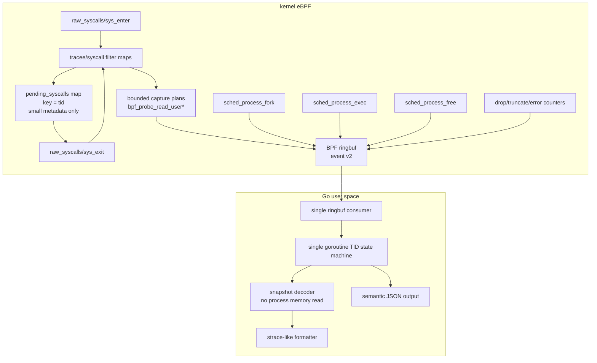

# strace-go pure eBPF architecture plan

本文档面向下一阶段重构：把 `strace-go` 从“eBPF 采样 + 用户态补读 + ptrace 兼容补丁”的混合架构，收敛成一个真正的 Go + eBPF syscall tracer。

核心结论：

- 旧架构问题曾经是结构性存在。当前主路径已经收敛掉 ptrace/procmem、旧 fixed-window carrier、大块 syscall fallback 字典和大部分用户态补读风险；剩余工作主要是继续补齐少数 nested payload，并把 upstream reference 子集按语义扩展。
- 最终产品不区分 `compat` 和 `ebpf-fast`。主线只有一条纯 eBPF syscall tracing 路径。
- 运行期 ptrace 必须从产品路径中删除。上游 `strace` 测试只能作为外部参考，不能对应一个 ptrace 兼容模式。
- 目标不是复刻 ptrace 的冻结语义，而是复刻 `strace` 的主要 syscall 观测体验。

## 1. 当前架构问题是否还存在

答案：历史上确实存在，而且是结构性存在；当前实现已经完成大部分主路径收敛，剩余问题集中在收口和覆盖面。

### 1.1 ptrace 依赖仍然没有从主代码彻底断开

旧实现曾经引入过 `--mode=ebpf-fast` 和 `--mode=compat` 这样的临时分流，但最终目标不能保留这种产品模式。历史代码层面存在过两套耦合：

- `cmd/strace-go/session.go` 中 `startAndTraceCmd` 使用 `SysProcAttr{Ptrace: true}`、`PtraceSetOptions` 和 `PtraceCont`。
- `reapTracees()` 以 ptrace wait/reap 模型管理 tracee 停止和继续。
- `pkg/procmem/reader.go` 保留过 `PtracePeekData` 作为最终 fallback。
- 多个 handler 曾通过 `ctx.MemReader.ReadRobust()` 在事件到达用户态后读取 tracee 内存。

这说明旧实现不只是入口分流问题，共享 handler/decoder 也允许走回旧路径。当前主产品路径已经删除这条回路；后续收口重点是防止新增 handler 或 reference 修复重新引入 Go 侧补读。

### 1.2 用户态异步内存读取仍然是根本 TOCTOU

旧 `pkg/event/decoder.go` 的 `DecodeString` 曾在 BPF buffer 不完整时 fallback 到 `MemReader.ReadRobust()`；当前实现已经是 snapshot-only：BPF 快照缺失或不可用时输出原始指针。

这在纯 eBPF 模式下不可接受：

- syscall enter/exit 时用户内存状态是当时的状态。
- ringbuf 事件到达 Go 时，tracee 可能已经继续运行、复用 buffer、exec 或退出。
- 用户态再读 `/proc/$pid/mem` / `process_vm_readv` 得到的是“后来状态”，不是 syscall 发生时的快照。

所以纯 eBPF 路径的原则必须是：

> 所有 syscall 参数内存快照只能在 BPF probe 里通过 `bpf_probe_read_user*` 完成。Go 侧不能补读 tracee 内存。

### 1.3 BPF map 中保存大事件对象，吞吐成本过高

当前 `bpf/strace.c` 中：

- `struct bpf_event` 内含大 `str_arg` buffer。
- `heap` 是 per-CPU scratch。
- `events_map` 是普通 HASH map，value 是整个 `struct bpf_event`。
- `sys_enter` 后会 `bpf_map_update_elem(&events_map, &tid, e, BPF_ANY)`。
- `sys_exit` 再从 `events_map` 取回大对象、补 ret/payload、ringbuf 输出并删除。

这个模型的问题：

- 每次 enter 都可能把接近 10KB 的对象复制进 hash map。
- 高频 syscall 下 hash map value copy 会成为主要开销。
- 大 value 会加重 verifier、内存占用和 cache 压力。
- 对于大部分 syscall，enter->exit 需要保存的只是几十字节元数据，不需要保存整个输出事件。

新模型必须把 hash map 缩小成“pending metadata map”，大 payload 只进入 ringbuf。

### 1.4 用户态事件处理不是单协程状态机

Phase 3 之前，`run()` 中有单独 goroutine 读 ringbuf，再通过 `eventChan` 投递给主循环。当前主路径已经切到同一 goroutine 内 `ReadInto -> decode -> handleEvent`。

同时存在全局状态和 mutex：

- `lastSuspendedSyscall` + `lastSuspendedSyscallLock`
- `pendingExecArgs` + `pendingExecArgsLock`
- handler 内还有其他 cache lock

旧模型不是用户提出的“单 goroutine 无锁事件状态机”。对于主线纯 eBPF 实现，事件处理应收敛为：

- 同一个 goroutine 读取 ringbuf、解码、更新 pending map、打印、更新 fd/cwd/lifecycle 状态。
- 不用 mutex 管理 syscall enter/exit 输出状态。
- 允许一个非事件 goroutine 等待目标进程退出，但它不能处理事件，也不能修改 syscall 状态机。

### 1.5 生命周期模型仍然脆弱

当前 BPF 侧已经有 `sched_process_fork`，但 exec/exit/thread 生命周期仍主要靠 raw syscall enter/exit、`pending_exec_map`、`main_exited_map` 等补丁拼接。

这在这些场景下很脆：

- 非 leader thread execve。
- execve 成功后线程组收缩。
- fork/clone/exec/exit storm。
- tracee 退出导致 pending map 清理不完整。
- attach 模式下已有线程和后续 clone 的继承关系。

新模型应把生命周期当成一等事件，而不是 syscall formatter 的副作用。

### 1.6 BTF 不能独立定义 strace 语义

当前 `cmd/generate-syscalls`：

- 使用 `github.com/cilium/ebpf/btf` 从 `__x64_sys_*`、`__do_sys_*`、`ksys_*` 抽取参数。
- 仍解析 `strace-upstream/src/linux/x86_64/syscallent.h` 作为 syscall id/name/flags 基准。
- BTF 函数签名不足时读取 syscall tracepoint format；仍无法解析的历史 syscall 显式生成 dummy metadata，不回退到通用手写签名字典。
- `semanticOverrides` 只保留有 reason 和双边签名测试的 strace-facing ABI 差异。
- payload capture 由 syscall-specific direct TLV helper 显式实现，不再由 `capture_rules.yaml` 生成固定窗口策略。

这里需要区分两件事：

- syscall 签名可以尽量从 BTF/unistd 生成。
- strace 语义捕获策略不能完全从 BTF 推导。

BTF 能告诉我们参数名和 C 类型，但不能完整告诉我们：

- 哪个指针是 path。
- 哪个 buffer 是 IN，哪个是 OUT。
- buffer 长度来自哪个参数或返回值。
- `ioctl`、`bpf`、`setsockopt`、`msghdr`、`iovec` 等嵌套结构怎么截断。
- 哪些字段应该作为 xlat flags 解码。

因此重构目标应是“禁止手写 syscall 签名”，而不是“禁止任何人工 capture policy”。

## 2. 目标契约

### 2.1 单一路径契约

`strace-go` 的产品路径只有纯 eBPF 实现：

- 禁止运行期 ptrace。
- 禁止 Go 侧读取 tracee 内存。
- 所有用户内存快照只在 BPF probe 中完成。
- syscall enter/exit 都作为事件流的一部分输出给 Go。
- Go 侧使用单 goroutine 状态机做 enter/exit 配对、unfinished/resumed、fd/cwd/lifecycle 更新。
- 输出是 strace-like，不承诺 ptrace-equivalent。
- 上游 `strace` exact diff 只作为兼容参考，不作为主门禁。

### 2.2 旧 ptrace 路径处置契约

旧 ptrace 相关代码不能作为运行时模式继续存在：

- `--mode=compat`、ptrace reaper、ptrace memory fallback 都应进入移除清单。
- 如果迁移阶段需要对照旧行为，只能依赖 git history、临时实验分支或独立测试基线，不能在主产品 CLI 暴露。
- upstream 测试保留为 reference suite，但它运行的对象仍然是纯 eBPF 实现。
- 对 upstream exact diff 不稳定的测试，应降级为 relaxed/semantic assertion 或明确标记为非契约。

### 2.3 明确不支持的 ptrace 等价语义

纯 eBPF 模式不承诺：

- 冻结 tracee 后任意读取用户内存。
- syscall 注入、修改 syscall nr/args/ret。
- ptrace stop 顺序、signal-delivery-stop、group-stop 语义。
- stdout/stderr 与 trace 输出的严格交错。
- 深层可变内存图的无限展开。
- 对所有 upstream `strace` tests 做 byte-for-byte exact diff。

## 3. 目标架构总览



## 4. 内核态设计

### 4.1 BPF event v2

当前 `struct bpf_event` 同时承担：

- pending enter 状态。
- output event。
- payload buffer。
- exec 特殊 snapshot。
- probe 状态。

这导致 map value 巨大且难以演进。新结构应拆分。

建议定义统一 header：

```c
enum event_type {
    EVENT_SYS_ENTER = 1,
    EVENT_SYS_EXIT = 2,
    EVENT_LIFECYCLE = 3,
    EVENT_LOST = 4,
};

struct event_header {
    __u16 version;
    __u16 type;
    __u16 flags;
    __u16 header_len;
    __u32 size;
    __u32 pid;
    __u32 tid;
    __u32 sys_id;
    __u64 seq;
    __u64 ts_ns;
};
```

syscall enter event：

```c
struct syscall_enter_event {
    struct event_header h;
    __s64 ret;
    __s32 probe_ret_enter;
    __s32 probe_ret_exit;
    __u64 args[6];
    __u32 capture_len;
    __u32 capture_flags;
    __u8 payload[];
};
```

syscall exit event：

```c
struct syscall_exit_event {
    struct event_header h;
    __s64 ret;
    __u64 duration_ns;
    __u64 args[6];
    __u32 capture_len;
    __u32 capture_flags;
    __s32 stack_id;
    __u32 reserved;
    __u8 payload[];
};
```

payload 使用 section/TLV，而不是固定 `str_arg`：

```c
enum payload_kind {
    PAYLOAD_STRING = 1,
    PAYLOAD_BYTES = 2,
    PAYLOAD_STRUCT = 3,
    PAYLOAD_IOVEC = 4,
    PAYLOAD_SOCKADDR = 5,
    PAYLOAD_EXEC_ARGS = 6,
};

struct payload_section {
    __u16 kind;
    __u16 arg_index;
    __u16 flags;
    __u16 reserved;
    __u32 user_len;
    __u32 copied_len;
    __s32 probe_ret;
    __u64 user_ptr;
    __u8 data[];
};
```

收益：

- Go 侧可以按 section 解码，不再依赖魔法 offset。
- BPF 可以只输出实际需要的 payload。
- JSON 测试可以直接断言 section。
- 后续新增 syscall capture 不破坏老字段。

### 4.2 map 设计

建议 map：

```c
events: BPF_MAP_TYPE_RINGBUF
tracee_filter: BPF_MAP_TYPE_HASH
syscall_filter: BPF_MAP_TYPE_HASH or ARRAY bitmap
pending_syscalls: BPF_MAP_TYPE_HASH
config_map: BPF_MAP_TYPE_ARRAY
stats_map: BPF_MAP_TYPE_PERCPU_ARRAY
```

`pending_syscalls` value 只保存小元数据：

```c
struct pending_syscall {
    __u32 pid;
    __u32 tid;
    __u32 sys_id;
    __u32 flags;
    __u64 enter_ts_ns;
    __u64 args[6];

    /* bounded pointer metadata for exit capture */
    __u64 out_ptr0;
    __u32 out_len0;
    __u16 out_arg0;
    __u16 out_kind0;

    __u64 out_ptr1;
    __u32 out_len1;
    __u16 out_arg1;
    __u16 out_kind1;
};
```

禁止再把完整 output event 放进 hash map。

### 4.3 sys_enter 策略

`sys_enter` 做四件事：

1. 读取 pid/tid/sys_id。
2. 做 tracee filter 和 syscall filter 下推。
3. 根据 capture plan 拷贝 IN 参数，输出 `EVENT_SYS_ENTER`。
4. 把 exit 阶段需要的指针和长度放入 `pending_syscalls`。

对于 IN 参数：

- path：`bpf_probe_read_user_str`，上限 4096 或配置值。
- write/sendto payload：`bpf_probe_read_user`，上限默认 512，可由 CLI 调整。
- iovec：先拷贝 iovec 数组的 bounded prefix，再拷贝每个 iov 的 bounded prefix。
- execve argv/envp：只拷贝前 N 个指针和每个字符串前 M 字节。
- ioctl/bpf_attr/msghdr：按 capture policy 拷贝固定头和 bounded nested fields。

### 4.4 sys_exit 策略

`sys_exit` 做五件事：

1. 查 `pending_syscalls[tid]`。
2. 读取 ret，计算 duration。
3. 根据 ret 和 enter 保存的 out pointer metadata 拷贝 OUT 参数。
4. 输出 `EVENT_SYS_EXIT`。
5. 删除 `pending_syscalls[tid]`。

对于 OUT 参数：

- `read(fd, buf, count)`：`copy_len = min(ret, count, max_payload)`，只在 `ret > 0` 时拷贝。
- `recvfrom`：exit 拷贝 buffer、sockaddr、addrlen。
- `getcwd/readlink`：exit 根据 ret 拷贝输出 buffer。
- `accept/getsockname/getpeername`：enter 保存 addr/addrlen 指针，exit 拷贝实际 addrlen。
- `pipe/socketpair`：exit 拷贝 fd array。

### 4.5 ringbuf reserve 与失败策略

使用 `bpf_ringbuf_reserve`，但必须有严格边界：

- 每条 event 最大 payload 固定上限，例如 8KB 或 16KB。
- 字符串、buffer、iovec、exec argv/envp 分别有独立上限。
- reserve 失败时增加 `stats_map.reserve_fail`。
- payload 被截断时设置 `EVENT_F_TRUNCATED` 和 section `copied_len < user_len`。
- probe 失败时保留 section 元数据和 `probe_ret`，Go 侧可以打印指针地址或 `???`。

不要把 ringbuf event 当成无限 scratch。所有变量长度都必须被 verifier 可证明地 clamp。

### 4.6 生命周期 tracepoints

必须引入生命周期事件：

- `sched:sched_process_fork`
- `sched:sched_process_exec`
- `sched:sched_process_exit` 或 `sched:sched_process_free`

生命周期事件用于：

- fork/clone 后继承 trace filter。
- exec 成功后更新 pid/tid/thread group 状态。
- exit/free 后清理 `pending_syscalls`。
- Go 侧打印 `+++ exited with N +++` 或维护 pid/tid 活性。

`raw_syscalls/sys_enter(exit)` 仍可用于打印 exit syscall 本身，但不应用它承担所有状态清理。

## 5. 用户态设计

### 5.1 单 goroutine 事件处理

主线纯 eBPF 实现的主循环应收敛成：

```go
for {
    rec, err := ring.Read()
    if done && timeoutDrain {
        break
    }
    ev := decodeEventV2(rec.RawSample)
    state.Handle(ev)
}
```

事件处理 goroutine 内维护所有 syscall 状态：

```go
type TraceState struct {
    pending map[uint32]*PendingSyscall // key = tid
    tasks   map[uint32]*TaskState      // key = tid
    fds     map[FDKey]*FDState
    stats   map[uint32]*SyscallStat
}

type PendingSyscall struct {
    Enter       *SyscallEvent
    PrintedHalf bool
    ArgText     []string
    LinePrefix  string
}
```

允许存在一个等待目标进程退出的 goroutine，但它只能关闭 done channel，不能读写 `TraceState`。

### 5.2 enter/exit 输出状态机

规则：

1. 收到 `EVENT_SYS_ENTER`：
   - 解码 enter payload。
   - 缓存到 `pending[tid]`。
   - 默认不打印。

2. 收到任意其他 TID 的事件：
   - 扫描 pending 中未完成且未打印 half 的 syscall。
   - 对这些 syscall 打印 `syscall(args <unfinished ...>`。
   - 标记 `PrintedHalf = true`。
   - 不使用 timer，纯事件驱动。

3. 收到 `EVENT_SYS_EXIT`：
   - 找 `pending[tid]`。
   - 合并 enter args、exit payload、ret、duration。
   - 如果未打印 half，打印完整一行。
   - 如果已打印 half，打印 `<... syscall resumed>) = ret`。
   - 删除 `pending[tid]`。

4. 收到 lifecycle exit/free：
   - 清理该 tid pending。
   - 如果 pending 已打印 half，可打印中止/退出提示。

注意：触发 unfinished 的比较对象应该是 TID，不是进程。一个进程内两个线程交错也要触发。

### 5.3 handler 与 decoder 分层

旧 handler 曾经可以直接读 `ctx.MemReader`。纯 eBPF 模式必须持续禁止这条路径回流。

建议引入两套接口：

```go
type SnapshotReader interface {
    Section(arg int, kind PayloadKind) (PayloadSection, bool)
}

type MemoryReader interface {
    Read(pid int, addr uint64, size int) ([]byte, error)
    ReadRobust(pid int, addr uint64, size int, waitOnZero bool) ([]byte, error)
}
```

纯 eBPF handler context：

- 有 `SnapshotReader`。
- 没有 `MemoryReader`，或者 `MemoryReader` 是一个会返回明确错误的 forbidden reader。

不再提供 ptrace/procmem handler context。这样可以强制测试发现“某个 handler 在纯 eBPF 路径里偷偷补读内存”的问题。

### 5.4 fd/cwd/path 状态

fd/path 状态不能依赖 ptrace，也不能依赖异步 `/proc` 快照：

- 启动/attach 时不读取 tracee 的 `/proc/$pid/fd`、cwd 或 fdinfo；既有 FD/cwd 状态从事件视角标记为 unknown。
- 后续只由 syscall/lifecycle 事件维护：
  - `open/openat/openat2/creat` 成功后记录 fd -> path。
  - `close/close_range/dup/dup2/dup3/fcntl(F_DUPFD*)` 更新 fd map。
  - `chdir/fchdir` 更新 cwd。
  - `fork/clone` 继承 fd/cwd 状态。
  - `exec` 只按 lifecycle 与已观测的 close-on-exec 信息更新；无法从事件确定的 fd 保持 unknown，不做懒刷新。

这部分是 event-sourced best-effort；如果 probe 点没有携带足够 metadata，就保留 unknown，不用查询时快照伪造结果。

## 6. syscall 元数据与生成器

### 6.1 生成器目标

目标文件：

- `pkg/meta/syscall_table.go`：syscall id/name/arg/type/flags。
- `cmd/strace-go/bpf_bpfel.go` / `cmd/strace-go/bpf_bpfeb.go`：由 bpf2go 生成的 BPF object 绑定。

目标原则：

- syscall 基础签名尽量由 BTF/系统头生成。
- 不再维护大量手写 syscall signature override。
- syscall payload 捕获由 `bpf/syscall_*_direct_event_v2.h` 专项 direct TLV helper 表达，不再生成 fixed-window capture switch。
- 生成器输出必须稳定，避免每次构建大面积无关 diff。

### 6.2 BTF 来源策略

优先级建议：

1. 如果内核 BTF 暴露 `trace_event_raw_sys_enter_*` / syscall tracepoint struct，则从 tracepoint struct 提取参数名和类型。
2. 否则从 `__do_sys_*` 函数 BTF 提取，再 fallback 到 `__x64_sys_*` / `ksys_*`。
3. 如果函数 BTF 只有 `pt_regs` wrapper 或没有可用签名，则读取 syscall tracepoint 的 `format` 文件提取字段；这不是运行期数据源，只是生成阶段的内核元数据 fallback。
4. 仍无法得到签名时才使用 dummy 参数；syscall number 来自本机 arch 的 `unix.SYS_*` 或系统 `unistd_*.h`。
5. 对名称差异维护小型 alias 表，例如 `newfstatat`、`mmap_pgoff`、`newstat`。

不能假设所有 kernel 都有 per-syscall tracepoint BTF。生成器必须有 fallback。

### 6.3 payload capture 不再由旧 policy 生成

旧 `capture_rules.yaml` / `syscall_capture.h` 链路已经删除。它曾把 strace-like payload 捕获规则翻译为针对 `bpf_event.str_arg` 的固定窗口拷贝代码，但这与 event v2/TLV 和 no fixed-window carrier 的最终架构冲突。

当前约束：

- BTF/unistd 只负责“它是什么 syscall、参数叫什么、类型是什么”。
- “为了 strace-like 输出，需要拷贝哪些内存”由 syscall-specific direct TLV helper 显式实现。
- 构建流程不再生成 `syscall_capture.h`，源码门禁测试要求旧 `capture_rules.yaml`、`syscall_capture.h` 和 `gen_bpf_capture.go` 不存在。

## 7. 测试体系

### 7.1 主门禁

主门禁不做 upstream byte diff，做语义测试：

- enter/exit 成对。
- 同一 TID 内 syscall 顺序正确。
- filter 下推后无关 syscall 不进 ringbuf。
- IN 参数在 enter 时快照。
- OUT 参数在 exit 时快照。
- fork/exec/exit 生命周期状态正确。
- 无 ptrace 行为。
- ringbuf reserve fail/drop/truncate 有可观测计数。

### 7.2 no-ptrace gate

需要持续维护专门测试：

- 启动目标后，目标进程 `TracerPid` 应为 0。
- 源码层面主路径不依赖 `procmem.Reader`。
- 运行 `--event-format=json` 时，任何 handler 触发用户态 tracee memory reader 都应失败测试。

可以实现一个 `forbiddenMemoryReader`：

```go
type forbiddenMemoryReader struct{}

func (forbiddenMemoryReader) Read(...) ([]byte, error) {
    return nil, ErrMemoryReadForbidden
}
func (forbiddenMemoryReader) ReadRobust(...) ([]byte, error) {
    return nil, ErrMemoryReadForbidden
}
```

测试中要求主路径不产生这个错误。

### 7.3 fixture 覆盖

第一批 fixture：

- `open/read/write/close`
- failed syscall，例如 `openat` 返回 `ENOENT`
- path 参数
- buffer payload
- `fork/exec/exit`
- attach 到已进入阻塞 syscall 的进程，验证启动握手与 orphan exit 统计
- 多线程 syscall storm
- long path truncation
- read/write 大 payload truncation
- iovec readv/writev
- sockaddr connect/accept

### 7.4 性能门禁

固定 workload：

- 高频 `getpid`：测空 syscall event 成本。
- 高频 `clock_gettime`：测高频短 syscall。
- 高频 `write` 小 buffer：测 payload 拷贝和 ringbuf。
- 高频 `read`：测 exit OUT buffer。
- fork/exec storm：测 lifecycle map 清理。
- 多线程 storm：测 pending map 和 unfinished/resumed。

指标：

- events/s
- ringbuf reserve fail
- dropped events
- truncated sections
- Go alloc/op
- Go heap growth
- pending map stale count

## 8. 分阶段落地计划

### Phase 0: 冻结边界和测试

目标：

- 确认产品路径只有纯 eBPF。
- 明确禁止 ptrace/procmem。
- 当前语义测试继续可运行。

改动：

- README/arch 文档明确单一路径契约。
- 移除或废弃 `--mode=compat` / `--mode=ebpf-fast` 的产品语义。
- 删除 ptrace 启动、ptrace reaper、`PtracePeekData` fallback。
- 增加 no-ptrace/no-procmem 测试骨架。
- 给主路径加 forbidden memory reader 测试入口。

验收：

- `go test ./cmd/... ./pkg/...`
- `python3 test/run_tests.py --suite ebpf-semantic`
- `python3 test/run_tests.py --suite ebpf-perf --skip-build`

### Phase 1: event v2 垂直链路

目标：

- 新增 event v2，不立即删除旧 event。
- 先支持 `getpid/openat/read/write/close/execve`。

改动：

- BPF 新增 `event_header`、enter/exit event。
- Go 新增 event v2 decoder。
- JSON 输出暴露 `event_type=enter/exit` 和 payload sections。
- old formatter 可先继续用旧 event，semantic test 先走新 JSON。

当前落地：

- `struct bpf_event` 已带 `event_version`、`event_type`、`event_flags`。
- `--event-format=json` / `--debug-events` 会通过 `CONFIG_EMIT_ENTER` 打开通用 enter 事件。
- 通用 enter 事件打 `EVENT_FLAG_GENERIC_ENTER`，Go 侧直接输出 JSON，不触发 handler、fd 状态更新或用户态内存补读。
- exit/full 事件继续服务现有 handler 和文本 formatter，JSON 输出会标注 `event_type=exit`。

验收：

- fixture 能看到 enter/exit。
- `read` payload 来自 exit。
- `write/openat/execve` payload 来自 enter。

### Phase 2: pending map 瘦身

目标：

- `pending_syscalls` 不再保存完整 `bpf_event`。
- map value 缩到百字节级。

改动：

- 移除 `events_map` 大 value 依赖。
- enter 输出 enter event，并只保存 exit capture metadata。
- exit 从 pending metadata 生成 exit event。

当前落地：

- BPF `events_map` 已替换为 `pending_syscalls`。
- `pending_syscalls` value 只保存 `enter_time`、6 个原始参数、pid/tid/syscall id 和 stack id，不再保存 `str_arg` 大缓冲。
- `sys_exit` 不再使用 per-cpu `heap` 或 `struct bpf_event` 重建 exit/full event；fallback syscall 也直接从 compact pending metadata 合成 no-payload event v2。
- 文本 formatter 现在消费 event v2 + semantic payload sections；未专项 payload 的 syscall 保留 args/ret/duration，不再重新执行 fixed-window capture。
- `TestPendingSyscallsMapUsesCompactValue` 直接解析嵌入 BPF object，防止 pending map value 回退到大结构。

验收：

- 高频 getpid/write 性能明显提升。
- BPF map value size 明显下降。
- stale pending 可由 lifecycle/free 清理。

### Phase 3: Go 单 goroutine 状态机

目标：

- 主路径不再用 event reader goroutine + eventChan 处理 syscall。
- 移除 `lastSuspendedSyscallLock`、`pendingExecArgsLock` 在 syscall 状态机路径中的使用。

改动：

- 新建 `pkg/trace/state.go`。
- `TraceState.Handle(event)` 内部维护 pending map。
- 实现事件驱动 `<unfinished ...>` / `<... resumed>`。
- 删除旧 ptrace/reaper 输出状态机在产品路径中的入口。

当前落地：

- `session.run` 已移除 event reader goroutine 和 `eventChan`，主循环在同一 goroutine 内委托 `TraceEventReader.Read` / `DrainAfterDone` 完成 ringbuf 读取、record 解码和 `TraceEventRouter` 路由。
- 目标命令的 `cmd.Wait()` 只保留为生命周期通知 goroutine，不读取 ringbuf、不处理事件、不修改 syscall 状态机；attach pid 存活检查在主循环中轮询。
- BPF 程序挂载已从 `session.go` 内 150 行线性 attach 块收敛到 `bpfAttacher`（`cmd/strace-go/bpf_attach.go`）：raw syscall/lifecycle tracepoint 以表驱动 spec 声明，recvmsg kretprobe 作为 attacher 方法；`setupBPF` 只负责 spec 加载、syscall id 变量解析（`setSyscallVariables` 返回 error 而非直接 fatal）和委托挂载。源码门禁同步改为同时扫描 session.go 与 bpf_attach.go，并新增 spec 表结构、optional 语义和变量解析单元测试。
- tracee 初始 execve 已可观测：`arm_fork_map` 在 fork 前武装（`sched_process_fork` 以父进程 tgid 匹配，覆盖 os/exec 从任意 runtime 线程 fork 的情况），子进程在首次 exec 前通过 `pre_exec_map` 抑制 Go os/exec 内部 fd 设置 syscall（fcntl/dup3 等），只放行 exec 家族；exec 时无条件解除抑制，避免 arm 竞态残留。退出行 fallback 改用当前 mono 时间戳，不再显示 boot 相对时间。
- `io_submit` 的 iocb 数组、PREADV/PWRITEV 嵌套 iovec 与 PWRITE 数据 buffer 已拆到三个专项 raw syscalls program（`trace_sys_enter_aio`/`_aio_iovec`/`_aio_buf`），各自 bounded 捕获避免 verifier 超限，Go formatter 渲染 iocb 列表与嵌套内容而非裸指针。
- lifecycle 事件现在始终发射（不再只在 JSON 模式）：文本模式同样维护 task/fd 状态；`sched_process_exit` 直接从退出任务读取 tid/tgid 与 `task_struct.exit_code`（tracepoint 结构布局不可靠），Go 侧为已 exec 任务、线程与 attach 目标渲染 `+++ exited with N +++`，并跳过 os/exec 中间进程。命令退出行的 wait fallback 在 wait 完成后短宽限内 flush；`attach-f-p` 通过，`attach-p-cmd` 的跨任务 exact exit 顺序仍受纯 eBPF 异步观察限制。
- `strace-C` 标记为预期失败：上游 `-c` 汇总按 per-syscall CPU 时间计，纯 eBPF 只能观测 wall-clock 时长，属于测量语义差异；runner 同时修复了 `sleep-timing` 的构建（补 `-I../src` 与 libtests 链接），`strace-r`/`strace-T_upper` 已通过。
- 结束时使用 `ringbuf.Reader.Flush()` drain 剩余事件，再统一打印 summary、关闭 fd data files 和输出 pipe。
- Go 侧新增 per-session `pendingSyscalls map[tid]pending`，generic enter 事件进入 pending，exit 事件按 TID 消费 pending。
- JSON exit 事件带 `paired_enter=true`，semantic/perf 测试已把 read/write/getpid 的 enter/exit 配对作为门禁。
- execve 暂存参数和 suspended syscall 状态已从全局 map+mutex 迁入 `traceSession`，事件处理路径不再依赖这些 mutex。
- Go 侧已新增 `TraceState` 对象集中持有 pending syscall、exec 暂存、suspended syscall 和 task lifecycle map；`traceSession` 只组合状态对象，为后续 `TraceState.Handle(event)` 收口做准备。
- `TraceState.Handle(event)` 已作为状态更新单入口，负责 lifecycle task 更新、enter pending 记录、exit pending 配对和 lifecycle exit/free 的 pending 清理；`traceSession` 继续负责过滤、FD 状态和输出副作用。
- syscall exit/full 事件已引入 `syscallEventContext`，集中构建 syscall metadata、path 判定、BPF payload sections、raw string、过滤结果和 `handler.Context`；`handleEvent` 不再直接拼装这些派生字段，为后续拆 renderer/FD store 接口留出边界。
- fd path、offset 和 data file 句柄已收敛到 `FDStateStore`；`traceSession` 不再直接持有三张 fd map，只组合状态对象并通过 store 更新 syscall/lifecycle 副作用。
- syscall summary 聚合已收敛到 `SummaryStats`；`traceSession` 不再直接持有 summary 裸 map，事件路径只负责在过滤后记录，结束阶段委托对象输出 strace-like summary。
- exit status 排队已收敛到 `ExitStatusQueue`；`traceSession` 不再直接持有 Wait/ringbuf exit 竞态协调用的裸 map，只负责判断是否需要排队和执行输出副作用。
- syscall 时间前缀已收敛到 `TimeFormatter`；`traceSession` 不再直接维护 boot offset 或 relative-time last syscall timestamp，为后续文本 renderer 拆分保留清晰边界。
- 普通 syscall 文本行、exit 状态行、unfinished 行、exec resume 行、非 leader exec superseded 诊断、hexdump、SIGALRM 伪 signal 行和 stack trace 输出已收敛到 `TextRenderer`；`event.go` 只负责在完成状态/filter/handler 后把文本输出交给 renderer。
- syscall return text 格式化已迁出 `event.go`，作为 JSON/text 共享的独立 formatter，事件路由不再承载 errno、restart、特殊返回值文本规则。
- target/attach/follow-fork 事件准入已收敛到 `TraceScope` 值对象；`handleEvent` 不再直接展开 CLI attach pid 匹配逻辑。
- execve/execveat restart、leader resume 和非 leader superseded 输出状态已收敛到 `ExecSyscallOutput`；`event.go` 不再直接读写 pending exec 或 exit status queue 的 exec 特例。
- exit/exit_group 的 syscall 行、JSON 分流、quiet-exit 和 exit status queue 输出已收敛到 `ExitSyscallOutput`；`event.go` 不再直接编排 exit 输出副作用。
- BPF 合成的 suspended syscall probe 状态已收敛到 `SuspendedSyscallOutput`；`event.go` 不再直接打印 `<unfinished ...>` 或写 suspended syscall marker。
- text-mode syscall 输出链已收敛到 `SyscallTextOutput`，集中应用 status filter、suspended/exec 特例和普通 syscall renderer；`event.go` 只在 handler 解码后委托文本输出对象。
- JSON syscall 输出策略已收敛到 `SyscallJSONOutput`，集中处理 generic enter raw event、debug raw event、decoded JSON event 和 status filter；`event.go` 不再直接编排 JSON syscall 输出。
- syscall handler 解码和 FD state side effects 已收敛到 `SyscallHandlerRunner`；`event.go` 不再直接调用 `handler.Get`，也不再展开隐藏 FD-state syscall 的 handler/update 顺序。
- syscall exit/full event pipeline 已收敛到 `SyscallExitPipeline`，统一编排 debug raw JSON、arch_prctl suppress、summary-only、exit syscall、handler、JSON/text 输出和 FD offset/close 副作用；`event.go` 只负责构建 `syscallEventContext` 后委托。
- exit status wait/ringbuf 竞态协调已收敛到 `ExitStatusCoordinator`；`event.go` 不再承载 exit status queue 的排队、释放、丢弃和输出包装函数。
- 命令 wait 退出结果与 exit-status fallback 已收敛到 `TraceCommandExitHandler`；`traceRunState` 只维护完成判定、fallback 时钟和 attach 轮询，不再依赖完整 `traceSession` 或直接操作退出队列。
- `traceRunState` 构造只接收待等待的 command 和 attach PID 快照；session 仅在 `run` 入口组装依赖，状态对象不再读取 CLI/session 字段。
- event scope/state 分类、生命周期分流、enter JSON 和 exit pipeline 路由已收敛到 `TraceEventRouter`；`event.go` 只保留单入口委托。
- ringbuf `SetDeadline`、`ReadInto`、`Flush`、v2 decode 和事件路由已收敛到 `TraceEventReader`；它通过最小 reader/sink 接口可在无内核的单元测试中验证读取错误、drain 和路由时序。
- JSON raw/decoded/lifecycle 事件编码已收敛到共享的 `JSONEventWriter`；输出策略对象只负责筛选与消费语义，writer 复用单个 `json.Encoder`，避免每条事件重新创建编码器。
- 运行结束的 stats、summary、fallback flush 和输出 pipe 关闭已收敛到 `TraceRunFinalizer`；`session.run` 不再编排结束阶段副作用。
- event pipeline、JSON/text output、renderer、handler runner、lifecycle handler、exit status coordinator、event router、event reader 和 run finalizer 已改为 per-session 懒加载缓存，避免每条 syscall event 重复构建稳定协作对象。
- 普通 syscall 的通用 `<unfinished ...>` / `<... resumed>` 已收口到单 Goroutine event state machine：当其他 TID 的事件到达时，按 enter 时间和 TID 稳定排序待决 syscall，使用只读 handler decode 输出前半行；同一 TID 的 exit 消费 pending 后输出 resumed 行。
- unfinished 只影响 text mode；JSON/debug 不生成文本半行，也不会为此预解码 handler。BPF 合成的 nanosleep/signal probe 和 exec 非 leader 特例通过 `probeRetEnter`/pending 标记避免重复输出。

验收：

- 多线程 fixture 出现合理 unfinished/resumed。
- Go race test 不应依赖 syscall 状态 mutex。

### Phase 4: 切断 procmem

目标：

- handler 只能从 snapshot sections 解码。

改动：

- 新建 `SnapshotReader`。
- handler.Context 在主路径只暴露 `SnapshotReader`。
- 删除或迁移 handler.Context 中的 `MemReader` 字段。
- 高频迁移 handler：
  - path/open
  - read/write
  - readv/writev
  - socket addr
  - execve argv/envp
  - stat/time/select/futex 常用结构
- 对尚未迁移的复杂 syscall，打印 bounded raw/指针，不进行用户态补读。

验收：

- `forbiddenMemoryReader` 不被调用。
- semantic fixture 覆盖 path/buffer/exec/iovec。

当前落地：

- `event.Decoder` 已收敛为 snapshot-only decoder；字符串解码在 BPF snapshot 不完整时只输出指针，不再补读 tracee 内存。
- `handler.Context` 主路径只暴露 `SnapshotReader` / `PayloadSection`，不再提供 `MemReader` 或 `ReadRobust` 入口。
- `updateFDMap` 只通过 BPF snapshot 解码路径参数，不再直接补读 tracee 地址空间。
- `TestProductSourceHasNoRuntimePtraceOrProcmemDependency` 已扫描主产品源码，禁止重新引入 ptrace、`procmem`、`process_vm_readv`、`MemReader` 或 `ReadRobust` 运行时入口；`TestProductSourceHasNoProcfsDependency` 进一步禁止产品源码依赖 procfs，防止异步元数据快照回流。
- `handler` 的 fd/path 展示逻辑已从通用标量解码拆到独立 `decode_fd.go`，现在只消费 session 的 event-sourced FD state，不再从 procfs 或 filesystem stat 补 metadata。
- semantic fixture 已在 tracee 内检查 `TracerPid == 0`，作为运行期 no-ptrace gate。
- JSON `payload_sections` 已迁入共享 `handler.PayloadSection` 模型，`handler.Context.Section(arg, kind)` 可以按参数和 payload 类型复用同一份 BPF 快照。
- `read/pread64` 和 `write/pwrite64` 的 buffer formatter 只消费 `PayloadKindBytes` section，旧 fixed offset snapshot 会被忽略并退回指针输出。
- path/open 类参数 formatter、path filter 和 open fd/cwd 状态已只消费 `PayloadKindString` section，简单 arg0/arg1 path syscall 已补齐 JSON section 投影；事件上下文已移除旧 `RawStrArg` / JSON `raw_string` 字段，旧 fixed offset string buffer 会被忽略并退回指针输出或跳过 fd map 更新。
- `rename/link/symlink` 及其 `*at` 双 path syscall 已暴露两个 `PayloadKindString` sections，rename/link/symlink formatter 只消费 semantic payload section，旧 fixed offset snapshot 会被忽略并退回指针输出。
- `execve/execveat` 的 argv/envp snapshot 已暴露为 `PayloadKindExecArgs` section；direct BPF path 会在 probe 现场深拷贝 filename、argv records 和 verbose envp records，exec argv/envp decoder 只消费 semantic payload section，旧 fixed offset snapshot 会被忽略并退回指针输出。
- `getcwd/readlink/readlinkat` 已暴露 OUT `PayloadKindBytes` section，formatter 只消费 semantic payload section，旧 exit snapshot 会被忽略并退回指针输出。
- `pipe/pipe2/socketpair` 的 fd array 已暴露为 OUT `PayloadKindStruct` section，pipe formatter 和 fd 状态更新只消费 semantic payload section，旧 exit snapshot 会被忽略并退回指针输出或跳过 fd map 更新。
- `readv/writev/preadv/pwritev/preadv2/pwritev2/vmsplice` 与 `process_vm_readv/writev` 已暴露 `PayloadKindIovec` section，iovec formatter 只消费 semantic payload section，旧 enter snapshot 会被忽略并退回指针输出。
- `uname/sysinfo/getrlimit/setrlimit/prlimit64` 已暴露 `PayloadKindStruct` section，misc formatter 只消费 semantic payload section，旧 fixed offset snapshot 会被忽略并退回指针输出。
- `getitimer/setitimer` 已暴露 `itimerval` 的 `PayloadKindStruct` section，time formatter 只消费 semantic payload section，旧 fixed offset snapshot 会被忽略并退回指针输出。
- `get_robust_list` 已暴露 head/len 两个 OUT word 的 `PayloadKindStruct` section，handler 只消费 semantic payload section，旧 fixed offset snapshot 会被忽略并退回指针输出。
- `waitid` 已暴露 `siginfo_t` 和 `rusage` 的 OUT `PayloadKindStruct` sections，waitid handler 只消费 semantic payload section，旧 fixed offset snapshot 会被忽略并退回指针输出。
- `arch_prctl` 的 GET 类 OUT word 已暴露为 `PayloadKindStruct` section，handler 只消费 semantic payload section，旧 fixed offset snapshot 会被忽略并退回空 GET 输出。
- `sendfile/copy_file_range` 的 offset pointer 已暴露为 `PayloadKindStruct` section，formatter 只消费 semantic payload section，旧 fixed offset snapshot 会被忽略并退回指针输出。
- `mount/umount2/fsconfig` 已暴露字符串和二进制 value 的 sections，fs handler 只消费 semantic payload section，旧 fixed offset snapshot 会被忽略并退回指针输出。
- `getdents64` 已暴露 OUT `PayloadKindBytes` section，exit 阶段由 BPF direct helper 按 ret bounded 拷贝 arg1 dirent buffer，fs handler 只消费 semantic payload section，旧 exit snapshot 会被忽略并退回指针输出。
- `capget/capset` 已暴露 capability header/data sections，capset data capture policy 补齐为 enter snapshot，handler 只消费 semantic payload section，旧 fixed offset snapshot 会被忽略并退回指针输出。
- `cachestat` 已暴露 range/stats 的 `PayloadKindStruct` sections，handler 只消费 semantic payload section，旧 fixed offset snapshot 会被忽略并退回指针输出。
- `openat2` 已暴露 `open_how` 的 `PayloadKindStruct` section，handler 只消费 semantic payload section，旧 fixed offset snapshot 会被忽略并退回指针输出。
- `rt_sigaction/rt_sigprocmask/rt_sigsuspend` 已暴露 sigaction/sigset 的 `PayloadKindStruct` sections，signal handler 只消费 semantic payload section，旧 fixed offset snapshot 会被忽略并退回指针或空 sigset 输出。
- `fcntl/fcntl64` 已按 command 暴露 arg2 的 8/32 字节 `PayloadKindStruct` section，fcntl handler 和通用 flock/f_owner_ex decoder 只消费 semantic payload section，旧 fixed offset snapshot 会被忽略并退回指针输出。
- `prctl` 已按 option 暴露 name 的 `PayloadKindString` section 和 GET 类 uint32 OUT `PayloadKindStruct` section，handler 只消费 semantic payload section，旧 fixed offset snapshot 会被忽略并退回指针输出。
- `SnapshotReader` 接口已收敛为只暴露 `PayloadSection` 查询；`handler.Context` 上旧的 `EnterArgSnapshot`、`ExitSnapshot`、`FetchStructData*` 和 decode fallback 方法已删除，防止新 handler 继续依赖固定 offset snapshot API。
- `handler.Context.Ptr`、`DataLen` 和 `StrArgBuf` 已删除；生产 handler 只能通过 payload sections 获取 BPF 快照。

### Phase 5: filter 下推

目标：

- 无关 syscall 不进入 ringbuf。

改动：

- BPF 增加 syscall bitmap/hash。
- CLI `-e trace=...` 更新 BPF filter map。
- negated filter 在 BPF 侧处理。
- 用户态 status filter 可保留在 Go，因为 ret 需要 exit 后才知道。

验收：

- `-e trace=write` fixture 中 ringbuf 不出现 open/read/close。
- perf workload 下 filtered syscall events/s 和 Go alloc 下降。

当前落地：

- BPF 已新增 `syscall_filter_map`，`raw_syscalls/sys_enter` 在创建事件和保存 pending 前执行 syscall filter。
- Go 侧通过 `TraceSyscalls` 和 `TraceSyscallRegexps` 解析 syscall id，并写入 BPF filter map；negated trace filter 由 BPF config 位处理。
- `--debug-events` 已作为 BPF 已交付事件 oracle；semantic suite 使用 `--debug-events -e trace=write` 验证 raw syscall 事件只包含 `write`。
- Go 层 `path/fd` filter 已从 `poll/ppoll` pollfd payload 和 `select/_newselect` fd_set payload 派生 fd 集合，避免纯 eBPF payload 已捕获但过滤视图仍只看标量 fd 参数。
- `path/fd/status` 过滤明确保留在 Go 层：path 过滤消费 enter/exit 合并后的 bounded TLV，fd 过滤依赖 `FDStateStore` 的 fork/exec/close/offset 生命周期状态，status 还包含 `unfinished/unavailable/detached` 等用户态观察结果；不为部分 status 或 fd 标量过滤增加第二套 BPF policy/control event 协议。syscall name/class/negation filter 仍在 BPF 入口下推，作为 ringbuf 降载的主要策略。

### Phase 6: 生命周期 tracepoint 重构

目标：

- fork/clone/exec/exit/free 不再靠 syscall 特例拼状态。

改动：

- 增加 `sched_process_exec`、`sched_process_exit/free` BPF event。
- Go TaskState 维护 tgid/tid/parent/alive/exe。
- BPF pending map 在 free/exit 时清理。
- filter 继承从 fork/clone lifecycle 统一处理。

验收：

- fork/exec storm 无 pending 泄漏。
- 非 leader thread execve 有稳定输出策略。
- tracee 全退出后 drain ringbuf 并正常结束。

当前落地：

- BPF 已新增 `sched_process_exec`、`sched_process_exit`、`sched_process_free` tracepoint，并把 `sched_process_fork` 从仅 filter 继承扩展为可观测 lifecycle event。
- JSON/debug 模式会通过 `CONFIG_EMIT_LIFECYCLE` 输出 `type=lifecycle` 事件，包含 `fork/exec/exit/free` action。
- `sched_process_exit/free` 现在从当前任务的 `(TGID,TID)` 解析身份：`pending_syscalls` 始终按 TID 清理，非 leader 只清理自己的 `pre_exec/filter` 条目，`pending_exec_map/main_exited_map` 等进程级状态由 leader 路径负责；Go `LifecycleEventHandler` 同样只在 leader 退出时清理进程级 fd/cwd/offset 状态。
- Go 主事件循环会早期识别 lifecycle event，清理 session 内 pending syscall/exec/suspended 状态，并在 JSON/debug 输出中暴露生命周期事件。
- semantic suite 已断言 fixture 中存在 `fork`、`exec`、`exit/free` lifecycle event。
- Go 侧已新增 per-session `TaskState`，由 syscall 事件和 lifecycle event 维护 `tid/tgid/parent/alive/execed`；JSON lifecycle 输出携带 task 状态快照，semantic suite 断言 fork child、execed、exit/free dead 状态。
- fork lifecycle event 会把父进程的 fd/cwd、fd offset 和可 seek 数据文件状态继承到子进程；exit/free 会清理对应 pid 的 fd/cwd、offset 和数据文件状态。
- fork/exit/free 对 fd/cwd、offset 和 data file 的继承/清理已通过 `FDStateStore` 统一执行，lifecycle 事件路径不再直接操作 session 内部 fd map。
- exec lifecycle event 会从 `sched_process_exec` 的 tracepoint data 中拷贝 filename snapshot，JSON lifecycle 输出 `filename` 字段，semantic suite 断言 child exec filename。
- BPF lifecycle event 已切换为 event v2 header + lifecycle body + optional snapshot payload；Go event v2 decoder 会直接解码 lifecycle action、args 和 exec filename snapshot。
- BPF lifecycle event 发送已绕开 `struct bpf_event` / `str_arg` carrier，直接 reserve event v2 ringbuf record、写入 header/body，并把 exec filename snapshot 直接写入 ringbuf dynptr payload。
- 非 leader execve 文本策略以 `tid != tgid` 判定线程 exec，而不是比较最初 target pid；fork child leader execve 走普通 exec resume 输出，真正非 leader execve 输出 superseded/resumed 诊断并以 TGID 作为被替换线程组前缀。
- 新增独立 `ebpf_thread_fixture.c`：`pthread` worker 执行 `getpid`，semantic suite 断言非 leader 事件保持 `pid != tid`、同一 TID 的 enter/exit 配对正确，并收到非 leader `exit/free` lifecycle 身份；本机实测 fixture 输出 20 个 syscall、5 个 lifecycle 事件，`reserve_fail=0`。
- JSON/lifecycle 模式在目标命令 wait 可见后会执行 bounded idle drain，避免真实 `sched_process_exit/free` 事件稍晚进入 ringbuf 时被过早结束漏读；文本模式仍保持立即 flush。
- Go 侧 lifecycle 副作用已收敛到 `LifecycleEventHandler`，统一处理 fork fd/cwd 继承、exit/free 进程状态清理和 JSON lifecycle 输出 gating；`event.go` 只负责把 `TraceState` 更新结果委托出去。

### Phase 7: BTF 生成器重构

目标：

- 减少手写 syscall 签名。
- capture policy 和 signature metadata 分离。

改动：

- `cmd/generate-syscalls` 拆成：
  - `btf_loader.go`
  - `sysnum_unix.go`
  - `gen_go_meta.go`
- 删除通用 metadata fallback resolver；纯名称差异进入 alias，必须保留的 strace-facing 签名进入独立的 `semanticOverrides` 白名单。
- 删除旧 fixed-window capture policy/header 生成链。

验收：

- 生成输出稳定。
- 常见 syscall 参数名/类型来自 BTF 或系统 syscall number 源。
- 没有可用 BTF 签名时明确读取 tracingfs metadata，tracingfs 整体不可用时明确报错。

当前落地：

- `cmd/generate-syscalls` 入口 `main.go` 只加载 syscall metadata 并写出 `pkg/meta/syscall_table.go`。
- 生成器 metadata 读取已拆成 `syscallMetadataLoader`，通过 `btfSyscallSource`、`tracepointSyscallSource` 和 `syscallEntrySource` 隔离 kernel BTF、tracepoint format、syscallent 文件 I/O；semantic override、BTF exact、BTF alias、tracepoint metadata、explicit dummy 的优先级已有 fake source 单元测试覆盖。
- 生成器 command 已通过 `syscallMapLoader` / `syscallTableWriter` 分离 metadata 加载和生成物写入；`main.go` 只负责 CLI 编排、路径解析和错误上下文，`gen_go_meta.go` 负责稳定渲染与文件输出。
- `syscallent.h` 解析已收敛到 `syscallentParser`，递归 include 解析和 generic fallback 有独立单元测试覆盖；include 缺失不再静默跳过，而是作为输入错误返回，避免生成不完整 syscall table。
- `--audit-overrides-detail` 对 kernel BTF 已通过 `btfSyscallDatasetSource` 单次加载/遍历同时产出 metadata 与 diagnostics，避免为了 `pt_regs_wrapper_only` 诊断在 detail audit 中重复读取 BTF；旧 source fallback 仍保留单元测试覆盖。
- 生成器默认 `syscallent.h` 输入和 `pkg/meta/syscall_table.go` 输出路径已改为从当前工作目录向上定位 repo root 后解析；`go run ./cmd/generate-syscalls` 可从仓库根执行，`go run .` 可从 `cmd/generate-syscalls` 子目录执行，两者生成输出一致。
- BTF 函数名识别和同名候选优先级已从 kernel BTF 遍历循环抽成纯函数，单元测试锁定 `__do_sys_*`、`__x64_sys_*`、`ksys_*` 和小范围 socket/network `__sys_*` allowlist 的识别规则，以及“更多参数优先、同参数 `__do_sys_*` 优先”规则。
- BTF source 已按 `trace_event_raw_sys_enter_*` struct 优先、函数 BTF fallback 的顺序加载 metadata；tracepoint struct 提取会跳过标准 trace header 字段，只保留 syscall 参数字段。当前内核没有 per-syscall tracepoint struct 时，loader 会在 BTF direct/alias 都无法提供正确 arity 后读取 `/sys/kernel/tracing/events/syscalls/sys_enter_<name>/format`，并回退到 `/sys/kernel/debug/tracing/events/syscalls/...`；读取候选名时复用 `btfNameToSyscallent` alias（例如 `stat -> newstat`、`umount2 -> umount`），解析器跳过 common header、`__syscall_nr` 和 `__data_loc` 辅助字段，只接受 ASCII syscall 名称。BTF type 收集策略已从 kernel spec I/O 中抽出，组合测试可直接用假 `btf.Type` 证明 tracepoint struct 优先和函数 fallback，format source 也有 fake filesystem 单测。
- `semanticOverrides` 已接入 `--audit-overrides`、`--audit-overrides-detail` 和 `--audit-tracepoint-overrides`；loader 的优先级固定为 semantic override、BTF direct、BTF alias、tracepoint、dummy，并由 fake source 单测锁定。当前生成产物的签名变化来自 tracepoint metadata 暴露出的内核字段名/类型，不再由大块手工签名表静默覆盖。
- metadata resolver 新增 table-driven decision matrix，覆盖 BTF/tracepoint 精确 arity、alias、候选 arity mismatch 后 explicit dummy，以及完全没有 kernel metadata 时的 dummy；测试同时锁定最终 source 与 rejection reason，避免把“候选存在但 ABI 不匹配”误判为“内核没有 metadata”。源码门禁进一步禁止产品重新出现 `fallbackOverrides` 或 `metadataSourceFallbackOverride`。
- 新增 `--audit-resolution` 最终 provenance 审计，按 syscall ID 稳定输出实际采用的 metadata source、决策 reason、参数名和类型；reason 会区分 `btf_exact_arity`、`tracepoint_exact_arity`、`no_kernel_metadata` 以及 `btf_arity_mismatch;tracepoint_arity_mismatch` 等拒绝原因。当前主机实测来源为 `btf=94`、`tracepoint=252`、`semantic_override=20`、`dummy=18`，`fallback_override` source 已从 resolver 类型与审计输出中删除。`preadv`、`pwritev` 的五参数 split-offset raw ABI 已从兼容 fallback 改为原因明确的 semantic override。这使 metadata 来源、strace-facing ABI 差异与内核不存在的历史 syscall dummy 完全分离。
- override detail audit 的流程逻辑和 strace-facing semantic override 规格数据已拆分；`override_audit.go` 保留分类、诊断和 TSV 输出，`override_semantics.go` 只记录必须精确匹配的语义白名单，且单元测试会用规格 kernel-side metadata 构造 fake source 验证每条 spec 与 override 同步，降低后续 review 规格变化时的噪声。
- 生成器已新增 `--audit-overrides-detail` 全量审计入口，按稳定 TSV 输出每个 override 的 `redundant`、`missing_btf`、`normalized_match`、`semantic_override` 或 `signature_mismatch` 状态、原因以及 override/BTF 两侧签名。删除产品 fallback resolver 后，函数 BTF detail audit 只覆盖 20 条 semantic override：15 条为双边签名可验证的 `semantic_override`，5 条明确报告 `pt_regs_wrapper_only`；当前 tracepoint audit 为 10 个 `signature_mismatch`、6 个 `semantic_override` 和 4 个 `redundant`。`mprotect/munmap` 通过 tracepoint 字段验证为 `strace_pointer_types`，`execveat` 通过 semantic 白名单保留 strace-facing 的 `dfd` 名称；`stat`、`lstat`、`getsockname`、`setsockopt` 虽与当前 tracepoint 完全一致，仍由真实 BTF 差异对应的 semantic 白名单保护。审计路径与 loader 共用 `btfNameToSyscallent` alias，`sendfile64 -> sendfile` 解决 tracepoint 命名缺口，`umount -> umount2` 保留内核字段名与 strace-facing 名称差异。本次重构前后生成的 `pkg/meta/syscall_table.go` SHA-256 完全一致，说明删除的是未参与当前 resolution 的手写声明，不是通过修改运行时输出掩盖差异。
- 生成阶段的输入前置条件已实测明确：当前内核 BTF 不提供 `trace_event_raw_sys_enter_*` 类型，BTF-only 会把大量 syscall 降级为 `argN/unsigned long`；完整 strace-facing metadata 仍需要 tracingfs `sys_enter_*/format` 作为 fallback。因此 generator 在 tracingfs 不可读时必须 fail-fast，不能静默生成退化的 `syscall_table.go`。`build.sh`/生成流程需要保留 root 或等价 tracingfs 读取权限，这属于生成时依赖，不是运行期 ptrace 依赖。
- tracingfs format source 现在会在读取具体 syscall 前检查 `/sys/kernel/tracing/events/syscalls` 与 debug tracingfs root；两个 root 都不可读时直接返回错误。单测覆盖“primary 不存在、debug 可用”和“两个 root 都不可用”，避免把整棵 tracingfs 缺失误判成单个 syscall 没有 format。
- tracepoint format parser 现在只过滤 `common_*`、`__syscall_nr` 和 `__data_loc` 辅助字段，不再按通用字段名过滤合法 syscall 参数；因此 `quotactl`/`quotactl_fd` 的 `id` 参数会被保留。当前生成表中 `quotactl` 从 fallback 变为 tracepoint metadata，`quotactl_fd` 从 dummy 变为 tracepoint metadata，并由 parser fixture 锁定。
- tracepoint format fallback 本次把生成表中 95 个此前仍使用 `arg0` dummy 参数的表项替换为内核字段名/类型；这些变化只发生在生成阶段，payload 捕获策略仍由 syscall-specific direct TLV helper 负责。
- 旧 `capture_policy.go`、`gen_bpf_capture.go`、`capture_rules.yaml` 和生成物 `bpf/syscall_capture.h` 已删除；`build.sh` 不再清理或生成该 header。
- 源码门禁测试锁定旧 capture artifact 不存在，并扫描 `bpf/strace.c` 防止重新 include `syscall_capture.h`、`CAPTURE_ARGS_*`、`struct bpf_event` 或 per-cpu `heap` carrier。
- 历史上通过 `payloads`/`reads` 表达的 read/write、path、stat/time、iovec、network、AIO、poll/select/epoll、ioctl、fcntl、fsconfig 等捕获策略，已经迁入对应 direct TLV helper。
- 生成器不再承载“该拷贝哪些用户态内存”的策略；这类 strace-like 语义显式写在 syscall-specific BPF helper 中，并由源码门禁和 semantic/upstream reference 测试保护。
- `overrides_time.go` 的 `init()` 追加 override 副作用已删除；`utime/utimes/futimesat` 当前直接使用 BTF/tracepoint metadata，不再需要独立 time override 文件或 fallback 表项。
- `cmd/generate-syscalls/overrides_legacy.go` 已删除；`ustat`、`preadv`、`pwritev` 等 strace-facing ABI 差异均进入带 reason 和双边签名测试的 `semanticOverrides`，`sendfile64 -> sendfile` 等纯命名差异保留为 alias。
- 产品 `fallbackOverrides` 字典、loader 字段、resolution source 和 resolver 分支均已删除并由源码门禁锁定；默认生成必须从 BTF、tracepoint 或显式 semantic override 得到 metadata，BTF/tracingfs 整体不可用时返回明确错误，不能退回大块手写 syscall 字典。当前生成结果仍有 18 个内核不存在的历史 syscall 使用带 `no_kernel_metadata` provenance 的 dummy 参数，这是显式缺失状态，不是 silent fallback。
- `cmd/generate-xlats` 的入口已拆成配置读取、输出文件边界、upstream xlat 解析、C 常量求值、静态表渲染和 syscall-arg map 渲染几层；`main.go` 从 500 行级大函数收口为轻量编排入口，静态表和 0 值保留规则有独立 helper 与单元测试保护，避免后续 xlat 语义调整继续堆进生成器入口。

### Phase 8: 删除旧模式与收口文档

目标：

- 产品 CLI 不再暴露 ptrace/compat 模式。
- 旧模式、旧事件协议、旧 procmem fallback 从主路径移除。

改动：

- 删除或隐藏 `--mode` 相关产品入口。
- upstream reference suite 改为纯 eBPF 输出参考，不再是 `compat-upstream`。
- README 明确纯 eBPF 的语义限制。
- 删除旧 event/old procmem path。

验收：

- semantic/perf gates 绿。
- upstream reference 子集作为非主门禁可运行。
- 搜索主产品路径没有 `Ptrace*`、`procmem.Reader` 运行时依赖。

当前落地：

- 产品 CLI 已不再接受 `--mode=compat` / `--mode=ebpf-fast`；传入 `--mode` 会失败并提示 `strace-go` 始终使用纯 eBPF tracing。
- `upstream-reference` 是唯一 upstream 参考套件命名，不再提供 `compat-upstream` suite。
- `README` 已声明单一路径契约、纯 eBPF 语义限制和 upstream reference 的非主门禁定位。
- 单元测试锁定 `newTraceCommand` 不配置 ptrace，并锁定 `--mode=compat` 被拒绝，防止产品入口重新长出 ptrace/compat 分支。
- 单元测试会递归扫描 `cmd/strace-go` 与整个 `pkg` 的非测试 Go 源码，并通过 AST 识别 import alias、`Ptrace*`、`SYS_PTRACE`、`ProcessVMReadv`、`pkg/procmem` 和旧 memory-reader 标识；合法的 `process_vm_readv` syscall metadata/formatter 名称不受影响。procfs 字面量全部禁止，新增产品子包会自动进入门禁。
- Go 事件分类不再把 `event_type == 0` 当作 exit；旧 fixed event 协议样本会落到 `unknown`，不能消费 enter pending state。
- JSON/debug syscall event 已开始暴露 `payload_sections`，先把现有 fixed snapshot 投影成 path/read/write/stat/statfs sections；semantic suite 已断言 write IN payload section。
- BPF 事件发送已由 `bpf_ringbuf_output` 收敛到显式 `bpf_ringbuf_reserve_dynptr` / `bpf_dynptr_write` / `bpf_ringbuf_submit_dynptr` helper；`stats_map` 已记录 reserve/copy 失败次数和 truncated payload event 次数，JSON/debug 结束时输出 `type=stats` 事件，semantic/perf suite 可把 ringbuf 丢事件与截断作为显式 oracle。
- lifecycle action 已进入 lifecycle event v2 body，不再复用 `event_flags`，也不再挂在 `struct bpf_event` carrier 上；`event_flags` 只承载真正的 event flags。
- Go 侧 lifecycle 处理已引入专用 `lifecycleEventView`，`TaskState`、`LifecycleEventHandler` 和 JSON lifecycle 输出不再直接消费混合 syscall/lifecycle view。
- Go 侧 TraceState 的 syscall pending/pairing/task 路径已改为消费 `syscallEventView`；BPF raw carrier 进入状态机前先投影为 `rawEventEnvelope`，它只作为 typed syscall/lifecycle view 的迁移期边界。
- `TraceStateUpdate` 已不再携带 raw envelope；状态机对上层只返回 `syscallEventView`、`lifecycleEventView`、pending enter 和 lifecycle task，防止输出 pipeline 重新依赖 BPF raw carrier。
- syscall enter JSON/context 构造已改为消费 `TraceStateUpdate.syscallView` 和状态机缓存的 semantic payload sections；enter 输出分支不再从 raw `bpfEvent` 重新派生 syscall view 或 payload。
- syscall exit/full context 的生产构造也已改为消费 `TraceStateUpdate.syscallView`、pending enter 和 semantic payload sections；普通 context/JSON/text/fd-state/filter 测试已不再通过 raw `bpfEvent` wrapper 构造 view 或 payload。
- `execve/execveat` 已暴露 argv/envp 的 `PayloadKindExecArgs` section，direct BPF snapshot 覆盖 argv records 与 verbose envp records，exec argv/envp decoder 只消费 semantic payload section，旧 fixed offset snapshot 会被忽略并退回指针输出。
- `stat/lstat/fstat/newfstatat` 与 `statfs/fstatfs` 已暴露 OUT `PayloadKindStruct` section，stat formatter 只消费 semantic payload section，旧 exit snapshot 会被忽略并退回指针输出。
- `poll/ppoll` 已暴露结构数组/timeout 的 `PayloadKindStruct` sections，formatter 只消费 semantic payload section，旧固定 offset snapshot 会被忽略并退回指针或空 revents 输出；`epoll_ctl/epoll_wait/epoll_pwait/epoll_pwait2` 已只消费 semantic payload section，旧固定 offset snapshot 会被忽略并退回指针输出。
- `select/_newselect` 已作为 fd_set/timeval syscall 绕开旧 fixed-window capture；enter 阶段直接写 arg1-3 `fd_set` 的 `PayloadKindBytes` IN TLV sections 和 arg4 timeout 的 `PayloadKindStruct` IN TLV section，exit 非负返回时直接写 timeout OUT TLV，正返回时额外写 arg1-3 `fd_set` OUT TLV，select formatter 只消费 semantic payload section。
- `clock_gettime/clock_getres/clock_settime/adjtimex/clock_adjtime` 的 syscall-specific time formatter 只消费 semantic payload section，旧固定 offset snapshot 会被忽略并退回指针输出；`nanosleep/clock_nanosleep/gettimeofday/settimeofday` 的通用 time struct decoder 也只消费 semantic payload section。
- `utime/utimes/futimesat/utimensat` 已暴露 path string 和时间结构 `PayloadKindStruct` sections，time formatter 复用 section snapshot，旧固定 offset snapshot 会被忽略并退回指针输出。
- `futex/futex_wait/futex_waitv/futex_requeue` 已暴露 timeout/waiters 的 `PayloadKindStruct` sections，通用 timespec decoder、futex formatter 和 waitv decoder 都只消费 semantic payload section，旧固定 offset snapshot 会被忽略并退回指针输出。
- `connect/bind/sendto/recvfrom/accept/accept4/getsockname/getpeername` 已暴露网络 buffer、sockaddr 和 addrlen sections，网络 formatter 只消费 semantic payload section，旧固定 offset snapshot 会被忽略并退回指针或零长度输出。
- `io_setup/io_submit/io_cancel/io_getevents/io_pgetevents` 已暴露 AIO ctx、pointer array、嵌套 `iocb`、event 数组、timeout/sigset/sigmask sections，AIO formatter 只消费 semantic payload section，旧固定 offset snapshot 会被忽略并退回指针输出。
- `process_madvise` 已暴露 `PayloadKindIovec` section，formatter 只消费 semantic payload section，旧 enter snapshot prefix 会被忽略并退回指针输出；短 section 仍保留 next-address 文本。
- `clone3` 已暴露 `struct clone_args` 的 `PayloadKindStruct` section，clone3 formatter 只消费 semantic payload section，旧 enter snapshot prefix 会被忽略并退回指针输出。
- `bpf` 已暴露 `union bpf_attr` 的 `PayloadKindBytes` section，bpf formatter、ID 类扩展字段与 extra_data formatter 只消费 semantic payload section，旧 enter snapshot prefix 会被忽略并退回指针或空 extra_data 输出。
- `memfd_create` 已暴露 name 的 `PayloadKindString` section，string formatter 只消费 semantic payload section，旧固定 250 字节 snapshot 会被忽略并退回指针输出。
- `add_key/request_key` 已暴露 key type、description、payload/callout_info sections，key 参数 formatter 只消费 semantic payload section，旧固定 offset snapshot 会被忽略并退回指针输出。
- `setxattr/getxattr/listxattr` 及 f/l 变体已暴露 path/name/value/list sections，xattr formatter 只消费 semantic payload section，旧固定 offset snapshot 会被忽略并退回指针输出。
- `ioctl` 已暴露 arg2 enter/exit raw bytes sections，DM/OTP/fiemap/BTRFS enter-side formatter 和常见标准 OUT ioctl formatter 只消费 semantic payload section，旧固定 offset snapshot 会被忽略并退回指针或空 extent 输出。
- `handler` 包已不再导出 BPF fixed-window layout offset；`BpfEnterArgOffset`、`BpfMiscArgOffset`、`BpfExitArgOffset` 已删除，测试侧固定窗口布局常量也已删除。
- 公共 `handler.PayloadSection` 已删除 `Offset` 字段，`cmd/strace-go` 的 payload projection 现在只从 event v2 TLV 解码 semantic sections。
- time/signal 等生产 handler 已移除旧 offset snapshot hint，handler 只能通过 `PayloadSection` 的 arg/direction/kind 语义读取 BPF 快照。
- payload projection 只接受带 `EVENT_FLAG_PAYLOAD_TLV` 的 syscall raw payload；旧 `event_type == 0`、lifecycle 样本或非 TLV payload 不能再伪装成 syscall payload。
- JSON/debug `payload_sections` 不再输出 fixed-window `offset` 字段，syscall event 也不再输出旧 raw carrier 的 `ptr` / `data_len`；外部测试 oracle 只看 kind/direction/arg/user_ptr/user_len/copied_len/probe_ret/data，避免把旧窗口布局固化成机器输出契约。
- `TraceState` pending enter 和 `syscallEventView` 已删除旧 raw carrier `dataLen` 字段；Go 状态机不再把 fixed-window payload 长度作为 enter/exit 配对状态保存。
- 旧 `struct bpf_event.ptr` carrier 字段已删除；Go 侧 syscall primary pointer 统一从 semantic payload sections 或 syscall args 推导，避免旧 raw pointer 重新进入输出契约。
- capture policy 已删除旧 `ptr_arg` 字段；生成器只根据 payload/read policy 生成 BPF 拷贝逻辑，不再生成 raw pointer carrier 写入。
- `getpid/close` 已作为第一批 scalar-only syscall 绕开 `struct bpf_event` / `str_arg` carrier；BPF enter 直接保存小 pending 元数据，exit 直接 reserve/write event v2 header/body，不再经过 per-cpu `heap` 重建 output event；其中 `close` 覆盖 fd cleanup 副作用，证明 direct event 不只适用于无状态 syscall。
- `openat` 已作为第一条 path IN payload syscall 绕开旧 `capture_openat_tlv` fixed-window helper；enter 阶段直接 reserve ringbuf TLV 容量并用 dynptr 写入 path section，exit 阶段复用小 pending 元数据直接输出 event v2。
- `open/creat` 已复用 path IN payload direct helper 绕开旧 fixed-window capture；enter 阶段直接写 arg0 pathname TLV，exit 阶段只用小 pending metadata 合成 event v2，fd path 状态从 pending enter TLV 合并结果更新。
- `write/pwrite64` 已作为第一批 bytes IN payload syscall 绕开旧 `capture_write_tlv` fixed-window helper；enter 阶段直接写 bytes TLV section，并在 direct path 中记录 payload truncated stats。
- `read/pread64` 已作为第一批 bytes OUT payload syscall 绕开旧 `capture_read_tlv` fixed-window helper；exit 阶段根据 ret 直接写 OUT bytes TLV section，read/write 核心 buffer 链路已不再依赖旧 fixed-window helper。
- `read/write/pread64/pwrite64` 的旧 capture policy 残留已删除，旧 capture 生成链已删除，不再存在 `case 0/1/17/18` fixed-window 分支；这些高频 buffer syscall 只能通过 direct TLV 主路径产出 payload。
- event v2 enter body 已显式携带 `ret`、`probe_ret_enter` 和 `probe_ret_exit`，为 `execve/execveat` direct TLV 迁移保留 `ret=-514` restart/resume 语义，避免 direct enter 退化成只有参数快照的半事件。
- `execve/execveat` 已作为 argv/envp/path IN payload syscall 绕开旧 `capture_exec_tlv` fixed-window helper；enter 阶段直接写 filename TLV section，以及包含 argv records 与 verbose envp records 的 `PayloadKindExecArgs` section，失败 exit 在 exit probe 重新做 bounded eBPF 快照，成功 exit 只输出小 pending metadata 合成的 event v2 exit。
- `execve/openat/execveat` 的旧 capture policy 残留已删除，旧 capture 生成链已删除，不再存在 `case 59/257/322` fixed-window 分支；这些 syscall 只能通过 direct TLV 主路径产出 payload。
- `exit/exit_group` 已在 sys_enter 阶段直接合成 event v2 enter/exit，终止 syscall 不再通过 `struct bpf_event` carrier 保存 pending 后再 emit。
- `clock_gettime/clock_getres` 已作为第一批高频 OUT struct syscall 绕开旧 fixed-window capture；enter 阶段只保存小 pending metadata，exit 阶段直接写 `PayloadKindStruct` OUT TLV section。
- `gettimeofday` 已作为第一条多 OUT struct syscall 绕开旧 fixed-window capture；exit 阶段直接写 timeval 与 timezone 两个 `PayloadKindStruct` OUT TLV sections，证明单个 direct exit event 可携带多个结构快照。
- `clock_gettime/clock_getres/gettimeofday` 的旧 capture policy 残留已删除，旧 capture 生成链已删除，不再存在 `case 96/228/229` fixed-window 分支；这些基础 time OUT struct syscall 只能通过 direct TLV 主路径产出 payload。
- `fstat/fstatfs` 已作为第一批 fd-based stat 类 OUT struct syscall 绕开旧 fixed-window capture；enter 阶段只保存小 pending metadata，exit 成功时分别直接写 144 字节 `struct stat` 或 120 字节 `struct statfs` OUT TLV section。
- `stat/lstat/newfstatat/statfs` 已作为 path IN + OUT struct syscall 绕开旧 fixed-window capture；enter 阶段直接写 pathname string TLV，exit 成功时直接写 144 字节 `struct stat` 或 120 字节 `struct statfs` OUT TLV section，Go 状态机会合并 enter/exit sections 后交给 formatter；`newfstatat` 明确覆盖 arg1 path 与 arg2 statbuf 的非对称参数布局。
- `stat/lstat/fstat/newfstatat/statfs/fstatfs` 的旧 capture policy 残留已删除，旧 capture 生成链已删除，不再存在 `case 4/5/6/137/138/262` fixed-window 分支；这些 stat/statfs syscall 只能通过 direct TLV 主路径产出 payload。
- `readlink/readlinkat` 已作为 path IN + bytes OUT syscall 绕开旧 fixed-window capture；enter 阶段直接写 pathname string TLV，exit 成功时按 ret 直接写非 NUL 结尾的 target bytes TLV section，Go 状态机会合并 enter/exit sections 后交给 formatter；`readlinkat` 明确覆盖 arg1 path 与 arg2 buffer 的非对称参数布局。
- `getcwd` 已作为 OUT bytes syscall 绕开旧 fixed-window capture；enter 阶段只保存小 pending metadata，exit 成功时按 ret 直接写 cwd bytes TLV section，formatter 只消费该 semantic payload。
- `getcwd/readlink/readlinkat` 的旧 capture policy 残留已删除，旧 capture 生成链已删除，不再存在 `case 79/89/267` fixed-window 分支；这些 path/OUT bytes syscall 只能通过 direct TLV 主路径产出 payload。
- `pipe/pipe2/socketpair` 已作为 fd-array OUT struct syscall 绕开旧 fixed-window capture；enter 阶段只保存小 pending metadata，exit 成功时直接写 8 字节 `PayloadKindStruct` OUT TLV section，`socketpair` 明确覆盖 arg3 fd array 的非对称参数布局。
- `pipe/pipe2/socketpair` 的旧 capture policy 残留已删除，旧 capture 生成链已删除，不再存在 `case 22/53/293` fixed-window 分支；这些 fd-array syscall 只能通过 direct TLV 主路径产出 payload。
- `uname/sysinfo/getrlimit/setrlimit/prlimit64` 已作为 misc struct syscall 绕开旧 fixed-window capture；`setrlimit/prlimit64` 在 enter 阶段直接写 IN `struct rlimit` TLV，`uname/sysinfo/getrlimit/prlimit64` 在 exit 成功时直接写 OUT struct TLV，Go 状态机会合并 enter/exit sections 后交给 formatter。
- `uname/sysinfo/getrlimit/setrlimit/prlimit64` 的旧 capture policy 残留已删除，旧 capture 生成链已删除，不再存在 `case 63/97/99/160/302` fixed-window 分支；这些 misc struct syscall 只能通过 direct TLV 主路径产出 payload。
- `arch_prctl/get_robust_list/sendfile/copy_file_range` 已作为 small struct/word syscall 绕开旧 fixed-window capture；`sendfile/copy_file_range` 在 enter 阶段直接写 offset word IN TLV，`arch_prctl/get_robust_list/sendfile` 在 exit 成功时直接写 OUT word TLV，Go 状态机会合并 enter/exit sections 后交给 formatter。
- `waitid` 已作为 siginfo/rusage OUT struct syscall 绕开旧 fixed-window capture；enter 阶段只保存小 pending metadata，exit 成功时直接写 arg2 `siginfo_t` 和 arg4 `rusage` 两个 OUT `PayloadKindStruct` TLV sections，旧 capture 生成链已删除，不再存在 `case 247` fixed-window 分支。
- `rt_sigaction/rt_sigprocmask/rt_sigsuspend` 已作为 signal struct syscall 绕开旧 fixed-window capture；enter 阶段直接写 act/nset/mask 的 `PayloadKindStruct` IN TLV section，`rt_sigaction/rt_sigprocmask` 在 exit 成功时直接写 oact/oset OUT TLV section，`rt_sigsuspend` 继续通过 direct synthetic enter event 保留 `probe_ret_enter=3` suspended marker，旧 capture 生成链已删除，不再存在 `case 13/14/130` fixed-window 分支。
- `prctl` 已作为 option-aware syscall 绕开旧 fixed-window capture；`PR_SET_NAME` 在 enter 阶段直接写 bounded name IN TLV 并保留 16 字节 task name 截断语义，`PR_GET_NAME` 和 GET 类 uint32 option 在 exit 成功时直接写 OUT TLV，旧 capture 生成链已删除，不再存在 `case 157` fixed-window 分支。
- `clone3` 已作为 `struct clone_args` IN struct syscall 绕开旧 fixed-window capture；enter 阶段按 arg1 size clamp 到 256 字节并直接写 arg0 `PayloadKindStruct` TLV，超出 bounded snapshot 时设置 truncated stats，旧 capture 生成链已删除，不再存在 `case 435` fixed-window 分支。
- `bpf` 已作为 `union bpf_attr` IN bytes syscall 绕开旧 fixed-window capture；enter 阶段按 arg2 size clamp 到 512 字节并直接写 arg1 `PayloadKindBytes` TLV，`EFAULT` 且只捕获到前缀时退回裸指针，旧 capture 生成链已删除，不再存在 `case 321` fixed-window 分支。
- `bpf` 的 `union bpf_attr` nested payload 已进一步专项补齐：`BPF_PROG_LOAD` 的 `insns`/`license`/`log_buf`/`signature`、`BPF_OBJ_PIN/GET` 的 `pathname`、`BPF_RAW_TRACEPOINT_OPEN` 的 `name`、`BPF_BTF_LOAD` 的 `btf` bytes、`BPF_LINK_CREATE + BPF_TRACE_ITER` 的 `iter_info`、`BPF_LINK_CREATE + BPF_TRACE_KPROBE_MULTI` 的 `syms/addrs/cookies` 和 `BPF_PROG_STREAM_READ_BY_FD` 的 `stream_buf` 已在 probe 点直接写 synthetic TLV sections，formatter 只消费这些 probe-site snapshots；`BPF_*_GET_NEXT_ID` 已支持短 attr bytes 的 partial scalar 输出。
- `readv/writev/preadv/pwritev/preadv2/pwritev2/vmsplice`、`process_vm_readv/process_vm_writev` 和 `process_madvise` 已作为 iovec array syscall 绕开旧 fixed-window capture；enter 阶段直接写 `PayloadKindIovec` TLV，普通 iovec syscall 捕获 arg1，process_vm syscall 捕获 arg1/arg3 两段，每段最多 16 个 iovec / 256 字节，旧 capture 生成链已删除，不再存在对应 fixed-window 分支。
- `fcntl` 已作为 command-aware struct syscall 绕开旧 fixed-window capture；enter 阶段按 cmd 直接写 arg2 的 8 字节 owner/rw-hint/delegation struct 或 32 字节 flock struct IN TLV，exit 非负返回时写 OUT TLV，旧 capture 生成链已删除，不再存在 `case 72` fixed-window 分支，并通过 `fcntl.gen.test` upstream reference 验证。
- `connect/bind/sendto/recvfrom/accept/accept4/getsockname/getpeername` 已作为 network sockaddr/buffer syscall 绕开旧 fixed-window capture；enter 阶段直接写 IN sockaddr、send buffer 或 addrlen TLV，exit 阶段根据 enter addrlen 与 exit addrlen 裁剪后写 OUT sockaddr、recv buffer 和 addrlen TLV，旧 capture 生成链已删除，不再存在对应 fixed-window 分支。
- `getitimer/setitimer` 已作为 itimer struct syscall 绕开旧 fixed-window capture；`setitimer` 在 enter 阶段直接写新 `struct itimerval` IN TLV，`getitimer/setitimer` 在 exit 成功时直接写旧 `struct itimerval` OUT TLV，Go 状态机会合并 enter/exit sections 后交给 formatter。
- `clock_settime/settimeofday` 已作为 time setter struct syscall 绕开旧 fixed-window capture；enter 阶段分别直接写 `struct timespec` IN TLV，以及 `struct timeval`/`struct timezone` 两个 IN TLV，Go 状态机会合并 enter/exit sections 后交给 formatter。
- `utime/utimes/futimesat/utimensat` 已作为 file timestamp syscall 绕开旧 fixed-window capture；enter 阶段直接写 pathname string TLV 与 IN time struct TLV，exit 阶段只用小 pending metadata 合成 event v2。
- `adjtimex/clock_adjtime` 已作为 timex struct syscall 绕开旧 fixed-window capture；enter 阶段只保存小 pending metadata，exit 成功时直接写 208 字节 `struct timex` OUT TLV section，formatter 只消费该 semantic payload。
- `nanosleep/clock_nanosleep` 已作为 sleep timespec syscall 绕开旧 fixed-window capture；enter 阶段直接写请求 `struct timespec` IN TLV，interrupted exit 时直接写 remaining `struct timespec` OUT TLV，Go 状态机会合并 enter/exit sections 后交给 formatter。
- `futex` 已作为 timeout IN struct syscall 绕开旧 fixed-window capture；enter 阶段根据 futex op 直接写 arg3 `struct timespec` IN TLV，exit 阶段只用小 pending metadata 合成 event v2，Go 状态机会合并 enter section 后交给 formatter。
- `futex_wait` 已作为 futex2 timeout IN struct syscall 绕开旧 fixed-window capture；enter 阶段直接写 arg4 `struct __kernel_timespec` IN TLV，exit 阶段只用小 pending metadata 合成 event v2，Go 状态机会合并 enter section 后交给 formatter。
- `futex_waitv` 已作为 futex2 waiters+timeout syscall 绕开旧 fixed-window capture；enter 阶段直接写 arg0 waiters 数组和 arg3 timeout 两个 IN TLV sections，exit 阶段只用小 pending metadata 合成 event v2。
- `futex_requeue` 已作为 futex2 waiters IN struct syscall 绕开旧 fixed-window capture；enter 阶段直接写 arg0 的两个 `struct futex_waitv` IN TLV，exit 阶段只用小 pending metadata 合成 event v2，Go 状态机会合并 enter section 后交给 formatter。
- `cachestat` 已作为 range IN struct + stats OUT struct syscall 绕开旧 fixed-window capture；enter 阶段直接写 arg1 `struct cachestat_range` IN TLV，exit 成功时直接写 arg2 `struct cachestat` OUT TLV，Go 状态机会合并 enter/exit sections 后交给 formatter。
- `capget/capset` 已作为 capability header/data syscall 绕开旧 fixed-window capture；`capget` enter 阶段直接写 header IN TLV、exit 成功时写 data OUT TLV，`capset` enter 阶段根据 header version 直接写 12/24 字节 data IN TLV，并移除了 `capture_capset_data` 旧 carrier 特例。
- `memfd_create` 已作为 name IN string syscall 绕开旧 fixed-window capture；enter 阶段直接写 arg0 name 的 250 字节 bounded string TLV，exit 阶段只用小 pending metadata 合成 event v2，保留无 NUL 长 name 的 strace-like 截断输出语义。
- `add_key/request_key` 已作为 key string/bytes syscall 绕开旧 fixed-window capture；enter 阶段直接写 type、description、payload/callout_info TLV sections，exit 阶段只用小 pending metadata 合成 event v2。
- `setxattr/getxattr/listxattr/removexattr` 及 f/l 变体已作为 xattr string/bytes syscall 绕开旧 fixed-window capture；enter 阶段直接写 path/name/value TLV sections，get/list 正返回 exit 阶段直接写 OUT bytes TLV section，其余 exit 只用小 pending metadata 合成 event v2。
- `mount/umount2/fsconfig` 已作为 filesystem string/bytes syscall 绕开旧 fixed-window capture；enter 阶段直接写 source/target/type/data、target、key/value TLV sections，exit 阶段只用小 pending metadata 合成 event v2，`fsconfig -P` path filter 通过 semantic payload 与 fd 参数候选匹配，不再依赖旧窗口或用户态内存补读。
- `openat2` 已作为 path + `struct open_how` syscall 绕开旧 fixed-window capture；enter 阶段直接写 pathname string 与 `open_how` struct TLV sections，exit 阶段只用小 pending metadata 合成 event v2，formatter 对 `open_how` 使用 64-bit xlat 语义以保留高位 unknown flags，并通过 `openat2.gen.test` upstream reference 验证。
- `io_setup` 已作为 AIO ctx OUT word syscall 绕开旧 fixed-window capture；enter 阶段只保存小 pending metadata，exit 成功时直接写 arg1 的 8 字节 `PayloadKindStruct` OUT TLV section，失败 exit 走无 payload event v2。
- `io_getevents` 已作为 AIO timeout/events syscall 绕开旧 fixed-window capture；enter 阶段直接写 arg4 timeout 的 16 字节 `PayloadKindStruct` IN TLV，exit 返回正数时按 ret 逐 32 字节 event slot 写 arg3 的 bounded `PayloadKindStruct` OUT TLV section，失败或 ret=0 走无 payload event v2。
- `io_pgetevents` 已作为 AIO timeout/sigset/sigmask/events syscall 绕开旧 fixed-window capture；enter 阶段直接写 arg4 timeout、arg5 sigset 和 arg5 sigmask TLV sections，exit 返回正数时复用 AIO events OUT TLV section，失败或 ret=0 走无 payload event v2。
- `io_submit` 已作为 AIO pointer array + nested iocb syscall 绕开旧 fixed-window capture；enter 阶段直接写 arg2 pointer array 的 bounded `PayloadKindStruct` IN TLV，并为前两个非 NULL 指针写 synthetic arg20/arg21 的 64 字节 `iocb` IN TLV sections，exit 阶段只用小 pending metadata 合成 event v2；生成器中的 `ioSubmitExtraCode` fixed-window 特例已删除。
- `io_cancel` 已作为 AIO iocb IN struct syscall 绕开旧 fixed-window capture；enter 阶段直接写 arg1 的 64 字节 `PayloadKindStruct` IN TLV section，exit 阶段只用小 pending metadata 合成 event v2。
- `poll/ppoll` 已作为 pollfd array syscall 绕开旧 fixed-window capture；enter 阶段直接写 arg0 pollfd 数组的 bounded `PayloadKindStruct` IN TLV section，`ppoll` 额外写 arg2 timeout 和 arg3 sigmask IN TLV，exit 返回正数时直接写 arg0 pollfd 数组 OUT TLV，`ppoll` 额外写 arg2 timeout OUT TLV 以支持 `left` 输出，失败或 ret=0 走无 payload event v2。
- `epoll_ctl` 已作为 event IN struct syscall 绕开旧 fixed-window capture；enter 阶段直接写 arg3 的 12 字节 `PayloadKindStruct` IN TLV section，exit 阶段只用小 pending metadata 合成 event v2，DEL 操作继续由 formatter 忽略 event snapshot 并输出指针/NULL。
- `epoll_wait/epoll_pwait/epoll_pwait2` 已作为 ready events OUT array syscall 绕开旧 fixed-window capture；`epoll_pwait2` enter 阶段直接写 arg3 timeout 的 16 字节 `PayloadKindStruct` IN TLV section，exit 返回正数时按 ret 逐 12 字节 event slot 写 arg1 的 bounded `PayloadKindStruct` OUT TLV section，失败或 ret=0 走无 payload event v2。
- `getdents64` 已作为 dirent OUT bytes syscall 绕开旧 fixed-window capture；enter 阶段只保存小 pending metadata，exit 返回正数时按 ret 直接写 arg1 的 bounded `PayloadKindBytes` OUT TLV section，失败或 ret=0 走无 payload event v2。
- 单 path、无 OUT payload 的 path-only syscall 已开始绕开旧 fixed-window capture；`access/chdir/chroot/chmod/chown/lchown/mkdir/mknod/rmdir/unlink/swapon/swapoff/acct/truncate/fsopen` 和 `mkdirat/mknodat/fchownat/unlinkat/fchmodat/faccessat/faccessat2/fspick` 在 enter 阶段直接写 `PayloadKindString` TLV，exit 阶段用小 pending metadata 合成 event v2，并附带一次 eBPF path retry TLV 以覆盖 fork child 首个 `chdir` enter probe 可能 `-EFAULT` 的场景。`chdir` 的旧 capture policy 残留已删除，旧 capture 生成链已删除，不再存在 `case 80` fixed-window 分支，cwd 更新只消费 enter/exit TLV 合并后的 semantic payload section。
- 双 path syscall 已绕开旧 fixed-window capture；`rename/link/symlink/symlinkat/renameat/renameat2/linkat` 在 enter 阶段直接写两个 `PayloadKindString` TLV sections，exit 阶段只用小 pending metadata 合成 event v2，Go 状态机会合并 enter sections 后交给 formatter。
- 迁移期固定窗口源 `windowPayloadSource` 已删除；测试侧不再提供旧 BPF fixed-window 到 semantic section 的兼容投影层。
- `syscallEventContext` 已删除 `raw *bpfEvent` 字段和 raw fallback；JSON/handler/text pipeline 只能消费构造期缓存的 `syscallEventView` 与 `PayloadSection`，旧 BPF carrier 不再能从 syscall context 重新进入输出路径。
- `payloadEvent`、`payloadEventMeta`、`payloadSource`、`PayloadWindow` 和 `payloadWindowSpec` 这组 fixed-window 投影 fixture 已删除；payload section 测试直接构造 TLV/raw payload 或 event v2 sample。
- FD state 负向测试已删除 `event_fd_state_legacy_test.go` 的 raw `bpfEvent.StrArg` 夹具，改为 typed `syscallEventContext` / `syscallEventView` + nil semantic payload sections，继续断言 pipe/openat/netlink 在缺失 probe-site payload 时不会从旧 fixed-window snapshot 更新状态。
- `cachestat` 已删除旧 `cachestatPayloadSectionsFromSource` fixed-window 投影规则；测试只保留 direct TLV/JSON/enter-exit 合并断言，避免已迁移 syscall 继续通过 legacy registry 消费窗口 payload。
- `openat2` 已删除旧 `openat2PayloadSectionsFromSource` fixed-window 投影规则；`open_how` 覆盖只保留 direct TLV/JSON/enter-exit 合并断言，避免已迁移 path+struct syscall 继续从窗口 offset 4096 构造 payload。
- `capget/capset` 已删除旧 `capabilityPayloadSectionsFromSource` fixed-window 投影规则；header/data 覆盖只保留 direct TLV/JSON/enter-exit 合并和 handler `PayloadSection` 测试，避免 capability 数据继续从旧 enter/misc/exit 窗口 offset 复原。
- `fcntl/fcntl64` 已删除旧 `fcntlPayloadSectionsFromSource` fixed-window 投影规则；command-aware arg2 结构覆盖只保留 direct TLV/JSON/enter-exit 合并和 handler `PayloadSection` 测试，避免 8/32 字节 flock/owner/rw-hint/delegation 快照继续从旧窗口 offset 复原。
- `prctl` 已删除旧 `prctlPayloadSectionsFromSource` fixed-window 投影规则；`PR_SET_NAME`/`PR_GET_NAME`/GET 类 uint32 覆盖只保留 direct TLV/JSON 和 handler `PayloadSection` 测试，避免 name 与 uint32 OUT 快照继续从旧 enter/exit 窗口 offset 复原。
- `add_key/request_key` 已删除旧 `keyPayloadSectionsFromSource` fixed-window 投影规则；type/description/payload/callout_info 覆盖只保留 direct TLV/JSON/enter-exit 合并和 handler `PayloadSection` 测试，避免 key 数据继续从旧窗口 offset 0/64/256 复原。
- `setxattr/getxattr/listxattr/removexattr` 及 f/l 变体已删除旧 `xattrPayloadSectionsFromSource` fixed-window 投影规则；path/name/value/list 覆盖只保留 direct TLV/JSON/enter-exit 合并和 handler `PayloadSection` 测试，避免 xattr 数据继续从旧窗口 offset 0/512/768 或 f* offset 0/256 复原。
- `clone3` 已删除旧 `clone3PayloadSectionsFromSource` fixed-window 投影规则；`struct clone_args` 覆盖只保留 direct TLV/JSON 和 handler `PayloadSection` 测试，避免 clone args 继续从旧 enter 窗口 prefix 复原。
- `bpf` 已删除旧 `bpfPayloadSectionsFromSource` fixed-window 投影规则；`union bpf_attr` 与 nested payload 覆盖只保留 direct TLV/JSON/source gate/reference 和 handler `PayloadSection` 测试，避免 BPF attr 继续从旧 enter 窗口 prefix 复原。
- `mount/umount2/fsconfig` 已删除旧 `fsPayloadSectionsFromSource` fixed-window 投影规则；source/target/type/data/key/value 覆盖只保留 direct TLV/JSON/enter-exit 合并、path-filter 和 handler `PayloadSection` 测试，避免 filesystem payload 继续从旧窗口 offset 0/512/1152、exit type window 或 fsconfig offset 0/257 复原。
- `connect/bind/sendto/recvfrom/accept/accept4/getsockname/getpeername` 已删除旧 network fixed-window 投影规则；buffer/sockaddr/socklen 覆盖只保留 direct TLV/JSON/enter-exit 合并、netlink fd-state 和 handler `PayloadSection` 测试，避免网络 payload 继续从旧窗口 offset 0/768/772/1024/1536、misc 或 exit window 复原。
- `io_setup/io_submit/io_cancel/io_getevents/io_pgetevents/io_pgetevents_time64` 已删除旧 `aioPayloadSectionsFromSource` fixed-window 投影规则；ctx、pointer array、嵌套 `iocb`、event 数组、timeout/sigset/sigmask 覆盖只保留 direct TLV/JSON/enter-exit 合并和 handler `PayloadSection` 测试，避免 AIO payload 继续从旧 enter/misc/exit 窗口 offset 复原。
- `memfd_create/sendfile/copy_file_range` 已删除旧 fixed-window 投影规则；memfd name 与 sendfile/copy_file_range offset word 覆盖只保留 direct TLV/JSON/enter-exit 合并、BPF source gate 和 handler `PayloadSection` 测试，避免这些已迁移 syscall 继续从旧 name window 或 misc offset window 复原。
- `arch_prctl/get_robust_list` 已删除旧 fixed-window 投影规则；GET 类 OUT word 与 robust list head/len 覆盖只保留 direct TLV/JSON/enter-exit 合并、BPF source gate 和 handler `PayloadSection` 测试，避免这些 small-struct OUT payload 继续从旧 exit window 复原。
- `uname/sysinfo/getrlimit/setrlimit` 已删除旧 fixed-window 投影规则；utsname、sysinfo 和 rlimit 覆盖只保留 direct TLV/JSON/enter-exit 合并、BPF source gate 和 handler `PayloadSection` 测试，避免 misc struct payload 继续从旧 enter/exit window offset 复原。
- `prlimit64/waitid` 已删除旧 fixed-window 投影规则；`prlimit64` new/old rlimit 与 `waitid` siginfo/rusage 覆盖只保留 direct TLV/JSON/enter-exit 合并、BPF source gate 和 handler `PayloadSection` 测试，避免这些 OUT/INOUT struct payload 继续从旧 enter/exit window offset 复原。
- `stat/lstat/fstat/newfstatat/statfs/fstatfs` 已删除旧 fixed-window 投影规则；stat/statfs OUT struct 覆盖只保留 direct TLV/JSON/enter-exit 合并、BPF source gate 和 handler `PayloadSection` 测试，避免这些文件状态结构继续从旧 exit window offset 复原。
- `getcwd/readlink/readlinkat/pipe/pipe2/socketpair` 已删除旧 fixed-window 投影规则；OUT bytes 与 fd-array 覆盖只保留 direct TLV/JSON/enter-exit 合并、BPF source gate、handler `PayloadSection` 和 FD-state 负向测试，避免 cwd/readlink buffer 或 fd array 继续从旧 exit window offset 复原。
- `clock_gettime/clock_getres/clock_settime/adjtimex/clock_adjtime/nanosleep/clock_nanosleep/gettimeofday/settimeofday/getitimer/setitimer/utime/utimes/futimesat/utimensat` 已删除旧 fixed-window 投影规则；time/timex/itimer/sleep/file-time 覆盖只保留 direct TLV/JSON/enter-exit 合并、BPF source gate 和 handler `PayloadSection` 测试，避免时间结构继续从旧 enter/misc/exit window offset 复原。
- `rt_sigaction/rt_sigprocmask/rt_sigsuspend` 已删除旧 fixed-window 投影规则；sigaction/sigset 覆盖只保留 direct TLV/JSON/enter-exit 合并、BPF source gate 和 handler `PayloadSection` 测试，避免 signal 结构继续从旧 enter/exit window offset 复原。
- `futex/futex_wait/futex_waitv/futex_requeue` 已删除旧 fixed-window 投影规则；timeout/waiters 覆盖只保留 direct TLV/JSON/enter-exit 合并、BPF source gate 和 handler `PayloadSection` 测试，避免 futex 结构继续从旧 enter window offset 复原。
- `select/_newselect` 已删除旧 fixed-window 投影规则；fd_set/timeval 覆盖只保留 direct TLV/JSON/enter-exit 合并、BPF source gate、path/fd filter 和 handler `PayloadSection` 测试，避免 select payload 继续从旧 enter/exit window offset 复原。
- `getdents/getdents64/poll/ppoll/epoll_ctl/epoll_wait/epoll_pwait/epoll_pwait2` 已删除旧 fixed-window 投影规则；dirent buffer、pollfd array、ppoll timeout/sigmask、epoll event/timeout 覆盖只保留 direct TLV/JSON/enter-exit 合并、BPF source gate、filter 和 handler `PayloadSection` 测试，避免这组已迁移 syscall 继续从旧 enter/misc/exit window offset 复原。
- `ioctl` 已删除旧 `ioctlPayloadSectionsFromSource` fixed-window 投影规则；arg2 IN/OUT bytes 覆盖只保留 direct TLV/JSON/enter-exit 合并、BPF source gate 和 handler `PayloadSection` 测试，避免 ioctl payload 继续从旧 misc/exit window offset 复原。
- `open/creat`、path-only syscall 和 `rename/link/symlink/*at` 双 path syscall 已删除旧 path fixed-window 投影规则；路径覆盖只保留 direct TLV/JSON/enter-exit 合并、BPF source gate、path-filter/FD-state 和 handler `PayloadSection` 测试，避免 path payload 继续从旧 primary/secondary window offset 复原。
- `readv/writev/preadv/pwritev/preadv2/pwritev2/vmsplice/process_vm_readv/process_vm_writev/process_madvise` 已删除旧 iovec fixed-window 投影规则；iovec array 与 nested `iov_base` 覆盖只保留 direct TLV/JSON/enter-fragment/exit 合并、BPF source gate、handler `PayloadSection` 和 native reference 测试，避免 iovec 数据继续从旧 enter/misc window offset 复原。
- `upstream-reference` 已从 `small` suite 别名收敛为显式 curated reference 子集，优先覆盖 `getpid/openat/read-write/execve/fork` 第一链路测试卷，并纳入 `recvmsg.gen.test` / `scm_credentials.gen.test` / `msg_control.gen.test` / `msg_name.gen.test` / `mmsg.gen.test` / `recvmmsg-timeout.gen.test` 保护 msg/mmsg nested payload 分压链路；新增 `readv.test` / `preadv.gen.test` / `pwritev.gen.test` / `preadv-pwritev.gen.test` / `preadv2-pwritev2.gen.test` / `vmsplice.gen.test` / `process_vm_readv.gen.test` / `process_vm_writev.gen.test` 保护 iovec 与 process_vm probe-site TLV。
- wait 路径已为被 BPF syscall filter 排除的 `exit/exit_group` 提供文本 exit status fallback；真实 ringbuf exit 事件优先，drain 后仍无真实事件才输出 fallback，`getpid.gen.test` 与 `execveat.gen.test` 已在 `upstream-reference` 中通过。
- text path-filter 场景会打开 generic enter event，并把 enter TLV payload section 深拷贝到 `TraceState`；exit context 合并 enter/exit sections 后再执行 `-P` path filter，避免在 exit 阶段重新读取 IN path 指针，`openat.gen.test` 已在 `upstream-reference` 中通过。
- lifecycle 输出已从 legacy fixed-window fallback 切到 event v2；Go 测试侧也不再保留旧 carrier 兼容投影。
- BPF runtime 已删除 `emit_legacy_event` / `event_output_size`，产品输出路径只分发 syscall/lifecycle event v2；未知 event type 不再退回旧 fixed-window 协议。
- Go 产品 ringbuf decoder 已删除 fixed-window fallback，只接受 event v2 sample；旧 fixed-window ringbuf decode helper 和 `bpfEvent` 测试 fixture 均已删除。
- `newSyscallEventViewFromBPF`、`payloadSectionsForEvent`、`syscallEventContextFromRawForTest`、`bpfEvent -> rawPayloadEvent/traceEventEnvelope` 等测试迁移 helper 已删除；测试统一走 `rawPayloadEvent`、TLV bytes 或 event v2 sample helper。
- `event_payload_tlv_test.go` 已拆成 TLV section decoder 测试、syscall context merge 测试和共享 TLV fixture helper 三个文件；每个文件保持在 500 行以内，避免 event v2/TLV 主测试继续混杂 decoder、状态机合并和 fixture 构造职责。
- upstream 原生测试卷已作为 `upstream-reference` smoke 跑通入口；最近一次参考运行剩余主要差异是 `read-write.gen.test` 的大 payload hexdump exact diff，不作为 eBPF 主门禁失败处理。
- write hexdump 已删除 fd-backed file recovery，不再从 tracee fd 指向的文件或测试输出文件补读 BPF payload 前缀之后的数据；`-ewrite` 现在只消费 probe-site payload section，避免把已格式化 trace 输出重新读回成 syscall buffer。
- `FDStateStore` 已删除 fd data file cache，只保留 fd path 与 offset 状态；生命周期继承/清理不再维护异步文件补读句柄。
- `upstream-reference` runner 已支持 expected failure；`read-write.gen.test` 保留在原生测试卷里运行，但以 `XFAIL` 标记 bounded eBPF snapshot 与 ptrace 大块 hexdump fetch 的已知非契约差异，若未来意外通过会以 `XPASS` 失败提示维护者更新契约。
- semantic fixture 已加入 1024 字节长 `write`，`ebpf-semantic` 会断言 JSON `payload_sections` 中该 IN buffer 满足 `EVENT_FLAG_TRUNCATED` 且 `copied_len > 0 && copied_len < user_len`，并要求 stats JSON 暴露 `payload_truncated_events > 0`，把 bounded eBPF snapshot 截断语义纳入主门禁。
- 当前 Phase 8 收口验证已通过 `go test ./cmd/... ./pkg/...`、`go build -o strace-go ./cmd/strace-go`、`ebpf-semantic`、`ebpf-perf` 和 `upstream-reference`；reference 结果为 20 PASS、`read-write.gen.test` 1 个预期 XFAIL。`bpf.gen.test` 和 `bpf-v.gen.test` 已在纯 eBPF 路径通过；为避免 `trace_sys_enter` verifier 处理指令数超限，`SYS_BPF` enter capture 已拆成独立 `trace_sys_enter_bpf` tracepoint program，主 enter dispatcher 只跳过该 syscall，由专项程序负责 filter、stack id、pending metadata 和 nested TLV 输出。
- `process_vm_readv.gen.test` / `process_vm_writev.gen.test` 已通过纯 eBPF reference 验证；write-side 本地 IN `iov_base` 前 7 字节已收敛到独立 `trace_sys_enter_iovec_base` program，在 enter probe 点输出 synthetic bytes TLV，覆盖 `writev/pwritev/pwritev2/vmsplice/process_vm_writev`；read-side 本地 OUT `iov_base` 已收敛到独立 `trace_sys_exit_iovec_base` program，在 exit probe 点输出 synthetic bytes TLV，覆盖 `readv/preadv/preadv2/process_vm_readv`。Go 单 goroutine 状态机会合并同一 tid/syscall 的多条 enter payload，exit context 会合并 enter/exit sections，formatter 不做用户态补读。
- `readv/writev/preadv/pwritev/preadv2/pwritev2/vmsplice` 的普通 iovec 文本与 `-e read/write` hexdump 已收口到 probe-site synthetic `iov_base` payload：handler 按 `ret` 在 iovec slots 间分配实际读写字节，失败返回不输出 dump，`Result.HexDumpStr` 只消费 BPF TLV section，不做用户态补读。`preadv2/pwritev2` 已按 x86_64 五参数文本契约输出 `fd, vec, vlen, signed pos_l, rwf_flags`，并通过 `rwf_flags` xlat 解码；`vmsplice.flags` 已通过 `splice_flags` xlat 解码。
- read-side exit `iov_base` 专项 BPF program 已从临时 2 slot 上限恢复为 5 slot 手动展开，避免 verifier 循环路径爆炸，同时覆盖 `process_vm_readv.gen.test -s5` 的本地 OUT buffer reference；enter-side write payload 继续保持 7 字节上限，exit-side read payload 保持 8 字节上限。当前通过 `bpf2go` 重新生成、`go test ./cmd/... ./pkg/...`、`go build -o strace-go ./cmd/strace-go`、`git diff --check`，以及 native reference：`readv.test`、`preadv.gen.test`、`pwritev.gen.test`、`preadv-pwritev.gen.test`、`preadv2-pwritev2.gen.test`、`process_vm_readv.gen.test`、`process_vm_writev.gen.test`、`vmsplice.gen.test`。
- `sendmsg/recvmsg` 已作为 msghdr + nested iovec syscall 走 probe-site bounded TLV：enter 阶段直接写 arg1 `struct msghdr` 与 `msg_iov` 数组，`sendmsg` IN `iov_base` bytes 已拆到独立 `trace_sys_enter_sendmsg_base`；`recvmsg` exit 成功时由 `trace_sys_exit_msg` 直接写 OUT `msghdr` 与 OUT `iov_base` sections 并清理 pending。`recvmsg` 的二级 OUT `msg_name` sockaddr 已拆到 `__sys_recvmsg` kretprobe fragment，在函数返回后按 enter `msg_namelen` 做 bounded copy，再由单 goroutine 状态机合并进最终 raw exit。Go handler 只消费这些 semantic sections 并支持 `-e read/write` hexdump。为避免主 raw syscall dispatcher 的 verifier 处理指令数超限，msg metadata/base/exit/name capture 已拆成专项 tracepoint/kretprobe program，主 dispatcher 只跳过 `SYS_SENDMSG/SYS_RECVMSG`；`recvmsg.gen.test` 和 `msg_name.gen.test` 已进入 `upstream-reference` 防回归。
- `sendmmsg/recvmmsg` 已接入同一 msg direct TLV 链路，当前捕获前 4 个 `struct mmsghdr` slot 作为 bounded prefix；超过 4 个 slot 时把 `user_len` 标为 5 个 slot、`copied_len` 保持 4 个 slot，并设置 `EVENT_FLAG_TRUNCATED`。enter 主事件 `trace_sys_enter_mmsg` 只写最多 256 字节 `mmsghdr` 数组和 `recvmmsg` arg4 timeout 的 16 字节 IN `PayloadKindStruct`；四个 `enter_mmsg_base0/base1/base2/base3` fragment 分别写 `msg_iov` descriptor，sendmmsg 再通过独立 `mmsg_bytes_progs` 链 `enter_mmsg_bytes0/1/2/3` 写 IN `iov_base` bytes。exit 正返回时 `recvmmsg` OUT `iov_base` bytes 先通过 `trace_sys_exit_recvmmsg_base0/base1/base2/base3` 作为 `EVENT_FLAG_EXIT_FRAGMENT` 合并进 Go pending，最终由 `trace_sys_exit_mmsg` 写 OUT `mmsghdr` 和 timeout OUT `PayloadKindStruct` 并消费 pending。四个 message 使用 synthetic iovec arg `1/151/181/211`，其 nested bytes 使用 `120+slot`、`160+slot`、`180+slot`、`200+slot` namespace，避免不同 message 的 payload 冲突。Go handler 显式格式化 `fd, mmsg, vlen, msg_flags[, timeout]`，用每个 `msg_len` 而不是 syscall ret(message count) 限制 hexdump 字节数，并补齐 upstream `= N buffers in vector X` hexdump 标题，成功 `recvmmsg` 通过 timeout OUT section 输出 `left {...}`，失败且 timeout 非空时保持 mmsg 指针输出。
- `sendmsg/recvmsg` 的 ancillary `msg_control` 已开始从指针回退迁移到 probe-site bounded TLV：新增 `PayloadKindCmsg` / `PAYLOAD_TLV_KIND_CMSG`，single `sendmsg/recvmsg` enter 阶段会直接深拷贝 arg1 `msghdr.msg_control` 前 256 字节；`recvmsg` OUT control 捕获不再塞进 `trace_sys_exit_msg`，而是拆到独立 `__sys_recvmsg` kretprobe fragment，避免 final msg exit program 触发 verifier 指令上限。Go handler 目前先解析通用 `cmsghdr` header，支持 `SOL_SOCKET/SCM_RIGHTS` fd array、`SOL_SOCKET/SCM_CREDENTIALS` 的 `struct ucred`、`SOL_SOCKET/SCM_SECURITY` 文本、`SO_TIMESTAMP_OLD/NEW`、`SO_TIMESTAMPNS_OLD/NEW`、`SO_TIMESTAMPING_OLD/NEW` 的 timeval/timespec/timespec[3] 输出、`SOL_IP` 的 `IP_PKTINFO` / `IP_TTL` / `IP_TOS` / `IP_RECVOPTS` / `IP_RETOPTS` / `IP_RECVERR` / `IP_ORIGDSTADDR` / `IP_CHECKSUM` / `IP_PROTOCOL` 输出、unknown ancillary data 的全 hex 输出，以及畸形 `cmsghdr` 的 trailing `... /* addr */` 注释；缺失 section 时仍回退指针，timestamp 短数据输出 `???`。CMSG formatter 已拆到独立 `msg_cmsg.go`，避免 `msg.go` 重新膨胀成混合 handler/ancillary decoder。`ebpf-semantic` fixture 已新增失败 `sendmsg(-1, msghdr-with-SCM_RIGHTS)`，断言真实 JSON 事件出现 `kind=cmsg`、arg1、IN direction 的 payload section；`scm_credentials.gen.test` 和完整 `msg_control.gen.test` 已进入 `upstream-reference` 保护真实 CMSG 输出。本轮通过 targeted msg handler/TLV/source tests、`go test ./cmd/... ./pkg/...`、`go build`、`ebpf-semantic`、`ebpf-perf`、`upstream-reference` 和 native `msg_control.gen.test`。
- CLI 的 `-e read=SET` / `-e write=SET` 已补齐 `all`、`none`、`!all`、`!none` 和 `!fd,...` 语义，内部通过 fd-set sentinel 与 negated flag 表达，普通 read/write 与 iovec hexdump 查询都走 `Options.TraceReadFD/TraceWriteFD`，避免绕过 negation 语义。
- CLI parser 已把 syscall trace class/alias、`-e` 子语言、status/quiet/verbose 子集和 trace-fd 集合解析拆到独立 `trace_sets.go`，`options.go` 收口为 Options 定义、默认值、主参数扫描和通用 flag/value flag 解析；新增单元测试锁定 `%process` class 与 `rename` alias 行为，降低后续继续补 strace-like CLI 语义时污染主入口的风险。
- `pkg/meta` 的 BPF runtime xlat 注册已从通用 `decoder.go` 拆到独立 `bpf_xlat.go`，并以表驱动方式保留一次性懒注册；`decoder.go` 重新聚焦 enum/bitflag/futex/memfd 解码，单元测试覆盖 `bpf_map_update_flags`、`bpf_fd_type` 和 `bpf_stats_type` 这些非生成表，防止 BPF formatter 扩展时重新把专用 xlat patch 堆进核心 decoder。
- `pkg/meta` 的 xlat enum/bitflag 判定、unknown enum 十进制 fallback 和 32-bit 截断规则已从 `DecodeFlags` 中抽成命名规则函数；raw/verbose 与 abbrev 模式中 `fsconfig_cmds` 等历史差异通过独立 predicate 保留，单元测试覆盖 signal/clock/resources 这些边界，避免继续复制长条件表达式。
- `DecodeFlags` 已收口为短分发入口，raw 模式、abbrev/verbose 命名解码、特殊 futex/memfd/hex xlat 和 verbose 注释包装分别由私有 helper 承担；新增 raw fallback 单元测试锁定 unknown table 与 bitflag table 的兜底输出，后续扩展 xlat 不需要继续加粗长入口函数。
- `quotactl`/`quotactl_fd` 的标准 Linux quota 命令已完成 probe-site direct TLV 迁移：enter slot 45 立即捕获 `quotactl.special`、`Q_QUOTAON.addr`、`Q_SETINFO` 和 `Q_SETQUOTA` 的 IN 数据；exit slot 8 只在成功返回时捕获 `Q_GETFMT`、`Q_GETINFO`、`Q_GETQUOTA` 和 `Q_GETNEXTQUOTA` 的 OUT 数据，并由该程序唯一消费 pending。Go 侧 `QuotaHandler` 按 command 显式选择参数布局和方向，只消费 path/struct payload sections；xlat 生成器纳入 `quotacmds`、`quotatypes`、`quota_formats`、`if_dqblk_valid`、`if_dqinfo_flags`、`if_dqinfo_valid`，并保留 `USRQUOTA=0`。本阶段假设 x86_64 标准 UAPI 布局（`if_dqblk/if_nextdqblk=72`、`if_dqinfo=24`、format=4）。验证通过 BPF verifier 实机加载、`ebpf-semantic`、`ebpf-perf`、`small` 23/23，以及原生 `quotactl`、`quotactl-v`、`quotactl-Xraw`、`quotactl-Xverbose`、`quotactl_fd`、`quotactl_fd-y`、`quotactl_fd-P` 7 个 exact reference 测试。
- XFS quota 命令已复用同一 quota tail-call 槽完成 direct TLV 覆盖，没有增加 raw tracepoint attach：`Q_XQUOTAON/OFF` 与 `Q_XQUOTARM` 在 enter 阶段捕获 4 字节 flags，`Q_XSETQLIM` 捕获 112 字节 `fs_disk_quota`；`Q_XGETQUOTA`、`Q_XGETNEXTQUOTA`、`Q_XGETQSTAT`、`Q_XGETQSTATV` 仅在成功 exit 捕获 112/80/160 字节 OUT 结构，`Q_XQUOTASYNC` 不产生参数 payload。Go 侧以独立 XFS formatter 实现 command-specific 的 id 省略、IN/OUT 方向、abbrev/verbose 和失败指针回退；xlat 生成器新增 `xfs_dqblk_flags`、`xfs_quota_flags`。当前实现明确采用 x86_64 little-endian UAPI 布局，不承诺 32-bit mpers；真实 verifier 加载、原生 `quotactl-xfs.gen.test` 与 `quotactl-xfs-v.gen.test` exact diff 均通过。
- attach semantic fixture 已删除固定 5 秒启动等待：`--debug-events` 仅在 BPF 加载/挂载、配置、过滤器和目标解析均完成后输出一次 `type=ready`，runner 在 30 秒有界窗口内等待该事件后才释放阻塞目标。普通文本与 `--event-format=json` 不输出 ready；超时或 tracer 提前退出时，测试错误包含 return code 和已捕获 stderr。旧固定等待在重复启动中第 6 轮开始稳定暴露目标提前退出，新握手连续 15 轮均通过且每轮 `orphan_exit=1`。
- 测试入口已按职责拆分：`run_tests.py` 只负责 upstream suite CLI、构建、并行调度和结果分类；eBPF 进程编排、事件 oracle、语义断言分别位于 `ebpf_suites.py`、`ebpf_event_oracles.py`、`ebpf_semantic_checks.py`。新增 subprocess 回归测试覆盖 ready happy path、目标在 ready 前退出的诊断失败路径和 XFAIL/XPASS 分类；相关 Python 文件均低于 500 行，函数低于 80 行且参数不超过 5 个。
- 纯 eBPF 产品源码门禁已从 `session_test.go` 的局部字符串扫描拆到独立 `product_source_policy_test.go`：扫描范围由手工枚举的 6 个目录扩展为 `cmd/strace-go` 与整个 `pkg`，AST 策略覆盖 ptrace API、raw `SYS_PTRACE`、`ProcessVMReadv`、procmem import 和旧 reader 标识，并有允许/拒绝回归样本。`pkg/stacktrace/resolver.go.orig` 旧 mutex 备份已删除，仓库结构说明不再宣称存在 `pkg/procmem`。

仍需收口：

- `sys_exit` fallback 已直接从 compact pending metadata 合成 no-payload event v2；后续重点不再是删除 carrier，而是补齐少数 nested payload 的 probe-site bounded 深拷贝。
- quota 家族的标准 Linux 与 XFS-specific 命令均已进入 direct TLV + syscall-specific handler 契约；后续扩展不得重新引入 generic pointer 补读或 Go 侧 tracee 内存读取。
- attach 模式退出行已补齐：`sched_process_exit` 直接从退出任务读取 tid/tgid 与 `exit_code`（tracepoint 结构布局不可靠），lifecycle 事件改为始终发射，Go 侧为已 exec 任务、线程与 attach 目标渲染 `+++ exited with N +++` 并跳过 os/exec 中间进程；命令退出行的 wait fallback 在 wait 完成后短宽限内 flush。attach 期间无法配对的 `sys_exit` 不伪造 enter，而是计入 BPF/JSON stats 的 `orphan_exit`，文本模式只在非零时输出事件诊断。semantic attach 通过 debug-only ready 事件确定 tracer 已完成初始化，不再用固定 sleep 猜测启动状态。`attach-f-p.test` 当前通过；`attach-p-cmd.test` 的两个进程退出行仍可能受纯 eBPF ringbuf/lifecycle 与 wait 的异步顺序影响而 exact diff 失败，且在无 generic unfinished 改动的 `HEAD` 基线同样复现，不能作为本次状态机回归归因。该测试已加入 `MORE_EXPECTED_FAILURES`，2026-08-08 连续三次单独运行均复现同一逆序，semantic attach 场景继续负责验证生命周期与 orphan 语义。
- 线程 child identity 已收口：BPF fork lifecycle 输出真实 parent TGID/TID，Go `TraceState` 暂存 child TID 到 parent TGID 的关系，待 child 首个 syscall/exec/exit/free 观察到实际 `(pid,tid)` 后解析；process fork 才触发 FD state 继承，thread clone 不再复制 `child_tid:*` 的伪进程状态。pthread semantic fixture 已断言 fork 阶段不猜 child TGID、thread exit 阶段恢复 `task_tgid == pid`。
- `read-write.gen.test` 当前剩余差异主要是 512 字节 BPF snapshot 前缀之后的大 hexdump exact diff；这属于 bounded eBPF snapshot 与 ptrace 无限/大块 fetch 语义差异，当前已作为 reference `XFAIL` 明确记录，主门禁已通过 JSON `EVENT_FLAG_TRUNCATED` / section `copied_len < user_len` oracle 覆盖纯 eBPF 契约。
- `strace-C.test` 已标记为预期失败：上游 `-c` 汇总按 per-syscall CPU 时间计，纯 eBPF 只能观测 wall-clock 时长，属于测量语义差异；runner 同时修复了 `sleep-timing` 的构建（补 `-I../src` 与 libtests 链接），`strace-r.test` / `strace-T_upper.test` 已通过。
- 当前兼容面收口：`small` 23/23；最近一次完整 `more` 为 80 PASS、0 FAIL、3 个预期 XFAIL（`strace-C`、`attach-p-cmd`、`read-write`）；`upstream-reference` 为 26 PASS + 1 预期 XFAIL；`ebpf-semantic` / `ebpf-perf` 全绿。`attach-f-p` 通过，`attach-p-cmd` 连续三次单独运行均稳定复现同一跨任务退出行逆序并按纯 eBPF 契约标记 XFAIL；跨 CPU 时间戳逆序则由 relative formatter 的下溢饱和保护兜底。
- `bpf.gen.test` / `bpf-v.gen.test` 当前已通过；后续 `bpf` 家族若继续扩大 reference 覆盖，仍应按 bounded probe-site nested payload 补齐，而不是通过 Go 侧补读 tracee 内存修复。
- iovec 家族当前 reference 子集已收口；`sendmsg/recvmsg`、`recvmsg.msg_name`、single-msg `msg_control` bounded prefix 和 4-slot `sendmmsg/recvmmsg` 已完成 direct TLV 代码链路，其中 `msg_control.gen.test` / `msg_name.gen.test` / `mmsg.gen.test` / `recvmmsg-timeout.gen.test` 已进入 `upstream-reference` 防回归。后续若继续扩大 mmsg slot 数、ancillary control message 类型表或其他 nested buffer reference，也必须延续 probe-site bounded TLV 策略，不能通过 Go 侧补读修复。
- `recvmmsg` exit 链的异常路径已收口：`base0 -> base1 -> base2 -> base3 -> final` 任一 `bpf_tail_call` 失败时，当前层仍发出 bounded final mmsg exit event 并删除 `pending_syscalls`；正常 tail-call 成功时仍只由 final handler 消费 pending，不改变事件顺序。`TestBPFRecvmmsgExitChainHasFinalFallback` 锁定该源码契约。
- BPF translation unit 的核心职责已拆开：`runtime_abi.h` 只拥有 event v2/pending/map ABI，`runtime_stats.h` 只拥有 filter、fd-state 和 drop/mismatch 计数，`lifecycle_event_v2.h` 只拥有生命周期事件编码，`pending_state.h` 只拥有 pre-exec、exit resolver/validator 和生命周期清理；`strace.c` 现在只保留程序入口与 dispatcher，398 行。源码门禁锁定这些定义的所有权，后续 direct payload 拆分不应把 runtime 状态重新塞回入口文件。
- direct event 翻译单元已进一步拆成 `syscall_event_core_v2.h`、`syscall_payload_capture_direct_event_v2.h` 和 `syscall_payload_emit_direct_event_v2.h`；`syscall_direct_event_v2.h` 仅保留 facade/include 顺序，四个 direct 文件均受 500 行源码门禁保护。core、bounded payload capture、ringbuf event emit 的依赖方向固定为 core -> capture -> emit，event v2/TLV ABI 与运行时行为未改变。
- msg/mmsg direct 翻译单元已拆成 `syscall_msg_core_direct_event_v2.h`、`syscall_msg_capture_direct_event_v2.h`、`syscall_mmsg_capture_direct_event_v2.h`、`syscall_msg_enter_direct_event_v2.h` 和 `syscall_msg_exit_direct_event_v2.h`；旧 `syscall_msg_direct_event_v2.h` 仅保留 facade。msg core 负责分类、结构读取和 pending metadata，single-msg capture 与 mmsg bounded capture 分开负责各自的 TLV section，enter/exit 模块分别负责 ringbuf event 与 fragment 提交；源码门禁锁定 include 顺序和每文件不超过 500 行。
- AIO 主 direct 翻译单元已拆成 `syscall_aio_core_direct_event_v2.h`、`syscall_aio_capture_direct_event_v2.h` 和 `syscall_aio_emit_direct_event_v2.h`；`syscall_aio_direct_event_v2.h` 仅保留 facade，已有独立的 `syscall_aio_getevents_direct_event_v2.h` 保持不动并继续先 include。core、nested capture、enter/exit emit 的依赖顺序由源码门禁锁定，所有 AIO direct 文件均不超过 500 行。
- 原生 upstream 测试卷需要继续按 syscall/语义分类筛选 reference 子集，而不是扩大为纯 eBPF 主门禁。

## 9. 第一条推荐实现链路

不要一开始试图支持所有 syscall。第一条链路建议固定为：

```text
getpid
openat
read
write
close
execve
exit_group
fork/clone lifecycle
```

原因：

- 覆盖 scalar-only、path IN、buffer IN、buffer OUT、fd lifecycle、exec argv/envp、进程生命周期。
- 能证明纯 eBPF 的关键机制。
- 测试 fixture 容易写，性能指标也容易解释。

第一条链路完成后，再扩展：

```text
readv/writev
connect/accept/recvfrom/sendto
stat/newfstatat
ioctl
bpf
select/poll/epoll
futex
```

## 10. 风险与取舍

### 10.1 不能无限深拷贝

eBPF 只能做 bounded snapshot。深层结构必须有上限和截断标记。

### 10.2 ringbuf 不是无限队列

高吞吐场景一定会遇到 reserve fail。必须把 drop/truncation 作为输出契约的一部分。

### 10.3 BTF 不等于 strace 语义

BTF 能减少手写签名，但不能替代 capture policy 和 formatter 语义。

### 10.4 输出顺序只能是事件流顺序

纯 eBPF 不冻结 tracee，因此 stdout/stderr 和 trace 输出不可能严格等价 ptrace。

### 10.5 attach 模式需要单独定义

attach 到已运行进程时：

- 无法拿到 attach 前已经进入但未退出的 syscall enter。
- fd/cwd 初始状态保持 unknown；不会通过 `/proc` 快照制造 attach 前的伪精确状态。
- 第一个 exit 事件可能没有对应 enter；实现不伪造 enter/exit 配对，静默丢弃该单条 syscall 事件并在 BPF stats 的 `orphan_exit` 中计数。JSON 模式暴露该字段，文本模式仅在非零时输出事件诊断。
- `sched_process_fork` tracepoint 只提供 child TID；fork lifecycle 先输出未知 child TGID，Go 在后续 child task 事件中解析真实 TGID，避免把 thread clone 误建模为独立进程。

## 11. 成功标准

重构完成后，主实现至少满足：

- 运行期不使用 ptrace。
- Go 侧不读取 tracee 内存。
- syscall enter/exit 通过 ringbuf 事件配对。
- BPF pending map value 不再保存大 payload。
- filter 下推后无关 syscall 不进入 ringbuf。
- read/write/path/exec/fork/exit 有语义测试。
- 高频 syscall 下 Go heap 和 BPF copy 开销显著下降。
- README 不再宣称纯 eBPF 等价传统 `strace`。

## 12. 当前建议

建议重构，而不是继续修补旧架构。

但重构不要从“删掉所有旧代码”开始，而应从 event v2 垂直链路开始：

1. 先加 event v2 和 JSON enter/exit 测试。
2. 再瘦身 pending map。
3. 再切单 goroutine 状态机。
4. 再禁止 procmem。
5. 最后重写生成器和迁移复杂 handler。

这样每一步都有测试门禁，也不会为了保留 ptrace 兼容路径牵制主架构。

## 13. 下一阶段收口方案（2026-08-07，待评审）

### 13.1 背景与目标

上一轮架构 review（2026-08-03）列出的问题中，attach 退出行已随 `acf6347` 收口，其余结构性风险仍在；`74d658a` 是该轮方案记录时的历史基线，不代表当前 HEAD。本方案只处理以下三个问题，其余记为非目标：

- P0：recvmsg 的 kretprobe 片段与 tracepoint 最终 exit 跨 CPU 顺序无保证，Go 侧偶发丢弃 `msg_name`/`msg_control` 片段。
- P1：pending map 满、ringbuf reserve/copy 失败静默丢数据，默认文本模式不可见。
- P2：raw tracepoint 程序扇出（11 enter + 6 exit + 2 kretprobe），每次系统调用全系统触发全部程序；先测量再决策，不做无数据重构。

### 13.2 P0：recvmsg 片段顺序竞态

问题证据：

- `trace_kretprobe_recvmsg_name` / `trace_kretprobe_recvmsg_control` 在 `__sys_recvmsg` 返回时发 `EVENT_FLAG_EXIT_FRAGMENT` 事件。
- `trace_sys_exit_msg` 在 `raw_syscalls/sys_exit` 发最终 exit 并消费 pending。
- BPF ringbuf 只保证 per-CPU 顺序；kretprobe 触发点到 sys_exit tracepoint 之间任务可能迁移 CPU。
- Go 侧 `TraceState.rememberExitFragment` 在 pending 已消费时直接丢弃片段，`consumeEnterEvent` 收到任何 exit 就删除 pending，因此最终 exit 先到时片段静默丢失、输出退化为指针。

待验证假设（先做实验确认，不直接动代码）：

- A1：kretprobe 与 sys_exit tracepoint 之间任务可被迁移/抢占，存在跨 CPU 乱序窗口。
- A2：该竞态可通过多 CPU + 高负载 recvmsg stress 复现，并能在 JSON 事件里观测到缺失 `msg_name`/`msg_control` section。

方案对比：

| 方案 | 做法 | pros | cons | risks |
| :--- | :--- | :--- | :--- | :--- |
| A（BPF 同触发点收口，推荐） | 把 recvmsg 最终 exit 移到 `__sys_recvmsg` kretprobe（新增 final 程序），与 name/control 同触发点同 CPU 按 attach 顺序执行；`trace_sys_exit_msg` 降级为 kretprobe 不可用时的 fallback | 顺序确定，Go 状态机零改动；最终 exit 消费 pending 后 tracepoint 路径自然跳过，无双发 | 新增一个 kretprobe 程序；recvmsg 最终输出依赖 kretprobe 可用性（fallback 保留） | verifier 指令上限（final 与现有 exit 同规模，风险可控）；`__sys_recvmsg`/`__x64_sys_recvmsg` 符号跨内核差异（现有 fallback 已处理） |
| B（Go 侧宽限期合并） | `consumeEnterEvent` 消费后保留 closed pending 短窗口，晚到片段合并后重渲染；或延迟最终输出到片段预期到达后 | 不动 BPF | 启发式，无法保证不丢；重渲染破坏已打印文本；输出延迟与复杂度转移 | 时序窗口难调，测试难确定性复现 |

推荐方案 A：把"顺序不保证"从架构里消掉，而不是让 Go 侧猜测；这与现有"同触发点同 CPU 顺序可靠"的拆分原则一致。

落地步骤（每步一个提交）：

1. 先写会失败的回归实验：多 CPU（`taskset` 打散 + `-j` 高负载）recvmsg stress，JSON 断言 `msg_name`/`msg_control` section 缺失率 > 0，证明竞态存在。
2. BPF：新增 recvmsg final exit kretprobe 程序，复用现有 msg exit emit 逻辑，attach 顺序 name → control → final。
3. BPF/Go：`trace_sys_exit_msg` 保留为 fallback；kretprobe final 已消费 pending 时 tracepoint 路径自然跳过。
4. Go：状态机不做改动；连续多次运行回归实验，缺失率降为 0。
5. 全量门禁。

验收：

- stress 实验连续 N 次运行，`recvmsg.gen.test` / `msg_name.gen.test` / `msg_control.gen.test` 0 缺失。
- `go test ./cmd/... ./pkg/...`、`go build -o strace-go ./cmd/strace-go`、`ebpf-semantic`、`ebpf-perf`、`upstream-reference` 全绿。

验证记录（2026-08-07，先验证再动代码）：

- 已完成确定性验证（临时 Go 测试，验证后已删除，不提交）：构造 recvmsg 事件序列 `enter -> final exit -> late fragment`，`TraceState` 在 final exit 消费 pending 后，晚到的 `EVENT_FLAG_EXIT_FRAGMENT` 片段被 `rememberExitFragment` 静默丢弃，sockaddr/cmsg sections 无处合并；对照序列 `enter -> fragment -> final exit` 片段能正确合并。结论：跨 CPU 乱序窗口一旦发生，`msg_name`/`msg_control` 数据必丢，且无重试/补偿路径。
- 实机复现（2026-08-07，内核 7.0.0-27-generic，容器调整后 `NoNewPrivs=0`，sudo 可用）：复现套件位于 `/tmp/strace-go-p0-verify/`（`fixture.c` 多线程 AF_UNIX SOCK_DGRAM recvmsg 风暴，接收端 `SO_PASSCRED` + 发送端 bind 以保证每个 recvmsg 真实收到 name/control；`parse_recvmsg_json.py` 统计缺失；`run_verify.sh` 一键多轮）。
- 实验结论：缺失率与 ringbuf `reserve_fail` 强相关。`reserve_fail=0` 时，1/4/8 线程多组共 25 万+ 次 recvmsg，`sockaddr`/`cmsg` OUT 缺失率全部为 0；`reserve_fail>0` 时缺失率随溢出程度递增（0.54% ↔ 7.8 万次、4.6% ↔ 62.8 万、15.2% ↔ 132 万、100% ↔ 588 万）。抽查完整事件确认：未丢事件中 `sockaddr out + cmsg out` 与 formatter 输出均正确，无系统性 BPF 缺陷。
- 结论修正：P0 竞态的理论窗口存在（Go 逻辑「乱序则丢」成立），但实机常规压力下未复现——需要 kretprobe 与 sys_exit tracepoint 之间恰好发生跨 CPU 乱序，触发概率极低。实机观测到的 `msg_name`/`msg_control` 静默缺失主因是 **P1：ringbuf 溢出导致 fragment 事件被丢弃**，且默认文本模式完全不可见。
- 决策点更新：P1 升为第一优先（BPF 计数 + 文本收尾汇总，见 13.3）；P0 降级为理论风险记录，方案 A 修复不再作为前置项，可在 P1 之后评估是否需要轻量防护（如顺序无关的片段合并）。

实施结果（2026-08-08）：在完成 P1 可观测性后，仍按方案 A 收口了 P0。实现没有把三个捕获器直接内联到一个 kretprobe，而是新增 `recvmsg_progs` 尾调用数组：单个 `trace_kretprobe_recvmsg_dispatch` 负责挂载，随后按 `name -> control -> final` 顺序执行三个小程序。final 程序发出既有 bounded `msghdr/iovec` exit event 并消费 pending；任一尾调用失败或 kretprobe 不可用时，raw `sys_exit` 仍作为兜底。这样既消除了独立 kretprobe 的执行顺序依赖，也保留了 verifier 可控的程序规模。

### 13.3 P1：丢数据可观测性

问题证据：

- `save_pending_syscall_args` / `save_pending_msg_syscall_args` / `save_pending_network_syscall_args` 的 `bpf_map_update_elem` 返回值均未检查：map 满（8192 上限）时 enter 已发出但 pending 未保存，Go 配对失败，该 syscall 行静默缺失。
- reserve/copy fail 与 truncated 计数只在 JSON 模式收尾输出一次（`maybeWriteJSONStatsEvent`），默认文本模式不可见。

方案对比：

| 方案 | 做法 | pros | cons | risks |
| :--- | :--- | :--- | :--- | :--- |
| A（BPF 计数 + 文本收尾汇总，推荐） | `struct bpf_stats` 增加 `pending_update_fail`，三处 save 检查返回值计数；文本模式结束时非零计数输出一条 stderr 诊断；JSON stats 事件同步新字段 | 改动小，默认模式可观测，不刷屏 | 事后汇总而非实时 | 新 stderr 行可能影响上游 diff 契约 → 仅在非零时输出，并确认位置/开关 |
| B（实时告警） | 每次丢事件立刻向 stderr 打一行 | 实时 | 高负载下刷屏，放大开销 | 观测器效应 |
| C（事件内携带 lost 计数） | 每个 event 带全局丢事件计数器 | 精确到事件 | 扩展 event v2 header，属契约变更，每事件成本 | 与现有 header/测试兼容性 |

推荐方案 A：丢数据是低频异常，事后汇总足够；先让"丢过"这件事可见，再考虑精确性。

落地步骤：

1. BPF：`struct bpf_stats` 增加 `pending_update_fail`；三处 save 检查返回值并计数。
2. Go：`bpfRuntimeStats` 聚合新字段；文本模式 `finishRun` 在非零计数时输出诊断行；JSON stats 事件同步。
3. 测试：BPF source gate 断言三处 save 都有返回值检查；Go 单测覆盖聚合与文本诊断输出。
4. 契约决策：诊断行默认输出位置（建议 stderr）与开关（建议非零才输出，避免影响现有 reference）。

验收：

- 单元测试覆盖 stats 聚合与文本诊断输出。
- 全量门禁绿。

落地记录（2026-08-07）：

- BPF：`struct bpf_stats` 增加 `pending_update_fail`；新增 `record_pending_update_fail()` helper；三处 `pending_syscalls` 写入（`save_pending_syscall_args` / `save_pending_msg_syscall_args` / `save_pending_network_syscall_args`）检查 `bpf_map_update_elem` 返回值并在失败时计数。
- Go：`bpfRuntimeStats` / JSON `stats` 事件同步 `pending_update_fail` 字段；聚合抽为纯函数 `sumBPFStatsValues`；文本模式 `finishRun` 在丢事件计数非零时向 stderr 输出诊断行（纯函数 `bpfStatsDiagnosticLine`）。
- 契约决策：诊断行只报告真正的丢事件（`ringbuf_reserve_fail` / `ringbuf_copy_fail` / `pending_update_fail`），`payload_truncated_events` 是有界快照的正常结果、不计入 dropped，避免低负载恒定的截断计数刷屏；JSON stats 事件保留 `payload_truncated_events` 字段，semantic oracle 不受影响。
- 验证（实机，内核 7.0.0-27-generic）：高负载 1 线程 57 万 recvmsg 后 stderr 尾部输出 `strace-go: dropped events: ringbuf_reserve_fail=2676711 ringbuf_copy_fail=0 pending_update_fail=0`；低负载（reserve_fail=0）无诊断行；JSON stats 输出 `{"ringbuf_reserve_fail":..., "ringbuf_copy_fail":0, "payload_truncated_events":3, "pending_update_fail":0, "available":true}`；`go test ./cmd/... ./pkg/...` 全绿。

补充落地（2026-08-08）：

- BPF `struct bpf_stats` 新增 `orphan_exit`，仅在目标 task 已被 attach、当前 syscall 按 trace/filter 或 fd-state 规则应被捕获、但 TID pending 不存在时递增；未追踪任务和过滤掉的 syscall 不计入。
- Go runtime stats、bpf2go 生成绑定、JSON stats 与文本收尾诊断同步暴露 `orphan_exit`。该字段表示 attach 观察窗口造成的不可配对事件，不与 ringbuf reserve/copy 或 pending map 写入失败混为一谈。
- 新增 `test/fixtures/ebpf_attach_fixture.c` 与 semantic 场景：目标先进入阻塞 `read`，tracer 再 attach，释放阻塞后断言目标完成、tracer 成功收尾且 JSON stats 的 `orphan_exit > 0`。最近一次实机结果为 `orphan_exit=1`，普通 semantic fixture 仍为零。
- BPF `sys_exit` 已收敛为共享 pending resolver/validator：优先解析非 leader exec 的 `pending_exec_map`，映射失效时清理后回退 TID；所有 exit handler 都校验 raw `ctx->id` 与 pending 的 `sys_id/tid`，不一致时删除 stale pending 并递增 `pending_mismatch`，避免异常观察窗口错误生成 exit 事件。Go runtime stats、JSON/text diagnostics、bpf2go 绑定和 source gate 已同步覆盖该计数。
- pre-exec 子进程的非 exec syscall 现在由 enter/exit 共用 `is_pre_exec_suppressed_syscall` 对称过滤，不再把主动抑制的 exit 计入 `orphan_exit`；attach 场景仍通过无 pending 的真实 exit 暴露 orphan 诊断。普通 semantic fixture 的 orphan 契约为 0，attach fixture 的 orphan 契约为正数。

### 13.4 P2：tracepoint 扇出评估（先测量后决策）

问题证据：`rawSyscallTracepointSpecs` 当前挂 11 个 enter + 6 个 exit 程序，加 2 个 kretprobe；raw tracepoint 为全局触发，主机上每次系统调用（无论是否追踪目标）都会执行全部程序（多数在 sys_id 比较后早退，但通用程序仍做 filter/config 查找）。

方案对比：

| 方案 | 做法 | pros | cons | risks |
| :--- | :--- | :--- | :--- | :--- |
| A（单 dispatcher + tail call） | 合并 enter 程序为单一入口，`bpf_tail_call` 分片到 family handler | map 查找从 11 次降到 1-2 次；新增 family 不再新增 tracepoint 程序 | 重构面大；verifier 上限正是当初拆分原因，入口程序本身可能超限 | tail call 深度/栈限制；需重新验证所有 family |
| B（保持现状，先测量，推荐） | 用现有 `ebpf-perf` 基线（getpid/clock_gettime/write/read 高频）记录 events/s、reserve fail、drop、Go alloc，量化每 syscall 多程序真实成本 | 零风险、有数据 | 不改善 | 测量偏差（需同机同内核 before/after） |
| C（fentry/kprobe_multi 精确定位） | 只挂关心的 syscall 入口函数 | 只触发关心的 syscall | 需符号/BTF 函数可用性、syscall 号→函数映射、compat 路径；工程量大 | 非特权/无 kallsyms 环境受限 |

推荐先做方案 B 测量，产出数据后对比 A/C 再决策；本阶段不动 A/C。

落地步骤：

1. 用现有 `ebpf-perf` 固定 workload 记录基线（events/s、reserve fail、drop、Go alloc）。
2. 对"非目标 syscall 早退路径"做一次 A/B 微优化（如 sys_id 检查前置），量化收益。
3. 数据产出后写决策记录：是否值得做 A 或 C。

决策记录（2026-08-07）：

- 基线：现有 `ebpf-perf` 门禁为固定 5000 次 getpid 的端到端耗时（约 5.19s、962 events/s），只适合正确性门禁，无法分离内核侧探针扇出成本。
- 独立测量：`/tmp/strace-go-perf-fanout/`（临时程序，不提交）在 `raw_syscalls/sys_enter` 挂 N 个空探针（每个做一次 filter_map lookup）、`sys_exit` 挂 M 个空探针，`taskset -c 2` 固定 CPU，每档 3 轮 × 3 秒 getpid 吞吐（ops/s）：

| 挂载（enter+exit） | 均值 ops/s | 相对无探针 |
| :--- | :--- | :--- |
| 0+0 | 2,788,758 | 100% |
| 1+1 | 2,544,524 | 91.2% |
| 2+1 | 2,422,010 | 86.9% |
| 5+3 | 1,994,891 | 71.5% |
| 11+0 | 1,645,104 | 59.0% |
| 11+6（当前） | 1,506,807 | 54.0% |

- 结论：当前 17 个 raw syscall 程序让 getpid 吞吐下降约 46%（vs 无探针）、约 41%（vs 最小 1+1）；边际成本近似线性（每多挂一个程序约 2.5-3%）。空探针模型低估真实成本（`trace_sys_enter` 是大型 dispatcher，其余程序也有实际逻辑），但真实慢 syscall 上探针占比会缩小。
- 微优化空间：代码已经先做 sys_id 比较再查 filter_map，"sys_id 检查前置"的收益有限；主要收益来自减少程序数量（方案 A）或避免全局触发（方案 C）。
- 决策：架构级优化值得做。方案 A（单 dispatcher + tail call）预期可把 getpid 吞吐恢复到接近 1+1 水平（+40% 左右），风险是 verifier 指令上限（正是当初拆分的理由）；方案 C（kprobe_multi 精确挂载）收益更大但依赖符号可用性、工程量大。建议下一步做低风险前置动作：先合并同家族细碎程序（`sendmmsg_base0/base1`、`recvmmsg_base0/base1` 等小程序），把 17 个降到 13-15 个并复测吞吐，再评估 tail call spike。

Tail call spike（2026-08-07）：

- 原型：`/tmp/strace-go-perf-fanout/`（临时，不提交）`tailcall.bpf.c` = 1 个 dispatcher（一次 filter lookup + `bpf_tail_call` 到 `BPF_MAP_TYPE_PROG_ARRAY` index 1）+ 11 个 handler（与 dispatcher 同 SEC 的 tracepoint 程序，只加载不 attach、填入 prog_array）。关键坑：bpf2go 不加载 `SEC(".text")` 函数，tail call 目标必须用标准 tracepoint SEC。
- verifier：dispatcher + 11 个 handler 全部加载通过（`LoadAndAssign` 成功），verifier 风险可控。
- 吞吐（`taskset -c 2`，各 3 轮均值，getpid ops/s）：tail call 2,603,526 vs 当前 11+6 扇出 1,565,219（+66%）vs 最小 1+1 2,544,524 vs 无探针 2,788,758。tail call 版与最小挂载基本持平，扇出损失基本消除。
- 结论：方案 A 可行且收益显著。真实重构的主要工程点：a) dispatcher 按 sys_id 计算 tail call index（约 25 个分支的 index 计算，指令量远小于 family 捕获逻辑）；b) 一个 syscall 需要多个 enter 程序协作（msg + sendmsg_base、mmsg + base0/base1）时采用链式 tail call 或合并目标程序；c) exit 侧 6 个程序同样处理（注意 exit 程序存在"先到先得"消费 pending 的协作语义，tail call 分派不能破坏它）。

### 13.5 非目标与已知限制（本阶段剩余）

- BTF 诊断只剩 5 个 semantic override 为 `pt_regs_wrapper_only`，最终 loader 已通过 tracepoint format/alias 与显式 semantic 分类将其和实际 metadata 覆盖率分离；剩余差异不应通过恢复通用 fallback 字典消除。
- 跨任务严格输出顺序（尤其 attach 命令与已附加进程的 exit 行）；纯 eBPF 不冻结 tracee，ringbuf/lifecycle/wait 的观察顺序不能承诺 ptrace exact order。
- `strace-C` 的 CPU 时间测量语义差异（已 XFAIL）。

### 13.6 执行顺序与提交粒度

1. P0 复现实验（先红）。
2. P0 修复 + 回归（绿）。
3. P1 统计 + 文本汇总（绿）。
4. P2 测量与决策记录。

每个步骤独立提交，遵循现有 Conventional Commit 前缀；任何假设在提交说明或本文档中记录。

### 13.7 同 TID enter/exit 观察顺序收口（2026-08-08）

实机 reference 复跑发现，`creat.gen.test` 偶发出现首个 exit 事件先于对应 enter 事件被 Go 消费，导致该行缺少 enter 阶段的 path TLV 而退回裸指针；后续同 TID 的 enter 才到达。无论该窗口来自跨 CPU ringbuf 消费还是 probe 调度，纯 eBPF 主路径都不能把用户态观察顺序当成同 TID 的严格契约。

当前 `TraceState` 已增加单 TID bounded unmatched-exit 槽位：

- exit 找不到 pending enter 时先缓存，不立即渲染；
- 后续 enter 只有在 `tid + sys_id + enter_time` 三元组一致时才补配对，并由 router 先处理 enter、再处理 deferred exit；
- lifecycle free/exit 清理残留槽位，summary-only 模式仍保留即时 exit 路径；
- 不使用定时器、锁、ptrace 或用户态 tracee 内存读取。

`TestTraceStateReordersExitObservedBeforeEnter` 和 lifecycle cleanup regression 已覆盖确定性顺序；`creat.gen.test` 连续 5 次实机运行通过。该修复只解决完整 enter/exit 事件的观察乱序；此前独立记录的 recvmsg fragment 风险已由 13.10 的 kretprobe 尾调用链收口。

### 13.8 execve restart marker 乱序收口（2026-08-08）

实机运行 `strace-E`、`strace-E-unset`、`strace-t`、`strace-tt`、`strace-ttt` 时确认，`execve` 的 event v2 记录可能按以下顺序到达 Go：普通 generic enter、成功 exit、`ERESTARTNOHAND` restart marker enter。后两条记录来自同一个 TID，但跨 CPU ringbuf 观察不能假设 marker 一定先于 exit。

`ExecSyscallOutput` 现在保留两条路径：

- restart marker 已先到时，继续使用 pending exec 参数输出标准 resume 行；
- 成功 exit 先到且 pending 参数尚未建立时，直接使用该 exit event 携带的 bounded payload snapshot 渲染完整 `execve` 行，迟到 marker 只更新状态，不重复输出。

新增 `TestExecSyscallOutputLeaderSuccessUsesExitSnapshotWhenRestartIsLate` 回归覆盖该顺序；这不改变 BPF event v2、JSON raw event 或 ptrace 语义，也不引入定时器、锁、用户态内存补读。修复后 native `more` 为 `80 PASS / 0 FAIL / 3 XFAIL`，相关 5 个 exec/timestamp 测试均通过。

### 13.9 handler enrichment state 会话化（2026-08-08）

主事件循环虽然已经是单 Goroutine，但 handler 侧原先仍有三类包级可变状态：`/proc/net/*` socket 信息缓存、eventfd 关闭后的 id 推断值，以及 fiemap 的调用序号；它们分别由全局 mutex 或全局 map 保护。该设计会让不同 trace session 共享状态，也让高频 `-yy` 格式化路径进入不必要的锁。

新增 `handler.RuntimeServices` 接口和每 session 一个 `handler.Runtime` 实例。`FDStateStore` 拥有该实例，`handler.Context` 和 FD-state 更新路径都显式注入同一运行时；socket、eventfd、fiemap 状态因此只在当前事件消费 Goroutine 内访问。移除三组全局 map/锁，不改变 `/proc` 元数据读取边界，也不引入 tracee 内存读取。

`TestRuntimeStateIsScopedPerSession` 和 handler/context 定向测试覆盖状态隔离与依赖注入；Go 全量、race、vet 通过。recvmsg 顺序收口已在 13.10 完成，后续剩余工作转为更广泛的性能基线和内核版本覆盖。

### 13.10 recvmsg kretprobe 顺序收口（2026-08-08）

本轮实现完成 13.2 的方案 A，但采用尾调用链降低 verifier 风险：

- `recvmsg_progs` 为 3 slot 的 `BPF_MAP_TYPE_PROG_ARRAY`，由 `bpf_attach.go` 在 raw tracepoint 挂载前填充。
- 只有 `trace_kretprobe_recvmsg_dispatch` 挂载到 `__sys_recvmsg`/`__x64_sys_recvmsg`；name、control、final 程序只作为尾调用目标，不再独立挂载。
- name 和 control handler 只发 `EVENT_FLAG_EXIT_FRAGMENT`；final handler 发完整 bounded exit 并删除 `pending_syscalls`。尾调用链保持同一 kretprobe 返回上下文内的事件顺序。
- `trace_sys_exit_msg` 未删除，作为 kretprobe 缺失或尾调用失败时的 fallback；因为正常 final 已消费 pending，正常路径不会双发。

验证：`go test ./cmd/strace-go ./pkg/handler`、`go build`、`ebpf-semantic`、`ebpf-perf`、`recvmsg.gen.test`、`msg_control.gen.test`、`msg_name.gen.test` 均通过；三项原生 recvmsg 参考测试分别为 1/1 PASS。源码门禁锁定单 dispatcher、尾调用顺序和 final 唯一消费语义。

### 13.11 stack resolver 会话化（2026-08-08）

`stacktrace.Resolver` 已确认由 `main.go` 按 trace session 创建，经 `TextRenderer` 注入，并只由单一事件消费 Goroutine 调用。此前 `Resolve` 每次解析都进入一个 session 内互斥锁；该锁没有保护跨 session 共享状态，也不符合当前单消费者状态机的并发模型。

本轮移除 resolver mutex，保留每 session 独立的 maps 与 ELF 信息缓存，并在 `Resolver` 类型注释中明确 single-consumer 约束。未引入全局缓存、并发解析或任何 tracee 内存读取；`TestResolverResolvesMappedFile` 与 `TestResolverUnknownAddressFallsBackToPointer` 覆盖正常映射和未知地址失败路径。

验证：`pkg/stacktrace` 定向测试、race、Go 全量测试、vet、构建、`ebpf-semantic`、`ebpf-perf` 和 `upstream-reference` 均通过；reference 结果为 `18 PASS / 1 XFAIL`，后者仍是已知 bounded snapshot 差异。后续若要并行渲染，必须先重新设计 resolver 的所有权和缓存同步边界，不能直接恢复包级锁。

### 13.12 stack ID 事件 ABI 收口（2026-08-08）

手工运行原生 `strace-k.test` 首次暴露 stack trace 没有任何 `> frame` 的实际缺口。沿调用链审计后确认：enter probe 已调用 `bpf_get_stackid`，`pending_syscall.stack_id` 也已保存，但 event v2 exit body 没有序列化该字段，Go envelope 因而始终得到默认 `stackID=0`；问题不在 resolver 地址解析。修复后使用 `-k --event-format=json -e trace=execve /bin/true` 实测能得到正的 `stack_id`，文本模式也能输出 bounded eBPF 用户栈地址。

本轮将 exit body 从 72 字节扩为 80 字节，在 `capture_flags` 后增加 `s32 stack_id` 和 `u32 reserved`。所有 pending exit 统一从公共初始化函数写入 stack ID；`exit/exit_group` 的即时 exit 也传递 enter 阶段捕获的 ID。enter body 保持 72 字节，payload offset 继续由 `EVENT_V2_EXIT_BODY_LEN` 常量驱动。

`TestDecodeTraceEventV2ExitEnvelopePreservesStackID`、BPF source gate、JSON `stack_id` 字段和 `-k` 实机 smoke 覆盖 ABI、序列化与最终文本输出；该路径仍完全不使用 ptrace 或用户态 tracee 内存读取。

原生 `strace-k.test` 暂不作为纯 eBPF gate：其 `stack-fcall` fixture 会故意破坏 frame pointer，传统 strace 可以冻结 tracee 后借助 DWARF/libunwind 和用户内存恢复完整调用链，而 `BPF_STACK_TRACE` 只能提供内核 bounded unwinder 当时得到的地址。纯 eBPF 不通过 ptrace 或异步用户内存补读重建这类损坏帧，因此该测试保留为 reference/XFAIL 边界；普通可回溯栈的 `stack_id` 传递和地址解析仍属于主线契约。

## 14. Tail call 重构方案（已落地，保留验收记录）

### 14.1 目标与非目标

目标：把 `raw_syscalls/sys_enter` 和 `raw_syscalls/sys_exit` 上的程序扇出从 11+6 收敛为各 1 个 dispatcher，其余 family 程序放入 `BPF_MAP_TYPE_PROG_ARRAY`，由 dispatcher 按 syscall id 分派。预期 getpid 吞吐从 157 万 ops/s 恢复到 260 万左右（+66%，spike 实测），所有真实 syscall 的执行程序数从 17 降到 2-4。

非目标：

- 不迁移 `sched_process_*` 生命周期程序（不参与 raw syscall 扇出）。
- 不改变 recvmsg 的事件契约；其 kretprobe 顺序收口由 13.10 的独立变更完成，本重构只复用最终的尾调用数组模式。
- 不做 kprobe_multi 精确挂载（方案 C，本方案完成后再评估）。
- 不改变事件 v2 / TLV / pending map 契约，Go 侧状态机零改动。

### 14.2 现状梳理（重构输入）

Enter 侧 11 个程序（全部挂 `raw_syscalls/sys_enter`）：

| 程序 | 职责 | pending 写入 |
| :--- | :--- | :--- |
| `trace_sys_enter` | 主 dispatcher：filter/config 前置 + 约 30 个 family 分支 | 各分支内 save |
| `trace_sys_enter_bpf` | bpf 家族（主 dispatcher 跳过） | save |
| `trace_sys_enter_aio` | io_submit iocb 数组（主 dispatcher 跳过） | save |
| `trace_sys_enter_aio_iovec` | io_submit 嵌套 iovec | 否（fragment） |
| `trace_sys_enter_aio_buf` | io_submit 数据 buffer | 否（fragment） |
| `trace_sys_enter_iovec_base` | writev 等本地 iov_base | 否（fragment） |
| `trace_sys_enter_msg` | sendmsg/recvmsg msghdr（主 dispatcher 跳过） | save_pending_msg |
| `trace_sys_enter_sendmsg_base` | sendmsg IN iov_base | 否（fragment） |
| `trace_sys_enter_mmsg` | sendmmsg/recvmmsg mmsghdr + timeout（主 dispatcher 跳过） | save |
| `trace_sys_enter_mmsg_base0/base1/base2/base3` | sendmmsg/recvmmsg 四个 slot 的 iovec descriptor | 否（fragment） |
| `trace_sys_enter_mmsg_bytes0/1/2/3` | sendmmsg 四个 slot 的 IN iov_base | 否（独立 fragment） |

协作关系（enter）：io_submit 需 3 个程序（aio→iovec→buf）、sendmsg 需 2 个（msg→sendmsg_base）、mmsg 先走 4 个 descriptor fragment，再由 sendmmsg 进入独立 4 个 bytes fragment、iovec 家族需 2 个（主 dispatcher iovec 分支→iovec_base）。

Exit 侧 10 个 prog-array 程序 + 1 个 kretprobe dispatcher + 3 个 recvmsg 尾调用目标：

| 程序 | 职责 | 消费 pending |
| :--- | :--- | :--- |
| `trace_sys_exit` | 主 exit dispatcher：约 30 个 direct 分支 + fallback + exec 清理 | 是 |
| `trace_sys_exit_iovec_base` | readv 等本地 OUT iov_base | 是（主 dispatcher 对 iovec 跳过） |
| `trace_sys_exit_msg` | sendmsg/recvmsg OUT msghdr/iovec | 是（主 dispatcher 对 msg 跳过） |
| `trace_sys_exit_recvmmsg_base0/base1/base2/base3` | recvmmsg OUT iov_base fragment | 否 |
| `trace_sys_exit_mmsg` | sendmmsg/recvmmsg OUT mmsghdr | 是 |
| `trace_kretprobe_recvmsg_dispatch` | recvmsg kretprobe dispatcher，进入 recvmsg 尾调用链 | 否 |
| `trace_kretprobe_recvmsg_name/control` | recvmsg OUT msg_name/msg_control fragment，尾调用链前两层 | 否 |
| `trace_kretprobe_recvmsg_final` | recvmsg bounded final exit，尾调用链末层 | 是 |

Exit 关键语义：pending 由且仅由一个程序消费（iovec/msg/mmsg 程序消费后，主 dispatcher 因找不到 pending 自然跳过）；exec 清理（`pending_exec_map` / `main_exited_map`）随消费程序执行；recvmsg 的两个 fragment 与 final 在同一个 kretprobe 尾调用链内产生，raw `sys_exit` 只保留 fallback。

### 14.3 目标架构

```text
sys_enter tracepoint ──> enter_dispatcher
                          ├─ filter/config/stack 前置（只做一次）
                          ├─ sys_id -> index 映射（if 链，无 emit 逻辑）
                          └─ bpf_tail_call(enter_progs, index)
                               └─ family handler（emit + save）
                                    └─（需要时）链式 tail call ──> fragment handler

sys_exit tracepoint ──> exit_dispatcher
                          ├─ pending lookup（含 pending_exec_map 路径）
                          ├─ p->sys_id -> index 映射
                          └─ bpf_tail_call(exit_progs, index)
                               └─ exit handler（emit + 唯一消费 pending）
                                    └─（recvmmsg）链式 tail call ──> base0 -> base1 -> base2 -> base3 -> final
```

设计原则：

1. dispatcher 只做"过滤 + 算 index + tail call"，不内联任何 family 捕获逻辑；tail call 失败（index 越界/空 slot）时走 fallback（emit no-payload + save）。
2. family handler 与现状一一对应：去掉重复的 filter/config 前置（dispatcher 已做），保留各自 emit + save。
3. fragment handler（iovec_base/sendmsg_base/aio_iovec/aio_buf/mmsg descriptor/base0..3/mmsg bytes0..3）作为链尾：主 family handler 先 emit + save，再 tail call 到 fragment handler 补 emit。mmsg descriptor 与 sendmmsg bytes 使用不同 prog array，避免两种复杂 payload 算法重新合并到一个 verifier 热点；tail call 后不返回，故 save 必须在链首完成。
4. exit 消费唯一性由"dispatcher 只 tail call 一条链"保证，比现状多程序竞争更简单；exec 清理逻辑保留在消费 handler 内。

### 14.4 sys_id -> index 映射（enter，草案）

`enter_progs` 建议 max_entries = 40，草案分配：

| index | family | 说明 |
| :--- | :--- | :--- |
| 0 | fallback | 无 family 匹配 |
| 1 | terminating | exit/exit_group，enter 合成 exit，不 save |
| 2 | exec | execve/execveat + pending_exec_map |
| 3-7 | path_stat / path_only / dual_path / openat2 / readlink | |
| 8-13 | misc_struct / small_struct / itimer / time_struct / signal / file_time | |
| 14-15 | sleep / futex | nanosleep、clock_nanosleep；futex×4 |
| 16-20 | cachestat / capability / memfd / prctl / clone3 | |
| 21 | bpf | |
| 22 | iovec | 链 → iovec_base |
| 23 | msg | 链 → sendmsg_base |
| 24-29 | fcntl / ioctl / network / key / xattr / fs | |
| 30 | aio | io_submit 链 → aio_iovec → aio_buf；其余 aio |
| 31-33 | poll / select / epoll | epoll_ctl + epoll_pwait2 |
| 34 | no_payload_direct | scalar/exit_payload/fd_array/getcwd/time/stat/waitid/misc/small 组 |
| 35 | payload_direct | open/creat/write/pwrite64 等 |

dispatcher 的 index 计算是一条 if 链（`is_*_direct_syscall(sys_id)` 判真即赋 index 并 goto tail_call），spike 验证该形态 verifier 无压力。

### 14.5 协作链设计（enter）

- sendmsg：`dispatcher -> msg_handler(emit_msg + save_pending_msg) -> tail_call -> sendmsg_base_handler(emit iov_base)`。
- sendmmsg：`dispatcher -> mmsg_handler(emit_mmsg + save) -> enter_progs: base0 -> base1 -> base2 -> base3 -> mmsg_bytes_progs: bytes0 -> bytes1 -> bytes2 -> bytes3`；recvmmsg 在 descriptor base3 后直接返回。
- io_submit：`dispatcher -> aio_handler(emit_iocb + save) -> tail_call -> aio_iovec -> tail_call -> aio_buf`。
- writev 家族：`dispatcher -> iovec_handler(emit_iovec + save) -> tail_call -> iovec_base`。
- 单程序 family：`dispatcher -> handler(emit + save)`。
- 无 family：dispatcher 直接 emit_no_payload + save（或 tail call 到 index 0）。

enter 链内每层 tail call 失败均静默跳过该 fragment（不重复 emit、不破坏 save 已完成的语义）；sendmmsg bytes 链失败时 descriptor 事件仍保留，pending 由 exit 侧正常消费。exit 侧 `recvmmsg` 链在 `base0..base3` 的 tail call 失败时补发 bounded final event 并清理 pending，避免异常路径只留下 fragment 或泄漏状态。

### 14.6 exit 侧设计

`exit_progs`（max_entries = 10）：

| index | handler | 说明 |
| :--- | :--- | :--- |
| 0 | generic_exit | 现主 dispatcher 全部 direct 分支 + fallback + exec 清理，消费 pending |
| 1 | iovec_base_exit | readv 等 OUT iov_base，消费 |
| 2 | msg_exit | sendmsg/recvmsg OUT，消费 |
| 3 | mmsg_final | sendmmsg/recvmmsg OUT mmsghdr，消费；recvmmsg 由链尾到达 |
| 4-7 | recvmmsg_base0/base1/base2/base3 | fragment，不消费；链：`exit_dispatcher -> base0 -> base1 -> base2 -> base3 -> mmsg_final`（recvmmsg），sendmmsg 直接 `exit_dispatcher -> mmsg_final` |
| 8 | quota_exit | 标准与 XFS `quotactl/quotactl_fd` GET 类 OUT payload，消费 pending；无 OUT 或失败返回时发 no-payload exit |
| 9 | mount_query_exit | `statmount/listmount` bounded OUT payload，消费 pending |

语义保持：

- 主 dispatcher 保留 `pending_exec_map` 查找（非 leader exec 的 `is_pending_lookup` 路径），把 `pending_tid` 语义随 tail call 传给消费 handler（handler 内重新 lookup 或由 dispatcher 传入 index 时附带——建议 handler 内按 dispatcher 已解析的 `pending_tid` 再 lookup，保持与现状一致）。
- recvmsg 由一个 dispatcher kretprobe 进入 `name -> control -> final` 尾调用链；Go 侧合并逻辑零改动，raw `sys_exit` 保留 fallback。
- iovec/msg/mmsg 家族在主 dispatcher 中不再需要"跳过"分支（dispatcher 直接 tail call 对应 handler）。

### 14.7 Go 侧与测试变化

- `cmd/strace-go/bpf_attach.go`：`rawSyscallTracepointSpecs` 从 17 个 spec 收敛为 2 个（enter/exit dispatcher）；新增 prog_array 填充（`LoadAndAssign` 后把 handler Program 写入 `enter_progs`/`mmsg_bytes_progs`/`exit_progs`），并为 recvmsg 填充 `recvmsg_progs`；kretprobe 使用单 dispatcher，sched spec 不变。
- `bpf_bpfel.go`/`bpf_bpfeb.go`：bpf2go 重新生成，包含独立的 `mmsg_bytes_progs` map 与 descriptor/bytes fragment 程序字段。
- 源码门禁：新增/更新断言——raw tracepoint 只挂 dispatcher；`bpf_tail_call` 存在；prog_array 容量覆盖 index 表；每类 handler 保留 emit+save。
- 回归验证：每个 family 迁移后跑对应 upstream reference / semantic 测试；全部完成后跑 `small`/`more`/`upstream-reference`/`ebpf-semantic`/`ebpf-perf`。

### 14.8 分阶段落地（增量迁移，每步一个提交）

评审结论（2026-08-07）：不接受过渡态双轨，一次性改完。落地方式改为单个重构提交（或 enter/exit 两个紧邻提交），每个提交后即最终形态：

1. enter 侧一次性完成：dispatcher（filter + index 计算 + tail call，尾部保留 tail call 失败兜底）+ 全部 36 个 enter handler（含 6 个链式 fragment handler）+ `enter_progs`。
2. exit 侧一次性完成：exit dispatcher（pending lookup + index 计算 + tail call）+ 6 个 exit handler + `exit_progs`。
3. Go 侧：`bpf_attach.go` raw spec 收敛为 2 个 dispatcher + prog_array 填充；bpf2go 重新生成；源码门禁与单测更新。
4. 验证：`go test ./cmd/... ./pkg/...`、`ebpf-semantic`、`ebpf-perf`、`upstream-reference`、`small`、`more`，bpftool 确认每个 raw tracepoint 只挂 1 个程序，复测 getpid 吞吐（预期约 260 万 ops/s）。

迁移副作用（需在提交说明中记录并验证）：pre_exec 抑制此前只作用于主 dispatcher，bpf/aio/msg 等专项程序不受抑制；迁移后所有 family 统一走 dispatcher filter，抑制行为收敛一致；-k 栈捕获改为在 handler 内执行，与现状专项程序一致。

落地记录（2026-08-07）：

- BPF：`raw_syscalls/sys_enter` 与 `sys_exit` 各收敛为 1 个 dispatcher（`trace_sys_enter`/`trace_sys_exit` 保留函数名，内部改为 filter + index 计算 + `bpf_tail_call`，尾部保留 tail call 失败兜底）。全部 family 迁入 `bpf/enter_dispatch.h`（36 个 handler，含 6 个链式 fragment handler）与 `bpf/exit_dispatch.h`（6 个 handler）；新增 `enter_progs`（48 slot）与 `exit_progs`（8 slot）。协作链：`msg → sendmsg_base`、`mmsg → sendmmsg_base0 → base1`、`iovec → iovec_base`、`aio → aio_iovec → aio_buf`、exit 侧 `recvmmsg → base0 → base1 → final`。
- Go：`bpf_attach.go` raw spec 从 17 收敛为 2 个 dispatcher，新增 prog_array 填充表（C/Go index 由 source gate 测试锁定一致性）；bpf2go 重新生成绑定。
- 验证：`go test ./cmd/... ./pkg/...` 绿；`small` 23/23、`more` 81 PASS + 2 XFAIL（strace-C、read-write）、`upstream-reference` 10 PASS + 1 XFAIL、`ebpf-semantic`、`ebpf-perf` 全绿；recvmsg fixture 63,976 次 `reserve_fail=0` 时 name/cmsg 缺失 0。
- 吞吐（系统清理残留探针后，`taskset -c 2` getpid ops/s）：无探针 8,549,766、旧 11+6 扇出 2,502,370（-71%）、tail call 6,394,188（-25%，相对扇出 +156%）。此前 13.4 spike 数据受残留探针污染（一个 Aug06 卡死的 clone_parent 测试进程泄漏了 17 个旧探针），绝对值作废，相对结论方向不变且收益更大。
- 发现并修复既有 bug：`CONFIG_FD_STATE` 此前只在 `-P` 时开启，`-y/-yy` 下被 trace filter 排除的 open 事件不流向 Go，fd path 渲染依赖启动 `/proc` 快照竞态（`fspick.gen.test` 约 50% flaky）；修复为 `-P/-y/-yy` 均开启 FD_STATE，fspick 连续 6 次套件运行全过。
- 2026-08-09 quota 扩展没有增加 raw tracepoint attach 数：enter/exit dispatcher 分别把标准与 XFS `quotactl/quotactl_fd` 分派到 `enter_progs[45]` 和 `exit_progs[8]`，目标程序位于独立 `quota_dispatch.h`，避免 `enter_dispatch.h` 超过 500 行；C/Go slot 映射与 nil/缺槽门禁同步更新。后续 mmsg 与 mount-query 扩展继续保持 raw attachment 数不变，并将当前 exit map 扩展到 10 个槽。

### 14.9 风险与对策

| 风险 | 对策 |
| :--- | :--- |
| dispatcher 或 handler verifier 超限 | family handler 与现状独立程序同规模，风险低；dispatcher 只含 index 计算，spike 已验证。若某链合并超限，保持独立 tail call 层。 |
| 链式 tail call 顺序/失败语义 | tail call 失败即跳过 fragment（不重复 emit）；save 恒在链首完成；3 层以内远低于内核 33 层上限。 |
| exit 消费唯一性被破坏 | 只保留一条消费链；测试断言每个 exit handler 恰好消费一次 pending（Go/BPF 语义测试）。 |
| exec 清理路径回归 | `is_pending_lookup` 逻辑随 generic_exit handler 原样保留，用 `execveat.gen.test`/非 leader exec 用例锁住。 |
| 生成物/门禁漂移 | 所有 handler 仍为 tracepoint SEC（bpf2go 可加载），raw spec 表与 source gate 同步更新。 |
| 旧扇出与 dispatcher 漂移 | raw tracepoint spec 只保留 2 个 dispatcher；source gate 锁定 dispatcher、prog_array index 与 handler 链，避免旧扇出重新回到产品路径。 |

### 14.10 验收标准

- `raw_syscalls/sys_enter`、`sys_exit` 各只挂 1 个 dispatcher（bpftool 可查）。
- getpid 吞吐达到约 260 万 ops/s（spike 基线，`taskset -c 2` 同法复测）。
- `go test ./cmd/... ./pkg/...`、`ebpf-semantic`、`ebpf-perf`、`upstream-reference`、`small`、`more` 通过；已知语义边界必须由 runner 显式标记为 XFAIL。
- 事件 v2/JSON/文本输出与 reference 子集字节级一致；不属于纯 eBPF 契约的 bounded snapshot 与 wall-clock 统计差异不得伪装成兼容性通过。

### 14.11 statx probe-site snapshot 闭环（2026-08-09）

问题：`statx` 只有生成的标量元数据，没有 enter pathname 和 exit `struct statx` 快照；`--trace-path` 因而会在用户态过滤掉全部事件。目标是在不增加 raw tracepoint attachment、tail-call slot 或用户态内存补读的前提下完成完整输出。非目标是借此一次扩展所有 stat-like syscall 或提供无界结构读取。

评估过三个方案：独立 statx tail-call family 隔离清晰但增加无必要的调度与绑定；复用既有 path-stat/stat family 只把最大 OUT payload 从 144 扩为 256 字节，生命周期和消费路径不变；`process_vm_readv`/procfs fallback 虽简单但违反纯 eBPF 契约。最终选择第二个方案。

落地后 enter 在 path-stat helper 深拷贝 arg1 pathname，exit 成功时在 stat helper 深拷贝 arg4 的 256 字节 `struct statx`。Go 侧 `StatxHandler` 只消费 TLV，按返回 `stx_mask` 和 `stx_attributes` 渲染字段；同步 flags、mask、attributes 表从 upstream xlat 输入生成。失败或 probe read 不可用时输出原始指针，不做异步补读。

验证：BPF source gate、handler happy/failure/abbrev/atomic-field 回归、`go test ./...`、vet、构建和 `ebpf-semantic` 通过；semantic 为 185 events、0 reserve/copy failure、0 orphan/mismatch。原生 `statx.gen.test` exact diff 通过并加入 `upstream-reference`，reference 结果为 23 PASS / 1 个既有 bounded-snapshot XFAIL；10,000-event perf gate 无 ringbuf/pending 错误。

### 14.12 mount_setattr 版本化 IN struct 闭环（2026-08-09）

`mount_setattr` 原先只走 generic scalar event，pathname 与 `struct mount_attr` 都显示为指针。它不能用一次 `bpf_probe_read_user(size)` 解决：upstream 契约允许基础 32 字节读取成功、扩展 8 字节单独 EFAULT，此时必须保留基础字段并追加 `???`。

评估后没有增加独立 tail-call slot，也没有拆成多 fragment event；syscall 进入既有 FS family，在一个 enter event 中产生三个独立 TLV：arg1 的 PATH_MAX pathname、arg3 的 32 字节 base struct、arg3 的 bounded extension bytes。base 与 extension 各自记录 probe status，扩展最多复制 256 字节并通过 truncated flag 暴露边界。helper 放在独立头文件，避免 `syscall_fs_direct_event_v2.h` 超过 500 行。

Go 侧 `MountSetattrHandler` 只消费 enter 快照，处理 size<32、base EFAULT、extension EFAULT、全零扩展、非零扩展及 64 位 flags。`mount_setattr_flags`、`mount_attr_attr`、`mount_attr_propagation` 继续从 upstream xlat 输入生成；IDMAP 条件下的 `userns_fd` 复用 session FD state，不读取 tracee 内存。

验证：handler happy/failure/trailing-zero/full-width 回归、BPF source gate、Go 全量/race/vet/build、内核 verifier、`ebpf-semantic` 与 10,000-event perf gate 通过。原生 `mount_setattr.gen.test` exact diff 通过并加入 reference；reference 更新为 24 PASS / 1 个既有 bounded-snapshot XFAIL，ringbuf 和 pending 错误计数均为 0。

### 14.13 statmount/listmount 版本化请求与 OUT payload 闭环（2026-08-09）

`statmount` 与 `listmount` 共享版本化 `struct mnt_id_req`，但 OUT 语义不同：前者返回 512 字节固定结构和尾随字符串区，后者返回可变数量的 mount ID。只捕获请求会留下成功路径指针，复用 generic exit 又会把约 4.7KB 的最坏 payload 推回大型 dispatcher，因此需要独立的 bounded exit family。

评估了三种方案：generic exit 内联改动少但会扩大 verifier 热点；FS enter + 独立 exit tail-call 能复用请求快照并隔离大 OUT payload；仅实现失败调用文本最简单但会留下明确过渡态。最终选择第二种方案：enter 继续走 `ENTER_PROG_FS`，exit 使用 `exit_progs[9]`，没有增加 raw tracepoint attachment。

内核侧按 probe 时点分阶段捕获：先单独读取 request `size`，再读取 24/32 字节 base，最后读取最多 256 字节扩展区；`statmount` 成功 exit 捕获 size、最多 512 字节固定结构和最多 4096 字节字符串区；`listmount` 成功 exit 捕获最多 32 个 64 位 mount ID。所有 section 独立记录 direction、user/copied length 和 probe status；超界设置 truncated stats，ID 长度乘法先做饱和处理。失败 exit 只发送 no-payload event，Go 侧保留 enter 请求并对 OUT 参数回退到指针。

Go 侧以 `mntIDRequestSemantics` 接口复用请求解析，同时保持 statmount mask 与 listmount root/param 的不同语义；两个 syscall 使用独立 handler。`statmountSnapshot` 按 UAPI/upstream 顺序渲染所有固定字段、字符串和字符串数组，并显式消费会话 string limit；`listmount` 渲染已捕获 ID 前缀，bounded 截断时标出下一地址。flags、mask、superblock flags、propagation 和 `LSMT_ROOT` 均由 upstream xlat 输入生成。

测试新增独立真实内核 fixture：先调用 `listmount(LSMT_ROOT)` 获取 mount ID，再用该 ID 调用 `statmount(STATMOUNT_SB_BASIC|STATMOUNT_FS_TYPE)`。semantic oracle 断言 request IN、ID array OUT、fixed struct OUT、string OUT、enter/exit 配对、符号化文本和零运行时错误；不依赖 ptrace injection。普通原生 `statmount.gen.test` / `listmount.gen.test` exact diff 已加入 reference，`*-success` 注入测试明确不属于纯 eBPF 契约。

验证：Go 全量/race/vet/build、BPF source/slot gate、内核 verifier、`ebpf-semantic`、10,000-event `ebpf-perf`、`small` 23/23 和 `upstream-reference` 26 PASS + 1 个既有 bounded-snapshot XFAIL 全部通过。mount-query semantic 产生 4 个 syscall events，reserve/copy/pending/orphan/mismatch 均为 0。

### 14.14 open_tree/move_mount probe-site path 闭环（2026-08-09）

`open_tree` 有一组 `(dirfd, pathname)` 和 FD 返回值，`move_mount` 则有两组彼此独立的 `(dirfd, pathname)`。旧路径模型只保存字符串并猜测一个公共 base fd，既不能正确处理双路径过滤，也会在 `AT_EMPTY_PATH` 下丢失 `open_tree` 返回 FD 的来源路径；两个 syscall 还都缺少 probe-site pathname 快照和专用 flags 输出。

评估了三个方案：把通用 dual-path event 的每段容量都提升到 PATH_MAX 最容易复用，但会让 rename/link 等所有双路径 syscall 每次预留约 8KB；`open_tree` 复用现有单路径 family、`move_mount` 使用独立 tail-call slot，能够只为需要完整双路径的 syscall承担成本；用户态按指针补读改动最少，但直接违反纯 eBPF 和快照时点契约。最终选择第二种方案。

内核侧将 `open_tree` 纳入现有 path-only arg1 捕获，在 enter 阶段深拷贝最多 PATH_MAX；`move_mount` 使用 `enter_progs[46]`，在同一个 ringbuf event 中分别捕获 arg1 和 arg3 的 PATH_MAX TLV。两者都复用 generic exit，不增加 raw tracepoint attachment；reserve、probe failure 和 truncation 继续进入统一 runtime stats。

Go 侧把路径过滤输入收敛为 `PathArgument{Text, DirFD}`，每个 pathname 只关联自身紧邻的 dirfd 参数，并删除旧 `decodePathText`/`pathTextFromPayload` 双轨。`OpenTreeHandler` 与 `MoveMountHandler` 只消费 TLV snapshot，flags 先按 `uint32` 收窄再使用生成的 upstream xlat 表，避免高 32 位填充值污染输出。`open_tree` 成功返回后更新 session FD state；空 pathname 配合 `AT_EMPTY_PATH` 时继承来源 dirfd/cwd 的已知路径。CLI 同步补齐 `--decode-fds[=path|all]` 与 `-y/-yy` 的等价解析。

测试新增真实内核 mount-path fixture，覆盖普通和 `-P /dev/full` 过滤场景，断言 `open_tree` arg1、`move_mount` arg1/arg3 enter 快照、配对 exit 和符号化 flags；过滤场景还验证 enter snapshot 能随合并后的 exit 事件保留。semantic 产生 4 个 mount-path syscall events，reserve/copy/pending/orphan/mismatch 均为 0。原生 `open_tree`、`open_tree-P`、`move_mount`、`move_mount-P` exact diff 全部通过。

验证结果：`go test ./...`、`go test -race ./...`、`go vet ./...`、Go build、BPF source/slot/load gate、内核 semantic 和 10,000-event perf gate 全部通过；`small` 23/23，`upstream-reference` 30 PASS + 1 个 bounded-snapshot XFAIL，`more` 80 PASS + 3 个已声明纯 eBPF 语义边界 XFAIL，所有套件均为 0 FAIL。

### 14.15 getdents/getdents64 bounded OUT 与布局策略闭环（2026-08-11）

旧 `getdents` 未进入 probe-site capture family，成功调用只显示裸指针；`getdents64` 虽已有 512 字节 OUT TLV，但 Go 侧只能统计记录数，`-v` 仍显示摘要而不是目录项结构。两种 syscall 的 framing 都从 offset 16 读取 `d_reclen`，但 legacy ABI 把 `d_type` 放在记录末字节，64 位 ABI 则把它放在 offset 18，不能用一个隐式布局猜测完成 verbose 输出。

评估了三个方案：复制一套 legacy BPF/handler 隔离直观但会重复 reserve、截断和失败语义；只补普通 legacy 计数改动最小但会留下两个已知 verbose 缺口；共享 bounded bytes capture、在 Go 侧显式选择布局能够一次关闭整个 family，且不增加调度成本。最终选择第三种方案。

内核侧新增 `SYS_GETDENTS=78`，将 `getdents/getdents64` 统一归入 `is_getdents_direct_syscall`。两者 enter 继续使用 no-payload direct pending metadata，成功 exit 在 generic exit 唯一消费路径中按返回值复制 arg1 的最多 512 字节 `PayloadKindBytes/OUT` TLV；失败或零返回仍发 no-payload event。超过上限时保留 `user_len/copied_len` 和 truncated stats，不做用户态补读，也不增加 raw attachment、tail-call slot 或 pending ABI 字段。

Go 侧用 `DirentLayout` 明确 legacy/64 布局，用 `DirentSnapshot` 封装完整记录、坏 `d_reclen` 停止和 verbose 渲染。默认摘要走共享 walker 的 `CountDirents`，单元测试锁定零 heap allocation；只有 `-v` 才构造 entry 视图。legacy 输出字段顺序为 `d_name,d_type`，64 位输出为 `d_type,d_name`，名称继续复用统一 buffer escaping；截断或坏记录的 verbose 尾部显式追加 `...`。旧 `format.Dirents` 占位函数已删除。

测试新增独立 dirent fixture，分别对两个 syscall 触发 EBADF 失败和 `/proc/self/fd` 成功读取。semantic 产生 8 个事件，断言成功 exit 配对、arg1 bytes OUT section、失败 errno 和零 reserve/copy/pending/orphan/mismatch；主 fixture 没有继续膨胀。原生 `getdents`、`getdents-v`、`getdents64`、`getdents64-v` 四个 exact diff 全部通过并加入 reference。

验证结果：Go 全量/race/vet/build、BPF source/verifier、`ebpf-semantic` 和 10,000-event `ebpf-perf` 全部通过；`small` 23/23，`upstream-reference` 34 PASS + 1 个 bounded-snapshot XFAIL，`more` 80 PASS + 3 个既定纯 eBPF 语义边界 XFAIL，所有套件均为 0 FAIL。

### 14.16 sendmmsg/recvmmsg 四槽 bounded nested payload 与 verifier 分层（2026-08-11）

问题：原 mmsg enter event 在一个 ringbuf reservation 内同时展开四个 `msg_iov` descriptor 和多个 nested `iov_base` snapshot。slot 从 2 扩到 4 后，`enter_mmsg` 的 verifier 状态超过一百万条，即使把单个 iovec helper 标记为 `noinline` 也不能稳定加载；继续把更多 capture 逻辑塞进聚合 helper 会把架构重新推回大型 monolithic BPF 程序。

方案比较：

1. 继续在 `enter_mmsg` 中内联四个 descriptor 和 bytes capture：事件数量少，但 verifier 状态、reserve 上限和故障定位都随 slot 数量耦合，拒绝。
2. 保留固定四槽，但按 payload 算法拆成两条 tail-call 链：descriptor 链服务 send/recv，独立 bytes 链只服务 sendmmsg；每个程序只执行一种 bounded copy，选择该方案。
3. descriptor 只在 BPF 侧保存指针、由 Go 或 procfs 补读 nested 数据：实现简单，但违反 probe-site snapshot、纯 eBPF 和异步内存失效约束，拒绝。

实现契约：

- `MMSGHDR_DIRECT_SLOT_MAX=4`。`count <= 4` 时按 1/2/3/4 个 `mmsghdr` 复制；`count > 4` 时固定写 `user_len=320`、`copied_len=256` 并设置 `EVENT_FLAG_TRUNCATED`。显式的 `count==1/2/3/4+` 分支让 verifier 能证明 `bpf_probe_read_user` 的长度非负且有界。
- `trace_sys_enter_mmsg` 只负责 bounded `mmsghdr` 和 `recvmmsg` timeout，避免再次展开所有 nested iovec。
- `enter_progs[39..42]` 的 `enter_mmsg_base0/base1/base2/base3` 每次只捕获一个 iovec descriptor，synthetic arg namespace 固定为 `1/151/181/211`。
- 新增独立 `mmsg_bytes_progs[0..3]`。sendmmsg 通过 `enter_mmsg_bytes0/1/2/3` 捕获 IN `iov_base`，bytes namespace 为 `120+slot`、`160+slot`、`180+slot`、`200+slot`；recvmmsg 不进入该链。Go `TraceState` 把所有同一 tid/syscall 的 generic enter fragment 合并到一个 pending event，ringbuf 消费仍保持单 Goroutine、无锁。
- exit 侧保持 `exit_progs[4..7]` 的 recvmmsg OUT bytes 链 `base0 -> base1 -> base2 -> base3 -> mmsg_final`；`exit_progs` 实际容量为 10，`quota` 和 `mount_query` 分别位于 8/9。任一 tail call 失败仍由当前层发 bounded final event 并消费 pending。

验证：新增 5-message C fixture，真实 sendmmsg/recvmmsg 触发 bounded truncation；`ebpf-semantic` 断言两种 syscall 均有四槽 `mmsghdr`（`user_len=320/copied_len=256`）、四个 descriptor arg index、enter/exit 配对和零 pending/orphan 错误，mmsg 相关事件数为 16。`go test ./...`、`go test -race ./...`、`go vet ./...`、构建、BPF verifier、`ebpf-semantic`、`ebpf-perf` 和原生 `mmsg.gen.test`/`recvmmsg-timeout.gen.test` 全部通过；perf 产生 10,000 个 getpid 事件且 reserve/copy/orphan/mismatch 均为 0。

### 14.17 setsockopt/getsockopt direct TLV 与 ABI xlat 收口（2026-08-11）

网络 direct family 原先只覆盖地址和消息参数，`setsockopt/getsockopt` 仍以裸指针进入 Go。它们有两个特殊约束：`setsockopt` 的 optval 是 enter 时的 IN 快照，`getsockopt` 的 optval 和 optlen 是 exit 时的 OUT 快照，而且实际输出长度由 tracee 写回的 `socklen_t` 决定。失败的 `getsockopt` 也可能已经修改 optlen，不能因为 syscall 返回负值就丢掉这个 OUT 长度信息。

方案比较：独立 socket-option tail-call family 可以隔离 verifier，但会增加调度槽和绑定维护；继续在网络 direct family 中按 probe site 增加 bounded TLV helper，不增加 raw attachment 或 tail-call slot，且可以复用已有 ringbuf/handler 契约；Go 侧或 procfs 读取 optval 虽然实现最短，但违反纯 eBPF 快照时点约束。最终选择第二种方案。

内核侧将 `SYS_SETSOCKOPT=54` 和 `SYS_GETSOCKOPT=55` 纳入 network dispatcher。enter 阶段：

- `setsockopt` 从 arg3 捕获 IN bytes，长度由 arg4 的有符号低 32 位解析，统一限制为 512 字节；已知固定整数 option 的传输快照最多复制 4 字节。
- `getsockopt` 从 arg4 捕获 IN `socklen_t`，把请求长度保存到 pending `aux0`，使 exit 阶段能同时限制内核写回长度和用户请求长度。

exit 阶段只由 network exit event helper 处理：

- 无论 `getsockopt` 返回成功还是失败，都尝试捕获 arg4 指向的 OUT `socklen_t`，保留 `probe_ret`、`user_len` 和 `copied_len`。
- 成功时按 `min(out_len, requested_len, 512)` 捕获 arg3 OUT optval；`SOL_SOCKET` 和大多数 `SOL_NETLINK` 已知整数 option 将实际 payload 限制为 4 字节。
- `NETLINK_LIST_MEMBERSHIPS` 是 `uint32[]` 例外：BPF 只复制完整的 4 字节元素（短于一个元素时为 0 字节），GET 路径由 Go handler 渲染为数组，空数组稳定输出为 `[]`；SET 路径仍按上游语义把首个元素格式化为整数。
- exit capture/event 逻辑拆到 `syscall_network_direct_exit_event_v2.h`，保持 network enter/common header 不超过 500 行；`strace.c` 只新增一个 include，不增加 raw tracepoint attachment。

Go 侧 `NetworkHandler` 只消费 event v2 TLV，不使用 ptrace、`process_vm_readv` 或 `/proc` 补读。socket option xlat 规则补齐 `sock_netlink_options`、`sockopt_txrehash_vals` 和 `socketlayers`；raw/verbose/default 路径统一按 xlat 的 ABI 规则将非 full-width enum 收窄为 32 位，避免 x86_64 syscall word 中的高位标记污染 `-Xraw` 输出。

测试覆盖：新增真实 AF_UNIX socket fixture，触发 setsockopt/getsockopt 成功和 EBADF 失败路径；semantic oracle 断言 enter IN optval、exit OUT optval、IN/OUT optlen、errno、option xlat、enter/exit 配对和 runtime stats。新增 handler/meta 回归锁定 fixed-int、短 netlink list、失败 getsockopt optlen、unknown option 和 raw ABI word。原生参考测试纳入 `sockopt-sol_netlink.gen.test`、`sockopt-sol_socket.gen.test` 及 abbrev/verbose/raw 变体；这些测试只作为纯 eBPF 输出参考，不改变单一纯 eBPF 产品路径。

### 14.18 运行结束状态的副作用边界与接口化（2026-08-11）

事件状态机已经是单 Goroutine，但结束条件此前仍直接依赖 `*exec.Cmd.Wait`、`syscall.Kill` 和 `time.Now`。这会把进程等待、attach 存活探测和时间策略混进状态对象，导致状态机测试依赖真实 OS 状态，也不符合“副作用在边界层”的约束。

比较了两种方案：只把 `time.Now`/`kill` 包成函数，改动较小但依赖仍以全局函数形式隐藏；为 command wait、PID 存活探测和时钟定义窄接口，改动略大但能注入 fake、固定状态机时间并隔离 OS 适配，最终采用第二种方案。`exec.Cmd` 由 `execTraceCommandWaiter` 适配为统一的 `traceCommandExitResult`，真实 PID 探测和系统时钟保留为默认 adapter。

当前 `traceRunState` 只依赖 `traceCommandWaiter`、`tracePIDProbe` 和 `traceClock`；主循环仍只有一个事件消费者，等待 command 的 goroutine 仍只发送退出结果，不读取 ringbuf、不修改 `TraceState`。新增单测覆盖注入 PID probe 和确定性 fallback 时钟，未改变 BPF ABI、生命周期顺序或文本输出契约。

### 14.19 BPF bootstrap 错误与资源所有权收口（2026-08-11）

`bpfAttacher` 和 `setupBPF` 原先在底层通过 `log.Fatalf` 直接终止进程，attach 失败时调用方无法区分错误，也无法统一清理已建立的 tracepoint link 和部分加载的 BPF object。这使 bootstrap 既不可组合，也难以验证失败路径。

本阶段将必需 raw syscall attach、ProgArray 填充和 BPF object 加载改为显式 `error` 返回；`main` 是唯一把错误转换为 CLI 退出的边界。attacher 在后续 tracepoint 失败时关闭此前成功的 link，`setupBPF` 在 object load/attach 失败时关闭 object 和 link。lifecycle tracepoint 与 recvmsg kretprobe 仍是可选能力，缺失时记录降级信息并继续基础 syscall tracing。

新增 nil-object 失败回归，锁定 attacher 不再 panic 或直接退出；这一步不改变 attach 列表、tail-call index、event ABI 或纯 eBPF 运行语义。

### 14.20 目标启动、attach 与输出资源错误边界（2026-08-11）

目标命令启动、attach PID 校验、BPF filter map 更新以及输出文件/管道创建此前也会在 `session.go` 内直接 `log.Fatalf`，并忽略部分 map update 错误。现在这些函数返回带上下文的 `error`，由 `main` 统一转为用户可见的失败；已启动但后续 attach 或输出初始化失败时，会终止并等待命令，避免留下失控 tracee。

attach 多 PID 处理中途失败会删除本轮已经写入的 filter entries；初始 fork arm、tracee filter 和 disarm 的失败也会进入同一错误路径。输出管道在启动失败时关闭 stdin，普通文件打开失败不再终止测试进程。该阶段仍保持现有返回数据形状，`TraceOutput` 所有权对象另行拆分，避免把错误传播和资源模型混在同一个提交中。

错误回滚比较了两种边界：依赖 tracee 的 exit lifecycle 异步清理，代码较少但会留下失败窗口；在启动命令被终止或后续 attach/output 初始化失败时同步清理本次写入的 PID filter，能够让资源所有权在调用返回前收口。最终采用后者，清理失败保持 best-effort，不覆盖触发回滚的原始错误。

### 14.21 TraceOutput 输出资源所有权收口（2026-08-11）

此前输出文件由 `main` 的 defer 关闭，管道 writer 和输出子进程则由 `TraceRunFinalizer` 通过两个独立字段处理；关闭错误被忽略，返回值也无法表达资源之间的先后关系。现在 `TraceOutput` 同时实现 `io.Writer` 和 `Close() error`，拥有 writer、可选 closer 与可选输出命令 waiter；唯一关闭路径先关闭 writer 发送 EOF，再等待输出命令，并用 `errors.Join` 保留两类错误。

比较了两种方案：继续保留 `outFile/outPipe/outCmd` 并抽公共清理函数，改动小但所有权仍分散；由 `TraceOutput` 封装资源、由 session finalizer 独占关闭并让 `run()` 返回关闭错误，改动略大但能验证文件、管道和命令退出的完整生命周期，最终采用第二种方案。该对象不参与事件状态机，不引入额外锁或 goroutine。

`setupOutput` 现在只返回 `*TraceOutput` 和 `error`；普通文件、管道和 stderr 都使用同一契约。finalizer 在写完 fallback、统计和 summary 后关闭对象，输出命令非零退出会穿过 `finishRun` 到达 `main` 的 CLI 错误边界。新增对象、双错误聚合、文件生命周期和 finalizer 传播测试，不改变输出文本、JSON、BPF ABI 或纯 eBPF 语义。

### 14.22 FD/cwd/path/offset 元数据访问边界收口（2026-08-11）

事件状态更新和 handler 之前分别直接执行 `/proc/<pid>/fd`、`cwd`、`fdinfo` 与 `stat` 查询。虽然这些查询是允许的 metadata-only 操作，不读取 tracee 内存，但它们分散在格式化和状态转移代码中，导致失败路径难以注入，测试也容易隐式依赖当前进程的 `/proc` 状态。

比较了两种方案：只包装原有几个 `Readlink`/`ReadFile` 调用，改动小但 handler、FD offset 和 eventfd 仍各自知道 procfs 细节；为 session 定义 `FDMetadataServices`，由 `handler.Runtime` 提供 fd path、cwd、fd stat、offset、path stat 和 eventfd metadata，状态更新与 handler 共用同一实例，最终选择第二种方案。eventfd 接口进一步使用 `(pid, fd)` 语义参数，由 Runtime 统一构造 `fdinfo` 路径，调用方不再拼接 procfs 路径。

本阶段完成以下边界：

- `FDStateStore` 同时持有 `RuntimeServices` 与 `FDMetadataServices`，每次事件更新将 session metadata adapter 注入 `fdStateSource`；fd 返回值、pipe/socketpair、socket、cwd 和 offset 更新不再直接执行 OS I/O。
- `handler.Context` 显式携带 `FDMetadataServices`；`-y/-yy` fd path、cwd、inode/device/stat 和 eventfd 展示只通过该接口读取。
- `pkg/handler/runtime_fd.go` 与 `runtime_eventfd.go` 是运行期 metadata I/O 的唯一 handler 适配边界；启动/attach 阶段的初始 fd/cwd `/proc` 扫描仍保留在 session orchestration 层，符合 5.4 的初始化约束。
- 删除 handler/event-utils/fd-offset 中的直接 procfs 读取；没有引入 ptrace、`process_vm_readv`、`/proc/<pid>/mem` 或用户态 tracee 内存补读。

新增 handler 与 cmd 层 fake metadata 测试，覆盖注入的 fd path、cwd、`-yy` stat、初始 fd offset 和 chdir 状态更新，并覆盖 eventfd 语义化接口。Go 全量、race、vet、构建、`ebpf-semantic`、`ebpf-perf`、`small` 以及 `upstream-reference` 均通过；reference 结果为 39 PASS、1 个既有 bounded read/write XFAIL，0 FAIL。

### 14.23 全部 procfs 退出事件与元数据竞争边界（2026-08-11）

问题：14.22 把 procfs 查询集中到 session-scoped adapter，降低了副作用扩散，但没有消除查询时点与 syscall probe 时点之间的 TOCTOU。用户明确指出 proc 内容会竞争；对于纯 eBPF ringbuf，tracee 在事件被 Go 消费前可以继续执行 close、dup、exec、chdir、地址空间替换或退出。因此即使 provider 接口设计正确，`/proc/<pid>/fd*`、`cwd`、`fdinfo`、`/proc/net/*`、`stat(path)` 和 `/proc/<pid>/maps` 也不能作为事件语义的来源。

Problem 1-Pager：

- Context：系统调用事件在 BPF probe 点产生，Go 单消费者稍后读取；事件状态需要表达 fd/path/cwd 和可选栈地址。
- Problem：查询 procfs 或 tracee filesystem 得到的是查询时快照，不是 enter/exit 时快照，会造成 fd 重用、路径替换、cwd 变化、socket 关闭重建、offset 前进和 mapping 变化的竞争。
- Goal：产品路径只使用 BPF probe 点捕获的 bounded payload、生命周期事件和 Go 内部 event-sourced state；无法取得的字段显式输出 unknown/原始值。
- Non-goals：恢复 attach 前完整 FD 表、用用户态补查实现 `-yy` inode/socket 符号、用 `/proc/<pid>/maps` 继续做符号化栈回溯，或为 exact upstream 文本重新引入同步停止。
- Constraints：单纯 eBPF 产品路径；禁止 ptrace、process_vm_readv、proc mem、tracee procfs 和异步 tracee stat；fd 继承只处理 tracer 自身资源，不读取 procfs。

方案比较：

1. 保留 procfs provider：改动最小，但竞争从调用点转移到接口内，无法给出事件时点正确性，拒绝。
2. 只消费 event-sourced state，缺失则 unknown：语义正确、实现简单，但 attach 前 FD 和 `-yy` 细节能力下降，作为当前稳定边界。
3. 在 BPF probe 点增加结构化 FD/mapping metadata TLV：最终能力最好，但需要新增 BPF ABI、CO-RE 读取策略和跨内核 verifier 验证，作为下一阶段，不以 procfs 作为过渡实现。

本阶段选择方案 2，并为方案 3 保留 ABI 演进点：

- 删除运行期 `FDMetadataServices`、proc fd/cwd/fdinfo、`/proc/net`、filesystem stat 和初始 tracee FD/cwd 扫描；`FDStateStore` 只接受 syscall/lifecycle event 更新。
- 删除 `pkg/stacktrace` 对 `/proc/<pid>/maps` 和 ELF live mapping 的读取；`Resolver` 变成无状态 IP formatter，`-k` 仍消费 BPF stack ID，但输出 `[0x...]`，不会把查询时符号误当成 probe 时事实。
- `collectInheritedFiles` 改用 `RLIMIT_NOFILE`、`F_GETFD`、`FSTAT` 和 `F_DUPFD_CLOEXEC` 枚举 tracer 自身的普通文件/目录/设备/FIFO；这不是 tracee 状态，不参与事件解码，也不依赖 procfs。扫描上限为 `1<<20`，避免异常 RLIMIT 导致启动阶段无界遍历。
- Go 源码门禁从 metadata-only 白名单改为禁止所有 procfs 字面量；缺少 event-sourced FD 状态时 formatter 保留裸 FD、原始 path pointer 或 unknown socket identity。
- `mount_setattr`、`open_tree`、`stat`、`move_mount-P` 的 upstream reference exact 差异明确属于 attach 前/未观测 FD metadata 的 expected unknown，不得通过重新读取 procfs 伪造通过。

验证：新增 resolver 原始 IP 稳定性测试、fd mode 继承测试和全量 procfs source gate；`go test ./cmd/strace-go ./pkg/stacktrace` 已通过。下一阶段先补失败测试，再实现 `PayloadKindFDState` 或等价结构化 event-time TLV，优先覆盖 open/dup/pipe/socket 返回 fd 的 identity、dev/inode、offset 和 lifecycle 清理。

### 14.24 open 返回 FD 的 probe-site metadata TLV 闭环（2026-08-11）

14.23 选择了不读取 procfs，但如果只保留路径字符串，返回 FD 的 inode、device 和 offset 仍只能显示 unknown，offset 也只能在 Go 侧盲设为 0。这里先关闭最小的 open-family 垂直切片，不把所有 fd/socket mutation 一次塞进同一个 verifier 热点。

方案比较：

1. 在 Go 侧继续通过 procfs/provider 查询 FD：代码量最小，但 fd 重用、close、exec 和 offset 推进都存在查询时点竞争，违反纯 eBPF 事件契约，拒绝。
2. 永久保留 unknown：没有竞态，且实现简单，但无法消费已经在 probe 点可取得的内核身份和 offset，能力停留在退化状态，作为失败回退而不是最终实现。
3. 在 `sys_exit` 当前 task 的内核 FD table 上做 CO-RE bounded 读取，并发出独立 FD_STATE TLV：数据与返回 FD 同一 probe 时点产生，失败可以显式保留，选择该方案。

ABI 契约：

- `PAYLOAD_TLV_KIND_FD_STATE = 8`，`arg_index = 0xffff`，因为它描述返回 FD 而不是用户态 syscall 参数；direction 固定为 OUT。
- `struct fd_state_snapshot` 固定为 48 字节：`fd`、状态 flags、mode、dev、rdev、inode 和 signed `offset`。Go 使用 little-endian typed decoder，不把 TLV data 当作字符串或通用 struct 猜测。
- `FD_STATE_FLAG_IDENTITY` 表示 mode/dev/rdev/inode 来自同一次 probe-site observation；`FD_STATE_FLAG_OFFSET` 表示 `file->f_pos` 也被捕获。未知 flag 保留，便于 ABI 向前扩展。
- 当前只对成功返回新 FD 的 `open/openat/openat2/open_tree/creat` 发射；失败 syscall 不发成功快照。
- BPF 读取 `current->files->fdt`、有界检查 `max_fds` 后读取 `file->f_inode`、`i_mode`、`i_sb->s_dev`、`i_rdev`、`i_ino` 和 `f_pos`。这不是事务性锁定的全局文件快照，字段读取失败或 FD 表在 probe 周围发生并发变化时必须报告 unknown。
- 失败仍保留 FD_STATE TLV header，`user_len=48`、`copied_len=0`、`probe_ret<0`；ringbuf reserve/copy 失败由统一 stats 计数。Go 侧遇到成功返回 FD 的 event 会先清理同编号旧 observation，再决定是否安装新 observation，防止 FD 重用污染。

Go 状态边界：

- `FDStateStore` 新增 session-local `map[pid:fd]handler.FDStateObservation`，由单一事件消费者更新、fork 继承、close/exit/free 清理；不引入 mutex、provider 或异步查询。
- open-family exit 的 offset 优先取 event-time observation；没有有效 `FD_STATE_FLAG_OFFSET` 时保留原始保守值，不通过 fdinfo 或其他查询补齐。
- `handler.Context` 只接收这份事件状态 map，并提供 `FDState(fd)` 查询接口；当前 JSON 已直接暴露 TLV，文本 formatter 继续在没有可安全渲染的名称时显示 unknown，不能把 dev/inode 拼成未经上游契约确认的路径。

测试与验证：

- Go 单测覆盖 48 字节布局、signed offset、short payload、handler 查询、成功保存、失败清理、FD 重用和 fork/cleanup。
- BPF source gate 锁定 payload kind、固定布局、CO-RE 字段读取、generic exit dispatch 和成功条件；clang translation unit 编译及真实 loader verifier 通过。
- 真实 `/bin/true` JSON 运行已观察到 `openat` exit 的 `fd_state` section，`copied_len=48`、`probe_ret=0`；`ebpf-semantic` 仍为 185 events，enter/exit 为 94/91，reserve/copy/pending/orphan/mismatch 均为 0。

后续边界：dup/dup2/dup3、pipe/socket 返回 FD 的结构化 identity，以及 close-on-exec/lifecycle 对 observation 的精确继承仍需单独垂直测试；这些工作继续采用 probe-site event TLV，不恢复 procfs fallback。

### 14.25 dup/dup2/dup3 返回 FD 的 probe-site metadata 闭环（2026-08-11）

#### Problem 1-Pager

- Context：14.24 已对 open-family 返回 FD 在 `sys_exit` 当前 task 的内核 FD table 做 CO-RE 快照，但 `dup/dup2/dup3` 仍只在 Go 侧复制 path/offset，`FDStateObservation` 没有覆盖复制后的 file identity。
- Problem：仅复制 Go 状态无法证明 dup 返回 FD 在 probe 时仍指向哪个 `struct file`；dup2/dup3 覆盖目标 FD 时，旧的 inode、path 或 offset 还可能残留，FD 重用会把历史状态错误带到新事件。
- Goal：dup/dup2/dup3 成功返回时复用 `FD_STATE` TLV，在同一个 `sys_exit` probe 点读取返回 FD 的 identity、device、inode 和 offset；Go 侧原子地替换返回 FD 的 observation，并清理被覆盖目标的旧 event-sourced 状态。
- Non-goals：本阶段不处理 `fcntl(F_DUPFD*)`、pipe/socketpair 两个 FD 的多 section ABI、不通过 source FD 异步查询、不恢复 procfs/provider fallback，也不改变已有文本格式。
- Constraints：继续使用 48 字节固定 `FD_STATE` ABI、单 Goroutine 状态消费者和当前 BPF generic exit dispatcher；snapshot 失败必须显式保留 TLV failure metadata，Go 不得把旧 observation 当成新 probe 结果。

方案比较：

1. Go 侧只复制 source FD 状态：实现最短，但 source observation 可能已经未知或过期，无法覆盖 dup2/dup3 目标重用，拒绝。
2. BPF 在返回点直接读取 returned FD，并复用现有 FD_STATE TLV：无需新增 map/attachment，事件时点明确，失败语义与 open-family 一致，选择该方案。
3. 为 dup 单独建立 source/target map，在后续事件中异步合并：增加 pending 生命周期和丢失窗口，仍不能改善 probe-site 读取，拒绝。

状态更新契约：

- BPF `is_fd_state_exit_direct_syscall` 增加 `SYS_DUP`、`SYS_DUP2`、`SYS_DUP3`；成功返回值为 0 的合法 FD 也必须发射快照。
- Go 侧按 `targetPID:return_fd` 作为 observation key。对于 `dup` 以及 `dup2/dup3` 的 `oldfd != newfd`，先删除目标 FD 的旧 observation、path 和 offset，再安装成功的 event-time observation；`dup2/dup3(oldfd == newfd)` 不改变目标，不应因未知失败快照抹掉已有状态。
- dup 快照失败时不复制 source 状态，目标保留 unknown；dup2/dup3 覆盖目标的失败也保留 unknown，避免用查询时状态或旧 FD 重用状态伪造结果。
- 已有 `updateDupFDMapFromView` 和 offset 传播逻辑继续复用 source path/offset，但当 source unknown 时必须清理被覆盖目标，防止旧状态残留。FD identity 的权威来源仍是 FD_STATE TLV。

测试与验收：

- Go 单测先锁定 dup 快照保存、dup2/dup3 目标覆盖清理、`oldfd == newfd` 保留语义。
- BPF source gate 锁定三种 syscall 常量仍走统一 generic exit emitter；Python oracle 和 semantic fixture 分别触发 dup、dup2、dup3，并验证返回 FD、48 字节快照、identity/offset flags 和 inode。
- 真实 loader/verifier、`ebpf-semantic`、`ebpf-perf`、Go race/vet/build 和 upstream reference 必须继续通过。
- 实际验证：`ebpf-semantic` 为 201 events、enter/exit 102/99，reserve/copy/pending/orphan/mismatch 均为 0；`ebpf-perf` 为 10,000 个 getpid events、969.01 events/s；upstream reference 为 35 PASS、0 FAIL、5 个既有 XFAIL。

下一条边界仍是 pipe/socketpair 的两个 returned FD：需要在单个 exit event 中表达多个 FD_STATE section，不能通过 Go 或 procfs 补查。

### 14.26 pipe/pipe2/socketpair 多返回 FD 的 probe-site metadata 闭环（2026-08-11）

#### Problem 1-Pager

- Context：14.24 已建立 48 字节 `FD_STATE` TLV，14.25 已覆盖单个返回 FD 的 open/dup 家族；`pipe/pipe2/socketpair` 在一次成功 syscall 中返回两个 FD，当前事件只携带用户数组的 8 字节结构化 payload。
- Problem：如果 Go 侧根据两个整数再查询或猜测 FD identity，仍然会遇到 close、FD 重用和 offset 推进的时点竞争；如果只保存数组结果，两个 FD 的 inode、device 和 probe-site offset 仍然丢失。
- Goal：在同一个 `sys_exit` ringbuf event 中保留现有 FD 数组 TLV，并按数组槽位顺序追加两个独立的 48 字节 `FD_STATE` TLV；Go 以 observation 自带的 FD 为 key，同时更新两个 event-sourced 状态。
- Non-goals：本阶段不新增 pipe/socket 专用的 FD_STATE arg index，不把两个 FD 拆成两个事件，不通过 procfs/provider 补查，不改变已有 pipe/socket 文本格式，也不处理 `fcntl(F_DUPFD*)`。
- Constraints：继续使用现有 ringbuf payload ABI、单 Goroutine 消费者和 generic exit dispatcher；一次用户数组只做有界的 8 字节读取，任何读取失败都必须保留数组 TLV 的失败信息且不得安装伪造 FD_STATE。

方案比较：

1. Go 侧只消费现有 FD 数组并写入 `pipe:[unknown]`/`socket:[unknown]`：改动最小，但没有 probe-site identity/offset，且任何后续异步查询都会重新引入竞态，拒绝。
2. 在现有单个 exit event 中追加两个 FD_STATE section：复用固定 ABI、保持事件顺序和一次 reserve，能够同时表达两个返回 FD，选择该方案。
3. 每个返回 FD 发射一个独立事件或新建专用 map：事件数和配对复杂度增加，数组与 identity 可能跨事件丢失，无法改善 probe-site 语义，拒绝。

ABI 与失败契约：

- 两个 section 都复用 `PAYLOAD_TLV_FD_STATE_ARG_INDEX = 0xffff`；它们描述 syscall 返回 FD 而不是某个用户态参数，具体 FD 由 48 字节 observation 的 `fd` 字段确定，section 顺序与返回数组槽位一致。
- `pipe/pipe2/socketpair` 成功 exit event 的 payload 顺序为：原有 `STRUCT` FD 数组 section、FD_STATE section 0、FD_STATE section 1。保留原有 8 字节数组 TLV，避免让现有路径字符串逻辑失去输入。
- ringbuf reserve capacity 按 `FD_ARRAY_HEADER + 8 + 2 * (FD_STATE_HEADER + 48)` 计算。BPF 先读取用户数组到 8 字节有界本地值，再按两个返回 FD 调用已有的 event-time snapshot helper；不从 dynptr 反向解析用户 payload。
- 用户数组读取失败时，只提交数组 TLV 的 `probe_ret`/`copied_len` 失败结果，不追加可被 Go keyed 的 FD_STATE section；Go 不清理或创建无法确定的两个 FD，避免把旧状态误当成新状态。单个 FD snapshot 失败时保留该 section 的 failure header，另一个成功的 observation 仍可独立安装。

状态更新与测试：

- `FDStateStore` 对 pipe/pipe2/socketpair 遍历所有有效 FD_STATE section，按 observation.FD 安装 identity/offset；数组 TLV 继续负责现有的 `pipe:[unknown]` 和 `socket:[unknown]|AF_*` 文本状态。
- `updateFDOffsets` 同一事件消费 FD_STATE offset，确保两个返回 FD 从 probe-site 初始位置进入 event-sourced offset map；不使用 fdinfo 或其他 tracee metadata 查询。
- Go 测试覆盖两个 section 的保存、signed offset 与失败 section 的忽略；BPF source gate 锁定数组读取、两个 snapshot section 和固定 ABI；Python semantic oracle 要求成功的 pipe/pipe2/socketpair 至少有两个合法 48 字节 FD_STATE section。
- 真实验收继续包含 clang translation unit、sudo loader/verifier、`ebpf-semantic`、`ebpf-perf`、Go race/vet/build、source gate 和 upstream reference；upstream 仍只作为文本参考，不改变纯 eBPF 产品边界。

实际验收结果：`ebpf-semantic` 为 201 events、102/99 enter/exit，三种 FD-array syscall 均通过两个 snapshot 的 oracle，ringbuf reserve/copy、pending、orphan、mismatch 均为 0；`ebpf-perf` 为 10,000 个 `getpid` events、957.83 events/s；Go 全量、race、vet、build 和 Python oracle 均通过；upstream reference 为 35 PASS、0 FAIL、5 个既有 XFAIL。

### 14.27 fcntl(F_DUPFD/F_DUPFD_CLOEXEC) 返回 FD 的 probe-site metadata 闭环（2026-08-11）

#### Problem 1-Pager

- Context：14.24 至 14.26 已覆盖 open、dup 家族和双 FD 返回 syscall；`fcntl` 已有独立 direct TLV enter/exit event，但 `F_DUPFD` 与 `F_DUPFD_CLOEXEC` 的返回 FD 仍没有 event-time identity/offset。
- Problem：`fcntl` 返回值并不总是 FD，`F_GETFD/F_GETFL/F_GETLEASE` 等命令返回 flags 或状态值。若按 syscall 名称统一读取返回值会把普通整数错误建模成 FD；若在 Go 侧根据 source FD 复制状态，则无法证明返回 FD 在 probe 点的 file identity。
- Goal：只对 Linux `F_DUPFD=0` 和 `F_DUPFD_CLOEXEC=1030` 的成功 exit，在现有 fcntl event payload 中追加一个 `FD_STATE` section；Go 按 returned FD 安装 identity/offset，并复用 path/offset 的 dup 状态传播。
- Non-goals：本阶段不新增 fcntl 专用 event、不修改已有 struct TLV 的 arg2 契约、不把其他 fcntl command 的正返回值当 FD、不处理 `F_DUPFD_QUERY=1027` 的查询语义，也不通过 procfs/provider 补查。
- Constraints：命令判定必须使用 syscall argument 的低 32 位；snapshot 失败不复制 source state，且 `F_DUPFD` 的最小目标 FD 参数只作为 enter 参数格式化，不是返回 FD 的 identity key。

方案比较：

1. Go 侧把 `fcntl` 正返回值视为 dup 并复制 source 状态：改动最小，但会污染 `F_GETFL/F_GETSIG` 等普通返回值并继承异步旧状态，拒绝。
2. 复用现有 fcntl exit event，在两个明确的 dup command 上追加 `FD_STATE` TLV：不增加 attachment 或 pending map，command 判定精确，选择该方案。
3. 新建 fcntl duplicated-FD 专用 event/dispatcher：语义可以独立，但增加 ABI、事件配对和 verifier 分支，当前收益不足，拒绝。

ABI 与状态契约：

- `F_DUPFD` 与 `F_DUPFD_CLOEXEC` exit event 的 payload 只包含 FD_STATE section，保留 `PAYLOAD_TLV_FD_STATE_ARG_INDEX = 0xffff`；普通 struct 命令仍使用 arg2 的既有 section，不改变其 JSON/text 解码。
- BPF fcntl exit reserve capacity 扩展为能够容纳最大的既有 flock struct 或一个 FD_STATE section；命令为 dup 且返回值非负时调用现有 `capture_fd_state_tlv_direct`，失败保留 48 字节 failure header。
- `CONFIG_FD_STATE` 下将 `SYS_FCNTL` 纳入状态跟踪，使路径过滤排除 fcntl 时仍能观察潜在 FD duplication；Go 只在 command 为 0/1030 时消费该状态，其他 fcntl event 不改变 FD map。
- 对成功 duplication，返回 FD 的 observation 先替换同 key 旧状态；path/offset 仍从 source FD 传播。snapshot 失败时清除被覆盖目标的旧 observation/path/offset，不复制 source；这与 dup2/dup3 的 FD 重用契约一致。

测试与验收：

- Go 单测覆盖 `F_DUPFD`/`F_DUPFD_CLOEXEC` 的 event-time observation、目标旧状态清理、offset/path 传播，以及 `F_GETFL` 正返回不创建 FD_STATE。
- BPF source gate 锁定两个 command 常量、现有 fcntl exit emitter、payload capacity 和 FD_STATE capture；fixture 主动触发成功的两个 duplication command 与一个普通 getter。
- Python semantic oracle 要求两个 duplication command 各有合法 48 字节 snapshot，并拒绝普通 getter 的 FD_STATE；真实验收继续包含 loader/verifier、`ebpf-semantic`、`ebpf-perf`、Go race/vet/build、proc policy 和 upstream reference。

实际验收结果：独立 fcntl fixture 产生 6 个事件，`F_DUPFD`、`F_DUPFD_CLOEXEC` 的 snapshot 和 `F_GETFL` 无 snapshot 均通过；`ebpf-semantic` 主 workload 为 201 events、fcntl workload 为 6 events，ringbuf reserve/copy、pending、orphan、mismatch 均为 0；`ebpf-perf` 为 10,000 个 `getpid` events、951.09 events/s；Go 全量、race、vet、build、Python oracle 和原生 `fcntl.gen.test` 均通过。

### 14.28 exec 与 FD_CLOEXEC 的事件源状态闭环（2026-08-11）

#### Problem 1-Pager

- Context：14.24 至 14.27 已将 open、dup、pipe/socketpair 和 fcntl duplication 的 FD identity/offset 改为 probe-site `FD_STATE`；Go 侧在 fork/clone 时复制 event-sourced FD 状态，在 close/exit 时清理。
- Problem：当前继承逻辑会把所有 FD 状态跨 `execve` 保留下来。`O_CLOEXEC`、`dup3(O_CLOEXEC)`、`F_DUPFD_CLOEXEC`、`pipe2(O_CLOEXEC)` 等描述符在成功 exec 后已经关闭，但旧 path/inode/offset 仍可能参与 `-P`、`-y/-yy` 和 offset 格式化，形成陈旧状态。通过 `/proc/<pid>/fd` 或 fdinfo 查询不能修复这个问题，因为查询发生在 ringbuf 消费时而不是 exec probe 时。
- Goal：只使用已经进入 ringbuf 的 syscall/lifecycle 事件，在单一 Go 状态消费者中维护 FD_CLOEXEC 的已知状态；进程 exec 时保留明确知道为 non-CLOEXEC 的 FD，清除明确为 CLOEXEC 或状态未知的 FD，绝不通过 procfs 猜测。
- Non-goals：本阶段不扫描内核 fdtable，不扩展 `FD_STATE` 48 字节 ABI，不为所有历史 attach FD 伪造 CLOEXEC 状态，不处理未纳入当前 FD-state 路由的所有新 FD 创建 syscall，也不恢复 ptrace 同步语义。
- Constraints：更新必须发生在 syscall exit/lifecycle event 的单 goroutine 顺序中；open/dup/array/fcntl 的失败不能改变旧 FD；目标 FD 被成功覆盖时必须先删除旧 path/offset/observation；exec 清理必须是进程级且不误删非 leader thread 自己的独立状态。

方案比较：

1. 在每次 exec 后读取 `/proc/<pid>/fd` 或 fdinfo 再刷新：改动少，但查询时点与 exec probe 不一致，存在 FD 重用、close 和进程退出竞争，违反纯 eBPF 事件契约，拒绝。
2. 在 BPF exec probe 扫描 `files_struct` 的 close-on-exec bitmap 并发出新的 FD 列表 TLV：事件时点最强，但需要新的变长 ABI、fdtable bitmap CO-RE 读取、受限循环和更重 verifier 兼容成本，作为后续能力，不作为当前阶段的基础。
3. Go 侧按已观测 syscall 参数建立三态 FD_CLOEXEC 状态，在 exec 时只保留明确 non-CLOEXEC 状态：不引入新 BPF ABI，能覆盖当前 event-sourced FD 状态，未知状态会主动丢弃而不是伪造，选择该方案。

状态契约：

- `FDStateStore` 增加 session-local FD_CLOEXEC map；map 中存在的条目表示状态已知，值表示是否启用 close-on-exec，不存在表示 unknown。
- 成功的 `open/openat/creat/open_tree/openat2` 从 syscall 参数或已捕获的 `open_how.flags` 得到状态；`dup/dup2` 清除，新 `dup3` 按 `O_CLOEXEC` 设置；`F_DUPFD/F_DUPFD_CLOEXEC` 按 command 设置；`pipe/pipe2` 对两个数组 FD 分别设置；`socketpair` 从 `SOCK_CLOEXEC` 设置两个 FD。
- 成功覆盖或关闭 FD 时同步删除旧的 CLOEXEC 状态；失败返回不改变状态。缺少 openat2 payload、FD array payload 或有效返回 FD 时，该 FD 保持 unknown。
- 进程 fork/clone 的 event-sourced state 连同 CLOEXEC 状态一起复制。收到 lifecycle exec 后，只保留 map 中明确为 false 的 FD；true 和 unknown 的 path、offset、observation 一并删除。这样在信息不足时宁可退化为 unknown，也不把已经关闭的 FD 暴露给后续过滤。
- lifecycle exit/free 仍只清理已经解析为进程 leader 的进程级状态；非 leader thread 不触发进程级 exec/cleanup。

测试与验收：

- Go 单测先覆盖 `F_SETFD` 设置/清除、`dup3`、`pipe2`、open/openat2 flags、fork 继承、exec 保留明确 non-CLOEXEC、exec 清除 CLOEXEC/unknown，以及 close/目标覆盖清理。
- 新增独立 fixture 触发 `open(O_CLOEXEC)`、`dup3(O_CLOEXEC)`、`fcntl(F_SETFD)`、`pipe2(O_CLOEXEC)` 和成功 exec；semantic oracle 验证 exec 后旧 FD 状态不再参与路径匹配，JSON 生命周期事件仍包含 exec。
- source gate 锁定状态更新只消费 args/TLV/lifecycle，不允许引入 procfs、ptrace 或用户态 tracee memory reader。
- 验证顺序保持：失败单测、`go test ./...`、race、vet、build、Python oracle、`ebpf-semantic`、`ebpf-perf`，最后运行受影响的 upstream reference 子集；upstream exact diff 继续不是纯 eBPF 主门禁。

本阶段选择的是保守的 event-sourced 状态闭环，而不是声称已经拥有完整内核 fdtable 视图。后续若需要恢复 attach 前 FD 的精确 close-on-exec 能力，应新增 probe-site FD flag/list TLV，并单独验证 verifier、ABI 上限和丢事件语义，不能以 procfs 作为过渡实现。
实际验收结果：Go 全量、race、vet、BPF 重新生成与构建、Python oracle 均通过；独立 CLOEXEC fixture 在路径过滤和无路径 presence 两条观察中均通过，验证了 `open(O_CLOEXEC)`、`dup3(O_CLOEXEC)`、`F_SETFD`、`pipe2(O_CLOEXEC)`、fork/exec 以及 exec 后 `EBADF` 不再错误命中旧路径；`ebpf-semantic` 为 201 主事件、102/99 enter/exit，所有 ringbuf/pending/orphan/mismatch 计数为 0；`ebpf-perf` 为 10,000 个 `getpid` 事件、5,000/5,000 enter/exit、949.84 events/s；原生 `fcntl.gen.test` 1 PASS；upstream reference 为 35 PASS、0 FAIL、5 个既有 XFAIL。

### 14.29 close_range 的事件源 FD 状态收敛（2026-08-11）

#### Problem 1-Pager

- Context：14.24 至 14.28 已将已观测 FD 的 identity、offset、path 和 CLOEXEC 状态放入 Go 的单一事件消费者；`close`、dup 家族和 `exec` 已有明确的状态变更点。
- Problem：`close_range(first, last, flags)` 可以一次关闭一段 FD，也可以以 `CLOSE_RANGE_CLOEXEC` 原子地给一段 FD 设置 close-on-exec。若它只作为普通 syscall 输出而不进入 FD-state 路由，旧 path、offset、observation 和 CLOEXEC 状态会跨越后续 FD 重用或 exec 留存；若用户态按 FD 数字从 0 循环到 `last`，面对 `UINT_MAX` 会引入不可接受的开销。
- Goal：让 `close_range` 通过现有无 payload eBPF 事件进入 ringbuf；成功 exit 后，Go 只遍历当前 session 已记录的 FD key，在指定范围内执行关闭或 CLOEXEC 状态变更，并保留失败调用的旧状态。
- Non-goals：本阶段不扫描内核 `files_struct`，不发射完整 fdtable 列表，不为从未进入 event-sourced map 的 FD 伪造状态，不恢复 procfs 查询或 ptrace 同步语义，也不扩展 close_range 之外的新 FD 创建 syscall。
- Constraints：`ret == 0`、`first <= last` 且 flags 只包含已知位时才改变状态；普通关闭和 `CLOSE_RANGE_UNSHARE` 删除已记录的 paths/offsets/observations/CLOEXEC，`CLOSE_RANGE_CLOEXEC`（可与 UNSHARE 组合）只把已记录 FD 标记为 true；未知 FD 继续表示 unknown。实现不得按数值范围逐个枚举 FD，必须按进程前缀扫描已有 key。

方案比较：

1. 忽略 `close_range`，等后续 `close` 或 exec 再修正：实现最小，但在状态被复用前会产生陈旧 path/offset，并且 CLOEXEC 语义已经丢失，拒绝。
2. BPF 在 close_range/exec 时扫描内核 fdtable 并发出 FD 列表：probe-site 信息最完整，但需要新的变长 ABI、内核 bitmap/文件表读取和更高 verifier 复杂度，作为后续能力，不作为当前阶段基础。
3. 复用无 payload syscall event，在 Go 侧对已有 event-sourced key 做范围变更：不增加 ABI，状态变更与 syscall exit 同序，未知 FD 保守退化为 unknown，选择该方案。

状态契约：

- BPF `runtime_abi.h` 定义 `SYS_CLOSE_RANGE=436`；`runtime_stats.h` 将它纳入 `CONFIG_FD_STATE` 强制保留；标量 syscall 路由将它送入现有 generic enter/exit event。
- Go 侧把 `close_range` 视为 FD-state syscall。成功且 flags 为 0 或仅含 `CLOSE_RANGE_UNSHARE` 时，删除目标进程范围内所有已记录 FD 的 path、offset、FD_STATE 和 CLOEXEC；成功且包含 `CLOSE_RANGE_CLOEXEC` 时，对当前所有已记录 FD 安装 `true`，不删除 identity/offset/path。
- `first` 与 `last` 使用 syscall 参数低 32 位；未知 flags、反向范围、负 errno 和 probe 抑制事件都不改变任何 map。`CLOSE_RANGE_UNSHARE|CLOSE_RANGE_CLOEXEC` 的可观察状态按 CLOEXEC 处理，因为本阶段只维护 tracee 可见 FD 状态，不维护内核 fdtable sharing。
- 对未出现在任何 session map 的 FD 不补写条目；后续 exec 会按 14.28 的 unknown 规则清理相关已知状态，避免把未观测 FD 错当成 non-CLOEXEC。

测试与验收：

- Go 单测先覆盖成功关闭范围、成功 CLOEXEC 范围、组合 flags、边界范围、反向范围、未知 flags 和失败返回；断言所有四类 map 一致变化，范围外和失败调用保持不变。
- BPF source gate 锁定 `SYS_CLOSE_RANGE=436`、标量事件路由和 FD-state filter 路由；Python semantic fixture 主动触发 close_range(普通关闭)、close_range(CLOEXEC)、失败调用和随后 exec，验证 JSON 事件字段与路径过滤结果。
- 验证顺序保持：先失败单测，再 `go test ./...`、race、vet、BPF 生成与 build、Python oracle、`ebpf-semantic`、`ebpf-perf`，最后运行原生 `close_range.gen.test` 作为文本参考。

本阶段仍然只承诺“已观测 FD 的事件源状态收敛”。attach 前从未被观察的 FD 不会因为 close_range 被猜测成已关闭或 CLOEXEC；若未来需要完整 fdtable 语义，必须单独设计 probe-site FD 列表 ABI，不能以 procfs 补洞。

实际验收结果：先失败的 close_range unsigned 边界回归在修复后通过；Go 全量、race、vet、BPF 重新生成与构建、Python 单测均通过；CLOEXEC/close_range fixture 验证普通关闭、CLOEXEC、UNSHARE|CLOEXEC、失败返回和 exec 后五个 FD 均为 `EBADF`；`ebpf-semantic` 为 201 主事件、102/99 enter/exit，ringbuf reserve/copy、pending、orphan、mismatch 均为 0；`ebpf-perf` 为 10,000 个 `getpid` 事件、5,000/5,000 enter/exit、959.22 events/s；原生 `close_range.gen.test` 1 PASS；upstream reference 为 36 PASS、0 FAIL、5 个既有 XFAIL。

### 14.30 eventfd/eventfd2 返回 FD 的 probe-site 状态闭环（2026-08-11）

#### Problem 1-Pager

- Context：14.24 至 14.29 已把 open、dup、pipe/socketpair、fcntl duplication 和 close_range 接入 event-sourced FD identity/offset；`eventfd/eventfd2` 目前只有 Go 侧的匿名 inode 文本标记，没有 `FD_STATE` snapshot。
- Problem：只写入 `anon_inode:[eventfd]` 不能证明返回 FD 在 syscall exit probe 点仍指向哪个 inode，也不能为后续 `-yy`、offset 或 FD 重用提供统一 observation；`eventfd2(O_CLOEXEC)` 若不进入 FD-state 路由，exec 后会继续保留陈旧状态。
- Goal：复用现有 generic no-payload exit event 和 48 字节 `FD_STATE` TLV，为 `eventfd` 与 `eventfd2` 成功返回的 FD 捕获 probe-site identity/offset；在 Go 单消费者中安装 snapshot、初始化 offset、维护 `O_CLOEXEC` 状态，并在 syscall filter 排除时仍保留状态事件。
- Non-goals：本阶段不扩展 epoll/timerfd/signalfd/pidfd 等其他 FD 创建 syscall，不扫描 procfs/fdtable，不新增 event ABI，不解析 eventfd 内核计数器，也不改变已有匿名 inode 文本格式。
- Constraints：仅成功返回且 snapshot 成功时写入 observation；snapshot 失败必须删除被覆盖 FD 的旧 observation/offset，并将 path/CLOEXEC 退化为已知或未知的明确状态；`eventfd2` 只识别参数低 32 位中的 `O_CLOEXEC`，`eventfd` 固定为 non-CLOEXEC；失败返回不得改变旧 FD。

方案比较：

1. 延续 Go 侧匿名 inode 占位，不捕获 snapshot：改动最小，但身份和 offset 仍不是 probe-site 事实，exec/FD 重用会留下陈旧状态，拒绝。
2. 为 eventfd 单独新增 BPF event/Go envelope：语义可以独立，但重复 header、pending、ringbuf reserve 和失败计数，扩大 ABI，拒绝。
3. 将两个 syscall 纳入现有 FD_STATE direct exit helper，并复用 Go 的 generic FD observation/offset/CLOEXEC 更新：无新 ABI，状态时点一致，失败语义已有测试基础，选择该方案。

状态契约：

- BPF `runtime_abi.h` 增加 `SYS_EVENTFD=284`、`SYS_EVENTFD2=290`；runtime FD-state filter 和 exit direct predicate 同时包含两者。
- 成功 exit 复用 `emit_fd_state_exit_event_v2_direct`，snapshot 的 FD 必须等于 syscall 返回值，`FD_STATE_FLAG_IDENTITY|FD_STATE_FLAG_OFFSET` 和 48 字节 ABI 不变。
- Go `FDStateStore` 将两者视为 simple FD creation：observation/offset 按返回 FD 安装；eventfd/eventfd2 的文本 path 继续为 `anon_inode:[eventfd]`；eventfd2 根据 `O_CLOEXEC` 更新三态 CLOEXEC，eventfd 固定记录为 false。
- 负 errno、probe 抑制、snapshot 缺失或 snapshot FD 与返回值不一致都不伪造 observation；成功但 snapshot 失败的返回 FD 清理旧 observation/offset，保持与 dup 目标覆盖一致。

测试与验收：

- Go 单测先覆盖两个 syscall 的 snapshot 安装、offset 初始化、CLOEXEC true/false、失败返回和 snapshot 缺失/错 FD 的旧状态清理；BPF source gate 锁定两个 syscall 常量、filter 路由和 generic FD_STATE exit。
- fixture 主动触发 `eventfd(0)` 与 `eventfd2(EFD_CLOEXEC)`，JSON oracle 要求两个 exit 都有合法 48 字节 snapshot；exec 后 eventfd2 读操作观察到 `EBADF`，普通 eventfd 通过 `F_GETFD` 保持可继承。
- 验证顺序保持：先失败测试，再 Go 全量/race/vet、BPF 生成/build、Python oracle、`ebpf-semantic`、`ebpf-perf`，最后将受影响的原生 `eventfd.test` 作为 reference。

实际验收结果：先失败的 Go/source gate 在实现后通过；Go 全量、race、vet、BPF 重新生成与构建、Python 单测均通过；CLOEXEC fixture 的 `eventfd/eventfd2` 退出事件均携带合法 48 字节 FD_STATE snapshot，exec 后 `eventfd2(EFD_CLOEXEC)` 读取为 `EBADF`、普通 eventfd 仍可通过 `F_GETFD` 访问；`ebpf-semantic` 为 201 主事件、102/99 enter/exit，ringbuf reserve/copy、pending、orphan、mismatch 均为 0；`ebpf-perf` 为 10,000 个 `getpid` 事件、5,000/5,000 enter/exit、960.85 events/s（受机器负载影响）；原生 `eventfd.test` 1 PASS。

### 14.31 FD creator policy registry 与 epoll/timerfd probe-site 状态闭环（2026-08-11）

#### Problem 1-Pager

- Context：14.24 至 14.30 已将 open、dup、pipe/socketpair、fcntl duplication、close_range 和 eventfd 接入 event-sourced FD identity/offset/path/CLOEXEC；但 `epoll_create/epoll_create1/timerfd_create` 仍只被通用返回值 formatter 识别，Go 状态 map 没有 probe-site observation。
- Problem：FD 创建规则分散在 observation、offset、path、CLOEXEC 和 `isFDStateSyscall` 多个 switch 中。继续追加 syscall 名称会使同一 creator 的成功、失败、目标覆盖和 flags 语义容易出现不一致；`isFdReturnSyscall` 的宽泛返回值分类也不能证明 BPF 已捕获 identity。
- Goal：建立小而明确的 `fdCreatorPolicy` 接口/注册表作为 FD creator 状态的唯一判定边界；先把 eventfd/eventfd2、epoll_create/epoll_create1、timerfd_create 统一到现有 48 字节 `FD_STATE` direct exit helper，并由 Go 一次性派生 path、offset 和 CLOEXEC 状态。
- Non-goals：本阶段不处理 signalfd 的“更新既有 FD 或创建新 FD”双语义，不处理 pidfd/userfaultfd/inotify，不扫描 procfs/fdtable，不新增 event ABI，不修改 epoll wait/ctl 或 timerfd set/get 的 payload formatter。
- Constraints：只有成功返回且 snapshot 的 FD 等于返回值时才安装 creator state；成功但 snapshot 缺失/失败/错 FD 时清理被覆盖 key 的旧 observation、offset、path 和 CLOEXEC；负 errno 不改变旧状态。`epoll_create` 固定 non-CLOEXEC，`epoll_create1` 与 `timerfd_create` 只使用 flags 参数低 32 位的 `O_CLOEXEC`/`TFD_CLOEXEC` 位。

方案比较：

1. 在四个状态更新模块继续增加 syscall switch：改动最小，但 creator 规则重复四份，新增 syscall 很容易只接入部分状态，拒绝。
2. 引入 `fdCreatorPolicy` 接口和有序注册表，当前用 `simpleFDCreatorPolicy` 表达固定返回 FD、path 和 flags 位，未来特殊 creator 以独立策略实现：状态边界单一、可单测、无需新 ABI，选择该方案。
3. 为每种 FD 创建 syscall 新增专用 BPF event/Go envelope：可以完全独立表达语义，但重复 pending/ringbuf/JSON ABI，扩大 verifier 和协议维护面，拒绝。

状态契约：

- BPF `runtime_abi.h` 增加 `SYS_EPOLL_CREATE=213`、`SYS_TIMERFD_CREATE=283`、`SYS_EPOLL_CREATE1=291`；runtime FD-state filter 与 direct exit predicate 同时包含它们。
- 三个 syscall 复用 `emit_fd_state_exit_event_v2_direct`，不改变 `FD_STATE_SNAPSHOT_SIZE=48`、TLV arg index 或 event v2 header。
- creator policy 输出 `anon_inode:[eventpoll]` 或 `anon_inode:[timerfd]`，offset 使用 probe-site snapshot，CLOEXEC 由 policy 读取低 32 位 flags；eventfd policy 从本阶段开始也迁移到同一注册表。
- policy 不负责 `isFdReturnSyscall` 的所有 strace 返回值格式化分类；它只负责 event-sourced creator state，避免把 `accept/socket/signalfd` 等不同语义误判为固定新 FD。

测试与验收：

- Go 单测先覆盖 policy 查找、三个 syscall 的 snapshot/offset/path/CLOEXEC、失败/缺失/错 FD 清理和隐藏事件状态更新；source gate 锁定常量、filter、direct exit 路由。
- CLOEXEC fixture 主动触发普通/`O_CLOEXEC` epoll 和 `TFD_CLOEXEC` timerfd；JSON oracle 要求 eventfd、eventfd2、epoll_create、epoll_create1、timerfd_create 都有合法 48 字节 snapshot，exec 后关闭与继承状态符合 policy。
- 验证顺序保持：先失败测试，再 Go 全量/race/vet、BPF 生成/build、Python oracle、`ebpf-semantic`、`ebpf-perf`，最后运行 `epoll_create.gen.test` 与 `epoll_create1.gen.test` reference。

实际验收结果：先运行的失败优先测试因 `fdCreatorPolicyFor` 尚未实现而失败，接入 policy 后通过；`go test ./...`、`go test -race ./...`、`go vet ./...`、构建、`sudo -n go generate ./cmd/strace-go` 和 10 个 Python 单测均通过。`ebpf-semantic` 为 201 个主事件、102/99 enter/exit，FD_STATE creator 断言通过，ringbuf reserve/copy、pending、orphan、mismatch 均为 0；`ebpf-perf` 为 10,000 个 `getpid` 事件、5,000/5,000 enter/exit、955.19 events/s，丢失与配对错误均为 0。原生 `epoll_create.gen.test` 与 `epoll_create1.gen.test` 各 1 PASS。

### 14.32 inotify_init/inotify_init1 FD-state policy 扩展（2026-08-11）

#### Problem 1-Pager

- Context：14.31 已把 eventfd、epoll 和 timerfd 的固定 FD 返回状态统一到 `fdCreatorPolicy` 注册表；`inotify_init/inotify_init1` 仍只有通用返回值事件，`-y` 路径和 event-time identity 没有统一状态来源。
- Problem：继续把 inotify 当作普通 scalar syscall，会让 FD path 仍依赖缺失状态；若通过用户态 `/proc/<pid>/fd` 查询补齐，查询时点会落后于 syscall exit，FD close/reuse 后可能把别的对象误绑定到该返回值。
- Goal：将 `inotify_init/inotify_init1` 接入现有 48 字节 `FD_STATE` direct exit helper 和 policy registry；成功返回时安装 `anon_inode:inotify` path、probe-site identity/offset 和已知 CLOEXEC 状态，失败与 snapshot 缺失遵守现有 creator replacement 契约。
- Non-goals：本阶段不处理 signalfd/signalfd4 的 signal-mask payload 与更新既有 FD 语义，不处理 pidfd、userfaultfd、memfd 或 inotify event stream，不扫描 procfs/fdtable，不新增 event ABI。
- Constraints：`inotify_init` 固定 non-CLOEXEC；`inotify_init1` 只读取参数低 32 位的 `O_CLOEXEC`；成功但 snapshot 缺失/错 FD 必须清理被覆盖 key 的旧 observation、offset、path 和 CLOEXEC，负 errno 必须保留旧状态。

方案比较：

1. 保持 generic scalar event，只在 Go 中写固定 path：改动最小，但没有 probe-site identity/offset，且会把旧 FD 状态带过重用边界，拒绝。
2. 将两个 syscall 加入现有 FD_STATE direct helper，并注册为 simple policy：复用 ABI、状态更新和失败语义，改动局部且可以用真实 `-y` reference 验证，选择该方案。
3. 新增 inotify 专用 event/envelope：可以表达更多 inotify 语义，但重复 event v2、pending 和 ringbuf 协议，当前没有必要，拒绝。

状态契约：

- BPF `runtime_abi.h` 增加 `SYS_INOTIFY_INIT=253`、`SYS_INOTIFY_INIT1=294`；runtime FD-state filter 与 direct exit predicate 同时包含它们。
- 两个 syscall 复用 `emit_fd_state_exit_event_v2_direct`，保持 `FD_STATE_SNAPSHOT_SIZE=48`、TLV arg index 和 event v2 header 不变。
- policy 输出 `anon_inode:inotify`；`inotify_init` 固定记录 non-CLOEXEC，`inotify_init1` 只从低 32 位 flags 判断 `O_CLOEXEC`。
- policy 只负责 FD event-sourced state；本阶段仅为 `isFdReturnSyscall` 增加 inotify 返回值的最小 path 分类，不把完整格式化分类责任转入 policy，也不把 inotify watch descriptor 当作 FD state。

测试与验收：

- Go 单测先锁定两个 policy 的 path/offset/CLOEXEC、失败/缺失/错 FD 清理和隐藏事件仍执行；BPF source gate 锁定常量、filter 和 direct exit 路由。
- CLOEXEC fixture 主动触发普通 `inotify_init` 与 `inotify_init1(IN_CLOEXEC)`；JSON oracle 要求两个 exit 都携带合法 48 字节 snapshot，exec 后普通 FD 可继承而 CLOEXEC FD 为 `EBADF`。
- 验证顺序：先失败测试，再 Go 全量/race/vet、BPF 生成/build、Python oracle、`ebpf-semantic`、`ebpf-perf`，最后运行 `inotify_init.gen.test` 与 `inotify_init1-y.gen.test` reference。

实际验收结果：先失败的 policy/source gate 因缺少 inotify 注册和 BPF 路由而失败，接入后通过；fixture 独立运行验证普通 inotify FD 可继承、`IN_CLOEXEC` FD 在 exec 子进程中为 `EBADF`。`go test ./...`、`go test -race ./...`、`go vet ./...`、构建、`sudo -n go generate ./cmd/strace-go` 和 10 个 Python 单测均通过。`ebpf-semantic` 为 201 个主事件、102/99 enter/exit，ringbuf reserve/copy、pending、orphan、mismatch 均为 0；`ebpf-perf` 为 10,000 个 `getpid` 事件、5,000/5,000 enter/exit、926.62 events/s，丢失与配对错误均为 0。原生 `inotify_init.gen.test` 与 `inotify_init1-y.gen.test` 各 1 PASS；首次 reference 运行仅因历史 root-owned 生成目录权限失败，修正目录归属后重跑通过。

### 14.33 signalfd/signalfd4 的掩码快照与既有 FD 更新（2026-08-11）

#### Problem 1-Pager

- Context：14.31 建立了 `fdCreatorPolicy` 边界，14.32 已覆盖固定匿名 inode 路径的 inotify creator；`signalfd/signalfd4` 仍只有通用 FD 返回值分类，没有 event-sourced `signalfd:[...]` 路径，也没有处理 `signalfd(existing_fd, ...)` 更新既有 FD 的情况。
- Problem：signalfd 的 identity 不仅是返回值对应的 inode，还包含 syscall enter 时用户态 `sigset_t` 的掩码。若 Go 侧在 exit 后读取 tracee 内存，掩码可能已经被修改或 FD 已重用；若沿用固定路径，会丢失 `[USR2]`/`[USR2 CHLD]`，而更新已有 FD 时还会保留旧掩码。`signalfd4` 的 `SFD_CLOEXEC` 也必须与 snapshot 同序更新。
- Goal：复用 signal direct enter 的 8 字节掩码 TLV 和 FD_STATE direct exit TLV，在一个 Go 事件上下文中合并 enter mask、exit observation 和 flags，生成 `signalfd:[...]` 路径；创建新 FD 和更新已有 signalfd FD 使用同一状态策略。
- Non-goals：本阶段不解析 signalfd read 返回的 `signalfd_siginfo`，不维护内核 pending signal 队列，不扫描 procfs/fdtable，不新增 FD_STATE ABI，不把普通 `rt_sig*` 的 OUT payload 扩展到 signalfd。
- Constraints：`signalfd` syscall id 为 282，`signalfd4` 为 289；`user_mask` 只允许 BPF 在 enter probe 点复制最多 8 字节，`sizemask != 8` 或快照缺失时不得猜测掩码；成功 FD_STATE snapshot 必须与返回值一致。成功但 mask 缺失时清除目标 FD 的旧 path，保留 observation/offset 和已知 CLOEXEC；失败返回不得改变旧 state；`ufd == -1` 的创建和 `ufd >= 0` 的更新都由返回值作为唯一 state key。

方案比较：

1. 继续使用固定 `anon_inode:signalfd` 或在 Go exit 时读取 `/proc/<pid>/fd`：实现小，但丢失掩码且查询时点与 syscall 不一致，违反纯 eBPF 事件契约，拒绝。
2. 为 signalfd 新增独立 BPF envelope，同时携带 mask、FD_STATE 和 flags：表达力完整，但会重复 enter/exit 配对、ringbuf reserve 和 JSON ABI，增加 verifier 与生命周期复杂度，拒绝。
3. 扩展现有 signal direct predicate，把 signalfd enter mask 与 generic FD_STATE exit 组合成一个 `signalfdPolicy`：复用现有 ABI、单消费者和失败语义，同时覆盖创建/更新两个内核语义，选择该方案。

状态契约：

- BPF `runtime_abi.h` 增加 `SYS_SIGNALFD=282`、`SYS_SIGNALFD4=289`；`is_signal_direct_syscall` 和 enter 路由纳入两者，`is_fd_state_direct_syscall` 与 `is_fd_state_exit_direct_syscall` 也纳入两者。exit dispatcher 先走 FD_STATE 分支，因此 signalfd exit 不发重复 signal OUT payload。
- `enter_signal` 对两者捕获 arg1 `user_mask` 的 8 字节 IN TLV，并保存 pending args；失败调用仍可通过 pending enter section 格式化掩码，但不得修改 FD state。
- `signalfdPolicy` 从合并后的 arg1 IN struct section 读取掩码，用现有 `format.Sigset` 生成 `signalfd:[MASK]`；只有 `ufd == -1` 的新 FD 才按 signalfd 固定 non-CLOEXEC 或 signalfd4 的低 32 位 arg3 `SFD_CLOEXEC`/`O_CLOEXEC` 设置状态，`ufd >= 0` 的掩码更新保留已有 event-sourced CLOEXEC。mask section 的 `ProbeRet`、`Direction`、长度和 `sizemask` 任一不满足契约时，pathKnown=false。
- FD_STATE snapshot 成功时，Go 先按返回 FD 替换 observation/offset，再按 policy 更新 path/CLOEXEC；pathKnown=false 必须删除该 FD 的旧 path，不能写入空字符串作为伪路径。snapshot 缺失/错 FD 仍沿用 creator replacement 契约，清理 observation/offset/path/CLOEXEC；负 errno 保留旧 state。
- `signalfd4` flags 的文本参数使用生成的 `sfd_flags` xlat；signal handler 注册两个 syscall，并把 `user_mask` 作为 event-sourced sigset 参数格式化。`signalfd` 的第一个参数仍按 FD 输入格式化，返回值继续走 `isFdReturnSyscall` 的 event-sourced path。

测试与验收：

- Go 单测先覆盖两个 policy 的 `[USR2]`/`[USR2 CHLD]` path、signalfd4 CLOEXEC、既有 FD 更新、mask 缺失清旧 path、snapshot 缺失/错 FD、失败返回保持旧 state，以及 signal handler 不读取用户态内存。
- BPF source gate 锁定两个 syscall 常量、signal enter mask capture、FD-state filter/exit 路由，并断言 signalfd 只在 FD_STATE 分支发 exit event；xlat source gate 锁定 `sfd_flags` 映射。
- 独立 fixture 触发 `signalfd4(-1, SIGUSR2, SFD_CLOEXEC|SFD_NONBLOCK)`、`signalfd(fd, SIGUSR2|SIGCHLD, 0)`、错误 `sizemask` 和失败指针调用；semantic oracle 验证 enter mask、exit FD_STATE、路径更新、CLOEXEC 和失败不污染旧状态。
- 验证顺序：先失败测试，再 Go 全量/race/vet、BPF 生成/build、Python semantic/perf，最后运行 `signalfd4.gen.test` 与 `signalfd4-yy.gen.test` reference。原生 test 的 `/proc` 只作为其自身输出 fixture，不进入产品实现。

本阶段仍然是 event-sourced 的“已观测 signalfd 状态”：attach 前已存在且从未经过 signalfd syscall 的 FD 不会被猜测出掩码；mask 快照失败时宁可丢失旧 path，也不保留可能属于旧 signalfd 配置的字符串。

实际验收结果：先失败的 focused Go/source gate 暴露了 signalfd 注册、xlat、`pathKnown` 和既有 FD CLOEXEC 保留缺口，修复后通过；事件合并 review 还修复了 FD_STATE 不在第一个 payload section 时被提前忽略的问题。`sudo -n go generate ./cmd/strace-go`、`go build`、`go test ./...`、`go test -race ./...`、`go vet ./...`、Python 单测和语法检查均通过。独立 signalfd fixture 产生 16 个事件、2 个失败返回，成功创建/更新均有 48 字节 FD_STATE，掩码路径分别为 `[USR2]` 与 `[USR2 CHLD]`，失败调用没有污染状态；`ebpf-semantic` 为 201 个主事件、102/99 enter/exit，ringbuf reserve/copy、pending、orphan、mismatch 均为 0；本次 `ebpf-perf` 为 10,000 个 `getpid` 事件、5,000/5,000 enter/exit、926.86 events/s；原生 `signalfd4.gen.test` 与 `signalfd4-yy.gen.test` 各 1 PASS。

### 14.34 BTF/unistd 主导 syscall catalog（2026-08-11）

#### Problem 1-Pager

- Context：当前 `cmd/generate-syscalls` 已能从 BTF tracepoint struct、BTF syscall function 和 tracingfs format 解析参数签名，但 `syscallMetadataLoader` 仍先解析 `strace-upstream/src/linux/x86_64/syscallent.h`，由它决定 syscall ID、canonical name、ABI arity 和 flags，BTF 只在这个列表内替换参数。
- Problem：kernel ABI 的 syscall number/name 不应依赖 upstream reference 子模块。upstream 表可能包含尚未进入本机 `x/sys/unix` 的实验性或 strace-only pseudo entry，也可能与本机 headers 不同步；继续把它作为 ID 主源会让生成结果在真实运行内核与参考仓库之间发生错误耦合。
- Goal：让本机 `golang.org/x/sys/unix` 的 `zsysnum_<GOOS>_<GOARCH>.go` 成为 syscall ID/name 的唯一主源；BTF/tracepoint 继续负责参数签名；现阶段暂时保留 upstream `syscallent.h` 作为 strace 语义 flags 与 expected ABI arity 的参考源，并在接口上明确它不能覆盖 ID/name。后续 14.35 再把这部分语义 catalog 移出 submodule。
- Non-goals：本阶段不重写 payload capture policy，不改变 BPF event ABI，不把 x/sys 常量当成参数签名，不删除 upstream reference tests，不处理非 Linux 架构的 syscall table。
- Constraints：生成器运行于 Linux host；解析 `x/sys/unix` 源文件必须使用 Go AST/type information，不用脆弱的正则猜常量表达式；缺失 semantic flags/arity 必须报错，不能静默生成；x/sys 中不存在的 strace-only pseudo entries 不进入本机生成表。

方案比较：

1. 继续以 upstream `syscallent.h` 作为完整 catalog：改动最小，但 kernel ID/name 仍受 reference 子模块控制，无法满足纯本机 ABI 生成，拒绝。
2. 以 x/sys `SYS_*` 常量生成 ID/name，再把 upstream 限定为独立 semantic source：职责边界清晰、生成结果对真实 ABI 稳定、当前 formatter flags 与 arity 不发生无关变化，选择该方案。
3. 直接解析 `/usr/include/asm/unistd*.h` 并从 BTF 推导全部 arity/flags：ID 可本地化，但 flags 是 strace 语义且 BTF 不提供 expected ABI arity，跨发行版头文件和历史 syscall 会产生更多不确定性，暂不选择。

状态契约：

- `unixSyscallSource` 通过 `go list -f {{.Dir}} golang.org/x/sys/unix` 定位模块目录，读取与当前 `GOOS/GOARCH` 匹配的 `zsysnum_<GOOS>_<GOARCH>.go`，只接受 `SYS_` 常量生成的 ID/name。
- `syscallMetadataLoader` 分离 `syscallNumberSource` 与 semantic entry source；merge 时 ID/name 来自 number source，`Argc/Flags` 只来自同名 semantic entry，semantic entry 中的 ID 永远被忽略。
- merge 层拒绝重复 semantic name 与重复 kernel number，避免生成 map 时静默覆盖或产生非确定结果。
- BTF exact、BTF alias、tracepoint exact、semantic override 和 dummy 的签名优先级保持不变；dummy 的 arity 仍来自 semantic ABI catalog，而不再来自它的 syscall number。
- 当前 x/sys 之外的 `file_getattr`、`file_setattr`、`listns`、`rseq_slice_yield` 等 strace-only entry 不进入生成表；它们不是本机可观察 syscall，不能伪装成本机 ABI。

测试与验收：

- 先失败的 Go 测试锁定 AST 常量解析、x/sys ID 覆盖 semantic ID、缺失 semantic entry 报错和默认 loader 使用 `unixSyscallSource`。
- 生成后检查 `pkg/meta/syscall_table.go` 的 ID/name 集合与本机 x/sys 常量集合一致，且不再包含四个 strace-only pseudo entry；BTF/tracepoint provenance 测试继续通过。
- 验证顺序：先定向 generator 测试，再 `go test ./...`、race、vet、`sudo -n go generate ./cmd/strace-go`、build，最后跑 eBPF semantic/perf 与受影响 upstream reference。

本阶段只完成 kernel ABI catalog 的主源切换；upstream semantic flags/arity 仍是明确记录的构建期依赖，后续必须继续拆成独立 checked-in semantic catalog，不能把本阶段误报为完全移除 upstream 生成依赖。

实际验收结果：先失败的 focused generator 测试暴露了 number source、semantic merge 和默认 loader 接线缺口，修复后 `go test ./cmd/generate-syscalls`、`go test ./...`、`go test -race ./...`、`go vet ./...`、`go build -o strace-go ./cmd/strace-go` 和 `sudo -n go generate ./cmd/strace-go` 均通过。生成表从 384 项变为本机 x/sys 的 380 项，ID/name 集合测试通过，`file_getattr`、`file_setattr`、`listns`、`rseq_slice_yield` 未再进入本机表。`ebpf-semantic` 通过（201 主事件、102/99 enter/exit、reserve/copy/pending/orphan/mismatch 均为 0），`ebpf-perf` 通过（10,000 个 getpid 事件、5,000/5,000 enter/exit、0 reserve/copy/orphan/mismatch，939.99 events/s）；`upstream-reference` 为 43 PASS、5 个预登记 XFAIL、0 FAIL。普通用户运行 generator 的一次尝试因 tracingfs 权限拒绝，按仓库流程改用 `sudo -n` 后成功。

### 14.35 checked-in semantic catalog（2026-08-11）

#### Problem 1-Pager

- Context：14.34 已将 syscall ID/name 的主源切换为本机 `x/sys/unix`，但 `syscallMetadataLoader` 仍通过 `syscallentFileSource` 解析 `strace-upstream/src/linux/x86_64/syscallent.h`，从该文件取得 expected ABI arity 与 strace formatter flags。
- Problem：生成一个本机 syscall table 仍要求 upstream reference 子模块和其 C 头文件 include 图可读；这会把测试参考实现继续变成产品生成器的构建依赖，也无法明确区分 kernel ABI identity 与 strace 语义策略。保留旧 parser 还会让未来维护者误以为 upstream ID/entry 是完整事实源。
- Goal：将当前 x86_64 semantic name/arity/flags 固化为受版本控制的 Go catalog；默认 generator 只依赖 `x/sys`、BTF、tracingfs 和 checked-in semantic catalog，不读取 `strace-upstream`。semantic source 返回稳定排序的 entries，校验 name、非负 arity、非空 flags，并由 number source 决定最终 ID。
- Non-goals：本阶段不从 BTF 推导 strace flags，不声称 checked-in catalog 自动覆盖新 syscall，不删除 upstream reference test wrapper，不处理非 x86_64 ABI，不改变事件 ABI、formatter 输出或 BPF capture policy。
- Constraints：catalog 必须与当前 x/sys syscall name 集合一一对应；每个 name 只能有一条语义记录；`Flags: "0"` 是合法的无分类标记；生成结果必须可复现，且 semantic catalog 不得保留 kernel ID 字段。

方案比较：

1. 继续在 generator 运行时解析 upstream `syscallent.h`：短期维护成本最低，但产品生成仍依赖参考子模块和 C include 图，拒绝。
2. 将当前 semantic name/arity/flags 生成到 checked-in Go catalog，并用显式 `syscallSemanticSource` 接口加载：生成链自包含、职责边界清晰、数据可审查，选择该方案。
3. 只用 BTF 参数数量并在 Go 中手写 flags：去掉文件依赖，但 flags 是 strace policy 而非 kernel ABI，且手写映射会重新引入分散的 syscall 特判，拒绝。

状态契约：

- `checkedInSyscallSemanticSource` 只返回 catalog 的 name/Argc/Flags；它不携带、解析或推断 syscall number。
- default loader 的 number source 为 `unixSyscallSource`，semantic source 为 checked-in catalog；`strace-upstream` 不在 generator 默认调用链上。
- catalog 的输入 name 集合与 x/sys number source 校验一致；缺失 semantic entry、重复 name、重复 kernel number 都是 hard error。
- 删除 `syscallentParser`、`syscallentFileSource` 和 `defaultSyscallentRelPath`；upstream parser 的旧单测不再作为产品生成契约。

测试与验收：

- 先失败的 Go 测试锁定默认 loader 使用 checked-in source、catalog 覆盖 x/sys 集合、entries 排序稳定和非法 semantic 数据拒绝。
- 生成后检查 generator 在不读取 upstream 子模块的前提下仍能完成；生成表 ID/name/flags 与本阶段之前保持一致，BTF/tracepoint provenance 不变。
- 验证顺序：先定向 semantic source 测试，再全量 Go/race/vet、BPF 生成/build、Python semantic/perf 和 upstream reference；重点检查删除 parser 后 no-ptrace/source policy gate 仍通过。

本阶段完成后，upstream reference 只剩测试 oracle 与人工更新 semantic catalog 的参考资料；它不再是默认产品生成的输入。

实际验收结果：先失败的 semantic source 测试在默认 loader 仍使用旧 file source、catalog 缺失时失败，接入 checked-in source 并固化 380 项后通过；删除 parser 后 `go test ./cmd/generate-syscalls`、`go test ./...`、`go test -race ./...`、`go vet ./...`、`go build -o strace-go ./cmd/strace-go` 和 `sudo -n go generate ./cmd/strace-go` 均通过。新 source 重生成 `pkg/meta/syscall_table.go` 无 diff，生产代码不再引用 `strace-upstream`、`syscallentParser` 或 `defaultSyscallentRelPath`。`ebpf-semantic` 通过（201 主事件、102/99 enter/exit、reserve/copy/pending/orphan/mismatch 均为 0），`ebpf-perf` 通过（10,000 个 getpid 事件、5,000/5,000 enter/exit、0 reserve/copy/orphan/mismatch，950.19 events/s）；`getpid.gen.test` 与 `openat.gen.test` 各 1 PASS。
