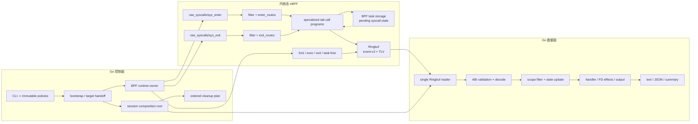

# strace-go 当前架构

本文档描述 `strace-go` 当前生效的运行时架构、所有权、协议和验证契约。它是架构评审的权威入口；CLI 兼容边界见 [`cli-compatibility.md`](cli-compatibility.md)。

历史迁移计划、逐 syscall 落地记录和旧性能实验由 Git 保存；需要追溯时使用：

```bash
git show b2c0609:arch.md
```

文档基线日期：2026-09-01。

## 1. 产品契约

`strace-go` 只有一条产品路径：纯 eBPF syscall tracing。

必须保持的契约：

- 不在运行期使用 `ptrace`、`process_vm_readv`、`/proc/<pid>/mem` 或 `/proc/<pid>/fd*` 读取 tracee 状态。
- 用户内存只能在 BPF probe 现场做有界快照；Go 侧只解码事件已经携带的数据。
- syscall、payload 和生命周期事件通过同一个 Ringbuf 流进入 Go。
- Go 侧只有一个同步事件消费者；状态更新、handler 和输出按该事件序列执行。
- payload 截断、Ringbuf reserve/copy failure、pending 异常和生命周期 map 错误必须可观测。
- 输出追求 `strace`-like 体验，但不伪装成 ptrace 等价实现。

明确不承诺：

- ptrace 冻结点上的任意深度、任意长度内存读取。
- 跨任务 trace 输出与目标 stdout/stderr 的严格交错。
- 完整 signal-delivery-stop、restart、注入和 syscall 修改语义。
- 有限 Ringbuf 在任意无限压力下绝对无损。
- 所有 upstream `strace` 测试逐字节通过。

## 2. 总体架构



数据路径是：

```text
probe-site bounded snapshot
    -> event-v2/TLV Ringbuf record
    -> one synchronous Go consumer
    -> correlation/lifecycle state
    -> syscall handler and side effects
    -> text, JSON or summary output
```

## 3. 运行时所有权

### 3.1 控制面

`runTraceSession` 是进程级错误边界，依次完成 BPF runtime、Ringbuf reader、trace target、输出和 session 的构建。所有可失败资源都先注册到 cleanup plan，再发生 ownership handoff。

`traceSessionDeps` 是 session composition 边界。CLI 在进入该边界前被投影成不可变 policy；事件循环不会持有或修改原始 CLI options。

| Owner | 拥有内容 | 生命周期与并发规则 |
| --- | --- | --- |
| `traceBPFRuntime` | core/handler collections、maps、links、stats 读取端口 | bootstrap 创建，cleanup 关闭 |
| `traceTargetRuntime` | 目标命令和唯一 `exec.Cmd.Wait` 结果 | 可用一个 wait goroutine，只发布 completion |
| `TraceOutput` | stderr/file/pipe、同步缓冲、最终 flush | handoff 给 session，finalizer 关闭 |
| `traceSession` | immutable policies 和完整事件 pipeline | 第一条事件前一次性组装 |
| `TraceEventReader` | 唯一 Ringbuf reader/decoder/sink 链 | 仅由 session event goroutine 调用 |
| `TraceState` | syscall、unfinished、lifecycle、attach 领域状态 | 仅由事件消费者修改，无锁 |
| `FDStateStore` | event-sourced FD/path/offset/cloexec 状态 | 仅由事件消费者修改，无锁 |

### 3.2 并发模型

允许的异步边界只有资源加载/关闭和目标等待；它们不能消费事件或修改 syscall 状态。

事件主循环保持同步：

```text
TraceEventReader.Read
    -> ringbuf.Reader.ReadInto
    -> decoder.Decode
    -> sink.Handle
    -> state / handler / output
```

reader 可以利用 `ringbuf.Record.Remaining` 做有界批量读取，但不会并行派发记录。当前批量上限属于调度参数，不改变单消费者契约。

选择单消费者的原因：

- Ringbuf 顺序直接成为状态更新顺序。
- enter/exit、fragment、fork/exec 和 FD 继承不需要额外锁或 sequencer。
- unfinished/resumed 和文本输出顺序可以在一个 owner 内决定。
- payload 可以在同步调用链中借用 Ringbuf record 内存，避免无条件复制。

代价是慢 handler 或慢输出会直接形成消费背压。除非分阶段指标证明持续吞吐受 Go 消费端限制，否则不引入多消费者分片。

## 4. 内核态架构

### 4.1 BPF collection

BPF 对象按职责拆分：

- core collection 拥有共享 maps、raw syscall dispatcher 和 lifecycle programs。
- enter generic/payload/path/memory/control/structured、exit 和 recvmsg 等 handler family 使用独立 collection。
- handler collection 通过 map replacement 共享 core maps；ELF 私有数据仍由各 collection 自己拥有。
- handler specs 可以并行加载；真正需要的程序由 route closure 选择。FD/path state 需要保守覆盖时可以扩大选择集合。

拆分 collection 的目标是隔离 verifier、加载时间和资源 ownership，而不是创建多条事件路径。所有 collection 最终仍写入同一个 Ringbuf 和同一组运行时状态 maps。

### 4.2 syscall dispatcher 与 tail-call

raw syscall 路径只挂两个 dispatcher：

- `trace_sys_enter` 挂载 `raw_syscalls/sys_enter`。
- `trace_sys_exit` 挂载 `raw_syscalls/sys_exit`。

dispatcher 只负责：

1. 读取 PID、TID 和 syscall ID。
2. 检查 task、pre-exec、syscall 和 FD-state filter。
3. 以 syscall ID 查询 `enter_routes` 或 `exit_routes`。
4. tail-call 到专项程序。
5. 缺槽或 tail-call 失败时发送 bounded minimal fallback。

专项程序由 family `PROG_ARRAY` 组织。iovec、msg、mmsg、AIO、recvmsg、嵌套 FD path 等复杂 payload 可以继续 tail-call 到有界 fragment；每条链必须明确最终事件和 pending state 的唯一消费 owner。

Go 的 route capability registry 决定每个 syscall 的 enter/exit family。BTF 只提供签名，不推导 path、IN/OUT、nested pointer 或 xlat 等产品捕获语义。

### 4.3 核心状态

| 状态 | 类型 | 用途 |
| --- | --- | --- |
| `events` | `BPF_MAP_TYPE_RINGBUF` | 唯一生产事件流 |
| `pending_task_storage` | `BPF_MAP_TYPE_TASK_STORAGE` | 当前 task 的 enter 元数据和辅助状态 |
| `enter_routes`, `exit_routes` | `BPF_MAP_TYPE_PROG_ARRAY` | syscall ID 到 family 程序的直接路由 |
| family prog arrays | `BPF_MAP_TYPE_PROG_ARRAY` | 专项 handler 和 fragment 链 |
| task/filter maps | Hash/Array | attach、follow-fork、pre-exec 和 syscall filtering |
| lifecycle maps | Hash/Task state | exec identity、attach completion 和清理事实 |
| stats | Per-CPU array | reserve/copy/truncate/pending/lifecycle 诊断 |

task storage value 只保存 enter 墙钟时间、task CPU runtime 快照、参数、PID/TID、syscall ID、stack ID 和少量辅助状态；不保存大 payload 或完整输出事件。exit 消费完成后清除有效标记，task 销毁时 storage 由内核回收。

### 4.4 捕获规则

所有用户内存读取都发生在 syscall 对应的 probe 时点：

- path、buffer、struct 和 nested arrays 使用独立的固定上限。
- IN payload 在 enter 捕获，OUT payload 在成功 exit 捕获。
- copied length 小于 user length 时设置 truncation 标志并累计统计。
- probe read 失败时保留地址、长度和错误信息；Go 不进行二次读取。
- 复杂 payload 可以分 fragment 发送；Go 按 TID、syscall 和方向合并。
- 未专项支持的 syscall 仍发送 args/ret、墙钟 duration 和 task CPU duration，不伪造结构内容。

### 4.5 生命周期

fork、exec、exit 和 task-free tracepoint 是一等事件，用于：

- 继承或解析 tracked task 身份。
- 处理 non-leader exec 和线程组收缩。
- 更新 attach completion。
- 清理用户态 pending/unfinished/task state。
- 维护 event-sourced FD/cwd 状态继承。

attach 可能观察到没有 enter 的首个 exit。该事件不会伪造配对，而是计入 `orphan_exit`；文本和 JSON 只按各自诊断策略暴露事实。

## 5. Event-v2 与 TLV ABI

### 5.1 协议布局

wire format 使用 little-endian。当前固定长度为：

| 结构 | 长度 |
| --- | ---: |
| event-v2 header | 80 bytes（56-byte legacy header 仍可解码） |
| syscall enter body | 72 bytes |
| compact enter body | 48 bytes |
| syscall exit body | 88 bytes |
| lifecycle body | 56 bytes |
| TLV header | 32 bytes |

header 包含 version、event type、flags、header length、record size、PID、TID、syscall ID、per-CPU `seq`、monotonic timestamp、CPU ID、producer loss epoch 和首次异常时间。`seq` 在 logical emission attempt 的 Ringbuf reserve 前分配，仅用于检测每 CPU 的事件缺口，不建立全局排序；56-byte legacy header 的 `seq=0` 不参与完整性判断。完整 taint/recovery 语义见 `doc/event-integrity.md`。

TLV section 描述：

- kind：string、bytes、struct、iovec、sockaddr、exec args、cmsg、FD state、FD path 等。
- arg index 和 IN/OUT direction。
- user pointer、user length、copied length 和 probe result。
- section-specific bounded data。

### 5.2 ABI ownership

`cmd/generate-event-abi/spec.go` 是 C/Go 公共常量、长度和字段偏移的唯一生成输入：

- C 输出写入 `bpf/event_abi_generated.h`。
- Go 输出写入 event ABI generated 文件。
- `bpf/runtime_abi.h` 使用 `_Static_assert` 检查 C 结构大小和偏移。
- Go decoder 校验 version、type、header length、record size、capture length 和 TLV framing。

未知 event version/type、非法长度或未知 TLV kind 都是 invalid record；不能静默猜测新格式。

修改 ABI 时必须先改 generator spec、同步生成 C/Go 输出、增加 decoder failure tests，再重新生成全部 BPF objects。

### 5.3 捕获编排 ownership

`cmd/generate-capture-manifest/` 是捕获编排的唯一事实源。它只描述稳定的 slot、ELF program symbol、handler family、syscall enter/exit route、standalone-exit-elision、tail-call 依赖和辅助 program roots；不描述具体 payload 算法、参数位置或 IN/OUT 捕获分支。

生成结果为：

- `bpf/capture_manifest_generated.h`：C enum 与 ProgArray/route map 容量。
- `cmd/strace-go/bpf_capture_manifest_generated.go`：Go slot、program catalog、route capability、依赖图和辅助 roots。

`generate-capture-manifest -check` 和 generator drift test 阻止手工产物漂移。运行时 selection 只遍历生成依赖图并用 visited-set 去重；未知引用、错误 ProgArray 方向、不可直接路由的 fragment 和依赖环由 generator 拒绝。payload capture、handler registry 和 event traits 继续由各自 owner 明确维护。

### 5.4 payload 内存所有权

decoder 默认返回借用 Ringbuf record 的 payload section。同步 pipeline 可以直接读取；只有 deferred exit、跨记录 fragment 或 pending enter 等跨调用生命周期状态才复制到 recycler 管理的 storage。

任何新增缓存都必须明确：

- 谁拥有底层 bytes。
- 生命周期是否越过下一次 Ringbuf read。
- finalization、lifecycle cleanup 和错误路径如何释放。

## 6. Go 事件数据面

### 6.1 路由顺序

一条记录依次经过：

1. ABI decoder。
2. trace scope admission。
3. `TraceState` 更新。
4. lifecycle 或 syscall dispatcher，并构造 event context。
5. path/status/output policy 与 handler decode plan。
6. JSON/text/summary 输出。
7. FD、offset、close 和 lifecycle side effects。
8. payload storage release。

composition time 会预建 handler registry、syscall-ID dispatch table、decode plan、metadata table 和 event traits，避免在高频路径重复做字符串或 map 分类。

### 6.2 TraceState 领域 owner

`TraceState` 是协调者，不直接把所有状态混成一张 map：

| Domain owner | 职责 |
| --- | --- |
| syscall correlation | enter/exit/fragment 配对和 deferred exit |
| unfinished output | `<unfinished ...>` / `<... resumed>` 候选与状态 |
| task lifecycle | task identity、fork/exec/exit/free |
| attach state | attach target 完成和退出事实 |

状态更新先产生 `TraceStateUpdate`，输出和 FD side effect 再消费该快照。这样 state owner 不直接依赖 renderer、handler 或具体输出格式。

同一 TID 的 exit 如果先于完整 enter 被 Go 观察，可以进入有界 deferred slot；后续只有身份匹配的 enter 才能补配。lifecycle 清理残留，不使用 timer、ptrace 或用户态 tracee 内存。

### 6.3 handler 与输出

handler registry 是 session-local：

- package builtin 只作为不可变注册源。
- session clone、ID dispatch table 和 decode plan 在 composition 阶段建立。
- handler context 只暴露 snapshot、metadata、FD state 和明确的 runtime services。
- handler 不能获得 tracee memory reader。

输出分为：

- text：strace-like 行、unfinished/resumed、exit status、hexdump 和 stack address。
- JSON：稳定的 event/version/flags、paired enter、payload sections 和 runtime stats。
- summary：syscall 次数、错误以及独立的 task CPU/wall-clock duration 聚合；默认时间列用 CPU，`-w` 和 `wall-*` 用墙钟。
- diagnostic-only modes：用于 reader、handler、discard 和分阶段性能测量，不是第二产品模式。

### 6.4 FD、cwd 与 path

FD state 完全由已观察事件维护：

- creator、dup、close、close_range、fcntl、chdir、fork、exec 等事件更新状态。
- BPF 可以在 probe 现场携带 FD identity、offset 和 bounded path TLV。
- command 启动只使用确定性的 cwd inheritance seed。
- attach 前已存在且从未出现在事件中的 FD/cwd 保持 unknown。
- snapshot 缺失时输出裸 FD、指针或已知旧状态，不查询 procfs 制造伪精确结果。

`FDStateStore` 是独立 owner，供 path filter、handler 和 final side effect 通过窄接口读取或更新。

## 7. 生成链

| 生成器 | 输入 | 输出与职责 |
| --- | --- | --- |
| `generate-capture-manifest` | Go-native capture manifest | C/Go slot、program catalog、route capability、依赖图和辅助 roots |
| `generate-event-abi` | checked-in ABI spec | C/Go event-v2、config 和 TLV 常量 |
| `generate-syscalls` | `x/sys/unix` syscall numbers、BTF、tracepoint format、checked-in semantic catalog | syscall ID/name/signature/traits metadata |
| `generate-xlats` | `strace-upstream` xlat sources | enum/bitflag translation tables |
| `bpf2go` | core 与 handler-family C translation units | embedded BPF ELF 和 typed Go bindings |

生成原则：

- syscall ID/name 来自本机 ABI source，不由 upstream reference 决定。
- BTF/tracepoint 决定基础签名；显式 semantic override 必须有理由和测试。
- syscall-specific capture policy 保留为可审查的 BPF C 代码，不尝试从 BTF 自动推导。
- 生成文件不直接编辑；普通 `go build` 使用 checked-in artifacts。
- `build.sh` 的完整生成依赖 root、tracingfs、clang、系统头和宿主内核能力。

## 8. 验证架构

### 8.1 分层门禁

| 层级 | 主要证明内容 |
| --- | --- |
| Go unit/race/vet | decoder、state、handler、ownership、并发与格式化 |
| source/AST contracts | no-ptrace/no-procfs、单消费者、owner、route/slot 和生成边界 |
| BPF verifier/load | collection、map replacement、tail-call route 和 helper 能力 |
| `ebpf-semantic` | 真实 enter/exit、payload、lifecycle 和结构化 oracle |
| `ebpf-no-ptrace` | 独立目标实际观察 `TracerPid: 0` |
| capability suites | 环境依赖的 BPF command success/failure 边界 |
| capture suites | producer/read/decode/route/drop 对账和 record 完整性 |
| perf suite | 热窗口吞吐、端到端成本、阶段耗时和 Go allocation |
| upstream reference | 选定 syscall 的 exact output 参考与声明 XFAIL |

源码门禁用于保护产品边界，不应替代行为测试。等价重构如果只因文件名或字符串 token 失败，应优先把门禁提升为 AST、生成一致性或运行时 oracle。

### 8.2 背压契约

有限 Ringbuf 的正确性定义是：

```text
producer attempts
    = records read
    + observable reserve failures
    + explicitly classified producer failures
```

并同时要求：

- invalid record 为零。
- copy、pending、mismatch、lifecycle 和 stale 错误分别计数。
- 固定主门禁 workload 可以要求零丢失。
- 长压 workload 允许 reserve failure，但必须对账闭合且 record 不损坏。

不能通过扩大超时、忽略 stats 或只看最终 event/s 掩盖事件损失。

### 8.3 性能口径

性能报告必须分开：

1. `trace_exit_events_per_sec`：目标实际 trace window 内的热路径吞吐。
2. end-to-end events/s：包含 spec/load、attach、target、drain、render 和 cleanup。
3. Ringbuf accounting：attempt/read/reserve/copy/invalid/drop。
4. error counts：pending、orphan、mismatch、lifecycle、stale 和 output error。
5. Go allocation：reader、handler、text 和 JSON pipeline benchmark。

2026-08-22 的同机审计中，热窗口约为 scalar `28k/s`、IO `18k/s`、threads `15~16k/s`，Go 主 pipeline benchmark 为 `0 B/op, 0 allocs/op`；这些是带日期的基线，不是跨机器 SLA。短命令端到端值显著更低，主要来自固定 setup/drain/cleanup 成本。

## 9. 安全与可移植性

### 9.1 权限与数据

- BPF load、attach 和相关 tests 通常需要 root 或宿主允许的最小 capabilities。
- trace output 本身可能包含路径、参数和 payload，必须视为敏感数据，不进入普通应用日志。
- filter 应尽可能在 BPF 下推，减少无关进程数据进入 Ringbuf。
- 任何结构化输出都必须使用现有 encoder，不拼接未经转义的外部文本。

### 9.2 内核与架构能力

运行时依赖 BTF、Ringbuf、task storage、dynptr 和相应 tracing helpers。README 不用单一内核版本号代替真实能力；加载错误和 capability suite 是最终判断。

当前正式生成和验证目标是 Linux amd64 与 arm64 的 native 64-bit ABI。两者都使用
little-endian `bpfel`；这不代表 syscall number、UAPI struct layout、semantic
catalog 或 upstream reference 可以跨架构复用。CO-RE 只处理内核 BTF relocation，
compat ABI 和 architecture-specific ioctl 仍必须单独确认。

## 10. 已知限制与技术债

以下是当前需要继续治理的结构性问题，不是已批准的兼容 fallback：

### P0：捕获编排事实源（已解决）

捕获 slot、C/Go program symbol、route capability、tail-call closure、standalone-exit-elision 和 `recvmsg`/`sendmmsg` 辅助 roots 已收敛到 `cmd/generate-capture-manifest/` 的 Go-native manifest。C/Go 产物由 generator 生成并纳入 `-check` 漂移门禁；运行时不再保留手写 route/catalog/switch 第二轨。

维护边界保持明确：manifest 只维护捕获编排稳定事实；具体参数位置、probe 时点、payload variant、emit/capture 分支继续在 BPF C 中显式维护；Go handler registry 与 event traits 不并入 manifest。新增或调整捕获路由时只修改 manifest 输入，运行 `go run ./cmd/generate-capture-manifest -check` 和相关行为测试。

### P1：FD state 存储布局

当前 FD/path/offset/cloexec 使用字符串形式的 `pid:fd` key；fork 继承和 process cleanup 需要按 PID 前缀扫描多张 map。

演进方向：使用结构化 key 或 per-process bucket，并增加 `-y/-yy/-P`、fork 和 FD storm benchmark。event-sourced ownership 不改变。

### P1：Ringbuf 默认容量

当前 Go 默认把 event Ringbuf 配置为 512 MiB，以吸收高频 burst。大默认值提高了受限容器、低 memlock 和多实例环境的资源成本，也可能掩盖短时消费停顿。

演进方向：提供明确配置和启动诊断，以 burst、持续过载、慢输出和多实例 workload 做容量 A/B；不把扩容当作消费不足的唯一修复。

### P1：接口和源码门禁密度

composition 和领域 owner 的窄接口是有价值的，但部分单实现内部 port、constructor 参数和源码 token gate 增加导航成本。

演进方向：保留系统边界和可替换资源接口；对纯内部、无替换需求的接口逐项审查。核心边界使用 AST/行为/生成合同，减少文件名和字符串耦合。

### P2：完整生成的宿主耦合

`make generate-bpf ARCH=amd64|arm64` 使用目标明确的 bpf2go 入口、项目头和目标
syscall metadata，不依赖散落的 host libc multiarch include path。完整 BPF 生成仍
依赖 root、当前 BTF/tracingfs 和 clang；checked-in artifacts 解决普通构建，不等于
跨主机完全可复现加载。`cmd/generate-xlats` 仍是共享 xlat 的 host-header 生成器，
目标相关的实际差异由 `pkg/meta/native_xlat_<arch>.go` 覆盖，不能把它的宿主执行
结果当成 ARM64 native runtime 证据。

演进方向：记录 capability matrix，隔离 host-derived inputs，并对生成差异做明确审查；不静默使用旧或伪造 metadata。

## 11. 关键架构决策

| 决策 | 选择 | 被拒绝的替代方案 | 原因 |
| --- | --- | --- | --- |
| 产品路径 | 纯 eBPF | compat/fast 双模式 | 避免两套时序、错误和 ownership 语义 |
| 用户内存 | probe-site bounded snapshot | Go 侧 ptrace/procfs/process-vm 补读 | 避免 TOCTOU 和 tracee 停顿 |
| raw syscall attach | enter/exit 各一个 dispatcher | 多程序 fan-out | 降低全局 syscall 探针成本 |
| 专项捕获 | tail-call family/fragment | 单巨型 verifier 程序 | 隔离复杂 payload 与 verifier 风险 |
| enter 状态 | BPF task storage | 大 event Hash Map | 小状态、task 生命周期一致、低复制 |
| Go 消费 | 单同步消费者 | 按 TID/TGID 并行分片 | 保持全局顺序和无锁状态 ownership |
| FD/path | event-sourced snapshot | event-time procfs 查询 | 保持 syscall 时点与保守 unknown |
| ABI | generator + static assertions | C/Go 手工双写 | 防止 wire layout 漂移 |
| Ringbuf 压力 | 丢失可观测、对账闭合 | 宣称无限无损 | 有限资源的可验证契约 |
| BPF 装载 | core + handler collections | 单一超大 collection | verifier、load 和 ownership 隔离 |
| 性能报告 | 热窗口与端到端分离 | 单一 events/s | 避免固定生命周期成本误导热路径判断 |

改变上述决策必须新增或更新 ADR，并给出替代方案、迁移边界和真实验收证据；不能以临时兼容分支长期保留双轨。

## 12. 架构变更检查表

### BPF capture 或新 syscall

- route capability、program slot、handler 和 payload direction 是否一致？
- IN/OUT 是否在正确 probe 时点捕获？
- reserve、probe failure、truncation 和 tail-call failure 是否可观测？
- pending state 是否只有一个消费 owner？
- 是否提供 happy、failure、boundary 和真实 semantic fixture？

### Event ABI

- 是否从 generator spec 修改，而不是编辑生成文件？
- C static assertions、Go decoder failure tests 和 bpf2go artifacts 是否同步？
- borrowed payload 是否越过 Ringbuf record 生命周期？
- unknown version/type/kind 是否明确失败？

### Go pipeline

- 新状态由哪个 domain owner 持有？
- 是否引入第二事件消费者、隐藏 goroutine、mutex 或全局可变状态？
- handler 是否只读取 snapshot 和 session ports？
- FD/output side effect 是否位于 pipeline boundary？

### 性能与验证

- 是否先跑 focused test，再跑 Go gate 和真实相关 suite？
- 是否分别报告热窗口、端到端、Ringbuf accounting、错误和 allocation？
- 是否清理残留 tracer/BPF links 后再做 A/B？
- upstream 失败属于实现回归、bounded snapshot、ptrace-only 还是 environment-blocked？

## 13. 代码地图

| 主题 | 权威位置 |
| --- | --- |
| 进程 bootstrap 与 cleanup | `cmd/strace-go/main.go`, `trace_cleanup.go` |
| session composition | `cmd/strace-go/session_composition.go` |
| 单消费者循环 | `cmd/strace-go/session_run.go`, `event_reader.go` |
| event decoder | `cmd/strace-go/trace_event_v2_decoder.go` |
| 状态 owner | `cmd/strace-go/event_state*.go` |
| capture manifest 与生成合同 | `cmd/generate-capture-manifest/`, `bpf/capture_manifest_generated.h`, `cmd/strace-go/bpf_capture_manifest_generated.go` |
| syscall route 与 selection | `cmd/strace-go/bpf_routes.go`, `bpf_program_selection.go` |
| BPF collection ownership | `cmd/strace-go/bpf_collection*.go`, `bpf_handler_collections.go` |
| core dispatcher | `bpf/strace.c` |
| runtime ABI 与 maps | `bpf/runtime_abi.h`, `runtime_stats.h` |
| tail-call handlers | `bpf/enter_dispatch.h`, `exit_dispatch.h`, `*_dispatch.h` |
| event ABI generator | `cmd/generate-event-abi/` |
| capture manifest generator | `cmd/generate-capture-manifest/` |
| syscall metadata generator | `cmd/generate-syscalls/` |
| handler registry/decoder | `pkg/handler/` |
| xlat 与 syscall metadata | `pkg/meta/` |
| runtime/semantic/perf tests | `test/run_tests.py`, `test/ebpf_*` |

架构事实优先级：生产源码和生成合同 > 机器化测试 > 本文档 > 历史提交说明。发现不一致时，应先确定实现是否符合产品契约，再在同一小提交中修复代码或文档。
